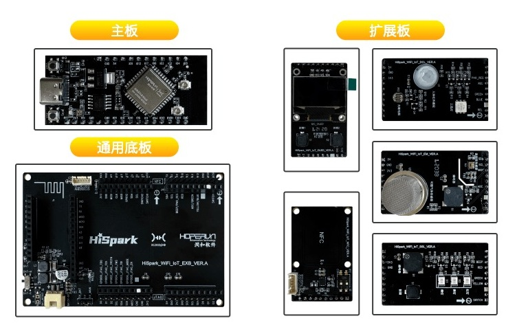
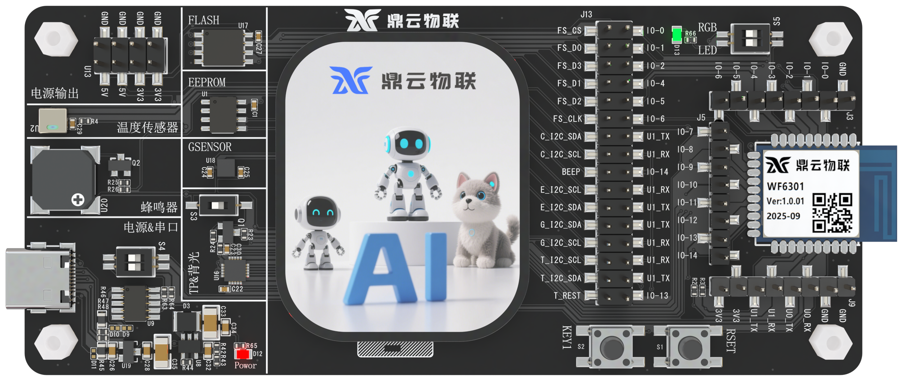
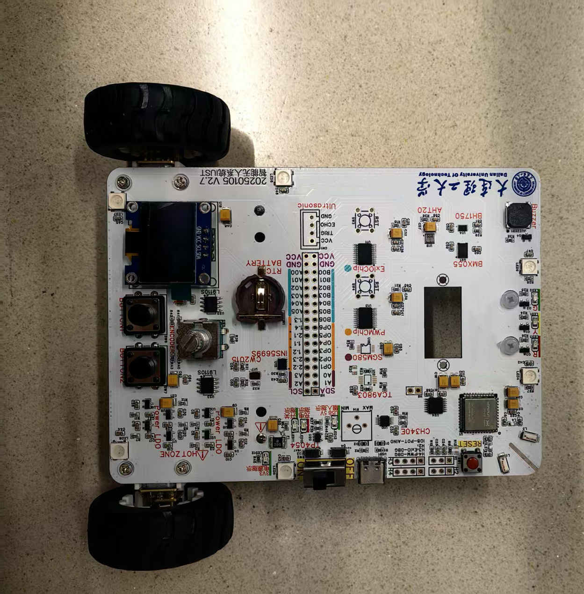
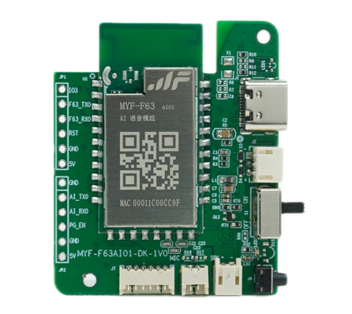
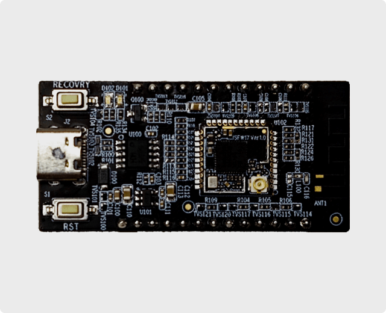
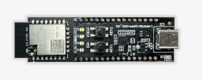
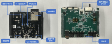

# fbb_ws63开发指南

## 代码仓介绍

  ws63系列是2.4GHz Wi-Fi 6 星闪多模解决方案，其中ws63E支持2.4GHz的雷达人体活动检测功能，适用于大小家电、电工照明及对人体出没检测有需求的常电类物联网智能场景。该fbb_ws63代码包从统一开发平台FBB（Family Big Box，统一开发框架，统一API）构建而来，在该平台上开发的应用很容易被移植到其他星闪解决方案上，有效降低开发者门槛，缩短开发周期，支持开发者快速开发星闪产品。软件文档在线化链接：https://docs.hisilicon.com/repos/fbb_ws63/zh-CN/master/  

## 目录介绍

| 目录   | 介绍                                                         |
| ------ | ------------------------------------------------------------ |
| docs   | 存放软件资料手册、IO复用关系表、用户指南手册，帮助用户快速了解WS63系列 |
| src    | 开发接入SDK源码包，用户基于源码进行二次开发                  |
| tools  | 开发工具及环境搭建指南文档，帮助用户搭建开发环境             |
| vendor | 存放合作产商的开发板硬件和软件资料，包含案例代码、硬件原理图、案例开发指南文档 |

## 软件资料介绍

| 名称                                                         | 介绍                                                         |
| ------------------------------------------------------------ | :----------------------------------------------------------- |
| [WS63系列用户指南.pdf](https://hispark-obs.obs.cn-east-3.myhuaweicloud.com/WS63%E7%B3%BB%E5%88%97%E7%94%A8%E6%88%B7%E6%8C%87%E5%8D%97.pdf) | 本文档主要介绍WS63系列的各项基本功能，为用户提供WS63系列的功能描述、应用场景、应用配置方法等。备注：本文档来源于云汉芯城，地址：https://www.ickey.cn/detail/1003001013187550/Q353333N1100.html# |
| [WS63系列硬件用户指南_04.pdf](https://hispark-obs.obs.cn-east-3.myhuaweicloud.com/WS63%E7%B3%BB%E5%88%97%E7%A1%AC%E4%BB%B6%E7%94%A8%E6%88%B7%E6%8C%87%E5%8D%97_04.pdf) | 本文档主要介绍 WS63系列的封装管脚信息、电气特性参数、原理图设计建议、PCB 设计建议、热设计建议、焊接工艺、潮敏参数、接口时序、注意事项等内容。 |
| [SDK软件在线系列文档](https://docs.hisilicon.com/repos/fbb_ws63/zh-CN/master/) | 该系列文档主要包括IO复用关系表、 AT命令使用、 CJSON 开发流程、HTTP开发流程、MQTT 开发流程、 NV存储开发流程、设备驱动开发流程、SLE/BLE开发流程、API接口等文档，文档路径存放于docs/software |
| [开发环境搭建指南](tools/HiSparkStudio插件版编译及烧录.md)   | 主要包括windows系统编译工具搭建、SDK包下载，Linux系统编译工具搭建及SDK包下载，建议使用HiSparkStudio插件版编译烧录，路径：tools |

## 购买渠道

|      硬件资料      | 介绍                                                   | 购买链接二维码   |
| :------------: | :----------------------------------------------------------: | :-----------: |
| [购买链接](https://www.ickey.cn/detail/1003001013187550/Q353333N1100.html) |                    云汉芯城的WS63芯片，采用WS63解决方案                    |  |
| [购买链接](https://www.ickey.cn/detail/1003001013187551/Q353333N1100E.html) |              云汉芯城的WS63E芯片，采用WS63E解决方案 |  |
| [模组：购买链接](https://gitee.com/link?target=https%3A%2F%2Fitem.taobao.com%2Fitem.htm%3Fid%3D821194904380) |     深圳四博智联科技有限公司的星闪模组，采用WS63解决方案，支持WiFi6，硬件无天线、邮票孔     |                                                              |
| [模组：购买链接](https://gitee.com/link?target=https%3A%2F%2Fitem.taobao.com%2Fitem.htm%3Fid%3D823544936579) |          深圳四博智联科技有限公司的星闪模组，采用WS63解决方案，支持星闪WiFi6模组，硬件支持板载天线和外置天线          |                                                              |
| [模组：购买链接](https://gitee.com/link?target=https%3A%2F%2Fitem.taobao.com%2Fitem.htm%3Fid%3D820900594332) |          深圳四博智联科技有限公司的星闪模组，采用WS63解决方案，硬件支持板载天线和外置天线          |                                                              |
| [烧录器：购买链接](https://holdiot001.feishu.cn/docx/L60wdrG7Fo314pxYyrbczZqVnSb) |                 烧录器：可烧录开发板、模组等                 |                                                              |
| [模组：DyCloud_WF6301星闪模组](https://ic-item.jd.com/10151639839211.html) |                           鼎云物联的星闪模组采用WS63解决方案                           |                                                              |
| [模组：WS63星闪模组](https://e.tb.cn/h.6LxYtgOmQL5b51S?tk=jkprVTA5bOC) |           润和软件的星闪模组，基于WS63解决方案           |                                                              |
| [模组：WS63E星闪模组](https://e.tb.cn/h.6p0TonQdm3whw0i?tk=ZjcNVTAUwUG) | 润和软件的星闪模组，基于WS63E的解决方案，支持雷达人体活动感知 |                                                              |
| [模组：MYF-F63星闪模组链接 ](https://shop187806465.taobao.com/?spm=pc_detail.29232929.shop_block.dshopinfo.2fd27dd6T64Lbi) |             明裕丰的星闪模组、开发板，采用WS63解决方案             |                                                              |
| [模组：KHM-3863A 星闪模组购买链接](https://mall.kaihong.com/productDetail?skuId=1839224386385612801&goodsId=1839224386133954561) | 深开鸿的星闪模组，采用WS63解决方案，支持星闪、WiFi、蓝牙三模SoC通信，支持AT指令及OpenCPU二次开发，支持KaihongOS Lite版本及星闪链路软总线特性等 |                                                              |

**免费样片申请活动：[活动链接](https://developers.hisilicon.com/active?activity_id=4112f69ad3c0430fb1d488da2616aa7f&channelCode=hispark)**

模组产品均由相应厂家自行销售，由其对产品质量负责，如侵犯他人知识产权的由其自行承担全部责任及赔偿。海思不提供任何保证及担保，亦不承担责任及赔偿。

## 支持的开发板

| 开发板介绍                                                   | 购买链接                                                     | 开发板图片                                                   |
| ------------------------------------------------------------ | ------------------------------------------------------------ | :----------------------------------------------------------- |
| [HiHope_NearLink_DK3863E_V03（润和软件）](https://developers.hisilicon.com/postDetail?tid=0224176485045269005) | [润和软件HiHope_NearLink_DK3863E_V03开发板（淘宝）](https://e.tb.cn/h.TyIdVOFouZyhA23?tk=vPA6eoh0e0u) [润和软件HiHope_NearLink_DK3863E_V03开发板（京东）](https://ic-item.jd.com/10150874487392.html) |  |
| [HH-D111 WS63E星闪开发板 （润和软件）](vendor/HH-D111/doc/README.md) | [润和软件HH-D111 WS63E星闪开发板](https://e.tb.cn/h.i1C1ka77dE8lkyL?tk=oUaQUtktjaR) |  |
| [BearPi-Pico_H3863（小熊派）](https://developers.hisilicon.com/postDetail?tid=0268176458526990002) | [小熊派BearPi-Pico_H3863开发板（淘宝）](https://item.taobao.com/item.htm?id=821386760379) |  |
| [华清远见WS63星闪开发板](https://developers.hisilicon.com/postDetail?tid=0268176456950600001) | [华清远见WS63星闪开发板（淘宝）](https://item.taobao.com/item.htm?id=892481769813) [华清远见WS63星闪开发板（京东）](https://ic-item.jd.com/10152445103343.html) |  |
| DyCloud_WF6301_DK开发板（鼎云物联）                          | [DyCloud_WF6301_DK开发板（京东）](https://ic-item.jd.com/10151635371214.html) |  |
| DTU_Car(大连理工大学)                                        | **暂不提供**                                                 |  |
| MYF-F63VA01开发板（明裕丰）                                  | [MYF-F63VA01星闪开发板 （淘宝）](https://item.taobao.com/item.htm?id=893223665987&pisk=gY0KqOj-Xdvh363LsX-GqErLqXAGvhce6vlfr82hVAHtKRbkTyxzyYetUJq3RXYSIvcXTJxyYYHtNjdP-prkybGqpJqoyb78NbMyT8AejXlUzz9Dn8LmTXPGt7LZJMw1CfPbOgtgAPu1ecJDnEYDA1aJpKDkpMF95SFbPWZ7NfOTN7N7PuwI1CF7Z9s5RYO967N4N7N5RlT_gWa5FMwQflN7igsCAa6667y_FzaSFPOTav899R5Q9an2l8zEWdHdPagT9ltiORMSUQVUvGc3Ca9jWWe4hXwOPawYpc8o6Xvduf4E1xFmKF_KHjuZB5MXydUrQ0M7wATVEyomLqrt_n_s9yeacSg6NZwoJccbBrCWRfULpog3DEdxhfhSml3MGEzLRJiu8bfvKf3KKXutZ_s_JymTD2UXu9wojj38w4JyWxhq7AFshUpC4b0mkmrVn-FlACdO4grQ_Ib8HaXdiABQ6-AQAgSzq5PTnCINVg6WE5eDsGjP4lDd.&spm=tbpc.mytb_followshop.item.goods) |           |
| MYF-F63AI01开发板（明裕丰）                                  | [MYF-F63AI01星闪AI语音开发板（淘宝）](https://item.taobao.com/item.htm?id=922405424292&pisk=g4nmjMYvfqzfWqd8y0ZX8yE11r8RGoZ_sfIT6lFwz7P5DfEYXuWzL-PN75yN44DIsSp6lo3usblugfD6hRPZ_fVtkUKKhxZ_bBIMvHHjYF3Wfj2Nb8JaIJW2erusFujzbBdpvaBzlIEZ6N5BuT7zd7y4QP72EzyTIlW4QfPzzJydgllZ_8rzBJ5VbiyaauP7nRya_lSzUR2UQtzZ_YJuQ7PabrlZUvdvuSiZ40R8VjPaz8yZq-40TYYCbGqfvrPUh7SwT0e0OWk4ZGSat5OoMYDviMM8cYl3pjKPmXDIVb2rThAufbgZ_RcyA1EjJjiQrYTF4xq0NyyE4dSU6m0-L7qhQnkumS4EDyxHKXkoQ2Uo2p-QmoPqWoMOKIHomjHjqABNzoqxrym0YH1464HnjRm613cnd0GuUX-MgguAzw56TGwyB0715ry7EWU4j2Svt67QLLvl8da4F-NpELb6Mry7ENvkEwqbu8wc5&spm=a21xtw.29178619.0.0) |           |
| [KHD-3863B 星闪开发板（深开鸿）](https://mall.kaihong.com/productDetail?skuId=1839195267891466241&goodsId=1839195267383955458) | [KHD-3863B星闪开发板（开鸿商城）](https://mall.kaihong.com/productDetail?skuId=1839195267891466241&goodsId=1839195267383955458) |  |
| FB36星闪开发板（利尔达）                                     | [利尔达FB36星闪开发板（淘宝）](https://e.tb.cn/h.hkidLj95hZzH1cz?tk=yzWe4W7VT4X) |  |
| FB36星闪Wi-Fi6 AI开发板（利尔达）                            | [利尔达FB36星闪Wi-Fi6 AI开发板（淘宝）](https://e.tb.cn/h.hkUwR5OhAz12Ija?tk=latG4WfuOeAtG-#22>lD) |  |

开发板产品均由相应厂家自行销售，由其对产品质量负责，如侵犯他人知识产权的由其自行承担全部责任及赔偿。海思不提供任何保证及担保，亦不承担责任及赔偿。

## 开发板资料

|               开发板名称                |                         案例开发指南                         |                          硬件原理图                          |
| :-------------------------------------: | :----------------------------------------------------------: | :----------------------------------------------------------: |
| HiHope_NearLink_DK3863E_V03（润和软件） | [润和软件开发板星闪案例开发指南](vendor/HiHope_NearLink_DK_WS63E_V03/doc/星闪实验指导手册.md) | [HiHope_NearLink_DK3863E_V03开发板硬件原理图](vendor/HiHope_NearLink_DK_WS63E_V03/doc/hardware) |
| HH-D111（润和软件） | [HH-D111 星闪开发板使用说明书](vendor/HH-D111/doc/hardware) | [HH-D111 星闪开发板原理图](vendor/HH-D111/doc/hardware) |
|       BearPi-Pico_H3863（小熊派）       | [小熊派开发板星闪案例开发指南](vendor/BearPi-Pico_H3863/doc/README.md) | [BearPi-Pico_H3863开发板硬件原理图](vendor/BearPi-Pico_H3863/doc/hardware) |
|         华清远见WS63星闪开发板          | [华清远见星闪开发板案例开发指南](vendor/Hqyj_Ws63/doc/ws63实验指导手册.md) | [华清远见WS63星闪开发板硬件原理图](vendor/Hqyj_Ws63/doc/hardware) |
|   DyCloud_WF6301_DK开发板（鼎云物联）   |                         <a href="vendor/DyCloud_WF6301_DK V1.0/doc/DyCloud_WF6301 DK 使用手册.md">DyCloud_WF6301_DK开发板案例开发指南</a>                         | <a href="vendor/DyCloud_WF6301_DK V1.0/doc/hardware">DyCloud_WF6301_DK开发板开发板硬件原理图</a> |
|          DTU_Car(大连理工大学)          | [智能小车星闪案例开发指南](vendor/DUT_Car/doc/dut_car实验指导手册.md) |    [DTU_Car开发板硬件原理图](vendor/DUT_Car/doc/hardware)    |
|        MYF-F63VA01开发板(明裕丰)        |         [MYF-F63VA01开发板指南](vendor/MYF_F63/doc)          |  [MYF-F63VA01开发板硬件原理图](vendor/MYF_F63/doc/hardware)  |
|        KHD-3863B星闪开发板(深开鸿)        |         [KHD-3863B星闪开发板介绍](vendor/Kaihong_KHD-3863B/doc/README.md)          |  [KHD-3863B星闪开发板硬件原理图](vendor/Kaihong_KHD-3863B/doc/hardware/开鸿KHD-3863B星闪开发板.pdf)  |

## 开发板示例

HiHope_NearLink_DK3863E_V03提供了以下Demo供开发参考：

<table  width="990" border="0" cellpadding="0" cellspacing="0" style='border-collapse:collapse;table-layout:fixed;'>
 <tr height="18" style='height:13.50pt;'>
  <td width="140" x:str><strong>一级分类</strong></td>
  <td width="170" x:str><strong>子分类</strong></td>
  <td width="680" colspan="6" align="center" x:str><strong>应用示例</strong></td>
 </tr>
 <tr height="18" style='height:13.50pt;'>
  <td width="140" align="center" rowspan="5" style='height:27.00pt' x:str>
<strong>基础驱动</strong></td>
  <td x:str><strong>I2C</strong></td>
  <td width="170" x:str><a href="https://gitee.com/HiSpark/fbb_ws63/tree/master/src/application/samples/peripheral/i2c">I2C组件master端案例</a></td>
  <td width="170" x:str><a href="https://gitee.com/HiSpark/fbb_ws63/tree/master/src/application/samples/peripheral/i2c">I2C组件slave端案例</a></td>
  <td width="170" x:str><a href="https://gitee.com/HiSpark/fbb_ws63/tree/master/vendor/HiHope_NearLink_DK_WS63E_V03/demo/oled">SSD1306 OLED屏幕显示“Hello World”</a></td>
  <td width="170" x:str><a href="https://gitee.com/HiSpark/fbb_ws63/tree/master/vendor/HiHope_NearLink_DK_WS63E_V03/demo/environment">AHT20模块读取当前温湿度并显示在屏幕案例</a></td>
  <td width="170" x:str></td>
  <td width="170" x:str></td>
 </tr>
 <tr height="18" style='height:13.50pt;'>
  <td x:str><strong>SPI</strong></td>
  <td x:str><a href="https://gitee.com/HiSpark/fbb_ws63/tree/master/src/application/samples/peripheral/spi">SPI组件master端案例</a></td>
  <td x:str><a href="https://gitee.com/HiSpark/fbb_ws63/tree/master/src/application/samples/peripheral/spi">SPI组件slave端案例</a></td>
  <td x:str><a href="https://gitee.com/HiSpark/fbb_ws63/tree/master/vendor/HiHope_NearLink_DK_WS63E_V03/demo/gyro">LSM6DSM模块读取横滚角、俯仰角、偏航角</a></td>
  <td width="170" x:str></td>
  <td ></td>
  <td ></td>
 </tr>
 <tr height="18" style='height:13.50pt;'>
  <td x:str><strong>UART</strong></td>
  <td x:str><a href="https://gitee.com/HiSpark/fbb_ws63/tree/master/src/application/samples/peripheral/uart">UART轮询案例</a></td>
  <td x:str><a href="https://gitee.com/HiSpark/fbb_ws63/tree/master/src/application/samples/peripheral/uart">UART中断读取案例</a></td>
  <td x:str><a href="https://gitee.com/HiSpark/fbb_ws63/tree/master/vendor/HiHope_NearLink_DK_WS63E_V03/demo/uartdemo">开发板UART自发自收</a></td>
  <td width="170" x:str></td>
  <td ></td>
  <td ></td>
 </tr>
 <tr height="18" style='height:13.50pt;'>
  <td x:str><strong>PWM</strong></td>
  <td x:str><a href="https://gitee.com/HiSpark/fbb_ws63/tree/master/src/application/samples/peripheral/pwm">PWM案例</a></td>
  <td x:str><a href="https://gitee.com/HiSpark/fbb_ws63/tree/master/vendor/HiHope_NearLink_DK_WS63E_V03/demo/beep">蜂鸣器案例</a></td>
  <td width="170" x:str></td>
  <td width="170" x:str></td>
  <td ></td>
  <td ></td>
 </tr>
 <tr height="18" style='height:13.50pt;'>
  <td x:str><strong>GPIO</strong></td>
  <td x:str><a href="https://gitee.com/HiSpark/fbb_ws63/tree/master/vendor/HiHope_NearLink_DK_WS63E_V03/demo/buttondemo">按键案例</a></td>
  <td x:str><a href="https://gitee.com/HiSpark/fbb_ws63/tree/master/vendor/HiHope_NearLink_DK_WS63E_V03/demo/led">点亮LED灯案例</a></td>
  <td x:str><a href="https://gitee.com/HiSpark/fbb_ws63/tree/master/vendor/HiHope_NearLink_DK_WS63E_V03/demo/servo">实现SG92R舵机转动-90°、-45°、0°、45°、90°</a></td>
  <td x:str><a href="https://gitee.com/HiSpark/fbb_ws63/tree/master/vendor/HiHope_NearLink_DK_WS63E_V03/demo/tricolored">实现SK6812三色灯亮绿、红、蓝三种颜色</a></td>
  <td x:str><a href="https://gitee.com/HiSpark/fbb_ws63/tree/master/vendor/HiHope_NearLink_DK_WS63E_V03/demo/ultrasonic">超声波测距</a></td>
  <td x:str><a href="https://gitee.com/HiSpark/fbb_ws63/tree/master/vendor/HiHope_NearLink_DK_WS63E_V03/demo/trafficlight">交通灯案例</a></td>
 </tr>
  <tr height="18" style='height:13.50pt;'>
  <td width="140" align="center" rowspan="5" style='height:27.00pt' x:str>
<strong>操作系统</strong></td>
  <td x:str><strong>Thread</strong></td>
  <td width="170" x:str><a href="https://gitee.com/HiSpark/fbb_ws63/tree/master/vendor/HiHope_NearLink_DK_WS63E_V03/demo/thread">线程使用案例</a></td>
  <td width="170" x:str></td>
  <td width="170" x:str></td>
  <td ></td>
  <td ></td>
  <td ></td>
 </tr>
 <tr height="18" style='height:13.50pt;'>
  <td x:str><strong>semaphore</strong></td>
  <td x:str><a href="https://gitee.com/HiSpark/fbb_ws63/tree/master/vendor/HiHope_NearLink_DK_WS63E_V03/demo/semaphore">信号量使用案例</a></td>
  <td width="170" x:str></td>
  <td width="170" x:str></td>
  <td ></td>
  <td ></td>
  <td ></td>
 </tr>
  <tr height="18" style='height:13.50pt;'>
  <td x:str><strong>event</strong></td>
  <td x:str><a href="https://gitee.com/HiSpark/fbb_ws63/tree/master/vendor/HiHope_NearLink_DK_WS63E_V03/demo/event">事件使用案例</a></td>
  <td width="170" x:str></td>
  <td width="170" x:str></td>
  <td ></td>
  <td ></td>
  <td ></td>
 </tr>
  <tr height="18" style='height:13.50pt;'>
  <td x:str><strong>message</strong></td>
  <td x:str><a href="https://gitee.com/HiSpark/fbb_ws63/tree/master/vendor/HiHope_NearLink_DK_WS63E_V03/demo/message">消息队列使用案例</a></td>
  <td width="170" x:str></td>
  <td width="170" x:str></td>
  <td ></td>
  <td ></td>
  <td ></td>
 </tr>
  <tr height="18" style='height:13.50pt;'>
  <td x:str><strong>mutex</strong></td>
  <td x:str><a href="https://gitee.com/HiSpark/fbb_ws63/tree/master/vendor/HiHope_NearLink_DK_WS63E_V03/demo/mutex">互斥锁使用案例</a></td>
  <td width="170" x:str></td>
  <td width="170" x:str></td>
  <td ></td>
  <td ></td>
  <td ></td>
 </tr>
  <tr height="18" style='height:13.50pt;'>
  <td width="140" align="center" rowspan="1" style='height:27.00pt' x:str>
<strong>星闪</strong></td>
  <td x:str><strong>SLE</strong></td>
  <td width="170" x:str><a href="https://gitee.com/HiSpark/fbb_ws63/tree/master/vendor/HiHope_NearLink_DK_WS63E_V03/demo/sle_distribute_network">SLE配网</a></td>
  <td width="170" x:str><a href="https://gitee.com/HiSpark/fbb_ws63/tree/master/vendor/HiHope_NearLink_DK_WS63E_V03/demo/sle_led">通过SLE控制LED灯</a></td>
  <td width="170" x:str><a href="https://gitee.com/HiSpark/fbb_ws63/tree/master/vendor/HiHope_NearLink_DK_WS63E_V03/demo/sle_wifi_coexist">WiFi/SLE共存</a></td>
  <td width="170" x:str></td>
  <td width="170" x:str></td>
  <td width="170" x:str></td>
 </tr>
  <tr height="18" style='height:13.50pt;'>
  <td width="140" align="center" rowspan="1" style='height:27.00pt' x:str>
<strong>BLE</strong></td>
  <td x:str><strong>BLE</strong></td>
  <td width="170" x:str></td>
  <td width="170" x:str></td>
  <td width="170" x:str></td>
  <td width="170" x:str></td>
  <td width="170" x:str></td>
  <td width="170" x:str></td>
 </tr>
  <tr height="18" style='height:13.50pt;'>
  <td width="140" align="center" rowspan="1" style='height:27.00pt' x:str>
<strong>Wi-Fi</strong></td>
  <td x:str><strong>Wi-Fi</strong></td>
  <td width="170" x:str><a href="https://gitee.com/HiSpark/fbb_ws63/tree/master/vendor/HiHope_NearLink_DK_WS63E_V03/demo/wifista">Wi-Fi STA</a></td>
  <td width="170" x:str><a href="https://gitee.com/HiSpark/fbb_ws63/tree/master/vendor/HiHope_NearLink_DK_WS63E_V03/demo/wifiap">Wi-Fi AP</a></td>
  <td width="170" x:str><a href="https://gitee.com/HiSpark/fbb_ws63/tree/master/vendor/HiHope_NearLink_DK_WS63E_V03/demo/wifidemo">Wi-Fi TCP/UDP测速</a></td>
  <td width="170" x:str></td>
  <td width="170" x:str></td>
  <td width="170" x:str></td>
 </tr>
 <tr height="18" style='height:13.50pt;'>
  <td width="140" align="center" rowspan="1" style='height:27.00pt' x:str>
<strong>TIMER</strong></td>
  <td x:str><strong>定时器</strong></td>
  <td x:str><a href="https://gitee.com/HiSpark/fbb_ws63/tree/master/vendor/HiHope_NearLink_DK_WS63E_V03/demo/timer">定时器</a></td>
  <td width="170" x:str></td>
  <td width="170" x:str></td>
  <td ></td>
  <td ></td>
  <td ></td>
 </tr>
 <tr height="18" style='height:13.50pt;'>
  <td width="140" align="center" rowspan="1" style='height:27.00pt' x:str>
<strong>雷达</strong></td>
  <td x:str><strong>运动感知</strong></td>
  <td x:str><a href="https://gitee.com/HiSpark/fbb_ws63/tree/master/vendor/HiHope_NearLink_DK_WS63E_V03/demo/radar_led">运动感知1.0</a></td>
  <td width="170" x:str></td>
  <td width="170" x:str></td>
  <td ></td>
  <td ></td>
  <td ></td>
 </tr>
 <tr height="18" style='height:13.50pt;'>
  <td width="140" align="center" rowspan="1" style='height:27.00pt' x:str>
<strong>低功耗</strong></td>
  <td x:str><strong>低功耗</strong></td>
  <td width="170" x:str></td>
  <td x:str></td>
  <td width="170" x:str></td>
  <td ></td>
  <td ></td>
  <td ></td>
 </tr>
  <tr height="18" style='height:13.50pt;'>
  <td width="140" align="center" rowspan="1" style='height:27.00pt' x:str>
<strong>端云协同</strong></td>
  <td x:str><strong>MQTT</strong></td>
  <td x:str><a href="https://gitee.com/HiSpark/fbb_ws63/tree/master/vendor/HiHope_NearLink_DK_WS63E_V03/demo/mqtt">华为云与开发板通过MQTT实现订阅、发布</a></td>
  <td width="170" x:str></td>
  <td width="170" x:str></td>
  <td ></td>
  <td ></td>
  <td ></td>
 </tr>
 <tr height="18" style='height:13.50pt;'>
  <td width="140" align="center" rowspan="4" style='height:27.00pt' x:str>
<strong>行业解决方案</strong></td>
  <td x:str><strong>鼠标</strong></td>
  <td width="170" x:str></td>
  <td width="170" x:str></td>
  <td width="170" x:str></td>
  <td width="170" x:str></td>
  <td width="170" x:str></td>
  <td width="170" x:str></td>
 </tr>
 <tr height="18" style='height:13.50pt;'>
  <td x:str><strong>键盘</strong></td>
  <td x:str></td>
  <td width="170" x:str></td>
  <td width="170" x:str></td>
  <td ></td>
  <td ></td>
  <td ></td>
 </tr>
 <tr height="18" style='height:13.50pt;'>
  <td x:str><strong>车钥匙</strong></td>
  <td x:str></td>
  <td width="170" x:str></td>
  <td width="170" x:str></td>
  <td ></td>
  <td ></td>
  <td ></td>
 </tr>
 <tr height="18" style='height:13.50pt;'>
  <td x:str><strong>遥控器</strong></td>
  <td x:str></td>
  <td width="170" x:str></td>
  <td width="170" x:str></td>
  <td ></td>
  <td ></td>
  <td ></td>
 </tr>
 </tr>
 <tr>
<![if supportMisalignedColumns]>
   <tr height="18" style="display:none;">
   </tr>
  <![endif]>
</table>
BearPi-Pico H3863提供了以下Demo供开发参考：

<table  width="990" border="0" cellpadding="0" cellspacing="0" style='border-collapse:collapse;table-layout:fixed;'>
 <tr height="18" style='height:13.50pt;'>
  <td width="140" x:str><strong>一级分类</strong></td>
  <td width="170" x:str><strong>子分类</strong></td>
  <td width="680" colspan="6" align="center" x:str><strong>应用示例</strong></td>
 </tr>
 <tr height="18" style='height:13.50pt;'>
  <td width="140" align="center" rowspan="6" style='height:27.00pt' x:str>
<strong>基础驱动</strong></td>
  <td x:str><strong>I2C</strong></td>
  <td width="170" x:str><a href="https://www.bearpi.cn/core_board/bearpi/pico/h3863/software/study/6.I2C%20%E9%A9%B1%E5%8A%A8OLED%E5%B1%8F%E5%B9%95%E6%B5%8B%E8%AF%95.html">I2C驱动OLED屏幕案例</a></td> <td width="170" x:str></td>
  <td width="170" x:str></td>
  <td width="170" x:str></td>
  <td width="170" x:str></td>
  <td width="170" x:str></td>
 </tr>
 <tr height="18" style='height:13.50pt;'>
  <td x:str><strong>SPI</strong></td>
  <td x:str><a href="https://www.bearpi.cn/core_board/bearpi/pico/h3863/software/study/7.SPI%20%E9%A9%B1%E5%8A%A8OLED%E5%B1%8F%E5%B9%95%E6%B5%8B%E8%AF%95.html">SPI驱动OLED屏幕案例</a></td><td ></td>
  <td width="170" x:str></td>
  <td width="170" x:str></td>
  <td width="170" x:str></td>
  <td ></td>
 </tr>
 <tr height="18" style='height:13.50pt;'>
  <td x:str><strong>UART</strong></td>
  <td x:str><a href="https://www.bearpi.cn/core_board/bearpi/pico/h3863/software/study/5.UART%E6%95%B0%E6%8D%AE%E4%BC%A0%E8%BE%93%E6%B5%8B%E8%AF%95.html">开发板UART自发自收</a></td>
  <td width="170" x:str></td>
  <td width="170" x:str></td>
  <td width="170" x:str></td>
  <td ></td>
  <td ></td>
 </tr> <tr height="18" style='height:13.50pt;'>
  <td x:str><strong>ADC</strong></td>
  <td x:str><a href="https://www.bearpi.cn/core_board/bearpi/pico/h3863/software/study/4.ADC%E9%87%87%E6%A0%B7%E6%B5%8B%E8%AF%95.html">ADC案例</a></td>  <td ></td>
  <td width="170" x:str></td>
  <td width="170" x:str></td>
  <td width="170" x:str></td>
  <td ></td>
 </tr><tr height="18" style='height:13.50pt;'>
  <td x:str><strong>PWM</strong></td>
  <td x:str><a href="https://www.bearpi.cn/core_board/bearpi/pico/h3863/software/study/3.PWM%E8%BE%93%E5%87%BA%E6%B5%8B%E8%AF%95.html">PWM案例</a></td><td ></td>
  <td width="170" x:str></td>
  <td width="170" x:str></td>
  <td width="170" x:str></td>
  <td ></td>
 </tr><tr height="18" style='height:13.50pt;'>
  <td x:str><strong>GPIO</strong></td>
  <td x:str><a href="https://www.bearpi.cn/core_board/bearpi/pico/h3863/software/study/1.GPIO%E7%82%B9%E4%BA%AELED%E7%81%AF%E6%B5%8B%E8%AF%95.html">点亮LED灯案例</a></td>
  <td x:str><a href="https://www.bearpi.cn/core_board/bearpi/pico/h3863/software/study/2.GPIO%E6%8C%89%E9%94%AE%E4%B8%AD%E6%96%AD%E6%B5%8B%E8%AF%95.html">按键案例</a></td><td ></td>
  <td width="170" x:str></td>
  <td width="170" x:str></td>
  <td width="170" x:str></td>
 </tr> <tr height="18" style='height:13.50pt;'>
  <td width="140" align="center" rowspan="1" style='height:27.00pt' x:str>
<strong>星闪</strong></td>
  <td x:str><strong>SLE</strong></td>
  <td width="170" x:str><a href="https://www.bearpi.cn/core_board/bearpi/pico/h3863/software/SLE%E4%B8%B2%E5%8F%A3%E9%80%8F%E4%BC%A0%E6%B5%8B%E8%AF%95.html">SLE串口透传</a></td>
  <td width="170" x:str><a href="https://www.bearpi.cn/core_board/bearpi/pico/h3863/software/SLE%E7%BD%91%E5%85%B3%E9%80%8F%E4%BC%A0%E6%B5%8B%E8%AF%95.html">SLE网关透传</a></td>
  <td width="170" x:str></td>
  <td width="170" x:str></td>
  <td width="170" x:str></td>
  <td width="170" x:str></td> </tr>
  <tr height="18" style='height:13.50pt;'>
  <td width="140" align="center" rowspan="1" style='height:27.00pt' x:str>
<strong>BLE</strong></td>
  <td x:str><strong>BLE</strong></td>
    <td width="170" x:str><a href="https://www.bearpi.cn/core_board/bearpi/pico/h3863/software/BLE%E4%B8%B2%E5%8F%A3%E9%80%8F%E4%BC%A0%E6%B5%8B%E8%AF%95.html">BLE串口透传</a></td>
  <td width="170" x:str></td>
  <td width="170" x:str></td>
  <td width="170" x:str></td>
  <td width="170" x:str></td>
  <td width="170" x:str></td></tr>
  <tr height="18" style='height:13.50pt;'>
  <td width="140" align="center" rowspan="1" style='height:27.00pt' x:str>
<strong>Wi-Fi</strong></td>
  <td x:str><strong>Wi-Fi</strong></td>
  <td width="170" x:str><a href="https://www.bearpi.cn/core_board/bearpi/pico/h3863/software/Wi-Fi%20STA%20%E8%BF%9E%E6%8E%A5%E6%97%A0%E7%BA%BF%E7%83%AD%E7%82%B9%E6%B5%8B%E8%AF%95.html">Wi-Fi STA</a></td>
  <td width="170" x:str><a href="https://www.bearpi.cn/core_board/bearpi/pico/h3863/software/Wi-Fi%20SoftAP%20%E5%BC%80%E5%90%AF%E6%97%A0%E7%BA%BF%E7%83%AD%E7%82%B9%E6%B5%8B%E8%AF%95.html">Wi-Fi AP</a></td>
  <td width="170" x:str><a href="https://www.bearpi.cn/core_board/bearpi/pico/h3863/software/Wi-Fi%20UDP%E5%AE%A2%E6%88%B7%E7%AB%AF%E6%B5%8B%E8%AF%95.html">Wi-Fi UDP客户端</a></td> <td width="170" x:str></td>
  <td width="170" x:str></td>
  <td width="170" x:str></td></tr>
 </tr>
 <tr>
<![if supportMisalignedColumns]>
   <tr height="18" style="display:none;">
   </tr>
  <![endif]>
</table>
华清远见WS63鸿蒙星闪开发板提供了以下Demo供开发参考：

| 一级分类     | 子分类             | 应用示例                                                     |                                                              |                                                              |                                                              |
| :----------- | ------------------ | ------------------------------------------------------------ | ------------------------------------------------------------ | ------------------------------------------------------------ | ------------------------------------------------------------ |
| **基础驱动** | **GPIO**           | [点亮LED灯案例](https://gitee.com/HiSpark/fbb_ws63/tree/master/vendor/Hqyj_Ws63/Farsight/base_01_ledblink) |                                                              |                                                              |                                                              |
|              | **UART**           | [串口轮询、中断收发案例](https://gitee.com/HiSpark/fbb_ws63/tree/master/vendor/Hqyj_Ws63/Farsight/base_02_uart) |                                                              |                                                              |                                                              |
|              | **I2C**            | [0.96寸OLED屏幕驱动案例](https://gitee.com/HiSpark/fbb_ws63/tree/master/vendor/Hqyj_Ws63/Farsight/base_03_ssd1306) | [RGB灯珠驱动案例](https://gitee.com/HiSpark/fbb_ws63/tree/master/vendor/Hqyj_Ws63/Farsight/base_04_rgb) | [SHT20传感器温湿度读取](https://gitee.com/HiSpark/fbb_ws63/tree/master/vendor/Hqyj_Ws63/Farsight/base_05_sht20) | [AP3216读取光照、红外、人体接近数据](https://gitee.com/HiSpark/fbb_ws63/tree/master/vendor/Hqyj_Ws63/Farsight/base_06_ap3216) |
|              | **SPI**            | [2.8寸LCD屏驱动案例](https://gitee.com/HiSpark/fbb_ws63/tree/master/vendor/Hqyj_Ws63/Farsight/base_07_spi_lcd) |                                                              |                                                              |                                                              |
| **操作系统** | **Thread**         | [任务调度使用案例](https://gitee.com/HiSpark/fbb_ws63/tree/master/vendor/Hqyj_Ws63/Farsight/kernel_01_task) |                                                              |                                                              |                                                              |
|              | **Timer**          | [软件定时器使用案例](https://gitee.com/HiSpark/fbb_ws63/tree/master/vendor/Hqyj_Ws63/Farsight/kernel_02_timer) |                                                              |                                                              |                                                              |
|              | **Event**          | [事件使用案例](https://gitee.com/HiSpark/fbb_ws63/tree/master/vendor/Hqyj_Ws63/Farsight/kernel_03_event) |                                                              |                                                              |                                                              |
|              | **Mutex**          | [互斥锁使用案例](https://gitee.com/HiSpark/fbb_ws63/tree/master/vendor/Hqyj_Ws63/Farsight/kernel_04_mutex) |                                                              |                                                              |                                                              |
|              | **MutexSemaphore** | [互斥信号量使用案例](https://gitee.com/HiSpark/fbb_ws63/tree/master/vendor/Hqyj_Ws63/Farsight/kernel_05_mutex_Semaphore) |                                                              |                                                              |                                                              |
|              | **SyncSemaphore**  | [同步信号量使用案例](https://gitee.com/HiSpark/fbb_ws63/tree/master/vendor/Hqyj_Ws63/Farsight/kernel_06_sync_Semaphore) |                                                              |                                                              |                                                              |
|              | **CountSemaphore** | [计数型信号量使用案例](https://gitee.com/HiSpark/fbb_ws63/tree/master/vendor/Hqyj_Ws63/Farsight/kernel_07_count_Semaphore) |                                                              |                                                              |                                                              |
|              | **MessgeQueue**    | [消息队列使用案例](https://gitee.com/HiSpark/fbb_ws63/tree/master/vendor/Hqyj_Ws63/Farsight/kernel_08_message_queque) |                                                              |                                                              |                                                              |
| **WI-FI**    | **WI-FI**          | [WI-FI STA](https://gitee.com/HiSpark/fbb_ws63/tree/master/vendor/Hqyj_Ws63/Farsight/wifi_01_sta) | [WI-FI AP](https://gitee.com/HiSpark/fbb_ws63/tree/master/vendor/Hqyj_Ws63/Farsight/wifi_02_ap) | [WI-FI UDP通信](https://gitee.com/HiSpark/fbb_ws63/tree/master/vendor/Hqyj_Ws63/Farsight/wifi_03_udp) | [Wi-Fi TCP通信](https://gitee.com/HiSpark/fbb_ws63/tree/master/vendor/Hqyj_Ws63/Farsight/wifi_04_tcp) |
| **端云协同** | **MQTT**           | [MQTT本地回环测试](https://gitee.com/HiSpark/fbb_ws63/tree/master/vendor/Hqyj_Ws63/Farsight/wifi_05_mqtt) | [连接华为云实现控制板载资源](https://gitee.com/HiSpark/fbb_ws63/tree/master/vendor/Hqyj_Ws63/Farsight/wifi_06_huawei_iot) |                                                              |                                                              |
| **星闪**     | **SLE**            | [SLE串口透传](https://gitee.com/HiSpark/fbb_ws63/tree/master/vendor/Hqyj_Ws63/Farsight/sle_01_trans_server) |                                                              |                                                              |                                                              |
| **BLE**      | **BLE**            | [BLE串口透传](https://gitee.com/HiSpark/fbb_ws63/tree/master/vendor/Hqyj_Ws63/Farsight/ble_02_trans_server) |                                                              |                                                              |                                                              |

DyCloud_WF6301_DK开发板提供了以下Demo供开发参考：

| <a href="vendor/DyCloud_WF6301_DK V1.0/demo/at24c02">at24c02案例</a> | <a href="vendor/DyCloud_WF6301_DK V1.0/demo/breathing_light">breathing_light案例</a> | <a href="vendor/DyCloud_WF6301_DK V1.0/demo/cht20">cht20案例</a> |
| ------------------------------------------------------------ | ------------------------------------------------------------ | ------------------------------------------------------------ |
| <a href="vendor/DyCloud_WF6301_DK V1.0/demo/lcd">lcd案例</a> | <a href="vendor/DyCloud_WF6301_DK V1.0/demo/cht20">sc7a20案例</a> | <a href="vendor/DyCloud_WF6301_DK V1.0/demo/ws2812b">ws2812b案例</a> |

MYF-F63VA01开发板提供了以下Demo供开发参考：

| [闪烁灯案例](vendor/MYF_F63/peripheral/blinky) | [按键案例](vendor/MYF_F63/peripheral/button)     | [DMA案例](vendor/MYF_F63/peripheral/dma)      |
| ---------------------------------------------- | ------------------------------------------------ | --------------------------------------------- |
| [PWM呼吸灯案例](vendor/MYF_F63/peripheral/pwm) | [SYSTICK案例](vendor/MYF_F63/peripheral/systick) | [定时器案例](vendor/MYF_F63/peripheral/timer) |
| [串口案例](vendor/MYF_F63/peripheral/uart)     | [看门狗案例](vendor/MYF_F63/peripheral/watchdog) | [AT指令案例](vendor/MYF_F63/products/at_test) |

## 参与贡献

- 参考[社区参与贡献指南](https://gitee.com/HiSpark/docs/blob/master/contribute/%E7%A4%BE%E5%8C%BA%E5%8F%82%E4%B8%8E%E8%B4%A1%E7%8C%AE%E6%8C%87%E5%8D%97.md)
