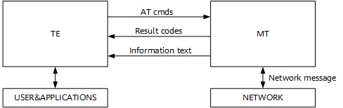
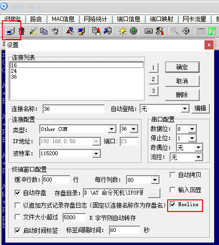

# 前言<a name="ZH-CN_TOPIC_0000001760165149"></a>

**概述<a name="section4537382116410"></a>**

本文介绍WS63V100的AT指令式及场景，为用户提供相应的指令格式和参数示例解释。

**产品版本<a name="section111371595118"></a>**

与本文档相对应的产品版本如下。

<a name="table22377277"></a>
<table><thead align="left"><tr id="row63051425"><th class="cellrowborder" valign="top" width="40.400000000000006%" id="mcps1.1.3.1.1"><p id="p6891761"><a name="p6891761"></a><a name="p6891761"></a><strong id="b3756104316114"><a name="b3756104316114"></a><a name="b3756104316114"></a>产品名称</strong></p>
</th>
<th class="cellrowborder" valign="top" width="59.599999999999994%" id="mcps1.1.3.1.2"><p id="p21361741"><a name="p21361741"></a><a name="p21361741"></a><strong id="b1676784314119"><a name="b1676784314119"></a><a name="b1676784314119"></a>产品版本</strong></p>
</th>
</tr>
</thead>
<tbody><tr id="row52579486"><td class="cellrowborder" valign="top" width="40.400000000000006%" headers="mcps1.1.3.1.1 "><p id="p112031718196"><a name="p112031718196"></a><a name="p112031718196"></a>WS63</p>
</td>
<td class="cellrowborder" valign="top" width="59.599999999999994%" headers="mcps1.1.3.1.2 "><p id="p5209173194"><a name="p5209173194"></a><a name="p5209173194"></a>V100</p>
</td>
</tr>
</tbody>
</table>

**读者对象<a name="section4378592816410"></a>**

本文档主要适用于以下工程师：

-   技术支持工程师
-   软件开发工程师

**符号约定<a name="section133020216410"></a>**

在本文中可能出现下列标志，它们所代表的含义如下。

<a name="table2622507016410"></a>
<table><thead align="left"><tr id="row1530720816410"><th class="cellrowborder" valign="top" width="20.580000000000002%" id="mcps1.1.3.1.1"><p id="p6450074116410"><a name="p6450074116410"></a><a name="p6450074116410"></a><strong id="b2136615816410"><a name="b2136615816410"></a><a name="b2136615816410"></a>符号</strong></p>
</th>
<th class="cellrowborder" valign="top" width="79.42%" id="mcps1.1.3.1.2"><p id="p5435366816410"><a name="p5435366816410"></a><a name="p5435366816410"></a><strong id="b5941558116410"><a name="b5941558116410"></a><a name="b5941558116410"></a>说明</strong></p>
</th>
</tr>
</thead>
<tbody><tr id="row1372280416410"><td class="cellrowborder" valign="top" width="20.580000000000002%" headers="mcps1.1.3.1.1 "><p id="p3734547016410"><a name="p3734547016410"></a><a name="p3734547016410"></a><a name="image2670064316410"></a><a name="image2670064316410"></a><span></span></p>
</td>
<td class="cellrowborder" valign="top" width="79.42%" headers="mcps1.1.3.1.2 "><p id="p1757432116410"><a name="p1757432116410"></a><a name="p1757432116410"></a>表示如不避免则将会导致死亡或严重伤害的具有高等级风险的危害。</p>
</td>
</tr>
<tr id="row466863216410"><td class="cellrowborder" valign="top" width="20.580000000000002%" headers="mcps1.1.3.1.1 "><p id="p1432579516410"><a name="p1432579516410"></a><a name="p1432579516410"></a><a name="image4895582316410"></a><a name="image4895582316410"></a><span></span></p>
</td>
<td class="cellrowborder" valign="top" width="79.42%" headers="mcps1.1.3.1.2 "><p id="p959197916410"><a name="p959197916410"></a><a name="p959197916410"></a>表示如不避免则可能导致死亡或严重伤害的具有中等级风险的危害。</p>
</td>
</tr>
<tr id="row123863216410"><td class="cellrowborder" valign="top" width="20.580000000000002%" headers="mcps1.1.3.1.1 "><p id="p1232579516410"><a name="p1232579516410"></a><a name="p1232579516410"></a><a name="image1235582316410"></a><a name="image1235582316410"></a><span></span></p>
</td>
<td class="cellrowborder" valign="top" width="79.42%" headers="mcps1.1.3.1.2 "><p id="p123197916410"><a name="p123197916410"></a><a name="p123197916410"></a>表示如不避免则可能导致轻微或中度伤害的具有低等级风险的危害。</p>
</td>
</tr>
<tr id="row5786682116410"><td class="cellrowborder" valign="top" width="20.580000000000002%" headers="mcps1.1.3.1.1 "><p id="p2204984716410"><a name="p2204984716410"></a><a name="p2204984716410"></a><a name="image4504446716410"></a><a name="image4504446716410"></a><span></span></p>
</td>
<td class="cellrowborder" valign="top" width="79.42%" headers="mcps1.1.3.1.2 "><p id="p4388861916410"><a name="p4388861916410"></a><a name="p4388861916410"></a>用于传递设备或环境安全警示信息。如不避免则可能会导致设备损坏、数据丢失、设备性能降低或其它不可预知的结果。</p>
<p id="p1238861916410"><a name="p1238861916410"></a><a name="p1238861916410"></a>“须知”不涉及人身伤害。</p>
</td>
</tr>
<tr id="row2856923116410"><td class="cellrowborder" valign="top" width="20.580000000000002%" headers="mcps1.1.3.1.1 "><p id="p5555360116410"><a name="p5555360116410"></a><a name="p5555360116410"></a><a name="image799324016410"></a><a name="image799324016410"></a><span></span></p>
</td>
<td class="cellrowborder" valign="top" width="79.42%" headers="mcps1.1.3.1.2 "><p id="p4612588116410"><a name="p4612588116410"></a><a name="p4612588116410"></a>对正文中重点信息的补充说明。</p>
<p id="p1232588116410"><a name="p1232588116410"></a><a name="p1232588116410"></a>“说明”不是安全警示信息，不涉及人身、设备及环境伤害信息。</p>
</td>
</tr>
</tbody>
</table>

**修改记录<a name="section2467512116410"></a>**

<a name="table1557726816410"></a>
<table><thead align="left"><tr id="row2942532716410"><th class="cellrowborder" valign="top" width="23.549999999999997%" id="mcps1.1.4.1.1"><p id="p3778275416410"><a name="p3778275416410"></a><a name="p3778275416410"></a><strong id="b5687322716410"><a name="b5687322716410"></a><a name="b5687322716410"></a>文档版本</strong></p>
</th>
<th class="cellrowborder" valign="top" width="27.71%" id="mcps1.1.4.1.2"><p id="p5627845516410"><a name="p5627845516410"></a><a name="p5627845516410"></a><strong id="b5800814916410"><a name="b5800814916410"></a><a name="b5800814916410"></a>发布日期</strong></p>
</th>
<th class="cellrowborder" valign="top" width="48.74%" id="mcps1.1.4.1.3"><p id="p2382284816410"><a name="p2382284816410"></a><a name="p2382284816410"></a><strong id="b3316380216410"><a name="b3316380216410"></a><a name="b3316380216410"></a>修改说明</strong></p>
</th>
</tr>
</thead>
<tbody><tr id="row108551922121013"><td class="cellrowborder" valign="top" width="23.549999999999997%" headers="mcps1.1.4.1.1 "><p id="p1585682241010"><a name="p1585682241010"></a><a name="p1585682241010"></a>05</p>
</td>
<td class="cellrowborder" valign="top" width="27.71%" headers="mcps1.1.4.1.2 "><p id="p15856112281014"><a name="p15856112281014"></a><a name="p15856112281014"></a>2025-08-29</p>
</td>
<td class="cellrowborder" valign="top" width="48.74%" headers="mcps1.1.4.1.3 "><a name="ul1795419366119"></a><a name="ul1795419366119"></a><ul id="ul1795419366119"><li>更新“<a href="通用AT指令一览表.md">通用AT指令一览表</a>”小节内容。</li><li>新增 “<a href="AT+HEAPSTAT-打印堆使用情况.md">AT+HEAPSTAT 打印堆使用情况</a>”~“<a href="AT+TASKMALLOC-打印每个任务内存申请情况.md">AT+TASKMALLOC 打印每个任务内存申请情况</a>”小节内容。</li><li>更新 “<a href="BLE.md">BLE</a>”小节内容。</li><li>更新 “<a href="SLE-AT指令描述.md">SLE AT指令描述</a>”小节内容。</li><li>更新 “<a href="SLE-AT命令使用场景示例.md">SLE AT命令使用场景示例</a>”小节内容。</li><li>更新 “<a href="设置对应雷达算法参数套下的算法参数值.md">设置对应雷达算法参数套下的算法参数值</a>”小节内容。</li><li>新增 “<a href="设置自适应WALL算法参数.md">设置自适应WALL算法参数</a>”小节内容。</li><li>更新 “<a href="平台模块AT命令.md">平台模块AT命令</a>”小节内容。</li></ul>
</td>
</tr>
<tr id="row728943191318"><td class="cellrowborder" valign="top" width="23.549999999999997%" headers="mcps1.1.4.1.1 "><p id="p229053171317"><a name="p229053171317"></a><a name="p229053171317"></a>04</p>
</td>
<td class="cellrowborder" valign="top" width="27.71%" headers="mcps1.1.4.1.2 "><p id="p42901631151316"><a name="p42901631151316"></a><a name="p42901631151316"></a>2025-02-28</p>
</td>
<td class="cellrowborder" valign="top" width="48.74%" headers="mcps1.1.4.1.3 "><a name="ul18723153071914"></a><a name="ul18723153071914"></a><ul id="ul18723153071914"><li>更新 “<a href="AT+CONN-发起与AP的连接.md">AT+CONN 发起与AP的连接</a>”小节内容。</li><li>更新 “<a href="SoftAP相关AT指令.md">SoftAP相关AT指令</a>”小节内容。</li><li>更新 “<a href="BLE.md">BLE</a>”小节内容。</li><li>更新 “<a href="SLE-AT指令描述.md">SLE AT指令描述</a>”小节内容。</li><li>更新 “<a href="设置雷达状态.md">设置雷达状态</a>”小节内容。</li><li>更新 “<a href="写入用户预留位.md">写入用户预留位</a>”小节内容。</li></ul>
</td>
</tr>
<tr id="row2125128171615"><td class="cellrowborder" valign="top" width="23.549999999999997%" headers="mcps1.1.4.1.1 "><p id="p112572851611"><a name="p112572851611"></a><a name="p112572851611"></a>03</p>
</td>
<td class="cellrowborder" valign="top" width="27.71%" headers="mcps1.1.4.1.2 "><p id="p121251228161618"><a name="p121251228161618"></a><a name="p121251228161618"></a>2024-10-30</p>
</td>
<td class="cellrowborder" valign="top" width="48.74%" headers="mcps1.1.4.1.3 "><a name="ul1712199192418"></a><a name="ul1712199192418"></a><ul id="ul1712199192418"><li>更新 “<a href="BLE-AT指令描述.md">BLE AT指令描述</a>”小节内容。</li><li>更新 “<a href="SLE-AT指令描述.md">SLE AT指令描述</a>”小节内容。</li><li>更新 “<a href="写入第二个用户预留位.md">写入第二个用户预留位</a>”小节内容。</li><li>更新 “<a href="AT+SETUART-配置串口功能.md">AT+SETUART 配置串口功能</a>”小节内容。</li></ul>
</td>
</tr>
<tr id="row18512840962"><td class="cellrowborder" valign="top" width="23.549999999999997%" headers="mcps1.1.4.1.1 "><p id="p185121040369"><a name="p185121040369"></a><a name="p185121040369"></a>02</p>
</td>
<td class="cellrowborder" valign="top" width="27.71%" headers="mcps1.1.4.1.2 "><p id="p115121140665"><a name="p115121140665"></a><a name="p115121140665"></a>2024-07-01</p>
</td>
<td class="cellrowborder" valign="top" width="48.74%" headers="mcps1.1.4.1.3 "><a name="ul171911805710"></a><a name="ul171911805710"></a><ul id="ul171911805710"><li>新增“<a href="Repeater相关AT指令.md">Repeater相关AT指令</a>”小节内容。</li><li>新增 “<a href="AT+SCANPRSSID指定ssid前缀扫描.md">AT+SCANPRSSID指定ssid前缀扫描</a>”小节内容。</li><li>更新 “<a href="AT+PBC-PBC连接.md">AT+PBC PBC连接</a>”、“<a href="AT+PIN-PIN连接.md">AT+PIN PIN连接</a>”和“<a href="AT+PINSHOW-生成PIN码.md">AT+PINSHOW 生成PIN码</a>”小节内容。</li><li>新增 “<a href="AT+APSCAN-softap扫描.md">AT+APSCAN softap扫描</a>”小节内容。</li><li>更新 “<a href="测试调试相关AT指令描述.md">测试调试相关AT指令描述</a>”小节内容。</li><li>更新 “<a href="BLE-AT指令描述.md">BLE AT指令描述</a>”小节内容。</li><li>更新 “<a href="SLE-AT指令描述.md">SLE AT指令描述</a>”小节内容。</li><li>更新 “<a href="平台模块AT命令.md">平台模块AT命令</a>”小节内容。</li></ul>
</td>
</tr>
<tr id="row1163912119197"><td class="cellrowborder" valign="top" width="23.549999999999997%" headers="mcps1.1.4.1.1 "><p id="p1363913117195"><a name="p1363913117195"></a><a name="p1363913117195"></a>01</p>
</td>
<td class="cellrowborder" valign="top" width="27.71%" headers="mcps1.1.4.1.2 "><p id="p14639111161916"><a name="p14639111161916"></a><a name="p14639111161916"></a>2024-04-10</p>
</td>
<td class="cellrowborder" valign="top" width="48.74%" headers="mcps1.1.4.1.3 "><p id="p156645201192"><a name="p156645201192"></a><a name="p156645201192"></a>第一次正式版本发布。</p>
<a name="ul3248113016194"></a><a name="ul3248113016194"></a><ul id="ul3248113016194"><li>更新 “<a href="测试调试相关AT指令一览表.md">测试调试相关AT指令一览表</a>”小节内容。</li><li>更新 “<a href="测试调试相关AT指令描述.md">测试调试相关AT指令描述</a>”小节内容。</li><li>更新 “<a href="SLE-AT指令描述.md">SLE AT指令描述</a>”小节内容。</li><li>更新 “<a href="平台模块AT命令.md">平台模块AT命令</a>”小节内容。</li></ul>
</td>
</tr>
<tr id="row1610573312434"><td class="cellrowborder" valign="top" width="23.549999999999997%" headers="mcps1.1.4.1.1 "><p id="p410518335436"><a name="p410518335436"></a><a name="p410518335436"></a>00B06</p>
</td>
<td class="cellrowborder" valign="top" width="27.71%" headers="mcps1.1.4.1.2 "><p id="p1210563374317"><a name="p1210563374317"></a><a name="p1210563374317"></a>2024-03-29</p>
</td>
<td class="cellrowborder" valign="top" width="48.74%" headers="mcps1.1.4.1.3 "><a name="ul7585161851415"></a><a name="ul7585161851415"></a><ul id="ul7585161851415"><li>更新 “<a href="AT+BLESETNAME-设置本地设备名称.md">3.1.2.1.5</a>”小节内容。</li><li>更新 “<a href="设置雷达退出延时.md">设置雷达退出延时</a>”小节内容。</li><li>更新“<a href="读取NV项.md">读取NV项</a>”小节内容。</li><li>更新“<a href="写入用户预留位.md">写入用户预留位</a>”小节内容。</li></ul>
</td>
</tr>
<tr id="row4406181518410"><td class="cellrowborder" valign="top" width="23.549999999999997%" headers="mcps1.1.4.1.1 "><p id="p940713150418"><a name="p940713150418"></a><a name="p940713150418"></a>00B05</p>
</td>
<td class="cellrowborder" valign="top" width="27.71%" headers="mcps1.1.4.1.2 "><p id="p13407191514418"><a name="p13407191514418"></a><a name="p13407191514418"></a>2024-03-14</p>
</td>
<td class="cellrowborder" valign="top" width="48.74%" headers="mcps1.1.4.1.3 "><a name="ul16256754134115"></a><a name="ul16256754134115"></a><ul id="ul16256754134115"><li>更新 “<a href="测试调试相关AT指令.md">测试调试相关AT指令</a>”小节内容。</li><li>更新 “<a href="平台模块AT命令.md">平台模块AT命令</a>”章节内容。</li></ul>
</td>
</tr>
<tr id="row151911843614"><td class="cellrowborder" valign="top" width="23.549999999999997%" headers="mcps1.1.4.1.1 "><p id="p14191643013"><a name="p14191643013"></a><a name="p14191643013"></a>00B04</p>
</td>
<td class="cellrowborder" valign="top" width="27.71%" headers="mcps1.1.4.1.2 "><p id="p119118431616"><a name="p119118431616"></a><a name="p119118431616"></a>2024-02-22</p>
</td>
<td class="cellrowborder" valign="top" width="48.74%" headers="mcps1.1.4.1.3 "><a name="ul13412145611114"></a><a name="ul13412145611114"></a><ul id="ul13412145611114"><li>更新 "<a href="AT+STASTAT-查看STA连接状态.md">AT+STASTAT 查看STA连接状态</a>" 小节内容。</li><li>更新“<a href="BLE.md">BLE</a>”小节内容。</li><li>更新“<a href="SLE.md">SLE</a>”小节内容。</li></ul>
</td>
</tr>
<tr id="row16608343214"><td class="cellrowborder" valign="top" width="23.549999999999997%" headers="mcps1.1.4.1.1 "><p id="p18609140216"><a name="p18609140216"></a><a name="p18609140216"></a>00B03</p>
</td>
<td class="cellrowborder" valign="top" width="27.71%" headers="mcps1.1.4.1.2 "><p id="p260917414216"><a name="p260917414216"></a><a name="p260917414216"></a>2024-01-15</p>
</td>
<td class="cellrowborder" valign="top" width="48.74%" headers="mcps1.1.4.1.3 "><a name="ul36441820949"></a><a name="ul36441820949"></a><ul id="ul36441820949"><li>更新“<a href="AT+CONN-发起与AP的连接.md">AT+CONN 发起与AP的连接</a>”小节内容。</li><li>更新“<a href="AT+STARTAP-普通模式启动SoftAP.md">AT+STARTAP 普通模式启动SoftAP</a>”小节内容。</li><li>更新 “<a href="BLE-SLE模块AT指令.md">BLE&amp;SLE模块AT指令</a>”章节内容，新增BLE/SLE常发常收命令。</li><li>新增 “<a href="Repeater相关AT指令.md">Repeater相关AT指令</a>”章节内容。</li></ul>
</td>
</tr>
<tr id="row11267101145811"><td class="cellrowborder" valign="top" width="23.549999999999997%" headers="mcps1.1.4.1.1 "><p id="p1926712115587"><a name="p1926712115587"></a><a name="p1926712115587"></a>00B02</p>
</td>
<td class="cellrowborder" valign="top" width="27.71%" headers="mcps1.1.4.1.2 "><p id="p32671118582"><a name="p32671118582"></a><a name="p32671118582"></a>2023-12-18</p>
</td>
<td class="cellrowborder" valign="top" width="48.74%" headers="mcps1.1.4.1.3 "><p id="p132672165814"><a name="p132672165814"></a><a name="p132672165814"></a>新增“<a href="雷达模块AT命令.md">雷达模块AT命令</a>”小节内容。</p>
</td>
</tr>
<tr id="row5947359616410"><td class="cellrowborder" valign="top" width="23.549999999999997%" headers="mcps1.1.4.1.1 "><p id="p2149706016410"><a name="p2149706016410"></a><a name="p2149706016410"></a>00B01</p>
</td>
<td class="cellrowborder" valign="top" width="27.71%" headers="mcps1.1.4.1.2 "><p id="p648803616410"><a name="p648803616410"></a><a name="p648803616410"></a>2023-11-27</p>
</td>
<td class="cellrowborder" valign="top" width="48.74%" headers="mcps1.1.4.1.3 "><p id="p1946537916410"><a name="p1946537916410"></a><a name="p1946537916410"></a>第一次临时版本发布。</p>
</td>
</tr>
</tbody>
</table>

# 指令说明<a name="ZH-CN_TOPIC_0000001712485596"></a>


## 命令简介<a name="ZH-CN_TOPIC_0000001760165145"></a>

AT命令用于TE（例如：PC等用户终端）和MT（例如：移动台等移动终端）之间控制信息的交互，如[图1](#_fig171281854102013)所示。

**图 1**  AT命令示意图<a name="_fig171281854102013"></a>  



## 指令类型<a name="ZH-CN_TOPIC_0000001760165157"></a>

AT指令类型如[表1](#_table838912210233)所示。

**表 1**  AT指令类型说明

<a name="_table838912210233"></a>
<table><thead align="left"><tr id="row3095mcpsimp"><th class="cellrowborder" valign="top" width="33.33333333333333%" id="mcps1.2.4.1.1"><p id="p3097mcpsimp"><a name="p3097mcpsimp"></a><a name="p3097mcpsimp"></a>类型</p>
</th>
<th class="cellrowborder" valign="top" width="33.33333333333333%" id="mcps1.2.4.1.2"><p id="p3099mcpsimp"><a name="p3099mcpsimp"></a><a name="p3099mcpsimp"></a>格式</p>
</th>
<th class="cellrowborder" valign="top" width="33.33333333333333%" id="mcps1.2.4.1.3"><p id="p3101mcpsimp"><a name="p3101mcpsimp"></a><a name="p3101mcpsimp"></a>用途</p>
</th>
</tr>
</thead>
<tbody><tr id="row3103mcpsimp"><td class="cellrowborder" valign="top" width="33.33333333333333%" headers="mcps1.2.4.1.1 "><p id="p3105mcpsimp"><a name="p3105mcpsimp"></a><a name="p3105mcpsimp"></a>测试指令</p>
</td>
<td class="cellrowborder" valign="top" width="33.33333333333333%" headers="mcps1.2.4.1.2 "><p id="p3107mcpsimp"><a name="p3107mcpsimp"></a><a name="p3107mcpsimp"></a>AT+&lt;cmd&gt;=?</p>
</td>
<td class="cellrowborder" valign="top" width="33.33333333333333%" headers="mcps1.2.4.1.3 "><p id="p3109mcpsimp"><a name="p3109mcpsimp"></a><a name="p3109mcpsimp"></a>该命令用于查询设置指令的参数以及取值范围。</p>
</td>
</tr>
<tr id="row3110mcpsimp"><td class="cellrowborder" valign="top" width="33.33333333333333%" headers="mcps1.2.4.1.1 "><p id="p3112mcpsimp"><a name="p3112mcpsimp"></a><a name="p3112mcpsimp"></a>查询指令</p>
</td>
<td class="cellrowborder" valign="top" width="33.33333333333333%" headers="mcps1.2.4.1.2 "><p id="p3114mcpsimp"><a name="p3114mcpsimp"></a><a name="p3114mcpsimp"></a>AT+&lt;cmd&gt;?</p>
</td>
<td class="cellrowborder" valign="top" width="33.33333333333333%" headers="mcps1.2.4.1.3 "><p id="p3116mcpsimp"><a name="p3116mcpsimp"></a><a name="p3116mcpsimp"></a>该命令用于返回参数的当前值。</p>
</td>
</tr>
<tr id="row3117mcpsimp"><td class="cellrowborder" valign="top" width="33.33333333333333%" headers="mcps1.2.4.1.1 "><p id="p3119mcpsimp"><a name="p3119mcpsimp"></a><a name="p3119mcpsimp"></a>设置指令</p>
</td>
<td class="cellrowborder" valign="top" width="33.33333333333333%" headers="mcps1.2.4.1.2 "><p id="p3121mcpsimp"><a name="p3121mcpsimp"></a><a name="p3121mcpsimp"></a>AT+&lt;cmd&gt;=&lt;parameter&gt;,…</p>
</td>
<td class="cellrowborder" valign="top" width="33.33333333333333%" headers="mcps1.2.4.1.3 "><p id="p3123mcpsimp"><a name="p3123mcpsimp"></a><a name="p3123mcpsimp"></a>设置参数值或执行。</p>
</td>
</tr>
<tr id="row3124mcpsimp"><td class="cellrowborder" valign="top" width="33.33333333333333%" headers="mcps1.2.4.1.1 "><p id="p3126mcpsimp"><a name="p3126mcpsimp"></a><a name="p3126mcpsimp"></a>执行指令</p>
</td>
<td class="cellrowborder" valign="top" width="33.33333333333333%" headers="mcps1.2.4.1.2 "><p id="p3128mcpsimp"><a name="p3128mcpsimp"></a><a name="p3128mcpsimp"></a>AT+&lt;cmd&gt;</p>
</td>
<td class="cellrowborder" valign="top" width="33.33333333333333%" headers="mcps1.2.4.1.3 "><p id="p3130mcpsimp"><a name="p3130mcpsimp"></a><a name="p3130mcpsimp"></a>用于执行本指令的功能。</p>
</td>
</tr>
</tbody>
</table>

## 注意事项<a name="ZH-CN_TOPIC_0000001760284985"></a>

-   不是每一条指令都具备[表1](指令类型.md#_table838912210233)中的4种类型的命令。
-   如果存在当前软件版本不支持的AT指令，会返回ERROR。
-   双引号表示字符串数据 "string"，例如：AT+SCANSSID="XXX"。
-   串口通信默认：波特率为115200、8个数据位、1个停止位、无校验，无流量控制。
-   <\>为必选参数；\[ \]内为可选值，参数可选。
-   命令中的参数以“,”作为分隔符，除双引号括起来的字符串参数外，不支持参数本身带“,”。
-   AT指令中的参数不能有多余的空格。
-   AT指令必须大写，且必须以回车换行符作为结尾（CR LF），部分串口工具在用户敲击键盘回车键时只有回车符（CR）没有换行符（LF），导致AT指令无法识别，如需使用串口工具手动输入AT指令，需在串口工具中将回车键设置为回车符（CR）+换行符（LF）。以IPOP V4.1为例，说明如[图1](#_fig69728515262)所示。

    **图 1**  IPOP V4.1 CR+LF设置示例<a name="_fig69728515262"></a>  
    

# Wi-Fi模块AT指令<a name="ZH-CN_TOPIC_0000001718297836"></a>


## 通用AT指令<a name="ZH-CN_TOPIC_0000001760285001"></a>


### 通用AT指令一览表<a name="ZH-CN_TOPIC_0000001712326076"></a>

<a name="table3151mcpsimp"></a>
<table><thead align="left"><tr id="row3156mcpsimp"><th class="cellrowborder" valign="top" width="32%" id="mcps1.1.3.1.1"><p id="p3158mcpsimp"><a name="p3158mcpsimp"></a><a name="p3158mcpsimp"></a>指令</p>
</th>
<th class="cellrowborder" valign="top" width="68%" id="mcps1.1.3.1.2"><p id="p3160mcpsimp"><a name="p3160mcpsimp"></a><a name="p3160mcpsimp"></a>描述</p>
</th>
</tr>
</thead>
<tbody><tr id="row3167mcpsimp"><td class="cellrowborder" valign="top" width="32%" headers="mcps1.1.3.1.1 "><p id="p3169mcpsimp"><a name="p3169mcpsimp"></a><a name="p3169mcpsimp"></a>AT+HELP</p>
</td>
<td class="cellrowborder" valign="top" width="68%" headers="mcps1.1.3.1.2 "><p id="p3171mcpsimp"><a name="p3171mcpsimp"></a><a name="p3171mcpsimp"></a>查看当前可用AT命令。</p>
</td>
</tr>
<tr id="row3172mcpsimp"><td class="cellrowborder" valign="top" width="32%" headers="mcps1.1.3.1.1 "><p id="p3174mcpsimp"><a name="p3174mcpsimp"></a><a name="p3174mcpsimp"></a>AT+MAC</p>
</td>
<td class="cellrowborder" valign="top" width="68%" headers="mcps1.1.3.1.2 "><p id="p3176mcpsimp"><a name="p3176mcpsimp"></a><a name="p3176mcpsimp"></a>MAC地址管理。</p>
</td>
</tr>
<tr id="row3177mcpsimp"><td class="cellrowborder" valign="top" width="32%" headers="mcps1.1.3.1.1 "><p id="p3179mcpsimp"><a name="p3179mcpsimp"></a><a name="p3179mcpsimp"></a>AT+IPERF</p>
</td>
<td class="cellrowborder" valign="top" width="68%" headers="mcps1.1.3.1.2 "><p id="p3181mcpsimp"><a name="p3181mcpsimp"></a><a name="p3181mcpsimp"></a>性能测试。</p>
</td>
</tr>
<tr id="row3182mcpsimp"><td class="cellrowborder" valign="top" width="32%" headers="mcps1.1.3.1.1 "><p id="p3184mcpsimp"><a name="p3184mcpsimp"></a><a name="p3184mcpsimp"></a>AT+SYSINFO</p>
</td>
<td class="cellrowborder" valign="top" width="68%" headers="mcps1.1.3.1.2 "><p id="p3186mcpsimp"><a name="p3186mcpsimp"></a><a name="p3186mcpsimp"></a>查看系统信息。</p>
</td>
</tr>
<tr id="row3187mcpsimp"><td class="cellrowborder" valign="top" width="32%" headers="mcps1.1.3.1.1 "><p id="p3189mcpsimp"><a name="p3189mcpsimp"></a><a name="p3189mcpsimp"></a>AT+PING</p>
</td>
<td class="cellrowborder" valign="top" width="68%" headers="mcps1.1.3.1.2 "><p id="p3191mcpsimp"><a name="p3191mcpsimp"></a><a name="p3191mcpsimp"></a>测试IPV4网络连接。</p>
</td>
</tr>
<tr id="row3192mcpsimp"><td class="cellrowborder" valign="top" width="32%" headers="mcps1.1.3.1.1 "><p id="p3194mcpsimp"><a name="p3194mcpsimp"></a><a name="p3194mcpsimp"></a>AT+PING6</p>
</td>
<td class="cellrowborder" valign="top" width="68%" headers="mcps1.1.3.1.2 "><p id="p3196mcpsimp"><a name="p3196mcpsimp"></a><a name="p3196mcpsimp"></a>测试IPV6网络连接。</p>
</td>
</tr>
<tr id="row3197mcpsimp"><td class="cellrowborder" valign="top" width="32%" headers="mcps1.1.3.1.1 "><p id="p3199mcpsimp"><a name="p3199mcpsimp"></a><a name="p3199mcpsimp"></a>AT+DNS</p>
</td>
<td class="cellrowborder" valign="top" width="68%" headers="mcps1.1.3.1.2 "><p id="p3201mcpsimp"><a name="p3201mcpsimp"></a><a name="p3201mcpsimp"></a>设置单板dns服务器地址。</p>
</td>
</tr>
<tr id="row3202mcpsimp"><td class="cellrowborder" valign="top" width="32%" headers="mcps1.1.3.1.1 "><p id="p3204mcpsimp"><a name="p3204mcpsimp"></a><a name="p3204mcpsimp"></a>AT+NETSTAT</p>
</td>
<td class="cellrowborder" valign="top" width="68%" headers="mcps1.1.3.1.2 "><p id="p3206mcpsimp"><a name="p3206mcpsimp"></a><a name="p3206mcpsimp"></a>查看网络状态。</p>
</td>
</tr>
<tr id="row3207mcpsimp"><td class="cellrowborder" valign="top" width="32%" headers="mcps1.1.3.1.1 "><p id="p3209mcpsimp"><a name="p3209mcpsimp"></a><a name="p3209mcpsimp"></a>AT+DHCP</p>
</td>
<td class="cellrowborder" valign="top" width="68%" headers="mcps1.1.3.1.2 "><p id="p3211mcpsimp"><a name="p3211mcpsimp"></a><a name="p3211mcpsimp"></a>dhcp客户端命令。</p>
</td>
</tr>
<tr id="row3212mcpsimp"><td class="cellrowborder" valign="top" width="32%" headers="mcps1.1.3.1.1 "><p id="p3214mcpsimp"><a name="p3214mcpsimp"></a><a name="p3214mcpsimp"></a>AT+DHCPS</p>
</td>
<td class="cellrowborder" valign="top" width="68%" headers="mcps1.1.3.1.2 "><p id="p3216mcpsimp"><a name="p3216mcpsimp"></a><a name="p3216mcpsimp"></a>dhcps服务器端命令。</p>
</td>
</tr>
<tr id="row3217mcpsimp"><td class="cellrowborder" valign="top" width="32%" headers="mcps1.1.3.1.1 "><p id="p3219mcpsimp"><a name="p3219mcpsimp"></a><a name="p3219mcpsimp"></a>AT+IFCFG</p>
</td>
<td class="cellrowborder" valign="top" width="68%" headers="mcps1.1.3.1.2 "><p id="p3221mcpsimp"><a name="p3221mcpsimp"></a><a name="p3221mcpsimp"></a>接口配置。</p>
</td>
</tr>
<tr id="row3222mcpsimp"><td class="cellrowborder" valign="top" width="32%" headers="mcps1.1.3.1.1 "><p id="p3224mcpsimp"><a name="p3224mcpsimp"></a><a name="p3224mcpsimp"></a>AT+PS</p>
</td>
<td class="cellrowborder" valign="top" width="68%" headers="mcps1.1.3.1.2 "><p id="p3226mcpsimp"><a name="p3226mcpsimp"></a><a name="p3226mcpsimp"></a>Wi-Fi低功耗设置。</p>
</td>
</tr>
<tr id="row3227mcpsimp"><td class="cellrowborder" valign="top" width="32%" headers="mcps1.1.3.1.1 "><p id="p3229mcpsimp"><a name="p3229mcpsimp"></a><a name="p3229mcpsimp"></a>AT+RST</p>
</td>
<td class="cellrowborder" valign="top" width="68%" headers="mcps1.1.3.1.2 "><p id="p3231mcpsimp"><a name="p3231mcpsimp"></a><a name="p3231mcpsimp"></a>复位单板。</p>
</td>
</tr>
<tr id="row149111659155720"><td class="cellrowborder" valign="top" width="32%" headers="mcps1.1.3.1.1 "><p id="p991145917578"><a name="p991145917578"></a><a name="p991145917578"></a>AT+SENDPKT</p>
</td>
<td class="cellrowborder" valign="top" width="68%" headers="mcps1.1.3.1.2 "><p id="p1911759125719"><a name="p1911759125719"></a><a name="p1911759125719"></a>发送任意帧。</p>
</td>
</tr>
<tr id="row145521852466"><td class="cellrowborder" valign="top" width="32%" headers="mcps1.1.3.1.1 "><p id="p13553155217619"><a name="p13553155217619"></a><a name="p13553155217619"></a>AT+HEAPSTAT</p>
</td>
<td class="cellrowborder" valign="top" width="68%" headers="mcps1.1.3.1.2 "><p id="p1655395217615"><a name="p1655395217615"></a><a name="p1655395217615"></a>打印堆使用情况。</p>
</td>
</tr>
<tr id="row9604121076"><td class="cellrowborder" valign="top" width="32%" headers="mcps1.1.3.1.1 "><p id="p2060492373"><a name="p2060492373"></a><a name="p2060492373"></a>AT+TASKSTACK</p>
</td>
<td class="cellrowborder" valign="top" width="68%" headers="mcps1.1.3.1.2 "><p id="p8604721472"><a name="p8604721472"></a><a name="p8604721472"></a>打印每个任务栈使用情况。</p>
</td>
</tr>
<tr id="row4665281673"><td class="cellrowborder" valign="top" width="32%" headers="mcps1.1.3.1.1 "><p id="p96651781715"><a name="p96651781715"></a><a name="p96651781715"></a>AT+TASKMALLOC</p>
</td>
<td class="cellrowborder" valign="top" width="68%" headers="mcps1.1.3.1.2 "><p id="p116651786720"><a name="p116651786720"></a><a name="p116651786720"></a>打印每个任务内存申请情况。</p>
</td>
</tr>
</tbody>
</table>

### 通用AT指令描述<a name="ZH-CN_TOPIC_0000001712485592"></a>


#### AT+HELP 查看当前可用AT命令<a name="ZH-CN_TOPIC_0000001760165153"></a>

<a name="table102mcpsimp"></a>
<table><tbody><tr id="row107mcpsimp"><th class="firstcol" valign="top" width="18%" id="mcps1.1.3.1.1"><p id="p109mcpsimp"><a name="p109mcpsimp"></a><a name="p109mcpsimp"></a>格式</p>
</th>
<td class="cellrowborder" valign="top" width="82%" headers="mcps1.1.3.1.1 "><p id="p111mcpsimp"><a name="p111mcpsimp"></a><a name="p111mcpsimp"></a>AT+HELP</p>
</td>
</tr>
<tr id="row112mcpsimp"><th class="firstcol" valign="top" width="18%" id="mcps1.1.3.2.1"><p id="p114mcpsimp"><a name="p114mcpsimp"></a><a name="p114mcpsimp"></a>响应</p>
</th>
<td class="cellrowborder" valign="top" width="82%" headers="mcps1.1.3.2.1 "><p id="p116mcpsimp"><a name="p116mcpsimp"></a><a name="p116mcpsimp"></a>+HELP:</p>
<p id="p117mcpsimp"><a name="p117mcpsimp"></a><a name="p117mcpsimp"></a>显示当前支持的AT命令</p>
<p id="p118mcpsimp"><a name="p118mcpsimp"></a><a name="p118mcpsimp"></a>OK</p>
</td>
</tr>
<tr id="row119mcpsimp"><th class="firstcol" valign="top" width="18%" id="mcps1.1.3.3.1"><p id="p121mcpsimp"><a name="p121mcpsimp"></a><a name="p121mcpsimp"></a>参数说明</p>
</th>
<td class="cellrowborder" valign="top" width="82%" headers="mcps1.1.3.3.1 "><p id="p123mcpsimp"><a name="p123mcpsimp"></a><a name="p123mcpsimp"></a>-</p>
</td>
</tr>
<tr id="row124mcpsimp"><th class="firstcol" valign="top" width="18%" id="mcps1.1.3.4.1"><p id="p126mcpsimp"><a name="p126mcpsimp"></a><a name="p126mcpsimp"></a>示例</p>
</th>
<td class="cellrowborder" valign="top" width="82%" headers="mcps1.1.3.4.1 "><p id="p128mcpsimp"><a name="p128mcpsimp"></a><a name="p128mcpsimp"></a>AT+HELP</p>
</td>
</tr>
<tr id="row129mcpsimp"><th class="firstcol" valign="top" width="18%" id="mcps1.1.3.5.1"><p id="p131mcpsimp"><a name="p131mcpsimp"></a><a name="p131mcpsimp"></a>注意</p>
</th>
<td class="cellrowborder" valign="top" width="82%" headers="mcps1.1.3.5.1 "><p id="p133mcpsimp"><a name="p133mcpsimp"></a><a name="p133mcpsimp"></a>包含Wi-Fi、BLE、GLE命令。默认不使能。</p>
</td>
</tr>
</tbody>
</table>

#### AT+MAC MAC地址管理<a name="ZH-CN_TOPIC_0000001712326088"></a>

<a name="table135mcpsimp"></a>
<table><tbody><tr id="row141mcpsimp"><th class="firstcol" valign="top" width="18.011801180118013%" id="mcps1.1.4.1.1"><p id="p143mcpsimp"><a name="p143mcpsimp"></a><a name="p143mcpsimp"></a>格式</p>
</th>
<td class="cellrowborder" valign="top" width="41.64416441644164%" headers="mcps1.1.4.1.1 "><p id="p145mcpsimp"><a name="p145mcpsimp"></a><a name="p145mcpsimp"></a>设置命令：</p>
<p id="p146mcpsimp"><a name="p146mcpsimp"></a><a name="p146mcpsimp"></a>AT+MAC=&lt;MAC&gt;</p>
</td>
<td class="cellrowborder" valign="top" width="40.34403440344035%" headers="mcps1.1.4.1.1 "><p id="p148mcpsimp"><a name="p148mcpsimp"></a><a name="p148mcpsimp"></a>查询命令：</p>
<p id="p149mcpsimp"><a name="p149mcpsimp"></a><a name="p149mcpsimp"></a>AT+MAC?</p>
</td>
</tr>
<tr id="row150mcpsimp"><th class="firstcol" valign="top" width="18.011801180118013%" id="mcps1.1.4.2.1"><p id="p152mcpsimp"><a name="p152mcpsimp"></a><a name="p152mcpsimp"></a>响应</p>
</th>
<td class="cellrowborder" valign="top" width="41.64416441644164%" headers="mcps1.1.4.2.1 "><a name="ul2488103861514"></a><a name="ul2488103861514"></a><ul id="ul2488103861514"><li>成功：OK</li><li>失败：ERROR</li></ul>
</td>
<td class="cellrowborder" valign="top" width="40.34403440344035%" headers="mcps1.1.4.2.1 "><p id="p158mcpsimp"><a name="p158mcpsimp"></a><a name="p158mcpsimp"></a>+MAC: &lt;MAC&gt;</p>
<a name="ul66651152131513"></a><a name="ul66651152131513"></a><ul id="ul66651152131513"><li>成功：OK</li><li>失败：ERROR</li></ul>
</td>
</tr>
<tr id="row162mcpsimp"><th class="firstcol" valign="top" width="18.011801180118013%" id="mcps1.1.4.3.1"><p id="p164mcpsimp"><a name="p164mcpsimp"></a><a name="p164mcpsimp"></a>参数说明</p>
</th>
<td class="cellrowborder" valign="top" width="41.64416441644164%" headers="mcps1.1.4.3.1 "><p id="p166mcpsimp"><a name="p166mcpsimp"></a><a name="p166mcpsimp"></a>&lt;MAC&gt;：MAC地址</p>
</td>
<td class="cellrowborder" valign="top" width="40.34403440344035%" headers="mcps1.1.4.3.1 "><p id="p168mcpsimp"><a name="p168mcpsimp"></a><a name="p168mcpsimp"></a>-</p>
</td>
</tr>
<tr id="row169mcpsimp"><th class="firstcol" valign="top" width="18.011801180118013%" id="mcps1.1.4.4.1"><p id="p171mcpsimp"><a name="p171mcpsimp"></a><a name="p171mcpsimp"></a>示例</p>
</th>
<td class="cellrowborder" valign="top" width="41.64416441644164%" headers="mcps1.1.4.4.1 "><p id="p173mcpsimp"><a name="p173mcpsimp"></a><a name="p173mcpsimp"></a>AT+MAC=90:2B:D2:E4:CE:28</p>
</td>
<td class="cellrowborder" valign="top" width="40.34403440344035%" headers="mcps1.1.4.4.1 "><p id="p175mcpsimp"><a name="p175mcpsimp"></a><a name="p175mcpsimp"></a>AT+MAC?</p>
</td>
</tr>
<tr id="row176mcpsimp"><th class="firstcol" valign="top" id="mcps1.1.4.5.1"><p id="p178mcpsimp"><a name="p178mcpsimp"></a><a name="p178mcpsimp"></a>注意</p>
</th>
<td class="cellrowborder" colspan="2" valign="top" headers="mcps1.1.4.5.1 "><p id="p180mcpsimp"><a name="p180mcpsimp"></a><a name="p180mcpsimp"></a>设置命令在AT+STARTSTA/AT+STARTAP前下发有效。该mac地址重启之后丢失，设置的地址为sta mac地址，softAP mac地址会在此地址的基础上将倒数第二个字节加2派生。</p>
</td>
</tr>
</tbody>
</table>

#### AT+IPERF 性能测试<a name="ZH-CN_TOPIC_0000001760284989"></a>

<a name="table182mcpsimp"></a>
<table><tbody><tr id="row187mcpsimp"><th class="firstcol" valign="top" width="18.55%" id="mcps1.1.3.1.1"><p id="p189mcpsimp"><a name="p189mcpsimp"></a><a name="p189mcpsimp"></a>格式</p>
</th>
<td class="cellrowborder" valign="top" width="81.45%" headers="mcps1.1.3.1.1 "><p id="p191mcpsimp"><a name="p191mcpsimp"></a><a name="p191mcpsimp"></a>AT+IPERF=&lt;-x&gt;</p>
</td>
</tr>
<tr id="row192mcpsimp"><th class="firstcol" valign="top" width="18.55%" id="mcps1.1.3.2.1"><p id="p194mcpsimp"><a name="p194mcpsimp"></a><a name="p194mcpsimp"></a>响应</p>
</th>
<td class="cellrowborder" valign="top" width="81.45%" headers="mcps1.1.3.2.1 "><p id="p196mcpsimp"><a name="p196mcpsimp"></a><a name="p196mcpsimp"></a>+IPERF:</p>
<p id="p197mcpsimp"><a name="p197mcpsimp"></a><a name="p197mcpsimp"></a>&lt;Interval&gt;  &lt;Transfer&gt; &lt;Bandwidth&gt;</p>
<a name="ul2488103861514"></a><a name="ul2488103861514"></a><ul id="ul2488103861514"><li>成功：OK</li><li>失败：ERROR</li></ul>
</td>
</tr>
<tr id="row201mcpsimp"><th class="firstcol" valign="top" width="18.55%" id="mcps1.1.3.3.1"><p id="p203mcpsimp"><a name="p203mcpsimp"></a><a name="p203mcpsimp"></a>参数说明</p>
</th>
<td class="cellrowborder" valign="top" width="81.45%" headers="mcps1.1.3.3.1 "><a name="ul1053181051615"></a><a name="ul1053181051615"></a><ul id="ul1053181051615"><li>&lt;-x&gt;：参数类型<p id="p206mcpsimp"><a name="p206mcpsimp"></a><a name="p206mcpsimp"></a>-s：以server模式启动</p>
<p id="p207mcpsimp"><a name="p207mcpsimp"></a><a name="p207mcpsimp"></a>-c,IP：以client模式启动，IP为server端地址</p>
<p id="p208mcpsimp"><a name="p208mcpsimp"></a><a name="p208mcpsimp"></a>-u：使用udp协议</p>
<p id="p209mcpsimp"><a name="p209mcpsimp"></a><a name="p209mcpsimp"></a>-i,sec：以秒为单位显示报告间隔</p>
<p id="p210mcpsimp"><a name="p210mcpsimp"></a><a name="p210mcpsimp"></a>-t,sec：测试时间，默认30s</p>
<p id="p211mcpsimp"><a name="p211mcpsimp"></a><a name="p211mcpsimp"></a>-b,Bandwidth：udp发送带宽，单位为bps，如设置为10K、20M，默认值为1Mbps</p>
<p id="p212mcpsimp"><a name="p212mcpsimp"></a><a name="p212mcpsimp"></a>-l,length：单次发送数据长度，单位为字节</p>
<p id="p213mcpsimp"><a name="p213mcpsimp"></a><a name="p213mcpsimp"></a>-B,IP：绑定一个主机IP地址，当主机有多个地址或接口时使用该参数</p>
<p id="p214mcpsimp"><a name="p214mcpsimp"></a><a name="p214mcpsimp"></a>-S,value：指定tos，value不同取值范围分别对应tid0~tid7，value取值与tid对应关系如下：</p>
<p id="p215mcpsimp"><a name="p215mcpsimp"></a><a name="p215mcpsimp"></a>0~31：tid0</p>
<p id="p216mcpsimp"><a name="p216mcpsimp"></a><a name="p216mcpsimp"></a>32~63：tid1</p>
<p id="p217mcpsimp"><a name="p217mcpsimp"></a><a name="p217mcpsimp"></a>64~95：tid2</p>
<p id="p218mcpsimp"><a name="p218mcpsimp"></a><a name="p218mcpsimp"></a>96~127：tid3</p>
<p id="p219mcpsimp"><a name="p219mcpsimp"></a><a name="p219mcpsimp"></a>128~159：tid4</p>
<p id="p220mcpsimp"><a name="p220mcpsimp"></a><a name="p220mcpsimp"></a>160~191：tid5</p>
<p id="p221mcpsimp"><a name="p221mcpsimp"></a><a name="p221mcpsimp"></a>192~223：tid6</p>
<p id="p222mcpsimp"><a name="p222mcpsimp"></a><a name="p222mcpsimp"></a>224~255：tid7</p>
<p id="p223mcpsimp"><a name="p223mcpsimp"></a><a name="p223mcpsimp"></a>-p,portNum：指定服务器端使用的端口或客户端所连接的端口</p>
<p id="p224mcpsimp"><a name="p224mcpsimp"></a><a name="p224mcpsimp"></a>-k：停止iperf服务</p>
</li><li>&lt;Interval&gt;：统计时间间隔，单位为s。</li><li>&lt;Bandwidth&gt;：测试吞吐量，显示统计间隔内的平均吞吐量。</li></ul>
</td>
</tr>
<tr id="row227mcpsimp"><th class="firstcol" valign="top" width="18.55%" id="mcps1.1.3.4.1"><p id="p229mcpsimp"><a name="p229mcpsimp"></a><a name="p229mcpsimp"></a>示例</p>
</th>
<td class="cellrowborder" valign="top" width="81.45%" headers="mcps1.1.3.4.1 "><a name="ul12292443181610"></a><a name="ul12292443181610"></a><ul id="ul12292443181610"><li>AT+IPERF=-s,-i,1：以server模式启动iperf，使用协议默认为tcp，显示报告以1s为间隔。</li><li>AT+IPERF=-s,-u,-i,1：以server模式启动iperf，使用协议udp，显示报告以1s为间隔。</li><li>AT+IPERF=-c,192.168.3.1,-t,5,-i,1：以client模式启动iperf，使用协议默认为tcp，测试5s，显示报告以1s为间隔。</li><li>AT+IPERF=-c,192.168.3.1,-u,-b,10M,-t,5,-i,1：以client模式启动iperf，使用协议udp，发送带宽为10Mbps，测试5s，显示报告以1s为间隔。</li><li>AT+IPERF=-c,192.168.3.1,-u,-b,10M,-t,5,-i,1,-l,1000,-B,192.168.3.2,-p,5001,-S,28：以client模式启动iperf，使用协议udp，发送带宽为10Mbps，测试5s，显示报告以1s为间隔，单次发送数据包最大为1000Byte，绑定本次iperf命令的主机IP地址为192.168.3.2，设定使用端口5001，指定tos为28。</li><li>AT+IPERF=-k：手动停止iperf性能测试。</li></ul>
</td>
</tr>
<tr id="row237mcpsimp"><th class="firstcol" valign="top" width="18.55%" id="mcps1.1.3.5.1"><p id="p239mcpsimp"><a name="p239mcpsimp"></a><a name="p239mcpsimp"></a>注意</p>
</th>
<td class="cellrowborder" valign="top" width="81.45%" headers="mcps1.1.3.5.1 "><a name="ul241mcpsimp"></a><a name="ul241mcpsimp"></a><ul id="ul241mcpsimp"><li>-c或者-s须放在第一个参数位置。</li><li>-s使用时，须使用-k结束才能进行下一次启动。</li><li>-s使用时，如果打流结束，iperf server进程会自动关闭，再次测试需要重新起server</li><li>仅支持一次执行，不支持多实例同时进行。</li></ul>
</td>
</tr>
</tbody>
</table>

#### AT+SYSINFO 查看系统信息<a name="ZH-CN_TOPIC_0000001760285005"></a>

<a name="table246mcpsimp"></a>
<table><tbody><tr id="row251mcpsimp"><th class="firstcol" valign="top" width="18.98%" id="mcps1.1.3.1.1"><p id="p253mcpsimp"><a name="p253mcpsimp"></a><a name="p253mcpsimp"></a>格式</p>
</th>
<td class="cellrowborder" valign="top" width="81.02000000000001%" headers="mcps1.1.3.1.1 "><p id="p255mcpsimp"><a name="p255mcpsimp"></a><a name="p255mcpsimp"></a>AT+SYSINFO</p>
</td>
</tr>
<tr id="row256mcpsimp"><th class="firstcol" valign="top" width="18.98%" id="mcps1.1.3.2.1"><p id="p258mcpsimp"><a name="p258mcpsimp"></a><a name="p258mcpsimp"></a>响应</p>
</th>
<td class="cellrowborder" valign="top" width="81.02000000000001%" headers="mcps1.1.3.2.1 "><p id="p260mcpsimp"><a name="p260mcpsimp"></a><a name="p260mcpsimp"></a>+SYSINFO:</p>
<p id="p1492218442221"><a name="p1492218442221"></a><a name="p1492218442221"></a>显示SDK版本号和系统当前所有任务详细信息，如任务ID、优先级、栈内存大小、调度状态等。</p>
<a name="ul2488103861514"></a><a name="ul2488103861514"></a><ul id="ul2488103861514"><li>成功：OK</li><li>失败：ERROR</li></ul>
</td>
</tr>
<tr id="row265mcpsimp"><th class="firstcol" valign="top" width="18.98%" id="mcps1.1.3.3.1"><p id="p267mcpsimp"><a name="p267mcpsimp"></a><a name="p267mcpsimp"></a>参数说明</p>
</th>
<td class="cellrowborder" valign="top" width="81.02000000000001%" headers="mcps1.1.3.3.1 "><p id="p269mcpsimp"><a name="p269mcpsimp"></a><a name="p269mcpsimp"></a>-</p>
</td>
</tr>
<tr id="row270mcpsimp"><th class="firstcol" valign="top" width="18.98%" id="mcps1.1.3.4.1"><p id="p272mcpsimp"><a name="p272mcpsimp"></a><a name="p272mcpsimp"></a>示例</p>
</th>
<td class="cellrowborder" valign="top" width="81.02000000000001%" headers="mcps1.1.3.4.1 "><p id="p274mcpsimp"><a name="p274mcpsimp"></a><a name="p274mcpsimp"></a>AT+SYSINFO</p>
</td>
</tr>
<tr id="row275mcpsimp"><th class="firstcol" valign="top" width="18.98%" id="mcps1.1.3.5.1"><p id="p277mcpsimp"><a name="p277mcpsimp"></a><a name="p277mcpsimp"></a>注意</p>
</th>
<td class="cellrowborder" valign="top" width="81.02000000000001%" headers="mcps1.1.3.5.1 "><p id="p279mcpsimp"><a name="p279mcpsimp"></a><a name="p279mcpsimp"></a>-</p>
</td>
</tr>
</tbody>
</table>

#### AT+PING 测试IPV4网络连接<a name="ZH-CN_TOPIC_0000001712485584"></a>

<a name="table281mcpsimp"></a>
<table><tbody><tr id="row286mcpsimp"><th class="firstcol" valign="top" width="19.36%" id="mcps1.1.3.1.1"><p id="p288mcpsimp"><a name="p288mcpsimp"></a><a name="p288mcpsimp"></a>格式</p>
</th>
<td class="cellrowborder" valign="top" width="80.64%" headers="mcps1.1.3.1.1 "><p id="p290mcpsimp"><a name="p290mcpsimp"></a><a name="p290mcpsimp"></a>AT+PING=[&lt;-x&gt;,]&lt;IP&gt;</p>
</td>
</tr>
<tr id="row291mcpsimp"><th class="firstcol" valign="top" width="19.36%" id="mcps1.1.3.2.1"><p id="p293mcpsimp"><a name="p293mcpsimp"></a><a name="p293mcpsimp"></a>响应</p>
</th>
<td class="cellrowborder" valign="top" width="80.64%" headers="mcps1.1.3.2.1 "><p id="p351mcpsimp"><a name="p351mcpsimp"></a><a name="p351mcpsimp"></a>[&lt;index&gt;]Reply from &lt;IP&gt;: time=&lt;time&gt; TTL=&lt;TTL&gt;</p>
<p id="p352mcpsimp"><a name="p352mcpsimp"></a><a name="p352mcpsimp"></a>&lt;tx_count&gt; packets transmitted, &lt;rx_count&gt; received, &lt;loss_count&gt; loss</p>
<a name="ul2488103861514"></a><a name="ul2488103861514"></a><ul id="ul2488103861514"><li>成功：OK</li><li>失败：ERROR</li></ul>
</td>
</tr>
<tr id="row301mcpsimp"><th class="firstcol" valign="top" width="19.36%" id="mcps1.1.3.3.1"><p id="p303mcpsimp"><a name="p303mcpsimp"></a><a name="p303mcpsimp"></a>参数说明</p>
</th>
<td class="cellrowborder" valign="top" width="80.64%" headers="mcps1.1.3.3.1 "><a name="ul1694443315177"></a><a name="ul1694443315177"></a><ul id="ul1694443315177"><li>&lt;-x&gt;：参数类型。<p id="p306mcpsimp"><a name="p306mcpsimp"></a><a name="p306mcpsimp"></a>-n,count：发送count指定的数据包数，默认值为4</p>
<p id="p307mcpsimp"><a name="p307mcpsimp"></a><a name="p307mcpsimp"></a>-t：Ping指定的主机，直到AT+PING=-k停止</p>
<p id="p308mcpsimp"><a name="p308mcpsimp"></a><a name="p308mcpsimp"></a>-w,interval：相邻两次ping包的时间间隔，参数范围1~INT_MAX，单位为毫秒</p>
<p id="p172414113118"><a name="p172414113118"></a><a name="p172414113118"></a>-W,timeout：ping超时时间设置，参数范围1000~10000，单位为毫秒</p>
<p id="p309mcpsimp"><a name="p309mcpsimp"></a><a name="p309mcpsimp"></a>-l,size：单次发送数据长度，参数范围0~65344，单位为字节，默认48字节</p>
<p id="p310mcpsimp"><a name="p310mcpsimp"></a><a name="p310mcpsimp"></a>-k：停止ping包，-k后不带参数</p>
</li><li>&lt;IP&gt;：目的主机IP地址。</li><li>&lt;index&gt;：ping包序号。</li><li>&lt;time&gt;：ping包耗时。</li><li>&lt;TTL&gt;：生存时间TTL。</li><li>&lt;tx_count&gt;：发包数。</li><li>&lt;rx_count&gt;：收包数。</li><li>&lt;loss_count&gt;：丢包数。</li></ul>
</td>
</tr>
<tr id="row319mcpsimp"><th class="firstcol" valign="top" width="19.36%" id="mcps1.1.3.4.1"><p id="p321mcpsimp"><a name="p321mcpsimp"></a><a name="p321mcpsimp"></a>示例</p>
</th>
<td class="cellrowborder" valign="top" width="80.64%" headers="mcps1.1.3.4.1 "><a name="ul1680115581719"></a><a name="ul1680115581719"></a><ul id="ul1680115581719"><li>AT+PING=192.168.3.1：执行ping 192.168.3.1，默认ping 4个包。</li><li>AT+PING=-n,6,192.168.3.1：执行ping 192.168.3.1，ping 6个包。</li><li>AT+PING=-w,1,192.168.3.1：执行ping 192.168.3.1，相邻两次ping包的时间间隔为1ms。</li><li>AT+PING=-l,100,192.168.3.1：执行ping 192.168.3.1，设置单次发送包长最大为100Byte。</li><li>AT+PING=-t,192.168.3.1：执行ping 192.168.3.1，直到输入ping的-k命令停止。</li><li>AT+PING=-k：停止ping包。</li></ul>
</td>
</tr>
<tr id="row329mcpsimp"><th class="firstcol" valign="top" width="19.36%" id="mcps1.1.3.5.1"><p id="p331mcpsimp"><a name="p331mcpsimp"></a><a name="p331mcpsimp"></a>注意</p>
</th>
<td class="cellrowborder" valign="top" width="80.64%" headers="mcps1.1.3.5.1 "><p id="p198011345185"><a name="p198011345185"></a><a name="p198011345185"></a>-</p>
</td>
</tr>
</tbody>
</table>

#### AT+PING6 测试IPV6网络连接<a name="ZH-CN_TOPIC_0000001712326084"></a>

<a name="table335mcpsimp"></a>
<table><tbody><tr id="row340mcpsimp"><th class="firstcol" valign="top" width="19.48%" id="mcps1.1.3.1.1"><p id="p342mcpsimp"><a name="p342mcpsimp"></a><a name="p342mcpsimp"></a>格式</p>
</th>
<td class="cellrowborder" valign="top" width="80.52%" headers="mcps1.1.3.1.1 "><p id="p344mcpsimp"><a name="p344mcpsimp"></a><a name="p344mcpsimp"></a>AT+PING6=[&lt;-x&gt;,]&lt; IP&gt;</p>
</td>
</tr>
<tr id="row345mcpsimp"><th class="firstcol" valign="top" width="19.48%" id="mcps1.1.3.2.1"><p id="p347mcpsimp"><a name="p347mcpsimp"></a><a name="p347mcpsimp"></a>响应</p>
</th>
<td class="cellrowborder" valign="top" width="80.52%" headers="mcps1.1.3.2.1 "><a name="ul18566722151810"></a><a name="ul18566722151810"></a><ul id="ul18566722151810"><li>[&lt;index&gt;]Reply from &lt;IP&gt;: time=&lt;time&gt;</li><li>&lt;tx_count&gt; packets transmitted, &lt;rx_count&gt; received, &lt;loss_count&gt; loss</li></ul>
<a name="ul2488103861514"></a><a name="ul2488103861514"></a><ul id="ul2488103861514"><li>成功：OK</li><li>失败：ERROR</li></ul>
</td>
</tr>
<tr id="row356mcpsimp"><th class="firstcol" valign="top" width="19.48%" id="mcps1.1.3.3.1"><p id="p358mcpsimp"><a name="p358mcpsimp"></a><a name="p358mcpsimp"></a>参数说明</p>
</th>
<td class="cellrowborder" valign="top" width="80.52%" headers="mcps1.1.3.3.1 "><a name="ul1859816309189"></a><a name="ul1859816309189"></a><ul id="ul1859816309189"><li>&lt;-x&gt;：参数类型<p id="p361mcpsimp"><a name="p361mcpsimp"></a><a name="p361mcpsimp"></a>-c,count：执行count值对应次数，默认为4次</p>
<p id="p307mcpsimp"><a name="p307mcpsimp"></a><a name="p307mcpsimp"></a>-t：Ping指定的主机，直到AT+PING6=-k停止</p>
<p id="p362mcpsimp"><a name="p362mcpsimp"></a><a name="p362mcpsimp"></a>-k：停止ping包，-k后不带-I和IP参数</p>
</li><li>&lt; IP &gt;：目的主机IPV6地址</li><li>&lt;index&gt;：发包序列号</li><li>&lt;time&gt;：单次ping包耗时时长</li><li>&lt;tx_count&gt;：总发包数</li><li>&lt;rx_count&gt;：总收包数</li><li>&lt;loss_count&gt;：丢包数</li></ul>
</td>
</tr>
<tr id="row373mcpsimp"><th class="firstcol" valign="top" width="19.48%" id="mcps1.1.3.4.1"><p id="p375mcpsimp"><a name="p375mcpsimp"></a><a name="p375mcpsimp"></a>示例</p>
</th>
<td class="cellrowborder" valign="top" width="80.52%" headers="mcps1.1.3.4.1 "><a name="ul16109133831816"></a><a name="ul16109133831816"></a><ul id="ul16109133831816"><li>AT+PING6=2001:a:b:c:d:e:f:b</li><li>AT+PING6=-c,100,2001:a:b:c:d:e:f:b</li><li>AT+PING6=-k</li></ul>
</td>
</tr>
<tr id="row380mcpsimp"><th class="firstcol" valign="top" width="19.48%" id="mcps1.1.3.5.1"><p id="p382mcpsimp"><a name="p382mcpsimp"></a><a name="p382mcpsimp"></a>注意</p>
</th>
<td class="cellrowborder" valign="top" width="80.52%" headers="mcps1.1.3.5.1 "><p id="p384mcpsimp"><a name="p384mcpsimp"></a><a name="p384mcpsimp"></a>-</p>
</td>
</tr>
</tbody>
</table>

#### AT+DNS 设置单板dns服务器地址<a name="ZH-CN_TOPIC_0000001760284993"></a>

<a name="table386mcpsimp"></a>
<table><tbody><tr id="row392mcpsimp"><th class="firstcol" valign="top" width="20.162016201620162%" id="mcps1.1.4.1.1"><p id="p394mcpsimp"><a name="p394mcpsimp"></a><a name="p394mcpsimp"></a>格式</p>
</th>
<td class="cellrowborder" valign="top" width="36.643664366436646%" headers="mcps1.1.4.1.1 "><p id="p396mcpsimp"><a name="p396mcpsimp"></a><a name="p396mcpsimp"></a>设置命令：</p>
<p id="p397mcpsimp"><a name="p397mcpsimp"></a><a name="p397mcpsimp"></a>AT+DNS=&lt;dns_num&gt;,&lt;IP&gt;</p>
</td>
<td class="cellrowborder" valign="top" width="43.19431943194319%" headers="mcps1.1.4.1.1 "><p id="p399mcpsimp"><a name="p399mcpsimp"></a><a name="p399mcpsimp"></a>查询命令：</p>
<p id="p400mcpsimp"><a name="p400mcpsimp"></a><a name="p400mcpsimp"></a>AT+DNS?</p>
</td>
</tr>
<tr id="row401mcpsimp"><th class="firstcol" valign="top" width="20.162016201620162%" id="mcps1.1.4.2.1"><p id="p403mcpsimp"><a name="p403mcpsimp"></a><a name="p403mcpsimp"></a>响应</p>
</th>
<td class="cellrowborder" valign="top" width="36.643664366436646%" headers="mcps1.1.4.2.1 "><a name="ul2488103861514"></a><a name="ul2488103861514"></a><ul id="ul2488103861514"><li>成功：OK</li><li>失败：ERROR</li></ul>
</td>
<td class="cellrowborder" valign="top" width="43.19431943194319%" headers="mcps1.1.4.2.1 "><p id="p409mcpsimp"><a name="p409mcpsimp"></a><a name="p409mcpsimp"></a>+DNS:</p>
<p id="p410mcpsimp"><a name="p410mcpsimp"></a><a name="p410mcpsimp"></a>&lt;Dns1_IP&gt;</p>
<p id="p411mcpsimp"><a name="p411mcpsimp"></a><a name="p411mcpsimp"></a>&lt;Dns2_IP&gt;</p>
<a name="ul2682229181915"></a><a name="ul2682229181915"></a><ul id="ul2682229181915"><li>成功：OK</li><li>失败：ERROR</li></ul>
</td>
</tr>
<tr id="row415mcpsimp"><th class="firstcol" valign="top" id="mcps1.1.4.3.1"><p id="p417mcpsimp"><a name="p417mcpsimp"></a><a name="p417mcpsimp"></a>参数说明</p>
</th>
<td class="cellrowborder" colspan="2" valign="top" headers="mcps1.1.4.3.1 "><a name="ul14112832201916"></a><a name="ul14112832201916"></a><ul id="ul14112832201916"><li>&lt;dns_num&gt;：选择设置第一个还是第二个DNS服务器。<p id="p420mcpsimp"><a name="p420mcpsimp"></a><a name="p420mcpsimp"></a>1：第一个DNS服务器。</p>
<p id="p421mcpsimp"><a name="p421mcpsimp"></a><a name="p421mcpsimp"></a>2：第二个DNS服务器。</p>
</li><li>&lt;IP&gt;：服务器IP地址。</li><li>&lt;Dns1_IP&gt;：DNS1的IP地址。</li><li>&lt;Dns2_IP&gt;：DNS2的IP地址。</li></ul>
</td>
</tr>
<tr id="row425mcpsimp"><th class="firstcol" valign="top" id="mcps1.1.4.4.1"><p id="p427mcpsimp"><a name="p427mcpsimp"></a><a name="p427mcpsimp"></a>示例</p>
</th>
<td class="cellrowborder" colspan="2" valign="top" headers="mcps1.1.4.4.1 "><a name="ul56211841171915"></a><a name="ul56211841171915"></a><ul id="ul56211841171915"><li>AT+DNS?</li><li>AT+DNS=1,192.168.3.1</li><li>AT+DNS=2,192.168.3.2</li></ul>
</td>
</tr>
<tr id="row432mcpsimp"><th class="firstcol" valign="top" id="mcps1.1.4.5.1"><p id="p434mcpsimp"><a name="p434mcpsimp"></a><a name="p434mcpsimp"></a>注意</p>
</th>
<td class="cellrowborder" colspan="2" valign="top" headers="mcps1.1.4.5.1 "><p id="p436mcpsimp"><a name="p436mcpsimp"></a><a name="p436mcpsimp"></a>-</p>
</td>
</tr>
</tbody>
</table>

#### AT+NETSTAT 查看网络状态<a name="ZH-CN_TOPIC_0000001712326080"></a>

<a name="table438mcpsimp"></a>
<table><tbody><tr id="row443mcpsimp"><th class="firstcol" valign="top" width="18%" id="mcps1.1.3.1.1"><p id="p445mcpsimp"><a name="p445mcpsimp"></a><a name="p445mcpsimp"></a>格式</p>
</th>
<td class="cellrowborder" valign="top" width="82%" headers="mcps1.1.3.1.1 "><p id="p447mcpsimp"><a name="p447mcpsimp"></a><a name="p447mcpsimp"></a>AT+NETSTAT</p>
</td>
</tr>
<tr id="row448mcpsimp"><th class="firstcol" valign="top" width="18%" id="mcps1.1.3.2.1"><p id="p450mcpsimp"><a name="p450mcpsimp"></a><a name="p450mcpsimp"></a>响应</p>
</th>
<td class="cellrowborder" valign="top" width="82%" headers="mcps1.1.3.2.1 "><p id="p93113619522"><a name="p93113619522"></a><a name="p93113619522"></a>Proto   Recv-Q      Send-Q      Local Address           Foreign Address      State</p>
<a name="ul2488103861514"></a><a name="ul2488103861514"></a><ul id="ul2488103861514"><li>成功：OK</li><li>失败：ERROR</li></ul>
</td>
</tr>
<tr id="row456mcpsimp"><th class="firstcol" valign="top" width="18%" id="mcps1.1.3.3.1"><p id="p458mcpsimp"><a name="p458mcpsimp"></a><a name="p458mcpsimp"></a>参数说明</p>
</th>
<td class="cellrowborder" valign="top" width="82%" headers="mcps1.1.3.3.1 "><a name="ul1444315551918"></a><a name="ul1444315551918"></a><ul id="ul1444315551918"><li>Proto：协议类型。<p id="p461mcpsimp"><a name="p461mcpsimp"></a><a name="p461mcpsimp"></a>tcp</p>
<p id="p5224020144120"><a name="p5224020144120"></a><a name="p5224020144120"></a>udp</p>
</li><li>Resv-Q：未被用户读取的数据量。</li><li>Send-Q：对TCP连接，已发送但未确认的数据量；对UDP连接，由于IP地址解析未完成而缓存的数据量。</li><li>Local Address：本地地址和端口。</li><li>Foreign Address：远程地址和端口。</li><li>State：TCP连接状态；UDP不包含此项。</li></ul>
<p id="p470mcpsimp"><a name="p470mcpsimp"></a><a name="p470mcpsimp"></a>TCP连接态描述如下：</p>
<a name="ul14210151520203"></a><a name="ul14210151520203"></a><ul id="ul14210151520203"><li>CLOSED，即没有任何连接状态。</li><li>LISTEN，即侦听来自远方的TCP端口的连接请求。</li><li>SYN_SENT，即在发送连接请求后等待匹配的连接请求。</li><li>SYN_RCVD，即在收到和发送一个连接请求后等待对方对连接请求的确认。</li><li>ESTABLISHED，即代表一个打开的连接。</li><li>FIN_WAIT_1，即等待远程TCP连接中断请求，或先前的连接中断请求的确认。</li><li>FIN_WAIT_2，即从远程TCP等待连接中断请求。</li><li>CLOSE_WAIT，即等待从本地用户发来的连接中断请求。</li><li>CLOSING，即等待远程TCP对连接中断的确认。</li><li>LAST_ACK，即等待原来的发向远程TCP的连接中断请求的确认。</li><li>TIME_WAIT，即等待足够的时间以确保远程TCP接收到连接中断请求的确认。</li></ul>
</td>
</tr>
<tr id="row482mcpsimp"><th class="firstcol" valign="top" width="18%" id="mcps1.1.3.4.1"><p id="p484mcpsimp"><a name="p484mcpsimp"></a><a name="p484mcpsimp"></a>示例</p>
</th>
<td class="cellrowborder" valign="top" width="82%" headers="mcps1.1.3.4.1 "><p id="p486mcpsimp"><a name="p486mcpsimp"></a><a name="p486mcpsimp"></a>AT+NETSTAT</p>
</td>
</tr>
<tr id="row487mcpsimp"><th class="firstcol" valign="top" width="18%" id="mcps1.1.3.5.1"><p id="p489mcpsimp"><a name="p489mcpsimp"></a><a name="p489mcpsimp"></a>注意</p>
</th>
<td class="cellrowborder" valign="top" width="82%" headers="mcps1.1.3.5.1 "><p id="p491mcpsimp"><a name="p491mcpsimp"></a><a name="p491mcpsimp"></a>-</p>
</td>
</tr>
</tbody>
</table>

#### AT+DHCP dhcp客户端命令<a name="ZH-CN_TOPIC_0000001760284997"></a>

<a name="table493mcpsimp"></a>
<table><tbody><tr id="row498mcpsimp"><th class="firstcol" valign="top" width="18.86%" id="mcps1.1.3.1.1"><p id="p500mcpsimp"><a name="p500mcpsimp"></a><a name="p500mcpsimp"></a>格式</p>
</th>
<td class="cellrowborder" valign="top" width="81.14%" headers="mcps1.1.3.1.1 "><p id="p502mcpsimp"><a name="p502mcpsimp"></a><a name="p502mcpsimp"></a>AT+DHCP=&lt;ifname&gt;,&lt;stat&gt;</p>
</td>
</tr>
<tr id="row503mcpsimp"><th class="firstcol" valign="top" width="18.86%" id="mcps1.1.3.2.1"><p id="p505mcpsimp"><a name="p505mcpsimp"></a><a name="p505mcpsimp"></a>响应</p>
</th>
<td class="cellrowborder" valign="top" width="81.14%" headers="mcps1.1.3.2.1 "><a name="ul2488103861514"></a><a name="ul2488103861514"></a><ul id="ul2488103861514"><li>成功：OK</li><li>失败：ERROR</li></ul>
</td>
</tr>
<tr id="row510mcpsimp"><th class="firstcol" valign="top" width="18.86%" id="mcps1.1.3.3.1"><p id="p512mcpsimp"><a name="p512mcpsimp"></a><a name="p512mcpsimp"></a>参数说明</p>
</th>
<td class="cellrowborder" valign="top" width="81.14%" headers="mcps1.1.3.3.1 "><a name="ul72491932162017"></a><a name="ul72491932162017"></a><ul id="ul72491932162017"><li>&lt;ifname&gt;：网卡名称。</li><li>&lt;stat&gt;：DHCP开关。<p id="p516mcpsimp"><a name="p516mcpsimp"></a><a name="p516mcpsimp"></a>0：停止</p>
<p id="p517mcpsimp"><a name="p517mcpsimp"></a><a name="p517mcpsimp"></a>1：启动</p>
</li></ul>
</td>
</tr>
<tr id="row518mcpsimp"><th class="firstcol" valign="top" width="18.86%" id="mcps1.1.3.4.1"><p id="p520mcpsimp"><a name="p520mcpsimp"></a><a name="p520mcpsimp"></a>示例</p>
</th>
<td class="cellrowborder" valign="top" width="81.14%" headers="mcps1.1.3.4.1 "><p id="p522mcpsimp"><a name="p522mcpsimp"></a><a name="p522mcpsimp"></a>AT+DHCP=wlan0,1</p>
</td>
</tr>
<tr id="row523mcpsimp"><th class="firstcol" valign="top" width="18.86%" id="mcps1.1.3.5.1"><p id="p525mcpsimp"><a name="p525mcpsimp"></a><a name="p525mcpsimp"></a>注意</p>
</th>
<td class="cellrowborder" valign="top" width="81.14%" headers="mcps1.1.3.5.1 "><p id="p527mcpsimp"><a name="p527mcpsimp"></a><a name="p527mcpsimp"></a>网卡名称与AT+IFCFG查看的STA网卡名称保持一致。</p>
</td>
</tr>
</tbody>
</table>

#### AT+DHCPS dhcps服务器端命令<a name="ZH-CN_TOPIC_0000001760165161"></a>

<a name="table529mcpsimp"></a>
<table><tbody><tr id="row534mcpsimp"><th class="firstcol" valign="top" width="19.23%" id="mcps1.1.3.1.1"><p id="p536mcpsimp"><a name="p536mcpsimp"></a><a name="p536mcpsimp"></a>格式</p>
</th>
<td class="cellrowborder" valign="top" width="80.77%" headers="mcps1.1.3.1.1 "><p id="p538mcpsimp"><a name="p538mcpsimp"></a><a name="p538mcpsimp"></a>AT+DHCPS=&lt;ifname&gt;,&lt;stat&gt;</p>
</td>
</tr>
<tr id="row539mcpsimp"><th class="firstcol" valign="top" width="19.23%" id="mcps1.1.3.2.1"><p id="p541mcpsimp"><a name="p541mcpsimp"></a><a name="p541mcpsimp"></a>响应</p>
</th>
<td class="cellrowborder" valign="top" width="80.77%" headers="mcps1.1.3.2.1 "><a name="ul2488103861514"></a><a name="ul2488103861514"></a><ul id="ul2488103861514"><li>成功：OK</li><li>失败：ERROR</li></ul>
</td>
</tr>
<tr id="row546mcpsimp"><th class="firstcol" valign="top" width="19.23%" id="mcps1.1.3.3.1"><p id="p548mcpsimp"><a name="p548mcpsimp"></a><a name="p548mcpsimp"></a>参数说明</p>
</th>
<td class="cellrowborder" valign="top" width="80.77%" headers="mcps1.1.3.3.1 "><a name="ul1936614314204"></a><a name="ul1936614314204"></a><ul id="ul1936614314204"><li>&lt;ifname&gt;：网卡名称。</li><li>&lt;stat&gt;：DHCPS开关。<p id="p552mcpsimp"><a name="p552mcpsimp"></a><a name="p552mcpsimp"></a>0：停止</p>
<p id="p553mcpsimp"><a name="p553mcpsimp"></a><a name="p553mcpsimp"></a>1：启动</p>
</li></ul>
</td>
</tr>
<tr id="row554mcpsimp"><th class="firstcol" valign="top" width="19.23%" id="mcps1.1.3.4.1"><p id="p556mcpsimp"><a name="p556mcpsimp"></a><a name="p556mcpsimp"></a>示例</p>
</th>
<td class="cellrowborder" valign="top" width="80.77%" headers="mcps1.1.3.4.1 "><p id="p558mcpsimp"><a name="p558mcpsimp"></a><a name="p558mcpsimp"></a>AT+DHCPS=ap0,1</p>
</td>
</tr>
<tr id="row559mcpsimp"><th class="firstcol" valign="top" width="19.23%" id="mcps1.1.3.5.1"><p id="p561mcpsimp"><a name="p561mcpsimp"></a><a name="p561mcpsimp"></a>注意</p>
</th>
<td class="cellrowborder" valign="top" width="80.77%" headers="mcps1.1.3.5.1 "><p id="p527mcpsimp"><a name="p527mcpsimp"></a><a name="p527mcpsimp"></a>网卡名称与AT+IFCFG查看的AP网卡名称保持一致。</p>
</td>
</tr>
</tbody>
</table>

#### AT+IFCFG 接口配置<a name="ZH-CN_TOPIC_0000001712485568"></a>

<a name="table565mcpsimp"></a>
<table><tbody><tr id="row571mcpsimp"><th class="firstcol" valign="top" width="20.42204220422042%" id="mcps1.1.4.1.1"><p id="p573mcpsimp"><a name="p573mcpsimp"></a><a name="p573mcpsimp"></a>格式</p>
</th>
<td class="cellrowborder" valign="top" width="43.934393439343935%" headers="mcps1.1.4.1.1 "><p id="p575mcpsimp"><a name="p575mcpsimp"></a><a name="p575mcpsimp"></a>设置指令：</p>
<p id="p576mcpsimp"><a name="p576mcpsimp"></a><a name="p576mcpsimp"></a>AT+IFCFG=&lt;ifname&gt;,&lt;IP&gt;,netmask,&lt;netmask&gt;, gateway,&lt;gateway&gt;</p>
<p id="p577mcpsimp"><a name="p577mcpsimp"></a><a name="p577mcpsimp"></a>AT+IFCFG=&lt;ifname&gt;[,&lt;switch&gt;]</p>
</td>
<td class="cellrowborder" valign="top" width="35.64356435643564%" headers="mcps1.1.4.1.1 "><p id="p579mcpsimp"><a name="p579mcpsimp"></a><a name="p579mcpsimp"></a>查询指令：</p>
<p id="p580mcpsimp"><a name="p580mcpsimp"></a><a name="p580mcpsimp"></a>AT+ IFCFG</p>
</td>
</tr>
<tr id="row581mcpsimp"><th class="firstcol" valign="top" width="20.42204220422042%" id="mcps1.1.4.2.1"><p id="p583mcpsimp"><a name="p583mcpsimp"></a><a name="p583mcpsimp"></a>响应</p>
</th>
<td class="cellrowborder" valign="top" width="43.934393439343935%" headers="mcps1.1.4.2.1 "><a name="ul2488103861514"></a><a name="ul2488103861514"></a><ul id="ul2488103861514"><li>成功：OK</li><li>失败：ERROR</li></ul>
</td>
<td class="cellrowborder" valign="top" width="35.64356435643564%" headers="mcps1.1.4.2.1 "><p id="p589mcpsimp"><a name="p589mcpsimp"></a><a name="p589mcpsimp"></a>+IFCFG:&lt;ifname&gt;,ip=&lt;IP&gt;,netmask =&lt;netmask&gt;,gateway =&lt;gateway&gt;, ip6=&lt;IP6&gt;, HWaddr =&lt;HWaddr&gt;,MTU=&lt;MTU value&gt;,  RunStatus =&lt;RunStatus&gt;</p>
<a name="ul178231354172016"></a><a name="ul178231354172016"></a><ul id="ul178231354172016"><li>成功：OK</li><li>失败：ERROR</li></ul>
</td>
</tr>
<tr id="row593mcpsimp"><th class="firstcol" valign="top" id="mcps1.1.4.3.1"><p id="p595mcpsimp"><a name="p595mcpsimp"></a><a name="p595mcpsimp"></a>参数说明</p>
</th>
<td class="cellrowborder" colspan="2" valign="top" headers="mcps1.1.4.3.1 "><a name="ul152385792016"></a><a name="ul152385792016"></a><ul id="ul152385792016"><li>&lt;ifname&gt;：网卡名称。</li><li>&lt;IP&gt;：IP 地址。</li><li>&lt;netmask&gt;：子网掩码。</li><li>&lt;gateway&gt;：网关地址。</li><li>&lt;switch&gt;：网卡开关。<p id="p602mcpsimp"><a name="p602mcpsimp"></a><a name="p602mcpsimp"></a>up：启用网卡；</p>
<p id="p603mcpsimp"><a name="p603mcpsimp"></a><a name="p603mcpsimp"></a>down：停用网卡。</p>
</li><li>&lt;IP6&gt;：IPV6 地址。</li><li>&lt;HWaddr&gt;：硬件地址。</li><li>&lt;MTU value&gt;：数据帧最大长度。</li><li>&lt;RunStatus&gt;：网卡是否正在运行。<p id="p611mcpsimp"><a name="p611mcpsimp"></a><a name="p611mcpsimp"></a>0：网卡没有运行；</p>
<p id="p612mcpsimp"><a name="p612mcpsimp"></a><a name="p612mcpsimp"></a>1：网卡正在运行。</p>
</li></ul>
</td>
</tr>
<tr id="row613mcpsimp"><th class="firstcol" valign="top" id="mcps1.1.4.4.1"><p id="p615mcpsimp"><a name="p615mcpsimp"></a><a name="p615mcpsimp"></a>示例</p>
</th>
<td class="cellrowborder" colspan="2" valign="top" headers="mcps1.1.4.4.1 "><a name="ul14130172217210"></a><a name="ul14130172217210"></a><ul id="ul14130172217210"><li>AT+IFCFG=ap0,192.168.3.1,netmask,255.255.255.0,gateway,192.168.3.1：配置网卡ap0的IP、子网掩码、网关。</li><li>AT+IFCFG=ap0,up：启动网卡ap0。</li><li>AT+IFCFG=ap0,down：停用网卡ap0。</li><li>AT+IFCFG：查询网卡各类配置信息。</li></ul>
</td>
</tr>
<tr id="row621mcpsimp"><th class="firstcol" valign="top" id="mcps1.1.4.5.1"><p id="p623mcpsimp"><a name="p623mcpsimp"></a><a name="p623mcpsimp"></a>注意</p>
</th>
<td class="cellrowborder" colspan="2" valign="top" headers="mcps1.1.4.5.1 "><a name="ul625mcpsimp"></a><a name="ul625mcpsimp"></a><ul id="ul625mcpsimp"><li>启动STA/SOFTAP后，方可查询到有效&lt;HWaddr&gt;。</li><li>配置IP地址时，需将&lt;IP&gt;紧跟&lt;ifname&gt;之后。</li><li>启用/关闭网卡时，需将&lt;switch&gt;紧跟&lt;ifname&gt;之后。</li><li>启用/关闭网卡和网卡的IP/netmask/gateway配置，不能在同一条命令中配置。</li></ul>
</td>
</tr>
</tbody>
</table>

#### AT+PS Wi-Fi 低功耗设置<a name="ZH-CN_TOPIC_0000001760284953"></a>

<a name="table631mcpsimp"></a>
<table><tbody><tr id="row636mcpsimp"><th class="firstcol" valign="top" width="21.36%" id="mcps1.1.3.1.1"><p id="p638mcpsimp"><a name="p638mcpsimp"></a><a name="p638mcpsimp"></a>格式</p>
</th>
<td class="cellrowborder" valign="top" width="78.64%" headers="mcps1.1.3.1.1 "><p id="p640mcpsimp"><a name="p640mcpsimp"></a><a name="p640mcpsimp"></a>AT+PS=&lt;switch&gt;</p>
</td>
</tr>
<tr id="row641mcpsimp"><th class="firstcol" valign="top" width="21.36%" id="mcps1.1.3.2.1"><p id="p643mcpsimp"><a name="p643mcpsimp"></a><a name="p643mcpsimp"></a>响应</p>
</th>
<td class="cellrowborder" valign="top" width="78.64%" headers="mcps1.1.3.2.1 "><a name="ul2488103861514"></a><a name="ul2488103861514"></a><ul id="ul2488103861514"><li>成功：OK</li><li>失败：ERROR</li></ul>
</td>
</tr>
<tr id="row648mcpsimp"><th class="firstcol" valign="top" width="21.36%" id="mcps1.1.3.3.1"><p id="p650mcpsimp"><a name="p650mcpsimp"></a><a name="p650mcpsimp"></a>参数说明</p>
</th>
<td class="cellrowborder" valign="top" width="78.64%" headers="mcps1.1.3.3.1 "><a name="ul818652715217"></a><a name="ul818652715217"></a><ul id="ul818652715217"><li>&lt;switch&gt;：低功耗模式使能开关。<p id="p653mcpsimp"><a name="p653mcpsimp"></a><a name="p653mcpsimp"></a>0：关闭低功耗；</p>
<p id="p654mcpsimp"><a name="p654mcpsimp"></a><a name="p654mcpsimp"></a>1：使能FAST-PS低功耗模式；</p>
<p id="p645894842515"><a name="p645894842515"></a><a name="p645894842515"></a>2：使能PS-POLL低功耗模式；</p>
<p id="p12203735262"><a name="p12203735262"></a><a name="p12203735262"></a>3：关闭PS-POLL模式，使能FAST-PS低功耗模式；</p>
<p id="p127611716269"><a name="p127611716269"></a><a name="p127611716269"></a>255：永久关闭低功耗设置（仅认证使用，重启后恢复）。</p>
</li></ul>
</td>
</tr>
<tr id="row655mcpsimp"><th class="firstcol" valign="top" width="21.36%" id="mcps1.1.3.4.1"><p id="p657mcpsimp"><a name="p657mcpsimp"></a><a name="p657mcpsimp"></a>示例</p>
</th>
<td class="cellrowborder" valign="top" width="78.64%" headers="mcps1.1.3.4.1 "><p id="p659mcpsimp"><a name="p659mcpsimp"></a><a name="p659mcpsimp"></a>AT+PS=0</p>
</td>
</tr>
<tr id="row665mcpsimp"><th class="firstcol" valign="top" width="21.36%" id="mcps1.1.3.5.1"><p id="p667mcpsimp"><a name="p667mcpsimp"></a><a name="p667mcpsimp"></a>注意</p>
</th>
<td class="cellrowborder" valign="top" width="78.64%" headers="mcps1.1.3.5.1 "><p id="entry668mcpsimpp0"><a name="entry668mcpsimpp0"></a><a name="entry668mcpsimpp0"></a>低功耗命令，需要在Wi-Fi关联并获取IP之后下发，否则有可能不生效。</p>
</td>
</tr>
</tbody>
</table>

#### AT+RST 复位单板<a name="ZH-CN_TOPIC_0000001760284981"></a>

<a name="table670mcpsimp"></a>
<table><tbody><tr id="row675mcpsimp"><th class="firstcol" valign="top" width="21.73%" id="mcps1.1.3.1.1"><p id="p677mcpsimp"><a name="p677mcpsimp"></a><a name="p677mcpsimp"></a>格式</p>
</th>
<td class="cellrowborder" valign="top" width="78.27%" headers="mcps1.1.3.1.1 "><p id="p679mcpsimp"><a name="p679mcpsimp"></a><a name="p679mcpsimp"></a>执行命令：</p>
<p id="p680mcpsimp"><a name="p680mcpsimp"></a><a name="p680mcpsimp"></a>AT+RST</p>
</td>
</tr>
<tr id="row681mcpsimp"><th class="firstcol" valign="top" width="21.73%" id="mcps1.1.3.2.1"><p id="p683mcpsimp"><a name="p683mcpsimp"></a><a name="p683mcpsimp"></a>响应</p>
</th>
<td class="cellrowborder" valign="top" width="78.27%" headers="mcps1.1.3.2.1 "><a name="ul2488103861514"></a><a name="ul2488103861514"></a><ul id="ul2488103861514"><li>成功：OK</li><li>失败：ERROR</li></ul>
</td>
</tr>
<tr id="row688mcpsimp"><th class="firstcol" valign="top" width="21.73%" id="mcps1.1.3.3.1"><p id="p690mcpsimp"><a name="p690mcpsimp"></a><a name="p690mcpsimp"></a>参数说明</p>
</th>
<td class="cellrowborder" valign="top" width="78.27%" headers="mcps1.1.3.3.1 "><p id="p692mcpsimp"><a name="p692mcpsimp"></a><a name="p692mcpsimp"></a>-</p>
</td>
</tr>
<tr id="row693mcpsimp"><th class="firstcol" valign="top" width="21.73%" id="mcps1.1.3.4.1"><p id="p695mcpsimp"><a name="p695mcpsimp"></a><a name="p695mcpsimp"></a>示例</p>
</th>
<td class="cellrowborder" valign="top" width="78.27%" headers="mcps1.1.3.4.1 "><p id="p697mcpsimp"><a name="p697mcpsimp"></a><a name="p697mcpsimp"></a>AT+RST</p>
</td>
</tr>
<tr id="row698mcpsimp"><th class="firstcol" valign="top" width="21.73%" id="mcps1.1.3.5.1"><p id="p700mcpsimp"><a name="p700mcpsimp"></a><a name="p700mcpsimp"></a>注意</p>
</th>
<td class="cellrowborder" valign="top" width="78.27%" headers="mcps1.1.3.5.1 "><p id="p702mcpsimp"><a name="p702mcpsimp"></a><a name="p702mcpsimp"></a>软重启</p>
</td>
</tr>
</tbody>
</table>

#### AT+SENDPKT 发送任意帧<a name="ZH-CN_TOPIC_0000001980514713"></a>

<a name="table670mcpsimp"></a>
<table><tbody><tr id="row675mcpsimp"><th class="firstcol" valign="top" width="22.1%" id="mcps1.1.3.1.1"><p id="p677mcpsimp"><a name="p677mcpsimp"></a><a name="p677mcpsimp"></a>格式</p>
</th>
<td class="cellrowborder" valign="top" width="77.9%" headers="mcps1.1.3.1.1 "><p id="p679mcpsimp"><a name="p679mcpsimp"></a><a name="p679mcpsimp"></a>AT+SENDPKT=&lt;type&gt;,&lt;data&gt;</p>
</td>
</tr>
<tr id="row681mcpsimp"><th class="firstcol" valign="top" width="22.1%" id="mcps1.1.3.2.1"><p id="p683mcpsimp"><a name="p683mcpsimp"></a><a name="p683mcpsimp"></a>响应</p>
</th>
<td class="cellrowborder" valign="top" width="77.9%" headers="mcps1.1.3.2.1 "><a name="ul2488103861514"></a><a name="ul2488103861514"></a><ul id="ul2488103861514"><li>成功：OK</li><li>失败：ERROR</li></ul>
</td>
</tr>
<tr id="row688mcpsimp"><th class="firstcol" valign="top" width="22.1%" id="mcps1.1.3.3.1"><p id="p690mcpsimp"><a name="p690mcpsimp"></a><a name="p690mcpsimp"></a>参数说明</p>
</th>
<td class="cellrowborder" valign="top" width="77.9%" headers="mcps1.1.3.3.1 "><p id="p989mcpsimp"><a name="p989mcpsimp"></a><a name="p989mcpsimp"></a>&lt;type&gt;：vap类型，取值范围0,1，依次为STA、AP。</p>
<p id="p972118329222"><a name="p972118329222"></a><a name="p972118329222"></a>&lt;data&gt;：报文内容，字符长度最大为2800，即报文最大为1400字节。</p>
</td>
</tr>
<tr id="row693mcpsimp"><th class="firstcol" valign="top" width="22.1%" id="mcps1.1.3.4.1"><p id="p695mcpsimp"><a name="p695mcpsimp"></a><a name="p695mcpsimp"></a>示例</p>
</th>
<td class="cellrowborder" valign="top" width="77.9%" headers="mcps1.1.3.4.1 "><p id="p1257992211513"><a name="p1257992211513"></a><a name="p1257992211513"></a>以下已关联状态的STA发送RST帧为例，其他类型报文请自行参考报文结构构造：</p>
<p id="p697mcpsimp"><a name="p697mcpsimp"></a><a name="p697mcpsimp"></a>AT+SENDPKT=0,B4010000D45D64A4CCD05CED93A10503</p>
<p id="p1439841512514"><a name="p1439841512514"></a><a name="p1439841512514"></a>【0，1】位：B4，表示报文的SubType和Type；</p>
<p id="p18221163919527"><a name="p18221163919527"></a><a name="p18221163919527"></a>【2，3】位：01，表示报文的Frame Control Flag字段；</p>
<p id="p9684155915312"><a name="p9684155915312"></a><a name="p9684155915312"></a>【4，7】位：0000, 表示报文的Duration字段；</p>
<p id="p92135718540"><a name="p92135718540"></a><a name="p92135718540"></a>【8，19】位，D45D64A4CCD0，根据RTS报文，表示RA地址；</p>
<p id="p1290375725512"><a name="p1290375725512"></a><a name="p1290375725512"></a>【20，31】位，5CED93A10503，根据RTS报文，表示TA地址。</p>
</td>
</tr>
<tr id="row698mcpsimp"><th class="firstcol" valign="top" width="22.1%" id="mcps1.1.3.5.1"><p id="p700mcpsimp"><a name="p700mcpsimp"></a><a name="p700mcpsimp"></a>注意</p>
</th>
<td class="cellrowborder" valign="top" width="77.9%" headers="mcps1.1.3.5.1 "><p id="p5130112551716"><a name="p5130112551716"></a><a name="p5130112551716"></a>STA未关联场景，如果需要发送任意帧，请先指定信道。</p>
</td>
</tr>
</tbody>
</table>

#### AT+HEAPSTAT 打印堆使用情况<a name="ZH-CN_TOPIC_0000002425121561"></a>

<a name="table41995683"></a>
<table><tbody><tr id="row60142677"><th class="firstcol" valign="top" width="17.8%" id="mcps1.1.3.1.1"><p id="p39718677"><a name="p39718677"></a><a name="p39718677"></a>格式</p>
</th>
<td class="cellrowborder" valign="top" width="82.19999999999999%" headers="mcps1.1.3.1.1 "><p id="p63096249"><a name="p63096249"></a><a name="p63096249"></a>AT+HEAPSTAT</p>
</td>
</tr>
<tr id="row30995332"><th class="firstcol" valign="top" width="17.8%" id="mcps1.1.3.2.1"><p id="p27593978"><a name="p27593978"></a><a name="p27593978"></a>响应</p>
</th>
<td class="cellrowborder" valign="top" width="82.19999999999999%" headers="mcps1.1.3.2.1 "><p id="p50460048"><a name="p50460048"></a><a name="p50460048"></a>打印所有线程堆内存申请信息</p>
<p id="p51487255"><a name="p51487255"></a><a name="p51487255"></a>OK</p>
</td>
</tr>
<tr id="row60732119"><th class="firstcol" valign="top" width="17.8%" id="mcps1.1.3.3.1"><p id="p20354569"><a name="p20354569"></a><a name="p20354569"></a>参数说明</p>
</th>
<td class="cellrowborder" valign="top" width="82.19999999999999%" headers="mcps1.1.3.3.1 "><p id="p38107408"><a name="p38107408"></a><a name="p38107408"></a>-</p>
</td>
</tr>
<tr id="row7422359"><th class="firstcol" valign="top" width="17.8%" id="mcps1.1.3.4.1"><p id="p64340216"><a name="p64340216"></a><a name="p64340216"></a>示例</p>
</th>
<td class="cellrowborder" valign="top" width="82.19999999999999%" headers="mcps1.1.3.4.1 "><p id="p44175009"><a name="p44175009"></a><a name="p44175009"></a>AT+HEAPSTAT</p>
</td>
</tr>
<tr id="row62030769"><th class="firstcol" valign="top" width="17.8%" id="mcps1.1.3.5.1"><p id="p58436378"><a name="p58436378"></a><a name="p58436378"></a>注意</p>
</th>
<td class="cellrowborder" valign="top" width="82.19999999999999%" headers="mcps1.1.3.5.1 "><p id="p35726176"><a name="p35726176"></a><a name="p35726176"></a>-</p>
</td>
</tr>
</tbody>
</table>

#### AT+TASKSTACK 打印每个任务栈使用情况<a name="ZH-CN_TOPIC_0000002391521688"></a>

<a name="table10881164811910"></a>
<table><tbody><tr id="row148818482917"><th class="firstcol" valign="top" width="17.8%" id="mcps1.1.3.1.1"><p id="p108815481896"><a name="p108815481896"></a><a name="p108815481896"></a>格式</p>
</th>
<td class="cellrowborder" valign="top" width="82.19999999999999%" headers="mcps1.1.3.1.1 "><p id="p14881048191"><a name="p14881048191"></a><a name="p14881048191"></a>AT+TASKSTACK</p>
</td>
</tr>
<tr id="row13881848996"><th class="firstcol" valign="top" width="17.8%" id="mcps1.1.3.2.1"><p id="p1688117484919"><a name="p1688117484919"></a><a name="p1688117484919"></a>响应</p>
</th>
<td class="cellrowborder" valign="top" width="82.19999999999999%" headers="mcps1.1.3.2.1 "><p id="p13881248098"><a name="p13881248098"></a><a name="p13881248098"></a>打印所有线程栈信息</p>
<p id="p5881194813911"><a name="p5881194813911"></a><a name="p5881194813911"></a>OK</p>
</td>
</tr>
<tr id="row688134810913"><th class="firstcol" valign="top" width="17.8%" id="mcps1.1.3.3.1"><p id="p58811448795"><a name="p58811448795"></a><a name="p58811448795"></a>参数说明</p>
</th>
<td class="cellrowborder" valign="top" width="82.19999999999999%" headers="mcps1.1.3.3.1 "><p id="p1188144814910"><a name="p1188144814910"></a><a name="p1188144814910"></a>-</p>
</td>
</tr>
<tr id="row1488114484911"><th class="firstcol" valign="top" width="17.8%" id="mcps1.1.3.4.1"><p id="p12881348294"><a name="p12881348294"></a><a name="p12881348294"></a>示例</p>
</th>
<td class="cellrowborder" valign="top" width="82.19999999999999%" headers="mcps1.1.3.4.1 "><p id="p158816481692"><a name="p158816481692"></a><a name="p158816481692"></a>AT+TASKSTACK</p>
</td>
</tr>
<tr id="row13881048897"><th class="firstcol" valign="top" width="17.8%" id="mcps1.1.3.5.1"><p id="p198811948993"><a name="p198811948993"></a><a name="p198811948993"></a>注意</p>
</th>
<td class="cellrowborder" valign="top" width="82.19999999999999%" headers="mcps1.1.3.5.1 "><p id="p18815485913"><a name="p18815485913"></a><a name="p18815485913"></a>-</p>
</td>
</tr>
</tbody>
</table>

#### AT+TASKMALLOC 打印每个任务内存申请情况<a name="ZH-CN_TOPIC_0000002425241417"></a>

<a name="table1950061271010"></a>
<table><tbody><tr id="row7500191231019"><th class="firstcol" valign="top" width="17.8%" id="mcps1.1.3.1.1"><p id="p14500412161019"><a name="p14500412161019"></a><a name="p14500412161019"></a>格式</p>
</th>
<td class="cellrowborder" valign="top" width="82.19999999999999%" headers="mcps1.1.3.1.1 "><p id="p750031217106"><a name="p750031217106"></a><a name="p750031217106"></a>AT+TASKMALLOC=para</p>
</td>
</tr>
<tr id="row15500612181017"><th class="firstcol" valign="top" width="17.8%" id="mcps1.1.3.2.1"><p id="p950017126102"><a name="p950017126102"></a><a name="p950017126102"></a>响应</p>
</th>
<td class="cellrowborder" valign="top" width="82.19999999999999%" headers="mcps1.1.3.2.1 "><p id="p1850011219100"><a name="p1850011219100"></a><a name="p1850011219100"></a>打印某个线程堆内存申请信息</p>
<p id="p175001812191013"><a name="p175001812191013"></a><a name="p175001812191013"></a>OK</p>
</td>
</tr>
<tr id="row5500212181016"><th class="firstcol" valign="top" width="17.8%" id="mcps1.1.3.3.1"><p id="p15001212111017"><a name="p15001212111017"></a><a name="p15001212111017"></a>参数说明</p>
</th>
<td class="cellrowborder" valign="top" width="82.19999999999999%" headers="mcps1.1.3.3.1 "><p id="p250031231018"><a name="p250031231018"></a><a name="p250031231018"></a>&lt;task_id&gt;：线程ID</p>
</td>
</tr>
<tr id="row135001912131017"><th class="firstcol" valign="top" width="17.8%" id="mcps1.1.3.4.1"><p id="p175001122105"><a name="p175001122105"></a><a name="p175001122105"></a>示例</p>
</th>
<td class="cellrowborder" valign="top" width="82.19999999999999%" headers="mcps1.1.3.4.1 "><p id="p16500131216108"><a name="p16500131216108"></a><a name="p16500131216108"></a>AT+TASKMALLOC=2</p>
</td>
</tr>
<tr id="row050091211106"><th class="firstcol" valign="top" width="17.8%" id="mcps1.1.3.5.1"><p id="p19500131220109"><a name="p19500131220109"></a><a name="p19500131220109"></a>注意</p>
</th>
<td class="cellrowborder" valign="top" width="82.19999999999999%" headers="mcps1.1.3.5.1 "><p id="p75001812161018"><a name="p75001812161018"></a><a name="p75001812161018"></a>-</p>
</td>
</tr>
</tbody>
</table>

## STA相关AT指令<a name="ZH-CN_TOPIC_0000001712485528"></a>


### STA相关AT指令一览表<a name="ZH-CN_TOPIC_0000001712485540"></a>

<a name="table709mcpsimp"></a>
<table><thead align="left"><tr id="row714mcpsimp"><th class="cellrowborder" valign="top" width="32%" id="mcps1.1.3.1.1"><p id="p716mcpsimp"><a name="p716mcpsimp"></a><a name="p716mcpsimp"></a>指令</p>
</th>
<th class="cellrowborder" valign="top" width="68%" id="mcps1.1.3.1.2"><p id="p718mcpsimp"><a name="p718mcpsimp"></a><a name="p718mcpsimp"></a>描述</p>
</th>
</tr>
</thead>
<tbody><tr id="row720mcpsimp"><td class="cellrowborder" valign="top" width="32%" headers="mcps1.1.3.1.1 "><p id="p722mcpsimp"><a name="p722mcpsimp"></a><a name="p722mcpsimp"></a>AT+STARTSTA</p>
</td>
<td class="cellrowborder" valign="top" width="68%" headers="mcps1.1.3.1.2 "><p id="p724mcpsimp"><a name="p724mcpsimp"></a><a name="p724mcpsimp"></a>启动STA。</p>
</td>
</tr>
<tr id="row725mcpsimp"><td class="cellrowborder" valign="top" width="32%" headers="mcps1.1.3.1.1 "><p id="p727mcpsimp"><a name="p727mcpsimp"></a><a name="p727mcpsimp"></a>AT+STOPSTA</p>
</td>
<td class="cellrowborder" valign="top" width="68%" headers="mcps1.1.3.1.2 "><p id="p729mcpsimp"><a name="p729mcpsimp"></a><a name="p729mcpsimp"></a>关闭STA。</p>
</td>
</tr>
<tr id="row730mcpsimp"><td class="cellrowborder" valign="top" width="32%" headers="mcps1.1.3.1.1 "><p id="p732mcpsimp"><a name="p732mcpsimp"></a><a name="p732mcpsimp"></a>AT+RECONN</p>
</td>
<td class="cellrowborder" valign="top" width="68%" headers="mcps1.1.3.1.2 "><p id="p734mcpsimp"><a name="p734mcpsimp"></a><a name="p734mcpsimp"></a>配置重连策略。</p>
</td>
</tr>
<tr id="row735mcpsimp"><td class="cellrowborder" valign="top" width="32%" headers="mcps1.1.3.1.1 "><p id="p737mcpsimp"><a name="p737mcpsimp"></a><a name="p737mcpsimp"></a>AT+SCAN</p>
</td>
<td class="cellrowborder" valign="top" width="68%" headers="mcps1.1.3.1.2 "><p id="p739mcpsimp"><a name="p739mcpsimp"></a><a name="p739mcpsimp"></a>发起STA扫描。</p>
</td>
</tr>
<tr id="row740mcpsimp"><td class="cellrowborder" valign="top" width="32%" headers="mcps1.1.3.1.1 "><p id="p742mcpsimp"><a name="p742mcpsimp"></a><a name="p742mcpsimp"></a>AT+SCANCHN</p>
</td>
<td class="cellrowborder" valign="top" width="68%" headers="mcps1.1.3.1.2 "><p id="p744mcpsimp"><a name="p744mcpsimp"></a><a name="p744mcpsimp"></a>指定信道扫描。</p>
</td>
</tr>
<tr id="row745mcpsimp"><td class="cellrowborder" valign="top" width="32%" headers="mcps1.1.3.1.1 "><p id="p747mcpsimp"><a name="p747mcpsimp"></a><a name="p747mcpsimp"></a>AT+SCANSSID</p>
</td>
<td class="cellrowborder" valign="top" width="68%" headers="mcps1.1.3.1.2 "><p id="p749mcpsimp"><a name="p749mcpsimp"></a><a name="p749mcpsimp"></a>指定ssid扫描。</p>
</td>
</tr>
<tr id="row17869112213377"><td class="cellrowborder" valign="top" width="32%" headers="mcps1.1.3.1.1 "><p id="p98701422173718"><a name="p98701422173718"></a><a name="p98701422173718"></a>AT+SCANPRSSID</p>
</td>
<td class="cellrowborder" valign="top" width="68%" headers="mcps1.1.3.1.2 "><p id="p1087062211374"><a name="p1087062211374"></a><a name="p1087062211374"></a>指定前缀ssid扫描</p>
</td>
</tr>
<tr id="row750mcpsimp"><td class="cellrowborder" valign="top" width="32%" headers="mcps1.1.3.1.1 "><p id="p752mcpsimp"><a name="p752mcpsimp"></a><a name="p752mcpsimp"></a>AT+SCANRESULT</p>
</td>
<td class="cellrowborder" valign="top" width="68%" headers="mcps1.1.3.1.2 "><p id="p754mcpsimp"><a name="p754mcpsimp"></a><a name="p754mcpsimp"></a>查看STA扫描结果。</p>
</td>
</tr>
<tr id="row760mcpsimp"><td class="cellrowborder" valign="top" width="32%" headers="mcps1.1.3.1.1 "><p id="p762mcpsimp"><a name="p762mcpsimp"></a><a name="p762mcpsimp"></a>AT+CONN</p>
</td>
<td class="cellrowborder" valign="top" width="68%" headers="mcps1.1.3.1.2 "><p id="p764mcpsimp"><a name="p764mcpsimp"></a><a name="p764mcpsimp"></a>发起与AP的连接。</p>
</td>
</tr>
<tr id="row765mcpsimp"><td class="cellrowborder" valign="top" width="32%" headers="mcps1.1.3.1.1 "><p id="p767mcpsimp"><a name="p767mcpsimp"></a><a name="p767mcpsimp"></a>AT+FCONN</p>
</td>
<td class="cellrowborder" valign="top" width="68%" headers="mcps1.1.3.1.2 "><p id="p769mcpsimp"><a name="p769mcpsimp"></a><a name="p769mcpsimp"></a>发起与AP的快速连接。</p>
</td>
</tr>
<tr id="row770mcpsimp"><td class="cellrowborder" valign="top" width="32%" headers="mcps1.1.3.1.1 "><p id="p772mcpsimp"><a name="p772mcpsimp"></a><a name="p772mcpsimp"></a>AT+DISCONN</p>
</td>
<td class="cellrowborder" valign="top" width="68%" headers="mcps1.1.3.1.2 "><p id="p774mcpsimp"><a name="p774mcpsimp"></a><a name="p774mcpsimp"></a>断开与AP的连接。</p>
</td>
</tr>
<tr id="row775mcpsimp"><td class="cellrowborder" valign="top" width="32%" headers="mcps1.1.3.1.1 "><p id="p777mcpsimp"><a name="p777mcpsimp"></a><a name="p777mcpsimp"></a>AT+STASTAT</p>
</td>
<td class="cellrowborder" valign="top" width="68%" headers="mcps1.1.3.1.2 "><p id="p779mcpsimp"><a name="p779mcpsimp"></a><a name="p779mcpsimp"></a>查看STA状态。</p>
</td>
</tr>
<tr id="row780mcpsimp"><td class="cellrowborder" valign="top" width="32%" headers="mcps1.1.3.1.1 "><p id="p782mcpsimp"><a name="p782mcpsimp"></a><a name="p782mcpsimp"></a>AT+PBC</p>
</td>
<td class="cellrowborder" valign="top" width="68%" headers="mcps1.1.3.1.2 "><p id="p784mcpsimp"><a name="p784mcpsimp"></a><a name="p784mcpsimp"></a>wps pbc连接。</p>
</td>
</tr>
<tr id="row785mcpsimp"><td class="cellrowborder" valign="top" width="32%" headers="mcps1.1.3.1.1 "><p id="p787mcpsimp"><a name="p787mcpsimp"></a><a name="p787mcpsimp"></a>AT+PIN</p>
</td>
<td class="cellrowborder" valign="top" width="68%" headers="mcps1.1.3.1.2 "><p id="p789mcpsimp"><a name="p789mcpsimp"></a><a name="p789mcpsimp"></a>wps_pin连接。</p>
</td>
</tr>
<tr id="row790mcpsimp"><td class="cellrowborder" valign="top" width="32%" headers="mcps1.1.3.1.1 "><p id="p792mcpsimp"><a name="p792mcpsimp"></a><a name="p792mcpsimp"></a>AT+PINSHOW</p>
</td>
<td class="cellrowborder" valign="top" width="68%" headers="mcps1.1.3.1.2 "><p id="p794mcpsimp"><a name="p794mcpsimp"></a><a name="p794mcpsimp"></a>显示生成的pin码。</p>
</td>
</tr>
</tbody>
</table>

### STA相关AT指令描述<a name="ZH-CN_TOPIC_0000001760284933"></a>


#### AT+STARTSTA 启动STA<a name="ZH-CN_TOPIC_0000001712485520"></a>

<a name="table797mcpsimp"></a>
<table><tbody><tr id="row803mcpsimp"><th class="firstcol" valign="top" width="19%" id="mcps1.1.4.1.1"><p id="p805mcpsimp"><a name="p805mcpsimp"></a><a name="p805mcpsimp"></a>格式</p>
</th>
<td class="cellrowborder" valign="top" width="56.92%" headers="mcps1.1.4.1.1 "><p id="p807mcpsimp"><a name="p807mcpsimp"></a><a name="p807mcpsimp"></a>带参数执行指令：AT+STARTSTA=[&lt;protocol_mode&gt;],[&lt;pmf&gt;]</p>
</td>
<td class="cellrowborder" valign="top" width="24.08%" headers="mcps1.1.4.1.1 "><p id="p809mcpsimp"><a name="p809mcpsimp"></a><a name="p809mcpsimp"></a>不带参数执行指令：</p>
<p id="p810mcpsimp"><a name="p810mcpsimp"></a><a name="p810mcpsimp"></a>AT+STARTSTA</p>
</td>
</tr>
<tr id="row811mcpsimp"><th class="firstcol" valign="top" width="19%" id="mcps1.1.4.2.1"><p id="p813mcpsimp"><a name="p813mcpsimp"></a><a name="p813mcpsimp"></a>响应</p>
</th>
<td class="cellrowborder" valign="top" width="56.92%" headers="mcps1.1.4.2.1 "><a name="ul2488103861514"></a><a name="ul2488103861514"></a><ul id="ul2488103861514"><li>成功：OK</li><li>失败：ERROR</li></ul>
</td>
<td class="cellrowborder" valign="top" width="24.08%" headers="mcps1.1.4.2.1 "><a name="ul080314814227"></a><a name="ul080314814227"></a><ul id="ul080314814227"><li>成功：OK</li><li>失败：ERROR</li></ul>
</td>
</tr>
<tr id="row822mcpsimp"><th class="firstcol" valign="top" width="19%" id="mcps1.1.4.3.1"><p id="p824mcpsimp"><a name="p824mcpsimp"></a><a name="p824mcpsimp"></a>参数说明</p>
</th>
<td class="cellrowborder" valign="top" width="56.92%" headers="mcps1.1.4.3.1 "><a name="ul32391114152216"></a><a name="ul32391114152216"></a><ul id="ul32391114152216"><li>&lt;protocol_mode&gt;：协议类型，默认为4<p id="p827mcpsimp"><a name="p827mcpsimp"></a><a name="p827mcpsimp"></a>0：未配置；</p>
<p id="p828mcpsimp"><a name="p828mcpsimp"></a><a name="p828mcpsimp"></a>1：802.11b；</p>
<p id="p829mcpsimp"><a name="p829mcpsimp"></a><a name="p829mcpsimp"></a>2：802.11b + 802.11g；</p>
<p id="p830mcpsimp"><a name="p830mcpsimp"></a><a name="p830mcpsimp"></a>3：802.11b + 802.11g + 802.11n；</p>
<p id="p194171021123115"><a name="p194171021123115"></a><a name="p194171021123115"></a>4：802.11b + 802.11g + 802.11n + 802.11ax。</p>
</li><li>&lt;pmf&gt;：管理帧保护策略，默认为1。<p id="p834mcpsimp"><a name="p834mcpsimp"></a><a name="p834mcpsimp"></a>0：不保护；</p>
<p id="p835mcpsimp"><a name="p835mcpsimp"></a><a name="p835mcpsimp"></a>1：自适应；</p>
<p id="p836mcpsimp"><a name="p836mcpsimp"></a><a name="p836mcpsimp"></a>2：强制保护。</p>
</li></ul>
</td>
<td class="cellrowborder" valign="top" width="24.08%" headers="mcps1.1.4.3.1 "><p id="p838mcpsimp"><a name="p838mcpsimp"></a><a name="p838mcpsimp"></a>-</p>
</td>
</tr>
<tr id="row839mcpsimp"><th class="firstcol" valign="top" width="19%" id="mcps1.1.4.4.1"><p id="p841mcpsimp"><a name="p841mcpsimp"></a><a name="p841mcpsimp"></a>示例</p>
</th>
<td class="cellrowborder" valign="top" width="56.92%" headers="mcps1.1.4.4.1 "><p id="p843mcpsimp"><a name="p843mcpsimp"></a><a name="p843mcpsimp"></a>AT+STARTSTA</p>
<p id="p844mcpsimp"><a name="p844mcpsimp"></a><a name="p844mcpsimp"></a>AT+STARTSTA=1,1</p>
</td>
<td class="cellrowborder" valign="top" width="24.08%" headers="mcps1.1.4.4.1 "><p id="p846mcpsimp"><a name="p846mcpsimp"></a><a name="p846mcpsimp"></a>AT+STARTSTA</p>
</td>
</tr>
<tr id="row847mcpsimp"><th class="firstcol" valign="top" id="mcps1.1.4.5.1"><p id="p849mcpsimp"><a name="p849mcpsimp"></a><a name="p849mcpsimp"></a>注意</p>
</th>
<td class="cellrowborder" colspan="2" valign="top" headers="mcps1.1.4.5.1 "><a name="ul851mcpsimp"></a><a name="ul851mcpsimp"></a><ul id="ul851mcpsimp"><li>不带参数指令执行时，上述参数使用系统默认值。</li><li>不支持重复启动STA。</li></ul>
</td>
</tr>
</tbody>
</table>

#### AT+STOPSTA 关闭STA<a name="ZH-CN_TOPIC_0000001712326032"></a>

<a name="table857mcpsimp"></a>
<table><tbody><tr id="row862mcpsimp"><th class="firstcol" valign="top" width="18%" id="mcps1.1.3.1.1"><p id="p864mcpsimp"><a name="p864mcpsimp"></a><a name="p864mcpsimp"></a>格式</p>
</th>
<td class="cellrowborder" valign="top" width="82%" headers="mcps1.1.3.1.1 "><p id="p866mcpsimp"><a name="p866mcpsimp"></a><a name="p866mcpsimp"></a>AT+STOPSTA</p>
</td>
</tr>
<tr id="row867mcpsimp"><th class="firstcol" valign="top" width="18%" id="mcps1.1.3.2.1"><p id="p869mcpsimp"><a name="p869mcpsimp"></a><a name="p869mcpsimp"></a>响应</p>
</th>
<td class="cellrowborder" valign="top" width="82%" headers="mcps1.1.3.2.1 "><a name="ul2488103861514"></a><a name="ul2488103861514"></a><ul id="ul2488103861514"><li>成功：OK</li><li>失败：ERROR</li></ul>
</td>
</tr>
<tr id="row874mcpsimp"><th class="firstcol" valign="top" width="18%" id="mcps1.1.3.3.1"><p id="p876mcpsimp"><a name="p876mcpsimp"></a><a name="p876mcpsimp"></a>参数说明</p>
</th>
<td class="cellrowborder" valign="top" width="82%" headers="mcps1.1.3.3.1 "><p id="p878mcpsimp"><a name="p878mcpsimp"></a><a name="p878mcpsimp"></a>-</p>
</td>
</tr>
<tr id="row879mcpsimp"><th class="firstcol" valign="top" width="18%" id="mcps1.1.3.4.1"><p id="p881mcpsimp"><a name="p881mcpsimp"></a><a name="p881mcpsimp"></a>示例</p>
</th>
<td class="cellrowborder" valign="top" width="82%" headers="mcps1.1.3.4.1 "><p id="p883mcpsimp"><a name="p883mcpsimp"></a><a name="p883mcpsimp"></a>AT+STOPSTA</p>
</td>
</tr>
<tr id="row884mcpsimp"><th class="firstcol" valign="top" width="18%" id="mcps1.1.3.5.1"><p id="p886mcpsimp"><a name="p886mcpsimp"></a><a name="p886mcpsimp"></a>注意</p>
</th>
<td class="cellrowborder" valign="top" width="82%" headers="mcps1.1.3.5.1 "><p id="p888mcpsimp"><a name="p888mcpsimp"></a><a name="p888mcpsimp"></a>执行AT+STOPSTA后，无需先执行"AT+DHCP=wlan0，0"关闭DHCP服务，会自动关闭DHCP服务。</p>
</td>
</tr>
</tbody>
</table>

#### AT+RECONN 配置重连策略<a name="ZH-CN_TOPIC_0000001712326068"></a>

<a name="table890mcpsimp"></a>
<table><tbody><tr id="row895mcpsimp"><th class="firstcol" valign="top" width="19.48%" id="mcps1.1.3.1.1"><p id="p897mcpsimp"><a name="p897mcpsimp"></a><a name="p897mcpsimp"></a>格式</p>
</th>
<td class="cellrowborder" valign="top" width="80.52%" headers="mcps1.1.3.1.1 "><p id="p899mcpsimp"><a name="p899mcpsimp"></a><a name="p899mcpsimp"></a>AT+RECONN=&lt;enable&gt;[,&lt;period&gt;,&lt;count&gt;[,&lt;timeout&gt;]]</p>
</td>
</tr>
<tr id="row900mcpsimp"><th class="firstcol" valign="top" width="19.48%" id="mcps1.1.3.2.1"><p id="p902mcpsimp"><a name="p902mcpsimp"></a><a name="p902mcpsimp"></a>响应</p>
</th>
<td class="cellrowborder" valign="top" width="80.52%" headers="mcps1.1.3.2.1 "><a name="ul2488103861514"></a><a name="ul2488103861514"></a><ul id="ul2488103861514"><li>成功：OK</li><li>失败：ERROR</li></ul>
</td>
</tr>
<tr id="row907mcpsimp"><th class="firstcol" valign="top" width="19.48%" id="mcps1.1.3.3.1"><p id="p909mcpsimp"><a name="p909mcpsimp"></a><a name="p909mcpsimp"></a>参数说明</p>
</th>
<td class="cellrowborder" valign="top" width="80.52%" headers="mcps1.1.3.3.1 "><a name="ul171781944172216"></a><a name="ul171781944172216"></a><ul id="ul171781944172216"><li>&lt;enable&gt;：重连使能。<p id="p912mcpsimp"><a name="p912mcpsimp"></a><a name="p912mcpsimp"></a>0：不执行重连；</p>
<p id="p913mcpsimp"><a name="p913mcpsimp"></a><a name="p913mcpsimp"></a>1：执行重连。</p>
</li><li>&lt;period&gt;：重连间隔周期，单位为s，取值范围：1～65535。</li><li>&lt;count&gt;：重连最大次数，取值范围：1～65535。</li><li>&lt;timeout&gt;：单次重连超时时间，取值范围：2~65535，默认2，当取值为65535时，表示无限次循环重连。</li></ul>
</td>
</tr>
<tr id="row917mcpsimp"><th class="firstcol" valign="top" width="19.48%" id="mcps1.1.3.4.1"><p id="p919mcpsimp"><a name="p919mcpsimp"></a><a name="p919mcpsimp"></a>示例</p>
</th>
<td class="cellrowborder" valign="top" width="80.52%" headers="mcps1.1.3.4.1 "><p id="p921mcpsimp"><a name="p921mcpsimp"></a><a name="p921mcpsimp"></a>AT+RECONN=1,10,3600,50</p>
<p id="p922mcpsimp"><a name="p922mcpsimp"></a><a name="p922mcpsimp"></a>AT+RECONN=1,10,3600,</p>
<p id="p923mcpsimp"><a name="p923mcpsimp"></a><a name="p923mcpsimp"></a>AT+RECONN=0</p>
</td>
</tr>
<tr id="row924mcpsimp"><th class="firstcol" valign="top" width="19.48%" id="mcps1.1.3.5.1"><p id="p926mcpsimp"><a name="p926mcpsimp"></a><a name="p926mcpsimp"></a>注意</p>
</th>
<td class="cellrowborder" valign="top" width="80.52%" headers="mcps1.1.3.5.1 "><a name="ul928mcpsimp"></a><a name="ul928mcpsimp"></a><ul id="ul928mcpsimp"><li>当重连使能位为0（关闭使能）时，不用再输入后面的参数，否则会响应ERROR。</li><li>当重连使能位为1（开启使能）时，需要输入后面的参数，参数个数必须3个，或者4个。</li><li>命令在AT+STARTSTA之后才能使用，执行AT+STOPSTA关闭STA以后，本命令配置的参数会恢复成默认值。</li></ul>
</td>
</tr>
</tbody>
</table>

#### AT+SCAN 启动STA扫描<a name="ZH-CN_TOPIC_0000001760165125"></a>

<a name="table932mcpsimp"></a>
<table><tbody><tr id="row937mcpsimp"><th class="firstcol" valign="top" width="19.98%" id="mcps1.1.3.1.1"><p id="p939mcpsimp"><a name="p939mcpsimp"></a><a name="p939mcpsimp"></a>格式</p>
</th>
<td class="cellrowborder" valign="top" width="80.02%" headers="mcps1.1.3.1.1 "><p id="p941mcpsimp"><a name="p941mcpsimp"></a><a name="p941mcpsimp"></a>AT+SCAN</p>
</td>
</tr>
<tr id="row942mcpsimp"><th class="firstcol" valign="top" width="19.98%" id="mcps1.1.3.2.1"><p id="p944mcpsimp"><a name="p944mcpsimp"></a><a name="p944mcpsimp"></a>响应</p>
</th>
<td class="cellrowborder" valign="top" width="80.02%" headers="mcps1.1.3.2.1 "><a name="ul2488103861514"></a><a name="ul2488103861514"></a><ul id="ul2488103861514"><li>成功：OK</li><li>失败：ERROR</li></ul>
</td>
</tr>
<tr id="row949mcpsimp"><th class="firstcol" valign="top" width="19.98%" id="mcps1.1.3.3.1"><p id="p951mcpsimp"><a name="p951mcpsimp"></a><a name="p951mcpsimp"></a>参数说明</p>
</th>
<td class="cellrowborder" valign="top" width="80.02%" headers="mcps1.1.3.3.1 "><p id="p953mcpsimp"><a name="p953mcpsimp"></a><a name="p953mcpsimp"></a>-</p>
</td>
</tr>
<tr id="row954mcpsimp"><th class="firstcol" valign="top" width="19.98%" id="mcps1.1.3.4.1"><p id="p956mcpsimp"><a name="p956mcpsimp"></a><a name="p956mcpsimp"></a>示例</p>
</th>
<td class="cellrowborder" valign="top" width="80.02%" headers="mcps1.1.3.4.1 "><p id="p958mcpsimp"><a name="p958mcpsimp"></a><a name="p958mcpsimp"></a>AT+SCAN</p>
</td>
</tr>
<tr id="row959mcpsimp"><th class="firstcol" valign="top" width="19.98%" id="mcps1.1.3.5.1"><p id="p961mcpsimp"><a name="p961mcpsimp"></a><a name="p961mcpsimp"></a>注意</p>
</th>
<td class="cellrowborder" valign="top" width="80.02%" headers="mcps1.1.3.5.1 "><a name="ul963mcpsimp"></a><a name="ul963mcpsimp"></a><ul id="ul963mcpsimp"><li>此命令为非阻塞式命令。</li><li>命令返回OK表示启动扫描成功，执行“AT+SCANRESULT”查看扫描结果。</li></ul>
</td>
</tr>
</tbody>
</table>

#### AT+SCANCHN 指定信道扫描<a name="ZH-CN_TOPIC_0000001760284925"></a>

<a name="table968mcpsimp"></a>
<table><tbody><tr id="row973mcpsimp"><th class="firstcol" valign="top" width="20.61%" id="mcps1.1.3.1.1"><p id="p975mcpsimp"><a name="p975mcpsimp"></a><a name="p975mcpsimp"></a>格式</p>
</th>
<td class="cellrowborder" valign="top" width="79.39%" headers="mcps1.1.3.1.1 "><p id="p977mcpsimp"><a name="p977mcpsimp"></a><a name="p977mcpsimp"></a>AT+SCANCHN=&lt;chn&gt;</p>
</td>
</tr>
<tr id="row978mcpsimp"><th class="firstcol" valign="top" width="20.61%" id="mcps1.1.3.2.1"><p id="p980mcpsimp"><a name="p980mcpsimp"></a><a name="p980mcpsimp"></a>响应</p>
</th>
<td class="cellrowborder" valign="top" width="79.39%" headers="mcps1.1.3.2.1 "><a name="ul2488103861514"></a><a name="ul2488103861514"></a><ul id="ul2488103861514"><li>成功：OK</li><li>失败：ERROR</li></ul>
</td>
</tr>
<tr id="row985mcpsimp"><th class="firstcol" valign="top" width="20.61%" id="mcps1.1.3.3.1"><p id="p987mcpsimp"><a name="p987mcpsimp"></a><a name="p987mcpsimp"></a>参数说明</p>
</th>
<td class="cellrowborder" valign="top" width="79.39%" headers="mcps1.1.3.3.1 "><p id="p989mcpsimp"><a name="p989mcpsimp"></a><a name="p989mcpsimp"></a>&lt;chn&gt;：信道号，取值范围1~14，只支持单信道扫描。</p>
</td>
</tr>
<tr id="row990mcpsimp"><th class="firstcol" valign="top" width="20.61%" id="mcps1.1.3.4.1"><p id="p992mcpsimp"><a name="p992mcpsimp"></a><a name="p992mcpsimp"></a>示例</p>
</th>
<td class="cellrowborder" valign="top" width="79.39%" headers="mcps1.1.3.4.1 "><p id="p994mcpsimp"><a name="p994mcpsimp"></a><a name="p994mcpsimp"></a>AT+SCANCHN=3</p>
</td>
</tr>
<tr id="row997mcpsimp"><th class="firstcol" valign="top" width="20.61%" id="mcps1.1.3.5.1"><p id="p999mcpsimp"><a name="p999mcpsimp"></a><a name="p999mcpsimp"></a>注意</p>
</th>
<td class="cellrowborder" valign="top" width="79.39%" headers="mcps1.1.3.5.1 "><a name="ul1001mcpsimp"></a><a name="ul1001mcpsimp"></a><ul id="ul1001mcpsimp"><li>此命令为非阻塞式命令。</li><li>命令返回OK表示启动扫描成功。</li><li>&lt;chn&gt;不同区域取值范围有差异，中国为1～13。</li></ul>
</td>
</tr>
</tbody>
</table>

#### AT+SCANSSID 指定ssid扫描<a name="ZH-CN_TOPIC_0000001760284945"></a>

<a name="table1007mcpsimp"></a>
<table><tbody><tr id="row1012mcpsimp"><th class="firstcol" valign="top" width="20.86%" id="mcps1.1.3.1.1"><p id="p1014mcpsimp"><a name="p1014mcpsimp"></a><a name="p1014mcpsimp"></a>格式</p>
</th>
<td class="cellrowborder" valign="top" width="79.14%" headers="mcps1.1.3.1.1 "><p id="p1016mcpsimp"><a name="p1016mcpsimp"></a><a name="p1016mcpsimp"></a>AT+SCANSSID=&lt;ssid&gt;</p>
</td>
</tr>
<tr id="row1017mcpsimp"><th class="firstcol" valign="top" width="20.86%" id="mcps1.1.3.2.1"><p id="p1019mcpsimp"><a name="p1019mcpsimp"></a><a name="p1019mcpsimp"></a>响应</p>
</th>
<td class="cellrowborder" valign="top" width="79.14%" headers="mcps1.1.3.2.1 "><a name="ul2488103861514"></a><a name="ul2488103861514"></a><ul id="ul2488103861514"><li>成功：OK</li><li>失败：ERROR</li></ul>
</td>
</tr>
<tr id="row1024mcpsimp"><th class="firstcol" valign="top" width="20.86%" id="mcps1.1.3.3.1"><p id="p1026mcpsimp"><a name="p1026mcpsimp"></a><a name="p1026mcpsimp"></a>参数说明</p>
</th>
<td class="cellrowborder" valign="top" width="79.14%" headers="mcps1.1.3.3.1 "><p id="p1028mcpsimp"><a name="p1028mcpsimp"></a><a name="p1028mcpsimp"></a>&lt;ssid&gt;：服务集标识符，即路由器名称，参数需使用双引号。</p>
</td>
</tr>
<tr id="row1029mcpsimp"><th class="firstcol" valign="top" width="20.86%" id="mcps1.1.3.4.1"><p id="p1031mcpsimp"><a name="p1031mcpsimp"></a><a name="p1031mcpsimp"></a>示例</p>
</th>
<td class="cellrowborder" valign="top" width="79.14%" headers="mcps1.1.3.4.1 "><p id="p1033mcpsimp"><a name="p1033mcpsimp"></a><a name="p1033mcpsimp"></a>AT+SCANSSID="XXX"</p>
<p id="p1034mcpsimp"><a name="p1034mcpsimp"></a><a name="p1034mcpsimp"></a>AT+SCANSSID=P"\\xe4\\xb8\\xad\\xe5\\x9b\\xbd"：指定ssid为“中国”并启动扫描</p>
</td>
</tr>
<tr id="row1035mcpsimp"><th class="firstcol" valign="top" width="20.86%" id="mcps1.1.3.5.1"><p id="p1037mcpsimp"><a name="p1037mcpsimp"></a><a name="p1037mcpsimp"></a>注意</p>
</th>
<td class="cellrowborder" valign="top" width="79.14%" headers="mcps1.1.3.5.1 "><a name="ul1039mcpsimp"></a><a name="ul1039mcpsimp"></a><ul id="ul1039mcpsimp"><li>此命令为非阻塞式命令。</li><li>命令返回OK表示启动扫描成功。</li><li>&lt;ssid&gt;如果为非ASCll编码的字符（例如：名称为“中国”的ssid），按照如下格式输入“中国”的编码：P"\\xe4\\xb8\\xad\\xe5\\x9b\\xbd"。</li><li>&lt;ssid&gt;内容包含特殊符号“或者，需使用\转义，如ssid名称为"ab,c"，命令参数应为"ab\,c"。</li></ul>
</td>
</tr>
</tbody>
</table>

#### AT+SCANPRSSID指定ssid前缀扫描<a name="ZH-CN_TOPIC_0000001938740002"></a>

<a name="table1007mcpsimp"></a>
<table><tbody><tr id="row1012mcpsimp"><th class="firstcol" valign="top" width="22%" id="mcps1.1.3.1.1"><p id="p1014mcpsimp"><a name="p1014mcpsimp"></a><a name="p1014mcpsimp"></a>格式</p>
</th>
<td class="cellrowborder" valign="top" width="78%" headers="mcps1.1.3.1.1 "><p id="p1016mcpsimp"><a name="p1016mcpsimp"></a><a name="p1016mcpsimp"></a>AT+SCANPRSSID=&lt;ssid&gt;</p>
</td>
</tr>
<tr id="row1017mcpsimp"><th class="firstcol" valign="top" width="22%" id="mcps1.1.3.2.1"><p id="p1019mcpsimp"><a name="p1019mcpsimp"></a><a name="p1019mcpsimp"></a>响应</p>
</th>
<td class="cellrowborder" valign="top" width="78%" headers="mcps1.1.3.2.1 "><a name="ul2488103861514"></a><a name="ul2488103861514"></a><ul id="ul2488103861514"><li>成功：OK</li><li>失败：ERROR</li></ul>
</td>
</tr>
<tr id="row1024mcpsimp"><th class="firstcol" valign="top" width="22%" id="mcps1.1.3.3.1"><p id="p1026mcpsimp"><a name="p1026mcpsimp"></a><a name="p1026mcpsimp"></a>参数说明</p>
</th>
<td class="cellrowborder" valign="top" width="78%" headers="mcps1.1.3.3.1 "><p id="p1028mcpsimp"><a name="p1028mcpsimp"></a><a name="p1028mcpsimp"></a>&lt;ssid&gt;：服务集标识符，即路由器名称，参数需使用双引号。</p>
</td>
</tr>
<tr id="row1029mcpsimp"><th class="firstcol" valign="top" width="22%" id="mcps1.1.3.4.1"><p id="p1031mcpsimp"><a name="p1031mcpsimp"></a><a name="p1031mcpsimp"></a>示例</p>
</th>
<td class="cellrowborder" valign="top" width="78%" headers="mcps1.1.3.4.1 "><p id="p1033mcpsimp"><a name="p1033mcpsimp"></a><a name="p1033mcpsimp"></a>AT+SCANPRSSID="XXX"</p>
</td>
</tr>
<tr id="row1035mcpsimp"><th class="firstcol" valign="top" width="22%" id="mcps1.1.3.5.1"><p id="p1037mcpsimp"><a name="p1037mcpsimp"></a><a name="p1037mcpsimp"></a>注意</p>
</th>
<td class="cellrowborder" valign="top" width="78%" headers="mcps1.1.3.5.1 "><a name="ul1039mcpsimp"></a><a name="ul1039mcpsimp"></a><ul id="ul1039mcpsimp"><li>此命令为非阻塞式命令。</li><li>命令返回OK表示启动扫描成功。</li><li>&lt;ssid&gt;如果为非ASCll编码的字符（例如：名称为“中国”的ssid），按照如下格式输入“中国”的编码：P"\\xe4\\xb8\\xad\\xe5\\x9b\\xbd"。</li><li>&lt;ssid&gt;内容包含特殊符号“或者，需使用\转义，如ssid名称为"ab,c"，命令参数应为"ab\,c"。</li></ul>
</td>
</tr>
</tbody>
</table>

#### AT+SCANRESULT 查看STA扫描结果<a name="ZH-CN_TOPIC_0000001712485556"></a>

<a name="table1046mcpsimp"></a>
<table><tbody><tr id="row1051mcpsimp"><th class="firstcol" valign="top" width="21.08%" id="mcps1.1.3.1.1"><p id="p1053mcpsimp"><a name="p1053mcpsimp"></a><a name="p1053mcpsimp"></a>格式</p>
</th>
<td class="cellrowborder" valign="top" width="78.92%" headers="mcps1.1.3.1.1 "><p id="p1055mcpsimp"><a name="p1055mcpsimp"></a><a name="p1055mcpsimp"></a>AT+SCANRESULT</p>
</td>
</tr>
<tr id="row1056mcpsimp"><th class="firstcol" valign="top" width="21.08%" id="mcps1.1.3.2.1"><p id="p1058mcpsimp"><a name="p1058mcpsimp"></a><a name="p1058mcpsimp"></a>响应</p>
</th>
<td class="cellrowborder" valign="top" width="78.92%" headers="mcps1.1.3.2.1 "><p id="p1060mcpsimp"><a name="p1060mcpsimp"></a><a name="p1060mcpsimp"></a>+SCANRESULT:&lt;ssid&gt;,&lt;bssid&gt;,&lt;chn&gt;,&lt;rssi&gt;,&lt;auth_type&gt;</p>
<a name="ul2488103861514"></a><a name="ul2488103861514"></a><ul id="ul2488103861514"><li>成功：OK</li><li>失败：ERROR</li></ul>
</td>
</tr>
<tr id="row1064mcpsimp"><th class="firstcol" valign="top" width="21.08%" id="mcps1.1.3.3.1"><p id="p1066mcpsimp"><a name="p1066mcpsimp"></a><a name="p1066mcpsimp"></a>参数说明</p>
</th>
<td class="cellrowborder" valign="top" width="78.92%" headers="mcps1.1.3.3.1 "><a name="ul2096272416232"></a><a name="ul2096272416232"></a><ul id="ul2096272416232"><li>&lt;ssid&gt;：服务集标识符，即路由器名称</li><li>&lt;bssid&gt;：基本服务集标识符，通常为路由器MAC地址</li><li>&lt;chn&gt;：信道号，取值范围1～14</li><li>&lt;rssi&gt;：信号强度</li><li>&lt;auth_type&gt;：认证方式。<p id="p21771214535"><a name="p21771214535"></a><a name="p21771214535"></a>-1：无效安全类型</p>
<p id="p1073mcpsimp"><a name="p1073mcpsimp"></a><a name="p1073mcpsimp"></a>0：OPEN</p>
<p id="p1074mcpsimp"><a name="p1074mcpsimp"></a><a name="p1074mcpsimp"></a>1：WEP</p>
<p id="p1075mcpsimp"><a name="p1075mcpsimp"></a><a name="p1075mcpsimp"></a>2：WPA2_PSK</p>
<p id="p1076mcpsimp"><a name="p1076mcpsimp"></a><a name="p1076mcpsimp"></a>3：WPA_WPA2_PSK</p>
<p id="p1077mcpsimp"><a name="p1077mcpsimp"></a><a name="p1077mcpsimp"></a>4：WPA_PSK</p>
<p id="p1078mcpsimp"><a name="p1078mcpsimp"></a><a name="p1078mcpsimp"></a>5：WPA</p>
<p id="p1079mcpsimp"><a name="p1079mcpsimp"></a><a name="p1079mcpsimp"></a>6：WPA2</p>
<p id="p1080mcpsimp"><a name="p1080mcpsimp"></a><a name="p1080mcpsimp"></a>7：SAE</p>
<p id="p1081mcpsimp"><a name="p1081mcpsimp"></a><a name="p1081mcpsimp"></a>8：WPA3_WPA2_PSK_MIX</p>
<p id="p166052173435"><a name="p166052173435"></a><a name="p166052173435"></a>9：WPA3-Enterprise</p>
<p id="p0711538540"><a name="p0711538540"></a><a name="p0711538540"></a>10：OWE</p>
<p id="p13796134714319"><a name="p13796134714319"></a><a name="p13796134714319"></a>11：WAPI-PSK</p>
<p id="p164624103448"><a name="p164624103448"></a><a name="p164624103448"></a>12：WAPI-CERT</p>
<p id="p64237183440"><a name="p64237183440"></a><a name="p64237183440"></a>13：WPA3/WPA2-Enterprise MIX</p>
<p id="p1551813119452"><a name="p1551813119452"></a><a name="p1551813119452"></a>14：未知类型</p>
</li></ul>
</td>
</tr>
<tr id="row1085mcpsimp"><th class="firstcol" valign="top" width="21.08%" id="mcps1.1.3.4.1"><p id="p1087mcpsimp"><a name="p1087mcpsimp"></a><a name="p1087mcpsimp"></a>示例</p>
</th>
<td class="cellrowborder" valign="top" width="78.92%" headers="mcps1.1.3.4.1 "><p id="p1089mcpsimp"><a name="p1089mcpsimp"></a><a name="p1089mcpsimp"></a>AT+SCANRESULT</p>
</td>
</tr>
<tr id="row1090mcpsimp"><th class="firstcol" valign="top" width="21.08%" id="mcps1.1.3.5.1"><p id="p1092mcpsimp"><a name="p1092mcpsimp"></a><a name="p1092mcpsimp"></a>注意</p>
</th>
<td class="cellrowborder" valign="top" width="78.92%" headers="mcps1.1.3.5.1 "><a name="ul1094mcpsimp"></a><a name="ul1094mcpsimp"></a><ul id="ul1094mcpsimp"><li>&lt;chn&gt;：不同区域取值范围有差异，中国为1～13。</li><li>执行扫描命令成功后才能查询到扫描结果。</li><li>&lt;ssid&gt;如果为非ASCll编码的字符，则按照原编码显示。例如：名称为“中国”的ssid，显示格式为：P"\xe4\xb8\xad\xe5\x9b\xbd"。</li><li>&lt;bssid&gt; 会遵循隐私要求，例如：2c:00:73:7e:**:**</li></ul>
</td>
</tr>
</tbody>
</table>

#### AT+CONN 发起与AP的连接<a name="ZH-CN_TOPIC_0000001712326020"></a>

<a name="table1146mcpsimp"></a>
<table><tbody><tr id="row1151mcpsimp"><th class="firstcol" valign="top" width="18%" id="mcps1.1.3.1.1"><p id="p1153mcpsimp"><a name="p1153mcpsimp"></a><a name="p1153mcpsimp"></a>格式</p>
</th>
<td class="cellrowborder" valign="top" width="82%" headers="mcps1.1.3.1.1 "><p id="p1155mcpsimp"><a name="p1155mcpsimp"></a><a name="p1155mcpsimp"></a>AT+CONN=&lt;ssid&gt;[,&lt;bssid&gt;,&lt;passwd&gt;][,&lt;psk_type&gt;]</p>
</td>
</tr>
<tr id="row1156mcpsimp"><th class="firstcol" valign="top" width="18%" id="mcps1.1.3.2.1"><p id="p1158mcpsimp"><a name="p1158mcpsimp"></a><a name="p1158mcpsimp"></a>响应</p>
</th>
<td class="cellrowborder" valign="top" width="82%" headers="mcps1.1.3.2.1 "><a name="ul2488103861514"></a><a name="ul2488103861514"></a><ul id="ul2488103861514"><li>成功：OK</li><li>失败：ERROR</li></ul>
</td>
</tr>
<tr id="row1163mcpsimp"><th class="firstcol" valign="top" width="18%" id="mcps1.1.3.3.1"><p id="p1165mcpsimp"><a name="p1165mcpsimp"></a><a name="p1165mcpsimp"></a>参数说明</p>
</th>
<td class="cellrowborder" valign="top" width="82%" headers="mcps1.1.3.3.1 "><a name="ul134743341891"></a><a name="ul134743341891"></a><ul id="ul134743341891"><li>&lt;ssid&gt;：服务集标识符，即路由器名称，参数需使用双引号。</li><li>&lt;bssid&gt;：基本服务集标识符，通常为路由器MAC地址。</li><li>&lt;passwd&gt;：密码，需使用双引号。</li><li>&lt;psk_type&gt;：密码类型，0表示ASCII格式，1表示HEX格式，默认值为0。</li></ul>
</td>
</tr>
<tr id="row1184mcpsimp"><th class="firstcol" valign="top" width="18%" id="mcps1.1.3.4.1"><p id="p1186mcpsimp"><a name="p1186mcpsimp"></a><a name="p1186mcpsimp"></a>示例</p>
</th>
<td class="cellrowborder" valign="top" width="82%" headers="mcps1.1.3.4.1 "><a name="ul10590104311919"></a><a name="ul10590104311919"></a><ul id="ul10590104311919"><li>AT+CONN="XXX"：连接名称为XXX，且加密方式为open的路由器。</li><li>AT+CONN="XXX",,"123456789"：连接名称为XXX，且加密方式非open的路由器。</li><li>AT+CONN=,90:2B:D2:E4:CE:28,"123456789" ：连接bssid为90:2B:D2:E4:CE:28的路由器。</li><li>AT+CONN= P"\\xe4\\xb8\\xad\\xe5\\x9b\\xbd",,"123456789"：连接名称为“中国”的路由器。</li><li>AT+CONN="XXX",,"3132333435",1 ：路由器设置认证方式为WEP，且密码为HEX格式，需要将psk_type置为1。</li></ul>
</td>
</tr>
<tr id="row1192mcpsimp"><th class="firstcol" valign="top" width="18%" id="mcps1.1.3.5.1"><p id="p1194mcpsimp"><a name="p1194mcpsimp"></a><a name="p1194mcpsimp"></a>注意</p>
</th>
<td class="cellrowborder" valign="top" width="82%" headers="mcps1.1.3.5.1 "><a name="ul1196mcpsimp"></a><a name="ul1196mcpsimp"></a><ul id="ul1196mcpsimp"><li>&lt;ssid&gt;与&lt;bssid&gt;不能同时为空。</li><li>&lt;ssid&gt;与&lt;bssid&gt;都不为空时，如果&lt;ssid&gt;与&lt;bssid&gt;不匹配，则连接失败。</li><li>&lt;ssid&gt;如果为非ASCll编码的字符（例如：名称为“中国”的ssid），按照如下格式输入“中国”的编码：P"\\xe4\\xb8\\xad\\xe5\\x9b\\xbd"。</li><li>&lt;ssid&gt;和&lt;passwd&gt;内容如果包含特殊符号“或者，需使用\转义，如ssid名称为"ab,c"，命令参数应为"ab\,c"。</li><li>如果密码为HEX类型，需要将psk_type置为1。</li><li>此命令为非阻塞式命令。<a name="ol1992852172310"></a><a name="ol1992852172310"></a><ol id="ol1992852172310"><li>如果wpa3加密，或者wpa2/wpa3混合加密，则psk-type=ASCII。</li><li>如果WEP加密，密码长度5或者13，psk-type=ASCII；密码长度是10或者26，psk-type=HEX。</li><li>如果WPA，WPA2，或者WPA/WPA2混合加密，密码范围8-63，则psk-type=ASCII；如果密码长度64，则psk-type=HEX。</li></ol>
</li><li>命令返回OK表示连接命令下发成功，连接结果通过+NOTICE上报，+NOTICE信息如下：<p id="p1204mcpsimp"><a name="p1204mcpsimp"></a><a name="p1204mcpsimp"></a>+NOTICE：CONNECTED，表示连接成功；</p>
<p id="p1205mcpsimp"><a name="p1205mcpsimp"></a><a name="p1205mcpsimp"></a>+NOTICE：DISCONNECTED，表示连接失败。</p>
</li></ul>
</td>
</tr>
</tbody>
</table>

#### AT+FCONN 发起与AP的快速连接<a name="ZH-CN_TOPIC_0000001712326048"></a>

<a name="table1207mcpsimp"></a>
<table><tbody><tr id="row1212mcpsimp"><th class="firstcol" valign="top" width="18%" id="mcps1.1.3.1.1"><p id="p1214mcpsimp"><a name="p1214mcpsimp"></a><a name="p1214mcpsimp"></a>格式</p>
</th>
<td class="cellrowborder" valign="top" width="82%" headers="mcps1.1.3.1.1 "><p id="p1216mcpsimp"><a name="p1216mcpsimp"></a><a name="p1216mcpsimp"></a>AT+FCONN=&lt;ssid&gt;,&lt;bssid&gt;,&lt;chn&gt;,&lt;auth_type&gt;[,&lt;passwd&gt;]</p>
</td>
</tr>
<tr id="row1217mcpsimp"><th class="firstcol" valign="top" width="18%" id="mcps1.1.3.2.1"><p id="p1219mcpsimp"><a name="p1219mcpsimp"></a><a name="p1219mcpsimp"></a>响应</p>
</th>
<td class="cellrowborder" valign="top" width="82%" headers="mcps1.1.3.2.1 "><a name="ul2488103861514"></a><a name="ul2488103861514"></a><ul id="ul2488103861514"><li>成功：OK</li><li>失败：ERROR</li></ul>
</td>
</tr>
<tr id="row1224mcpsimp"><th class="firstcol" valign="top" width="18%" id="mcps1.1.3.3.1"><p id="p1226mcpsimp"><a name="p1226mcpsimp"></a><a name="p1226mcpsimp"></a>参数说明</p>
</th>
<td class="cellrowborder" valign="top" width="82%" headers="mcps1.1.3.3.1 "><a name="ul899313536920"></a><a name="ul899313536920"></a><ul id="ul899313536920"><li>&lt;ssid&gt;：服务集标识符，即路由器名称，参数需使用双引号。</li><li>&lt;bssid&gt;：基本服务集标识符，通常为路由器MAC地址。</li><li>&lt;chn&gt;：信道号，取值范围1～14。</li><li>&lt;auth_type&gt;：认证方式。<p id="p1232mcpsimp"><a name="p1232mcpsimp"></a><a name="p1232mcpsimp"></a>0：OPEN</p>
<p id="p1233mcpsimp"><a name="p1233mcpsimp"></a><a name="p1233mcpsimp"></a>1：WEP</p>
<p id="p1234mcpsimp"><a name="p1234mcpsimp"></a><a name="p1234mcpsimp"></a>2：WPA2_PSK</p>
<p id="p1235mcpsimp"><a name="p1235mcpsimp"></a><a name="p1235mcpsimp"></a>3：WPA_WPA2_PSK</p>
<p id="p125734276145"><a name="p125734276145"></a><a name="p125734276145"></a>7：WPA3-SAE</p>
<p id="p9573132715142"><a name="p9573132715142"></a><a name="p9573132715142"></a>8：WPA2_PSK_WPA3-SAE</p>
<p id="p1457317271141"><a name="p1457317271141"></a><a name="p1457317271141"></a>11：WAPI-PSK</p>
</li><li>&lt;passwd&gt;：密码，需使用双引号，如果对端网络认证方式为WEP，并且密码为ASCII格式，此处密码输入需要双层双引号。</li></ul>
</td>
</tr>
<tr id="row1237mcpsimp"><th class="firstcol" valign="top" width="18%" id="mcps1.1.3.4.1"><p id="p1239mcpsimp"><a name="p1239mcpsimp"></a><a name="p1239mcpsimp"></a>示例</p>
</th>
<td class="cellrowborder" valign="top" width="82%" headers="mcps1.1.3.4.1 "><a name="ul1618717912100"></a><a name="ul1618717912100"></a><ul id="ul1618717912100"><li>AT+FCONN="XXX",,6,3,"123456789"：连接名称为XXX的路由器，指定6信道。</li><li>AT+FCONN= P"\\xe4\\xb8\\xad\\xe5\\x9b\\xbd",,6,3,"123456789"：连接名称为“中国”的路由器，指定6信道。</li><li>AT+FCONN=,90:2B:D2:E4:CE:28,6,3,"123456789"：连接bssid为90:2B:D2:E4:CE:28的路由器，指定6信道。</li><li>AT+FCONN="XXX",,6,1,""1234567890123"" ：连接名称为XXX的路由器，对端路由器设置的认证方式为WEP，密码为ASCII格式，此处使用双层双引号。</li></ul>
</td>
</tr>
<tr id="row1245mcpsimp"><th class="firstcol" valign="top" width="18%" id="mcps1.1.3.5.1"><p id="p1247mcpsimp"><a name="p1247mcpsimp"></a><a name="p1247mcpsimp"></a>注意</p>
</th>
<td class="cellrowborder" valign="top" width="82%" headers="mcps1.1.3.5.1 "><a name="ul1249mcpsimp"></a><a name="ul1249mcpsimp"></a><ul id="ul1249mcpsimp"><li>&lt;ssid&gt;与&lt;bssid&gt;不能同时为空。</li><li>&lt;ssid&gt;与&lt;bssid&gt;都不为空时，如果&lt;ssid&gt;与&lt;bssid&gt;不匹配则连接失败。</li><li>&lt;ssid&gt;如果为非ASCll编码的字符（例如：名称为“中国”的ssid），按照如下格式输入“中国”的编码：P"\\xe4\\xb8\\xad\\xe5\\x9b\\xbd"。</li><li>&lt;ssid&gt;和&lt;passwd&gt;内容如果包含特殊符号“或者，需使用\转义，如ssid名称为"ab,c"，命令参数应为"ab\,c"。</li><li>&lt;auth_type&gt;设置为OPEN时，无需&lt;passwd&gt;参数及参数前的逗号。</li><li>&lt;chn&gt;不同区域取值范围有差异，中国为1～13。</li><li>此命令为阻塞式命令，先返回连接结果再返回OK或ERROR。</li><li>连接结果通过+NOTICE上报，+NOTICE信息如下：<p id="p1258mcpsimp"><a name="p1258mcpsimp"></a><a name="p1258mcpsimp"></a>+NOTICE:CONNECTED，表示连接成功；</p>
<p id="p1259mcpsimp"><a name="p1259mcpsimp"></a><a name="p1259mcpsimp"></a>+NOTICE:DISCONNECTED，表示连接失败。</p>
</li></ul>
</td>
</tr>
</tbody>
</table>

#### AT+DISCONN 断开与AP的连接<a name="ZH-CN_TOPIC_0000001712326012"></a>

<a name="table1262mcpsimp"></a>
<table><tbody><tr id="row1267mcpsimp"><th class="firstcol" valign="top" width="18%" id="mcps1.1.3.1.1"><p id="p1269mcpsimp"><a name="p1269mcpsimp"></a><a name="p1269mcpsimp"></a>格式</p>
</th>
<td class="cellrowborder" valign="top" width="82%" headers="mcps1.1.3.1.1 "><p id="p1271mcpsimp"><a name="p1271mcpsimp"></a><a name="p1271mcpsimp"></a>AT+DISCONN</p>
</td>
</tr>
<tr id="row1272mcpsimp"><th class="firstcol" valign="top" width="18%" id="mcps1.1.3.2.1"><p id="p1274mcpsimp"><a name="p1274mcpsimp"></a><a name="p1274mcpsimp"></a>响应</p>
</th>
<td class="cellrowborder" valign="top" width="82%" headers="mcps1.1.3.2.1 "><a name="ul2488103861514"></a><a name="ul2488103861514"></a><ul id="ul2488103861514"><li>成功：OK</li><li>失败：ERROR</li></ul>
</td>
</tr>
<tr id="row1279mcpsimp"><th class="firstcol" valign="top" width="18%" id="mcps1.1.3.3.1"><p id="p1281mcpsimp"><a name="p1281mcpsimp"></a><a name="p1281mcpsimp"></a>参数说明</p>
</th>
<td class="cellrowborder" valign="top" width="82%" headers="mcps1.1.3.3.1 "><p id="p1283mcpsimp"><a name="p1283mcpsimp"></a><a name="p1283mcpsimp"></a>-</p>
</td>
</tr>
<tr id="row1284mcpsimp"><th class="firstcol" valign="top" width="18%" id="mcps1.1.3.4.1"><p id="p1286mcpsimp"><a name="p1286mcpsimp"></a><a name="p1286mcpsimp"></a>示例</p>
</th>
<td class="cellrowborder" valign="top" width="82%" headers="mcps1.1.3.4.1 "><p id="p1288mcpsimp"><a name="p1288mcpsimp"></a><a name="p1288mcpsimp"></a>AT+DISCONN</p>
</td>
</tr>
<tr id="row1289mcpsimp"><th class="firstcol" valign="top" width="18%" id="mcps1.1.3.5.1"><p id="p1291mcpsimp"><a name="p1291mcpsimp"></a><a name="p1291mcpsimp"></a>注意</p>
</th>
<td class="cellrowborder" valign="top" width="82%" headers="mcps1.1.3.5.1 "><a name="ul1293mcpsimp"></a><a name="ul1293mcpsimp"></a><ul id="ul1293mcpsimp"><li>此命令为非阻塞式命令。</li><li>命令返回OK表示断开连接命令下发成功。</li></ul>
</td>
</tr>
</tbody>
</table>

#### AT+STASTAT 查看STA连接状态<a name="ZH-CN_TOPIC_0000001712326064"></a>

<a name="table1298mcpsimp"></a>
<table><tbody><tr id="row1303mcpsimp"><th class="firstcol" valign="top" width="18%" id="mcps1.1.3.1.1"><p id="p1305mcpsimp"><a name="p1305mcpsimp"></a><a name="p1305mcpsimp"></a>格式</p>
</th>
<td class="cellrowborder" valign="top" width="82%" headers="mcps1.1.3.1.1 "><p id="p1307mcpsimp"><a name="p1307mcpsimp"></a><a name="p1307mcpsimp"></a>AT+STASTAT</p>
</td>
</tr>
<tr id="row1308mcpsimp"><th class="firstcol" valign="top" width="18%" id="mcps1.1.3.2.1"><p id="p1310mcpsimp"><a name="p1310mcpsimp"></a><a name="p1310mcpsimp"></a>响应</p>
</th>
<td class="cellrowborder" valign="top" width="82%" headers="mcps1.1.3.2.1 "><p id="p1312mcpsimp"><a name="p1312mcpsimp"></a><a name="p1312mcpsimp"></a>+STASTAT: &lt;status&gt;,&lt;ssid&gt;, &lt;bssid &gt;,&lt;chn&gt;,&lt;rssi&gt;</p>
<a name="ul2488103861514"></a><a name="ul2488103861514"></a><ul id="ul2488103861514"><li>成功：OK</li><li>失败：ERROR</li></ul>
</td>
</tr>
<tr id="row1316mcpsimp"><th class="firstcol" valign="top" width="18%" id="mcps1.1.3.3.1"><p id="p1318mcpsimp"><a name="p1318mcpsimp"></a><a name="p1318mcpsimp"></a>参数说明</p>
</th>
<td class="cellrowborder" valign="top" width="82%" headers="mcps1.1.3.3.1 "><a name="ul194160257108"></a><a name="ul194160257108"></a><ul id="ul194160257108"><li>&lt;status&gt;：当前连接状态。<p id="p1321mcpsimp"><a name="p1321mcpsimp"></a><a name="p1321mcpsimp"></a>0：未连接；</p>
<p id="p1322mcpsimp"><a name="p1322mcpsimp"></a><a name="p1322mcpsimp"></a>1：已连接。</p>
</li><li>&lt;ssid&gt;：服务集标识符，即路由器名称。</li><li>&lt;bssid &gt;：基本服务集标识符，通常为路由器MAC地址。</li><li>&lt;chn&gt;：信道号，取值范围1～14。</li><li>&lt;rssi&gt;：路由器信号强度，取值范围-100 ~ 0。</li></ul>
</td>
</tr>
<tr id="row1326mcpsimp"><th class="firstcol" valign="top" width="18%" id="mcps1.1.3.4.1"><p id="p1328mcpsimp"><a name="p1328mcpsimp"></a><a name="p1328mcpsimp"></a>示例</p>
</th>
<td class="cellrowborder" valign="top" width="82%" headers="mcps1.1.3.4.1 "><p id="p1330mcpsimp"><a name="p1330mcpsimp"></a><a name="p1330mcpsimp"></a>AT+STASTAT</p>
</td>
</tr>
<tr id="row1331mcpsimp"><th class="firstcol" valign="top" width="18%" id="mcps1.1.3.5.1"><p id="p1333mcpsimp"><a name="p1333mcpsimp"></a><a name="p1333mcpsimp"></a>注意</p>
</th>
<td class="cellrowborder" valign="top" width="82%" headers="mcps1.1.3.5.1 "><a name="ul21021649144711"></a><a name="ul21021649144711"></a><ul id="ul21021649144711"><li>&lt;chn&gt;不同区域取值范围有差异，中国为1～13。</li><li>&lt;ssid&gt;如果为非ASCll编码的字符，则按照原编码显示。例如：名称为“中国”的ssid，显示格式为：P"\xe4\xb8\xad\xe5\x9b\xbd"。</li></ul>
</td>
</tr>
</tbody>
</table>

#### AT+PBC PBC连接<a name="ZH-CN_TOPIC_0000001712485536"></a>

<a name="table1338mcpsimp"></a>
<table><tbody><tr id="row1343mcpsimp"><th class="firstcol" valign="top" width="18%" id="mcps1.1.3.1.1"><p id="p1345mcpsimp"><a name="p1345mcpsimp"></a><a name="p1345mcpsimp"></a>格式</p>
</th>
<td class="cellrowborder" valign="top" width="82%" headers="mcps1.1.3.1.1 "><p id="p1347mcpsimp"><a name="p1347mcpsimp"></a><a name="p1347mcpsimp"></a>AT+PBC</p>
</td>
</tr>
<tr id="row1348mcpsimp"><th class="firstcol" valign="top" width="18%" id="mcps1.1.3.2.1"><p id="p1350mcpsimp"><a name="p1350mcpsimp"></a><a name="p1350mcpsimp"></a>响应</p>
</th>
<td class="cellrowborder" valign="top" width="82%" headers="mcps1.1.3.2.1 "><a name="ul2488103861514"></a><a name="ul2488103861514"></a><ul id="ul2488103861514"><li>成功：OK</li><li>失败：ERROR</li></ul>
</td>
</tr>
<tr id="row1355mcpsimp"><th class="firstcol" valign="top" width="18%" id="mcps1.1.3.3.1"><p id="p1357mcpsimp"><a name="p1357mcpsimp"></a><a name="p1357mcpsimp"></a>参数说明</p>
</th>
<td class="cellrowborder" valign="top" width="82%" headers="mcps1.1.3.3.1 "><p id="p1359mcpsimp"><a name="p1359mcpsimp"></a><a name="p1359mcpsimp"></a>-</p>
</td>
</tr>
<tr id="row1360mcpsimp"><th class="firstcol" valign="top" width="18%" id="mcps1.1.3.4.1"><p id="p1362mcpsimp"><a name="p1362mcpsimp"></a><a name="p1362mcpsimp"></a>示例</p>
</th>
<td class="cellrowborder" valign="top" width="82%" headers="mcps1.1.3.4.1 "><p id="p1364mcpsimp"><a name="p1364mcpsimp"></a><a name="p1364mcpsimp"></a>AT+PBC</p>
</td>
</tr>
<tr id="row1365mcpsimp"><th class="firstcol" valign="top" width="18%" id="mcps1.1.3.5.1"><p id="p1367mcpsimp"><a name="p1367mcpsimp"></a><a name="p1367mcpsimp"></a>注意</p>
</th>
<td class="cellrowborder" valign="top" width="82%" headers="mcps1.1.3.5.1 "><a name="ul1369mcpsimp"></a><a name="ul1369mcpsimp"></a><ul id="ul1369mcpsimp"><li>默认未使能。</li><li>此命令为非阻塞式命令。</li><li>命令返回OK表示PBC连接命令下发成功，连接结果通过+NOTICE上报，+NOTICE信息如下：<p id="p1372mcpsimp"><a name="p1372mcpsimp"></a><a name="p1372mcpsimp"></a>+NOTICE:CONNECTED，表示连接成功。</p>
</li></ul>
</td>
</tr>
</tbody>
</table>

#### AT+PIN PIN连接<a name="ZH-CN_TOPIC_0000001760284961"></a>

<a name="table1375mcpsimp"></a>
<table><tbody><tr id="row1380mcpsimp"><th class="firstcol" valign="top" width="18%" id="mcps1.1.3.1.1"><p id="p1382mcpsimp"><a name="p1382mcpsimp"></a><a name="p1382mcpsimp"></a>格式</p>
</th>
<td class="cellrowborder" valign="top" width="82%" headers="mcps1.1.3.1.1 "><p id="p1384mcpsimp"><a name="p1384mcpsimp"></a><a name="p1384mcpsimp"></a>AT+PIN=&lt;pin&gt;</p>
</td>
</tr>
<tr id="row1385mcpsimp"><th class="firstcol" valign="top" width="18%" id="mcps1.1.3.2.1"><p id="p1387mcpsimp"><a name="p1387mcpsimp"></a><a name="p1387mcpsimp"></a>响应</p>
</th>
<td class="cellrowborder" valign="top" width="82%" headers="mcps1.1.3.2.1 "><a name="ul2488103861514"></a><a name="ul2488103861514"></a><ul id="ul2488103861514"><li>成功：OK</li><li>失败：ERROR</li></ul>
</td>
</tr>
<tr id="row1392mcpsimp"><th class="firstcol" valign="top" width="18%" id="mcps1.1.3.3.1"><p id="p1394mcpsimp"><a name="p1394mcpsimp"></a><a name="p1394mcpsimp"></a>参数说明</p>
</th>
<td class="cellrowborder" valign="top" width="82%" headers="mcps1.1.3.3.1 "><p id="p1396mcpsimp"><a name="p1396mcpsimp"></a><a name="p1396mcpsimp"></a>&lt;pin&gt;：PIN码</p>
</td>
</tr>
<tr id="row1397mcpsimp"><th class="firstcol" valign="top" width="18%" id="mcps1.1.3.4.1"><p id="p1399mcpsimp"><a name="p1399mcpsimp"></a><a name="p1399mcpsimp"></a>示例</p>
</th>
<td class="cellrowborder" valign="top" width="82%" headers="mcps1.1.3.4.1 "><p id="p1401mcpsimp"><a name="p1401mcpsimp"></a><a name="p1401mcpsimp"></a>AT+PIN=03882368</p>
</td>
</tr>
<tr id="row1402mcpsimp"><th class="firstcol" valign="top" width="18%" id="mcps1.1.3.5.1"><p id="p1404mcpsimp"><a name="p1404mcpsimp"></a><a name="p1404mcpsimp"></a>注意</p>
</th>
<td class="cellrowborder" valign="top" width="82%" headers="mcps1.1.3.5.1 "><a name="ul1406mcpsimp"></a><a name="ul1406mcpsimp"></a><ul id="ul1406mcpsimp"><li>默认未使能。</li><li>此命令为非阻塞式命令。</li><li>命令返回OK表示PIN连接命令下发成功，连接结果通过+NOTICE上报，+NOTICE信息如下：<p id="p1409mcpsimp"><a name="p1409mcpsimp"></a><a name="p1409mcpsimp"></a>+NOTICE:CONNECTED，表示连接成功。</p>
</li></ul>
</td>
</tr>
</tbody>
</table>

#### AT+PINSHOW 生成PIN码<a name="ZH-CN_TOPIC_0000001760165129"></a>

<a name="table1412mcpsimp"></a>
<table><tbody><tr id="row1417mcpsimp"><th class="firstcol" valign="top" width="18%" id="mcps1.1.3.1.1"><p id="p1419mcpsimp"><a name="p1419mcpsimp"></a><a name="p1419mcpsimp"></a>查询指令</p>
</th>
<td class="cellrowborder" valign="top" width="82%" headers="mcps1.1.3.1.1 "><p id="p1421mcpsimp"><a name="p1421mcpsimp"></a><a name="p1421mcpsimp"></a>AT+PINSHOW</p>
</td>
</tr>
<tr id="row1422mcpsimp"><th class="firstcol" valign="top" width="18%" id="mcps1.1.3.2.1"><p id="p1424mcpsimp"><a name="p1424mcpsimp"></a><a name="p1424mcpsimp"></a>响应</p>
</th>
<td class="cellrowborder" valign="top" width="82%" headers="mcps1.1.3.2.1 "><p id="p1426mcpsimp"><a name="p1426mcpsimp"></a><a name="p1426mcpsimp"></a>+PINSHOW:&lt;pin&gt;</p>
<a name="ul2488103861514"></a><a name="ul2488103861514"></a><ul id="ul2488103861514"><li>成功：OK</li><li>失败：ERROR</li></ul>
</td>
</tr>
<tr id="row1430mcpsimp"><th class="firstcol" valign="top" width="18%" id="mcps1.1.3.3.1"><p id="p1432mcpsimp"><a name="p1432mcpsimp"></a><a name="p1432mcpsimp"></a>参数说明</p>
</th>
<td class="cellrowborder" valign="top" width="82%" headers="mcps1.1.3.3.1 "><p id="p1434mcpsimp"><a name="p1434mcpsimp"></a><a name="p1434mcpsimp"></a>&lt;pin&gt;：PIN码</p>
</td>
</tr>
<tr id="row1435mcpsimp"><th class="firstcol" valign="top" width="18%" id="mcps1.1.3.4.1"><p id="p1437mcpsimp"><a name="p1437mcpsimp"></a><a name="p1437mcpsimp"></a>示例</p>
</th>
<td class="cellrowborder" valign="top" width="82%" headers="mcps1.1.3.4.1 "><p id="p1439mcpsimp"><a name="p1439mcpsimp"></a><a name="p1439mcpsimp"></a>AT+PINSHOW</p>
</td>
</tr>
<tr id="row1440mcpsimp"><th class="firstcol" valign="top" width="18%" id="mcps1.1.3.5.1"><p id="p1442mcpsimp"><a name="p1442mcpsimp"></a><a name="p1442mcpsimp"></a>注意</p>
</th>
<td class="cellrowborder" valign="top" width="82%" headers="mcps1.1.3.5.1 "><a name="ul11431188125711"></a><a name="ul11431188125711"></a><ul id="ul11431188125711"><li>默认未使能。</li></ul>
</td>
</tr>
</tbody>
</table>

## SoftAP相关AT指令<a name="ZH-CN_TOPIC_0000001760284965"></a>


### SoftAP相关AT指令一览表<a name="ZH-CN_TOPIC_0000001712326036"></a>

<a name="table1451mcpsimp"></a>
<table><thead align="left"><tr id="row1456mcpsimp"><th class="cellrowborder" valign="top" width="32%" id="mcps1.1.3.1.1"><p id="p1458mcpsimp"><a name="p1458mcpsimp"></a><a name="p1458mcpsimp"></a>指令</p>
</th>
<th class="cellrowborder" valign="top" width="68%" id="mcps1.1.3.1.2"><p id="p1460mcpsimp"><a name="p1460mcpsimp"></a><a name="p1460mcpsimp"></a>描述</p>
</th>
</tr>
</thead>
<tbody><tr id="row1462mcpsimp"><td class="cellrowborder" valign="top" width="32%" headers="mcps1.1.3.1.1 "><p id="p1464mcpsimp"><a name="p1464mcpsimp"></a><a name="p1464mcpsimp"></a>AT+STARTAP</p>
</td>
<td class="cellrowborder" valign="top" width="68%" headers="mcps1.1.3.1.2 "><p id="p1466mcpsimp"><a name="p1466mcpsimp"></a><a name="p1466mcpsimp"></a>普通模式启动SoftAP。</p>
</td>
</tr>
<tr id="row1467mcpsimp"><td class="cellrowborder" valign="top" width="32%" headers="mcps1.1.3.1.1 "><p id="p1469mcpsimp"><a name="p1469mcpsimp"></a><a name="p1469mcpsimp"></a>AT+SETAPADV</p>
</td>
<td class="cellrowborder" valign="top" width="68%" headers="mcps1.1.3.1.2 "><p id="p1471mcpsimp"><a name="p1471mcpsimp"></a><a name="p1471mcpsimp"></a>配置SoftAP启动参数。</p>
</td>
</tr>
<tr id="row1472mcpsimp"><td class="cellrowborder" valign="top" width="32%" headers="mcps1.1.3.1.1 "><p id="p1474mcpsimp"><a name="p1474mcpsimp"></a><a name="p1474mcpsimp"></a>AT+STOPAP</p>
</td>
<td class="cellrowborder" valign="top" width="68%" headers="mcps1.1.3.1.2 "><p id="p1476mcpsimp"><a name="p1476mcpsimp"></a><a name="p1476mcpsimp"></a>停止SoftAP。</p>
</td>
</tr>
<tr id="row1477mcpsimp"><td class="cellrowborder" valign="top" width="32%" headers="mcps1.1.3.1.1 "><p id="p1479mcpsimp"><a name="p1479mcpsimp"></a><a name="p1479mcpsimp"></a>AT+SHOWSTA</p>
</td>
<td class="cellrowborder" valign="top" width="68%" headers="mcps1.1.3.1.2 "><p id="p1481mcpsimp"><a name="p1481mcpsimp"></a><a name="p1481mcpsimp"></a>AP显示当前连接的STA信息。</p>
</td>
</tr>
<tr id="row1482mcpsimp"><td class="cellrowborder" valign="top" width="32%" headers="mcps1.1.3.1.1 "><p id="p1484mcpsimp"><a name="p1484mcpsimp"></a><a name="p1484mcpsimp"></a>AT+DEAUTHSTA</p>
</td>
<td class="cellrowborder" valign="top" width="68%" headers="mcps1.1.3.1.2 "><p id="p1486mcpsimp"><a name="p1486mcpsimp"></a><a name="p1486mcpsimp"></a>AP断开STA连接。</p>
</td>
</tr>
<tr id="row153706478016"><td class="cellrowborder" valign="top" width="32%" headers="mcps1.1.3.1.1 "><p id="p163719471806"><a name="p163719471806"></a><a name="p163719471806"></a>AT+APSCAN</p>
</td>
<td class="cellrowborder" valign="top" width="68%" headers="mcps1.1.3.1.2 "><p id="p113711247808"><a name="p113711247808"></a><a name="p113711247808"></a>AP扫描。</p>
</td>
</tr>
<tr id="row28499555176"><td class="cellrowborder" valign="top" width="32%" headers="mcps1.1.3.1.1 "><p id="p284915581713"><a name="p284915581713"></a><a name="p284915581713"></a>AT+APSCANRESULT</p>
</td>
<td class="cellrowborder" valign="top" width="68%" headers="mcps1.1.3.1.2 "><p id="p13849555161718"><a name="p13849555161718"></a><a name="p13849555161718"></a>AP扫描结果显示.</p>
</td>
</tr>
</tbody>
</table>

### SoftAP相关AT指令描述<a name="ZH-CN_TOPIC_0000001712326060"></a>


#### AT+STARTAP 普通模式启动SoftAP<a name="ZH-CN_TOPIC_0000001760165097"></a>

<a name="table1489mcpsimp"></a>
<table><tbody><tr id="row1494mcpsimp"><th class="firstcol" valign="top" width="18%" id="mcps1.1.3.1.1"><p id="p1496mcpsimp"><a name="p1496mcpsimp"></a><a name="p1496mcpsimp"></a>格式</p>
</th>
<td class="cellrowborder" valign="top" width="82%" headers="mcps1.1.3.1.1 "><p id="p1498mcpsimp"><a name="p1498mcpsimp"></a><a name="p1498mcpsimp"></a>AT+STARTAP=&lt;ssid&gt;,&lt;chn&gt;,&lt;auth_type&gt;[,&lt;passwd&gt;]</p>
</td>
</tr>
<tr id="row1499mcpsimp"><th class="firstcol" valign="top" width="18%" id="mcps1.1.3.2.1"><p id="p1501mcpsimp"><a name="p1501mcpsimp"></a><a name="p1501mcpsimp"></a>响应</p>
</th>
<td class="cellrowborder" valign="top" width="82%" headers="mcps1.1.3.2.1 "><a name="ul2488103861514"></a><a name="ul2488103861514"></a><ul id="ul2488103861514"><li>成功：OK</li><li>失败：ERROR</li></ul>
</td>
</tr>
<tr id="row1506mcpsimp"><th class="firstcol" valign="top" width="18%" id="mcps1.1.3.3.1"><p id="p1508mcpsimp"><a name="p1508mcpsimp"></a><a name="p1508mcpsimp"></a>参数说明</p>
</th>
<td class="cellrowborder" valign="top" width="82%" headers="mcps1.1.3.3.1 "><a name="ul3979124491014"></a><a name="ul3979124491014"></a><ul id="ul3979124491014"><li>&lt;ssid&gt;：服务集标识符，即路由器名称，参数需使用双引号。</li><li>&lt;chn&gt;：信道号，取值范围1～14或者取值0表示不指定信道，使用自动信道选择(ACS)算法，此时会触发一次自动信道扫描。</li><li>&lt;auth_type&gt;：认证方式。<p id="p1516mcpsimp"><a name="p1516mcpsimp"></a><a name="p1516mcpsimp"></a>0：OPEN</p>
<p id="p10754440125512"><a name="p10754440125512"></a><a name="p10754440125512"></a>1：WEP-SHARED</p>
<p id="p1517mcpsimp"><a name="p1517mcpsimp"></a><a name="p1517mcpsimp"></a>2：WPA2_PSK</p>
<p id="p1518mcpsimp"><a name="p1518mcpsimp"></a><a name="p1518mcpsimp"></a>3：WPA_WPA2_PSK</p>
<p id="p1519mcpsimp"><a name="p1519mcpsimp"></a><a name="p1519mcpsimp"></a>7：WPA3-SAE</p>
<p id="p1521mcpsimp"><a name="p1521mcpsimp"></a><a name="p1521mcpsimp"></a>8：WPA2_PSK_WPA3-SAE</p>
<p id="p13707174311167"><a name="p13707174311167"></a><a name="p13707174311167"></a>14：WEP-OPEN</p>
</li><li>&lt;passwd&gt;：密码，参数需使用双引号，认证方式为2/3/7/8要求密码长度为8位或以上，1/14密码为固定长度5/10/13/26。</li></ul>
</td>
</tr>
<tr id="row1524mcpsimp"><th class="firstcol" valign="top" width="18%" id="mcps1.1.3.4.1"><p id="p1526mcpsimp"><a name="p1526mcpsimp"></a><a name="p1526mcpsimp"></a>示例</p>
</th>
<td class="cellrowborder" valign="top" width="82%" headers="mcps1.1.3.4.1 "><p id="p1528mcpsimp"><a name="p1528mcpsimp"></a><a name="p1528mcpsimp"></a>AT+STARTAP="XXX",6,2,"123456789"</p>
<p id="p1529mcpsimp"><a name="p1529mcpsimp"></a><a name="p1529mcpsimp"></a>AT+STARTAP="XXX",6,0</p>
</td>
</tr>
<tr id="row1530mcpsimp"><th class="firstcol" valign="top" width="18%" id="mcps1.1.3.5.1"><p id="p1532mcpsimp"><a name="p1532mcpsimp"></a><a name="p1532mcpsimp"></a>注意</p>
</th>
<td class="cellrowborder" valign="top" width="82%" headers="mcps1.1.3.5.1 "><a name="ul1534mcpsimp"></a><a name="ul1534mcpsimp"></a><ul id="ul1534mcpsimp"><li>&lt;chn&gt;不同区域取值范围有差异，中国为1～13。</li><li>&lt;auth_type&gt;设置为OPEN时，无&lt;passwd&gt;参数及参数前的逗号。</li><li>&lt;auth_type&gt;设置为WEP-SHARED或WEP-OPEN时，&lt;passwd&gt;参数长度只能为5/10/13/26。</li><li>&lt;ssid&gt;和&lt;passwd&gt;内容如果包含特殊符号“或者，需使用\转义，如ssid名称为"ab,c"，命令参数应为"ab\\,c"。</li><li>如需进行高级参数配置，请先执行AT+SETAPADV，再启动AP；</li></ul>
</td>
</tr>
</tbody>
</table>

#### AT+SETAPADV 配置SoftAP启动参数<a name="ZH-CN_TOPIC_0000001712326072"></a>

<a name="table1539mcpsimp"></a>
<table><tbody><tr id="row1544mcpsimp"><th class="firstcol" valign="top" width="18%" id="mcps1.1.3.1.1"><p id="p1546mcpsimp"><a name="p1546mcpsimp"></a><a name="p1546mcpsimp"></a>格式</p>
</th>
<td class="cellrowborder" valign="top" width="82%" headers="mcps1.1.3.1.1 "><p id="p1548mcpsimp"><a name="p1548mcpsimp"></a><a name="p1548mcpsimp"></a>AT+SETAPADV=[&lt;protocol_mode&gt;],[&lt;bcn_period&gt;],[&lt;dtim_period&gt;],[&lt;group_rekey&gt;],[&lt;ssid_hide&gt;],[&lt;sgi&gt;]</p>
</td>
</tr>
<tr id="row1549mcpsimp"><th class="firstcol" valign="top" width="18%" id="mcps1.1.3.2.1"><p id="p1551mcpsimp"><a name="p1551mcpsimp"></a><a name="p1551mcpsimp"></a>响应</p>
</th>
<td class="cellrowborder" valign="top" width="82%" headers="mcps1.1.3.2.1 "><a name="ul2488103861514"></a><a name="ul2488103861514"></a><ul id="ul2488103861514"><li>成功：OK</li><li>失败：ERROR</li></ul>
</td>
</tr>
<tr id="row1556mcpsimp"><th class="firstcol" valign="top" width="18%" id="mcps1.1.3.3.1"><p id="p1558mcpsimp"><a name="p1558mcpsimp"></a><a name="p1558mcpsimp"></a>参数说明</p>
</th>
<td class="cellrowborder" valign="top" width="82%" headers="mcps1.1.3.3.1 "><a name="ul129181713112"></a><a name="ul129181713112"></a><ul id="ul129181713112"><li>&lt;protocol_mode&gt;：协议类型，默认为4<p id="p828mcpsimp"><a name="p828mcpsimp"></a><a name="p828mcpsimp"></a>1：802.11b</p>
<p id="p829mcpsimp"><a name="p829mcpsimp"></a><a name="p829mcpsimp"></a>2：802.11b + 802.11g</p>
<p id="p830mcpsimp"><a name="p830mcpsimp"></a><a name="p830mcpsimp"></a>3：802.11b + 802.11g + 802.11n</p>
<p id="p194171021123115"><a name="p194171021123115"></a><a name="p194171021123115"></a>4：802.11b + 802.11g + 802.11n + 802.11ax</p>
</li><li>&lt;bcn_period&gt;：beacon周期，参数取值范围25～1000，单位为ms，默认为100。</li><li>&lt;dtim_period&gt;：DTIM周期，参数取值范围1~30，默认为2。</li><li>&lt;group_rekey&gt;：配置组播秘钥更新时间，参数取值范围30~86400，单位为秒，默认86400。</li><li>&lt;ssid_hide&gt;: softap是否隐藏ssid，默认值为1。<p id="p66952331713"><a name="p66952331713"></a><a name="p66952331713"></a>1：不隐藏；</p>
<p id="p869515332011"><a name="p869515332011"></a><a name="p869515332011"></a>2：隐藏。</p>
</li><li>&lt;sgi&gt;：short GI开关，默认为1。<p id="p1571mcpsimp"><a name="p1571mcpsimp"></a><a name="p1571mcpsimp"></a>0：关闭short GI；</p>
<p id="p1572mcpsimp"><a name="p1572mcpsimp"></a><a name="p1572mcpsimp"></a>1：开启short GI。</p>
</li></ul>
</td>
</tr>
<tr id="row1573mcpsimp"><th class="firstcol" valign="top" width="18%" id="mcps1.1.3.4.1"><p id="p1575mcpsimp"><a name="p1575mcpsimp"></a><a name="p1575mcpsimp"></a>示例</p>
</th>
<td class="cellrowborder" valign="top" width="82%" headers="mcps1.1.3.4.1 "><p id="p91443131969"><a name="p91443131969"></a><a name="p91443131969"></a>AT+SETAPADV=3,100,2,3600,1,1</p>
<p id="p1578mcpsimp"><a name="p1578mcpsimp"></a><a name="p1578mcpsimp"></a>AT+SETAPADV=,100,2,3600,，</p>
</td>
</tr>
<tr id="row1579mcpsimp"><th class="firstcol" valign="top" width="18%" id="mcps1.1.3.5.1"><p id="p1581mcpsimp"><a name="p1581mcpsimp"></a><a name="p1581mcpsimp"></a>注意</p>
</th>
<td class="cellrowborder" valign="top" width="82%" headers="mcps1.1.3.5.1 "><a name="ul1583mcpsimp"></a><a name="ul1583mcpsimp"></a><ul id="ul1583mcpsimp"><li>此命令需在AT+STARTAP前下发。</li><li>如果不需要改变上述参数默认值，无需下发此命令。</li><li>AT+STOPAP不会改变上述参数设置值。</li><li>参数可以省略，省略的参数使用系统默认值。</li></ul>
</td>
</tr>
</tbody>
</table>

#### AT+STOPAP 停止SoftAP<a name="ZH-CN_TOPIC_0000001712326040"></a>

<a name="table1590mcpsimp"></a>
<table><tbody><tr id="row1595mcpsimp"><th class="firstcol" valign="top" width="18%" id="mcps1.1.3.1.1"><p id="p1597mcpsimp"><a name="p1597mcpsimp"></a><a name="p1597mcpsimp"></a>格式</p>
</th>
<td class="cellrowborder" valign="top" width="82%" headers="mcps1.1.3.1.1 "><p id="p1599mcpsimp"><a name="p1599mcpsimp"></a><a name="p1599mcpsimp"></a>AT+STOPAP</p>
</td>
</tr>
<tr id="row1600mcpsimp"><th class="firstcol" valign="top" width="18%" id="mcps1.1.3.2.1"><p id="p1602mcpsimp"><a name="p1602mcpsimp"></a><a name="p1602mcpsimp"></a>响应</p>
</th>
<td class="cellrowborder" valign="top" width="82%" headers="mcps1.1.3.2.1 "><a name="ul2488103861514"></a><a name="ul2488103861514"></a><ul id="ul2488103861514"><li>成功：OK</li><li>失败：ERROR</li></ul>
</td>
</tr>
<tr id="row1607mcpsimp"><th class="firstcol" valign="top" width="18%" id="mcps1.1.3.3.1"><p id="p1609mcpsimp"><a name="p1609mcpsimp"></a><a name="p1609mcpsimp"></a>参数说明</p>
</th>
<td class="cellrowborder" valign="top" width="82%" headers="mcps1.1.3.3.1 "><p id="p1611mcpsimp"><a name="p1611mcpsimp"></a><a name="p1611mcpsimp"></a>-</p>
</td>
</tr>
<tr id="row1612mcpsimp"><th class="firstcol" valign="top" width="18%" id="mcps1.1.3.4.1"><p id="p1614mcpsimp"><a name="p1614mcpsimp"></a><a name="p1614mcpsimp"></a>示例</p>
</th>
<td class="cellrowborder" valign="top" width="82%" headers="mcps1.1.3.4.1 "><p id="p1616mcpsimp"><a name="p1616mcpsimp"></a><a name="p1616mcpsimp"></a>AT+STOPAP</p>
</td>
</tr>
<tr id="row1617mcpsimp"><th class="firstcol" valign="top" width="18%" id="mcps1.1.3.5.1"><p id="p1619mcpsimp"><a name="p1619mcpsimp"></a><a name="p1619mcpsimp"></a>注意</p>
</th>
<td class="cellrowborder" valign="top" width="82%" headers="mcps1.1.3.5.1 "><p id="p1621mcpsimp"><a name="p1621mcpsimp"></a><a name="p1621mcpsimp"></a>执行AT+STOPAP后，无需先执行"AT+DHCPS=AP0,0"关闭DHCP服务。</p>
</td>
</tr>
</tbody>
</table>

#### AT+SHOWSTA 显示当前连接的STA信息<a name="ZH-CN_TOPIC_0000001712485572"></a>

<a name="table1623mcpsimp"></a>
<table><tbody><tr id="row1628mcpsimp"><th class="firstcol" valign="top" width="18%" id="mcps1.1.3.1.1"><p id="p1630mcpsimp"><a name="p1630mcpsimp"></a><a name="p1630mcpsimp"></a>格式</p>
</th>
<td class="cellrowborder" valign="top" width="82%" headers="mcps1.1.3.1.1 "><p id="p1632mcpsimp"><a name="p1632mcpsimp"></a><a name="p1632mcpsimp"></a>AT+SHOWSTA</p>
</td>
</tr>
<tr id="row1633mcpsimp"><th class="firstcol" valign="top" width="18%" id="mcps1.1.3.2.1"><p id="p1635mcpsimp"><a name="p1635mcpsimp"></a><a name="p1635mcpsimp"></a>响应</p>
</th>
<td class="cellrowborder" valign="top" width="82%" headers="mcps1.1.3.2.1 "><p id="p1637mcpsimp"><a name="p1637mcpsimp"></a><a name="p1637mcpsimp"></a>+SHOWSTA:&lt;STA_MAC&gt;, rssi: &lt;RSSI&gt;,rate&lt;RATE&gt;</p>
<a name="ul2488103861514"></a><a name="ul2488103861514"></a><ul id="ul2488103861514"><li>成功：OK</li><li>失败：ERROR</li></ul>
</td>
</tr>
<tr id="row1641mcpsimp"><th class="firstcol" valign="top" width="18%" id="mcps1.1.3.3.1"><p id="p1643mcpsimp"><a name="p1643mcpsimp"></a><a name="p1643mcpsimp"></a>参数说明</p>
</th>
<td class="cellrowborder" valign="top" width="82%" headers="mcps1.1.3.3.1 "><a name="ul64931045151116"></a><a name="ul64931045151116"></a><ul id="ul64931045151116"><li>&lt;STA_MAC&gt;：当前已连接的STA MAC地址。</li><li>&lt;RSSI&gt;：信号接收强度。</li><li>&lt;RATE&gt;: 当前速率</li></ul>
</td>
</tr>
<tr id="row1646mcpsimp"><th class="firstcol" valign="top" width="18%" id="mcps1.1.3.4.1"><p id="p1648mcpsimp"><a name="p1648mcpsimp"></a><a name="p1648mcpsimp"></a>示例</p>
</th>
<td class="cellrowborder" valign="top" width="82%" headers="mcps1.1.3.4.1 "><p id="p1650mcpsimp"><a name="p1650mcpsimp"></a><a name="p1650mcpsimp"></a>AT+SHOWSTA</p>
</td>
</tr>
<tr id="row1651mcpsimp"><th class="firstcol" valign="top" width="18%" id="mcps1.1.3.5.1"><p id="p1653mcpsimp"><a name="p1653mcpsimp"></a><a name="p1653mcpsimp"></a>注意</p>
</th>
<td class="cellrowborder" valign="top" width="82%" headers="mcps1.1.3.5.1 "><p id="p1655mcpsimp"><a name="p1655mcpsimp"></a><a name="p1655mcpsimp"></a>-</p>
</td>
</tr>
</tbody>
</table>

#### AT+DEAUTHSTA 断开STA连接<a name="ZH-CN_TOPIC_0000001760165141"></a>

<a name="table1657mcpsimp"></a>
<table><tbody><tr id="row1662mcpsimp"><th class="firstcol" valign="top" width="18%" id="mcps1.1.3.1.1"><p id="p1664mcpsimp"><a name="p1664mcpsimp"></a><a name="p1664mcpsimp"></a>格式</p>
</th>
<td class="cellrowborder" valign="top" width="82%" headers="mcps1.1.3.1.1 "><p id="p1666mcpsimp"><a name="p1666mcpsimp"></a><a name="p1666mcpsimp"></a>AT+DEAUTHSTA=&lt;MAC&gt;</p>
</td>
</tr>
<tr id="row1667mcpsimp"><th class="firstcol" valign="top" width="18%" id="mcps1.1.3.2.1"><p id="p1669mcpsimp"><a name="p1669mcpsimp"></a><a name="p1669mcpsimp"></a>响应</p>
</th>
<td class="cellrowborder" valign="top" width="82%" headers="mcps1.1.3.2.1 "><a name="ul2488103861514"></a><a name="ul2488103861514"></a><ul id="ul2488103861514"><li>成功：OK</li><li>失败：ERROR</li></ul>
</td>
</tr>
<tr id="row1674mcpsimp"><th class="firstcol" valign="top" width="18%" id="mcps1.1.3.3.1"><p id="p1676mcpsimp"><a name="p1676mcpsimp"></a><a name="p1676mcpsimp"></a>参数说明</p>
</th>
<td class="cellrowborder" valign="top" width="82%" headers="mcps1.1.3.3.1 "><p id="p1678mcpsimp"><a name="p1678mcpsimp"></a><a name="p1678mcpsimp"></a>&lt;MAC&gt;：要断开的STA MAC地址。</p>
</td>
</tr>
<tr id="row1679mcpsimp"><th class="firstcol" valign="top" width="18%" id="mcps1.1.3.4.1"><p id="p1681mcpsimp"><a name="p1681mcpsimp"></a><a name="p1681mcpsimp"></a>示例</p>
</th>
<td class="cellrowborder" valign="top" width="82%" headers="mcps1.1.3.4.1 "><p id="p1683mcpsimp"><a name="p1683mcpsimp"></a><a name="p1683mcpsimp"></a>AT+DEAUTHSTA=90:2B:D2:E4:CE:28</p>
</td>
</tr>
<tr id="row1684mcpsimp"><th class="firstcol" valign="top" width="18%" id="mcps1.1.3.5.1"><p id="p1686mcpsimp"><a name="p1686mcpsimp"></a><a name="p1686mcpsimp"></a>注意</p>
</th>
<td class="cellrowborder" valign="top" width="82%" headers="mcps1.1.3.5.1 "><p id="p1688mcpsimp"><a name="p1688mcpsimp"></a><a name="p1688mcpsimp"></a>-</p>
</td>
</tr>
</tbody>
</table>

#### AT+APSCAN softap扫描<a name="ZH-CN_TOPIC_0000001965819241"></a>

<a name="table1657mcpsimp"></a>
<table><tbody><tr id="row1662mcpsimp"><th class="firstcol" valign="top" width="18.360000000000003%" id="mcps1.1.3.1.1"><p id="p1664mcpsimp"><a name="p1664mcpsimp"></a><a name="p1664mcpsimp"></a>格式</p>
</th>
<td class="cellrowborder" valign="top" width="81.64%" headers="mcps1.1.3.1.1 "><p id="p1666mcpsimp"><a name="p1666mcpsimp"></a><a name="p1666mcpsimp"></a>AT+APSCAN</p>
</td>
</tr>
<tr id="row1667mcpsimp"><th class="firstcol" valign="top" width="18.360000000000003%" id="mcps1.1.3.2.1"><p id="p1669mcpsimp"><a name="p1669mcpsimp"></a><a name="p1669mcpsimp"></a>响应</p>
</th>
<td class="cellrowborder" valign="top" width="81.64%" headers="mcps1.1.3.2.1 "><a name="ul2488103861514"></a><a name="ul2488103861514"></a><ul id="ul2488103861514"><li>成功：OK</li><li>失败：ERROR</li></ul>
</td>
</tr>
<tr id="row1674mcpsimp"><th class="firstcol" valign="top" width="18.360000000000003%" id="mcps1.1.3.3.1"><p id="p1676mcpsimp"><a name="p1676mcpsimp"></a><a name="p1676mcpsimp"></a>参数说明</p>
</th>
<td class="cellrowborder" valign="top" width="81.64%" headers="mcps1.1.3.3.1 "><p id="p1678mcpsimp"><a name="p1678mcpsimp"></a><a name="p1678mcpsimp"></a>-</p>
</td>
</tr>
<tr id="row1679mcpsimp"><th class="firstcol" valign="top" width="18.360000000000003%" id="mcps1.1.3.4.1"><p id="p1681mcpsimp"><a name="p1681mcpsimp"></a><a name="p1681mcpsimp"></a>示例</p>
</th>
<td class="cellrowborder" valign="top" width="81.64%" headers="mcps1.1.3.4.1 "><p id="p173273126220"><a name="p173273126220"></a><a name="p173273126220"></a>AT+APSCAN</p>
</td>
</tr>
<tr id="row1684mcpsimp"><th class="firstcol" valign="top" width="18.360000000000003%" id="mcps1.1.3.5.1"><p id="p1686mcpsimp"><a name="p1686mcpsimp"></a><a name="p1686mcpsimp"></a>注意</p>
</th>
<td class="cellrowborder" valign="top" width="81.64%" headers="mcps1.1.3.5.1 "><a name="ul963mcpsimp"></a><a name="ul963mcpsimp"></a><ul id="ul963mcpsimp"><li>此命令为非阻塞式命令。</li><li>命令返回OK表示softap启动扫描成功。</li></ul>
</td>
</tr>
</tbody>
</table>

#### AT+APSCANRESULT softap查看扫描结果<a name="ZH-CN_TOPIC_0000002220096677"></a>

<a name="table1046mcpsimp"></a>
<table><tbody><tr id="row1051mcpsimp"><th class="firstcol" valign="top" width="20.080000000000002%" id="mcps1.1.3.1.1"><p id="p1053mcpsimp"><a name="p1053mcpsimp"></a><a name="p1053mcpsimp"></a>格式</p>
</th>
<td class="cellrowborder" valign="top" width="79.92%" headers="mcps1.1.3.1.1 "><p id="p1055mcpsimp"><a name="p1055mcpsimp"></a><a name="p1055mcpsimp"></a>AT+APSCANRESULT</p>
</td>
</tr>
<tr id="row1056mcpsimp"><th class="firstcol" valign="top" width="20.080000000000002%" id="mcps1.1.3.2.1"><p id="p1058mcpsimp"><a name="p1058mcpsimp"></a><a name="p1058mcpsimp"></a>响应</p>
</th>
<td class="cellrowborder" valign="top" width="79.92%" headers="mcps1.1.3.2.1 "><p id="p1060mcpsimp"><a name="p1060mcpsimp"></a><a name="p1060mcpsimp"></a>+SCANRESULT:&lt;ssid&gt;,&lt;bssid&gt;,&lt;chn&gt;,&lt;rssi&gt;,&lt;auth_type&gt;</p>
<a name="ul134107558195"></a><a name="ul134107558195"></a><ul id="ul134107558195"><li>成功：OK</li><li>失败：ERROR</li></ul>
</td>
</tr>
<tr id="row1064mcpsimp"><th class="firstcol" valign="top" width="20.080000000000002%" id="mcps1.1.3.3.1"><p id="p1066mcpsimp"><a name="p1066mcpsimp"></a><a name="p1066mcpsimp"></a>参数说明</p>
</th>
<td class="cellrowborder" valign="top" width="79.92%" headers="mcps1.1.3.3.1 "><a name="ul2096272416232"></a><a name="ul2096272416232"></a><ul id="ul2096272416232"><li>&lt;ssid&gt;：服务集标识符，即路由器名称</li><li>&lt;bssid&gt;：基本服务集标识符，通常为路由器MAC地址</li><li>&lt;chn&gt;：信道号，取值范围1～14</li><li>&lt;rssi&gt;：信号强度</li><li>&lt;auth_type&gt;：认证方式。<p id="p21771214535"><a name="p21771214535"></a><a name="p21771214535"></a>-1：无效安全类型</p>
<p id="p1073mcpsimp"><a name="p1073mcpsimp"></a><a name="p1073mcpsimp"></a>0：OPEN</p>
<p id="p1074mcpsimp"><a name="p1074mcpsimp"></a><a name="p1074mcpsimp"></a>1：WEP</p>
<p id="p1075mcpsimp"><a name="p1075mcpsimp"></a><a name="p1075mcpsimp"></a>2：WPA2_PSK</p>
<p id="p1076mcpsimp"><a name="p1076mcpsimp"></a><a name="p1076mcpsimp"></a>3：WPA_WPA2_PSK</p>
<p id="p1077mcpsimp"><a name="p1077mcpsimp"></a><a name="p1077mcpsimp"></a>4：WPA_PSK</p>
<p id="p1078mcpsimp"><a name="p1078mcpsimp"></a><a name="p1078mcpsimp"></a>5：WPA</p>
<p id="p1079mcpsimp"><a name="p1079mcpsimp"></a><a name="p1079mcpsimp"></a>6：WPA2</p>
<p id="p1080mcpsimp"><a name="p1080mcpsimp"></a><a name="p1080mcpsimp"></a>7：SAE</p>
<p id="p1081mcpsimp"><a name="p1081mcpsimp"></a><a name="p1081mcpsimp"></a>8：WPA3_WPA2_PSK_MIX</p>
<p id="p166052173435"><a name="p166052173435"></a><a name="p166052173435"></a>9：WPA3-Enterprise</p>
<p id="p0711538540"><a name="p0711538540"></a><a name="p0711538540"></a>10：OWE</p>
<p id="p13796134714319"><a name="p13796134714319"></a><a name="p13796134714319"></a>11：WAPI-PSK</p>
<p id="p164624103448"><a name="p164624103448"></a><a name="p164624103448"></a>12：WAPI-CERT</p>
<p id="p64237183440"><a name="p64237183440"></a><a name="p64237183440"></a>13：WPA3/WPA2-Enterprise MIX</p>
<p id="p1551813119452"><a name="p1551813119452"></a><a name="p1551813119452"></a>14：未知类型</p>
</li></ul>
</td>
</tr>
<tr id="row1085mcpsimp"><th class="firstcol" valign="top" width="20.080000000000002%" id="mcps1.1.3.4.1"><p id="p1087mcpsimp"><a name="p1087mcpsimp"></a><a name="p1087mcpsimp"></a>示例</p>
</th>
<td class="cellrowborder" valign="top" width="79.92%" headers="mcps1.1.3.4.1 "><p id="p1089mcpsimp"><a name="p1089mcpsimp"></a><a name="p1089mcpsimp"></a>AT+APSCANRESULT</p>
</td>
</tr>
<tr id="row1090mcpsimp"><th class="firstcol" valign="top" width="20.080000000000002%" id="mcps1.1.3.5.1"><p id="p1092mcpsimp"><a name="p1092mcpsimp"></a><a name="p1092mcpsimp"></a>注意</p>
</th>
<td class="cellrowborder" valign="top" width="79.92%" headers="mcps1.1.3.5.1 "><a name="ul1094mcpsimp"></a><a name="ul1094mcpsimp"></a><ul id="ul1094mcpsimp"><li>&lt;chn&gt;：不同区域取值范围有差异，中国为1～13。</li><li>执行扫描命令成功后才能查询到扫描结果。</li><li>&lt;ssid&gt;如果为非ASCll编码的字符，则按照原编码显示。例如：名称为“中国”的ssid，显示格式为：P"\xe4\xb8\xad\xe5\x9b\xbd"。</li><li>&lt;bssid&gt; 会遵循隐私要求，例如：2c:00:73:7e:**:**</li></ul>
</td>
</tr>
</tbody>
</table>

## Repeater相关AT指令<a name="ZH-CN_TOPIC_0000001774521738"></a>


### Repeater相关AT指令一览表<a name="ZH-CN_TOPIC_0000001821082005"></a>

<a name="table1451mcpsimp"></a>
<table><thead align="left"><tr id="row1456mcpsimp"><th class="cellrowborder" valign="top" width="32%" id="mcps1.1.3.1.1"><p id="p1458mcpsimp"><a name="p1458mcpsimp"></a><a name="p1458mcpsimp"></a>指令</p>
</th>
<th class="cellrowborder" valign="top" width="68%" id="mcps1.1.3.1.2"><p id="p1460mcpsimp"><a name="p1460mcpsimp"></a><a name="p1460mcpsimp"></a>描述</p>
</th>
</tr>
</thead>
<tbody><tr id="row1462mcpsimp"><td class="cellrowborder" valign="top" width="32%" headers="mcps1.1.3.1.1 "><p id="p1464mcpsimp"><a name="p1464mcpsimp"></a><a name="p1464mcpsimp"></a>AT+BRCTL</p>
</td>
<td class="cellrowborder" valign="top" width="68%" headers="mcps1.1.3.1.2 "><p id="p1466mcpsimp"><a name="p1466mcpsimp"></a><a name="p1466mcpsimp"></a>配置Repeater特性开关、网络接口以及相关信息显示。默认未使能。</p>
</td>
</tr>
</tbody>
</table>

### Repeater相关AT指令描述<a name="ZH-CN_TOPIC_0000001774362338"></a>

<a name="table1657mcpsimp"></a>
<table><tbody><tr id="row1662mcpsimp"><th class="firstcol" valign="top" width="18.240000000000002%" id="mcps1.1.3.1.1"><p id="p1664mcpsimp"><a name="p1664mcpsimp"></a><a name="p1664mcpsimp"></a>格式</p>
</th>
<td class="cellrowborder" valign="top" width="81.76%" headers="mcps1.1.3.1.1 "><p id="p1666mcpsimp"><a name="p1666mcpsimp"></a><a name="p1666mcpsimp"></a>AT+BRCTL=&lt;cmd&gt;[,&lt;ifname&gt;]</p>
</td>
</tr>
<tr id="row1667mcpsimp"><th class="firstcol" valign="top" width="18.240000000000002%" id="mcps1.1.3.2.1"><p id="p1669mcpsimp"><a name="p1669mcpsimp"></a><a name="p1669mcpsimp"></a>响应</p>
</th>
<td class="cellrowborder" valign="top" width="81.76%" headers="mcps1.1.3.2.1 "><a name="ul2488103861514"></a><a name="ul2488103861514"></a><ul id="ul2488103861514"><li>成功：OK</li><li>失败：ERROR</li></ul>
</td>
</tr>
<tr id="row1674mcpsimp"><th class="firstcol" valign="top" width="18.240000000000002%" id="mcps1.1.3.3.1"><p id="p1676mcpsimp"><a name="p1676mcpsimp"></a><a name="p1676mcpsimp"></a>参数说明</p>
</th>
<td class="cellrowborder" valign="top" width="81.76%" headers="mcps1.1.3.3.1 "><a name="ul123475558207"></a><a name="ul123475558207"></a><ul id="ul123475558207"><li>&lt;cmd&gt;：Repeater配置命令字。<p id="p1168191162318"><a name="p1168191162318"></a><a name="p1168191162318"></a>addbr：使能Repeater功能</p>
<p id="p1490373042311"><a name="p1490373042311"></a><a name="p1490373042311"></a>delbr：去使能Repeater功能</p>
<p id="p9169164015237"><a name="p9169164015237"></a><a name="p9169164015237"></a>addif：添加网络接口，与&lt;ifname&gt;参数配合使用</p>
<p id="p1759075816238"><a name="p1759075816238"></a><a name="p1759075816238"></a>delif：删除网络接口，与&lt;ifname&gt;参数配合使用</p>
<p id="p021410209249"><a name="p021410209249"></a><a name="p021410209249"></a>show：打印维测信息，包含Repeater特性是否使能以及网络接口</p>
</li><li>&lt;ifname&gt;：网络接口名</li></ul>
</td>
</tr>
<tr id="row1679mcpsimp"><th class="firstcol" valign="top" width="18.240000000000002%" id="mcps1.1.3.4.1"><p id="p1681mcpsimp"><a name="p1681mcpsimp"></a><a name="p1681mcpsimp"></a>示例</p>
</th>
<td class="cellrowborder" valign="top" width="81.76%" headers="mcps1.1.3.4.1 "><p id="p1683mcpsimp"><a name="p1683mcpsimp"></a><a name="p1683mcpsimp"></a>AT+BRCTL=addbr</p>
<p id="p11760195832617"><a name="p11760195832617"></a><a name="p11760195832617"></a>AT+BRCTL=addif,wlan0</p>
<p id="p3793914112710"><a name="p3793914112710"></a><a name="p3793914112710"></a>AT+BRCTL=show</p>
</td>
</tr>
<tr id="row1684mcpsimp"><th class="firstcol" valign="top" width="18.240000000000002%" id="mcps1.1.3.5.1"><p id="p1686mcpsimp"><a name="p1686mcpsimp"></a><a name="p1686mcpsimp"></a>注意</p>
</th>
<td class="cellrowborder" valign="top" width="81.76%" headers="mcps1.1.3.5.1 "><a name="ul17234113815273"></a><a name="ul17234113815273"></a><ul id="ul17234113815273"><li>使用Repeater功能需保证Repeater特性使能以及STA、Softap网络接口均已添加</li><li>添加STA网络接口需保证已连接成功</li><li>Softap不需要启用dhcps服务器</li></ul>
</td>
</tr>
</tbody>
</table>

## TCP/IP相关AT指令<a name="ZH-CN_TOPIC_0000001712485532"></a>


### TCP/IP相关AT指令一览表<a name="ZH-CN_TOPIC_0000001712326008"></a>

<a name="table2249mcpsimp"></a>
<table><thead align="left"><tr id="row2254mcpsimp"><th class="cellrowborder" valign="top" width="32%" id="mcps1.1.3.1.1"><p id="p2256mcpsimp"><a name="p2256mcpsimp"></a><a name="p2256mcpsimp"></a>指令</p>
</th>
<th class="cellrowborder" valign="top" width="68%" id="mcps1.1.3.1.2"><p id="p2258mcpsimp"><a name="p2258mcpsimp"></a><a name="p2258mcpsimp"></a>描述</p>
</th>
</tr>
</thead>
<tbody><tr id="row2260mcpsimp"><td class="cellrowborder" valign="top" width="32%" headers="mcps1.1.3.1.1 "><p id="p2262mcpsimp"><a name="p2262mcpsimp"></a><a name="p2262mcpsimp"></a>AT+IPSTART</p>
</td>
<td class="cellrowborder" valign="top" width="68%" headers="mcps1.1.3.1.2 "><p id="p2264mcpsimp"><a name="p2264mcpsimp"></a><a name="p2264mcpsimp"></a>创建socket，TCP协议发起连接。</p>
</td>
</tr>
<tr id="row2265mcpsimp"><td class="cellrowborder" valign="top" width="32%" headers="mcps1.1.3.1.1 "><p id="p2267mcpsimp"><a name="p2267mcpsimp"></a><a name="p2267mcpsimp"></a>AT+IPSEND</p>
</td>
<td class="cellrowborder" valign="top" width="68%" headers="mcps1.1.3.1.2 "><p id="p2269mcpsimp"><a name="p2269mcpsimp"></a><a name="p2269mcpsimp"></a>发送TCP/UDP数据。</p>
</td>
</tr>
<tr id="row2270mcpsimp"><td class="cellrowborder" valign="top" width="32%" headers="mcps1.1.3.1.1 "><p id="p2272mcpsimp"><a name="p2272mcpsimp"></a><a name="p2272mcpsimp"></a>AT+IPLISTEN</p>
</td>
<td class="cellrowborder" valign="top" width="68%" headers="mcps1.1.3.1.2 "><p id="p2274mcpsimp"><a name="p2274mcpsimp"></a><a name="p2274mcpsimp"></a>启动TCP监听。</p>
</td>
</tr>
<tr id="row2275mcpsimp"><td class="cellrowborder" valign="top" width="32%" headers="mcps1.1.3.1.1 "><p id="p2277mcpsimp"><a name="p2277mcpsimp"></a><a name="p2277mcpsimp"></a>AT+IPCLOSE</p>
</td>
<td class="cellrowborder" valign="top" width="68%" headers="mcps1.1.3.1.2 "><p id="p2279mcpsimp"><a name="p2279mcpsimp"></a><a name="p2279mcpsimp"></a>删除socket ，TCP协议断开连接。</p>
</td>
</tr>
<tr id="row2280mcpsimp"><td class="cellrowborder" valign="top" width="32%" headers="mcps1.1.3.1.1 "><p id="p2282mcpsimp"><a name="p2282mcpsimp"></a><a name="p2282mcpsimp"></a>+IPD</p>
</td>
<td class="cellrowborder" valign="top" width="68%" headers="mcps1.1.3.1.2 "><p id="p2284mcpsimp"><a name="p2284mcpsimp"></a><a name="p2284mcpsimp"></a>接收TCP/UDP数据的主动上报。</p>
</td>
</tr>
</tbody>
</table>

### TCP/IP相关AT指令描述<a name="ZH-CN_TOPIC_0000001760165105"></a>


#### AT+IPSTART 创建socket，TCP协议发起连接<a name="ZH-CN_TOPIC_0000001712485600"></a>

<a name="table2287mcpsimp"></a>
<table><tbody><tr id="row2293mcpsimp"><th class="firstcol" valign="top" width="19.171917191719174%" id="mcps1.1.4.1.1"><p id="p2295mcpsimp"><a name="p2295mcpsimp"></a><a name="p2295mcpsimp"></a>格式</p>
</th>
<td class="cellrowborder" valign="top" width="40.49404940494049%" headers="mcps1.1.4.1.1 "><p id="p2297mcpsimp"><a name="p2297mcpsimp"></a><a name="p2297mcpsimp"></a>TCP：</p>
<p id="p2298mcpsimp"><a name="p2298mcpsimp"></a><a name="p2298mcpsimp"></a>AT+IPSTART=&lt;link_ID&gt;,&lt;IP_protocol&gt;,&lt;remote_IP&gt;,&lt;remote_port&gt;</p>
</td>
<td class="cellrowborder" valign="top" width="40.33403340334033%" headers="mcps1.1.4.1.1 "><p id="p2300mcpsimp"><a name="p2300mcpsimp"></a><a name="p2300mcpsimp"></a>UDP：</p>
<p id="p2301mcpsimp"><a name="p2301mcpsimp"></a><a name="p2301mcpsimp"></a>AT+IPSTART=&lt;link _ID&gt;,&lt;IP_protocol&gt;,&lt;local_port&gt;</p>
</td>
</tr>
<tr id="row2302mcpsimp"><th class="firstcol" valign="top" id="mcps1.1.4.2.1"><p id="p2304mcpsimp"><a name="p2304mcpsimp"></a><a name="p2304mcpsimp"></a>响应</p>
</th>
<td class="cellrowborder" colspan="2" valign="top" headers="mcps1.1.4.2.1 "><a name="ul2488103861514"></a><a name="ul2488103861514"></a><ul id="ul2488103861514"><li>成功：OK</li><li>失败：ERROR</li></ul>
</td>
</tr>
<tr id="row2312mcpsimp"><th class="firstcol" valign="top" id="mcps1.1.4.3.1"><p id="p2314mcpsimp"><a name="p2314mcpsimp"></a><a name="p2314mcpsimp"></a>参数说明</p>
</th>
<td class="cellrowborder" colspan="2" valign="top" headers="mcps1.1.4.3.1 "><a name="ul7672857201115"></a><a name="ul7672857201115"></a><ul id="ul7672857201115"><li>&lt;link_ID&gt;：网络连接号，与本机socket绑定，取值范围需要根据业务场景确定，配置网络协议栈socket资源，AT场景仅做功能验证，支持6个TCP连接和4个UDP传输，但总数不超过8个，取值范围0~7。</li><li>&lt;IP_protocol&gt;：IP协议类型。</li><li>TCP：TCP连接。</li><li>UDP：UDP监听。</li><li>&lt;remote_IP&gt;：远端 IP地址。</li><li>&lt;remote_port&gt;：远端端口号。</li><li>&lt;local_port&gt;：本地端⼝号。</li></ul>
</td>
</tr>
<tr id="row2323mcpsimp"><th class="firstcol" valign="top" id="mcps1.1.4.4.1"><p id="p2325mcpsimp"><a name="p2325mcpsimp"></a><a name="p2325mcpsimp"></a>示例</p>
</th>
<td class="cellrowborder" colspan="2" valign="top" headers="mcps1.1.4.4.1 "><p id="p2327mcpsimp"><a name="p2327mcpsimp"></a><a name="p2327mcpsimp"></a>AT+IPSTART=0,tcp,192.168.3.1,5001</p>
<p id="p2328mcpsimp"><a name="p2328mcpsimp"></a><a name="p2328mcpsimp"></a>AT+IPSTART=0,udp,5001</p>
</td>
</tr>
<tr id="row2329mcpsimp"><th class="firstcol" valign="top" id="mcps1.1.4.5.1"><p id="p2331mcpsimp"><a name="p2331mcpsimp"></a><a name="p2331mcpsimp"></a>注意</p>
</th>
<td class="cellrowborder" colspan="2" valign="top" headers="mcps1.1.4.5.1 "><p id="p2333mcpsimp"><a name="p2333mcpsimp"></a><a name="p2333mcpsimp"></a>-</p>
</td>
</tr>
</tbody>
</table>

#### AT+IPSEND 发送TCP/UDP数据<a name="ZH-CN_TOPIC_0000001712485588"></a>

<a name="table2335mcpsimp"></a>
<table><tbody><tr id="row2341mcpsimp"><th class="firstcol" valign="top" id="mcps1.1.4.1.1"><p id="p2343mcpsimp"><a name="p2343mcpsimp"></a><a name="p2343mcpsimp"></a>格式</p>
</th>
<td class="cellrowborder" colspan="2" valign="top" headers="mcps1.1.4.1.1 "><a name="ul32961750131418"></a><a name="ul32961750131418"></a><ul id="ul32961750131418"><li>发送TCP数据：<p id="p16662151171419"><a name="p16662151171419"></a><a name="p16662151171419"></a>AT+IPSEND=&lt;link_ID&gt;,&lt;len&gt;,&lt;string&gt;</p>
</li><li>发送UDP数据：<p id="p2349mcpsimp"><a name="p2349mcpsimp"></a><a name="p2349mcpsimp"></a>AT+IPSEND=&lt;link_ID&gt;,&lt;len&gt;,&lt;remote IP&gt;,&lt;remote port&gt;,&lt;string&gt;</p>
</li></ul>
</td>
</tr>
<tr id="row2350mcpsimp"><th class="firstcol" valign="top" id="mcps1.1.4.2.1"><p id="p2352mcpsimp"><a name="p2352mcpsimp"></a><a name="p2352mcpsimp"></a>响应</p>
</th>
<td class="cellrowborder" colspan="2" valign="top" headers="mcps1.1.4.2.1 "><a name="ul1234132101313"></a><a name="ul1234132101313"></a><ul id="ul1234132101313"><li>成功：OK</li><li>失败：ERROR</li></ul>
</td>
</tr>
<tr id="row2360mcpsimp"><th class="firstcol" valign="top" id="mcps1.1.4.3.1"><p id="p2362mcpsimp"><a name="p2362mcpsimp"></a><a name="p2362mcpsimp"></a>参数说明</p>
</th>
<td class="cellrowborder" colspan="2" valign="top" headers="mcps1.1.4.3.1 "><a name="ul1040192419126"></a><a name="ul1040192419126"></a><ul id="ul1040192419126"><li>&lt;link ID&gt;：网络连接号，与本机socket绑定，取值范围：0～7。</li><li>&lt;len&gt;：发送数据的长度，最大长度为1024。</li><li>&lt;remote_IP&gt;：远端IP地址。</li><li>&lt;remote_port&gt;：远端端口号。</li><li>&lt;string&gt;：要发送的数据。</li></ul>
</td>
</tr>
<tr id="row2368mcpsimp"><th class="firstcol" valign="top" id="mcps1.1.4.4.1"><p id="p2370mcpsimp"><a name="p2370mcpsimp"></a><a name="p2370mcpsimp"></a>示例</p>
</th>
<td class="cellrowborder" colspan="2" valign="top" headers="mcps1.1.4.4.1 "><p id="p2372mcpsimp"><a name="p2372mcpsimp"></a><a name="p2372mcpsimp"></a>AT+IPSEND=0,9,data test</p>
<p id="p2375mcpsimp"><a name="p2375mcpsimp"></a><a name="p2375mcpsimp"></a>OK</p>
<p id="p2376mcpsimp"><a name="p2376mcpsimp"></a><a name="p2376mcpsimp"></a>AT+IPSEND=0,9,192.168.3.1,5001,data test</p>
<p id="p2379mcpsimp"><a name="p2379mcpsimp"></a><a name="p2379mcpsimp"></a>OK</p>
</td>
</tr>
<tr id="row2380mcpsimp"><th class="firstcol" valign="top" id="mcps1.1.4.5.1"><p id="p2382mcpsimp"><a name="p2382mcpsimp"></a><a name="p2382mcpsimp"></a>注意</p>
</th>
<td class="cellrowborder" colspan="2" valign="top" headers="mcps1.1.4.5.1 "><a name="ul1779012712521"></a><a name="ul1779012712521"></a><ul id="ul1779012712521"><li>\0作为发送结束符，如果要发送\0，需转义成\\0。</li><li>TCP和UDP发送数据场景，需要组网内开启Server端接收数据。</li></ul>
</td>
</tr>
</tbody>
</table>

#### AT+IPLISTEN 启动TCP监听<a name="ZH-CN_TOPIC_0000001712485524"></a>

<a name="table2386mcpsimp"></a>
<table><tbody><tr id="row2391mcpsimp"><th class="firstcol" valign="top" width="18%" id="mcps1.1.3.1.1"><p id="p2393mcpsimp"><a name="p2393mcpsimp"></a><a name="p2393mcpsimp"></a>格式</p>
</th>
<td class="cellrowborder" valign="top" width="82%" headers="mcps1.1.3.1.1 "><p id="p2395mcpsimp"><a name="p2395mcpsimp"></a><a name="p2395mcpsimp"></a>AT+IPLISTEN=&lt;control&gt;[,&lt;local_port&gt;]</p>
</td>
</tr>
<tr id="row2396mcpsimp"><th class="firstcol" valign="top" width="18%" id="mcps1.1.3.2.1"><p id="p2398mcpsimp"><a name="p2398mcpsimp"></a><a name="p2398mcpsimp"></a>响应</p>
</th>
<td class="cellrowborder" valign="top" width="82%" headers="mcps1.1.3.2.1 "><a name="ul1234132101313"></a><a name="ul1234132101313"></a><ul id="ul1234132101313"><li>成功：OK</li><li>失败：ERROR</li></ul>
</td>
</tr>
<tr id="row2403mcpsimp"><th class="firstcol" valign="top" width="18%" id="mcps1.1.3.3.1"><p id="p2405mcpsimp"><a name="p2405mcpsimp"></a><a name="p2405mcpsimp"></a>参数说明</p>
</th>
<td class="cellrowborder" valign="top" width="82%" headers="mcps1.1.3.3.1 "><a name="ul9865330151211"></a><a name="ul9865330151211"></a><ul id="ul9865330151211"><li>&lt;control&gt;：<p id="p2408mcpsimp"><a name="p2408mcpsimp"></a><a name="p2408mcpsimp"></a>0：关闭TCP监听</p>
<p id="p2409mcpsimp"><a name="p2409mcpsimp"></a><a name="p2409mcpsimp"></a>1：启动TCP监听</p>
</li></ul>
<a name="ul1529511321125"></a><a name="ul1529511321125"></a><ul id="ul1529511321125"><li>&lt;local_port&gt;：本地端口号。</li></ul>
</td>
</tr>
<tr id="row2411mcpsimp"><th class="firstcol" valign="top" width="18%" id="mcps1.1.3.4.1"><p id="p2413mcpsimp"><a name="p2413mcpsimp"></a><a name="p2413mcpsimp"></a>示例</p>
</th>
<td class="cellrowborder" valign="top" width="82%" headers="mcps1.1.3.4.1 "><p id="p2415mcpsimp"><a name="p2415mcpsimp"></a><a name="p2415mcpsimp"></a>AT+IPLISTEN=1,5001</p>
<p id="p2416mcpsimp"><a name="p2416mcpsimp"></a><a name="p2416mcpsimp"></a>AT+IPLISTEN=0</p>
</td>
</tr>
<tr id="row2417mcpsimp"><th class="firstcol" valign="top" width="18%" id="mcps1.1.3.5.1"><p id="p2419mcpsimp"><a name="p2419mcpsimp"></a><a name="p2419mcpsimp"></a>注意</p>
</th>
<td class="cellrowborder" valign="top" width="82%" headers="mcps1.1.3.5.1 "><p id="p2421mcpsimp"><a name="p2421mcpsimp"></a><a name="p2421mcpsimp"></a>&lt;control&gt;取值为0时不需要&lt;local_port&gt;参数。</p>
</td>
</tr>
</tbody>
</table>

#### AT+IPCLOSE 关闭连接<a name="ZH-CN_TOPIC_0000001712485544"></a>

<a name="table2423mcpsimp"></a>
<table><tbody><tr id="row2428mcpsimp"><th class="firstcol" valign="top" width="18%" id="mcps1.1.3.1.1"><p id="p2430mcpsimp"><a name="p2430mcpsimp"></a><a name="p2430mcpsimp"></a>格式</p>
</th>
<td class="cellrowborder" valign="top" width="82%" headers="mcps1.1.3.1.1 "><p id="p2432mcpsimp"><a name="p2432mcpsimp"></a><a name="p2432mcpsimp"></a>AT+IPCLOSE=&lt;link_ID&gt;</p>
</td>
</tr>
<tr id="row2433mcpsimp"><th class="firstcol" valign="top" width="18%" id="mcps1.1.3.2.1"><p id="p2435mcpsimp"><a name="p2435mcpsimp"></a><a name="p2435mcpsimp"></a>响应</p>
</th>
<td class="cellrowborder" valign="top" width="82%" headers="mcps1.1.3.2.1 "><a name="ul1234132101313"></a><a name="ul1234132101313"></a><ul id="ul1234132101313"><li>成功：OK</li><li>失败：ERROR</li></ul>
</td>
</tr>
<tr id="row2440mcpsimp"><th class="firstcol" valign="top" width="18%" id="mcps1.1.3.3.1"><p id="p2442mcpsimp"><a name="p2442mcpsimp"></a><a name="p2442mcpsimp"></a>参数说明</p>
</th>
<td class="cellrowborder" valign="top" width="82%" headers="mcps1.1.3.3.1 "><p id="p2444mcpsimp"><a name="p2444mcpsimp"></a><a name="p2444mcpsimp"></a>&lt;link_ID&gt;：网络连接号，与本机socket绑定，取值范围：0～7。</p>
</td>
</tr>
<tr id="row2445mcpsimp"><th class="firstcol" valign="top" width="18%" id="mcps1.1.3.4.1"><p id="p2447mcpsimp"><a name="p2447mcpsimp"></a><a name="p2447mcpsimp"></a>示例</p>
</th>
<td class="cellrowborder" valign="top" width="82%" headers="mcps1.1.3.4.1 "><p id="p2449mcpsimp"><a name="p2449mcpsimp"></a><a name="p2449mcpsimp"></a>AT+IPCLOSE=0</p>
</td>
</tr>
<tr id="row2450mcpsimp"><th class="firstcol" valign="top" width="18%" id="mcps1.1.3.5.1"><p id="p2452mcpsimp"><a name="p2452mcpsimp"></a><a name="p2452mcpsimp"></a>注意</p>
</th>
<td class="cellrowborder" valign="top" width="82%" headers="mcps1.1.3.5.1 "><p id="p2454mcpsimp"><a name="p2454mcpsimp"></a><a name="p2454mcpsimp"></a>-</p>
</td>
</tr>
</tbody>
</table>

#### +IPD 接收网络数据<a name="ZH-CN_TOPIC_0000001712326044"></a>

<a name="table2456mcpsimp"></a>
<table><tbody><tr id="row2461mcpsimp"><th class="firstcol" valign="top" width="18%" id="mcps1.1.3.1.1"><p id="p2463mcpsimp"><a name="p2463mcpsimp"></a><a name="p2463mcpsimp"></a>格式</p>
</th>
<td class="cellrowborder" valign="top" width="82%" headers="mcps1.1.3.1.1 "><p id="p2465mcpsimp"><a name="p2465mcpsimp"></a><a name="p2465mcpsimp"></a>+IPD,&lt;link_ID&gt;,&lt;len&gt;,&lt;remote_IP&gt;,&lt;remote_port&gt;:&lt;data&gt;</p>
</td>
</tr>
<tr id="row2466mcpsimp"><th class="firstcol" valign="top" width="18%" id="mcps1.1.3.2.1"><p id="p2468mcpsimp"><a name="p2468mcpsimp"></a><a name="p2468mcpsimp"></a>响应</p>
</th>
<td class="cellrowborder" valign="top" width="82%" headers="mcps1.1.3.2.1 "><p id="p2470mcpsimp"><a name="p2470mcpsimp"></a><a name="p2470mcpsimp"></a>当系统处于TCP连接态或UDP监听态时，如果收到远端TCP/UDP数据，会主动上报：+IPD,&lt;link_ID&gt;,&lt;len&gt;,&lt;remote_IP&gt;,&lt;remote_port&gt;:&lt;data&gt;</p>
</td>
</tr>
<tr id="row2471mcpsimp"><th class="firstcol" valign="top" width="18%" id="mcps1.1.3.3.1"><p id="p2473mcpsimp"><a name="p2473mcpsimp"></a><a name="p2473mcpsimp"></a>参数说明</p>
</th>
<td class="cellrowborder" valign="top" width="82%" headers="mcps1.1.3.3.1 "><a name="ul146261548172419"></a><a name="ul146261548172419"></a><ul id="ul146261548172419"><li>&lt;link_ID&gt;：网络连接号，与本机socket绑定，取值范围：0～7。</li><li>&lt;len&gt;：本次接收数据的长度。</li><li>&lt;remote_IP&gt;：远端 IP 地址。</li><li>&lt;remote_port&gt;：远端端口号。</li><li>&lt;data&gt;：收到的数据。</li></ul>
</td>
</tr>
<tr id="row2480mcpsimp"><th class="firstcol" valign="top" width="18%" id="mcps1.1.3.4.1"><p id="p2482mcpsimp"><a name="p2482mcpsimp"></a><a name="p2482mcpsimp"></a>示例</p>
</th>
<td class="cellrowborder" valign="top" width="82%" headers="mcps1.1.3.4.1 "><p id="p2484mcpsimp"><a name="p2484mcpsimp"></a><a name="p2484mcpsimp"></a>+IPD,0,4,192.168.3.1,5001:abcd</p>
</td>
</tr>
<tr id="row2485mcpsimp"><th class="firstcol" valign="top" width="18%" id="mcps1.1.3.5.1"><p id="p2487mcpsimp"><a name="p2487mcpsimp"></a><a name="p2487mcpsimp"></a>注意</p>
</th>
<td class="cellrowborder" valign="top" width="82%" headers="mcps1.1.3.5.1 "><p id="p2489mcpsimp"><a name="p2489mcpsimp"></a><a name="p2489mcpsimp"></a>单次接收数据长度最大为1024，长度超过1024的数据分多次上报。</p>
</td>
</tr>
</tbody>
</table>

## 测试调试相关AT指令<a name="ZH-CN_TOPIC_0000001712485548"></a>


### 测试调试相关AT指令一览表<a name="ZH-CN_TOPIC_0000001760165093"></a>

<a name="table2496mcpsimp"></a>
<table><thead align="left"><tr id="row2501mcpsimp"><th class="cellrowborder" valign="top" width="32%" id="mcps1.1.3.1.1"><p id="p2503mcpsimp"><a name="p2503mcpsimp"></a><a name="p2503mcpsimp"></a>指令</p>
</th>
<th class="cellrowborder" valign="top" width="68%" id="mcps1.1.3.1.2"><p id="p2505mcpsimp"><a name="p2505mcpsimp"></a><a name="p2505mcpsimp"></a>描述</p>
</th>
</tr>
</thead>
<tbody><tr id="row2512mcpsimp"><td class="cellrowborder" valign="top" width="32%" headers="mcps1.1.3.1.1 "><p id="p2514mcpsimp"><a name="p2514mcpsimp"></a><a name="p2514mcpsimp"></a>AT+ALTX</p>
</td>
<td class="cellrowborder" valign="top" width="68%" headers="mcps1.1.3.1.2 "><p id="p2516mcpsimp"><a name="p2516mcpsimp"></a><a name="p2516mcpsimp"></a>设置常发功能。</p>
</td>
</tr>
<tr id="row2517mcpsimp"><td class="cellrowborder" valign="top" width="32%" headers="mcps1.1.3.1.1 "><p id="p2519mcpsimp"><a name="p2519mcpsimp"></a><a name="p2519mcpsimp"></a>AT+ALRX</p>
</td>
<td class="cellrowborder" valign="top" width="68%" headers="mcps1.1.3.1.2 "><p id="p2521mcpsimp"><a name="p2521mcpsimp"></a><a name="p2521mcpsimp"></a>设置常收功能。</p>
</td>
</tr>
<tr id="row2522mcpsimp"><td class="cellrowborder" valign="top" width="32%" headers="mcps1.1.3.1.1 "><p id="p2524mcpsimp"><a name="p2524mcpsimp"></a><a name="p2524mcpsimp"></a>AT+RXINFO</p>
</td>
<td class="cellrowborder" valign="top" width="68%" headers="mcps1.1.3.1.2 "><p id="p2526mcpsimp"><a name="p2526mcpsimp"></a><a name="p2526mcpsimp"></a>查询常收。</p>
</td>
</tr>
<tr id="row11934192219318"><td class="cellrowborder" valign="top" width="32%" headers="mcps1.1.3.1.1 "><p id="p139344222031"><a name="p139344222031"></a><a name="p139344222031"></a>AT+CALTONE</p>
</td>
<td class="cellrowborder" valign="top" width="68%" headers="mcps1.1.3.1.2 "><p id="p1693417222035"><a name="p1693417222035"></a><a name="p1693417222035"></a>设置单音功能。</p>
</td>
</tr>
<tr id="row20442155911212"><td class="cellrowborder" valign="top" width="32%" headers="mcps1.1.3.1.1 "><p id="p7442195915210"><a name="p7442195915210"></a><a name="p7442195915210"></a>AT+CC</p>
</td>
<td class="cellrowborder" valign="top" width="68%" headers="mcps1.1.3.1.2 "><p id="p104422591626"><a name="p104422591626"></a><a name="p104422591626"></a>设置/查看国家码。</p>
</td>
</tr>
<tr id="row15892531488"><td class="cellrowborder" valign="top" width="32%" headers="mcps1.1.3.1.1 "><p id="p58936316813"><a name="p58936316813"></a><a name="p58936316813"></a>AT+SETRPWR</p>
</td>
<td class="cellrowborder" valign="top" width="68%" headers="mcps1.1.3.1.2 "><p id="p3893183484"><a name="p3893183484"></a><a name="p3893183484"></a>设置发送功率。</p>
</td>
</tr>
</tbody>
</table>

### 测试调试相关AT指令描述<a name="ZH-CN_TOPIC_0000001760165121"></a>


#### AT+ALTX 设置常发功能<a name="ZH-CN_TOPIC_0000001760165137"></a>

<a name="table2606mcpsimp"></a>
<table><tbody><tr id="row2611mcpsimp"><th class="firstcol" valign="top" width="19.24%" id="mcps1.1.3.1.1"><p id="p2613mcpsimp"><a name="p2613mcpsimp"></a><a name="p2613mcpsimp"></a>格式</p>
</th>
<td class="cellrowborder" valign="top" width="80.76%" headers="mcps1.1.3.1.1 "><p id="p2615mcpsimp"><a name="p2615mcpsimp"></a><a name="p2615mcpsimp"></a>AT+ALTX=&lt;control&gt;[,&lt;protocol_mode&gt;,&lt;bw&gt;,&lt;chn&gt;]</p>
</td>
</tr>
<tr id="row2616mcpsimp"><th class="firstcol" valign="top" width="19.24%" id="mcps1.1.3.2.1"><p id="p2618mcpsimp"><a name="p2618mcpsimp"></a><a name="p2618mcpsimp"></a>响应</p>
</th>
<td class="cellrowborder" valign="top" width="80.76%" headers="mcps1.1.3.2.1 "><a name="ul2488103861514"></a><a name="ul2488103861514"></a><ul id="ul2488103861514"><li>成功：OK</li><li>失败：ERROR</li></ul>
</td>
</tr>
<tr id="row2623mcpsimp"><th class="firstcol" valign="top" width="19.24%" id="mcps1.1.3.3.1"><p id="p2625mcpsimp"><a name="p2625mcpsimp"></a><a name="p2625mcpsimp"></a>参数说明</p>
</th>
<td class="cellrowborder" valign="top" width="80.76%" headers="mcps1.1.3.3.1 "><a name="ul1287124417395"></a><a name="ul1287124417395"></a><ul id="ul1287124417395"><li>&lt;control&gt;：使能开关<p id="p2628mcpsimp"><a name="p2628mcpsimp"></a><a name="p2628mcpsimp"></a>0：关闭</p>
<p id="p2629mcpsimp"><a name="p2629mcpsimp"></a><a name="p2629mcpsimp"></a>1：打开</p>
</li><li>&lt;protocol_mode&gt;：协议类型<p id="p2631mcpsimp"><a name="p2631mcpsimp"></a><a name="p2631mcpsimp"></a>0：802.11n</p>
<p id="p2632mcpsimp"><a name="p2632mcpsimp"></a><a name="p2632mcpsimp"></a>1：802.11g</p>
<p id="p2633mcpsimp"><a name="p2633mcpsimp"></a><a name="p2633mcpsimp"></a>2：802.11b</p>
<p id="p2634mcpsimp"><a name="p2634mcpsimp"></a><a name="p2634mcpsimp"></a>3：802.11ax</p>
<p id="p035375718436"><a name="p035375718436"></a><a name="p035375718436"></a>5：11n 40plus</p>
<p id="p9353757134314"><a name="p9353757134314"></a><a name="p9353757134314"></a>6：11n 40minus</p>
</li><li>&lt;bw&gt;：带宽<p id="p2636mcpsimp"><a name="p2636mcpsimp"></a><a name="p2636mcpsimp"></a>20：20MHz带宽</p>
<p id="p05431059184520"><a name="p05431059184520"></a><a name="p05431059184520"></a>40：40MHz带宽</p>
</li><li>&lt;chn&gt;：信道号，取值范围1～14</li></ul>
</td>
</tr>
<tr id="row2643mcpsimp"><th class="firstcol" valign="top" width="19.24%" id="mcps1.1.3.4.1"><p id="p2645mcpsimp"><a name="p2645mcpsimp"></a><a name="p2645mcpsimp"></a>示例</p>
</th>
<td class="cellrowborder" valign="top" width="80.76%" headers="mcps1.1.3.4.1 "><a name="ul8506131054019"></a><a name="ul8506131054019"></a><ul id="ul8506131054019"><li>开启常发功能<p id="p027414610435"><a name="p027414610435"></a><a name="p027414610435"></a>AT+STARTSTA</p>
<p id="p10141045164418"><a name="p10141045164418"></a><a name="p10141045164418"></a>AT+ALTX=1,0,20,2</p>
<p id="p514134511446"><a name="p514134511446"></a><a name="p514134511446"></a>其中：1表示使能开关开启，0表示11n协议，20表示20M带宽，2表示2信道。</p>
</li></ul>
<a name="ul654121220408"></a><a name="ul654121220408"></a><ul id="ul654121220408"><li>开启11n 40M常发时<p id="p33879916442"><a name="p33879916442"></a><a name="p33879916442"></a>AT+ALTX=1,5,40,1     其中：5表示40plus</p>
<p id="p2038711917448"><a name="p2038711917448"></a><a name="p2038711917448"></a>AT+ALTX=1,6,40,11   其中：6表示40minus</p>
</li></ul>
</td>
</tr>
<tr id="row2649mcpsimp"><th class="firstcol" valign="top" width="19.24%" id="mcps1.1.3.5.1"><p id="p2651mcpsimp"><a name="p2651mcpsimp"></a><a name="p2651mcpsimp"></a>注意</p>
</th>
<td class="cellrowborder" valign="top" width="80.76%" headers="mcps1.1.3.5.1 "><a name="ul2653mcpsimp"></a><a name="ul2653mcpsimp"></a><ul id="ul2653mcpsimp"><li>&lt;chn&gt;不同区域取值范围有差异，中国为1～13。</li><li>&lt;control&gt;设置为0时，其他参数不配置。</li></ul>
</td>
</tr>
</tbody>
</table>

#### AT+ALRX 设置常收功能<a name="ZH-CN_TOPIC_0000001712326024"></a>

<a name="table2661mcpsimp"></a>
<table><tbody><tr id="row2666mcpsimp"><th class="firstcol" valign="top" width="18%" id="mcps1.1.3.1.1"><p id="p2668mcpsimp"><a name="p2668mcpsimp"></a><a name="p2668mcpsimp"></a>格式</p>
</th>
<td class="cellrowborder" valign="top" width="82%" headers="mcps1.1.3.1.1 "><p id="p2670mcpsimp"><a name="p2670mcpsimp"></a><a name="p2670mcpsimp"></a>AT+ALRX=&lt;control&gt;[,&lt;protocol_mode&gt;,&lt;bw&gt;,&lt;chn&gt;,&lt;mac_filter&gt;]</p>
</td>
</tr>
<tr id="row2671mcpsimp"><th class="firstcol" valign="top" width="18%" id="mcps1.1.3.2.1"><p id="p2673mcpsimp"><a name="p2673mcpsimp"></a><a name="p2673mcpsimp"></a>响应</p>
</th>
<td class="cellrowborder" valign="top" width="82%" headers="mcps1.1.3.2.1 "><a name="ul2488103861514"></a><a name="ul2488103861514"></a><ul id="ul2488103861514"><li>成功：OK</li><li>失败：ERROR</li></ul>
</td>
</tr>
<tr id="row2678mcpsimp"><th class="firstcol" valign="top" width="18%" id="mcps1.1.3.3.1"><p id="p2680mcpsimp"><a name="p2680mcpsimp"></a><a name="p2680mcpsimp"></a>参数说明</p>
</th>
<td class="cellrowborder" valign="top" width="82%" headers="mcps1.1.3.3.1 "><a name="ul19071105257"></a><a name="ul19071105257"></a><ul id="ul19071105257"><li>&lt;control&gt;：使能开关。<p id="p2683mcpsimp"><a name="p2683mcpsimp"></a><a name="p2683mcpsimp"></a>0：关闭</p>
<p id="p2684mcpsimp"><a name="p2684mcpsimp"></a><a name="p2684mcpsimp"></a>1：打开</p>
</li><li>&lt;protocol_mode&gt;：协议类型。<p id="p2686mcpsimp"><a name="p2686mcpsimp"></a><a name="p2686mcpsimp"></a>0：802.11n</p>
<p id="p2687mcpsimp"><a name="p2687mcpsimp"></a><a name="p2687mcpsimp"></a>1：802.11g</p>
<p id="p2688mcpsimp"><a name="p2688mcpsimp"></a><a name="p2688mcpsimp"></a>2：802.11b</p>
<p id="p2689mcpsimp"><a name="p2689mcpsimp"></a><a name="p2689mcpsimp"></a>3：802.11ax</p>
<p id="p656117501451"><a name="p656117501451"></a><a name="p656117501451"></a>5：11n 40plus</p>
<p id="p1156120503456"><a name="p1156120503456"></a><a name="p1156120503456"></a>6：11n 40minus</p>
<p id="p2690mcpsimp"><a name="p2690mcpsimp"></a><a name="p2690mcpsimp"></a>&lt;bw&gt;：带宽</p>
<p id="p2636mcpsimp"><a name="p2636mcpsimp"></a><a name="p2636mcpsimp"></a>20：20M带宽</p>
<p id="p05431059184520"><a name="p05431059184520"></a><a name="p05431059184520"></a>40：40M带宽</p>
</li></ul>
<a name="ul1093719642517"></a><a name="ul1093719642517"></a><ul id="ul1093719642517"><li>&lt;chn&gt;：信道号，取值范围1～14。</li><li>&lt;mac_filter&gt;：MAC地址过滤使能开关（暂不支持）。<p id="p2694mcpsimp"><a name="p2694mcpsimp"></a><a name="p2694mcpsimp"></a>0：关闭</p>
<p id="p2695mcpsimp"><a name="p2695mcpsimp"></a><a name="p2695mcpsimp"></a>1：打开</p>
</li></ul>
</td>
</tr>
<tr id="row2696mcpsimp"><th class="firstcol" valign="top" width="18%" id="mcps1.1.3.4.1"><p id="p2698mcpsimp"><a name="p2698mcpsimp"></a><a name="p2698mcpsimp"></a>示例</p>
</th>
<td class="cellrowborder" valign="top" width="82%" headers="mcps1.1.3.4.1 "><p id="p2700mcpsimp"><a name="p2700mcpsimp"></a><a name="p2700mcpsimp"></a>AT+ALRX=1,0,20,1,1</p>
<p id="p6789160164712"><a name="p6789160164712"></a><a name="p6789160164712"></a>开启常收11n 40M时：</p>
<a name="ul34531232132514"></a><a name="ul34531232132514"></a><ul id="ul34531232132514"><li>AT+ALRX=1,5,40,1,0   40plus</li><li>AT+ALRX=1,6,40,11,0  40minus</li></ul>
</td>
</tr>
<tr id="row2702mcpsimp"><th class="firstcol" valign="top" width="18%" id="mcps1.1.3.5.1"><p id="p2704mcpsimp"><a name="p2704mcpsimp"></a><a name="p2704mcpsimp"></a>注意</p>
</th>
<td class="cellrowborder" valign="top" width="82%" headers="mcps1.1.3.5.1 "><a name="ul2706mcpsimp"></a><a name="ul2706mcpsimp"></a><ul id="ul2706mcpsimp"><li>&lt;chn&gt;不同区域取值范围有差异，中国为1～13。</li><li>&lt;control&gt;设置为0时，其他参数不配置。</li></ul>
</td>
</tr>
</tbody>
</table>

#### AT+RXINFO 查询常收<a name="ZH-CN_TOPIC_0000001712485560"></a>

<a name="table2714mcpsimp"></a>
<table><tbody><tr id="row2719mcpsimp"><th class="firstcol" valign="top" width="18%" id="mcps1.1.3.1.1"><p id="p2721mcpsimp"><a name="p2721mcpsimp"></a><a name="p2721mcpsimp"></a>格式</p>
</th>
<td class="cellrowborder" valign="top" width="82%" headers="mcps1.1.3.1.1 "><p id="p2723mcpsimp"><a name="p2723mcpsimp"></a><a name="p2723mcpsimp"></a>AT+RXINFO</p>
</td>
</tr>
<tr id="row2724mcpsimp"><th class="firstcol" valign="top" width="18%" id="mcps1.1.3.2.1"><p id="p2726mcpsimp"><a name="p2726mcpsimp"></a><a name="p2726mcpsimp"></a>响应</p>
</th>
<td class="cellrowborder" valign="top" width="82%" headers="mcps1.1.3.2.1 "><p id="p142726531401"><a name="p142726531401"></a><a name="p142726531401"></a>+RXINFO: rx succ num[mpdu,ampdu]:[&lt;pkt&gt;,&lt;pkt&gt;] fail num:&lt;pkt&gt; rssi:&lt;d&gt;</p>
<p id="p927117485817"><a name="p927117485817"></a><a name="p927117485817"></a>mac mpdu[&lt;pkt&gt;,&lt;pkt&gt;] ampdu[&lt;pkt&gt;,&lt;pkt&gt;]</p>
<p id="p58161324171114"><a name="p58161324171114"></a><a name="p58161324171114"></a>phy dotb[&lt;pkt&gt;,&lt;pkt&gt;] ht[&lt;pkt&gt;,&lt;pkt&gt;] vht[&lt;pkt&gt;,&lt;pkt&gt;] lega[&lt;pkt&gt;,&lt;pkt&gt;]</p>
<a name="ul2488103861514"></a><a name="ul2488103861514"></a><ul id="ul2488103861514"><li>成功：OK</li><li>失败：ERROR</li></ul>
</td>
</tr>
<tr id="row2732mcpsimp"><th class="firstcol" valign="top" width="18%" id="mcps1.1.3.3.1"><p id="p2734mcpsimp"><a name="p2734mcpsimp"></a><a name="p2734mcpsimp"></a>参数说明</p>
</th>
<td class="cellrowborder" valign="top" width="82%" headers="mcps1.1.3.3.1 "><a name="ul151814172513"></a><a name="ul151814172513"></a><ul id="ul151814172513"><li>&lt;pkt&gt;：接收报文数量。</li><li>rssi：&lt;d&gt;:最后一个收包rssi强度。</li></ul>
</td>
</tr>
<tr id="row2737mcpsimp"><th class="firstcol" valign="top" width="18%" id="mcps1.1.3.4.1"><p id="p2739mcpsimp"><a name="p2739mcpsimp"></a><a name="p2739mcpsimp"></a>示例</p>
</th>
<td class="cellrowborder" valign="top" width="82%" headers="mcps1.1.3.4.1 "><p id="p2741mcpsimp"><a name="p2741mcpsimp"></a><a name="p2741mcpsimp"></a>AT+RXINFO</p>
</td>
</tr>
<tr id="row2742mcpsimp"><th class="firstcol" valign="top" width="18%" id="mcps1.1.3.5.1"><p id="p2744mcpsimp"><a name="p2744mcpsimp"></a><a name="p2744mcpsimp"></a>注意</p>
</th>
<td class="cellrowborder" valign="top" width="82%" headers="mcps1.1.3.5.1 "><p id="p2746mcpsimp"><a name="p2746mcpsimp"></a><a name="p2746mcpsimp"></a>仪器发包完成后再执行，执行后会清除当前统计值。</p>
</td>
</tr>
</tbody>
</table>

#### AT+CALTONE 设置单音功能<a name="ZH-CN_TOPIC_0000001891425221"></a>

<a name="table2714mcpsimp"></a>
<table><tbody><tr id="row2719mcpsimp"><th class="firstcol" valign="top" width="18%" id="mcps1.1.3.1.1"><p id="p2721mcpsimp"><a name="p2721mcpsimp"></a><a name="p2721mcpsimp"></a>格式</p>
</th>
<td class="cellrowborder" valign="top" width="82%" headers="mcps1.1.3.1.1 "><p id="p2723mcpsimp"><a name="p2723mcpsimp"></a><a name="p2723mcpsimp"></a>AT+CALTONE=&lt;sw&gt;, &lt;tone_freq&gt;</p>
</td>
</tr>
<tr id="row2724mcpsimp"><th class="firstcol" valign="top" width="18%" id="mcps1.1.3.2.1"><p id="p2726mcpsimp"><a name="p2726mcpsimp"></a><a name="p2726mcpsimp"></a>响应</p>
</th>
<td class="cellrowborder" valign="top" width="82%" headers="mcps1.1.3.2.1 "><a name="ul2488103861514"></a><a name="ul2488103861514"></a><ul id="ul2488103861514"><li>成功：OK</li><li>失败：ERROR</li></ul>
</td>
</tr>
<tr id="row2732mcpsimp"><th class="firstcol" valign="top" width="18%" id="mcps1.1.3.3.1"><p id="p2734mcpsimp"><a name="p2734mcpsimp"></a><a name="p2734mcpsimp"></a>参数说明</p>
</th>
<td class="cellrowborder" valign="top" width="82%" headers="mcps1.1.3.3.1 "><a name="ul151814172513"></a><a name="ul151814172513"></a><ul id="ul151814172513"><li>&lt;sw&gt;：开关，1: 开启 0: 关闭。</li><li>&lt;tone_freq&gt;:单音偏移频率，单位kHz</li></ul>
</td>
</tr>
<tr id="row2737mcpsimp"><th class="firstcol" valign="top" width="18%" id="mcps1.1.3.4.1"><p id="p2739mcpsimp"><a name="p2739mcpsimp"></a><a name="p2739mcpsimp"></a>示例</p>
</th>
<td class="cellrowborder" valign="top" width="82%" headers="mcps1.1.3.4.1 "><a name="ul8100183612189"></a><a name="ul8100183612189"></a><ul id="ul8100183612189"><li>开启单音，单音频移中心频率2.5MHz<p id="p2741mcpsimp"><a name="p2741mcpsimp"></a><a name="p2741mcpsimp"></a>AT+CALTONE=1, 2500</p>
</li><li>关闭单音<p id="p1890815285312"><a name="p1890815285312"></a><a name="p1890815285312"></a>AT+CALTONE=0, 0</p>
</li></ul>
</td>
</tr>
<tr id="row2742mcpsimp"><th class="firstcol" valign="top" width="18%" id="mcps1.1.3.5.1"><p id="p2744mcpsimp"><a name="p2744mcpsimp"></a><a name="p2744mcpsimp"></a>注意</p>
</th>
<td class="cellrowborder" valign="top" width="82%" headers="mcps1.1.3.5.1 "><p id="p2746mcpsimp"><a name="p2746mcpsimp"></a><a name="p2746mcpsimp"></a>单音功能的命令在WIFI常发后使用。</p>
</td>
</tr>
</tbody>
</table>

#### AT+CC设置/查看国家码<a name="ZH-CN_TOPIC_0000001963836089"></a>

<a name="table2714mcpsimp"></a>
<table><tbody><tr id="row2719mcpsimp"><th class="firstcol" valign="top" width="18%" id="mcps1.1.3.1.1"><p id="p2721mcpsimp"><a name="p2721mcpsimp"></a><a name="p2721mcpsimp"></a>格式</p>
</th>
<td class="cellrowborder" valign="top" width="82%" headers="mcps1.1.3.1.1 "><p id="p2723mcpsimp"><a name="p2723mcpsimp"></a><a name="p2723mcpsimp"></a>AT+CC=&lt;country&gt;</p>
</td>
</tr>
<tr id="row2724mcpsimp"><th class="firstcol" valign="top" width="18%" id="mcps1.1.3.2.1"><p id="p2726mcpsimp"><a name="p2726mcpsimp"></a><a name="p2726mcpsimp"></a>响应</p>
</th>
<td class="cellrowborder" valign="top" width="82%" headers="mcps1.1.3.2.1 "><a name="ul2488103861514"></a><a name="ul2488103861514"></a><ul id="ul2488103861514"><li>成功：OK</li><li>失败：ERROR</li></ul>
</td>
</tr>
<tr id="row2732mcpsimp"><th class="firstcol" valign="top" width="18%" id="mcps1.1.3.3.1"><p id="p2734mcpsimp"><a name="p2734mcpsimp"></a><a name="p2734mcpsimp"></a>参数说明</p>
</th>
<td class="cellrowborder" valign="top" width="82%" headers="mcps1.1.3.3.1 "><a name="ul151814172513"></a><a name="ul151814172513"></a><ul id="ul151814172513"><li>&lt;country&gt;：国家码简称。</li><li>默认值为CN。</li><li>可配置范围：CN,JP,US,CA,KHRU,AU,MY,ID,TR,PL,FR,PT,IT,DE,ES,AR,ZA,MA,PH,TH,GB,CO,MX,EC,PE,CL,SA,EG,AE.</li></ul>
</td>
</tr>
<tr id="row2737mcpsimp"><th class="firstcol" valign="top" width="18%" id="mcps1.1.3.4.1"><p id="p2739mcpsimp"><a name="p2739mcpsimp"></a><a name="p2739mcpsimp"></a>示例</p>
</th>
<td class="cellrowborder" valign="top" width="82%" headers="mcps1.1.3.4.1 "><p id="p2113184017616"><a name="p2113184017616"></a><a name="p2113184017616"></a>AT+CC=CN</p>
</td>
</tr>
<tr id="row2742mcpsimp"><th class="firstcol" valign="top" width="18%" id="mcps1.1.3.5.1"><p id="p2744mcpsimp"><a name="p2744mcpsimp"></a><a name="p2744mcpsimp"></a>注意</p>
</th>
<td class="cellrowborder" valign="top" width="82%" headers="mcps1.1.3.5.1 "><p id="p2746mcpsimp"><a name="p2746mcpsimp"></a><a name="p2746mcpsimp"></a>AT+CC？用于查看当前配置的国家码。</p>
</td>
</tr>
</tbody>
</table>

#### AT+SETRPWR设置功率<a name="ZH-CN_TOPIC_0000001938593302"></a>

<a name="table2714mcpsimp"></a>
<table><tbody><tr id="row2719mcpsimp"><th class="firstcol" valign="top" width="18%" id="mcps1.1.3.1.1"><p id="p2721mcpsimp"><a name="p2721mcpsimp"></a><a name="p2721mcpsimp"></a>格式</p>
</th>
<td class="cellrowborder" valign="top" width="82%" headers="mcps1.1.3.1.1 "><p id="p2723mcpsimp"><a name="p2723mcpsimp"></a><a name="p2723mcpsimp"></a>AT+SETRPWR=&lt;protocol_mode&gt;,&lt;rate&gt;,&lt;power_offset&gt;</p>
</td>
</tr>
<tr id="row2724mcpsimp"><th class="firstcol" valign="top" width="18%" id="mcps1.1.3.2.1"><p id="p2726mcpsimp"><a name="p2726mcpsimp"></a><a name="p2726mcpsimp"></a>响应</p>
</th>
<td class="cellrowborder" valign="top" width="82%" headers="mcps1.1.3.2.1 "><a name="ul2488103861514"></a><a name="ul2488103861514"></a><ul id="ul2488103861514"><li>成功：OK</li><li>失败：ERROR</li></ul>
</td>
</tr>
<tr id="row2732mcpsimp"><th class="firstcol" valign="top" width="18%" id="mcps1.1.3.3.1"><p id="p2734mcpsimp"><a name="p2734mcpsimp"></a><a name="p2734mcpsimp"></a>参数说明</p>
</th>
<td class="cellrowborder" valign="top" width="82%" headers="mcps1.1.3.3.1 "><a name="ul797574912517"></a><a name="ul797574912517"></a><ul id="ul797574912517"><li>&lt;protocol_mode&gt;：协议模式<p id="p2631mcpsimp"><a name="p2631mcpsimp"></a><a name="p2631mcpsimp"></a>0：802.11b</p>
<p id="p2632mcpsimp"><a name="p2632mcpsimp"></a><a name="p2632mcpsimp"></a>1：802.11g</p>
<p id="p2633mcpsimp"><a name="p2633mcpsimp"></a><a name="p2633mcpsimp"></a>2：802.11n 20M/802.11ax 20M</p>
<p id="p2634mcpsimp"><a name="p2634mcpsimp"></a><a name="p2634mcpsimp"></a>3：802.11n 40M</p>
</li><li>&lt;rate&gt;：速率<p id="p2639mcpsimp"><a name="p2639mcpsimp"></a><a name="p2639mcpsimp"></a>802.11b：0~3表示1、2、5.5、11Mbps；4表示全速率修改；</p>
<p id="p6135924142118"><a name="p6135924142118"></a><a name="p6135924142118"></a>802.11g：0~7表示6、9、12、18、24、36、48、54Mbps；8表示全速率修改；</p>
<p id="p18105848151619"><a name="p18105848151619"></a><a name="p18105848151619"></a>11n/11ax 20M：0~9表示mcs0~mcs9; 10表示全速率修改；</p>
<p id="p145499438167"><a name="p145499438167"></a><a name="p145499438167"></a>11n 40M：0~9表示mcs0~mcs9；10 表示mcs32；11表示全速率修改。</p>
</li><li>&lt;power_offset&gt;：功率偏移值。<p id="p1317921812617"><a name="p1317921812617"></a><a name="p1317921812617"></a>范围：-100~+40，单位0.1dB，表示相对当前功率的偏移值。</p>
</li></ul>
</td>
</tr>
<tr id="row2737mcpsimp"><th class="firstcol" valign="top" width="18%" id="mcps1.1.3.4.1"><p id="p2739mcpsimp"><a name="p2739mcpsimp"></a><a name="p2739mcpsimp"></a>示例</p>
</th>
<td class="cellrowborder" valign="top" width="82%" headers="mcps1.1.3.4.1 "><p id="p2741mcpsimp"><a name="p2741mcpsimp"></a><a name="p2741mcpsimp"></a>AT+SETRPWR=0,0,-10</p>
</td>
</tr>
<tr id="row2742mcpsimp"><th class="firstcol" valign="top" width="18%" id="mcps1.1.3.5.1"><p id="p2744mcpsimp"><a name="p2744mcpsimp"></a><a name="p2744mcpsimp"></a>注意</p>
</th>
<td class="cellrowborder" valign="top" width="82%" headers="mcps1.1.3.5.1 "><p id="p2746mcpsimp"><a name="p2746mcpsimp"></a><a name="p2746mcpsimp"></a>此命令需在AT+STARTAP/AT+STARTSTA执行后下发。</p>
<p id="p0814155361612"><a name="p0814155361612"></a><a name="p0814155361612"></a>11n 20M和11n 40M最大支持到mcs7。</p>
</td>
</tr>
</tbody>
</table>

## 使用场景示例<a name="ZH-CN_TOPIC_0000001760284973"></a>


### 启动/停止SoftAP<a name="ZH-CN_TOPIC_0000001712485564"></a>

<a name="table2761mcpsimp"></a>
<table><thead align="left"><tr id="row2765mcpsimp"><th class="cellrowborder" valign="top" width="100%" id="mcps1.1.2.1.1"><p id="p2767mcpsimp"><a name="p2767mcpsimp"></a><a name="p2767mcpsimp"></a>启动SoftAP示例</p>
</th>
</tr>
</thead>
<tbody><tr id="row2768mcpsimp"><td class="cellrowborder" valign="top" width="100%" headers="mcps1.1.2.1.1 "><p id="p2770mcpsimp"><a name="p2770mcpsimp"></a><a name="p2770mcpsimp"></a>AT+MAC=90:2B:D2:E4:CE:28</p>
<p id="p2771mcpsimp"><a name="p2771mcpsimp"></a><a name="p2771mcpsimp"></a>AT+STARTAP="XXX",6,2,"123456789"</p>
<p id="p2772mcpsimp"><a name="p2772mcpsimp"></a><a name="p2772mcpsimp"></a>AT+IFCFG=ap0,192.168.3.1,netmask,255.255.255.0,gateway,192.168.3.1</p>
<p id="p2773mcpsimp"><a name="p2773mcpsimp"></a><a name="p2773mcpsimp"></a>AT+DHCPS=ap0,1</p>
</td>
</tr>
<tr id="row2774mcpsimp"><td class="cellrowborder" valign="top" width="100%" headers="mcps1.1.2.1.1 "><p id="p2776mcpsimp"><a name="p2776mcpsimp"></a><a name="p2776mcpsimp"></a>注意：设置MAC地址命令可选，如果不设置则使用随机MAC；设置的MAC地址为STA的地址，SoftAP的地址为STA的地址+1。</p>
</td>
</tr>
</tbody>
</table>

<a name="table2777mcpsimp"></a>
<table><thead align="left"><tr id="row2781mcpsimp"><th class="cellrowborder" valign="top" width="100%" id="mcps1.1.2.1.1"><p id="p2783mcpsimp"><a name="p2783mcpsimp"></a><a name="p2783mcpsimp"></a>停止SoftAP示例</p>
</th>
</tr>
</thead>
<tbody><tr id="row2784mcpsimp"><td class="cellrowborder" valign="top" width="100%" headers="mcps1.1.2.1.1 "><p id="p2787mcpsimp"><a name="p2787mcpsimp"></a><a name="p2787mcpsimp"></a>AT+STOPAP</p>
</td>
</tr>
</tbody>
</table>

### 启动/停止STA<a name="ZH-CN_TOPIC_0000001760165109"></a>

<a name="table2792mcpsimp"></a>
<table><thead align="left"><tr id="row2796mcpsimp"><th class="cellrowborder" valign="top" width="100%" id="mcps1.1.2.1.1"><p id="p2798mcpsimp"><a name="p2798mcpsimp"></a><a name="p2798mcpsimp"></a>启动STA示例</p>
</th>
</tr>
</thead>
<tbody><tr id="row2799mcpsimp"><td class="cellrowborder" valign="top" width="100%" headers="mcps1.1.2.1.1 "><p id="p2801mcpsimp"><a name="p2801mcpsimp"></a><a name="p2801mcpsimp"></a>AT+MAC=90:2B:D2:E4:CE:28</p>
<p id="p2802mcpsimp"><a name="p2802mcpsimp"></a><a name="p2802mcpsimp"></a>AT+STARTSTA</p>
<p id="p2803mcpsimp"><a name="p2803mcpsimp"></a><a name="p2803mcpsimp"></a>AT+SCAN</p>
<p id="p2804mcpsimp"><a name="p2804mcpsimp"></a><a name="p2804mcpsimp"></a>AT+SCANRESULT</p>
<p id="p2805mcpsimp"><a name="p2805mcpsimp"></a><a name="p2805mcpsimp"></a>AT+CONN="XXX",,"123456789"</p>
<p id="p2806mcpsimp"><a name="p2806mcpsimp"></a><a name="p2806mcpsimp"></a>AT+STASTAT</p>
<p id="p2807mcpsimp"><a name="p2807mcpsimp"></a><a name="p2807mcpsimp"></a>AT+DHCP=wlan0,1</p>
</td>
</tr>
<tr id="row2808mcpsimp"><td class="cellrowborder" valign="top" width="100%" headers="mcps1.1.2.1.1 "><p id="p2810mcpsimp"><a name="p2810mcpsimp"></a><a name="p2810mcpsimp"></a>注意：设置MAC地址命令可选，如果不设置则使用随机MAC；设置的MAC地址为STA的地址，SoftAP的地址为STA的地址+1。</p>
</td>
</tr>
</tbody>
</table>

<a name="table2811mcpsimp"></a>
<table><thead align="left"><tr id="row2815mcpsimp"><th class="cellrowborder" valign="top" width="100%" id="mcps1.1.2.1.1"><p id="p2817mcpsimp"><a name="p2817mcpsimp"></a><a name="p2817mcpsimp"></a>停止STA示例</p>
</th>
</tr>
</thead>
<tbody><tr id="row2818mcpsimp"><td class="cellrowborder" valign="top" width="100%" headers="mcps1.1.2.1.1 "><p id="p2821mcpsimp"><a name="p2821mcpsimp"></a><a name="p2821mcpsimp"></a>AT+STOPSTA</p>
</td>
</tr>
<tr id="row2822mcpsimp"><td class="cellrowborder" valign="top" width="100%" headers="mcps1.1.2.1.1 "><p id="p2824mcpsimp"><a name="p2824mcpsimp"></a><a name="p2824mcpsimp"></a>注意：-</p>
</td>
</tr>
</tbody>
</table>

### 启动/停止Repeater<a name="ZH-CN_TOPIC_0000001821085377"></a>

<a name="table2792mcpsimp"></a>
<table><thead align="left"><tr id="row2796mcpsimp"><th class="cellrowborder" valign="top" width="100%" id="mcps1.1.2.1.1"><p id="p2798mcpsimp"><a name="p2798mcpsimp"></a><a name="p2798mcpsimp"></a>启动Repeater示例</p>
</th>
</tr>
</thead>
<tbody><tr id="row2799mcpsimp"><td class="cellrowborder" valign="top" width="100%" headers="mcps1.1.2.1.1 "><p id="p2801mcpsimp"><a name="p2801mcpsimp"></a><a name="p2801mcpsimp"></a>AT+MAC=90:2B:D2:E4:CE:28</p>
<p id="p2802mcpsimp"><a name="p2802mcpsimp"></a><a name="p2802mcpsimp"></a>AT+STARTSTA</p>
<p id="p2803mcpsimp"><a name="p2803mcpsimp"></a><a name="p2803mcpsimp"></a>AT+SCAN</p>
<p id="p2804mcpsimp"><a name="p2804mcpsimp"></a><a name="p2804mcpsimp"></a>AT+SCANRESULT</p>
<p id="p2805mcpsimp"><a name="p2805mcpsimp"></a><a name="p2805mcpsimp"></a>AT+CONN="XXX",,"123456789"</p>
<p id="p2806mcpsimp"><a name="p2806mcpsimp"></a><a name="p2806mcpsimp"></a>AT+STASTAT</p>
<p id="p2771mcpsimp"><a name="p2771mcpsimp"></a><a name="p2771mcpsimp"></a>AT+STARTAP="XXX",6,2,"123456789"</p>
<p id="p79660333352"><a name="p79660333352"></a><a name="p79660333352"></a>AT+BRCTL=addbr</p>
<p id="p8310113915356"><a name="p8310113915356"></a><a name="p8310113915356"></a>AT+BRCTL=addif,wlan0</p>
<p id="p119201950193520"><a name="p119201950193520"></a><a name="p119201950193520"></a>AT+BRCTL=addif,ap0</p>
<p id="p203980213620"><a name="p203980213620"></a><a name="p203980213620"></a>AT+BRCTL=show</p>
</td>
</tr>
<tr id="row2808mcpsimp"><td class="cellrowborder" valign="top" width="100%" headers="mcps1.1.2.1.1 "><p id="p2810mcpsimp"><a name="p2810mcpsimp"></a><a name="p2810mcpsimp"></a>注意：设置MAC地址命令可选，如果不设置则使用随机MAC；设置的MAC地址为STA的地址，SoftAP的地址为STA的地址+1。</p>
</td>
</tr>
</tbody>
</table>

<a name="table2811mcpsimp"></a>
<table><thead align="left"><tr id="row2815mcpsimp"><th class="cellrowborder" valign="top" width="100%" id="mcps1.1.2.1.1"><p id="p2817mcpsimp"><a name="p2817mcpsimp"></a><a name="p2817mcpsimp"></a>停止Repeater示例</p>
</th>
</tr>
</thead>
<tbody><tr id="row2818mcpsimp"><td class="cellrowborder" valign="top" width="100%" headers="mcps1.1.2.1.1 "><p id="p2821mcpsimp"><a name="p2821mcpsimp"></a><a name="p2821mcpsimp"></a>AT+BRCTL=delif,wlan0</p>
<p id="p17833535153614"><a name="p17833535153614"></a><a name="p17833535153614"></a>AT+BRCTL=delif,ap0</p>
<p id="p24400425369"><a name="p24400425369"></a><a name="p24400425369"></a>AT+BRCTL=delbr</p>
</td>
</tr>
<tr id="row2822mcpsimp"><td class="cellrowborder" valign="top" width="100%" headers="mcps1.1.2.1.1 "><p id="p2824mcpsimp"><a name="p2824mcpsimp"></a><a name="p2824mcpsimp"></a>注意：-</p>
</td>
</tr>
</tbody>
</table>

### 吞吐量测试<a name="ZH-CN_TOPIC_0000001760165133"></a>

<a name="table2826mcpsimp"></a>
<table><thead align="left"><tr id="row2830mcpsimp"><th class="cellrowborder" valign="top" width="100%" id="mcps1.1.2.1.1"><p id="p2832mcpsimp"><a name="p2832mcpsimp"></a><a name="p2832mcpsimp"></a>吞吐量测试示例</p>
</th>
</tr>
</thead>
<tbody><tr id="row2833mcpsimp"><td class="cellrowborder" valign="top" width="100%" headers="mcps1.1.2.1.1 "><p id="p2835mcpsimp"><a name="p2835mcpsimp"></a><a name="p2835mcpsimp"></a>AT+STARTSTA</p>
<p id="p2836mcpsimp"><a name="p2836mcpsimp"></a><a name="p2836mcpsimp"></a>AT+SCAN</p>
<p id="p2837mcpsimp"><a name="p2837mcpsimp"></a><a name="p2837mcpsimp"></a>AT+SCANRESULT</p>
<p id="p2838mcpsimp"><a name="p2838mcpsimp"></a><a name="p2838mcpsimp"></a>AT+CONN="XXX",,0</p>
<p id="p2839mcpsimp"><a name="p2839mcpsimp"></a><a name="p2839mcpsimp"></a>AT+DHCP=wlan0,1</p>
<p id="p2840mcpsimp"><a name="p2840mcpsimp"></a><a name="p2840mcpsimp"></a>AT+IFCFG</p>
<p id="p184209401554"><a name="p184209401554"></a><a name="p184209401554"></a>AT+PING=192.168.3.1</p>
<p id="p146257503512"><a name="p146257503512"></a><a name="p146257503512"></a>AT+PING=-k</p>
<p id="p86989212415"><a name="p86989212415"></a><a name="p86989212415"></a>#UDP测试，192.168.3.1为对端iperf server IP地址</p>
<p id="p2841mcpsimp"><a name="p2841mcpsimp"></a><a name="p2841mcpsimp"></a>AT+IPERF=-c,192.168.3.1,-u,-b,100M,-t,30,-i,1</p>
<p id="p2065791219413"><a name="p2065791219413"></a><a name="p2065791219413"></a>AT+IPERF=-s,-i,1,-u</p>
<p id="p49619581347"><a name="p49619581347"></a><a name="p49619581347"></a>#TCP测试</p>
<p id="p17197216510"><a name="p17197216510"></a><a name="p17197216510"></a>AT+IPERF=-c,192.168.3.1,-i,1,-t,30</p>
<p id="p189515135510"><a name="p189515135510"></a><a name="p189515135510"></a>AT+IPERF=-s,-i,1</p>
<p id="p06276581657"><a name="p06276581657"></a><a name="p06276581657"></a>AT+IPERF=-k</p>
</td>
</tr>
<tr id="row2842mcpsimp"><td class="cellrowborder" valign="top" width="100%" headers="mcps1.1.2.1.1 "><p id="p2844mcpsimp"><a name="p2844mcpsimp"></a><a name="p2844mcpsimp"></a>注意：AT+IPERF测试启动前，要保证对端IP可ping通。</p>
</td>
</tr>
</tbody>
</table>

### RF 测试<a name="ZH-CN_TOPIC_0000001760284941"></a>


#### RF常发测试<a name="ZH-CN_TOPIC_0000001760165081"></a>

<a name="table2847mcpsimp"></a>
<table><thead align="left"><tr id="row2851mcpsimp"><th class="cellrowborder" valign="top" width="100%" id="mcps1.1.2.1.1"><p id="p2853mcpsimp"><a name="p2853mcpsimp"></a><a name="p2853mcpsimp"></a>RF常发</p>
</th>
</tr>
</thead>
<tbody><tr id="row2854mcpsimp"><td class="cellrowborder" valign="top" width="100%" headers="mcps1.1.2.1.1 "><p id="p2856mcpsimp"><a name="p2856mcpsimp"></a><a name="p2856mcpsimp"></a>AT+RST</p>
<p id="p2857mcpsimp"><a name="p2857mcpsimp"></a><a name="p2857mcpsimp"></a>AT+STARTSTA</p>
<p id="p2859mcpsimp"><a name="p2859mcpsimp"></a><a name="p2859mcpsimp"></a>AT+ALTX=1,0,20,1</p>
</td>
</tr>
</tbody>
</table>

#### RF常收测试<a name="ZH-CN_TOPIC_0000001760165113"></a>

<a name="table2864mcpsimp"></a>
<table><thead align="left"><tr id="row2868mcpsimp"><th class="cellrowborder" valign="top" width="100%" id="mcps1.1.2.1.1"><p id="p2870mcpsimp"><a name="p2870mcpsimp"></a><a name="p2870mcpsimp"></a>RF常收</p>
</th>
</tr>
</thead>
<tbody><tr id="row2871mcpsimp"><td class="cellrowborder" valign="top" width="100%" headers="mcps1.1.2.1.1 "><p id="p2873mcpsimp"><a name="p2873mcpsimp"></a><a name="p2873mcpsimp"></a>AT+RST</p>
<p id="p2874mcpsimp"><a name="p2874mcpsimp"></a><a name="p2874mcpsimp"></a>AT+MAC=90:2B:D2:E4:CE:28</p>
<p id="p2875mcpsimp"><a name="p2875mcpsimp"></a><a name="p2875mcpsimp"></a>AT+STARTSTA</p>
<p id="p2877mcpsimp"><a name="p2877mcpsimp"></a><a name="p2877mcpsimp"></a>AT+ALRX=1,0,20,1,1</p>
<p id="p2878mcpsimp"><a name="p2878mcpsimp"></a><a name="p2878mcpsimp"></a>…</p>
<p id="p2879mcpsimp"><a name="p2879mcpsimp"></a><a name="p2879mcpsimp"></a>AT+RXINFO</p>
</td>
</tr>
<tr id="row2880mcpsimp"><td class="cellrowborder" valign="top" width="100%" headers="mcps1.1.2.1.1 "><p id="p2882mcpsimp"><a name="p2882mcpsimp"></a><a name="p2882mcpsimp"></a>注意：AT+RXINFO为查看常收结果命令。</p>
</td>
</tr>
</tbody>
</table>

# BLE&SLE模块AT指令<a name="ZH-CN_TOPIC_0000001716569404"></a>


## BLE<a name="ZH-CN_TOPIC_0000001716729592"></a>


### BLE AT指令一览表<a name="ZH-CN_TOPIC_0000001768518609"></a>


#### gap模块AT命令<a name="ZH-CN_TOPIC_0000001799940982"></a>

<a name="table168181217578"></a>
<table><thead align="left"><tr id="row10511112125714"><th class="cellrowborder" valign="top" width="50%" id="mcps1.1.3.1.1"><p id="p155151218576"><a name="p155151218576"></a><a name="p155151218576"></a>指令</p>
</th>
<th class="cellrowborder" valign="top" width="50%" id="mcps1.1.3.1.2"><p id="p14519120577"><a name="p14519120577"></a><a name="p14519120577"></a>描述</p>
</th>
</tr>
</thead>
<tbody><tr id="row1251812145720"><td class="cellrowborder" valign="top" width="50%" headers="mcps1.1.3.1.1 "><p id="p9512124577"><a name="p9512124577"></a><a name="p9512124577"></a>AT+BLEENABLE</p>
</td>
<td class="cellrowborder" valign="top" width="50%" headers="mcps1.1.3.1.2 "><p id="p1251141245717"><a name="p1251141245717"></a><a name="p1251141245717"></a>使能BLE协议栈</p>
</td>
</tr>
<tr id="row2515122575"><td class="cellrowborder" valign="top" width="50%" headers="mcps1.1.3.1.1 "><p id="p0510122577"><a name="p0510122577"></a><a name="p0510122577"></a>AT+BLEDISABLE</p>
</td>
<td class="cellrowborder" valign="top" width="50%" headers="mcps1.1.3.1.2 "><p id="p4517127573"><a name="p4517127573"></a><a name="p4517127573"></a>关闭BLE协议栈</p>
</td>
</tr>
<tr id="row2519127572"><td class="cellrowborder" valign="top" width="50%" headers="mcps1.1.3.1.1 "><p id="p19516124570"><a name="p19516124570"></a><a name="p19516124570"></a>AT+BLESETADDR=&lt;参数&gt;</p>
</td>
<td class="cellrowborder" valign="top" width="50%" headers="mcps1.1.3.1.2 "><p id="p251121265714"><a name="p251121265714"></a><a name="p251121265714"></a>设置本地设备地址</p>
</td>
</tr>
<tr id="row15511612135718"><td class="cellrowborder" valign="top" width="50%" headers="mcps1.1.3.1.1 "><p id="p751412185710"><a name="p751412185710"></a><a name="p751412185710"></a>AT+BLEGETADDR</p>
</td>
<td class="cellrowborder" valign="top" width="50%" headers="mcps1.1.3.1.2 "><p id="p45114126578"><a name="p45114126578"></a><a name="p45114126578"></a>获取本地设备地址</p>
</td>
</tr>
<tr id="row115110120579"><td class="cellrowborder" valign="top" width="50%" headers="mcps1.1.3.1.1 "><p id="p95111129574"><a name="p95111129574"></a><a name="p95111129574"></a>AT+BLESETNAME=&lt;参数&gt;</p>
</td>
<td class="cellrowborder" valign="top" width="50%" headers="mcps1.1.3.1.2 "><p id="p175118128576"><a name="p175118128576"></a><a name="p175118128576"></a>设置本地设备名称</p>
</td>
</tr>
<tr id="row251112145717"><td class="cellrowborder" valign="top" width="50%" headers="mcps1.1.3.1.1 "><p id="p155151265713"><a name="p155151265713"></a><a name="p155151265713"></a>AT+BLEGETNAME</p>
</td>
<td class="cellrowborder" valign="top" width="50%" headers="mcps1.1.3.1.2 "><p id="p1951312115719"><a name="p1951312115719"></a><a name="p1951312115719"></a>获取本地设备名称</p>
</td>
</tr>
<tr id="row1951111245718"><td class="cellrowborder" valign="top" width="50%" headers="mcps1.1.3.1.1 "><p id="p75111255719"><a name="p75111255719"></a><a name="p75111255719"></a>AT+BLESETAPPEARANCE=&lt;参数&gt;</p>
</td>
<td class="cellrowborder" valign="top" width="50%" headers="mcps1.1.3.1.2 "><p id="p451512145710"><a name="p451512145710"></a><a name="p451512145710"></a>设置本地设备外观</p>
</td>
</tr>
<tr id="row10511512185719"><td class="cellrowborder" valign="top" width="50%" headers="mcps1.1.3.1.1 "><p id="p1051141216579"><a name="p1051141216579"></a><a name="p1051141216579"></a>AT+BLESETADVDATA=&lt;参数&gt;</p>
</td>
<td class="cellrowborder" valign="top" width="50%" headers="mcps1.1.3.1.2 "><p id="p35191285710"><a name="p35191285710"></a><a name="p35191285710"></a>设置BLE广播数据</p>
</td>
</tr>
<tr id="row19514128578"><td class="cellrowborder" valign="top" width="50%" headers="mcps1.1.3.1.1 "><p id="p1151171245712"><a name="p1151171245712"></a><a name="p1151171245712"></a>AT+BLESETADVPAR=&lt;参数&gt;</p>
</td>
<td class="cellrowborder" valign="top" width="50%" headers="mcps1.1.3.1.2 "><p id="p11511812145720"><a name="p11511812145720"></a><a name="p11511812145720"></a>设置BLE广播参数</p>
</td>
</tr>
<tr id="row35181210575"><td class="cellrowborder" valign="top" width="50%" headers="mcps1.1.3.1.1 "><p id="p8511712145711"><a name="p8511712145711"></a><a name="p8511712145711"></a>AT+BLESTARTADV=&lt;参数&gt;</p>
</td>
<td class="cellrowborder" valign="top" width="50%" headers="mcps1.1.3.1.2 "><p id="p751412195716"><a name="p751412195716"></a><a name="p751412195716"></a>开始发送BLE广播</p>
</td>
</tr>
<tr id="row155191218572"><td class="cellrowborder" valign="top" width="50%" headers="mcps1.1.3.1.1 "><p id="p451191285711"><a name="p451191285711"></a><a name="p451191285711"></a>AT+BLESTOPADV=&lt;参数&gt;</p>
</td>
<td class="cellrowborder" valign="top" width="50%" headers="mcps1.1.3.1.2 "><p id="p125113129571"><a name="p125113129571"></a><a name="p125113129571"></a>停止发送BLE广播</p>
</td>
</tr>
<tr id="row251412145713"><td class="cellrowborder" valign="top" width="50%" headers="mcps1.1.3.1.1 "><p id="p1452212105718"><a name="p1452212105718"></a><a name="p1452212105718"></a>AT+BLESETSCANPAR=&lt;参数&gt;</p>
</td>
<td class="cellrowborder" valign="top" width="50%" headers="mcps1.1.3.1.2 "><p id="p852212125717"><a name="p852212125717"></a><a name="p852212125717"></a>设置BLE扫描参数</p>
</td>
</tr>
<tr id="row13523125573"><td class="cellrowborder" valign="top" width="50%" headers="mcps1.1.3.1.1 "><p id="p11521012115711"><a name="p11521012115711"></a><a name="p11521012115711"></a>AT+BLESTARTSCAN</p>
</td>
<td class="cellrowborder" valign="top" width="50%" headers="mcps1.1.3.1.2 "><p id="p1552512105719"><a name="p1552512105719"></a><a name="p1552512105719"></a>启动BLE扫描</p>
</td>
</tr>
<tr id="row1852111219575"><td class="cellrowborder" valign="top" width="50%" headers="mcps1.1.3.1.1 "><p id="p352201265720"><a name="p352201265720"></a><a name="p352201265720"></a>AT+BLESTOPSCAN</p>
</td>
<td class="cellrowborder" valign="top" width="50%" headers="mcps1.1.3.1.2 "><p id="p75213127576"><a name="p75213127576"></a><a name="p75213127576"></a>停止BLE扫描</p>
</td>
</tr>
<tr id="row1521312105715"><td class="cellrowborder" valign="top" width="50%" headers="mcps1.1.3.1.1 "><p id="p17521012155716"><a name="p17521012155716"></a><a name="p17521012155716"></a>AT+BLEPAIR=&lt;参数&gt;</p>
</td>
<td class="cellrowborder" valign="top" width="50%" headers="mcps1.1.3.1.2 "><p id="p752111225719"><a name="p752111225719"></a><a name="p752111225719"></a>与对端设备发起配对</p>
</td>
</tr>
<tr id="row17521212145716"><td class="cellrowborder" valign="top" width="50%" headers="mcps1.1.3.1.1 "><p id="p55217121571"><a name="p55217121571"></a><a name="p55217121571"></a>AT+BLEGETPAIREDNUM</p>
</td>
<td class="cellrowborder" valign="top" width="50%" headers="mcps1.1.3.1.2 "><p id="p1852111211574"><a name="p1852111211574"></a><a name="p1852111211574"></a>获取BLE设备配对设备数量</p>
</td>
</tr>
<tr id="row125241215578"><td class="cellrowborder" valign="top" width="50%" headers="mcps1.1.3.1.1 "><p id="p195215124575"><a name="p195215124575"></a><a name="p195215124575"></a>AT+BLEGETPAIREDDEV</p>
</td>
<td class="cellrowborder" valign="top" width="50%" headers="mcps1.1.3.1.2 "><p id="p4521912115711"><a name="p4521912115711"></a><a name="p4521912115711"></a>获取BLE设备配对设备</p>
</td>
</tr>
<tr id="row45281217577"><td class="cellrowborder" valign="top" width="50%" headers="mcps1.1.3.1.1 "><p id="p6520120578"><a name="p6520120578"></a><a name="p6520120578"></a>AT+BLEGETPAIREDSTA=&lt;参数&gt;</p>
</td>
<td class="cellrowborder" valign="top" width="50%" headers="mcps1.1.3.1.2 "><p id="p65291218571"><a name="p65291218571"></a><a name="p65291218571"></a>获取BLE设备配对状态</p>
</td>
</tr>
<tr id="row85217123576"><td class="cellrowborder" valign="top" width="50%" headers="mcps1.1.3.1.1 "><p id="p1752181217579"><a name="p1752181217579"></a><a name="p1752181217579"></a>AT+BLEUNPAIR=&lt;参数&gt;</p>
</td>
<td class="cellrowborder" valign="top" width="50%" headers="mcps1.1.3.1.2 "><p id="p5526121578"><a name="p5526121578"></a><a name="p5526121578"></a>取消配对</p>
</td>
</tr>
<tr id="row2521012145716"><td class="cellrowborder" valign="top" width="50%" headers="mcps1.1.3.1.1 "><p id="p1452131213578"><a name="p1452131213578"></a><a name="p1452131213578"></a>AT+BLEUNPAIRALL</p>
</td>
<td class="cellrowborder" valign="top" width="50%" headers="mcps1.1.3.1.2 "><p id="p175216124577"><a name="p175216124577"></a><a name="p175216124577"></a>取消所有配对</p>
</td>
</tr>
<tr id="row195216123573"><td class="cellrowborder" valign="top" width="50%" headers="mcps1.1.3.1.1 "><p id="p175201217579"><a name="p175201217579"></a><a name="p175201217579"></a>AT+BLECONNPARUPD=&lt;参数&gt;</p>
</td>
<td class="cellrowborder" valign="top" width="50%" headers="mcps1.1.3.1.2 "><p id="p165211210573"><a name="p165211210573"></a><a name="p165211210573"></a>连接参数更新</p>
</td>
</tr>
<tr id="row18624152961216"><td class="cellrowborder" valign="top" width="50%" headers="mcps1.1.3.1.1 "><p id="p116240299123"><a name="p116240299123"></a><a name="p116240299123"></a>AT+BLESETFEATURE=&lt;参数&gt;</p>
</td>
<td class="cellrowborder" valign="top" width="50%" headers="mcps1.1.3.1.2 "><p id="p2624152981213"><a name="p2624152981213"></a><a name="p2624152981213"></a>设置特性</p>
</td>
</tr>
<tr id="row1852912185715"><td class="cellrowborder" valign="top" width="50%" headers="mcps1.1.3.1.1 "><p id="p18521612195717"><a name="p18521612195717"></a><a name="p18521612195717"></a>AT+BLECONN=&lt;参数&gt;</p>
</td>
<td class="cellrowborder" valign="top" width="50%" headers="mcps1.1.3.1.2 "><p id="p552212125719"><a name="p552212125719"></a><a name="p552212125719"></a>与BLE设备连接</p>
</td>
</tr>
<tr id="row51305561597"><td class="cellrowborder" valign="top" width="50%" headers="mcps1.1.3.1.1 "><p id="p11130105619918"><a name="p11130105619918"></a><a name="p11130105619918"></a>AT+BLECONNCANCEL</p>
</td>
<td class="cellrowborder" valign="top" width="50%" headers="mcps1.1.3.1.2 "><p id="p91308561794"><a name="p91308561794"></a><a name="p91308561794"></a>取消异步连接</p>
</td>
</tr>
<tr id="row1352012195710"><td class="cellrowborder" valign="top" width="50%" headers="mcps1.1.3.1.1 "><p id="p105281212571"><a name="p105281212571"></a><a name="p105281212571"></a>AT+BLEDISCONN=&lt;参数&gt;</p>
</td>
<td class="cellrowborder" valign="top" width="50%" headers="mcps1.1.3.1.2 "><p id="p6521612175712"><a name="p6521612175712"></a><a name="p6521612175712"></a>断开BLE设备连接</p>
</td>
</tr>
<tr id="row85213122574"><td class="cellrowborder" valign="top" width="50%" headers="mcps1.1.3.1.1 "><p id="p45211265717"><a name="p45211265717"></a><a name="p45211265717"></a>AT+BLEGAPREGCBK</p>
</td>
<td class="cellrowborder" valign="top" width="50%" headers="mcps1.1.3.1.2 "><p id="p1052812125710"><a name="p1052812125710"></a><a name="p1052812125710"></a>注册gap回调函数</p>
</td>
</tr>
</tbody>
</table>

#### gatts模块AT命令<a name="ZH-CN_TOPIC_0000001846659905"></a>

<a name="table160533945711"></a>
<table><thead align="left"><tr id="row1463153910574"><th class="cellrowborder" valign="top" width="50%" id="mcps1.1.3.1.1"><p id="p9631239145714"><a name="p9631239145714"></a><a name="p9631239145714"></a>指令</p>
</th>
<th class="cellrowborder" valign="top" width="50%" id="mcps1.1.3.1.2"><p id="p1663123910571"><a name="p1663123910571"></a><a name="p1663123910571"></a>描述</p>
</th>
</tr>
</thead>
<tbody><tr id="row263123925719"><td class="cellrowborder" valign="top" width="50%" headers="mcps1.1.3.1.1 "><p id="p106311639135717"><a name="p106311639135717"></a><a name="p106311639135717"></a>AT+GATTSREGSRV=&lt;参数&gt;</p>
</td>
<td class="cellrowborder" valign="top" width="50%" headers="mcps1.1.3.1.2 "><p id="p1363116397571"><a name="p1363116397571"></a><a name="p1363116397571"></a>创建一个GATT server</p>
</td>
</tr>
<tr id="row186311399578"><td class="cellrowborder" valign="top" width="50%" headers="mcps1.1.3.1.1 "><p id="p763118397578"><a name="p763118397578"></a><a name="p763118397578"></a>AT+GATTSUNREG=&lt;参数&gt;</p>
</td>
<td class="cellrowborder" valign="top" width="50%" headers="mcps1.1.3.1.2 "><p id="p3631103916578"><a name="p3631103916578"></a><a name="p3631103916578"></a>删除GATT server，释放资源</p>
</td>
</tr>
<tr id="row11631639145718"><td class="cellrowborder" valign="top" width="50%" headers="mcps1.1.3.1.1 "><p id="p46311394577"><a name="p46311394577"></a><a name="p46311394577"></a>AT+GATTSADDSERV=&lt;参数&gt;</p>
</td>
<td class="cellrowborder" valign="top" width="50%" headers="mcps1.1.3.1.2 "><p id="p1163113393571"><a name="p1163113393571"></a><a name="p1163113393571"></a>添加一个GATT服务（弃用，使用同步命令）</p>
</td>
</tr>
<tr id="row1763163911575"><td class="cellrowborder" valign="top" width="50%" headers="mcps1.1.3.1.1 "><p id="p0631339115714"><a name="p0631339115714"></a><a name="p0631339115714"></a>AT+GATTSSYNCADDSERV=&lt;参数&gt;</p>
</td>
<td class="cellrowborder" valign="top" width="50%" headers="mcps1.1.3.1.2 "><p id="p963112397573"><a name="p963112397573"></a><a name="p963112397573"></a>添加一个GATT服务（同步）</p>
</td>
</tr>
<tr id="row86310390571"><td class="cellrowborder" valign="top" width="50%" headers="mcps1.1.3.1.1 "><p id="p13631113911573"><a name="p13631113911573"></a><a name="p13631113911573"></a>AT+GATTSADDCHAR=&lt;参数&gt;</p>
</td>
<td class="cellrowborder" valign="top" width="50%" headers="mcps1.1.3.1.2 "><p id="p16631539155718"><a name="p16631539155718"></a><a name="p16631539155718"></a>为GATT服务添加一个特征（弃用，使用同步命令）</p>
</td>
</tr>
<tr id="row1563133916578"><td class="cellrowborder" valign="top" width="50%" headers="mcps1.1.3.1.1 "><p id="p15631939135714"><a name="p15631939135714"></a><a name="p15631939135714"></a>AT+GATTSSYNCADDCHAR=&lt;参数&gt;</p>
</td>
<td class="cellrowborder" valign="top" width="50%" headers="mcps1.1.3.1.2 "><p id="p156312399571"><a name="p156312399571"></a><a name="p156312399571"></a>为GATT服务添加一个特征（同步）</p>
</td>
</tr>
<tr id="row14631133945712"><td class="cellrowborder" valign="top" width="50%" headers="mcps1.1.3.1.1 "><p id="p1463133915713"><a name="p1463133915713"></a><a name="p1463133915713"></a>AT+GATTSADDDESCR=&lt;参数&gt;</p>
</td>
<td class="cellrowborder" valign="top" width="50%" headers="mcps1.1.3.1.2 "><p id="p3631163915573"><a name="p3631163915573"></a><a name="p3631163915573"></a>为最新的特征添加一个描述符（弃用，使用同步命令）</p>
</td>
</tr>
<tr id="row9631839195719"><td class="cellrowborder" valign="top" width="50%" headers="mcps1.1.3.1.1 "><p id="p156311239155717"><a name="p156311239155717"></a><a name="p156311239155717"></a>AT+GATTSSYNCADDDESCR=&lt;参数&gt;</p>
</td>
<td class="cellrowborder" valign="top" width="50%" headers="mcps1.1.3.1.2 "><p id="p176311139185715"><a name="p176311139185715"></a><a name="p176311139185715"></a>为最新的特征添加一个描述符（同步）</p>
</td>
</tr>
<tr id="row19631439145710"><td class="cellrowborder" valign="top" width="50%" headers="mcps1.1.3.1.1 "><p id="p1263112391576"><a name="p1263112391576"></a><a name="p1263112391576"></a>AT+GATTSSTARTSERV=&lt;参数&gt;</p>
</td>
<td class="cellrowborder" valign="top" width="50%" headers="mcps1.1.3.1.2 "><p id="p14631939165716"><a name="p14631939165716"></a><a name="p14631939165716"></a>启动指定的GATT服务</p>
</td>
</tr>
<tr id="row463123965713"><td class="cellrowborder" valign="top" width="50%" headers="mcps1.1.3.1.1 "><p id="p3631143917574"><a name="p3631143917574"></a><a name="p3631143917574"></a>AT+GATTSDELALLSERV=&lt;参数&gt;</p>
</td>
<td class="cellrowborder" valign="top" width="50%" headers="mcps1.1.3.1.2 "><p id="p126311439125710"><a name="p126311439125710"></a><a name="p126311439125710"></a>删除指定server上的所有服务</p>
</td>
</tr>
<tr id="row263133912576"><td class="cellrowborder" valign="top" width="50%" headers="mcps1.1.3.1.1 "><p id="p363143920577"><a name="p363143920577"></a><a name="p363143920577"></a>AT+GATTSSENDRSP=&lt;参数&gt;</p>
</td>
<td class="cellrowborder" valign="top" width="50%" headers="mcps1.1.3.1.2 "><p id="p863163925713"><a name="p863163925713"></a><a name="p863163925713"></a>发送响应</p>
</td>
</tr>
<tr id="row863193955711"><td class="cellrowborder" valign="top" width="50%" headers="mcps1.1.3.1.1 "><p id="p16311539135712"><a name="p16311539135712"></a><a name="p16311539135712"></a>AT+GATTSSNDNTFY=&lt;参数&gt;</p>
</td>
<td class="cellrowborder" valign="top" width="50%" headers="mcps1.1.3.1.2 "><p id="p86321939175717"><a name="p86321939175717"></a><a name="p86321939175717"></a>发送通知或指示</p>
</td>
</tr>
<tr id="row12632539155716"><td class="cellrowborder" valign="top" width="50%" headers="mcps1.1.3.1.1 "><p id="p0632939165711"><a name="p0632939165711"></a><a name="p0632939165711"></a>AT+GATTSSNDNTFYBYUUID=&lt;参数&gt;</p>
</td>
<td class="cellrowborder" valign="top" width="50%" headers="mcps1.1.3.1.2 "><p id="p116325398578"><a name="p116325398578"></a><a name="p116325398578"></a>根据uuid发送通知或指示</p>
</td>
</tr>
<tr id="row1863243919578"><td class="cellrowborder" valign="top" width="50%" headers="mcps1.1.3.1.1 "><p id="p463253955711"><a name="p463253955711"></a><a name="p463253955711"></a>AT+GATTSREGCBK</p>
</td>
<td class="cellrowborder" valign="top" width="50%" headers="mcps1.1.3.1.2 "><p id="p2063253912575"><a name="p2063253912575"></a><a name="p2063253912575"></a>注册GATT服务端回调函数</p>
</td>
</tr>
<tr id="row263223985720"><td class="cellrowborder" valign="top" width="50%" headers="mcps1.1.3.1.1 "><p id="p156321439175717"><a name="p156321439175717"></a><a name="p156321439175717"></a>AT+GATTSSETMTU=&lt;参数&gt;</p>
</td>
<td class="cellrowborder" valign="top" width="50%" headers="mcps1.1.3.1.2 "><p id="p2632113913570"><a name="p2632113913570"></a><a name="p2632113913570"></a>在连接之前设置server rx mtu</p>
</td>
</tr>
</tbody>
</table>

#### gattc模块AT命令<a name="ZH-CN_TOPIC_0000001846739833"></a>

<a name="table152001017586"></a>
<table><thead align="left"><tr id="row18544151015815"><th class="cellrowborder" valign="top" width="50%" id="mcps1.1.3.1.1"><p id="p1254461015810"><a name="p1254461015810"></a><a name="p1254461015810"></a>指令</p>
</th>
<th class="cellrowborder" valign="top" width="50%" id="mcps1.1.3.1.2"><p id="p254441019585"><a name="p254441019585"></a><a name="p254441019585"></a>描述</p>
</th>
</tr>
</thead>
<tbody><tr id="row5544810165814"><td class="cellrowborder" valign="top" width="50%" headers="mcps1.1.3.1.1 "><p id="p14544610115817"><a name="p14544610115817"></a><a name="p14544610115817"></a>AT+GATTCREG=&lt;参数&gt;</p>
</td>
<td class="cellrowborder" valign="top" width="50%" headers="mcps1.1.3.1.2 "><p id="p054431017585"><a name="p054431017585"></a><a name="p054431017585"></a>创建一个GATT client</p>
</td>
</tr>
<tr id="row85441110205815"><td class="cellrowborder" valign="top" width="50%" headers="mcps1.1.3.1.1 "><p id="p12544910195815"><a name="p12544910195815"></a><a name="p12544910195815"></a>AT+GATTCUNREG=&lt;参数&gt;</p>
</td>
<td class="cellrowborder" valign="top" width="50%" headers="mcps1.1.3.1.2 "><p id="p154412108582"><a name="p154412108582"></a><a name="p154412108582"></a>删除GATT client，释放资源</p>
</td>
</tr>
<tr id="row554471075820"><td class="cellrowborder" valign="top" width="50%" headers="mcps1.1.3.1.1 "><p id="p1254471015817"><a name="p1254471015817"></a><a name="p1254471015817"></a>AT+GATTCFNDSERV=&lt;参数&gt;</p>
</td>
<td class="cellrowborder" valign="top" width="50%" headers="mcps1.1.3.1.2 "><p id="p145447109581"><a name="p145447109581"></a><a name="p145447109581"></a>发现所有服务(可by uuid)</p>
</td>
</tr>
<tr id="row165441610195818"><td class="cellrowborder" valign="top" width="50%" headers="mcps1.1.3.1.1 "><p id="p35441310155813"><a name="p35441310155813"></a><a name="p35441310155813"></a>AT+GATTCFNDCHAR=&lt;参数&gt;</p>
</td>
<td class="cellrowborder" valign="top" width="50%" headers="mcps1.1.3.1.2 "><p id="p35441410135816"><a name="p35441410135816"></a><a name="p35441410135816"></a>发现所有特征</p>
</td>
</tr>
<tr id="row11544171095819"><td class="cellrowborder" valign="top" width="50%" headers="mcps1.1.3.1.1 "><p id="p105444102582"><a name="p105444102582"></a><a name="p105444102582"></a>AT+GATTCFNDDESCR=&lt;参数&gt;</p>
</td>
<td class="cellrowborder" valign="top" width="50%" headers="mcps1.1.3.1.2 "><p id="p11544510165818"><a name="p11544510165818"></a><a name="p11544510165818"></a>发现所有描述符</p>
</td>
</tr>
<tr id="row95441410145818"><td class="cellrowborder" valign="top" width="50%" headers="mcps1.1.3.1.1 "><p id="p1454491011586"><a name="p1454491011586"></a><a name="p1454491011586"></a>AT+GATTCREADBYHDL=&lt;参数&gt;</p>
</td>
<td class="cellrowborder" valign="top" width="50%" headers="mcps1.1.3.1.2 "><p id="p1654441015589"><a name="p1654441015589"></a><a name="p1654441015589"></a>读取by hdl</p>
</td>
</tr>
<tr id="row12544610155813"><td class="cellrowborder" valign="top" width="50%" headers="mcps1.1.3.1.1 "><p id="p15544131013583"><a name="p15544131013583"></a><a name="p15544131013583"></a>AT+GATTCREADBYUUID=&lt;参数&gt;</p>
</td>
<td class="cellrowborder" valign="top" width="50%" headers="mcps1.1.3.1.2 "><p id="p1754481018585"><a name="p1754481018585"></a><a name="p1754481018585"></a>读取by_uuid</p>
</td>
</tr>
<tr id="row2544141085815"><td class="cellrowborder" valign="top" width="50%" headers="mcps1.1.3.1.1 "><p id="p1454421015586"><a name="p1454421015586"></a><a name="p1454421015586"></a>AT+GATTCWRITEREQ=&lt;参数&gt;</p>
</td>
<td class="cellrowborder" valign="top" width="50%" headers="mcps1.1.3.1.2 "><p id="p205445106587"><a name="p205445106587"></a><a name="p205445106587"></a>写by hdl req</p>
</td>
</tr>
<tr id="row6544010115819"><td class="cellrowborder" valign="top" width="50%" headers="mcps1.1.3.1.1 "><p id="p1354431018586"><a name="p1354431018586"></a><a name="p1354431018586"></a>AT+GATTCWRITECMD=&lt;参数&gt;</p>
</td>
<td class="cellrowborder" valign="top" width="50%" headers="mcps1.1.3.1.2 "><p id="p3544141011587"><a name="p3544141011587"></a><a name="p3544141011587"></a>写by hdl cmd</p>
</td>
</tr>
<tr id="row18545191019584"><td class="cellrowborder" valign="top" width="50%" headers="mcps1.1.3.1.1 "><p id="p8545141085810"><a name="p8545141085810"></a><a name="p8545141085810"></a>AT+GATTCEXCHMTU=&lt;参数&gt;</p>
</td>
<td class="cellrowborder" valign="top" width="50%" headers="mcps1.1.3.1.2 "><p id="p105451210155815"><a name="p105451210155815"></a><a name="p105451210155815"></a>交换mtu请求</p>
</td>
</tr>
<tr id="row13545810185818"><td class="cellrowborder" valign="top" width="50%" headers="mcps1.1.3.1.1 "><p id="p95459101584"><a name="p95459101584"></a><a name="p95459101584"></a>AT+GATTCREGCBK</p>
</td>
<td class="cellrowborder" valign="top" width="50%" headers="mcps1.1.3.1.2 "><p id="p13545110145820"><a name="p13545110145820"></a><a name="p13545110145820"></a>注册GATT客户端回调函数</p>
</td>
</tr>
</tbody>
</table>

### BLE AT指令描述<a name="ZH-CN_TOPIC_0000001720798036"></a>


#### gap模块AT命令<a name="ZH-CN_TOPIC_0000001800130426"></a>


##### AT+BLEENABLE 使能ble协议栈<a name="ZH-CN_TOPIC_0000001846769517"></a>

<a name="table1718115433312"></a>
<table><tbody><tr id="row432165419338"><th class="firstcol" valign="top" width="18%" id="mcps1.1.3.1.1"><p id="p1032105463311"><a name="p1032105463311"></a><a name="p1032105463311"></a>格式</p>
</th>
<td class="cellrowborder" valign="top" width="82%" headers="mcps1.1.3.1.1 "><p id="p5321854103316"><a name="p5321854103316"></a><a name="p5321854103316"></a>AT+BLEENABLE</p>
</td>
</tr>
<tr id="row2032454163315"><th class="firstcol" valign="top" width="18%" id="mcps1.1.3.2.1"><p id="p1332135412330"><a name="p1332135412330"></a><a name="p1332135412330"></a>响应</p>
</th>
<td class="cellrowborder" valign="top" width="82%" headers="mcps1.1.3.2.1 "><p id="p193325473315"><a name="p193325473315"></a><a name="p193325473315"></a>打开BLE开关</p>
<p id="p833205463316"><a name="p833205463316"></a><a name="p833205463316"></a>OK</p>
</td>
</tr>
<tr id="row1633254113318"><th class="firstcol" valign="top" width="18%" id="mcps1.1.3.3.1"><p id="p183318549331"><a name="p183318549331"></a><a name="p183318549331"></a>参数说明</p>
</th>
<td class="cellrowborder" valign="top" width="82%" headers="mcps1.1.3.3.1 "><p id="p153365403320"><a name="p153365403320"></a><a name="p153365403320"></a>-</p>
</td>
</tr>
<tr id="row1333115433310"><th class="firstcol" valign="top" width="18%" id="mcps1.1.3.4.1"><p id="p1733154113310"><a name="p1733154113310"></a><a name="p1733154113310"></a>示例</p>
</th>
<td class="cellrowborder" valign="top" width="82%" headers="mcps1.1.3.4.1 "><p id="p333175413336"><a name="p333175413336"></a><a name="p333175413336"></a>AT+BLEENABLE</p>
</td>
</tr>
<tr id="row193319548331"><th class="firstcol" valign="top" width="18%" id="mcps1.1.3.5.1"><p id="p83305403317"><a name="p83305403317"></a><a name="p83305403317"></a>注意</p>
</th>
<td class="cellrowborder" valign="top" width="82%" headers="mcps1.1.3.5.1 "><p id="p17331554123314"><a name="p17331554123314"></a><a name="p17331554123314"></a>使用BLE功能需首先下发该指令</p>
</td>
</tr>
</tbody>
</table>

##### AT+BLEDISABLE 关闭ble协议栈<a name="ZH-CN_TOPIC_0000001846689593"></a>

<a name="table10216815193415"></a>
<table><tbody><tr id="row5227171553412"><th class="firstcol" valign="top" width="18%" id="mcps1.1.3.1.1"><p id="p0227141512340"><a name="p0227141512340"></a><a name="p0227141512340"></a>格式</p>
</th>
<td class="cellrowborder" valign="top" width="82%" headers="mcps1.1.3.1.1 "><p id="p152273154342"><a name="p152273154342"></a><a name="p152273154342"></a>AT+BLEDISABLE</p>
</td>
</tr>
<tr id="row162276157347"><th class="firstcol" valign="top" width="18%" id="mcps1.1.3.2.1"><p id="p3227141563410"><a name="p3227141563410"></a><a name="p3227141563410"></a>响应</p>
</th>
<td class="cellrowborder" valign="top" width="82%" headers="mcps1.1.3.2.1 "><p id="p822721533412"><a name="p822721533412"></a><a name="p822721533412"></a>关闭BLE开关</p>
<p id="p18227161583419"><a name="p18227161583419"></a><a name="p18227161583419"></a>OK</p>
</td>
</tr>
<tr id="row822781519345"><th class="firstcol" valign="top" width="18%" id="mcps1.1.3.3.1"><p id="p1822711157341"><a name="p1822711157341"></a><a name="p1822711157341"></a>参数说明</p>
</th>
<td class="cellrowborder" valign="top" width="82%" headers="mcps1.1.3.3.1 "><p id="p322715157348"><a name="p322715157348"></a><a name="p322715157348"></a>-</p>
</td>
</tr>
<tr id="row16227181513347"><th class="firstcol" valign="top" width="18%" id="mcps1.1.3.4.1"><p id="p922761563410"><a name="p922761563410"></a><a name="p922761563410"></a>示例</p>
</th>
<td class="cellrowborder" valign="top" width="82%" headers="mcps1.1.3.4.1 "><p id="p22272015173418"><a name="p22272015173418"></a><a name="p22272015173418"></a>AT+BLEDISABLE</p>
</td>
</tr>
<tr id="row422761583416"><th class="firstcol" valign="top" width="18%" id="mcps1.1.3.5.1"><p id="p7227101512343"><a name="p7227101512343"></a><a name="p7227101512343"></a>注意</p>
</th>
<td class="cellrowborder" valign="top" width="82%" headers="mcps1.1.3.5.1 "><p id="p82273157347"><a name="p82273157347"></a><a name="p82273157347"></a>-</p>
</td>
</tr>
</tbody>
</table>

##### AT+BLESETADDR 设置本地设备地址<a name="ZH-CN_TOPIC_0000001799970682"></a>

<a name="table2187332113420"></a>
<table><tbody><tr id="row20198123293420"><th class="firstcol" valign="top" width="18.4%" id="mcps1.1.3.1.1"><p id="p419815327344"><a name="p419815327344"></a><a name="p419815327344"></a>格式</p>
</th>
<td class="cellrowborder" valign="top" width="81.6%" headers="mcps1.1.3.1.1 "><p id="p191989324344"><a name="p191989324344"></a><a name="p191989324344"></a>AT+BLESETADDR=&lt;addr_type,addr&gt;</p>
</td>
</tr>
<tr id="row18198173216347"><th class="firstcol" valign="top" width="18.4%" id="mcps1.1.3.2.1"><p id="p16198132153410"><a name="p16198132153410"></a><a name="p16198132153410"></a>响应</p>
</th>
<td class="cellrowborder" valign="top" width="81.6%" headers="mcps1.1.3.2.1 "><a name="ul6839518432"></a><a name="ul6839518432"></a><ul id="ul6839518432"><li>正确：OK</li><li>错误：ERROR</li></ul>
</td>
</tr>
<tr id="row1219883214346"><th class="firstcol" valign="top" width="18.4%" id="mcps1.1.3.3.1"><p id="p719933218347"><a name="p719933218347"></a><a name="p719933218347"></a>参数说明</p>
</th>
<td class="cellrowborder" valign="top" width="81.6%" headers="mcps1.1.3.3.1 "><p id="p18199332103411"><a name="p18199332103411"></a><a name="p18199332103411"></a>&lt;addr_type&gt;：蓝牙设备类型</p>
<p id="p41991832133417"><a name="p41991832133417"></a><a name="p41991832133417"></a>&lt;addr&gt;：蓝牙设备地址</p>
</td>
</tr>
<tr id="row11998324341"><th class="firstcol" valign="top" width="18.4%" id="mcps1.1.3.4.1"><p id="p619963218349"><a name="p619963218349"></a><a name="p619963218349"></a>示例</p>
</th>
<td class="cellrowborder" valign="top" width="81.6%" headers="mcps1.1.3.4.1 "><p id="p11199183253410"><a name="p11199183253410"></a><a name="p11199183253410"></a>AT+BLESETADDR=0,0x112233445566</p>
</td>
</tr>
<tr id="row81991532173419"><th class="firstcol" valign="top" width="18.4%" id="mcps1.1.3.5.1"><p id="p1319913213344"><a name="p1319913213344"></a><a name="p1319913213344"></a>注意</p>
</th>
<td class="cellrowborder" valign="top" width="81.6%" headers="mcps1.1.3.5.1 "><p id="p285214382818"><a name="p285214382818"></a><a name="p285214382818"></a>设备类型取值范围为</p>
<a name="ul10831193432819"></a><a name="ul10831193432819"></a><ul id="ul10831193432819"><li>0：公共设备地址</li><li>1：随机设备地址</li><li>2：公共本端地址</li><li>3：随机静态本端地址</li></ul>
<p id="p41991032143418"><a name="p41991032143418"></a><a name="p41991032143418"></a>设备地址为长度为14的字符串。</p>
</td>
</tr>
</tbody>
</table>

##### AT+BLEGETADDR 获取本地设备地址<a name="ZH-CN_TOPIC_0000001800130430"></a>

<a name="table1366634833413"></a>
<table><tbody><tr id="row1867716481345"><th class="firstcol" valign="top" width="18.529999999999998%" id="mcps1.1.3.1.1"><p id="p106773482344"><a name="p106773482344"></a><a name="p106773482344"></a>格式</p>
</th>
<td class="cellrowborder" valign="top" width="81.47%" headers="mcps1.1.3.1.1 "><p id="p1967774833410"><a name="p1967774833410"></a><a name="p1967774833410"></a>AT+BLEGETADDR</p>
</td>
</tr>
<tr id="row1677134818345"><th class="firstcol" valign="top" width="18.529999999999998%" id="mcps1.1.3.2.1"><p id="p367716480341"><a name="p367716480341"></a><a name="p367716480341"></a>响应</p>
</th>
<td class="cellrowborder" valign="top" width="81.47%" headers="mcps1.1.3.2.1 "><a name="ul6839518432"></a><a name="ul6839518432"></a><ul id="ul6839518432"><li>正确：本地设备地址</li><li>错误：ERROR</li></ul>
</td>
</tr>
<tr id="row1167713488344"><th class="firstcol" valign="top" width="18.529999999999998%" id="mcps1.1.3.3.1"><p id="p46771548143417"><a name="p46771548143417"></a><a name="p46771548143417"></a>参数说明</p>
</th>
<td class="cellrowborder" valign="top" width="81.47%" headers="mcps1.1.3.3.1 "><p id="p16677648183415"><a name="p16677648183415"></a><a name="p16677648183415"></a>-</p>
</td>
</tr>
<tr id="row86771948103416"><th class="firstcol" valign="top" width="18.529999999999998%" id="mcps1.1.3.4.1"><p id="p1767784843410"><a name="p1767784843410"></a><a name="p1767784843410"></a>示例</p>
</th>
<td class="cellrowborder" valign="top" width="81.47%" headers="mcps1.1.3.4.1 "><p id="p1167754883410"><a name="p1167754883410"></a><a name="p1167754883410"></a>AT+BLEGETADDR</p>
</td>
</tr>
<tr id="row167712489349"><th class="firstcol" valign="top" width="18.529999999999998%" id="mcps1.1.3.5.1"><p id="p1767713482341"><a name="p1767713482341"></a><a name="p1767713482341"></a>注意</p>
</th>
<td class="cellrowborder" valign="top" width="81.47%" headers="mcps1.1.3.5.1 "><p id="p156775483347"><a name="p156775483347"></a><a name="p156775483347"></a>-</p>
</td>
</tr>
</tbody>
</table>

##### AT+BLESETNAME 设置本地设备名称<a name="ZH-CN_TOPIC_0000001846769521"></a>

<a name="table18647125173518"></a>
<table><tbody><tr id="row196601517358"><th class="firstcol" valign="top" width="19.32%" id="mcps1.1.3.1.1"><p id="p36608513518"><a name="p36608513518"></a><a name="p36608513518"></a>格式</p>
</th>
<td class="cellrowborder" valign="top" width="80.67999999999999%" headers="mcps1.1.3.1.1 "><p id="p146601259350"><a name="p146601259350"></a><a name="p146601259350"></a>AT+BLESETNAME=&lt;len,name&gt;</p>
</td>
</tr>
<tr id="row7660125103513"><th class="firstcol" valign="top" width="19.32%" id="mcps1.1.3.2.1"><p id="p126601657350"><a name="p126601657350"></a><a name="p126601657350"></a>响应</p>
</th>
<td class="cellrowborder" valign="top" width="80.67999999999999%" headers="mcps1.1.3.2.1 "><a name="ul6839518432"></a><a name="ul6839518432"></a><ul id="ul6839518432"><li>正确：OK</li><li>错误：ERROR</li></ul>
</td>
</tr>
<tr id="row3661165113519"><th class="firstcol" valign="top" width="19.32%" id="mcps1.1.3.3.1"><p id="p14661557359"><a name="p14661557359"></a><a name="p14661557359"></a>参数说明</p>
</th>
<td class="cellrowborder" valign="top" width="80.67999999999999%" headers="mcps1.1.3.3.1 "><a name="ul8247105215390"></a><a name="ul8247105215390"></a><ul id="ul8247105215390"><li>&lt;len&gt;：本地设备名称长度。</li><li>&lt;name&gt;：本地设备名称。</li></ul>
</td>
</tr>
<tr id="row19661175193510"><th class="firstcol" valign="top" width="19.32%" id="mcps1.1.3.4.1"><p id="p86611854352"><a name="p86611854352"></a><a name="p86611854352"></a>示例</p>
</th>
<td class="cellrowborder" valign="top" width="80.67999999999999%" headers="mcps1.1.3.4.1 "><p id="p5661205133515"><a name="p5661205133515"></a><a name="p5661205133515"></a>AT+BLESETNAME=9,atcmdtest</p>
</td>
</tr>
<tr id="row36611658354"><th class="firstcol" valign="top" width="19.32%" id="mcps1.1.3.5.1"><p id="p36619533512"><a name="p36619533512"></a><a name="p36619533512"></a>注意</p>
</th>
<td class="cellrowborder" valign="top" width="80.67999999999999%" headers="mcps1.1.3.5.1 "><p id="p1566113553512"><a name="p1566113553512"></a><a name="p1566113553512"></a>名称长度取值范围为[1，31],设备名称长度为len的字符串。</p>
</td>
</tr>
</tbody>
</table>

##### AT+BLEGETNAME 获取本地设备名称<a name="ZH-CN_TOPIC_0000001846689597"></a>

<a name="table19274192493517"></a>
<table><tbody><tr id="row13287182413511"><th class="firstcol" valign="top" width="19.31%" id="mcps1.1.3.1.1"><p id="p20287152412356"><a name="p20287152412356"></a><a name="p20287152412356"></a>格式</p>
</th>
<td class="cellrowborder" valign="top" width="80.69%" headers="mcps1.1.3.1.1 "><p id="p152871724173512"><a name="p152871724173512"></a><a name="p152871724173512"></a>AT+BLEGETNAME</p>
</td>
</tr>
<tr id="row10287124153516"><th class="firstcol" valign="top" width="19.31%" id="mcps1.1.3.2.1"><p id="p172875243359"><a name="p172875243359"></a><a name="p172875243359"></a>响应</p>
</th>
<td class="cellrowborder" valign="top" width="80.69%" headers="mcps1.1.3.2.1 "><a name="ul6839518432"></a><a name="ul6839518432"></a><ul id="ul6839518432"><li>正确：本地设备名称</li><li>错误：ERROR</li></ul>
</td>
</tr>
<tr id="row1728792420357"><th class="firstcol" valign="top" width="19.31%" id="mcps1.1.3.3.1"><p id="p5287224123517"><a name="p5287224123517"></a><a name="p5287224123517"></a>参数说明</p>
</th>
<td class="cellrowborder" valign="top" width="80.69%" headers="mcps1.1.3.3.1 "><p id="p1028713244353"><a name="p1028713244353"></a><a name="p1028713244353"></a>-</p>
</td>
</tr>
<tr id="row14287112415358"><th class="firstcol" valign="top" width="19.31%" id="mcps1.1.3.4.1"><p id="p928792413351"><a name="p928792413351"></a><a name="p928792413351"></a>示例</p>
</th>
<td class="cellrowborder" valign="top" width="80.69%" headers="mcps1.1.3.4.1 "><p id="p16287124193515"><a name="p16287124193515"></a><a name="p16287124193515"></a>AT+BLEGETNAME</p>
</td>
</tr>
<tr id="row828792433517"><th class="firstcol" valign="top" width="19.31%" id="mcps1.1.3.5.1"><p id="p6287192413511"><a name="p6287192413511"></a><a name="p6287192413511"></a>注意</p>
</th>
<td class="cellrowborder" valign="top" width="80.69%" headers="mcps1.1.3.5.1 "><p id="p7287124193514"><a name="p7287124193514"></a><a name="p7287124193514"></a>-</p>
</td>
</tr>
</tbody>
</table>

##### AT+BLESETAPPEARANCE 设置本地设备外观<a name="ZH-CN_TOPIC_0000001799970686"></a>

<a name="table164561057133514"></a>
<table><tbody><tr id="row17469105793516"><th class="firstcol" valign="top" width="19.470000000000002%" id="mcps1.1.3.1.1"><p id="p9469057203510"><a name="p9469057203510"></a><a name="p9469057203510"></a>格式</p>
</th>
<td class="cellrowborder" valign="top" width="80.53%" headers="mcps1.1.3.1.1 "><p id="p7469757133515"><a name="p7469757133515"></a><a name="p7469757133515"></a>AT+BLESETAPPEARANCE=&lt;appearance&gt;</p>
</td>
</tr>
<tr id="row1646965763520"><th class="firstcol" valign="top" width="19.470000000000002%" id="mcps1.1.3.2.1"><p id="p9469195712352"><a name="p9469195712352"></a><a name="p9469195712352"></a>响应</p>
</th>
<td class="cellrowborder" valign="top" width="80.53%" headers="mcps1.1.3.2.1 "><a name="ul6839518432"></a><a name="ul6839518432"></a><ul id="ul6839518432"><li>正确：OK</li><li>错误：ERROR</li></ul>
</td>
</tr>
<tr id="row1846995713359"><th class="firstcol" valign="top" width="19.470000000000002%" id="mcps1.1.3.3.1"><p id="p34691657163518"><a name="p34691657163518"></a><a name="p34691657163518"></a>参数说明</p>
</th>
<td class="cellrowborder" valign="top" width="80.53%" headers="mcps1.1.3.3.1 "><p id="p16469135753518"><a name="p16469135753518"></a><a name="p16469135753518"></a>&lt;appearance&gt;：本地设备外观</p>
</td>
</tr>
<tr id="row154691857183518"><th class="firstcol" valign="top" width="19.470000000000002%" id="mcps1.1.3.4.1"><p id="p1346925783511"><a name="p1346925783511"></a><a name="p1346925783511"></a>示例</p>
</th>
<td class="cellrowborder" valign="top" width="80.53%" headers="mcps1.1.3.4.1 "><p id="p19469557143512"><a name="p19469557143512"></a><a name="p19469557143512"></a>AT+BLESETAPPEARANCE=961</p>
</td>
</tr>
<tr id="row114692577358"><th class="firstcol" valign="top" width="19.470000000000002%" id="mcps1.1.3.5.1"><p id="p10469175714355"><a name="p10469175714355"></a><a name="p10469175714355"></a>注意</p>
</th>
<td class="cellrowborder" valign="top" width="80.53%" headers="mcps1.1.3.5.1 "><p id="p94691557193515"><a name="p94691557193515"></a><a name="p94691557193515"></a>参数值应为规定值，示例中961为键盘的外观值,962为鼠标的外观, 在手机蓝牙列表中搜索到该设备时会显示键盘/鼠标图标。</p>
</td>
</tr>
</tbody>
</table>

##### AT+BLESETADVDATA 设置BLE广播数据<a name="ZH-CN_TOPIC_0000001800130434"></a>

<a name="table141281320368"></a>
<table><tbody><tr id="row714473283617"><th class="firstcol" valign="top" width="19.56%" id="mcps1.1.3.1.1"><p id="p1014413211367"><a name="p1014413211367"></a><a name="p1014413211367"></a>格式</p>
</th>
<td class="cellrowborder" valign="top" width="80.44%" headers="mcps1.1.3.1.1 "><p id="p17144133218369"><a name="p17144133218369"></a><a name="p17144133218369"></a>AT+BLESETADVDATA=&lt;adv_length,adv_data,scan_rsp_length,scan_rsp_data,adv_id&gt;</p>
</td>
</tr>
<tr id="row414423293618"><th class="firstcol" valign="top" width="19.56%" id="mcps1.1.3.2.1"><p id="p3144183215365"><a name="p3144183215365"></a><a name="p3144183215365"></a>响应</p>
</th>
<td class="cellrowborder" valign="top" width="80.44%" headers="mcps1.1.3.2.1 "><a name="ul6839518432"></a><a name="ul6839518432"></a><ul id="ul6839518432"><li>正确：OK</li><li>错误：ERROR</li></ul>
</td>
</tr>
<tr id="row51443321367"><th class="firstcol" valign="top" width="19.56%" id="mcps1.1.3.3.1"><p id="p614415327360"><a name="p614415327360"></a><a name="p614415327360"></a>参数说明</p>
</th>
<td class="cellrowborder" valign="top" width="80.44%" headers="mcps1.1.3.3.1 "><p id="p814433215362"><a name="p814433215362"></a><a name="p814433215362"></a>&lt;adv_length&gt;：广播数据长度（最大190字节，≤31是传统广播，＞31是拓展广播）</p>
<p id="p121441432123610"><a name="p121441432123610"></a><a name="p121441432123610"></a>&lt;adv_data&gt;：广播数据(广播数据的设定需符合蓝牙协议规定, 自行定义的数据可能导致对端设备无法识别)</p>
<p id="p11441332143619"><a name="p11441332143619"></a><a name="p11441332143619"></a>&lt;scan_rsp_length&gt;：扫描返回数据长度（长度限制与广播数据一致）</p>
<p id="p71444329367"><a name="p71444329367"></a><a name="p71444329367"></a>&lt;scan_rsp_data&gt;：扫描返回数据 (当对端设备扫描到本端广播后会发送req, 此时如果配置了rsp_data, 则本端可主动给对端回复rsp, 若设置为0则不回复)</p>
<p id="p4144332143614"><a name="p4144332143614"></a><a name="p4144332143614"></a>&lt;adv_id&gt;：广播id[1, 0xEF]</p>
</td>
</tr>
<tr id="row18144113253617"><th class="firstcol" valign="top" width="19.56%" id="mcps1.1.3.4.1"><p id="p1114403219362"><a name="p1114403219362"></a><a name="p1114403219362"></a>示例</p>
</th>
<td class="cellrowborder" valign="top" width="80.44%" headers="mcps1.1.3.4.1 "><p id="p614453216368"><a name="p614453216368"></a><a name="p614453216368"></a>AT+BLESETADVDATA=0,0,0,0,1</p>
</td>
</tr>
<tr id="row8144932163616"><th class="firstcol" valign="top" width="19.56%" id="mcps1.1.3.5.1"><p id="p1414443223614"><a name="p1414443223614"></a><a name="p1414443223614"></a>注意</p>
</th>
<td class="cellrowborder" valign="top" width="80.44%" headers="mcps1.1.3.5.1 "><p id="p18144123293611"><a name="p18144123293611"></a><a name="p18144123293611"></a>广播数据长度单位为Byte，所以广播数据应为长度两倍的字符串，扫描返回数据同理，广播ID取值范围为[1,0xEF]。</p>
</td>
</tr>
</tbody>
</table>

##### AT+BLESETADVPAR 设置广播数据参数<a name="ZH-CN_TOPIC_0000001846769525"></a>

<a name="table1911353133620"></a>
<table><tbody><tr id="row692745320368"><th class="firstcol" valign="top" width="19.7%" id="mcps1.1.3.1.1"><p id="p14927155313368"><a name="p14927155313368"></a><a name="p14927155313368"></a>格式</p>
</th>
<td class="cellrowborder" valign="top" width="80.30000000000001%" headers="mcps1.1.3.1.1 "><p id="p149277537366"><a name="p149277537366"></a><a name="p149277537366"></a>AT+BLESETADVPAR=&lt;min_interval,max_interval,adv_type,own_addr,peer_addr_type,peer_addr,channel_map,adv_filter_policy,tx_power,duration,adv_id&gt;</p>
</td>
</tr>
<tr id="row1292718538368"><th class="firstcol" valign="top" width="19.7%" id="mcps1.1.3.2.1"><p id="p792725317363"><a name="p792725317363"></a><a name="p792725317363"></a>响应</p>
</th>
<td class="cellrowborder" valign="top" width="80.30000000000001%" headers="mcps1.1.3.2.1 "><a name="ul2488103861514"></a><a name="ul2488103861514"></a><ul id="ul2488103861514"><li>成功：OK</li><li>失败：ERROR</li></ul>
</td>
</tr>
<tr id="row192725312366"><th class="firstcol" valign="top" width="19.7%" id="mcps1.1.3.3.1"><p id="p492718531362"><a name="p492718531362"></a><a name="p492718531362"></a>参数说明</p>
</th>
<td class="cellrowborder" valign="top" width="80.30000000000001%" headers="mcps1.1.3.3.1 "><p id="p29271153193612"><a name="p29271153193612"></a><a name="p29271153193612"></a>&lt;min_interval&gt;：最小扫描间隔；取值范围[0x20, 0x4000],Time=N×0.625ms</p>
<p id="p99272053183620"><a name="p99272053183620"></a><a name="p99272053183620"></a>&lt;max_interval&gt;：最大扫描间隔；取值范围[0x20, 0x4000],Time=N×0.625ms</p>
<p id="p1325804119129"><a name="p1325804119129"></a><a name="p1325804119129"></a>&lt;adv_type&gt;：广播类型</p>
<p id="p285531119218"><a name="p285531119218"></a><a name="p285531119218"></a>0：可连接可扫描非定向广播</p>
<p id="p14245182012215"><a name="p14245182012215"></a><a name="p14245182012215"></a>1：可连接不可扫描高频定向广播</p>
<p id="p13398153202111"><a name="p13398153202111"></a><a name="p13398153202111"></a>2：不可连接可扫描非定向广播</p>
<p id="p117536558218"><a name="p117536558218"></a><a name="p117536558218"></a>3：不可连接不可扫描非定向广播</p>
<p id="p18464185822117"><a name="p18464185822117"></a><a name="p18464185822117"></a>4：可连接不可扫描低频定向广播</p>
<p id="p1692719539366"><a name="p1692719539366"></a><a name="p1692719539366"></a>&lt;own_addr&gt;：本端地址</p>
<p id="p9927353163615"><a name="p9927353163615"></a><a name="p9927353163615"></a>&lt;peer_addr_type&gt;：对端地址类型（当广播类型设置为定向广播时, 此参数生效）</p>
<p id="p892710531362"><a name="p892710531362"></a><a name="p892710531362"></a>&lt;peer_addr&gt;：对端地址（当广播类型设置为定向广播时, 此参数生效）</p>
<p id="p1792795313368"><a name="p1792795313368"></a><a name="p1792795313368"></a>&lt;channel_map&gt;：信道，取值范围为[0x01, 0x07]</p>
<p id="p1692705318368"><a name="p1692705318368"></a><a name="p1692705318368"></a>&lt;adv_filter_policy&gt;：过滤策略（）</p>
<p id="p89277535361"><a name="p89277535361"></a><a name="p89277535361"></a>&lt;tx_power&gt;：扫描功率（传值范围[-127, 20] 或 0x7F, 传0x7F时表示使用BTC的默认值）</p>
<p id="p5927153163616"><a name="p5927153163616"></a><a name="p5927153163616"></a>&lt;duration&gt;：扫描周期；仅取值为0</p>
<p id="p4927145323613"><a name="p4927145323613"></a><a name="p4927145323613"></a>&lt;adv_id&gt;：广播ID，取值范围[1, 0xEF]</p>
</td>
</tr>
<tr id="row79271053163613"><th class="firstcol" valign="top" width="19.7%" id="mcps1.1.3.4.1"><p id="p792712539363"><a name="p792712539363"></a><a name="p792712539363"></a>示例</p>
</th>
<td class="cellrowborder" valign="top" width="80.30000000000001%" headers="mcps1.1.3.4.1 "><p id="p189271053103611"><a name="p189271053103611"></a><a name="p189271053103611"></a>AT+BLESETADVPAR=192,192,0,0x112233445577,0,0x112233445566,7,0,0x7F,0,1</p>
</td>
</tr>
<tr id="row19275535367"><th class="firstcol" valign="top" width="19.7%" id="mcps1.1.3.5.1"><p id="p13927175393619"><a name="p13927175393619"></a><a name="p13927175393619"></a>注意</p>
</th>
<td class="cellrowborder" valign="top" width="80.30000000000001%" headers="mcps1.1.3.5.1 "><p id="p633313272062"><a name="p633313272062"></a><a name="p633313272062"></a>1. 广播参数里的本端地址主要用于起广播，set_addr主要用于设置mac地址和发起广播。当广播参数里的本端地址全0时，set_addr既用于设置mac地址，也用于起广播；当广播参数里的本端地址非全0时，set_addr就用来设置mac地址，广播参数里的非全0地址用来起广播。</p>
<p id="p1692705318361"><a name="p1692705318361"></a><a name="p1692705318361"></a>2. 用广播参数设置地址后, 蓝牙设备地址类型默认是1, 连接时需用指定蓝牙设备地址类型为1去连接。</p>
</td>
</tr>
</tbody>
</table>

##### AT+BLESTARTADV 开始发送BLE广播<a name="ZH-CN_TOPIC_0000001846689601"></a>

<a name="table7303814133712"></a>
<table><tbody><tr id="row17314111419378"><th class="firstcol" valign="top" width="19.509999999999998%" id="mcps1.1.3.1.1"><p id="p183144141378"><a name="p183144141378"></a><a name="p183144141378"></a>格式</p>
</th>
<td class="cellrowborder" valign="top" width="80.49%" headers="mcps1.1.3.1.1 "><p id="p133140142379"><a name="p133140142379"></a><a name="p133140142379"></a>AT+BLESTARTADV=&lt;adv_id&gt;</p>
</td>
</tr>
<tr id="row1431441412372"><th class="firstcol" valign="top" width="19.509999999999998%" id="mcps1.1.3.2.1"><p id="p14314214113715"><a name="p14314214113715"></a><a name="p14314214113715"></a>响应</p>
</th>
<td class="cellrowborder" valign="top" width="80.49%" headers="mcps1.1.3.2.1 "><a name="ul1944143534218"></a><a name="ul1944143534218"></a><ul id="ul1944143534218"><li>成功：OK</li><li>失败：ERROR</li></ul>
</td>
</tr>
<tr id="row83141714173715"><th class="firstcol" valign="top" width="19.509999999999998%" id="mcps1.1.3.3.1"><p id="p163141614203719"><a name="p163141614203719"></a><a name="p163141614203719"></a>参数说明</p>
</th>
<td class="cellrowborder" valign="top" width="80.49%" headers="mcps1.1.3.3.1 "><p id="p123141148370"><a name="p123141148370"></a><a name="p123141148370"></a>&lt;adv_id&gt;：广播id，对应set_adv_para里的adv_id, [1-0xEF]</p>
</td>
</tr>
<tr id="row1631441473714"><th class="firstcol" valign="top" width="19.509999999999998%" id="mcps1.1.3.4.1"><p id="p131411414371"><a name="p131411414371"></a><a name="p131411414371"></a>示例</p>
</th>
<td class="cellrowborder" valign="top" width="80.49%" headers="mcps1.1.3.4.1 "><p id="p15314914153717"><a name="p15314914153717"></a><a name="p15314914153717"></a>AT+BLESTARTADV=1</p>
</td>
</tr>
<tr id="row1314181423710"><th class="firstcol" valign="top" width="19.509999999999998%" id="mcps1.1.3.5.1"><p id="p0315414123712"><a name="p0315414123712"></a><a name="p0315414123712"></a>注意</p>
</th>
<td class="cellrowborder" valign="top" width="80.49%" headers="mcps1.1.3.5.1 "><p id="p131561420376"><a name="p131561420376"></a><a name="p131561420376"></a>-</p>
</td>
</tr>
</tbody>
</table>

##### AT+BLESTOPADV 停止发送BLE广播<a name="ZH-CN_TOPIC_0000001799970690"></a>

<a name="table11840731163716"></a>
<table><tbody><tr id="row2085119317371"><th class="firstcol" valign="top" width="19.33%" id="mcps1.1.3.1.1"><p id="p1385183153711"><a name="p1385183153711"></a><a name="p1385183153711"></a>格式</p>
</th>
<td class="cellrowborder" valign="top" width="80.67%" headers="mcps1.1.3.1.1 "><p id="p19851193115373"><a name="p19851193115373"></a><a name="p19851193115373"></a>AT+BLESTOPADV=&lt;adv_id&gt;</p>
</td>
</tr>
<tr id="row18851531203711"><th class="firstcol" valign="top" width="19.33%" id="mcps1.1.3.2.1"><p id="p785133114379"><a name="p785133114379"></a><a name="p785133114379"></a>响应</p>
</th>
<td class="cellrowborder" valign="top" width="80.67%" headers="mcps1.1.3.2.1 "><a name="ul13747139171416"></a><a name="ul13747139171416"></a><ul id="ul13747139171416"><li>成功：OK</li><li>失败：ERROR</li></ul>
</td>
</tr>
<tr id="row6851193153711"><th class="firstcol" valign="top" width="19.33%" id="mcps1.1.3.3.1"><p id="p13851193123715"><a name="p13851193123715"></a><a name="p13851193123715"></a>参数说明</p>
</th>
<td class="cellrowborder" valign="top" width="80.67%" headers="mcps1.1.3.3.1 "><p id="p12851153183718"><a name="p12851153183718"></a><a name="p12851153183718"></a>&lt;adv_id&gt;：广播id</p>
</td>
</tr>
<tr id="row3851113112378"><th class="firstcol" valign="top" width="19.33%" id="mcps1.1.3.4.1"><p id="p1085113313378"><a name="p1085113313378"></a><a name="p1085113313378"></a>示例</p>
</th>
<td class="cellrowborder" valign="top" width="80.67%" headers="mcps1.1.3.4.1 "><p id="p1085193119375"><a name="p1085193119375"></a><a name="p1085193119375"></a>AT+BLESTOPADV=1</p>
</td>
</tr>
<tr id="row785133163716"><th class="firstcol" valign="top" width="19.33%" id="mcps1.1.3.5.1"><p id="p9851193183717"><a name="p9851193183717"></a><a name="p9851193183717"></a>注意</p>
</th>
<td class="cellrowborder" valign="top" width="80.67%" headers="mcps1.1.3.5.1 "><p id="p1585163116371"><a name="p1585163116371"></a><a name="p1585163116371"></a>-</p>
</td>
</tr>
</tbody>
</table>

##### AT+BLESETSCANPAR 设置BLE扫描参数<a name="ZH-CN_TOPIC_0000002170387645"></a>

<a name="table1120219468811"></a>
<table><tbody><tr id="row1321710460816"><th class="firstcol" valign="top" width="18.78%" id="mcps1.1.3.1.1"><p id="p192174464813"><a name="p192174464813"></a><a name="p192174464813"></a>格式</p>
</th>
<td class="cellrowborder" valign="top" width="81.22%" headers="mcps1.1.3.1.1 "><p id="p32171146885"><a name="p32171146885"></a><a name="p32171146885"></a>AT+BLESETSCANPAR=&lt;scan_interval,scan_window,scan_type,scan_phy,scan_rsp_policy&gt;</p>
</td>
</tr>
<tr id="row1921714610815"><th class="firstcol" valign="top" width="18.78%" id="mcps1.1.3.2.1"><p id="p19217946883"><a name="p19217946883"></a><a name="p19217946883"></a>响应</p>
</th>
<td class="cellrowborder" valign="top" width="81.22%" headers="mcps1.1.3.2.1 "><a name="ul1513171018487"></a><a name="ul1513171018487"></a><ul id="ul1513171018487"><li>成功：OK</li><li>失败：ERROR</li></ul>
</td>
</tr>
<tr id="row121710464814"><th class="firstcol" valign="top" width="18.78%" id="mcps1.1.3.3.1"><p id="p521713469812"><a name="p521713469812"></a><a name="p521713469812"></a>参数说明</p>
</th>
<td class="cellrowborder" valign="top" width="81.22%" headers="mcps1.1.3.3.1 "><p id="p182171246682"><a name="p182171246682"></a><a name="p182171246682"></a>&lt;scan_interval&gt;：扫描间隔；取值范围[0x04, 0x4000]，Time=N×0.625ms</p>
<p id="p1221714465817"><a name="p1221714465817"></a><a name="p1221714465817"></a>&lt;scan_window&gt;：扫描窗口；取值范围[0x04, 0x4000]，Time=N×0.625ms</p>
<p id="p20317317192918"><a name="p20317317192918"></a><a name="p20317317192918"></a>&lt;scan_type&gt;：扫描类型，取值范围：</p>
<a name="ul1825592842919"></a><a name="ul1825592842919"></a><ul id="ul1825592842919"><li>0：被动扫描</li><li>1：主动扫描</li></ul>
<p id="p121720466818"><a name="p121720466818"></a><a name="p121720466818"></a>&lt;scan_phy&gt;：扫描phy</p>
<p id="p162175461887"><a name="p162175461887"></a><a name="p162175461887"></a>&lt;scan_rsp_policy&gt;：扫描过滤策略</p>
</td>
</tr>
<tr id="row6217246983"><th class="firstcol" valign="top" width="18.78%" id="mcps1.1.3.4.1"><p id="p2021711462815"><a name="p2021711462815"></a><a name="p2021711462815"></a>示例</p>
</th>
<td class="cellrowborder" valign="top" width="81.22%" headers="mcps1.1.3.4.1 "><p id="p1021714462087"><a name="p1021714462087"></a><a name="p1021714462087"></a>AT+BLESETSCANPAR=0x48,0x48,0,1,0</p>
</td>
</tr>
<tr id="row1217746281"><th class="firstcol" valign="top" width="18.78%" id="mcps1.1.3.5.1"><p id="p11217046785"><a name="p11217046785"></a><a name="p11217046785"></a>注意</p>
</th>
<td class="cellrowborder" valign="top" width="81.22%" headers="mcps1.1.3.5.1 "><p id="p021764610813"><a name="p021764610813"></a><a name="p021764610813"></a>-</p>
</td>
</tr>
</tbody>
</table>

##### AT+BLESTARTSCAN 启动BLE扫描<a name="ZH-CN_TOPIC_0000002134948344"></a>

<a name="table6208401297"></a>
<table><tbody><tr id="row152181108919"><th class="firstcol" valign="top" width="18.65%" id="mcps1.1.3.1.1"><p id="p10218140791"><a name="p10218140791"></a><a name="p10218140791"></a>格式</p>
</th>
<td class="cellrowborder" valign="top" width="81.35%" headers="mcps1.1.3.1.1 "><p id="p162183016910"><a name="p162183016910"></a><a name="p162183016910"></a>AT+BLESTARTSCAN</p>
</td>
</tr>
<tr id="row15218140899"><th class="firstcol" valign="top" width="18.65%" id="mcps1.1.3.2.1"><p id="p18218201195"><a name="p18218201195"></a><a name="p18218201195"></a>响应</p>
</th>
<td class="cellrowborder" valign="top" width="81.35%" headers="mcps1.1.3.2.1 "><a name="ul1513171018487"></a><a name="ul1513171018487"></a><ul id="ul1513171018487"><li>成功：OK</li><li>失败：ERROR</li></ul>
</td>
</tr>
<tr id="row1821817013910"><th class="firstcol" valign="top" width="18.65%" id="mcps1.1.3.3.1"><p id="p6218140190"><a name="p6218140190"></a><a name="p6218140190"></a>参数说明</p>
</th>
<td class="cellrowborder" valign="top" width="81.35%" headers="mcps1.1.3.3.1 "><p id="p82186016913"><a name="p82186016913"></a><a name="p82186016913"></a>-</p>
</td>
</tr>
<tr id="row12218001390"><th class="firstcol" valign="top" width="18.65%" id="mcps1.1.3.4.1"><p id="p32181901197"><a name="p32181901197"></a><a name="p32181901197"></a>示例</p>
</th>
<td class="cellrowborder" valign="top" width="81.35%" headers="mcps1.1.3.4.1 "><p id="p321880991"><a name="p321880991"></a><a name="p321880991"></a>AT+BLESTARTSCAN</p>
</td>
</tr>
<tr id="row72181507918"><th class="firstcol" valign="top" width="18.65%" id="mcps1.1.3.5.1"><p id="p122181004912"><a name="p122181004912"></a><a name="p122181004912"></a>注意</p>
</th>
<td class="cellrowborder" valign="top" width="81.35%" headers="mcps1.1.3.5.1 "><p id="p1221870392"><a name="p1221870392"></a><a name="p1221870392"></a>-</p>
</td>
</tr>
</tbody>
</table>

##### AT+BLESTOPSCAN 停止BLE扫描<a name="ZH-CN_TOPIC_0000002170506045"></a>

<a name="table19717111492"></a>
<table><tbody><tr id="row1710711116920"><th class="firstcol" valign="top" width="18.94%" id="mcps1.1.3.1.1"><p id="p1210711119913"><a name="p1210711119913"></a><a name="p1210711119913"></a>格式</p>
</th>
<td class="cellrowborder" valign="top" width="81.06%" headers="mcps1.1.3.1.1 "><p id="p2010711117912"><a name="p2010711117912"></a><a name="p2010711117912"></a>AT+BLESTOPSCAN</p>
</td>
</tr>
<tr id="row9107211093"><th class="firstcol" valign="top" width="18.94%" id="mcps1.1.3.2.1"><p id="p11107511194"><a name="p11107511194"></a><a name="p11107511194"></a>响应</p>
</th>
<td class="cellrowborder" valign="top" width="81.06%" headers="mcps1.1.3.2.1 "><a name="ul1513171018487"></a><a name="ul1513171018487"></a><ul id="ul1513171018487"><li>成功：OK</li><li>失败：ERROR</li></ul>
</td>
</tr>
<tr id="row161073111797"><th class="firstcol" valign="top" width="18.94%" id="mcps1.1.3.3.1"><p id="p20107121116917"><a name="p20107121116917"></a><a name="p20107121116917"></a>参数说明</p>
</th>
<td class="cellrowborder" valign="top" width="81.06%" headers="mcps1.1.3.3.1 "><p id="p1210817111097"><a name="p1210817111097"></a><a name="p1210817111097"></a>-</p>
</td>
</tr>
<tr id="row161085111399"><th class="firstcol" valign="top" width="18.94%" id="mcps1.1.3.4.1"><p id="p910810111999"><a name="p910810111999"></a><a name="p910810111999"></a>示例</p>
</th>
<td class="cellrowborder" valign="top" width="81.06%" headers="mcps1.1.3.4.1 "><p id="p14108171117917"><a name="p14108171117917"></a><a name="p14108171117917"></a>AT+BLESTOPSCAN</p>
</td>
</tr>
<tr id="row01082114917"><th class="firstcol" valign="top" width="18.94%" id="mcps1.1.3.5.1"><p id="p181086111796"><a name="p181086111796"></a><a name="p181086111796"></a>注意</p>
</th>
<td class="cellrowborder" valign="top" width="81.06%" headers="mcps1.1.3.5.1 "><p id="p1710819117912"><a name="p1710819117912"></a><a name="p1710819117912"></a>-</p>
</td>
</tr>
</tbody>
</table>

##### AT+BLEPAIR 与对端设备发起配对<a name="ZH-CN_TOPIC_0000001799970694"></a>

<a name="table1022374814383"></a>
<table><tbody><tr id="row142361048173819"><th class="firstcol" valign="top" width="18.95%" id="mcps1.1.3.1.1"><p id="p1723684812387"><a name="p1723684812387"></a><a name="p1723684812387"></a>格式</p>
</th>
<td class="cellrowborder" valign="top" width="81.05%" headers="mcps1.1.3.1.1 "><p id="p10236184893812"><a name="p10236184893812"></a><a name="p10236184893812"></a>AT+BLEPAIR=&lt;addr_type,addr&gt;</p>
</td>
</tr>
<tr id="row15236548183812"><th class="firstcol" valign="top" width="18.95%" id="mcps1.1.3.2.1"><p id="p1923619483389"><a name="p1923619483389"></a><a name="p1923619483389"></a>响应</p>
</th>
<td class="cellrowborder" valign="top" width="81.05%" headers="mcps1.1.3.2.1 "><a name="ul1944143534218"></a><a name="ul1944143534218"></a><ul id="ul1944143534218"><li>成功：OK</li><li>失败：ERROR</li></ul>
</td>
</tr>
<tr id="row182365481386"><th class="firstcol" valign="top" width="18.95%" id="mcps1.1.3.3.1"><p id="p323615480381"><a name="p323615480381"></a><a name="p323615480381"></a>参数说明</p>
</th>
<td class="cellrowborder" valign="top" width="81.05%" headers="mcps1.1.3.3.1 "><p id="p423614489388"><a name="p423614489388"></a><a name="p423614489388"></a>&lt;addr_type&gt;：蓝牙设备地址类型</p>
<p id="p16236134815387"><a name="p16236134815387"></a><a name="p16236134815387"></a>&lt;addr&gt;：蓝牙设备地址</p>
</td>
</tr>
<tr id="row8236648183815"><th class="firstcol" valign="top" width="18.95%" id="mcps1.1.3.4.1"><p id="p6236748203814"><a name="p6236748203814"></a><a name="p6236748203814"></a>示例</p>
</th>
<td class="cellrowborder" valign="top" width="81.05%" headers="mcps1.1.3.4.1 "><p id="p15236448183814"><a name="p15236448183814"></a><a name="p15236448183814"></a>AT+BLEPAIR=0,0x112233445566</p>
</td>
</tr>
<tr id="row3236114819381"><th class="firstcol" valign="top" width="18.95%" id="mcps1.1.3.5.1"><p id="p523614814385"><a name="p523614814385"></a><a name="p523614814385"></a>注意</p>
</th>
<td class="cellrowborder" valign="top" width="81.05%" headers="mcps1.1.3.5.1 "><p id="p18136152173016"><a name="p18136152173016"></a><a name="p18136152173016"></a>设备地址类型取值范围：</p>
<a name="ul09146499304"></a><a name="ul09146499304"></a><ul id="ul09146499304"><li>0：公共设备地址</li><li>1：随机设备地址</li><li>2：公共本端地址</li><li>3：随机静态本端地址</li></ul>
<p id="p59804519302"><a name="p59804519302"></a><a name="p59804519302"></a>设备地址为长度为14的字符串</p>
</td>
</tr>
</tbody>
</table>

##### AT+BLEGETPAIREDNUM 获取BLE设备配对设备数量<a name="ZH-CN_TOPIC_0000001800130442"></a>

<a name="table1094016573910"></a>
<table><tbody><tr id="row795215523912"><th class="firstcol" valign="top" width="18.63%" id="mcps1.1.3.1.1"><p id="p6952105133916"><a name="p6952105133916"></a><a name="p6952105133916"></a>格式</p>
</th>
<td class="cellrowborder" valign="top" width="81.37%" headers="mcps1.1.3.1.1 "><p id="p1895215123911"><a name="p1895215123911"></a><a name="p1895215123911"></a>AT+BLEGETPAIREDNUM</p>
</td>
</tr>
<tr id="row795210511392"><th class="firstcol" valign="top" width="18.63%" id="mcps1.1.3.2.1"><p id="p159521553392"><a name="p159521553392"></a><a name="p159521553392"></a>响应</p>
</th>
<td class="cellrowborder" valign="top" width="81.37%" headers="mcps1.1.3.2.1 "><a name="ul1944143534218"></a><a name="ul1944143534218"></a><ul id="ul1944143534218"><li>成功：配对设备数量</li><li>失败：ERROR</li></ul>
</td>
</tr>
<tr id="row09523523916"><th class="firstcol" valign="top" width="18.63%" id="mcps1.1.3.3.1"><p id="p1695211511396"><a name="p1695211511396"></a><a name="p1695211511396"></a>参数说明</p>
</th>
<td class="cellrowborder" valign="top" width="81.37%" headers="mcps1.1.3.3.1 "><p id="p11952195173917"><a name="p11952195173917"></a><a name="p11952195173917"></a>-</p>
</td>
</tr>
<tr id="row189525516397"><th class="firstcol" valign="top" width="18.63%" id="mcps1.1.3.4.1"><p id="p39527563918"><a name="p39527563918"></a><a name="p39527563918"></a>示例</p>
</th>
<td class="cellrowborder" valign="top" width="81.37%" headers="mcps1.1.3.4.1 "><p id="p1095215510390"><a name="p1095215510390"></a><a name="p1095215510390"></a>AT+BLEGETPAIREDNUM</p>
</td>
</tr>
<tr id="row99525510392"><th class="firstcol" valign="top" width="18.63%" id="mcps1.1.3.5.1"><p id="p17952850394"><a name="p17952850394"></a><a name="p17952850394"></a>注意</p>
</th>
<td class="cellrowborder" valign="top" width="81.37%" headers="mcps1.1.3.5.1 "><p id="p1295217516394"><a name="p1295217516394"></a><a name="p1295217516394"></a>-</p>
</td>
</tr>
</tbody>
</table>

##### AT+BLEGETPAIREDDEV 获取BLE设备配对设备<a name="ZH-CN_TOPIC_0000001846769533"></a>

<a name="table116984313918"></a>
<table><tbody><tr id="row1079204311392"><th class="firstcol" valign="top" width="19.43%" id="mcps1.1.3.1.1"><p id="p1379443183910"><a name="p1379443183910"></a><a name="p1379443183910"></a>格式</p>
</th>
<td class="cellrowborder" valign="top" width="80.57%" headers="mcps1.1.3.1.1 "><p id="p1079164314392"><a name="p1079164314392"></a><a name="p1079164314392"></a>AT+BLEGETPAIREDDEV</p>
</td>
</tr>
<tr id="row137924315393"><th class="firstcol" valign="top" width="19.43%" id="mcps1.1.3.2.1"><p id="p167994353913"><a name="p167994353913"></a><a name="p167994353913"></a>响应</p>
</th>
<td class="cellrowborder" valign="top" width="80.57%" headers="mcps1.1.3.2.1 "><a name="ul1286164711443"></a><a name="ul1286164711443"></a><ul id="ul1286164711443"><li>成功：配对设备地址</li><li>失败：ERROR</li></ul>
</td>
</tr>
<tr id="row479543193916"><th class="firstcol" valign="top" width="19.43%" id="mcps1.1.3.3.1"><p id="p67914435398"><a name="p67914435398"></a><a name="p67914435398"></a>参数说明</p>
</th>
<td class="cellrowborder" valign="top" width="80.57%" headers="mcps1.1.3.3.1 "><p id="p97954313917"><a name="p97954313917"></a><a name="p97954313917"></a>-</p>
</td>
</tr>
<tr id="row7797432394"><th class="firstcol" valign="top" width="19.43%" id="mcps1.1.3.4.1"><p id="p879743103914"><a name="p879743103914"></a><a name="p879743103914"></a>示例</p>
</th>
<td class="cellrowborder" valign="top" width="80.57%" headers="mcps1.1.3.4.1 "><p id="p117984312393"><a name="p117984312393"></a><a name="p117984312393"></a>AT+BLEGETPAIREDDEV</p>
</td>
</tr>
<tr id="row197911437393"><th class="firstcol" valign="top" width="19.43%" id="mcps1.1.3.5.1"><p id="p127954323920"><a name="p127954323920"></a><a name="p127954323920"></a>注意</p>
</th>
<td class="cellrowborder" valign="top" width="80.57%" headers="mcps1.1.3.5.1 "><p id="p11791143143912"><a name="p11791143143912"></a><a name="p11791143143912"></a>-</p>
</td>
</tr>
</tbody>
</table>

##### AT+BLEGETPAIREDSTA 获取BLE设备配对状态<a name="ZH-CN_TOPIC_0000001846689609"></a>

<a name="table5390125943914"></a>
<table><tbody><tr id="row4402145913913"><th class="firstcol" valign="top" width="20.11%" id="mcps1.1.3.1.1"><p id="p1940265910390"><a name="p1940265910390"></a><a name="p1940265910390"></a>格式</p>
</th>
<td class="cellrowborder" valign="top" width="79.89%" headers="mcps1.1.3.1.1 "><p id="p18402175973910"><a name="p18402175973910"></a><a name="p18402175973910"></a>AT+BLEGETPAIREDSTA=&lt;addr_type,addr&gt;</p>
</td>
</tr>
<tr id="row1840245973919"><th class="firstcol" valign="top" width="20.11%" id="mcps1.1.3.2.1"><p id="p2402115920391"><a name="p2402115920391"></a><a name="p2402115920391"></a>响应</p>
</th>
<td class="cellrowborder" valign="top" width="79.89%" headers="mcps1.1.3.2.1 "><a name="ul4236110134515"></a><a name="ul4236110134515"></a><ul id="ul4236110134515"><li>成功：BLE设备配对状态</li><li>失败：ERROR</li></ul>
</td>
</tr>
<tr id="row5402205918399"><th class="firstcol" valign="top" width="20.11%" id="mcps1.1.3.3.1"><p id="p124021659103920"><a name="p124021659103920"></a><a name="p124021659103920"></a>参数说明</p>
</th>
<td class="cellrowborder" valign="top" width="79.89%" headers="mcps1.1.3.3.1 "><p id="p1140265953912"><a name="p1140265953912"></a><a name="p1140265953912"></a>&lt;addr_type&gt;：蓝牙设备类型</p>
<p id="p140225993917"><a name="p140225993917"></a><a name="p140225993917"></a>&lt;addr&gt;：蓝牙设备地址</p>
</td>
</tr>
<tr id="row9402145910396"><th class="firstcol" valign="top" width="20.11%" id="mcps1.1.3.4.1"><p id="p1940225933913"><a name="p1940225933913"></a><a name="p1940225933913"></a>示例</p>
</th>
<td class="cellrowborder" valign="top" width="79.89%" headers="mcps1.1.3.4.1 "><p id="p34028594396"><a name="p34028594396"></a><a name="p34028594396"></a>AT+BLEGETPAIREDSTA=0,0x112233445566</p>
</td>
</tr>
<tr id="row540214593395"><th class="firstcol" valign="top" width="20.11%" id="mcps1.1.3.5.1"><p id="p1840235983914"><a name="p1840235983914"></a><a name="p1840235983914"></a>注意</p>
</th>
<td class="cellrowborder" valign="top" width="79.89%" headers="mcps1.1.3.5.1 "><p id="p11697152193114"><a name="p11697152193114"></a><a name="p11697152193114"></a>设备类型取值范围：</p>
<a name="ul09146499304"></a><a name="ul09146499304"></a><ul id="ul09146499304"><li>0：公共设备地址</li><li>1：随机设备地址</li><li>2：公共本端地址</li><li>3：随机静态本端地址</li></ul>
<p id="p59804519302"><a name="p59804519302"></a><a name="p59804519302"></a>设备地址为长度为14的字符串</p>
</td>
</tr>
</tbody>
</table>

##### AT+BLEUNPAIR 取消配对<a name="ZH-CN_TOPIC_0000001799970698"></a>

<a name="table439311615404"></a>
<table><tbody><tr id="row6405131617404"><th class="firstcol" valign="top" width="19.89%" id="mcps1.1.3.1.1"><p id="p2405181615401"><a name="p2405181615401"></a><a name="p2405181615401"></a>格式</p>
</th>
<td class="cellrowborder" valign="top" width="80.11%" headers="mcps1.1.3.1.1 "><p id="p4405216114014"><a name="p4405216114014"></a><a name="p4405216114014"></a>AT+BLEUNPAIR=&lt;addr_type,addr&gt;</p>
</td>
</tr>
<tr id="row174051716154013"><th class="firstcol" valign="top" width="19.89%" id="mcps1.1.3.2.1"><p id="p54055163403"><a name="p54055163403"></a><a name="p54055163403"></a>响应</p>
</th>
<td class="cellrowborder" valign="top" width="80.11%" headers="mcps1.1.3.2.1 "><a name="ul19388153894519"></a><a name="ul19388153894519"></a><ul id="ul19388153894519"><li>成功：断连</li><li>失败：ERROR</li></ul>
</td>
</tr>
<tr id="row4405141615401"><th class="firstcol" valign="top" width="19.89%" id="mcps1.1.3.3.1"><p id="p10405161612400"><a name="p10405161612400"></a><a name="p10405161612400"></a>参数说明</p>
</th>
<td class="cellrowborder" valign="top" width="80.11%" headers="mcps1.1.3.3.1 "><p id="p34051616174016"><a name="p34051616174016"></a><a name="p34051616174016"></a>&lt;addr_type&gt;：蓝牙设备类型</p>
<p id="p114051916144010"><a name="p114051916144010"></a><a name="p114051916144010"></a>&lt;addr&gt;：蓝牙设备地址</p>
</td>
</tr>
<tr id="row15405181624016"><th class="firstcol" valign="top" width="19.89%" id="mcps1.1.3.4.1"><p id="p2405916184012"><a name="p2405916184012"></a><a name="p2405916184012"></a>示例</p>
</th>
<td class="cellrowborder" valign="top" width="80.11%" headers="mcps1.1.3.4.1 "><p id="p204057162407"><a name="p204057162407"></a><a name="p204057162407"></a>AT+BLEUNPAIR=0,0x112233445566</p>
</td>
</tr>
<tr id="row04051516174017"><th class="firstcol" valign="top" width="19.89%" id="mcps1.1.3.5.1"><p id="p8405161674018"><a name="p8405161674018"></a><a name="p8405161674018"></a>注意</p>
</th>
<td class="cellrowborder" valign="top" width="80.11%" headers="mcps1.1.3.5.1 "><p id="p11697152193114"><a name="p11697152193114"></a><a name="p11697152193114"></a>设备类型取值范围：</p>
<a name="ul09146499304"></a><a name="ul09146499304"></a><ul id="ul09146499304"><li>0：公共设备地址</li><li>1：随机设备地址</li><li>2：公共本端地址</li><li>3：随机静态本端地址</li></ul>
<p id="p59804519302"><a name="p59804519302"></a><a name="p59804519302"></a>设备地址为长度为14的字符串</p>
</td>
</tr>
</tbody>
</table>

##### AT+BLEUNPAIRALL取消所有配对<a name="ZH-CN_TOPIC_0000001800130446"></a>

<a name="table134191631184017"></a>
<table><tbody><tr id="row2430831104020"><th class="firstcol" valign="top" width="19.75%" id="mcps1.1.3.1.1"><p id="p11430131144014"><a name="p11430131144014"></a><a name="p11430131144014"></a>格式</p>
</th>
<td class="cellrowborder" valign="top" width="80.25%" headers="mcps1.1.3.1.1 "><p id="p1543033112405"><a name="p1543033112405"></a><a name="p1543033112405"></a>AT+BLEUNPAIRALL</p>
</td>
</tr>
<tr id="row5430143144010"><th class="firstcol" valign="top" width="19.75%" id="mcps1.1.3.2.1"><p id="p15430143144019"><a name="p15430143144019"></a><a name="p15430143144019"></a>响应</p>
</th>
<td class="cellrowborder" valign="top" width="80.25%" headers="mcps1.1.3.2.1 "><a name="ul19388153894519"></a><a name="ul19388153894519"></a><ul id="ul19388153894519"><li>成功：断连</li><li>失败：ERROR</li></ul>
</td>
</tr>
<tr id="row1543063144012"><th class="firstcol" valign="top" width="19.75%" id="mcps1.1.3.3.1"><p id="p8430163115406"><a name="p8430163115406"></a><a name="p8430163115406"></a>参数说明</p>
</th>
<td class="cellrowborder" valign="top" width="80.25%" headers="mcps1.1.3.3.1 "><p id="p144308314405"><a name="p144308314405"></a><a name="p144308314405"></a>-</p>
</td>
</tr>
<tr id="row1643018317409"><th class="firstcol" valign="top" width="19.75%" id="mcps1.1.3.4.1"><p id="p1843083119404"><a name="p1843083119404"></a><a name="p1843083119404"></a>示例</p>
</th>
<td class="cellrowborder" valign="top" width="80.25%" headers="mcps1.1.3.4.1 "><p id="p134305317407"><a name="p134305317407"></a><a name="p134305317407"></a>AT+BLEUNPAIRALL</p>
</td>
</tr>
<tr id="row114302317407"><th class="firstcol" valign="top" width="19.75%" id="mcps1.1.3.5.1"><p id="p64309314409"><a name="p64309314409"></a><a name="p64309314409"></a>注意</p>
</th>
<td class="cellrowborder" valign="top" width="80.25%" headers="mcps1.1.3.5.1 "><p id="p1343073120404"><a name="p1343073120404"></a><a name="p1343073120404"></a>-</p>
</td>
</tr>
</tbody>
</table>

##### AT+BLECONNPARUPD 更新连接参数<a name="ZH-CN_TOPIC_0000002134955520"></a>

<a name="table14298164410100"></a>
<table><tbody><tr id="row17314184441012"><th class="firstcol" valign="top" width="18.66%" id="mcps1.1.3.1.1"><p id="p1831411447106"><a name="p1831411447106"></a><a name="p1831411447106"></a>格式</p>
</th>
<td class="cellrowborder" valign="top" width="81.34%" headers="mcps1.1.3.1.1 "><p id="p1631404416103"><a name="p1631404416103"></a><a name="p1631404416103"></a>AT+BLECONNPARUPD=&lt;conn_handle,interval_min,interval_max,slave_latency,timeout_multiplier&gt;</p>
</td>
</tr>
<tr id="row3314194415106"><th class="firstcol" valign="top" width="18.66%" id="mcps1.1.3.2.1"><p id="p73141944121011"><a name="p73141944121011"></a><a name="p73141944121011"></a>响应</p>
</th>
<td class="cellrowborder" valign="top" width="81.34%" headers="mcps1.1.3.2.1 "><a name="ul1513171018487"></a><a name="ul1513171018487"></a><ul id="ul1513171018487"><li>成功：OK</li><li>失败：ERROR</li></ul>
</td>
</tr>
<tr id="row431434410107"><th class="firstcol" valign="top" width="18.66%" id="mcps1.1.3.3.1"><p id="p9314144419106"><a name="p9314144419106"></a><a name="p9314144419106"></a>参数说明</p>
</th>
<td class="cellrowborder" valign="top" width="81.34%" headers="mcps1.1.3.3.1 "><a name="ul156921535142018"></a><a name="ul156921535142018"></a><ul id="ul156921535142018"><li>&lt;conn_handle&gt;：连接句柄</li><li>&lt;interval_min&gt;：链路调度最小间隔，[0x06, 0x0C80]，Time=N×1.25ms</li><li>&lt;interval_max&gt;：链路调度最大间隔，[0x06, 0x0C80]，Time=N×1.25ms</li><li>&lt;slave_latency&gt;：延迟周期，单位slot（该值表示在设置值的周期内可以不回复, 为0时则表示每包都需回复）</li><li>&lt;timeout_multiplier&gt;：超时断连间隔</li></ul>
</td>
</tr>
<tr id="row93148444104"><th class="firstcol" valign="top" width="18.66%" id="mcps1.1.3.4.1"><p id="p93148442106"><a name="p93148442106"></a><a name="p93148442106"></a>示例</p>
</th>
<td class="cellrowborder" valign="top" width="81.34%" headers="mcps1.1.3.4.1 "><p id="p1731484401019"><a name="p1731484401019"></a><a name="p1731484401019"></a>AT+BLECONNPARUPD=0,0x48,0x48,0,500</p>
</td>
</tr>
<tr id="row1831434411108"><th class="firstcol" valign="top" width="18.66%" id="mcps1.1.3.5.1"><p id="p5314134416105"><a name="p5314134416105"></a><a name="p5314134416105"></a>注意</p>
</th>
<td class="cellrowborder" valign="top" width="81.34%" headers="mcps1.1.3.5.1 "><p id="p93142447105"><a name="p93142447105"></a><a name="p93142447105"></a>interval_min需要小于等于interval_max</p>
</td>
</tr>
</tbody>
</table>

##### AT+BLESETFEATURE设置BLE特性<a name="ZH-CN_TOPIC_0000002370460096"></a>

<a name="table14298164410100"></a>
<table><tbody><tr id="row17314184441012"><th class="firstcol" valign="top" width="18.66%" id="mcps1.1.3.1.1"><p id="p1831411447106"><a name="p1831411447106"></a><a name="p1831411447106"></a>格式</p>
</th>
<td class="cellrowborder" valign="top" width="81.34%" headers="mcps1.1.3.1.1 "><p id="p1631404416103"><a name="p1631404416103"></a><a name="p1631404416103"></a>AT+BLESETFEATURE=&lt;feature,val&gt;</p>
</td>
</tr>
<tr id="row3314194415106"><th class="firstcol" valign="top" width="18.66%" id="mcps1.1.3.2.1"><p id="p73141944121011"><a name="p73141944121011"></a><a name="p73141944121011"></a>响应</p>
</th>
<td class="cellrowborder" valign="top" width="81.34%" headers="mcps1.1.3.2.1 "><a name="ul1513171018487"></a><a name="ul1513171018487"></a><ul id="ul1513171018487"><li>成功：OK</li><li>失败：ERROR</li></ul>
</td>
</tr>
<tr id="row431434410107"><th class="firstcol" valign="top" width="18.66%" id="mcps1.1.3.3.1"><p id="p9314144419106"><a name="p9314144419106"></a><a name="p9314144419106"></a>参数说明</p>
</th>
<td class="cellrowborder" valign="top" width="81.34%" headers="mcps1.1.3.3.1 "><a name="ul156921535142018"></a><a name="ul156921535142018"></a><ul id="ul156921535142018"><li>&lt;feature&gt;：更改的具体属性。取值详情见ble_feature_type_t枚举</li><li>&lt;val&gt;：0或者1。0代表关闭feature特性，1代表开启feature特性</li></ul>
</td>
</tr>
<tr id="row93148444104"><th class="firstcol" valign="top" width="18.66%" id="mcps1.1.3.4.1"><p id="p93148442106"><a name="p93148442106"></a><a name="p93148442106"></a>示例</p>
</th>
<td class="cellrowborder" valign="top" width="81.34%" headers="mcps1.1.3.4.1 "><p id="p1731484401019"><a name="p1731484401019"></a><a name="p1731484401019"></a>AT+BLESETFEATURE=0,1</p>
</td>
</tr>
<tr id="row1831434411108"><th class="firstcol" valign="top" width="18.66%" id="mcps1.1.3.5.1"><p id="p5314134416105"><a name="p5314134416105"></a><a name="p5314134416105"></a>注意</p>
</th>
<td class="cellrowborder" valign="top" width="81.34%" headers="mcps1.1.3.5.1 "><p id="p93142447105"><a name="p93142447105"></a><a name="p93142447105"></a>feature的值只能从ble_feature_type_t枚举中选择</p>
</td>
</tr>
</tbody>
</table>

##### AT+BLECONN 与BLE设备连接<a name="ZH-CN_TOPIC_0000002135113616"></a>

<a name="table109137587108"></a>
<table><tbody><tr id="row189269583107"><th class="firstcol" valign="top" width="17.71%" id="mcps1.1.3.1.1"><p id="p392616587105"><a name="p392616587105"></a><a name="p392616587105"></a>格式</p>
</th>
<td class="cellrowborder" valign="top" width="82.28999999999999%" headers="mcps1.1.3.1.1 "><p id="p199261158171017"><a name="p199261158171017"></a><a name="p199261158171017"></a>AT+BLECONN=&lt;addr_type,addr&gt;</p>
</td>
</tr>
<tr id="row1592615582104"><th class="firstcol" valign="top" width="17.71%" id="mcps1.1.3.2.1"><p id="p992685813108"><a name="p992685813108"></a><a name="p992685813108"></a>响应</p>
</th>
<td class="cellrowborder" valign="top" width="82.28999999999999%" headers="mcps1.1.3.2.1 "><a name="ul1513171018487"></a><a name="ul1513171018487"></a><ul id="ul1513171018487"><li>成功：OK</li><li>失败：ERROR</li></ul>
</td>
</tr>
<tr id="row992619584107"><th class="firstcol" valign="top" width="17.71%" id="mcps1.1.3.3.1"><p id="p3926258151010"><a name="p3926258151010"></a><a name="p3926258151010"></a>参数说明</p>
</th>
<td class="cellrowborder" valign="top" width="82.28999999999999%" headers="mcps1.1.3.3.1 "><a name="ul118711956192017"></a><a name="ul118711956192017"></a><ul id="ul118711956192017"><li>&lt;addr_type&gt;：蓝牙设备地址类型</li><li>&lt;addr&gt;：蓝牙设备地址</li></ul>
</td>
</tr>
<tr id="row11926125831016"><th class="firstcol" valign="top" width="17.71%" id="mcps1.1.3.4.1"><p id="p13926858101018"><a name="p13926858101018"></a><a name="p13926858101018"></a>示例</p>
</th>
<td class="cellrowborder" valign="top" width="82.28999999999999%" headers="mcps1.1.3.4.1 "><p id="p892665818108"><a name="p892665818108"></a><a name="p892665818108"></a>AT+BLECONN=0,0x112233445566</p>
</td>
</tr>
<tr id="row15926175811017"><th class="firstcol" valign="top" width="17.71%" id="mcps1.1.3.5.1"><p id="p8926165851019"><a name="p8926165851019"></a><a name="p8926165851019"></a>注意</p>
</th>
<td class="cellrowborder" valign="top" width="82.28999999999999%" headers="mcps1.1.3.5.1 "><p id="p11697152193114"><a name="p11697152193114"></a><a name="p11697152193114"></a>设备地址类型取值范围：</p>
<a name="ul09146499304"></a><a name="ul09146499304"></a><ul id="ul09146499304"><li>0：公共设备地址</li><li>1：随机设备地址</li><li>2：公共本端地址</li><li>3：随机静态本端地址</li></ul>
<p id="p59804519302"><a name="p59804519302"></a><a name="p59804519302"></a>设备地址为长度为14的字符串</p>
</td>
</tr>
</tbody>
</table>

##### AT+BLECONNCANCEL取消异步连接<a name="ZH-CN_TOPIC_0000002404259797"></a>

<a name="table14298164410100"></a>
<table><tbody><tr id="row17314184441012"><th class="firstcol" valign="top" width="18.66%" id="mcps1.1.3.1.1"><p id="p1831411447106"><a name="p1831411447106"></a><a name="p1831411447106"></a>格式</p>
</th>
<td class="cellrowborder" valign="top" width="81.34%" headers="mcps1.1.3.1.1 "><p id="p1631404416103"><a name="p1631404416103"></a><a name="p1631404416103"></a>AT+BLECONNCANCEL</p>
</td>
</tr>
<tr id="row3314194415106"><th class="firstcol" valign="top" width="18.66%" id="mcps1.1.3.2.1"><p id="p73141944121011"><a name="p73141944121011"></a><a name="p73141944121011"></a>响应</p>
</th>
<td class="cellrowborder" valign="top" width="81.34%" headers="mcps1.1.3.2.1 "><a name="ul1513171018487"></a><a name="ul1513171018487"></a><ul id="ul1513171018487"><li>成功：OK</li><li>失败：ERROR</li></ul>
</td>
</tr>
<tr id="row431434410107"><th class="firstcol" valign="top" width="18.66%" id="mcps1.1.3.3.1"><p id="p9314144419106"><a name="p9314144419106"></a><a name="p9314144419106"></a>参数说明</p>
</th>
<td class="cellrowborder" valign="top" width="81.34%" headers="mcps1.1.3.3.1 "><p id="p1985520271288"><a name="p1985520271288"></a><a name="p1985520271288"></a>-</p>
</td>
</tr>
<tr id="row93148444104"><th class="firstcol" valign="top" width="18.66%" id="mcps1.1.3.4.1"><p id="p93148442106"><a name="p93148442106"></a><a name="p93148442106"></a>示例</p>
</th>
<td class="cellrowborder" valign="top" width="81.34%" headers="mcps1.1.3.4.1 "><p id="p1731484401019"><a name="p1731484401019"></a><a name="p1731484401019"></a>AT+BLECONNCANCEL</p>
</td>
</tr>
<tr id="row1831434411108"><th class="firstcol" valign="top" width="18.66%" id="mcps1.1.3.5.1"><p id="p5314134416105"><a name="p5314134416105"></a><a name="p5314134416105"></a>注意</p>
</th>
<td class="cellrowborder" valign="top" width="81.34%" headers="mcps1.1.3.5.1 "><p id="p93142447105"><a name="p93142447105"></a><a name="p93142447105"></a>当使用AT+BLESETFEATURE设置连接为异步连接后，再使用AT+BLECONN发起连接，在连接超时时间内才能使用此AT命令取消连接</p>
</td>
</tr>
</tbody>
</table>

##### AT+BLEDISCONN 与BLE设备断开连接<a name="ZH-CN_TOPIC_0000001799970702"></a>

<a name="table11607152517419"></a>
<table><tbody><tr id="row8620625164111"><th class="firstcol" valign="top" width="17.26%" id="mcps1.1.3.1.1"><p id="p462011250418"><a name="p462011250418"></a><a name="p462011250418"></a>格式</p>
</th>
<td class="cellrowborder" valign="top" width="82.74000000000001%" headers="mcps1.1.3.1.1 "><p id="p186203251414"><a name="p186203251414"></a><a name="p186203251414"></a>AT+BLEDISCONN=&lt;addr_type,addr&gt;</p>
</td>
</tr>
<tr id="row17620925174113"><th class="firstcol" valign="top" width="17.26%" id="mcps1.1.3.2.1"><p id="p362092513418"><a name="p362092513418"></a><a name="p362092513418"></a>响应</p>
</th>
<td class="cellrowborder" valign="top" width="82.74000000000001%" headers="mcps1.1.3.2.1 "><a name="ul6503817134614"></a><a name="ul6503817134614"></a><ul id="ul6503817134614"><li>成功：OK</li><li>失败：ERROR</li></ul>
</td>
</tr>
<tr id="row1862062515417"><th class="firstcol" valign="top" width="17.26%" id="mcps1.1.3.3.1"><p id="p15620172518418"><a name="p15620172518418"></a><a name="p15620172518418"></a>参数说明</p>
</th>
<td class="cellrowborder" valign="top" width="82.74000000000001%" headers="mcps1.1.3.3.1 "><p id="p4620182512416"><a name="p4620182512416"></a><a name="p4620182512416"></a>&lt;addr_type&gt;：蓝牙设备类型</p>
<p id="p2062020251413"><a name="p2062020251413"></a><a name="p2062020251413"></a>&lt;addr&gt;：蓝牙设备地址</p>
</td>
</tr>
<tr id="row1662002511418"><th class="firstcol" valign="top" width="17.26%" id="mcps1.1.3.4.1"><p id="p1162012513413"><a name="p1162012513413"></a><a name="p1162012513413"></a>示例</p>
</th>
<td class="cellrowborder" valign="top" width="82.74000000000001%" headers="mcps1.1.3.4.1 "><p id="p20620112511416"><a name="p20620112511416"></a><a name="p20620112511416"></a>AT+BLEDISCONN=0,0x112233445566</p>
</td>
</tr>
<tr id="row1562062564114"><th class="firstcol" valign="top" width="17.26%" id="mcps1.1.3.5.1"><p id="p16620142594114"><a name="p16620142594114"></a><a name="p16620142594114"></a>注意</p>
</th>
<td class="cellrowborder" valign="top" width="82.74000000000001%" headers="mcps1.1.3.5.1 "><p id="p11697152193114"><a name="p11697152193114"></a><a name="p11697152193114"></a>设备类型取值范围：</p>
<a name="ul09146499304"></a><a name="ul09146499304"></a><ul id="ul09146499304"><li>0：公共设备地址</li><li>1：随机设备地址</li><li>2：公共本端地址</li><li>3：随机静态本端地址</li></ul>
<p id="p59804519302"><a name="p59804519302"></a><a name="p59804519302"></a>设备地址为长度为14的字符串</p>
</td>
</tr>
</tbody>
</table>

##### AT+BLEGAPREGCBK 注册BLE回调函数<a name="ZH-CN_TOPIC_0000002170513233"></a>

<a name="table1447522613114"></a>
<table><tbody><tr id="row1248662641115"><th class="firstcol" valign="top" width="18.25%" id="mcps1.1.3.1.1"><p id="p10486626131120"><a name="p10486626131120"></a><a name="p10486626131120"></a>格式</p>
</th>
<td class="cellrowborder" valign="top" width="81.75%" headers="mcps1.1.3.1.1 "><p id="p17486726191118"><a name="p17486726191118"></a><a name="p17486726191118"></a>AT+BLEGAPREGCBK</p>
</td>
</tr>
<tr id="row4486526131110"><th class="firstcol" valign="top" width="18.25%" id="mcps1.1.3.2.1"><p id="p748642610119"><a name="p748642610119"></a><a name="p748642610119"></a>响应</p>
</th>
<td class="cellrowborder" valign="top" width="81.75%" headers="mcps1.1.3.2.1 "><a name="ul1513171018487"></a><a name="ul1513171018487"></a><ul id="ul1513171018487"><li>成功：OK</li><li>失败：ERROR</li></ul>
</td>
</tr>
<tr id="row24861326111115"><th class="firstcol" valign="top" width="18.25%" id="mcps1.1.3.3.1"><p id="p348614267116"><a name="p348614267116"></a><a name="p348614267116"></a>参数说明</p>
</th>
<td class="cellrowborder" valign="top" width="81.75%" headers="mcps1.1.3.3.1 "><p id="p1148652611111"><a name="p1148652611111"></a><a name="p1148652611111"></a>-</p>
</td>
</tr>
<tr id="row54861326161112"><th class="firstcol" valign="top" width="18.25%" id="mcps1.1.3.4.1"><p id="p10486202641117"><a name="p10486202641117"></a><a name="p10486202641117"></a>示例</p>
</th>
<td class="cellrowborder" valign="top" width="81.75%" headers="mcps1.1.3.4.1 "><p id="p1486726151110"><a name="p1486726151110"></a><a name="p1486726151110"></a>AT+BLEGAPREGCBK</p>
</td>
</tr>
<tr id="row15486726111113"><th class="firstcol" valign="top" width="18.25%" id="mcps1.1.3.5.1"><p id="p948616268113"><a name="p948616268113"></a><a name="p948616268113"></a>注意</p>
</th>
<td class="cellrowborder" valign="top" width="81.75%" headers="mcps1.1.3.5.1 "><p id="p948662616114"><a name="p948662616114"></a><a name="p948662616114"></a>-</p>
</td>
</tr>
</tbody>
</table>

##### AT+BLEREADPEERRSSI  读取RSSI值<a name="ZH-CN_TOPIC_0000001949933008"></a>

<a name="table1447522613114"></a>
<table><tbody><tr id="row1248662641115"><th class="firstcol" valign="top" width="18%" id="mcps1.1.3.1.1"><p id="p10486626131120"><a name="p10486626131120"></a><a name="p10486626131120"></a>格式</p>
</th>
<td class="cellrowborder" valign="top" width="82%" headers="mcps1.1.3.1.1 "><p id="p17486726191118"><a name="p17486726191118"></a><a name="p17486726191118"></a>AT+BLEREADPEERRSSI=&lt;conn_handle&gt;</p>
</td>
</tr>
<tr id="row4486526131110"><th class="firstcol" valign="top" width="18%" id="mcps1.1.3.2.1"><p id="p748642610119"><a name="p748642610119"></a><a name="p748642610119"></a>响应</p>
</th>
<td class="cellrowborder" valign="top" width="82%" headers="mcps1.1.3.2.1 "><a name="ul1513171018487"></a><a name="ul1513171018487"></a><ul id="ul1513171018487"><li>成功：OK</li><li>失败：ERROR</li></ul>
</td>
</tr>
<tr id="row24861326111115"><th class="firstcol" valign="top" width="18%" id="mcps1.1.3.3.1"><p id="p348614267116"><a name="p348614267116"></a><a name="p348614267116"></a>参数说明</p>
</th>
<td class="cellrowborder" valign="top" width="82%" headers="mcps1.1.3.3.1 "><a name="ul91942026122212"></a><a name="ul91942026122212"></a><ul id="ul91942026122212"><li>&lt;conn_handle&gt;：连接句柄</li></ul>
</td>
</tr>
<tr id="row54861326161112"><th class="firstcol" valign="top" width="18%" id="mcps1.1.3.4.1"><p id="p10486202641117"><a name="p10486202641117"></a><a name="p10486202641117"></a>示例</p>
</th>
<td class="cellrowborder" valign="top" width="82%" headers="mcps1.1.3.4.1 "><p id="p1486726151110"><a name="p1486726151110"></a><a name="p1486726151110"></a>AT+BLEREADPEERRSSI=0</p>
</td>
</tr>
<tr id="row15486726111113"><th class="firstcol" valign="top" width="18%" id="mcps1.1.3.5.1"><p id="p948616268113"><a name="p948616268113"></a><a name="p948616268113"></a>注意</p>
</th>
<td class="cellrowborder" valign="top" width="82%" headers="mcps1.1.3.5.1 "><p id="p948662616114"><a name="p948662616114"></a><a name="p948662616114"></a>-</p>
</td>
</tr>
</tbody>
</table>

##### AT+BLESETPHY 设置BLE PHY<a name="ZH-CN_TOPIC_0000002207299037"></a>

<a name="table1447522613114"></a>
<table><tbody><tr id="row1248662641115"><th class="firstcol" valign="top" width="17.93%" id="mcps1.1.3.1.1"><p id="p4636229233"><a name="p4636229233"></a><a name="p4636229233"></a>格式</p>
</th>
<td class="cellrowborder" valign="top" width="82.07%" headers="mcps1.1.3.1.1 "><p id="p4631722152310"><a name="p4631722152310"></a><a name="p4631722152310"></a>AT+BLESETPHY=&lt;conn_handle&gt;,&lt;all_phys&gt;,&lt;tx_phys&gt;,&lt;rx_phys&gt;,&lt;phy_options&gt;</p>
</td>
</tr>
<tr id="row4486526131110"><th class="firstcol" valign="top" width="17.93%" id="mcps1.1.3.2.1"><p id="p76318228230"><a name="p76318228230"></a><a name="p76318228230"></a>响应</p>
</th>
<td class="cellrowborder" valign="top" width="82.07%" headers="mcps1.1.3.2.1 "><a name="ul1513171018487"></a><a name="ul1513171018487"></a><ul id="ul1513171018487"><li>成功：OK</li><li>失败：ERROR</li></ul>
</td>
</tr>
<tr id="row24861326111115"><th class="firstcol" valign="top" width="17.93%" id="mcps1.1.3.3.1"><p id="p17649229233"><a name="p17649229233"></a><a name="p17649229233"></a>参数说明</p>
</th>
<td class="cellrowborder" valign="top" width="82.07%" headers="mcps1.1.3.3.1 "><a name="ul91942026122212"></a><a name="ul91942026122212"></a><ul id="ul91942026122212"><li>&lt;conn_handle&gt;：连接句柄</li><li>&lt;all_phys&gt;：host配置PHY信息，按bit配置，bit0是TX PHY mask，bit1是RX PHY mask，配0生效，配1不生效<p id="p3534204174512"><a name="p3534204174512"></a><a name="p3534204174512"></a>0：TX RX PHY生效</p>
<p id="p14535946454"><a name="p14535946454"></a><a name="p14535946454"></a>1：TX PHY不生效，RX PHY生效</p>
<p id="p153504104512"><a name="p153504104512"></a><a name="p153504104512"></a>2：TX PHY生效，RX PHY不生效</p>
<p id="p453524194514"><a name="p453524194514"></a><a name="p453524194514"></a>3：TX RX PHY都不生效</p>
</li></ul>
<a name="ul13929113155219"></a><a name="ul13929113155219"></a><ul id="ul13929113155219"><li>&lt;tx_phy&gt;： TX PHYS配置，按bit配置<p id="p206412212312"><a name="p206412212312"></a><a name="p206412212312"></a>0：1M PHY</p>
<p id="p146419228239"><a name="p146419228239"></a><a name="p146419228239"></a>1：2M PHY</p>
<p id="p36582219237"><a name="p36582219237"></a><a name="p36582219237"></a>2：Code PHY</p>
</li><li>&lt;rx_phy&gt;：RX PHYS配置，按bit配置<p id="p1265162232317"><a name="p1265162232317"></a><a name="p1265162232317"></a>0：1M PHY</p>
<p id="p96572219236"><a name="p96572219236"></a><a name="p96572219236"></a>1：2M PHY</p>
<p id="p1565182213231"><a name="p1565182213231"></a><a name="p1565182213231"></a>2：Code PHY</p>
</li><li>&lt;phy_options&gt;: PHY编码选项，coded PHY生效<p id="p156522242313"><a name="p156522242313"></a><a name="p156522242313"></a>0: 主机没有首选编码</p>
<p id="p2655228230"><a name="p2655228230"></a><a name="p2655228230"></a>1: 使用S=2编码PHY(1M/2=512k)</p>
<p id="p15651822192317"><a name="p15651822192317"></a><a name="p15651822192317"></a>2: 使用S=8编码PHY(1M/8=128k)</p>
</li></ul>
</td>
</tr>
<tr id="row54861326161112"><th class="firstcol" valign="top" width="17.93%" id="mcps1.1.3.4.1"><p id="p9651722122315"><a name="p9651722122315"></a><a name="p9651722122315"></a>示例</p>
</th>
<td class="cellrowborder" valign="top" width="82.07%" headers="mcps1.1.3.4.1 "><p id="p4654229233"><a name="p4654229233"></a><a name="p4654229233"></a>AT+BLESETPHY=0,2,1,1,0</p>
</td>
</tr>
<tr id="row15486726111113"><th class="firstcol" valign="top" width="17.93%" id="mcps1.1.3.5.1"><p id="p965202262310"><a name="p965202262310"></a><a name="p965202262310"></a>注意</p>
</th>
<td class="cellrowborder" valign="top" width="82.07%" headers="mcps1.1.3.5.1 "><p id="p2650227237"><a name="p2650227237"></a><a name="p2650227237"></a>上述各参数中没有列出的示例值为预留字段, AT侧不做拦截, 下发后BTC会回复异常参数, 请关注回调中的异常日志打印。</p>
</td>
</tr>
</tbody>
</table>

#### gatts模块AT命令<a name="ZH-CN_TOPIC_0000001846769541"></a>


##### AT+GATTSREGSRV 创建一个GATT server<a name="ZH-CN_TOPIC_0000001846689617"></a>

<a name="table11797121113910"></a>
<table><tbody><tr id="row1809192110398"><th class="firstcol" valign="top" width="18%" id="mcps1.1.3.1.1"><p id="p180902120391"><a name="p180902120391"></a><a name="p180902120391"></a>格式</p>
</th>
<td class="cellrowborder" valign="top" width="82%" headers="mcps1.1.3.1.1 "><p id="p17809162113916"><a name="p17809162113916"></a><a name="p17809162113916"></a>AT+GATTSREGSRV=&lt;uuid&gt;</p>
</td>
</tr>
<tr id="row580972113916"><th class="firstcol" valign="top" width="18%" id="mcps1.1.3.2.1"><p id="p17809142173914"><a name="p17809142173914"></a><a name="p17809142173914"></a>响应</p>
</th>
<td class="cellrowborder" valign="top" width="82%" headers="mcps1.1.3.2.1 "><a name="ul18404172514462"></a><a name="ul18404172514462"></a><ul id="ul18404172514462"><li>成功：OK</li><li>失败：ERROR</li></ul>
</td>
</tr>
<tr id="row17809142173914"><th class="firstcol" valign="top" width="18%" id="mcps1.1.3.3.1"><p id="p1780972183916"><a name="p1780972183916"></a><a name="p1780972183916"></a>参数说明</p>
</th>
<td class="cellrowborder" valign="top" width="82%" headers="mcps1.1.3.3.1 "><p id="p180992114397"><a name="p180992114397"></a><a name="p180992114397"></a>&lt;uuid&gt;：应用uuid（长度：2字节或16字节）</p>
</td>
</tr>
<tr id="row2080952193912"><th class="firstcol" valign="top" width="18%" id="mcps1.1.3.4.1"><p id="p280942183916"><a name="p280942183916"></a><a name="p280942183916"></a>示例</p>
</th>
<td class="cellrowborder" valign="top" width="82%" headers="mcps1.1.3.4.1 "><p id="p1480915217390"><a name="p1480915217390"></a><a name="p1480915217390"></a>AT+GATTSREGSRV=0x1122</p>
</td>
</tr>
<tr id="row1780972117393"><th class="firstcol" valign="top" width="18%" id="mcps1.1.3.5.1"><p id="p480952113917"><a name="p480952113917"></a><a name="p480952113917"></a>注意</p>
</th>
<td class="cellrowborder" valign="top" width="82%" headers="mcps1.1.3.5.1 "><p id="p38091821123910"><a name="p38091821123910"></a><a name="p38091821123910"></a>-</p>
</td>
</tr>
</tbody>
</table>

##### AT+GATTSUNREG 删除GATT server，释放资源<a name="ZH-CN_TOPIC_0000001799970706"></a>

<a name="table4826336103914"></a>
<table><tbody><tr id="row1483993617397"><th class="firstcol" valign="top" width="18.240000000000002%" id="mcps1.1.3.1.1"><p id="p2839173643912"><a name="p2839173643912"></a><a name="p2839173643912"></a>格式</p>
</th>
<td class="cellrowborder" valign="top" width="81.76%" headers="mcps1.1.3.1.1 "><p id="p1183923612396"><a name="p1183923612396"></a><a name="p1183923612396"></a>AT+GATTSUNREG=&lt;server_id&gt;</p>
</td>
</tr>
<tr id="row6839136183919"><th class="firstcol" valign="top" width="18.240000000000002%" id="mcps1.1.3.2.1"><p id="p1983943620392"><a name="p1983943620392"></a><a name="p1983943620392"></a>响应</p>
</th>
<td class="cellrowborder" valign="top" width="81.76%" headers="mcps1.1.3.2.1 "><a name="ul1488818211475"></a><a name="ul1488818211475"></a><ul id="ul1488818211475"><li>成功：OK</li><li>失败：ERROR</li></ul>
</td>
</tr>
<tr id="row283913618393"><th class="firstcol" valign="top" width="18.240000000000002%" id="mcps1.1.3.3.1"><p id="p13839936103914"><a name="p13839936103914"></a><a name="p13839936103914"></a>参数说明</p>
</th>
<td class="cellrowborder" valign="top" width="81.76%" headers="mcps1.1.3.3.1 "><p id="p13839236113911"><a name="p13839236113911"></a><a name="p13839236113911"></a>&lt;server_id&gt;：注册server时生成的server id，默认为1</p>
</td>
</tr>
<tr id="row178391436193915"><th class="firstcol" valign="top" width="18.240000000000002%" id="mcps1.1.3.4.1"><p id="p148397363391"><a name="p148397363391"></a><a name="p148397363391"></a>示例</p>
</th>
<td class="cellrowborder" valign="top" width="81.76%" headers="mcps1.1.3.4.1 "><p id="p18839163611391"><a name="p18839163611391"></a><a name="p18839163611391"></a>AT+GATTSUNREG=1</p>
</td>
</tr>
<tr id="row083911361392"><th class="firstcol" valign="top" width="18.240000000000002%" id="mcps1.1.3.5.1"><p id="p8839936143912"><a name="p8839936143912"></a><a name="p8839936143912"></a>注意</p>
</th>
<td class="cellrowborder" valign="top" width="81.76%" headers="mcps1.1.3.5.1 "><p id="p98398363392"><a name="p98398363392"></a><a name="p98398363392"></a>-</p>
</td>
</tr>
</tbody>
</table>

##### AT+GATTSSYNCADDSERV 添加一个GATT服务（同步）<a name="ZH-CN_TOPIC_0000001846769545"></a>

<a name="table3228178134019"></a>
<table><tbody><tr id="row72395814405"><th class="firstcol" valign="top" width="18.86%" id="mcps1.1.3.1.1"><p id="p623912815408"><a name="p623912815408"></a><a name="p623912815408"></a>格式</p>
</th>
<td class="cellrowborder" valign="top" width="81.14%" headers="mcps1.1.3.1.1 "><p id="p023911814403"><a name="p023911814403"></a><a name="p023911814403"></a>AT+GATTSSYNCADDSERV=&lt;server_id,svc_uuid,is_primary_flag&gt;</p>
</td>
</tr>
<tr id="row182398874018"><th class="firstcol" valign="top" width="18.86%" id="mcps1.1.3.2.1"><p id="p5239484406"><a name="p5239484406"></a><a name="p5239484406"></a>响应</p>
</th>
<td class="cellrowborder" valign="top" width="81.14%" headers="mcps1.1.3.2.1 "><a name="ul1560391954711"></a><a name="ul1560391954711"></a><ul id="ul1560391954711"><li>成功：OK</li><li>失败：ERROR</li></ul>
</td>
</tr>
<tr id="row22391481408"><th class="firstcol" valign="top" width="18.86%" id="mcps1.1.3.3.1"><p id="p12398816407"><a name="p12398816407"></a><a name="p12398816407"></a>参数说明</p>
</th>
<td class="cellrowborder" valign="top" width="81.14%" headers="mcps1.1.3.3.1 "><p id="p1423918816403"><a name="p1423918816403"></a><a name="p1423918816403"></a>&lt;server_id&gt;：服务端id</p>
<p id="p192391782408"><a name="p192391782408"></a><a name="p192391782408"></a>&lt;svc_uuid&gt;：服务uuid</p>
<p id="p142393894016"><a name="p142393894016"></a><a name="p142393894016"></a>&lt;is_primary_flag&gt;：是否是首要服务</p>
</td>
</tr>
<tr id="row11239128174010"><th class="firstcol" valign="top" width="18.86%" id="mcps1.1.3.4.1"><p id="p1923917816407"><a name="p1923917816407"></a><a name="p1923917816407"></a>示例</p>
</th>
<td class="cellrowborder" valign="top" width="81.14%" headers="mcps1.1.3.4.1 "><p id="p192395819409"><a name="p192395819409"></a><a name="p192395819409"></a>AT+GATTSSYNCADDSERV=1,0x1812,1</p>
</td>
</tr>
<tr id="row52391586406"><th class="firstcol" valign="top" width="18.86%" id="mcps1.1.3.5.1"><p id="p1923910810401"><a name="p1923910810401"></a><a name="p1923910810401"></a>注意</p>
</th>
<td class="cellrowborder" valign="top" width="81.14%" headers="mcps1.1.3.5.1 "><p id="p16239788400"><a name="p16239788400"></a><a name="p16239788400"></a>-</p>
</td>
</tr>
</tbody>
</table>

##### AT+GATTSSYNCADDCHAR 为GATT服务添加一个特征（同步）<a name="ZH-CN_TOPIC_0000001799970710"></a>

<a name="table1469194015409"></a>
<table><tbody><tr id="row11821340104010"><th class="firstcol" valign="top" width="19.24%" id="mcps1.1.3.1.1"><p id="p118284034010"><a name="p118284034010"></a><a name="p118284034010"></a>格式</p>
</th>
<td class="cellrowborder" valign="top" width="80.76%" headers="mcps1.1.3.1.1 "><p id="p198224084015"><a name="p198224084015"></a><a name="p198224084015"></a>AT+GATTSSYNCADDCHAR=&lt;server_id,service_handle,chara_uuid,permissions,properties,value_len,value&gt;</p>
</td>
</tr>
<tr id="row282134084014"><th class="firstcol" valign="top" width="19.24%" id="mcps1.1.3.2.1"><p id="p382134014013"><a name="p382134014013"></a><a name="p382134014013"></a>响应</p>
</th>
<td class="cellrowborder" valign="top" width="80.76%" headers="mcps1.1.3.2.1 "><a name="ul145933368472"></a><a name="ul145933368472"></a><ul id="ul145933368472"><li>成功：OK</li><li>失败：ERROR</li></ul>
</td>
</tr>
<tr id="row182104024012"><th class="firstcol" valign="top" width="19.24%" id="mcps1.1.3.3.1"><p id="p2082840134018"><a name="p2082840134018"></a><a name="p2082840134018"></a>参数说明</p>
</th>
<td class="cellrowborder" valign="top" width="80.76%" headers="mcps1.1.3.3.1 "><p id="p148244019409"><a name="p148244019409"></a><a name="p148244019409"></a>&lt;server_id&gt;：服务端id</p>
<p id="p1682440204018"><a name="p1682440204018"></a><a name="p1682440204018"></a>&lt;service_handle&gt;：服务句柄</p>
<p id="p168220407405"><a name="p168220407405"></a><a name="p168220407405"></a>&lt;chara_uuid&gt;：特征uuid</p>
<p id="p128214011408"><a name="p128214011408"></a><a name="p128214011408"></a>&lt;permissions&gt;：权限</p>
<a name="ul11745659156"></a><a name="ul11745659156"></a><ul id="ul11745659156"><li>0x01：可读</li><li>0x02：可写</li><li>0x04：需要加密</li><li>0x08：需要认证</li><li>0x10：需要授权</li><li>0x20：需要MITM保护</li></ul>
<p id="p1994514593345"><a name="p1994514593345"></a><a name="p1994514593345"></a>注: 多个权限类型使用'|'后的值, 如可读可写需要授权为, 0x01|0x02|0x08 值为0x0B</p>
<p id="p198254024012"><a name="p198254024012"></a><a name="p198254024012"></a>&lt;properties&gt;：特性</p>
<a name="ul7634738154"></a><a name="ul7634738154"></a><ul id="ul7634738154"><li>0x01：广播特征值</li><li>0x02：读特征值</li><li>0x04：写特征值并且不需要响应</li><li>0x08：写特征值</li><li>0x10：通知特征值</li><li>0x20：指示特征值</li><li>0x40：签名写特征值</li><li>0x80：在特征扩展特性描述符中定义了附加的特征特性</li></ul>
<p id="p346573916388"><a name="p346573916388"></a><a name="p346573916388"></a>注: 多个特征类型使用'|'后的值, 如读写特征为, 0x02|0x08 值为0x0A</p>
<p id="p58215403401"><a name="p58215403401"></a><a name="p58215403401"></a>&lt;value_len&gt;：值长度</p>
<p id="p18211406407"><a name="p18211406407"></a><a name="p18211406407"></a>&lt;value&gt;：值</p>
</td>
</tr>
<tr id="row2838408401"><th class="firstcol" valign="top" width="19.24%" id="mcps1.1.3.4.1"><p id="p148314094017"><a name="p148314094017"></a><a name="p148314094017"></a>示例</p>
</th>
<td class="cellrowborder" valign="top" width="80.76%" headers="mcps1.1.3.4.1 "><p id="p1083114084014"><a name="p1083114084014"></a><a name="p1083114084014"></a>AT+GATTSSYNCADDCHAR=1,14,0x1234,0x01,0x02,4,01010003</p>
</td>
</tr>
<tr id="row11831540134010"><th class="firstcol" valign="top" width="19.24%" id="mcps1.1.3.5.1"><p id="p68313401409"><a name="p68313401409"></a><a name="p68313401409"></a>注意</p>
</th>
<td class="cellrowborder" valign="top" width="80.76%" headers="mcps1.1.3.5.1 "><p id="p198311403401"><a name="p198311403401"></a><a name="p198311403401"></a>值是长度为值长度两倍的字符串。</p>
</td>
</tr>
</tbody>
</table>

##### AT+GATTSSYNCADDDESCR 为最新的特征添加一个描述符（同步）<a name="ZH-CN_TOPIC_0000001846769549"></a>

<a name="table1666206104116"></a>
<table><tbody><tr id="row668086124117"><th class="firstcol" valign="top" width="19.08%" id="mcps1.1.3.1.1"><p id="p96802614114"><a name="p96802614114"></a><a name="p96802614114"></a>格式</p>
</th>
<td class="cellrowborder" valign="top" width="80.92%" headers="mcps1.1.3.1.1 "><p id="p9680196134120"><a name="p9680196134120"></a><a name="p9680196134120"></a>AT+GATTSSYNCADDDESCR=&lt;server_id,service_handle,chara_uuid,permissions,value_len,value&gt;</p>
</td>
</tr>
<tr id="row268013618414"><th class="firstcol" valign="top" width="19.08%" id="mcps1.1.3.2.1"><p id="p968015617415"><a name="p968015617415"></a><a name="p968015617415"></a>响应</p>
</th>
<td class="cellrowborder" valign="top" width="80.92%" headers="mcps1.1.3.2.1 "><a name="ul174719484476"></a><a name="ul174719484476"></a><ul id="ul174719484476"><li>成功：OK</li><li>失败：ERROR</li></ul>
</td>
</tr>
<tr id="row1568056184113"><th class="firstcol" valign="top" width="19.08%" id="mcps1.1.3.3.1"><p id="p76807614117"><a name="p76807614117"></a><a name="p76807614117"></a>参数说明</p>
</th>
<td class="cellrowborder" valign="top" width="80.92%" headers="mcps1.1.3.3.1 "><p id="p196807684110"><a name="p196807684110"></a><a name="p196807684110"></a>&lt;server_id&gt;：服务端id</p>
<p id="p1368017612414"><a name="p1368017612414"></a><a name="p1368017612414"></a>&lt;service_handle&gt;：服务句柄</p>
<p id="p268013616411"><a name="p268013616411"></a><a name="p268013616411"></a>&lt;chara_uuid&gt;：特征uuid</p>
<p id="p968016615411"><a name="p968016615411"></a><a name="p968016615411"></a>&lt;permissions&gt;：权限</p>
<a name="ul19483135811149"></a><a name="ul19483135811149"></a><ul id="ul19483135811149"><li>0x01：可读</li><li>0x02：可写</li><li>0x04：需要加密</li><li>0x08：需要认证</li><li>0x10：需要授权</li><li>0x20：需要MITM保护</li></ul>
<p id="p1994514593345"><a name="p1994514593345"></a><a name="p1994514593345"></a>注: 多个特征类型使用|后的值, 如可读可写需要授权为, 0x01|0x02|0x08 值为0x0B</p>
<p id="p1268017694113"><a name="p1268017694113"></a><a name="p1268017694113"></a>&lt;value_len&gt;：值长度</p>
<p id="p1168036154117"><a name="p1168036154117"></a><a name="p1168036154117"></a>&lt;value&gt;：值</p>
</td>
</tr>
<tr id="row126803610415"><th class="firstcol" valign="top" width="19.08%" id="mcps1.1.3.4.1"><p id="p12680156164110"><a name="p12680156164110"></a><a name="p12680156164110"></a>示例</p>
</th>
<td class="cellrowborder" valign="top" width="80.92%" headers="mcps1.1.3.4.1 "><p id="p15681176124113"><a name="p15681176124113"></a><a name="p15681176124113"></a>AT+GATTSSYNCADDDESCR=1,14,0x2902,0x03,2,0100</p>
</td>
</tr>
<tr id="row4681156194110"><th class="firstcol" valign="top" width="19.08%" id="mcps1.1.3.5.1"><p id="p56816644115"><a name="p56816644115"></a><a name="p56816644115"></a>注意</p>
</th>
<td class="cellrowborder" valign="top" width="80.92%" headers="mcps1.1.3.5.1 "><p id="p1068115616418"><a name="p1068115616418"></a><a name="p1068115616418"></a>值是长度为值长度两倍的字符串。</p>
</td>
</tr>
</tbody>
</table>

##### AT+GATTSSTARTSERV 启动指定的GATT服务<a name="ZH-CN_TOPIC_0000001846689625"></a>

<a name="table37376245416"></a>
<table><tbody><tr id="row197521124144116"><th class="firstcol" valign="top" width="18.39%" id="mcps1.1.3.1.1"><p id="p167521243412"><a name="p167521243412"></a><a name="p167521243412"></a>格式</p>
</th>
<td class="cellrowborder" valign="top" width="81.61%" headers="mcps1.1.3.1.1 "><p id="p175282414414"><a name="p175282414414"></a><a name="p175282414414"></a>AT+GATTSSTARTSERV=&lt;server_id,service_handle&gt;</p>
</td>
</tr>
<tr id="row1475216241418"><th class="firstcol" valign="top" width="18.39%" id="mcps1.1.3.2.1"><p id="p275220243413"><a name="p275220243413"></a><a name="p275220243413"></a>响应</p>
</th>
<td class="cellrowborder" valign="top" width="81.61%" headers="mcps1.1.3.2.1 "><a name="ul588615315487"></a><a name="ul588615315487"></a><ul id="ul588615315487"><li>成功：OK</li><li>失败：ERROR</li></ul>
</td>
</tr>
<tr id="row1675217244418"><th class="firstcol" valign="top" width="18.39%" id="mcps1.1.3.3.1"><p id="p7752162412414"><a name="p7752162412414"></a><a name="p7752162412414"></a>参数说明</p>
</th>
<td class="cellrowborder" valign="top" width="81.61%" headers="mcps1.1.3.3.1 "><p id="p1275262494116"><a name="p1275262494116"></a><a name="p1275262494116"></a>&lt;server_id&gt;：服务端id</p>
<p id="p775212243412"><a name="p775212243412"></a><a name="p775212243412"></a>&lt;service_handle&gt;：服务句柄</p>
</td>
</tr>
<tr id="row18752182424119"><th class="firstcol" valign="top" width="18.39%" id="mcps1.1.3.4.1"><p id="p4752122420415"><a name="p4752122420415"></a><a name="p4752122420415"></a>示例</p>
</th>
<td class="cellrowborder" valign="top" width="81.61%" headers="mcps1.1.3.4.1 "><p id="p1575202494115"><a name="p1575202494115"></a><a name="p1575202494115"></a>AT+GATTSSTARTSERV=1,14</p>
</td>
</tr>
<tr id="row6752142444118"><th class="firstcol" valign="top" width="18.39%" id="mcps1.1.3.5.1"><p id="p147521249416"><a name="p147521249416"></a><a name="p147521249416"></a>注意</p>
</th>
<td class="cellrowborder" valign="top" width="81.61%" headers="mcps1.1.3.5.1 "><p id="p475232424117"><a name="p475232424117"></a><a name="p475232424117"></a>-</p>
</td>
</tr>
</tbody>
</table>

##### AT+GATTSDELALLSERV 删除指定server上的所有服务<a name="ZH-CN_TOPIC_0000001799970714"></a>

<a name="table1563514010417"></a>
<table><tbody><tr id="row186491040194110"><th class="firstcol" valign="top" width="18%" id="mcps1.1.3.1.1"><p id="p196491240104118"><a name="p196491240104118"></a><a name="p196491240104118"></a>格式</p>
</th>
<td class="cellrowborder" valign="top" width="82%" headers="mcps1.1.3.1.1 "><p id="p464912406413"><a name="p464912406413"></a><a name="p464912406413"></a>AT+GATTSDELALLSERV=&lt;server_id&gt;</p>
</td>
</tr>
<tr id="row86494404413"><th class="firstcol" valign="top" width="18%" id="mcps1.1.3.2.1"><p id="p064914019411"><a name="p064914019411"></a><a name="p064914019411"></a>响应</p>
</th>
<td class="cellrowborder" valign="top" width="82%" headers="mcps1.1.3.2.1 "><a name="ul111832804810"></a><a name="ul111832804810"></a><ul id="ul111832804810"><li>成功：OK</li><li>失败：ERROR</li></ul>
</td>
</tr>
<tr id="row1864984044117"><th class="firstcol" valign="top" width="18%" id="mcps1.1.3.3.1"><p id="p56501640204117"><a name="p56501640204117"></a><a name="p56501640204117"></a>参数说明</p>
</th>
<td class="cellrowborder" valign="top" width="82%" headers="mcps1.1.3.3.1 "><p id="p1265015400411"><a name="p1265015400411"></a><a name="p1265015400411"></a>&lt;server_id&gt;：服务端id</p>
</td>
</tr>
<tr id="row166501440194118"><th class="firstcol" valign="top" width="18%" id="mcps1.1.3.4.1"><p id="p116501640134117"><a name="p116501640134117"></a><a name="p116501640134117"></a>示例</p>
</th>
<td class="cellrowborder" valign="top" width="82%" headers="mcps1.1.3.4.1 "><p id="p9650194011413"><a name="p9650194011413"></a><a name="p9650194011413"></a>AT+GATTSDELALLSERV=1</p>
</td>
</tr>
<tr id="row1650184020413"><th class="firstcol" valign="top" width="18%" id="mcps1.1.3.5.1"><p id="p765024044111"><a name="p765024044111"></a><a name="p765024044111"></a>注意</p>
</th>
<td class="cellrowborder" valign="top" width="82%" headers="mcps1.1.3.5.1 "><p id="p7650840164112"><a name="p7650840164112"></a><a name="p7650840164112"></a>-</p>
</td>
</tr>
</tbody>
</table>

##### AT+GATTSSENDRSP 发送响应<a name="ZH-CN_TOPIC_0000001800130462"></a>

<a name="table97016570416"></a>
<table><tbody><tr id="row1684135784110"><th class="firstcol" valign="top" width="18%" id="mcps1.1.3.1.1"><p id="p684185754119"><a name="p684185754119"></a><a name="p684185754119"></a>格式</p>
</th>
<td class="cellrowborder" valign="top" width="82%" headers="mcps1.1.3.1.1 "><p id="p1284165716411"><a name="p1284165716411"></a><a name="p1284165716411"></a>AT+GATTSSENDRSP=&lt;server_id,conn_handle,request_id,status,offset,value_len,value&gt;</p>
</td>
</tr>
<tr id="row68485716417"><th class="firstcol" valign="top" width="18%" id="mcps1.1.3.2.1"><p id="p58475764117"><a name="p58475764117"></a><a name="p58475764117"></a>响应</p>
</th>
<td class="cellrowborder" valign="top" width="82%" headers="mcps1.1.3.2.1 "><a name="ul631591719486"></a><a name="ul631591719486"></a><ul id="ul631591719486"><li>成功：OK</li><li>失败：ERROR</li></ul>
</td>
</tr>
<tr id="row18416574416"><th class="firstcol" valign="top" width="18%" id="mcps1.1.3.3.1"><p id="p118417571414"><a name="p118417571414"></a><a name="p118417571414"></a>参数说明</p>
</th>
<td class="cellrowborder" valign="top" width="82%" headers="mcps1.1.3.3.1 "><p id="p8841557114118"><a name="p8841557114118"></a><a name="p8841557114118"></a>&lt;server_id&gt;：服务端id</p>
<p id="p1984857194114"><a name="p1984857194114"></a><a name="p1984857194114"></a>&lt;conn_handle&gt;：连接句柄</p>
<p id="p884257174119"><a name="p884257174119"></a><a name="p884257174119"></a>&lt;request_id&gt;：请求id（client端发read/write后触发的回调中上报req_id）</p>
<p id="p184165714118"><a name="p184165714118"></a><a name="p184165714118"></a>&lt;status&gt;：请求结果</p>
<p id="p1684557184118"><a name="p1684557184118"></a><a name="p1684557184118"></a>&lt;offset&gt;：偏移</p>
<p id="p1584105794113"><a name="p1584105794113"></a><a name="p1584105794113"></a>&lt;value_len&gt;：值长度</p>
<p id="p1484457164115"><a name="p1484457164115"></a><a name="p1484457164115"></a>&lt;value&gt;：值</p>
</td>
</tr>
<tr id="row384105744110"><th class="firstcol" valign="top" width="18%" id="mcps1.1.3.4.1"><p id="p188445754117"><a name="p188445754117"></a><a name="p188445754117"></a>示例</p>
</th>
<td class="cellrowborder" valign="top" width="82%" headers="mcps1.1.3.4.1 "><p id="p208445724115"><a name="p208445724115"></a><a name="p208445724115"></a>AT+GATTSSENDRSP=1,0,1,0,0,2,0x4562</p>
</td>
</tr>
<tr id="row1685557144113"><th class="firstcol" valign="top" width="18%" id="mcps1.1.3.5.1"><p id="p685557134119"><a name="p685557134119"></a><a name="p685557134119"></a>注意</p>
</th>
<td class="cellrowborder" valign="top" width="82%" headers="mcps1.1.3.5.1 "><p id="p18856577413"><a name="p18856577413"></a><a name="p18856577413"></a>值是长度为值长度两倍的字符串。</p>
</td>
</tr>
</tbody>
</table>

##### AT+GATTSSNDNTFY 发送通知或指示<a name="ZH-CN_TOPIC_0000001846769553"></a>

<a name="table19436412144218"></a>
<table><tbody><tr id="row844841218429"><th class="firstcol" valign="top" width="17.849999999999998%" id="mcps1.1.3.1.1"><p id="p94486122425"><a name="p94486122425"></a><a name="p94486122425"></a>格式</p>
</th>
<td class="cellrowborder" valign="top" width="82.15%" headers="mcps1.1.3.1.1 "><p id="p444881213423"><a name="p444881213423"></a><a name="p444881213423"></a>AT+GATTSSNDNTFY=&lt;server_id,conn_handle,character_value_handle,value_len,value&gt;</p>
</td>
</tr>
<tr id="row1944811294214"><th class="firstcol" valign="top" width="17.849999999999998%" id="mcps1.1.3.2.1"><p id="p0448101214216"><a name="p0448101214216"></a><a name="p0448101214216"></a>响应</p>
</th>
<td class="cellrowborder" valign="top" width="82.15%" headers="mcps1.1.3.2.1 "><a name="ul187861352154817"></a><a name="ul187861352154817"></a><ul id="ul187861352154817"><li>成功：OK</li><li>失败：ERROR</li></ul>
</td>
</tr>
<tr id="row1344991213428"><th class="firstcol" valign="top" width="17.849999999999998%" id="mcps1.1.3.3.1"><p id="p1544919123421"><a name="p1544919123421"></a><a name="p1544919123421"></a>参数说明</p>
</th>
<td class="cellrowborder" valign="top" width="82.15%" headers="mcps1.1.3.3.1 "><p id="p1244931244212"><a name="p1244931244212"></a><a name="p1244931244212"></a>&lt;server_id&gt;：服务端id</p>
<p id="p12449171274211"><a name="p12449171274211"></a><a name="p12449171274211"></a>&lt;conn_handle&gt;：连接句柄</p>
<p id="p15449201254210"><a name="p15449201254210"></a><a name="p15449201254210"></a>&lt;character_value_handle&gt;：特征值handle</p>
<p id="p194491412124219"><a name="p194491412124219"></a><a name="p194491412124219"></a>&lt;value_len&gt;：值长度</p>
<p id="p9449191220424"><a name="p9449191220424"></a><a name="p9449191220424"></a>&lt;value&gt;：值</p>
</td>
</tr>
<tr id="row144912125427"><th class="firstcol" valign="top" width="17.849999999999998%" id="mcps1.1.3.4.1"><p id="p10449101274214"><a name="p10449101274214"></a><a name="p10449101274214"></a>示例</p>
</th>
<td class="cellrowborder" valign="top" width="82.15%" headers="mcps1.1.3.4.1 "><p id="p34491312194215"><a name="p34491312194215"></a><a name="p34491312194215"></a>AT+GATTSSNDNTFY=1,0,9,7,0x00000000000014</p>
</td>
</tr>
<tr id="row16449191214424"><th class="firstcol" valign="top" width="17.849999999999998%" id="mcps1.1.3.5.1"><p id="p19449112154218"><a name="p19449112154218"></a><a name="p19449112154218"></a>注意</p>
</th>
<td class="cellrowborder" valign="top" width="82.15%" headers="mcps1.1.3.5.1 "><p id="p1944920125423"><a name="p1944920125423"></a><a name="p1944920125423"></a>值是长度为值长度两倍的字符串。</p>
</td>
</tr>
</tbody>
</table>

##### AT+GATTSSNDNTFYBYUUID 根据uuid发送通知或指示<a name="ZH-CN_TOPIC_0000001846689629"></a>

<a name="table28874327426"></a>
<table><tbody><tr id="row6900123217425"><th class="firstcol" valign="top" width="17.66%" id="mcps1.1.3.1.1"><p id="p13900432144212"><a name="p13900432144212"></a><a name="p13900432144212"></a>格式</p>
</th>
<td class="cellrowborder" valign="top" width="82.34%" headers="mcps1.1.3.1.1 "><p id="p590073214422"><a name="p590073214422"></a><a name="p590073214422"></a>AT+GATTSSNDNTFYBYUUID=&lt;server_id,conn_handle,chara_uuid,start_handle,end_handle,value_len,value&gt;</p>
</td>
</tr>
<tr id="row14900193216425"><th class="firstcol" valign="top" width="17.66%" id="mcps1.1.3.2.1"><p id="p1090023284213"><a name="p1090023284213"></a><a name="p1090023284213"></a>响应</p>
</th>
<td class="cellrowborder" valign="top" width="82.34%" headers="mcps1.1.3.2.1 "><a name="ul1023610457494"></a><a name="ul1023610457494"></a><ul id="ul1023610457494"><li>成功：OK</li><li>失败：ERROR</li></ul>
</td>
</tr>
<tr id="row12900143218426"><th class="firstcol" valign="top" width="17.66%" id="mcps1.1.3.3.1"><p id="p8900232184213"><a name="p8900232184213"></a><a name="p8900232184213"></a>参数说明</p>
</th>
<td class="cellrowborder" valign="top" width="82.34%" headers="mcps1.1.3.3.1 "><p id="p7900153219427"><a name="p7900153219427"></a><a name="p7900153219427"></a>&lt;server_id&gt;：服务端id</p>
<p id="p149003322425"><a name="p149003322425"></a><a name="p149003322425"></a>&lt;conn_handle&gt;：连接句柄</p>
<p id="p69008325427"><a name="p69008325427"></a><a name="p69008325427"></a>&lt;chara_uuid&gt;：特征uuid</p>
<p id="p69008329421"><a name="p69008329421"></a><a name="p69008329421"></a>&lt;start_handle&gt;：起始句柄 (0~255)</p>
<p id="p3900123213425"><a name="p3900123213425"></a><a name="p3900123213425"></a>&lt;end_handle&gt;：结束句柄 (0~255)</p>
<p id="p2900132144213"><a name="p2900132144213"></a><a name="p2900132144213"></a>&lt;value_len&gt;：值长度</p>
<p id="p14900132144214"><a name="p14900132144214"></a><a name="p14900132144214"></a>&lt;value&gt;：值</p>
</td>
</tr>
<tr id="row10900832114217"><th class="firstcol" valign="top" width="17.66%" id="mcps1.1.3.4.1"><p id="p39002032104219"><a name="p39002032104219"></a><a name="p39002032104219"></a>示例</p>
</th>
<td class="cellrowborder" valign="top" width="82.34%" headers="mcps1.1.3.4.1 "><p id="p1290019326426"><a name="p1290019326426"></a><a name="p1290019326426"></a>AT+GATTSSNDNTFYBYUUID=1,0,0x2a4d,1,9,7,0x00000000000014</p>
</td>
</tr>
<tr id="row5900133218421"><th class="firstcol" valign="top" width="17.66%" id="mcps1.1.3.5.1"><p id="p49011732134216"><a name="p49011732134216"></a><a name="p49011732134216"></a>注意</p>
</th>
<td class="cellrowborder" valign="top" width="82.34%" headers="mcps1.1.3.5.1 "><p id="p16901163214427"><a name="p16901163214427"></a><a name="p16901163214427"></a>值是长度为值长度两倍的字符串。</p>
</td>
</tr>
</tbody>
</table>

##### AT+GATTSREGCBK 注册GATT服务端回调函数<a name="ZH-CN_TOPIC_0000001799970718"></a>

<a name="table45617464428"></a>
<table><tbody><tr id="row56634616423"><th class="firstcol" valign="top" width="17.83%" id="mcps1.1.3.1.1"><p id="p1666146154215"><a name="p1666146154215"></a><a name="p1666146154215"></a>格式</p>
</th>
<td class="cellrowborder" valign="top" width="82.17%" headers="mcps1.1.3.1.1 "><p id="p1266174604216"><a name="p1266174604216"></a><a name="p1266174604216"></a>AT+GATTSREGCBK</p>
</td>
</tr>
<tr id="row266144664211"><th class="firstcol" valign="top" width="17.83%" id="mcps1.1.3.2.1"><p id="p566646154210"><a name="p566646154210"></a><a name="p566646154210"></a>响应</p>
</th>
<td class="cellrowborder" valign="top" width="82.17%" headers="mcps1.1.3.2.1 "><a name="ul1497513518497"></a><a name="ul1497513518497"></a><ul id="ul1497513518497"><li>成功：OK</li><li>失败：ERROR</li></ul>
</td>
</tr>
<tr id="row11661646194211"><th class="firstcol" valign="top" width="17.83%" id="mcps1.1.3.3.1"><p id="p1166846104210"><a name="p1166846104210"></a><a name="p1166846104210"></a>参数说明</p>
</th>
<td class="cellrowborder" valign="top" width="82.17%" headers="mcps1.1.3.3.1 "><p id="p1266104634214"><a name="p1266104634214"></a><a name="p1266104634214"></a>-</p>
</td>
</tr>
<tr id="row366246154218"><th class="firstcol" valign="top" width="17.83%" id="mcps1.1.3.4.1"><p id="p46610465422"><a name="p46610465422"></a><a name="p46610465422"></a>示例</p>
</th>
<td class="cellrowborder" valign="top" width="82.17%" headers="mcps1.1.3.4.1 "><p id="p176613461425"><a name="p176613461425"></a><a name="p176613461425"></a>AT+GATTSREGCBK</p>
</td>
</tr>
<tr id="row1666174612428"><th class="firstcol" valign="top" width="17.83%" id="mcps1.1.3.5.1"><p id="p466114617426"><a name="p466114617426"></a><a name="p466114617426"></a>注意</p>
</th>
<td class="cellrowborder" valign="top" width="82.17%" headers="mcps1.1.3.5.1 "><p id="p106613465425"><a name="p106613465425"></a><a name="p106613465425"></a>-</p>
</td>
</tr>
</tbody>
</table>

##### AT+GATTSSETMTU 在连接之前设置server rx mtu<a name="ZH-CN_TOPIC_0000001800130466"></a>

<a name="table1747463164314"></a>
<table><tbody><tr id="row1348513384317"><th class="firstcol" valign="top" width="18.08%" id="mcps1.1.3.1.1"><p id="p6485832432"><a name="p6485832432"></a><a name="p6485832432"></a>格式</p>
</th>
<td class="cellrowborder" valign="top" width="81.92%" headers="mcps1.1.3.1.1 "><p id="p114851338438"><a name="p114851338438"></a><a name="p114851338438"></a>AT+GATTSSETMTU=&lt;server_id,mtu_size&gt;</p>
</td>
</tr>
<tr id="row54851314436"><th class="firstcol" valign="top" width="18.08%" id="mcps1.1.3.2.1"><p id="p164851134437"><a name="p164851134437"></a><a name="p164851134437"></a>响应</p>
</th>
<td class="cellrowborder" valign="top" width="81.92%" headers="mcps1.1.3.2.1 "><a name="ul18432155754915"></a><a name="ul18432155754915"></a><ul id="ul18432155754915"><li>成功：OK</li><li>失败：ERROR</li></ul>
</td>
</tr>
<tr id="row5485113184313"><th class="firstcol" valign="top" width="18.08%" id="mcps1.1.3.3.1"><p id="p548543154316"><a name="p548543154316"></a><a name="p548543154316"></a>参数说明</p>
</th>
<td class="cellrowborder" valign="top" width="81.92%" headers="mcps1.1.3.3.1 "><p id="p6485103184320"><a name="p6485103184320"></a><a name="p6485103184320"></a>&lt;server_id&gt;：服务端id</p>
<p id="p1448510320435"><a name="p1448510320435"></a><a name="p1448510320435"></a>&lt;mtu_size&gt;：mtu大小 (最大517)</p>
</td>
</tr>
<tr id="row348553134319"><th class="firstcol" valign="top" width="18.08%" id="mcps1.1.3.4.1"><p id="p24859317439"><a name="p24859317439"></a><a name="p24859317439"></a>示例</p>
</th>
<td class="cellrowborder" valign="top" width="81.92%" headers="mcps1.1.3.4.1 "><p id="p184851038434"><a name="p184851038434"></a><a name="p184851038434"></a>AT+GATTSSETMTU=1,23</p>
</td>
</tr>
<tr id="row1348513194311"><th class="firstcol" valign="top" width="18.08%" id="mcps1.1.3.5.1"><p id="p174851238439"><a name="p174851238439"></a><a name="p174851238439"></a>注意</p>
</th>
<td class="cellrowborder" valign="top" width="81.92%" headers="mcps1.1.3.5.1 "><p id="p948533114312"><a name="p948533114312"></a><a name="p948533114312"></a>MTU默认值为23。</p>
</td>
</tr>
</tbody>
</table>

#### gattc模块AT命令<a name="ZH-CN_TOPIC_0000002135106464"></a>


##### AT+GATTCREG 创建一个GATT client<a name="ZH-CN_TOPIC_0000002170387653"></a>

<a name="table17932153061616"></a>
<table><tbody><tr id="row1294163013166"><th class="firstcol" valign="top" width="17.130000000000003%" id="mcps1.1.3.1.1"><p id="p1394114309169"><a name="p1394114309169"></a><a name="p1394114309169"></a>格式</p>
</th>
<td class="cellrowborder" valign="top" width="82.87%" headers="mcps1.1.3.1.1 "><p id="p1494143011613"><a name="p1494143011613"></a><a name="p1494143011613"></a>AT+GATTCREG=&lt;uuid&gt;</p>
</td>
</tr>
<tr id="row17941113017162"><th class="firstcol" valign="top" width="17.130000000000003%" id="mcps1.1.3.2.1"><p id="p3941203091611"><a name="p3941203091611"></a><a name="p3941203091611"></a>响应</p>
</th>
<td class="cellrowborder" valign="top" width="82.87%" headers="mcps1.1.3.2.1 "><a name="ul1513171018487"></a><a name="ul1513171018487"></a><ul id="ul1513171018487"><li>成功：OK</li><li>失败：ERROR</li></ul>
</td>
</tr>
<tr id="row13941103021611"><th class="firstcol" valign="top" width="17.130000000000003%" id="mcps1.1.3.3.1"><p id="p10941130171614"><a name="p10941130171614"></a><a name="p10941130171614"></a>参数说明</p>
</th>
<td class="cellrowborder" valign="top" width="82.87%" headers="mcps1.1.3.3.1 "><p id="p1294117303167"><a name="p1294117303167"></a><a name="p1294117303167"></a>&lt;uuid&gt;：应用uuid</p>
</td>
</tr>
<tr id="row794153019167"><th class="firstcol" valign="top" width="17.130000000000003%" id="mcps1.1.3.4.1"><p id="p1394133010166"><a name="p1394133010166"></a><a name="p1394133010166"></a>示例</p>
</th>
<td class="cellrowborder" valign="top" width="82.87%" headers="mcps1.1.3.4.1 "><p id="p139411030201618"><a name="p139411030201618"></a><a name="p139411030201618"></a>AT+GATTCREG=0x1212</p>
</td>
</tr>
<tr id="row18941130161618"><th class="firstcol" valign="top" width="17.130000000000003%" id="mcps1.1.3.5.1"><p id="p20941173021610"><a name="p20941173021610"></a><a name="p20941173021610"></a>注意</p>
</th>
<td class="cellrowborder" valign="top" width="82.87%" headers="mcps1.1.3.5.1 "><p id="p8941630131617"><a name="p8941630131617"></a><a name="p8941630131617"></a>-</p>
</td>
</tr>
</tbody>
</table>

##### AT+GATTCUNREG 删除GATT client，释放资源<a name="ZH-CN_TOPIC_0000002134948352"></a>

<a name="table9178104516166"></a>
<table><tbody><tr id="row6187134519167"><th class="firstcol" valign="top" width="17.65%" id="mcps1.1.3.1.1"><p id="p1618713458169"><a name="p1618713458169"></a><a name="p1618713458169"></a>格式</p>
</th>
<td class="cellrowborder" valign="top" width="82.35%" headers="mcps1.1.3.1.1 "><p id="p12187945161619"><a name="p12187945161619"></a><a name="p12187945161619"></a>AT+GATTCUNREG=&lt;client_id&gt;</p>
</td>
</tr>
<tr id="row218854514169"><th class="firstcol" valign="top" width="17.65%" id="mcps1.1.3.2.1"><p id="p7188154512161"><a name="p7188154512161"></a><a name="p7188154512161"></a>响应</p>
</th>
<td class="cellrowborder" valign="top" width="82.35%" headers="mcps1.1.3.2.1 "><a name="ul1513171018487"></a><a name="ul1513171018487"></a><ul id="ul1513171018487"><li>成功：OK</li><li>失败：ERROR</li></ul>
</td>
</tr>
<tr id="row1718874501620"><th class="firstcol" valign="top" width="17.65%" id="mcps1.1.3.3.1"><p id="p718844519164"><a name="p718844519164"></a><a name="p718844519164"></a>参数说明</p>
</th>
<td class="cellrowborder" valign="top" width="82.35%" headers="mcps1.1.3.3.1 "><p id="p41881453160"><a name="p41881453160"></a><a name="p41881453160"></a>&lt;client_id&gt;：客户端id</p>
</td>
</tr>
<tr id="row17188124531611"><th class="firstcol" valign="top" width="17.65%" id="mcps1.1.3.4.1"><p id="p1188154514163"><a name="p1188154514163"></a><a name="p1188154514163"></a>示例</p>
</th>
<td class="cellrowborder" valign="top" width="82.35%" headers="mcps1.1.3.4.1 "><p id="p1318874512162"><a name="p1318874512162"></a><a name="p1318874512162"></a>AT+GATTCUNREG=1</p>
</td>
</tr>
<tr id="row14188134521610"><th class="firstcol" valign="top" width="17.65%" id="mcps1.1.3.5.1"><p id="p6188345161616"><a name="p6188345161616"></a><a name="p6188345161616"></a>注意</p>
</th>
<td class="cellrowborder" valign="top" width="82.35%" headers="mcps1.1.3.5.1 "><p id="p918818456167"><a name="p918818456167"></a><a name="p918818456167"></a>-</p>
</td>
</tr>
</tbody>
</table>

##### AT+GATTCFNDSERV 发现服务<a name="ZH-CN_TOPIC_0000002170506053"></a>

<a name="table16243125716168"></a>
<table><tbody><tr id="row02536579164"><th class="firstcol" valign="top" width="17.9%" id="mcps1.1.3.1.1"><p id="p17253457171611"><a name="p17253457171611"></a><a name="p17253457171611"></a>格式</p>
</th>
<td class="cellrowborder" valign="top" width="82.1%" headers="mcps1.1.3.1.1 "><p id="p225345714160"><a name="p225345714160"></a><a name="p225345714160"></a>AT+GATTCFNDSERV=&lt;client_id,conn_id,uuid&gt;</p>
</td>
</tr>
<tr id="row13253155791614"><th class="firstcol" valign="top" width="17.9%" id="mcps1.1.3.2.1"><p id="p625395715161"><a name="p625395715161"></a><a name="p625395715161"></a>响应</p>
</th>
<td class="cellrowborder" valign="top" width="82.1%" headers="mcps1.1.3.2.1 "><a name="ul1513171018487"></a><a name="ul1513171018487"></a><ul id="ul1513171018487"><li>成功：OK</li><li>失败：ERROR</li></ul>
</td>
</tr>
<tr id="row152537575166"><th class="firstcol" valign="top" width="17.9%" id="mcps1.1.3.3.1"><p id="p16253125781612"><a name="p16253125781612"></a><a name="p16253125781612"></a>参数说明</p>
</th>
<td class="cellrowborder" valign="top" width="82.1%" headers="mcps1.1.3.3.1 "><p id="p4253657191612"><a name="p4253657191612"></a><a name="p4253657191612"></a>&lt;client_id&gt;：客户端id;</p>
<p id="p17253135712165"><a name="p17253135712165"></a><a name="p17253135712165"></a>&lt;conn_id&gt;：连接id</p>
<p id="p15253205731619"><a name="p15253205731619"></a><a name="p15253205731619"></a>[uuid]：应用uuid（可选）</p>
</td>
</tr>
<tr id="row19253125771616"><th class="firstcol" valign="top" width="17.9%" id="mcps1.1.3.4.1"><p id="p225345716163"><a name="p225345716163"></a><a name="p225345716163"></a>示例</p>
</th>
<td class="cellrowborder" valign="top" width="82.1%" headers="mcps1.1.3.4.1 "><p id="p192531557131611"><a name="p192531557131611"></a><a name="p192531557131611"></a>AT+GATTCFNDSERV=1,0</p>
</td>
</tr>
<tr id="row1325335731610"><th class="firstcol" valign="top" width="17.9%" id="mcps1.1.3.5.1"><p id="p13253657131611"><a name="p13253657131611"></a><a name="p13253657131611"></a>注意</p>
</th>
<td class="cellrowborder" valign="top" width="82.1%" headers="mcps1.1.3.5.1 "><p id="p9253757191610"><a name="p9253757191610"></a><a name="p9253757191610"></a>-</p>
</td>
</tr>
</tbody>
</table>

##### AT+GATTCFNDCHAR 发现特征<a name="ZH-CN_TOPIC_0000002135106468"></a>

<a name="table184771112177"></a>
<table><tbody><tr id="row04881911131717"><th class="firstcol" valign="top" width="18.029999999999998%" id="mcps1.1.3.1.1"><p id="p04889113174"><a name="p04889113174"></a><a name="p04889113174"></a>格式</p>
</th>
<td class="cellrowborder" valign="top" width="81.97%" headers="mcps1.1.3.1.1 "><p id="p1148810111177"><a name="p1148810111177"></a><a name="p1148810111177"></a>AT+GATTCFNDCHAR=&lt;client_id,conn_id,service_handle,uuid&gt;</p>
</td>
</tr>
<tr id="row3488151116174"><th class="firstcol" valign="top" width="18.029999999999998%" id="mcps1.1.3.2.1"><p id="p7488511181716"><a name="p7488511181716"></a><a name="p7488511181716"></a>响应</p>
</th>
<td class="cellrowborder" valign="top" width="81.97%" headers="mcps1.1.3.2.1 "><a name="ul1513171018487"></a><a name="ul1513171018487"></a><ul id="ul1513171018487"><li>成功：OK</li><li>失败：ERROR</li></ul>
</td>
</tr>
<tr id="row0488131131710"><th class="firstcol" valign="top" width="18.029999999999998%" id="mcps1.1.3.3.1"><p id="p1948811113176"><a name="p1948811113176"></a><a name="p1948811113176"></a>参数说明</p>
</th>
<td class="cellrowborder" valign="top" width="81.97%" headers="mcps1.1.3.3.1 "><a name="ul3356257122219"></a><a name="ul3356257122219"></a><ul id="ul3356257122219"><li>&lt;client_id&gt;：客户端id</li><li>&lt;conn_id&gt;：连接id</li><li>&lt;service_handle&gt;：服务句柄</li><li>[uuid]：应用uuid（可选）</li></ul>
</td>
</tr>
<tr id="row20488161181716"><th class="firstcol" valign="top" width="18.029999999999998%" id="mcps1.1.3.4.1"><p id="p204888118173"><a name="p204888118173"></a><a name="p204888118173"></a>示例</p>
</th>
<td class="cellrowborder" valign="top" width="81.97%" headers="mcps1.1.3.4.1 "><p id="p1348819117171"><a name="p1348819117171"></a><a name="p1348819117171"></a>AT+GATTCFNDCHAR=1,0,0</p>
</td>
</tr>
<tr id="row6488711191712"><th class="firstcol" valign="top" width="18.029999999999998%" id="mcps1.1.3.5.1"><p id="p1748821117171"><a name="p1748821117171"></a><a name="p1748821117171"></a>注意</p>
</th>
<td class="cellrowborder" valign="top" width="81.97%" headers="mcps1.1.3.5.1 "><p id="p199161033112917"><a name="p199161033112917"></a><a name="p199161033112917"></a>服务句柄service handle取值可根据AT+GATTCFNDSERV命令的回显，例如：[GATTClient]Discovery service----client:1 conn_id:0</p>
<p id="p16916193312296"><a name="p16916193312296"></a><a name="p16916193312296"></a>start handle:14 end handle:17 uuid_len:2 uuid:1812 status:0</p>
<p id="p122758363307"><a name="p122758363307"></a><a name="p122758363307"></a>service handle为start handle，设置为14</p>
<p id="p3488211191719"><a name="p3488211191719"></a><a name="p3488211191719"></a></p>
</td>
</tr>
</tbody>
</table>

##### AT+GATTCFNDDESCR 发现描述符<a name="ZH-CN_TOPIC_0000002170387661"></a>

<a name="table117367241170"></a>
<table><tbody><tr id="row8747182417179"><th class="firstcol" valign="top" width="17.98%" id="mcps1.1.3.1.1"><p id="p1474772416178"><a name="p1474772416178"></a><a name="p1474772416178"></a>格式</p>
</th>
<td class="cellrowborder" valign="top" width="82.02000000000001%" headers="mcps1.1.3.1.1 "><p id="p1574710240176"><a name="p1574710240176"></a><a name="p1574710240176"></a>AT+GATTCFNDDESCR=&lt;client_id,conn_id,declare_handle&gt;</p>
</td>
</tr>
<tr id="row77473243174"><th class="firstcol" valign="top" width="17.98%" id="mcps1.1.3.2.1"><p id="p10747172471717"><a name="p10747172471717"></a><a name="p10747172471717"></a>响应</p>
</th>
<td class="cellrowborder" valign="top" width="82.02000000000001%" headers="mcps1.1.3.2.1 "><a name="ul1513171018487"></a><a name="ul1513171018487"></a><ul id="ul1513171018487"><li>成功：OK</li><li>失败：ERROR</li></ul>
</td>
</tr>
<tr id="row77471524151713"><th class="firstcol" valign="top" width="17.98%" id="mcps1.1.3.3.1"><p id="p4747162461714"><a name="p4747162461714"></a><a name="p4747162461714"></a>参数说明</p>
</th>
<td class="cellrowborder" valign="top" width="82.02000000000001%" headers="mcps1.1.3.3.1 "><a name="ul192921222319"></a><a name="ul192921222319"></a><ul id="ul192921222319"><li>&lt;client_id&gt;：客户端id</li><li>&lt;conn_id&gt;：连接id</li><li>&lt;declare_handle&gt;：特征描述句柄</li></ul>
</td>
</tr>
<tr id="row77471824191714"><th class="firstcol" valign="top" width="17.98%" id="mcps1.1.3.4.1"><p id="p5747924141716"><a name="p5747924141716"></a><a name="p5747924141716"></a>示例</p>
</th>
<td class="cellrowborder" valign="top" width="82.02000000000001%" headers="mcps1.1.3.4.1 "><p id="p187475248170"><a name="p187475248170"></a><a name="p187475248170"></a>AT+GATTCFNDDESCR=1,1,0</p>
</td>
</tr>
<tr id="row9747824181716"><th class="firstcol" valign="top" width="17.98%" id="mcps1.1.3.5.1"><p id="p7747162413179"><a name="p7747162413179"></a><a name="p7747162413179"></a>注意</p>
</th>
<td class="cellrowborder" valign="top" width="82.02000000000001%" headers="mcps1.1.3.5.1 "><p id="p5136341103817"><a name="p5136341103817"></a><a name="p5136341103817"></a>根据AT+GATTCFNDCHAR命令回显设置declare handle，例如：</p>
<p id="p14499101919377"><a name="p14499101919377"></a><a name="p14499101919377"></a>[GATTClient]Discovery character----client:1 conn_id:0 uuid_len:2 uuid:1234</p>
<p id="p749931911379"><a name="p749931911379"></a><a name="p749931911379"></a>declare handle:15 value handle:16 properties:2a status:0</p>
</td>
</tr>
</tbody>
</table>

##### AT+GATTCREADBYHDL 读取by hdl<a name="ZH-CN_TOPIC_0000002134948356"></a>

<a name="table192771736121720"></a>
<table><tbody><tr id="row162877366174"><th class="firstcol" valign="top" width="17.43%" id="mcps1.1.3.1.1"><p id="p11287163619175"><a name="p11287163619175"></a><a name="p11287163619175"></a>格式</p>
</th>
<td class="cellrowborder" valign="top" width="82.57%" headers="mcps1.1.3.1.1 "><p id="p328710362177"><a name="p328710362177"></a><a name="p328710362177"></a>AT+GATTCREADBYHDL=&lt;client_id,conn_id,service_handle&gt;</p>
</td>
</tr>
<tr id="row128793691716"><th class="firstcol" valign="top" width="17.43%" id="mcps1.1.3.2.1"><p id="p1328783631717"><a name="p1328783631717"></a><a name="p1328783631717"></a>响应</p>
</th>
<td class="cellrowborder" valign="top" width="82.57%" headers="mcps1.1.3.2.1 "><a name="ul1513171018487"></a><a name="ul1513171018487"></a><ul id="ul1513171018487"><li>成功：OK</li><li>失败：ERROR</li></ul>
</td>
</tr>
<tr id="row202871236141716"><th class="firstcol" valign="top" width="17.43%" id="mcps1.1.3.3.1"><p id="p10287123611712"><a name="p10287123611712"></a><a name="p10287123611712"></a>参数说明</p>
</th>
<td class="cellrowborder" valign="top" width="82.57%" headers="mcps1.1.3.3.1 "><a name="ul1090919442320"></a><a name="ul1090919442320"></a><ul id="ul1090919442320"><li>&lt;client_id&gt;：客户端id</li><li>&lt;conn_id&gt;：连接id</li><li>&lt;service_handle&gt;：服务句柄</li></ul>
</td>
</tr>
<tr id="row8287436141712"><th class="firstcol" valign="top" width="17.43%" id="mcps1.1.3.4.1"><p id="p122881362179"><a name="p122881362179"></a><a name="p122881362179"></a>示例</p>
</th>
<td class="cellrowborder" valign="top" width="82.57%" headers="mcps1.1.3.4.1 "><p id="p22881536161719"><a name="p22881536161719"></a><a name="p22881536161719"></a>AT+GATTCREADBYHDL=1,1,0</p>
</td>
</tr>
<tr id="row728812365172"><th class="firstcol" valign="top" width="17.43%" id="mcps1.1.3.5.1"><p id="p628817367179"><a name="p628817367179"></a><a name="p628817367179"></a>注意</p>
</th>
<td class="cellrowborder" valign="top" width="82.57%" headers="mcps1.1.3.5.1 "><p id="p1928863661720"><a name="p1928863661720"></a><a name="p1928863661720"></a>-</p>
</td>
</tr>
</tbody>
</table>

##### AT+GATTCREADBYUUID 读取by\_uuid<a name="ZH-CN_TOPIC_0000002170506057"></a>

<a name="table1467924917179"></a>
<table><tbody><tr id="row1969084916179"><th class="firstcol" valign="top" width="18.029999999999998%" id="mcps1.1.3.1.1"><p id="p1569044991719"><a name="p1569044991719"></a><a name="p1569044991719"></a>格式</p>
</th>
<td class="cellrowborder" valign="top" width="81.97%" headers="mcps1.1.3.1.1 "><p id="p1169004911715"><a name="p1169004911715"></a><a name="p1169004911715"></a>AT+GATTCREADBYUUID=&lt;client_id,conn_id,start_hdl,end_hdl,uuid&gt;</p>
</td>
</tr>
<tr id="row1669013495170"><th class="firstcol" valign="top" width="18.029999999999998%" id="mcps1.1.3.2.1"><p id="p2069024951710"><a name="p2069024951710"></a><a name="p2069024951710"></a>响应</p>
</th>
<td class="cellrowborder" valign="top" width="81.97%" headers="mcps1.1.3.2.1 "><a name="ul1513171018487"></a><a name="ul1513171018487"></a><ul id="ul1513171018487"><li>成功：OK</li><li>失败：ERROR</li></ul>
</td>
</tr>
<tr id="row9690184912178"><th class="firstcol" valign="top" width="18.029999999999998%" id="mcps1.1.3.3.1"><p id="p569074951715"><a name="p569074951715"></a><a name="p569074951715"></a>参数说明</p>
</th>
<td class="cellrowborder" valign="top" width="81.97%" headers="mcps1.1.3.3.1 "><a name="ul47502913237"></a><a name="ul47502913237"></a><ul id="ul47502913237"><li>&lt;client_id&gt;：客户端id</li><li>&lt;conn_id&gt;：连接id</li><li>&lt;start_hdl&gt;：起始句柄（1~255）</li><li>&lt;end_hdl&gt;：结束句柄（1~255）</li><li>&lt;uuid&gt;：想要读的uuid</li></ul>
</td>
</tr>
<tr id="row3690194916174"><th class="firstcol" valign="top" width="18.029999999999998%" id="mcps1.1.3.4.1"><p id="p1269013492179"><a name="p1269013492179"></a><a name="p1269013492179"></a>示例</p>
</th>
<td class="cellrowborder" valign="top" width="81.97%" headers="mcps1.1.3.4.1 "><p id="p18690154916177"><a name="p18690154916177"></a><a name="p18690154916177"></a>AT+GATTCREADBYUUID=1,0,13,13,2a4d</p>
</td>
</tr>
<tr id="row146901949201716"><th class="firstcol" valign="top" width="18.029999999999998%" id="mcps1.1.3.5.1"><p id="p6690154912176"><a name="p6690154912176"></a><a name="p6690154912176"></a>注意</p>
</th>
<td class="cellrowborder" valign="top" width="81.97%" headers="mcps1.1.3.5.1 "><p id="p199161033112917"><a name="p199161033112917"></a><a name="p199161033112917"></a>start_handle和end_handle可根据AT+GATTCFNDSERV命令的回显，例如：[GATTClient]Discovery service----client:1 conn_id:0</p>
<p id="p16916193312296"><a name="p16916193312296"></a><a name="p16916193312296"></a>start handle:14 end handle:17 uuid_len:2 uuid:1812 status:0</p>
</td>
</tr>
</tbody>
</table>

##### AT+GATTCWRITEREQ 写by hdl req<a name="ZH-CN_TOPIC_0000002135106472"></a>

<a name="table1688994181810"></a>
<table><tbody><tr id="row88996413181"><th class="firstcol" valign="top" width="17.93%" id="mcps1.1.3.1.1"><p id="p5899642186"><a name="p5899642186"></a><a name="p5899642186"></a>格式</p>
</th>
<td class="cellrowborder" valign="top" width="82.07%" headers="mcps1.1.3.1.1 "><p id="p10899546182"><a name="p10899546182"></a><a name="p10899546182"></a>AT+GATTCWRITEREQ=&lt;client_id,conn_id,character_value_handle,data_len,data&gt;</p>
</td>
</tr>
<tr id="row208995414183"><th class="firstcol" valign="top" width="17.93%" id="mcps1.1.3.2.1"><p id="p889964141812"><a name="p889964141812"></a><a name="p889964141812"></a>响应</p>
</th>
<td class="cellrowborder" valign="top" width="82.07%" headers="mcps1.1.3.2.1 "><a name="ul1513171018487"></a><a name="ul1513171018487"></a><ul id="ul1513171018487"><li>成功：OK</li><li>失败：ERROR</li></ul>
</td>
</tr>
<tr id="row389994161810"><th class="firstcol" valign="top" width="17.93%" id="mcps1.1.3.3.1"><p id="p4899154191813"><a name="p4899154191813"></a><a name="p4899154191813"></a>参数说明</p>
</th>
<td class="cellrowborder" valign="top" width="82.07%" headers="mcps1.1.3.3.1 "><a name="ul15480161415235"></a><a name="ul15480161415235"></a><ul id="ul15480161415235"><li>&lt;client_id&gt;：客户端id</li><li>&lt;conn_id&gt;：连接id</li><li>&lt;character_value_handle&gt;：描述符句柄</li><li>&lt;data_len&gt;：数据长度</li><li>&lt;data&gt;：数据</li></ul>
</td>
</tr>
<tr id="row789984121810"><th class="firstcol" valign="top" width="17.93%" id="mcps1.1.3.4.1"><p id="p79005410185"><a name="p79005410185"></a><a name="p79005410185"></a>示例</p>
</th>
<td class="cellrowborder" valign="top" width="82.07%" headers="mcps1.1.3.4.1 "><p id="p79001243189"><a name="p79001243189"></a><a name="p79001243189"></a>AT+GATTCWRITEREQ=1,0,13,1,0x11</p>
</td>
</tr>
<tr id="row390017419187"><th class="firstcol" valign="top" width="17.93%" id="mcps1.1.3.5.1"><p id="p390064171813"><a name="p390064171813"></a><a name="p390064171813"></a>注意</p>
</th>
<td class="cellrowborder" valign="top" width="82.07%" headers="mcps1.1.3.5.1 "><p id="p190074161816"><a name="p190074161816"></a><a name="p190074161816"></a>注册服务时, character的property配置为"写特征值并且不需要响应"时, write_req不会打印回显,  如果配置正常写特征值就会打印</p>
<p id="p5136341103817"><a name="p5136341103817"></a><a name="p5136341103817"></a>根据AT+GATTCFNDCHAR命令回显设置character_value_handle，例如：</p>
<p id="p14499101919377"><a name="p14499101919377"></a><a name="p14499101919377"></a>[GATTClient]Discovery character----client:1 conn_id:0 uuid_len:2 uuid:1234</p>
<p id="p749931911379"><a name="p749931911379"></a><a name="p749931911379"></a>declare handle:15 value handle:16 properties:2a status:0</p>
<p id="p179131288505"><a name="p179131288505"></a><a name="p179131288505"></a>character_value_handle设置为16</p>
</td>
</tr>
</tbody>
</table>

##### AT+GATTCWRITECMD 写by hdl cmd<a name="ZH-CN_TOPIC_0000002170387665"></a>

<a name="table716731819181"></a>
<table><tbody><tr id="row16177518121813"><th class="firstcol" valign="top" width="17.66%" id="mcps1.1.3.1.1"><p id="p2177111841810"><a name="p2177111841810"></a><a name="p2177111841810"></a>格式</p>
</th>
<td class="cellrowborder" valign="top" width="82.34%" headers="mcps1.1.3.1.1 "><p id="p1417731815188"><a name="p1417731815188"></a><a name="p1417731815188"></a>AT+GATTCWRITECMD=&lt;client_id,conn_id,character_value_handle,data_len,data&gt;</p>
</td>
</tr>
<tr id="row21776188186"><th class="firstcol" valign="top" width="17.66%" id="mcps1.1.3.2.1"><p id="p181775187181"><a name="p181775187181"></a><a name="p181775187181"></a>响应</p>
</th>
<td class="cellrowborder" valign="top" width="82.34%" headers="mcps1.1.3.2.1 "><a name="ul1513171018487"></a><a name="ul1513171018487"></a><ul id="ul1513171018487"><li>成功：OK</li><li>失败：ERROR</li></ul>
</td>
</tr>
<tr id="row11177518191819"><th class="firstcol" valign="top" width="17.66%" id="mcps1.1.3.3.1"><p id="p61771318111818"><a name="p61771318111818"></a><a name="p61771318111818"></a>参数说明</p>
</th>
<td class="cellrowborder" valign="top" width="82.34%" headers="mcps1.1.3.3.1 "><a name="ul765518187234"></a><a name="ul765518187234"></a><ul id="ul765518187234"><li>&lt;client_id&gt;：客户端id</li><li>&lt;conn_id&gt;：连接id</li><li>&lt;character_value_handle&gt;：描述符句柄</li><li>&lt;data_len&gt;：数据长度</li><li>&lt;data&gt;：数据</li></ul>
</td>
</tr>
<tr id="row121774189186"><th class="firstcol" valign="top" width="17.66%" id="mcps1.1.3.4.1"><p id="p1517741816183"><a name="p1517741816183"></a><a name="p1517741816183"></a>示例</p>
</th>
<td class="cellrowborder" valign="top" width="82.34%" headers="mcps1.1.3.4.1 "><p id="p12177618151813"><a name="p12177618151813"></a><a name="p12177618151813"></a>AT+GATTCWRITECMD=1,0,13,1,0x11</p>
</td>
</tr>
<tr id="row14177141811814"><th class="firstcol" valign="top" width="17.66%" id="mcps1.1.3.5.1"><p id="p191771218151818"><a name="p191771218151818"></a><a name="p191771218151818"></a>注意</p>
</th>
<td class="cellrowborder" valign="top" width="82.34%" headers="mcps1.1.3.5.1 "><p id="p181771018141818"><a name="p181771018141818"></a><a name="p181771018141818"></a>-</p>
</td>
</tr>
</tbody>
</table>

##### AT+GATTCEXCHMTU 交换MTU请求<a name="ZH-CN_TOPIC_0000002134948360"></a>

<a name="table20288123111183"></a>
<table><tbody><tr id="row2299831101813"><th class="firstcol" valign="top" width="17.97%" id="mcps1.1.3.1.1"><p id="p5299133161812"><a name="p5299133161812"></a><a name="p5299133161812"></a>格式</p>
</th>
<td class="cellrowborder" valign="top" width="82.03%" headers="mcps1.1.3.1.1 "><p id="p72991318184"><a name="p72991318184"></a><a name="p72991318184"></a>AT+GATTCEXCHMTU=&lt;server_id,conn_id,mtu_size&gt;</p>
</td>
</tr>
<tr id="row5299153116182"><th class="firstcol" valign="top" width="17.97%" id="mcps1.1.3.2.1"><p id="p1429993171814"><a name="p1429993171814"></a><a name="p1429993171814"></a>响应</p>
</th>
<td class="cellrowborder" valign="top" width="82.03%" headers="mcps1.1.3.2.1 "><a name="ul1513171018487"></a><a name="ul1513171018487"></a><ul id="ul1513171018487"><li>成功：OK</li><li>失败：ERROR</li></ul>
</td>
</tr>
<tr id="row152991231131810"><th class="firstcol" valign="top" width="17.97%" id="mcps1.1.3.3.1"><p id="p22991931181819"><a name="p22991931181819"></a><a name="p22991931181819"></a>参数说明</p>
</th>
<td class="cellrowborder" valign="top" width="82.03%" headers="mcps1.1.3.3.1 "><a name="ul123858211233"></a><a name="ul123858211233"></a><ul id="ul123858211233"><li>&lt;server_id&gt;：服务端id</li><li>&lt;conn_id&gt;：连接id</li><li>&lt;mtu_size&gt;：client rx mtu大小（23~517）</li></ul>
</td>
</tr>
<tr id="row172992317185"><th class="firstcol" valign="top" width="17.97%" id="mcps1.1.3.4.1"><p id="p9299133117184"><a name="p9299133117184"></a><a name="p9299133117184"></a>示例</p>
</th>
<td class="cellrowborder" valign="top" width="82.03%" headers="mcps1.1.3.4.1 "><p id="p82991531181811"><a name="p82991531181811"></a><a name="p82991531181811"></a>AT+GATTCEXCHMTU=1,0,100</p>
</td>
</tr>
<tr id="row1629919315181"><th class="firstcol" valign="top" width="17.97%" id="mcps1.1.3.5.1"><p id="p1829993118188"><a name="p1829993118188"></a><a name="p1829993118188"></a>注意</p>
</th>
<td class="cellrowborder" valign="top" width="82.03%" headers="mcps1.1.3.5.1 "><p id="p1329913101815"><a name="p1329913101815"></a><a name="p1329913101815"></a>-</p>
</td>
</tr>
</tbody>
</table>

##### AT+GATTCREGCBK 注册GATT客户端回调函数<a name="ZH-CN_TOPIC_0000002170506065"></a>

<a name="table177612425186"></a>
<table><tbody><tr id="row1978619424187"><th class="firstcol" valign="top" width="17.93%" id="mcps1.1.3.1.1"><p id="p1678664261820"><a name="p1678664261820"></a><a name="p1678664261820"></a>格式</p>
</th>
<td class="cellrowborder" valign="top" width="82.07%" headers="mcps1.1.3.1.1 "><p id="p97861142181811"><a name="p97861142181811"></a><a name="p97861142181811"></a>AT+GATTCREGCBK</p>
</td>
</tr>
<tr id="row10787114221810"><th class="firstcol" valign="top" width="17.93%" id="mcps1.1.3.2.1"><p id="p178714423189"><a name="p178714423189"></a><a name="p178714423189"></a>响应</p>
</th>
<td class="cellrowborder" valign="top" width="82.07%" headers="mcps1.1.3.2.1 "><a name="ul1513171018487"></a><a name="ul1513171018487"></a><ul id="ul1513171018487"><li>成功：OK</li><li>失败：ERROR</li></ul>
</td>
</tr>
<tr id="row12787194261814"><th class="firstcol" valign="top" width="17.93%" id="mcps1.1.3.3.1"><p id="p6787124271814"><a name="p6787124271814"></a><a name="p6787124271814"></a>参数说明</p>
</th>
<td class="cellrowborder" valign="top" width="82.07%" headers="mcps1.1.3.3.1 "><p id="p1978710429181"><a name="p1978710429181"></a><a name="p1978710429181"></a>-</p>
</td>
</tr>
<tr id="row37871042111813"><th class="firstcol" valign="top" width="17.93%" id="mcps1.1.3.4.1"><p id="p778784216187"><a name="p778784216187"></a><a name="p778784216187"></a>示例</p>
</th>
<td class="cellrowborder" valign="top" width="82.07%" headers="mcps1.1.3.4.1 "><p id="p5787542191816"><a name="p5787542191816"></a><a name="p5787542191816"></a>AT+GATTCREGCBK</p>
</td>
</tr>
<tr id="row6787204201816"><th class="firstcol" valign="top" width="17.93%" id="mcps1.1.3.5.1"><p id="p7787114212183"><a name="p7787114212183"></a><a name="p7787114212183"></a>注意</p>
</th>
<td class="cellrowborder" valign="top" width="82.07%" headers="mcps1.1.3.5.1 "><p id="p14787742171817"><a name="p14787742171817"></a><a name="p14787742171817"></a>-</p>
</td>
</tr>
</tbody>
</table>

### BLE AT命令使用场景示例<a name="ZH-CN_TOPIC_0000002182696384"></a>

以下演示了使用AT命令快速进行构建BLE server和BLE client，扫描、连接、数传等操作，各个命令含义可以在该文档中查找到。

BLE server端：

```
AT+BLEENABLE
AT+BLEGAPREGCBK
AT+GATTSREGCBK
AT+BLESETADDR=0,0xAA8888888813
AT+GATTSREGSRV=0x1122
AT+GATTSSYNCADDSERV=1,0x1812,1
AT+GATTSSYNCADDCHAR=1,14,0x1213,0x03,0x0E,4,01010003
AT+GATTSSYNCADDDESCR=1,14,0x2902,0x03,2,0100
AT+GATTSSTARTSERV=1,14
AT+BLESETADVDATA=0,0,0,0,0x1
AT+BLESETADVPAR=0x32,0x32,0,0x000000000000,0,0x000000000000,6,0,1,0,0x1
AT+BLESTARTADV=1  # 开始广播，等待client连接
AT+BLESTOPADV=1  # 停止广播
AT+BLEGETPAIREDNUM
AT+GATTSUNREG=1
AT+GATTSDELALLSERV=1
```

BLE client端：

```
AT+BLEENABLE
AT+GATTCREGCBK
AT+BLEGAPREGCBK
AT+GATTCREG=0x1212
AT+BLESETADDR=0,0x000000003853
AT+BLECONN=0,0xAA8888888813  # 发起连接
AT+BLEPAIR=0,0xAA8888888813  # 配对

AT+GATTSSETMTU=1,251
AT+GATTCEXCHMTU=1,0,512
AT+GATTCWRITECMD=1,0,16,2,0x5678  # 写by hdl cmd
AT+GATTCWRITEREQ=1,0,16,2,0x1122 # 写by hdl req
AT+GATTCREADBYHDL=1,0,16
AT+BLEGETPAIREDNUM
AT+BLEGETPAIREDDEV
AT+BLEGETPAIREDSTA=0,0x112233445566
AT+GATTCFNDSERV=1,0
AT+GATTCFNDCHAR=1,0,14,0x1812
AT+GATTCFNDDESCR=1,0,15

AT+BLEDISCONN=0,0xAA8888888813
AT+BLEUNPAIR=1,0xAA8888888813
AT+BLESETSCANPAR=0x48,0x48,0,1,0
AT+BLESTARTSCAN
AT+BLESTOPSCAN
AT+BLESETNAME=3,123
AT+BLEGETNAME
```

## SLE<a name="ZH-CN_TOPIC_0000001764370229"></a>


### SLE AT指令一览表<a name="ZH-CN_TOPIC_0000001768398005"></a>

<a name="table7857319145716"></a>
<table><thead align="left"><tr id="row1990314191579"><th class="cellrowborder" valign="top" width="32%" id="mcps1.1.3.1.1"><p id="p290315197579"><a name="p290315197579"></a><a name="p290315197579"></a>指令</p>
</th>
<th class="cellrowborder" valign="top" width="68%" id="mcps1.1.3.1.2"><p id="p13903171911572"><a name="p13903171911572"></a><a name="p13903171911572"></a>描述</p>
</th>
</tr>
</thead>
<tbody><tr id="row1090301985717"><td class="cellrowborder" valign="top" width="32%" headers="mcps1.1.3.1.1 "><p id="p109031519115711"><a name="p109031519115711"></a><a name="p109031519115711"></a>AT+SLEENABLE</p>
</td>
<td class="cellrowborder" valign="top" width="68%" headers="mcps1.1.3.1.2 "><p id="p1490321912575"><a name="p1490321912575"></a><a name="p1490321912575"></a>SLE使能</p>
</td>
</tr>
<tr id="row225717981217"><td class="cellrowborder" valign="top" width="32%" headers="mcps1.1.3.1.1 "><p id="p16258196126"><a name="p16258196126"></a><a name="p16258196126"></a>AT+SLEATCOMMONREGCBK</p>
</td>
<td class="cellrowborder" valign="top" width="68%" headers="mcps1.1.3.1.2 "><p id="p12581496126"><a name="p12581496126"></a><a name="p12581496126"></a>注册启停广播与扫描回调</p>
</td>
</tr>
<tr id="row6903111905710"><td class="cellrowborder" valign="top" width="32%" headers="mcps1.1.3.1.1 "><p id="p1903201919575"><a name="p1903201919575"></a><a name="p1903201919575"></a>AT+SLESETADVPAR</p>
</td>
<td class="cellrowborder" valign="top" width="68%" headers="mcps1.1.3.1.2 "><p id="p990341911571"><a name="p990341911571"></a><a name="p990341911571"></a>设置SLE广播参数</p>
</td>
</tr>
<tr id="row39041919155713"><td class="cellrowborder" valign="top" width="32%" headers="mcps1.1.3.1.1 "><p id="p49047191574"><a name="p49047191574"></a><a name="p49047191574"></a>AT+SLESETADVDATA</p>
</td>
<td class="cellrowborder" valign="top" width="68%" headers="mcps1.1.3.1.2 "><p id="p1290451910579"><a name="p1290451910579"></a><a name="p1290451910579"></a>设置指令</p>
</td>
</tr>
<tr id="row169041319145712"><td class="cellrowborder" valign="top" width="32%" headers="mcps1.1.3.1.1 "><p id="p18904101915717"><a name="p18904101915717"></a><a name="p18904101915717"></a>AT+SLESTARTADV</p>
</td>
<td class="cellrowborder" valign="top" width="68%" headers="mcps1.1.3.1.2 "><p id="p13904141919577"><a name="p13904141919577"></a><a name="p13904141919577"></a>起SLE广播</p>
</td>
</tr>
<tr id="row7904171925715"><td class="cellrowborder" valign="top" width="32%" headers="mcps1.1.3.1.1 "><p id="p1590461918579"><a name="p1590461918579"></a><a name="p1590461918579"></a>AT+SLESTOPADV</p>
</td>
<td class="cellrowborder" valign="top" width="68%" headers="mcps1.1.3.1.2 "><p id="p6904141915716"><a name="p6904141915716"></a><a name="p6904141915716"></a>停SLE广播</p>
</td>
</tr>
<tr id="row69041197573"><td class="cellrowborder" valign="top" width="32%" headers="mcps1.1.3.1.1 "><p id="p18904151915718"><a name="p18904151915718"></a><a name="p18904151915718"></a>AT+SLESTARTSCAN</p>
</td>
<td class="cellrowborder" valign="top" width="68%" headers="mcps1.1.3.1.2 "><p id="p1490411911573"><a name="p1490411911573"></a><a name="p1490411911573"></a>启动扫描</p>
</td>
</tr>
<tr id="row1690421995715"><td class="cellrowborder" valign="top" width="32%" headers="mcps1.1.3.1.1 "><p id="p4904419195715"><a name="p4904419195715"></a><a name="p4904419195715"></a>AT+SLESTOPSCAN</p>
</td>
<td class="cellrowborder" valign="top" width="68%" headers="mcps1.1.3.1.2 "><p id="p199041195578"><a name="p199041195578"></a><a name="p199041195578"></a>关闭扫描</p>
</td>
</tr>
<tr id="row18904101918570"><td class="cellrowborder" valign="top" width="32%" headers="mcps1.1.3.1.1 "><p id="p2904119145716"><a name="p2904119145716"></a><a name="p2904119145716"></a>AT+SLESETNAME</p>
</td>
<td class="cellrowborder" valign="top" width="68%" headers="mcps1.1.3.1.2 "><p id="p13904121910573"><a name="p13904121910573"></a><a name="p13904121910573"></a>设置本端名称</p>
</td>
</tr>
<tr id="row190412197575"><td class="cellrowborder" valign="top" width="32%" headers="mcps1.1.3.1.1 "><p id="p090471913574"><a name="p090471913574"></a><a name="p090471913574"></a>AT+SLEGETNAME</p>
</td>
<td class="cellrowborder" valign="top" width="68%" headers="mcps1.1.3.1.2 "><p id="p490418191573"><a name="p490418191573"></a><a name="p490418191573"></a>获取本端名称</p>
</td>
</tr>
<tr id="row1090412191573"><td class="cellrowborder" valign="top" width="32%" headers="mcps1.1.3.1.1 "><p id="p990417192577"><a name="p990417192577"></a><a name="p990417192577"></a>AT+SLESETADDR</p>
</td>
<td class="cellrowborder" valign="top" width="68%" headers="mcps1.1.3.1.2 "><p id="p15904171945718"><a name="p15904171945718"></a><a name="p15904171945718"></a>设置本端地址</p>
</td>
</tr>
<tr id="row3904119175717"><td class="cellrowborder" valign="top" width="32%" headers="mcps1.1.3.1.1 "><p id="p18904121985717"><a name="p18904121985717"></a><a name="p18904121985717"></a>AT+SLEGETADDR</p>
</td>
<td class="cellrowborder" valign="top" width="68%" headers="mcps1.1.3.1.2 "><p id="p6904111905715"><a name="p6904111905715"></a><a name="p6904111905715"></a>获取本端地址</p>
</td>
</tr>
<tr id="row16904111912573"><td class="cellrowborder" valign="top" width="32%" headers="mcps1.1.3.1.1 "><p id="p11904131925716"><a name="p11904131925716"></a><a name="p11904131925716"></a>AT+SLECONN</p>
</td>
<td class="cellrowborder" valign="top" width="68%" headers="mcps1.1.3.1.2 "><p id="p69041719125712"><a name="p69041719125712"></a><a name="p69041719125712"></a>建立SLE连接</p>
</td>
</tr>
<tr id="row2904121945715"><td class="cellrowborder" valign="top" width="32%" headers="mcps1.1.3.1.1 "><p id="p29041319155710"><a name="p29041319155710"></a><a name="p29041319155710"></a>AT+SLEDISCONN</p>
</td>
<td class="cellrowborder" valign="top" width="68%" headers="mcps1.1.3.1.2 "><p id="p89041219115713"><a name="p89041219115713"></a><a name="p89041219115713"></a>断开SLE连接</p>
</td>
</tr>
<tr id="row6904219145716"><td class="cellrowborder" valign="top" width="32%" headers="mcps1.1.3.1.1 "><p id="p6904171975716"><a name="p6904171975716"></a><a name="p6904171975716"></a>AT+SLESETPHY</p>
</td>
<td class="cellrowborder" valign="top" width="68%" headers="mcps1.1.3.1.2 "><p id="p790451918578"><a name="p790451918578"></a><a name="p790451918578"></a>设置SLE PHY</p>
</td>
</tr>
<tr id="row19904121910576"><td class="cellrowborder" valign="top" width="32%" headers="mcps1.1.3.1.1 "><p id="p1390413192579"><a name="p1390413192579"></a><a name="p1390413192579"></a>AT+SLESETDEFAULTCONNP</p>
</td>
<td class="cellrowborder" valign="top" width="68%" headers="mcps1.1.3.1.2 "><p id="p10904619105720"><a name="p10904619105720"></a><a name="p10904619105720"></a>设置SLE 默认连接参数</p>
</td>
</tr>
<tr id="row1084517591659"><td class="cellrowborder" valign="top" width="32%" headers="mcps1.1.3.1.1 "><p id="p78468591850"><a name="p78468591850"></a><a name="p78468591850"></a>AT+SLESETMCS</p>
</td>
<td class="cellrowborder" valign="top" width="68%" headers="mcps1.1.3.1.2 "><p id="p7846175912511"><a name="p7846175912511"></a><a name="p7846175912511"></a>设置SLE连接mcs传输特性</p>
</td>
</tr>
<tr id="row15904119165714"><td class="cellrowborder" valign="top" width="32%" headers="mcps1.1.3.1.1 "><p id="p179044197577"><a name="p179044197577"></a><a name="p179044197577"></a>AT+SLEPAIR</p>
</td>
<td class="cellrowborder" valign="top" width="68%" headers="mcps1.1.3.1.2 "><p id="p15904119125717"><a name="p15904119125717"></a><a name="p15904119125717"></a>进行加密配对</p>
</td>
</tr>
<tr id="row39041919105711"><td class="cellrowborder" valign="top" width="32%" headers="mcps1.1.3.1.1 "><p id="p1390471935712"><a name="p1390471935712"></a><a name="p1390471935712"></a>AT+SLEUNPAIR</p>
</td>
<td class="cellrowborder" valign="top" width="68%" headers="mcps1.1.3.1.2 "><p id="p129041819195712"><a name="p129041819195712"></a><a name="p129041819195712"></a>移除加密配对</p>
</td>
</tr>
<tr id="row7904171917572"><td class="cellrowborder" valign="top" width="32%" headers="mcps1.1.3.1.1 "><p id="p1590411198577"><a name="p1590411198577"></a><a name="p1590411198577"></a>AT+SLEGETPAIREDNUM</p>
</td>
<td class="cellrowborder" valign="top" width="68%" headers="mcps1.1.3.1.2 "><p id="p790421910574"><a name="p790421910574"></a><a name="p790421910574"></a>获取配对设备数目</p>
</td>
</tr>
<tr id="row59041519175717"><td class="cellrowborder" valign="top" width="32%" headers="mcps1.1.3.1.1 "><p id="p13904151917579"><a name="p13904151917579"></a><a name="p13904151917579"></a>AT+SLEGETPAIRDEV</p>
</td>
<td class="cellrowborder" valign="top" width="68%" headers="mcps1.1.3.1.2 "><p id="p179041919185713"><a name="p179041919185713"></a><a name="p179041919185713"></a>获取配对设备</p>
</td>
</tr>
<tr id="row4904219185715"><td class="cellrowborder" valign="top" width="32%" headers="mcps1.1.3.1.1 "><p id="p1904619195714"><a name="p1904619195714"></a><a name="p1904619195714"></a>AT+SLEGETPAIRSTA</p>
</td>
<td class="cellrowborder" valign="top" width="68%" headers="mcps1.1.3.1.2 "><p id="p19046198573"><a name="p19046198573"></a><a name="p19046198573"></a>获取配对状态</p>
</td>
</tr>
<tr id="row99041819115720"><td class="cellrowborder" valign="top" width="32%" headers="mcps1.1.3.1.1 "><p id="p11904171945717"><a name="p11904171945717"></a><a name="p11904171945717"></a>AT+SLEGETBONDDEV</p>
</td>
<td class="cellrowborder" valign="top" width="68%" headers="mcps1.1.3.1.2 "><p id="p8904111915578"><a name="p8904111915578"></a><a name="p8904111915578"></a>获取绑定设备状态</p>
</td>
</tr>
<tr id="row17904019135710"><td class="cellrowborder" valign="top" width="32%" headers="mcps1.1.3.1.1 "><p id="p1890451905720"><a name="p1890451905720"></a><a name="p1890451905720"></a>AT+SLECONNPARUPD</p>
</td>
<td class="cellrowborder" valign="top" width="68%" headers="mcps1.1.3.1.2 "><p id="p6904319185713"><a name="p6904319185713"></a><a name="p6904319185713"></a>星闪逻辑链路更新参数</p>
</td>
</tr>
<tr id="row59041619175717"><td class="cellrowborder" valign="top" width="32%" headers="mcps1.1.3.1.1 "><p id="p190420197575"><a name="p190420197575"></a><a name="p190420197575"></a>AT+SLEREADPEERRSSI</p>
</td>
<td class="cellrowborder" valign="top" width="68%" headers="mcps1.1.3.1.2 "><p id="p19049195571"><a name="p19049195571"></a><a name="p19049195571"></a>读取对端rssi</p>
</td>
</tr>
<tr id="row179041019105710"><td class="cellrowborder" valign="top" width="32%" headers="mcps1.1.3.1.1 "><p id="p1190491914572"><a name="p1190491914572"></a><a name="p1190491914572"></a>AT+SSAPSADDSRV</p>
</td>
<td class="cellrowborder" valign="top" width="68%" headers="mcps1.1.3.1.2 "><p id="p1690421915719"><a name="p1690421915719"></a><a name="p1690421915719"></a>注册服务端</p>
</td>
</tr>
<tr id="row290441925715"><td class="cellrowborder" valign="top" width="32%" headers="mcps1.1.3.1.1 "><p id="p139048193579"><a name="p139048193579"></a><a name="p139048193579"></a>AT+SSAPSDELALLSRV</p>
</td>
<td class="cellrowborder" valign="top" width="68%" headers="mcps1.1.3.1.2 "><p id="p190441965719"><a name="p190441965719"></a><a name="p190441965719"></a>删除服务端</p>
</td>
</tr>
<tr id="row29041019185718"><td class="cellrowborder" valign="top" width="32%" headers="mcps1.1.3.1.1 "><p id="p2904191985717"><a name="p2904191985717"></a><a name="p2904191985717"></a>AT+SSAPSADDSERV</p>
</td>
<td class="cellrowborder" valign="top" width="68%" headers="mcps1.1.3.1.2 "><p id="p109040198575"><a name="p109040198575"></a><a name="p109040198575"></a>添加服务</p>
</td>
</tr>
<tr id="row1290441955716"><td class="cellrowborder" valign="top" width="32%" headers="mcps1.1.3.1.1 "><p id="p390514198573"><a name="p390514198573"></a><a name="p390514198573"></a>AT+SSAPSSYNCADDSERV</p>
</td>
<td class="cellrowborder" valign="top" width="68%" headers="mcps1.1.3.1.2 "><p id="p17905619145714"><a name="p17905619145714"></a><a name="p17905619145714"></a>添加服务（同步）</p>
</td>
</tr>
<tr id="row13905161919571"><td class="cellrowborder" valign="top" width="32%" headers="mcps1.1.3.1.1 "><p id="p1990551910573"><a name="p1990551910573"></a><a name="p1990551910573"></a>AT+SSAPSADDPROPERTY</p>
</td>
<td class="cellrowborder" valign="top" width="68%" headers="mcps1.1.3.1.2 "><p id="p990519194577"><a name="p990519194577"></a><a name="p990519194577"></a>添加属性</p>
</td>
</tr>
<tr id="row1590561925716"><td class="cellrowborder" valign="top" width="32%" headers="mcps1.1.3.1.1 "><p id="p590581912571"><a name="p590581912571"></a><a name="p590581912571"></a>AT+SSAPSSYNCADDPROPERTY</p>
</td>
<td class="cellrowborder" valign="top" width="68%" headers="mcps1.1.3.1.2 "><p id="p1590551995719"><a name="p1590551995719"></a><a name="p1590551995719"></a>添加属性（同步）</p>
</td>
</tr>
<tr id="row1990531912574"><td class="cellrowborder" valign="top" width="32%" headers="mcps1.1.3.1.1 "><p id="p8905151919576"><a name="p8905151919576"></a><a name="p8905151919576"></a>AT+SSAPSADDDESCR</p>
</td>
<td class="cellrowborder" valign="top" width="68%" headers="mcps1.1.3.1.2 "><p id="p19905151913578"><a name="p19905151913578"></a><a name="p19905151913578"></a>添加属性描述符</p>
</td>
</tr>
<tr id="row2905191914575"><td class="cellrowborder" valign="top" width="32%" headers="mcps1.1.3.1.1 "><p id="p14905161912570"><a name="p14905161912570"></a><a name="p14905161912570"></a>AT+SSAPSSYNCADDDESCR</p>
</td>
<td class="cellrowborder" valign="top" width="68%" headers="mcps1.1.3.1.2 "><p id="p49051119175711"><a name="p49051119175711"></a><a name="p49051119175711"></a>添加属性描述符同步</p>
</td>
</tr>
<tr id="row199051719165715"><td class="cellrowborder" valign="top" width="32%" headers="mcps1.1.3.1.1 "><p id="p1390531915572"><a name="p1390531915572"></a><a name="p1390531915572"></a>AT+SSAPSSTARTSERV</p>
</td>
<td class="cellrowborder" valign="top" width="68%" headers="mcps1.1.3.1.2 "><p id="p18905619125719"><a name="p18905619125719"></a><a name="p18905619125719"></a>start service</p>
</td>
</tr>
<tr id="row290591913574"><td class="cellrowborder" valign="top" width="32%" headers="mcps1.1.3.1.1 "><p id="p1990511195570"><a name="p1990511195570"></a><a name="p1990511195570"></a>AT+SSAPSSNDNTFY</p>
</td>
<td class="cellrowborder" valign="top" width="68%" headers="mcps1.1.3.1.2 "><p id="p10905319135710"><a name="p10905319135710"></a><a name="p10905319135710"></a>服务端向客户端发送通知</p>
</td>
</tr>
<tr id="row390571917573"><td class="cellrowborder" valign="top" width="32%" headers="mcps1.1.3.1.1 "><p id="p79059194574"><a name="p79059194574"></a><a name="p79059194574"></a>AT+SSAPSNTFYBYUUID</p>
</td>
<td class="cellrowborder" valign="top" width="68%" headers="mcps1.1.3.1.2 "><p id="p9905171911578"><a name="p9905171911578"></a><a name="p9905171911578"></a>服务端向客户端通过uuid发送通知</p>
</td>
</tr>
<tr id="row6905119175720"><td class="cellrowborder" valign="top" width="32%" headers="mcps1.1.3.1.1 "><p id="p2905419115719"><a name="p2905419115719"></a><a name="p2905419115719"></a>AT+SSAPSSNDRESP</p>
</td>
<td class="cellrowborder" valign="top" width="68%" headers="mcps1.1.3.1.2 "><p id="p790501975717"><a name="p790501975717"></a><a name="p790501975717"></a>服务端向客户端发送响应</p>
</td>
</tr>
<tr id="row7905151918579"><td class="cellrowborder" valign="top" width="32%" headers="mcps1.1.3.1.1 "><p id="p1690512199575"><a name="p1690512199575"></a><a name="p1690512199575"></a>AT+SSAPSREGCBK</p>
</td>
<td class="cellrowborder" valign="top" width="68%" headers="mcps1.1.3.1.2 "><p id="p1905161955712"><a name="p1905161955712"></a><a name="p1905161955712"></a>服务端注册回调函数</p>
</td>
</tr>
<tr id="row190531995717"><td class="cellrowborder" valign="top" width="32%" headers="mcps1.1.3.1.1 "><p id="p15905151916579"><a name="p15905151916579"></a><a name="p15905151916579"></a>AT+SSAPCREGCBK</p>
</td>
<td class="cellrowborder" valign="top" width="68%" headers="mcps1.1.3.1.2 "><p id="p13905181912578"><a name="p13905181912578"></a><a name="p13905181912578"></a>注册SSAPC回调函数</p>
</td>
</tr>
<tr id="row159051819155718"><td class="cellrowborder" valign="top" width="32%" headers="mcps1.1.3.1.1 "><p id="p19905121913574"><a name="p19905121913574"></a><a name="p19905121913574"></a>AT+SSAPCFNDSTRU</p>
</td>
<td class="cellrowborder" valign="top" width="68%" headers="mcps1.1.3.1.2 "><p id="p139051719165710"><a name="p139051719165710"></a><a name="p139051719165710"></a>发现service</p>
</td>
</tr>
<tr id="row3905141913573"><td class="cellrowborder" valign="top" width="32%" headers="mcps1.1.3.1.1 "><p id="p1990541911577"><a name="p1990541911577"></a><a name="p1990541911577"></a>AT+SSAPCWRITECMD</p>
</td>
<td class="cellrowborder" valign="top" width="68%" headers="mcps1.1.3.1.2 "><p id="p20905319145718"><a name="p20905319145718"></a><a name="p20905319145718"></a>客户端向服务端写入数据</p>
</td>
</tr>
<tr id="row12905519105713"><td class="cellrowborder" valign="top" width="32%" headers="mcps1.1.3.1.1 "><p id="p5905019105716"><a name="p5905019105716"></a><a name="p5905019105716"></a>AT+SSAPCWRITEREQ</p>
</td>
<td class="cellrowborder" valign="top" width="68%" headers="mcps1.1.3.1.2 "><p id="p17905219135710"><a name="p17905219135710"></a><a name="p17905219135710"></a>客户端向服务端发送写请求</p>
</td>
</tr>
<tr id="row390541914571"><td class="cellrowborder" valign="top" width="32%" headers="mcps1.1.3.1.1 "><p id="p179051019185712"><a name="p179051019185712"></a><a name="p179051019185712"></a>AT+SSAPCEXCHINFO</p>
</td>
<td class="cellrowborder" valign="top" width="68%" headers="mcps1.1.3.1.2 "><p id="p590581985720"><a name="p590581985720"></a><a name="p590581985720"></a>客户端发起信息交换</p>
</td>
</tr>
<tr id="row129057193571"><td class="cellrowborder" valign="top" width="32%" headers="mcps1.1.3.1.1 "><p id="p1490515195570"><a name="p1490515195570"></a><a name="p1490515195570"></a>AT+SSAPCREADBYUUID</p>
</td>
<td class="cellrowborder" valign="top" width="68%" headers="mcps1.1.3.1.2 "><p id="p169052197574"><a name="p169052197574"></a><a name="p169052197574"></a>客户端通过uuid发送读请求</p>
</td>
</tr>
<tr id="row159051319165715"><td class="cellrowborder" valign="top" width="32%" headers="mcps1.1.3.1.1 "><p id="p39058197574"><a name="p39058197574"></a><a name="p39058197574"></a>AT+SSAPCREADREQ</p>
</td>
<td class="cellrowborder" valign="top" width="68%" headers="mcps1.1.3.1.2 "><p id="p990511191573"><a name="p990511191573"></a><a name="p990511191573"></a>客户端读取服务端属性数据</p>
</td>
</tr>
<tr id="row29051119105713"><td class="cellrowborder" valign="top" width="32%" headers="mcps1.1.3.1.1 "><p id="p1190515194574"><a name="p1190515194574"></a><a name="p1190515194574"></a>AT+SLESETSCANPAR</p>
</td>
<td class="cellrowborder" valign="top" width="68%" headers="mcps1.1.3.1.2 "><p id="p9905819155716"><a name="p9905819155716"></a><a name="p9905819155716"></a>设置扫描参数</p>
</td>
</tr>
</tbody>
</table>

### SLE AT指令描述<a name="ZH-CN_TOPIC_0000001720798196"></a>


#### SLE使能<a name="ZH-CN_TOPIC_0000001716814874"></a>

<a name="table66675445915"></a>
<table><tbody><tr id="row11693144391"><th class="firstcol" valign="top" width="17.990000000000002%" id="mcps1.1.3.1.1"><p id="p76932441992"><a name="p76932441992"></a><a name="p76932441992"></a>设置指令</p>
</th>
<td class="cellrowborder" valign="top" width="82.01%" headers="mcps1.1.3.1.1 "><p id="p869314442099"><a name="p869314442099"></a><a name="p869314442099"></a>AT+SLEENABLE</p>
</td>
</tr>
<tr id="row269304419916"><th class="firstcol" valign="top" width="17.990000000000002%" id="mcps1.1.3.2.1"><p id="p1869313447916"><a name="p1869313447916"></a><a name="p1869313447916"></a>响应</p>
</th>
<td class="cellrowborder" valign="top" width="82.01%" headers="mcps1.1.3.2.1 "><a name="ul2488103861514"></a><a name="ul2488103861514"></a><ul id="ul2488103861514"><li>成功：OK</li><li>失败：ERROR</li></ul>
</td>
</tr>
<tr id="row96931844493"><th class="firstcol" valign="top" width="17.990000000000002%" id="mcps1.1.3.3.1"><p id="p16933441997"><a name="p16933441997"></a><a name="p16933441997"></a>参数说明</p>
</th>
<td class="cellrowborder" valign="top" width="82.01%" headers="mcps1.1.3.3.1 "><p id="p76930441910"><a name="p76930441910"></a><a name="p76930441910"></a>-</p>
</td>
</tr>
<tr id="row1069319446915"><th class="firstcol" valign="top" width="17.990000000000002%" id="mcps1.1.3.4.1"><p id="p169354416910"><a name="p169354416910"></a><a name="p169354416910"></a>示例</p>
</th>
<td class="cellrowborder" valign="top" width="82.01%" headers="mcps1.1.3.4.1 "><p id="p941216421846"><a name="p941216421846"></a><a name="p941216421846"></a>AT+SLEENABLE</p>
</td>
</tr>
<tr id="row8693154418913"><th class="firstcol" valign="top" width="17.990000000000002%" id="mcps1.1.3.5.1"><p id="p96935449914"><a name="p96935449914"></a><a name="p96935449914"></a>注意</p>
</th>
<td class="cellrowborder" valign="top" width="82.01%" headers="mcps1.1.3.5.1 "><p id="p146939441910"><a name="p146939441910"></a><a name="p146939441910"></a>-</p>
</td>
</tr>
</tbody>
</table>

#### 注册启停广播与扫描回调<a name="ZH-CN_TOPIC_0000001992419669"></a>

<a name="table31983311588"></a>
<table><tbody><tr id="row821383135819"><th class="firstcol" valign="top" width="17.96%" id="mcps1.1.3.1.1"><p id="p3213193145810"><a name="p3213193145810"></a><a name="p3213193145810"></a>设置指令</p>
</th>
<td class="cellrowborder" valign="top" width="82.04%" headers="mcps1.1.3.1.1 "><p id="p1338663711131"><a name="p1338663711131"></a><a name="p1338663711131"></a>AT+SLEATCOMMONREGCBK</p>
</td>
</tr>
<tr id="row72138319585"><th class="firstcol" valign="top" width="17.96%" id="mcps1.1.3.2.1"><p id="p0213183115817"><a name="p0213183115817"></a><a name="p0213183115817"></a>响应</p>
</th>
<td class="cellrowborder" valign="top" width="82.04%" headers="mcps1.1.3.2.1 "><a name="ul2488103861514"></a><a name="ul2488103861514"></a><ul id="ul2488103861514"><li>成功：OK</li><li>失败：ERROR</li></ul>
</td>
</tr>
<tr id="row1821313135816"><th class="firstcol" valign="top" width="17.96%" id="mcps1.1.3.3.1"><p id="p17213113112586"><a name="p17213113112586"></a><a name="p17213113112586"></a>参数说明</p>
</th>
<td class="cellrowborder" valign="top" width="82.04%" headers="mcps1.1.3.3.1 "><p id="p1436295117132"><a name="p1436295117132"></a><a name="p1436295117132"></a>-</p>
</td>
</tr>
<tr id="row14213153105810"><th class="firstcol" valign="top" width="17.96%" id="mcps1.1.3.4.1"><p id="p1621312311582"><a name="p1621312311582"></a><a name="p1621312311582"></a>示例</p>
</th>
<td class="cellrowborder" valign="top" width="82.04%" headers="mcps1.1.3.4.1 "><p id="p68713001417"><a name="p68713001417"></a><a name="p68713001417"></a>AT+SLEATCOMMONREGCBK</p>
</td>
</tr>
<tr id="row3213133113588"><th class="firstcol" valign="top" width="17.96%" id="mcps1.1.3.5.1"><p id="p621303114586"><a name="p621303114586"></a><a name="p621303114586"></a>注意</p>
</th>
<td class="cellrowborder" valign="top" width="82.04%" headers="mcps1.1.3.5.1 "><p id="p1721313316584"><a name="p1721313316584"></a><a name="p1721313316584"></a>此命令需在SLE使能AT+SLEENABLE后下发, 注册该回调后才会启停广播与扫描的回调结果。</p>
</td>
</tr>
</tbody>
</table>

#### 设置SLE广播参数<a name="ZH-CN_TOPIC_0000001764574933"></a>

<a name="table31983311588"></a>
<table><tbody><tr id="row821383135819"><th class="firstcol" valign="top" width="18.05%" id="mcps1.1.3.1.1"><p id="p3213193145810"><a name="p3213193145810"></a><a name="p3213193145810"></a>设置指令</p>
</th>
<td class="cellrowborder" valign="top" width="81.95%" headers="mcps1.1.3.1.1 "><p id="p921313115818"><a name="p921313115818"></a><a name="p921313115818"></a>AT+SLESETADVPAR=&lt;announce_handle&gt;,&lt;announce_mode&gt;,&lt;announce_interval_min&gt;,&lt;announce_interval_max&gt;,&lt;own_addr_type&gt;,&lt;own_addr_addr&gt;,&lt;peer_addr_type&gt;,&lt;peer_addr_addr&gt;,[tx_power]</p>
</td>
</tr>
<tr id="row72138319585"><th class="firstcol" valign="top" width="18.05%" id="mcps1.1.3.2.1"><p id="p0213183115817"><a name="p0213183115817"></a><a name="p0213183115817"></a>响应</p>
</th>
<td class="cellrowborder" valign="top" width="81.95%" headers="mcps1.1.3.2.1 "><a name="ul2488103861514"></a><a name="ul2488103861514"></a><ul id="ul2488103861514"><li>成功：OK</li><li>失败：ERROR</li></ul>
</td>
</tr>
<tr id="row1821313135816"><th class="firstcol" valign="top" width="18.05%" id="mcps1.1.3.3.1"><p id="p17213113112586"><a name="p17213113112586"></a><a name="p17213113112586"></a>参数说明</p>
</th>
<td class="cellrowborder" valign="top" width="81.95%" headers="mcps1.1.3.3.1 "><p id="p19213103111585"><a name="p19213103111585"></a><a name="p19213103111585"></a>&lt;announce_handle&gt;：广播句柄，取值范围[1, 0x10]</p>
<p id="p621373114585"><a name="p621373114585"></a><a name="p621373114585"></a>&lt;announce_mode&gt;：广播类型</p>
<a name="ul1581102081611"></a><a name="ul1581102081611"></a><ul id="ul1581102081611"><li>0x00：不可连接不可扫描</li><li>0x01：可连接不可扫描</li><li>0x02：不可连接可扫描</li><li>0x03：可连接可扫描</li><li>0x07：可连接可扫描定向</li></ul>
<p id="p19213133119583"><a name="p19213133119583"></a><a name="p19213133119583"></a>&lt;announce_interval_min&gt;：广播周期最小值, 0x000020~0xffffff, 单位125μs</p>
<p id="p1721310318584"><a name="p1721310318584"></a><a name="p1721310318584"></a>&lt;announce_interval_max&gt;：广播周期最大值, 0x000020~0xffffff, 单位125μs</p>
<p id="p9213123113581"><a name="p9213123113581"></a><a name="p9213123113581"></a>&lt;own_addr_type&gt;：SLE本端地址类型，取值范围：</p>
<a name="ul107516309518"></a><a name="ul107516309518"></a><ul id="ul107516309518"><li>0：公有地址。</li><li>6：随机地址。</li></ul>
<p id="p13213143155814"><a name="p13213143155814"></a><a name="p13213143155814"></a>&lt;own_addr_addr&gt;：SLE本端设备地址</p>
<p id="p16213731175818"><a name="p16213731175818"></a><a name="p16213731175818"></a>&lt;peer_addr_type&gt;：SLE对端设备地址类型，取值范围：</p>
<a name="ul16735103691618"></a><a name="ul16735103691618"></a><ul id="ul16735103691618"><li>0：公有地址。</li><li>6：随机地址。</li></ul>
<p id="p1921311319583"><a name="p1921311319583"></a><a name="p1921311319583"></a>&lt;peer_addr_addr&gt;：SLE对端设备地址</p>
<p id="p91201520549"><a name="p91201520549"></a><a name="p91201520549"></a>[tx_power]: 功率, 取值范围: -127~+20，或者127(缺省参数, 默认值为127)</p>
</td>
</tr>
<tr id="row14213153105810"><th class="firstcol" valign="top" width="18.05%" id="mcps1.1.3.4.1"><p id="p1621312311582"><a name="p1621312311582"></a><a name="p1621312311582"></a>示例</p>
</th>
<td class="cellrowborder" valign="top" width="81.95%" headers="mcps1.1.3.4.1 "><p id="p5213113112584"><a name="p5213113112584"></a><a name="p5213113112584"></a>AT+SLESETADVPAR=1,3,200,200,0,000000000000,0,000000000000</p>
</td>
</tr>
<tr id="row3213133113588"><th class="firstcol" valign="top" width="18.05%" id="mcps1.1.3.5.1"><p id="p621303114586"><a name="p621303114586"></a><a name="p621303114586"></a>注意</p>
</th>
<td class="cellrowborder" valign="top" width="81.95%" headers="mcps1.1.3.5.1 "><p id="p1721313316584"><a name="p1721313316584"></a><a name="p1721313316584"></a>此命令需在SLE使能AT+SLEENABLE后下发。</p>
</td>
</tr>
</tbody>
</table>

#### 设置SLE广播数据<a name="ZH-CN_TOPIC_0000001764654173"></a>

<a name="table16512195814918"></a>
<table><tbody><tr id="row5530858893"><th class="firstcol" valign="top" width="18.01%" id="mcps1.1.3.1.1"><p id="p115301587918"><a name="p115301587918"></a><a name="p115301587918"></a>设置指令</p>
</th>
<td class="cellrowborder" valign="top" width="81.99%" headers="mcps1.1.3.1.1 "><p id="p15301658890"><a name="p15301658890"></a><a name="p15301658890"></a>AT+SLESETADVDATA=&lt;adv_handle&gt;,&lt;announce_data_len&gt;,&lt;seek_rsp_data_len&gt;,&lt;announce_data&gt;,&lt;seek_rsp_data&gt;</p>
</td>
</tr>
<tr id="row4530135812915"><th class="firstcol" valign="top" width="18.01%" id="mcps1.1.3.2.1"><p id="p053018581396"><a name="p053018581396"></a><a name="p053018581396"></a>响应</p>
</th>
<td class="cellrowborder" valign="top" width="81.99%" headers="mcps1.1.3.2.1 "><a name="ul2488103861514"></a><a name="ul2488103861514"></a><ul id="ul2488103861514"><li>成功：OK</li><li>失败：ERROR</li></ul>
</td>
</tr>
<tr id="row9530558293"><th class="firstcol" valign="top" width="18.01%" id="mcps1.1.3.3.1"><p id="p145301058293"><a name="p145301058293"></a><a name="p145301058293"></a>参数说明</p>
</th>
<td class="cellrowborder" valign="top" width="81.99%" headers="mcps1.1.3.3.1 "><p id="p18584486515"><a name="p18584486515"></a><a name="p18584486515"></a>&lt;adv_handle&gt;：广播句柄，取值范围[1, 0x10]</p>
<p id="p25804817514"><a name="p25804817514"></a><a name="p25804817514"></a>&lt;announce_data_len&gt;：设备公开数据长度(取值: 一个字节, 0-231, 剩余字段预留)。</p>
<p id="p125854815112"><a name="p125854815112"></a><a name="p125854815112"></a>&lt;seek_rsp_data_len&gt;：扫描响应数据长度(取值: 一个字节, 0-231, 剩余字段预留)。</p>
<p id="p1858134835115"><a name="p1858134835115"></a><a name="p1858134835115"></a>&lt;announce_data&gt;：设备公开数据(hex类型字符串，announce_data_len个字节, 最大长度462个字符)</p>
<p id="p1058448125116"><a name="p1058448125116"></a><a name="p1058448125116"></a>&lt;seek_rsp_data&gt;：扫描响应数据(hex类型字符串，seek_rsp_data_len个字节, 最大长度462个字符)</p>
</td>
</tr>
<tr id="row1053011586913"><th class="firstcol" valign="top" width="18.01%" id="mcps1.1.3.4.1"><p id="p1753075814918"><a name="p1753075814918"></a><a name="p1753075814918"></a>示例</p>
</th>
<td class="cellrowborder" valign="top" width="81.99%" headers="mcps1.1.3.4.1 "><p id="p217711191867"><a name="p217711191867"></a><a name="p217711191867"></a>AT+SLESETADVDATA=1,10,4,aabbccddeeff11223344,11224455</p>
</td>
</tr>
<tr id="row55300589915"><th class="firstcol" valign="top" width="18.01%" id="mcps1.1.3.5.1"><p id="p14530358194"><a name="p14530358194"></a><a name="p14530358194"></a>注意</p>
</th>
<td class="cellrowborder" valign="top" width="81.99%" headers="mcps1.1.3.5.1 "><p id="p15530155817912"><a name="p15530155817912"></a><a name="p15530155817912"></a>此命令需在SLE使能AT+SLEENABLE后下发。</p>
</td>
</tr>
</tbody>
</table>

#### 起SLE广播<a name="ZH-CN_TOPIC_0000001716814878"></a>

<a name="table89221537352"></a>
<table><tbody><tr id="row1939103710519"><th class="firstcol" valign="top" width="18.13%" id="mcps1.1.3.1.1"><p id="p29391372518"><a name="p29391372518"></a><a name="p29391372518"></a>设置指令</p>
</th>
<td class="cellrowborder" valign="top" width="81.87%" headers="mcps1.1.3.1.1 "><p id="p793913372055"><a name="p793913372055"></a><a name="p793913372055"></a>AT+SLESTARTADV=&lt;adv_handle&gt;</p>
</td>
</tr>
<tr id="row109398376512"><th class="firstcol" valign="top" width="18.13%" id="mcps1.1.3.2.1"><p id="p89391637252"><a name="p89391637252"></a><a name="p89391637252"></a>响应</p>
</th>
<td class="cellrowborder" valign="top" width="81.87%" headers="mcps1.1.3.2.1 "><a name="ul2488103861514"></a><a name="ul2488103861514"></a><ul id="ul2488103861514"><li>成功：OK</li><li>失败：ERROR</li></ul>
</td>
</tr>
<tr id="row3939113715512"><th class="firstcol" valign="top" width="18.13%" id="mcps1.1.3.3.1"><p id="p13939113716515"><a name="p13939113716515"></a><a name="p13939113716515"></a>参数说明</p>
</th>
<td class="cellrowborder" valign="top" width="81.87%" headers="mcps1.1.3.3.1 "><p id="p3939237654"><a name="p3939237654"></a><a name="p3939237654"></a>&lt;adv_handle&gt;：广播句柄, 取值范围[1, 0x10]</p>
</td>
</tr>
<tr id="row1393920371957"><th class="firstcol" valign="top" width="18.13%" id="mcps1.1.3.4.1"><p id="p16939103711514"><a name="p16939103711514"></a><a name="p16939103711514"></a>示例</p>
</th>
<td class="cellrowborder" valign="top" width="81.87%" headers="mcps1.1.3.4.1 "><p id="p9939113717513"><a name="p9939113717513"></a><a name="p9939113717513"></a>AT+SLESTARTADV=1</p>
</td>
</tr>
<tr id="row99399371451"><th class="firstcol" valign="top" width="18.13%" id="mcps1.1.3.5.1"><p id="p1793919371554"><a name="p1793919371554"></a><a name="p1793919371554"></a>注意</p>
</th>
<td class="cellrowborder" valign="top" width="81.87%" headers="mcps1.1.3.5.1 "><p id="p493912371958"><a name="p493912371958"></a><a name="p493912371958"></a>此命令需在SLE使能AT+SLEENABLE后下发。</p>
</td>
</tr>
</tbody>
</table>

#### 停SLE广播<a name="ZH-CN_TOPIC_0000001764574937"></a>

<a name="table590852110613"></a>
<table><tbody><tr id="row129252216616"><th class="firstcol" valign="top" width="18.14%" id="mcps1.1.3.1.1"><p id="p139251121764"><a name="p139251121764"></a><a name="p139251121764"></a>设置指令</p>
</th>
<td class="cellrowborder" valign="top" width="81.86%" headers="mcps1.1.3.1.1 "><p id="p1692502111611"><a name="p1692502111611"></a><a name="p1692502111611"></a>AT+SLESTOPADV=&lt;adv_handle&gt;</p>
</td>
</tr>
<tr id="row1592532116617"><th class="firstcol" valign="top" width="18.14%" id="mcps1.1.3.2.1"><p id="p292516211066"><a name="p292516211066"></a><a name="p292516211066"></a>响应</p>
</th>
<td class="cellrowborder" valign="top" width="81.86%" headers="mcps1.1.3.2.1 "><a name="ul2488103861514"></a><a name="ul2488103861514"></a><ul id="ul2488103861514"><li>成功：OK</li><li>失败：ERROR</li></ul>
</td>
</tr>
<tr id="row892518211566"><th class="firstcol" valign="top" width="18.14%" id="mcps1.1.3.3.1"><p id="p1092512218620"><a name="p1092512218620"></a><a name="p1092512218620"></a>参数说明</p>
</th>
<td class="cellrowborder" valign="top" width="81.86%" headers="mcps1.1.3.3.1 "><p id="p2092513211863"><a name="p2092513211863"></a><a name="p2092513211863"></a>&lt;adv_handle&gt;：广播句柄，取值范围[1, 0x10]，需与STARTADV命令保持一致</p>
</td>
</tr>
<tr id="row14925121565"><th class="firstcol" valign="top" width="18.14%" id="mcps1.1.3.4.1"><p id="p9925621566"><a name="p9925621566"></a><a name="p9925621566"></a>示例</p>
</th>
<td class="cellrowborder" valign="top" width="81.86%" headers="mcps1.1.3.4.1 "><p id="p11925221262"><a name="p11925221262"></a><a name="p11925221262"></a>AT+SLESTOPADV=1</p>
</td>
</tr>
<tr id="row169255214613"><th class="firstcol" valign="top" width="18.14%" id="mcps1.1.3.5.1"><p id="p199253211568"><a name="p199253211568"></a><a name="p199253211568"></a>注意</p>
</th>
<td class="cellrowborder" valign="top" width="81.86%" headers="mcps1.1.3.5.1 "><p id="p1692582118619"><a name="p1692582118619"></a><a name="p1692582118619"></a>此命令需在SLE起广播AT+SLESTARTADV=1后下发。</p>
</td>
</tr>
</tbody>
</table>

#### 设置扫描参数<a name="ZH-CN_TOPIC_0000001800011148"></a>

<a name="table566534462411"></a>
<table><tbody><tr id="row168384413244"><th class="firstcol" valign="top" width="18.09%" id="mcps1.1.3.1.1"><p id="p5683644112414"><a name="p5683644112414"></a><a name="p5683644112414"></a>设置指令</p>
</th>
<td class="cellrowborder" valign="top" width="81.91000000000001%" headers="mcps1.1.3.1.1 "><p id="p196831544162415"><a name="p196831544162415"></a><a name="p196831544162415"></a>AT+SLESETSCANPAR=&lt;scan_type&gt;,&lt;scan_interval&gt;,&lt;scan_window&gt;</p>
</td>
</tr>
<tr id="row1468319445242"><th class="firstcol" valign="top" width="18.09%" id="mcps1.1.3.2.1"><p id="p068334417248"><a name="p068334417248"></a><a name="p068334417248"></a>响应</p>
</th>
<td class="cellrowborder" valign="top" width="81.91000000000001%" headers="mcps1.1.3.2.1 "><a name="ul2488103861514"></a><a name="ul2488103861514"></a><ul id="ul2488103861514"><li>成功：OK</li><li>失败：ERROR</li></ul>
</td>
</tr>
<tr id="row3683544132411"><th class="firstcol" valign="top" width="18.09%" id="mcps1.1.3.3.1"><p id="p86831144192416"><a name="p86831144192416"></a><a name="p86831144192416"></a>参数说明</p>
</th>
<td class="cellrowborder" valign="top" width="81.91000000000001%" headers="mcps1.1.3.3.1 "><p id="p6683104420248"><a name="p6683104420248"></a><a name="p6683104420248"></a>&lt;scan_type&gt;：扫描类型。0：被动扫描；1：主动扫描</p>
<p id="p268310441243"><a name="p268310441243"></a><a name="p268310441243"></a>&lt;scan_interval&gt;：扫描间隔。取值范围[0x14, 0xFFFF] ,单位125μs</p>
<p id="p12683164452410"><a name="p12683164452410"></a><a name="p12683164452410"></a>&lt;scan_window&gt;：扫描窗口。取值范围[0x14, 0xFFFF] ,单位125μs</p>
</td>
</tr>
<tr id="row2068374413249"><th class="firstcol" valign="top" width="18.09%" id="mcps1.1.3.4.1"><p id="p11683134492410"><a name="p11683134492410"></a><a name="p11683134492410"></a>示例</p>
</th>
<td class="cellrowborder" valign="top" width="81.91000000000001%" headers="mcps1.1.3.4.1 "><p id="p116839445245"><a name="p116839445245"></a><a name="p116839445245"></a>AT+SLESETSCANPAR=0,0x48,0x48</p>
</td>
</tr>
<tr id="row6683944132414"><th class="firstcol" valign="top" width="18.09%" id="mcps1.1.3.5.1"><p id="p7683134452418"><a name="p7683134452418"></a><a name="p7683134452418"></a>注意</p>
</th>
<td class="cellrowborder" valign="top" width="81.91000000000001%" headers="mcps1.1.3.5.1 "><p id="p12683194415247"><a name="p12683194415247"></a><a name="p12683194415247"></a>此命令需在SLE起扫描AT+SLESTARTSCAN前下发。</p>
</td>
</tr>
</tbody>
</table>

#### 使能扫描<a name="ZH-CN_TOPIC_0000001846809985"></a>

<a name="table2547105792415"></a>
<table><tbody><tr id="row195590572248"><th class="firstcol" valign="top" width="18.12%" id="mcps1.1.3.1.1"><p id="p9559135710247"><a name="p9559135710247"></a><a name="p9559135710247"></a>设置指令</p>
</th>
<td class="cellrowborder" valign="top" width="81.88%" headers="mcps1.1.3.1.1 "><p id="p165597577248"><a name="p165597577248"></a><a name="p165597577248"></a>AT+SLESTARTSCAN</p>
</td>
</tr>
<tr id="row1855918574248"><th class="firstcol" valign="top" width="18.12%" id="mcps1.1.3.2.1"><p id="p145591957192411"><a name="p145591957192411"></a><a name="p145591957192411"></a>响应</p>
</th>
<td class="cellrowborder" valign="top" width="81.88%" headers="mcps1.1.3.2.1 "><a name="ul2488103861514"></a><a name="ul2488103861514"></a><ul id="ul2488103861514"><li>成功：OK</li><li>失败：ERROR</li></ul>
</td>
</tr>
<tr id="row12560145711247"><th class="firstcol" valign="top" width="18.12%" id="mcps1.1.3.3.1"><p id="p18560157132413"><a name="p18560157132413"></a><a name="p18560157132413"></a>参数说明</p>
</th>
<td class="cellrowborder" valign="top" width="81.88%" headers="mcps1.1.3.3.1 "><p id="p35604571249"><a name="p35604571249"></a><a name="p35604571249"></a>-</p>
</td>
</tr>
<tr id="row1456025732414"><th class="firstcol" valign="top" width="18.12%" id="mcps1.1.3.4.1"><p id="p11560757102417"><a name="p11560757102417"></a><a name="p11560757102417"></a>示例</p>
</th>
<td class="cellrowborder" valign="top" width="81.88%" headers="mcps1.1.3.4.1 "><p id="p195606577244"><a name="p195606577244"></a><a name="p195606577244"></a>AT+SLESTARTSCAN</p>
</td>
</tr>
<tr id="row1560457102419"><th class="firstcol" valign="top" width="18.12%" id="mcps1.1.3.5.1"><p id="p1356045716240"><a name="p1356045716240"></a><a name="p1356045716240"></a>注意</p>
</th>
<td class="cellrowborder" valign="top" width="81.88%" headers="mcps1.1.3.5.1 "><p id="p1156055712414"><a name="p1156055712414"></a><a name="p1156055712414"></a>需先AT+SLEATCOMMONREGCBK, 扫描结果会在串口打印, 相同地址打印一次。</p>
</td>
</tr>
</tbody>
</table>

#### 关闭扫描<a name="ZH-CN_TOPIC_0000001846730057"></a>

<a name="table1757712119255"></a>
<table><tbody><tr id="row1958891192520"><th class="firstcol" valign="top" width="18.07%" id="mcps1.1.3.1.1"><p id="p1058816113258"><a name="p1058816113258"></a><a name="p1058816113258"></a>设置指令</p>
</th>
<td class="cellrowborder" valign="top" width="81.93%" headers="mcps1.1.3.1.1 "><p id="p658831112519"><a name="p658831112519"></a><a name="p658831112519"></a>AT+SLESTOPSCAN</p>
</td>
</tr>
<tr id="row2058814118251"><th class="firstcol" valign="top" width="18.07%" id="mcps1.1.3.2.1"><p id="p358891114252"><a name="p358891114252"></a><a name="p358891114252"></a>响应</p>
</th>
<td class="cellrowborder" valign="top" width="81.93%" headers="mcps1.1.3.2.1 "><a name="ul2488103861514"></a><a name="ul2488103861514"></a><ul id="ul2488103861514"><li>成功：OK</li><li>失败：ERROR</li></ul>
</td>
</tr>
<tr id="row6588811102511"><th class="firstcol" valign="top" width="18.07%" id="mcps1.1.3.3.1"><p id="p958841118253"><a name="p958841118253"></a><a name="p958841118253"></a>参数说明</p>
</th>
<td class="cellrowborder" valign="top" width="81.93%" headers="mcps1.1.3.3.1 "><p id="p1658881112256"><a name="p1658881112256"></a><a name="p1658881112256"></a>-</p>
</td>
</tr>
<tr id="row19588811162514"><th class="firstcol" valign="top" width="18.07%" id="mcps1.1.3.4.1"><p id="p10588131113258"><a name="p10588131113258"></a><a name="p10588131113258"></a>示例</p>
</th>
<td class="cellrowborder" valign="top" width="81.93%" headers="mcps1.1.3.4.1 "><p id="p2588191172519"><a name="p2588191172519"></a><a name="p2588191172519"></a>AT+SLESTOPSCAN</p>
</td>
</tr>
<tr id="row10588141112259"><th class="firstcol" valign="top" width="18.07%" id="mcps1.1.3.5.1"><p id="p19588131115254"><a name="p19588131115254"></a><a name="p19588131115254"></a>注意</p>
</th>
<td class="cellrowborder" valign="top" width="81.93%" headers="mcps1.1.3.5.1 "><p id="p1858851118251"><a name="p1858851118251"></a><a name="p1858851118251"></a>-</p>
</td>
</tr>
</tbody>
</table>

#### 设置本端名称<a name="ZH-CN_TOPIC_0000001800170908"></a>

<a name="table19535102712258"></a>
<table><tbody><tr id="row195483277257"><th class="firstcol" valign="top" width="18.04%" id="mcps1.1.3.1.1"><p id="p195481027132510"><a name="p195481027132510"></a><a name="p195481027132510"></a>设置指令</p>
</th>
<td class="cellrowborder" valign="top" width="81.96%" headers="mcps1.1.3.1.1 "><p id="p45480279256"><a name="p45480279256"></a><a name="p45480279256"></a>AT+SLESETNAME=&lt;len&gt;,&lt;name&gt;</p>
</td>
</tr>
<tr id="row55489277257"><th class="firstcol" valign="top" width="18.04%" id="mcps1.1.3.2.1"><p id="p75488278251"><a name="p75488278251"></a><a name="p75488278251"></a>响应</p>
</th>
<td class="cellrowborder" valign="top" width="81.96%" headers="mcps1.1.3.2.1 "><a name="ul2488103861514"></a><a name="ul2488103861514"></a><ul id="ul2488103861514"><li>成功：OK</li><li>失败：ERROR</li></ul>
</td>
</tr>
<tr id="row25484279256"><th class="firstcol" valign="top" width="18.04%" id="mcps1.1.3.3.1"><p id="p1554892782517"><a name="p1554892782517"></a><a name="p1554892782517"></a>参数说明</p>
</th>
<td class="cellrowborder" valign="top" width="81.96%" headers="mcps1.1.3.3.1 "><p id="p12548127162515"><a name="p12548127162515"></a><a name="p12548127162515"></a>&lt;len&gt;:name长度</p>
<p id="p154816277252"><a name="p154816277252"></a><a name="p154816277252"></a>&lt;name&gt;：名字</p>
</td>
</tr>
<tr id="row254842792519"><th class="firstcol" valign="top" width="18.04%" id="mcps1.1.3.4.1"><p id="p8548182782513"><a name="p8548182782513"></a><a name="p8548182782513"></a>示例</p>
</th>
<td class="cellrowborder" valign="top" width="81.96%" headers="mcps1.1.3.4.1 "><p id="p4548162714257"><a name="p4548162714257"></a><a name="p4548162714257"></a>AT+SLESETNAME=7,SDKTEST</p>
</td>
</tr>
<tr id="row1254822713256"><th class="firstcol" valign="top" width="18.04%" id="mcps1.1.3.5.1"><p id="p5548927182519"><a name="p5548927182519"></a><a name="p5548927182519"></a>注意</p>
</th>
<td class="cellrowborder" valign="top" width="81.96%" headers="mcps1.1.3.5.1 "><p id="p1654892722514"><a name="p1654892722514"></a><a name="p1654892722514"></a>-</p>
</td>
</tr>
</tbody>
</table>

#### 获取本端名称<a name="ZH-CN_TOPIC_0000001800011152"></a>

<a name="table1772534010255"></a>
<table><tbody><tr id="row17737204010256"><th class="firstcol" valign="top" width="18.22%" id="mcps1.1.3.1.1"><p id="p8737840132513"><a name="p8737840132513"></a><a name="p8737840132513"></a>设置指令</p>
</th>
<td class="cellrowborder" valign="top" width="81.78%" headers="mcps1.1.3.1.1 "><p id="p373744017258"><a name="p373744017258"></a><a name="p373744017258"></a>AT+SLEGETNAME</p>
</td>
</tr>
<tr id="row16737124082518"><th class="firstcol" valign="top" width="18.22%" id="mcps1.1.3.2.1"><p id="p1173744015256"><a name="p1173744015256"></a><a name="p1173744015256"></a>响应</p>
</th>
<td class="cellrowborder" valign="top" width="81.78%" headers="mcps1.1.3.2.1 "><a name="ul2488103861514"></a><a name="ul2488103861514"></a><ul id="ul2488103861514"><li>成功：OK</li><li>失败：ERROR</li></ul>
</td>
</tr>
<tr id="row9737174012517"><th class="firstcol" valign="top" width="18.22%" id="mcps1.1.3.3.1"><p id="p5737184052512"><a name="p5737184052512"></a><a name="p5737184052512"></a>参数说明</p>
</th>
<td class="cellrowborder" valign="top" width="81.78%" headers="mcps1.1.3.3.1 "><p id="p17737114016256"><a name="p17737114016256"></a><a name="p17737114016256"></a>-</p>
</td>
</tr>
<tr id="row14737154032510"><th class="firstcol" valign="top" width="18.22%" id="mcps1.1.3.4.1"><p id="p1573794072514"><a name="p1573794072514"></a><a name="p1573794072514"></a>示例</p>
</th>
<td class="cellrowborder" valign="top" width="81.78%" headers="mcps1.1.3.4.1 "><p id="p15737194012254"><a name="p15737194012254"></a><a name="p15737194012254"></a>AT+SLEGETNAME</p>
</td>
</tr>
<tr id="row1073704013251"><th class="firstcol" valign="top" width="18.22%" id="mcps1.1.3.5.1"><p id="p1873719401252"><a name="p1873719401252"></a><a name="p1873719401252"></a>注意</p>
</th>
<td class="cellrowborder" valign="top" width="81.78%" headers="mcps1.1.3.5.1 "><p id="p173704014255"><a name="p173704014255"></a><a name="p173704014255"></a>-</p>
</td>
</tr>
</tbody>
</table>

#### 设置本端地址<a name="ZH-CN_TOPIC_0000001846809989"></a>

<a name="table426419556252"></a>
<table><tbody><tr id="row122775556255"><th class="firstcol" valign="top" width="18.18%" id="mcps1.1.3.1.1"><p id="p8277105522520"><a name="p8277105522520"></a><a name="p8277105522520"></a>设置指令</p>
</th>
<td class="cellrowborder" valign="top" width="81.82000000000001%" headers="mcps1.1.3.1.1 "><p id="p18277155192516"><a name="p18277155192516"></a><a name="p18277155192516"></a>AT+SLESETADDR=&lt;addr_type&gt;,&lt;addr&gt;</p>
</td>
</tr>
<tr id="row1427725511255"><th class="firstcol" valign="top" width="18.18%" id="mcps1.1.3.2.1"><p id="p2027713558256"><a name="p2027713558256"></a><a name="p2027713558256"></a>响应</p>
</th>
<td class="cellrowborder" valign="top" width="81.82000000000001%" headers="mcps1.1.3.2.1 "><a name="ul2488103861514"></a><a name="ul2488103861514"></a><ul id="ul2488103861514"><li>成功：OK</li><li>失败：ERROR</li></ul>
</td>
</tr>
<tr id="row3277455182519"><th class="firstcol" valign="top" width="18.18%" id="mcps1.1.3.3.1"><p id="p7277155517258"><a name="p7277155517258"></a><a name="p7277155517258"></a>参数说明</p>
</th>
<td class="cellrowborder" valign="top" width="81.82000000000001%" headers="mcps1.1.3.3.1 "><p id="p1727715522510"><a name="p1727715522510"></a><a name="p1727715522510"></a>&lt;addr_type&gt;：地址类型, 当前仅支持联盟分配地址标识-0</p>
<p id="p1027716550257"><a name="p1027716550257"></a><a name="p1027716550257"></a>&lt;addr&gt;：地址</p>
</td>
</tr>
<tr id="row02771855192518"><th class="firstcol" valign="top" width="18.18%" id="mcps1.1.3.4.1"><p id="p1927765510259"><a name="p1927765510259"></a><a name="p1927765510259"></a>示例</p>
</th>
<td class="cellrowborder" valign="top" width="81.82000000000001%" headers="mcps1.1.3.4.1 "><p id="p727711554255"><a name="p727711554255"></a><a name="p727711554255"></a>AT+SLESETADDR=0,0x000000000001</p>
</td>
</tr>
<tr id="row1127765542513"><th class="firstcol" valign="top" width="18.18%" id="mcps1.1.3.5.1"><p id="p4277175562515"><a name="p4277175562515"></a><a name="p4277175562515"></a>注意</p>
</th>
<td class="cellrowborder" valign="top" width="81.82000000000001%" headers="mcps1.1.3.5.1 "><p id="p6277185510257"><a name="p6277185510257"></a><a name="p6277185510257"></a>-</p>
</td>
</tr>
</tbody>
</table>

#### 获取本端地址<a name="ZH-CN_TOPIC_0000001846730061"></a>

<a name="table210413134261"></a>
<table><tbody><tr id="row2117101318266"><th class="firstcol" valign="top" width="18.2%" id="mcps1.1.3.1.1"><p id="p111171713162612"><a name="p111171713162612"></a><a name="p111171713162612"></a>设置指令</p>
</th>
<td class="cellrowborder" valign="top" width="81.8%" headers="mcps1.1.3.1.1 "><p id="p21172013152618"><a name="p21172013152618"></a><a name="p21172013152618"></a>AT+SLEGETADDR</p>
</td>
</tr>
<tr id="row911731315267"><th class="firstcol" valign="top" width="18.2%" id="mcps1.1.3.2.1"><p id="p7117151311267"><a name="p7117151311267"></a><a name="p7117151311267"></a>响应</p>
</th>
<td class="cellrowborder" valign="top" width="81.8%" headers="mcps1.1.3.2.1 "><a name="ul2488103861514"></a><a name="ul2488103861514"></a><ul id="ul2488103861514"><li>成功：OK</li><li>失败：ERROR</li></ul>
</td>
</tr>
<tr id="row151171013122611"><th class="firstcol" valign="top" width="18.2%" id="mcps1.1.3.3.1"><p id="p11117121315265"><a name="p11117121315265"></a><a name="p11117121315265"></a>参数说明</p>
</th>
<td class="cellrowborder" valign="top" width="81.8%" headers="mcps1.1.3.3.1 "><p id="p611713138261"><a name="p611713138261"></a><a name="p611713138261"></a>-</p>
</td>
</tr>
<tr id="row20117171318262"><th class="firstcol" valign="top" width="18.2%" id="mcps1.1.3.4.1"><p id="p18117171316267"><a name="p18117171316267"></a><a name="p18117171316267"></a>示例</p>
</th>
<td class="cellrowborder" valign="top" width="81.8%" headers="mcps1.1.3.4.1 "><p id="p191174138264"><a name="p191174138264"></a><a name="p191174138264"></a>AT+SLEGETADDR</p>
</td>
</tr>
<tr id="row11171137267"><th class="firstcol" valign="top" width="18.2%" id="mcps1.1.3.5.1"><p id="p1611761362611"><a name="p1611761362611"></a><a name="p1611761362611"></a>注意</p>
</th>
<td class="cellrowborder" valign="top" width="81.8%" headers="mcps1.1.3.5.1 "><p id="p511741314267"><a name="p511741314267"></a><a name="p511741314267"></a>-</p>
</td>
</tr>
</tbody>
</table>

#### 建立SLE连接<a name="ZH-CN_TOPIC_0000001764654177"></a>

<a name="table6571436192616"></a>
<table><tbody><tr id="row19701936122617"><th class="firstcol" valign="top" width="18.07%" id="mcps1.1.3.1.1"><p id="p67083610260"><a name="p67083610260"></a><a name="p67083610260"></a>设置指令</p>
</th>
<td class="cellrowborder" valign="top" width="81.93%" headers="mcps1.1.3.1.1 "><p id="p1570113610269"><a name="p1570113610269"></a><a name="p1570113610269"></a>AT+SLECONN=&lt;sle_addr_type&gt;,&lt;sle_addr&gt;</p>
</td>
</tr>
<tr id="row1370153632617"><th class="firstcol" valign="top" width="18.07%" id="mcps1.1.3.2.1"><p id="p19701036102612"><a name="p19701036102612"></a><a name="p19701036102612"></a>响应</p>
</th>
<td class="cellrowborder" valign="top" width="81.93%" headers="mcps1.1.3.2.1 "><p id="p2701936132617"><a name="p2701936132617"></a><a name="p2701936132617"></a>连接成功后会打印[connected]字样以及对端设备地址与handle值(即conn_id)</p>
<a name="ul35135269524"></a><a name="ul35135269524"></a><ul id="ul35135269524"><li>成功：OK</li><li>失败：ERROR</li></ul>
</td>
</tr>
<tr id="row1970163620263"><th class="firstcol" valign="top" width="18.07%" id="mcps1.1.3.3.1"><p id="p1970153662610"><a name="p1970153662610"></a><a name="p1970153662610"></a>参数说明</p>
</th>
<td class="cellrowborder" valign="top" width="81.93%" headers="mcps1.1.3.3.1 "><p id="p1670336182617"><a name="p1670336182617"></a><a name="p1670336182617"></a>&lt; sle_addr_type &gt;：SLE设备地址类型</p>
<p id="p15139121413313"><a name="p15139121413313"></a><a name="p15139121413313"></a>取值范围如下：</p>
<a name="ul010194065312"></a><a name="ul010194065312"></a><ul id="ul010194065312"><li>0：公有地址；</li><li>6：随机地址。</li></ul>
<p id="p19702367265"><a name="p19702367265"></a><a name="p19702367265"></a>&lt;sle_addr&gt;：SLE设备地址</p>
</td>
</tr>
<tr id="row970163620268"><th class="firstcol" valign="top" width="18.07%" id="mcps1.1.3.4.1"><p id="p1870153682612"><a name="p1870153682612"></a><a name="p1870153682612"></a>示例</p>
</th>
<td class="cellrowborder" valign="top" width="81.93%" headers="mcps1.1.3.4.1 "><p id="p11704367260"><a name="p11704367260"></a><a name="p11704367260"></a>AT+SLECONN=0,000000000000</p>
</td>
</tr>
<tr id="row570936172615"><th class="firstcol" valign="top" width="18.07%" id="mcps1.1.3.5.1"><p id="p16707369260"><a name="p16707369260"></a><a name="p16707369260"></a>注意</p>
</th>
<td class="cellrowborder" valign="top" width="81.93%" headers="mcps1.1.3.5.1 "><p id="p1770193611269"><a name="p1770193611269"></a><a name="p1770193611269"></a>-</p>
</td>
</tr>
</tbody>
</table>

#### 星闪逻辑链路更新参数<a name="ZH-CN_TOPIC_0000001800170912"></a>

<a name="table687192582718"></a>
<table><tbody><tr id="row8105102510274"><th class="firstcol" valign="top" width="17.94%" id="mcps1.1.3.1.1"><p id="p191051325112711"><a name="p191051325112711"></a><a name="p191051325112711"></a>设置指令</p>
</th>
<td class="cellrowborder" valign="top" width="82.06%" headers="mcps1.1.3.1.1 "><p id="p101052025112717"><a name="p101052025112717"></a><a name="p101052025112717"></a>AT+SLECONNPARUPD=&lt;conn_id&gt;,&lt;interval_min&gt;,&lt;interval_max&gt;,&lt;max_latency&gt;,&lt;supervision_timeout&gt;</p>
</td>
</tr>
<tr id="row5105152516274"><th class="firstcol" valign="top" width="17.94%" id="mcps1.1.3.2.1"><p id="p110512522713"><a name="p110512522713"></a><a name="p110512522713"></a>响应</p>
</th>
<td class="cellrowborder" valign="top" width="82.06%" headers="mcps1.1.3.2.1 "><a name="ul2488103861514"></a><a name="ul2488103861514"></a><ul id="ul2488103861514"><li>成功：OK</li><li>失败：ERROR</li></ul>
</td>
</tr>
<tr id="row191059258274"><th class="firstcol" valign="top" width="17.94%" id="mcps1.1.3.3.1"><p id="p11105132552720"><a name="p11105132552720"></a><a name="p11105132552720"></a>参数说明</p>
</th>
<td class="cellrowborder" valign="top" width="82.06%" headers="mcps1.1.3.3.1 "><p id="p610512515278"><a name="p610512515278"></a><a name="p610512515278"></a>&lt;conn_id&gt;：连接ID</p>
<p id="p191051725102717"><a name="p191051725102717"></a><a name="p191051725102717"></a>&lt;interval_min&gt;：链路调度最小间隔，取值范围[0x0002, 0x7D00]，单位125μs</p>
<p id="p6105122592710"><a name="p6105122592710"></a><a name="p6105122592710"></a>&lt;interval_max&gt;：链路调度最大间隔，取值范围[0x0002, 0x7D00]，单位125μs</p>
<p id="p17105172511276"><a name="p17105172511276"></a><a name="p17105172511276"></a>&lt;max_latency&gt;：延迟周期，单位slot(该值表示在设置值的周期内可以不回复, 为0时则表示每包都需回复), 取值范围[0, 0x1F3]</p>
<p id="p610542518279"><a name="p610542518279"></a><a name="p610542518279"></a>&lt;supervision_timeout&gt;：超时时间，单位10ms, 取值范围[0xA, 0xC80]</p>
</td>
</tr>
<tr id="row1110516258276"><th class="firstcol" valign="top" width="17.94%" id="mcps1.1.3.4.1"><p id="p7105425172710"><a name="p7105425172710"></a><a name="p7105425172710"></a>示例</p>
</th>
<td class="cellrowborder" valign="top" width="82.06%" headers="mcps1.1.3.4.1 "><p id="p1610592572719"><a name="p1610592572719"></a><a name="p1610592572719"></a>AT+SLECONNPARUPD=0,20,20,0,500</p>
</td>
</tr>
<tr id="row710517251279"><th class="firstcol" valign="top" width="17.94%" id="mcps1.1.3.5.1"><p id="p2105152517278"><a name="p2105152517278"></a><a name="p2105152517278"></a>注意</p>
</th>
<td class="cellrowborder" valign="top" width="82.06%" headers="mcps1.1.3.5.1 "><p id="p1310518256273"><a name="p1310518256273"></a><a name="p1310518256273"></a>1. 参数配置需满足公式:supervision_timeout * 10 &gt; ((1 + max_latency) * (interval_max &gt;&gt; 2)</p>
<p id="p156614543336"><a name="p156614543336"></a><a name="p156614543336"></a>2. interval_min需要小于等于interval_max</p>
</td>
</tr>
</tbody>
</table>

#### 星闪读取远端rssi<a name="ZH-CN_TOPIC_0000001800011156"></a>

<a name="table11821441182710"></a>
<table><tbody><tr id="row4193104112715"><th class="firstcol" valign="top" width="18.240000000000002%" id="mcps1.1.3.1.1"><p id="p2193184152714"><a name="p2193184152714"></a><a name="p2193184152714"></a>设置指令</p>
</th>
<td class="cellrowborder" valign="top" width="81.76%" headers="mcps1.1.3.1.1 "><p id="p01931441102715"><a name="p01931441102715"></a><a name="p01931441102715"></a>AT+SLEREADPEERRSSI=&lt;conn_id&gt;</p>
</td>
</tr>
<tr id="row1419314419277"><th class="firstcol" valign="top" width="18.240000000000002%" id="mcps1.1.3.2.1"><p id="p161931941152714"><a name="p161931941152714"></a><a name="p161931941152714"></a>响应</p>
</th>
<td class="cellrowborder" valign="top" width="81.76%" headers="mcps1.1.3.2.1 "><a name="ul2488103861514"></a><a name="ul2488103861514"></a><ul id="ul2488103861514"><li>成功：OK</li><li>失败：ERROR</li></ul>
</td>
</tr>
<tr id="row719314117271"><th class="firstcol" valign="top" width="18.240000000000002%" id="mcps1.1.3.3.1"><p id="p1319317419275"><a name="p1319317419275"></a><a name="p1319317419275"></a>参数说明</p>
</th>
<td class="cellrowborder" valign="top" width="81.76%" headers="mcps1.1.3.3.1 "><p id="p1019394117278"><a name="p1019394117278"></a><a name="p1019394117278"></a>&lt;conn_id&gt;：连接ID</p>
</td>
</tr>
<tr id="row191937413273"><th class="firstcol" valign="top" width="18.240000000000002%" id="mcps1.1.3.4.1"><p id="p15193641172714"><a name="p15193641172714"></a><a name="p15193641172714"></a>示例</p>
</th>
<td class="cellrowborder" valign="top" width="81.76%" headers="mcps1.1.3.4.1 "><p id="p9193164114278"><a name="p9193164114278"></a><a name="p9193164114278"></a>AT+SLEREADPEERRSSI=0</p>
</td>
</tr>
<tr id="row119364113272"><th class="firstcol" valign="top" width="18.240000000000002%" id="mcps1.1.3.5.1"><p id="p619354142714"><a name="p619354142714"></a><a name="p619354142714"></a>注意</p>
</th>
<td class="cellrowborder" valign="top" width="81.76%" headers="mcps1.1.3.5.1 "><p id="p81938419276"><a name="p81938419276"></a><a name="p81938419276"></a>在读取远端RSSI前要执行AT+SLEREGCONNCBK</p>
</td>
</tr>
</tbody>
</table>

#### 断开SLE连接<a name="ZH-CN_TOPIC_0000001716974322"></a>

<a name="table56835218107"></a>
<table><tbody><tr id="row198465214104"><th class="firstcol" valign="top" width="18.029999999999998%" id="mcps1.1.3.1.1"><p id="p384135216108"><a name="p384135216108"></a><a name="p384135216108"></a>设置指令</p>
</th>
<td class="cellrowborder" valign="top" width="81.97%" headers="mcps1.1.3.1.1 "><p id="p1484185251020"><a name="p1484185251020"></a><a name="p1484185251020"></a>AT+SLEDISCONN=&lt;sle_addr_type&gt;,&lt;sle_addr&gt;</p>
</td>
</tr>
<tr id="row78415210102"><th class="firstcol" valign="top" width="18.029999999999998%" id="mcps1.1.3.2.1"><p id="p58485214103"><a name="p58485214103"></a><a name="p58485214103"></a>响应</p>
</th>
<td class="cellrowborder" valign="top" width="81.97%" headers="mcps1.1.3.2.1 "><a name="ul2488103861514"></a><a name="ul2488103861514"></a><ul id="ul2488103861514"><li>成功：OK</li><li>失败：ERROR</li></ul>
<p id="p177211426393"><a name="p177211426393"></a><a name="p177211426393"></a>连接成功后会打印[disconnected]字样以及对端设备地址与handle值。</p>
</td>
</tr>
<tr id="row128465221011"><th class="firstcol" valign="top" width="18.029999999999998%" id="mcps1.1.3.3.1"><p id="p1684352131016"><a name="p1684352131016"></a><a name="p1684352131016"></a>参数说明</p>
</th>
<td class="cellrowborder" valign="top" width="81.97%" headers="mcps1.1.3.3.1 "><a name="ul2437169173414"></a><a name="ul2437169173414"></a><ul id="ul2437169173414"><li>&lt; sle_addr_type &gt;：SLE设备地址类型。<p id="p15139121413313"><a name="p15139121413313"></a><a name="p15139121413313"></a>取值范围如下：</p>
<p id="p63264336339"><a name="p63264336339"></a><a name="p63264336339"></a>0：公有地址；</p>
<p id="p2106831143315"><a name="p2106831143315"></a><a name="p2106831143315"></a>6：随机地址。</p>
</li></ul>
<a name="ul881321011349"></a><a name="ul881321011349"></a><ul id="ul881321011349"><li>&lt;sle_addr&gt;：SLE设备地址。</li></ul>
</td>
</tr>
<tr id="row1484165216106"><th class="firstcol" valign="top" width="18.029999999999998%" id="mcps1.1.3.4.1"><p id="p9841952141019"><a name="p9841952141019"></a><a name="p9841952141019"></a>示例</p>
</th>
<td class="cellrowborder" valign="top" width="81.97%" headers="mcps1.1.3.4.1 "><p id="p78418523107"><a name="p78418523107"></a><a name="p78418523107"></a>AT+SLEDISCONN=0,000000000000</p>
</td>
</tr>
<tr id="row188495213108"><th class="firstcol" valign="top" width="18.029999999999998%" id="mcps1.1.3.5.1"><p id="p78414523101"><a name="p78414523101"></a><a name="p78414523101"></a>注意</p>
</th>
<td class="cellrowborder" valign="top" width="81.97%" headers="mcps1.1.3.5.1 "><p id="p138575217105"><a name="p138575217105"></a><a name="p138575217105"></a>-</p>
</td>
</tr>
</tbody>
</table>

#### 设置SLE PHY<a name="ZH-CN_TOPIC_0000001846809993"></a>

<a name="table1592343618281"></a>
<table><tbody><tr id="row7937536102813"><th class="firstcol" valign="top" width="17.93%" id="mcps1.1.3.1.1"><p id="p493713617282"><a name="p493713617282"></a><a name="p493713617282"></a>设置指令</p>
</th>
<td class="cellrowborder" valign="top" width="82.07%" headers="mcps1.1.3.1.1 "><p id="p112819440209"><a name="p112819440209"></a><a name="p112819440209"></a>AT+SLESETPHY=&lt;conn_id&gt;,&lt;tx_phy&gt;,&lt;rx_phy&gt;,[tx_format],[rx_format],[tx_pilot_density],[rx_pilot_density],[g_feedback],[t_feedback]</p>
</td>
</tr>
<tr id="row4937193662812"><th class="firstcol" valign="top" width="17.93%" id="mcps1.1.3.2.1"><p id="p159371436132814"><a name="p159371436132814"></a><a name="p159371436132814"></a>响应</p>
</th>
<td class="cellrowborder" valign="top" width="82.07%" headers="mcps1.1.3.2.1 "><a name="ul2488103861514"></a><a name="ul2488103861514"></a><ul id="ul2488103861514"><li>成功：OK</li><li>失败：ERROR</li></ul>
</td>
</tr>
<tr id="row6937183618285"><th class="firstcol" valign="top" width="17.93%" id="mcps1.1.3.3.1"><p id="p293743642816"><a name="p293743642816"></a><a name="p293743642816"></a>参数说明</p>
</th>
<td class="cellrowborder" valign="top" width="82.07%" headers="mcps1.1.3.3.1 "><p id="p19371036182813"><a name="p19371036182813"></a><a name="p19371036182813"></a>&lt;conn_id&gt;：连接id</p>
<p id="p16937163611289"><a name="p16937163611289"></a><a name="p16937163611289"></a>&lt;tx_phy&gt;：TX PHY值，取值：</p>
<a name="ul1299510247176"></a><a name="ul1299510247176"></a><ul id="ul1299510247176"><li>0：1M PHY</li><li>1：2M PHY</li><li>2：4M PHY</li></ul>
<p id="p11937836132818"><a name="p11937836132818"></a><a name="p11937836132818"></a>&lt;rx_phy&gt;：RX PHY值，取值：</p>
<a name="ul148071432151718"></a><a name="ul148071432151718"></a><ul id="ul148071432151718"><li>0：1M PHY</li><li>1：2M PHY</li><li>2：4M PHY<p id="p193431615151916"><a name="p193431615151916"></a><a name="p193431615151916"></a>&lt;tx_format&gt;取值：0~13(可选参数)</p>
<p id="p1439505681813"><a name="p1439505681813"></a><a name="p1439505681813"></a>&lt;rx_format&gt;取值：0~13(可选参数)</p>
<p id="p1395105661816"><a name="p1395105661816"></a><a name="p1395105661816"></a>&lt;tx_pilot_density&gt;取值：0~3(可选参数)</p>
<p id="p2039595619181"><a name="p2039595619181"></a><a name="p2039595619181"></a>&lt;rx_pilot_density&gt;取值：0~3(可选参数)</p>
<p id="p1439555614182"><a name="p1439555614182"></a><a name="p1439555614182"></a>&lt;g_feedback&gt;取值：0~63(可选参数)</p>
<p id="p439595661814"><a name="p439595661814"></a><a name="p439595661814"></a>&lt;t_feedback&gt;取值：0~7(可选参数)</p>
</li></ul>
</td>
</tr>
<tr id="row20937193612286"><th class="firstcol" valign="top" width="17.93%" id="mcps1.1.3.4.1"><p id="p693723632811"><a name="p693723632811"></a><a name="p693723632811"></a>示例</p>
</th>
<td class="cellrowborder" valign="top" width="82.07%" headers="mcps1.1.3.4.1 "><p id="p1066083842012"><a name="p1066083842012"></a><a name="p1066083842012"></a>AT+SLESETPHY=0,1,1,0,0,2,2,0,0 或 AT+SLESETPHY=0,1,1</p>
</td>
</tr>
<tr id="row19937113615281"><th class="firstcol" valign="top" width="17.93%" id="mcps1.1.3.5.1"><p id="p1393703613281"><a name="p1393703613281"></a><a name="p1393703613281"></a>注意</p>
</th>
<td class="cellrowborder" valign="top" width="82.07%" headers="mcps1.1.3.5.1 "><p id="p1293743611283"><a name="p1293743611283"></a><a name="p1293743611283"></a>tx_ph与rx_phy的取值范围：0~0xFF, 其余字段为保留字段, 下发后不生效</p>
</td>
</tr>
</tbody>
</table>

#### 设置SLE 默认连接参数<a name="ZH-CN_TOPIC_0000001846730065"></a>

<a name="table16157135211282"></a>
<table><tbody><tr id="row18170175210282"><th class="firstcol" valign="top" width="17.919999999999998%" id="mcps1.1.3.1.1"><p id="p14170125213286"><a name="p14170125213286"></a><a name="p14170125213286"></a>设置指令</p>
</th>
<td class="cellrowborder" valign="top" width="82.08%" headers="mcps1.1.3.1.1 "><p id="p4695443183120"><a name="p4695443183120"></a><a name="p4695443183120"></a>AT+SLESETDEFAULTCONNP=&lt;enable_filter_policy&gt;,&lt;initiate_phys&gt;,&lt;gt_negotiate&gt;,&lt;scan_interval&gt;,&lt;scan_window&gt;,&lt;max_interval&gt;,&lt;min_interval&gt;,&lt;timeout&gt;</p>
</td>
</tr>
<tr id="row9170552152812"><th class="firstcol" valign="top" width="17.919999999999998%" id="mcps1.1.3.2.1"><p id="p1170185211281"><a name="p1170185211281"></a><a name="p1170185211281"></a>响应</p>
</th>
<td class="cellrowborder" valign="top" width="82.08%" headers="mcps1.1.3.2.1 "><a name="ul2488103861514"></a><a name="ul2488103861514"></a><ul id="ul2488103861514"><li>成功：OK</li><li>失败：ERROR</li></ul>
</td>
</tr>
<tr id="row717015524280"><th class="firstcol" valign="top" width="17.919999999999998%" id="mcps1.1.3.3.1"><p id="p9170105216286"><a name="p9170105216286"></a><a name="p9170105216286"></a>参数说明</p>
</th>
<td class="cellrowborder" valign="top" width="82.08%" headers="mcps1.1.3.3.1 "><a name="ul175825588276"></a><a name="ul175825588276"></a><ul id="ul175825588276"><li>&lt;enable_filter_policy&gt;：是否打开链路过滤</li><li>&lt;initiate_phys&gt;：链路扫描带宽<p id="p2067133319276"><a name="p2067133319276"></a><a name="p2067133319276"></a>1：1M PHY</p>
<p id="p3732103520275"><a name="p3732103520275"></a><a name="p3732103520275"></a>2：2M PHY</p>
</li><li>&lt;gt_negotiate&gt;：链路建立时是否进行G和T交互</li><li>&lt;scan_interval&gt;：扫描对端设备的interval<p id="p128712012132816"><a name="p128712012132816"></a><a name="p128712012132816"></a>最小值：0x14</p>
<p id="p164014152812"><a name="p164014152812"></a><a name="p164014152812"></a>最大值：0xFFFF</p>
</li><li>&lt;scan_window&gt;：扫描对端设备的windows<p id="p2496322112813"><a name="p2496322112813"></a><a name="p2496322112813"></a>最小值：0x14</p>
<p id="p1549652262817"><a name="p1549652262817"></a><a name="p1549652262817"></a>最大值：传入的&lt;scan_interval&gt;</p>
</li><li>&lt;max_interval&gt;：链路最大调度interval<p id="p169736216414"><a name="p169736216414"></a><a name="p169736216414"></a>最小值：0x10</p>
<p id="p117701425182819"><a name="p117701425182819"></a><a name="p117701425182819"></a>最大值：0x7D00</p>
</li><li>&lt;min_interval&gt;：链路最小调度interval<p id="p1076142814283"><a name="p1076142814283"></a><a name="p1076142814283"></a>最小值：0x10</p>
<p id="p146720018412"><a name="p146720018412"></a><a name="p146720018412"></a>最大值：传入的&lt;max_interval&gt;</p>
</li><li>&lt;timeout&gt;：链路超时时间(N×10ms)<p id="p697117343289"><a name="p697117343289"></a><a name="p697117343289"></a>最小值：0xA</p>
<p id="p17803429142810"><a name="p17803429142810"></a><a name="p17803429142810"></a>最大值：0xC80</p>
</li></ul>
</td>
</tr>
<tr id="row12171125242816"><th class="firstcol" valign="top" width="17.919999999999998%" id="mcps1.1.3.4.1"><p id="p01716520285"><a name="p01716520285"></a><a name="p01716520285"></a>示例</p>
</th>
<td class="cellrowborder" valign="top" width="82.08%" headers="mcps1.1.3.4.1 "><p id="p11894212314"><a name="p11894212314"></a><a name="p11894212314"></a>AT+SLESETDEFAULTCONNP=0,1,0x1,0x20,0x20,0x64,0x64,0x1FC</p>
</td>
</tr>
<tr id="row817111527280"><th class="firstcol" valign="top" width="17.919999999999998%" id="mcps1.1.3.5.1"><p id="p1517195215286"><a name="p1517195215286"></a><a name="p1517195215286"></a>注意</p>
</th>
<td class="cellrowborder" valign="top" width="82.08%" headers="mcps1.1.3.5.1 "><p id="p14171115282814"><a name="p14171115282814"></a><a name="p14171115282814"></a>-</p>
</td>
</tr>
</tbody>
</table>

#### 设置SLE连接mcs传输特性<a name="ZH-CN_TOPIC_0000002246703525"></a>

<a name="table65261020132415"></a>
<table><tbody><tr id="row854232082419"><th class="firstcol" valign="top" width="15.909999999999998%" id="mcps1.1.3.1.1"><p id="p12542122017241"><a name="p12542122017241"></a><a name="p12542122017241"></a>设置指令</p>
</th>
<td class="cellrowborder" valign="top" width="84.09%" headers="mcps1.1.3.1.1 "><p id="p65421020152414"><a name="p65421020152414"></a><a name="p65421020152414"></a>AT+SLESETMCS =&lt;conn_id&gt;,&lt;mcs&gt;</p>
</td>
</tr>
<tr id="row1654222014242"><th class="firstcol" valign="top" width="15.909999999999998%" id="mcps1.1.3.2.1"><p id="p12542112052419"><a name="p12542112052419"></a><a name="p12542112052419"></a>响应</p>
</th>
<td class="cellrowborder" valign="top" width="84.09%" headers="mcps1.1.3.2.1 "><a name="ul1513171018487"></a><a name="ul1513171018487"></a><ul id="ul1513171018487"><li>成功：OK</li><li>失败：ERROR</li></ul>
</td>
</tr>
<tr id="row454215202249"><th class="firstcol" valign="top" width="15.909999999999998%" id="mcps1.1.3.3.1"><p id="p2542152022418"><a name="p2542152022418"></a><a name="p2542152022418"></a>参数说明</p>
</th>
<td class="cellrowborder" valign="top" width="84.09%" headers="mcps1.1.3.3.1 "><p id="p766813217126"><a name="p766813217126"></a><a name="p766813217126"></a>&lt;conn_id&gt;：SLE连接id（AT+SLECONN指令执行成功以后，返回的回调里面打印）</p>
<p id="p6668821101214"><a name="p6668821101214"></a><a name="p6668821101214"></a>&lt;mcs&gt;：conn_id对应的连接的传输方式</p>
<a name="ul280269123"></a><a name="ul280269123"></a><ul id="ul280269123"><li>最小值：0</li><li>最大值：12</li></ul>
</td>
</tr>
<tr id="row854242013245"><th class="firstcol" valign="top" width="15.909999999999998%" id="mcps1.1.3.4.1"><p id="p19542182017245"><a name="p19542182017245"></a><a name="p19542182017245"></a>示例</p>
</th>
<td class="cellrowborder" valign="top" width="84.09%" headers="mcps1.1.3.4.1 "><p id="p254217205247"><a name="p254217205247"></a><a name="p254217205247"></a>AT+SLESETMCS=0,6</p>
</td>
</tr>
<tr id="row5542192032420"><th class="firstcol" valign="top" width="15.909999999999998%" id="mcps1.1.3.5.1"><p id="p105421205243"><a name="p105421205243"></a><a name="p105421205243"></a>注意</p>
</th>
<td class="cellrowborder" valign="top" width="84.09%" headers="mcps1.1.3.5.1 "><p id="p13542162016245"><a name="p13542162016245"></a><a name="p13542162016245"></a>-</p>
</td>
</tr>
</tbody>
</table>

#### 进行加密配对<a name="ZH-CN_TOPIC_0000001716814882"></a>

<a name="table204951112172915"></a>
<table><tbody><tr id="row9507141220293"><th class="firstcol" valign="top" width="18.34%" id="mcps1.1.3.1.1"><p id="p18507171214294"><a name="p18507171214294"></a><a name="p18507171214294"></a>设置指令</p>
</th>
<td class="cellrowborder" valign="top" width="81.66%" headers="mcps1.1.3.1.1 "><p id="p950751212299"><a name="p950751212299"></a><a name="p950751212299"></a>AT+SLEPAIR=&lt;sle_addr_type&gt;,&lt;sle_addr&gt;</p>
</td>
</tr>
<tr id="row1850717128292"><th class="firstcol" valign="top" width="18.34%" id="mcps1.1.3.2.1"><p id="p14507201217296"><a name="p14507201217296"></a><a name="p14507201217296"></a>响应</p>
</th>
<td class="cellrowborder" valign="top" width="81.66%" headers="mcps1.1.3.2.1 "><a name="ul2488103861514"></a><a name="ul2488103861514"></a><ul id="ul2488103861514"><li>成功：OK</li><li>失败：ERROR</li></ul>
</td>
</tr>
<tr id="row1350719121296"><th class="firstcol" valign="top" width="18.34%" id="mcps1.1.3.3.1"><p id="p8507181215294"><a name="p8507181215294"></a><a name="p8507181215294"></a>参数说明</p>
</th>
<td class="cellrowborder" valign="top" width="81.66%" headers="mcps1.1.3.3.1 "><p id="p850791212913"><a name="p850791212913"></a><a name="p850791212913"></a>&lt; sle_addr_type &gt;：SLE设备地址类型</p>
<p id="p15139121413313"><a name="p15139121413313"></a><a name="p15139121413313"></a>取值范围如下：</p>
<a name="ul010194065312"></a><a name="ul010194065312"></a><ul id="ul010194065312"><li>0：公有地址</li><li>6：随机地址</li></ul>
<p id="p050714122295"><a name="p050714122295"></a><a name="p050714122295"></a>&lt;sle_addr&gt;：SLE设备地址</p>
</td>
</tr>
<tr id="row4507101232912"><th class="firstcol" valign="top" width="18.34%" id="mcps1.1.3.4.1"><p id="p125075121293"><a name="p125075121293"></a><a name="p125075121293"></a>示例</p>
</th>
<td class="cellrowborder" valign="top" width="81.66%" headers="mcps1.1.3.4.1 "><p id="p155071512112912"><a name="p155071512112912"></a><a name="p155071512112912"></a>AT+SLEPAIR=0,000000000000</p>
</td>
</tr>
<tr id="row1050710120291"><th class="firstcol" valign="top" width="18.34%" id="mcps1.1.3.5.1"><p id="p11507191217292"><a name="p11507191217292"></a><a name="p11507191217292"></a>注意</p>
</th>
<td class="cellrowborder" valign="top" width="81.66%" headers="mcps1.1.3.5.1 "><p id="p19508712182913"><a name="p19508712182913"></a><a name="p19508712182913"></a>需在sle建立连接以后，和对端启动加密配对。</p>
</td>
</tr>
</tbody>
</table>

#### 移除加密配对<a name="ZH-CN_TOPIC_0000001764574941"></a>

<a name="table0582541162915"></a>
<table><tbody><tr id="row1759404118296"><th class="firstcol" valign="top" width="18.25%" id="mcps1.1.3.1.1"><p id="p45949413290"><a name="p45949413290"></a><a name="p45949413290"></a>设置指令</p>
</th>
<td class="cellrowborder" valign="top" width="81.75%" headers="mcps1.1.3.1.1 "><p id="p759444142920"><a name="p759444142920"></a><a name="p759444142920"></a>AT+SLEUNPAIR=&lt;sle_addr_type&gt;,&lt;sle_addr&gt;</p>
</td>
</tr>
<tr id="row1859415418291"><th class="firstcol" valign="top" width="18.25%" id="mcps1.1.3.2.1"><p id="p165942041152911"><a name="p165942041152911"></a><a name="p165942041152911"></a>响应</p>
</th>
<td class="cellrowborder" valign="top" width="81.75%" headers="mcps1.1.3.2.1 "><a name="ul2488103861514"></a><a name="ul2488103861514"></a><ul id="ul2488103861514"><li>成功：OK</li><li>失败：ERROR</li></ul>
</td>
</tr>
<tr id="row659474152915"><th class="firstcol" valign="top" width="18.25%" id="mcps1.1.3.3.1"><p id="p1159414120295"><a name="p1159414120295"></a><a name="p1159414120295"></a>参数说明</p>
</th>
<td class="cellrowborder" valign="top" width="81.75%" headers="mcps1.1.3.3.1 "><p id="p17594154119296"><a name="p17594154119296"></a><a name="p17594154119296"></a>&lt; sle_addr_type &gt;：SLE设备地址类型</p>
<p id="p15139121413313"><a name="p15139121413313"></a><a name="p15139121413313"></a>取值范围如下：</p>
<a name="ul010194065312"></a><a name="ul010194065312"></a><ul id="ul010194065312"><li>0：公有地址</li><li>6：随机地址</li></ul>
<p id="p16594541112917"><a name="p16594541112917"></a><a name="p16594541112917"></a>&lt;sle_addr&gt;：SLE设备地址</p>
</td>
</tr>
<tr id="row17594041122917"><th class="firstcol" valign="top" width="18.25%" id="mcps1.1.3.4.1"><p id="p1759424118293"><a name="p1759424118293"></a><a name="p1759424118293"></a>示例</p>
</th>
<td class="cellrowborder" valign="top" width="81.75%" headers="mcps1.1.3.4.1 "><p id="p1959474116298"><a name="p1959474116298"></a><a name="p1959474116298"></a>AT+SLEUNPAIR=0,000000000000</p>
</td>
</tr>
<tr id="row18594164119291"><th class="firstcol" valign="top" width="18.25%" id="mcps1.1.3.5.1"><p id="p659419418297"><a name="p659419418297"></a><a name="p659419418297"></a>注意</p>
</th>
<td class="cellrowborder" valign="top" width="81.75%" headers="mcps1.1.3.5.1 "><p id="p165941441182910"><a name="p165941441182910"></a><a name="p165941441182910"></a>-</p>
</td>
</tr>
</tbody>
</table>

#### 获取配对设备数目<a name="ZH-CN_TOPIC_0000001800170916"></a>

<a name="table145904993016"></a>
<table><tbody><tr id="row146041919302"><th class="firstcol" valign="top" width="17.79%" id="mcps1.1.3.1.1"><p id="p360513918305"><a name="p360513918305"></a><a name="p360513918305"></a>设置指令</p>
</th>
<td class="cellrowborder" valign="top" width="82.21000000000001%" headers="mcps1.1.3.1.1 "><p id="p26058993014"><a name="p26058993014"></a><a name="p26058993014"></a>AT+SLEGETPAIREDNUM</p>
</td>
</tr>
<tr id="row360517918304"><th class="firstcol" valign="top" width="17.79%" id="mcps1.1.3.2.1"><p id="p160512912304"><a name="p160512912304"></a><a name="p160512912304"></a>响应</p>
</th>
<td class="cellrowborder" valign="top" width="82.21000000000001%" headers="mcps1.1.3.2.1 "><a name="ul2488103861514"></a><a name="ul2488103861514"></a><ul id="ul2488103861514"><li>成功：OK</li><li>失败：ERROR</li></ul>
</td>
</tr>
<tr id="row146052096301"><th class="firstcol" valign="top" width="17.79%" id="mcps1.1.3.3.1"><p id="p17605129203011"><a name="p17605129203011"></a><a name="p17605129203011"></a>参数说明</p>
</th>
<td class="cellrowborder" valign="top" width="82.21000000000001%" headers="mcps1.1.3.3.1 "><p id="p2060512923016"><a name="p2060512923016"></a><a name="p2060512923016"></a>-</p>
</td>
</tr>
<tr id="row86057953015"><th class="firstcol" valign="top" width="17.79%" id="mcps1.1.3.4.1"><p id="p1260579173017"><a name="p1260579173017"></a><a name="p1260579173017"></a>示例</p>
</th>
<td class="cellrowborder" valign="top" width="82.21000000000001%" headers="mcps1.1.3.4.1 "><p id="p1460559143019"><a name="p1460559143019"></a><a name="p1460559143019"></a>AT+SLEGETPAIREDNUM</p>
</td>
</tr>
<tr id="row960559173017"><th class="firstcol" valign="top" width="17.79%" id="mcps1.1.3.5.1"><p id="p960569203016"><a name="p960569203016"></a><a name="p960569203016"></a>注意</p>
</th>
<td class="cellrowborder" valign="top" width="82.21000000000001%" headers="mcps1.1.3.5.1 "><p id="p166051397303"><a name="p166051397303"></a><a name="p166051397303"></a>-</p>
</td>
</tr>
</tbody>
</table>

#### 获取配对设备<a name="ZH-CN_TOPIC_0000001800011160"></a>

<a name="table113032114309"></a>
<table><tbody><tr id="row214672173015"><th class="firstcol" valign="top" width="17.919999999999998%" id="mcps1.1.3.1.1"><p id="p6146172183015"><a name="p6146172183015"></a><a name="p6146172183015"></a>设置指令</p>
</th>
<td class="cellrowborder" valign="top" width="82.08%" headers="mcps1.1.3.1.1 "><p id="p1714662110304"><a name="p1714662110304"></a><a name="p1714662110304"></a>AT+SLEGETPAIRDEV</p>
</td>
</tr>
<tr id="row1214672113305"><th class="firstcol" valign="top" width="17.919999999999998%" id="mcps1.1.3.2.1"><p id="p10146102116306"><a name="p10146102116306"></a><a name="p10146102116306"></a>响应</p>
</th>
<td class="cellrowborder" valign="top" width="82.08%" headers="mcps1.1.3.2.1 "><a name="ul2488103861514"></a><a name="ul2488103861514"></a><ul id="ul2488103861514"><li>成功：OK</li><li>失败：ERROR</li></ul>
</td>
</tr>
<tr id="row014672114309"><th class="firstcol" valign="top" width="17.919999999999998%" id="mcps1.1.3.3.1"><p id="p714614212307"><a name="p714614212307"></a><a name="p714614212307"></a>参数说明</p>
</th>
<td class="cellrowborder" valign="top" width="82.08%" headers="mcps1.1.3.3.1 "><p id="p314662153020"><a name="p314662153020"></a><a name="p314662153020"></a>-</p>
</td>
</tr>
<tr id="row71463213303"><th class="firstcol" valign="top" width="17.919999999999998%" id="mcps1.1.3.4.1"><p id="p18146122183015"><a name="p18146122183015"></a><a name="p18146122183015"></a>示例</p>
</th>
<td class="cellrowborder" valign="top" width="82.08%" headers="mcps1.1.3.4.1 "><p id="p214617219309"><a name="p214617219309"></a><a name="p214617219309"></a>AT+SLEGETPAIRDEV</p>
</td>
</tr>
<tr id="row1014615218305"><th class="firstcol" valign="top" width="17.919999999999998%" id="mcps1.1.3.5.1"><p id="p1614622117305"><a name="p1614622117305"></a><a name="p1614622117305"></a>注意</p>
</th>
<td class="cellrowborder" valign="top" width="82.08%" headers="mcps1.1.3.5.1 "><p id="p2146102193017"><a name="p2146102193017"></a><a name="p2146102193017"></a>-</p>
</td>
</tr>
</tbody>
</table>

#### 获取设备配对状态<a name="ZH-CN_TOPIC_0000001846809997"></a>

<a name="table182993423014"></a>
<table><tbody><tr id="row1741634153018"><th class="firstcol" valign="top" width="18.07%" id="mcps1.1.3.1.1"><p id="p104133453010"><a name="p104133453010"></a><a name="p104133453010"></a>设置指令</p>
</th>
<td class="cellrowborder" valign="top" width="81.93%" headers="mcps1.1.3.1.1 "><p id="p4418342305"><a name="p4418342305"></a><a name="p4418342305"></a>AT+SLEGETPAIRSTA=&lt;sle_addr_type&gt;,&lt;sle_addr&gt;</p>
</td>
</tr>
<tr id="row241163483018"><th class="firstcol" valign="top" width="18.07%" id="mcps1.1.3.2.1"><p id="p341103411300"><a name="p341103411300"></a><a name="p341103411300"></a>响应</p>
</th>
<td class="cellrowborder" valign="top" width="81.93%" headers="mcps1.1.3.2.1 "><a name="ul13402711115513"></a><a name="ul13402711115513"></a><ul id="ul13402711115513"><li>成功：OK</li><li>失败：ERROR</li></ul>
</td>
</tr>
<tr id="row841153463011"><th class="firstcol" valign="top" width="18.07%" id="mcps1.1.3.3.1"><p id="p12411534123013"><a name="p12411534123013"></a><a name="p12411534123013"></a>参数说明</p>
</th>
<td class="cellrowborder" valign="top" width="81.93%" headers="mcps1.1.3.3.1 "><p id="p34123412302"><a name="p34123412302"></a><a name="p34123412302"></a>&lt; sle_addr_type &gt;：SLE设备地址类型</p>
<p id="p15139121413313"><a name="p15139121413313"></a><a name="p15139121413313"></a>取值范围如下：</p>
<a name="ul010194065312"></a><a name="ul010194065312"></a><ul id="ul010194065312"><li>0：公有地址</li><li>6：随机地址</li></ul>
<p id="p84133493014"><a name="p84133493014"></a><a name="p84133493014"></a>&lt;sle_addr&gt;：SLE设备地址</p>
</td>
</tr>
<tr id="row94183413019"><th class="firstcol" valign="top" width="18.07%" id="mcps1.1.3.4.1"><p id="p184133414307"><a name="p184133414307"></a><a name="p184133414307"></a>示例</p>
</th>
<td class="cellrowborder" valign="top" width="81.93%" headers="mcps1.1.3.4.1 "><p id="p54117349309"><a name="p54117349309"></a><a name="p54117349309"></a>AT+SLEGETPAIRSTA=0,000000000000</p>
</td>
</tr>
<tr id="row1941934113014"><th class="firstcol" valign="top" width="18.07%" id="mcps1.1.3.5.1"><p id="p941163423017"><a name="p941163423017"></a><a name="p941163423017"></a>注意</p>
</th>
<td class="cellrowborder" valign="top" width="81.93%" headers="mcps1.1.3.5.1 "><p id="p1441123410303"><a name="p1441123410303"></a><a name="p1441123410303"></a>-</p>
</td>
</tr>
</tbody>
</table>

#### 获取绑定设备<a name="ZH-CN_TOPIC_0000001846730069"></a>

<a name="table128501752133014"></a>
<table><tbody><tr id="row1886015273012"><th class="firstcol" valign="top" width="18.279999999999998%" id="mcps1.1.3.1.1"><p id="p5860195212300"><a name="p5860195212300"></a><a name="p5860195212300"></a>设置指令</p>
</th>
<td class="cellrowborder" valign="top" width="81.72%" headers="mcps1.1.3.1.1 "><p id="p5860152113015"><a name="p5860152113015"></a><a name="p5860152113015"></a>AT+SLEGETBONDDEV</p>
</td>
</tr>
<tr id="row128604525306"><th class="firstcol" valign="top" width="18.279999999999998%" id="mcps1.1.3.2.1"><p id="p886045216306"><a name="p886045216306"></a><a name="p886045216306"></a>响应</p>
</th>
<td class="cellrowborder" valign="top" width="81.72%" headers="mcps1.1.3.2.1 "><a name="ul473197135519"></a><a name="ul473197135519"></a><ul id="ul473197135519"><li>成功：OK</li><li>失败：ERROR</li></ul>
</td>
</tr>
<tr id="row12860105243010"><th class="firstcol" valign="top" width="18.279999999999998%" id="mcps1.1.3.3.1"><p id="p158601852183012"><a name="p158601852183012"></a><a name="p158601852183012"></a>参数说明</p>
</th>
<td class="cellrowborder" valign="top" width="81.72%" headers="mcps1.1.3.3.1 "><p id="p886085210307"><a name="p886085210307"></a><a name="p886085210307"></a>-</p>
</td>
</tr>
<tr id="row8860105293016"><th class="firstcol" valign="top" width="18.279999999999998%" id="mcps1.1.3.4.1"><p id="p178608523304"><a name="p178608523304"></a><a name="p178608523304"></a>示例</p>
</th>
<td class="cellrowborder" valign="top" width="81.72%" headers="mcps1.1.3.4.1 "><p id="p108603525307"><a name="p108603525307"></a><a name="p108603525307"></a>AT+SLEGETBONDDEV</p>
</td>
</tr>
<tr id="row1486017526307"><th class="firstcol" valign="top" width="18.279999999999998%" id="mcps1.1.3.5.1"><p id="p786045293012"><a name="p786045293012"></a><a name="p786045293012"></a>注意</p>
</th>
<td class="cellrowborder" valign="top" width="81.72%" headers="mcps1.1.3.5.1 "><p id="p11860652133019"><a name="p11860652133019"></a><a name="p11860652133019"></a>-</p>
</td>
</tr>
</tbody>
</table>

#### 注册服务端<a name="ZH-CN_TOPIC_0000001765111629"></a>

<a name="table3958111319317"></a>
<table><tbody><tr id="row896871333116"><th class="firstcol" valign="top" width="18.310000000000002%" id="mcps1.1.3.1.1"><p id="p8968141353116"><a name="p8968141353116"></a><a name="p8968141353116"></a>设置指令</p>
</th>
<td class="cellrowborder" valign="top" width="81.69%" headers="mcps1.1.3.1.1 "><p id="p2096811134311"><a name="p2096811134311"></a><a name="p2096811134311"></a>AT+SSAPSADDSRV=&lt;uuid&gt;</p>
</td>
</tr>
<tr id="row2096831363111"><th class="firstcol" valign="top" width="18.310000000000002%" id="mcps1.1.3.2.1"><p id="p1996881310316"><a name="p1996881310316"></a><a name="p1996881310316"></a>响应</p>
</th>
<td class="cellrowborder" valign="top" width="81.69%" headers="mcps1.1.3.2.1 "><a name="ul12943202320554"></a><a name="ul12943202320554"></a><ul id="ul12943202320554"><li>成功：OK</li><li>失败：ERROR</li></ul>
</td>
</tr>
<tr id="row10968513123118"><th class="firstcol" valign="top" width="18.310000000000002%" id="mcps1.1.3.3.1"><p id="p3969113143114"><a name="p3969113143114"></a><a name="p3969113143114"></a>参数说明</p>
</th>
<td class="cellrowborder" valign="top" width="81.69%" headers="mcps1.1.3.3.1 "><p id="p296941312316"><a name="p296941312316"></a><a name="p296941312316"></a>-</p>
</td>
</tr>
<tr id="row19969191310316"><th class="firstcol" valign="top" width="18.310000000000002%" id="mcps1.1.3.4.1"><p id="p3969113193113"><a name="p3969113193113"></a><a name="p3969113193113"></a>示例</p>
</th>
<td class="cellrowborder" valign="top" width="81.69%" headers="mcps1.1.3.4.1 "><p id="p14969101393114"><a name="p14969101393114"></a><a name="p14969101393114"></a>AT+SSAPSADDSRV=0x1234</p>
</td>
</tr>
<tr id="row1896941313113"><th class="firstcol" valign="top" width="18.310000000000002%" id="mcps1.1.3.5.1"><p id="p18969101373117"><a name="p18969101373117"></a><a name="p18969101373117"></a>注意</p>
</th>
<td class="cellrowborder" valign="top" width="81.69%" headers="mcps1.1.3.5.1 "><p id="p096931317319"><a name="p096931317319"></a><a name="p096931317319"></a>-</p>
</td>
</tr>
</tbody>
</table>

#### 添加服务同步<a name="ZH-CN_TOPIC_0000001800170920"></a>

<a name="table7107749193118"></a>
<table><tbody><tr id="row811716490318"><th class="firstcol" valign="top" width="18.16%" id="mcps1.1.3.1.1"><p id="p101171949103112"><a name="p101171949103112"></a><a name="p101171949103112"></a>设置指令</p>
</th>
<td class="cellrowborder" valign="top" width="81.84%" headers="mcps1.1.3.1.1 "><p id="p711717491311"><a name="p711717491311"></a><a name="p711717491311"></a>AT+SSAPSSYNCADDSERV=&lt;uuid&gt;,&lt;is_primary&gt;</p>
</td>
</tr>
<tr id="row16117184914314"><th class="firstcol" valign="top" width="18.16%" id="mcps1.1.3.2.1"><p id="p911764915318"><a name="p911764915318"></a><a name="p911764915318"></a>响应</p>
</th>
<td class="cellrowborder" valign="top" width="81.84%" headers="mcps1.1.3.2.1 "><a name="ul125132307552"></a><a name="ul125132307552"></a><ul id="ul125132307552"><li>成功：OK</li><li>失败：ERROR</li></ul>
</td>
</tr>
<tr id="row13117114923114"><th class="firstcol" valign="top" width="18.16%" id="mcps1.1.3.3.1"><p id="p1111774916318"><a name="p1111774916318"></a><a name="p1111774916318"></a>参数说明</p>
</th>
<td class="cellrowborder" valign="top" width="81.84%" headers="mcps1.1.3.3.1 "><p id="p7117449143116"><a name="p7117449143116"></a><a name="p7117449143116"></a>-</p>
</td>
</tr>
<tr id="row1911854910317"><th class="firstcol" valign="top" width="18.16%" id="mcps1.1.3.4.1"><p id="p611874916312"><a name="p611874916312"></a><a name="p611874916312"></a>示例</p>
</th>
<td class="cellrowborder" valign="top" width="81.84%" headers="mcps1.1.3.4.1 "><p id="p1811834903118"><a name="p1811834903118"></a><a name="p1811834903118"></a>AT+SSAPSSYNCADDSERV=0x2222,1</p>
</td>
</tr>
<tr id="row211874913110"><th class="firstcol" valign="top" width="18.16%" id="mcps1.1.3.5.1"><p id="p1711812494310"><a name="p1711812494310"></a><a name="p1711812494310"></a>注意</p>
</th>
<td class="cellrowborder" valign="top" width="81.84%" headers="mcps1.1.3.5.1 "><p id="p181181249173112"><a name="p181181249173112"></a><a name="p181181249173112"></a>-</p>
</td>
</tr>
</tbody>
</table>

#### 添加属性同步<a name="ZH-CN_TOPIC_0000001800011164"></a>

<a name="table15669123763215"></a>
<table><tbody><tr id="row4682937203210"><th class="firstcol" valign="top" width="17.94%" id="mcps1.1.3.1.1"><p id="p196821637143218"><a name="p196821637143218"></a><a name="p196821637143218"></a>设置指令</p>
</th>
<td class="cellrowborder" valign="top" width="82.06%" headers="mcps1.1.3.1.1 "><p id="p36822370326"><a name="p36822370326"></a><a name="p36822370326"></a>AT+SSAPSSYNCADDPROPERTY=&lt;service_handle&gt;,&lt;uuid&gt;,&lt;permissions&gt;,&lt;operate_indication&gt;,&lt;value_len&gt;,&lt;value&gt;</p>
</td>
</tr>
<tr id="row12682637203214"><th class="firstcol" valign="top" width="17.94%" id="mcps1.1.3.2.1"><p id="p13682937203210"><a name="p13682937203210"></a><a name="p13682937203210"></a>响应</p>
</th>
<td class="cellrowborder" valign="top" width="82.06%" headers="mcps1.1.3.2.1 "><a name="ul240512445556"></a><a name="ul240512445556"></a><ul id="ul240512445556"><li>成功：OK</li><li>失败：ERROR</li></ul>
</td>
</tr>
<tr id="row11682137113213"><th class="firstcol" valign="top" width="17.94%" id="mcps1.1.3.3.1"><p id="p1168214371326"><a name="p1168214371326"></a><a name="p1168214371326"></a>参数说明</p>
</th>
<td class="cellrowborder" valign="top" width="82.06%" headers="mcps1.1.3.3.1 "><p id="p3682537103217"><a name="p3682537103217"></a><a name="p3682537103217"></a>&lt;service_handle&gt;：服务的handle</p>
<p id="p2682123743216"><a name="p2682123743216"></a><a name="p2682123743216"></a>&lt;uuid&gt;：SSAP 特征 UUID</p>
<p id="p168217376324"><a name="p168217376324"></a><a name="p168217376324"></a>&lt;permissions&gt;：特征权限</p>
<a name="ul2351558175"></a><a name="ul2351558175"></a><ul id="ul2351558175"><li>0x01：可读</li><li>0x02：可写</li><li>0x04：需要加密</li><li>0x08：需要认证</li><li>0x10：需要授权</li></ul>
<p id="p1994514593345"><a name="p1994514593345"></a><a name="p1994514593345"></a>注: 多个权限类型使用'|'后的值, 如可读可写需要授权为, 0x01|0x02|0x08 值为0x0B</p>
<p id="p18683193783217"><a name="p18683193783217"></a><a name="p18683193783217"></a>&lt;operate_indication&gt;：操作指示</p>
<a name="ul564175717176"></a><a name="ul564175717176"></a><ul id="ul564175717176"><li>0x01：数据值可被读取</li><li>0x02：数据值可被写入，写入后无反馈</li><li>0x04：数据值可被写入，写入后产生反馈给客户端</li><li>0x08：数据值通过通知方式传递给客户端</li><li>0x10：数据值通过指示方式传递给客户端</li><li>0x20：数据值可携带在广播中</li><li>0x100：数据值说明描述符可被写入</li><li>0x200：客户端描述符可被写入</li><li>0x400：服务端描述符可被写<p id="p971020166354"><a name="p971020166354"></a><a name="p971020166354"></a>注: 多个权限类型使用'|'后的值, 如可读可写需要授权为, 0x01|0x02 值为0x03</p>
</li></ul>
<p id="p176832378321"><a name="p176832378321"></a><a name="p176832378321"></a>&lt;value_len&gt;：响应的数据长度</p>
<p id="p1068393703215"><a name="p1068393703215"></a><a name="p1068393703215"></a>&lt;value&gt;：响应的数据</p>
</td>
</tr>
<tr id="row16683637123210"><th class="firstcol" valign="top" width="17.94%" id="mcps1.1.3.4.1"><p id="p568393793218"><a name="p568393793218"></a><a name="p568393793218"></a>示例</p>
</th>
<td class="cellrowborder" valign="top" width="82.06%" headers="mcps1.1.3.4.1 "><p id="p2068313374323"><a name="p2068313374323"></a><a name="p2068313374323"></a>AT+SSAPSSYNCADDPROPERTY=1,0x2323,5,5,2,0x1234</p>
</td>
</tr>
<tr id="row7683103733216"><th class="firstcol" valign="top" width="17.94%" id="mcps1.1.3.5.1"><p id="p668393753218"><a name="p668393753218"></a><a name="p668393753218"></a>注意</p>
</th>
<td class="cellrowborder" valign="top" width="82.06%" headers="mcps1.1.3.5.1 "><a name="ol1494015110532"></a><a name="ol1494015110532"></a><ol id="ol1494015110532"><li>互联互通合入之后的版本，服务handle从16开始，命令可使用AT+SSAPSSYNCADDPROPERTY=16,0x2323,5,5,2,0x1234-</li><li>数据读写时，会依据&lt;permissions&gt;和&lt;operate_indication&gt;中的具体bit位判断操作是否允许。<p id="p963222117549"><a name="p963222117549"></a><a name="p963222117549"></a>比如&lt;operate_indication&gt;为0（不允许读写数据），则对端读写数据会被拒绝。</p>
</li></ol>
</td>
</tr>
</tbody>
</table>

#### 添加属性描述符同步<a name="ZH-CN_TOPIC_0000001846810001"></a>

<a name="table1741782414348"></a>
<table><tbody><tr id="row114311924193411"><th class="firstcol" valign="top" width="18.29%" id="mcps1.1.3.1.1"><p id="p16431162463415"><a name="p16431162463415"></a><a name="p16431162463415"></a>设置指令</p>
</th>
<td class="cellrowborder" valign="top" width="81.71000000000001%" headers="mcps1.1.3.1.1 "><p id="p6431172420349"><a name="p6431172420349"></a><a name="p6431172420349"></a>AT+SSAPSSYNCADDDESCR=&lt;service_handle&gt;,&lt;property_handle&gt;,&lt;uuid&gt;,&lt;permissions&gt;,&lt;operate_indication&gt;,&lt;type&gt;,&lt;value_len&gt;,&lt;value&gt;</p>
</td>
</tr>
<tr id="row134318241343"><th class="firstcol" valign="top" width="18.29%" id="mcps1.1.3.2.1"><p id="p1843119240341"><a name="p1843119240341"></a><a name="p1843119240341"></a>响应</p>
</th>
<td class="cellrowborder" valign="top" width="81.71000000000001%" headers="mcps1.1.3.2.1 "><a name="ul12678563551"></a><a name="ul12678563551"></a><ul id="ul12678563551"><li>成功：OK</li><li>失败：ERROR</li></ul>
</td>
</tr>
<tr id="row1643142483417"><th class="firstcol" valign="top" width="18.29%" id="mcps1.1.3.3.1"><p id="p74311243341"><a name="p74311243341"></a><a name="p74311243341"></a>参数说明</p>
</th>
<td class="cellrowborder" valign="top" width="81.71000000000001%" headers="mcps1.1.3.3.1 "><p id="p3431924143415"><a name="p3431924143415"></a><a name="p3431924143415"></a>&lt;service_handle&gt;：服务handle</p>
<p id="p1943192411342"><a name="p1943192411342"></a><a name="p1943192411342"></a>&lt;property_handle&gt;：属性handle</p>
<p id="p1431172463413"><a name="p1431172463413"></a><a name="p1431172463413"></a>&lt;uuid&gt;：SSAP 描述符 UUID</p>
<p id="p5431132423411"><a name="p5431132423411"></a><a name="p5431132423411"></a>&lt;permissions&gt;：特征权限</p>
<a name="ul161939818185"></a><a name="ul161939818185"></a><ul id="ul161939818185"><li>0x01：可读</li><li>0x02：可写</li><li>0x04：需要加密</li><li>0x08：需要认证</li><li>0x10：需要授权</li></ul>
<p id="p1994514593345"><a name="p1994514593345"></a><a name="p1994514593345"></a>注：多个权限类型使用'|'后的值, 如可读可写需要授权为, 0x01|0x02|0x08 值为0x0B</p>
<p id="p9431524143411"><a name="p9431524143411"></a><a name="p9431524143411"></a>&lt;operate_indication&gt;：操作指示</p>
<a name="ul7755110121810"></a><a name="ul7755110121810"></a><ul id="ul7755110121810"><li>0x01：数据值可被读取</li><li>0x02：数据值可被写入，写入后无反馈</li><li>0x04：数据值可被写入，写入后产生反馈给客户端</li><li>0x08：数据值通过通知方式传递给客户端</li><li>0x10：数据值通过指示方式传递给客户端</li><li>0x20：数据值可携带在广播中</li><li>0x100：数据值说明描述符可被写入</li><li>0x200：客户端描述符可被写入</li><li>0x400：服务端描述符可被写<p id="p889898445"><a name="p889898445"></a><a name="p889898445"></a>注：多个权限类型使用'|'后的值, 如可读可写需要授权为, 0x01|0x02 值为0x03</p>
</li></ul>
<p id="p543111245343"><a name="p543111245343"></a><a name="p543111245343"></a>&lt;type&gt;：描述符类型</p>
<p id="p13431192463415"><a name="p13431192463415"></a><a name="p13431192463415"></a>&lt;value_len&gt;：数据长度</p>
<p id="p74317242346"><a name="p74317242346"></a><a name="p74317242346"></a>&lt;value&gt;：数据</p>
</td>
</tr>
<tr id="row19431192415349"><th class="firstcol" valign="top" width="18.29%" id="mcps1.1.3.4.1"><p id="p943162417344"><a name="p943162417344"></a><a name="p943162417344"></a>示例</p>
</th>
<td class="cellrowborder" valign="top" width="81.71000000000001%" headers="mcps1.1.3.4.1 "><p id="p1143172413417"><a name="p1143172413417"></a><a name="p1143172413417"></a>AT+SSAPSSYNCADDDESCR=1,2,0x3333,5,5,2,2,0x0200</p>
</td>
</tr>
<tr id="row843122473415"><th class="firstcol" valign="top" width="18.29%" id="mcps1.1.3.5.1"><p id="p184318241342"><a name="p184318241342"></a><a name="p184318241342"></a>注意</p>
</th>
<td class="cellrowborder" valign="top" width="81.71000000000001%" headers="mcps1.1.3.5.1 "><p id="p1027141513120"><a name="p1027141513120"></a><a name="p1027141513120"></a>互联互通合入之后的版本，服务handle从16开始，命令可以使用AT+SSAPSSYNCADDDESCR=16,17,0x3333,5,5,2,2,0x0200</p>
</td>
</tr>
</tbody>
</table>

#### 服务端向客户端发送通知<a name="ZH-CN_TOPIC_0000001846730073"></a>

<a name="table965941203417"></a>
<table><tbody><tr id="row1781184112344"><th class="firstcol" valign="top" width="17.77%" id="mcps1.1.3.1.1"><p id="p78118411341"><a name="p78118411341"></a><a name="p78118411341"></a>设置指令</p>
</th>
<td class="cellrowborder" valign="top" width="82.23%" headers="mcps1.1.3.1.1 "><p id="p2811141133412"><a name="p2811141133412"></a><a name="p2811141133412"></a>AT+SSAPSSNDNTFY=&lt;conn_id&gt;,&lt;handle&gt;,&lt;type&gt;,&lt;value_len&gt;,&lt;value&gt;</p>
</td>
</tr>
<tr id="row7816413340"><th class="firstcol" valign="top" width="17.77%" id="mcps1.1.3.2.1"><p id="p38119414349"><a name="p38119414349"></a><a name="p38119414349"></a>响应</p>
</th>
<td class="cellrowborder" valign="top" width="82.23%" headers="mcps1.1.3.2.1 "><a name="ul1388286145615"></a><a name="ul1388286145615"></a><ul id="ul1388286145615"><li>成功：OK</li><li>失败：ERROR</li></ul>
</td>
</tr>
<tr id="row1881641143413"><th class="firstcol" valign="top" width="17.77%" id="mcps1.1.3.3.1"><p id="p1581104116341"><a name="p1581104116341"></a><a name="p1581104116341"></a>参数说明</p>
</th>
<td class="cellrowborder" valign="top" width="82.23%" headers="mcps1.1.3.3.1 "><p id="p381144113420"><a name="p381144113420"></a><a name="p381144113420"></a>&lt;conn_id&gt;：<span id="ph8304175144712"><a name="ph8304175144712"></a><a name="ph8304175144712"></a>连接完成后打印的</span><span id="ph835672594814"><a name="ph835672594814"></a><a name="ph835672594814"></a>conn_id</span></p>
<p id="p16815411340"><a name="p16815411340"></a><a name="p16815411340"></a>&lt;handle&gt;：属性handle</p>
<p id="p1081941163417"><a name="p1081941163417"></a><a name="p1081941163417"></a>&lt;type&gt;：SSAP 特征类型</p>
<a name="ul18349161695615"></a><a name="ul18349161695615"></a><ul id="ul18349161695615"><li>0：特征值;</li><li>1：属性说明描述符</li><li>2：客户端配置描述符</li><li>3：服务端配置描述符</li><li>4：格式描述符</li><li>5：服务管理保留描述符，0x05–0x1F</li><li>0xFF：厂商自定义描述符</li></ul>
<p id="p481841103420"><a name="p481841103420"></a><a name="p481841103420"></a>&lt;value_len&gt;：数据长度</p>
<p id="p88164112349"><a name="p88164112349"></a><a name="p88164112349"></a>&lt;value&gt;：数据</p>
</td>
</tr>
<tr id="row682114115345"><th class="firstcol" valign="top" width="17.77%" id="mcps1.1.3.4.1"><p id="p1882341163412"><a name="p1882341163412"></a><a name="p1882341163412"></a>示例</p>
</th>
<td class="cellrowborder" valign="top" width="82.23%" headers="mcps1.1.3.4.1 "><p id="p9825411342"><a name="p9825411342"></a><a name="p9825411342"></a>AT+SSAPSSNDNTFY=0,2,0,2,0x0200</p>
</td>
</tr>
<tr id="row12821741113410"><th class="firstcol" valign="top" width="17.77%" id="mcps1.1.3.5.1"><p id="p6821541123412"><a name="p6821541123412"></a><a name="p6821541123412"></a>注意</p>
</th>
<td class="cellrowborder" valign="top" width="82.23%" headers="mcps1.1.3.5.1 "><p id="p10826418342"><a name="p10826418342"></a><a name="p10826418342"></a><span id="ph744014497484"><a name="ph744014497484"></a><a name="ph744014497484"></a>conn_id在连接完成后的回显中会打印，默认第一条连接为0，第二条连接为1，依次类推。</span></p>
</td>
</tr>
</tbody>
</table>

#### 服务端向客户端通过uuid发送通知<a name="ZH-CN_TOPIC_0000001800170924"></a>

<a name="table75617595345"></a>
<table><tbody><tr id="row145796595347"><th class="firstcol" valign="top" width="18.240000000000002%" id="mcps1.1.3.1.1"><p id="p1857935916340"><a name="p1857935916340"></a><a name="p1857935916340"></a>设置指令</p>
</th>
<td class="cellrowborder" valign="top" width="81.76%" headers="mcps1.1.3.1.1 "><p id="p1357920593346"><a name="p1357920593346"></a><a name="p1357920593346"></a>AT+SSAPSNTFYBYUUID=&lt;conn_id&gt;,&lt;uuid&gt;,&lt;start_hdl&gt;,&lt;end_hdl&gt;,&lt;type&gt;,&lt;value_len&gt;,&lt;value&gt;</p>
</td>
</tr>
<tr id="row165791059173415"><th class="firstcol" valign="top" width="18.240000000000002%" id="mcps1.1.3.2.1"><p id="p7579175920345"><a name="p7579175920345"></a><a name="p7579175920345"></a>响应</p>
</th>
<td class="cellrowborder" valign="top" width="81.76%" headers="mcps1.1.3.2.1 "><a name="ul198472635614"></a><a name="ul198472635614"></a><ul id="ul198472635614"><li>成功：OK</li><li>失败：ERROR</li></ul>
</td>
</tr>
<tr id="row957945916344"><th class="firstcol" valign="top" width="18.240000000000002%" id="mcps1.1.3.3.1"><p id="p105791459203416"><a name="p105791459203416"></a><a name="p105791459203416"></a>参数说明</p>
</th>
<td class="cellrowborder" valign="top" width="81.76%" headers="mcps1.1.3.3.1 "><p id="p11579115943419"><a name="p11579115943419"></a><a name="p11579115943419"></a>&lt;conn_id&gt;：连接完成后打印的conn_id</p>
<p id="p657985916348"><a name="p657985916348"></a><a name="p657985916348"></a>&lt;uuid&gt;：属性uuid</p>
<p id="p957917599345"><a name="p957917599345"></a><a name="p957917599345"></a>&lt;start_hdl&gt;：开始句柄</p>
<p id="p357915914345"><a name="p357915914345"></a><a name="p357915914345"></a>&lt;end_hdl&gt;：结束句柄</p>
<p id="p25792597341"><a name="p25792597341"></a><a name="p25792597341"></a>&lt;type&gt;：SSAP 特征类型</p>
<a name="ul264344235613"></a><a name="ul264344235613"></a><ul id="ul264344235613"><li>0：特征值</li><li>1：属性说明描述符</li><li>2：客户端配置描述符</li><li>3：服务端配置描述符</li><li>4：格式描述符</li><li>5：服务管理保留描述符，0x05–0x1F</li><li>0xFF：厂商自定义描述符</li></ul>
<p id="p19579459153416"><a name="p19579459153416"></a><a name="p19579459153416"></a>&lt;value_len&gt;：数据长度</p>
<p id="p145791590342"><a name="p145791590342"></a><a name="p145791590342"></a>&lt;value&gt;：数据</p>
</td>
</tr>
<tr id="row257913590345"><th class="firstcol" valign="top" width="18.240000000000002%" id="mcps1.1.3.4.1"><p id="p1357955923414"><a name="p1357955923414"></a><a name="p1357955923414"></a>示例</p>
</th>
<td class="cellrowborder" valign="top" width="81.76%" headers="mcps1.1.3.4.1 "><p id="p25791596341"><a name="p25791596341"></a><a name="p25791596341"></a>AT+SSAPSNTFYBYUUID=0,0x1234,0,0xFFFF,0,2,0x0200</p>
</td>
</tr>
<tr id="row9579205918341"><th class="firstcol" valign="top" width="18.240000000000002%" id="mcps1.1.3.5.1"><p id="p7579105983419"><a name="p7579105983419"></a><a name="p7579105983419"></a>注意</p>
</th>
<td class="cellrowborder" valign="top" width="81.76%" headers="mcps1.1.3.5.1 "><p id="p10826418342"><a name="p10826418342"></a><a name="p10826418342"></a>conn_id在连接完成后的回显中会打印，默认第一条连接为0，第二条连接为1，依次类推。</p>
</td>
</tr>
</tbody>
</table>

#### 服务端发送响应<a name="ZH-CN_TOPIC_0000001800011168"></a>

<a name="table3878172358"></a>
<table><tbody><tr id="row2010110178351"><th class="firstcol" valign="top" width="18.18%" id="mcps1.1.3.1.1"><p id="p151011517193517"><a name="p151011517193517"></a><a name="p151011517193517"></a>设置指令</p>
</th>
<td class="cellrowborder" valign="top" width="81.82000000000001%" headers="mcps1.1.3.1.1 "><p id="p610171716352"><a name="p610171716352"></a><a name="p610171716352"></a>AT+SSAPSSNDRESP=&lt;conn_id&gt;,&lt;request_id&gt;,&lt;status&gt;,&lt;value_len&gt;,&lt;value&gt;</p>
</td>
</tr>
<tr id="row1610101743514"><th class="firstcol" valign="top" width="18.18%" id="mcps1.1.3.2.1"><p id="p3101201783516"><a name="p3101201783516"></a><a name="p3101201783516"></a>响应</p>
</th>
<td class="cellrowborder" valign="top" width="81.82000000000001%" headers="mcps1.1.3.2.1 "><a name="ul974384817565"></a><a name="ul974384817565"></a><ul id="ul974384817565"><li>成功：OK</li><li>失败：ERROR</li></ul>
</td>
</tr>
<tr id="row910113177351"><th class="firstcol" valign="top" width="18.18%" id="mcps1.1.3.3.1"><p id="p21017176356"><a name="p21017176356"></a><a name="p21017176356"></a>参数说明</p>
</th>
<td class="cellrowborder" valign="top" width="81.82000000000001%" headers="mcps1.1.3.3.1 "><p id="p1210151793515"><a name="p1210151793515"></a><a name="p1210151793515"></a>&lt;conn_id&gt;：连接完成后打印的conn_id</p>
<p id="p16101101718355"><a name="p16101101718355"></a><a name="p16101101718355"></a>&lt;request_id&gt;：请求id</p>
<p id="p410141723518"><a name="p410141723518"></a><a name="p410141723518"></a>&lt;status&gt;：发送响应原因</p>
<p id="p1610112173359"><a name="p1610112173359"></a><a name="p1610112173359"></a>&lt;value_len&gt;：数据长度</p>
<p id="p11101161703517"><a name="p11101161703517"></a><a name="p11101161703517"></a>&lt;value&gt;：数据</p>
</td>
</tr>
<tr id="row19101181716356"><th class="firstcol" valign="top" width="18.18%" id="mcps1.1.3.4.1"><p id="p21011117103516"><a name="p21011117103516"></a><a name="p21011117103516"></a>示例</p>
</th>
<td class="cellrowborder" valign="top" width="81.82000000000001%" headers="mcps1.1.3.4.1 "><p id="p1210141716351"><a name="p1210141716351"></a><a name="p1210141716351"></a>AT+SSAPSSNDRESP=0,0,0,2,0x0200</p>
</td>
</tr>
<tr id="row1610120174350"><th class="firstcol" valign="top" width="18.18%" id="mcps1.1.3.5.1"><p id="p810161712357"><a name="p810161712357"></a><a name="p810161712357"></a>注意</p>
</th>
<td class="cellrowborder" valign="top" width="81.82000000000001%" headers="mcps1.1.3.5.1 "><p id="p1210141718352"><a name="p1210141718352"></a><a name="p1210141718352"></a>conn_id在连接完成后的回显中会打印，默认第一条连接为0，第二条连接为1，依次类推。</p>
</td>
</tr>
</tbody>
</table>

#### 服务端注册回调<a name="ZH-CN_TOPIC_0000001846810005"></a>

<a name="table1069473143515"></a>
<table><tbody><tr id="row3704431163510"><th class="firstcol" valign="top" width="18.22%" id="mcps1.1.3.1.1"><p id="p87041731123518"><a name="p87041731123518"></a><a name="p87041731123518"></a>设置指令</p>
</th>
<td class="cellrowborder" valign="top" width="81.78%" headers="mcps1.1.3.1.1 "><p id="p57041631163512"><a name="p57041631163512"></a><a name="p57041631163512"></a>AT+SSAPSREGCBK</p>
</td>
</tr>
<tr id="row7704113143511"><th class="firstcol" valign="top" width="18.22%" id="mcps1.1.3.2.1"><p id="p12704133133511"><a name="p12704133133511"></a><a name="p12704133133511"></a>响应</p>
</th>
<td class="cellrowborder" valign="top" width="81.78%" headers="mcps1.1.3.2.1 "><a name="ul6496145812568"></a><a name="ul6496145812568"></a><ul id="ul6496145812568"><li>成功：OK</li><li>失败：ERROR</li></ul>
</td>
</tr>
<tr id="row11704153117352"><th class="firstcol" valign="top" width="18.22%" id="mcps1.1.3.3.1"><p id="p17042031173511"><a name="p17042031173511"></a><a name="p17042031173511"></a>参数说明</p>
</th>
<td class="cellrowborder" valign="top" width="81.78%" headers="mcps1.1.3.3.1 "><p id="p137041431123518"><a name="p137041431123518"></a><a name="p137041431123518"></a>-</p>
</td>
</tr>
<tr id="row117041831103519"><th class="firstcol" valign="top" width="18.22%" id="mcps1.1.3.4.1"><p id="p27047317352"><a name="p27047317352"></a><a name="p27047317352"></a>示例</p>
</th>
<td class="cellrowborder" valign="top" width="81.78%" headers="mcps1.1.3.4.1 "><p id="p27051731153518"><a name="p27051731153518"></a><a name="p27051731153518"></a>AT+SSAPSREGCBK</p>
</td>
</tr>
<tr id="row17052317350"><th class="firstcol" valign="top" width="18.22%" id="mcps1.1.3.5.1"><p id="p17705103112353"><a name="p17705103112353"></a><a name="p17705103112353"></a>注意</p>
</th>
<td class="cellrowborder" valign="top" width="81.78%" headers="mcps1.1.3.5.1 "><p id="p1770533123517"><a name="p1770533123517"></a><a name="p1770533123517"></a>-</p>
</td>
</tr>
</tbody>
</table>

#### start service<a name="ZH-CN_TOPIC_0000001765111633"></a>

<a name="table142111155183510"></a>
<table><tbody><tr id="row5221115573511"><th class="firstcol" valign="top" width="17.79%" id="mcps1.1.3.1.1"><p id="p42217557356"><a name="p42217557356"></a><a name="p42217557356"></a>设置指令</p>
</th>
<td class="cellrowborder" valign="top" width="82.21000000000001%" headers="mcps1.1.3.1.1 "><p id="p17221755123519"><a name="p17221755123519"></a><a name="p17221755123519"></a>AT+SSAPSSTARTSERV=&lt;service_handle&gt;</p>
</td>
</tr>
<tr id="row1622155517355"><th class="firstcol" valign="top" width="17.79%" id="mcps1.1.3.2.1"><p id="p522110558354"><a name="p522110558354"></a><a name="p522110558354"></a>响应</p>
</th>
<td class="cellrowborder" valign="top" width="82.21000000000001%" headers="mcps1.1.3.2.1 "><a name="ul1124696125714"></a><a name="ul1124696125714"></a><ul id="ul1124696125714"><li>成功：OK</li><li>失败：ERROR</li></ul>
</td>
</tr>
<tr id="row12211155183515"><th class="firstcol" valign="top" width="17.79%" id="mcps1.1.3.3.1"><p id="p822105510354"><a name="p822105510354"></a><a name="p822105510354"></a>参数说明</p>
</th>
<td class="cellrowborder" valign="top" width="82.21000000000001%" headers="mcps1.1.3.3.1 "><p id="p1622125518353"><a name="p1622125518353"></a><a name="p1622125518353"></a>&lt;service_handle&gt;：服务handle</p>
</td>
</tr>
<tr id="row12221185518357"><th class="firstcol" valign="top" width="17.79%" id="mcps1.1.3.4.1"><p id="p13221255113517"><a name="p13221255113517"></a><a name="p13221255113517"></a>示例</p>
</th>
<td class="cellrowborder" valign="top" width="82.21000000000001%" headers="mcps1.1.3.4.1 "><p id="p4221555183514"><a name="p4221555183514"></a><a name="p4221555183514"></a>AT+SSAPSSTARTSERV=1</p>
</td>
</tr>
<tr id="row11221175516355"><th class="firstcol" valign="top" width="17.79%" id="mcps1.1.3.5.1"><p id="p17221125553517"><a name="p17221125553517"></a><a name="p17221125553517"></a>注意</p>
</th>
<td class="cellrowborder" valign="top" width="82.21000000000001%" headers="mcps1.1.3.5.1 "><p id="p11221955203515"><a name="p11221955203515"></a><a name="p11221955203515"></a>-</p>
</td>
</tr>
</tbody>
</table>

#### 注册SSAPC回调函数<a name="ZH-CN_TOPIC_0000001765230889"></a>

<a name="table16182141663616"></a>
<table><tbody><tr id="row3199416193613"><th class="firstcol" valign="top" width="17.62%" id="mcps1.1.3.1.1"><p id="p171991016163617"><a name="p171991016163617"></a><a name="p171991016163617"></a>设置指令</p>
</th>
<td class="cellrowborder" valign="top" width="82.38%" headers="mcps1.1.3.1.1 "><p id="p121991716113610"><a name="p121991716113610"></a><a name="p121991716113610"></a>AT+SSAPCREGCBK</p>
</td>
</tr>
<tr id="row16199191683614"><th class="firstcol" valign="top" width="17.62%" id="mcps1.1.3.2.1"><p id="p1919971615362"><a name="p1919971615362"></a><a name="p1919971615362"></a>响应</p>
</th>
<td class="cellrowborder" valign="top" width="82.38%" headers="mcps1.1.3.2.1 "><a name="ul592639195720"></a><a name="ul592639195720"></a><ul id="ul592639195720"><li>成功：OK</li><li>失败：ERROR</li></ul>
</td>
</tr>
<tr id="row1219915163367"><th class="firstcol" valign="top" width="17.62%" id="mcps1.1.3.3.1"><p id="p15199101618360"><a name="p15199101618360"></a><a name="p15199101618360"></a>参数说明</p>
</th>
<td class="cellrowborder" valign="top" width="82.38%" headers="mcps1.1.3.3.1 "><p id="p1199191619365"><a name="p1199191619365"></a><a name="p1199191619365"></a>-</p>
</td>
</tr>
<tr id="row019961693610"><th class="firstcol" valign="top" width="17.62%" id="mcps1.1.3.4.1"><p id="p2199516123614"><a name="p2199516123614"></a><a name="p2199516123614"></a>示例</p>
</th>
<td class="cellrowborder" valign="top" width="82.38%" headers="mcps1.1.3.4.1 "><p id="p01991416123612"><a name="p01991416123612"></a><a name="p01991416123612"></a>AT+SSAPCREGCBK</p>
</td>
</tr>
<tr id="row1119901673616"><th class="firstcol" valign="top" width="17.62%" id="mcps1.1.3.5.1"><p id="p18199716143614"><a name="p18199716143614"></a><a name="p18199716143614"></a>注意</p>
</th>
<td class="cellrowborder" valign="top" width="82.38%" headers="mcps1.1.3.5.1 "><p id="p1519911164362"><a name="p1519911164362"></a><a name="p1519911164362"></a>-</p>
</td>
</tr>
</tbody>
</table>

#### 发现service<a name="ZH-CN_TOPIC_0000001717591016"></a>

<a name="table168761742173615"></a>
<table><tbody><tr id="row9888144217367"><th class="firstcol" valign="top" width="18.29%" id="mcps1.1.3.1.1"><p id="p688844213617"><a name="p688844213617"></a><a name="p688844213617"></a>设置指令</p>
</th>
<td class="cellrowborder" valign="top" width="81.71000000000001%" headers="mcps1.1.3.1.1 "><p id="p1388834223614"><a name="p1388834223614"></a><a name="p1388834223614"></a>AT+SSAPCFNDSTRU=&lt;client_id&gt;,&lt;conn_id&gt;,&lt;type&gt;,[uuid],&lt;start_hdl&gt;,&lt;end_hdl&gt;</p>
</td>
</tr>
<tr id="row12888104215367"><th class="firstcol" valign="top" width="18.29%" id="mcps1.1.3.2.1"><p id="p1688818424362"><a name="p1688818424362"></a><a name="p1688818424362"></a>响应</p>
</th>
<td class="cellrowborder" valign="top" width="81.71000000000001%" headers="mcps1.1.3.2.1 "><a name="ul82751616155712"></a><a name="ul82751616155712"></a><ul id="ul82751616155712"><li>成功：OK</li><li>失败：ERROR</li></ul>
</td>
</tr>
<tr id="row488854216367"><th class="firstcol" valign="top" width="18.29%" id="mcps1.1.3.3.1"><p id="p2888124219362"><a name="p2888124219362"></a><a name="p2888124219362"></a>参数说明</p>
</th>
<td class="cellrowborder" valign="top" width="81.71000000000001%" headers="mcps1.1.3.3.1 "><a name="ul186028210123"></a><a name="ul186028210123"></a><ul id="ul186028210123"><li>&lt;client_id&gt;：客户端id</li><li>&lt;conn_id&gt;：连接id</li><li>&lt;type&gt;：查找类型<p id="p1744610594457"><a name="p1744610594457"></a><a name="p1744610594457"></a>1：首要服务</p>
<p id="p54461859104511"><a name="p54461859104511"></a><a name="p54461859104511"></a>3：属性</p>
</li><li>&lt;uuid&gt;: 缺省参数, 默认为0, 输入任意UUID查询所有服务</li><li>&lt;start_hdl&gt;：service的handle</li><li>&lt;end_hdl&gt;：对应的PROPERTY与DESCR的最大handle</li></ul>
</td>
</tr>
<tr id="row988974273611"><th class="firstcol" valign="top" width="18.29%" id="mcps1.1.3.4.1"><p id="p1188984215364"><a name="p1188984215364"></a><a name="p1188984215364"></a>示例</p>
</th>
<td class="cellrowborder" valign="top" width="81.71000000000001%" headers="mcps1.1.3.4.1 "><p id="p8889442143615"><a name="p8889442143615"></a><a name="p8889442143615"></a>AT+SSAPCFNDSTRU=0,0,1,0,0,0xff</p>
</td>
</tr>
<tr id="row788964293610"><th class="firstcol" valign="top" width="18.29%" id="mcps1.1.3.5.1"><p id="p28898429361"><a name="p28898429361"></a><a name="p28898429361"></a>注意</p>
</th>
<td class="cellrowborder" valign="top" width="81.71000000000001%" headers="mcps1.1.3.5.1 "><p id="p3889174223614"><a name="p3889174223614"></a><a name="p3889174223614"></a>发送服务发现指令时需要指定对应service或者PROPERTY的UUID，回调中会打印对应的UUID与hdl或传0会打印所有service的信息。</p>
</td>
</tr>
</tbody>
</table>

#### 通过句柄发现service<a name="ZH-CN_TOPIC_0000002146398092"></a>

<a name="table185219111124"></a>
<table><tbody><tr id="row1553616111725"><th class="firstcol" valign="top" width="18.33%" id="mcps1.1.3.1.1"><p id="p7536411626"><a name="p7536411626"></a><a name="p7536411626"></a>设置指令</p>
</th>
<td class="cellrowborder" valign="top" width="81.67%" headers="mcps1.1.3.1.1 "><p id="p55369111925"><a name="p55369111925"></a><a name="p55369111925"></a>AT+SSAPCFNDSTRUBYHDL=&lt;client_id&gt;,&lt;conn_id&gt;,&lt;type&gt;,&lt;start_hdl&gt;,&lt;end_hdl&gt;</p>
</td>
</tr>
<tr id="row1253621114218"><th class="firstcol" valign="top" width="18.33%" id="mcps1.1.3.2.1"><p id="p3536131114215"><a name="p3536131114215"></a><a name="p3536131114215"></a>响应</p>
</th>
<td class="cellrowborder" valign="top" width="81.67%" headers="mcps1.1.3.2.1 "><a name="ul102271071312"></a><a name="ul102271071312"></a><ul id="ul102271071312"><li>成功：OK</li><li>失败：ERROR</li></ul>
</td>
</tr>
<tr id="row12536141120216"><th class="firstcol" valign="top" width="18.33%" id="mcps1.1.3.3.1"><p id="p55367111624"><a name="p55367111624"></a><a name="p55367111624"></a>参数说明</p>
</th>
<td class="cellrowborder" valign="top" width="81.67%" headers="mcps1.1.3.3.1 "><a name="ul8810820163019"></a><a name="ul8810820163019"></a><ul id="ul8810820163019"><li>&lt;client_id&gt;：客户端id</li><li>&lt;conn_id&gt;：连接id</li><li>&lt;type&gt;：查找类型，取值如下：<p id="p0637112222313"><a name="p0637112222313"></a><a name="p0637112222313"></a>1：首要服务。</p>
<p id="p145362011023"><a name="p145362011023"></a><a name="p145362011023"></a>3：属性。</p>
</li><li>&lt;start_hdl&gt;：查找的服务起始句柄</li><li>&lt;end_hdl&gt;：查找的服务结束句柄</li></ul>
</td>
</tr>
<tr id="row1553618111424"><th class="firstcol" valign="top" width="18.33%" id="mcps1.1.3.4.1"><p id="p195366111020"><a name="p195366111020"></a><a name="p195366111020"></a>示例</p>
</th>
<td class="cellrowborder" valign="top" width="81.67%" headers="mcps1.1.3.4.1 "><p id="p2536111429"><a name="p2536111429"></a><a name="p2536111429"></a>AT+SSAPCFNDSTRUBYHDL=0,0,1,0,0xff</p>
</td>
</tr>
<tr id="row453613118213"><th class="firstcol" valign="top" width="18.33%" id="mcps1.1.3.5.1"><p id="p14536101111219"><a name="p14536101111219"></a><a name="p14536101111219"></a>注意</p>
</th>
<td class="cellrowborder" valign="top" width="81.67%" headers="mcps1.1.3.5.1 "><p id="p11536311729"><a name="p11536311729"></a><a name="p11536311729"></a>-</p>
</td>
</tr>
</tbody>
</table>

查找类型字段说明：

```
typedef enum {
SSAP_FIND_TYPE_SERVICE_STRUCTURE = 0x00,     /*服务结构*/
SSAP_FIND_TYPE_PRIMARY_SERVICE   = 0x01，   /*首要服务*/
SSAP_FIND_TYPE_REFERENCE_SERVICE = 0x02,      /*引用服务*/
SSAP_FIND_TYPE_PROPERTY          = 0x03,       /*属性*/
SSAP_FIND_TYPE_METHOD            = 0x04,       /*方法*/
SSAP_FIND_TYPE_EVENT             = 0x05,        /*事件*/
} ssap_find_type_t;
```

#### 客户端向服务端写入数据<a name="ZH-CN_TOPIC_0000001765111677"></a>

<a name="table5473102413810"></a>
<table><tbody><tr id="row94905245381"><th class="firstcol" valign="top" width="18.19%" id="mcps1.1.3.1.1"><p id="p12490172423812"><a name="p12490172423812"></a><a name="p12490172423812"></a>设置指令</p>
</th>
<td class="cellrowborder" valign="top" width="81.81%" headers="mcps1.1.3.1.1 "><p id="p1249082416382"><a name="p1249082416382"></a><a name="p1249082416382"></a>AT+SSAPCWRITECMD=&lt;client_id&gt;,&lt;conn_id&gt;,&lt;handle&gt;,&lt;type&gt;,&lt;len&gt;,&lt;write_data&gt;</p>
</td>
</tr>
<tr id="row1049062418386"><th class="firstcol" valign="top" width="18.19%" id="mcps1.1.3.2.1"><p id="p1249020248382"><a name="p1249020248382"></a><a name="p1249020248382"></a>响应</p>
</th>
<td class="cellrowborder" valign="top" width="81.81%" headers="mcps1.1.3.2.1 "><a name="ul498213115719"></a><a name="ul498213115719"></a><ul id="ul498213115719"><li>成功：OK</li><li>失败：ERROR</li></ul>
</td>
</tr>
<tr id="row1049072403815"><th class="firstcol" valign="top" width="18.19%" id="mcps1.1.3.3.1"><p id="p04901224103812"><a name="p04901224103812"></a><a name="p04901224103812"></a>参数说明</p>
</th>
<td class="cellrowborder" valign="top" width="81.81%" headers="mcps1.1.3.3.1 "><p id="p24909245389"><a name="p24909245389"></a><a name="p24909245389"></a>&lt;client_id&gt;：客户端id</p>
<p id="p8490122473816"><a name="p8490122473816"></a><a name="p8490122473816"></a>&lt;conn_id&gt;：连接id</p>
<p id="p84904246387"><a name="p84904246387"></a><a name="p84904246387"></a>&lt;handle&gt;：属性句柄(property handle)</p>
<p id="p24901524203811"><a name="p24901524203811"></a><a name="p24901524203811"></a>&lt;type&gt;：属性类型，取值(0-0xFF)：传0时修改property的值, 传2时修改CCCD的值,剩余值不做校验</p>
<p id="p2490724183817"><a name="p2490724183817"></a><a name="p2490724183817"></a>&lt;len&gt;：写入数据长度</p>
<p id="p11490124103814"><a name="p11490124103814"></a><a name="p11490124103814"></a>&lt;write_data&gt;：写入数据段</p>
</td>
</tr>
<tr id="row1749002483814"><th class="firstcol" valign="top" width="18.19%" id="mcps1.1.3.4.1"><p id="p14490724103815"><a name="p14490724103815"></a><a name="p14490724103815"></a>示例</p>
</th>
<td class="cellrowborder" valign="top" width="81.81%" headers="mcps1.1.3.4.1 "><p id="p154908246384"><a name="p154908246384"></a><a name="p154908246384"></a>AT+SSAPCWRITECMD=0,0,2,0,2,0x8899</p>
</td>
</tr>
<tr id="row164909244383"><th class="firstcol" valign="top" width="18.19%" id="mcps1.1.3.5.1"><p id="p249092411388"><a name="p249092411388"></a><a name="p249092411388"></a>注意</p>
</th>
<td class="cellrowborder" valign="top" width="81.81%" headers="mcps1.1.3.5.1 "><p id="p7490132413813"><a name="p7490132413813"></a><a name="p7490132413813"></a>-</p>
</td>
</tr>
</tbody>
</table>

#### 客户端向服务端发送写请求<a name="ZH-CN_TOPIC_0000001846730077"></a>

<a name="table15801174714386"></a>
<table><tbody><tr id="row13814547123815"><th class="firstcol" valign="top" width="17.78%" id="mcps1.1.3.1.1"><p id="p15814647113812"><a name="p15814647113812"></a><a name="p15814647113812"></a>设置指令</p>
</th>
<td class="cellrowborder" valign="top" width="82.22%" headers="mcps1.1.3.1.1 "><p id="p88141047153812"><a name="p88141047153812"></a><a name="p88141047153812"></a>AT+SSAPCWRITEREQ=&lt;client_id&gt;,&lt;conn_id&gt;,&lt;handle&gt;,&lt;type&gt;,&lt;len&gt;,&lt;write_data&gt;</p>
</td>
</tr>
<tr id="row10814047103812"><th class="firstcol" valign="top" width="17.78%" id="mcps1.1.3.2.1"><p id="p181413474384"><a name="p181413474384"></a><a name="p181413474384"></a>响应</p>
</th>
<td class="cellrowborder" valign="top" width="82.22%" headers="mcps1.1.3.2.1 "><a name="ul7216638135717"></a><a name="ul7216638135717"></a><ul id="ul7216638135717"><li>成功：OK</li><li>失败：ERROR</li></ul>
</td>
</tr>
<tr id="row13814114733814"><th class="firstcol" valign="top" width="17.78%" id="mcps1.1.3.3.1"><p id="p58141477382"><a name="p58141477382"></a><a name="p58141477382"></a>参数说明</p>
</th>
<td class="cellrowborder" valign="top" width="82.22%" headers="mcps1.1.3.3.1 "><p id="p381415479381"><a name="p381415479381"></a><a name="p381415479381"></a>&lt;client_id&gt;：客户端id</p>
<p id="p11814114713383"><a name="p11814114713383"></a><a name="p11814114713383"></a>&lt;conn_id&gt;：连接id</p>
<p id="p1481404715386"><a name="p1481404715386"></a><a name="p1481404715386"></a>&lt;handle&gt;：属性handle,(property handle)</p>
<p id="p18814947123813"><a name="p18814947123813"></a><a name="p18814947123813"></a>&lt;type&gt;：属性类型，取值（0~0xFF）：传0时修改property的值，传2时修改CCCD的值,剩余值不做校验</p>
<p id="p7814194716385"><a name="p7814194716385"></a><a name="p7814194716385"></a>&lt;len&gt;：写入数据长度</p>
<p id="p138141947143811"><a name="p138141947143811"></a><a name="p138141947143811"></a>&lt;write_data&gt;：写入数据段</p>
</td>
</tr>
<tr id="row281444712380"><th class="firstcol" valign="top" width="17.78%" id="mcps1.1.3.4.1"><p id="p128141447133818"><a name="p128141447133818"></a><a name="p128141447133818"></a>示例</p>
</th>
<td class="cellrowborder" valign="top" width="82.22%" headers="mcps1.1.3.4.1 "><p id="p11814144773818"><a name="p11814144773818"></a><a name="p11814144773818"></a>AT+SSAPCWRITEREQ=0,0,2,0,2,0x8899</p>
</td>
</tr>
<tr id="row981410477386"><th class="firstcol" valign="top" width="17.78%" id="mcps1.1.3.5.1"><p id="p1581416476387"><a name="p1581416476387"></a><a name="p1581416476387"></a>注意</p>
</th>
<td class="cellrowborder" valign="top" width="82.22%" headers="mcps1.1.3.5.1 "><p id="p58142047133816"><a name="p58142047133816"></a><a name="p58142047133816"></a>-</p>
</td>
</tr>
</tbody>
</table>

#### 设置服务端信息<a name="ZH-CN_TOPIC_0000002181845265"></a>

<a name="table104302333610"></a>
<table><tbody><tr id="row1444143133618"><th class="firstcol" valign="top" width="17.96%" id="mcps1.1.3.1.1"><p id="p1644114323618"><a name="p1644114323618"></a><a name="p1644114323618"></a>设置指令</p>
</th>
<td class="cellrowborder" valign="top" width="82.04%" headers="mcps1.1.3.1.1 "><p id="p174411633361"><a name="p174411633361"></a><a name="p174411633361"></a>AT+SSAPSSETINFO=&lt;mtu_size&gt;,&lt;version&gt;</p>
</td>
</tr>
<tr id="row544133193612"><th class="firstcol" valign="top" width="17.96%" id="mcps1.1.3.2.1"><p id="p6441936364"><a name="p6441936364"></a><a name="p6441936364"></a>响应</p>
</th>
<td class="cellrowborder" valign="top" width="82.04%" headers="mcps1.1.3.2.1 "><a name="ul102271071312"></a><a name="ul102271071312"></a><ul id="ul102271071312"><li>成功：OK</li><li>失败：ERROR</li></ul>
</td>
</tr>
<tr id="row8441143183614"><th class="firstcol" valign="top" width="17.96%" id="mcps1.1.3.3.1"><p id="p104413316361"><a name="p104413316361"></a><a name="p104413316361"></a>参数说明</p>
</th>
<td class="cellrowborder" valign="top" width="82.04%" headers="mcps1.1.3.3.1 "><a name="ul106061114243"></a><a name="ul106061114243"></a><ul id="ul106061114243"><li>&lt;mtu_size&gt;：ssap通道mtu。<p id="p349735110598"><a name="p349735110598"></a><a name="p349735110598"></a>最小值：251</p>
<p id="p1097133414317"><a name="p1097133414317"></a><a name="p1097133414317"></a>最大值：1500</p>
</li><li>&lt;version&gt;：版本号（预留字段）</li></ul>
</td>
</tr>
<tr id="row104418393616"><th class="firstcol" valign="top" width="17.96%" id="mcps1.1.3.4.1"><p id="p044217303615"><a name="p044217303615"></a><a name="p044217303615"></a>示例</p>
</th>
<td class="cellrowborder" valign="top" width="82.04%" headers="mcps1.1.3.4.1 "><p id="p1544212315361"><a name="p1544212315361"></a><a name="p1544212315361"></a>AT+SSAPSSETINFO=251,1</p>
</td>
</tr>
<tr id="row944211313368"><th class="firstcol" valign="top" width="17.96%" id="mcps1.1.3.5.1"><p id="p16442430369"><a name="p16442430369"></a><a name="p16442430369"></a>注意</p>
</th>
<td class="cellrowborder" valign="top" width="82.04%" headers="mcps1.1.3.5.1 "><p id="p16442173193618"><a name="p16442173193618"></a><a name="p16442173193618"></a>-</p>
</td>
</tr>
</tbody>
</table>

#### 设置客户端信息<a name="ZH-CN_TOPIC_0000002205979828"></a>

<a name="table104302333610"></a>
<table><tbody><tr id="row1444143133618"><th class="firstcol" valign="top" width="17.96%" id="mcps1.1.3.1.1"><p id="p1644114323618"><a name="p1644114323618"></a><a name="p1644114323618"></a>设置指令</p>
</th>
<td class="cellrowborder" valign="top" width="82.04%" headers="mcps1.1.3.1.1 "><p id="p174411633361"><a name="p174411633361"></a><a name="p174411633361"></a>AT+SSAPCEXCHINFO=&lt;client_id&gt;,&lt;conn_id&gt;,&lt;mtu_size&gt;,&lt;version&gt;</p>
</td>
</tr>
<tr id="row544133193612"><th class="firstcol" valign="top" width="17.96%" id="mcps1.1.3.2.1"><p id="p6441936364"><a name="p6441936364"></a><a name="p6441936364"></a>响应</p>
</th>
<td class="cellrowborder" valign="top" width="82.04%" headers="mcps1.1.3.2.1 "><a name="ul102271071312"></a><a name="ul102271071312"></a><ul id="ul102271071312"><li>成功：OK</li><li>失败：ERROR</li></ul>
</td>
</tr>
<tr id="row8441143183614"><th class="firstcol" valign="top" width="17.96%" id="mcps1.1.3.3.1"><p id="p104413316361"><a name="p104413316361"></a><a name="p104413316361"></a>参数说明</p>
</th>
<td class="cellrowborder" valign="top" width="82.04%" headers="mcps1.1.3.3.1 "><a name="ul106061114243"></a><a name="ul106061114243"></a><ul id="ul106061114243"><li>&lt;client_id&gt;：客户端id</li><li>&lt;conn_id&gt;：连接id</li><li>&lt;mtu_size&gt;：ssap通道mtu。<p id="p349735110598"><a name="p349735110598"></a><a name="p349735110598"></a>最小值：251</p>
<p id="p1097133414317"><a name="p1097133414317"></a><a name="p1097133414317"></a>最大值：1500</p>
</li><li>&lt;version&gt;：版本号（预留字段）</li></ul>
</td>
</tr>
<tr id="row104418393616"><th class="firstcol" valign="top" width="17.96%" id="mcps1.1.3.4.1"><p id="p044217303615"><a name="p044217303615"></a><a name="p044217303615"></a>示例</p>
</th>
<td class="cellrowborder" valign="top" width="82.04%" headers="mcps1.1.3.4.1 "><p id="p1544212315361"><a name="p1544212315361"></a><a name="p1544212315361"></a>AT+SSAPCEXCHINFO=0,0,251,1</p>
</td>
</tr>
<tr id="row944211313368"><th class="firstcol" valign="top" width="17.96%" id="mcps1.1.3.5.1"><p id="p16442430369"><a name="p16442430369"></a><a name="p16442430369"></a>注意</p>
</th>
<td class="cellrowborder" valign="top" width="82.04%" headers="mcps1.1.3.5.1 "><p id="p16442173193618"><a name="p16442173193618"></a><a name="p16442173193618"></a>-</p>
</td>
</tr>
</tbody>
</table>

#### 客户端通过uuid发送读请求<a name="ZH-CN_TOPIC_0000001800011172"></a>

<a name="table35621218123918"></a>
<table><tbody><tr id="row6576121816394"><th class="firstcol" valign="top" width="17.96%" id="mcps1.1.3.1.1"><p id="p05761718183912"><a name="p05761718183912"></a><a name="p05761718183912"></a>设置指令</p>
</th>
<td class="cellrowborder" valign="top" width="82.04%" headers="mcps1.1.3.1.1 "><p id="p4576161817394"><a name="p4576161817394"></a><a name="p4576161817394"></a>AT+SSAPCREADBYUUID=&lt;client_id&gt;,&lt;conn_id&gt;,&lt;uuid&gt;,&lt;type&gt;,&lt;start_hdl&gt;,&lt;end_hdl&gt;</p>
</td>
</tr>
<tr id="row115761218193914"><th class="firstcol" valign="top" width="17.96%" id="mcps1.1.3.2.1"><p id="p195765182395"><a name="p195765182395"></a><a name="p195765182395"></a>响应</p>
</th>
<td class="cellrowborder" valign="top" width="82.04%" headers="mcps1.1.3.2.1 "><a name="ul97694965719"></a><a name="ul97694965719"></a><ul id="ul97694965719"><li>成功：OK</li><li>失败：ERROR</li></ul>
</td>
</tr>
<tr id="row185761918183912"><th class="firstcol" valign="top" width="17.96%" id="mcps1.1.3.3.1"><p id="p25761189397"><a name="p25761189397"></a><a name="p25761189397"></a>参数说明</p>
</th>
<td class="cellrowborder" valign="top" width="82.04%" headers="mcps1.1.3.3.1 "><p id="p1576151813910"><a name="p1576151813910"></a><a name="p1576151813910"></a>&lt;client_id&gt;：客户端id</p>
<p id="p19576418133918"><a name="p19576418133918"></a><a name="p19576418133918"></a>&lt;conn_id&gt;：连接id</p>
<p id="p1576818123914"><a name="p1576818123914"></a><a name="p1576818123914"></a>&lt;uuid&gt;：uuid</p>
<p id="p5576121893920"><a name="p5576121893920"></a><a name="p5576121893920"></a>&lt;type&gt;：客户端类型, 取值：0/1/3</p>
<p id="p5576118113916"><a name="p5576118113916"></a><a name="p5576118113916"></a>&lt;start_hdl&gt;：开始handle</p>
<p id="p2057691883920"><a name="p2057691883920"></a><a name="p2057691883920"></a>&lt;end_hdl &gt;：结束handle</p>
</td>
</tr>
<tr id="row15576191817391"><th class="firstcol" valign="top" width="17.96%" id="mcps1.1.3.4.1"><p id="p5576191873920"><a name="p5576191873920"></a><a name="p5576191873920"></a>示例</p>
</th>
<td class="cellrowborder" valign="top" width="82.04%" headers="mcps1.1.3.4.1 "><p id="p15761518193918"><a name="p15761518193918"></a><a name="p15761518193918"></a>AT+SSAPCREADBYUUID=0,0,0x1234,0,0,0xFFFF</p>
</td>
</tr>
<tr id="row18576101803915"><th class="firstcol" valign="top" width="17.96%" id="mcps1.1.3.5.1"><p id="p105761518113920"><a name="p105761518113920"></a><a name="p105761518113920"></a>注意</p>
</th>
<td class="cellrowborder" valign="top" width="82.04%" headers="mcps1.1.3.5.1 "><p id="p18576121818393"><a name="p18576121818393"></a><a name="p18576121818393"></a>handle可根据发现服务的回显设置</p>
</td>
</tr>
</tbody>
</table>

#### 客户端读取服务端属性数据<a name="ZH-CN_TOPIC_0000001717431668"></a>

<a name="table2549554163915"></a>
<table><tbody><tr id="row185641154183910"><th class="firstcol" valign="top" width="18.27%" id="mcps1.1.3.1.1"><p id="p056415463916"><a name="p056415463916"></a><a name="p056415463916"></a>设置指令</p>
</th>
<td class="cellrowborder" valign="top" width="81.73%" headers="mcps1.1.3.1.1 "><p id="p1056495414399"><a name="p1056495414399"></a><a name="p1056495414399"></a>AT+SSAPCREADREQ=&lt;client_id&gt;,&lt;conn_id&gt;,&lt;handle&gt;,&lt;type&gt;</p>
</td>
</tr>
<tr id="row15648547393"><th class="firstcol" valign="top" width="18.27%" id="mcps1.1.3.2.1"><p id="p14564155443912"><a name="p14564155443912"></a><a name="p14564155443912"></a>响应</p>
</th>
<td class="cellrowborder" valign="top" width="81.73%" headers="mcps1.1.3.2.1 "><a name="ul101043558572"></a><a name="ul101043558572"></a><ul id="ul101043558572"><li>成功：OK</li><li>失败：ERROR</li></ul>
</td>
</tr>
<tr id="row9564175414393"><th class="firstcol" valign="top" width="18.27%" id="mcps1.1.3.3.1"><p id="p15641954123915"><a name="p15641954123915"></a><a name="p15641954123915"></a>参数说明</p>
</th>
<td class="cellrowborder" valign="top" width="81.73%" headers="mcps1.1.3.3.1 "><p id="p125649547393"><a name="p125649547393"></a><a name="p125649547393"></a>&lt;client_id&gt;：客户端id（预留参数）</p>
<p id="p25641254143915"><a name="p25641254143915"></a><a name="p25641254143915"></a>&lt;conn_id&gt;：连接id</p>
<p id="p135646542396"><a name="p135646542396"></a><a name="p135646542396"></a>&lt;handle&gt;：property handle（服务发现的回显会打印）</p>
<p id="p1356418546390"><a name="p1356418546390"></a><a name="p1356418546390"></a>&lt;type&gt;：客户端类型，取值：0/1/3</p>
</td>
</tr>
<tr id="row856485463916"><th class="firstcol" valign="top" width="18.27%" id="mcps1.1.3.4.1"><p id="p656435413913"><a name="p656435413913"></a><a name="p656435413913"></a>示例</p>
</th>
<td class="cellrowborder" valign="top" width="81.73%" headers="mcps1.1.3.4.1 "><p id="p7564105483910"><a name="p7564105483910"></a><a name="p7564105483910"></a>AT+SSAPCREADREQ=0,0,2,0</p>
</td>
</tr>
<tr id="row75641854163917"><th class="firstcol" valign="top" width="18.27%" id="mcps1.1.3.5.1"><p id="p1656417546397"><a name="p1656417546397"></a><a name="p1656417546397"></a>注意</p>
</th>
<td class="cellrowborder" valign="top" width="81.73%" headers="mcps1.1.3.5.1 "><p id="p2056445443911"><a name="p2056445443911"></a><a name="p2056445443911"></a>读数据时的handle需与写入数据时的handle一致</p>
</td>
</tr>
</tbody>
</table>

**表 1**  设备外观值一览表

<a name="table3537124511404"></a>
<table><thead align="left"><tr id="row558934544018"><th class="cellrowborder" valign="top" width="61.444444444444436%" id="mcps1.2.4.1.1"><p id="p15589164574014"><a name="p15589164574014"></a><a name="p15589164574014"></a>设备外观</p>
</th>
<th class="cellrowborder" valign="top" width="11.292929292929292%" id="mcps1.2.4.1.2"><p id="p13589124510405"><a name="p13589124510405"></a><a name="p13589124510405"></a>值</p>
</th>
<th class="cellrowborder" valign="top" width="27.26262626262626%" id="mcps1.2.4.1.3"><p id="p1658911456407"><a name="p1658911456407"></a><a name="p1658911456407"></a>说明</p>
</th>
</tr>
</thead>
<tbody><tr id="row1258919456404"><td class="cellrowborder" valign="top" width="61.444444444444436%" headers="mcps1.2.4.1.1 "><p id="p1358911459407"><a name="p1358911459407"></a><a name="p1358911459407"></a>BLE_APPEARANCE_UNKNOWN</p>
</td>
<td class="cellrowborder" valign="top" width="11.292929292929292%" headers="mcps1.2.4.1.2 "><p id="p13589164513400"><a name="p13589164513400"></a><a name="p13589164513400"></a>0</p>
</td>
<td class="cellrowborder" valign="top" width="27.26262626262626%" headers="mcps1.2.4.1.3 "><p id="p1958944524017"><a name="p1958944524017"></a><a name="p1958944524017"></a>None</p>
</td>
</tr>
<tr id="row258914450402"><td class="cellrowborder" valign="top" width="61.444444444444436%" headers="mcps1.2.4.1.1 "><p id="p3589145144016"><a name="p3589145144016"></a><a name="p3589145144016"></a>BLE_APPEARANCE_GENERIC_PHONE</p>
</td>
<td class="cellrowborder" valign="top" width="11.292929292929292%" headers="mcps1.2.4.1.2 "><p id="p20589194554014"><a name="p20589194554014"></a><a name="p20589194554014"></a>64</p>
</td>
<td class="cellrowborder" valign="top" width="27.26262626262626%" headers="mcps1.2.4.1.3 "><p id="p358911459409"><a name="p358911459409"></a><a name="p358911459409"></a>Generic category</p>
</td>
</tr>
<tr id="row1958904534012"><td class="cellrowborder" valign="top" width="61.444444444444436%" headers="mcps1.2.4.1.1 "><p id="p35891459407"><a name="p35891459407"></a><a name="p35891459407"></a>BLE_APPEARANCE_GENERIC_COMPUTER</p>
</td>
<td class="cellrowborder" valign="top" width="11.292929292929292%" headers="mcps1.2.4.1.2 "><p id="p45897452403"><a name="p45897452403"></a><a name="p45897452403"></a>128</p>
</td>
<td class="cellrowborder" valign="top" width="27.26262626262626%" headers="mcps1.2.4.1.3 "><p id="p4589154514010"><a name="p4589154514010"></a><a name="p4589154514010"></a>Generic category</p>
</td>
</tr>
<tr id="row195896456405"><td class="cellrowborder" valign="top" width="61.444444444444436%" headers="mcps1.2.4.1.1 "><p id="p15891445174016"><a name="p15891445174016"></a><a name="p15891445174016"></a>BLE_APPEARANCE_GENERIC_WATCH</p>
</td>
<td class="cellrowborder" valign="top" width="11.292929292929292%" headers="mcps1.2.4.1.2 "><p id="p12589945204010"><a name="p12589945204010"></a><a name="p12589945204010"></a>192</p>
</td>
<td class="cellrowborder" valign="top" width="27.26262626262626%" headers="mcps1.2.4.1.3 "><p id="p858914564013"><a name="p858914564013"></a><a name="p858914564013"></a>Generic category</p>
</td>
</tr>
<tr id="row558964554019"><td class="cellrowborder" valign="top" width="61.444444444444436%" headers="mcps1.2.4.1.1 "><p id="p9589204544016"><a name="p9589204544016"></a><a name="p9589204544016"></a>BLE_APPEARANCE_WATCH_SPORTS_WATCH</p>
</td>
<td class="cellrowborder" valign="top" width="11.292929292929292%" headers="mcps1.2.4.1.2 "><p id="p1758911458405"><a name="p1758911458405"></a><a name="p1758911458405"></a>193</p>
</td>
<td class="cellrowborder" valign="top" width="27.26262626262626%" headers="mcps1.2.4.1.3 "><p id="p1558984524016"><a name="p1558984524016"></a><a name="p1558984524016"></a>Watch subtype</p>
</td>
</tr>
<tr id="row2058924514013"><td class="cellrowborder" valign="top" width="61.444444444444436%" headers="mcps1.2.4.1.1 "><p id="p2589184510404"><a name="p2589184510404"></a><a name="p2589184510404"></a>BLE_APPEARANCE_GENERIC_CLOCK</p>
</td>
<td class="cellrowborder" valign="top" width="11.292929292929292%" headers="mcps1.2.4.1.2 "><p id="p1589345144015"><a name="p1589345144015"></a><a name="p1589345144015"></a>256</p>
</td>
<td class="cellrowborder" valign="top" width="27.26262626262626%" headers="mcps1.2.4.1.3 "><p id="p13590245134013"><a name="p13590245134013"></a><a name="p13590245134013"></a>Generic category</p>
</td>
</tr>
<tr id="row8590154512403"><td class="cellrowborder" valign="top" width="61.444444444444436%" headers="mcps1.2.4.1.1 "><p id="p859064514016"><a name="p859064514016"></a><a name="p859064514016"></a>BLE_APPEARANCE_GENERIC_DISPLAY</p>
</td>
<td class="cellrowborder" valign="top" width="11.292929292929292%" headers="mcps1.2.4.1.2 "><p id="p195901545164015"><a name="p195901545164015"></a><a name="p195901545164015"></a>320</p>
</td>
<td class="cellrowborder" valign="top" width="27.26262626262626%" headers="mcps1.2.4.1.3 "><p id="p135901345194015"><a name="p135901345194015"></a><a name="p135901345194015"></a>Generic category</p>
</td>
</tr>
<tr id="row16590645164012"><td class="cellrowborder" valign="top" width="61.444444444444436%" headers="mcps1.2.4.1.1 "><p id="p19590124517406"><a name="p19590124517406"></a><a name="p19590124517406"></a>BLE_APPEARANCE_GENERIC_REMOTE_CONTROL</p>
</td>
<td class="cellrowborder" valign="top" width="11.292929292929292%" headers="mcps1.2.4.1.2 "><p id="p105901145134015"><a name="p105901145134015"></a><a name="p105901145134015"></a>384</p>
</td>
<td class="cellrowborder" valign="top" width="27.26262626262626%" headers="mcps1.2.4.1.3 "><p id="p659014513405"><a name="p659014513405"></a><a name="p659014513405"></a>Generic category</p>
</td>
</tr>
<tr id="row20590204544015"><td class="cellrowborder" valign="top" width="61.444444444444436%" headers="mcps1.2.4.1.1 "><p id="p0590114594011"><a name="p0590114594011"></a><a name="p0590114594011"></a>BLE_APPEARANCE_GENERIC_EYE_GLASSES</p>
</td>
<td class="cellrowborder" valign="top" width="11.292929292929292%" headers="mcps1.2.4.1.2 "><p id="p1659024534014"><a name="p1659024534014"></a><a name="p1659024534014"></a>448</p>
</td>
<td class="cellrowborder" valign="top" width="27.26262626262626%" headers="mcps1.2.4.1.3 "><p id="p1159016451401"><a name="p1159016451401"></a><a name="p1159016451401"></a>Generic category</p>
</td>
</tr>
<tr id="row19590174514014"><td class="cellrowborder" valign="top" width="61.444444444444436%" headers="mcps1.2.4.1.1 "><p id="p059004594013"><a name="p059004594013"></a><a name="p059004594013"></a>BLE_APPEARANCE_GENERIC_TAG</p>
</td>
<td class="cellrowborder" valign="top" width="11.292929292929292%" headers="mcps1.2.4.1.2 "><p id="p35904452407"><a name="p35904452407"></a><a name="p35904452407"></a>512</p>
</td>
<td class="cellrowborder" valign="top" width="27.26262626262626%" headers="mcps1.2.4.1.3 "><p id="p2590145134012"><a name="p2590145134012"></a><a name="p2590145134012"></a>Generic category</p>
</td>
</tr>
<tr id="row175901745134012"><td class="cellrowborder" valign="top" width="61.444444444444436%" headers="mcps1.2.4.1.1 "><p id="p4590845164017"><a name="p4590845164017"></a><a name="p4590845164017"></a>BLE_APPEARANCE_GENERIC_KEYRING</p>
</td>
<td class="cellrowborder" valign="top" width="11.292929292929292%" headers="mcps1.2.4.1.2 "><p id="p2590245204014"><a name="p2590245204014"></a><a name="p2590245204014"></a>576</p>
</td>
<td class="cellrowborder" valign="top" width="27.26262626262626%" headers="mcps1.2.4.1.3 "><p id="p9590245184012"><a name="p9590245184012"></a><a name="p9590245184012"></a>Generic category</p>
</td>
</tr>
<tr id="row6590154554013"><td class="cellrowborder" valign="top" width="61.444444444444436%" headers="mcps1.2.4.1.1 "><p id="p16590204564017"><a name="p16590204564017"></a><a name="p16590204564017"></a>BLE_APPEARANCE_GENERIC_MEDIA_PLAYER</p>
</td>
<td class="cellrowborder" valign="top" width="11.292929292929292%" headers="mcps1.2.4.1.2 "><p id="p059094584011"><a name="p059094584011"></a><a name="p059094584011"></a>640</p>
</td>
<td class="cellrowborder" valign="top" width="27.26262626262626%" headers="mcps1.2.4.1.3 "><p id="p13590154514409"><a name="p13590154514409"></a><a name="p13590154514409"></a>Generic category</p>
</td>
</tr>
<tr id="row11590184514402"><td class="cellrowborder" valign="top" width="61.444444444444436%" headers="mcps1.2.4.1.1 "><p id="p10590104574019"><a name="p10590104574019"></a><a name="p10590104574019"></a>BLE_APPEARANCE_GENERIC_BARCODE_SCANNER</p>
</td>
<td class="cellrowborder" valign="top" width="11.292929292929292%" headers="mcps1.2.4.1.2 "><p id="p17590194515407"><a name="p17590194515407"></a><a name="p17590194515407"></a>704</p>
</td>
<td class="cellrowborder" valign="top" width="27.26262626262626%" headers="mcps1.2.4.1.3 "><p id="p3590245184013"><a name="p3590245184013"></a><a name="p3590245184013"></a>Generic category</p>
</td>
</tr>
<tr id="row1059019457403"><td class="cellrowborder" valign="top" width="61.444444444444436%" headers="mcps1.2.4.1.1 "><p id="p5590124510406"><a name="p5590124510406"></a><a name="p5590124510406"></a>BLE_APPEARANCE_GENERIC_THERMOMETER</p>
</td>
<td class="cellrowborder" valign="top" width="11.292929292929292%" headers="mcps1.2.4.1.2 "><p id="p1959014554018"><a name="p1959014554018"></a><a name="p1959014554018"></a>768</p>
</td>
<td class="cellrowborder" valign="top" width="27.26262626262626%" headers="mcps1.2.4.1.3 "><p id="p05901645184016"><a name="p05901645184016"></a><a name="p05901645184016"></a>Generic category</p>
</td>
</tr>
<tr id="row1459084513403"><td class="cellrowborder" valign="top" width="61.444444444444436%" headers="mcps1.2.4.1.1 "><p id="p7590154520408"><a name="p7590154520408"></a><a name="p7590154520408"></a>BLE_APPEARANCE_THERMOMETER_EAR</p>
</td>
<td class="cellrowborder" valign="top" width="11.292929292929292%" headers="mcps1.2.4.1.2 "><p id="p959054524011"><a name="p959054524011"></a><a name="p959054524011"></a>769</p>
</td>
<td class="cellrowborder" valign="top" width="27.26262626262626%" headers="mcps1.2.4.1.3 "><p id="p4590124510403"><a name="p4590124510403"></a><a name="p4590124510403"></a>Thermometer subtype</p>
</td>
</tr>
<tr id="row2590154564016"><td class="cellrowborder" valign="top" width="61.444444444444436%" headers="mcps1.2.4.1.1 "><p id="p1559044594011"><a name="p1559044594011"></a><a name="p1559044594011"></a>BLE_APPEARANCE_GENERIC_HEART_RATE_SENSOR</p>
</td>
<td class="cellrowborder" valign="top" width="11.292929292929292%" headers="mcps1.2.4.1.2 "><p id="p13590104516403"><a name="p13590104516403"></a><a name="p13590104516403"></a>832</p>
</td>
<td class="cellrowborder" valign="top" width="27.26262626262626%" headers="mcps1.2.4.1.3 "><p id="p13590104516401"><a name="p13590104516401"></a><a name="p13590104516401"></a>Generic category</p>
</td>
</tr>
<tr id="row20590124519408"><td class="cellrowborder" valign="top" width="61.444444444444436%" headers="mcps1.2.4.1.1 "><p id="p059014456407"><a name="p059014456407"></a><a name="p059014456407"></a>BLE_APPEARANCE_HEART_RATE_SENSOR_HEART_RATE_BELT</p>
</td>
<td class="cellrowborder" valign="top" width="11.292929292929292%" headers="mcps1.2.4.1.2 "><p id="p1859044519400"><a name="p1859044519400"></a><a name="p1859044519400"></a>833</p>
</td>
<td class="cellrowborder" valign="top" width="27.26262626262626%" headers="mcps1.2.4.1.3 "><p id="p45901245174018"><a name="p45901245174018"></a><a name="p45901245174018"></a>Heart Rate Sensor subtype</p>
</td>
</tr>
<tr id="row12590194534014"><td class="cellrowborder" valign="top" width="61.444444444444436%" headers="mcps1.2.4.1.1 "><p id="p10590174510404"><a name="p10590174510404"></a><a name="p10590174510404"></a>BLE_APPEARANCE_GENERIC_BLOOD_PRESSURE</p>
</td>
<td class="cellrowborder" valign="top" width="11.292929292929292%" headers="mcps1.2.4.1.2 "><p id="p6590114534014"><a name="p6590114534014"></a><a name="p6590114534014"></a>896</p>
</td>
<td class="cellrowborder" valign="top" width="27.26262626262626%" headers="mcps1.2.4.1.3 "><p id="p65902045114016"><a name="p65902045114016"></a><a name="p65902045114016"></a>Generic category</p>
</td>
</tr>
<tr id="row8590164534017"><td class="cellrowborder" valign="top" width="61.444444444444436%" headers="mcps1.2.4.1.1 "><p id="p35903458407"><a name="p35903458407"></a><a name="p35903458407"></a>BLE_APPEARANCE_BLOOD_PRESSURE_ARM</p>
</td>
<td class="cellrowborder" valign="top" width="11.292929292929292%" headers="mcps1.2.4.1.2 "><p id="p1590174534019"><a name="p1590174534019"></a><a name="p1590174534019"></a>897</p>
</td>
<td class="cellrowborder" valign="top" width="27.26262626262626%" headers="mcps1.2.4.1.3 "><p id="p959084511404"><a name="p959084511404"></a><a name="p959084511404"></a>Blood Pressure subtype</p>
</td>
</tr>
<tr id="row4590164514405"><td class="cellrowborder" valign="top" width="61.444444444444436%" headers="mcps1.2.4.1.1 "><p id="p859024574016"><a name="p859024574016"></a><a name="p859024574016"></a>BLE_APPEARANCE_BLOOD_PRESSURE_WRIST</p>
</td>
<td class="cellrowborder" valign="top" width="11.292929292929292%" headers="mcps1.2.4.1.2 "><p id="p85905458402"><a name="p85905458402"></a><a name="p85905458402"></a>898</p>
</td>
<td class="cellrowborder" valign="top" width="27.26262626262626%" headers="mcps1.2.4.1.3 "><p id="p259084513408"><a name="p259084513408"></a><a name="p259084513408"></a>Blood Pressure subtype</p>
</td>
</tr>
<tr id="row1759019450406"><td class="cellrowborder" valign="top" width="61.444444444444436%" headers="mcps1.2.4.1.1 "><p id="p4590144515402"><a name="p4590144515402"></a><a name="p4590144515402"></a>BLE_APPEARANCE_HUMAN_INTERFACE_DEVICE_HID</p>
</td>
<td class="cellrowborder" valign="top" width="11.292929292929292%" headers="mcps1.2.4.1.2 "><p id="p259064511403"><a name="p259064511403"></a><a name="p259064511403"></a>960</p>
</td>
<td class="cellrowborder" valign="top" width="27.26262626262626%" headers="mcps1.2.4.1.3 "><p id="p1159024544020"><a name="p1159024544020"></a><a name="p1159024544020"></a>HID Generic</p>
</td>
</tr>
<tr id="row195902045154013"><td class="cellrowborder" valign="top" width="61.444444444444436%" headers="mcps1.2.4.1.1 "><p id="p659015451406"><a name="p659015451406"></a><a name="p659015451406"></a>BLE_APPEARANCE_KEYBOARD</p>
</td>
<td class="cellrowborder" valign="top" width="11.292929292929292%" headers="mcps1.2.4.1.2 "><p id="p45901245184016"><a name="p45901245184016"></a><a name="p45901245184016"></a>961</p>
</td>
<td class="cellrowborder" valign="top" width="27.26262626262626%" headers="mcps1.2.4.1.3 "><p id="p1459017453402"><a name="p1459017453402"></a><a name="p1459017453402"></a>HID subtype</p>
</td>
</tr>
<tr id="row35911245184019"><td class="cellrowborder" valign="top" width="61.444444444444436%" headers="mcps1.2.4.1.1 "><p id="p14591345154011"><a name="p14591345154011"></a><a name="p14591345154011"></a>BLE_APPEARANCE_MOUSE</p>
</td>
<td class="cellrowborder" valign="top" width="11.292929292929292%" headers="mcps1.2.4.1.2 "><p id="p10591104514013"><a name="p10591104514013"></a><a name="p10591104514013"></a>962</p>
</td>
<td class="cellrowborder" valign="top" width="27.26262626262626%" headers="mcps1.2.4.1.3 "><p id="p135911745164012"><a name="p135911745164012"></a><a name="p135911745164012"></a>HID subtype</p>
</td>
</tr>
<tr id="row14591144564011"><td class="cellrowborder" valign="top" width="61.444444444444436%" headers="mcps1.2.4.1.1 "><p id="p759104534010"><a name="p759104534010"></a><a name="p759104534010"></a>BLE_APPEARANCE_JOYSTICK</p>
</td>
<td class="cellrowborder" valign="top" width="11.292929292929292%" headers="mcps1.2.4.1.2 "><p id="p17591204524010"><a name="p17591204524010"></a><a name="p17591204524010"></a>963</p>
</td>
<td class="cellrowborder" valign="top" width="27.26262626262626%" headers="mcps1.2.4.1.3 "><p id="p3591174515405"><a name="p3591174515405"></a><a name="p3591174515405"></a>HID subtype</p>
</td>
</tr>
<tr id="row959144514011"><td class="cellrowborder" valign="top" width="61.444444444444436%" headers="mcps1.2.4.1.1 "><p id="p5591104574012"><a name="p5591104574012"></a><a name="p5591104574012"></a>BLE_APPEARANCE_GAMEPAD</p>
</td>
<td class="cellrowborder" valign="top" width="11.292929292929292%" headers="mcps1.2.4.1.2 "><p id="p2059116454407"><a name="p2059116454407"></a><a name="p2059116454407"></a>964</p>
</td>
<td class="cellrowborder" valign="top" width="27.26262626262626%" headers="mcps1.2.4.1.3 "><p id="p759194594012"><a name="p759194594012"></a><a name="p759194594012"></a>HID subtype</p>
</td>
</tr>
<tr id="row459194524019"><td class="cellrowborder" valign="top" width="61.444444444444436%" headers="mcps1.2.4.1.1 "><p id="p559144519408"><a name="p559144519408"></a><a name="p559144519408"></a>BLE_APPEARANCE_DIGITIZER_TABLET</p>
</td>
<td class="cellrowborder" valign="top" width="11.292929292929292%" headers="mcps1.2.4.1.2 "><p id="p2591174519409"><a name="p2591174519409"></a><a name="p2591174519409"></a>965</p>
</td>
<td class="cellrowborder" valign="top" width="27.26262626262626%" headers="mcps1.2.4.1.3 "><p id="p359164518408"><a name="p359164518408"></a><a name="p359164518408"></a>HID subtype</p>
</td>
</tr>
<tr id="row12591145114017"><td class="cellrowborder" valign="top" width="61.444444444444436%" headers="mcps1.2.4.1.1 "><p id="p8591645124011"><a name="p8591645124011"></a><a name="p8591645124011"></a>BLE_APPEARANCE_CARD_READER</p>
</td>
<td class="cellrowborder" valign="top" width="11.292929292929292%" headers="mcps1.2.4.1.2 "><p id="p19591134544018"><a name="p19591134544018"></a><a name="p19591134544018"></a>966</p>
</td>
<td class="cellrowborder" valign="top" width="27.26262626262626%" headers="mcps1.2.4.1.3 "><p id="p1559154517405"><a name="p1559154517405"></a><a name="p1559154517405"></a>HID subtype</p>
</td>
</tr>
<tr id="row1659114504018"><td class="cellrowborder" valign="top" width="61.444444444444436%" headers="mcps1.2.4.1.1 "><p id="p13591145174010"><a name="p13591145174010"></a><a name="p13591145174010"></a>BLE_APPEARANCE_DIGITAL_PEN</p>
</td>
<td class="cellrowborder" valign="top" width="11.292929292929292%" headers="mcps1.2.4.1.2 "><p id="p17591245204012"><a name="p17591245204012"></a><a name="p17591245204012"></a>967</p>
</td>
<td class="cellrowborder" valign="top" width="27.26262626262626%" headers="mcps1.2.4.1.3 "><p id="p155911451403"><a name="p155911451403"></a><a name="p155911451403"></a>HID subtype</p>
</td>
</tr>
<tr id="row115911145194018"><td class="cellrowborder" valign="top" width="61.444444444444436%" headers="mcps1.2.4.1.1 "><p id="p2591945194011"><a name="p2591945194011"></a><a name="p2591945194011"></a>BLE_APPEARANCE_BARCODE_SCANNER</p>
</td>
<td class="cellrowborder" valign="top" width="11.292929292929292%" headers="mcps1.2.4.1.2 "><p id="p1759124516406"><a name="p1759124516406"></a><a name="p1759124516406"></a>968</p>
</td>
<td class="cellrowborder" valign="top" width="27.26262626262626%" headers="mcps1.2.4.1.3 "><p id="p659184514010"><a name="p659184514010"></a><a name="p659184514010"></a>HID subtype</p>
</td>
</tr>
<tr id="row205916457402"><td class="cellrowborder" valign="top" width="61.444444444444436%" headers="mcps1.2.4.1.1 "><p id="p205911545124011"><a name="p205911545124011"></a><a name="p205911545124011"></a>BLE_APPEARANCE_GENERIC_GLUCOSE_METER</p>
</td>
<td class="cellrowborder" valign="top" width="11.292929292929292%" headers="mcps1.2.4.1.2 "><p id="p859154504010"><a name="p859154504010"></a><a name="p859154504010"></a>1024</p>
</td>
<td class="cellrowborder" valign="top" width="27.26262626262626%" headers="mcps1.2.4.1.3 "><p id="p1059144524018"><a name="p1059144524018"></a><a name="p1059144524018"></a>Generic category</p>
</td>
</tr>
<tr id="row15591144519400"><td class="cellrowborder" valign="top" width="61.444444444444436%" headers="mcps1.2.4.1.1 "><p id="p759194554011"><a name="p759194554011"></a><a name="p759194554011"></a>BLE_APPEARANCE_GENERIC_RUNNING_WALKING_SENSOR</p>
</td>
<td class="cellrowborder" valign="top" width="11.292929292929292%" headers="mcps1.2.4.1.2 "><p id="p7591845164019"><a name="p7591845164019"></a><a name="p7591845164019"></a>1088</p>
</td>
<td class="cellrowborder" valign="top" width="27.26262626262626%" headers="mcps1.2.4.1.3 "><p id="p125911745144015"><a name="p125911745144015"></a><a name="p125911745144015"></a>Generic category</p>
</td>
</tr>
<tr id="row159184519403"><td class="cellrowborder" valign="top" width="61.444444444444436%" headers="mcps1.2.4.1.1 "><p id="p1859104554012"><a name="p1859104554012"></a><a name="p1859104554012"></a>BLE_APPEARANCE_RUNNING_WALKING_SENSOR_IN_SHOE</p>
</td>
<td class="cellrowborder" valign="top" width="11.292929292929292%" headers="mcps1.2.4.1.2 "><p id="p1591144518408"><a name="p1591144518408"></a><a name="p1591144518408"></a>1089</p>
</td>
<td class="cellrowborder" valign="top" width="27.26262626262626%" headers="mcps1.2.4.1.3 "><p id="p359154554018"><a name="p359154554018"></a><a name="p359154554018"></a>Running Walking Sensor subtype</p>
</td>
</tr>
<tr id="row175919452404"><td class="cellrowborder" valign="top" width="61.444444444444436%" headers="mcps1.2.4.1.1 "><p id="p1059116459404"><a name="p1059116459404"></a><a name="p1059116459404"></a>BLE_APPEARANCE_RUNNING_WALKING_SENSOR_ON_SHOE</p>
</td>
<td class="cellrowborder" valign="top" width="11.292929292929292%" headers="mcps1.2.4.1.2 "><p id="p195912454403"><a name="p195912454403"></a><a name="p195912454403"></a>1090</p>
</td>
<td class="cellrowborder" valign="top" width="27.26262626262626%" headers="mcps1.2.4.1.3 "><p id="p195917458404"><a name="p195917458404"></a><a name="p195917458404"></a>Running Walking Sensor subtype</p>
</td>
</tr>
<tr id="row12591545164015"><td class="cellrowborder" valign="top" width="61.444444444444436%" headers="mcps1.2.4.1.1 "><p id="p155918457408"><a name="p155918457408"></a><a name="p155918457408"></a>BLE_APPEARANCE_RUNNING_WALKING_SENSOR_ON_HIP</p>
</td>
<td class="cellrowborder" valign="top" width="11.292929292929292%" headers="mcps1.2.4.1.2 "><p id="p12591194512405"><a name="p12591194512405"></a><a name="p12591194512405"></a>1091</p>
</td>
<td class="cellrowborder" valign="top" width="27.26262626262626%" headers="mcps1.2.4.1.3 "><p id="p859114524015"><a name="p859114524015"></a><a name="p859114524015"></a>Running Walking Sensor subtype</p>
</td>
</tr>
<tr id="row125914457404"><td class="cellrowborder" valign="top" width="61.444444444444436%" headers="mcps1.2.4.1.1 "><p id="p1859114511408"><a name="p1859114511408"></a><a name="p1859114511408"></a>BLE_APPEARANCE_GENERIC_CYCLING</p>
</td>
<td class="cellrowborder" valign="top" width="11.292929292929292%" headers="mcps1.2.4.1.2 "><p id="p25911845104012"><a name="p25911845104012"></a><a name="p25911845104012"></a>1152</p>
</td>
<td class="cellrowborder" valign="top" width="27.26262626262626%" headers="mcps1.2.4.1.3 "><p id="p1259174554016"><a name="p1259174554016"></a><a name="p1259174554016"></a>Generic category</p>
</td>
</tr>
<tr id="row6591104534013"><td class="cellrowborder" valign="top" width="61.444444444444436%" headers="mcps1.2.4.1.1 "><p id="p1359117456401"><a name="p1359117456401"></a><a name="p1359117456401"></a>BLE_APPEARANCE_CYCLING_CYCLING_COMPUTER</p>
</td>
<td class="cellrowborder" valign="top" width="11.292929292929292%" headers="mcps1.2.4.1.2 "><p id="p1259104511403"><a name="p1259104511403"></a><a name="p1259104511403"></a>1153</p>
</td>
<td class="cellrowborder" valign="top" width="27.26262626262626%" headers="mcps1.2.4.1.3 "><p id="p175911845194013"><a name="p175911845194013"></a><a name="p175911845194013"></a>Cycling subtype</p>
</td>
</tr>
<tr id="row1759154520402"><td class="cellrowborder" valign="top" width="61.444444444444436%" headers="mcps1.2.4.1.1 "><p id="p759124564017"><a name="p759124564017"></a><a name="p759124564017"></a>BLE_APPEARANCE_CYCLING_SPEED_SENSOR</p>
</td>
<td class="cellrowborder" valign="top" width="11.292929292929292%" headers="mcps1.2.4.1.2 "><p id="p12591114504015"><a name="p12591114504015"></a><a name="p12591114504015"></a>1154</p>
</td>
<td class="cellrowborder" valign="top" width="27.26262626262626%" headers="mcps1.2.4.1.3 "><p id="p159194554017"><a name="p159194554017"></a><a name="p159194554017"></a>Cycling subtype</p>
</td>
</tr>
<tr id="row1659174516409"><td class="cellrowborder" valign="top" width="61.444444444444436%" headers="mcps1.2.4.1.1 "><p id="p155912458402"><a name="p155912458402"></a><a name="p155912458402"></a>BLE_APPEARANCE_CYCLING_CADENCE_SENSOR</p>
</td>
<td class="cellrowborder" valign="top" width="11.292929292929292%" headers="mcps1.2.4.1.2 "><p id="p459174584019"><a name="p459174584019"></a><a name="p459174584019"></a>1155</p>
</td>
<td class="cellrowborder" valign="top" width="27.26262626262626%" headers="mcps1.2.4.1.3 "><p id="p16591245164011"><a name="p16591245164011"></a><a name="p16591245164011"></a>Cycling subtype</p>
</td>
</tr>
<tr id="row1359114584019"><td class="cellrowborder" valign="top" width="61.444444444444436%" headers="mcps1.2.4.1.1 "><p id="p1591145204019"><a name="p1591145204019"></a><a name="p1591145204019"></a>BLE_APPEARANCE_CYCLING_POWER_SENSOR</p>
</td>
<td class="cellrowborder" valign="top" width="11.292929292929292%" headers="mcps1.2.4.1.2 "><p id="p359284512407"><a name="p359284512407"></a><a name="p359284512407"></a>1156</p>
</td>
<td class="cellrowborder" valign="top" width="27.26262626262626%" headers="mcps1.2.4.1.3 "><p id="p1159211457402"><a name="p1159211457402"></a><a name="p1159211457402"></a>Cycling subtype</p>
</td>
</tr>
<tr id="row1659254584016"><td class="cellrowborder" valign="top" width="61.444444444444436%" headers="mcps1.2.4.1.1 "><p id="p1659254524010"><a name="p1659254524010"></a><a name="p1659254524010"></a>BLE_APPEARANCE_CYCLING_SPEED_AND_CADENCE_SENSOR</p>
</td>
<td class="cellrowborder" valign="top" width="11.292929292929292%" headers="mcps1.2.4.1.2 "><p id="p8592134520404"><a name="p8592134520404"></a><a name="p8592134520404"></a>1157</p>
</td>
<td class="cellrowborder" valign="top" width="27.26262626262626%" headers="mcps1.2.4.1.3 "><p id="p95921745124016"><a name="p95921745124016"></a><a name="p95921745124016"></a>Cycling subtype</p>
</td>
</tr>
<tr id="row1259254514409"><td class="cellrowborder" valign="top" width="61.444444444444436%" headers="mcps1.2.4.1.1 "><p id="p9592144514408"><a name="p9592144514408"></a><a name="p9592144514408"></a>BLE_APPEARANCE_INVALID</p>
</td>
<td class="cellrowborder" valign="top" width="11.292929292929292%" headers="mcps1.2.4.1.2 "><p id="p15592104515401"><a name="p15592104515401"></a><a name="p15592104515401"></a>65536</p>
</td>
<td class="cellrowborder" valign="top" width="27.26262626262626%" headers="mcps1.2.4.1.3 "><p id="p3592645174012"><a name="p3592645174012"></a><a name="p3592645174012"></a>out of uint16_t</p>
</td>
</tr>
</tbody>
</table>

### SLE AT命令使用场景示例<a name="ZH-CN_TOPIC_0000002182536660"></a>

以下演示了使用AT命令快速进行构建SLE server和SLE client，扫描、连接、数传等操作，各个命令含义可以在该文档中查找到。

SLE server端：

```
AT+SLEENABLE
AT+SSAPSREGCBK
AT+SLEATCOMMONREGCBK
AT+SLEREGCONNCBK
AT+SLESETADDR=0,0x000000000063
AT+SLESETADVPAR=1,3,0x400,0x400,0,000000000063,0,000000000000
AT+SLESETADVDATA=1,10,4,aabbccddeeff11223344,11224455
AT+SLESTARTADV=1  # 开始广播
AT+SSAPSADDSRV=0x1234
AT+SSAPSSYNCADDSERV=0x2223,1
AT+SSAPSSYNCADDPROPERTY=16,0x2224,0x03,0x08,6,0x112233445566
AT+SSAPSSYNCADDDESCR=16,17,0xa90a,0x03,0x13,2,2,0x0100
AT+SSAPSSTARTSERV=16
```

SLE client端：

```
AT+SLEENABLE
AT+SLEATCOMMONREGCBK
AT+SLEREGCONNCBK
AT+SSAPCREGCBK
AT+SLESETADDR=0,0x999999990115
AT+SLECONN=0,0x000000000063  # 发起连接
AT+SLEPAIR=0,0x000000000063  # 发起配对
AT+SSAPCWRITECMD=0,0,0x11,0,7,0x123456789abcde  # 发送写命令
AT+SSAPCREADREQ=0,0,0x11,0  # 发送读请求
AT+SSAPCWRITEREQ=0,0,0x11,0,2,0x7890  # 发送写请求
AT+SSAPCFNDSTRU=0,0,0x1,0,0,0xff
AT+SLESETSCANPAR=1,0x48,0x48
AT+SLESTARTSCAN
AT+SLESTOPSCAN
```

# 雷达模块AT命令<a name="ZH-CN_TOPIC_0000001770977773"></a>


## 设置雷达状态<a name="ZH-CN_TOPIC_0000001723657276"></a>

<a name="table1252811221920"></a>
<table><tbody><tr id="row145467221528"><th class="firstcol" valign="top" width="17.75%" id="mcps1.1.3.1.1"><p id="p15461722528"><a name="p15461722528"></a><a name="p15461722528"></a>设置指令</p>
</th>
<td class="cellrowborder" valign="top" width="82.25%" headers="mcps1.1.3.1.1 "><p id="p185465228219"><a name="p185465228219"></a><a name="p185465228219"></a>AT+RADARSETST=&lt;status&gt;</p>
</td>
</tr>
<tr id="row354620228218"><th class="firstcol" valign="top" width="17.75%" id="mcps1.1.3.2.1"><p id="p8546122427"><a name="p8546122427"></a><a name="p8546122427"></a>响应</p>
</th>
<td class="cellrowborder" valign="top" width="82.25%" headers="mcps1.1.3.2.1 "><a name="ul2488103861514"></a><a name="ul2488103861514"></a><ul id="ul2488103861514"><li>成功：OK</li><li>失败：ERROR</li></ul>
</td>
</tr>
<tr id="row75462022523"><th class="firstcol" valign="top" width="17.75%" id="mcps1.1.3.3.1"><p id="p19546102214219"><a name="p19546102214219"></a><a name="p19546102214219"></a>参数说明</p>
</th>
<td class="cellrowborder" valign="top" width="82.25%" headers="mcps1.1.3.3.1 "><p id="p54591953163614"><a name="p54591953163614"></a><a name="p54591953163614"></a>&lt;status&gt;：雷达状态。</p>
<p id="p153761955193617"><a name="p153761955193617"></a><a name="p153761955193617"></a>0：stop</p>
<p id="p266505633615"><a name="p266505633615"></a><a name="p266505633615"></a>1：start</p>
<p id="p12661558143610"><a name="p12661558143610"></a><a name="p12661558143610"></a>2：reset</p>
<p id="p1024555919368"><a name="p1024555919368"></a><a name="p1024555919368"></a>3：resume</p>
</td>
</tr>
<tr id="row8546122212217"><th class="firstcol" valign="top" width="17.75%" id="mcps1.1.3.4.1"><p id="p1954614221629"><a name="p1954614221629"></a><a name="p1954614221629"></a>示例</p>
</th>
<td class="cellrowborder" valign="top" width="82.25%" headers="mcps1.1.3.4.1 "><p id="p1254632211215"><a name="p1254632211215"></a><a name="p1254632211215"></a>AT+RADARSETST=1启动雷达，AT+RADARSETST=0停止雷达。</p>
</td>
</tr>
<tr id="row8546152210213"><th class="firstcol" valign="top" width="17.75%" id="mcps1.1.3.5.1"><p id="p7546922427"><a name="p7546922427"></a><a name="p7546922427"></a>注意</p>
</th>
<td class="cellrowborder" valign="top" width="82.25%" headers="mcps1.1.3.5.1 "><p id="p887152135610"><a name="p887152135610"></a><a name="p887152135610"></a>启动雷达之前，需启动STA或SoftAp，STA处于关联或断开连接状态均可使用。</p>
</td>
</tr>
</tbody>
</table>

## 查询雷达状态<a name="ZH-CN_TOPIC_0000001771297729"></a>

<a name="table1252811221920"></a>
<table><tbody><tr id="row145467221528"><th class="firstcol" valign="top" width="17.95%" id="mcps1.1.3.1.1"><p id="p15461722528"><a name="p15461722528"></a><a name="p15461722528"></a>设置指令</p>
</th>
<td class="cellrowborder" valign="top" width="82.05%" headers="mcps1.1.3.1.1 "><p id="p185465228219"><a name="p185465228219"></a><a name="p185465228219"></a>AT+RADARGETST</p>
</td>
</tr>
<tr id="row354620228218"><th class="firstcol" valign="top" width="17.95%" id="mcps1.1.3.2.1"><p id="p8546122427"><a name="p8546122427"></a><a name="p8546122427"></a>响应</p>
</th>
<td class="cellrowborder" valign="top" width="82.05%" headers="mcps1.1.3.2.1 "><a name="ul2488103861514"></a><a name="ul2488103861514"></a><ul id="ul2488103861514"><li>成功：OK</li><li>失败：ERROR</li></ul>
</td>
</tr>
<tr id="row75462022523"><th class="firstcol" valign="top" width="17.95%" id="mcps1.1.3.3.1"><p id="p19546102214219"><a name="p19546102214219"></a><a name="p19546102214219"></a>参数说明</p>
</th>
<td class="cellrowborder" valign="top" width="82.05%" headers="mcps1.1.3.3.1 "><p id="p1854642214217"><a name="p1854642214217"></a><a name="p1854642214217"></a>-</p>
</td>
</tr>
<tr id="row8546122212217"><th class="firstcol" valign="top" width="17.95%" id="mcps1.1.3.4.1"><p id="p1954614221629"><a name="p1954614221629"></a><a name="p1954614221629"></a>示例</p>
</th>
<td class="cellrowborder" valign="top" width="82.05%" headers="mcps1.1.3.4.1 "><p id="p1254632211215"><a name="p1254632211215"></a><a name="p1254632211215"></a>AT+RADARGETST</p>
</td>
</tr>
<tr id="row8546152210213"><th class="firstcol" valign="top" width="17.95%" id="mcps1.1.3.5.1"><p id="p7546922427"><a name="p7546922427"></a><a name="p7546922427"></a>注意</p>
</th>
<td class="cellrowborder" valign="top" width="82.05%" headers="mcps1.1.3.5.1 "><a name="ul19380739143710"></a><a name="ul19380739143710"></a><ul id="ul19380739143710"><li>返回雷达当前状态：<p id="p11986134993716"><a name="p11986134993716"></a><a name="p11986134993716"></a>0：idle；</p>
<p id="p12898104420375"><a name="p12898104420375"></a><a name="p12898104420375"></a>1：running。</p>
</li><li>执行AT+RADARSETST=1命令后，查询状态应为1，否则雷达功能异常。</li></ul>
</td>
</tr>
</tbody>
</table>

## 设置雷达退出延时<a name="ZH-CN_TOPIC_0000001771217057"></a>

<a name="table1252811221920"></a>
<table><tbody><tr id="row145467221528"><th class="firstcol" valign="top" width="17.83%" id="mcps1.1.3.1.1"><p id="p15461722528"><a name="p15461722528"></a><a name="p15461722528"></a>设置指令</p>
</th>
<td class="cellrowborder" valign="top" width="82.17%" headers="mcps1.1.3.1.1 "><p id="p185465228219"><a name="p185465228219"></a><a name="p185465228219"></a>AT+RADARSETDLY=&lt;dly_time&gt;</p>
</td>
</tr>
<tr id="row354620228218"><th class="firstcol" valign="top" width="17.83%" id="mcps1.1.3.2.1"><p id="p8546122427"><a name="p8546122427"></a><a name="p8546122427"></a>响应</p>
</th>
<td class="cellrowborder" valign="top" width="82.17%" headers="mcps1.1.3.2.1 "><a name="ul2488103861514"></a><a name="ul2488103861514"></a><ul id="ul2488103861514"><li>成功：OK</li><li>失败：ERROR</li></ul>
</td>
</tr>
<tr id="row75462022523"><th class="firstcol" valign="top" width="17.83%" id="mcps1.1.3.3.1"><p id="p19546102214219"><a name="p19546102214219"></a><a name="p19546102214219"></a>参数说明</p>
</th>
<td class="cellrowborder" valign="top" width="82.17%" headers="mcps1.1.3.3.1 "><p id="p1854642214217"><a name="p1854642214217"></a><a name="p1854642214217"></a>&lt;dly_time&gt;：雷达有目标到无目标状态退出时间：范围：1~43200，单位：s。</p>
</td>
</tr>
<tr id="row8546122212217"><th class="firstcol" valign="top" width="17.83%" id="mcps1.1.3.4.1"><p id="p1954614221629"><a name="p1954614221629"></a><a name="p1954614221629"></a>示例</p>
</th>
<td class="cellrowborder" valign="top" width="82.17%" headers="mcps1.1.3.4.1 "><p id="p1254632211215"><a name="p1254632211215"></a><a name="p1254632211215"></a>AT+RADARSETDLY=20 设置雷达有目标到无目标状态退出时间为20s。</p>
</td>
</tr>
<tr id="row8546152210213"><th class="firstcol" valign="top" width="17.83%" id="mcps1.1.3.5.1"><p id="p7546922427"><a name="p7546922427"></a><a name="p7546922427"></a>注意</p>
</th>
<td class="cellrowborder" valign="top" width="82.17%" headers="mcps1.1.3.5.1 "><p id="p2546172211214"><a name="p2546172211214"></a><a name="p2546172211214"></a>从有目标状态切换到无目标状态后，感知指示灯灭。</p>
</td>
</tr>
</tbody>
</table>

## 查询雷达退出延时<a name="ZH-CN_TOPIC_0000001723657280"></a>

<a name="table1252811221920"></a>
<table><tbody><tr id="row145467221528"><th class="firstcol" valign="top" width="17.97%" id="mcps1.1.3.1.1"><p id="p15461722528"><a name="p15461722528"></a><a name="p15461722528"></a>设置指令</p>
</th>
<td class="cellrowborder" valign="top" width="82.03%" headers="mcps1.1.3.1.1 "><p id="p185465228219"><a name="p185465228219"></a><a name="p185465228219"></a>AT+RADARGETDLY</p>
</td>
</tr>
<tr id="row354620228218"><th class="firstcol" valign="top" width="17.97%" id="mcps1.1.3.2.1"><p id="p8546122427"><a name="p8546122427"></a><a name="p8546122427"></a>响应</p>
</th>
<td class="cellrowborder" valign="top" width="82.03%" headers="mcps1.1.3.2.1 "><a name="ul2488103861514"></a><a name="ul2488103861514"></a><ul id="ul2488103861514"><li>成功：OK</li><li>失败：ERROR</li></ul>
</td>
</tr>
<tr id="row75462022523"><th class="firstcol" valign="top" width="17.97%" id="mcps1.1.3.3.1"><p id="p19546102214219"><a name="p19546102214219"></a><a name="p19546102214219"></a>参数说明</p>
</th>
<td class="cellrowborder" valign="top" width="82.03%" headers="mcps1.1.3.3.1 "><p id="p1854642214217"><a name="p1854642214217"></a><a name="p1854642214217"></a>-</p>
</td>
</tr>
<tr id="row8546122212217"><th class="firstcol" valign="top" width="17.97%" id="mcps1.1.3.4.1"><p id="p1954614221629"><a name="p1954614221629"></a><a name="p1954614221629"></a>示例</p>
</th>
<td class="cellrowborder" valign="top" width="82.03%" headers="mcps1.1.3.4.1 "><p id="p1254632211215"><a name="p1254632211215"></a><a name="p1254632211215"></a>AT+RADARGETDLY</p>
</td>
</tr>
<tr id="row8546152210213"><th class="firstcol" valign="top" width="17.97%" id="mcps1.1.3.5.1"><p id="p7546922427"><a name="p7546922427"></a><a name="p7546922427"></a>注意</p>
</th>
<td class="cellrowborder" valign="top" width="82.03%" headers="mcps1.1.3.5.1 "><p id="p2546172211214"><a name="p2546172211214"></a><a name="p2546172211214"></a>返回雷达当前有目标到无目标状态退出时间。</p>
</td>
</tr>
</tbody>
</table>

## 查询雷达天线隔离度信息<a name="ZH-CN_TOPIC_0000001771297733"></a>

<a name="table1252811221920"></a>
<table><tbody><tr id="row145467221528"><th class="firstcol" valign="top" width="18.67%" id="mcps1.1.3.1.1"><p id="p15461722528"><a name="p15461722528"></a><a name="p15461722528"></a>设置指令</p>
</th>
<td class="cellrowborder" valign="top" width="81.33%" headers="mcps1.1.3.1.1 "><p id="p185465228219"><a name="p185465228219"></a><a name="p185465228219"></a>AT+RADARGETISO</p>
</td>
</tr>
<tr id="row354620228218"><th class="firstcol" valign="top" width="18.67%" id="mcps1.1.3.2.1"><p id="p8546122427"><a name="p8546122427"></a><a name="p8546122427"></a>响应</p>
</th>
<td class="cellrowborder" valign="top" width="81.33%" headers="mcps1.1.3.2.1 "><a name="ul2488103861514"></a><a name="ul2488103861514"></a><ul id="ul2488103861514"><li>成功：OK</li><li>失败：ERROR</li></ul>
</td>
</tr>
<tr id="row75462022523"><th class="firstcol" valign="top" width="18.67%" id="mcps1.1.3.3.1"><p id="p19546102214219"><a name="p19546102214219"></a><a name="p19546102214219"></a>参数说明</p>
</th>
<td class="cellrowborder" valign="top" width="81.33%" headers="mcps1.1.3.3.1 "><p id="p1854642214217"><a name="p1854642214217"></a><a name="p1854642214217"></a>-</p>
</td>
</tr>
<tr id="row8546122212217"><th class="firstcol" valign="top" width="18.67%" id="mcps1.1.3.4.1"><p id="p1954614221629"><a name="p1954614221629"></a><a name="p1954614221629"></a>示例</p>
</th>
<td class="cellrowborder" valign="top" width="81.33%" headers="mcps1.1.3.4.1 "><p id="p1254632211215"><a name="p1254632211215"></a><a name="p1254632211215"></a>AT+RADARGETISO</p>
</td>
</tr>
<tr id="row8546152210213"><th class="firstcol" valign="top" width="18.67%" id="mcps1.1.3.5.1"><p id="p7546922427"><a name="p7546922427"></a><a name="p7546922427"></a>注意</p>
</th>
<td class="cellrowborder" valign="top" width="81.33%" headers="mcps1.1.3.5.1 "><p id="p2546172211214"><a name="p2546172211214"></a><a name="p2546172211214"></a>返回雷达当前所使用信道条件下的天线隔离度信息。</p>
</td>
</tr>
</tbody>
</table>

## 设置雷达维测参数<a name="ZH-CN_TOPIC_0000001883736036"></a>

<a name="table1252811221920"></a>
<table><tbody><tr id="row145467221528"><th class="firstcol" valign="top" width="18.05%" id="mcps1.1.3.1.1"><p id="p15461722528"><a name="p15461722528"></a><a name="p15461722528"></a>设置指令</p>
</th>
<td class="cellrowborder" valign="top" width="81.95%" headers="mcps1.1.3.1.1 "><p id="p185465228219"><a name="p185465228219"></a><a name="p185465228219"></a>AT+RADARSETPARA=&lt;times&gt;,&lt;loop&gt;,&lt;ant&gt;,&lt;wave&gt;,&lt;dbg_type&gt;,&lt;period&gt;</p>
</td>
</tr>
<tr id="row354620228218"><th class="firstcol" valign="top" width="18.05%" id="mcps1.1.3.2.1"><p id="p8546122427"><a name="p8546122427"></a><a name="p8546122427"></a>响应</p>
</th>
<td class="cellrowborder" valign="top" width="81.95%" headers="mcps1.1.3.2.1 "><a name="ul2488103861514"></a><a name="ul2488103861514"></a><ul id="ul2488103861514"><li>成功：OK</li><li>失败：ERROR</li></ul>
</td>
</tr>
<tr id="row75462022523"><th class="firstcol" valign="top" width="18.05%" id="mcps1.1.3.3.1"><p id="p19546102214219"><a name="p19546102214219"></a><a name="p19546102214219"></a>参数说明</p>
</th>
<td class="cellrowborder" valign="top" width="81.95%" headers="mcps1.1.3.3.1 "><p id="p1854642214217"><a name="p1854642214217"></a><a name="p1854642214217"></a>&lt;times&gt;：雷达子帧发送次数，</p>
<p id="p153761955193617"><a name="p153761955193617"></a><a name="p153761955193617"></a>0：无限次，雷达开启后一直发送，直到雷达关闭，</p>
<p id="p266505633615"><a name="p266505633615"></a><a name="p266505633615"></a>1~20：1次~20次，用于调试。</p>
<p id="p5476183251318"><a name="p5476183251318"></a><a name="p5476183251318"></a>&lt;loop&gt;：单个子帧雷达波形循环发送次数，默认设置为8。</p>
<p id="p11264345284"><a name="p11264345284"></a><a name="p11264345284"></a>&lt;ant&gt;：接收通路选择，默认设置为0。</p>
<p id="p10115105911299"><a name="p10115105911299"></a><a name="p10115105911299"></a>&lt;wave&gt;：雷达发射波形类型选择，默认设置为2。</p>
<p id="p10463164616369"><a name="p10463164616369"></a><a name="p10463164616369"></a>&lt;dbg_type&gt;：维测信息输出选择，范围0~4，</p>
<p id="p51572058163611"><a name="p51572058163611"></a><a name="p51572058163611"></a>0：UART0只输出基础流程日志，UART1无输出；</p>
<p id="p13872216372"><a name="p13872216372"></a><a name="p13872216372"></a>1：UART0输出基础流程日志+单帧基础检测结果，UART1输出脉压后原始数据+单帧维测结果；</p>
<p id="p106461131184012"><a name="p106461131184012"></a><a name="p106461131184012"></a>2：UART0输出基础流程日志+单帧基础检测结果，UART1输出ADC原始数据+单帧维测结果（&lt;period&gt;需调至15000以上）；</p>
<p id="p15181920416"><a name="p15181920416"></a><a name="p15181920416"></a>3：UART0输出基础流程日志+单帧基础检测结果，UART1输出单帧维测结果；</p>
<p id="p86551226184111"><a name="p86551226184111"></a><a name="p86551226184111"></a>4：UART0输出基础流程日志+单帧基础检测结果+单帧维测结果，UART1无输出。</p>
<p id="p2794185410481"><a name="p2794185410481"></a><a name="p2794185410481"></a>&lt;period&gt;：雷达子帧间隔，单位μs，范围3000~100000，默认设置为5000，调试中可设置更大值。</p>
</td>
</tr>
<tr id="row8546122212217"><th class="firstcol" valign="top" width="18.05%" id="mcps1.1.3.4.1"><p id="p1954614221629"><a name="p1954614221629"></a><a name="p1954614221629"></a>示例</p>
</th>
<td class="cellrowborder" valign="top" width="81.95%" headers="mcps1.1.3.4.1 "><p id="p1254632211215"><a name="p1254632211215"></a><a name="p1254632211215"></a>AT+RADARSETPARA=0,8,0,2,0,5000</p>
</td>
</tr>
<tr id="row8546152210213"><th class="firstcol" valign="top" width="18.05%" id="mcps1.1.3.5.1"><p id="p7546922427"><a name="p7546922427"></a><a name="p7546922427"></a>注意</p>
</th>
<td class="cellrowborder" valign="top" width="81.95%" headers="mcps1.1.3.5.1 "><p id="p2546172211214"><a name="p2546172211214"></a><a name="p2546172211214"></a>无</p>
</td>
</tr>
</tbody>
</table>

## 设置雷达算法参数套选择<a name="ZH-CN_TOPIC_0000001929655225"></a>

<a name="table1252811221920"></a>
<table><tbody><tr id="row145467221528"><th class="firstcol" valign="top" width="17.77%" id="mcps1.1.3.1.1"><p id="p15461722528"><a name="p15461722528"></a><a name="p15461722528"></a>设置指令</p>
</th>
<td class="cellrowborder" valign="top" width="82.23%" headers="mcps1.1.3.1.1 "><p id="p185465228219"><a name="p185465228219"></a><a name="p185465228219"></a>AT+RADARLAGCTRL=&lt;height&gt;,&lt;material&gt;,&lt;scenario&gt;,&lt;fusion_track&gt;,&lt;fusion_ai&gt;</p>
</td>
</tr>
<tr id="row354620228218"><th class="firstcol" valign="top" width="17.77%" id="mcps1.1.3.2.1"><p id="p8546122427"><a name="p8546122427"></a><a name="p8546122427"></a>响应</p>
</th>
<td class="cellrowborder" valign="top" width="82.23%" headers="mcps1.1.3.2.1 "><a name="ul2488103861514"></a><a name="ul2488103861514"></a><ul id="ul2488103861514"><li>成功：OK</li><li>失败：ERROR</li></ul>
</td>
</tr>
<tr id="row75462022523"><th class="firstcol" valign="top" width="17.77%" id="mcps1.1.3.3.1"><p id="p19546102214219"><a name="p19546102214219"></a><a name="p19546102214219"></a>参数说明</p>
</th>
<td class="cellrowborder" valign="top" width="82.23%" headers="mcps1.1.3.3.1 "><p id="p1854642214217"><a name="p1854642214217"></a><a name="p1854642214217"></a>&lt;height&gt;：模组安装位置架高信息，范围0~2。</p>
<a name="ul1116311363118"></a><a name="ul1116311363118"></a><ul id="ul1116311363118"><li>0：安装架高为0~1.5米；</li><li>1：安装架高为1.5~2.5米；</li><li>2：安装架高为2.5~3.5米。</li></ul>
<p id="p20391135121314"><a name="p20391135121314"></a><a name="p20391135121314"></a>&lt;material&gt;：模组天线前方或周围覆盖的材料信息，范围0~1。</p>
<a name="ul558418512319"></a><a name="ul558418512319"></a><ul id="ul558418512319"><li>0：塑料，或其他对天线影响不大的材料；</li><li>1：金属，PCB，显示面板等，对天线影响较大的材料。</li></ul>
<p id="p20275429181514"><a name="p20275429181514"></a><a name="p20275429181514"></a>&lt;scenario&gt;：模组使用环境，范围0~1。</p>
<a name="ul716219813110"></a><a name="ul716219813110"></a><ul id="ul716219813110"><li>0：家居环境，或其他空间类似家居等环境30㎡以下，层高3米以下</li><li>1：空旷环境，30㎡以上，层高3米以上。</li></ul>
<div class="p" id="p1618165981616"><a name="p1618165981616"></a><a name="p1618165981616"></a>&lt;fusion_track&gt;：是否开启距离跟踪算法，默认开启，范围0~1。<a name="ul1454215216313"></a><a name="ul1454215216313"></a><ul id="ul1454215216313"><li>0：不开启；</li><li>1：开启。</li></ul>
</div>
<p id="p19191202119179"><a name="p19191202119179"></a><a name="p19191202119179"></a>&lt;fusion_ai&gt;：是否开启AI人体识别算法（可对抗风吹动的窗帘、绿植，摇头的扇叶为塑料材质的风扇），默认开启，范围0~1。</p>
<a name="ul79369245316"></a><a name="ul79369245316"></a><ul id="ul79369245316"><li>0：不开启；</li><li>1：开启。</li></ul>
</td>
</tr>
<tr id="row8546122212217"><th class="firstcol" valign="top" width="17.77%" id="mcps1.1.3.4.1"><p id="p1954614221629"><a name="p1954614221629"></a><a name="p1954614221629"></a>示例</p>
</th>
<td class="cellrowborder" valign="top" width="82.23%" headers="mcps1.1.3.4.1 "><p id="p5943134155811"><a name="p5943134155811"></a><a name="p5943134155811"></a>AT+RADARALGCTRL=1,0,0,1,1</p>
</td>
</tr>
<tr id="row8546152210213"><th class="firstcol" valign="top" width="17.77%" id="mcps1.1.3.5.1"><p id="p7546922427"><a name="p7546922427"></a><a name="p7546922427"></a>注意</p>
</th>
<td class="cellrowborder" valign="top" width="82.23%" headers="mcps1.1.3.5.1 "><p id="p2546172211214"><a name="p2546172211214"></a><a name="p2546172211214"></a>前三个参数设置，再加上当前wifi是ap还是sta模式，在固件中可以映射到16套参数。</p>
<p id="p0772125613012"><a name="p0772125613012"></a><a name="p0772125613012"></a>需按照协议范围设置，超出后会导致设置不成功，从而选择默认参数套。</p>
</td>
</tr>
</tbody>
</table>

## 设置对应雷达算法参数套下的算法参数值<a name="ZH-CN_TOPIC_0000001883576116"></a>

<a name="table1252811221920"></a>
<table><tbody><tr id="row145467221528"><th class="firstcol" valign="top" width="17.78%" id="mcps1.1.3.1.1"><p id="p15461722528"><a name="p15461722528"></a><a name="p15461722528"></a>设置指令</p>
</th>
<td class="cellrowborder" valign="top" width="82.22%" headers="mcps1.1.3.1.1 "><p id="p185465228219"><a name="p185465228219"></a><a name="p185465228219"></a>AT+RADARALGPARA=&lt;d_th_1m&gt;,&lt;d_th_2m&gt;,&lt;p_th&gt;,&lt;t_th_1m&gt;,&lt;t_th_2m&gt;,&lt;b_th_ratio&gt;,&lt;b_th_cnt&gt;,&lt;a_th&gt;,&lt;pt_cld_para_1&gt;&lt;pt_cld_para_2&gt;&lt;pt_cld_para_3&gt;&lt;pt_cld_para_4&gt;&lt;rd_pwr_para_1&gt;&lt;rd_pwr_para_2&gt;&lt;rd_pwr_para_3&gt;&lt;write_to_flash&gt;</p>
</td>
</tr>
<tr id="row354620228218"><th class="firstcol" valign="top" width="17.78%" id="mcps1.1.3.2.1"><p id="p8546122427"><a name="p8546122427"></a><a name="p8546122427"></a>响应</p>
</th>
<td class="cellrowborder" valign="top" width="82.22%" headers="mcps1.1.3.2.1 "><a name="ul2488103861514"></a><a name="ul2488103861514"></a><ul id="ul2488103861514"><li>成功：OK</li><li>失败：ERROR</li></ul>
</td>
</tr>
<tr id="row75462022523"><th class="firstcol" valign="top" width="17.78%" id="mcps1.1.3.3.1"><p id="p19546102214219"><a name="p19546102214219"></a><a name="p19546102214219"></a>参数说明</p>
</th>
<td class="cellrowborder" valign="top" width="82.22%" headers="mcps1.1.3.3.1 "><p id="p1854642214217"><a name="p1854642214217"></a><a name="p1854642214217"></a>&lt;d_th_1m&gt;：靠近1米档检测门限，单位dB，范围0~99。</p>
<p id="p2191182115179"><a name="p2191182115179"></a><a name="p2191182115179"></a>&lt;d_th_2m&gt;：靠近2米档检测门限，单位dB，范围0~99。</p>
<p id="p128636422238"><a name="p128636422238"></a><a name="p128636422238"></a>&lt;p_th&gt;：存在6米档位检测门限，单位dB，范围0~99。</p>
<p id="p174114714242"><a name="p174114714242"></a><a name="p174114714242"></a>&lt;t_th_1m&gt;：距离跟踪1米档位检测门限，单位分米，范围0~30。</p>
<p id="p1913074815244"><a name="p1913074815244"></a><a name="p1913074815244"></a>&lt;t_th_2m&gt;：距离跟踪2米档位检测门限，单位分米，范围0~30。</p>
<p id="p5333164972415"><a name="p5333164972415"></a><a name="p5333164972415"></a>&lt;b_th_ratio&gt;：抗频谱对称干扰百分比门限，范围0~99。</p>
<p id="p14991104972413"><a name="p14991104972413"></a><a name="p14991104972413"></a>&lt;b_th_cnt&gt;：抗频谱对称干扰数量门限，范围0~99。</p>
<p id="p932975072418"><a name="p932975072418"></a><a name="p932975072418"></a>&lt;a_th&gt;：AI人体识别相似度门限，范围0~99。</p>
<p id="p298657427"><a name="p298657427"></a><a name="p298657427"></a>&lt;pt_cld_para_1&gt;：0~1米范围点云门限, 范围0~20。</p>
<p id="p194722814212"><a name="p194722814212"></a><a name="p194722814212"></a>&lt;pt_cld_para_2&gt;：1~2米范围点云门限, 范围0~20。</p>
<p id="p123306101421"><a name="p123306101421"></a><a name="p123306101421"></a>&lt;pt_cld_para_3&gt;：2~5米范围点云门限, 范围0~20。</p>
<p id="p76781911104217"><a name="p76781911104217"></a><a name="p76781911104217"></a>&lt;pt_cld_para_4&gt;：5米以上范围点云门限, 范围0~20。</p>
<p id="p1765713154217"><a name="p1765713154217"></a><a name="p1765713154217"></a>&lt;rd_pwr_para_1&gt;：0~1米范围点云门限, 范围1~100。</p>
<p id="p34524145423"><a name="p34524145423"></a><a name="p34524145423"></a>&lt;rd_pwr_para_2&gt;：1~2米范围点云门限, 范围1~100。</p>
<p id="p192161621123910"><a name="p192161621123910"></a><a name="p192161621123910"></a>&lt;rd_pwr_para_3&gt;：2~6米范围点云门限, 范围1~100。</p>
<p id="p6268115913427"><a name="p6268115913427"></a><a name="p6268115913427"></a>&lt;write_to_flash&gt;: 是否写入flash，1为写入flash, 范围0~1。</p>
</td>
</tr>
<tr id="row8546122212217"><th class="firstcol" valign="top" width="17.78%" id="mcps1.1.3.4.1"><p id="p1954614221629"><a name="p1954614221629"></a><a name="p1954614221629"></a>示例</p>
</th>
<td class="cellrowborder" valign="top" width="82.22%" headers="mcps1.1.3.4.1 "><p id="p7787912165019"><a name="p7787912165019"></a><a name="p7787912165019"></a>AT+RADARALGPARA=38,28,30,10,20,50,15,70,3,3,3,3,3,3,3,0</p>
</td>
</tr>
<tr id="row8546152210213"><th class="firstcol" valign="top" width="17.78%" id="mcps1.1.3.5.1"><p id="p7546922427"><a name="p7546922427"></a><a name="p7546922427"></a>注意</p>
</th>
<td class="cellrowborder" valign="top" width="82.22%" headers="mcps1.1.3.5.1 "><p id="p2546172211214"><a name="p2546172211214"></a><a name="p2546172211214"></a>需按照协议范围设置，超出后会导致设置不成功，从而使用默认参数。</p>
</td>
</tr>
</tbody>
</table>

## 设置自适应WALL算法参数<a name="ZH-CN_TOPIC_0000002398034841"></a>

<a name="table1252811221920"></a>
<table><tbody><tr id="row145467221528"><th class="firstcol" valign="top" width="23.32%" id="mcps1.1.3.1.1"><p id="p15461722528"><a name="p15461722528"></a><a name="p15461722528"></a>设置指令</p>
</th>
<td class="cellrowborder" valign="top" width="76.68%" headers="mcps1.1.3.1.1 "><p id="p185465228219"><a name="p185465228219"></a><a name="p185465228219"></a>AT+RADARWALLPARA=&lt;update_duration&gt;,&lt;check_duration&gt;,&lt;calc_duration_multiplier&gt;,&lt;is_thru_wall_adapt_en&gt;,&lt;use_pwr_sum&gt;,&lt;sensitivity&gt;,&lt;save_thres&gt;,&lt;use_leakage&gt;,&lt;write_to_flash&gt;</p>
</td>
</tr>
<tr id="row354620228218"><th class="firstcol" valign="top" width="23.32%" id="mcps1.1.3.2.1"><p id="p8546122427"><a name="p8546122427"></a><a name="p8546122427"></a>响应</p>
</th>
<td class="cellrowborder" valign="top" width="76.68%" headers="mcps1.1.3.2.1 "><a name="ul2488103861514"></a><a name="ul2488103861514"></a><ul id="ul2488103861514"><li>成功：OK</li><li>失败：ERROR</li></ul>
</td>
</tr>
<tr id="row75462022523"><th class="firstcol" valign="top" width="23.32%" id="mcps1.1.3.3.1"><p id="p19546102214219"><a name="p19546102214219"></a><a name="p19546102214219"></a>参数说明</p>
</th>
<td class="cellrowborder" valign="top" width="76.68%" headers="mcps1.1.3.3.1 "><p id="p1854642214217"><a name="p1854642214217"></a><a name="p1854642214217"></a>&lt;update_duration&gt;：更新周期，单位帧，范围1~30000。</p>
<p id="p2191182115179"><a name="p2191182115179"></a><a name="p2191182115179"></a>&lt;check_duration&gt;：检查周期，单位帧，范围1~30000。</p>
<p id="p128636422238"><a name="p128636422238"></a><a name="p128636422238"></a>&lt;calc_duration_multiplier&gt;：计算周期系数，范围1~255。</p>
<p id="p174114714242"><a name="p174114714242"></a><a name="p174114714242"></a>&lt;is_thru_wall_adapt_en&gt;：算法开关，范围0~1。</p>
<p id="p1913074815244"><a name="p1913074815244"></a><a name="p1913074815244"></a>&lt;use_pwr_sum&gt;：是否使用pwr_sum，范围0~1。</p>
<p id="p5333164972415"><a name="p5333164972415"></a><a name="p5333164972415"></a>&lt;sensitivity&gt;：灵敏度调节，无量纲，范围0~500。</p>
<p id="p14991104972413"><a name="p14991104972413"></a><a name="p14991104972413"></a>&lt;save_thres&gt;：是否使用不同信道buf门限记录，范围0~1。</p>
<p id="p932975072418"><a name="p932975072418"></a><a name="p932975072418"></a>&lt;use_leakage&gt;：是否使用leakage调整门限，范围0~1。</p>
<p id="p19154134664514"><a name="p19154134664514"></a><a name="p19154134664514"></a>&lt;write_to_flash&gt;：是否写入flash, 1为写入flash, 范围0~1。</p>
</td>
</tr>
<tr id="row8546122212217"><th class="firstcol" valign="top" width="23.32%" id="mcps1.1.3.4.1"><p id="p1954614221629"><a name="p1954614221629"></a><a name="p1954614221629"></a>示例</p>
</th>
<td class="cellrowborder" valign="top" width="76.68%" headers="mcps1.1.3.4.1 "><p id="p1254632211215"><a name="p1254632211215"></a><a name="p1254632211215"></a>AT+RADARWALLPARA=100,100,1,1,0,250,0,0,1</p>
</td>
</tr>
<tr id="row8546152210213"><th class="firstcol" valign="top" width="23.32%" id="mcps1.1.3.5.1"><p id="p7546922427"><a name="p7546922427"></a><a name="p7546922427"></a>注意</p>
</th>
<td class="cellrowborder" valign="top" width="76.68%" headers="mcps1.1.3.5.1 "><p id="p2546172211214"><a name="p2546172211214"></a><a name="p2546172211214"></a>需按照协议范围设置，超出后会导致设置不成功，从而使用默认参数。</p>
</td>
</tr>
</tbody>
</table>

# 平台模块AT命令<a name="ZH-CN_TOPIC_0000001869576741"></a>


## 读取NV项<a name="ZH-CN_TOPIC_0000001869665633"></a>

<a name="table895135863813"></a>
<table><tbody><tr id="row1242135819382"><th class="firstcol" valign="top" width="17.73%" id="mcps1.1.3.1.1"><p id="p14242195814383"><a name="p14242195814383"></a><a name="p14242195814383"></a>设置指令</p>
</th>
<td class="cellrowborder" valign="top" width="82.27%" headers="mcps1.1.3.1.1 "><p id="p224225863816"><a name="p224225863816"></a><a name="p224225863816"></a>AT+NVREAD=&lt;key_id&gt;</p>
</td>
</tr>
<tr id="row14243175863814"><th class="firstcol" valign="top" width="17.73%" id="mcps1.1.3.2.1"><p id="p42431158153818"><a name="p42431158153818"></a><a name="p42431158153818"></a>响应</p>
</th>
<td class="cellrowborder" valign="top" width="82.27%" headers="mcps1.1.3.2.1 "><a name="ul2488103861514"></a><a name="ul2488103861514"></a><ul id="ul2488103861514"><li>成功：OK</li><li>失败：ERROR</li></ul>
</td>
</tr>
<tr id="row5243658153814"><th class="firstcol" valign="top" width="17.73%" id="mcps1.1.3.3.1"><p id="p13243155813383"><a name="p13243155813383"></a><a name="p13243155813383"></a>参数说明</p>
</th>
<td class="cellrowborder" valign="top" width="82.27%" headers="mcps1.1.3.3.1 "><a name="ul205101121132718"></a><a name="ul205101121132718"></a><ul id="ul205101121132718"><li>&lt;key_id&gt;：需要读取的NV项的ID</li></ul>
</td>
</tr>
<tr id="row324313589382"><th class="firstcol" valign="top" width="17.73%" id="mcps1.1.3.4.1"><p id="p1824310581389"><a name="p1824310581389"></a><a name="p1824310581389"></a>示例</p>
</th>
<td class="cellrowborder" valign="top" width="82.27%" headers="mcps1.1.3.4.1 "><p id="p822121710159"><a name="p822121710159"></a><a name="p822121710159"></a>AT+NVREAD=0x3  //读取ID为0x3的NV项</p>
<p id="p544945723919"><a name="p544945723919"></a><a name="p544945723919"></a>NV[0x3] is permanent  //该NV项持有永久属性，无法通过命令或者接口修改NV值</p>
<p id="p4449657123920"><a name="p4449657123920"></a><a name="p4449657123920"></a>NV[0x3] is non_upgrade //该NV项持有不可升级属性，无法通过OTA修改NV值</p>
<p id="p544985713395"><a name="p544985713395"></a><a name="p544985713395"></a>nv_value[0] = [0x1] //该NV项长度为一个字节，第一个字节值为1</p>
<p id="p12449185753919"><a name="p12449185753919"></a><a name="p12449185753919"></a>OK</p>
</td>
</tr>
<tr id="row7243258173816"><th class="firstcol" valign="top" width="17.73%" id="mcps1.1.3.5.1"><p id="p42439589386"><a name="p42439589386"></a><a name="p42439589386"></a>注意</p>
</th>
<td class="cellrowborder" valign="top" width="82.27%" headers="mcps1.1.3.5.1 "><p id="p1524325818388"><a name="p1524325818388"></a><a name="p1524325818388"></a>-</p>
</td>
</tr>
</tbody>
</table>

## 修改NV项<a name="ZH-CN_TOPIC_0000001869585429"></a>

<a name="table895135863813"></a>
<table><tbody><tr id="row1242135819382"><th class="firstcol" valign="top" width="18.14%" id="mcps1.1.3.1.1"><p id="p14242195814383"><a name="p14242195814383"></a><a name="p14242195814383"></a>设置指令</p>
</th>
<td class="cellrowborder" valign="top" width="81.86%" headers="mcps1.1.3.1.1 "><p id="p224225863816"><a name="p224225863816"></a><a name="p224225863816"></a>AT+NVWRITE=&lt;key_id&gt;,&lt;attr&gt;,&lt;length&gt;,&lt;value&gt;</p>
</td>
</tr>
<tr id="row14243175863814"><th class="firstcol" valign="top" width="18.14%" id="mcps1.1.3.2.1"><p id="p42431158153818"><a name="p42431158153818"></a><a name="p42431158153818"></a>响应</p>
</th>
<td class="cellrowborder" valign="top" width="81.86%" headers="mcps1.1.3.2.1 "><a name="ul2488103861514"></a><a name="ul2488103861514"></a><ul id="ul2488103861514"><li>成功：OK</li><li>失败：ERROR</li></ul>
</td>
</tr>
<tr id="row5243658153814"><th class="firstcol" valign="top" width="18.14%" id="mcps1.1.3.3.1"><p id="p13243155813383"><a name="p13243155813383"></a><a name="p13243155813383"></a>参数说明</p>
</th>
<td class="cellrowborder" valign="top" width="81.86%" headers="mcps1.1.3.3.1 "><p id="p16302103411587"><a name="p16302103411587"></a><a name="p16302103411587"></a>&lt;key_id&gt;：需要修改的NV项的ID</p>
<p id="p5302123475818"><a name="p5302123475818"></a><a name="p5302123475818"></a>&lt;attr&gt;：需要修改的属性值，</p>
<a name="ul168071036185819"></a><a name="ul168071036185819"></a><ul id="ul168071036185819"><li>0：普通NV</li><li>1：永久NV，不可修改/升级</li><li>4：不可升级NV，可修改，不可OTA升级</li></ul>
<p id="p5302734105814"><a name="p5302734105814"></a><a name="p5302734105814"></a>&lt;length&gt;：需要修改的值的长度，对于非加密NV项，支持最大值为4060；加密NV项为4048</p>
<p id="p1430253419582"><a name="p1430253419582"></a><a name="p1430253419582"></a>&lt;value&gt;：需要修改的值，每两个字符识别为一个字节</p>
</td>
</tr>
<tr id="row324313589382"><th class="firstcol" valign="top" width="18.14%" id="mcps1.1.3.4.1"><p id="p1824310581389"><a name="p1824310581389"></a><a name="p1824310581389"></a>示例</p>
</th>
<td class="cellrowborder" valign="top" width="81.86%" headers="mcps1.1.3.4.1 "><p id="p18973163962812"><a name="p18973163962812"></a><a name="p18973163962812"></a>AT+NVWRITE=0x5,0,6,010203040506  将ID为0x5的NV项的值修改为[1,2,3,4,5,6]</p>
<p id="p144379276918"><a name="p144379276918"></a><a name="p144379276918"></a>nv_value[0] = [0x1]</p>
<p id="p84376271916"><a name="p84376271916"></a><a name="p84376271916"></a>nv_value[1] = [0x2]</p>
<p id="p1243716271899"><a name="p1243716271899"></a><a name="p1243716271899"></a>nv_value[2] = [0x3]</p>
<p id="p34377271191"><a name="p34377271191"></a><a name="p34377271191"></a>nv_value[3] = [0x4]</p>
<p id="p64372275913"><a name="p64372275913"></a><a name="p64372275913"></a>nv_value[4] = [0x5]</p>
<p id="p154377271917"><a name="p154377271917"></a><a name="p154377271917"></a>nv_value[5] = [0x6]</p>
<p id="p64377271997"><a name="p64377271997"></a><a name="p64377271997"></a>OK</p>
</td>
</tr>
<tr id="row7243258173816"><th class="firstcol" valign="top" width="18.14%" id="mcps1.1.3.5.1"><p id="p42439589386"><a name="p42439589386"></a><a name="p42439589386"></a>注意</p>
</th>
<td class="cellrowborder" valign="top" width="81.86%" headers="mcps1.1.3.5.1 "><a name="ul118841150101311"></a><a name="ul118841150101311"></a><ul id="ul118841150101311"><li>value输入时不要加'0x'头，不然会影响对length的判断</li></ul>
</td>
</tr>
</tbody>
</table>

## 写入efuse mac<a name="ZH-CN_TOPIC_0000001870182913"></a>

<a name="table895135863813"></a>
<table><tbody><tr id="row1242135819382"><th class="firstcol" valign="top" width="17.82%" id="mcps1.1.3.1.1"><p id="p14242195814383"><a name="p14242195814383"></a><a name="p14242195814383"></a>设置指令</p>
</th>
<td class="cellrowborder" valign="top" width="82.17999999999999%" headers="mcps1.1.3.1.1 "><p id="p224225863816"><a name="p224225863816"></a><a name="p224225863816"></a>AT+EFUSEMAC=&lt;mac_addr&gt;,&lt;type&gt;</p>
</td>
</tr>
<tr id="row14243175863814"><th class="firstcol" valign="top" width="17.82%" id="mcps1.1.3.2.1"><p id="p42431158153818"><a name="p42431158153818"></a><a name="p42431158153818"></a>响应</p>
</th>
<td class="cellrowborder" valign="top" width="82.17999999999999%" headers="mcps1.1.3.2.1 "><a name="ul2488103861514"></a><a name="ul2488103861514"></a><ul id="ul2488103861514"><li>成功：OK</li><li>失败：ERROR</li></ul>
</td>
</tr>
<tr id="row5243658153814"><th class="firstcol" valign="top" width="17.82%" id="mcps1.1.3.3.1"><p id="p13243155813383"><a name="p13243155813383"></a><a name="p13243155813383"></a>参数说明</p>
</th>
<td class="cellrowborder" valign="top" width="82.17999999999999%" headers="mcps1.1.3.3.1 "><p id="p17652174085818"><a name="p17652174085818"></a><a name="p17652174085818"></a>&lt;mac_addr&gt;：需要设置的mac_addr，全0，全1，组播地址会自动返错，设置失败</p>
<p id="p165224015589"><a name="p165224015589"></a><a name="p165224015589"></a>&lt;type&gt;：设置mac地址的类型，</p>
<a name="ul54321942105812"></a><a name="ul54321942105812"></a><ul id="ul54321942105812"><li>0：写入wifi mac地址</li><li>1：写入nv mac</li><li>2：写入sle mac地址</li></ul>
</td>
</tr>
<tr id="row324313589382"><th class="firstcol" valign="top" width="17.82%" id="mcps1.1.3.4.1"><p id="p1824310581389"><a name="p1824310581389"></a><a name="p1824310581389"></a>示例</p>
</th>
<td class="cellrowborder" valign="top" width="82.17999999999999%" headers="mcps1.1.3.4.1 "><p id="p822121710159"><a name="p822121710159"></a><a name="p822121710159"></a>AT+EFUSEMAC=00:22:33:44:55:cc,0  写入wifi mac地址，最多可写四次，软件使用最后一次写入值</p>
<p id="p125614123812"><a name="p125614123812"></a><a name="p125614123812"></a>OK</p>
<p id="p15678101881514"><a name="p15678101881514"></a><a name="p15678101881514"></a>AT+EFUSEMAC=00:22:33:44:55:44,2 写入sle mac地址，只能写入一次</p>
<p id="p7299655384"><a name="p7299655384"></a><a name="p7299655384"></a>OK</p>
</td>
</tr>
<tr id="row7243258173816"><th class="firstcol" valign="top" width="17.82%" id="mcps1.1.3.5.1"><p id="p42439589386"><a name="p42439589386"></a><a name="p42439589386"></a>注意</p>
</th>
<td class="cellrowborder" valign="top" width="82.17999999999999%" headers="mcps1.1.3.5.1 "><p id="p1524325818388"><a name="p1524325818388"></a><a name="p1524325818388"></a>-</p>
</td>
</tr>
</tbody>
</table>

## 读取efuse mac<a name="ZH-CN_TOPIC_0000001823383526"></a>

<a name="table31061926111715"></a>
<table><tbody><tr id="row2010622614178"><th class="firstcol" valign="top" width="17.630000000000003%" id="mcps1.1.3.1.1"><p id="p310619264171"><a name="p310619264171"></a><a name="p310619264171"></a>设置指令</p>
</th>
<td class="cellrowborder" valign="top" width="82.37%" headers="mcps1.1.3.1.1 "><p id="p81062263172"><a name="p81062263172"></a><a name="p81062263172"></a>AT+EFUSEMAC?</p>
</td>
</tr>
<tr id="row171068269171"><th class="firstcol" valign="top" width="17.630000000000003%" id="mcps1.1.3.2.1"><p id="p1710662610174"><a name="p1710662610174"></a><a name="p1710662610174"></a>响应</p>
</th>
<td class="cellrowborder" valign="top" width="82.37%" headers="mcps1.1.3.2.1 "><a name="ul18106152631712"></a><a name="ul18106152631712"></a><ul id="ul18106152631712"><li>成功：OK</li><li>失败：ERROR</li></ul>
</td>
</tr>
<tr id="row9106926181713"><th class="firstcol" valign="top" width="17.630000000000003%" id="mcps1.1.3.3.1"><p id="p13106102631716"><a name="p13106102631716"></a><a name="p13106102631716"></a>参数说明</p>
</th>
<td class="cellrowborder" valign="top" width="82.37%" headers="mcps1.1.3.3.1 "><p id="p1065024261711"><a name="p1065024261711"></a><a name="p1065024261711"></a>无</p>
</td>
</tr>
<tr id="row1310602619175"><th class="firstcol" valign="top" width="17.630000000000003%" id="mcps1.1.3.4.1"><p id="p16106226191718"><a name="p16106226191718"></a><a name="p16106226191718"></a>示例</p>
</th>
<td class="cellrowborder" valign="top" width="82.37%" headers="mcps1.1.3.4.1 "><p id="p149811014191813"><a name="p149811014191813"></a><a name="p149811014191813"></a>AT+EFUSEMAC?</p>
<p id="p99811714131810"><a name="p99811714131810"></a><a name="p99811714131810"></a>+EFUSEMAC: NV MAC 00:00:00:00:**:**     // 打印NV存储的mac地址</p>
<p id="p1998181415189"><a name="p1998181415189"></a><a name="p1998181415189"></a>+EFUSEMAC: EFUSE MAC 00:22:33:44:**:**   // 打印写入efuse中的wifi mac地址（打印最后一次写入的地址）</p>
<p id="p198131410185"><a name="p198131410185"></a><a name="p198131410185"></a>+EFUSEMAC: Efuse mac chance(s) left: 0 times.  // 提示efuse中wifi的mac地址还能写几次（最多写四次）</p>
<p id="p119811714101817"><a name="p119811714101817"></a><a name="p119811714101817"></a>+EFUSEMAC: EFUSE SLE MAC 00:22:33:44:**:**  // 打印efuse中保存的sle mac地址</p>
<p id="p4280531102910"><a name="p4280531102910"></a><a name="p4280531102910"></a>+EFUSEMAC: NV SLE MAC 00:00:00:00:**:**</p>
<p id="p398121412184"><a name="p398121412184"></a><a name="p398121412184"></a>OK</p>
</td>
</tr>
<tr id="row810612631719"><th class="firstcol" valign="top" width="17.630000000000003%" id="mcps1.1.3.5.1"><p id="p810632611172"><a name="p810632611172"></a><a name="p810632611172"></a>注意</p>
</th>
<td class="cellrowborder" valign="top" width="82.37%" headers="mcps1.1.3.5.1 "><p id="p111067264173"><a name="p111067264173"></a><a name="p111067264173"></a>-</p>
</td>
</tr>
</tbody>
</table>

## 写入用户预留位<a name="ZH-CN_TOPIC_0000001870263141"></a>

<a name="table895135863813"></a>
<table><tbody><tr id="row1242135819382"><th class="firstcol" valign="top" width="17.330000000000002%" id="mcps1.1.3.1.1"><p id="p14242195814383"><a name="p14242195814383"></a><a name="p14242195814383"></a>设置指令</p>
</th>
<td class="cellrowborder" valign="top" width="82.67%" headers="mcps1.1.3.1.1 "><p id="p224225863816"><a name="p224225863816"></a><a name="p224225863816"></a>AT+CUSTOMEFUSE=&lt;efuse_data&gt;[,&lt;force&gt;]</p>
</td>
</tr>
<tr id="row14243175863814"><th class="firstcol" valign="top" width="17.330000000000002%" id="mcps1.1.3.2.1"><p id="p42431158153818"><a name="p42431158153818"></a><a name="p42431158153818"></a>响应</p>
</th>
<td class="cellrowborder" valign="top" width="82.67%" headers="mcps1.1.3.2.1 "><a name="ul2488103861514"></a><a name="ul2488103861514"></a><ul id="ul2488103861514"><li>成功：OK</li><li>失败：ERROR</li></ul>
</td>
</tr>
<tr id="row5243658153814"><th class="firstcol" valign="top" width="17.330000000000002%" id="mcps1.1.3.3.1"><p id="p13243155813383"><a name="p13243155813383"></a><a name="p13243155813383"></a>参数说明</p>
</th>
<td class="cellrowborder" valign="top" width="82.67%" headers="mcps1.1.3.3.1 "><a name="ul205101121132718"></a><a name="ul205101121132718"></a><ul id="ul205101121132718"><li>&lt;efuse_data&gt;：0x0123456789abcdef2546565487341248，0x开头的128bit 16进制数，高位与efuse高位对应</li><li>&lt;force&gt;：该参数为可选参数；表示是否强制写入，当设置为强制写入时，忽略要写入bit位的状态，efuse_data中为1的bit会确保为1，为0的bit不会被写入efuse<p id="p10441259163017"><a name="p10441259163017"></a><a name="p10441259163017"></a>0：不强制写</p>
<p id="p1444135914307"><a name="p1444135914307"></a><a name="p1444135914307"></a>1：强制写入</p>
</li></ul>
</td>
</tr>
<tr id="row324313589382"><th class="firstcol" valign="top" width="17.330000000000002%" id="mcps1.1.3.4.1"><p id="p1824310581389"><a name="p1824310581389"></a><a name="p1824310581389"></a>示例</p>
</th>
<td class="cellrowborder" valign="top" width="82.67%" headers="mcps1.1.3.4.1 "><p id="p268319160387"><a name="p268319160387"></a><a name="p268319160387"></a>按以下流程依次将最低位和次低位写1：</p>
<a name="ol16164192513416"></a><a name="ol16164192513416"></a><ol id="ol16164192513416"><li>AT+CUSTOMEFUSE=0x00000000000000000000000000000001<p id="p1673842974116"><a name="p1673842974116"></a><a name="p1673842974116"></a>OK</p>
<p id="p18694103216417"><a name="p18694103216417"></a><a name="p18694103216417"></a>该命令可以把最低bit位写为1，需要将最低位配置为1，其他不需要写入的bit位配置为0</p>
</li><li>AT+CUSTOMEFUSE=0x00000000000000000000000000000002<p id="p1994643618419"><a name="p1994643618419"></a><a name="p1994643618419"></a>ERROR</p>
<p id="p17946436114113"><a name="p17946436114113"></a><a name="p17946436114113"></a>由于整个客户预留位已有最低位被写入，因此不能继续写入</p>
</li><li>AT+CUSTOMEFUSE=0x00000000000000000000000000000002,1<p id="p207804584012"><a name="p207804584012"></a><a name="p207804584012"></a>OK</p>
<p id="p22951479416"><a name="p22951479416"></a><a name="p22951479416"></a>配置第二个参数为1后，可再次写入客户预留位。该命令执行完后，结合第一条命令，此时最低位和次低位都写为1，需要注意，因此查询整个客户预留位结果为0x00000000000000000000000000000003</p>
</li></ol>
</td>
</tr>
<tr id="row7243258173816"><th class="firstcol" valign="top" width="17.330000000000002%" id="mcps1.1.3.5.1"><p id="p42439589386"><a name="p42439589386"></a><a name="p42439589386"></a>注意</p>
</th>
<td class="cellrowborder" valign="top" width="82.67%" headers="mcps1.1.3.5.1 "><p id="p1524325818388"><a name="p1524325818388"></a><a name="p1524325818388"></a>-efuse_data数据位宽必须为128bit，为0的数据位不可省略，该命令只在产测版本可使用。</p>
<p id="p11874104116141"><a name="p11874104116141"></a><a name="p11874104116141"></a>写入eduse_data时需注意，要写入的bit位写1，不需要写入的bit位写0。</p>
<p id="p194621637161711"><a name="p194621637161711"></a><a name="p194621637161711"></a>写入的bit位不能与之前已写入的bit位有重叠。</p>
<p id="p121418277524"><a name="p121418277524"></a><a name="p121418277524"></a>由于efuse只能将bit位从0写为1，不能从1写为0，本命令也有同样的约束。</p>
</td>
</tr>
</tbody>
</table>

## 查询用户预留位<a name="ZH-CN_TOPIC_0000001823543354"></a>

<a name="table10335112911"></a>
<table><tbody><tr id="row4355112919"><th class="firstcol" valign="top" width="17.96%" id="mcps1.1.3.1.1"><p id="p1631451152915"><a name="p1631451152915"></a><a name="p1631451152915"></a>设置指令</p>
</th>
<td class="cellrowborder" valign="top" width="82.04%" headers="mcps1.1.3.1.1 "><p id="p18335116295"><a name="p18335116295"></a><a name="p18335116295"></a>AT+CUSTOMEFUSE?</p>
</td>
</tr>
<tr id="row0335118291"><th class="firstcol" valign="top" width="17.96%" id="mcps1.1.3.2.1"><p id="p131951142919"><a name="p131951142919"></a><a name="p131951142919"></a>响应</p>
</th>
<td class="cellrowborder" valign="top" width="82.04%" headers="mcps1.1.3.2.1 "><a name="ul2485119295"></a><a name="ul2485119295"></a><ul id="ul2485119295"><li>成功：OK</li><li>失败：ERROR</li></ul>
</td>
</tr>
<tr id="row1425113294"><th class="firstcol" valign="top" width="17.96%" id="mcps1.1.3.3.1"><p id="p14651122918"><a name="p14651122918"></a><a name="p14651122918"></a>参数说明</p>
</th>
<td class="cellrowborder" valign="top" width="82.04%" headers="mcps1.1.3.3.1 "><p id="p555010583580"><a name="p555010583580"></a><a name="p555010583580"></a>-</p>
</td>
</tr>
<tr id="row6412512290"><th class="firstcol" valign="top" width="17.96%" id="mcps1.1.3.4.1"><p id="p204351122913"><a name="p204351122913"></a><a name="p204351122913"></a>示例</p>
</th>
<td class="cellrowborder" valign="top" width="82.04%" headers="mcps1.1.3.4.1 "><p id="p173343168306"><a name="p173343168306"></a><a name="p173343168306"></a>AT+CUSTOMEFUSE?</p>
<p id="p133431615303"><a name="p133431615303"></a><a name="p133431615303"></a>RESERVED EFUSE:0x1032547698badcfeefcdab8967452301</p>
<p id="p1133441683012"><a name="p1133441683012"></a><a name="p1133441683012"></a>OK</p>
</td>
</tr>
<tr id="row174155142919"><th class="firstcol" valign="top" width="17.96%" id="mcps1.1.3.5.1"><p id="p9445112915"><a name="p9445112915"></a><a name="p9445112915"></a>注意</p>
</th>
<td class="cellrowborder" valign="top" width="82.04%" headers="mcps1.1.3.5.1 "><p id="p1524325818388"><a name="p1524325818388"></a><a name="p1524325818388"></a>该命令只在产测版本可使用。</p>
</td>
</tr>
</tbody>
</table>

## 打印版本号<a name="ZH-CN_TOPIC_0000001911034196"></a>

<a name="table10335112911"></a>
<table><tbody><tr id="row4355112919"><th class="firstcol" valign="top" width="17.83%" id="mcps1.1.3.1.1"><p id="p1631451152915"><a name="p1631451152915"></a><a name="p1631451152915"></a>设置指令</p>
</th>
<td class="cellrowborder" valign="top" width="82.17%" headers="mcps1.1.3.1.1 "><p id="p18335116295"><a name="p18335116295"></a><a name="p18335116295"></a>AT+CSV</p>
</td>
</tr>
<tr id="row0335118291"><th class="firstcol" valign="top" width="17.83%" id="mcps1.1.3.2.1"><p id="p131951142919"><a name="p131951142919"></a><a name="p131951142919"></a>响应</p>
</th>
<td class="cellrowborder" valign="top" width="82.17%" headers="mcps1.1.3.2.1 "><a name="ul2485119295"></a><a name="ul2485119295"></a><ul id="ul2485119295"><li>成功：OK</li><li>失败：ERROR</li></ul>
</td>
</tr>
<tr id="row1425113294"><th class="firstcol" valign="top" width="17.83%" id="mcps1.1.3.3.1"><p id="p14651122918"><a name="p14651122918"></a><a name="p14651122918"></a>参数说明</p>
</th>
<td class="cellrowborder" valign="top" width="82.17%" headers="mcps1.1.3.3.1 "><p id="p555010583580"><a name="p555010583580"></a><a name="p555010583580"></a>-</p>
</td>
</tr>
<tr id="row6412512290"><th class="firstcol" valign="top" width="17.83%" id="mcps1.1.3.4.1"><p id="p204351122913"><a name="p204351122913"></a><a name="p204351122913"></a>示例</p>
</th>
<td class="cellrowborder" valign="top" width="82.17%" headers="mcps1.1.3.4.1 "><p id="p1856371063210"><a name="p1856371063210"></a><a name="p1856371063210"></a>AT+CSV</p>
<p id="p11563141063220"><a name="p11563141063220"></a><a name="p11563141063220"></a>SDK Version:1.10.T0</p>
<p id="p8563151033213"><a name="p8563151033213"></a><a name="p8563151033213"></a>OK</p>
</td>
</tr>
<tr id="row174155142919"><th class="firstcol" valign="top" width="17.83%" id="mcps1.1.3.5.1"><p id="p9445112915"><a name="p9445112915"></a><a name="p9445112915"></a>注意</p>
</th>
<td class="cellrowborder" valign="top" width="82.17%" headers="mcps1.1.3.5.1 "><p id="p1524325818388"><a name="p1524325818388"></a><a name="p1524325818388"></a>-</p>
</td>
</tr>
</tbody>
</table>

## 打印死机信息<a name="ZH-CN_TOPIC_0000001944513353"></a>

<a name="table10335112911"></a>
<table><tbody><tr id="row4355112919"><th class="firstcol" valign="top" width="17.96%" id="mcps1.1.3.1.1"><p id="p1631451152915"><a name="p1631451152915"></a><a name="p1631451152915"></a>设置指令</p>
</th>
<td class="cellrowborder" valign="top" width="82.04%" headers="mcps1.1.3.1.1 "><p id="p18335116295"><a name="p18335116295"></a><a name="p18335116295"></a>AT+DUMP</p>
</td>
</tr>
<tr id="row0335118291"><th class="firstcol" valign="top" width="17.96%" id="mcps1.1.3.2.1"><p id="p131951142919"><a name="p131951142919"></a><a name="p131951142919"></a>响应</p>
</th>
<td class="cellrowborder" valign="top" width="82.04%" headers="mcps1.1.3.2.1 "><a name="ul2485119295"></a><a name="ul2485119295"></a><ul id="ul2485119295"><li>成功：OK</li><li>失败：无死机信息打印</li></ul>
</td>
</tr>
<tr id="row1425113294"><th class="firstcol" valign="top" width="17.96%" id="mcps1.1.3.3.1"><p id="p14651122918"><a name="p14651122918"></a><a name="p14651122918"></a>参数说明</p>
</th>
<td class="cellrowborder" valign="top" width="82.04%" headers="mcps1.1.3.3.1 "><p id="p555010583580"><a name="p555010583580"></a><a name="p555010583580"></a>-</p>
</td>
</tr>
<tr id="row6412512290"><th class="firstcol" valign="top" width="17.96%" id="mcps1.1.3.4.1"><p id="p204351122913"><a name="p204351122913"></a><a name="p204351122913"></a>示例</p>
</th>
<td class="cellrowborder" valign="top" width="82.04%" headers="mcps1.1.3.4.1 "><p id="p188277569324"><a name="p188277569324"></a><a name="p188277569324"></a>AT+dump</p>
<p id="p1682765623218"><a name="p1682765623218"></a><a name="p1682765623218"></a>No crash dump found!</p>
<p id="p08271156123215"><a name="p08271156123215"></a><a name="p08271156123215"></a>OK</p>
<p id="p582715673210"><a name="p582715673210"></a><a name="p582715673210"></a>或</p>
<p id="p85351734123610"><a name="p85351734123610"></a><a name="p85351734123610"></a>打印死机信息</p>
<p id="p14650114683611"><a name="p14650114683611"></a><a name="p14650114683611"></a>APP|--------------Last Crash info dump--------------</p>
<p id="p5650194613366"><a name="p5650194613366"></a><a name="p5650194613366"></a>APP|task:at</p>
<p id="p4650154614365"><a name="p4650154614365"></a><a name="p4650154614365"></a>thrdPid:0xb</p>
<p id="p36501846153617"><a name="p36501846153617"></a><a name="p36501846153617"></a>type:0x7</p>
<p id="p1650134620367"><a name="p1650134620367"></a><a name="p1650134620367"></a>nestCnt:1</p>
<p id="p7650154653613"><a name="p7650154653613"></a><a name="p7650154653613"></a>phase:Task</p>
<p id="p2065094619362"><a name="p2065094619362"></a><a name="p2065094619362"></a>ccause:0x1</p>
<p id="p2065017463367"><a name="p2065017463367"></a><a name="p2065017463367"></a>mcause:0x7</p>
<p id="p1665017465360"><a name="p1665017465360"></a><a name="p1665017465360"></a>mtval:0x0</p>
<p id="p296854717365"><a name="p296854717365"></a><a name="p296854717365"></a>......</p>
</td>
</tr>
<tr id="row174155142919"><th class="firstcol" valign="top" width="17.96%" id="mcps1.1.3.5.1"><p id="p9445112915"><a name="p9445112915"></a><a name="p9445112915"></a>注意</p>
</th>
<td class="cellrowborder" valign="top" width="82.04%" headers="mcps1.1.3.5.1 "><p id="p1524325818388"><a name="p1524325818388"></a><a name="p1524325818388"></a>仅保存最后一次死机信息，且只打印一次，可导出后再通过脚本解析</p>
</td>
</tr>
</tbody>
</table>

## 设置打印等级<a name="ZH-CN_TOPIC_0000001911034204"></a>

<a name="table10335112911"></a>
<table><tbody><tr id="row4355112919"><th class="firstcol" valign="top" width="18.08%" id="mcps1.1.3.1.1"><p id="p1631451152915"><a name="p1631451152915"></a><a name="p1631451152915"></a>设置指令</p>
</th>
<td class="cellrowborder" valign="top" width="81.92%" headers="mcps1.1.3.1.1 "><p id="p18335116295"><a name="p18335116295"></a><a name="p18335116295"></a>AT+LOGL=&lt;level&gt;</p>
</td>
</tr>
<tr id="row0335118291"><th class="firstcol" valign="top" width="18.08%" id="mcps1.1.3.2.1"><p id="p131951142919"><a name="p131951142919"></a><a name="p131951142919"></a>响应</p>
</th>
<td class="cellrowborder" valign="top" width="81.92%" headers="mcps1.1.3.2.1 "><a name="ul2485119295"></a><a name="ul2485119295"></a><ul id="ul2485119295"><li>成功：OK</li><li>失败：ERROR</li></ul>
</td>
</tr>
<tr id="row1425113294"><th class="firstcol" valign="top" width="18.08%" id="mcps1.1.3.3.1"><p id="p14651122918"><a name="p14651122918"></a><a name="p14651122918"></a>参数说明</p>
</th>
<td class="cellrowborder" valign="top" width="81.92%" headers="mcps1.1.3.3.1 "><a name="ul205101121132718"></a><a name="ul205101121132718"></a><ul id="ul205101121132718"><li>&lt;level&gt;：0：debug级别，1：warn级别，2：error级别</li></ul>
</td>
</tr>
<tr id="row6412512290"><th class="firstcol" valign="top" width="18.08%" id="mcps1.1.3.4.1"><p id="p204351122913"><a name="p204351122913"></a><a name="p204351122913"></a>示例</p>
</th>
<td class="cellrowborder" valign="top" width="81.92%" headers="mcps1.1.3.4.1 "><p id="p467281194216"><a name="p467281194216"></a><a name="p467281194216"></a>AT+LOGL=1 //设置打印等级</p>
<p id="p4672211134216"><a name="p4672211134216"></a><a name="p4672211134216"></a>+LOGL:1</p>
<p id="p13672711174213"><a name="p13672711174213"></a><a name="p13672711174213"></a>OK</p>
<p id="p119781159104216"><a name="p119781159104216"></a><a name="p119781159104216"></a>AT+LOGL //查询打印等级</p>
<p id="p997818594425"><a name="p997818594425"></a><a name="p997818594425"></a>+LOGL:1</p>
<p id="p1697815916424"><a name="p1697815916424"></a><a name="p1697815916424"></a>OK</p>
</td>
</tr>
<tr id="row174155142919"><th class="firstcol" valign="top" width="18.08%" id="mcps1.1.3.5.1"><p id="p9445112915"><a name="p9445112915"></a><a name="p9445112915"></a>注意</p>
</th>
<td class="cellrowborder" valign="top" width="81.92%" headers="mcps1.1.3.5.1 "><a name="ul38151226318"></a><a name="ul38151226318"></a><ul id="ul38151226318"><li>无参数时为查询打印等级</li><li>产测版本不支持</li><li>该命令供客户使用，且仅对以下打印接口生效：<p id="p16721710113817"><a name="p16721710113817"></a><a name="p16721710113817"></a>dfx_print_info，dfx_print_warn，dfx_print_error，dfx_print</p>
</li></ul>
</td>
</tr>
</tbody>
</table>

## 设置IO工作模式<a name="ZH-CN_TOPIC_0000001920076472"></a>

<a name="table10335112911"></a>
<table><tbody><tr id="row4355112919"><th class="firstcol" valign="top" width="17.83%" id="mcps1.1.3.1.1"><p id="p1631451152915"><a name="p1631451152915"></a><a name="p1631451152915"></a>设置指令</p>
</th>
<td class="cellrowborder" valign="top" width="82.17%" headers="mcps1.1.3.1.1 "><p id="p1386111426188"><a name="p1386111426188"></a><a name="p1386111426188"></a>AT+SETIOMODE=&lt;GPIO ID&gt;,&lt;MODE&gt;,&lt;PULL&gt;,&lt;DS&gt;</p>
</td>
</tr>
<tr id="row0335118291"><th class="firstcol" valign="top" width="17.83%" id="mcps1.1.3.2.1"><p id="p131951142919"><a name="p131951142919"></a><a name="p131951142919"></a>响应</p>
</th>
<td class="cellrowborder" valign="top" width="82.17%" headers="mcps1.1.3.2.1 "><a name="ul2485119295"></a><a name="ul2485119295"></a><ul id="ul2485119295"><li>成功：OK</li><li>失败：ERROR</li></ul>
</td>
</tr>
<tr id="row1425113294"><th class="firstcol" valign="top" width="17.83%" id="mcps1.1.3.3.1"><p id="p14651122918"><a name="p14651122918"></a><a name="p14651122918"></a>参数说明</p>
</th>
<td class="cellrowborder" valign="top" width="82.17%" headers="mcps1.1.3.3.1 "><a name="ul42264814217"></a><a name="ul42264814217"></a><ul id="ul42264814217"><li>&lt;GPIO ID&gt;：0~18</li><li>&lt;MODE&gt;：0~7，IO管脚复用模式，各管脚支持的复用模式不同，请参考《芯片 用户指南》。</li><li>&lt;PULL&gt;：0~3，引脚上下拉状态：<p id="p3840017133216"><a name="p3840017133216"></a><a name="p3840017133216"></a>0：去使能；</p>
<p id="p18999113117219"><a name="p18999113117219"></a><a name="p18999113117219"></a>1：下拉；</p>
<p id="p5270639225"><a name="p5270639225"></a><a name="p5270639225"></a>2：强上拉；</p>
<p id="p195697715215"><a name="p195697715215"></a><a name="p195697715215"></a>3：上拉。</p>
</li><li>&lt;DS&gt;：0~7，引脚驱动能力，7到0，驱动能力依次减弱。</li></ul>
</td>
</tr>
<tr id="row6412512290"><th class="firstcol" valign="top" width="17.83%" id="mcps1.1.3.4.1"><p id="p204351122913"><a name="p204351122913"></a><a name="p204351122913"></a>示例</p>
</th>
<td class="cellrowborder" valign="top" width="82.17%" headers="mcps1.1.3.4.1 "><p id="p913289112814"><a name="p913289112814"></a><a name="p913289112814"></a>AT+SETIOMODE=1,2,3,4</p>
<p id="p1513217922815"><a name="p1513217922815"></a><a name="p1513217922815"></a>+SETIOMODE:&lt;GPIO ID&gt;,&lt;MODE&gt;,&lt;PULL&gt;,&lt;DS&gt;</p>
<p id="p4132799285"><a name="p4132799285"></a><a name="p4132799285"></a>OK</p>
</td>
</tr>
<tr id="row174155142919"><th class="firstcol" valign="top" width="17.83%" id="mcps1.1.3.5.1"><p id="p9445112915"><a name="p9445112915"></a><a name="p9445112915"></a>注意</p>
</th>
<td class="cellrowborder" valign="top" width="82.17%" headers="mcps1.1.3.5.1 ">&nbsp;&nbsp;</td>
</tr>
</tbody>
</table>

## 查询IO工作模式<a name="ZH-CN_TOPIC_0000001949075369"></a>

<a name="table10335112911"></a>
<table><tbody><tr id="row4355112919"><th class="firstcol" valign="top" width="17.96%" id="mcps1.1.3.1.1"><p id="p1631451152915"><a name="p1631451152915"></a><a name="p1631451152915"></a>设置指令</p>
</th>
<td class="cellrowborder" valign="top" width="82.04%" headers="mcps1.1.3.1.1 "><p id="p2086118423187"><a name="p2086118423187"></a><a name="p2086118423187"></a>AT+GETIOMODE=&lt;GPIO ID&gt;</p>
</td>
</tr>
<tr id="row0335118291"><th class="firstcol" valign="top" width="17.96%" id="mcps1.1.3.2.1"><p id="p131951142919"><a name="p131951142919"></a><a name="p131951142919"></a>响应</p>
</th>
<td class="cellrowborder" valign="top" width="82.04%" headers="mcps1.1.3.2.1 "><a name="ul2485119295"></a><a name="ul2485119295"></a><ul id="ul2485119295"><li>成功：OK</li><li>失败：ERROR</li></ul>
</td>
</tr>
<tr id="row1425113294"><th class="firstcol" valign="top" width="17.96%" id="mcps1.1.3.3.1"><p id="p14651122918"><a name="p14651122918"></a><a name="p14651122918"></a>参数说明</p>
</th>
<td class="cellrowborder" valign="top" width="82.04%" headers="mcps1.1.3.3.1 "><a name="ul42264814217"></a><a name="ul42264814217"></a><ul id="ul42264814217"><li>&lt;ID&gt;：0~18</li></ul>
</td>
</tr>
<tr id="row6412512290"><th class="firstcol" valign="top" width="17.96%" id="mcps1.1.3.4.1"><p id="p204351122913"><a name="p204351122913"></a><a name="p204351122913"></a>示例</p>
</th>
<td class="cellrowborder" valign="top" width="82.04%" headers="mcps1.1.3.4.1 "><p id="p1260152643211"><a name="p1260152643211"></a><a name="p1260152643211"></a>AT+GETIOMODE=1</p>
<p id="p16042653215"><a name="p16042653215"></a><a name="p16042653215"></a>+GETIOMODE:&lt;GPIO ID&gt;,&lt;MODE&gt;,&lt;PULL&gt;,&lt;DS&gt;</p>
<p id="p1960152643215"><a name="p1960152643215"></a><a name="p1960152643215"></a>OK</p>
<a name="ul1945017193319"></a><a name="ul1945017193319"></a><ul id="ul1945017193319"><li>&lt;MODE&gt;：0~7，IO管脚复用模式，各管脚支持的复用模式不同，请参考《芯片 用户指南》。</li><li>&lt;PULL&gt;：0~3，引脚上下拉状态：<p id="p10220202516333"><a name="p10220202516333"></a><a name="p10220202516333"></a>0：去使能；</p>
<p id="p18999113117219"><a name="p18999113117219"></a><a name="p18999113117219"></a>1：下拉；</p>
<p id="p5270639225"><a name="p5270639225"></a><a name="p5270639225"></a>2：强上拉；</p>
<p id="p195697715215"><a name="p195697715215"></a><a name="p195697715215"></a>3：上拉。</p>
</li><li>&lt;DS&gt;：0~7，引脚驱动能力，7到0，驱动能力依次减弱。</li></ul>
</td>
</tr>
<tr id="row174155142919"><th class="firstcol" valign="top" width="17.96%" id="mcps1.1.3.5.1"><p id="p9445112915"><a name="p9445112915"></a><a name="p9445112915"></a>注意</p>
</th>
<td class="cellrowborder" valign="top" width="82.04%" headers="mcps1.1.3.5.1 "><p id="p1524325818388"><a name="p1524325818388"></a><a name="p1524325818388"></a>-</p>
</td>
</tr>
</tbody>
</table>

## 设置GPIO工作为输入或输出<a name="ZH-CN_TOPIC_0000001920236164"></a>

<a name="table10335112911"></a>
<table><tbody><tr id="row4355112919"><th class="firstcol" valign="top" width="17.71%" id="mcps1.1.3.1.1"><p id="p1631451152915"><a name="p1631451152915"></a><a name="p1631451152915"></a>设置指令</p>
</th>
<td class="cellrowborder" valign="top" width="82.28999999999999%" headers="mcps1.1.3.1.1 "><p id="p2086118423187"><a name="p2086118423187"></a><a name="p2086118423187"></a>AT+GPIODIR=&lt;GPIO ID&gt;,&lt;DIR&gt;</p>
</td>
</tr>
<tr id="row0335118291"><th class="firstcol" valign="top" width="17.71%" id="mcps1.1.3.2.1"><p id="p131951142919"><a name="p131951142919"></a><a name="p131951142919"></a>响应</p>
</th>
<td class="cellrowborder" valign="top" width="82.28999999999999%" headers="mcps1.1.3.2.1 "><a name="ul2485119295"></a><a name="ul2485119295"></a><ul id="ul2485119295"><li>成功：OK</li><li>失败：ERROR</li></ul>
</td>
</tr>
<tr id="row1425113294"><th class="firstcol" valign="top" width="17.71%" id="mcps1.1.3.3.1"><p id="p14651122918"><a name="p14651122918"></a><a name="p14651122918"></a>参数说明</p>
</th>
<td class="cellrowborder" valign="top" width="82.28999999999999%" headers="mcps1.1.3.3.1 "><a name="ul42264814217"></a><a name="ul42264814217"></a><ul id="ul42264814217"><li>&lt;GPIO ID&gt;：0~18</li><li>&lt;DIR&gt;：0：输入，1：输出</li></ul>
</td>
</tr>
<tr id="row6412512290"><th class="firstcol" valign="top" width="17.71%" id="mcps1.1.3.4.1"><p id="p204351122913"><a name="p204351122913"></a><a name="p204351122913"></a>示例</p>
</th>
<td class="cellrowborder" valign="top" width="82.28999999999999%" headers="mcps1.1.3.4.1 "><p id="p2445155133313"><a name="p2445155133313"></a><a name="p2445155133313"></a>AT+GPIODIR=2,1</p>
<p id="p14456511339"><a name="p14456511339"></a><a name="p14456511339"></a>+GPIODIR:&lt;GPIO ID&gt;,&lt;DIR&gt;</p>
<p id="p044512515335"><a name="p044512515335"></a><a name="p044512515335"></a>OK</p>
</td>
</tr>
<tr id="row174155142919"><th class="firstcol" valign="top" width="17.71%" id="mcps1.1.3.5.1"><p id="p9445112915"><a name="p9445112915"></a><a name="p9445112915"></a>注意</p>
</th>
<td class="cellrowborder" valign="top" width="82.28999999999999%" headers="mcps1.1.3.5.1 "><p id="p1524325818388"><a name="p1524325818388"></a><a name="p1524325818388"></a>当查询的ID对应管脚不为GPIO复用状态时会返错</p>
</td>
</tr>
</tbody>
</table>

## 设置GPIO的电平状态<a name="ZH-CN_TOPIC_0000001920076476"></a>

<a name="table10335112911"></a>
<table><tbody><tr id="row4355112919"><th class="firstcol" valign="top" width="18.08%" id="mcps1.1.3.1.1"><p id="p1631451152915"><a name="p1631451152915"></a><a name="p1631451152915"></a>设置指令</p>
</th>
<td class="cellrowborder" valign="top" width="81.92%" headers="mcps1.1.3.1.1 "><p id="p2086118423187"><a name="p2086118423187"></a><a name="p2086118423187"></a>AT+WTGPIO=&lt;GPIO ID&gt;,&lt;LEVEL&gt;</p>
</td>
</tr>
<tr id="row0335118291"><th class="firstcol" valign="top" width="18.08%" id="mcps1.1.3.2.1"><p id="p131951142919"><a name="p131951142919"></a><a name="p131951142919"></a>响应</p>
</th>
<td class="cellrowborder" valign="top" width="81.92%" headers="mcps1.1.3.2.1 "><a name="ul2485119295"></a><a name="ul2485119295"></a><ul id="ul2485119295"><li>成功：OK</li><li>失败：ERROR</li></ul>
</td>
</tr>
<tr id="row1425113294"><th class="firstcol" valign="top" width="18.08%" id="mcps1.1.3.3.1"><p id="p14651122918"><a name="p14651122918"></a><a name="p14651122918"></a>参数说明</p>
</th>
<td class="cellrowborder" valign="top" width="81.92%" headers="mcps1.1.3.3.1 "><a name="ul42264814217"></a><a name="ul42264814217"></a><ul id="ul42264814217"><li>&lt;GPIO ID&gt;：0~18</li><li>&lt;LEVEL&gt;：0：低电平，1：高电平</li></ul>
</td>
</tr>
<tr id="row6412512290"><th class="firstcol" valign="top" width="18.08%" id="mcps1.1.3.4.1"><p id="p204351122913"><a name="p204351122913"></a><a name="p204351122913"></a>示例</p>
</th>
<td class="cellrowborder" valign="top" width="81.92%" headers="mcps1.1.3.4.1 "><p id="p1386616172531"><a name="p1386616172531"></a><a name="p1386616172531"></a>AT+WTGPIO=3,1</p>
<p id="p286691795318"><a name="p286691795318"></a><a name="p286691795318"></a>+WRGPIO:&lt;GPIO ID&gt;,&lt;DIR&gt;,&lt;LEVEL&gt;</p>
<p id="p13866317135311"><a name="p13866317135311"></a><a name="p13866317135311"></a>OK</p>
<a name="ul1024015335573"></a><a name="ul1024015335573"></a><ul id="ul1024015335573"><li>&lt;DIR&gt;：0：输入，1：输出</li></ul>
</td>
</tr>
<tr id="row174155142919"><th class="firstcol" valign="top" width="18.08%" id="mcps1.1.3.5.1"><p id="p9445112915"><a name="p9445112915"></a><a name="p9445112915"></a>注意</p>
</th>
<td class="cellrowborder" valign="top" width="81.92%" headers="mcps1.1.3.5.1 "><p id="p1524325818388"><a name="p1524325818388"></a><a name="p1524325818388"></a>当查询的ID对应管脚不为输出模式时会返错</p>
</td>
</tr>
</tbody>
</table>

## 读取GPIO的电平状态<a name="ZH-CN_TOPIC_0000001949075373"></a>

<a name="table10335112911"></a>
<table><tbody><tr id="row4355112919"><th class="firstcol" valign="top" width="18.21%" id="mcps1.1.3.1.1"><p id="p1631451152915"><a name="p1631451152915"></a><a name="p1631451152915"></a>设置指令</p>
</th>
<td class="cellrowborder" valign="top" width="81.78999999999999%" headers="mcps1.1.3.1.1 "><p id="p9863242191813"><a name="p9863242191813"></a><a name="p9863242191813"></a>AT+RDGPIO=&lt;GPIO ID&gt;</p>
</td>
</tr>
<tr id="row0335118291"><th class="firstcol" valign="top" width="18.21%" id="mcps1.1.3.2.1"><p id="p131951142919"><a name="p131951142919"></a><a name="p131951142919"></a>响应</p>
</th>
<td class="cellrowborder" valign="top" width="81.78999999999999%" headers="mcps1.1.3.2.1 "><a name="ul2485119295"></a><a name="ul2485119295"></a><ul id="ul2485119295"><li>成功：OK</li><li>失败：ERROR</li></ul>
</td>
</tr>
<tr id="row1425113294"><th class="firstcol" valign="top" width="18.21%" id="mcps1.1.3.3.1"><p id="p14651122918"><a name="p14651122918"></a><a name="p14651122918"></a>参数说明</p>
</th>
<td class="cellrowborder" valign="top" width="81.78999999999999%" headers="mcps1.1.3.3.1 "><a name="ul42264814217"></a><a name="ul42264814217"></a><ul id="ul42264814217"><li>&lt;ID&gt;：0~18</li></ul>
</td>
</tr>
<tr id="row6412512290"><th class="firstcol" valign="top" width="18.21%" id="mcps1.1.3.4.1"><p id="p204351122913"><a name="p204351122913"></a><a name="p204351122913"></a>示例</p>
</th>
<td class="cellrowborder" valign="top" width="81.78999999999999%" headers="mcps1.1.3.4.1 "><p id="p5781114335119"><a name="p5781114335119"></a><a name="p5781114335119"></a>AT+RDGPIO=2</p>
<p id="p6781154318515"><a name="p6781154318515"></a><a name="p6781154318515"></a>+RDGPIO:&lt;GPIO ID&gt;,&lt;DIR&gt;,&lt;LEVEL&gt;</p>
<p id="p165919019112"><a name="p165919019112"></a><a name="p165919019112"></a>OK</p>
<a name="ul4264164916020"></a><a name="ul4264164916020"></a><ul id="ul4264164916020"><li>&lt;DIR&gt;：<p id="p7790853203310"><a name="p7790853203310"></a><a name="p7790853203310"></a>0：输入</p>
<p id="p13790453143316"><a name="p13790453143316"></a><a name="p13790453143316"></a>1：输出</p>
</li><li>&lt;LEVEL&gt;：<p id="p15323528341"><a name="p15323528341"></a><a name="p15323528341"></a>0：低电平</p>
<p id="p33237213412"><a name="p33237213412"></a><a name="p33237213412"></a>1：高电平</p>
</li></ul>
</td>
</tr>
<tr id="row174155142919"><th class="firstcol" valign="top" width="18.21%" id="mcps1.1.3.5.1"><p id="p9445112915"><a name="p9445112915"></a><a name="p9445112915"></a>注意</p>
</th>
<td class="cellrowborder" valign="top" width="81.78999999999999%" headers="mcps1.1.3.5.1 "><p id="p1524325818388"><a name="p1524325818388"></a><a name="p1524325818388"></a>-</p>
</td>
</tr>
</tbody>
</table>

## 写入第二个用户预留位<a name="ZH-CN_TOPIC_0000001952742085"></a>

> **须知：** 
>该写入为不可逆操作，写入的EFUSE位为复用安全启动中根公钥HASH的EFUSE区域，写入该区域后，将无法使用安全启动功能。

<a name="table895135863813"></a>
<table><tbody><tr id="row1242135819382"><th class="firstcol" valign="top" width="18.099999999999998%" id="mcps1.1.3.1.1"><p id="p14242195814383"><a name="p14242195814383"></a><a name="p14242195814383"></a>设置指令</p>
</th>
<td class="cellrowborder" valign="top" width="81.89999999999999%" headers="mcps1.1.3.1.1 "><p id="p224225863816"><a name="p224225863816"></a><a name="p224225863816"></a>AT+CUSTOMEFUSEREUSEFAPC=&lt;efuse_data&gt;</p>
</td>
</tr>
<tr id="row14243175863814"><th class="firstcol" valign="top" width="18.099999999999998%" id="mcps1.1.3.2.1"><p id="p42431158153818"><a name="p42431158153818"></a><a name="p42431158153818"></a>响应</p>
</th>
<td class="cellrowborder" valign="top" width="81.89999999999999%" headers="mcps1.1.3.2.1 "><a name="ul2488103861514"></a><a name="ul2488103861514"></a><ul id="ul2488103861514"><li>成功：OK</li><li>失败：ERROR</li></ul>
</td>
</tr>
<tr id="row5243658153814"><th class="firstcol" valign="top" width="18.099999999999998%" id="mcps1.1.3.3.1"><p id="p13243155813383"><a name="p13243155813383"></a><a name="p13243155813383"></a>参数说明</p>
</th>
<td class="cellrowborder" valign="top" width="81.89999999999999%" headers="mcps1.1.3.3.1 "><a name="ul205101121132718"></a><a name="ul205101121132718"></a><ul id="ul205101121132718"><li>&lt;efuse_data&gt;：0x0123456789abcdef2546565487341248，0x开头的128bit 16进制数，高位与EFUSE高位对应</li></ul>
</td>
</tr>
<tr id="row324313589382"><th class="firstcol" valign="top" width="18.099999999999998%" id="mcps1.1.3.4.1"><p id="p1824310581389"><a name="p1824310581389"></a><a name="p1824310581389"></a>示例</p>
</th>
<td class="cellrowborder" valign="top" width="81.89999999999999%" headers="mcps1.1.3.4.1 "><p id="p224161310288"><a name="p224161310288"></a><a name="p224161310288"></a>AT+CUSTOMEFUSEREUSEFAPC=0x0123456789abcdef2546565487341248</p>
<p id="p26577158285"><a name="p26577158285"></a><a name="p26577158285"></a>OK</p>
</td>
</tr>
<tr id="row7243258173816"><th class="firstcol" valign="top" width="18.099999999999998%" id="mcps1.1.3.5.1"><p id="p42439589386"><a name="p42439589386"></a><a name="p42439589386"></a>注意</p>
</th>
<td class="cellrowborder" valign="top" width="81.89999999999999%" headers="mcps1.1.3.5.1 "><p id="p1524325818388"><a name="p1524325818388"></a><a name="p1524325818388"></a>-efuse_data数据位宽必须为128bit，高位为0时不可省略，该命令只在产测版本可使用。</p>
<p id="p792312118176"><a name="p792312118176"></a><a name="p792312118176"></a>-该命令最多可执行成功两次，第二次写入时为在第一次写入内容的尾部追加写入，非覆盖。</p>
</td>
</tr>
</tbody>
</table>

## 查询第二个用户预留位<a name="ZH-CN_TOPIC_0000001952582313"></a>

<a name="table10335112911"></a>
<table><tbody><tr id="row4355112919"><th class="firstcol" valign="top" width="18.08%" id="mcps1.1.3.1.1"><p id="p1631451152915"><a name="p1631451152915"></a><a name="p1631451152915"></a>设置指令</p>
</th>
<td class="cellrowborder" valign="top" width="81.92%" headers="mcps1.1.3.1.1 "><p id="p18335116295"><a name="p18335116295"></a><a name="p18335116295"></a>AT+CUSTOMEFUSEREUSEFAPC?</p>
</td>
</tr>
<tr id="row0335118291"><th class="firstcol" valign="top" width="18.08%" id="mcps1.1.3.2.1"><p id="p131951142919"><a name="p131951142919"></a><a name="p131951142919"></a>响应</p>
</th>
<td class="cellrowborder" valign="top" width="81.92%" headers="mcps1.1.3.2.1 "><a name="ul2485119295"></a><a name="ul2485119295"></a><ul id="ul2485119295"><li>成功：OK</li><li>失败：ERROR</li></ul>
</td>
</tr>
<tr id="row1425113294"><th class="firstcol" valign="top" width="18.08%" id="mcps1.1.3.3.1"><p id="p14651122918"><a name="p14651122918"></a><a name="p14651122918"></a>参数说明</p>
</th>
<td class="cellrowborder" valign="top" width="81.92%" headers="mcps1.1.3.3.1 "><p id="p555010583580"><a name="p555010583580"></a><a name="p555010583580"></a>-</p>
</td>
</tr>
<tr id="row6412512290"><th class="firstcol" valign="top" width="18.08%" id="mcps1.1.3.4.1"><p id="p204351122913"><a name="p204351122913"></a><a name="p204351122913"></a>示例</p>
</th>
<td class="cellrowborder" valign="top" width="81.92%" headers="mcps1.1.3.4.1 "><p id="p173343168306"><a name="p173343168306"></a><a name="p173343168306"></a>AT+CUSTOMEFUSEREUSEFAPC?</p>
<p id="p133431615303"><a name="p133431615303"></a><a name="p133431615303"></a>RESERVED2 EFUSE:0x1032547698badcfeefcdab8967452301</p>
<p id="p1133441683012"><a name="p1133441683012"></a><a name="p1133441683012"></a>OK</p>
</td>
</tr>
<tr id="row174155142919"><th class="firstcol" valign="top" width="18.08%" id="mcps1.1.3.5.1"><p id="p9445112915"><a name="p9445112915"></a><a name="p9445112915"></a>注意</p>
</th>
<td class="cellrowborder" valign="top" width="81.92%" headers="mcps1.1.3.5.1 "><p id="p1524325818388"><a name="p1524325818388"></a><a name="p1524325818388"></a>-该命令只在产测版本可使用。</p>
<p id="p18758131791817"><a name="p18758131791817"></a><a name="p18758131791817"></a>-该命令优先读取第二组128bit数据，读取为空后(全0)会读取第一组数据，第一组数据也为空时，返回全0数据。</p>
</td>
</tr>
</tbody>
</table>

## AT+SETUART 配置串口功能<a name="ZH-CN_TOPIC_0000002008285966"></a>

<a name="table10335112911"></a>
<table><tbody><tr id="row4355112919"><th class="firstcol" valign="top" width="17.83%" id="mcps1.1.3.1.1"><p id="p1631451152915"><a name="p1631451152915"></a><a name="p1631451152915"></a>设置指令</p>
</th>
<td class="cellrowborder" valign="top" width="82.17%" headers="mcps1.1.3.1.1 "><p id="p112381822202317"><a name="p112381822202317"></a><a name="p112381822202317"></a>AT+SETUART=&lt;debug_uart&gt;,&lt;at_uart&gt;,&lt;hso_uart&gt;</p>
</td>
</tr>
<tr id="row0335118291"><th class="firstcol" valign="top" width="17.83%" id="mcps1.1.3.2.1"><p id="p131951142919"><a name="p131951142919"></a><a name="p131951142919"></a>响应</p>
</th>
<td class="cellrowborder" valign="top" width="82.17%" headers="mcps1.1.3.2.1 "><a name="ul2485119295"></a><a name="ul2485119295"></a><ul id="ul2485119295"><li>成功：OK</li><li>失败：ERROR</li></ul>
</td>
</tr>
<tr id="row1425113294"><th class="firstcol" valign="top" width="17.83%" id="mcps1.1.3.3.1"><p id="p14651122918"><a name="p14651122918"></a><a name="p14651122918"></a>参数说明</p>
</th>
<td class="cellrowborder" valign="top" width="82.17%" headers="mcps1.1.3.3.1 "><p id="p31371051203012"><a name="p31371051203012"></a><a name="p31371051203012"></a>&lt;debug_uart&gt;：debug打印串口，取值范围：0～2，默认值为0</p>
<p id="p72383222230"><a name="p72383222230"></a><a name="p72383222230"></a>&lt;at_uart&gt;：AT命令串口，取值范围：0～2，默认值为0</p>
<p id="p92383229237"><a name="p92383229237"></a><a name="p92383229237"></a>&lt;hso_uart&gt;：HSO通信串口，取值范围：0～2，默认值为1</p>
<p id="p162382225236"><a name="p162382225236"></a><a name="p162382225236"></a>三个UART取值0、1、2对应的串口如下：</p>
<p id="p023813227230"><a name="p023813227230"></a><a name="p023813227230"></a>0：UART 0</p>
<p id="p162381922162314"><a name="p162381922162314"></a><a name="p162381922162314"></a>1：UART 1</p>
<p id="p102381122192310"><a name="p102381122192310"></a><a name="p102381122192310"></a>2：UART 2</p>
</td>
</tr>
<tr id="row6412512290"><th class="firstcol" valign="top" width="17.83%" id="mcps1.1.3.4.1"><p id="p204351122913"><a name="p204351122913"></a><a name="p204351122913"></a>示例</p>
</th>
<td class="cellrowborder" valign="top" width="82.17%" headers="mcps1.1.3.4.1 "><p id="p22382225233"><a name="p22382225233"></a><a name="p22382225233"></a>AT+SETUART=0,0,1</p>
<p id="p8917114282918"><a name="p8917114282918"></a><a name="p8917114282918"></a>OK</p>
<p id="p11386116102912"><a name="p11386116102912"></a><a name="p11386116102912"></a>AT+SETUART=0,1,2</p>
<p id="p131241475297"><a name="p131241475297"></a><a name="p131241475297"></a>OK</p>
</td>
</tr>
<tr id="row174155142919"><th class="firstcol" valign="top" width="17.83%" id="mcps1.1.3.5.1"><p id="p9445112915"><a name="p9445112915"></a><a name="p9445112915"></a>注意</p>
</th>
<td class="cellrowborder" valign="top" width="82.17%" headers="mcps1.1.3.5.1 "><a name="ul1423862216237"></a><a name="ul1423862216237"></a><ul id="ul1423862216237"><li>HSO必须独占一个串口。</li><li>该命令配置在单板重启后才能生效。</li><li>该命令在产测版本不支持，产测版本仅有打印。</li></ul>
</td>
</tr>
</tbody>
</table>

