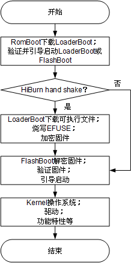
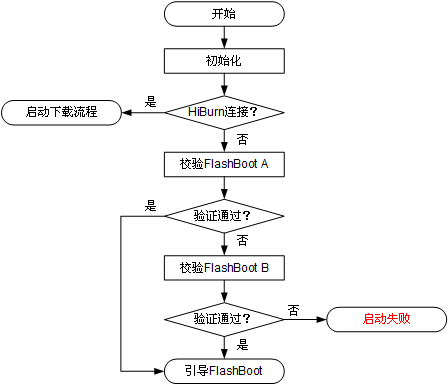
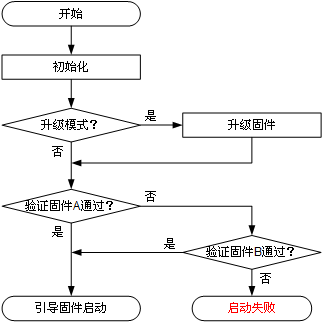

# 前言

**概述**

本文档描述了WS63V100 RomBoot、LoaderBoot及FlashBoot工作流程，用户可参考此文档对FlashBoot进行二次开发。

**产品版本**

与本文档相对应的产品版本如下。

<table><thead align="left"><tr id="row55967882"><th class="cellrowborder" valign="top" width="39.39%" id="mcps1.1.3.1.1">
<strong id="b21211131516">产品名称</strong>

</th>
<th class="cellrowborder" valign="top" width="60.61%" id="mcps1.1.3.1.2">
<strong id="b18261911191515">产品版本</strong>

</th>
</tr>
</thead>
<tbody><tr id="row39329394"><td class="cellrowborder" valign="top" width="39.39%" headers="mcps1.1.3.1.1 ">
WS63

</td>
<td class="cellrowborder" valign="top" width="60.61%" headers="mcps1.1.3.1.2 ">
V100

</td>
</tr>
</tbody>
</table>

**读者对象**

本文档主要适用于以下工程师：

-   技术支持工程师
-   软件开发工程师

**符号约定**

在本文中可能出现下列标志，它们所代表的含义如下。

<table><thead align="left"><tr id="row1530720816410"><th class="cellrowborder" valign="top" width="20.580000000000002%" id="mcps1.1.3.1.1">
<strong id="b2136615816410">符号</strong>

</th>
<th class="cellrowborder" valign="top" width="79.42%" id="mcps1.1.3.1.2">
<strong id="b5941558116410">说明</strong>

</th>
</tr>
</thead>
<tbody><tr id="row1372280416410"><td class="cellrowborder" valign="top" width="20.580000000000002%" headers="mcps1.1.3.1.1 ">

</td>
<td class="cellrowborder" valign="top" width="79.42%" headers="mcps1.1.3.1.2 ">
表示如不避免则将会导致死亡或严重伤害的具有高等级风险的危害。

</td>
</tr>
<tr id="row466863216410"><td class="cellrowborder" valign="top" width="20.580000000000002%" headers="mcps1.1.3.1.1 ">

</td>
<td class="cellrowborder" valign="top" width="79.42%" headers="mcps1.1.3.1.2 ">
表示如不避免则可能导致死亡或严重伤害的具有中等级风险的危害。

</td>
</tr>
<tr id="row123863216410"><td class="cellrowborder" valign="top" width="20.580000000000002%" headers="mcps1.1.3.1.1 ">

</td>
<td class="cellrowborder" valign="top" width="79.42%" headers="mcps1.1.3.1.2 ">
表示如不避免则可能导致轻微或中度伤害的具有低等级风险的危害。

</td>
</tr>
<tr id="row5786682116410"><td class="cellrowborder" valign="top" width="20.580000000000002%" headers="mcps1.1.3.1.1 ">

</td>
<td class="cellrowborder" valign="top" width="79.42%" headers="mcps1.1.3.1.2 ">
用于传递设备或环境安全警示信息。如不避免则可能会导致设备损坏、数据丢失、设备性能降低或其它不可预知的结果。

“须知”不涉及人身伤害。

</td>
</tr>
<tr id="row2856923116410"><td class="cellrowborder" valign="top" width="20.580000000000002%" headers="mcps1.1.3.1.1 ">

</td>
<td class="cellrowborder" valign="top" width="79.42%" headers="mcps1.1.3.1.2 ">
对正文中重点信息的补充说明。

“说明”不是安全警示信息，不涉及人身、设备及环境伤害信息。

</td>
</tr>
</tbody>
</table>

**修改记录**

<table><thead align="left"><tr id="row2942532716410"><th class="cellrowborder" valign="top" width="15.65%" id="mcps1.1.4.1.1">
<strong id="b5687322716410">文档版本</strong>

</th>
<th class="cellrowborder" valign="top" width="20.89%" id="mcps1.1.4.1.2">
<strong id="b5800814916410">发布日期</strong>

</th>
<th class="cellrowborder" valign="top" width="63.46000000000001%" id="mcps1.1.4.1.3">
<strong id="b3316380216410">修改说明</strong>

</th>
</tr>
</thead>
<tbody><tr id="row820313201511"><td class="cellrowborder" valign="top" width="15.65%" headers="mcps1.1.4.1.1 ">
01

</td>
<td class="cellrowborder" valign="top" width="20.89%" headers="mcps1.1.4.1.2 ">
2024-04-10

</td>
<td class="cellrowborder" valign="top" width="63.46000000000001%" headers="mcps1.1.4.1.3 ">
第一次正式版本发布。

</td>
</tr>
<tr id="row5947359616410"><td class="cellrowborder" valign="top" width="15.65%" headers="mcps1.1.4.1.1 ">
00B01

</td>
<td class="cellrowborder" valign="top" width="20.89%" headers="mcps1.1.4.1.2 ">
2023-12-18

</td>
<td class="cellrowborder" valign="top" width="63.46000000000001%" headers="mcps1.1.4.1.3 ">
第一次临时版本发布。

</td>
</tr>
</tbody>
</table>

# Boot简介

WS63V100 Boot分为三部分：RomBoot、FlashBoot、LoaderBoot。

-   RomBoot功能包括：
    -   加载LoaderBoot到RAM，进一步利用LoaderBoot下载镜像到Flash，烧写efuse等。
    -   校验并引导FlashBoot。FlashBoot分为AB面，A面校验成功直接启动，校验失败会去校验B面，B面校验成功，则从B面启动，否则复位重启。

-   FlashBoot功能包括：
    -   升级固件。
    -   校验并引导固件。

-   LoaderBoot功能包括：
    -   下载镜像到Flash。
    -   烧写EFUSE（例如：安全启动/Flash加密相关密钥等）。

**图 1**  Boot启动流程  

# RomBoot功能说明

## 下载镜像及烧写EFUSE

RomBoot通过加载Loaderboot实现下载镜像到Flash及烧写EFUSE的功能，具体操作请参见《WS63V100 BurnTool工具 使用指南》。

## 检验及引导Flashboot

校验并引导FlashBoot流程如[图1](#fig1578634595518)所示。

**图 1**  校验并引导FlashBoot流程图  

# LoaderBoot功能说明

LoaderBoot是直接与BurnTool进行交互的组件，RomBoot无法直接实现烧写的功能，需要将LoaderBoot加载到RAM后，跳转到LoaderBoot，进一步通过LoaderBoot完成相关内容的烧写，LoaderBoot可烧写的内容包括：

-   FlashBoot
-   EFUSE参数配置文件
-   固件镜像（包括NV参数）
-   产测镜像

> **说明：** 
>LoaderBoot一般不涉及二次开发。

# FlashBoot说明

## FlashBoot启动流程

校验并引导固件流程如[图1](#fig921910011115)所示。

**图 1**  校验并引导固件流程图  

