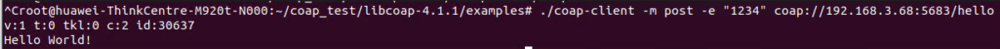
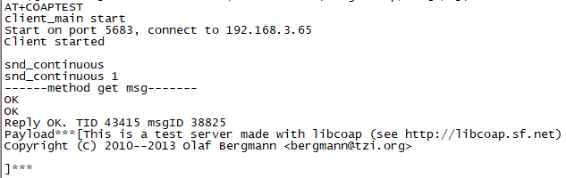

# 前言<a name="ZH-CN_TOPIC_0000001809346148"></a>

**概述<a name="section4537382116410"></a>**

CoAP，即Constrained Application Protocol（受限应用协议），是一种专为受限环境（如物联网设备）设计的轻量级网络协议。它旨在提供一种简单和有效的方式，使受限设备能够进行互联网通信。本文档介绍了基于libcoap的CoAP功能开发实现示例，以及基于lwIP（A Lightweight TCP/IP stack）协议栈对libcoap某些接口进行线程安全封装后的接口说明。

**产品版本<a name="section111371595118"></a>**

与本文档相对应的产品版本如下。

<a name="table22377277"></a>
<table><thead align="left"><tr id="row63051425"><th class="cellrowborder" valign="top" width="40.400000000000006%" id="mcps1.1.3.1.1"><p id="p6891761"><a name="p6891761"></a><a name="p6891761"></a><strong id="b35031421172411"><a name="b35031421172411"></a><a name="b35031421172411"></a>产品名称</strong></p>
</th>
<th class="cellrowborder" valign="top" width="59.599999999999994%" id="mcps1.1.3.1.2"><p id="p21361741"><a name="p21361741"></a><a name="p21361741"></a><strong id="b13516921132418"><a name="b13516921132418"></a><a name="b13516921132418"></a>产品版本</strong></p>
</th>
</tr>
</thead>
<tbody><tr id="row52579486"><td class="cellrowborder" valign="top" width="40.400000000000006%" headers="mcps1.1.3.1.1 "><p id="p31080012"><a name="p31080012"></a><a name="p31080012"></a>WS63</p>
</td>
<td class="cellrowborder" valign="top" width="59.599999999999994%" headers="mcps1.1.3.1.2 "><p id="p34453054"><a name="p34453054"></a><a name="p34453054"></a>V100</p>
</td>
</tr>
</tbody>
</table>

**读者对象<a name="section4378592816410"></a>**

本文档主要适用于以下对象：

-   软件开发工程师
-   技术支持工程师

**符号约定<a name="section133020216410"></a>**

在本文中可能出现下列标志，它们所代表的含义如下。

<a name="table2622507016410"></a>
<table><thead align="left"><tr id="row1530720816410"><th class="cellrowborder" valign="top" width="20.580000000000002%" id="mcps1.1.3.1.1"><p id="p6450074116410"><a name="p6450074116410"></a><a name="p6450074116410"></a><strong id="b2136615816410"><a name="b2136615816410"></a><a name="b2136615816410"></a>符号</strong></p>
</th>
<th class="cellrowborder" valign="top" width="79.42%" id="mcps1.1.3.1.2"><p id="p5435366816410"><a name="p5435366816410"></a><a name="p5435366816410"></a><strong id="b5941558116410"><a name="b5941558116410"></a><a name="b5941558116410"></a>说明</strong></p>
</th>
</tr>
</thead>
<tbody><tr id="row1372280416410"><td class="cellrowborder" valign="top" width="20.580000000000002%" headers="mcps1.1.3.1.1 "><p id="p3734547016410"><a name="p3734547016410"></a><a name="p3734547016410"></a><a name="image2670064316410"></a><a name="image2670064316410"></a><span></span></p>
</td>
<td class="cellrowborder" valign="top" width="79.42%" headers="mcps1.1.3.1.2 "><p id="p1757432116410"><a name="p1757432116410"></a><a name="p1757432116410"></a>表示如不避免则将会导致死亡或严重伤害的具有高等级风险的危害。</p>
</td>
</tr>
<tr id="row466863216410"><td class="cellrowborder" valign="top" width="20.580000000000002%" headers="mcps1.1.3.1.1 "><p id="p1432579516410"><a name="p1432579516410"></a><a name="p1432579516410"></a><a name="image4895582316410"></a><a name="image4895582316410"></a><span></span></p>
</td>
<td class="cellrowborder" valign="top" width="79.42%" headers="mcps1.1.3.1.2 "><p id="p959197916410"><a name="p959197916410"></a><a name="p959197916410"></a>表示如不避免则可能导致死亡或严重伤害的具有中等级风险的危害。</p>
</td>
</tr>
<tr id="row123863216410"><td class="cellrowborder" valign="top" width="20.580000000000002%" headers="mcps1.1.3.1.1 "><p id="p1232579516410"><a name="p1232579516410"></a><a name="p1232579516410"></a><a name="image1235582316410"></a><a name="image1235582316410"></a><span></span></p>
</td>
<td class="cellrowborder" valign="top" width="79.42%" headers="mcps1.1.3.1.2 "><p id="p123197916410"><a name="p123197916410"></a><a name="p123197916410"></a>表示如不避免则可能导致轻微或中度伤害的具有低等级风险的危害。</p>
</td>
</tr>
<tr id="row5786682116410"><td class="cellrowborder" valign="top" width="20.580000000000002%" headers="mcps1.1.3.1.1 "><p id="p2204984716410"><a name="p2204984716410"></a><a name="p2204984716410"></a><a name="image4504446716410"></a><a name="image4504446716410"></a><span></span></p>
</td>
<td class="cellrowborder" valign="top" width="79.42%" headers="mcps1.1.3.1.2 "><p id="p4388861916410"><a name="p4388861916410"></a><a name="p4388861916410"></a>用于传递设备或环境安全警示信息。如不避免则可能会导致设备损坏、数据丢失、设备性能降低或其它不可预知的结果。</p>
<p id="p1238861916410"><a name="p1238861916410"></a><a name="p1238861916410"></a>“须知”不涉及人身伤害。</p>
</td>
</tr>
<tr id="row2856923116410"><td class="cellrowborder" valign="top" width="20.580000000000002%" headers="mcps1.1.3.1.1 "><p id="p5555360116410"><a name="p5555360116410"></a><a name="p5555360116410"></a><a name="image799324016410"></a><a name="image799324016410"></a><span></span></p>
</td>
<td class="cellrowborder" valign="top" width="79.42%" headers="mcps1.1.3.1.2 "><p id="p4612588116410"><a name="p4612588116410"></a><a name="p4612588116410"></a>对正文中重点信息的补充说明。</p>
<p id="p1232588116410"><a name="p1232588116410"></a><a name="p1232588116410"></a>“说明”不是安全警示信息，不涉及人身、设备及环境伤害信息。</p>
</td>
</tr>
</tbody>
</table>

**修改记录<a name="section2467512116410"></a>**

<a name="table1557726816410"></a>
<table><thead align="left"><tr id="row2942532716410"><th class="cellrowborder" valign="top" width="20.72%" id="mcps1.1.4.1.1"><p id="p3778275416410"><a name="p3778275416410"></a><a name="p3778275416410"></a><strong id="b5687322716410"><a name="b5687322716410"></a><a name="b5687322716410"></a>文档版本</strong></p>
</th>
<th class="cellrowborder" valign="top" width="26.119999999999997%" id="mcps1.1.4.1.2"><p id="p5627845516410"><a name="p5627845516410"></a><a name="p5627845516410"></a><strong id="b5800814916410"><a name="b5800814916410"></a><a name="b5800814916410"></a>发布日期</strong></p>
</th>
<th class="cellrowborder" valign="top" width="53.16%" id="mcps1.1.4.1.3"><p id="p2382284816410"><a name="p2382284816410"></a><a name="p2382284816410"></a><strong id="b3316380216410"><a name="b3316380216410"></a><a name="b3316380216410"></a>修改说明</strong></p>
</th>
</tr>
</thead>
<tbody><tr id="row88399385216"><td class="cellrowborder" valign="top" width="20.72%" headers="mcps1.1.4.1.1 "><p id="p108391538162114"><a name="p108391538162114"></a><a name="p108391538162114"></a>02</p>
</td>
<td class="cellrowborder" valign="top" width="26.119999999999997%" headers="mcps1.1.4.1.2 "><p id="p118391938202114"><a name="p118391938202114"></a><a name="p118391938202114"></a>2024-06-27</p>
</td>
<td class="cellrowborder" valign="top" width="53.16%" headers="mcps1.1.4.1.3 "><a name="ul11946426152312"></a><a name="ul11946426152312"></a><ul id="ul11946426152312"><li>更新“<a href="概述.md">概述</a>”的接口说明。</li><li>更新“<a href="资源配置.md">资源配置</a>”的配置说明。</li><li>更新“<a href="代码示例.md">代码示例</a>”的代码样例。</li></ul>
</td>
</tr>
<tr id="row733754412327"><td class="cellrowborder" valign="top" width="20.72%" headers="mcps1.1.4.1.1 "><p id="p15567674319"><a name="p15567674319"></a><a name="p15567674319"></a>01</p>
</td>
<td class="cellrowborder" valign="top" width="26.119999999999997%" headers="mcps1.1.4.1.2 "><p id="p0567117232"><a name="p0567117232"></a><a name="p0567117232"></a>2024-04-10</p>
</td>
<td class="cellrowborder" valign="top" width="53.16%" headers="mcps1.1.4.1.3 "><p id="p1031614161639"><a name="p1031614161639"></a><a name="p1031614161639"></a>第一次正式版本发布。</p>
</td>
</tr>
<tr id="row5947359616410"><td class="cellrowborder" valign="top" width="20.72%" headers="mcps1.1.4.1.1 "><p id="p2149706016410"><a name="p2149706016410"></a><a name="p2149706016410"></a>00B01</p>
</td>
<td class="cellrowborder" valign="top" width="26.119999999999997%" headers="mcps1.1.4.1.2 "><p id="p648803616410"><a name="p648803616410"></a><a name="p648803616410"></a>2024-03-15</p>
</td>
<td class="cellrowborder" valign="top" width="53.16%" headers="mcps1.1.4.1.3 "><p id="p1946537916410"><a name="p1946537916410"></a><a name="p1946537916410"></a>第一次临时版本发布。</p>
</td>
</tr>
</tbody>
</table>

# API接口说明<a name="ZH-CN_TOPIC_0000001809346140"></a>


## 概述<a name="ZH-CN_TOPIC_0000001856144785"></a>

CoAP使用开源库libcoap提供基础功能支持，基于CoAP的业务实现请调用libcoap接口。对于开源库自身提供的API的使用说明请参见开源API接口说明信息,对于当前提供的libcoap适配的lwip协议栈，开源提供以下接口：

-   coap\_new\_context   创建coap上下文
-   coap\_free\_context    释放或销毁coap上下文
-   coap\_check\_notify   检查是否需要发送通知
-   coap\_send                发送coap消息
-   coap\_send\_ack         发送coap ack
-   coap\_send\_error       发送coap error
-   coap\_send\_message\_type 定义发送的coap消息类型

# 开发指南<a name="ZH-CN_TOPIC_0000001809346136"></a>


## 开发约束<a name="ZH-CN_TOPIC_0000001856144773"></a>


### 资源配置<a name="ZH-CN_TOPIC_0000001856224801"></a>

当前libcoap中使用的资源是在lwip中预分配的，资源包括支持的节点个数。context/endpoint/session/pdu/resource等个数的限制。请开发者根据需要支持的实际场景进行合理配置。具体配置的值在open\_source/libcoap/libcoap/examples/lwip/config/lwippools.h文件中进行设置，以宏的形式给出，开发者可以在该文件中进行适配修改。使用这些资源会使lwip预分配的内存池变大，增大的RAM的size,故代码中默认没有开启这些资源的预配置，需要修改build/cmake/open\_source/libcoap.cmake中全局宏定义为:

```
set(PUBLIC_DEFINES
    MEMP_USE_CUSTOM_POOLS=1
)
```

## 代码示例<a name="ZH-CN_TOPIC_0000001856144769"></a>


### 服务器<a name="ZH-CN_TOPIC_0000001856224797"></a>

以下为服务端开放get与post方法示例代码：

```
#include "lwip/netifapi.h"
#include "lwip/sockets.h"
#include "lwip/netifapi.h"
#include "lwip/sockets.h"
#include "coap3/coap.h"
#include "osal_debug.h"
#include "osal_task.h"

#define SERVER_PORT 5683
static int quit = 0;

static void hello_handler(coap_resource_t *resource, coap_session_t  *session,
             const coap_pdu_t *request, const coap_string_t *query,
             coap_pdu_t *response)
{
    unsigned char buf[3];
    const char *response_data = "Hello World!";
    char coap_msg[64] = {0};
    size_t len = 0;
    u32_t cnt;
    unsigned char *data = NULL;
    (void)resource;
    (void)query;
    if (coap_get_data(request, &len, (const uint8_t **)&data)) {
        if (len < 6) {
            osal_printk("[%s][%d] len %d\n", __FUNCTION__, __LINE__, len);
            (void)snprintf_s(coap_msg, sizeof(coap_msg), sizeof(coap_msg)-1, "%s", response_data);
            quit = 1;
        } else {
            memcpy(coap_msg, data, 4);
            (void)snprintf_s(coap_msg + 4, sizeof(coap_msg) - 4, sizeof(coap_msg) - 5, "%s", response_data);
            cnt = ntohl(*((u32_t *)data));
            len -= 4;
            data += 4;
            osal_printk("[%s][%d] <%u> len : %d, data : %.*s\n", __FUNCTION__, __LINE__, cnt, len, len, data);
            quit = 1;
        }
    }
    response->code = COAP_RESPONSE_CODE(205);
    coap_add_option(response, COAP_OPTION_CONTENT_TYPE, coap_encode_var_safe(buf, sizeof(buf),
        COAP_MEDIATYPE_TEXT_PLAIN), buf);
    coap_add_data(response, 4 + strlen(coap_msg + 4), (unsigned char *)coap_msg);
}

int server_main_task(void *p_data)
{
    coap_address_t serv_addr;
    coap_address_init(&serv_addr);
    serv_addr.port = SERVER_PORT;
    ipaddr_aton("192.168.3.68", &(serv_addr.addr)); /* 服务端ip地址 */
    coap_context_t *ctx = coap_new_context(&serv_addr);
    if (!ctx) {
        osal_printk("coap_new_context ctx = NULL\n");
        return 0;
    }

    coap_resource_t *hello_resource = coap_resource_init(coap_make_str_const("hello"), 0);
    if (hello_resource == NULL) {
        osal_printk("hello_resource = NULL\n");
    }
    coap_register_handler(hello_resource, COAP_REQUEST_GET, hello_handler);
    coap_register_handler(hello_resource, COAP_REQUEST_POST, hello_handler);
    coap_add_resource(ctx, hello_resource);
    /*Listen for incoming connections */
    osal_printk("Server listening for connections\n");

    while (!quit) { /* 根据需求改变停止条件 */
        osal_msleep(1000);
        uapi_watchdog_kick();
    }
    osal_printk("Process terminated\n");
    return 0;
}

int server_main(void)
{
    osal_task *coap_server_thread = osal_kthread_create(server_main_task, NULL, "coap_server", 0x1200);
    if (coap_server_thread == NULL) {
        osal_printk("create server_main_task kthread failed\n");
        return -1;
    }

    osal_kthread_set_priority(coap_server_thread, 20);
    return 0;
}
```

客户端用post方法获取response结果如下图：



### 客户端<a name="ZH-CN_TOPIC_0000001809505996"></a>

以下为客户端以get方法获取服务端响应的示例代码：

```

#include "lwip/netifapi.h"
#include "lwip/sockets.h"
#include "coap3/coap.h"
#include "osal_debug.h"
#define SERVER_PORT 5683
#define PAYLOAD_SIZE 60
#define MICE_URI "/"
static coap_context_t *g_ctx = NULL;

static coap_response_t mice_handler(coap_session_t *session, const coap_pdu_t *sent, const coap_pdu_t *received,
    const coap_mid_t mid)
{
    unsigned char *data;
    size_t data_len;
    if (COAP_RESPONSE_CLASS(received->code) == 2) {
        if (coap_get_data(received, &data_len, (const uint8_t **)&data)) {
            osal_printk("Reply OK. TID %d msgID %d\n", mid, ntohs(received->mid));
            osal_printk("Payload***[%s]***\n", data);
        }
    } else {
        osal_printk("code error");
        osal_printk("Mice unsuccessful, code: %hu \n", received->code);
    }
}
static void coap_recv_client(void *arg, struct udp_pcb *upcb, struct pbuf *p, const ip_addr_t *addr, u16_t port)
{
    coap_session_t *session = arg;
    coap_pdu_t *pdu = coap_new_pdu(COAP_MESSAGE_CON, COAP_REQUEST_GET, session);
    memset_s(pdu, sizeof(coap_pdu_t), 0, sizeof(coap_pdu_t));
    pdu->max_hdr_size = COAP_PDU_MAX_UDP_HEADER_SIZE;
    pdu->pbuf = p;
    pdu->token = (uint8_t *)p->payload + pdu->max_hdr_size;
    pdu->alloc_size = p->tot_len - pdu->max_hdr_size;
    coap_pdu_clear(pdu, pdu->alloc_size);
    if (!coap_pdu_parse(COAP_PROTO_UDP, p->payload, p->len, pdu)) {
        return;
    }
    coap_dispatch(g_ctx, session, pdu);
    (void)pbuf_free(p);
    pdu->pbuf = NULL;
    coap_delete_pdu(pdu);
    udp_remove(session->sock.pcb);
    if (g_ctx != NULL) {
        coap_free_context(g_ctx);
        g_ctx = NULL;
    }
    coap_session_release(session);
}

void snd_msg(void)
{
    osal_printk("------method get msg-------\n");
    coap_pdu_t *request = coap_pdu_init(COAP_MESSAGE_CON, COAP_REQUEST_GET, coap_new_message_id(g_ctx->sessions),
        coap_session_max_pdu_size(g_ctx->sessions));
    if (request == NULL) {
        osal_printk("request init error");
        return;
    }
    coap_uri_t uri;
    coap_split_uri((const uint8_t *)MICE_URI, strlen(MICE_URI), &uri);
    coap_add_option(request, COAP_OPTION_URI_PATH, uri.path.length, uri.path.s);

    char *request_data = (char *)malloc(64);
    if (request_data == NULL) {
        osal_printk("[%s][%d]: malloc error\n", __FUNCTION__, __LINE__);
        return;
    }
    (void)snprintf_s(request_data + 4, sizeof(request_data) - 4, sizeof(request_data)-5, "%s", "testcoap");

    coap_add_data(request, 4 + strlen((const char *)(request_data+4)), (unsigned char *)request_data);
    free(request_data);
    if (coap_send(g_ctx->sessions, request) < 0) {
        osal_printk("[%s][%d]: coap send error\n", __FUNCTION__, __LINE__);
    }
    return;
}
void snd_continuous(char *address, int port)
{
    if (g_ctx == NULL) {
        osal_printk("snd_continuous 1\r\n");
        coap_address_t src_addr;
        coap_address_init(&src_addr);
        ip_addr_set_any(false, &(src_addr.addr));
        src_addr.port = port;
        g_ctx = coap_new_context(NULL);
        if (g_ctx == NULL) {
            osal_printk("new context error\n");
            return;
        }
        coap_context_set_keepalive(g_ctx, 60);
        coap_address_t dst_addr;
        coap_address_init(&dst_addr);
        ipaddr_aton(address, &(dst_addr.addr));
        dst_addr.port = port;
        coap_session_t *session = coap_new_client_session(g_ctx, NULL, &dst_addr, COAP_PROTO_UDP);
        if (session == NULL) {
            osal_printk("------session is null\n");
            return;
        }
        session->sock.pcb = udp_new_ip_type(IPADDR_TYPE_ANY);
        if (session->sock.pcb == NULL) {
            osal_printk("coap_new_endpoint: udp new fail\n");
            return;
        }
        session->sock.pcb->netif_idx = NETIF_NO_INDEX;
        udp_recv(session->sock.pcb, coap_recv_client, session);
        if (udp_bind(session->sock.pcb, &(src_addr.addr), 0)) {
            osal_printk("--------udp bind error\n");
            udp_remove(session->sock.pcb);
            return;
        }
        /* register mice handler */ 
        coap_register_response_handler(g_ctx, mice_handler);
    }
    snd_msg();
}

int coap_client(void)
{
    osal_printk("client_main start\n");
    int port = 5683; /* coap服务端口 */
    char *address = "192.168.3.65"; /* 服务端ip地址 */
    osal_printk("Start on port %d, connect to %s\n", port, address);
    osal_printk("Client started\n");
    osal_printk("\r\nsnd_continuous\r\n");
    snd_continuous(address, port);
    return 0;
}


```

服务端的响应如下图：



