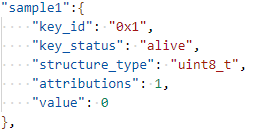
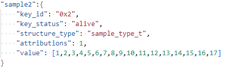

# 前言<a name="ZH-CN_TOPIC_0000001814189501"></a>

**概述<a name="section4537382116410"></a>**

本文档主要针对WS63V100中NV存储模块的使用进行介绍。用于指导工程人员能够快速使用NV模块进行二次开发。

**产品版本<a name="section27775771"></a>**

与本文档相对应的产品版本如下。

<a name="table52250146"></a>
<table><thead align="left"><tr id="row55967882"><th class="cellrowborder" valign="top" width="39.39%" id="mcps1.1.3.1.1"><p id="p37104584"><a name="p37104584"></a><a name="p37104584"></a><strong id="b48174912328"><a name="b48174912328"></a><a name="b48174912328"></a>产品名称</strong></p>
</th>
<th class="cellrowborder" valign="top" width="60.61%" id="mcps1.1.3.1.2"><p id="p52681331"><a name="p52681331"></a><a name="p52681331"></a><strong id="b682239163211"><a name="b682239163211"></a><a name="b682239163211"></a>产品版本</strong></p>
</th>
</tr>
</thead>
<tbody><tr id="row39329394"><td class="cellrowborder" valign="top" width="39.39%" headers="mcps1.1.3.1.1 "><p id="p15727111613530"><a name="p15727111613530"></a><a name="p15727111613530"></a>WS63</p>
</td>
<td class="cellrowborder" valign="top" width="60.61%" headers="mcps1.1.3.1.2 "><p id="p34453054"><a name="p34453054"></a><a name="p34453054"></a>V100</p>
</td>
</tr>
</tbody>
</table>

**读者对象<a name="section4378592816410"></a>**

本文档主要适用于以下工程师：

-   技术支持工程师
-   软件工程师

**符号约定<a name="section133020216410"></a>**

在本文中可能出现下列标志，它们所代表的含义如下。

<a name="table2622507016410"></a>
<table><thead align="left"><tr id="row1530720816410"><th class="cellrowborder" valign="top" width="20.580000000000002%" id="mcps1.1.3.1.1"><p id="p6450074116410"><a name="p6450074116410"></a><a name="p6450074116410"></a><strong id="b2136615816410"><a name="b2136615816410"></a><a name="b2136615816410"></a>符号</strong></p>
</th>
<th class="cellrowborder" valign="top" width="79.42%" id="mcps1.1.3.1.2"><p id="p5435366816410"><a name="p5435366816410"></a><a name="p5435366816410"></a><strong id="b5941558116410"><a name="b5941558116410"></a><a name="b5941558116410"></a>说明</strong></p>
</th>
</tr>
</thead>
<tbody><tr id="row1372280416410"><td class="cellrowborder" valign="top" width="20.580000000000002%" headers="mcps1.1.3.1.1 "><p id="p3734547016410"><a name="p3734547016410"></a><a name="p3734547016410"></a><a name="image2670064316410"></a><a name="image2670064316410"></a><span></span></p>
</td>
<td class="cellrowborder" valign="top" width="79.42%" headers="mcps1.1.3.1.2 "><p id="p1757432116410"><a name="p1757432116410"></a><a name="p1757432116410"></a>表示如不避免则将会导致死亡或严重伤害的具有高等级风险的危害。</p>
</td>
</tr>
<tr id="row466863216410"><td class="cellrowborder" valign="top" width="20.580000000000002%" headers="mcps1.1.3.1.1 "><p id="p1432579516410"><a name="p1432579516410"></a><a name="p1432579516410"></a><a name="image4895582316410"></a><a name="image4895582316410"></a><span></span></p>
</td>
<td class="cellrowborder" valign="top" width="79.42%" headers="mcps1.1.3.1.2 "><p id="p959197916410"><a name="p959197916410"></a><a name="p959197916410"></a>表示如不避免则可能导致死亡或严重伤害的具有中等级风险的危害。</p>
</td>
</tr>
<tr id="row123863216410"><td class="cellrowborder" valign="top" width="20.580000000000002%" headers="mcps1.1.3.1.1 "><p id="p1232579516410"><a name="p1232579516410"></a><a name="p1232579516410"></a><a name="image1235582316410"></a><a name="image1235582316410"></a><span></span></p>
</td>
<td class="cellrowborder" valign="top" width="79.42%" headers="mcps1.1.3.1.2 "><p id="p123197916410"><a name="p123197916410"></a><a name="p123197916410"></a>表示如不避免则可能导致轻微或中度伤害的具有低等级风险的危害。</p>
</td>
</tr>
<tr id="row5786682116410"><td class="cellrowborder" valign="top" width="20.580000000000002%" headers="mcps1.1.3.1.1 "><p id="p2204984716410"><a name="p2204984716410"></a><a name="p2204984716410"></a><a name="image4504446716410"></a><a name="image4504446716410"></a><span></span></p>
</td>
<td class="cellrowborder" valign="top" width="79.42%" headers="mcps1.1.3.1.2 "><p id="p4388861916410"><a name="p4388861916410"></a><a name="p4388861916410"></a>用于传递设备或环境安全警示信息。如不避免则可能会导致设备损坏、数据丢失、设备性能降低或其它不可预知的结果。</p>
<p id="p1238861916410"><a name="p1238861916410"></a><a name="p1238861916410"></a>“须知”不涉及人身伤害。</p>
</td>
</tr>
<tr id="row2856923116410"><td class="cellrowborder" valign="top" width="20.580000000000002%" headers="mcps1.1.3.1.1 "><p id="p5555360116410"><a name="p5555360116410"></a><a name="p5555360116410"></a><a name="image799324016410"></a><a name="image799324016410"></a><span></span></p>
</td>
<td class="cellrowborder" valign="top" width="79.42%" headers="mcps1.1.3.1.2 "><p id="p4612588116410"><a name="p4612588116410"></a><a name="p4612588116410"></a>对正文中重点信息的补充说明。</p>
<p id="p1232588116410"><a name="p1232588116410"></a><a name="p1232588116410"></a>“说明”不是安全警示信息，不涉及人身、设备及环境伤害信息。</p>
</td>
</tr>
</tbody>
</table>

**修改记录<a name="section2467512116410"></a>**

<a name="table1557726816410"></a>
<table><thead align="left"><tr id="row2942532716410"><th class="cellrowborder" valign="top" width="20.05%" id="mcps1.1.4.1.1"><p id="p3778275416410"><a name="p3778275416410"></a><a name="p3778275416410"></a><strong id="b5687322716410"><a name="b5687322716410"></a><a name="b5687322716410"></a>文档版本</strong></p>
</th>
<th class="cellrowborder" valign="top" width="22.73%" id="mcps1.1.4.1.2"><p id="p5627845516410"><a name="p5627845516410"></a><a name="p5627845516410"></a><strong id="b5800814916410"><a name="b5800814916410"></a><a name="b5800814916410"></a>发布日期</strong></p>
</th>
<th class="cellrowborder" valign="top" width="57.220000000000006%" id="mcps1.1.4.1.3"><p id="p2382284816410"><a name="p2382284816410"></a><a name="p2382284816410"></a><strong id="b3316380216410"><a name="b3316380216410"></a><a name="b3316380216410"></a>修改说明</strong></p>
</th>
</tr>
</thead>
<tbody><tr id="row1665734332"><td class="cellrowborder" valign="top" width="20.05%" headers="mcps1.1.4.1.1 "><p id="p266643410314"><a name="p266643410314"></a><a name="p266643410314"></a>06</p>
</td>
<td class="cellrowborder" valign="top" width="22.73%" headers="mcps1.1.4.1.2 "><p id="p35211530171912"><a name="p35211530171912"></a><a name="p35211530171912"></a>2025-08-29</p>
</td>
<td class="cellrowborder" valign="top" width="57.220000000000006%" headers="mcps1.1.4.1.3 "><p id="p143800371535"><a name="p143800371535"></a><a name="p143800371535"></a>更新“<a href="NV项汇总.md">NV项汇总</a>”章节。</p>
</td>
</tr>
<tr id="row8216208269"><td class="cellrowborder" valign="top" width="20.05%" headers="mcps1.1.4.1.1 "><p id="p1521162052615"><a name="p1521162052615"></a><a name="p1521162052615"></a>05</p>
</td>
<td class="cellrowborder" valign="top" width="22.73%" headers="mcps1.1.4.1.2 "><p id="p142102042616"><a name="p142102042616"></a><a name="p142102042616"></a>2025-02-28</p>
</td>
<td class="cellrowborder" valign="top" width="57.220000000000006%" headers="mcps1.1.4.1.3 "><p id="p9190113618286"><a name="p9190113618286"></a><a name="p9190113618286"></a>更新“<a href="NV项汇总.md">NV项汇总</a>”章节。</p>
</td>
</tr>
<tr id="row04432872711"><td class="cellrowborder" valign="top" width="20.05%" headers="mcps1.1.4.1.1 "><p id="p6443148102716"><a name="p6443148102716"></a><a name="p6443148102716"></a>04</p>
</td>
<td class="cellrowborder" valign="top" width="22.73%" headers="mcps1.1.4.1.2 "><p id="p14435819274"><a name="p14435819274"></a><a name="p14435819274"></a>2024-10-14</p>
</td>
<td class="cellrowborder" valign="top" width="57.220000000000006%" headers="mcps1.1.4.1.3 "><p id="p6709115652710"><a name="p6709115652710"></a><a name="p6709115652710"></a>更新“<a href="编译生成NV镜像.md">编译生成NV镜像</a>”小节内容。</p>
</td>
</tr>
<tr id="row1650123114275"><td class="cellrowborder" valign="top" width="20.05%" headers="mcps1.1.4.1.1 "><p id="p19501731112720"><a name="p19501731112720"></a><a name="p19501731112720"></a>03</p>
</td>
<td class="cellrowborder" valign="top" width="22.73%" headers="mcps1.1.4.1.2 "><p id="p1950143120271"><a name="p1950143120271"></a><a name="p1950143120271"></a>2024-05-30</p>
</td>
<td class="cellrowborder" valign="top" width="57.220000000000006%" headers="mcps1.1.4.1.3 "><a name="ul118461738112714"></a><a name="ul118461738112714"></a><ul id="ul118461738112714"><li>更新“<a href="功能描述.md">功能描述</a>”小节内容。</li><li>更新“<a href="接口说明.md">接口说明</a>”小节内容。</li></ul>
</td>
</tr>
<tr id="row11286029144112"><td class="cellrowborder" valign="top" width="20.05%" headers="mcps1.1.4.1.1 "><p id="p1228610295417"><a name="p1228610295417"></a><a name="p1228610295417"></a>02</p>
</td>
<td class="cellrowborder" valign="top" width="22.73%" headers="mcps1.1.4.1.2 "><p id="p4286192915418"><a name="p4286192915418"></a><a name="p4286192915418"></a>2024-05-07</p>
</td>
<td class="cellrowborder" valign="top" width="57.220000000000006%" headers="mcps1.1.4.1.3 "><p id="p6912153815411"><a name="p6912153815411"></a><a name="p6912153815411"></a>更新“<a href="接口说明.md">接口说明</a>”小节内容。</p>
</td>
</tr>
<tr id="row27873516817"><td class="cellrowborder" valign="top" width="20.05%" headers="mcps1.1.4.1.1 "><p id="p15787351589"><a name="p15787351589"></a><a name="p15787351589"></a>01</p>
</td>
<td class="cellrowborder" valign="top" width="22.73%" headers="mcps1.1.4.1.2 "><p id="p47814359819"><a name="p47814359819"></a><a name="p47814359819"></a>2024-04-10</p>
</td>
<td class="cellrowborder" valign="top" width="57.220000000000006%" headers="mcps1.1.4.1.3 "><p id="p97833513813"><a name="p97833513813"></a><a name="p97833513813"></a>第一次正式版本发布。</p>
<a name="ul19528167192610"></a><a name="ul19528167192610"></a><ul id="ul19528167192610"><li>更新“<a href="功能描述.md">功能描述</a>”小节内容。</li><li>更新“<a href="接口说明.md">接口说明</a>”小节内容。</li><li>更新“<a href="开发指引.md">开发指引</a>”小节内容。</li></ul>
</td>
</tr>
<tr id="row171014397454"><td class="cellrowborder" valign="top" width="20.05%" headers="mcps1.1.4.1.1 "><p id="p1810133910458"><a name="p1810133910458"></a><a name="p1810133910458"></a>00B02</p>
</td>
<td class="cellrowborder" valign="top" width="22.73%" headers="mcps1.1.4.1.2 "><p id="p6101739104519"><a name="p6101739104519"></a><a name="p6101739104519"></a>2024-03-29</p>
</td>
<td class="cellrowborder" valign="top" width="57.220000000000006%" headers="mcps1.1.4.1.3 "><p id="p151073917451"><a name="p151073917451"></a><a name="p151073917451"></a>新增“<a href="NV项汇总.md">NV项汇总</a>”章节。</p>
</td>
</tr>
<tr id="row5947359616410"><td class="cellrowborder" valign="top" width="20.05%" headers="mcps1.1.4.1.1 "><p id="p2149706016410"><a name="p2149706016410"></a><a name="p2149706016410"></a>00B01</p>
</td>
<td class="cellrowborder" valign="top" width="22.73%" headers="mcps1.1.4.1.2 "><p id="p648803616410"><a name="p648803616410"></a><a name="p648803616410"></a>2024-01-10</p>
</td>
<td class="cellrowborder" valign="top" width="57.220000000000006%" headers="mcps1.1.4.1.3 "><p id="p1946537916410"><a name="p1946537916410"></a><a name="p1946537916410"></a>第一次临时版本发布。</p>
</td>
</tr>
</tbody>
</table>

# NV简介<a name="ZH-CN_TOPIC_0000001814229573"></a>

NV模块用于本地存储器中存储非易失性数据。NV中的每项数据以类似key-value的方式进行定义，数据项中包含唯一的索引key和自定义数据类型的value。

NV项可通过两种方式进行存储：编译预置和API写入。

-   编译预置是指开发者可在代码编译阶段，通过修改NV头文件和NV配置文件的方式生成客制化的NV镜像，在镜像烧录的过程中统一烧录到存储介质中。预置的NV在代码运行阶段可通过API接口进行读取和更新。
-   API写入是指用户可直接在代码中调用API接口写入新的NV项，具体使用方法请参见“[NV API指南](NV-API指南.md)”。

# NV编译预置<a name="ZH-CN_TOPIC_0000001767549426"></a>

编译预置的方式不支持加密NV项的生成。如需写入加密NV项，必须使用API接口。


## 新增NV项<a name="ZH-CN_TOPIC_0000001767389742"></a>


### 新增NV项流程<a name="ZH-CN_TOPIC_0000001814229577"></a>

1.  在头文件中新增kvalue的数据类型定义（非必须，如果是通用类型数据可忽略此步骤）。
2.  在json文件中新增NV描述项。

**新增kvalue数据类型<a name="section206861047121115"></a>**

-   通用数据类型：

    unit8\_t、unit16\_t、unit32\_t、bool。

-   自定义数据类型：

    支持自定义枚举（enum）类型和结构体（struct）类型。

-   自定义数据类型存放路径：

    middleware/chips/ws63/nv/nv\_config/include/nv\_common\_cfg.h

-   当用户使用通用或已定义的数据类型时，不涉及上述文件的修改；当用户要新增枚举或结构体类型时，需在上述文件中定义。

**新增NV描述项<a name="section13134513141310"></a>**

-   NV描述项文件路径：

    middleware/chips/ws63/nv/nv\_config/cfg/acore/app.json

-   定义说明：

    **表 1**  NV配置选项说明

    <a name="table8802115017551"></a>
    <table><thead align="left"><tr id="row3802550105510"><th class="cellrowborder" valign="top" width="29.18%" id="mcps1.2.3.1.1"><p id="p680265010550"><a name="p680265010550"></a><a name="p680265010550"></a>NV配置选项</p>
    </th>
    <th class="cellrowborder" valign="top" width="70.82000000000001%" id="mcps1.2.3.1.2"><p id="p7802115012558"><a name="p7802115012558"></a><a name="p7802115012558"></a>说明</p>
    </th>
    </tr>
    </thead>
    <tbody><tr id="row1780215504558"><td class="cellrowborder" valign="top" width="29.18%" headers="mcps1.2.3.1.1 "><p id="p188021550125516"><a name="p188021550125516"></a><a name="p188021550125516"></a>key_id</p>
    </td>
    <td class="cellrowborder" valign="top" width="70.82000000000001%" headers="mcps1.2.3.1.2 "><p id="p198021950105511"><a name="p198021950105511"></a><a name="p198021950105511"></a>NV项的ID。</p>
    </td>
    </tr>
    <tr id="row198025507556"><td class="cellrowborder" valign="top" width="29.18%" headers="mcps1.2.3.1.1 "><p id="p14802115012556"><a name="p14802115012556"></a><a name="p14802115012556"></a>key_status</p>
    </td>
    <td class="cellrowborder" valign="top" width="70.82000000000001%" headers="mcps1.2.3.1.2 "><p id="p1780235085512"><a name="p1780235085512"></a><a name="p1780235085512"></a>NV项的状态。</p>
    </td>
    </tr>
    <tr id="row480295035518"><td class="cellrowborder" valign="top" width="29.18%" headers="mcps1.2.3.1.1 "><p id="p18021450165513"><a name="p18021450165513"></a><a name="p18021450165513"></a>structure_type</p>
    </td>
    <td class="cellrowborder" valign="top" width="70.82000000000001%" headers="mcps1.2.3.1.2 "><p id="p198021450155516"><a name="p198021450155516"></a><a name="p198021450155516"></a>NV项的数据结构类型。</p>
    </td>
    </tr>
    <tr id="row1580225015551"><td class="cellrowborder" valign="top" width="29.18%" headers="mcps1.2.3.1.1 "><p id="p880245035512"><a name="p880245035512"></a><a name="p880245035512"></a>attributions</p>
    </td>
    <td class="cellrowborder" valign="top" width="70.82000000000001%" headers="mcps1.2.3.1.2 "><p id="p1280225015519"><a name="p1280225015519"></a><a name="p1280225015519"></a>NV项的属性值。</p>
    </td>
    </tr>
    <tr id="row10802125014557"><td class="cellrowborder" valign="top" width="29.18%" headers="mcps1.2.3.1.1 "><p id="p20802450155516"><a name="p20802450155516"></a><a name="p20802450155516"></a>value</p>
    </td>
    <td class="cellrowborder" valign="top" width="70.82000000000001%" headers="mcps1.2.3.1.2 "><p id="p08025503552"><a name="p08025503552"></a><a name="p08025503552"></a>NV项的数据。</p>
    </td>
    </tr>
    </tbody>
    </table>

    NV配置文件示例如下：

    ```
    "common":{
        "module id":"0x0",
    
        "unused":{
            "key_id":"0x0"
            "key_status":"reserve"
            "structure_type": "uint8_t",
            "attributions":1,
            "value":[0]
        }
        "sample":{
            "key_id":"0xl"
            "key_status": "alive"
            "structure_type":"sample_type_t"
            "attributions":1,
            "value":[1,2,3,4,5,6,7,8,9,10,11,12,13,14,15,16,17]
        }
    }
    ```

    在NV的配置中，每个字段的详细描述如下：

    -   key\_id：

        以十六进制形式给出的NV项ID。key\_id必须唯一，不能重复，因此建议用户在“key\_id.h”中预留的用户区间内取值，避免不同模块使用NV互相影响。

    -   key\_status：

        用于标记是否将该项的NV值编到生成的bin文件中。该字段为“alive”，表示NV项生效，当前固件版本正在使用此key；若为其他的字段或空，则不生效。

    -   structure\_type：

        NV项的数据类型。已在“[新增kvalue数据类型](#section206861047121115)”中详细描述。

    -   attributions：NV项属性值。1 、2、4为互斥关系，三选一。

        1：Normal nv（普通NV，可修改）。

        2：Permanent nv（不可修改）。

        4：Un-upgrade nv（不随版本升级而修改）。

    -   value：

        如果value不是上述通用数据类型，任何结构都必须以列表的形式书写，有如下两种情况：

        -   列表所有成员全部赋值。
        -   只对列表前面若干个成员赋值。这表明对末尾未赋值的成员缺省赋值为0。

### 新增NV项示例<a name="ZH-CN_TOPIC_0000001814189497"></a>

-   在“middleware/chips/ws63/nv/nv\_config/include/nv\_common\_cfg.h”文件中新增自定义结构体。新增自定义数据类型示例如下：
    -   新增结构体类型且结构体内都为基础类型：

        ```
        typedef struct {
            int8_t param1;
            int8_t param2;
            int8_t param3;
            int8_t param4;
            int8_t param5;
            uint32_t param6;
            uint32_t param7;
            int32_t param8;
            uint32_t param9;
            uint32_t param10;
            uint32_t param11;
            uint32_t param12;
            uint32_t param13;
            uint32_t param14;
            uint32_t param15;
            uint32_t param16;
            uint32_t param17;
        } sample_type_t;
        ```

    -   新增结构体类型且结构体内有数组类型：

        ```
        typedef struct {
            uint16_t param1; 
            uint16_t param2; 
            uint16_t param3;
            uint16_t param4[2];
        } sample_two;
        ```

    -   新增枚举类型：

        ```
        typedef enum {
            PARAM1,
            PARAM2,
            PARAM3,
            PARAM4
        } sample_three;
        ```

-   在“middleware/chips/ws63/nv/nv\_config/cfg/acore/app.json”文件中添加新的NV项。
    -   当kvalue预置值类型是基础类型时，添加kvalue预置值如[图1](#fig1025212135315)所示，可在“app.json”配置文件直接添加，无需在头文件中新增。

        **图 1**  添加基础类型kvalue预置值<a name="fig1025212135315"></a>  
        

    -   当kvalue预置值类型是结构体类型时，添加kvalue预置值如[图2](#fig655920623220)所示，该kvalue值要对应头文件中已有的结构体，如果没有需手动添加自定义结构体。

        **图 2**  添加结构体类型kvalue预置值<a name="fig655920623220"></a>  
        

## 编译生成NV镜像<a name="ZH-CN_TOPIC_0000001767549430"></a>

> **须知：** 
>使用build.py编译非boot目标，如ws63-liteos-app、ws63-liteos-xts等时，会默认编译生成NV镜像并打包，打包时默认仅包含ws63\_all\_nv.bin，不包含ws63\_all\_nv\_factory.bin，若需打包ws63\_all\_nv\_factory.bin，可在编译命令中加入额外参数进行打包，例如：“python3 build.py -c ws63-liteos-app -def=PACKET\_NV\_FACTORY;”。

在全量编译时自动生成NV镜像，如[图 build\_nvbin.py脚本执行成功](#fig14910136115720)所示即为成功，即可在输出路径下生成“ws63\_all\_nv.bin”文件，可直接烧录使用。

输出路径：output\\ws63\\acore\\nv\_bin\\ws63\_all\_nv.bin

**图 1**  build\_nvbin.py脚本执行成功<a name="fig14910136115720"></a>  


# NV API指南<a name="ZH-CN_TOPIC_0000001814189493"></a>


## 功能描述<a name="ZH-CN_TOPIC_0000001767389746"></a>

NV 当前支持存储最多16K\(存在管理结构体占用空间，实际略小于16K\)数据，备份分区大小与NV主区一致，总计占用32K flash 空间，API主要提供以下几种功能：

-   NV项写入：

    保存需要存储的格式化数据。除普通属性的NV外，还可以设置NV项是否永久存储、是否加密存储和是否不可升级。

-   NV项读取：

    从本地存储器读取NV数据。

-   NV信息查询：
    -   查询NV是否已存储于本地存储器中。
    -   查询NV空间的使用状态。

-   NV数据备份
    -   对NV数据进行备份，仅在退出产测模式时会自动进行备份，不接受手动备份。

-   NV数据恢复
    -   对NV数据进行恢复，可实现全量和部分恢复。

NV项的写入接口可设置NV项的属性，对于通过API动态添加的NV项，可在其写入的接口中传入其所拥有的特殊属性。

> **须知：** 
>NV数据写入flash不可避免的会增加flash的擦写次数，消耗flash寿命，甚至缩短产品使用年限。因此，一定要避免频繁写入NV数据。电池类产品设备，运行数据不会丢失，建议只在关机前写入要保存的NV数据，减少数据写入次数

## 接口说明<a name="ZH-CN_TOPIC_0000001814229569"></a>

使用NV接口需要引用NV接口头文件，路径：include/middleware/utils/nv.h

NV模块主要提供以下API：

```
errcode_t uapi_nv_write(uint16_t key, const uint8_t *kvalue, uint16_t kvalue_length)
```

<a name="table6707155564719"></a>
<table><thead align="left"><tr id="row4707135514715"><th class="cellrowborder" valign="top" width="23.150000000000002%" id="mcps1.1.3.1.1"><p id="p770717558479"><a name="p770717558479"></a><a name="p770717558479"></a>uapi_nv_write</p>
</th>
<th class="cellrowborder" valign="top" width="76.85%" id="mcps1.1.3.1.2"><p id="p11707755204711"><a name="p11707755204711"></a><a name="p11707755204711"></a>写入NV数据项，默认属性Normal，无回调函数，写入成功时返回ERRCODE_SUCC，其他返回错误码。</p>
</th>
</tr>
</thead>
<tbody><tr id="row67071055184710"><td class="cellrowborder" valign="top" width="23.150000000000002%" headers="mcps1.1.3.1.1 "><p id="p10707115514471"><a name="p10707115514471"></a><a name="p10707115514471"></a>key</p>
</td>
<td class="cellrowborder" valign="top" width="76.85%" headers="mcps1.1.3.1.2 "><p id="p27071855154716"><a name="p27071855154716"></a><a name="p27071855154716"></a>要写入的NV项的key ID，用于索引。</p>
</td>
</tr>
<tr id="row1707165554718"><td class="cellrowborder" valign="top" width="23.150000000000002%" headers="mcps1.1.3.1.1 "><p id="p13707185512478"><a name="p13707185512478"></a><a name="p13707185512478"></a>*kvalue</p>
</td>
<td class="cellrowborder" valign="top" width="76.85%" headers="mcps1.1.3.1.2 "><p id="p137072555474"><a name="p137072555474"></a><a name="p137072555474"></a>指向要写入的NV项的值的指针。</p>
</td>
</tr>
<tr id="row1370775524718"><td class="cellrowborder" valign="top" width="23.150000000000002%" headers="mcps1.1.3.1.1 "><p id="p1870725518470"><a name="p1870725518470"></a><a name="p1870725518470"></a>kvalue_length</p>
</td>
<td class="cellrowborder" valign="top" width="76.85%" headers="mcps1.1.3.1.2 "><p id="p370714556478"><a name="p370714556478"></a><a name="p370714556478"></a>写入数据的长度，单位：Byte。对于非加密NV项，支持最大值为4060；加密NV项为4048。</p>
</td>
</tr>
</tbody>
</table>

```
errcode_t uapi_nv_write_with_attr(uint16_t key, const uint8_t *kvalue, uint16_t kvalue_length,nv_key_attr_t *attr, nv_storage_completed_callback func)
```

<a name="table7346114574915"></a>
<table><thead align="left"><tr id="row23461045114920"><th class="cellrowborder" valign="top" width="23.39%" id="mcps1.1.3.1.1"><p id="p1634612458495"><a name="p1634612458495"></a><a name="p1634612458495"></a>uapi_nv_write_with_attr</p>
</th>
<th class="cellrowborder" valign="top" width="76.61%" id="mcps1.1.3.1.2"><p id="p5346114514496"><a name="p5346114514496"></a><a name="p5346114514496"></a>写入NV数据项，并根据业务需求配置属性及回调函数，写入成功时返回ERRCODE_SUCC，其他返回错误码。</p>
</th>
</tr>
</thead>
<tbody><tr id="row234634518498"><td class="cellrowborder" valign="top" width="23.39%" headers="mcps1.1.3.1.1 "><p id="p1734644517499"><a name="p1734644517499"></a><a name="p1734644517499"></a>key</p>
</td>
<td class="cellrowborder" valign="top" width="76.61%" headers="mcps1.1.3.1.2 "><p id="p10346174515497"><a name="p10346174515497"></a><a name="p10346174515497"></a>要写入的NV项的key ID，用于索引。</p>
</td>
</tr>
<tr id="row13346154584913"><td class="cellrowborder" valign="top" width="23.39%" headers="mcps1.1.3.1.1 "><p id="p3346114524910"><a name="p3346114524910"></a><a name="p3346114524910"></a>*kvalue</p>
</td>
<td class="cellrowborder" valign="top" width="76.61%" headers="mcps1.1.3.1.2 "><p id="p434694554919"><a name="p434694554919"></a><a name="p434694554919"></a>指向要写入的NV项的值的指针。</p>
</td>
</tr>
<tr id="row134615453495"><td class="cellrowborder" valign="top" width="23.39%" headers="mcps1.1.3.1.1 "><p id="p5346645194914"><a name="p5346645194914"></a><a name="p5346645194914"></a>kvalue_length</p>
</td>
<td class="cellrowborder" valign="top" width="76.61%" headers="mcps1.1.3.1.2 "><p id="p134604511495"><a name="p134604511495"></a><a name="p134604511495"></a>写入数据的长度，单位：Byte。对于非加密NV项，支持最大值为4060；加密NV项为4048。</p>
</td>
</tr>
<tr id="row027852165114"><td class="cellrowborder" valign="top" width="23.39%" headers="mcps1.1.3.1.1 "><p id="p162835235120"><a name="p162835235120"></a><a name="p162835235120"></a>*attr</p>
</td>
<td class="cellrowborder" valign="top" width="76.61%" headers="mcps1.1.3.1.2 "><p id="p4281152165118"><a name="p4281152165118"></a><a name="p4281152165118"></a>要配置的NV项的属性。</p>
</td>
</tr>
<tr id="row446465925112"><td class="cellrowborder" valign="top" width="23.39%" headers="mcps1.1.3.1.1 "><p id="p44641659175110"><a name="p44641659175110"></a><a name="p44641659175110"></a>func</p>
</td>
<td class="cellrowborder" valign="top" width="76.61%" headers="mcps1.1.3.1.2 "><p id="p1446413592510"><a name="p1446413592510"></a><a name="p1446413592510"></a>kvalue写入Flash后调用的回调函数。当前不支持。</p>
</td>
</tr>
</tbody>
</table>

```
errcode_t uapi_nv_read(uint16_t key, uint16_t kvalue_max_length, uint16_t *kvalue_length, uint8_t *kvalue)
```

<a name="table525394610498"></a>
<table><thead align="left"><tr id="row72539466499"><th class="cellrowborder" valign="top" width="23.62%" id="mcps1.1.3.1.1"><p id="p11253164654919"><a name="p11253164654919"></a><a name="p11253164654919"></a>uapi_nv_read</p>
</th>
<th class="cellrowborder" valign="top" width="76.38000000000001%" id="mcps1.1.3.1.2"><p id="p125318465490"><a name="p125318465490"></a><a name="p125318465490"></a>读取指定NV数据项的值，默认不获取key的属性值，读取成功时返回ERRCODE_SUCC，其他返回错误码。</p>
</th>
</tr>
</thead>
<tbody><tr id="row4253194634912"><td class="cellrowborder" valign="top" width="23.62%" headers="mcps1.1.3.1.1 "><p id="p4253114612499"><a name="p4253114612499"></a><a name="p4253114612499"></a>key</p>
</td>
<td class="cellrowborder" valign="top" width="76.38000000000001%" headers="mcps1.1.3.1.2 "><p id="p12531346194919"><a name="p12531346194919"></a><a name="p12531346194919"></a>要读取的NV项的key ID，用于索引。</p>
</td>
</tr>
<tr id="row925324664918"><td class="cellrowborder" valign="top" width="23.62%" headers="mcps1.1.3.1.1 "><p id="p164554315543"><a name="p164554315543"></a><a name="p164554315543"></a>kvalue_max_length</p>
</td>
<td class="cellrowborder" valign="top" width="76.38000000000001%" headers="mcps1.1.3.1.2 "><p id="p9253134611495"><a name="p9253134611495"></a><a name="p9253134611495"></a>*kvalue指向空间所能存储数据的最大值，单位：Byte。</p>
</td>
</tr>
<tr id="row11253164644913"><td class="cellrowborder" valign="top" width="23.62%" headers="mcps1.1.3.1.1 "><p id="p20253246104919"><a name="p20253246104919"></a><a name="p20253246104919"></a>*kvalue_length</p>
</td>
<td class="cellrowborder" valign="top" width="76.38000000000001%" headers="mcps1.1.3.1.2 "><p id="p225317462493"><a name="p225317462493"></a><a name="p225317462493"></a>实际读取到的数据长度。</p>
</td>
</tr>
<tr id="row6895182265417"><td class="cellrowborder" valign="top" width="23.62%" headers="mcps1.1.3.1.1 "><p id="p15895102285417"><a name="p15895102285417"></a><a name="p15895102285417"></a>*kvalue</p>
</td>
<td class="cellrowborder" valign="top" width="76.38000000000001%" headers="mcps1.1.3.1.2 "><p id="p989519221544"><a name="p989519221544"></a><a name="p989519221544"></a>指向保存读取数据的buffer的指针。</p>
</td>
</tr>
</tbody>
</table>

```
errcode_t uapi_nv_read_with_attr(uint16_t key, uint16_t kvalue_max_length, uint16_t *kvalue_length,uint8_t *kvalue, nv_key_attr_t *attr)
```

<a name="table71638477494"></a>
<table><thead align="left"><tr id="row15163147174917"><th class="cellrowborder" valign="top" width="23.82%" id="mcps1.1.3.1.1"><p id="p516344754914"><a name="p516344754914"></a><a name="p516344754914"></a>uapi_nv_read_with_attr</p>
</th>
<th class="cellrowborder" valign="top" width="76.18%" id="mcps1.1.3.1.2"><p id="p8163047174919"><a name="p8163047174919"></a><a name="p8163047174919"></a>读取指定NV数据项的值，同时获取key的属性值，读取成功时返回ERRCODE_SUCC，其他返回错误码。</p>
</th>
</tr>
</thead>
<tbody><tr id="row1716310471498"><td class="cellrowborder" valign="top" width="23.82%" headers="mcps1.1.3.1.1 "><p id="p7163174724914"><a name="p7163174724914"></a><a name="p7163174724914"></a>key</p>
</td>
<td class="cellrowborder" valign="top" width="76.18%" headers="mcps1.1.3.1.2 "><p id="p516384784917"><a name="p516384784917"></a><a name="p516384784917"></a>要读取的NV项的key ID，用于索引。</p>
</td>
</tr>
<tr id="row9163184712499"><td class="cellrowborder" valign="top" width="23.82%" headers="mcps1.1.3.1.1 "><p id="p1093420275819"><a name="p1093420275819"></a><a name="p1093420275819"></a>kvalue_max_length</p>
</td>
<td class="cellrowborder" valign="top" width="76.18%" headers="mcps1.1.3.1.2 "><p id="p1579439155819"><a name="p1579439155819"></a><a name="p1579439155819"></a>*kvalue指向空间所能存储数据的最大值，单位：Byte。</p>
</td>
</tr>
<tr id="row11163204714915"><td class="cellrowborder" valign="top" width="23.82%" headers="mcps1.1.3.1.1 "><p id="p21631947194917"><a name="p21631947194917"></a><a name="p21631947194917"></a>*kvalue_length</p>
</td>
<td class="cellrowborder" valign="top" width="76.18%" headers="mcps1.1.3.1.2 "><p id="p167953925815"><a name="p167953925815"></a><a name="p167953925815"></a>实际读取到的数据长度。</p>
</td>
</tr>
<tr id="row8993789585"><td class="cellrowborder" valign="top" width="23.82%" headers="mcps1.1.3.1.1 "><p id="p5993168125819"><a name="p5993168125819"></a><a name="p5993168125819"></a>*kvalue</p>
</td>
<td class="cellrowborder" valign="top" width="76.18%" headers="mcps1.1.3.1.2 "><p id="p779639155813"><a name="p779639155813"></a><a name="p779639155813"></a>指向保存读取数据的buffer的指针。</p>
</td>
</tr>
<tr id="row137151455813"><td class="cellrowborder" valign="top" width="23.82%" headers="mcps1.1.3.1.1 "><p id="p17371111455810"><a name="p17371111455810"></a><a name="p17371111455810"></a>*attr</p>
</td>
<td class="cellrowborder" valign="top" width="76.18%" headers="mcps1.1.3.1.2 "><p id="p337171485810"><a name="p337171485810"></a><a name="p337171485810"></a>获取到的NV项的属性。</p>
</td>
</tr>
</tbody>
</table>

```
errcode_t uapi_nv_get_store_status(nv_store_status_t *status)
```

<a name="table11171155012496"></a>
<table><thead align="left"><tr id="row81717509491"><th class="cellrowborder" valign="top" width="23.97%" id="mcps1.1.3.1.1"><p id="p1717116503494"><a name="p1717116503494"></a><a name="p1717116503494"></a>uapi_nv_get_store_status</p>
</th>
<th class="cellrowborder" valign="top" width="76.03%" id="mcps1.1.3.1.2"><p id="p1517115509496"><a name="p1517115509496"></a><a name="p1517115509496"></a>获取NV存储空间使用情况，获取成功时返回ERRCODE_SUCC，其他返回错误码。</p>
</th>
</tr>
</thead>
<tbody><tr id="row01711950114911"><td class="cellrowborder" valign="top" width="23.97%" headers="mcps1.1.3.1.1 "><p id="p1543219281924"><a name="p1543219281924"></a><a name="p1543219281924"></a>*status</p>
</td>
<td class="cellrowborder" valign="top" width="76.03%" headers="mcps1.1.3.1.2 "><p id="p1417135074915"><a name="p1417135074915"></a><a name="p1417135074915"></a>指向保存NV状态数据的指针。</p>
</td>
</tr>
</tbody>
</table>

```
errcode_t uapi_nv_set_restore_mode_all(void);
```

<a name="table525942455617"></a>
<table><thead align="left"><tr id="row1525932495616"><th class="cellrowborder" valign="top" width="31.64%" id="mcps1.1.3.1.1"><p id="p1678723055611"><a name="p1678723055611"></a><a name="p1678723055611"></a>uapi_nv_set_restore_mode_all</p>
</th>
<th class="cellrowborder" valign="top" width="68.36%" id="mcps1.1.3.1.2"><p id="p0222151625711"><a name="p0222151625711"></a><a name="p0222151625711"></a>设置NV全量恢复出厂标记，备份成功时返回ERRCODE_SUCC，其他返回错误码。</p>
</th>
</tr>
</thead>
<tbody><tr id="row625972415611"><td class="cellrowborder" colspan="2" valign="top" headers="mcps1.1.3.1.1 mcps1.1.3.1.2 "><p id="p02591924125618"><a name="p02591924125618"></a><a name="p02591924125618"></a>说明：该接口可实现备份区全部数据的恢复，工作区内没有进行备份数据将会被删除，即全量恢复后工作区和备份区的内容完全一致，调用后不会立即恢复，将在重新启动后进行恢复操作。</p>
</td>
</tr>
</tbody>
</table>

```
errcode_t uapi_nv_set_restore_mode_partitial(const nv_restore_mode_t *restore_mode);
```

<a name="table17914541574"></a>
<table><thead align="left"><tr id="row8791054145715"><th class="cellrowborder" valign="top" width="31.740000000000002%" id="mcps1.1.3.1.1"><p id="p9138127205812"><a name="p9138127205812"></a><a name="p9138127205812"></a>uapi_nv_set_restore_mode_partitial</p>
</th>
<th class="cellrowborder" valign="top" width="68.26%" id="mcps1.1.3.1.2"><p id="p44581195812"><a name="p44581195812"></a><a name="p44581195812"></a>设置NV部分恢复出厂标记，设置成功时返回ERRCODE_SUCC，其他返回错误码。</p>
</th>
</tr>
</thead>
<tbody><tr id="row87905435717"><td class="cellrowborder" valign="top" width="31.740000000000002%" headers="mcps1.1.3.1.1 "><p id="p1479105420570"><a name="p1479105420570"></a><a name="p1479105420570"></a>*restore_mode</p>
</td>
<td class="cellrowborder" valign="top" width="68.26%" headers="mcps1.1.3.1.2 "><p id="p187913540575"><a name="p187913540575"></a><a name="p187913540575"></a>指向恢复标记结构体的指针。</p>
</td>
</tr>
<tr id="row279154145716"><td class="cellrowborder" colspan="2" valign="top" headers="mcps1.1.3.1.1 mcps1.1.3.1.2 "><p id="p65671450185811"><a name="p65671450185811"></a><a name="p65671450185811"></a>通过控制恢复标记结构体内region_mode数组中的标记为0或者1，实现对指定的region区的数据恢复出厂。</p>
<p id="p195065345820"><a name="p195065345820"></a><a name="p195065345820"></a>说明：该接口可实现将备份区内指定region的数据恢复到工作区，标记为0的region区的数据将会保留工作区原数据，标记为1的region区内的数据恢复为备份区的数据（注：该region区域内未备份的数据将会被删除），调用后不会立即恢复，将在重新启动后进行恢复操作。</p>
</td>
</tr>
</tbody>
</table>

**表 1**  region区域划分表

<a name="table12718123511488"></a>
<table><thead align="left"><tr id="row5718163504814"><th class="cellrowborder" valign="top" width="50%" id="mcps1.2.3.1.1"><p id="p6718113520485"><a name="p6718113520485"></a><a name="p6718113520485"></a>恢复区域</p>
</th>
<th class="cellrowborder" valign="top" width="50%" id="mcps1.2.3.1.2"><p id="p1719123519484"><a name="p1719123519484"></a><a name="p1719123519484"></a>key_id</p>
</th>
</tr>
</thead>
<tbody><tr id="row15719935104813"><td class="cellrowborder" valign="top" width="50%" headers="mcps1.2.3.1.1 "><p id="p6719183504819"><a name="p6719183504819"></a><a name="p6719183504819"></a>region_0</p>
</td>
<td class="cellrowborder" valign="top" width="50%" headers="mcps1.2.3.1.2 "><p id="p97197352481"><a name="p97197352481"></a><a name="p97197352481"></a>[0x0001,0x1000)</p>
</td>
</tr>
<tr id="row871915358487"><td class="cellrowborder" valign="top" width="50%" headers="mcps1.2.3.1.1 "><p id="p1880251416507"><a name="p1880251416507"></a><a name="p1880251416507"></a>region_1</p>
</td>
<td class="cellrowborder" valign="top" width="50%" headers="mcps1.2.3.1.2 "><p id="p1071913359489"><a name="p1071913359489"></a><a name="p1071913359489"></a>[0x1000,0x2000)</p>
</td>
</tr>
<tr id="row371916357489"><td class="cellrowborder" valign="top" width="50%" headers="mcps1.2.3.1.1 "><p id="p143441575019"><a name="p143441575019"></a><a name="p143441575019"></a>region_2</p>
</td>
<td class="cellrowborder" valign="top" width="50%" headers="mcps1.2.3.1.2 "><p id="p6719143511488"><a name="p6719143511488"></a><a name="p6719143511488"></a>[0x2000,0x3000)</p>
</td>
</tr>
<tr id="row2719103515486"><td class="cellrowborder" valign="top" width="50%" headers="mcps1.2.3.1.1 "><p id="p191071716145012"><a name="p191071716145012"></a><a name="p191071716145012"></a>region_3</p>
</td>
<td class="cellrowborder" valign="top" width="50%" headers="mcps1.2.3.1.2 "><p id="p1171933516481"><a name="p1171933516481"></a><a name="p1171933516481"></a>[0x3000,0x4000)</p>
</td>
</tr>
<tr id="row87191135194820"><td class="cellrowborder" valign="top" width="50%" headers="mcps1.2.3.1.1 "><p id="p12810141616507"><a name="p12810141616507"></a><a name="p12810141616507"></a>region_4</p>
</td>
<td class="cellrowborder" valign="top" width="50%" headers="mcps1.2.3.1.2 "><p id="p1371916359486"><a name="p1371916359486"></a><a name="p1371916359486"></a>[0x4000,0x5000)</p>
</td>
</tr>
<tr id="row571913515485"><td class="cellrowborder" valign="top" width="50%" headers="mcps1.2.3.1.1 "><p id="p1447717171501"><a name="p1447717171501"></a><a name="p1447717171501"></a>region_5</p>
</td>
<td class="cellrowborder" valign="top" width="50%" headers="mcps1.2.3.1.2 "><p id="p157191635184816"><a name="p157191635184816"></a><a name="p157191635184816"></a>[0x5000,0x6000)</p>
</td>
</tr>
<tr id="row2719635134817"><td class="cellrowborder" valign="top" width="50%" headers="mcps1.2.3.1.1 "><p id="p1212951835013"><a name="p1212951835013"></a><a name="p1212951835013"></a>region_6</p>
</td>
<td class="cellrowborder" valign="top" width="50%" headers="mcps1.2.3.1.2 "><p id="p2719135134812"><a name="p2719135134812"></a><a name="p2719135134812"></a>[0x6000,0x7000)</p>
</td>
</tr>
<tr id="row69491431194915"><td class="cellrowborder" valign="top" width="50%" headers="mcps1.2.3.1.1 "><p id="p388521845015"><a name="p388521845015"></a><a name="p388521845015"></a>region_7</p>
</td>
<td class="cellrowborder" valign="top" width="50%" headers="mcps1.2.3.1.2 "><p id="p394919319498"><a name="p394919319498"></a><a name="p394919319498"></a>[0x7000,0x8000)</p>
</td>
</tr>
<tr id="row16534153614491"><td class="cellrowborder" valign="top" width="50%" headers="mcps1.2.3.1.1 "><p id="p1448912193507"><a name="p1448912193507"></a><a name="p1448912193507"></a>region_8</p>
</td>
<td class="cellrowborder" valign="top" width="50%" headers="mcps1.2.3.1.2 "><p id="p1053473624911"><a name="p1053473624911"></a><a name="p1053473624911"></a>[0x8000,0x9000)</p>
</td>
</tr>
<tr id="row128431239184919"><td class="cellrowborder" valign="top" width="50%" headers="mcps1.2.3.1.1 "><p id="p11286192055019"><a name="p11286192055019"></a><a name="p11286192055019"></a>region_9</p>
</td>
<td class="cellrowborder" valign="top" width="50%" headers="mcps1.2.3.1.2 "><p id="p084373911494"><a name="p084373911494"></a><a name="p084373911494"></a>[0x9000,0xA000)</p>
</td>
</tr>
<tr id="row114144319498"><td class="cellrowborder" valign="top" width="50%" headers="mcps1.2.3.1.1 "><p id="p1767242145013"><a name="p1767242145013"></a><a name="p1767242145013"></a>region_10</p>
</td>
<td class="cellrowborder" valign="top" width="50%" headers="mcps1.2.3.1.2 "><p id="p7404513125211"><a name="p7404513125211"></a><a name="p7404513125211"></a>[0xA000,0xB000)</p>
</td>
</tr>
<tr id="row51341846194916"><td class="cellrowborder" valign="top" width="50%" headers="mcps1.2.3.1.1 "><p id="p872232219509"><a name="p872232219509"></a><a name="p872232219509"></a>region_11</p>
</td>
<td class="cellrowborder" valign="top" width="50%" headers="mcps1.2.3.1.2 "><p id="p19307028195219"><a name="p19307028195219"></a><a name="p19307028195219"></a>[0xB000,0xC000)</p>
</td>
</tr>
<tr id="row46014954918"><td class="cellrowborder" valign="top" width="50%" headers="mcps1.2.3.1.1 "><p id="p147571523125011"><a name="p147571523125011"></a><a name="p147571523125011"></a>region_12</p>
</td>
<td class="cellrowborder" valign="top" width="50%" headers="mcps1.2.3.1.2 "><p id="p145118362525"><a name="p145118362525"></a><a name="p145118362525"></a>[0xC000,0xD000)</p>
</td>
</tr>
<tr id="row10758164915504"><td class="cellrowborder" valign="top" width="50%" headers="mcps1.2.3.1.1 "><p id="p194541204510"><a name="p194541204510"></a><a name="p194541204510"></a>region_13</p>
</td>
<td class="cellrowborder" valign="top" width="50%" headers="mcps1.2.3.1.2 "><p id="p938294545218"><a name="p938294545218"></a><a name="p938294545218"></a>[0xD000,0xE000)</p>
</td>
</tr>
<tr id="row391417527507"><td class="cellrowborder" valign="top" width="50%" headers="mcps1.2.3.1.1 "><p id="p1730514112511"><a name="p1730514112511"></a><a name="p1730514112511"></a>region_14</p>
</td>
<td class="cellrowborder" valign="top" width="50%" headers="mcps1.2.3.1.2 "><p id="p139392059115212"><a name="p139392059115212"></a><a name="p139392059115212"></a>[0xE000,0xF000)</p>
</td>
</tr>
<tr id="row481517556504"><td class="cellrowborder" valign="top" width="50%" headers="mcps1.2.3.1.1 "><p id="p1710612285112"><a name="p1710612285112"></a><a name="p1710612285112"></a>region_15</p>
</td>
<td class="cellrowborder" valign="top" width="50%" headers="mcps1.2.3.1.2 "><p id="p153480113533"><a name="p153480113533"></a><a name="p153480113533"></a>[0xF000,0xFFFF)</p>
</td>
</tr>
</tbody>
</table>

> **说明：** 
>-   NV恢复出厂时，最小单位为一个region区，不支持进行单独NV项的恢复。
>-   “uapi\_nv\_set\_restore\_mode\_all”和“uapi\_nv\_set\_restore\_mode\_partitial”两个函数仅是设置NV恢复出厂的标记，实际恢复出厂的操作需要在复位设备后执行。

## 开发指引<a name="ZH-CN_TOPIC_0000001767549422"></a>

下述为NV读写接口的使用指引。API调用处以加粗突出。

1.  写入默认Normal类型NV。

    ```
    uint8_t *test_nv_value; /* 要写入的NV value保存在test_nv_value中 */
    uint32_t test_len = 15; /* 长度为test_len ，示例中为15*/
    uint16_t key = TEST_KEY; /* TEST_KEY 为该key的ID*/
    errcode_t nv_ret_value = uapi_nv_write(key, test_nv_value, test_len);
    if (nv_ret_value != ERRCODE_SUCC) {
        return ERRCODE_FAIL;
    }
    return ERRCODE_SUCC;
    ```

2.  写入带属性NV（配置永久属性，其他略）。

    ```
    uint8_t *test_nv_value; /* 要写入的NV value保存在test_nv_value中 */
    uint32_t test_len = 15; /* 长度为test_len，例中为15 */
    uint16_t key = TEST_KEY;
    nv_key_attr_t attr = {0};
    attr.permanent = true;/* 永久属性设为true */
    attr.encrypted = false;
    attr.non_upgrade = false;
    errcode_t nv_ret_value = uapi_nv_write_with_attr(key, test_nv_value, test_len, &attr, NULL);
    if (nv_ret_value != ERRCODE_SUCC) {
        return ERRCODE_FAIL;
    }
    /* APP PROCESS */
    return ERRCODE_SUCC;
    ```

3.  读取NV。

    ```
    uint16_t key = TEST_KEY;
    uint16_t key_len= test_len;
    uint16_t real_len= 0;
    uint8_t *read_value = malloc(key_len);
    if (read_value == NULL) {
        return ERRCODE_MALLOC;
    }
    if (uapi_nv_read(key, key_len, &real_len, read_value) != ERRCODE_SUCC) {
        /* ERROR PROCESS */
        uapi_free(read_value);
        return ERRCODE_FAIL;
    }
    /* APP PROCESS */
    free(read_value);
    return ERRCODE_SUCC;
    ```

4.  读取NV及属性。

    ```
    uint16_t key = TEST_KEY;
    uint16_t key_len = test_len;
    uint16_t real_len = 0;
    uint8_t *read_value = malloc(key_len);
    nv_key_attr_t attr = {false, false, false, 0};
    ext_errno nv_ret = uapi_nv_read_with_attr(key, key_len, &real_len, read_value, &attr);
    if (nv_ret != ERRCODE_SUCC ) {
    
        uapi_free(read_value);
        return ERRCODE_FAIL;
    } 
    free(read_value);
    return ERRCODE_SUCC;
    ```

> **说明：** 
>开发指引只是API接口的测试用例，为用户提供简单的sample参考，sample中省略了宏、部分变量、回调函数的定义过程和业务处理过程。

## 注意事项<a name="ZH-CN_TOPIC_0000001767389738"></a>

-   uapi\_nv\_write：默认不对所存储的key添加额外属性（是否永久存储、是否加密存储等）。
-   uapi\_nv\_write\_with\_attr：可同时配置key属性和注册回调函数。在WS63V100中回调函数可以忽略，传NULL即可。
-   NV项存储在Flash中时，以Flash器件的sector为单位进行管理。NV页的数量默认配置为4页。对于4060Byte的sector，除去管理结构，单个非加密NV项的有效数据最大不应超过4060Byte。
-   NV属性结构体和NV空间状态结构体说明详见“nv.h”文件。

# NV项汇总<a name="ZH-CN_TOPIC_0000001827928364"></a>

<a name="table368554152018"></a>
<table><thead align="left"><tr id="row46850422013"><th class="cellrowborder" valign="top" width="16.36%" id="mcps1.1.4.1.1"><p id="p1468514412202"><a name="p1468514412202"></a><a name="p1468514412202"></a>NV_ID</p>
</th>
<th class="cellrowborder" valign="top" width="27.54%" id="mcps1.1.4.1.2"><p id="p968504182014"><a name="p968504182014"></a><a name="p968504182014"></a>NV 说明</p>
</th>
<th class="cellrowborder" valign="top" width="56.10000000000001%" id="mcps1.1.4.1.3"><p id="p54081942181816"><a name="p54081942181816"></a><a name="p54081942181816"></a>NV value说明</p>
</th>
</tr>
</thead>
<tbody><tr id="row46853462013"><td class="cellrowborder" valign="top" width="16.36%" headers="mcps1.1.4.1.1 "><p id="p86854482012"><a name="p86854482012"></a><a name="p86854482012"></a>0x3</p>
</td>
<td class="cellrowborder" valign="top" width="27.54%" headers="mcps1.1.4.1.2 "><p id="p36857422011"><a name="p36857422011"></a><a name="p36857422011"></a>保留NV项</p>
</td>
<td class="cellrowborder" valign="top" width="56.10000000000001%" headers="mcps1.1.4.1.3 "><p id="p2408174251816"><a name="p2408174251816"></a><a name="p2408174251816"></a>N/A</p>
</td>
</tr>
<tr id="row1968510413204"><td class="cellrowborder" valign="top" width="16.36%" headers="mcps1.1.4.1.1 "><p id="p46853415202"><a name="p46853415202"></a><a name="p46853415202"></a>0x4</p>
</td>
<td class="cellrowborder" valign="top" width="27.54%" headers="mcps1.1.4.1.2 "><p id="p9685164122016"><a name="p9685164122016"></a><a name="p9685164122016"></a>保留NV项</p>
</td>
<td class="cellrowborder" valign="top" width="56.10000000000001%" headers="mcps1.1.4.1.3 "><p id="p1440814420185"><a name="p1440814420185"></a><a name="p1440814420185"></a>N/A</p>
</td>
</tr>
<tr id="row1984172472111"><td class="cellrowborder" valign="top" width="16.36%" headers="mcps1.1.4.1.1 "><p id="p9841524132115"><a name="p9841524132115"></a><a name="p9841524132115"></a>0x5</p>
</td>
<td class="cellrowborder" valign="top" width="27.54%" headers="mcps1.1.4.1.2 "><p id="p5841124142113"><a name="p5841124142113"></a><a name="p5841124142113"></a>MAC地址</p>
</td>
<td class="cellrowborder" valign="top" width="56.10000000000001%" headers="mcps1.1.4.1.3 "><p id="p14408542141813"><a name="p14408542141813"></a><a name="p14408542141813"></a>MAC地址的6字节。</p>
</td>
</tr>
<tr id="row118366125291"><td class="cellrowborder" valign="top" width="16.36%" headers="mcps1.1.4.1.1 "><p id="p1283611216297"><a name="p1283611216297"></a><a name="p1283611216297"></a>0x6</p>
</td>
<td class="cellrowborder" valign="top" width="27.54%" headers="mcps1.1.4.1.2 "><p id="p983613120291"><a name="p983613120291"></a><a name="p983613120291"></a>频偏温补开关</p>
</td>
<td class="cellrowborder" valign="top" width="56.10000000000001%" headers="mcps1.1.4.1.3 "><a name="ul680295416200"></a><a name="ul680295416200"></a><ul id="ul680295416200"><li>0：关闭</li><li>1：开启</li></ul>
</td>
</tr>
<tr id="row1919716416293"><td class="cellrowborder" valign="top" width="16.36%" headers="mcps1.1.4.1.1 "><p id="p5197441192917"><a name="p5197441192917"></a><a name="p5197441192917"></a>0x7</p>
</td>
<td class="cellrowborder" valign="top" width="27.54%" headers="mcps1.1.4.1.2 "><p id="p6197041182917"><a name="p6197041182917"></a><a name="p6197041182917"></a>频偏温补补偿值</p>
</td>
<td class="cellrowborder" valign="top" width="56.10000000000001%" headers="mcps1.1.4.1.3 "><p id="p81971541142915"><a name="p81971541142915"></a><a name="p81971541142915"></a>细调补偿值，取值范围[-127，127]，共8个值，对应补偿到温度区间[-40,-20), [-20,0), [0,20), [20,40),[40,60),[60,80),[80,100),[100,~)。</p>
</td>
</tr>
<tr id="row1591411284219"><td class="cellrowborder" valign="top" width="16.36%" headers="mcps1.1.4.1.1 "><p id="p1976619548206"><a name="p1976619548206"></a><a name="p1976619548206"></a>0x2003</p>
</td>
<td class="cellrowborder" valign="top" width="27.54%" headers="mcps1.1.4.1.2 "><p id="p1591412852111"><a name="p1591412852111"></a><a name="p1591412852111"></a>Wi-Fi国家码</p>
</td>
<td class="cellrowborder" valign="top" width="56.10000000000001%" headers="mcps1.1.4.1.3 "><a name="ul1466211586206"></a><a name="ul1466211586206"></a><ul id="ul1466211586206"><li>67：表示字符‘C’</li><li>78：表示字符‘N’</li></ul>
</td>
</tr>
<tr id="row13177131714309"><td class="cellrowborder" valign="top" width="16.36%" headers="mcps1.1.4.1.1 "><p id="p1965113593015"><a name="p1965113593015"></a><a name="p1965113593015"></a>0x2004</p>
</td>
<td class="cellrowborder" valign="top" width="27.54%" headers="mcps1.1.4.1.2 "><p id="p517791713301"><a name="p517791713301"></a><a name="p517791713301"></a>数采开关状态</p>
</td>
<td class="cellrowborder" valign="top" width="56.10000000000001%" headers="mcps1.1.4.1.3 "><a name="ul1110785742010"></a><a name="ul1110785742010"></a><ul id="ul1110785742010"><li>0：关闭状态</li><li>1：开启状态</li></ul>
</td>
</tr>
<tr id="row121771217143019"><td class="cellrowborder" valign="top" width="16.36%" headers="mcps1.1.4.1.1 "><p id="p14177101723018"><a name="p14177101723018"></a><a name="p14177101723018"></a>0x2005</p>
</td>
<td class="cellrowborder" valign="top" width="27.54%" headers="mcps1.1.4.1.2 "><p id="p11771177302"><a name="p11771177302"></a><a name="p11771177302"></a>Wi-Fi漫游开关</p>
</td>
<td class="cellrowborder" valign="top" width="56.10000000000001%" headers="mcps1.1.4.1.3 "><a name="ul1839621213"></a><a name="ul1839621213"></a><ul id="ul1839621213"><li>0：关闭漫游</li><li>1：开启漫游</li></ul>
</td>
</tr>
<tr id="row19177161717302"><td class="cellrowborder" valign="top" width="16.36%" headers="mcps1.1.4.1.1 "><p id="p017711173304"><a name="p017711173304"></a><a name="p017711173304"></a>0x2006</p>
</td>
<td class="cellrowborder" valign="top" width="27.54%" headers="mcps1.1.4.1.2 "><p id="p5177717163010"><a name="p5177717163010"></a><a name="p5177717163010"></a>Wi-Fi 11r开关</p>
</td>
<td class="cellrowborder" valign="top" width="56.10000000000001%" headers="mcps1.1.4.1.3 "><a name="ul195101506211"></a><a name="ul195101506211"></a><ul id="ul195101506211"><li>0：开启over air</li><li>1：开启over ds</li></ul>
</td>
</tr>
<tr id="row16177101743016"><td class="cellrowborder" valign="top" width="16.36%" headers="mcps1.1.4.1.1 "><p id="p117761711301"><a name="p117761711301"></a><a name="p117761711301"></a>0x2007</p>
</td>
<td class="cellrowborder" valign="top" width="27.54%" headers="mcps1.1.4.1.2 "><p id="p13177201718309"><a name="p13177201718309"></a><a name="p13177201718309"></a>配置Wi-Fi 11ax TXBF能力位</p>
</td>
<td class="cellrowborder" valign="top" width="56.10000000000001%" headers="mcps1.1.4.1.3 "><a name="ul1576115315214"></a><a name="ul1576115315214"></a><ul id="ul1576115315214"><li>0：关闭</li><li>1：开启</li></ul>
</td>
</tr>
<tr id="row12177017193015"><td class="cellrowborder" valign="top" width="16.36%" headers="mcps1.1.4.1.1 "><p id="p11177201712300"><a name="p11177201712300"></a><a name="p11177201712300"></a>0x2008</p>
</td>
<td class="cellrowborder" valign="top" width="27.54%" headers="mcps1.1.4.1.2 "><p id="p7177217183020"><a name="p7177217183020"></a><a name="p7177217183020"></a>配置Wi-Fi LDPC模式开关</p>
</td>
<td class="cellrowborder" valign="top" width="56.10000000000001%" headers="mcps1.1.4.1.3 "><a name="ul2034515162112"></a><a name="ul2034515162112"></a><ul id="ul2034515162112"><li>0：关闭</li><li>1：开启</li></ul>
</td>
</tr>
<tr id="row917831763017"><td class="cellrowborder" valign="top" width="16.36%" headers="mcps1.1.4.1.1 "><p id="p1217851712302"><a name="p1217851712302"></a><a name="p1217851712302"></a>0x2009</p>
</td>
<td class="cellrowborder" valign="top" width="27.54%" headers="mcps1.1.4.1.2 "><p id="p21781173303"><a name="p21781173303"></a><a name="p21781173303"></a>配置Wi-Fi接收STBC特性开关</p>
</td>
<td class="cellrowborder" valign="top" width="56.10000000000001%" headers="mcps1.1.4.1.3 "><a name="ul112526714214"></a><a name="ul112526714214"></a><ul id="ul112526714214"><li>0：关闭</li><li>1：开启</li></ul>
</td>
</tr>
<tr id="row1178171713012"><td class="cellrowborder" valign="top" width="16.36%" headers="mcps1.1.4.1.1 "><p id="p7178817173015"><a name="p7178817173015"></a><a name="p7178817173015"></a>0x200A</p>
</td>
<td class="cellrowborder" valign="top" width="27.54%" headers="mcps1.1.4.1.2 "><p id="p12178121719305"><a name="p12178121719305"></a><a name="p12178121719305"></a>配置Wi-Fi是否使能以HE ER SU格式发包</p>
</td>
<td class="cellrowborder" valign="top" width="56.10000000000001%" headers="mcps1.1.4.1.3 "><a name="ul16117310172119"></a><a name="ul16117310172119"></a><ul id="ul16117310172119"><li>0：开启SU配置</li><li>1：关闭SU配置</li></ul>
</td>
</tr>
<tr id="row13178717163013"><td class="cellrowborder" valign="top" width="16.36%" headers="mcps1.1.4.1.1 "><p id="p161781617143013"><a name="p161781617143013"></a><a name="p161781617143013"></a>0x200B</p>
</td>
<td class="cellrowborder" valign="top" width="27.54%" headers="mcps1.1.4.1.2 "><p id="p1017851733012"><a name="p1017851733012"></a><a name="p1017851733012"></a>配置Wi-Fi DCM发送能力开关</p>
</td>
<td class="cellrowborder" valign="top" width="56.10000000000001%" headers="mcps1.1.4.1.3 "><a name="ul104505196211"></a><a name="ul104505196211"></a><ul id="ul104505196211"><li>0：不支持DCM</li><li>1：BPSK</li><li>2：QPSK</li><li>3：16-QAM</li></ul>
</td>
</tr>
<tr id="row1748731114308"><td class="cellrowborder" valign="top" width="16.36%" headers="mcps1.1.4.1.1 "><p id="p448712114303"><a name="p448712114303"></a><a name="p448712114303"></a>0x200C</p>
</td>
<td class="cellrowborder" valign="top" width="27.54%" headers="mcps1.1.4.1.2 "><p id="p13487161143012"><a name="p13487161143012"></a><a name="p13487161143012"></a>配置Wi-Fi是否支持106-tone发包</p>
</td>
<td class="cellrowborder" valign="top" width="56.10000000000001%" headers="mcps1.1.4.1.3 "><a name="ul15794202632017"></a><a name="ul15794202632017"></a><ul id="ul15794202632017"><li>0：不支持</li><li>1：支持</li></ul>
</td>
</tr>
<tr id="row24871511173019"><td class="cellrowborder" valign="top" width="16.36%" headers="mcps1.1.4.1.1 "><p id="p14871411143017"><a name="p14871411143017"></a><a name="p14871411143017"></a>0x200D</p>
</td>
<td class="cellrowborder" valign="top" width="27.54%" headers="mcps1.1.4.1.2 "><p id="p615mcpsimp"><a name="p615mcpsimp"></a><a name="p615mcpsimp"></a>配置Wi-Fi AMSDU小包聚合（&lt;128Byte）的最大聚合个数。</p>
</td>
<td class="cellrowborder" valign="top" width="56.10000000000001%" headers="mcps1.1.4.1.3 "><p id="p165281862476"><a name="p165281862476"></a><a name="p165281862476"></a>支持配置范围：1~4。</p>
</td>
</tr>
<tr id="row74871311103012"><td class="cellrowborder" valign="top" width="16.36%" headers="mcps1.1.4.1.1 "><p id="p11487111111308"><a name="p11487111111308"></a><a name="p11487111111308"></a>0x200E</p>
</td>
<td class="cellrowborder" valign="top" width="27.54%" headers="mcps1.1.4.1.2 "><p id="p44871911203016"><a name="p44871911203016"></a><a name="p44871911203016"></a>配置Wi-Fi发送AMSDU开关</p>
</td>
<td class="cellrowborder" valign="top" width="56.10000000000001%" headers="mcps1.1.4.1.3 "><a name="ul16576723132019"></a><a name="ul16576723132019"></a><ul id="ul16576723132019"><li>0：关闭</li><li>1：开启</li></ul>
</td>
</tr>
<tr id="row14871011103015"><td class="cellrowborder" valign="top" width="16.36%" headers="mcps1.1.4.1.1 "><p id="p64871111203013"><a name="p64871111203013"></a><a name="p64871111203013"></a>0x200F</p>
</td>
<td class="cellrowborder" valign="top" width="27.54%" headers="mcps1.1.4.1.2 "><p id="p15487111143019"><a name="p15487111143019"></a><a name="p15487111143019"></a>配置Wi-Fi AMPDU+AMSDU联合使能开关</p>
</td>
<td class="cellrowborder" valign="top" width="56.10000000000001%" headers="mcps1.1.4.1.3 "><a name="ul169418208205"></a><a name="ul169418208205"></a><ul id="ul169418208205"><li>0：关闭</li><li>1：开启</li></ul>
<p id="p1427241163212"><a name="p1427241163212"></a><a name="p1427241163212"></a>若关闭则仅能使用ampdu进行报文发送。</p>
</td>
</tr>
<tr id="row945126113013"><td class="cellrowborder" valign="top" width="16.36%" headers="mcps1.1.4.1.1 "><p id="p204526113018"><a name="p204526113018"></a><a name="p204526113018"></a>0x2010</p>
</td>
<td class="cellrowborder" valign="top" width="27.54%" headers="mcps1.1.4.1.2 "><p id="p54514673014"><a name="p54514673014"></a><a name="p54514673014"></a>配置Wi-Fi最大发送A-MPDU聚合报文数量</p>
</td>
<td class="cellrowborder" valign="top" width="56.10000000000001%" headers="mcps1.1.4.1.3 "><p id="p445564302"><a name="p445564302"></a><a name="p445564302"></a>支持配置范围：2~32。</p>
</td>
</tr>
<tr id="row4459673016"><td class="cellrowborder" valign="top" width="16.36%" headers="mcps1.1.4.1.1 "><p id="p13451462305"><a name="p13451462305"></a><a name="p13451462305"></a>0x2011</p>
</td>
<td class="cellrowborder" valign="top" width="27.54%" headers="mcps1.1.4.1.2 "><p id="p114566163010"><a name="p114566163010"></a><a name="p114566163010"></a>配置Wi-Fi最大接收A-MPDU聚合报文数量</p>
</td>
<td class="cellrowborder" valign="top" width="56.10000000000001%" headers="mcps1.1.4.1.3 "><p id="p154510643013"><a name="p154510643013"></a><a name="p154510643013"></a>支持配置范围：1~32。</p>
</td>
</tr>
<tr id="row930910114304"><td class="cellrowborder" valign="top" width="16.36%" headers="mcps1.1.4.1.1 "><p id="p730915120302"><a name="p730915120302"></a><a name="p730915120302"></a>0x2012</p>
</td>
<td class="cellrowborder" valign="top" width="27.54%" headers="mcps1.1.4.1.2 "><p id="p13095133015"><a name="p13095133015"></a><a name="p13095133015"></a>配置Wi-Fi聚合报文发送窗口大小</p>
</td>
<td class="cellrowborder" valign="top" width="56.10000000000001%" headers="mcps1.1.4.1.3 "><p id="p202268463337"><a name="p202268463337"></a><a name="p202268463337"></a>支持配置范围：2~64。</p>
</td>
</tr>
<tr id="row18159132410238"><td class="cellrowborder" valign="top" width="16.36%" headers="mcps1.1.4.1.1 "><p id="p816052412239"><a name="p816052412239"></a><a name="p816052412239"></a>0x2013</p>
</td>
<td class="cellrowborder" valign="top" width="27.54%" headers="mcps1.1.4.1.2 "><p id="p1516019240237"><a name="p1516019240237"></a><a name="p1516019240237"></a>Wi-Fi最大user数量</p>
</td>
<td class="cellrowborder" valign="top" width="56.10000000000001%" headers="mcps1.1.4.1.3 "><p id="p21601624162313"><a name="p21601624162313"></a><a name="p21601624162313"></a>支持范围1~6</p>
</td>
</tr>
<tr id="row165929811320"><td class="cellrowborder" valign="top" width="16.36%" headers="mcps1.1.4.1.1 "><p id="p1259213833213"><a name="p1259213833213"></a><a name="p1259213833213"></a>0x2015</p>
</td>
<td class="cellrowborder" valign="top" width="27.54%" headers="mcps1.1.4.1.2 "><p id="p17592178153213"><a name="p17592178153213"></a><a name="p17592178153213"></a>Wi-Fi断连后不上报lwip</p>
</td>
<td class="cellrowborder" valign="top" width="56.10000000000001%" headers="mcps1.1.4.1.3 "><a name="ul18365181392014"></a><a name="ul18365181392014"></a><ul id="ul18365181392014"><li>0：上报</li><li>1：不上报</li></ul>
</td>
</tr>
<tr id="row4896175117434"><td class="cellrowborder" valign="top" width="16.36%" headers="mcps1.1.4.1.1 "><p id="p1489617519435"><a name="p1489617519435"></a><a name="p1489617519435"></a>0x2016</p>
</td>
<td class="cellrowborder" valign="top" width="27.54%" headers="mcps1.1.4.1.2 "><p id="p178961951114312"><a name="p178961951114312"></a><a name="p178961951114312"></a>Wi-Fi linkloss开关</p>
</td>
<td class="cellrowborder" valign="top" width="56.10000000000001%" headers="mcps1.1.4.1.3 "><a name="ul564217165205"></a><a name="ul564217165205"></a><ul id="ul564217165205"><li>0：开启linkloss</li><li>1：关闭linkloss</li></ul>
</td>
</tr>
<tr id="row178983276567"><td class="cellrowborder" valign="top" width="16.36%" headers="mcps1.1.4.1.1 "><p id="p128863013408"><a name="p128863013408"></a><a name="p128863013408"></a>0x2018</p>
</td>
<td class="cellrowborder" valign="top" width="27.54%" headers="mcps1.1.4.1.2 "><p id="p8288330104017"><a name="p8288330104017"></a><a name="p8288330104017"></a>Wi-Fi跨协议探测开关</p>
</td>
<td class="cellrowborder" valign="top" width="56.10000000000001%" headers="mcps1.1.4.1.3 "><a name="ul1666245155211"></a><a name="ul1666245155211"></a><ul id="ul1666245155211"><li>0：关闭</li><li>1：开启</li></ul>
<p id="p1219214610558"><a name="p1219214610558"></a><a name="p1219214610558"></a>默认开启跨协议探测</p>
</td>
</tr>
<tr id="row58351157404"><td class="cellrowborder" valign="top" width="16.36%" headers="mcps1.1.4.1.1 "><p id="p5836185711017"><a name="p5836185711017"></a><a name="p5836185711017"></a>0x2019</p>
</td>
<td class="cellrowborder" valign="top" width="27.54%" headers="mcps1.1.4.1.2 "><p id="p1636662664519"><a name="p1636662664519"></a><a name="p1636662664519"></a>Wi-Fi配置er_su发送动态决策阈值</p>
</td>
<td class="cellrowborder" valign="top" width="56.10000000000001%" headers="mcps1.1.4.1.3 "><p id="p99801226164713"><a name="p99801226164713"></a><a name="p99801226164713"></a>支持配置范围：1~32。</p>
</td>
</tr>
<tr id="row0227151373218"><td class="cellrowborder" valign="top" width="16.36%" headers="mcps1.1.4.1.1 "><p id="p16228313103215"><a name="p16228313103215"></a><a name="p16228313103215"></a>0x2050</p>
</td>
<td class="cellrowborder" valign="top" width="27.54%" headers="mcps1.1.4.1.2 "><p id="p822811318324"><a name="p822811318324"></a><a name="p822811318324"></a>Wi-Fi射频插损</p>
</td>
<td class="cellrowborder" valign="top" width="56.10000000000001%" headers="mcps1.1.4.1.3 "><p id="p1522821310323"><a name="p1522821310323"></a><a name="p1522821310323"></a>插损补偿值，精度1dB。</p>
</td>
</tr>
<tr id="row722811316324"><td class="cellrowborder" valign="top" width="16.36%" headers="mcps1.1.4.1.1 "><p id="p1222831318321"><a name="p1222831318321"></a><a name="p1222831318321"></a>0x2051</p>
</td>
<td class="cellrowborder" valign="top" width="27.54%" headers="mcps1.1.4.1.2 "><p id="p22281139321"><a name="p22281139321"></a><a name="p22281139321"></a>Wi-Fi射频校准开关</p>
</td>
<td class="cellrowborder" valign="top" width="56.10000000000001%" headers="mcps1.1.4.1.3 "><p id="p9228191314326"><a name="p9228191314326"></a><a name="p9228191314326"></a>每bit表示一个校准项。</p>
</td>
</tr>
<tr id="row1275161943216"><td class="cellrowborder" valign="top" width="16.36%" headers="mcps1.1.4.1.1 "><p id="p1375161919326"><a name="p1375161919326"></a><a name="p1375161919326"></a>0x2052</p>
</td>
<td class="cellrowborder" valign="top" width="27.54%" headers="mcps1.1.4.1.2 "><p id="p187541913214"><a name="p187541913214"></a><a name="p187541913214"></a>Wi-Fi射频数据开关</p>
</td>
<td class="cellrowborder" valign="top" width="56.10000000000001%" headers="mcps1.1.4.1.3 "><p id="p97531913321"><a name="p97531913321"></a><a name="p97531913321"></a>每bit表示一个数据项。</p>
</td>
</tr>
<tr id="row275219153211"><td class="cellrowborder" valign="top" width="16.36%" headers="mcps1.1.4.1.1 "><p id="p87617196327"><a name="p87617196327"></a><a name="p87617196327"></a>0x2053</p>
</td>
<td class="cellrowborder" valign="top" width="27.54%" headers="mcps1.1.4.1.2 "><p id="p57618199321"><a name="p57618199321"></a><a name="p57618199321"></a>Wi-Fi大区功率配置FCC</p>
</td>
<td class="cellrowborder" valign="top" width="56.10000000000001%" headers="mcps1.1.4.1.3 "><p id="p8761319193217"><a name="p8761319193217"></a><a name="p8761319193217"></a>根据国家码选择大区功率配置，参考软件开发指南的国家码功能配置。</p>
</td>
</tr>
<tr id="row127631910325"><td class="cellrowborder" valign="top" width="16.36%" headers="mcps1.1.4.1.1 "><p id="p67613194326"><a name="p67613194326"></a><a name="p67613194326"></a>0x2054</p>
</td>
<td class="cellrowborder" valign="top" width="27.54%" headers="mcps1.1.4.1.2 "><p id="p228516336574"><a name="p228516336574"></a><a name="p228516336574"></a>Wi-Fi大区功率配置ETSI</p>
</td>
<td class="cellrowborder" valign="top" width="56.10000000000001%" headers="mcps1.1.4.1.3 "><p id="p17207194517011"><a name="p17207194517011"></a><a name="p17207194517011"></a>根据国家码选择大区功率配置，参考软件开发指南的国家码功能配置。</p>
</td>
</tr>
<tr id="row117601933220"><td class="cellrowborder" valign="top" width="16.36%" headers="mcps1.1.4.1.1 "><p id="p19766192323"><a name="p19766192323"></a><a name="p19766192323"></a>0x2055</p>
</td>
<td class="cellrowborder" valign="top" width="27.54%" headers="mcps1.1.4.1.2 "><p id="p159991381575"><a name="p159991381575"></a><a name="p159991381575"></a>Wi-Fi大区功率配置JAPAN</p>
</td>
<td class="cellrowborder" valign="top" width="56.10000000000001%" headers="mcps1.1.4.1.3 "><p id="p598284515012"><a name="p598284515012"></a><a name="p598284515012"></a>根据国家码选择大区功率配置，参考软件开发指南的国家码功能配置。</p>
</td>
</tr>
<tr id="row26181646331"><td class="cellrowborder" valign="top" width="16.36%" headers="mcps1.1.4.1.1 "><p id="p166181646331"><a name="p166181646331"></a><a name="p166181646331"></a>0x2056</p>
</td>
<td class="cellrowborder" valign="top" width="27.54%" headers="mcps1.1.4.1.2 "><p id="p15959545165714"><a name="p15959545165714"></a><a name="p15959545165714"></a>Wi-Fi大区功率配置通用</p>
</td>
<td class="cellrowborder" valign="top" width="56.10000000000001%" headers="mcps1.1.4.1.3 "><p id="p6727204711019"><a name="p6727204711019"></a><a name="p6727204711019"></a>根据国家码选择大区功率配置，参考软件开发指南的国家码功能配置。</p>
</td>
</tr>
<tr id="row2618149338"><td class="cellrowborder" valign="top" width="16.36%" headers="mcps1.1.4.1.1 "><p id="p12618174153318"><a name="p12618174153318"></a><a name="p12618174153318"></a>0x2057</p>
</td>
<td class="cellrowborder" valign="top" width="27.54%" headers="mcps1.1.4.1.2 "><p id="p26189418334"><a name="p26189418334"></a><a name="p26189418334"></a>Wi-Fi<span id="ph12704131320469"><a name="ph12704131320469"></a><a name="ph12704131320469"></a> </span>RSSI补偿值</p>
</td>
<td class="cellrowborder" valign="top" width="56.10000000000001%" headers="mcps1.1.4.1.3 "><p id="p3618204203320"><a name="p3618204203320"></a><a name="p3618204203320"></a>RSSI默认补偿值，单位：dB。</p>
</td>
</tr>
<tr id="row206183433311"><td class="cellrowborder" valign="top" width="16.36%" headers="mcps1.1.4.1.1 "><p id="p661864183318"><a name="p661864183318"></a><a name="p661864183318"></a>0x2058</p>
</td>
<td class="cellrowborder" valign="top" width="27.54%" headers="mcps1.1.4.1.2 "><p id="p36181048338"><a name="p36181048338"></a><a name="p36181048338"></a>Wi-Fi校准参考功率</p>
</td>
<td class="cellrowborder" valign="top" width="56.10000000000001%" headers="mcps1.1.4.1.3 "><p id="p19618745331"><a name="p19618745331"></a><a name="p19618745331"></a>上电校准功率参考，单位：0.1dB。</p>
</td>
</tr>
<tr id="row1561817473313"><td class="cellrowborder" valign="top" width="16.36%" headers="mcps1.1.4.1.1 "><p id="p461813417332"><a name="p461813417332"></a><a name="p461813417332"></a>0x2059</p>
</td>
<td class="cellrowborder" valign="top" width="27.54%" headers="mcps1.1.4.1.2 "><p id="p1161814123315"><a name="p1161814123315"></a><a name="p1161814123315"></a>Wi-Fi高功率拟合曲线默认值</p>
</td>
<td class="cellrowborder" valign="top" width="56.10000000000001%" headers="mcps1.1.4.1.3 "><p id="p11618124203319"><a name="p11618124203319"></a><a name="p11618124203319"></a>拟合曲线系数。</p>
</td>
</tr>
<tr id="row136184417337"><td class="cellrowborder" valign="top" width="16.36%" headers="mcps1.1.4.1.1 "><p id="p116199413331"><a name="p116199413331"></a><a name="p116199413331"></a>0x205A</p>
</td>
<td class="cellrowborder" valign="top" width="27.54%" headers="mcps1.1.4.1.2 "><p id="p86199493312"><a name="p86199493312"></a><a name="p86199493312"></a>Wi-Fi低功率拟合曲线默认值</p>
</td>
<td class="cellrowborder" valign="top" width="56.10000000000001%" headers="mcps1.1.4.1.3 "><p id="p1961974113312"><a name="p1961974113312"></a><a name="p1961974113312"></a>拟合曲线系数。</p>
</td>
</tr>
<tr id="row1861919443312"><td class="cellrowborder" valign="top" width="16.36%" headers="mcps1.1.4.1.1 "><p id="p20619545337"><a name="p20619545337"></a><a name="p20619545337"></a>0x205B</p>
</td>
<td class="cellrowborder" valign="top" width="27.54%" headers="mcps1.1.4.1.2 "><p id="p16191449331"><a name="p16191449331"></a><a name="p16191449331"></a>Wi-Fi拟合曲线放大系数默认值</p>
</td>
<td class="cellrowborder" valign="top" width="56.10000000000001%" headers="mcps1.1.4.1.3 "><p id="p3619174133319"><a name="p3619174133319"></a><a name="p3619174133319"></a>拟合曲线系数。</p>
</td>
</tr>
<tr id="row261911433310"><td class="cellrowborder" valign="top" width="16.36%" headers="mcps1.1.4.1.1 "><p id="p116194420332"><a name="p116194420332"></a><a name="p116194420332"></a>0x205C</p>
</td>
<td class="cellrowborder" valign="top" width="27.54%" headers="mcps1.1.4.1.2 "><p id="p166191444336"><a name="p166191444336"></a><a name="p166191444336"></a>Wi-Fi校准数据</p>
</td>
<td class="cellrowborder" valign="top" width="56.10000000000001%" headers="mcps1.1.4.1.3 "><p id="p1361944163319"><a name="p1361944163319"></a><a name="p1361944163319"></a>数据。</p>
</td>
</tr>
<tr id="row129803953313"><td class="cellrowborder" valign="top" width="16.36%" headers="mcps1.1.4.1.1 "><p id="p62981839113314"><a name="p62981839113314"></a><a name="p62981839113314"></a>0x205D</p>
</td>
<td class="cellrowborder" valign="top" width="27.54%" headers="mcps1.1.4.1.2 "><p id="p6298143917337"><a name="p6298143917337"></a><a name="p6298143917337"></a>Wi-Fi认证开关</p>
</td>
<td class="cellrowborder" valign="top" width="56.10000000000001%" headers="mcps1.1.4.1.3 "><a name="ul337935916197"></a><a name="ul337935916197"></a><ul id="ul337935916197"><li>0：关闭</li><li>1：开启</li></ul>
</td>
</tr>
<tr id="row1315615443331"><td class="cellrowborder" valign="top" width="16.36%" headers="mcps1.1.4.1.1 "><p id="p415618447333"><a name="p415618447333"></a><a name="p415618447333"></a>0x20A0</p>
</td>
<td class="cellrowborder" valign="top" width="27.54%" headers="mcps1.1.4.1.2 "><p id="p115618446332"><a name="p115618446332"></a><a name="p115618446332"></a>BSLE最大功率档位</p>
</td>
<td class="cellrowborder" valign="top" width="56.10000000000001%" headers="mcps1.1.4.1.3 "><a name="ul49916112203"></a><a name="ul49916112203"></a><ul id="ul49916112203"><li>若设置为7，可以使用的档位是0~7，每档对应-6、-2、2、6、10、14、16、20；</li><li>若设置为3，可以使用的档位是0~3，每档对应-6、-2、2、6。</li></ul>
</td>
</tr>
<tr id="row411117139"><td class="cellrowborder" valign="top" width="16.36%" headers="mcps1.1.4.1.1 "><p id="p615141319"><a name="p615141319"></a><a name="p615141319"></a>0x20A1</p>
</td>
<td class="cellrowborder" valign="top" width="27.54%" headers="mcps1.1.4.1.2 "><p id="p211010138"><a name="p211010138"></a><a name="p211010138"></a>BSLE GOLDEN板开关</p>
</td>
<td class="cellrowborder" valign="top" width="56.10000000000001%" headers="mcps1.1.4.1.3 "><p id="p1615171317"><a name="p1615171317"></a><a name="p1615171317"></a>0：关闭</p>
<p id="p2833172813134"><a name="p2833172813134"></a><a name="p2833172813134"></a>1：开启</p>
<p id="p4817193661317"><a name="p4817193661317"></a><a name="p4817193661317"></a>默认关闭，仅golden板手动打开</p>
</td>
</tr>
<tr id="row18772155164813"><td class="cellrowborder" valign="top" width="16.36%" headers="mcps1.1.4.1.1 "><p id="p1577205204815"><a name="p1577205204815"></a><a name="p1577205204815"></a>0x20A4</p>
</td>
<td class="cellrowborder" valign="top" width="27.54%" headers="mcps1.1.4.1.2 "><p id="p377217584813"><a name="p377217584813"></a><a name="p377217584813"></a>BSLE第7档目标功率值</p>
</td>
<td class="cellrowborder" valign="top" width="56.10000000000001%" headers="mcps1.1.4.1.3 "><a name="ul434975715502"></a><a name="ul434975715502"></a><ul id="ul434975715502"><li>默认值20</li><li>若设置为20，每档对应-6、-2、2、6、10、14、16、20；</li><li>若设置为22，每档对应-4、0、4、8、12、16、18、22。</li><li>设置范围18~23</li></ul>
</td>
</tr>
<tr id="row763119342525"><td class="cellrowborder" valign="top" width="16.36%" headers="mcps1.1.4.1.1 "><p id="p1063110340524"><a name="p1063110340524"></a><a name="p1063110340524"></a>0x20A5</p>
</td>
<td class="cellrowborder" valign="top" width="27.54%" headers="mcps1.1.4.1.2 "><p id="p196311034185210"><a name="p196311034185210"></a><a name="p196311034185210"></a>BSLE边带降功率开关</p>
</td>
<td class="cellrowborder" valign="top" width="56.10000000000001%" headers="mcps1.1.4.1.3 "><a name="ul1092124913536"></a><a name="ul1092124913536"></a><ul id="ul1092124913536"><li>默认值0</li><li>若设置1，则开启边带降功率；</li><li>若设置为0，则关闭边带降功率。</li></ul>
</td>
</tr>
<tr id="row7122143617388"><td class="cellrowborder" valign="top" width="16.36%" headers="mcps1.1.4.1.1 "><p id="p161221936153814"><a name="p161221936153814"></a><a name="p161221936153814"></a>0x20A6</p>
</td>
<td class="cellrowborder" valign="top" width="27.54%" headers="mcps1.1.4.1.2 "><p id="p12122336133810"><a name="p12122336133810"></a><a name="p12122336133810"></a>BSLE边带降功率信道</p>
</td>
<td class="cellrowborder" valign="top" width="56.10000000000001%" headers="mcps1.1.4.1.3 "><p id="p1712293613383"><a name="p1712293613383"></a><a name="p1712293613383"></a>默认值：0,78,255,255,255,255,255,255</p>
<p id="p196234019409"><a name="p196234019409"></a><a name="p196234019409"></a>代表第0、78信道降功率，255表示不降功率，提供8个自定义降功率信道</p>
</td>
</tr>
<tr id="row1830144474115"><td class="cellrowborder" valign="top" width="16.36%" headers="mcps1.1.4.1.1 "><p id="p16830154410419"><a name="p16830154410419"></a><a name="p16830154410419"></a>0x20A7</p>
</td>
<td class="cellrowborder" valign="top" width="27.54%" headers="mcps1.1.4.1.2 "><p id="p48305449418"><a name="p48305449418"></a><a name="p48305449418"></a>BSLE边带降功率功率值</p>
</td>
<td class="cellrowborder" valign="top" width="56.10000000000001%" headers="mcps1.1.4.1.3 "><p id="p1883094414110"><a name="p1883094414110"></a><a name="p1883094414110"></a>默认值：8,12,255,255,255,255,255,255</p>
<p id="p105691922134419"><a name="p105691922134419"></a><a name="p105691922134419"></a>代表第0信道功率降到8dBm、第78信道功率降到12dBm，255表示不降功率，降功率需要和0x20A6配合使用，存在一一对应的关系。</p>
</td>
</tr>
<tr id="row10301191851112"><td class="cellrowborder" valign="top" width="16.36%" headers="mcps1.1.4.1.1 "><p id="p3302171819116"><a name="p3302171819116"></a><a name="p3302171819116"></a>0x20A8</p>
</td>
<td class="cellrowborder" valign="top" width="27.54%" headers="mcps1.1.4.1.2 "><p id="p430219180113"><a name="p430219180113"></a><a name="p430219180113"></a>SLE调度排布间隔</p>
</td>
<td class="cellrowborder" valign="top" width="56.10000000000001%" headers="mcps1.1.4.1.3 "><p id="p153021818161110"><a name="p153021818161110"></a><a name="p153021818161110"></a>默认值：8</p>
<p id="p1971314424219"><a name="p1971314424219"></a><a name="p1971314424219"></a>payload传输发送时间+ifs+payload传输接收时间+ifs</p>
<p id="p1728110134187"><a name="p1728110134187"></a><a name="p1728110134187"></a>设置范围：5~8</p>
</td>
</tr>
<tr id="row1197917150127"><td class="cellrowborder" valign="top" width="16.36%" headers="mcps1.1.4.1.1 "><p id="p1979015191212"><a name="p1979015191212"></a><a name="p1979015191212"></a>0x20A9</p>
</td>
<td class="cellrowborder" valign="top" width="27.54%" headers="mcps1.1.4.1.2 "><p id="p159798151129"><a name="p159798151129"></a><a name="p159798151129"></a>BSLE解调模式切换开关</p>
</td>
<td class="cellrowborder" valign="top" width="56.10000000000001%" headers="mcps1.1.4.1.3 "><p id="p1695165011311"><a name="p1695165011311"></a><a name="p1695165011311"></a>默认值：0</p>
<p id="p14979151531213"><a name="p14979151531213"></a><a name="p14979151531213"></a>0：差分维特比解调</p>
<p id="p28915581136"><a name="p28915581136"></a><a name="p28915581136"></a>1：差分解调</p>
</td>
</tr>
<tr id="row122532171212"><td class="cellrowborder" valign="top" width="16.36%" headers="mcps1.1.4.1.1 "><p id="p425821121212"><a name="p425821121212"></a><a name="p425821121212"></a>0x20AA</p>
</td>
<td class="cellrowborder" valign="top" width="27.54%" headers="mcps1.1.4.1.2 "><p id="p162572111127"><a name="p162572111127"></a><a name="p162572111127"></a>BSLE调度预排开关</p>
</td>
<td class="cellrowborder" valign="top" width="56.10000000000001%" headers="mcps1.1.4.1.3 "><p id="p625621181215"><a name="p625621181215"></a><a name="p625621181215"></a>默认值：1</p>
<a name="ul182451956162612"></a><a name="ul182451956162612"></a><ul id="ul182451956162612"><li>0：关闭调度预排</li><li>1：打开调度预排</li></ul>
</td>
</tr>
<tr id="row67381502240"><td class="cellrowborder" valign="top" width="16.36%" headers="mcps1.1.4.1.1 "><p id="p173875072420"><a name="p173875072420"></a><a name="p173875072420"></a>0x20AB</p>
</td>
<td class="cellrowborder" valign="top" width="27.54%" headers="mcps1.1.4.1.2 "><p id="p1673810503241"><a name="p1673810503241"></a><a name="p1673810503241"></a>BSLE channel scan开关</p>
</td>
<td class="cellrowborder" valign="top" width="56.10000000000001%" headers="mcps1.1.4.1.3 "><p id="p1273819504241"><a name="p1273819504241"></a><a name="p1273819504241"></a>默认值：1</p>
<a name="ul6668145862610"></a><a name="ul6668145862610"></a><ul id="ul6668145862610"><li>0：关闭channel scan</li><li>1: 打开channel scan</li></ul>
</td>
</tr>
<tr id="row3102646165817"><td class="cellrowborder" valign="top" width="16.36%" headers="mcps1.1.4.1.1 "><p id="p1910220464582"><a name="p1910220464582"></a><a name="p1910220464582"></a>0x20AD</p>
</td>
<td class="cellrowborder" valign="top" width="27.54%" headers="mcps1.1.4.1.2 "><p id="p510310469583"><a name="p510310469583"></a><a name="p510310469583"></a>BSLE上电校准开关</p>
</td>
<td class="cellrowborder" valign="top" width="56.10000000000001%" headers="mcps1.1.4.1.3 "><p id="p14103174615811"><a name="p14103174615811"></a><a name="p14103174615811"></a>默认值0x80000000</p>
<a name="ul084315818011"></a><a name="ul084315818011"></a><ul id="ul084315818011"><li>80000000：打开上电校准</li><li>00000000: 关闭上电校准，性能会恶化</li></ul>
</td>
</tr>
<tr id="row3156174483314"><td class="cellrowborder" valign="top" width="16.36%" headers="mcps1.1.4.1.1 "><p id="p91560447335"><a name="p91560447335"></a><a name="p91560447335"></a>0x2100~0x211F</p>
</td>
<td class="cellrowborder" valign="top" width="27.54%" headers="mcps1.1.4.1.2 "><p id="p681992094212"><a name="p681992094212"></a><a name="p681992094212"></a>雷达性能参数</p>
</td>
<td class="cellrowborder" valign="top" width="56.10000000000001%" headers="mcps1.1.4.1.3 "><p id="p1315614483311"><a name="p1315614483311"></a><a name="p1315614483311"></a>靠近、存在、距离跟踪参数等，按照架高、敏感度、遮挡材料等情况的标定值。</p>
</td>
</tr>
<tr id="row1021405016335"><td class="cellrowborder" valign="top" width="16.36%" headers="mcps1.1.4.1.1 "><p id="p10214195063316"><a name="p10214195063316"></a><a name="p10214195063316"></a>0x2140</p>
</td>
<td class="cellrowborder" valign="top" width="27.54%" headers="mcps1.1.4.1.2 "><p id="p1121465043311"><a name="p1121465043311"></a><a name="p1121465043311"></a>雷达控制参数</p>
</td>
<td class="cellrowborder" valign="top" width="56.10000000000001%" headers="mcps1.1.4.1.3 "><a name="ul1536115212278"></a><a name="ul1536115212278"></a><ul id="ul1536115212278"><li>架高<p id="p11947202419272"><a name="p11947202419272"></a><a name="p11947202419272"></a>0：1米</p>
<p id="p8128162642715"><a name="p8128162642715"></a><a name="p8128162642715"></a>1：2米</p>
<p id="p44762862715"><a name="p44762862715"></a><a name="p44762862715"></a>2：3米</p>
</li><li>敏感度<p id="p624714315271"><a name="p624714315271"></a><a name="p624714315271"></a>0：一般</p>
<p id="p1124784316279"><a name="p1124784316279"></a><a name="p1124784316279"></a>1：更敏感</p>
</li><li>WIFI模式<p id="p6115205419274"><a name="p6115205419274"></a><a name="p6115205419274"></a>0：STA</p>
<p id="p2115205422710"><a name="p2115205422710"></a><a name="p2115205422710"></a>1：softAP</p>
</li><li>遮挡材料<p id="p377922192816"><a name="p377922192816"></a><a name="p377922192816"></a>0：无遮挡</p>
<p id="p6779192142811"><a name="p6779192142811"></a><a name="p6779192142811"></a>1：金属或PCB板遮挡</p>
</li><li>融合距离跟踪<p id="p830831002818"><a name="p830831002818"></a><a name="p830831002818"></a>0：不启用</p>
<p id="p123081210152813"><a name="p123081210152813"></a><a name="p123081210152813"></a>1：启用</p>
</li><li>融合AI<p id="p1265432012811"><a name="p1265432012811"></a><a name="p1265432012811"></a>0：不启用</p>
<p id="p18654132022812"><a name="p18654132022812"></a><a name="p18654132022812"></a>1：启用</p>
</li></ul>
</td>
</tr>
</tbody>
</table>

