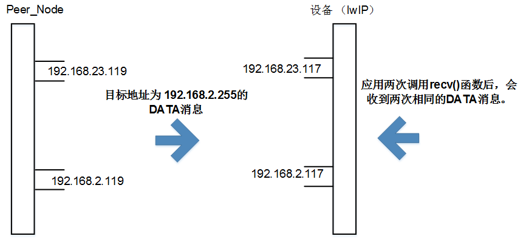

# 前言<a name="ZH-CN_TOPIC_0000001822998506"></a>

**概述<a name="section4537382116410"></a>**

本文档介绍了lwIP（A Lightweight TCP/IP stack）的相关内容，包括lwIP简介、应用开发、网络安全和常见问题。本文档主要用于适配lwIP和Huawei LiteOS，同时也用于实现如DNS客户端、DHCP服务器等附加特性。

**产品版本<a name="section518mcpsimp"></a>**

与本文档相对应的产品版本如下。

<a name="table521mcpsimp"></a>
<table><thead align="left"><tr id="row526mcpsimp"><th class="cellrowborder" valign="top" width="32%" id="mcps1.1.3.1.1"><p id="p528mcpsimp"><a name="p528mcpsimp"></a><a name="p528mcpsimp"></a><strong id="b529mcpsimp"><a name="b529mcpsimp"></a><a name="b529mcpsimp"></a>产品名称</strong></p>
</th>
<th class="cellrowborder" valign="top" width="68%" id="mcps1.1.3.1.2"><p id="p531mcpsimp"><a name="p531mcpsimp"></a><a name="p531mcpsimp"></a><strong id="b532mcpsimp"><a name="b532mcpsimp"></a><a name="b532mcpsimp"></a>产品版本</strong></p>
</th>
</tr>
</thead>
<tbody><tr id="row534mcpsimp"><td class="cellrowborder" valign="top" width="32%" headers="mcps1.1.3.1.1 "><p id="p536mcpsimp"><a name="p536mcpsimp"></a><a name="p536mcpsimp"></a>WS63</p>
</td>
<td class="cellrowborder" valign="top" width="68%" headers="mcps1.1.3.1.2 "><p id="p538mcpsimp"><a name="p538mcpsimp"></a><a name="p538mcpsimp"></a>V100</p>
</td>
</tr>
</tbody>
</table>

**读者对象<a name="section539mcpsimp"></a>**

本文档主要适用于以下对象：

-   测试工程师
-   软件开发工程师

**符号约定<a name="section545mcpsimp"></a>**

在本文中可能出现下列标志，它们所代表的含义如下。

<a name="table548mcpsimp"></a>
<table><thead align="left"><tr id="row553mcpsimp"><th class="cellrowborder" valign="top" width="21%" id="mcps1.1.3.1.1"><p id="p555mcpsimp"><a name="p555mcpsimp"></a><a name="p555mcpsimp"></a><strong id="b556mcpsimp"><a name="b556mcpsimp"></a><a name="b556mcpsimp"></a>符号</strong></p>
</th>
<th class="cellrowborder" valign="top" width="79%" id="mcps1.1.3.1.2"><p id="p558mcpsimp"><a name="p558mcpsimp"></a><a name="p558mcpsimp"></a><strong id="b559mcpsimp"><a name="b559mcpsimp"></a><a name="b559mcpsimp"></a>说明</strong></p>
</th>
</tr>
</thead>
<tbody><tr id="row561mcpsimp"><td class="cellrowborder" valign="top" width="21%" headers="mcps1.1.3.1.1 "><p class="msonormal" id="p563mcpsimp"><a name="p563mcpsimp"></a><a name="p563mcpsimp"></a><a name="image109"></a><a name="image109"></a><span></span></p>
</td>
<td class="cellrowborder" valign="top" width="79%" headers="mcps1.1.3.1.2 "><p id="p565mcpsimp"><a name="p565mcpsimp"></a><a name="p565mcpsimp"></a>表示如不避免则将会导致死亡或严重伤害的具有高等级风险的危害。</p>
</td>
</tr>
<tr id="row566mcpsimp"><td class="cellrowborder" valign="top" width="21%" headers="mcps1.1.3.1.1 "><p class="msonormal" id="p568mcpsimp"><a name="p568mcpsimp"></a><a name="p568mcpsimp"></a><a name="image110"></a><a name="image110"></a><span></span></p>
</td>
<td class="cellrowborder" valign="top" width="79%" headers="mcps1.1.3.1.2 "><p id="p570mcpsimp"><a name="p570mcpsimp"></a><a name="p570mcpsimp"></a>表示如不避免则可能导致死亡或严重伤害的具有中等级风险的危害。</p>
</td>
</tr>
<tr id="row571mcpsimp"><td class="cellrowborder" valign="top" width="21%" headers="mcps1.1.3.1.1 "><p class="msonormal" id="p573mcpsimp"><a name="p573mcpsimp"></a><a name="p573mcpsimp"></a><a name="image111"></a><a name="image111"></a><span></span></p>
</td>
<td class="cellrowborder" valign="top" width="79%" headers="mcps1.1.3.1.2 "><p id="p575mcpsimp"><a name="p575mcpsimp"></a><a name="p575mcpsimp"></a>表示如不避免则可能导致轻微或中度伤害的具有低等级风险的危害。</p>
</td>
</tr>
<tr id="row576mcpsimp"><td class="cellrowborder" valign="top" width="21%" headers="mcps1.1.3.1.1 "><p class="msonormal" id="p578mcpsimp"><a name="p578mcpsimp"></a><a name="p578mcpsimp"></a><a name="image112"></a><a name="image112"></a><span></span></p>
</td>
<td class="cellrowborder" valign="top" width="79%" headers="mcps1.1.3.1.2 "><p id="p580mcpsimp"><a name="p580mcpsimp"></a><a name="p580mcpsimp"></a>用于传递设备或环境安全警示信息。如不避免则可能会导致设备损坏、数据丢失、设备性能降低或其它不可预知的结果。</p>
<p id="p581mcpsimp"><a name="p581mcpsimp"></a><a name="p581mcpsimp"></a>“须知”不涉及人身伤害。</p>
</td>
</tr>
<tr id="row582mcpsimp"><td class="cellrowborder" valign="top" width="21%" headers="mcps1.1.3.1.1 "><p class="msonormal" id="p584mcpsimp"><a name="p584mcpsimp"></a><a name="p584mcpsimp"></a><a name="image113"></a><a name="image113"></a><span></span></p>
</td>
<td class="cellrowborder" valign="top" width="79%" headers="mcps1.1.3.1.2 "><p id="p586mcpsimp"><a name="p586mcpsimp"></a><a name="p586mcpsimp"></a>对正文中重点信息的补充说明。</p>
<p id="p587mcpsimp"><a name="p587mcpsimp"></a><a name="p587mcpsimp"></a>“说明”不是安全警示信息，不涉及人身、设备及环境伤害信息。</p>
</td>
</tr>
</tbody>
</table>

**修改记录<a name="section588mcpsimp"></a>**

<a name="table590mcpsimp"></a>
<table><thead align="left"><tr id="row596mcpsimp"><th class="cellrowborder" valign="top" width="15%" id="mcps1.1.4.1.1"><p id="p598mcpsimp"><a name="p598mcpsimp"></a><a name="p598mcpsimp"></a><strong id="b599mcpsimp"><a name="b599mcpsimp"></a><a name="b599mcpsimp"></a>文档版本</strong></p>
</th>
<th class="cellrowborder" valign="top" width="22%" id="mcps1.1.4.1.2"><p id="p601mcpsimp"><a name="p601mcpsimp"></a><a name="p601mcpsimp"></a><strong id="b602mcpsimp"><a name="b602mcpsimp"></a><a name="b602mcpsimp"></a>发布日期</strong></p>
</th>
<th class="cellrowborder" valign="top" width="63%" id="mcps1.1.4.1.3"><p id="p604mcpsimp"><a name="p604mcpsimp"></a><a name="p604mcpsimp"></a><strong id="b605mcpsimp"><a name="b605mcpsimp"></a><a name="b605mcpsimp"></a>修改说明</strong></p>
</th>
</tr>
</thead>
<tbody><tr id="row19521183013194"><td class="cellrowborder" valign="top" width="15%" headers="mcps1.1.4.1.1 "><p id="p14521113010196"><a name="p14521113010196"></a><a name="p14521113010196"></a>03</p>
</td>
<td class="cellrowborder" valign="top" width="22%" headers="mcps1.1.4.1.2 "><p id="p35211530171912"><a name="p35211530171912"></a><a name="p35211530171912"></a>2025-08-29</p>
</td>
<td class="cellrowborder" valign="top" width="63%" headers="mcps1.1.4.1.3 "><p id="p17360104154510"><a name="p17360104154510"></a><a name="p17360104154510"></a>更新“<a href="常见问题.md">常见问题</a>”章节内容。</p>
</td>
</tr>
<tr id="row0274317125115"><td class="cellrowborder" valign="top" width="15%" headers="mcps1.1.4.1.1 "><p id="p192741317185116"><a name="p192741317185116"></a><a name="p192741317185116"></a>02</p>
</td>
<td class="cellrowborder" valign="top" width="22%" headers="mcps1.1.4.1.2 "><p id="p1527471716515"><a name="p1527471716515"></a><a name="p1527471716515"></a>2024-06-27</p>
</td>
<td class="cellrowborder" valign="top" width="63%" headers="mcps1.1.4.1.3 "><p id="p0274141719517"><a name="p0274141719517"></a><a name="p0274141719517"></a>更新“<a href="限制条件.md">限制条件</a>”章节内容。</p>
</td>
</tr>
<tr id="row1160063620135"><td class="cellrowborder" valign="top" width="15%" headers="mcps1.1.4.1.1 "><p id="p13477159577"><a name="p13477159577"></a><a name="p13477159577"></a>01</p>
</td>
<td class="cellrowborder" valign="top" width="22%" headers="mcps1.1.4.1.2 "><p id="p7347191514575"><a name="p7347191514575"></a><a name="p7347191514575"></a>2024-04-10</p>
</td>
<td class="cellrowborder" valign="top" width="63%" headers="mcps1.1.4.1.3 "><p id="p663512312573"><a name="p663512312573"></a><a name="p663512312573"></a>第一次正式版本发布。</p>
</td>
</tr>
<tr id="row607mcpsimp"><td class="cellrowborder" valign="top" width="15%" headers="mcps1.1.4.1.1 "><p id="p609mcpsimp"><a name="p609mcpsimp"></a><a name="p609mcpsimp"></a>00B01</p>
</td>
<td class="cellrowborder" valign="top" width="22%" headers="mcps1.1.4.1.2 "><p id="p611mcpsimp"><a name="p611mcpsimp"></a><a name="p611mcpsimp"></a>2024-03-15</p>
</td>
<td class="cellrowborder" valign="top" width="63%" headers="mcps1.1.4.1.3 "><p id="p613mcpsimp"><a name="p613mcpsimp"></a><a name="p613mcpsimp"></a>第一次临时版本发布。</p>
</td>
</tr>
</tbody>
</table>

# 概述<a name="ZH-CN_TOPIC_0000001864472805"></a>


## 背景介绍<a name="ZH-CN_TOPIC_0000001817593060"></a>

为了实现将智能家居芯片迁移到轻量级操作系统和TCP/IP协议栈上，开发了lwIP，其特点如下：

-   Lite Operating System是RTOS，意为“轻量级的实时操作系统”；专门针对Cortex-M series、Cortex-R series、Cortex-A series芯片架构而设计的RTOS，该系统主要针对智能终端/穿戴式设备定制，目前已有成熟商业应用。
-   在开源lwIP基础上，实现了DHCP服务器等附加特性。

## 第三方参考<a name="ZH-CN_TOPIC_0000001817752848"></a>

本文档提供客户第三方应用参考如下：

-   SNTP客户端：此lwIP没有重新实现SNTP（Simple Network Time Protocol）客户端，但lwIP contrib开源中已经有实现了的SNTP客户端，可供用户使用。
-   操作系统适配层代码：lwIP contrib中有适配到Linux平台的代码，LiteOS支持大部分的POSIX（Portable Operating System Interface of UNIX）接口，在集成时使用到此代码。

## RFC（Request For Comments）遵从<a name="ZH-CN_TOPIC_0000001864392613"></a>

> **说明：** 
>按照业界协议的标准实现，和其他芯片交互可以正常使用，无私有化的协议，这些协议仅少部分未完全遵从。

lwIP遵从如下RFC协议标准：

-   RFC 791 \(IPv4 Standard\)
-   RFC 2460 \(IPv6 Standard\)
-   RFC 768 \(UDP\) User Datagram Protocol
-   RFC 793 \(TCP\) Transmission Control Protocol
-   RFC 792 \(ICMP\) Internet Control Message Protocol
-   RFC 826 \(ARP\) Address Resolution Protocol
-   RFC 1035（DNS）DOMAIN NAMES - IMPLEMENTATION AND SPECIFICATION
-   RFC 2030（SNTP）Simple Network Timer Protocal（SNTP） Version 4 for IPv4，IPv6 and OSI
-   RFC 2131 \(DHCP\) Dynamic Host Configuration Protocol
-   RFC 2018 \(SACK\) TCP Selective Acknowledgment Options
-   RFC 7323 \(Window Scaling\)
-   RFC 6675 \(SACK for TCP\) RFC 3927 \(Autoip\)  Dynamic Configuration of IPv4 Link-Local Addresses
-   RFC 2236 \(IGMP\) Internet Group Management Protocol, Version 2
-   RFC4861 \(ND for IPv6\) Neighbor Discovery for IP version 6 \(IPv6\)
-   RFC4443 Internet Control Message Protocol \(ICMPv6\) for the Internet Protocol Version 6 \(IPv6\) Specification
-   RFC4862 IPv6 Stateless Address Autoconfiguration
-   RFC2710 Multicast Listener Discovery \(MLD\) for IPv6

# 功能特性<a name="ZH-CN_TOPIC_0000001864472809"></a>


## 支持的特性<a name="ZH-CN_TOPIC_0000001817593064"></a>

lwIP支持的特性如下：

-   网际协议版本4（IPv4：Internet Protocol version 4）

    IPv4是一种无连接的协议，在分组交换网络中使用。此协议会尽最大努力交付数据包，意即它不保证无丢包，也不保证所有数据包均按照正确的顺序无重复地到达。

-   互联网控制消息协议（ICMP：Internet Control Message Protocol）

    互联网协议族的核心协议之一。该协议用于发送“主机不可达”等通知消息，也可以发送“回显请求”和“回显回复”等Ping消息。

-   用户数据报协议（UDP：User Datagram Protocol）

    互联网协议族的核心协议之一。该协议使用简单的无连接的传输模型和最小协议机制，这种协议提供无连接的数据包服务，低延迟，可靠性稍弱。因此，该协议会将底层网络协议的不可靠性暴露给用户程序，不能保证无丢包、有序及无重复。UDP提供校验和用于数据完整性，以及端口号用于寻址数据包的源和目的地等不同功能。

-   传输控制协议（TCP：Transmission Control Protocol）

    互联网协议族的核心协议之一。该协议起源于最初的网络实现，它补充了IP。因此，整个协议族通常称为TCP/IP。TCP为IP网络上主机的应用程序提供可靠、有序和纠错的传输。不需要可靠数据流服务的应用程序可以使用UDP。

-   域名解析器（DNS：Domain Name System）客户端

    DNS是一个分层的分布式命名系统，用于计算机、服务或连接到互联网或私有网络的资源。lwIP支持基于RFC 1035协议的，特性少的DNS客户端（支持域名解析）。

    在lwip中，DNS在A记录和AAAA记录之间采用了可配置的回退机制。

    回退机制意味着，如果主机名解析到“A”记录失败，那么DNS会自动尝试将主机名解析为“AAAA”记录，或反之亦然，而不通知应用程序主机名解析到“A”记录失败。

    DNS响应依赖于配置参数LWIP\_DNS\_ADDRTYPE\_DEFAULT。该参数取值如下：

    -   LWIP\_DNS\_ADDRTYPE\_IPV4

        DNS只响应客户端请求解析的主机名的A记录。

    -   LWIP\_DNS\_ADDRTYPE\_IPV6

        DNS只响应客户端请求解析的主机名的AAAA记录。

    -   LWIP\_DNS\_ADDRTYPE\_IPV4\_IPV6

        优先解析A记录，如果失败，则回落到AAAA记录。

    -   LWIP\_DNS\_ADDRTYPE\_IPV6\_IPV4

        优先解析AAAA记录，如果失败，则回落到A记录。

    lwip支持为单个主机名获取多个已解析的IP地址。

    -   “count”参数中应提供客户端所需解析的IP地址数量。
    -   “count”的最小值应为1，如果“count”小于1，则DNS解析失败，返回ERR \_ ARG。
    -   “count”的最大值等于可配置的DNS\_MAX\_IPADDR参数。

        如果给定的“count”值大于DNS\_MAX\_IPADDR，那么主机名DNS\_MAX\_IPADDR最大解析IP地址只会返回给应用程序。

    DNS接口可以以阻塞或非阻塞的方式调用。

> **说明：** 
>lwIP 2.1.3上的DNS不会验证或更改DNS服务器提供的已解析的IP地址。DNS只会检查解析后的IP地址是否正确。因此，被解析的IP地址将直接返回给应用程序。

-   动态主机配置协议（DHCP）客户端和服务器

    一种在IP网络上使用的标准化网络协议，用于动态分配网络配置参数，如接口IP地址、业务IP地址等。通过DHCP，计算机自动从DHCP服务器请求IP地址和网络参数，减少了网络管理员或用户手动配置的工作量。lwIP支持基于RFC 2131协议的DHCP协议的客户端和服务器。

    -   如果DHCPv4范围（地址池）使用缺省配置，则start\_ip和ip\_num必须为NULL。
    -   如果需要手动配置DHCPv4范围（地址池），则start\_ip和ip\_num不能为NULL。
    -   无论使用缺省地址范围还是手动配置地址范围，可分配IP是否少一个并不决定于是否使用缺省地址范围，而是取决于服务器的IP地址是否在地址池的范围内： 如果在地址池的范围内，则少一个；如果不在地址池的范围内，则不会少一个。

        注意：现在缺省地址池的范围是从2开始。

    -   配置DHCPv4范围（地址池）时，如果DHCPv4服务器的IP地址在（ip\_start，ip\_start + ip\_num）范围内，则客户端池中可用的地址总数将小于ip\_num，因为池中的一个地址将被DHCPv4服务器占用。
    -   DHCPv4范围内的地址总数将是ip\_num和LWIP\_DHCPS\_MAX\_LEASE的最小值。
    -   手动配置DHCPv4范围时，如果ip\_start + ip\_num超过x.y.z.254，则池中的地址总数只能从（ip\_start，x.y.z.254）开始， 如果子网掩码是255.255.0.0或255.255.255.128，则上述条件不适用。
    -   DNS SERVER OPTION 是由DHCP服务器返回给客户端的，DISCOVER和REQUEST报文不会携带该OPTION，在lwIP 2.1.2中，该DNS服务器地址有以下两种情况：
        -   如果配置了IPv4的DNS服务器，将会返回配置的DNS地址（可能有2个）。
        -   如果没有配置DNS地址，将会返回DHCP服务器的接口IP地址。

    -   DHCPv4服务器只响应主DNS服务器地址，不提供备DNS服务器地址；如果系统配置了两个DNS地址，则会将2个DNS服务器地址都返回。

-   RFC 2131偏差标准

    根据RFC 2131协议正文的4.3.2节，DHCPv4服务器在DHCP REQUEST报文的Init-Reboot、Renew或Rebinding状态中检查客户端是否填充了server\_id，如果客户端在这些状态下填充了server\_id，则服务器不会接受这些报文。但在lwIP 2.1.2中，DHCPv4服务器没有考虑server\_id报文的Init-Reboot、Renew或Rebinding状态。

-   以太网地址解析协议（ARP）

    ARP是一种用于将网络层地址解析为链路层地址的电信协议，是多址网络中的一个重要功能。基于RFC 826协议的Huawei LiteOS lwIP2.1.2支持ARP协议和可配置的ARP表。

-   因特网组管理协议（IGMP）

    IGMP协议用于在主机和本地路由器之间传递组播组成员的信息。lwIP目前只支持基于RFC 2236协议的IGMP v2协议。

-   socket接口类型

    lwIP提供了以下几种类型的socket接口：

    -   非线程安全的低级接口
    -   线程安全的Netconn接口

        内部调用Netconn接口的BSD（Berkeley Software Distribution）式接口。提供Berkeley Software Distribution式接口，帮助应用从Linux TCP/IP堆栈平滑迁移到lwIP TCP/IP堆栈。

-   TCP选择性确认选项

    此选项用于确认堆栈接收到的失序列段，以便在丢失恢复期间可以跳过这些选择性确认的列段进行重传。

> **须知：** 
>LWIP相对开源代码优化如下：
>-   支持丰富的AT调测命令。
>-   多项RFC遵从性整改，有助于提高对商用路由的兼容性 。
>-   提供标准的tcp sack流控算法（RFC2018），提高丢包场景下的传输性能 。
>-   完善ipv6协议支持，如扩展头域处理、Socket Interface Extensions。
>-   新增RDNS协议和RPL协议。

## 不支持的特性<a name="ZH-CN_TOPIC_0000001817752852"></a>

lwIP不支持的特性或协议如下：

-   PPPoS/PPPOE
-   SNMP代理（目前，lwIP仅支持私有MIB）
-   通过多个网络接口实现IP转发
-   路由功能（仅支持终端设备功能）

lwIP小型化的特性如下：

-   简单网络时间协议（Simple Network Time Protocol）

    SNTP（Simple Network Time Protocol）是一种基于包交换、可变延迟数据网络的计算机系统之间的时钟同步网络协议。lwIP支持基于RFC 2030协议的SNTP版本4。

-   lwip\_get\_conn\_info\(\)接口有如下限制：
    -   调用该函数获取TCP或UDP连接信息。
    -   空指针是tcpip\_conn类型。
    -   在LISTEN状态下，此接口不支持获取TCP套接字连接信息。

-   TCP窗口扩大选项

    lwIP支持基于RFC 7323协议的TCP窗口扩大选项。

    -   TCP中的窗口扩大选项允许在TCP连接中使用30位的窗口大小，而不是16位。
    -   窗口扩大功能将TCP窗口的像素扩展到30位，然后使用隐式缩放因子在TCP报头的16位窗口字段中携带这个30位的值。
    -   缩放因子的指数携带在一个名为窗口扩大的TCP选项中。

-   lwIP支持AutoIP模块。
-   lwIP提供设置Wi-Fi驱动状态的接口。
-   lwIP提供设置Wi-Fi驱动状态为lwIP栈的接口。

    -   当Wi-Fi驱动忙时，lwIP栈停止发送消息；
    -   当Wi-Fi驱动ready时，lwIP栈继续发送消息。

    如果在DRIVER\_WAKEUP\_INTERVAL超时之前，驱动程序没有从繁忙状态唤醒，那么所有使用这个Netif驱动的TCP连接都会被删除。因此，阻塞连接调用将等待Netif驱动程序唤醒，SYN（chronize Sequence NumbersSyn）重传，或等待TCP连接超时被清除。

-   lwIP在SOCK\_RAW上提供PF\_PACKET选项。

    lwIP支持PF\_PACKET族的SOCK\_RAW。应用程序可以使用这个特性创建链路层套接字。因此，lwIP堆栈发送报文时期望应用程序中包含链路层标头。SOCK\_RAW报文在设备驱动之间传递，报文数据无变化。

    默认情况下，所有指定协议类型的报文都被传递到一个报文套接字。若要只从特定接口获取报文，请将该套接字绑定到指定接口。sll \_ protocol和sll\_ifindex地址字段用于绑定。当应用程序发送报文时，只需指定sll\_family、sll\_addr、sll\_halen、sll\_ifindex。其他字段应该为0，收到的报文设置为sll\_hatype和sll\_pkttype。

# 开发指引<a name="ZH-CN_TOPIC_0000001864392617"></a>

lwIP支持以太网或Wi-Fi，应用须根据实际需求配置lwIP和适配驱动。


## 前提条件<a name="ZH-CN_TOPIC_0000001864472813"></a>

lwIP需满足下列前提条件：

-   lwIP需要优化后方能支持Huawei LiteOS；目前lwIP暂不支持其他操作系统，具体请参见“[优化lwIP](优化lwIP.md)”。
-   使用lwIP前，基于lwIP相关配置更新驱动代码。详情请参见“[移植方法](移植方法.md)”中的伪代码。

## 依赖关系<a name="ZH-CN_TOPIC_0000001817593068"></a>

lwIP的依赖关系如下：

-   依赖于Huawei LiteOS调用。
-   需要通过以太网或Wi-Fi驱动模块完成物理层数据的发送和接收。

## lwIP的使用<a name="ZH-CN_TOPIC_0000001817752856"></a>

lwIP提供了BSD TCP/IP套接字接口，应用可通过该接口进行连接。lwIP的优势在于：

-   运行在BSD TCP/IP协议栈上的旧应用代码可直接被移植到lwIP中。
-   lwIP支持DHCP客户端特性，用于配置动态IP地址。
-   lwIP支持DNS客户端特性，应用可通过该特性解析域名。
-   lwIP占用资源少，可满足协议栈功能。

> **须知：** 
>lwIP 2.1.3使用socket对外API，close\(\)使用closesocket\(\)接口替换，ioctl\(\)接口使用lwip\_ioctl\(\)接口替换，避免和LiteOS的原生接口产生冲突。

## 移植方法<a name="ZH-CN_TOPIC_0000001864392621"></a>


### lwIP初始化<a name="ZH-CN_TOPIC_0000001864472817"></a>

lwIP的初始化由tcpip\_init\(\)接口完成。该接口接收可选的回调函数及其参数（参数值也可以设为NULL）。一旦初始化完成，回调函数会被调用，并传入对应的参数。

示例代码如下：

```
void tcpip_init_func(void *arg) {
    printf("lwIP initialization successfully done");
}
void Init_lwIP() {
    tcpip_init(tcpip_init_func, NULL);
}
```

### 添加netif接口及驱动功能<a name="ZH-CN_TOPIC_0000001817593072"></a>

初始化完成后，应用必须至少添加一个Netif接口用于通信。

应用需要根据驱动类型实现相关回调函数。相关链路层类型、MAC地址和发送回调函数使用前必须完成注册。如果需要支持原始套接字接口的混杂模式，则还需要在驱动中注册实现该功能的回调函数。

以太网的示例代码如下：

```
struct netif g_netif;
/* user_driver_send mentioned below is the pseudocode for the */
/* driver send function. It explains the prototype for the driver send function. */
/* User should implement this function based on their driver */
void user_driver_send(struct netif *netif, struct pbuf *p) {
    /* This will be the send function of the driver */
    /* It should send the data in pbuf p->payload of size p->tot_len */
}
/* user_driver_recv mentioned below is the pseudocode for the */
/* driver receive function. It explains how it should create pbuf */
/* and copy the incoming packets. User should implement this function */
/* based on their driver */
void user_driver_recv(char *data, int len) {
    /* This should be the receive function of the user driver */
    /* Once it receives the data it should do the following*/
    struct pbuf *p = NULL; 
    struct pbuf *q = NULL;
    p = pbuf_alloc(PBUF_RAW, (len + ETH_PAD_SIZE), PBUF_RAM);
    if (p == NULL) {
        printf("user_driver_recv : pbuf_alloc failed\n");
        return;
    }
    #if ETH_PAD_SIZE
    pbuf_header(p, -ETH_PAD_SIZE); /* drop the padding word */
    #endif
    memcpy(p->payload, data, len);
    #if ETH_PAD_SIZE
    pbuf_header(p, ETH_PAD_SIZE); /* reclaim the padding word */
    #endif
    driverif_input(&gnetif, p);
}
void eth_drv_config(struct netif *netif, u32_t config_flags,u8_t setBit) {
    /* Enable/Disable promiscuous mode in driver code. */
}
/* user_driver_init_func mentioned below is the pseudocode for the */
/* driver initialization function. It explains the lwIP configuration which needs to be */
/* done along with driver initialization. User should implement this function based on their driver */
void user_driver_init_func() {
    ip4_addr_t ipaddr, netmask, gw;
    /* After performing user driver initialization operation here */
    /* lwIP driver configuration needs to be done*/
    #ifndef lwIP_WITH_DHCP_CLIENT
    IP4_ADDR(gw, 192, 168, 2, 1);
    IP4_ADDR(ipaddr, 192, 168, 2, 5);
    IP4_ADDR(netmask, 255, 255, 255, 0);
    #endif
    g_netif.link_layer_type = ETHERNET_DRIVER_IF;
    g_netif.hwaddr_len = ETHARP_HWADDR_LEN;
    g_netif.drv_send = user_driver_send;
    memcpy(g_netif.hwaddr, driver_mac_address, ETHER_ADDR_LEN);
    #if LWIP_NETIF_PROMISC
    g_netif.drv_config = eth_drv_config;
    #endif
    #ifndef lwIP_WITH_DHCP_CLIENT
    netifapi_netif_add(&g_netif, ipaddr, netmask, gw);
    #else
    netifapi_netif_add(&g_netif, 0, 0, 0);
    #endif
    /* lwIP configuration ends */
}
void Init_Configure_lwIP() {
    Init_lwIP();
    user_driver_init_func();   
    netifapi_netif_set_up(&g_netif); 
    #ifndef lwIP_WITH_DHCP_CLIENT
    netifapi_dhcp_start(&g_netif);
    do {
        msleep(20);
    } while (netifapi_dhcp_is_bound(&g_netif) != ERR_OK);
    #endif
    printf("Network is up !!!\n");
}
```

## 优化lwIP<a name="ZH-CN_TOPIC_0000001817752860"></a>


### 优化吞吐量<a name="ZH-CN_TOPIC_0000001864392625"></a>

不同的应用场景，为提升lwIP吞吐量，建议采用下列优化方案：

-   设置宏MEMP\_NUM\_UDP\_PCB的值，即所需UDP连接数。

    DHCP也创建了一个UDP连接，所以在设置该宏的值时也要予以考虑。

-   设置宏MEMP\_NUM\_TCP\_PCB的值，即所需TCP连接数。
-   设置MEMP\_NUM\_RAW\_PCB的值，即所需RAW连接数。

    LWIP\_ENABLE\_LOS\_SHELL\_CMD模块使用一个RAW连接来执行ping命令。

-   设置MEMP\_NUM\_NETCONN的值，即所需UDP、TCP和RAW连接的总数。
    -   如果LWIP\_ENABLE\_LOS\_SHELL\_CMD和RAW连接均未被使用，则禁用LWIP\_RAW。
    -   如果UDP未被使用，那么禁用LWIP\_UDP。如果TCP未被使用，则禁用LWIP\_TCP。
    -   如果调用驱动接收函数中的pbuf\_alloc\(\)申请PBUF\_RAM类型内存失败，则增加MEM\_SIZE。
    -   如果TCPIP mbox内收入报文空间不可用而导致driverif\_input\(\)调用失败，则增加TCPIP\_MBOX\_SIZE和MEMP\_NUM\_TCPIP\_MSG\_INPKT的值。如果驱动模块接收报文太快，则也会发生报文空间不可用导致driverif\_input调用失败。

-   禁用所有调试选项，并且不定义LWIP\_DEBUG。
-   如果架构字长为4，则设置ETH\_PAD\_SIZE为2。

### 优化内存<a name="ZH-CN_TOPIC_0000001864472821"></a>

为节省lwIP内存空间，建议采用下列优化方案：

-   调用驱动接收函数中pbuf\_alloc\(\)申请PBUF\_POOL类型内存，设置PBUF\_POOL\_SIZE的值（即所需pbuf数量），并根据MTU设置PBUF\_POOL\_BUFSIZE的值。
-   根据所需TCP、UDP和RAW以及总的连接数，设置MEMP\_NUM\_TCP\_PCB、MEMP\_NUM\_UDP\_PCB、MEMP\_NUM\_RAW\_PCB和MEMP\_NUM\_NETCONN的值。
-   根据对端的实际发送数据量，可降低TCPIP\_MBOX\_SIZE和MEMP\_NUM\_TCPIP\_MSG\_INPKT的值。
-   禁用所有调试选项，并且不定义LWIP\_DEBUG。

    在lwipopts.h里面将改为\#define LWIP\_DBG\_TYPES\_ON    LWIP\_DBG\_OFF。

-   禁用ETHARP\_TRUST\_IP\_MAC。
    -   如果启用此宏，则所有接收到的报文都会被用于更新ARP表。
    -   如果禁用此宏，则只有进行ARP查询才会更新ARP表中项目内容。

### 定制化<a name="ZH-CN_TOPIC_0000001817593076"></a>

在实际应用中，可能会需要定制一些功能，lwIP中新定义的宏的使用说明如下：

-   LWIP\_DHCP

    当用户启用DHCP服务器时，需要启用LWIP\_DHCPS宏。如果LWIP\_DHCPS宏被启用，则也必须启用LWIP\_DHCP。

-   LWIP\_DHCPS\_DISCOVER\_BROADCAST

    通常DHCP服务器会根据Discover消息中由客户端设置的标志，广播或单播Offer报文。但如果用户希望一直广播Offer消息，则可以启用LWIP\_DHCPS\_DISCOVER\_BROADCAST宏。

### lwIP宏<a name="ZH-CN_TOPIC_0000001817752864"></a>

> **说明：** 
>lwIP 2.1.3的配置宏由于开源很多，未全部描述，请参考开源链接说明：[https://www.nongnu.org/lwip/2\_1\_x/index.html](https://www.nongnu.org/lwip/2_1_x/index.html)，如需修改，请联系相应接口人。

本节列出了lwIP宏，这些宏的描述如下（如需更改，请联系相应接口人）：

-   lwIP宏的默认值在opt.h和lwipopts\_default.h头文件中有定义。
-   lwipopts\_default.h头文件中的宏定义会覆盖opt.h头文件中的宏定义。

**表 1**  宏列表

<a name="table1242mcpsimp"></a>
<table><thead align="left"><tr id="row1248mcpsimp"><th class="cellrowborder" valign="top" width="32%" id="mcps1.2.3.1.1"><p id="p1250mcpsimp"><a name="p1250mcpsimp"></a><a name="p1250mcpsimp"></a>宏</p>
</th>
<th class="cellrowborder" valign="top" width="68%" id="mcps1.2.3.1.2"><p id="p1252mcpsimp"><a name="p1252mcpsimp"></a><a name="p1252mcpsimp"></a>描述</p>
</th>
</tr>
</thead>
<tbody><tr id="row1254mcpsimp"><td class="cellrowborder" valign="top" width="32%" headers="mcps1.2.3.1.1 "><p id="p1256mcpsimp"><a name="p1256mcpsimp"></a><a name="p1256mcpsimp"></a>LWIP_AUTOIP</p>
</td>
<td class="cellrowborder" valign="top" width="68%" headers="mcps1.2.3.1.2 "><p id="p1258mcpsimp"><a name="p1258mcpsimp"></a><a name="p1258mcpsimp"></a>该宏用于启用或禁用AUTOIP模块。</p>
</td>
</tr>
<tr id="row1259mcpsimp"><td class="cellrowborder" valign="top" width="32%" headers="mcps1.2.3.1.1 "><p id="p1261mcpsimp"><a name="p1261mcpsimp"></a><a name="p1261mcpsimp"></a>MEM_SIZE</p>
</td>
<td class="cellrowborder" valign="top" width="68%" headers="mcps1.2.3.1.2 "><p id="p1263mcpsimp"><a name="p1263mcpsimp"></a><a name="p1263mcpsimp"></a>lwIP可维护堆内存（包括mem_malloc和mem_free）管理模块，该模块用于动态内存分配。该宏用于定义lwIP中堆内存管理模块的大小。</p>
</td>
</tr>
<tr id="row1264mcpsimp"><td class="cellrowborder" valign="top" width="32%" headers="mcps1.2.3.1.1 "><p id="p1266mcpsimp"><a name="p1266mcpsimp"></a><a name="p1266mcpsimp"></a>MEM_LIBC_MALLOC</p>
</td>
<td class="cellrowborder" valign="top" width="68%" headers="mcps1.2.3.1.2 "><p id="p1268mcpsimp"><a name="p1268mcpsimp"></a><a name="p1268mcpsimp"></a>如果该宏被启用，那么系统将调用malloc()和free()进行所有动态内存分配，而且lwIP中的堆内存管理模块代码将会被禁用。</p>
</td>
</tr>
<tr id="row1269mcpsimp"><td class="cellrowborder" valign="top" width="32%" headers="mcps1.2.3.1.1 "><p id="p1271mcpsimp"><a name="p1271mcpsimp"></a><a name="p1271mcpsimp"></a>MEMP_MEM_MALLOC</p>
</td>
<td class="cellrowborder" valign="top" width="68%" headers="mcps1.2.3.1.2 "><p id="p1273mcpsimp"><a name="p1273mcpsimp"></a><a name="p1273mcpsimp"></a>lwIP为频繁使用的结构提供池内存（包括memp_malloc和memp_free）管理模块。</p>
</td>
</tr>
<tr id="row1274mcpsimp"><td class="cellrowborder" valign="top" width="32%" headers="mcps1.2.3.1.1 "><p id="p1276mcpsimp"><a name="p1276mcpsimp"></a><a name="p1276mcpsimp"></a>MEM_ALIGNMENT</p>
</td>
<td class="cellrowborder" valign="top" width="68%" headers="mcps1.2.3.1.2 "><p id="p1278mcpsimp"><a name="p1278mcpsimp"></a><a name="p1278mcpsimp"></a>该宏的值需要基于架构进行设置。例如，如果是32位架构，那么需要设置该宏的值为4。</p>
</td>
</tr>
<tr id="row1279mcpsimp"><td class="cellrowborder" valign="top" width="32%" headers="mcps1.2.3.1.1 "><p id="p1281mcpsimp"><a name="p1281mcpsimp"></a><a name="p1281mcpsimp"></a>MEMP_NUM_TCP_PCB</p>
</td>
<td class="cellrowborder" valign="top" width="68%" headers="mcps1.2.3.1.2 "><p id="p1283mcpsimp"><a name="p1283mcpsimp"></a><a name="p1283mcpsimp"></a>该宏用于设置同一时间内所需的TCP连接数。</p>
</td>
</tr>
<tr id="row1284mcpsimp"><td class="cellrowborder" valign="top" width="32%" headers="mcps1.2.3.1.1 "><p id="p1286mcpsimp"><a name="p1286mcpsimp"></a><a name="p1286mcpsimp"></a>MEMP_NUM_UDP_PCB</p>
</td>
<td class="cellrowborder" valign="top" width="68%" headers="mcps1.2.3.1.2 "><p id="p1288mcpsimp"><a name="p1288mcpsimp"></a><a name="p1288mcpsimp"></a>该宏用于设置同一时间内所需UDP连接数。设置该宏的值时，用户须考虑lwIP内部模块如DNS模块和DHCP模块。DHCP模块会创建UDP连接用于自身通信。</p>
</td>
</tr>
<tr id="row1289mcpsimp"><td class="cellrowborder" valign="top" width="32%" headers="mcps1.2.3.1.1 "><p id="p1291mcpsimp"><a name="p1291mcpsimp"></a><a name="p1291mcpsimp"></a>MEMP_NUM_RAW_PCB</p>
</td>
<td class="cellrowborder" valign="top" width="68%" headers="mcps1.2.3.1.2 "><p id="p1293mcpsimp"><a name="p1293mcpsimp"></a><a name="p1293mcpsimp"></a>该宏用于设置同一时间内所需RAW连接数。</p>
</td>
</tr>
<tr id="row1294mcpsimp"><td class="cellrowborder" valign="top" width="32%" headers="mcps1.2.3.1.1 "><p id="p1296mcpsimp"><a name="p1296mcpsimp"></a><a name="p1296mcpsimp"></a>MEMP_NUM_NETCONN</p>
</td>
<td class="cellrowborder" valign="top" width="68%" headers="mcps1.2.3.1.2 "><p id="p1298mcpsimp"><a name="p1298mcpsimp"></a><a name="p1298mcpsimp"></a>该宏用于设置TCP、UDP和RAW连接总数。该宏的值必须是MEMP_NUM_TCP_PCB、MEMP_NUM_UDP_PCB和MEMP_NUM_RAW_PCB宏的值之和。</p>
</td>
</tr>
<tr id="row1299mcpsimp"><td class="cellrowborder" valign="top" width="32%" headers="mcps1.2.3.1.1 "><p id="p1301mcpsimp"><a name="p1301mcpsimp"></a><a name="p1301mcpsimp"></a>MEMP_NUM_TCP_PCB_LISTEN</p>
</td>
<td class="cellrowborder" valign="top" width="68%" headers="mcps1.2.3.1.2 "><p id="p1303mcpsimp"><a name="p1303mcpsimp"></a><a name="p1303mcpsimp"></a>该宏用于设置同时监听所需TCP连接数。</p>
</td>
</tr>
<tr id="row1304mcpsimp"><td class="cellrowborder" valign="top" width="32%" headers="mcps1.2.3.1.1 "><p id="p1306mcpsimp"><a name="p1306mcpsimp"></a><a name="p1306mcpsimp"></a>MEMP_NUM_REASSDATA</p>
</td>
<td class="cellrowborder" valign="top" width="68%" headers="mcps1.2.3.1.2 "><p id="p1308mcpsimp"><a name="p1308mcpsimp"></a><a name="p1308mcpsimp"></a>该宏用于设置同时排队等待重组的IP报文数（完整报文，而不是分片报文）。</p>
</td>
</tr>
<tr id="row1309mcpsimp"><td class="cellrowborder" valign="top" width="32%" headers="mcps1.2.3.1.1 "><p id="p1311mcpsimp"><a name="p1311mcpsimp"></a><a name="p1311mcpsimp"></a>MEMP_NUM_FRAG_PBUF</p>
</td>
<td class="cellrowborder" valign="top" width="68%" headers="mcps1.2.3.1.2 "><p id="p1313mcpsimp"><a name="p1313mcpsimp"></a><a name="p1313mcpsimp"></a>该宏用于设置同时发出的IP报文数（分片报文，而不是完整报文）。</p>
</td>
</tr>
<tr id="row1314mcpsimp"><td class="cellrowborder" valign="top" width="32%" headers="mcps1.2.3.1.1 "><p id="p1316mcpsimp"><a name="p1316mcpsimp"></a><a name="p1316mcpsimp"></a>ARP_TABLE_SIZE</p>
</td>
<td class="cellrowborder" valign="top" width="68%" headers="mcps1.2.3.1.2 "><p id="p1318mcpsimp"><a name="p1318mcpsimp"></a><a name="p1318mcpsimp"></a>该宏用于设置ARP缓存表的大小。</p>
</td>
</tr>
<tr id="row1319mcpsimp"><td class="cellrowborder" valign="top" width="32%" headers="mcps1.2.3.1.1 "><p id="p1321mcpsimp"><a name="p1321mcpsimp"></a><a name="p1321mcpsimp"></a>ARP_QUEUEING</p>
</td>
<td class="cellrowborder" valign="top" width="68%" headers="mcps1.2.3.1.2 "><p id="p1323mcpsimp"><a name="p1323mcpsimp"></a><a name="p1323mcpsimp"></a>如果该宏被启用，那么在ARP解析过程中会有多个出报文在排队。如果该宏被禁用，那么只能为每个目的地址保留最近由上层发送的报文。</p>
</td>
</tr>
<tr id="row1324mcpsimp"><td class="cellrowborder" valign="top" width="32%" headers="mcps1.2.3.1.1 "><p id="p1326mcpsimp"><a name="p1326mcpsimp"></a><a name="p1326mcpsimp"></a>MEMP_NUM_ARP_QUEUE</p>
</td>
<td class="cellrowborder" valign="top" width="68%" headers="mcps1.2.3.1.2 "><p id="p1328mcpsimp"><a name="p1328mcpsimp"></a><a name="p1328mcpsimp"></a>该宏用于设置同时排队的出报文（pbuf）的数量。这些出报文正在等待ARP响应以解析目的地址。该宏仅在ARP_QUEUEING被启用时适用。</p>
</td>
</tr>
<tr id="row1329mcpsimp"><td class="cellrowborder" valign="top" width="32%" headers="mcps1.2.3.1.1 "><p id="p1331mcpsimp"><a name="p1331mcpsimp"></a><a name="p1331mcpsimp"></a>ETHARP_TRUST_IP_MAC</p>
</td>
<td class="cellrowborder" valign="top" width="68%" headers="mcps1.2.3.1.2 "><p id="p1333mcpsimp"><a name="p1333mcpsimp"></a><a name="p1333mcpsimp"></a>如果该宏被启用，那么ARP缓存表中源IP地址和源MAC地址都会被所有的入报文更新。如果该宏被禁用，那么只能通过ARP查询来更新ARP缓存表中项目内容。</p>
</td>
</tr>
<tr id="row1334mcpsimp"><td class="cellrowborder" valign="top" width="32%" headers="mcps1.2.3.1.1 "><p id="p1336mcpsimp"><a name="p1336mcpsimp"></a><a name="p1336mcpsimp"></a>ETH_PAD_SIZE</p>
</td>
<td class="cellrowborder" valign="top" width="68%" headers="mcps1.2.3.1.2 "><p id="p1338mcpsimp"><a name="p1338mcpsimp"></a><a name="p1338mcpsimp"></a>该宏用于设置在以太网报头之前添加的字节数，以确保在报头之后的荷载对齐。由于报头长度为14字节，如果不填充，那么IP报头中的地址就不会被对齐。例如，在32位架构中，将该宏的值设置为2可以使IP报头长度对齐4字节，也可以加速报文传递。</p>
</td>
</tr>
<tr id="row1339mcpsimp"><td class="cellrowborder" valign="top" width="32%" headers="mcps1.2.3.1.1 "><p id="p1341mcpsimp"><a name="p1341mcpsimp"></a><a name="p1341mcpsimp"></a>ETHARP_SUPPORT_STATIC_ENTRIES</p>
</td>
<td class="cellrowborder" valign="top" width="68%" headers="mcps1.2.3.1.2 "><p id="p1343mcpsimp"><a name="p1343mcpsimp"></a><a name="p1343mcpsimp"></a>该宏支持通过应用的etharp_add_static_entry()和etharp_remove_static_entry()接口静态更新ARP缓存表。</p>
</td>
</tr>
<tr id="row1344mcpsimp"><td class="cellrowborder" valign="top" width="32%" headers="mcps1.2.3.1.1 "><p id="p1346mcpsimp"><a name="p1346mcpsimp"></a><a name="p1346mcpsimp"></a>IP_REASSEMBLY</p>
</td>
<td class="cellrowborder" valign="top" width="68%" headers="mcps1.2.3.1.2 "><p id="p1348mcpsimp"><a name="p1348mcpsimp"></a><a name="p1348mcpsimp"></a>该宏支持重组IP分片报文。</p>
</td>
</tr>
<tr id="row1349mcpsimp"><td class="cellrowborder" valign="top" width="32%" headers="mcps1.2.3.1.1 "><p id="p1351mcpsimp"><a name="p1351mcpsimp"></a><a name="p1351mcpsimp"></a>IP_FRAG</p>
</td>
<td class="cellrowborder" valign="top" width="68%" headers="mcps1.2.3.1.2 "><p id="p1353mcpsimp"><a name="p1353mcpsimp"></a><a name="p1353mcpsimp"></a>该宏支持对所有出报文实施IP层分片。</p>
</td>
</tr>
<tr id="row1354mcpsimp"><td class="cellrowborder" valign="top" width="32%" headers="mcps1.2.3.1.1 "><p id="p1356mcpsimp"><a name="p1356mcpsimp"></a><a name="p1356mcpsimp"></a>IP_REASS_MAXAGE</p>
</td>
<td class="cellrowborder" valign="top" width="68%" headers="mcps1.2.3.1.2 "><p id="p1358mcpsimp"><a name="p1358mcpsimp"></a><a name="p1358mcpsimp"></a>该宏用于设置IP入报文分割的超时时间。lwIP可保留IP_REASS_MAXAGE秒用于分割报文。如果在该时间内无法重组报文，那么这些分片报文将被丢弃。</p>
</td>
</tr>
<tr id="row1359mcpsimp"><td class="cellrowborder" valign="top" width="32%" headers="mcps1.2.3.1.1 "><p id="p1361mcpsimp"><a name="p1361mcpsimp"></a><a name="p1361mcpsimp"></a>IP_REASS_MAX_PBUFS</p>
</td>
<td class="cellrowborder" valign="top" width="68%" headers="mcps1.2.3.1.2 "><p id="p1363mcpsimp"><a name="p1363mcpsimp"></a><a name="p1363mcpsimp"></a>该宏用于设置任何一个IP入报文允许的最大分片数。</p>
</td>
</tr>
<tr id="row1364mcpsimp"><td class="cellrowborder" valign="top" width="32%" headers="mcps1.2.3.1.1 "><p id="p1366mcpsimp"><a name="p1366mcpsimp"></a><a name="p1366mcpsimp"></a>IP_FRAG_USES_STATIC_BUF</p>
</td>
<td class="cellrowborder" valign="top" width="68%" headers="mcps1.2.3.1.2 "><p id="p1368mcpsimp"><a name="p1368mcpsimp"></a><a name="p1368mcpsimp"></a>如果该宏被启用，那么使用静态缓冲区进行IP分片；否则，分配动态内存。</p>
</td>
</tr>
<tr id="row1369mcpsimp"><td class="cellrowborder" valign="top" width="32%" headers="mcps1.2.3.1.1 "><p id="p1371mcpsimp"><a name="p1371mcpsimp"></a><a name="p1371mcpsimp"></a>IP_FRAG_MAX_MTU</p>
</td>
<td class="cellrowborder" valign="top" width="68%" headers="mcps1.2.3.1.2 "><p id="p1373mcpsimp"><a name="p1373mcpsimp"></a><a name="p1373mcpsimp"></a>该宏用于设置MTU的最大尺寸。</p>
</td>
</tr>
<tr id="row1374mcpsimp"><td class="cellrowborder" valign="top" width="32%" headers="mcps1.2.3.1.1 "><p id="p1376mcpsimp"><a name="p1376mcpsimp"></a><a name="p1376mcpsimp"></a>IP_DEFAULT_TTL</p>
</td>
<td class="cellrowborder" valign="top" width="68%" headers="mcps1.2.3.1.2 "><p id="p1378mcpsimp"><a name="p1378mcpsimp"></a><a name="p1378mcpsimp"></a>传输层数据报文存活时间的默认值。</p>
</td>
</tr>
<tr id="row1379mcpsimp"><td class="cellrowborder" valign="top" width="32%" headers="mcps1.2.3.1.1 "><p id="p1381mcpsimp"><a name="p1381mcpsimp"></a><a name="p1381mcpsimp"></a>LWIP_RAND</p>
</td>
<td class="cellrowborder" valign="top" width="68%" headers="mcps1.2.3.1.2 "><p id="p1383mcpsimp"><a name="p1383mcpsimp"></a><a name="p1383mcpsimp"></a>lwIP依赖于系统的随机生成器函数，所以须调用强随机数发生器函数进行设置该宏的值。随机数用于为DNS和用户TCP/UDP连接生成随机客户端端口。此外，随机数也用于在DHCP和DNS中创建事务ID以及在TCP中创建ISS值。</p>
</td>
</tr>
<tr id="row1384mcpsimp"><td class="cellrowborder" valign="top" width="32%" headers="mcps1.2.3.1.1 "><p id="p1386mcpsimp"><a name="p1386mcpsimp"></a><a name="p1386mcpsimp"></a>LWIP_ICMP</p>
</td>
<td class="cellrowborder" valign="top" width="68%" headers="mcps1.2.3.1.2 "><p id="p1388mcpsimp"><a name="p1388mcpsimp"></a><a name="p1388mcpsimp"></a>该宏用于启用ICMP模块。</p>
</td>
</tr>
<tr id="row1389mcpsimp"><td class="cellrowborder" valign="top" width="32%" headers="mcps1.2.3.1.1 "><p id="p1391mcpsimp"><a name="p1391mcpsimp"></a><a name="p1391mcpsimp"></a>ICMP_TTL</p>
</td>
<td class="cellrowborder" valign="top" width="68%" headers="mcps1.2.3.1.2 "><p id="p1393mcpsimp"><a name="p1393mcpsimp"></a><a name="p1393mcpsimp"></a>该宏用于设置ICMP消息的TTL值。</p>
</td>
</tr>
<tr id="row1394mcpsimp"><td class="cellrowborder" valign="top" width="32%" headers="mcps1.2.3.1.1 "><p id="p1396mcpsimp"><a name="p1396mcpsimp"></a><a name="p1396mcpsimp"></a>LWIP_RAW</p>
</td>
<td class="cellrowborder" valign="top" width="68%" headers="mcps1.2.3.1.2 "><p id="p1398mcpsimp"><a name="p1398mcpsimp"></a><a name="p1398mcpsimp"></a>该宏支持在lwIP中启用原始套接字支持功能。</p>
</td>
</tr>
<tr id="row1399mcpsimp"><td class="cellrowborder" valign="top" width="32%" headers="mcps1.2.3.1.1 "><p id="p1401mcpsimp"><a name="p1401mcpsimp"></a><a name="p1401mcpsimp"></a>RAW_TTL</p>
</td>
<td class="cellrowborder" valign="top" width="68%" headers="mcps1.2.3.1.2 "><p id="p1403mcpsimp"><a name="p1403mcpsimp"></a><a name="p1403mcpsimp"></a>该宏用于设置原始套接字消息的TTL值。</p>
</td>
</tr>
<tr id="row1404mcpsimp"><td class="cellrowborder" valign="top" width="32%" headers="mcps1.2.3.1.1 "><p id="p1406mcpsimp"><a name="p1406mcpsimp"></a><a name="p1406mcpsimp"></a>LWIP_UDP</p>
</td>
<td class="cellrowborder" valign="top" width="68%" headers="mcps1.2.3.1.2 "><p id="p1408mcpsimp"><a name="p1408mcpsimp"></a><a name="p1408mcpsimp"></a>该宏支持在lwIP中启用UDP连接支持功能。</p>
</td>
</tr>
<tr id="row1409mcpsimp"><td class="cellrowborder" valign="top" width="32%" headers="mcps1.2.3.1.1 "><p id="p1411mcpsimp"><a name="p1411mcpsimp"></a><a name="p1411mcpsimp"></a>UDP_TTL</p>
</td>
<td class="cellrowborder" valign="top" width="68%" headers="mcps1.2.3.1.2 "><p id="p1413mcpsimp"><a name="p1413mcpsimp"></a><a name="p1413mcpsimp"></a>该宏用于设置UDP套接字消息的TTL值。</p>
</td>
</tr>
<tr id="row1414mcpsimp"><td class="cellrowborder" valign="top" width="32%" headers="mcps1.2.3.1.1 "><p id="p1416mcpsimp"><a name="p1416mcpsimp"></a><a name="p1416mcpsimp"></a>LWIP_TCP</p>
</td>
<td class="cellrowborder" valign="top" width="68%" headers="mcps1.2.3.1.2 "><p id="p1418mcpsimp"><a name="p1418mcpsimp"></a><a name="p1418mcpsimp"></a>该宏支持在lwIP中启用TCP连接支持功能。</p>
</td>
</tr>
<tr id="row1419mcpsimp"><td class="cellrowborder" valign="top" width="32%" headers="mcps1.2.3.1.1 "><p id="p1421mcpsimp"><a name="p1421mcpsimp"></a><a name="p1421mcpsimp"></a>TCP_TTL</p>
</td>
<td class="cellrowborder" valign="top" width="68%" headers="mcps1.2.3.1.2 "><p id="p1423mcpsimp"><a name="p1423mcpsimp"></a><a name="p1423mcpsimp"></a>该宏用于设置TCP套接字消息的TTL值。</p>
</td>
</tr>
<tr id="row1424mcpsimp"><td class="cellrowborder" valign="top" width="32%" headers="mcps1.2.3.1.1 "><p id="p1426mcpsimp"><a name="p1426mcpsimp"></a><a name="p1426mcpsimp"></a>TCP_WND</p>
</td>
<td class="cellrowborder" valign="top" width="68%" headers="mcps1.2.3.1.2 "><p id="p1428mcpsimp"><a name="p1428mcpsimp"></a><a name="p1428mcpsimp"></a>该宏用于设置TCP窗口大小。</p>
</td>
</tr>
<tr id="row1429mcpsimp"><td class="cellrowborder" valign="top" width="32%" headers="mcps1.2.3.1.1 "><p id="p1431mcpsimp"><a name="p1431mcpsimp"></a><a name="p1431mcpsimp"></a>TCP_MAXRTX</p>
</td>
<td class="cellrowborder" valign="top" width="68%" headers="mcps1.2.3.1.2 "><p id="p1433mcpsimp"><a name="p1433mcpsimp"></a><a name="p1433mcpsimp"></a>该宏用于设置TCP数据报文的最大重传次数。</p>
</td>
</tr>
<tr id="row1434mcpsimp"><td class="cellrowborder" valign="top" width="32%" headers="mcps1.2.3.1.1 "><p id="p1436mcpsimp"><a name="p1436mcpsimp"></a><a name="p1436mcpsimp"></a>TCP_SYNMAXRTX</p>
</td>
<td class="cellrowborder" valign="top" width="68%" headers="mcps1.2.3.1.2 "><p id="p1438mcpsimp"><a name="p1438mcpsimp"></a><a name="p1438mcpsimp"></a>该宏用于设置TCP SYN数据报文的最大重传次数。</p>
</td>
</tr>
<tr id="row1439mcpsimp"><td class="cellrowborder" valign="top" width="32%" headers="mcps1.2.3.1.1 "><p id="p1441mcpsimp"><a name="p1441mcpsimp"></a><a name="p1441mcpsimp"></a>TCP_FW1MAXRTX</p>
</td>
<td class="cellrowborder" valign="top" width="68%" headers="mcps1.2.3.1.2 "><p id="p1443mcpsimp"><a name="p1443mcpsimp"></a><a name="p1443mcpsimp"></a>该宏用于设置关闭连接报文（即进入FIN_WAIT_1或CLOSING状态）的最大重传次数。</p>
</td>
</tr>
<tr id="row1444mcpsimp"><td class="cellrowborder" valign="top" width="32%" headers="mcps1.2.3.1.1 "><p id="p1446mcpsimp"><a name="p1446mcpsimp"></a><a name="p1446mcpsimp"></a>TCP_QUEUE_OOSEQ</p>
</td>
<td class="cellrowborder" valign="top" width="68%" headers="mcps1.2.3.1.2 "><p id="p1448mcpsimp"><a name="p1448mcpsimp"></a><a name="p1448mcpsimp"></a>该宏支持缓存接收到的乱序数据报文。如果用户设备内存低，设置该宏的值为0。</p>
</td>
</tr>
<tr id="row1449mcpsimp"><td class="cellrowborder" valign="top" width="32%" headers="mcps1.2.3.1.1 "><p id="p1451mcpsimp"><a name="p1451mcpsimp"></a><a name="p1451mcpsimp"></a>TCP_MSS</p>
</td>
<td class="cellrowborder" valign="top" width="68%" headers="mcps1.2.3.1.2 "><p id="p1453mcpsimp"><a name="p1453mcpsimp"></a><a name="p1453mcpsimp"></a>该宏用于设置TCP连接的最大分段大小。</p>
</td>
</tr>
<tr id="row1454mcpsimp"><td class="cellrowborder" valign="top" width="32%" headers="mcps1.2.3.1.1 "><p id="p1456mcpsimp"><a name="p1456mcpsimp"></a><a name="p1456mcpsimp"></a>TCP_SND_BUF</p>
</td>
<td class="cellrowborder" valign="top" width="68%" headers="mcps1.2.3.1.2 "><p id="p1458mcpsimp"><a name="p1458mcpsimp"></a><a name="p1458mcpsimp"></a>该宏用于设置TCP的发送数据缓冲区大小。</p>
</td>
</tr>
<tr id="row1459mcpsimp"><td class="cellrowborder" valign="top" width="32%" headers="mcps1.2.3.1.1 "><p id="p1461mcpsimp"><a name="p1461mcpsimp"></a><a name="p1461mcpsimp"></a>TCP_SND_QUEUELEN</p>
</td>
<td class="cellrowborder" valign="top" width="68%" headers="mcps1.2.3.1.2 "><p id="p1463mcpsimp"><a name="p1463mcpsimp"></a><a name="p1463mcpsimp"></a>该宏用于设置TCP的发送队列长度。</p>
</td>
</tr>
<tr id="row1464mcpsimp"><td class="cellrowborder" valign="top" width="32%" headers="mcps1.2.3.1.1 "><p id="p1466mcpsimp"><a name="p1466mcpsimp"></a><a name="p1466mcpsimp"></a>TCP_OOSEQ_MAX_BYTES</p>
</td>
<td class="cellrowborder" valign="top" width="68%" headers="mcps1.2.3.1.2 "><p id="p1468mcpsimp"><a name="p1468mcpsimp"></a><a name="p1468mcpsimp"></a>该宏用于设置每个pcb的ooseq上排队的最大字节数。默认值为0（无限制）。仅适用于TCP_QUEUE_OOSEQ=0。</p>
</td>
</tr>
<tr id="row1469mcpsimp"><td class="cellrowborder" valign="top" width="32%" headers="mcps1.2.3.1.1 "><p id="p1471mcpsimp"><a name="p1471mcpsimp"></a><a name="p1471mcpsimp"></a>TCP_OOSEQ_MAX_PBUFS</p>
</td>
<td class="cellrowborder" valign="top" width="68%" headers="mcps1.2.3.1.2 "><p id="p1473mcpsimp"><a name="p1473mcpsimp"></a><a name="p1473mcpsimp"></a>该宏用于设置每个pcb的ooseq上排队的最大pbuf数。默认值为0（无限制）。仅适用于TCP_QUEUE_OOSEQ=0。</p>
</td>
</tr>
<tr id="row1474mcpsimp"><td class="cellrowborder" valign="top" width="32%" headers="mcps1.2.3.1.1 "><p id="p1476mcpsimp"><a name="p1476mcpsimp"></a><a name="p1476mcpsimp"></a>TCP_LISTEN_BACKLOG</p>
</td>
<td class="cellrowborder" valign="top" width="68%" headers="mcps1.2.3.1.2 "><p id="p1478mcpsimp"><a name="p1478mcpsimp"></a><a name="p1478mcpsimp"></a>该宏支持启用TCP监听时的backlog支持功能。</p>
</td>
</tr>
<tr id="row1479mcpsimp"><td class="cellrowborder" valign="top" width="32%" headers="mcps1.2.3.1.1 "><p id="p1481mcpsimp"><a name="p1481mcpsimp"></a><a name="p1481mcpsimp"></a>LWIP_DHCP</p>
</td>
<td class="cellrowborder" valign="top" width="68%" headers="mcps1.2.3.1.2 "><p id="p1483mcpsimp"><a name="p1483mcpsimp"></a><a name="p1483mcpsimp"></a>该宏用于启用DHCP客户端模块。</p>
</td>
</tr>
<tr id="row1484mcpsimp"><td class="cellrowborder" valign="top" width="32%" headers="mcps1.2.3.1.1 "><p id="p1486mcpsimp"><a name="p1486mcpsimp"></a><a name="p1486mcpsimp"></a>LWIP_DHCPS</p>
</td>
<td class="cellrowborder" valign="top" width="68%" headers="mcps1.2.3.1.2 "><p id="p1488mcpsimp"><a name="p1488mcpsimp"></a><a name="p1488mcpsimp"></a>该宏用于启用DHCP服务器模块。</p>
</td>
</tr>
<tr id="row1489mcpsimp"><td class="cellrowborder" valign="top" width="32%" headers="mcps1.2.3.1.1 "><p id="p1491mcpsimp"><a name="p1491mcpsimp"></a><a name="p1491mcpsimp"></a>LWIP_IGMP</p>
</td>
<td class="cellrowborder" valign="top" width="68%" headers="mcps1.2.3.1.2 "><p id="p1493mcpsimp"><a name="p1493mcpsimp"></a><a name="p1493mcpsimp"></a>该宏用于启用IGMP模块。</p>
</td>
</tr>
<tr id="row1494mcpsimp"><td class="cellrowborder" valign="top" width="32%" headers="mcps1.2.3.1.1 "><p id="p1496mcpsimp"><a name="p1496mcpsimp"></a><a name="p1496mcpsimp"></a>LWIP_SNTP</p>
</td>
<td class="cellrowborder" valign="top" width="68%" headers="mcps1.2.3.1.2 "><p id="p1498mcpsimp"><a name="p1498mcpsimp"></a><a name="p1498mcpsimp"></a>该宏用于启用SNTP客户端模块。</p>
</td>
</tr>
<tr id="row1499mcpsimp"><td class="cellrowborder" valign="top" width="32%" headers="mcps1.2.3.1.1 "><p id="p1501mcpsimp"><a name="p1501mcpsimp"></a><a name="p1501mcpsimp"></a>LWIP_DNS</p>
</td>
<td class="cellrowborder" valign="top" width="68%" headers="mcps1.2.3.1.2 "><p id="p1503mcpsimp"><a name="p1503mcpsimp"></a><a name="p1503mcpsimp"></a>该宏用于启用DNS客户端模块。</p>
</td>
</tr>
<tr id="row1504mcpsimp"><td class="cellrowborder" valign="top" width="32%" headers="mcps1.2.3.1.1 "><p id="p1506mcpsimp"><a name="p1506mcpsimp"></a><a name="p1506mcpsimp"></a>DNS_TABLE_SIZE</p>
</td>
<td class="cellrowborder" valign="top" width="68%" headers="mcps1.2.3.1.2 "><p id="p1508mcpsimp"><a name="p1508mcpsimp"></a><a name="p1508mcpsimp"></a>该宏用于设置DNS缓存表的大小。</p>
</td>
</tr>
<tr id="row1509mcpsimp"><td class="cellrowborder" valign="top" width="32%" headers="mcps1.2.3.1.1 "><p id="p1511mcpsimp"><a name="p1511mcpsimp"></a><a name="p1511mcpsimp"></a>DNS_MAX_NAME_LENGTH</p>
</td>
<td class="cellrowborder" valign="top" width="68%" headers="mcps1.2.3.1.2 "><p id="p1513mcpsimp"><a name="p1513mcpsimp"></a><a name="p1513mcpsimp"></a>该宏用于设置域名支持的最大长度。根据DNS RFC，域名长度设置为255。不建议修改。</p>
</td>
</tr>
<tr id="row1514mcpsimp"><td class="cellrowborder" valign="top" width="32%" headers="mcps1.2.3.1.1 "><p id="p1516mcpsimp"><a name="p1516mcpsimp"></a><a name="p1516mcpsimp"></a>DNS_MAX_SERVERS</p>
</td>
<td class="cellrowborder" valign="top" width="68%" headers="mcps1.2.3.1.2 "><p id="p1518mcpsimp"><a name="p1518mcpsimp"></a><a name="p1518mcpsimp"></a>该宏用于设置DNS服务器数量。</p>
</td>
</tr>
<tr id="row1519mcpsimp"><td class="cellrowborder" valign="top" width="32%" headers="mcps1.2.3.1.1 "><p id="p1521mcpsimp"><a name="p1521mcpsimp"></a><a name="p1521mcpsimp"></a>DNS_MAX_IPADDR</p>
</td>
<td class="cellrowborder" valign="top" width="68%" headers="mcps1.2.3.1.2 "><p id="p1523mcpsimp"><a name="p1523mcpsimp"></a><a name="p1523mcpsimp"></a>该宏用于设置DNS客户端能够缓存的最大IP地址。</p>
</td>
</tr>
<tr id="row1524mcpsimp"><td class="cellrowborder" valign="top" width="32%" headers="mcps1.2.3.1.1 "><p id="p1526mcpsimp"><a name="p1526mcpsimp"></a><a name="p1526mcpsimp"></a>PBUF_LINK_HLEN</p>
</td>
<td class="cellrowborder" valign="top" width="68%" headers="mcps1.2.3.1.2 "><p id="p1528mcpsimp"><a name="p1528mcpsimp"></a><a name="p1528mcpsimp"></a>该宏用于设置必须分配给链路级报头的字节数，应该包括实际长度和ETH_PAD_SIZE。</p>
</td>
</tr>
<tr id="row1529mcpsimp"><td class="cellrowborder" valign="top" width="32%" headers="mcps1.2.3.1.1 "><p id="p1531mcpsimp"><a name="p1531mcpsimp"></a><a name="p1531mcpsimp"></a>LWIP_NETIF_API</p>
</td>
<td class="cellrowborder" valign="top" width="68%" headers="mcps1.2.3.1.2 "><p id="p1533mcpsimp"><a name="p1533mcpsimp"></a><a name="p1533mcpsimp"></a>该宏用于启用线程安全netif接口模块（netiapi_*）。</p>
</td>
</tr>
<tr id="row1534mcpsimp"><td class="cellrowborder" valign="top" width="32%" headers="mcps1.2.3.1.1 "><p id="p1536mcpsimp"><a name="p1536mcpsimp"></a><a name="p1536mcpsimp"></a>TCPIP_THREAD_NAME</p>
</td>
<td class="cellrowborder" valign="top" width="68%" headers="mcps1.2.3.1.2 "><p id="p1538mcpsimp"><a name="p1538mcpsimp"></a><a name="p1538mcpsimp"></a>该宏用于设置TCP IP线程的名称。</p>
</td>
</tr>
<tr id="row1539mcpsimp"><td class="cellrowborder" valign="top" width="32%" headers="mcps1.2.3.1.1 "><p id="p1541mcpsimp"><a name="p1541mcpsimp"></a><a name="p1541mcpsimp"></a>DEFAULT_RAW_RECVMBOX_SIZE</p>
</td>
<td class="cellrowborder" valign="top" width="68%" headers="mcps1.2.3.1.2 "><p id="p1543mcpsimp"><a name="p1543mcpsimp"></a><a name="p1543mcpsimp"></a>每个RAW连接维持一个入报文队列，用于入报文缓存，直至应用层发出接收通知。该宏用于设置接收消息盒子队列的大小。</p>
</td>
</tr>
<tr id="row1544mcpsimp"><td class="cellrowborder" valign="top" width="32%" headers="mcps1.2.3.1.1 "><p id="p1546mcpsimp"><a name="p1546mcpsimp"></a><a name="p1546mcpsimp"></a>DEFAULT_UDP_RECVMBOX_SIZE</p>
</td>
<td class="cellrowborder" valign="top" width="68%" headers="mcps1.2.3.1.2 "><p id="p1548mcpsimp"><a name="p1548mcpsimp"></a><a name="p1548mcpsimp"></a>每个UDP连接维持一个入报文队列，用于入报文缓存，直至应用层发出接收通知。该宏用于设置接收消息盒子队列的大小。</p>
</td>
</tr>
<tr id="row1549mcpsimp"><td class="cellrowborder" valign="top" width="32%" headers="mcps1.2.3.1.1 "><p id="p1551mcpsimp"><a name="p1551mcpsimp"></a><a name="p1551mcpsimp"></a>DEFAULT_TCP_RECVMBOX_SIZE</p>
</td>
<td class="cellrowborder" valign="top" width="68%" headers="mcps1.2.3.1.2 "><p id="p1553mcpsimp"><a name="p1553mcpsimp"></a><a name="p1553mcpsimp"></a>每个TCP维持一个入报文队列，用于入报文缓存，直至应用层发出接收通知。该宏用于设置接收消息盒子队列的大小。</p>
</td>
</tr>
<tr id="row1554mcpsimp"><td class="cellrowborder" valign="top" width="32%" headers="mcps1.2.3.1.1 "><p id="p1556mcpsimp"><a name="p1556mcpsimp"></a><a name="p1556mcpsimp"></a>DEFAULT_ACCEPTMBOX_SIZE</p>
</td>
<td class="cellrowborder" valign="top" width="68%" headers="mcps1.2.3.1.2 "><p id="p1558mcpsimp"><a name="p1558mcpsimp"></a><a name="p1558mcpsimp"></a>该宏用于设置消息盒子队列的大小，以维持接入的TCP连接。</p>
</td>
</tr>
<tr id="row1559mcpsimp"><td class="cellrowborder" valign="top" width="32%" headers="mcps1.2.3.1.1 "><p id="p1561mcpsimp"><a name="p1561mcpsimp"></a><a name="p1561mcpsimp"></a>TCPIP_MBOX_SIZE</p>
</td>
<td class="cellrowborder" valign="top" width="68%" headers="mcps1.2.3.1.2 "><p id="p1563mcpsimp"><a name="p1563mcpsimp"></a><a name="p1563mcpsimp"></a>该宏用于设置TCP IP线程的消息盒子队列。该队列可以维护应用线程和驱动线程发出的所有操作请求。</p>
</td>
</tr>
<tr id="row1564mcpsimp"><td class="cellrowborder" valign="top" width="32%" headers="mcps1.2.3.1.1 "><p id="p1566mcpsimp"><a name="p1566mcpsimp"></a><a name="p1566mcpsimp"></a>LWIP_TCPIP_TIMEOUT</p>
</td>
<td class="cellrowborder" valign="top" width="68%" headers="mcps1.2.3.1.2 "><p id="p1568mcpsimp"><a name="p1568mcpsimp"></a><a name="p1568mcpsimp"></a>此宏支持启用运行lwIP tcpip线程上任意自定义计时器处理函数这一特性。</p>
</td>
</tr>
<tr id="row1569mcpsimp"><td class="cellrowborder" valign="top" width="32%" headers="mcps1.2.3.1.1 "><p id="p1571mcpsimp"><a name="p1571mcpsimp"></a><a name="p1571mcpsimp"></a>LWIP_SOCKET_START_NUM</p>
</td>
<td class="cellrowborder" valign="top" width="68%" headers="mcps1.2.3.1.2 "><p id="p1573mcpsimp"><a name="p1573mcpsimp"></a><a name="p1573mcpsimp"></a>该宏用于设置lwIP创建的套接字文件描述符的起始编号。</p>
</td>
</tr>
<tr id="row1574mcpsimp"><td class="cellrowborder" valign="top" width="32%" headers="mcps1.2.3.1.1 "><p id="p1576mcpsimp"><a name="p1576mcpsimp"></a><a name="p1576mcpsimp"></a>LWIP_COMPAT_SOCKETS</p>
</td>
<td class="cellrowborder" valign="top" width="68%" headers="mcps1.2.3.1.2 "><p id="p1578mcpsimp"><a name="p1578mcpsimp"></a><a name="p1578mcpsimp"></a>该宏可以为所有套接字接口创建一个Linux BSD宏。</p>
</td>
</tr>
<tr id="row1579mcpsimp"><td class="cellrowborder" valign="top" width="32%" headers="mcps1.2.3.1.1 "><p id="p1581mcpsimp"><a name="p1581mcpsimp"></a><a name="p1581mcpsimp"></a>LWIP_STATS</p>
</td>
<td class="cellrowborder" valign="top" width="68%" headers="mcps1.2.3.1.2 "><p id="p1583mcpsimp"><a name="p1583mcpsimp"></a><a name="p1583mcpsimp"></a>该宏用于统计所有在线连接。</p>
</td>
</tr>
<tr id="row1584mcpsimp"><td class="cellrowborder" valign="top" width="32%" headers="mcps1.2.3.1.1 "><p id="p1586mcpsimp"><a name="p1586mcpsimp"></a><a name="p1586mcpsimp"></a>LWIP_SACK</p>
</td>
<td class="cellrowborder" valign="top" width="68%" headers="mcps1.2.3.1.2 "><p id="p1588mcpsimp"><a name="p1588mcpsimp"></a><a name="p1588mcpsimp"></a>该宏用于启用或禁用lwIP内SACK功能。要启用发送端和接收端SACK功能时，需要启用该宏。</p>
</td>
</tr>
<tr id="row1589mcpsimp"><td class="cellrowborder" valign="top" width="32%" headers="mcps1.2.3.1.1 "><p id="p1591mcpsimp"><a name="p1591mcpsimp"></a><a name="p1591mcpsimp"></a>LWIP_SACK_DATA_SEG_PIGGYBACK</p>
</td>
<td class="cellrowborder" valign="top" width="68%" headers="mcps1.2.3.1.2 "><p id="p1593mcpsimp"><a name="p1593mcpsimp"></a><a name="p1593mcpsimp"></a>该宏用于发送已设置ACK标志的数据段中的SACK选项。如果该宏被禁用，那么SACK选项将只能在空的ACK数据段以及出现双向数据转移时的ACK中发送，而非数据段。</p>
</td>
</tr>
<tr id="row1594mcpsimp"><td class="cellrowborder" valign="top" width="32%" headers="mcps1.2.3.1.1 "><p id="p1596mcpsimp"><a name="p1596mcpsimp"></a><a name="p1596mcpsimp"></a>MEM_PBUF_RAM_SIZE_LIMIT</p>
</td>
<td class="cellrowborder" valign="top" width="68%" headers="mcps1.2.3.1.2 "><p id="p1598mcpsimp"><a name="p1598mcpsimp"></a><a name="p1598mcpsimp"></a>该宏用于决定是否限制通过pbuf_alloc()申请PBUF_RAM类型内存大小。这限制了PBUF_RAM的操作系统内存分配，而非内部buf内存的分配。</p>
<p id="p1599mcpsimp"><a name="p1599mcpsimp"></a><a name="p1599mcpsimp"></a>该宏仅在MEM_LIBC_MALLOC被启用时适用。</p>
</td>
</tr>
<tr id="row1600mcpsimp"><td class="cellrowborder" valign="top" width="32%" headers="mcps1.2.3.1.1 "><p id="p1602mcpsimp"><a name="p1602mcpsimp"></a><a name="p1602mcpsimp"></a>LWIP_PBUF_STATS</p>
</td>
<td class="cellrowborder" valign="top" width="68%" headers="mcps1.2.3.1.2 "><p id="p1604mcpsimp"><a name="p1604mcpsimp"></a><a name="p1604mcpsimp"></a>MEM_PBUF_RAM_SIZE_LIMIT被启用时，该宏可以启用或禁用PBUF_RAM内存分配统计的调试打印功能。</p>
</td>
</tr>
<tr id="row1605mcpsimp"><td class="cellrowborder" valign="top" width="32%" headers="mcps1.2.3.1.1 "><p id="p1607mcpsimp"><a name="p1607mcpsimp"></a><a name="p1607mcpsimp"></a>PBUF_RAM_SIZE_MIN</p>
</td>
<td class="cellrowborder" valign="top" width="68%" headers="mcps1.2.3.1.2 "><p id="p1609mcpsimp"><a name="p1609mcpsimp"></a><a name="p1609mcpsimp"></a>需要通过pbuf_ram_size_set接口设置的最小RAM内存。</p>
</td>
</tr>
<tr id="row1610mcpsimp"><td class="cellrowborder" valign="top" width="32%" headers="mcps1.2.3.1.1 "><p id="p1612mcpsimp"><a name="p1612mcpsimp"></a><a name="p1612mcpsimp"></a>DRIVER_STATUS_CHECK</p>
</td>
<td class="cellrowborder" valign="top" width="68%" headers="mcps1.2.3.1.2 "><p id="p1614mcpsimp"><a name="p1614mcpsimp"></a><a name="p1614mcpsimp"></a>该宏可以通过netifapi_stop_queue和netifapi_wake_queue接口启用向协议栈发送的驱动发送缓冲区状态通知。</p>
</td>
</tr>
<tr id="row1615mcpsimp"><td class="cellrowborder" valign="top" width="32%" headers="mcps1.2.3.1.1 "><p id="p1617mcpsimp"><a name="p1617mcpsimp"></a><a name="p1617mcpsimp"></a>DRIVER_WAKEUP_INTERVAL</p>
</td>
<td class="cellrowborder" valign="top" width="68%" headers="mcps1.2.3.1.2 "><p id="p1619mcpsimp"><a name="p1619mcpsimp"></a><a name="p1619mcpsimp"></a>当netif驱动状态变为Busy且在定时器超时前没有恢复到Ready状态时，所有链接到此netif的TCP连接都会被清除。默认值为120000毫秒。</p>
</td>
</tr>
<tr id="row1620mcpsimp"><td class="cellrowborder" valign="top" width="32%" headers="mcps1.2.3.1.1 "><p id="p1622mcpsimp"><a name="p1622mcpsimp"></a><a name="p1622mcpsimp"></a>PBUF_LINK_CHKSUM_LEN</p>
</td>
<td class="cellrowborder" valign="top" width="68%" headers="mcps1.2.3.1.2 "><p id="p1624mcpsimp"><a name="p1624mcpsimp"></a><a name="p1624mcpsimp"></a>该宏给出了由以太网驱动填充的链路层校验和的长度。</p>
</td>
</tr>
<tr id="row1625mcpsimp"><td class="cellrowborder" valign="top" width="32%" headers="mcps1.2.3.1.1 "><p id="p1627mcpsimp"><a name="p1627mcpsimp"></a><a name="p1627mcpsimp"></a>LWIP_DEV_DEBUG</p>
</td>
<td class="cellrowborder" valign="top" width="68%" headers="mcps1.2.3.1.2 "><p id="p1629mcpsimp"><a name="p1629mcpsimp"></a><a name="p1629mcpsimp"></a>该宏仅适用于开发人员调试。用户环境中需禁用该宏。</p>
</td>
</tr>
</tbody>
</table>

## 示例代码<a name="ZH-CN_TOPIC_0000001864392629"></a>

本节列出了部分lwIP示例代码，对lwIP的用途进行了阐述。lwIP示例代码包含一个伪代码，说明了在驱动（以太网或Wi-Fi）模块上需要完成的更改。该示例代码与lwIP和Huawei LiteOS同时被海思平台交叉编译器编译。

> **须知：** 
>该示例代码禁止直接商用。


### 应用示例代码<a name="ZH-CN_TOPIC_0000001864472825"></a>


#### UDP示例代码<a name="ZH-CN_TOPIC_0000001817593080"></a>

```
#include <stdio.h>
#include <netinet/in.h>
#include <string.h>
#include <errno.h>
#include <stdlib.h>
#define STACK_IP "192.168.2.5"
#define STACK_PORT 2277
#define PEER_PORT 3377
#define PEER_IP "192.168.2.2"
#define MSG "Hi, I am lwIP"
#define BUF_SIZE (1024 * 8)
typedef unsigned   char    u8_t;
typedef signed     int     s32_t;
u8_t g_buf[BUF_SIZE+1] = {0};
int sample_udp() {
    s32_t sfd;
    struct sockaddr_in srv_addr = {0};
    struct sockaddr_in cln_addr = {0};
    socklen_t cln_addr_len = sizeof(cln_addr);
    s32_t ret = 0, i = 0;
    /* socket creation */
    printf("going to call socket\n");
    sfd = socket(AF_INET,SOCK_DGRAM,0);
    if (sfd == -1) {
        printf("socket failed, return is %d\n", sfd);
        goto FAILURE;
    }
    printf("socket succeeded\n");
    srv_addr.sin_family = AF_INET;
    srv_addr.sin_addr.s_addr=inet_addr(STACK_IP);
    srv_addr.sin_port=htons(STACK_PORT);
    printf("going to call bind\n");
    ret = bind(sfd,(struct sockaddr*)&srv_addr, sizeof(srv_addr));
    if (ret != 0) {
        printf("bind failed, return is %d\n", ret);
        goto FAILURE;
    }
    printf("bind succeeded\n");
    /* socket creation */
    /* send */
    cln_addr.sin_family = AF_INET;
    cln_addr.sin_addr.s_addr=inet_addr(PEER_IP);
    cln_addr.sin_port=htons(PEER_PORT);
    printf("calling sendto...\n");
    memset(g_buf, 0, BUF_SIZE);
    strcpy(g_buf, MSG);
    ret = sendto(sfd, g_buf, strlen(MSG),
    0, (struct sockaddr *)&cln_addr,
    (socklen_t)sizeof(cln_addr));
    if (ret <= 0) {
        printf("sendto failed,return is %d\n", ret);
        goto FAILURE;
    }
    printf("sendto succeeded,return is %d\n", ret);
    /* send */
    /* recv */
    printf("going to call recvfrom\n");
    memset(g_buf, 0, BUF_SIZE);
    ret = recvfrom(sfd, g_buf, sizeof(g_buf), 0,
    (struct sockaddr *)&cln_addr, &cln_addr_len);
    if (ret <= 0) {
        printf("recvfrom failed,
        return is %d\n", ret);
        goto FAILURE;
    }
    printf("recvfrom succeeded, return is %d\n", ret);
    printf("received msg is : %s\n", g_buf);
    printf("client ip %x, port %d\n",
    cln_addr.sin_addr.s_addr,
    cln_addr.sin_port);
    /* recv */
    close(sfd);
    return 0;
    FAILURE:
    printf("failed, errno is %d\n", errno);
    close(sfd);
    return -1;
}
int main() {
    int ret;
    ret = sample_udp();
    if (ret != 0) {
        printf("Sample Test case failed\n");
        exit(0);
    }
    return 0;
}
```

#### TCP客户端示例代码<a name="ZH-CN_TOPIC_0000001817752868"></a>

```
#include <stdio.h>
#include <netinet/in.h>
#include <string.h>
#include <errno.h>
#include <stdlib.h>
#define STACK_IP "192.168.2.5"
#define STACK_PORT 2277
#define PEER_PORT 3377
#define PEER_IP "192.168.2.2"
#define MSG "Hi, I am lwIP"
#define BUF_SIZE (1024 * 8)
typedef unsigned   char    u8_t;
typedef signed     int     s32_t;
u8_t g_buf[BUF_SIZE+1] = {0};
/* Global variable for lwIP Network interface */
int sample_tcp_client() {
    s32_t sfd = -1;
    struct sockaddr_in srv_addr = {0};
    struct sockaddr_in cln_addr = {0};
    socklen_t cln_addr_len = sizeof(cln_addr);
    s32_t ret = 0, i = 0;
    /* tcp client connection */
    printf("going to call socket\n");
    sfd = socket(AF_INET,SOCK_STREAM,0);
    if (sfd == -1) {
        printf("socket failed, return is %d\n", sfd);
        goto FAILURE;
    }
    printf("socket succeeded, sfd %d\n", sfd);
    srv_addr.sin_family = AF_INET;
    srv_addr.sin_addr.s_addr = inet_addr(PEER_IP);
    srv_addr.sin_port = htons(PEER_PORT);
    printf("going to call connect\n");
    ret = connect(sfd, (struct sockaddr *)&srv_addr, sizeof(srv_addr));
    if (ret != 0) {
        printf("connect failed, return is %d\n", ret);
        goto FAILURE;
    }
    printf("connec succeeded, return is %d\n", ret);
    /* tcp client connection */
    /* send */
    memset(g_buf, 0, BUF_SIZE);
    strcpy(g_buf, MSG);
    printf("calling send...\n");
    ret = send(sfd, g_buf, sizeof(MSG), 0);
    if (ret <= 0) {
        printf("send failed, return is %d,i is %d\n", ret, i);
        goto FAILURE;
    }
    printf("send finished ret is %d\n", ret);
    /* send */
    /* recv */
    memset(g_buf, 0, BUF_SIZE);
    printf("going to call recv\n");
    ret = recv(sfd, g_buf, sizeof(g_buf), 0);
    if (ret <= 0) {
        printf("recv failed, return is %d\n", ret);
        goto FAILURE;
    }
    printf("recv succeeded, return is %d\n", ret);
    printf("received msg is : %s\n", g_buf);
    /* recv */
    close(sfd);
    return 0;
    FAILURE:
    close(sfd);
    printf("errno is %d\n", errno);
    return -1;
}
int main() {
    int ret;
    ret = sample_tcp_client();
    if (ret != 0) {
        printf("Sample Test case failed\n");
        exit(0);
    }
    return 0;
}
```

#### TCP服务端示例代码<a name="ZH-CN_TOPIC_0000001864392633"></a>

```
#include <stdio.h>
#include <netinet/in.h>
#include <string.h>
#include <errno.h>
#include <stdlib.h>
#define STACK_IP "192.168.2.5"
#define STACK_PORT 2277
#define PEER_PORT 3377
#define PEER_IP "192.168.2.2"
#define MSG "Hi, I am lwIP"
#define BUF_SIZE (1024 * 8)
typedef unsigned   char    u8_t;
typedef signed     int     s32_t;
u8_t g_buf[BUF_SIZE+1] = {0};
/* Global variable for lwIP Network interface */
int sample_tcp_server() {
    s32_t sfd = -1; 
    s32_t lsfd = -1; 
    struct sockaddr_in srv_addr = {0};
    struct sockaddr_in cln_addr = {0};
    socklen_t cln_addr_len = sizeof(cln_addr);
    s32_t ret = 0, i = 0;
    /* tcp server */
    printf("going to call socket\n");
    lsfd = socket(AF_INET,SOCK_STREAM,0);
    if (lsfd == -1) {
        printf("socket failed, return is %d\n", lsfd);
        goto FAILURE;
    }
    printf("socket succeeded\n");
    srv_addr.sin_family = AF_INET;
    srv_addr.sin_addr.s_addr = inet_addr(STACK_IP);
    srv_addr.sin_port = htons(STACK_PORT);
    ret = bind(lsfd, (struct sockaddr *)&srv_addr, sizeof(srv_addr));
    if (ret != 0) {
        printf("bind failed, return is %d\n",  ret);
        goto FAILURE;
    }
    ret = listen(lsfd, 0);
    if (ret != 0) {
        printf("listen failed, return is %d\n", ret);
        goto FAILURE;
    }
    printf("listen succeeded, return is %d\n", ret);
    printf("going to call accept\n");
    sfd = accept(lsfd, (struct sockaddr *)&cln_addr, &cln_addr_len);
    if (sfd < 0) {
        printf("accept failed, return is %d\n", sfd);
    }
    printf("accept succeeded, return is %d\n", sfd);
    /* tcp server */
    /* send */
    memset(g_buf, 0, BUF_SIZE);
    strcpy(g_buf, MSG);
    printf("calling send...\n");
    ret = send(sfd, g_buf, sizeof(MSG), 0);
    if (ret <= 0) {
        printf("send failed, return is %d,
        i is %d\n", ret, i);
        goto FAILURE;
    }
    printf("send finished ret is %d\n", ret);
    /* send */
    /* recv */
    memset(g_buf, 0, BUF_SIZE);
    printf("going to call recv\n");
    ret = recv(sfd, g_buf, sizeof(g_buf), 0);
    if (ret <= 0) {
        printf("recv failed, return is %d\n", ret);
        goto FAILURE;
    }
    printf("recv succeeded, return is %d\n", ret);
    printf("received msg is : %s\n", g_buf);
    /* recv */
    close(sfd);
    close(lsfd);
    return 0;
    FAILURE:
    close(sfd);
    close(lsfd);
    printf("errno is %d\n", errno);
    return -1;
}
int main() {
    int ret;
    ret = sample_tcp_server();
    if (ret != 0) {
        printf("Sample Test case failed\n");
        exit(0);
    }
    return 0;
}
```

#### DNS示例代码<a name="ZH-CN_TOPIC_0000001864472829"></a>

```
#include <netdb.h>
#include "lwip/opt.h"
//#include "lwip/sockets.h"
//#include "lwip/netdb.h"
#include "lwip/err.h"
#include "lwip/inet.h"
#include "lwip/dns.h"
int gmutexFail;
int gmutexFailCount;
struct gethostbyname_r_helper {
    ip_addr_t *addr_list[DNS_MAX_IPADDR+1];
    ip_addr_t addr[DNS_MAX_IPADDR];
    char *aliases;
};
void dns_call_with_unsafe_api() {
    struct hostent *result = NULL;
    int i = 0;
    ip_addr_t *addr = NULL;
    char addrString[20] = {0};
    char *hostname;
    char *dns_server_ip;
    ip_addr_t dns_server_ipaddr;
    hostname = "www.huawei.com";
    dns_server_ip = "192.168.0.2";
    inet_aton(dns_server_ip, &dns_server_ipaddr);
    dns_setserver(0, &dns_server_ipaddr);
    result = gethostbyname(hostname);
    if (result)
    {
        while (1)
        {
            addr = *(((ip_addr_t **)result->h_addr_list) + i);
            if (addr == NULL)
            {
                break;
            }
            inet_ntoa_r(*addr, addrString, 20);
            printf("dns call for %s, returns %s\n",
            hostname, addrString);
            i++;
        }
    }
    else
    {
        printf("dns call failed\n");
    }
}
void dns_call_with_safe_api()
{
    int i = 0;
    ip_addr_t *addr = NULL;
    char addrString[20] = {0};
    char *buf = NULL;
    int buflen;
    char *hostname = NULL;
    char *dns_server_ip = NULL;
    ip_addr_t dns_server_ipaddr;
    struct hostent ret;
    struct hostent *result = NULL;
    int h_errnop;
    hostname = "www.huawei.com";
    dns_server_ip = "192.168.0.2";
    inet_aton(dns_server_ip, &dns_server_ipaddr);
    lwip_dns_setserver(0, &dns_server_ipaddr);
    buflen = sizeof(struct gethostbyname_r_helper) +
    strlen(hostname) + MEM_ALIGNMENT;
    buf = malloc(buflen);
    gethostbyname_r(hostname, &ret, buf, buflen, &result, &h_errnop);
    if (result)
    {
        while (1)
        {
            addr = *(((ip_addr_t **)result->h_addr_list) + i);
            if (addr == NULL)
            {
                break;
            }
            inet_ntoa_r(*addr, addrString, 20);
            printf("dns call for %s, returns %s\n",
            hostname, addrString);
            i++;
        }
    }
    else
    {
        printf("dns call failed\n");
    }
    free(buf);
}
/* To get the dns server address configured in lwIP */
/* Application can call dns_getserver() API and then decide whether to
change it */
/* If application needs to change it then, it needs */
void display_dns_server_address()
{
    int i;
    ip_addr_t addr;
    int ret;
    char addrString[20] = {0};
    for (i = 0; i < DNS_MAX_SERVERS; i++)
    {
        ret = lwip_dns_getserver(i, &addr);
        if (ret != ERR_OK)
        {
            printf("dns_getserver failed\n");
            return;
        }
        memset(addrString, 0, sizeof(addrString));
        inet_ntoa_r(addr, addrString, 20);
        printf("dns server address configured \
        at index %d, is %s\n", i,
        addrString);
    }
    return;
}
int main() {
    /* after doing lwIP init, driver init and netifapi_netif_add */
    display_dns_server_address();
    dns_call_with_unsafe_api();
    dns_call_with_safe_api();
    return 0;
}
```

> **说明：** 
>lwIP内部通过dns\_servers全局变量存储和管理DNS地址，通过DNS\_MAX\_SERVERS宏控制DNS存储的个数；在IPv4组网下，设备关联AP之后，通过DHCP的方式获取到DNS地址，通常是AP的网关地址；在IPv4和IPv6组网场景下，DNS地址除了来源于DHCP报文，还会来源于IPv6组网内的RA报文，这种组网场景下，设备可能同时存在IPv4和IPv6的DNS地址，协议栈默认使用dns\_servers数组索引0位置的地址\(IPv4或者IPv6\)，应用需要明确使用v4还是v6的DNS地址。

### 驱动相关示例代码<a name="ZH-CN_TOPIC_0000001817593084"></a>

```
#include <string.h>
#include "lwip/ip.h"
unsigned char SUT_MAC[6] = { 0x46, 0x44, 0x2, 0x2, 0x3, 0x3 };
#define ETHER_ADDR_LEN 6
/* Global variable for lwIP Network interface */
struct netif g_netif;
/* user_driver_send mentioned below is the pseudocode for the */
/* driver send function. It explains the prototype for the driver send function.
*/
/* User should implement this function based on their driver */
void user_driver_send(struct netif *netif, struct pbuf *p)
{
    /* This will be the send function of the
    driver */
    /* It should send the data in pbuf
    p->payload of size p->tot_len */
}
void user_driver_init_func()
{
    ip4_addr_t ipaddr, netmask, gw;
    /* After performing user driver init
    operation */
    /* lwIP driver configuration needs to be
    done*/
    /* lwIP configuration starts */
    IP4_ADDR(&gw, 192, 168, 2, 1);
    IP4_ADDR(&ipaddr, 192, 168, 2, 5);
    IP4_ADDR(&netmask, 255, 255, 255, 0);
    g_netif.link_layer_type = ETHERNET_DRIVER_IF;
    g_netif.hwaddr_len = ETHARP_HWADDR_LEN;
    g_netif.drv_send = user_driver_send;
    memcpy(g_netif.hwaddr, SUT_MAC, ETHER_ADDR_LEN);
    netifapi_netif_add(&g_netif, &ipaddr, &netmask, &gw);
    netifapi_netif_set_default(&g_netif);
    /* lwIP configuratin ends */
}
/* user_driver_recv mentioned below is the pseudocode for the */
/* driver receive function. It explains how it should create pbuf */
/* and copy the incoming packets. User should implement this function */
/* based on their driver */
void user_driver_recv(char * data, int len)
{
    /* This should be the receive function of
    the user driver */
    /* Once it receives the data it should do
    the below */
    struct pbuf *p;
    p = pbuf_alloc(PBUF_RAW, (len +
    ETH_PAD_SIZE), PBUF_RAM);
    if (p == NULL)
    {
        printf("user_driver_recv : pbuf_alloc \
        failed\n");
        return;
    }
    #if ETH_PAD_SIZE
    pbuf_header(p, -ETH_PAD_SIZE); /* drop the
    padding word */
    #endif
    memcpy(p->payload, data, len);
    #if ETH_PAD_SIZE
    pbuf_header(p, ETH_PAD_SIZE); /* reclaim the
    padding word */
    #endif
    driverif_input(&g_netif,p);
}
int main()
{
    /* Call lwIP tcpip_init before driver init*/
    tcpip_init(NULL, NULL);
    user_driver_init_func();
    return 0;
}
```

### 服务示例代码<a name="ZH-CN_TOPIC_0000001817752872"></a>


#### SNTP示例代码<a name="ZH-CN_TOPIC_0000001864392637"></a>

```
#include "lwip/opt.h"
//#include "lwip/sntp.h"
/* Compile time configuration for SNTP
* 1) Configure SNTP server address
*/
int gmutexFail;
int gmutexFailCount;
int start_sntp()
{
    int ret;
    int server_num = 1;  /*Number of SNTP servers available*/
    char *sntp_server = "192.168.0.2"; /*sntp_server : List of the available servers*/
    struct timeval time_local; /*Output Local time of server, which will be received in NTP response from server*/
    memset(&time_local, 0, sizeof(time_local));
    ret = lwip_sntp_start(server_num, &sntp_server, &time_local);
    printf("Recevied time from server = [%li]sec [%li]u sec\n", time_local.tv_sec, time_local.tv_usec);
    /* After the SNTP time synchronization is complete, the time calibration is not performed     periodically.
    */
    return ret;
}
int main()
{
    /* after doing lwIP init, driver init and
    netifapi_netif_add */
    start_sntp();
    return 0;
}
```

#### DHCP客户端示例代码<a name="ZH-CN_TOPIC_0000001864472833"></a>

```
#include <unistd.h>
#include "lwip/opt.h"
#include "lwip/netifapi.h"
#include "lwip/inet.h"
//#include "lwip/netif.h"
struct netif g_netif;
int gmutexFail;
int gmutexFailCount;
int dhcp_client_start(struct netif *pnetif)
{
    int ret;
    char addrString[20] = {0};
    /* Calling netifapi_dhcp_start() will start
    initiating DHCP configuration
    * process by sending DHCP messages */
    ret = netifapi_dhcp_start(pnetif);
    if (ret == ERR_OK)
    {
        printf("dhcp client started \
        successfully\n");
    }
    else
    {
        printf("dhcp client start failed\n");
    }
    /* After doing this it will get the IP and
    update to netif, once it finishes
    the process with DHCP server. Application
    need to call netifapi_dhcp_is_bound()
    API to check whether DHCP process is
    finished or not */
    do
    {
        sleep(1); /* sleep for sometime,
        like 1 sec */
        ret = netifapi_dhcp_is_bound(pnetif);
    } while(ret != ERR_OK);
    memset(addrString, 0, sizeof(addrString));
    inet_ntoa_r(pnetif->ip_addr, addrString, 20);
    printf("ipaddr %s\n", addrString);
    memset(addrString, 0, sizeof(addrString));
    inet_ntoa_r(pnetif->netmask, addrString, 20);
    printf("netmask %s\n", addrString);
    memset(addrString, 0, sizeof(addrString));
    inet_ntoa_r(pnetif->gw, addrString, 20);
    printf("gw %s\n", addrString);
    return 0;
}
int main()
{
    /* after doing lwIP init, driver init and
    netifapi_netif_add */
    dhcp_client_start(&g_netif);
    /* Later if application wants to stop the
    DHCP client then it should
    call netifapi_dhcp_stop() and
    netifapi_dhcp_cleanup() */
    /* netifapi_dhcp_stop(&g_netif); */
    /* netifapi_dhcp_cleanup(&g_netif); */
    return 0;
}
```

#### DHCP服务端示例代码<a name="ZH-CN_TOPIC_0000001817593088"></a>

```
#include "lwip/opt.h"
#include "lwip/netifapi.h"
#include "lwip/inet.h"
#include "lwip/netif.h"
struct netif g_netif;
int gmutexFail;
int gmutexFailCount;
int dhcp_server_start(struct netif *pnetif, char *startIP, int ipNum)
{
    int ret;
    /* Calling netifapi_dhcps_start() will start DHCP server */
    if ( startIP == NULL )
    {
        /* For Automatic Configuration */
        ret = netifapi_dhcps_start(pnetif, NULL, NULL);
    }
    else
    {
        /* For Manual Configuration */
        ret = netifapi_dhcps_start(pnetif, startIP, ipNum);
    }
    if (ret == ERR_OK)
    {
        printf("dhcp server started successfully\n");
    }
    else
    {
        printf("dhcp server start failed\n");
    }
}
int main()
{
    /* after doing lwIP init, driver init and netifapi_netif_add */
    /* DHCP Server Address Pool Configuration */
    char *startIP; // IP from where the DHCP Server address pool has to start
    int ipNum;    // Number of IPs that is to be offered by DHCP Server starting from startIP
    /*****************************************/
    char manualDHCPServerConfiguration = 'Y';
    if ( manualDHCPServerConfiguration == 'Y' )
    {
        /* For Manual Configuration */
        startIP = "192.168.0.5";
        ipNum = 15;
    }
    else
    {
        /* For Automatic Configuration */
        startIP = NULL;
        ipNum = 0;
    }
    dhcp_server_start(&g_netif, startIP, ipNum);
    /* Later if application wants to stop the DHCP client then it should call netifapi_dhcps_stop()*/
    /*netifapi_dhcps_stop(&g_netif);*/
    return 0;
}
```

## 限制条件<a name="ZH-CN_TOPIC_0000001817752876"></a>

在使用lwIP之前，需要考虑以下限制条件：

-   lwIP内的操作系统适配层与Huawei LiteOS接口紧耦合，所以lwIP只支持在Huawei LiteOS上运行<sub>。</sub>
-   lwIP目前的RAM和ROM进一步裁剪，通过配置lwipopts.h中的宏控制，更多限制条件请参见lwipopts.h代码宏LWIP\_SMALL\_SIZE。
-   DHCP客户端允许UDP套接字接口绑定在DHCP客户端端口上，而lwIP不允许多个网口（包括以太网和Wi-Fi的netif结构体）绑定到同一个端口。因此，如果SO\_BINDTODEVICE被禁用，则lwIP可以与两个网口（以太网和Wi-Fi）同时运行，但DHCP客户端不可以。
-   DNS客户端仅支持响应消息中的A或AAAA类资源记录。解析DNS响应消息中的多个应答记录时，如果遇到任何异常的应答记录，则解析终止并返回已成功解析的记录（如果存在成功解析的记录）；否则返回解析失败的记录。
-   lwIP提供了以下类型的接口：
    -   BSD接口

        均能够确保线程安全。

    -   netconn接口

        线程安全接口。

    -   低阶接口

        低阶接口不是线程安全接口。因此，不建议使用该接口。如果用户使用了这种接口，应用线程和驱动线程需要注意锁定核心TCPIP线程功能。

-   lwIP的多线程使用有如下限制：
    -   lwIP核心不是线程安全。如果多线程环境中的应用需要使用lwIP，则应使用接口层（例如：netconn或socket接口层）。但如果使用了低阶接口，则应保护lwIP核心。
    -   netif\_xxx和dhcp\_xxx不是线程安全接口。因此应用应该使用netifapi模块中可用的线程安全接口netifapi\_netif\_xxx和netifapi\_dhcp\_xxx。

        对于lwip接口的线程安全性，说明如下：

        -   所有的socket BSD API都是线程安全的。
        -   所有形如netifapi\_xxx的API都是线程安全的。
        -   所有形如netif\_xxx的API都是非线程安全的。

-   由于网口维护所需接口索引的变化范围为1～254，因此应用创建的网口数不能超过254。
-   lwip\_select和closesocket接口的多线程考虑：

    如果某个套接字受到lwip\_select\(\)接口监测，并在另一线程被closesocket\(\)接口关闭，则lwIP中的lwip\_select\(\)接口会从锁闭状态返回，不标记具体套接字。而Linux中，在另一线程关闭套接字对lwip\_select\(\)接口没有影响。

-   lwip\_shutdown\(\)接口有如下限制：
    -   如果通过SHUT\_RDWR或SHUT\_RD标志调用了lwip\_shutdown\(\)接口，则任何待接收的数据应由lwIP清除，RST被发送给对端，并且应用在调用SHUT\_RDWR或SHUT\_RD之前必须读取数据。
    -   当发送被阻塞且lwip\_shutdown\(SHUT\_RDWR\)被调用时，将返回EINPROGRESS \(115\)。

-   lwip\_listen\(\)接口有如下限制：
    -   Backlog的最大值为16，最小值为0。
    -   如果backlog数值≤0，则backlog值使用1。
    -   监听操作中，lwIP不支持自动绑定，所以lwip\_bind\(\)必须在lwip\_listen\(\)之前调用。
    -   lwip\_listen\(\)接口支持多路调用。如果socket已开启监听，则socket会更新监听backlog。
    -   新的backlog数值只适用于新的输入连接请求。

-   lwip\_recv\(\)接口有如下限制：
    -   当lwIP接收下一个期望的数据段时，lwIP会更新接收缓存列表。
    -   如果与接收数据段相邻的是一个乱序数据段，lwIP会合并这两个数据段为一个，并放入接收缓存列表。
    -   UDP或RAW套接字不支持MSG\_PEEK。
    -   UDP或RAW不会报告接收包内存分配失败。
    -   不支持MSG\_WAITALL，支持MSG\_DONTWAIT。
    -   设置SO\_RECVTIMEO套接字选项，socket不会被标记为O\_NONBLOCK（无阻塞），由于socket超时时间，会接收非数据，返回错误并显示ETIMEDOUT集。

-   recvfrom\(\)接口有如下限制：
    -   UDP或RAW套接字不支持MSG\_PEEK。
    -   UDP或RAW不会报告接收包内存分配失败。
    -   不支持MSG\_WAITALL，支持MSG\_DONTWAIT。
    -   在TCP套接字中，如果可以实现，recvfrom\(\)会尝试接收所有来自接收缓存器的数据。
    -   TCP接收缓存器是一个列表，保留从对端接收的数据段。如果应用调用recv函数来获取数据，该函数会从列表中获取首个条目并将它传回给应用。该函数不重复接收来自列表的条目来填充完整用户缓冲区。
    -   当lwIP接收下一个期望的数据段时，lwIP会更新接收缓存列表。如果与接收数据段相邻的是个乱序数据段，lwIP会合并这两个数据段为一个，并放入接收缓存列表。
    -   如果“length”参数设为零，则协议栈将返回的值为-1，且errno将设为EINVAL。但是，POSIX规范未对该设置进行明确说明。如果lwip\_recv\(\)的Linux实现出现偏差，则当缓存大小设为0时，会返回值0。
    -   不支持MSG\_TRUNC标志。

-   lwip\_send\(\)接口和lwip\_sendmsg\(\)接口有如下限制：
    -   UDP和RAW连接能发送的数据长度最大为65332。如果发送更长的数据，返回的值为-1，且errno将设为ENOMEM。
    -   只支持MSG\_MORE和MSG\_DONTWAIT标志。不支持如MSG\_OOB/MSG\_NOSIGNAL/MSG\_EOR的其他标志。

-   lwip\_sendto\(\)接口有如下限制：
    -   AF\_INET/AF\_INET6 UDP和RAW连接能发送的数据长度最大为65332。如果发送更长的数据，返回失败，值为-1，errno将设为ENOMEM。
    -   只支持MSG\_MORE和MSG\_DONTWAIT标志。不支持如MSG\_OOB/MSG\_NOSIGNAL/MSG\_EOR的其他标志。

-   socket\(\)接口有如下限制：
    -   只有SOCK\_RAW支持PF\_PACKET。
    -   AF\_INET套接字支持SOCK\_RAW | SOCK\_DGRAM | SOCK\_STREAM类型。
    -   AF\_PACKET只支持SOCK\_RAW类型。

-   lwip\_write\(\)接口有如下限制：
    -   对于没有标记O\_NONBLOCK、设置了SP\_SENDTIMEO选项且历时时间比超时时间长的socket，lwIP失败并且提示errno EAGAIN。

-   lwip\_select\(\)接口有如下限制：
    -   select\(\)接口不会更新超时参数来显示剩余时长。
    -   FD\_SETSIZE是lwIP中可配置的编译时间，应用必须确保不违反这个边界值，lwIP不在运行过程中对此进行验证。

-   lwip\_fcntl\(\)接口有如下限制：
    -   只支持F\_GETFL and F\_SETFL命令。对于F\_SETFL，val只支持O\_NONBLOCK。
    -   PF\_PACKET套接字支持F\_SETFL和F\_GETFL选项。

-   任何方式的IP地址变更会导致如下行为：
    -   TCP
        -   所有现有的TCP连接掉线，此种连接上任何操作均显示ECONNABORTED。
        -   所有界限地址被更改为新的IP地址。
        -   如果有一个监听套接字，它会在新IP地址上接受连接。

    -   UDP
        -   所有套接字的IP地址更改为新IP地址，通信会在新IP地址上继续。
        -   多种绑定调用行为：bind\(\)接口调用会更改UDP套接字的端口绑定。
            -   UDP套接字会更改本地绑定端口。
            -   TCP套接字上不允许，如果执行多种绑定调用，则会返回失败，并显示errno EINVAL。
            -   在AF\_INET/AF\_INET6 SOCK\_RAW套接字上，多种绑定调用行为会更新本地IP地址。
            -   在PF\_PACKET套接字上，多种绑定调用行为会更改绑定为新的接口编号。
            -   AF\_INET/AF\_INET6 SOCK\_RAW绑定不会检查套接字地址是否可用。

-   以下所列接口不支持PF\_PACKET选项：
    -   lwip\_accept\(\)
    -   lwip\_shutdown\(\)
    -   lwip\_getpeername\(\)
    -   lwip\_getsockname\(\)
    -   lwip\_listen\(\)

-   对于ping6，如果应用创建原始ICMPV6消息，协议栈不会储存这些消息的统计数据。应用必须保留计数并处理这些统计数据。
-   当数据包发往一个链路本地地址时，必须设置当前netif的链路本地地址。否则，路由会返回，显示网络不可达。
-   支持IPv6邻居发现功能解析选项，这些解析选项定义在RFC 4861中。为了确保后续扩建与现有实现的合理共存，协议栈忽略接收的ND数据包中任何不可识别的选项，并继续处理数据包。执行验证，对可能影响后续扩建的具体类型进行程序检查。
-   当网络掩码配置为0.0.0.0时，以下限制可适用：

    不支持将接口的网络掩码设为0.0.0.0。此种条件下的lwIP协议栈行为与Linux行为有偏差。

    例如：有一个eth0接口和loopback接口。如果运行如下命令：

ifconfig eth0 netmask 0.0.0.0

ifconfig成功将eth0的网络掩码设为具体数值，但在路由中会产生干扰结果，甚至会导致环回ping失败，显示目的地不可达。

-   setsockopt\(\)中的SO\_ATTACH\_FILTER选项有如下限制：

    因为不支持LSF\_MSH，所以不支持加载IP地址首部长度的LSF\_LDX hack。因此不支持下列过滤模式：

LSF\_LDX+LSF\_B+LSF\_MSH X <- 4_\(P\[k:1\]&0xf\)_

-   当套接字绑定到一个IP地址，而这个IP地址配置了使用bind\(\)的接口，则该IP地址被更改。如果一个应用调用listen\(\)，会返回并显示error ECONNABORTED。绑定在旧IP地址的套接字不会更新配置在接口的新IP地址，但状态更改为ERR\_ABRT。所以调用listen\(\)会返回并显示error ECONNABORTED。
-   在IPv6原始套接字中，不支持IPv4的映射IPv6\[双栈支持\]，即不支持IPv6原始套接字接收IPv4数据包或包含IPv4映射的IPv6地址的数据包。
-   ping IPv4地址有如下限制：

    没有ICMP标识符或ICMP序列号的匹配来维持ping会话，也没有来自对端的各自ping响应排序。

# 网络安全<a name="ZH-CN_TOPIC_0000001864392641"></a>


## 网络安全声明<a name="ZH-CN_TOPIC_0000001864472837"></a>

为避免敏感信息泄露，用户须关注以下安全注意事项：

调试日志：通过配置opt.h头文件中的宏LWIP\_DBG\_TYPES\_ON，可启用或禁用DebugFlag。该宏默认被禁用。

**表 1**  调试关闭选项

<a name="table2054mcpsimp"></a>
<table><thead align="left"><tr id="row2061mcpsimp"><th class="cellrowborder" valign="top" width="21%" id="mcps1.2.4.1.1"><p id="p2063mcpsimp"><a name="p2063mcpsimp"></a><a name="p2063mcpsimp"></a>选择码</p>
</th>
<th class="cellrowborder" valign="top" width="23%" id="mcps1.2.4.1.2"><p id="p2065mcpsimp"><a name="p2065mcpsimp"></a><a name="p2065mcpsimp"></a>建议值</p>
</th>
<th class="cellrowborder" valign="top" width="56.00000000000001%" id="mcps1.2.4.1.3"><p id="p2067mcpsimp"><a name="p2067mcpsimp"></a><a name="p2067mcpsimp"></a>影响</p>
</th>
</tr>
</thead>
<tbody><tr id="row2069mcpsimp"><td class="cellrowborder" valign="top" width="21%" headers="mcps1.2.4.1.1 "><p id="p2071mcpsimp"><a name="p2071mcpsimp"></a><a name="p2071mcpsimp"></a>LWIP_DEBUGF</p>
</td>
<td class="cellrowborder" valign="top" width="23%" headers="mcps1.2.4.1.2 "><p id="p2073mcpsimp"><a name="p2073mcpsimp"></a><a name="p2073mcpsimp"></a>LWIP_DBG_OFF</p>
</td>
<td class="cellrowborder" valign="top" width="56.00000000000001%" headers="mcps1.2.4.1.3 "><p id="p2075mcpsimp"><a name="p2075mcpsimp"></a><a name="p2075mcpsimp"></a>当LWIP_DBG_ON被启用时，如果该值设为1，则部分用户敏感信息可能被泄露。</p>
</td>
</tr>
</tbody>
</table>

注意阅读本声明，防止安全相关风险的发生。用户须关注以下安全注意事项：

-   用户在lwipopts.h头文件中定义LWIP\_RAND函数宏。DHCP和DNS会使用对应的函数随机生成业务的ID。用户应该将LWIP\_RAND宏定义为合适的随机数发生器函数。
-   基于UDP或TCP向lwIP发送的应用数据将先暂时保存在lwIP缓冲区中，在释放内存之前，缓冲区内的数据并不会被明确地清理掉。上述内容是基于这样一个假设，即应用不会将用户敏感信息以明文形式提供给lwIP。这是因为应用通常会通过传输安全协议（如TLS或DTLS）加密用户敏感信息，并将加密消息发送给lwIP。

# 常见问题<a name="ZH-CN_TOPIC_0000001817593092"></a>

**1. lwIP支持route命令吗？<a name="section102mcpsimp"></a>**

<u>**答：**</u>lwIP不支持route命令。

**2. lwIP的路由机制是什么？<a name="section107mcpsimp"></a>**

<u>**答：**</u>lwIP不支持路由选择，但如果启用了IP\_FORWARD标记，则lwIP支持转发。网口报文是通过路由发送。

**3. 未添加netif时，lwIP是否可能正常运行？<a name="section112mcpsimp"></a>**

<u>**答：**</u>不可能。必须添加Netif，并执行回调。

**4. lwIP支持IPv4组播？<a name="section117mcpsimp"></a>**

<u>**答：**</u>是的。通过设置LWIP\_IGMP为1，并使用setsockopt\(\)设置IP\_ADD\_MEMBERSHIP和IP\_DROP\_MEMBERSHIP等，可以启用该功能。

**5. IP地址变化对TCP连接有什么影响？<a name="section122mcpsimp"></a>**

<u>**答：**</u>现有的TCP连接都将被丢弃，并且任何TCP连接操作都将返回ECONNABORTED。

所有绑定的地址都修改为新的IP地址。

如果有一个监听套接字，它将接受新IP地址上的连接。

**6. IP地址变化对UDP连接有什么影响？<a name="section129mcpsimp"></a>**

<u>**答：**</u>所有套接字的IP地址被修改为新的IP地址。在新的IP地址上继续通信。

**7. 按照RFC 2710第5节的要求，协议栈是否支持发送包括被请求节点组播地址在内的MLD消息？<a name="section134mcpsimp"></a>**

<u>**答：**</u>按照RFC 2710第5节的要求，在主机部分工作时，MLD消息不应发送给链路范围内全部节点组播地址，例如FF02::1。

按照RFC 2710第4节的要求：

-   如果某个节点在通过接口接收到另一个节点的组播地址REPORT消息时，其计时器正在运行，那么该节点会停止计时器且不再发送组播地址REPORT消息，从而抑制在链路上复制报告。
-   当发送DONE消息时，如果该节点的最近REPORT消息因监听其它REPORT消息而被抑制，那么它可能停止发送消息，因为很有可能在同一链路上存在一个监听该地址的设备。这种机制可以被禁用，但默认是被开启的。

**8. 如果邻居缓存数据存取状态不是INCOMPLETE时接收到目标地址为组播地址的未被请求的NA消息，会发生什么？<a name="section143mcpsimp"></a>**

<u>**答：**</u>状态变为STALE。

**9.  协议栈接收到路由器发送的RA消息时会发生什么？<a name="section148mcpsimp"></a>**

<u>**答：**</u>当协议栈接收到路由器发送的RA消息时，会向默认路由地址发送NS来及时解析默认的路由地址。

**10. 可添加多少IPv6地址？<a name="section153mcpsimp"></a>**

<u>**答：**</u>最多3个，包括链路本地地址。如果添加的IPv6地址超过两个，那么第一个地址将被新地址替代，小型化会进一步优化。

**11. 重复地址检测失败会发生什么？<a name="section158mcpsimp"></a>**

<u>**答：**</u>会注册回调函数来执行重复地址检测。重复地址检测失败时，可调用该回调函数来删除原有的IPv6地址，并添加新的地址，小型化已经不支持此特性。

**12. lwIP在配有多个接口的设备上运行时能否通过这些接口接收对端的消息？<a name="section163mcpsimp"></a>**

<u>**答：**</u>当lwIP在配有多个接口的设备上运行时，如果通过这些接口从对端接收的消息中的目标地址为广播IP地址，那么lwIP可以接收该消息。一旦调用recv\(\)函数，配置多少次接口，应用就可接收多少消息。

举例如下：

1.  设备有两个接口，假设IP地址按如下方式配置：

    Peer\_Node                                                     设备（lwIP）

    192.168.23.119 （p5p2）                <--\>       192.168.23.117 （eth15）

    192.168.2.119   （eth2）                 <--\>       192.168.2.117   （eth1）

2.  lwIP套接字设置有SO\_BROADCAST套接字选项。
3.  将lwIP套接字与INADDR\_ANY绑定。
4.  将从Peer\_Node接收的DATA消息发送至目标地址为192.168.2.255的设备。

    结果：

    设备通过192.168.23.117和192.168.2.117两个接口接收Peer\_Node的消息。应用两次调用recv\(\)函数后，会接收两次同样的消息。

    > **说明：** 
    >当192.168.23.117接口接收Peer\_Node消息时，发现该消息并不是发送给该接口。这时，该接口会将该消息转发给192.168.2.117接口。

    **图 1**  接口接收对端的消息<a name="fig181mcpsimp"></a>  
    

**13. 定制同时支持修改TCP或UDP的最大连接个数？<a name="section183mcpsimp"></a>**

<u>**答：**</u>修改lwipopts.h中的宏定义，会覆盖opt.h中宏的配置，如[表1](#_d0e4230)所示。

**表 1**  lwipopts.h的宏定义

<a name="_d0e4230"></a>
<table><thead align="left"><tr id="row193mcpsimp"><th class="cellrowborder" valign="top" width="30%" id="mcps1.2.3.1.1"><p id="p195mcpsimp"><a name="p195mcpsimp"></a><a name="p195mcpsimp"></a>宏</p>
</th>
<th class="cellrowborder" valign="top" width="70%" id="mcps1.2.3.1.2"><p id="p197mcpsimp"><a name="p197mcpsimp"></a><a name="p197mcpsimp"></a>说明</p>
</th>
</tr>
</thead>
<tbody><tr id="row199mcpsimp"><td class="cellrowborder" valign="top" width="30%" headers="mcps1.2.3.1.1 "><p id="p201mcpsimp"><a name="p201mcpsimp"></a><a name="p201mcpsimp"></a>MEMP_NUM_TCP_PCB</p>
</td>
<td class="cellrowborder" valign="top" width="70%" headers="mcps1.2.3.1.2 "><p id="p203mcpsimp"><a name="p203mcpsimp"></a><a name="p203mcpsimp"></a>设置同一时间内所需的TCP连接数，目前设置为4。</p>
</td>
</tr>
<tr id="row204mcpsimp"><td class="cellrowborder" valign="top" width="30%" headers="mcps1.2.3.1.1 "><p id="p206mcpsimp"><a name="p206mcpsimp"></a><a name="p206mcpsimp"></a>MEMP_NUM_UDP_PCB</p>
</td>
<td class="cellrowborder" valign="top" width="70%" headers="mcps1.2.3.1.2 "><p id="p208mcpsimp"><a name="p208mcpsimp"></a><a name="p208mcpsimp"></a>设置同一时间内所需UDP连接数。设置该宏的值时，用户须考虑lwIP内部模块（例如：DNS模块，DHCP模块、LIBCOAP模块），因此设置为7+LWIP_MPL。</p>
</td>
</tr>
<tr id="row209mcpsimp"><td class="cellrowborder" valign="top" width="30%" headers="mcps1.2.3.1.1 "><p id="p211mcpsimp"><a name="p211mcpsimp"></a><a name="p211mcpsimp"></a>LWIP_NUM_SOCKETS_MAX</p>
</td>
<td class="cellrowborder" valign="top" width="70%" headers="mcps1.2.3.1.2 "><p id="p213mcpsimp"><a name="p213mcpsimp"></a><a name="p213mcpsimp"></a>设置同一时间支持最大的socket个数为9个，包含：4个UDP socket、4个TCP socket、1个RAW socket。</p>
</td>
</tr>
<tr id="row214mcpsimp"><td class="cellrowborder" valign="top" width="30%" headers="mcps1.2.3.1.1 "><p id="p216mcpsimp"><a name="p216mcpsimp"></a><a name="p216mcpsimp"></a>MEMP_NUM_NETCONN</p>
</td>
<td class="cellrowborder" valign="top" width="70%" headers="mcps1.2.3.1.2 "><p id="p218mcpsimp"><a name="p218mcpsimp"></a><a name="p218mcpsimp"></a>设置TCP、UDP和RAW连接总数。该宏的值必须是MEMP_NUM_TCP_PCB、MEMP_NUM_UDP_PCB和MEMP_NUM_RAW_PCB宏的值之和，目前设置为DEFAULT_LWIP_NUM_SOCKETS=9。</p>
</td>
</tr>
<tr id="row219mcpsimp"><td class="cellrowborder" valign="top" width="30%" headers="mcps1.2.3.1.1 "><p id="p221mcpsimp"><a name="p221mcpsimp"></a><a name="p221mcpsimp"></a>MEMP_NUM_TCP_PCB_LISTEN</p>
</td>
<td class="cellrowborder" valign="top" width="70%" headers="mcps1.2.3.1.2 "><p id="p223mcpsimp"><a name="p223mcpsimp"></a><a name="p223mcpsimp"></a>设置同时监听所需TCP连接数，目前设置为2。</p>
</td>
</tr>
</tbody>
</table>

> **须知：** 
>-   LWIP\_NUM\_SOCKETS\_MAX和DEFAULT\_LWIP\_NUM\_SOCKETS、MEMP\_NUM\_NETCONN的值须保持一致。
>-   调整TCP或UDP的最大连接个数需要考虑LWIP\_NUM\_SOCKETS\_MAX、DEFAULT\_LWIP\_NUM\_SOCKETS、MEMP\_NUM\_NETCONN的总数量。
>-   对于TCP Server端，accept建立连接需要1个socket。
>-   如果增加TCP或UDP的个数，会增加相应的RAM和ROM资源，请评估测试后使用。
>-   默认场景下，支持的socket资源最大为9个，超过9个之后会创建socket失败。

**14. 调整lwIP接收窗口相关配置？<a name="section239mcpsimp"></a>**

<u>**答：**</u>通过减少lwIP接收窗口，降低内存占用，但是一定程度上会降低跑流峰值性能，建议合入修改后测试，确保满足实际应用场景。

> **说明：** 
>跑流场景下最多可减少内存占用约8KB。

-   修改1

Components/lwip\_sack/include/lwip/lwipopts.h 

```
#define TCP_SND_BUF        (65535 / 3)
```

修改为：

```
#define TCP_SND_BUF        (12*1024)
```

-   修改2

```
#define TCP_WND            ((TCP_SND_BUF * 2) / 3)
```

修改为：

```
#define TCP_WND            (8*1024)
```

-   修改3

```
#define TCP_OOSEQ_MAX_PBUFS     8
```

修改为：

```
#define TCP_OOSEQ_MAX_PBUFS     5
```

**15. LwIP的路由机制是什么？<a name="section261mcpsimp"></a>**

<u>**答：**</u>LwIP路由机制是基于子网匹配，从netif列表查找合适的网络接口来发送报文。这里未采用最长前缀匹配算法，而是优先选择第一个与出报文目标IP匹配，即在同个子网的网络接口。如果未找到匹配，则使用默认的网络接口发送报文。如果通过setsockopt\(\)启用SO\_BINDTODEVICE，则只能通过绑定的网络接口发送报文；如果通过setsockopt\(\)启用SO\_DONTROUTE，则会使用同样匹配原则查找网络接口，但是在未找到匹配时，不会使用默认的网络接口。

**16. 双接口共存的时候，发送数据包不成功处理方式？<a name="section265mcpsimp"></a>**

<u>**答：**</u>当前针对路由选择需要指定相应的接口，应用层可以使用下面的方式，比如需要往ap发包指定AP0，需要往wlan的时候， 需要指定wlan0。

```
ret = lwip_setsockopt(sfd, SOL_SOCKET, SO_BINDTODEVICE, "wlan0", IFNAMSIZ);
if (ret == -1) {
    hi_at_printf("setsockopt: unknown iface %s\n", src_iface);
    return -1;
}
```

**17. 当系统内存不足，修改tcp减少丢包情况下接收端乱序队列个数？<a name="section274mcpsimp"></a>**

<u>**答：**</u>当前tcp的实现为了高吞吐量，将tcp的接收端乱序队列设置为8，当环境干扰大的时候，接收端最多缓存8个tcp包，由于liteos实现每个包最多占用1748字节，因此对占用内存，如果某些业务场景下不需要高带宽，需要设置lwipopts.h里面这个宏配置：TCP\_QUEUE\_OOSEQ。

**18. AT命令的ifconfig部分参数处理的行为？<a name="section278mcpsimp"></a>**

<u>**答：**</u>lwip的设计只允许gw和ip在相同子网内，lwip ifconfig命令允许同时配置ip、netmask、gw。当新配的ip是与旧ip不在同一子网的合法值，但gw非法时，新ip配置成功但原有的gw被清零。

**19. 已关闭的TCP连接，用netstat命令查看一直处于状态10，为什么？<a name="section282mcpsimp"></a>**

<u>**答：**</u>在打开低功耗模式的情况下，对TIME\_WAIT pcb采取延迟释放策略，即在下一次分配tcp pcb时如果没有空闲pcb才释放。因此，netstat显示的状态10（TIME\_WAIT）的连接并不影响建立新连接的建立。如果希望关闭低功耗模式，可将编译选项opt.h中的LWIP\_LOWPOWER宏改为0。

如果关闭了低功耗模式，TIME\_WAIT连接也会等待一段时间再释放，等待时间可通过tcp\_priv.h中的TCP\_MSL宏设置。

**20. 如何调整TCP建链的SYN报文的重传次数和重传间隔？<a name="section288mcpsimp"></a>**

<u>**答：**</u>可以修改TCP\_SYNMAXRTX（SYN报文最大重传次数），以及全局变量tcp\_persist\_backoff（决定间隔周期数），注意tcp\_persist\_backoff的元素个数必须至少是TCP\_SYNMAXRTX+1。例如：进行以下修改，可以大幅缩短connect接口在对端不回复SYN+ACK的场景下的超时等待时间。

\#define TCP\_SYNMAXRTX 3 

```
static const u8_t tcp_backoff[4] = { 1, 2, 4, 8 };
```

# 术语<a name="ZH-CN_TOPIC_0000001823159738"></a>

<a name="table810mcpsimp"></a>
<table><thead align="left"><tr id="row816mcpsimp"><th class="cellrowborder" valign="top" width="8.91%" id="mcps1.1.4.1.1"><p id="p818mcpsimp"><a name="p818mcpsimp"></a><a name="p818mcpsimp"></a>缩写</p>
</th>
<th class="cellrowborder" valign="top" width="14.85%" id="mcps1.1.4.1.2"><p id="p820mcpsimp"><a name="p820mcpsimp"></a><a name="p820mcpsimp"></a>术语</p>
</th>
<th class="cellrowborder" valign="top" width="76.24%" id="mcps1.1.4.1.3"><p id="p822mcpsimp"><a name="p822mcpsimp"></a><a name="p822mcpsimp"></a>描述</p>
</th>
</tr>
</thead>
<tbody><tr id="row824mcpsimp"><td class="cellrowborder" valign="top" width="8.91%" headers="mcps1.1.4.1.1 "><p id="p826mcpsimp"><a name="p826mcpsimp"></a><a name="p826mcpsimp"></a>ARP</p>
</td>
<td class="cellrowborder" valign="top" width="14.85%" headers="mcps1.1.4.1.2 "><p id="p828mcpsimp"><a name="p828mcpsimp"></a><a name="p828mcpsimp"></a>地址解析协议</p>
</td>
<td class="cellrowborder" valign="top" width="76.24%" headers="mcps1.1.4.1.3 "><p id="p830mcpsimp"><a name="p830mcpsimp"></a><a name="p830mcpsimp"></a>地址解析协议是一种将IP地址转换为物理地址的网络协议。</p>
</td>
</tr>
<tr id="row831mcpsimp"><td class="cellrowborder" valign="top" width="8.91%" headers="mcps1.1.4.1.1 "><p id="p833mcpsimp"><a name="p833mcpsimp"></a><a name="p833mcpsimp"></a>DHCP</p>
</td>
<td class="cellrowborder" valign="top" width="14.85%" headers="mcps1.1.4.1.2 "><p id="p835mcpsimp"><a name="p835mcpsimp"></a><a name="p835mcpsimp"></a>动态主机配置协议</p>
</td>
<td class="cellrowborder" valign="top" width="76.24%" headers="mcps1.1.4.1.3 "><p id="p837mcpsimp"><a name="p837mcpsimp"></a><a name="p837mcpsimp"></a>动态主机配置协议是IP网络上使用的一种标准化组网协议，用于为接口和业务动态分配IP地址等网络配置参数。</p>
</td>
</tr>
<tr id="row838mcpsimp"><td class="cellrowborder" valign="top" width="8.91%" headers="mcps1.1.4.1.1 "><p id="p840mcpsimp"><a name="p840mcpsimp"></a><a name="p840mcpsimp"></a>lwIP</p>
</td>
<td class="cellrowborder" valign="top" width="14.85%" headers="mcps1.1.4.1.2 "><p id="p842mcpsimp"><a name="p842mcpsimp"></a><a name="p842mcpsimp"></a>轻量级TCP/IP协议栈</p>
</td>
<td class="cellrowborder" valign="top" width="76.24%" headers="mcps1.1.4.1.3 "><p id="p844mcpsimp"><a name="p844mcpsimp"></a><a name="p844mcpsimp"></a>lwIP是一款广泛应用于嵌入式系统的轻量级开源TCP/IP协议栈。</p>
</td>
</tr>
<tr id="row845mcpsimp"><td class="cellrowborder" valign="top" width="8.91%" headers="mcps1.1.4.1.1 "><p id="p847mcpsimp"><a name="p847mcpsimp"></a><a name="p847mcpsimp"></a>LiteOS</p>
</td>
<td class="cellrowborder" valign="top" width="14.85%" headers="mcps1.1.4.1.2 "><p id="p849mcpsimp"><a name="p849mcpsimp"></a><a name="p849mcpsimp"></a>LiteOS</p>
</td>
<td class="cellrowborder" valign="top" width="76.24%" headers="mcps1.1.4.1.3 "><p id="p851mcpsimp"><a name="p851mcpsimp"></a><a name="p851mcpsimp"></a>LiteOS是华为公司基于CMSIS软件标准开发的一种操作系统。</p>
</td>
</tr>
<tr id="row852mcpsimp"><td class="cellrowborder" valign="top" width="8.91%" headers="mcps1.1.4.1.1 "><p id="p854mcpsimp"><a name="p854mcpsimp"></a><a name="p854mcpsimp"></a>ICMP</p>
</td>
<td class="cellrowborder" valign="top" width="14.85%" headers="mcps1.1.4.1.2 "><p id="p856mcpsimp"><a name="p856mcpsimp"></a><a name="p856mcpsimp"></a>互联网控制消息协议</p>
</td>
<td class="cellrowborder" valign="top" width="76.24%" headers="mcps1.1.4.1.3 "><p id="p858mcpsimp"><a name="p858mcpsimp"></a><a name="p858mcpsimp"></a>互联网控制消息协议是路由器等网络设备发送错误消息使用的协议，用以说明请求的服务不可用或无法到达主机。</p>
</td>
</tr>
<tr id="row859mcpsimp"><td class="cellrowborder" valign="top" width="8.91%" headers="mcps1.1.4.1.1 "><p id="p861mcpsimp"><a name="p861mcpsimp"></a><a name="p861mcpsimp"></a>IP</p>
</td>
<td class="cellrowborder" valign="top" width="14.85%" headers="mcps1.1.4.1.2 "><p id="p863mcpsimp"><a name="p863mcpsimp"></a><a name="p863mcpsimp"></a>互联网协议</p>
</td>
<td class="cellrowborder" valign="top" width="76.24%" headers="mcps1.1.4.1.3 "><p id="p865mcpsimp"><a name="p865mcpsimp"></a><a name="p865mcpsimp"></a>TCP/IP协议簇中的一种协议，控制将分割的数据报文封装入包中、从发送站到目的网络和站点的包的路由选择以及在目标站组合成原始数据信息。IP协议运行在TCP/IP模型的互联网层，对应于ISO/OSI模型的网络层。</p>
</td>
</tr>
<tr id="row866mcpsimp"><td class="cellrowborder" valign="top" width="8.91%" headers="mcps1.1.4.1.1 "><p id="p868mcpsimp"><a name="p868mcpsimp"></a><a name="p868mcpsimp"></a>IoT</p>
</td>
<td class="cellrowborder" valign="top" width="14.85%" headers="mcps1.1.4.1.2 "><p id="p870mcpsimp"><a name="p870mcpsimp"></a><a name="p870mcpsimp"></a>物联网</p>
</td>
<td class="cellrowborder" valign="top" width="76.24%" headers="mcps1.1.4.1.3 "><p id="p872mcpsimp"><a name="p872mcpsimp"></a><a name="p872mcpsimp"></a>是互联网、传统电信网等信息承载体，让所有能行使独立功能的普通物体实现互联互通的网络。</p>
</td>
</tr>
<tr id="row873mcpsimp"><td class="cellrowborder" valign="top" width="8.91%" headers="mcps1.1.4.1.1 "><p id="p875mcpsimp"><a name="p875mcpsimp"></a><a name="p875mcpsimp"></a>TCP</p>
</td>
<td class="cellrowborder" valign="top" width="14.85%" headers="mcps1.1.4.1.2 "><p id="p877mcpsimp"><a name="p877mcpsimp"></a><a name="p877mcpsimp"></a>传输控制协议</p>
</td>
<td class="cellrowborder" valign="top" width="76.24%" headers="mcps1.1.4.1.3 "><p id="p879mcpsimp"><a name="p879mcpsimp"></a><a name="p879mcpsimp"></a>TCP/IP中的协议，用于将数据信息分解成信息包，使之经过IP协议发送；并对利用IP协议接收来的信息包进行校验并将其重新装配成完整的信息。TCP是面向连接的可靠协议，能够确保信息的无误发送，它与ISO/OSI基准模型中的传输层相对应。</p>
</td>
</tr>
<tr id="row880mcpsimp"><td class="cellrowborder" valign="top" width="8.91%" headers="mcps1.1.4.1.1 "><p id="p882mcpsimp"><a name="p882mcpsimp"></a><a name="p882mcpsimp"></a>UDP</p>
</td>
<td class="cellrowborder" valign="top" width="14.85%" headers="mcps1.1.4.1.2 "><p id="p884mcpsimp"><a name="p884mcpsimp"></a><a name="p884mcpsimp"></a>用户数据报协议</p>
</td>
<td class="cellrowborder" valign="top" width="76.24%" headers="mcps1.1.4.1.3 "><p id="p886mcpsimp"><a name="p886mcpsimp"></a><a name="p886mcpsimp"></a>TCP/IP标准协议，允许一个设备上的应用程序向另一个设备上的应用程序发送数据报。UDP使用IP传送数据报，为应用程序提供不可靠的无连接报文传送服务。即UDP消息可能丢失、重复、延迟或乱序。目的设备不主动确认是否收到正确的数据包。</p>
</td>
</tr>
</tbody>
</table>

