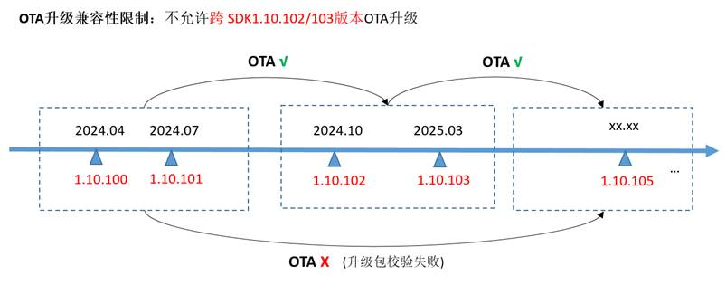

# WS63 1.10.103版本描述文件

## 1.对前一基础版本不足之处的改进

| 序号 | 类别 | 变更描述 | 备注 |
| --- | --- | ------- | --- |
| 01  | WiFi模块优化   | 1、 调整信道扫描参数，优化扫描成功率。 2、 驱动支持LWIP协议栈分片pbuf的发送。 3、 优化SoftAP在干扰环境的发包成功率，改善干扰环境性能。 4、 解决反复断开、再关联场景下，刚关联上时概率存在少量报文接收丢包，增加了业务层丢包或重传。 5、 优化扫描流程，在未关联场景下，扫描后返回到前一次设置的工作信道。 6、 LWIP中打开sntp功能，编译错误修复。 7、 Mqtt组件以补丁方式提供。|     |
| 02  | BLE/星闪模块优化 | 1、 星闪互联互通修改上库，满足SLE认证协议一致性要求。 2、 优化星闪连接稳定性。解决星闪连接参数、反复断开连接场景，概率断链问题。 3、 优化BLE/星闪+WIFI共存场景调度，解决SLE概率断链问题，解决BLE反复扫描导致Wi-Fi高概率断链问题。 4、 BLE Sample支持特征值写属性。 5、 BLE Sample速率配置调整，speed测试支持PHY 2M速率。 6、 优化SLE流控，改善打流稳定性。 |     |
| 03  | 系统及外设优化    | 1、 启动阶段SSB/Flashboot启动打印精简，减少串口信息输出，方便客户共用串口。 2、 AT+CUSTOMEFUSE命令参数优化，支持多次写入。 3、 AT+SYSINFO完善task维测信息打印。 4、 解决UART中断模式下，接收少于16字节数据时，中断未及时上报，导致串口接收延迟。 5、 解决SPI Master模式下，只读不写数据时，时钟信号未输出问题。 6、 OTA升级场景支持flash按分片擦除，减少flash擦除时单次时间占用，减少对数据传输业务的影响。 7、 PWM通道参数支持8个通道设置，支持配置低频（低于1KHz）PWM输出。 |     |
| 04  | 感知模块优化     | 1、优化干扰场景下，检测触发时延。 2、参数标定工具增加隔离度范围统计功能。 3、算法优化，在不同场景下的检测距离、虚警优化。 |     |

## 2.对前一基础版本新增、修改和删除的功能特性

### 2.1  WS63 1.10.103版本对比WS63 1.10.102版本

本章节描述当前版本与上一个基础版本之间的所有新增功能特性。

| 序号 | 简要描述 | 详细描述 | 备注 |
| --- | ------- | ------ | --- |
| 01  | 优化签名加密功能易用性   （保持WS63 1.10.102策略） | 1、 提供签名密钥生成与配置脚本，可通过脚本一键生成密钥（用于签名验签）；（详见“WS63V100 二次开发网络安全”文档1.4 -- 1.6章节；）   2、 为增强签名密钥管理安全性，OTA升级镜像包校验类型新增HASH校验；1.10.100至1.10.103版本，默认签名验签；1.10.103及之后版本默认采用HASH校验，OTA升级约束参考图1所示。 |     |
| 02  | 支持SLE数据基于IP网络传输                   | 1、支持SLE数据基于IP报文封装传输，可进行iperf打流测试。|     |

图1 OTA升级约束示意图  
