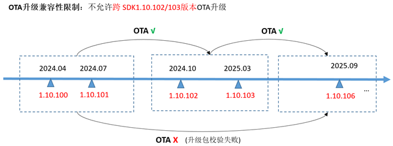

# WS63 1.10.106版本描述文件
WS63 1.10.106版本为Wi-Fi、BLE、SLE的Combo芯片WS63解决方案软件发布版本，提供给客户进行开发设计。

## 1.对前一基础版本不足之处的改进

| 序号 | 类别 | 变更描述 | 备注 |
| --- | --- | ------- | --- |
| 01  | WiFi模块优化   | 1、	支持STA关联前配置信道。 2、	优化错误码上报，解决密码错误时错误码上报不准确问题。 3、	优化Wi-Fi enable和disable流程时序，增强接口鲁棒性。解决部分压测场景打开Wi-Fi概率失败问题。 4、	解决Wi-Fi 鸿蒙智联非独立升级版本编译配置报错问题。 5、	解决部分路由器DHCP Relay场景STA IP地址获取失败问题。 6、	兼容性优化，连接部分QosNull保活异常的路由器，STA保活概率掉线问题。 7、	修改STA 11v漫游失败时，主动回复路由器，改善漫游场景连接稳定性。 8、	Keep alive保活优化，管理帧和多播帧不计入保活计数。 9、	解决部分11b路由器，隐藏SSID场景关联不上问题。 10、	优化产测写入EFUSE重复值校验，改善产测直通率。 11、	支持TPC功率档位配置，支持温保功率档位配置。|     |
| 02  | BLE/星闪模块优化 | 1、	优化SLE Speed Sample，修正设置mcs不生效问题，修正多次断连、连接速率统计准确问题。 2、	修改SLE扫描、广播、BLE扫描结果过滤参数范围。详细参考AT命令行手册描述。 3、	支持SLE Read Req事件完成回调接口注册。 4、	支持BLE Indicate Confirm回调接口注册 5、	解决设置PHY 125K模式不生效问题。 6、	优化SLE SSAP打流流控机制，解决部分场景概率打流掉速问题。 7、	解决连续下发两次相同扫描参数，导致扫描占空比恢复默认值问题。 8、	稳定性优化，多路SLE广播场景、disable和enable BLE压测场景，BLE连接和断开连接压测场景，低概率异常重启问题。解决广播启停压测场景，低概率广播状态异常问题。 9、	优化SLE广播接口地址设置，全零地址会自动切换为本地地址。 10、	修改SLE Server Sample参数，支持鸿蒙5.0手机连接。 11、	优化多SLE设备广播环境下扫描成功率。 12、	修改SLE write_req/read_req错误码，SSAP读属性错误码，满足协议要求。 13、	解决部分压测场景内存泄漏问题：配网场景、反复连接断连场景。|     |
| 03  | 系统及外设优化    | 1、	解决UART DMA操作失败问题。 2、	解决配置指定周期PWM波形，不生效问题。 3、	支持PWM preload配置更新接口。 4、	修正DMA通道申请资源限制问题，避免超过4路外设DMA同时访问时，DMA通道申请冲突问题。 5、	优化SPI时钟配置，解决SPI master时钟配置影响spi slave时钟配置问题。 6、	解决I2S master读不到数据问题，支持I2S修改采样率。 7、	系统启动时增强产测标志位校验，减少客户误修改启动标志位时，误进入产测分区的场景。|     |
| 04  | 感知模块优化     | 1、	优化档位间切换时延。 2、 实现不联网状态下的底层信道切换逻辑及接口，优化干扰环境雷达检测稳定性。 3、 优化人感算法在信道繁忙和微波炉干扰场景下的算法计算稳定性。 4、 支持SP31C人感解决方案配套基础组件。|     |

## 2.对前一基础版本新增、修改和删除的功能特性

### 2.1  WS63 1.10.106版本对比WS63 1.10.103版本

本章节描述当前版本与上一个基础版本之间的所有新增功能特性。

| 序号 | 简要描述 | 详细描述 | 备注 |
| --- | ------- | ------ | --- |
| 01  | BLE连接API优化 | 支持BLE取消连接、配置异步连接接口。 |     |
| 02  | BurnTools烧录 | 支持串口4M波特率烧录。 |     |
| 03  | 系统维测命令 | 1、	增加内存维测命令。 2、	增加系统资源使用情况维测。详见AT命令使用指南2.1.2章节描述。 3、支持AT/DEBUG串口通过Menuconfig可配置，支持配置到同一串口。 |     |
| 04  | SLE维测命令 | 1、增加AT+SLESETMCS 2、更新AT+SLESETPHY命令参数。详细AT命令使用指南3.2.2章节描述。 |     |
| 05  | Wi-Fi维测命令 | Wi-Fi连接和断开流程，增加Auth、Assoc、EAPOL等关键帧维测日志。 |     |

图1 OTA升级约束示意图  
