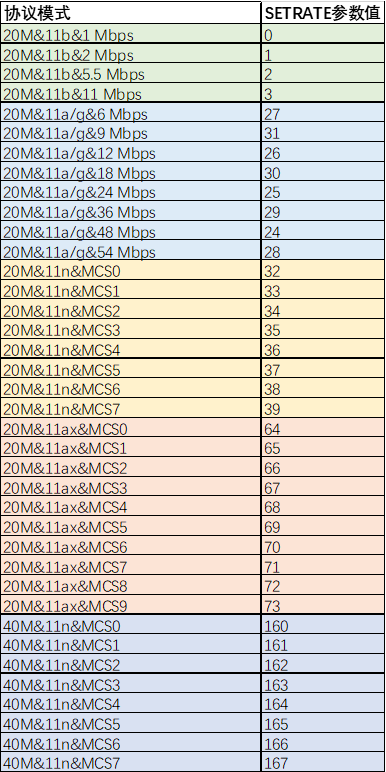

# 前言<a name="ZH-CN_TOPIC_0000001775361928"></a>

**概述<a name="section4537382116410"></a>**

本文档详细的介绍了WS63V100系列模组的射频非信令测试指南和注意事项。

**读者对象<a name="section4378592816410"></a>**

本文档主要适用于以下工程师：

-   单板硬件开发工程师
-   软件工程师
-   技术支持工程师

**符号约定<a name="section133020216410"></a>**

在本文中可能出现下列标志，它们所代表的含义如下。

<a name="table2622507016410"></a>
<table><thead align="left"><tr id="row1530720816410"><th class="cellrowborder" valign="top" width="20.580000000000002%" id="mcps1.1.3.1.1"><p id="p6450074116410"><a name="p6450074116410"></a><a name="p6450074116410"></a><strong id="b2136615816410"><a name="b2136615816410"></a><a name="b2136615816410"></a>符号</strong></p>
</th>
<th class="cellrowborder" valign="top" width="79.42%" id="mcps1.1.3.1.2"><p id="p5435366816410"><a name="p5435366816410"></a><a name="p5435366816410"></a><strong id="b5941558116410"><a name="b5941558116410"></a><a name="b5941558116410"></a>说明</strong></p>
</th>
</tr>
</thead>
<tbody><tr id="row1372280416410"><td class="cellrowborder" valign="top" width="20.580000000000002%" headers="mcps1.1.3.1.1 "><p id="p3734547016410"><a name="p3734547016410"></a><a name="p3734547016410"></a><a name="image2670064316410"></a><a name="image2670064316410"></a><span></span></p>
</td>
<td class="cellrowborder" valign="top" width="79.42%" headers="mcps1.1.3.1.2 "><p id="p1757432116410"><a name="p1757432116410"></a><a name="p1757432116410"></a>表示如不避免则将会导致死亡或严重伤害的具有高等级风险的危害。</p>
</td>
</tr>
<tr id="row466863216410"><td class="cellrowborder" valign="top" width="20.580000000000002%" headers="mcps1.1.3.1.1 "><p id="p1432579516410"><a name="p1432579516410"></a><a name="p1432579516410"></a><a name="image4895582316410"></a><a name="image4895582316410"></a><span></span></p>
</td>
<td class="cellrowborder" valign="top" width="79.42%" headers="mcps1.1.3.1.2 "><p id="p959197916410"><a name="p959197916410"></a><a name="p959197916410"></a>表示如不避免则可能导致死亡或严重伤害的具有中等级风险的危害。</p>
</td>
</tr>
<tr id="row123863216410"><td class="cellrowborder" valign="top" width="20.580000000000002%" headers="mcps1.1.3.1.1 "><p id="p1232579516410"><a name="p1232579516410"></a><a name="p1232579516410"></a><a name="image1235582316410"></a><a name="image1235582316410"></a><span></span></p>
</td>
<td class="cellrowborder" valign="top" width="79.42%" headers="mcps1.1.3.1.2 "><p id="p123197916410"><a name="p123197916410"></a><a name="p123197916410"></a>表示如不避免则可能导致轻微或中度伤害的具有低等级风险的危害。</p>
</td>
</tr>
<tr id="row5786682116410"><td class="cellrowborder" valign="top" width="20.580000000000002%" headers="mcps1.1.3.1.1 "><p id="p2204984716410"><a name="p2204984716410"></a><a name="p2204984716410"></a><a name="image4504446716410"></a><a name="image4504446716410"></a><span></span></p>
</td>
<td class="cellrowborder" valign="top" width="79.42%" headers="mcps1.1.3.1.2 "><p id="p4388861916410"><a name="p4388861916410"></a><a name="p4388861916410"></a>用于传递设备或环境安全警示信息。如不避免则可能会导致设备损坏、数据丢失、设备性能降低或其它不可预知的结果。</p>
<p id="p1238861916410"><a name="p1238861916410"></a><a name="p1238861916410"></a>“须知”不涉及人身伤害。</p>
</td>
</tr>
<tr id="row2856923116410"><td class="cellrowborder" valign="top" width="20.580000000000002%" headers="mcps1.1.3.1.1 "><p id="p5555360116410"><a name="p5555360116410"></a><a name="p5555360116410"></a><a name="image799324016410"></a><a name="image799324016410"></a><span></span></p>
</td>
<td class="cellrowborder" valign="top" width="79.42%" headers="mcps1.1.3.1.2 "><p id="p4612588116410"><a name="p4612588116410"></a><a name="p4612588116410"></a>对正文中重点信息的补充说明。</p>
<p id="p1232588116410"><a name="p1232588116410"></a><a name="p1232588116410"></a>“说明”不是安全警示信息，不涉及人身、设备及环境伤害信息。</p>
</td>
</tr>
</tbody>
</table>

**修改记录<a name="section2467512116410"></a>**

<a name="table219mcpsimp"></a>
<table><thead align="left"><tr id="row225mcpsimp"><th class="cellrowborder" valign="top" width="21%" id="mcps1.1.4.1.1"><p id="p227mcpsimp"><a name="p227mcpsimp"></a><a name="p227mcpsimp"></a><strong id="b228mcpsimp"><a name="b228mcpsimp"></a><a name="b228mcpsimp"></a>文档版本</strong></p>
</th>
<th class="cellrowborder" valign="top" width="26%" id="mcps1.1.4.1.2"><p id="p230mcpsimp"><a name="p230mcpsimp"></a><a name="p230mcpsimp"></a><strong id="b231mcpsimp"><a name="b231mcpsimp"></a><a name="b231mcpsimp"></a>发布日期</strong></p>
</th>
<th class="cellrowborder" valign="top" width="53%" id="mcps1.1.4.1.3"><p id="p233mcpsimp"><a name="p233mcpsimp"></a><a name="p233mcpsimp"></a><strong id="b234mcpsimp"><a name="b234mcpsimp"></a><a name="b234mcpsimp"></a>修改说明</strong></p>
</th>
</tr>
</thead>
<tbody><tr id="row20605122611816"><td class="cellrowborder" valign="top" width="21%" headers="mcps1.1.4.1.1 "><p id="p9605626121811"><a name="p9605626121811"></a><a name="p9605626121811"></a>05</p>
</td>
<td class="cellrowborder" valign="top" width="26%" headers="mcps1.1.4.1.2 "><p id="p860562651812"><a name="p860562651812"></a><a name="p860562651812"></a>2025-02-28</p>
</td>
<td class="cellrowborder" valign="top" width="53%" headers="mcps1.1.4.1.3 "><p id="p1107125224"><a name="p1107125224"></a><a name="p1107125224"></a>更新“<a href="射频测试相关指令描述.md">射频测试相关指令描述</a>”小节内容。</p>
</td>
</tr>
<tr id="row20123201112196"><td class="cellrowborder" valign="top" width="21%" headers="mcps1.1.4.1.1 "><p id="p3123101116194"><a name="p3123101116194"></a><a name="p3123101116194"></a>04</p>
</td>
<td class="cellrowborder" valign="top" width="26%" headers="mcps1.1.4.1.2 "><p id="p71231311161917"><a name="p71231311161917"></a><a name="p71231311161917"></a>2024-09-29</p>
</td>
<td class="cellrowborder" valign="top" width="53%" headers="mcps1.1.4.1.3 "><p id="p212381171918"><a name="p212381171918"></a><a name="p212381171918"></a>更新“<a href="射频测试相关指令描述.md">射频测试相关指令描述</a>”小节内容。</p>
</td>
</tr>
<tr id="row111016439147"><td class="cellrowborder" valign="top" width="21%" headers="mcps1.1.4.1.1 "><p id="p141101343191416"><a name="p141101343191416"></a><a name="p141101343191416"></a>03</p>
</td>
<td class="cellrowborder" valign="top" width="26%" headers="mcps1.1.4.1.2 "><p id="p911094311144"><a name="p911094311144"></a><a name="p911094311144"></a>2024-07-01</p>
</td>
<td class="cellrowborder" valign="top" width="53%" headers="mcps1.1.4.1.3 "><a name="ul17776104401614"></a><a name="ul17776104401614"></a><ul id="ul17776104401614"><li>更新“<a href="射频测试相关指令描述.md">射频测试相关指令描述</a>”小节中WiF常发命令参数说明。</li><li>更新 "<a href="示例.md">示例</a>”小节中WiF常发常收命令。</li></ul>
</td>
</tr>
<tr id="row1397712405490"><td class="cellrowborder" valign="top" width="21%" headers="mcps1.1.4.1.1 "><p id="p179781640144919"><a name="p179781640144919"></a><a name="p179781640144919"></a>02</p>
</td>
<td class="cellrowborder" valign="top" width="26%" headers="mcps1.1.4.1.2 "><p id="p49782040104917"><a name="p49782040104917"></a><a name="p49782040104917"></a>2024-05-08</p>
</td>
<td class="cellrowborder" valign="top" width="53%" headers="mcps1.1.4.1.3 "><p id="p1326845194918"><a name="p1326845194918"></a><a name="p1326845194918"></a>更新“<a href="射频测试相关指令描述.md">射频测试相关指令描述</a>”小节内容。</p>
</td>
</tr>
<tr id="row121831127152117"><td class="cellrowborder" valign="top" width="21%" headers="mcps1.1.4.1.1 "><p id="p118382762110"><a name="p118382762110"></a><a name="p118382762110"></a>01</p>
</td>
<td class="cellrowborder" valign="top" width="26%" headers="mcps1.1.4.1.2 "><p id="p171834279217"><a name="p171834279217"></a><a name="p171834279217"></a>2024-04-10</p>
</td>
<td class="cellrowborder" valign="top" width="53%" headers="mcps1.1.4.1.3 "><p id="p618317279212"><a name="p618317279212"></a><a name="p618317279212"></a>第一次正式版本发布。</p>
<a name="ul113196321224"></a><a name="ul113196321224"></a><ul id="ul113196321224"><li>更新“<a href="射频测试相关指令描述.md">射频测试相关指令描述</a>”小节内容。</li><li>更新“<a href="常发单音指令示例.md">常发单音指令示例</a>”小节内容。</li></ul>
</td>
</tr>
<tr id="row1787321175215"><td class="cellrowborder" valign="top" width="21%" headers="mcps1.1.4.1.1 "><p id="p158747111529"><a name="p158747111529"></a><a name="p158747111529"></a>00B06</p>
</td>
<td class="cellrowborder" valign="top" width="26%" headers="mcps1.1.4.1.2 "><p id="p1287481165218"><a name="p1287481165218"></a><a name="p1287481165218"></a>2024-03-14</p>
</td>
<td class="cellrowborder" valign="top" width="53%" headers="mcps1.1.4.1.3 "><p id="p165578555210"><a name="p165578555210"></a><a name="p165578555210"></a>更新“<a href="射频测试相关指令描述.md">射频测试相关指令描述</a>”小节中常发命令参数说明。</p>
</td>
</tr>
<tr id="row127657374292"><td class="cellrowborder" valign="top" width="21%" headers="mcps1.1.4.1.1 "><p id="p4766153722913"><a name="p4766153722913"></a><a name="p4766153722913"></a>00B05</p>
</td>
<td class="cellrowborder" valign="top" width="26%" headers="mcps1.1.4.1.2 "><p id="p18915144264818"><a name="p18915144264818"></a><a name="p18915144264818"></a>2024-02-29</p>
</td>
<td class="cellrowborder" valign="top" width="53%" headers="mcps1.1.4.1.3 "><p id="p13766193702912"><a name="p13766193702912"></a><a name="p13766193702912"></a>更新“<a href="射频测试相关指令描述.md">射频测试相关指令描述</a>”小节中常发命令参数说明。</p>
</td>
</tr>
<tr id="row17825164920247"><td class="cellrowborder" valign="top" width="21%" headers="mcps1.1.4.1.1 "><p id="p1482516496249"><a name="p1482516496249"></a><a name="p1482516496249"></a>00B04</p>
</td>
<td class="cellrowborder" valign="top" width="26%" headers="mcps1.1.4.1.2 "><p id="p18251549132413"><a name="p18251549132413"></a><a name="p18251549132413"></a>2024-02-22</p>
</td>
<td class="cellrowborder" valign="top" width="53%" headers="mcps1.1.4.1.3 "><p id="p1482518494247"><a name="p1482518494247"></a><a name="p1482518494247"></a>更新“<a href="射频测试相关指令描述.md">射频测试相关指令描述</a>”小节中常发命令参数说明。</p>
</td>
</tr>
<tr id="row455993791212"><td class="cellrowborder" valign="top" width="21%" headers="mcps1.1.4.1.1 "><p id="p1756013376128"><a name="p1756013376128"></a><a name="p1756013376128"></a>00B03</p>
</td>
<td class="cellrowborder" valign="top" width="26%" headers="mcps1.1.4.1.2 "><p id="p125601037171219"><a name="p125601037171219"></a><a name="p125601037171219"></a>2024-01-15</p>
</td>
<td class="cellrowborder" valign="top" width="53%" headers="mcps1.1.4.1.3 "><a name="ul16242167389"></a><a name="ul16242167389"></a><ul id="ul16242167389"><li>更新“<a href="射频测试相关指令描述.md">射频测试相关指令描述</a>”小节中WiFi常发指令与示例，以及BLE/SLE相关命令。</li><li>更新 "<a href="示例.md">示例</a>”小节中BLE/SLE常发常收命令。</li></ul>
</td>
</tr>
<tr id="row6215812103316"><td class="cellrowborder" valign="top" width="21%" headers="mcps1.1.4.1.1 "><p id="p02161112113317"><a name="p02161112113317"></a><a name="p02161112113317"></a>00B02</p>
</td>
<td class="cellrowborder" valign="top" width="26%" headers="mcps1.1.4.1.2 "><p id="p2021681293317"><a name="p2021681293317"></a><a name="p2021681293317"></a>2023-12-18</p>
</td>
<td class="cellrowborder" valign="top" width="53%" headers="mcps1.1.4.1.3 "><p id="p1821619128334"><a name="p1821619128334"></a><a name="p1821619128334"></a>更新“<a href="射频测试相关指令描述.md">射频测试相关指令描述</a>”小节中常发命令内容.</p>
</td>
</tr>
<tr id="row236mcpsimp"><td class="cellrowborder" valign="top" width="21%" headers="mcps1.1.4.1.1 "><p id="p238mcpsimp"><a name="p238mcpsimp"></a><a name="p238mcpsimp"></a>00B01</p>
</td>
<td class="cellrowborder" valign="top" width="26%" headers="mcps1.1.4.1.2 "><p id="p240mcpsimp"><a name="p240mcpsimp"></a><a name="p240mcpsimp"></a>2023-11-24</p>
</td>
<td class="cellrowborder" valign="top" width="53%" headers="mcps1.1.4.1.3 "><p id="p242mcpsimp"><a name="p242mcpsimp"></a><a name="p242mcpsimp"></a>第一次临时版本发布。</p>
</td>
</tr>
</tbody>
</table>

# 测试指令<a name="ZH-CN_TOPIC_0000001767604097"></a>


## 射频测试相关指令描述<a name="ZH-CN_TOPIC_0000001767724889"></a>

<a name="table249mcpsimp"></a>
<table><thead align="left"><tr id="row255mcpsimp"><th class="cellrowborder" valign="top" width="10%" id="mcps1.1.4.1.1"><p id="p257mcpsimp"><a name="p257mcpsimp"></a><a name="p257mcpsimp"></a>序号</p>
</th>
<th class="cellrowborder" valign="top" width="18.95%" id="mcps1.1.4.1.2"><p id="p259mcpsimp"><a name="p259mcpsimp"></a><a name="p259mcpsimp"></a>测试命令</p>
</th>
<th class="cellrowborder" valign="top" width="71.05%" id="mcps1.1.4.1.3"><p id="p261mcpsimp"><a name="p261mcpsimp"></a><a name="p261mcpsimp"></a>命令说明</p>
</th>
</tr>
</thead>
<tbody><tr id="row263mcpsimp"><td class="cellrowborder" valign="top" width="10%" headers="mcps1.1.4.1.1 "><p id="p265mcpsimp"><a name="p265mcpsimp"></a><a name="p265mcpsimp"></a>1</p>
</td>
<td class="cellrowborder" valign="top" width="18.95%" headers="mcps1.1.4.1.2 "><p id="p267mcpsimp"><a name="p267mcpsimp"></a><a name="p267mcpsimp"></a>初始化WiFi</p>
</td>
<td class="cellrowborder" valign="top" width="71.05%" headers="mcps1.1.4.1.3 "><p id="p717911115911"><a name="p717911115911"></a><a name="p717911115911"></a>命令格式：</p>
<p id="p271mcpsimp"><a name="p271mcpsimp"></a><a name="p271mcpsimp"></a>AT+STARTSTA</p>
</td>
</tr>
<tr id="row272mcpsimp"><td class="cellrowborder" valign="top" width="10%" headers="mcps1.1.4.1.1 "><p id="p274mcpsimp"><a name="p274mcpsimp"></a><a name="p274mcpsimp"></a>2</p>
</td>
<td class="cellrowborder" valign="top" width="18.95%" headers="mcps1.1.4.1.2 "><p id="p276mcpsimp"><a name="p276mcpsimp"></a><a name="p276mcpsimp"></a>WiFi常发命令</p>
</td>
<td class="cellrowborder" valign="top" width="71.05%" headers="mcps1.1.4.1.3 "><p id="p1598116485516"><a name="p1598116485516"></a><a name="p1598116485516"></a><strong id="b720814910115"><a name="b720814910115"></a><a name="b720814910115"></a>配置协议模式</strong></p>
<a name="ul9982114812514"></a><a name="ul9982114812514"></a><ul id="ul9982114812514"><li>命令格式<p id="p2982104820513"><a name="p2982104820513"></a><a name="p2982104820513"></a>AT+CCPRIV=wlan0,mode,&lt;mode&gt;</p>
</li><li>参数说明：11b、11g2g20、11n2g20、11n2g40、11ax2g20</li></ul>
<p id="p12383451652"><a name="p12383451652"></a><a name="p12383451652"></a><strong id="b51291165223"><a name="b51291165223"></a><a name="b51291165223"></a>设置信道</strong></p>
<a name="ul6395451554"></a><a name="ul6395451554"></a><ul id="ul6395451554"><li>命令格式<pre class="codeblock" id="codeblock3391451756"><a name="codeblock3391451756"></a><a name="codeblock3391451756"></a>AT+CCPRIV=wlan0,freq,&lt;freq&gt;</pre>
</li><li>参数说明：信道1~14，只有11b有信道14。当协议模式是11N 40M上偏/下偏时，实际信道会上偏/下偏2个信道；如设置1信道上偏，仪器3信道才能测出信号，设置9信道下偏，仪器7信道才能测出信号。</li></ul>
<p id="p1775934219512"><a name="p1775934219512"></a><a name="p1775934219512"></a><strong id="b5282625112319"><a name="b5282625112319"></a><a name="b5282625112319"></a>配置常发</strong></p>
<a name="ul1976214210517"></a><a name="ul1976214210517"></a><ul id="ul1976214210517"><li>命令格式<p id="p147621421259"><a name="p147621421259"></a><a name="p147621421259"></a>AT+ALTX=&lt;control&gt;</p>
</li><li>参数说明<p id="p2627mcpsimp"><a name="p2627mcpsimp"></a><a name="p2627mcpsimp"></a>&lt;control&gt;：使能开关</p>
<p id="p2628mcpsimp"><a name="p2628mcpsimp"></a><a name="p2628mcpsimp"></a>0：关闭</p>
<p id="p2629mcpsimp"><a name="p2629mcpsimp"></a><a name="p2629mcpsimp"></a>1：打开</p>
<p id="p1396104016522"><a name="p1396104016522"></a><a name="p1396104016522"></a>2：固定速率常发</p>
</li></ul>
<a name="ul189839315361"></a><a name="ul189839315361"></a><ul id="ul189839315361"><li>命令格式<p id="p1647214548365"><a name="p1647214548365"></a><a name="p1647214548365"></a>AT+CCPRIV=wlan0,al_tx_ccpriv,&lt;flag&gt;,&lt;payload&gt;,&lt;len&gt;,&lt;tpc_code&gt;,&lt;duty_ratio&gt;</p>
</li><li>参数说明<p id="p570194413711"><a name="p570194413711"></a><a name="p570194413711"></a>&lt;flag&gt;：</p>
<p id="p251161013386"><a name="p251161013386"></a><a name="p251161013386"></a>0：关闭常发</p>
<p id="p3511131014384"><a name="p3511131014384"></a><a name="p3511131014384"></a>1：打开常发</p>
<p id="p5281147123716"><a name="p5281147123716"></a><a name="p5281147123716"></a>&lt;payload&gt;：</p>
<p id="p1284102063814"><a name="p1284102063814"></a><a name="p1284102063814"></a>0：全0</p>
<p id="p2831153212388"><a name="p2831153212388"></a><a name="p2831153212388"></a>1：全1</p>
<p id="p137992367383"><a name="p137992367383"></a><a name="p137992367383"></a>2：全1010</p>
<p id="p5696144753817"><a name="p5696144753817"></a><a name="p5696144753817"></a>3：随机值</p>
<p id="p2478114933712"><a name="p2478114933712"></a><a name="p2478114933712"></a>&lt;len&gt;：payload长度：0-4000</p>
<p id="p1391942132718"><a name="p1391942132718"></a><a name="p1391942132718"></a>&lt;tpc_code&gt;（可选参数）：11g/n/ax 是0~73，11b是74~146，tpc_code越小，功率越大，初始值 23dBm，每档下调0.5dBm；255表示使用功率表中的功率值。</p>
<p id="p116427461094"><a name="p116427461094"></a><a name="p116427461094"></a>&lt;duty_ratio&gt; (可选参数) ：常发占空比，取值范围1~10，分别对应占空比10%~100%，缺省值为7，对应占空比70%。要配置duty_ratio必须配置tpc_code，不需要配置duty_ratio则tpc_code可选。</p>
</li></ul>
</td>
</tr>
<tr id="row359mcpsimp"><td class="cellrowborder" valign="top" width="10%" headers="mcps1.1.4.1.1 "><p id="p361mcpsimp"><a name="p361mcpsimp"></a><a name="p361mcpsimp"></a>3</p>
</td>
<td class="cellrowborder" valign="top" width="18.95%" headers="mcps1.1.4.1.2 "><p id="p363mcpsimp"><a name="p363mcpsimp"></a><a name="p363mcpsimp"></a>WiFi常收命令</p>
</td>
<td class="cellrowborder" valign="top" width="71.05%" headers="mcps1.1.4.1.3 "><p id="p1932362417611"><a name="p1932362417611"></a><a name="p1932362417611"></a><strong id="b367mcpsimp"><a name="b367mcpsimp"></a><a name="b367mcpsimp"></a>关闭常收</strong></p>
<a name="ul365mcpsimp"></a><a name="ul365mcpsimp"></a><ul id="ul365mcpsimp"><li>命令格式<p id="p39526271062"><a name="p39526271062"></a><a name="p39526271062"></a>AT+ALRX=0</p>
</li></ul>
<p id="p937523010612"><a name="p937523010612"></a><a name="p937523010612"></a><strong id="b371mcpsimp"><a name="b371mcpsimp"></a><a name="b371mcpsimp"></a>设置常收</strong></p>
<a name="ul23787301268"></a><a name="ul23787301268"></a><ul id="ul23787301268"><li>命令格式<p id="p23784301965"><a name="p23784301965"></a><a name="p23784301965"></a>AT+ALRX=&lt;flag&gt;,&lt;协议模式&gt;,&lt;带宽&gt;,&lt;frep&gt;,&lt;保留位&gt;</p>
</li><li>参数说明<a name="ul11378193018612"></a><a name="ul11378193018612"></a><ul id="ul11378193018612"><li>&lt;flag&gt;：<p id="p103781930761"><a name="p103781930761"></a><a name="p103781930761"></a>0：关闭常收</p>
<p id="p1037817309613"><a name="p1037817309613"></a><a name="p1037817309613"></a>1：开启常收</p>
<p id="p18378730660"><a name="p18378730660"></a><a name="p18378730660"></a>2：修改速率（修改为广播）</p>
</li><li>&lt;协议模式&gt;：<p id="p2378133010611"><a name="p2378133010611"></a><a name="p2378133010611"></a>0：802.11n</p>
<p id="p1337893016610"><a name="p1337893016610"></a><a name="p1337893016610"></a>1：802.11g</p>
<p id="p43781730668"><a name="p43781730668"></a><a name="p43781730668"></a>2：802.11b</p>
<p id="p1237833018615"><a name="p1237833018615"></a><a name="p1237833018615"></a>3：802.11ax</p>
<p id="p109259501329"><a name="p109259501329"></a><a name="p109259501329"></a>5：11n40plus</p>
<p id="p143781830362"><a name="p143781830362"></a><a name="p143781830362"></a>6：11n40minus</p>
</li><li>&lt;带宽&gt;：<p id="p837883010616"><a name="p837883010616"></a><a name="p837883010616"></a>20M：20</p>
<p id="p113781030664"><a name="p113781030664"></a><a name="p113781030664"></a>40M：40</p>
</li><li>&lt; freq &gt;：频点，信道号</li><li>协议模式0~3：信道号取值范围：1~14 ，只有11b有信道14</li><li>协议模式5：信道号取值范围：1~9</li><li>协议模式6：信道号取值范围：5~13</li></ul>
<a name="ul391mcpsimp"></a><a name="ul391mcpsimp"></a><ul id="ul391mcpsimp"><li>&lt; 保留位&gt;：</li></ul>
<p id="p394mcpsimp"><a name="p394mcpsimp"></a><a name="p394mcpsimp"></a>0/1均可</p>
</li></ul>
<p id="p396mcpsimp"><a name="p396mcpsimp"></a><a name="p396mcpsimp"></a><strong id="b397mcpsimp"><a name="b397mcpsimp"></a><a name="b397mcpsimp"></a>查询接收包数统计</strong></p>
<a name="ul398mcpsimp"></a><a name="ul398mcpsimp"></a><ul id="ul398mcpsimp"><li>命令格式<p id="p400mcpsimp"><a name="p400mcpsimp"></a><a name="p400mcpsimp"></a>AT+RXINFO</p>
</li><li>响应<p id="p402mcpsimp"><a name="p402mcpsimp"></a><a name="p402mcpsimp"></a>+RXINFO::rx succ num[mpdu,ampdu]:[45713,975] fail num:47959 rssi:-69</p>
</li></ul>
<a name="ul403mcpsimp"></a><a name="ul403mcpsimp"></a><ul id="ul403mcpsimp"><li>示例<p id="p405mcpsimp"><a name="p405mcpsimp"></a><a name="p405mcpsimp"></a>说明：接收成功45713个MPDU报文、975个AMPDU报文，接收失败47959个报文。</p>
</li></ul>
<a name="ul406mcpsimp"></a><a name="ul406mcpsimp"></a><ul id="ul406mcpsimp"><li>注意事项<p id="p408mcpsimp"><a name="p408mcpsimp"></a><a name="p408mcpsimp"></a>在设置常收命令后执行查询，在Host侧查看打印结果。</p>
</li></ul>
</td>
</tr>
<tr id="row957214432523"><td class="cellrowborder" valign="top" width="10%" headers="mcps1.1.4.1.1 "><p id="p157234355213"><a name="p157234355213"></a><a name="p157234355213"></a>4</p>
</td>
<td class="cellrowborder" valign="top" width="18.95%" headers="mcps1.1.4.1.2 "><p id="p957214375216"><a name="p957214375216"></a><a name="p957214375216"></a>开启WiFi单音</p>
</td>
<td class="cellrowborder" valign="top" width="71.05%" headers="mcps1.1.4.1.3 "><p id="p68217420548"><a name="p68217420548"></a><a name="p68217420548"></a><strong id="b882124125418"><a name="b882124125418"></a><a name="b882124125418"></a>配置单音</strong></p>
<a name="ul208213475416"></a><a name="ul208213475416"></a><ul id="ul208213475416"><li>命令格式<p id="p8824445419"><a name="p8824445419"></a><a name="p8824445419"></a>AT+CALTONE=&lt;sw&gt;, &lt;tone_freq&gt;</p>
</li><li>参数说明<p id="p2785134615515"><a name="p2785134615515"></a><a name="p2785134615515"></a>&lt;sw&gt;：开关，1: 开启 0: 关闭。</p>
<p id="p45584482551"><a name="p45584482551"></a><a name="p45584482551"></a>&lt;tone_freq&gt;:单音偏移频率，单位kHz</p>
</li><li>响应<p id="p26398125710"><a name="p26398125710"></a><a name="p26398125710"></a>成功：OK</p>
<p id="p91101095576"><a name="p91101095576"></a><a name="p91101095576"></a>失败：ERROR</p>
</li><li>示例<p id="p139513114316"><a name="p139513114316"></a><a name="p139513114316"></a>开启单音，单音频移中心频率2.5MHz</p>
<p id="p2741mcpsimp"><a name="p2741mcpsimp"></a><a name="p2741mcpsimp"></a>AT+CALTONE=1, 2500</p>
<p id="p16179250317"><a name="p16179250317"></a><a name="p16179250317"></a>关闭单音</p>
<p id="p1890815285312"><a name="p1890815285312"></a><a name="p1890815285312"></a>AT+CALTONE=0, 0</p>
</li><li>注意事项<p id="p19231931185616"><a name="p19231931185616"></a><a name="p19231931185616"></a>单音功能的命令在WIFI常发后使用。</p>
</li></ul>
</td>
</tr>
<tr id="row409mcpsimp"><td class="cellrowborder" valign="top" width="10%" headers="mcps1.1.4.1.1 "><p id="p411mcpsimp"><a name="p411mcpsimp"></a><a name="p411mcpsimp"></a>5</p>
</td>
<td class="cellrowborder" valign="top" width="18.95%" headers="mcps1.1.4.1.2 "><p id="p425111363546"><a name="p425111363546"></a><a name="p425111363546"></a>开启BLE</p>
</td>
<td class="cellrowborder" valign="top" width="71.05%" headers="mcps1.1.4.1.3 "><a name="ul3622152774614"></a><a name="ul3622152774614"></a><ul id="ul3622152774614"><li>命令格式<pre class="codeblock" id="codeblock146224273460"><a name="codeblock146224273460"></a><a name="codeblock146224273460"></a>AT+BLEENABLE</pre>
</li><li>响应<p id="p116232279468"><a name="p116232279468"></a><a name="p116232279468"></a>OK或ERROR</p>
</li><li>说明<p id="p17623827114619"><a name="p17623827114619"></a><a name="p17623827114619"></a>在进行BLE测试和产线校准前，先运行本条命令，开启BLE协议栈。</p>
</li></ul>
</td>
</tr>
<tr id="row420mcpsimp"><td class="cellrowborder" valign="top" width="10%" headers="mcps1.1.4.1.1 "><p id="p422mcpsimp"><a name="p422mcpsimp"></a><a name="p422mcpsimp"></a>6</p>
</td>
<td class="cellrowborder" valign="top" width="18.95%" headers="mcps1.1.4.1.2 "><p id="p424mcpsimp"><a name="p424mcpsimp"></a><a name="p424mcpsimp"></a>注册BLE回调</p>
</td>
<td class="cellrowborder" valign="top" width="71.05%" headers="mcps1.1.4.1.3 "><a name="ul134281445162811"></a><a name="ul134281445162811"></a><ul id="ul134281445162811"><li>命令格式<pre class="codeblock" id="codeblock188903518295"><a name="codeblock188903518295"></a><a name="codeblock188903518295"></a>AT+BLEFACCALLBACK</pre>
</li><li>响应<p id="p2564897586"><a name="p2564897586"></a><a name="p2564897586"></a>OK或ERROR</p>
</li><li>说明<p id="p1096020424292"><a name="p1096020424292"></a><a name="p1096020424292"></a>在进行BLE测试和BLE/SLE产线校准前，先运行本条命令，注册消息回显。</p>
</li></ul>
</td>
</tr>
<tr id="row430mcpsimp"><td class="cellrowborder" valign="top" width="10%" headers="mcps1.1.4.1.1 "><p id="p432mcpsimp"><a name="p432mcpsimp"></a><a name="p432mcpsimp"></a>7</p>
</td>
<td class="cellrowborder" valign="top" width="18.95%" headers="mcps1.1.4.1.2 "><p id="p434mcpsimp"><a name="p434mcpsimp"></a><a name="p434mcpsimp"></a>BLE常发</p>
</td>
<td class="cellrowborder" valign="top" width="71.05%" headers="mcps1.1.4.1.3 "><a name="ul73067349339"></a><a name="ul73067349339"></a><ul id="ul73067349339"><li>命令格式<pre class="codeblock" id="codeblock114436366425"><a name="codeblock114436366425"></a><a name="codeblock114436366425"></a>AT+BLETX=&lt;channel&gt;,&lt;data_len&gt;,&lt;payload_type&gt;.&lt;phy&gt;</pre>
</li><li>参数说明<a name="ul820mcpsimp"></a><a name="ul820mcpsimp"></a><ul id="ul820mcpsimp"><li>channel：0~39，对应BLE的40个channel。</li><li>data_len：37~255，表示发送测试包的长度，单位：Byte<strong id="b823mcpsimp"><a name="b823mcpsimp"></a><a name="b823mcpsimp"></a>。</strong></li><li>payload_type：0~7，表示发送测试包携带的内容。<p id="p825mcpsimp"><a name="p825mcpsimp"></a><a name="p825mcpsimp"></a>0：PRBS9</p>
<p id="p826mcpsimp"><a name="p826mcpsimp"></a><a name="p826mcpsimp"></a>1：'11110000'</p>
<p id="p827mcpsimp"><a name="p827mcpsimp"></a><a name="p827mcpsimp"></a>2：'10101010'</p>
<p id="p828mcpsimp"><a name="p828mcpsimp"></a><a name="p828mcpsimp"></a>3：PRBS15</p>
<p id="p829mcpsimp"><a name="p829mcpsimp"></a><a name="p829mcpsimp"></a>4：'11111111'</p>
<p id="p830mcpsimp"><a name="p830mcpsimp"></a><a name="p830mcpsimp"></a>5：'00000000'</p>
<p id="p831mcpsimp"><a name="p831mcpsimp"></a><a name="p831mcpsimp"></a>6：'00001111'</p>
<p id="p832mcpsimp"><a name="p832mcpsimp"></a><a name="p832mcpsimp"></a>7：'01010101'</p>
</li><li>phy：表示发送测试包使用的物理调试链路。<p id="p834mcpsimp"><a name="p834mcpsimp"></a><a name="p834mcpsimp"></a>1：LE 1MPhy</p>
<p id="p835mcpsimp"><a name="p835mcpsimp"></a><a name="p835mcpsimp"></a>2：LE 2MPhy</p>
<p id="p836mcpsimp"><a name="p836mcpsimp"></a><a name="p836mcpsimp"></a>3：LE CodedPhy (S=8)</p>
<p id="p837mcpsimp"><a name="p837mcpsimp"></a><a name="p837mcpsimp"></a>4：LE CodedPhy (S=2)</p>
</li></ul>
</li><li>响应<p id="p184551145377"><a name="p184551145377"></a><a name="p184551145377"></a>OK</p>
<p id="p2020611171370"><a name="p2020611171370"></a><a name="p2020611171370"></a>status：&lt;value&gt;</p>
<p id="p1995416121379"><a name="p1995416121379"></a><a name="p1995416121379"></a>value：返回状态，0表示成功，其他值表示错误。</p>
</li></ul>
</td>
</tr>
<tr id="row468mcpsimp"><td class="cellrowborder" valign="top" width="10%" headers="mcps1.1.4.1.1 "><p id="p470mcpsimp"><a name="p470mcpsimp"></a><a name="p470mcpsimp"></a>8</p>
</td>
<td class="cellrowborder" valign="top" width="18.95%" headers="mcps1.1.4.1.2 "><p id="p472mcpsimp"><a name="p472mcpsimp"></a><a name="p472mcpsimp"></a>BLE常收</p>
</td>
<td class="cellrowborder" valign="top" width="71.05%" headers="mcps1.1.4.1.3 "><a name="ul16677154134517"></a><a name="ul16677154134517"></a><ul id="ul16677154134517"><li>命令格式<pre class="codeblock" id="codeblock8677249455"><a name="codeblock8677249455"></a><a name="codeblock8677249455"></a>AT+BLERX=&lt;channel&gt;,&lt;phy&gt;,&lt;modulation&gt;</pre>
</li><li>参数说明<a name="ul858mcpsimp"></a><a name="ul858mcpsimp"></a><ul id="ul858mcpsimp"><li>channel：0~39，对应BLE的40个channel。</li><li>phy：监听的物理调试链路。<p id="p861mcpsimp"><a name="p861mcpsimp"></a><a name="p861mcpsimp"></a>1：LE 1MPhy</p>
<p id="p862mcpsimp"><a name="p862mcpsimp"></a><a name="p862mcpsimp"></a>2：LE 2MPhy</p>
<p id="p863mcpsimp"><a name="p863mcpsimp"></a><a name="p863mcpsimp"></a>3：LE CodedPhy</p>
</li><li>modulation：<p id="p865mcpsimp"><a name="p865mcpsimp"></a><a name="p865mcpsimp"></a>0：standard</p>
<p id="p866mcpsimp"><a name="p866mcpsimp"></a><a name="p866mcpsimp"></a>1：stable</p>
</li></ul>
</li><li>响应<p id="p36788414513"><a name="p36788414513"></a><a name="p36788414513"></a>OK</p>
<p id="p16788464516"><a name="p16788464516"></a><a name="p16788464516"></a>status：&lt;value&gt;</p>
<p id="p184114191172"><a name="p184114191172"></a><a name="p184114191172"></a>value：返回状态，0表示成功，其他值表示错误。</p>
</li></ul>
</td>
</tr>
<tr id="row497mcpsimp"><td class="cellrowborder" valign="top" width="10%" headers="mcps1.1.4.1.1 "><p id="p499mcpsimp"><a name="p499mcpsimp"></a><a name="p499mcpsimp"></a>9</p>
</td>
<td class="cellrowborder" valign="top" width="18.95%" headers="mcps1.1.4.1.2 "><p id="p501mcpsimp"><a name="p501mcpsimp"></a><a name="p501mcpsimp"></a>结束BLE常发/常收</p>
</td>
<td class="cellrowborder" valign="top" width="71.05%" headers="mcps1.1.4.1.3 "><a name="ul183631118114711"></a><a name="ul183631118114711"></a><ul id="ul183631118114711"><li>命令格式<pre class="codeblock" id="codeblock3363918154710"><a name="codeblock3363918154710"></a><a name="codeblock3363918154710"></a>AT+BLETRXEND</pre>
</li><li>响应<p id="p33631018134717"><a name="p33631018134717"></a><a name="p33631018134717"></a>OK</p>
<p id="p1836391854718"><a name="p1836391854718"></a><a name="p1836391854718"></a>status：&lt;value1&gt;，num_packets：&lt;value2&gt;</p>
<a name="ul143631318114712"></a><a name="ul143631318114712"></a><ul id="ul143631318114712"><li>value1：返回状态，0表示成功，其他值表示错误；</li><li>value2：收包数，16进制表示，仅在结束BLE常收时有效。</li></ul>
</li></ul>
</td>
</tr>
<tr id="row10850101365718"><td class="cellrowborder" valign="top" width="10%" headers="mcps1.1.4.1.1 "><p id="p185091395715"><a name="p185091395715"></a><a name="p185091395715"></a>10</p>
</td>
<td class="cellrowborder" valign="top" width="18.95%" headers="mcps1.1.4.1.2 "><p id="p13850613135714"><a name="p13850613135714"></a><a name="p13850613135714"></a>BLE Reset</p>
</td>
<td class="cellrowborder" valign="top" width="71.05%" headers="mcps1.1.4.1.3 "><a name="ul74546975015"></a><a name="ul74546975015"></a><ul id="ul74546975015"><li>命令格式<pre class="codeblock" id="codeblock11454194504"><a name="codeblock11454194504"></a><a name="codeblock11454194504"></a>AT+BLERST</pre>
</li><li>响应<p id="p2454169135012"><a name="p2454169135012"></a><a name="p2454169135012"></a>OK</p>
<p id="p194541099504"><a name="p194541099504"></a><a name="p194541099504"></a>status：&lt;value&gt;</p>
<p id="p135887275718"><a name="p135887275718"></a><a name="p135887275718"></a>value：返回状态，0表示成功，其他值表示错误。</p>
</li></ul>
</td>
</tr>
<tr id="row06026596917"><td class="cellrowborder" valign="top" width="10%" headers="mcps1.1.4.1.1 "><p id="p460319591594"><a name="p460319591594"></a><a name="p460319591594"></a>11</p>
</td>
<td class="cellrowborder" valign="top" width="18.95%" headers="mcps1.1.4.1.2 "><p id="p1133291916419"><a name="p1133291916419"></a><a name="p1133291916419"></a>BLE/SLE单音命令</p>
</td>
<td class="cellrowborder" valign="top" width="71.05%" headers="mcps1.1.4.1.3 "><a name="ul1336mcpsimp"></a><a name="ul1336mcpsimp"></a><ul id="ul1336mcpsimp"><li>命令格式<pre class="codeblock" id="codeblock11168191814113"><a name="codeblock11168191814113"></a><a name="codeblock11168191814113"></a>AT+BTTXLO=&lt;freq&gt; &lt;mode&gt;</pre>
</li><li>参数说明<a name="ul1340mcpsimp"></a><a name="ul1340mcpsimp"></a><ul id="ul1340mcpsimp"><li>freq：频点，取值范围：0~78，表示（2402+freq）Mhz。</li><li>mode：模式和开关，<p id="p9214125411282"><a name="p9214125411282"></a><a name="p9214125411282"></a>0：发数字LE 1M调制；</p>
<p id="p162641655122816"><a name="p162641655122816"></a><a name="p162641655122816"></a>1：发LO单音；</p>
<p id="p203605310286"><a name="p203605310286"></a><a name="p203605310286"></a>255：停止。</p>
</li></ul>
</li><li>响应<p id="p1344mcpsimp"><a name="p1344mcpsimp"></a><a name="p1344mcpsimp"></a>OK</p>
<p id="p1345mcpsimp"><a name="p1345mcpsimp"></a><a name="p1345mcpsimp"></a>status：&lt;value1&gt;</p>
<a name="ul1346mcpsimp"></a><a name="ul1346mcpsimp"></a><ul id="ul1346mcpsimp"><li>value1：命令执行状态。<p id="p1348mcpsimp"><a name="p1348mcpsimp"></a><a name="p1348mcpsimp"></a>00：OK</p>
<p id="p1349mcpsimp"><a name="p1349mcpsimp"></a><a name="p1349mcpsimp"></a>其他：FAIL。</p>
</li></ul>
</li><li>命令说明<p id="p17475153613617"><a name="p17475153613617"></a><a name="p17475153613617"></a>单音命令，执行的前置条件是：已经执行AT+BLEENABLE命令使能BLE。SLE单音与BLE单音共用。</p>
</li></ul>
</td>
</tr>
<tr id="row456532575"><td class="cellrowborder" valign="top" width="10%" headers="mcps1.1.4.1.1 "><p id="p195733175710"><a name="p195733175710"></a><a name="p195733175710"></a>12</p>
</td>
<td class="cellrowborder" valign="top" width="18.95%" headers="mcps1.1.4.1.2 "><p id="p105733185717"><a name="p105733185717"></a><a name="p105733185717"></a>开启SLE</p>
</td>
<td class="cellrowborder" valign="top" width="71.05%" headers="mcps1.1.4.1.3 "><a name="ul1945602714587"></a><a name="ul1945602714587"></a><ul id="ul1945602714587"><li>命令格式<pre class="codeblock" id="codeblock3456427115810"><a name="codeblock3456427115810"></a><a name="codeblock3456427115810"></a>AT+SLEENABLE</pre>
</li><li>响应<p id="p44563279582"><a name="p44563279582"></a><a name="p44563279582"></a>OK或ERROR</p>
</li><li>说明<p id="p194565271581"><a name="p194565271581"></a><a name="p194565271581"></a>在进行SLE测试前，先运行本条命令，开启SLE。</p>
</li></ul>
</td>
</tr>
<tr id="row15177191819584"><td class="cellrowborder" valign="top" width="10%" headers="mcps1.1.4.1.1 "><p id="p5177111865810"><a name="p5177111865810"></a><a name="p5177111865810"></a>13</p>
</td>
<td class="cellrowborder" valign="top" width="18.95%" headers="mcps1.1.4.1.2 "><p id="p1317741865816"><a name="p1317741865816"></a><a name="p1317741865816"></a>注册SLE event回调</p>
</td>
<td class="cellrowborder" valign="top" width="71.05%" headers="mcps1.1.4.1.3 "><a name="ul9752171613598"></a><a name="ul9752171613598"></a><ul id="ul9752171613598"><li>命令格式<pre class="codeblock" id="codeblock1275241625912"><a name="codeblock1275241625912"></a><a name="codeblock1275241625912"></a>AT+SLEFACCALLBACK</pre>
</li><li>响应<p id="p1752121618599"><a name="p1752121618599"></a><a name="p1752121618599"></a>OK或ERROR</p>
</li><li>说明<p id="p17529169592"><a name="p17529169592"></a><a name="p17529169592"></a>在进行SLE测试前，在运行使能SLE命令后，先运行本条命令，注册SLE的消息回显回调。</p>
</li></ul>
</td>
</tr>
<tr id="row519mcpsimp"><td class="cellrowborder" valign="top" width="10%" headers="mcps1.1.4.1.1 "><p id="p521mcpsimp"><a name="p521mcpsimp"></a><a name="p521mcpsimp"></a>14</p>
</td>
<td class="cellrowborder" valign="top" width="18.95%" headers="mcps1.1.4.1.2 "><p id="p523mcpsimp"><a name="p523mcpsimp"></a><a name="p523mcpsimp"></a>SLE常发</p>
</td>
<td class="cellrowborder" valign="top" width="71.05%" headers="mcps1.1.4.1.3 "><a name="ul906mcpsimp"></a><a name="ul906mcpsimp"></a><ul id="ul906mcpsimp"><li>命令格式<pre class="codeblock" id="codeblock2502185705811"><a name="codeblock2502185705811"></a><a name="codeblock2502185705811"></a>AT+SLETX=&lt;channel&gt;,&lt;power&gt;,&lt;data_len&gt;,&lt;payload_type&gt;,&lt;phy&gt;,&lt;format&gt;,&lt;rate&gt;,&lt;pilot_ratio&gt;,&lt;polar&gt;,&lt;interval&gt;</pre>
</li><li>参数说明<a name="ul910mcpsimp"></a><a name="ul910mcpsimp"></a><ul id="ul910mcpsimp"><li>channel：0~78，表示信道（2402+channel）MHz。</li><li>power：发送功率档位，最高2个档位(06，07)只在GFSK调制信号时有效。<p id="p913mcpsimp"><a name="p913mcpsimp"></a><a name="p913mcpsimp"></a>0：-6dBm</p>
<p id="p914mcpsimp"><a name="p914mcpsimp"></a><a name="p914mcpsimp"></a>1：-2dBm</p>
<p id="p915mcpsimp"><a name="p915mcpsimp"></a><a name="p915mcpsimp"></a>2：2dBm</p>
<p id="p916mcpsimp"><a name="p916mcpsimp"></a><a name="p916mcpsimp"></a>3：6dBm</p>
<p id="p917mcpsimp"><a name="p917mcpsimp"></a><a name="p917mcpsimp"></a>4：10dBm</p>
<p id="p918mcpsimp"><a name="p918mcpsimp"></a><a name="p918mcpsimp"></a>5：14dBm</p>
<p id="p919mcpsimp"><a name="p919mcpsimp"></a><a name="p919mcpsimp"></a>6：16dBm</p>
<p id="p920mcpsimp"><a name="p920mcpsimp"></a><a name="p920mcpsimp"></a>7：20dBm</p>
</li><li>data_len：37~255，包长度，单位：Byte。</li><li>payload_type：包类型<p id="p923mcpsimp"><a name="p923mcpsimp"></a><a name="p923mcpsimp"></a>0：PRBS9</p>
<p id="p924mcpsimp"><a name="p924mcpsimp"></a><a name="p924mcpsimp"></a>1：'11110000'</p>
<p id="p925mcpsimp"><a name="p925mcpsimp"></a><a name="p925mcpsimp"></a>2：'10101010'</p>
<p id="p926mcpsimp"><a name="p926mcpsimp"></a><a name="p926mcpsimp"></a>3：PRBS15</p>
<p id="p927mcpsimp"><a name="p927mcpsimp"></a><a name="p927mcpsimp"></a>4：'11111111'</p>
<p id="p928mcpsimp"><a name="p928mcpsimp"></a><a name="p928mcpsimp"></a>5：'00000000'</p>
<p id="p929mcpsimp"><a name="p929mcpsimp"></a><a name="p929mcpsimp"></a>6：'00001111'</p>
<p id="p930mcpsimp"><a name="p930mcpsimp"></a><a name="p930mcpsimp"></a>7：'01010101'</p>
</li><li>phy：表示发送测试包使用的物理链路<p id="p932mcpsimp"><a name="p932mcpsimp"></a><a name="p932mcpsimp"></a>0：1M PHY</p>
<p id="p933mcpsimp"><a name="p933mcpsimp"></a><a name="p933mcpsimp"></a>1：2M PHY</p>
<p id="p934mcpsimp"><a name="p934mcpsimp"></a><a name="p934mcpsimp"></a>4：4M PHY</p>
</li><li>format：帧格式<p id="p936mcpsimp"><a name="p936mcpsimp"></a><a name="p936mcpsimp"></a>0：GFSK</p>
<p id="p937mcpsimp"><a name="p937mcpsimp"></a><a name="p937mcpsimp"></a>2：短帧（short frame）</p>
</li><li>rate：调制方式<p id="p940mcpsimp"><a name="p940mcpsimp"></a><a name="p940mcpsimp"></a>0：GFSK</p>
<p id="p941mcpsimp"><a name="p941mcpsimp"></a><a name="p941mcpsimp"></a>2：QPSK</p>
<p id="p942mcpsimp"><a name="p942mcpsimp"></a><a name="p942mcpsimp"></a>3：8PSK</p>
</li><li>pilot_ratio：导频密度<p id="p944mcpsimp"><a name="p944mcpsimp"></a><a name="p944mcpsimp"></a>0：no</p>
<p id="p945mcpsimp"><a name="p945mcpsimp"></a><a name="p945mcpsimp"></a>1：1:1</p>
<p id="p946mcpsimp"><a name="p946mcpsimp"></a><a name="p946mcpsimp"></a>2：4:1</p>
<p id="p947mcpsimp"><a name="p947mcpsimp"></a><a name="p947mcpsimp"></a>3：16:1</p>
</li><li>polar：编码方式，针对format取值含义不同<p id="p950mcpsimp"><a name="p950mcpsimp"></a><a name="p950mcpsimp"></a>0：no</p>
<p id="p951mcpsimp"><a name="p951mcpsimp"></a><a name="p951mcpsimp"></a>2：3/4</p>
</li><li>interval：两个packet之间的发送时间间隔，单位：125μs，大小范围：4~65535。根据桢长度选择适当的参数值，当包长度为255时，建议填50，即50*125=6250μs。</li></ul>
</li><li>响应<p id="p1916107679"><a name="p1916107679"></a><a name="p1916107679"></a>OK</p>
<p id="p13916975715"><a name="p13916975715"></a><a name="p13916975715"></a>status：&lt;value&gt;</p>
<a name="ul9916137979"></a><a name="ul9916137979"></a><ul id="ul9916137979"><li>value：status，返回状态，0表示成功，其他值表示错误。</li></ul>
</li></ul>
</td>
</tr>
<tr id="row585mcpsimp"><td class="cellrowborder" valign="top" width="10%" headers="mcps1.1.4.1.1 "><p id="p587mcpsimp"><a name="p587mcpsimp"></a><a name="p587mcpsimp"></a>15</p>
</td>
<td class="cellrowborder" valign="top" width="18.95%" headers="mcps1.1.4.1.2 "><p id="p589mcpsimp"><a name="p589mcpsimp"></a><a name="p589mcpsimp"></a>SLE常收</p>
</td>
<td class="cellrowborder" valign="top" width="71.05%" headers="mcps1.1.4.1.3 "><a name="ul972mcpsimp"></a><a name="ul972mcpsimp"></a><ul id="ul972mcpsimp"><li>命令格式<pre class="codeblock" id="codeblock16565166596"><a name="codeblock16565166596"></a><a name="codeblock16565166596"></a>AT+SLERX=&lt;channel&gt;,&lt;phy&gt;,&lt;format&gt;,&lt;pilot_ratio&gt;,&lt;interval&gt;</pre>
</li><li>参数说明<a name="ul976mcpsimp"></a><a name="ul976mcpsimp"></a><ul id="ul976mcpsimp"><li>channel：0～78，对应SLE的79个信道，频点：（2402+channel）MHz</li><li>phy：表示发送测试包使用的物理链路<p id="p979mcpsimp"><a name="p979mcpsimp"></a><a name="p979mcpsimp"></a>0：1M PHY</p>
<p id="p980mcpsimp"><a name="p980mcpsimp"></a><a name="p980mcpsimp"></a>1：2M PHY</p>
<p id="p981mcpsimp"><a name="p981mcpsimp"></a><a name="p981mcpsimp"></a>4：4M PHY</p>
</li><li>format：帧格式<p id="p983mcpsimp"><a name="p983mcpsimp"></a><a name="p983mcpsimp"></a>0：GFSK</p>
<p id="p984mcpsimp"><a name="p984mcpsimp"></a><a name="p984mcpsimp"></a>2：短帧（short frame）</p>
</li><li>pilot_ratio：导频密度，长帧必须插入导频，接收时该字段不生效<p id="p987mcpsimp"><a name="p987mcpsimp"></a><a name="p987mcpsimp"></a>0：no</p>
<p id="p988mcpsimp"><a name="p988mcpsimp"></a><a name="p988mcpsimp"></a>1：1:1</p>
<p id="p989mcpsimp"><a name="p989mcpsimp"></a><a name="p989mcpsimp"></a>2：4:1</p>
<p id="p990mcpsimp"><a name="p990mcpsimp"></a><a name="p990mcpsimp"></a>3：16:1</p>
</li><li>interval：表示两个packet之间的发送时间间隔，单位：125μs，大小范围：4~65535。和TX端的帧间隔设置为一致。</li></ul>
</li><li>响应<p id="p482692061013"><a name="p482692061013"></a><a name="p482692061013"></a>OK</p>
<p id="p118264206106"><a name="p118264206106"></a><a name="p118264206106"></a>status：&lt;value&gt;</p>
<a name="ul98261020141016"></a><a name="ul98261020141016"></a><ul id="ul98261020141016"><li>value：status，返回状态，0表示成功，其他值表示错误。</li></ul>
</li></ul>
</td>
</tr>
<tr id="row621mcpsimp"><td class="cellrowborder" valign="top" width="10%" headers="mcps1.1.4.1.1 "><p id="p623mcpsimp"><a name="p623mcpsimp"></a><a name="p623mcpsimp"></a>16</p>
</td>
<td class="cellrowborder" valign="top" width="18.95%" headers="mcps1.1.4.1.2 "><p id="p625mcpsimp"><a name="p625mcpsimp"></a><a name="p625mcpsimp"></a>结束SLE常发/常收</p>
</td>
<td class="cellrowborder" valign="top" width="71.05%" headers="mcps1.1.4.1.3 "><a name="ul144731566111"></a><a name="ul144731566111"></a><ul id="ul144731566111"><li>命令格式<pre class="codeblock" id="codeblock1947356131114"><a name="codeblock1947356131114"></a><a name="codeblock1947356131114"></a>AT+SLETRXEND</pre>
</li><li>响应<p id="p647317618119"><a name="p647317618119"></a><a name="p647317618119"></a>OK</p>
<p id="p1647310631114"><a name="p1647310631114"></a><a name="p1647310631114"></a>status：&lt;value1&gt;，num_packet：&lt;value2&gt;，rssi：&lt;value3&gt;</p>
<a name="ul20473769113"></a><a name="ul20473769113"></a><ul id="ul20473769113"><li>value1：status，返回状态，0表示成功，其他值表示错误;</li><li>value2：num_packet，16进制表示。结束SLE TX时，表示发包数；结束SLE RX时，表示收包数；</li><li>value3：rssi，表示接收信号强度，16进制表示。</li></ul>
</li></ul>
</td>
</tr>
<tr id="row597817436594"><td class="cellrowborder" valign="top" width="10%" headers="mcps1.1.4.1.1 "><p id="p39781043185911"><a name="p39781043185911"></a><a name="p39781043185911"></a>17</p>
</td>
<td class="cellrowborder" valign="top" width="18.95%" headers="mcps1.1.4.1.2 "><p id="p1382816521547"><a name="p1382816521547"></a><a name="p1382816521547"></a>SLE Reset</p>
</td>
<td class="cellrowborder" valign="top" width="71.05%" headers="mcps1.1.4.1.3 "><a name="ul054062001419"></a><a name="ul054062001419"></a><ul id="ul054062001419"><li>命令格式<pre class="codeblock" id="codeblock17540152012141"><a name="codeblock17540152012141"></a><a name="codeblock17540152012141"></a>AT+SLERST</pre>
</li><li>响应<p id="p954017205142"><a name="p954017205142"></a><a name="p954017205142"></a>OK</p>
<p id="p16540420201410"><a name="p16540420201410"></a><a name="p16540420201410"></a>status：&lt;value&gt;</p>
<p id="p137729418717"><a name="p137729418717"></a><a name="p137729418717"></a>value：返回状态，0表示成功，其他值表示错误。</p>
</li></ul>
</td>
</tr>
</tbody>
</table>

## 示例<a name="ZH-CN_TOPIC_0000001719764872"></a>


### 常发指令示例<a name="ZH-CN_TOPIC_0000001719924300"></a>

> **说明：** 
>默认发射功率为目标功率，误差在±2dB。

-   例如：发射11n/20M带宽/信道7/mcs4，PSDU升1500，功率18dBm\(=23-0.5\*10\)的常发指令：

```
开启WiFi常发（固定速率）：
1)    AT+STARTSTA
2)    AT+ALTX=2          // 2：固定速率常发
3)    AT+TRC=0           // 0：固定速率，1：自动速率
4)    AT+SETRATE=36      // 参数说明见"[图1](#fig1225071435516)"，例如：36表示11n, 20MHz频宽,mcs4
5)    AT+CCPRIV=wlan0,mode,11n2g20 // 设置协议模式
6)    AT+CCPRIV=wlan0,freq,7 // 设置信道
7）   AT+CCPRIV=wlan0,al_tx_ccpriv,1,2,1500,10,7 // 1表示开启常发，2表示payload 是1010，payload长度为1500，功率是18dBm(=23-0.5*10)，常发占空比是70%。
停止WiFi常发
8)    AT+ALTX=0

```

**图 1** **WiFi常发固定速率表**<a name="fig1225071435516"></a>  


-   例如：BLE常发

    **开启BLE常发**

    ```
    AT+BLEENABLE           // 开启BLE，只执行一次
    AT+BLEFACCALLBACK      // 注册BLE回显回调，只执行一次
    AT+BLERST              // BLE软复位，每次BLE常发开始前执行
    AT+BLETX=0,255,0,1     // BLE常发命令
    ```

    表示在channel0，1M Phy发送长度255，包内容为PRBS9序列的包。

    **停止BLE常发**

    ```
    AT+BLETRXEND           // 停止BLE常发
    ```

-   例如：SLE常发

    **开启SLE常发**

    ```
    AT+SLEENABLE           // 开启SLE，只执行一次
    AT+SLEFACCALLBACK      // 注册SLE回显回调，只执行一次
    AT+SLERST              // SLE软复位，每次SLE常发开始前执行
    ```

    ```
    AT+SLETX=0,7,255,0,0,0,0,0,0,50   // SLE常发命令
    ```

    表示在0号信道，功率档位为7，发送包长度为255字节（说明：参数中的ff00为发送数据长度，小端字节序表示，即0x00ff，转换成十进制表示为255），发送包类型PRBS9，1M Phy，GFSK的format和调制方式，无导频无编码，发包间隔6250μs（说明：SLE的1个slot为125μs，因此时间间隔为50\*125=6250μs）。

    **停止SLE常发**

    ```
    AT+SLETRXEND          // 停止SLE常发
    ```

### 常收指令示例<a name="ZH-CN_TOPIC_0000001767604101"></a>

-   例如：11n 20M信道7的常收指令

    ```
    AT+STARTSTA
    AT+ALRX=1,0,20,7,0
    ```

在每轮常收后输入下面的这条命令读取解析到的包数。

AT+RXINFO

-   例如：BLE常收

    **开启BLE常收**

    ```
    AT+BLEENABLE           // 开启BLE，只执行一次
    AT+BLEFACCALLBACK      // 注册BLE回显回调，只执行一次
    AT+BLERST              // BLE软复位，每次BLE常发开始前执行
    ```

    ```
    AT+BLERX=0,1,0         // 开启BL常收
    ```

    表示在channel0，1MPhy的物理调制链路，用标准调试方式来监听测试包.

    **停止BLE常收**

    ```
    AT+BLETRXEND           // 停止BLE常收
    ```

-   例如：SLE常收

    **开启SLE常收**

    ```
    AT+SLEENABLE           // 开启SLE，只执行一次
    AT+SLEFACCALLBACK      // 注册SLE回显回调，只执行一次
    AT+SLERST              // SLE软复位，每次SLE常收开始前执行
    ```

    ```
    AT+SLERX=0,0,0,0,50    // 开启SLE常收
    ```

    表示在0号信道接收1M PHY、GFSK帧格式的包，包间隔6250μs（说明：SLE的1个slot为125μs，因此时间间隔为50\*125=6250μs）

    **停止SLE常收**

    AT+SLETRXEND          // 停止SLE常收

> **说明：** 
>-   11b灵敏度指标基于1024 octet PSDU的8%PER；11g灵敏度指标基于1024 octet PSDU的10%PER；11n灵敏度指标基于4096 octet PSDU的10%PER。

### 常发单音指令示例<a name="ZH-CN_TOPIC_0000001767724893"></a>

-   例如：WiFi常发偏移+2.5M 单音测试命令，

    ```
    AT+CALTONE=1, 2500
    ```

-   例如：关闭WiFi单音

    ```
    AT+CALTONE=0, 0
    ```

-   例如：BLE单音测试，在2402M上发送单载波

    ```
    AT+BTTXLO=0 1
    ```

-   例如：关闭BLE单音

    ```
    AT+BTTXLO=0 255
    ```

# 注意事项<a name="ZH-CN_TOPIC_0000001719764876"></a>

上电前，务必保证DUT的射频口接有50Ω负载，否则功率会偏高或偏低较多。

