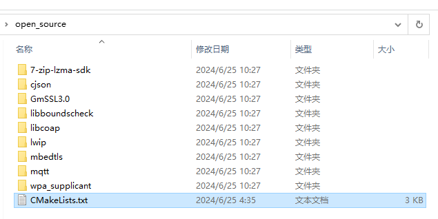
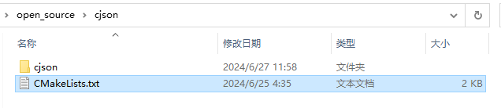
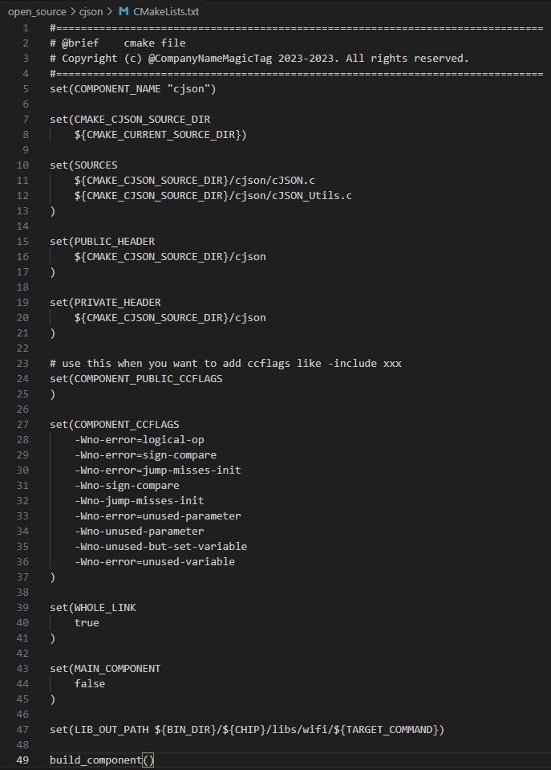
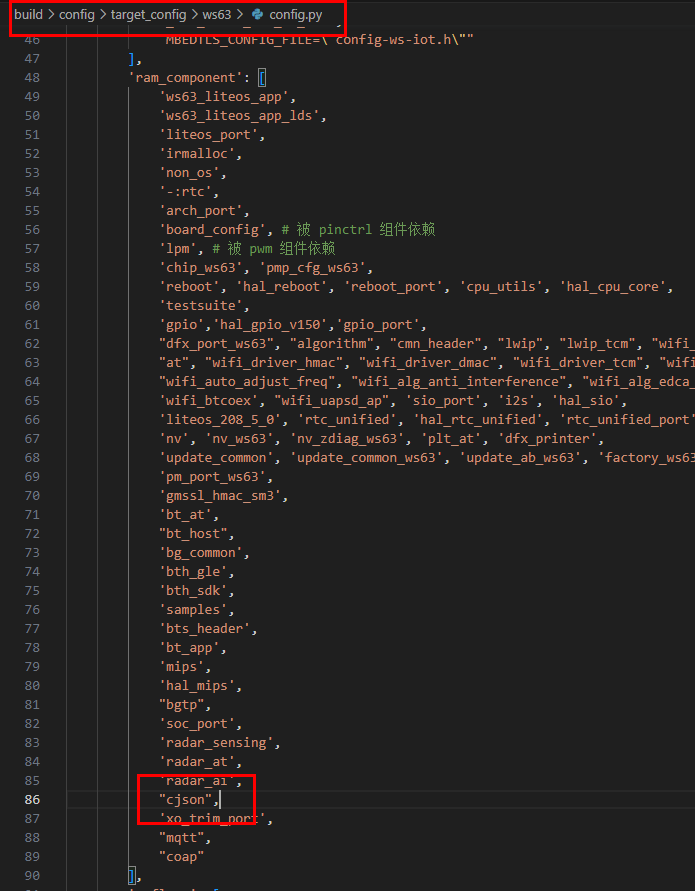

# 前言<a name="ZH-CN_TOPIC_0000001834645229"></a>

**概述<a name="section4537382116410"></a>**

本文档详细的描述了WS63V100移植第三方软件到SDK中的构建操作指导，同时提供了常见的问题解答及故障处理方法。

**读者对象<a name="section4378592816410"></a>**

本文档主要适用于以下工程师：

-   技术支持工程师
-   软件开发工程师

**符号约定<a name="section133020216410"></a>**

在本文中可能出现下列标志，它们所代表的含义如下。

<a name="table2622507016410"></a>
<table><thead align="left"><tr id="row1530720816410"><th class="cellrowborder" valign="top" width="20.580000000000002%" id="mcps1.1.3.1.1"><p id="p6450074116410"><a name="p6450074116410"></a><a name="p6450074116410"></a><strong id="b2136615816410"><a name="b2136615816410"></a><a name="b2136615816410"></a>符号</strong></p>
</th>
<th class="cellrowborder" valign="top" width="79.42%" id="mcps1.1.3.1.2"><p id="p5435366816410"><a name="p5435366816410"></a><a name="p5435366816410"></a><strong id="b5941558116410"><a name="b5941558116410"></a><a name="b5941558116410"></a>说明</strong></p>
</th>
</tr>
</thead>
<tbody><tr id="row1372280416410"><td class="cellrowborder" valign="top" width="20.580000000000002%" headers="mcps1.1.3.1.1 "><p id="p3734547016410"><a name="p3734547016410"></a><a name="p3734547016410"></a><a name="image2670064316410"></a><a name="image2670064316410"></a><span></span></p>
</td>
<td class="cellrowborder" valign="top" width="79.42%" headers="mcps1.1.3.1.2 "><p id="p1757432116410"><a name="p1757432116410"></a><a name="p1757432116410"></a>表示如不避免则将会导致死亡或严重伤害的具有高等级风险的危害。</p>
</td>
</tr>
<tr id="row466863216410"><td class="cellrowborder" valign="top" width="20.580000000000002%" headers="mcps1.1.3.1.1 "><p id="p1432579516410"><a name="p1432579516410"></a><a name="p1432579516410"></a><a name="image4895582316410"></a><a name="image4895582316410"></a><span></span></p>
</td>
<td class="cellrowborder" valign="top" width="79.42%" headers="mcps1.1.3.1.2 "><p id="p959197916410"><a name="p959197916410"></a><a name="p959197916410"></a>表示如不避免则可能导致死亡或严重伤害的具有中等级风险的危害。</p>
</td>
</tr>
<tr id="row123863216410"><td class="cellrowborder" valign="top" width="20.580000000000002%" headers="mcps1.1.3.1.1 "><p id="p1232579516410"><a name="p1232579516410"></a><a name="p1232579516410"></a><a name="image1235582316410"></a><a name="image1235582316410"></a><span></span></p>
</td>
<td class="cellrowborder" valign="top" width="79.42%" headers="mcps1.1.3.1.2 "><p id="p123197916410"><a name="p123197916410"></a><a name="p123197916410"></a>表示如不避免则可能导致轻微或中度伤害的具有低等级风险的危害。</p>
</td>
</tr>
<tr id="row5786682116410"><td class="cellrowborder" valign="top" width="20.580000000000002%" headers="mcps1.1.3.1.1 "><p id="p2204984716410"><a name="p2204984716410"></a><a name="p2204984716410"></a><a name="image4504446716410"></a><a name="image4504446716410"></a><span></span></p>
</td>
<td class="cellrowborder" valign="top" width="79.42%" headers="mcps1.1.3.1.2 "><p id="p4388861916410"><a name="p4388861916410"></a><a name="p4388861916410"></a>用于传递设备或环境安全警示信息。如不避免则可能会导致设备损坏、数据丢失、设备性能降低或其它不可预知的结果。</p>
<p id="p1238861916410"><a name="p1238861916410"></a><a name="p1238861916410"></a>“须知”不涉及人身伤害。</p>
</td>
</tr>
<tr id="row2856923116410"><td class="cellrowborder" valign="top" width="20.580000000000002%" headers="mcps1.1.3.1.1 "><p id="p5555360116410"><a name="p5555360116410"></a><a name="p5555360116410"></a><a name="image799324016410"></a><a name="image799324016410"></a><span></span></p>
</td>
<td class="cellrowborder" valign="top" width="79.42%" headers="mcps1.1.3.1.2 "><p id="p4612588116410"><a name="p4612588116410"></a><a name="p4612588116410"></a>对正文中重点信息的补充说明。</p>
<p id="p1232588116410"><a name="p1232588116410"></a><a name="p1232588116410"></a>“说明”不是安全警示信息，不涉及人身、设备及环境伤害信息。</p>
</td>
</tr>
</tbody>
</table>

**修改记录<a name="section2467512116410"></a>**

<a name="table1557726816410"></a>
<table><thead align="left"><tr id="row2942532716410"><th class="cellrowborder" valign="top" width="20.72%" id="mcps1.1.4.1.1"><p id="p3778275416410"><a name="p3778275416410"></a><a name="p3778275416410"></a><strong id="b5687322716410"><a name="b5687322716410"></a><a name="b5687322716410"></a>文档版本</strong></p>
</th>
<th class="cellrowborder" valign="top" width="26.119999999999997%" id="mcps1.1.4.1.2"><p id="p5627845516410"><a name="p5627845516410"></a><a name="p5627845516410"></a><strong id="b5800814916410"><a name="b5800814916410"></a><a name="b5800814916410"></a>发布日期</strong></p>
</th>
<th class="cellrowborder" valign="top" width="53.16%" id="mcps1.1.4.1.3"><p id="p2382284816410"><a name="p2382284816410"></a><a name="p2382284816410"></a><strong id="b3316380216410"><a name="b3316380216410"></a><a name="b3316380216410"></a>修改说明</strong></p>
</th>
</tr>
</thead>
<tbody><tr id="row1187218238111"><td class="cellrowborder" valign="top" width="20.72%" headers="mcps1.1.4.1.1 "><p id="p1387242315111"><a name="p1387242315111"></a><a name="p1387242315111"></a>02</p>
</td>
<td class="cellrowborder" valign="top" width="26.119999999999997%" headers="mcps1.1.4.1.2 "><p id="p987222371117"><a name="p987222371117"></a><a name="p987222371117"></a>2024-06-27</p>
</td>
<td class="cellrowborder" valign="top" width="53.16%" headers="mcps1.1.4.1.3 "><a name="ul1825518116123"></a><a name="ul1825518116123"></a><ul id="ul1825518116123"><li>更新“<a href="CMake构建.md">CMake构建</a>”章节内容。</li><li>更新“<a href="CMake基本语法.md">CMake基本语法</a>”章节内容。</li></ul>
</td>
</tr>
<tr id="row1553015377329"><td class="cellrowborder" valign="top" width="20.72%" headers="mcps1.1.4.1.1 "><p id="p118382762110"><a name="p118382762110"></a><a name="p118382762110"></a>01</p>
</td>
<td class="cellrowborder" valign="top" width="26.119999999999997%" headers="mcps1.1.4.1.2 "><p id="p171834279217"><a name="p171834279217"></a><a name="p171834279217"></a>2024-04-10</p>
</td>
<td class="cellrowborder" valign="top" width="53.16%" headers="mcps1.1.4.1.3 "><p id="p618317279212"><a name="p618317279212"></a><a name="p618317279212"></a>第一次正式版本发布。</p>
</td>
</tr>
<tr id="row5947359616410"><td class="cellrowborder" valign="top" width="20.72%" headers="mcps1.1.4.1.1 "><p id="p2149706016410"><a name="p2149706016410"></a><a name="p2149706016410"></a>00B01</p>
</td>
<td class="cellrowborder" valign="top" width="26.119999999999997%" headers="mcps1.1.4.1.2 "><p id="p648803616410"><a name="p648803616410"></a><a name="p648803616410"></a>2024-02-22</p>
</td>
<td class="cellrowborder" valign="top" width="53.16%" headers="mcps1.1.4.1.3 "><p id="p1946537916410"><a name="p1946537916410"></a><a name="p1946537916410"></a>第一次临时版本发布。</p>
</td>
</tr>
</tbody>
</table>

# 移植指引<a name="ZH-CN_TOPIC_0000001788005284"></a>


## 概述<a name="ZH-CN_TOPIC_0000001787902676"></a>

WS63V100的SDK使用CMake作为构建工具，因此建议使用CMake进行第三方库的移植，从而保证编译的完整性和连贯性。其主要文件编译依赖CMakeLists.txt文件，当需要新增并编译第三方组件时，需要对CMake框架进行修改新增，即修改CMakeLists.txt。

## CMake构建<a name="ZH-CN_TOPIC_0000001788062352"></a>

以移植cjson为例（SDK已集成该组件，可以参考对应文件的修改），移植的步骤如下：

1.  将第三方组件放置于“opensource”目录下（例如：opensource/cjson/cjson，新增一层路径便于对文件路径处理）。
2.  在“opensource”目录下，找到本层级的CMakeLists.txt，在该文件内新增一行

    ```
    add_subdirectory_if_exist(cjson)
    ```

    即可将对应的“opensource/cjson”路径新增到编译框架中。

    

3.  对新增组件内部opensource/cjson路径的CMakeList.txt进行修改（可参考已有的第三方组件）。

    设置组件名称：

    ```
    set(COMPONENT_NAME "cjson")
    ```

    将xxx.c加入到编译：

    ```
    set(SOURCES xxx.c)
    ```

    私有头文件引用路径：

    ```
    set(PRIVATE_HEADER yyy)
    ```

    私有编译参数：

    ```
    set(COMPONENT_CCFLAGS zzz)
    ```

    设置输出路径：

    ```
    set(LIB_OUT_PATH ...)
    ```

    

    

4.  现在，已经成功将一个名为“cjson”（COMPONENT\_NAME）的组件新增到框架中了，最后应开启对该组件的编译。通过修改“build/config/target\_config/ws63/config.py“中对应的target的“ram\_component”，将需要编译的组件加入到编译流程中。例如：

    想要编译的target名称为“ws63-liteos-app”，则找到“ws63-liteos-app”字典下的ram\_component，在该数组中新增值“cjson”，当启动“ws63-liteos-app”的编译时（使用IDE启动构建，或使用python build.py编译），CMake就会尝试编译“cjson”（SOURCES）。

    

# 常见问题<a name="ZH-CN_TOPIC_0000001834701941"></a>

本章节对用户常见的编译问题进行收集整理，并为用户提供基本的参考。


## CMake基本语法<a name="ZH-CN_TOPIC_0000001834946241"></a>

除了上文提到的“COMPONENT\_NAME”、“SOURCES”、“PRIVATE\_HEADER”、“COMPONENT\_CCFLAGES”、“LIB\_OUT\_PATH”之外，还可以定义公共头文件、公共编译参数等。

用户可参考标准CMakeLists.txt的开发流程，对SDK进行定制化修改。

若在三方组件中已有CMakeLists.txt可进行调用，也可以opensource路径下的CMakeLists.txt将文件夹直接add\_subdirectory\_if\_exits\(xxx\)，来进行编译

## 头文件引用问题<a name="ZH-CN_TOPIC_0000001788306644"></a>

当用户在开发过程中需要引用新增第三方组件的头文件时，可以在第三方组件的CMakeLists.txt中指定公共的头文件。

例如，需要引用cjson组件下的“cJSON.h”（实际上已全文件引用，仅作参考），则需要在opensource/cjson中的CMakeLists.txt增加：

```
set （PUBLIC_HEADER ${CMAKE_CURRENT_SOURCE_DIR}/cjson/cJSON.h）
```

