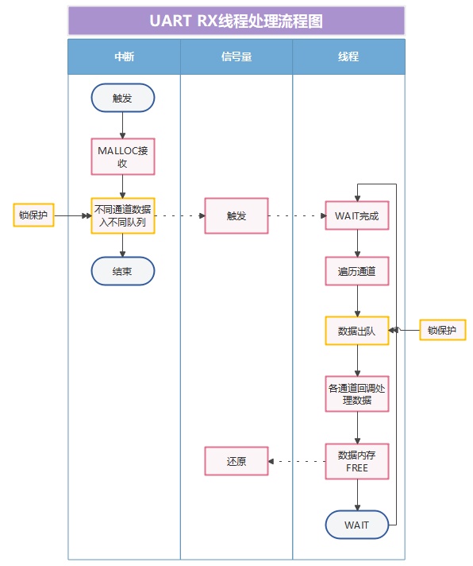
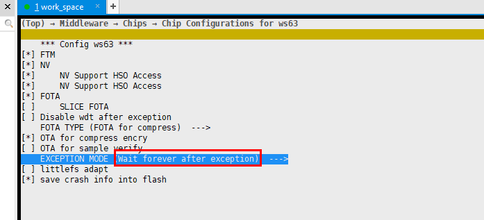

# 前言<a name="ZH-CN_TOPIC_0000001815946742"></a>

**概述<a name="section4537382116410"></a>**

本文档主要介绍WS63设备驱动开发的相关内容主要包括工作原理、按场景描述接口使用方法和注意事项。

**产品版本<a name="section12266191774710"></a>**

<a name="table2270181717471"></a>
<table><thead align="left"><tr id="row15364171712479"><th class="cellrowborder" valign="top" width="31.759999999999998%" id="mcps1.1.3.1.1"><p id="p123646174478"><a name="p123646174478"></a><a name="p123646174478"></a><strong id="b4974171818546"><a name="b4974171818546"></a><a name="b4974171818546"></a>产品名称</strong></p>
</th>
<th class="cellrowborder" valign="top" width="68.24%" id="mcps1.1.3.1.2"><p id="p1936401717470"><a name="p1936401717470"></a><a name="p1936401717470"></a><strong id="b14976118115417"><a name="b14976118115417"></a><a name="b14976118115417"></a>产品版本</strong></p>
</th>
</tr>
</thead>
<tbody><tr id="row19364317104716"><td class="cellrowborder" valign="top" width="31.759999999999998%" headers="mcps1.1.3.1.1 "><p id="p14623132513473"><a name="p14623132513473"></a><a name="p14623132513473"></a>WS63</p>
</td>
<td class="cellrowborder" valign="top" width="68.24%" headers="mcps1.1.3.1.2 "><p id="p56214251471"><a name="p56214251471"></a><a name="p56214251471"></a>V100</p>
</td>
</tr>
</tbody>
</table>

**读者对象<a name="section4378592816410"></a>**

本文档主要适用于以下工程师：

-   技术支持工程师
-   软件开发工程师

**符号约定<a name="section133020216410"></a>**

在本文中可能出现下列标志，它们所代表的含义如下。

<a name="table2622507016410"></a>
<table><thead align="left"><tr id="row1530720816410"><th class="cellrowborder" valign="top" width="20.580000000000002%" id="mcps1.1.3.1.1"><p id="p6450074116410"><a name="p6450074116410"></a><a name="p6450074116410"></a><strong id="b2136615816410"><a name="b2136615816410"></a><a name="b2136615816410"></a>符号</strong></p>
</th>
<th class="cellrowborder" valign="top" width="79.42%" id="mcps1.1.3.1.2"><p id="p5435366816410"><a name="p5435366816410"></a><a name="p5435366816410"></a><strong id="b5941558116410"><a name="b5941558116410"></a><a name="b5941558116410"></a>说明</strong></p>
</th>
</tr>
</thead>
<tbody><tr id="row1372280416410"><td class="cellrowborder" valign="top" width="20.580000000000002%" headers="mcps1.1.3.1.1 "><p id="p3734547016410"><a name="p3734547016410"></a><a name="p3734547016410"></a><a name="image2670064316410"></a><a name="image2670064316410"></a><span></span></p>
</td>
<td class="cellrowborder" valign="top" width="79.42%" headers="mcps1.1.3.1.2 "><p id="p1757432116410"><a name="p1757432116410"></a><a name="p1757432116410"></a>表示如不避免则将会导致死亡或严重伤害的具有高等级风险的危害。</p>
</td>
</tr>
<tr id="row466863216410"><td class="cellrowborder" valign="top" width="20.580000000000002%" headers="mcps1.1.3.1.1 "><p id="p1432579516410"><a name="p1432579516410"></a><a name="p1432579516410"></a><a name="image4895582316410"></a><a name="image4895582316410"></a><span></span></p>
</td>
<td class="cellrowborder" valign="top" width="79.42%" headers="mcps1.1.3.1.2 "><p id="p959197916410"><a name="p959197916410"></a><a name="p959197916410"></a>表示如不避免则可能导致死亡或严重伤害的具有中等级风险的危害。</p>
</td>
</tr>
<tr id="row123863216410"><td class="cellrowborder" valign="top" width="20.580000000000002%" headers="mcps1.1.3.1.1 "><p id="p1232579516410"><a name="p1232579516410"></a><a name="p1232579516410"></a><a name="image1235582316410"></a><a name="image1235582316410"></a><span></span></p>
</td>
<td class="cellrowborder" valign="top" width="79.42%" headers="mcps1.1.3.1.2 "><p id="p123197916410"><a name="p123197916410"></a><a name="p123197916410"></a>表示如不避免则可能导致轻微或中度伤害的具有低等级风险的危害。</p>
</td>
</tr>
<tr id="row5786682116410"><td class="cellrowborder" valign="top" width="20.580000000000002%" headers="mcps1.1.3.1.1 "><p id="p2204984716410"><a name="p2204984716410"></a><a name="p2204984716410"></a><a name="image4504446716410"></a><a name="image4504446716410"></a><span></span></p>
</td>
<td class="cellrowborder" valign="top" width="79.42%" headers="mcps1.1.3.1.2 "><p id="p4388861916410"><a name="p4388861916410"></a><a name="p4388861916410"></a>用于传递设备或环境安全警示信息。如不避免则可能会导致设备损坏、数据丢失、设备性能降低或其它不可预知的结果。</p>
<p id="p1238861916410"><a name="p1238861916410"></a><a name="p1238861916410"></a>“须知”不涉及人身伤害。</p>
</td>
</tr>
<tr id="row2856923116410"><td class="cellrowborder" valign="top" width="20.580000000000002%" headers="mcps1.1.3.1.1 "><p id="p5555360116410"><a name="p5555360116410"></a><a name="p5555360116410"></a><a name="image799324016410"></a><a name="image799324016410"></a><span></span></p>
</td>
<td class="cellrowborder" valign="top" width="79.42%" headers="mcps1.1.3.1.2 "><p id="p4612588116410"><a name="p4612588116410"></a><a name="p4612588116410"></a>对正文中重点信息的补充说明。</p>
<p id="p1232588116410"><a name="p1232588116410"></a><a name="p1232588116410"></a>“说明”不是安全警示信息，不涉及人身、设备及环境伤害信息。</p>
</td>
</tr>
</tbody>
</table>

**修改记录<a name="section2467512116410"></a>**

<a name="table1557726816410"></a>
<table><thead align="left"><tr id="row2942532716410"><th class="cellrowborder" valign="top" width="18.7%" id="mcps1.1.4.1.1"><p id="p3778275416410"><a name="p3778275416410"></a><a name="p3778275416410"></a><strong id="b5687322716410"><a name="b5687322716410"></a><a name="b5687322716410"></a>文档版本</strong></p>
</th>
<th class="cellrowborder" valign="top" width="20.21%" id="mcps1.1.4.1.2"><p id="p5627845516410"><a name="p5627845516410"></a><a name="p5627845516410"></a><strong id="b5800814916410"><a name="b5800814916410"></a><a name="b5800814916410"></a>发布日期</strong></p>
</th>
<th class="cellrowborder" valign="top" width="61.09%" id="mcps1.1.4.1.3"><p id="p2382284816410"><a name="p2382284816410"></a><a name="p2382284816410"></a><strong id="b3316380216410"><a name="b3316380216410"></a><a name="b3316380216410"></a>修改说明</strong></p>
</th>
</tr>
</thead>
<tbody><tr id="row783381372417"><td class="cellrowborder" valign="top" width="18.7%" headers="mcps1.1.4.1.1 "><p id="p383411312418"><a name="p383411312418"></a><a name="p383411312418"></a>04</p>
</td>
<td class="cellrowborder" valign="top" width="20.21%" headers="mcps1.1.4.1.2 "><p id="p08341513142411"><a name="p08341513142411"></a><a name="p08341513142411"></a>2025-08-29</p>
</td>
<td class="cellrowborder" valign="top" width="61.09%" headers="mcps1.1.4.1.3 "><a name="ul21981219257"></a><a name="ul21981219257"></a><ul id="ul21981219257"><li>更新“<a href="GPIO.md">GPIO</a>”的“<a href="功能描述-1.md">功能描述</a>”小节内容。</li><li>更新“<a href="UART.md">UART</a>”的“<a href="注意事项-7.md">注意事项</a>”小节内容。</li><li>更新“<a href="SPI.md">SPI</a>”的“<a href="概述-8.md">概述</a>”、“<a href="开发指引-10.md">开发指引</a>”小节内容。</li><li>更新“<a href="ADC.md">ADC</a>”的“<a href="功能描述-17.md">功能描述</a>”、“<a href="开发指引-18.md">开发指引</a>”小节内容。</li><li>更新“<a href="PWM.md">PWM</a>”的“<a href="概述-24.md">概述</a>”、“<a href="功能描述-25.md">功能描述</a>”小节内容。</li><li>更新“<a href="WDT.md">WDT</a>”的“<a href="注意事项-31.md">注意事项</a>”小节内容。</li><li>新增“<a href="REBOOT.md">REBOOT</a>”章节内容。</li></ul>
</td>
</tr>
<tr id="row1492411844315"><td class="cellrowborder" valign="top" width="18.7%" headers="mcps1.1.4.1.1 "><p id="p892488144317"><a name="p892488144317"></a><a name="p892488144317"></a>03</p>
</td>
<td class="cellrowborder" valign="top" width="20.21%" headers="mcps1.1.4.1.2 "><p id="p392417884310"><a name="p392417884310"></a><a name="p392417884310"></a>2025-02-28</p>
</td>
<td class="cellrowborder" valign="top" width="61.09%" headers="mcps1.1.4.1.3 "><a name="ul139902388456"></a><a name="ul139902388456"></a><ul id="ul139902388456"><li>更新“<a href="SPI.md">SPI</a>”的“<a href="配置指引.md">配置指引</a>”、“<a href="注意事项-11.md">注意事项</a>”小节内容。</li><li>更新“<a href="PWM.md">PWM</a>”的“<a href="功能描述-25.md">功能描述</a>”、“<a href="开发指引-26.md">开发指引</a>”小节内容。</li><li>更新“<a href="Timer.md">Timer</a>”的“<a href="概述-32.md">概述</a>”小节内容。</li><li>更新“<a href="Systick.md">Systick</a>”的“<a href="概述-36.md">概述</a>”、“<a href="注意事项-39.md">注意事项</a>”小节内容。</li></ul>
</td>
</tr>
<tr id="row59361135219"><td class="cellrowborder" valign="top" width="18.7%" headers="mcps1.1.4.1.1 "><p id="p1593710118528"><a name="p1593710118528"></a><a name="p1593710118528"></a>02</p>
</td>
<td class="cellrowborder" valign="top" width="20.21%" headers="mcps1.1.4.1.2 "><p id="p1393717112524"><a name="p1393717112524"></a><a name="p1393717112524"></a>2024-10-30</p>
</td>
<td class="cellrowborder" valign="top" width="61.09%" headers="mcps1.1.4.1.3 "><p id="p1274182065219"><a name="p1274182065219"></a><a name="p1274182065219"></a>更新“<a href="UART.md">UART</a>”的“<a href="注意事项-7.md">注意事项</a>”小节内容。</p>
</td>
</tr>
<tr id="row10398174612161"><td class="cellrowborder" valign="top" width="18.7%" headers="mcps1.1.4.1.1 "><p id="p1739810466168"><a name="p1739810466168"></a><a name="p1739810466168"></a>01</p>
</td>
<td class="cellrowborder" valign="top" width="20.21%" headers="mcps1.1.4.1.2 "><p id="p53981462160"><a name="p53981462160"></a><a name="p53981462160"></a>2024-04-10</p>
</td>
<td class="cellrowborder" valign="top" width="61.09%" headers="mcps1.1.4.1.3 "><p id="p839824618162"><a name="p839824618162"></a><a name="p839824618162"></a>第一次正式版本发布。</p>
</td>
</tr>
<tr id="row97898558332"><td class="cellrowborder" valign="top" width="18.7%" headers="mcps1.1.4.1.1 "><p id="p378945517333"><a name="p378945517333"></a><a name="p378945517333"></a>00B02</p>
</td>
<td class="cellrowborder" valign="top" width="20.21%" headers="mcps1.1.4.1.2 "><p id="p9789185513334"><a name="p9789185513334"></a><a name="p9789185513334"></a>2024-03-29</p>
</td>
<td class="cellrowborder" valign="top" width="61.09%" headers="mcps1.1.4.1.3 "><a name="ul5193333413"></a><a name="ul5193333413"></a><ul id="ul5193333413"><li>更新“<a href="Pinctrl.md">Pinctrl</a>”的“<a href="概述.md">概述</a>”、“<a href="开发指引.md">开发指引</a>”小节内容。</li><li>更新“<a href="SPI.md">SPI</a>”的“<a href="概述-8.md">概述</a>”小节内容。</li><li>更新“<a href="I2C.md">I2C</a>”的“<a href="功能描述-13.md">功能描述</a>”、“<a href="开发指引-14.md">开发指引</a>”小节内容。</li><li>更新“<a href="WDT.md">WDT</a>”的“<a href="概述-28.md">概述</a>”小节内容。</li><li>更新“<a href="Timer.md">Timer</a>”的“<a href="注意事项-35.md">注意事项</a>”小节内容。</li><li>更新“<a href="TCXO.md">TCXO</a>”的“<a href="概述-40.md">概述</a>”小节内容。</li></ul>
</td>
</tr>
<tr id="row530915382403"><td class="cellrowborder" valign="top" width="18.7%" headers="mcps1.1.4.1.1 "><p id="p2149706016410"><a name="p2149706016410"></a><a name="p2149706016410"></a>00B01</p>
</td>
<td class="cellrowborder" valign="top" width="20.21%" headers="mcps1.1.4.1.2 "><p id="p648803616410"><a name="p648803616410"></a><a name="p648803616410"></a>2024-03-15</p>
</td>
<td class="cellrowborder" valign="top" width="61.09%" headers="mcps1.1.4.1.3 "><p id="p1946537916410"><a name="p1946537916410"></a><a name="p1946537916410"></a>第一次临时版本发布。</p>
</td>
</tr>
</tbody>
</table>

# Pinctrl<a name="ZH-CN_TOPIC_0000001816106494"></a>


## 概述<a name="ZH-CN_TOPIC_0000001862746297"></a>

Pinctrl控制器用于控制IO管脚的复用功能，可配置规格如下：

-   支持配置GPIO\_00-GPIO\_18一组IO管脚。
-   支持配置IO驱动能力、IO功能复用以及设置IO上下拉状态等功能。

## 功能描述<a name="ZH-CN_TOPIC_0000001816106450"></a>

Pinctrl驱动模块提供的接口及功能如下：

-   uapi\_pin\_init：初始化Pinctrl。
-   uapi\_pin\_deinit：去初始化Pinctrl。
-   uapi\_pin\_set\_mode：设置指定IO复用模式。
-   uapi\_pin\_get\_mode：获取指定IO的复用模式。
-   uapi\_pin\_set\_ds：设置指定IO驱动能力。
-   uapi\_pin\_get\_ds：获取指定IO驱动能力。
-   uapi\_pin\_set\_pull：设置指定IO的上拉/下拉状态。
-   uapi\_pin\_get\_pull：获取指定IO的上拉/下拉状态。

## 开发指引<a name="ZH-CN_TOPIC_0000001862706533"></a>

Pinctrl接口使用遵循如下操作步骤（以下步骤根据实际需要可选）：

1.  调用uapi\_pin\_set\_mode、uapi\_pin\_get\_mode接口，设置/查看指定IO的复用模式。
2.  调用uapi\_pin\_set\_ds、uapi\_pin\_get\_ds接口，设置/查看指定IO的驱动能力。
3.  调用uapi\_pin\_set\_pull、uapi\_pin\_get\_pull接口，设置/查看指定IO的上拉/下拉状态。

示例：

```
    /* 设置GPIO_00的复用功能为gpio */
    uapi_pin_set_mode(GPIO_00, PIN_MODE_0);
    /* 设置GPIO_00的驱动能力为PIN_DS_2 */
    uapi_pin_set_ds(GPIO_00, PIN_DS_2);
    /* 设置GPIO_00为上拉模式 */
    uapi_pin_set_pull(GPIO_00, PIN_PULL_TYPE_UP);

```

## 注意事项<a name="ZH-CN_TOPIC_0000001862706493"></a>

配置IO复用功能时，应关注此IO是否支持目标功能或者已经被复用为其他功能，避免影响既有功能， IO复用请参考“sdk\\drivers\\chips\\ws63\\include\\platform\_core\_rom.h”源码中“pin\_t”结构体的定义。

# GPIO<a name="ZH-CN_TOPIC_0000001815946714"></a>


## 概述<a name="ZH-CN_TOPIC_0000001862746321"></a>

GPIO（General-purpose input/output）是通用输入输出的缩写，是一种通用的I/O接口标准。可以配置为输入或输出模式，以便控制外部设备或与其他设备通信。可用于连接各种设备，如LED灯、传感器、执行器等。

GPIO规格如下：

-   支持设置GPIO管脚方向、设置输出电平状态。
-   支持外部电平中断以及外部边沿中断上报。
-   支持每个GPIO独立中断。

## 功能描述<a name="ZH-CN_TOPIC_0000001862746313"></a>

GPIO模块提供的接口及功能如下：

-   uapi\_gpio\_init：初始化GPIO。
-   uapi\_gpio\_deinit：去初始化GPIO。
-   uapi\_gpio\_set\_dir：设置指定GPIO方向（输入/输出）。
-   uapi\_gpio\_get\_dir：获取指定GPIO方向（输入/输出）。
-   uapi\_gpio\_set\_val：设置指定GPIO电平状态。
-   uapi\_gpio\_get\_val：获取指定GPIO电平状态。
-   uapi\_gpio\_register\_isr\_func：注册指定GPIO中断。
-   uapi\_gpio\_unregister\_isr\_func：去注册指定GPIO中断。
-   uapi\_gpio\_disable\_interrupt: 关闭GPIO中断。
-   uapi\_gpio\_enable\_interrupt：使能GPIO中断。
-   uapi\_gpio\_clear\_interrupt：清除GPIO中断。
-   uapi\_gpio\_toggle：GPIO输出电平状态翻转。

## 开发指引<a name="ZH-CN_TOPIC_0000001862706509"></a>

GPIO接口使用遵循如下操作步骤：

1.  调用uapi\_pin\_set\_mode接口，将PIN复用为GPIO功能。
2.  根据用户开发需求，可设置GPIO接口为输出、输入和中断模式，设置方法如下：
    -   输出模式：
        1.  调用uapi\_gpio\_set\_dir接口，设置GPIO方向为OUT。
        2.  调用uapi\_gpio\_set\_val接口，设置GPIO输出电平状态（高/低）。

    -   输入模式：
        1.  调用uapi\_gpio\_set\_dir接口，设置GPIO方向为IN。
        2.  调用uapi\_gpio\_get\_val接口，获取GPIO输入电平状态。

    -   中断模式：
        1.  调用uapi\_gpio\_set\_dir接口，设置GPIO方向为IN。
        2.  调用uapi\_gpio\_register\_isr\_func接口，注册GPIO中断回调函数。
        3.  调用uapi\_gpio\_unregister\_isr\_func接口，注销GPIO中断回调函数（去注册中断时调用）。

示例：

```
#include "gpio.h"
void gpio_callback_func(pin_t pin, uintptr_t param)
{
    unused(param);
    osal_printk("PIN:%d interrupt success. \r\n", pin);
}
errcode_t sample_gpio_test(pin_t pin)
{
    uapi_pin_init();
    uapi_gpio_init();
    uapi_pin_set_mode(pin, HAL_PIO_FUNC_GPIO); /* 设置指定IO复用为GPIO模式 */
    uapi_gpio_set_dir(pin, GPIO_DIRECTION_INPUT); /* 设置指定GPIO为输入模式 */
    /* 注册指定GPIO上升沿中断，回调函数为gpio_callback_func */
    if (uapi_gpio_register_isr_func(pin, GPIO_INTERRUPT_RISING_EDGE, gpio_callback_func) != ERRCODE_SUCC) {
        uapi_gpio_unregister_isr_func(pin); /* 清理残留 */
        return ERRCODE_FAIL;
    }
    return ERRCODE_SUCC;
}
```

## 注意事项<a name="ZH-CN_TOPIC_0000001862706497"></a>

-   在使用GPIO电平中断时，需要在回调函数控制输入电平触发中断时间，否则会导致系统一直处于中断处理中，无法执行其他功能。
-   触发方式（trigger）在没有明确需求场景时，推荐使用默认配置。

# UART<a name="ZH-CN_TOPIC_0000001862706541"></a>


## 概述<a name="ZH-CN_TOPIC_0000001816106542"></a>

UART（Universal Asynchronous Receiver/Transmitter）是通用异步收发器的缩写，是一种串行、异步、全双工的通信协议，用于设备间的数据传输。UART是最常用的设备间通信协议之一，正确配置后，UART可以配合许多不同类型的涉及发送和接收串行数据的串行协议工作 。

WS63芯片MCU侧提供了3个可配置的UART外设单元：UART0、UART1,UART2，UART规格如下：

-   支持可编程数据位\(5-8bit\)、可编程停止位\(1-2bit\)、可编程校验位\(奇/偶校验，无校验\)。
-   UART支持无流控，RTS/CTS流控模式
-   提供64×8的TX，64×10的RX FIFO
-   支持接收FIFO中断、发送FIFO中断、接收超时中断、错误中断等中断屏蔽与响应。
-   支持DMA数据搬移方式。

## 功能描述<a name="ZH-CN_TOPIC_0000001816106526"></a>

> **说明：** 
>若UART驱动需要支持DMA数据收发，需确保DMA驱动已完成初始化。

驱动代码在include\\driver\\uart.h声明了UART驱动相关函数，提供的接口及功能如下如下：

-   uapi\_uart\_init：初始化UART。
-   uapi\_uart\_deinit：去初始化UART。
-   uapi\_uart\_read：读数据。
-   uapi\_uart\_write：写数据。
-   uapi\_uart\_set\_flow\_ctrl：配置UART硬流控。
-   uapi\_uart\_set\_software\_flow\_ctrl\_level：配置软件流控的等级。
-   uapi\_uart\_get\_attr：获取UART配置参数。
-   uapi\_uart\_set\_attr：设置UART配置参数。
-   uapi\_uart\_has\_pending\_transmissions：查询UART是否正在传输数据。
-   uapi\_uart\_register\_rx\_callback：注册接收回调函数，此回调函数会根据触发条件和Size触发。
-   uapi\_uart\_unregister\_rx\_callback：取消注册接收回调函数。
-   uapi\_uart\_register\_parity\_error\_callback：注册奇偶校验错误处理的回调函数。
-   uapi\_uart\_register\_frame\_error\_callback：注册帧错误处理回调函数。
-   uapi\_uart\_write\_int：使用中断模式将数据发送到已打开的UART上，当数据发送完成，会调用回调函数。
-   uapi\_uart\_write\_by\_dma：通过DMA发送数据。
-   uapi\_uart\_flush\_rx\_data：刷新UART接收Buffer中的数据。
-   uapi\_uart\_get\_rx\_data\_count：获取当前接收Buffer中的数据。
-   uapi\_uart\_rx\_fifo\_is\_empty：判断RX FIFO是否为空。

## 开发指引<a name="ZH-CN_TOPIC_0000001862706573"></a>

以应用UART0为例，数据收发流程如下：

1.  配置IO复用。将对应的IO分别复用为UART1的TX、RX、RTS、CTS功能。

    如果不需要支持硬件流控，仅配置TX、RX即可。

    ```
    void usr_uart_io_config(void)
    {
        /* 如下IO复用配置，也可集中在SDK中的usr_io_init函数中进行配置 */
        uapi_pin_set_mode(S_AGPIO5, HAL_PIO_FUNC_UART_H0_M1); /* uart1 rtx */
        uapi_pin_set_mode(S_AGPIO6, HAL_PIO_FUNC_UART_H0_M1); /* uart1 ctx */
        uapi_pin_set_mode(S_AGPIO12, HAL_PIO_FUNC_UART_H0_M1); /* uart1 tx */
        uapi_pin_set_mode(S_AGPIO13, HAL_PIO_FUNC_UART_H0_M1); /* uart1 rx */
    }
    ```

2.  UART初始化。配置UART的波特率、数据位等属性，并使能UART。

    ```
    #define TEST_UART_RX_BUFF_SIZE　0x1 /* 定义 UART 接收缓存区大小 */
    unsigned char g_uart_rx_buff[TEST_UART_RX_BUFF_SIZE] = { 0 };
    uart_buffer_config_t g_uart_buffer_config = {
        .rx_buffer = g_uart_rx_buff,
        .rx_buffer_size = TEST_UART_RX_BUFF_SIZE
    };
    errcode_t usr_uart_init_config(void)
    {
        errcode_t errcode;
        uart_attr_t attr = {
            .baud_rate = 115200, /* 波特率 */
            .data_bits = 8,      /* 数据位 */
            .stop_bits = 1,      /* 停止位 */
            .parity = 0          /* 校验位 */
        };
        uart_pin_config_t pin_config = {
            .tx_pin = S_AGPIO5, /* uart1 tx */
            .rx_pin = S_AGPIO6, /* uart1 rx */
            .cts_pin = S_AGPIO12, /* 流控功能，可选 */
            .rts_pin = S_AGPIO13  /* 流控功能，可选 */
        };
        errcode = uapi_uart_init(UART_BUS_1, &pin_config, &attr, NULL, &g_uart_buffer_config);
        if (errcode != ERRCODE_SUCC) {
            osal_printk("uart init fail\r\n");
        }
        return errcode;
    }
    ```

3.  UART数据收发。调用UART轮询读写数据接口，进行数据收发。

    ```
    void usr_uart_read_data(void)
    {
        int len;
        unsigned char g_test_uart_rx_buffer[64];
        len = uapi_uart_read(UART_BUS_0, g_test_uart_rx_buffer, 64, 0);
        if(len > 0) {
            /* process */
        }
    }
    int usr_uart_write_data(unsigned int size, char* buff)
    {
        unsigned char tx_buff[10] = { 0 };
        if (memcpy_s(tx_buff, 10, buff, size) != EOK) {
            return ERRCODE_FAIL;
        }
        int ret = uapi_uart_write(UART_BUS_0, tx_buff, size, 0);
        if(ret == -1) {
            return ERRCODE_FAIL;
        }
        return ERRCODE_SUCC;
    }
    ```

UART DMA模式发送数据流程如下：

1.  配置IO复用。将对应的IO复用为UART的TX、RX、RTS、CTS功能。

    如果不需要支持硬件流控，仅配置TX、RX即可。

    ```
    void usr_uart_io_config(void)
    {
        /* 如下IO复用配置，也可集中在SDK中的usr_io_init函数中进行配置 */
        uapi_pin_set_mode(S_AGPIO5, HAL_PIO_FUNC_UART_H0_M1); /* uart1 rtx */
        uapi_pin_set_mode(S_AGPIO6, HAL_PIO_FUNC_UART_H0_M1); /* uart1 ctx */
        uapi_pin_set_mode(S_AGPIO12, HAL_PIO_FUNC_UART_H0_M1); /* uart1 tx */
        uapi_pin_set_mode(S_AGPIO13, HAL_PIO_FUNC_UART_H0_M1); /* uart1 rx */
    }
    ```

2.  UART初始化。配置UART的波特率、数据位等属性，并使能UART。

    ```
    errcode_t usr_uart_init_config(void)
    {
        errcode_t errcode;
        uart_attr_t attr = {
            .baud_rate = 115200, /* 波特率 */
            .data_bits = 8,      /* 数据位 */
            .stop_bits = 1,      /* 停止位 */
            .parity = 0          /* 校验位 */
        };
        uart_pin_config_t pin_config = {
            .tx_pin = S_AGPIO5, /* uart1 tx */
            .rx_pin = S_AGPIO6, /* uart1 rx */
            .cts_pin = S_AGPIO12, /* 流控功能，可选 */
            .rts_pin = S_AGPIO13  /* 流控功能，可选 */
        };
        uart_extra_attr_t ext_config = {
            .tx_dma_enable = true,
            .tx_int_threshold = 0x4,
        }
        errcode = uapi_uart_init(UART_BUS_1, &pin_config, &attr, &ext_config, &g_uart_buffer_config);
        if (errcode != ERRCODE_SUCC) {
            osal_printk("uart init fail\r\n");
        }
        return errcode;
    }
    ```

3.  UART DMA数据发。

    ```
    #define TEST_UART_DMA_SEND_BUFF_SIZE 1024
    #define HAL_DMA_TRANSFER_WIDTH_8 0
    #define HAL_DMA_BURST_TRANSACTION_LENGTH_4 1
    static errcode_t test_uart_write_by_dma()
    {
        uint8_t dma_buff[TEST_UART_DMA_SEND_BUFF_SIZE] = { 0 };
        if (memset_s(dma_buff, TEST_UART_DMA_SEND_BUFF_SIZE, 0XA5, TEST_UART_DMA_SEND_BUFF_SIZE) != 0) {
            return ERRCODE_FAIL;
        }
        uart_write_dma_config_t dma_cfg = {
            .src_width = HAL_DMA_TRANSFER_WIDTH_8,              /* 0代表8bit */
            .dest_width = HAL_DMA_TRANSFER_WIDTH_8,             /* 0代表8bit */
            .burst_length = HAL_DMA_BURST_TRANSACTION_LENGTH_4, /* 代表4字节 */
            .priority = 0                                       /* 优先级0 */
        };
        if (uapi_uart_write_by_dma(UART_BUS_0, dma_buff, len, &dma_cfg) != len) {
            osal_printk("[UART] *** memory t--o uart fail!\r\n");
            return ERRCODE_FAIL;
        }
        return ERRCODE_SUCC;
    }
    ```

## 注意事项<a name="ZH-CN_TOPIC_0000001862746341"></a>

-   SDK中，UART0默认作为程序烧写和Testsuite、AT以及数据打印共享串口。
-   SDK中，UART1默认作为DebugKites工具维测数据通道。
-   SDK中drivers/chips/ws63/include/platform\_core.h文件定义了UART使用情况，TEST\_SUITE\_UART\_BUS定义了testsuite调试使用的串口，LOG\_UART\_BUS定义了HSO工具使用的串口。
-   SDK中，UART提供了特性宏CONFIG\_UART\_SUPPORT\_RX\_THREAD。
    -   开启后CONFIG\_UART\_SUPPORT\_RX\_THREAD，可配置串口RX数据通过线程处理，用于避免硬件中断直调串口回调函数导致耗时过长时，出现丢中断操作，最后导致RX数据丢包的现象；
    -   特性原理为：新建线程，线程被触发时对各串口数据队列进行处理，处理方式为调用各串口回调函数；中断中取消直调串口回调函数的操作，改为仅接收数据并存入队列并触发线程处理，缩短中断耗时，降低丢中断概率；

        

    -   该特性开启方式为：

1.  进入menuconfig配置，进入\(Top\) → Drivers → Drivers → UART → Uart Configuration。
2.  在UART support RX 下面打开UART support RX thread。
3.  配置线程相关参数，包括uart rx线程栈大小，rx数据流控水线大小以及线程优先级，完成后保存即可。

# SPI<a name="ZH-CN_TOPIC_0000001815946766"></a>


## 概述<a name="ZH-CN_TOPIC_0000001862746329"></a>

SPI（Serial Peripheral Interface）是一种高速、全双工、同步的通信总线。它可以使MCU与各种外围设备以串行方式进行通信以交换信息。SPI总线可直接与各个厂家生产的多种标准外围器件相连，包括FLASH、RAM、网络控制器、LCD显示驱动器、A/D转换器和MCU等。标准SPI总线一般使用4条线：串行时钟线（SCLK）、主机输入/从机输出数据线MISO、主机输出/从机输入数据线MOSI和低电平有效的从机选择线NSS 。

WS63提供SPI0-1共2组可配置的全双工标准SPI外设，SPI规格如下：

-   支持SPI帧格式，分为以下三种：
    -   Motorola 帧格式
    -   TI（Teaxs Instruments）帧格式
    -   National Microwire 帧格式

-   每个SPI具有收发分开的位宽为32bit×64的FIFO。
-   支持最大传输位宽为32bit。

## 功能描述<a name="ZH-CN_TOPIC_0000001816106522"></a>

SPI主模式支持轮询模式读写、中断模式读写以及DMA模式读写；从模式支持中断模式读写和DMA模式读写。

如果SPI驱动想配置DMA模式读写数据，需要确保DMA驱动已经初始化。DMA初始化请参考“[DMA](DMA.md)”进行配置。

SPI模块提供的接口及功能如下：

-   uapi\_spi\_init：初始化SPI（包括：主从设备、极性、相性、帧协议、传输频率、传输位宽等设定）。
-   uapi\_spi\_deinit：去初始化SPI（关闭相应的SPI单元，释放资源）。
-   uapi\_spi\_get\_attr:  获取SPI的基础配置参数（主从模式、时钟极性、时钟相位、时钟分频系数、SPI工作频率、串行传输协议、SPI帧格式、SPI帧长度、SPI传输模式等）。
-   uapi\_spi\_set\_attr：设置SPI的基础配置参数。
-   uapi\_spi\_get\_extra\_attr：获取SPI的高级配置参数（SPI是否使用DMA发送数据、SPI是否使用DMA接收数据、QSPI参数等）。
-   uapi\_spi\_set\_extra\_attr：设置SPI的高级配置参数。
-   uapi\_spi\_select\_slave：片选。
-   uapi\_spi\_master\_write：SPI主机半双工发送数据。
-   uapi\_spi\_master\_read：SPI主机半双工接收数据。
-   uapi\_spi\_master\_writeread：SPI主机全双工收发数据。
-   uapi\_spi\_slave\_read：SPI从机半双工接收数据。
-   uapi\_spi\_slave\_write：SPI从机半双工发送数据。

## 配置指引<a name="ZH-CN_TOPIC_0000002218638453"></a>

当要获取所需接口速率时，需在对spi进行初始化（调用uapi\_spi\_init接口）时，对spi\_attr\_t结构体中的bus\_clk和freq\_mhz按[\#ZH-CN\_TOPIC\_0000002218638453/table144001871199](#table144001871199)进行配置。如需获取1M接口速率，则需将bus\_clk配置为80000000，freq\_mhz配置为1。

<a name="table144001871199"></a>
<table><thead align="left"><tr id="row104001179910"><th class="cellrowborder" valign="top" width="33.33333333333333%" id="mcps1.1.4.1.1"><p id="p967618260464"><a name="p967618260464"></a><a name="p967618260464"></a>接口速率</p>
</th>
<th class="cellrowborder" valign="top" width="33.33333333333333%" id="mcps1.1.4.1.2"><p id="p10676226114619"><a name="p10676226114619"></a><a name="p10676226114619"></a>bus_clk配置(十进制)</p>
</th>
<th class="cellrowborder" valign="top" width="33.33333333333333%" id="mcps1.1.4.1.3"><p id="p1367610262462"><a name="p1367610262462"></a><a name="p1367610262462"></a>freq_mhz配置</p>
</th>
</tr>
</thead>
<tbody><tr id="row4400271993"><td class="cellrowborder" valign="top" width="33.33333333333333%" headers="mcps1.1.4.1.1 "><p id="p86768264469"><a name="p86768264469"></a><a name="p86768264469"></a>1M</p>
</td>
<td class="cellrowborder" valign="top" width="33.33333333333333%" headers="mcps1.1.4.1.2 "><p id="p84001976912"><a name="p84001976912"></a><a name="p84001976912"></a>80000000</p>
</td>
<td class="cellrowborder" valign="top" width="33.33333333333333%" headers="mcps1.1.4.1.3 "><p id="p1140012713910"><a name="p1140012713910"></a><a name="p1140012713910"></a>1</p>
</td>
</tr>
<tr id="row740057799"><td class="cellrowborder" valign="top" width="33.33333333333333%" headers="mcps1.1.4.1.1 "><p id="p5904192617917"><a name="p5904192617917"></a><a name="p5904192617917"></a>2M</p>
</td>
<td class="cellrowborder" valign="top" width="33.33333333333333%" headers="mcps1.1.4.1.2 "><p id="p144001376914"><a name="p144001376914"></a><a name="p144001376914"></a>80000000</p>
</td>
<td class="cellrowborder" valign="top" width="33.33333333333333%" headers="mcps1.1.4.1.3 "><p id="p24011271199"><a name="p24011271199"></a><a name="p24011271199"></a>2</p>
</td>
</tr>
<tr id="row2040112716910"><td class="cellrowborder" valign="top" width="33.33333333333333%" headers="mcps1.1.4.1.1 "><p id="p1959816275911"><a name="p1959816275911"></a><a name="p1959816275911"></a>4M</p>
</td>
<td class="cellrowborder" valign="top" width="33.33333333333333%" headers="mcps1.1.4.1.2 "><p id="p12401076920"><a name="p12401076920"></a><a name="p12401076920"></a>80000000</p>
</td>
<td class="cellrowborder" valign="top" width="33.33333333333333%" headers="mcps1.1.4.1.3 "><p id="p10401671193"><a name="p10401671193"></a><a name="p10401671193"></a>4</p>
</td>
</tr>
<tr id="row17401157798"><td class="cellrowborder" valign="top" width="33.33333333333333%" headers="mcps1.1.4.1.1 "><p id="p16260828595"><a name="p16260828595"></a><a name="p16260828595"></a>8M</p>
</td>
<td class="cellrowborder" valign="top" width="33.33333333333333%" headers="mcps1.1.4.1.2 "><p id="p15401147193"><a name="p15401147193"></a><a name="p15401147193"></a>80000000</p>
</td>
<td class="cellrowborder" valign="top" width="33.33333333333333%" headers="mcps1.1.4.1.3 "><p id="p2401971197"><a name="p2401971197"></a><a name="p2401971197"></a>8</p>
</td>
</tr>
<tr id="row1240114719910"><td class="cellrowborder" valign="top" width="33.33333333333333%" headers="mcps1.1.4.1.1 "><p id="p189912281892"><a name="p189912281892"></a><a name="p189912281892"></a>10M</p>
</td>
<td class="cellrowborder" valign="top" width="33.33333333333333%" headers="mcps1.1.4.1.2 "><p id="p840157996"><a name="p840157996"></a><a name="p840157996"></a>80000000</p>
</td>
<td class="cellrowborder" valign="top" width="33.33333333333333%" headers="mcps1.1.4.1.3 "><p id="p12401127192"><a name="p12401127192"></a><a name="p12401127192"></a>10</p>
</td>
</tr>
</tbody>
</table>

## 开发指引<a name="ZH-CN_TOPIC_0000001862706569"></a>

SPI用于对接支持SPI协议的设备，SPI单元可以作为主设备或从设备。以SPI单元作为主设备为例，写数据操作如下：

1.  通过IO复用，复用SPI功能用到的管脚为SPI功能。

    管脚复用各功能请参考platform\_core.h中各个管脚功能的定义。

    ```
    #define SPI_PIN_MISO    S_MGPIO16
    #define SPI_PIN_MOSI    S_MGPIO17
    #define SPI_PIN_CLK     S_MGPIO18
    #define SPI_PIN_CS      S_MGPIO19
    void usr_spi_io_init(void)
    {
        /* 设置spi pinmux */
        uapi_pin_set_mode(SPI_PIN_MISO, SPI_PIN_MISO_PINMUX);       /* 设置 spi miso pinmux */
        uapi_pin_set_mode(SPI_PIN_MOSI, SPI_PIN_MOSI_PINMUX);       /* 设置 spi mosi pinmux */
        uapi_pin_set_mode(SPI_PIN_CLK, SPI_PIN_CLK_PINMUX);         /* 设置 spi clk pinmux */
        uapi_pin_set_mode(SPI_PIN_CS, SPI_PIN_CS_PINMUX);           /* 设置 spi cs pinmux */
    }
    ```

2.  调用uapi\_spi\_init，初始化SPI资源，选择SPI功能单元以及配置SPI参数。

    ```
    #define TEST_SPI                SPI_BUS_2
    #define BUS_CLOCK               32000000    /* 32M */
    #define SPI_FREQUENCY           2
    errcode_t usr_spi_init(void)
    {
        spi_attr_t config = { 0 };
        spi_extra_attr_t ext_config = { 0 };
        ext_config.sspi_param.wait_cycles = 0x10;
        usr_spi_io_init();
        config.freq_mhz = SPI_FREQUENCY;                            /* spi 分频值 */
        config.is_slave = false;                                    /* 主机模式 */
        config.frame_size = HAL_SPI_FRAME_SIZE_8;                   /* spi 帧大小，使用8位 */
        config.salve_num = 1;                                       /* 使用片选 0 */
        config.spi_frame_format = HAL_SPI_FRAME_FORMAT_STANDARD;    /* spi传输模式：标准spi */
        config.bus_clk = BUS_CLOCK;                                 /* spi传输速率 */
        config.frame_format = SPI_CFG_FRAME_FORMAT_MOTOROLA_SPI;    /* spi协议格式：摩托罗拉SPI协议格式 */
        config.tmod = HAL_SPI_TRANS_MODE_TXRX;                      /* spi传输模式：收发模式 */
        config.clk_phase = SPI_CFG_CLK_CPHA_0;                      /* spi相位：SPI_CFG_CLK_CPHA_0 */
        config.clk_polarity = SPI_CFG_CLK_CPOL_0;                   /* spi极性：SPI_CFG_CLK_CPOL_0 */
        /* 初始化spi */
        errcode_t err = uapi_spi_init(TEST_SPI, &config, &ext_config);
        return err;
    }
    ```

3.  调用uapi\_spi\_master\_writeread，进行SPI主设备写读操作。

    以主设备写读数据为例：

    ```
    errcode_t usr_spi_writeread(uint8_t *wdata, uint8_t wlen, uint8_t *rdata, uint8_t rlen)
    {
        spi_xfer_data_t spi_recv_xfer = { 0 };
        spi_recv_xfer.tx_buff = wdata;                               /* 设置 tx buff */
        spi_recv_xfer.tx_bytes = wlen;                               /* 设置 tx buff 长度 */
        spi_recv_xfer.rx_buff = rdata;                               /* 设置 rx buff */
        spi_recv_xfer.rx_bytes = rlen;                               /* 设置 rx buff 长度 */
        spi_porting_set_rx_mode(TEST_SPI, rlen);                     /* 设置 写读接口的 rx 接收模式*/
        return uapi_spi_master_writeread(TEST_SPI, &spi_recv_xfer, 100); /* 读取数据 */
    }
    ```

## 注意事项<a name="ZH-CN_TOPIC_0000001862746285"></a>

-   当不再使用SPI时，必须调用uapi\_spi\_deinit进行资源释放，否则在进行初始化时将返回错误。
-   使用microwire帧协议时，由于microwire帧协议限制，主设备只能发送8bit位宽数据。
-   芯片作为主设备时，如果从设备速率较慢，主设备在每次调用读写接口后进行适当延时，避免从设备因读写数据太慢导致数据出错。
-   读外置器件，spi master只需要读的场景，tmod配置成rx\_mod，此时不需要打开CONFIG\_SPI\_SUPPORT\_TXRX\_TRANS\_MODE宏。
-   双端通信，spi master需要读写的场景，tmod配置成txrx\_mod，如果调uapi\_spi\_master\_read接口无时钟片选信号，需要将CONFIG\_SPI\_SUPPORT\_TXRX\_TRANS\_MODE宏打开。

# I2C<a name="ZH-CN_TOPIC_0000001862706481"></a>


## 概述<a name="ZH-CN_TOPIC_0000001862706561"></a>

IIC（Inter-Integrated Circuit）也叫做I2C，译作集成电路总线，是一种串行通信总线，使用主从架构，便于MCU与周边设备组件之间的通讯。

I2C总线包含两条线：SDA（Serial Data Line）和SCL）Serial Clock Line），其中SDA是数据线，SCL是时钟线。I2C总线上的每个设备都有一个唯一的地址，主机可以通过该地址与设备进行通信 。

WS63提供了I2C0～I2C1共2组支持Master模式的I2C外设，I2C规格如下：

-   支持标速、快速二种工作模式，在串行8位双向数据传输场景下，标准模式下可达100kbit/s，快速模式下可达400kbit/s。
-   支持位宽为32bit×8的FIFO。
-   支持7bit/10bit寻址模式。

## 功能描述<a name="ZH-CN_TOPIC_0000001862706565"></a>

I2C模块提供的接口及功能如下：

-   uapi\_i2c\_master\_init：初始化该I2C设备为主机，需要传入的参数有总线号、波特率、高速模式主机码（WS63不支持高速模式，传入0即可）。
-   uapi\_i2c\_deinit：去初始化I2C设备，支持主从机。
-   uapi\_i2c\_master\_write：I2C主机将数据发送到目标从机上，使用轮询模式。
-   uapi\_i2c\_master\_read：主机接收来自目标I2C从机的数据，使用轮询模式。
-   uapi\_i2c\_master\_writeread：主机发送数据到目标I2C从机，并接收来自此从机的数据，使用轮询模式。
-   uapi\_i2c\_set\_baudrate：对已初始化的I2C重置波特率，支持主从机。

## 开发指引<a name="ZH-CN_TOPIC_0000001816106470"></a>

I2C用于对接支持I2C协议的设备，I2C单元可以作为主设备。以I2C单元作为主设备为例：

1.  通过IO复用，将用到的管脚复用为I2C功能。
2.  调用uapi\_i2c\_init接口，初始化I2C资源，此处以初始化I2C主机为例：

    ```
    #define TEST_I2C                    I2C_BUS_0
    #define I2C_BAUDRATE                400000    /* 400kHz */
    #define I2C_PIN_CLK_PINMUX      PIN_MODE_2
    #define I2C_PIN_DAT_PINMUX      PIN_MODE_2
    #define I2C_PIN_CLK             GPIO_18
    #define I2C_PIN_DAT             GPIO_17
    errcode_t sample_i2c_init(void)
    {
        /* 设置 i2c pinmux */
        uapi_pin_set_mode(I2C_PIN_CLK, I2C_PIN_CLK_PINMUX);       /* 设置 i2c clk pinmux */
        uapi_pin_set_mode(I2C_PIN_DAT, I2C_PIN_DAT_PINMUX);       /* 设置 i2c dat pinmux */
        /* 初始化 i2c */
        return uapi_i2c_master_init(TEST_I2C, I2C_BAUDRATE, 0);     /* 初始化 i2c0 */
    }
    ```

3.  调用uapi\_i2c\_master\_write接口，实现主机发送数据。

    ```
    errcode_t sample_i2c_write(uint8_t *data, uint8_t len, uint16_t addr)
    {
        i2c_data_t i2c_send_data = { 0 };
        i2c_send_data.send_buf = data;                                   /* 设置 tx buff */
        i2c_send_data.send_len = len;                                    /* 设置 tx buff 长度 */
        return uapi_i2c_master_write(TEST_I2C, addr, &i2c_send_data);     /* 发送数据 */
    }
    ```

## 注意事项<a name="ZH-CN_TOPIC_0000001862706505"></a>

-   函数uapi\_i2c\_set\_baudrate需要先初始化，再调用，方便修改波特率。如果I2C未经过初始化，直接调用uapi\_i2c\_set\_baudrate函数，会返回错误码ERRCODE\_I2C\_NOT\_INIT。
-   需要主动确保数据发送指针send\_buf和数据接收指针receive\_buf不可传入空指针。
-   当发送的数据大于对接设备的可接受范围时，会发送失败；如果发送数据失败，再切换另一个I2C设备继续发送时，会造成总线挂死，所有I2C设备都无法正确发送数据。
-   uapi\_i2c\_master\_init不能多次初始化，使用完成后需要调用uapi\_i2c\_deinit进行去初始化。

# ADC<a name="ZH-CN_TOPIC_0000001815946750"></a>


## 概述<a name="ZH-CN_TOPIC_0000001815946698"></a>

ADC（Analog-to-Digital Converter）模/数转换器，是指将连续变化的模拟信号转换为离散的数位信号的器件。

真实世界的模拟信号，例如温度、压力、声音或者图像等，需要转换成更容易储存、处理和发送的数字信号，模/数转换器可以实现这个功能，可应用于电量检测、按键检测等。

## 功能描述<a name="ZH-CN_TOPIC_0000001862746333"></a>

ADC模块提供的接口及功能如下：

-   uapi\_adc\_init：初始化ADC。
-   uapi\_adc\_deinit：去初始化ADC。
-   uapi\_adc\_power\_en：对adc进行校准。
-   uapi\_adc\_open\_channel：对通道进行管脚复用配置。
-   uapi\_adc\_close\_channel：关闭对应通道的管脚复用。
-   uapi\_adc\_auto\_scan\_ch\_enable：对需要扫描的通道进行配置，并开始扫描。
-   uapi\_adc\_auto\_scan\_disable：停止扫描。
-   adc\_port\_read：读取当前待测电压值。

## 开发指引<a name="ZH-CN_TOPIC_0000001815946754"></a>

示例：

ADC使能：

```
int hadc_power_on_demo(void)
{
    uapi_adc_power_en(AFE_HADC_MODE, true);
    return TEST_OK;
}
```

ADC闲时关闭

```
int hadc_power_off_demo(void)
{
    uapi_adc_power_en(AFE_HADC_MODE, false);
    return TEST_OK;
}
示例代码：
void test_adc_callback(uint8_t ch, uint32_t *buffer)
{
    for (uint32_t i = 0; i < length; i++) {
        printf("channel: %d, voltage: %dmv\r\n", ch, buffer[i]);
    }
}
 
void test_adc_stop_auto_scan(uint8_t channel)
{
       uapi_adc_auto_scan_ch_disable(channel);
}
 
void test_adc_start_auto_scan(uint8_t channel, adc_scan_config_t config, adc_callback_t callback)
{
       uapi_adc_init(ADC_CLOCK_500KHZ);
       uapi_adc_power_en(AFE_SCAN_MODE_MAX_NUM, true);
       uapi_adc_auto_scan_ch_enable((uint8_t)channel, config, test_adc_callback)；
}
 
void test_adc()
{
       adc_scan_config_t config = {.type = 0, .freq = 1};
       test_adc_start_auto_scan(0, config, test_adc_callback);
       test_adc_stop_auto_scan(0); //通过该接口，调用打印接口输出adc转换结果
}

#define ADC_CHANNEL 0
void adc_test()
{
    uapi_adc_init(0);
    uint16_t voltage = 0;
    adc_port_read(ADC_CHANNEL , &voltage);  //直接通过该接口，获取adc转换结果
    
}
```

## 注意事项<a name="ZH-CN_TOPIC_0000001862706577"></a>

量程问题如下：

-   模拟输入电压范围

    受限于数模复用的GPIO供电电压，ADC参考电压为0-3.3V，有六个端口可以输入电压值。

# DMA<a name="ZH-CN_TOPIC_0000001816106538"></a>


## 概述<a name="ZH-CN_TOPIC_0000001862746345"></a>

DMA（Directory Memory Access）直接存储器访问是一种完全由硬件执行数据交换的工作方式。在这种方式中，直接存储器访问控制器DMAC（Directory Memory Access Controller）直接在存储器和外设、外设和外设、存储器和存储器之间进行数据传输，减少处理器的干涉和开销。

DMA方式一般用于高速传输成组的数据。DMAC在收到DMA传输请求后根据CPU对通道的配置启动总线主控制器，向存储器和外设发出地址和控制信号，对传输数据的个数计数，并以中断方式向CPU报告传输操作的结束或错误。

提供的DMA规格如下：

-   支持存储器到存储器、存储器到外设、外设到存储器 传输类型。
-   MCU侧DMA支持4个通道，16个硬件握手接口，且通道参数优先级可配置。
-   所有通道支持单个包长度最大4095个数据。
-   支持大小端可配置。

## 功能描述<a name="ZH-CN_TOPIC_0000001816106530"></a>

> **说明：** 
>如果需要在SPI/UART中使用DMA传输数据，需要在系统启动时进行DMA初始化。

DMA模块提供的接口及功能如下：

-   uapi\_dma\_init：初始化DMA。
-   uapi\_dma\_deinit：去初始化DMA。
-   uapi\_dma\_open：打开DMA。
-   uapi\_dma\_close：关闭DMA。
-   uapi\_dma\_start\_transfer：启动指定通道的DMA传输。
-   uapi\_dma\_end\_transfer：停止指定通道的DMA传输。
-   uapi\_dma\_transfer\_memory\_single：通过DMA通道传输类型为内存到内存的数据。
-   uapi\_dma\_configure\_peripheral\_transfer\_single：通过DMA通道传输类型为内存到外设或外设到内存的数据。
-   uapi\_dma\_enbale\_lli：启用DMA链表传输。
-   uapi\_dma\_transfer\_memory\_lli：通过DMA通道以链表模式传输类型为内存到内存的数据。
-   uapi\_dma\_configure\_peripheral\_transfer\_lli：通过DMA通道以链表模式传输类型为内存到外设或外设到内存的数据。

## 开发指引<a name="ZH-CN_TOPIC_0000001816106534"></a>

DMA接口仅对外提供存储器到存储器的拷贝功能（其他拷贝方式可参考本文档内对应外设驱动开发指引），操作步骤如下：

1.  调用uapi\_dma\_init接口，初始化DMA模块。
2.  调用uapi\_dma\_open接口，打开DMA通道。
3.  调用uapi\_dma\_start\_transfer接口，DMA开始传输。

示例：

```
#include "dma.h"
#include "hal_dma.h"
/* 传输完成后回调函数处理 */
static bool g_dma_trans_done;
static bool g_dma_trans_succ;
void test_dma_trans_done_callback(uint8_t intr, uint8_t channel, uintptr_t arg)
{
    unused(channel);
    unused(arg);
    switch (intr) {
        case HAL_DMA_INTERRUPT_TFR:
            g_dma_trans_done = true;
            g_dma_trans_succ = true;
            break;
        case HAL_DMA_INTERRUPT_BLOCK:
            g_dma_trans_done = true;
            g_dma_trans_succ = true;
            break;
        case HAL_DMA_INTERRUPT_ERR:
            g_dma_trans_done = true;
            g_dma_trans_succ = false;
            break;
        default:
            break;
    }
    osal_printk("[DMA] int_type is %d. \r\n", intr);
}
static void test_fill_test_buffer(void *data, unsigned int length)
{
    for (unsigned int i = 0; i < length; i++) {
        *((unsigned char *)data + i) = (unsigned char)i;
    }
}
static void test_clear_test_buffer(void *data, unsigned int length)
{
    memset_s(data, length, 0, length);
}
errcode_t test_dma_mem_to_mem_single(void)
{
    dma_ch_user_memory_config_t transfer_config;
    /* 填充源地址要发送的数据 */
    test_fill_test_buffer((void *)(uintptr_t)g_dma_src_data, sizeof(g_dma_src_data));
    /* 清空目的地址的数据 */
    test_clear_test_buffer((void *)(uintptr_t)g_dma_desc_data, sizeof(g_dma_desc_data));
    /* 初始化DMA */
    uapi_dma_init();
    /* 开启DMA模块 */
    uapi_dma_open();
    /* 源地址 */
    transfer_config.src = ((uint32_t)(uintptr_t)g_dma_src_data);
    /* 目的地址 */
    transfer_config.dest = ((uint32_t)(uintptr_t)g_dma_desc_data);
    /* 传输数目 */
    transfer_config.transfer_num = 100;
    /* 优先级0-3, 0最低 */
    transfer_config.priority = 0;
    /* 传输宽度 0:1字节 1:2字节 2:4字节 */
    transfer_config.width = 0;
    /* 调用接口按块发送函数，并注册回调函数 */
    if (uapi_dma_transfer_memory_single(&transfer_config, test_dma_trans_done_callback, 0) != ERRCODE_SUCC) {
        return ERRCODE_FAIL;
    }
    /* 等待发送完成 */
    while (!g_dma_trans_done) { }
    if (!g_dma_trans_succ) {
        return ERRCODE_FAIL;
    }
    return ERRCODE_SUCC;
}
```

## 注意事项<a name="ZH-CN_TOPIC_0000001862746337"></a>

建议仅在需要非阻塞进行数据拷贝的场景下使用DMA，此时可让出CPU，传输完成之后CPU会上报中断，可以在回调函数中根据事件类型判断传输成功与失败。传输阻塞场景下，仍建议使用memcpy\_s进行数据拷贝。

# PWM<a name="ZH-CN_TOPIC_0000001862746325"></a>


## 概述<a name="ZH-CN_TOPIC_0000001862706557"></a>

PWM（Pulse Width Modulation）脉宽调制模块通过对一系列脉冲的宽度进行调制，等效出所需波形。即对模拟信号电平进行数字编码，通过调节频率、占空比的变化来调节信号的变化。

PWM规格如下：

-   支持8路PWM输出，寄存器单独可配置。
-   支持0电平宽度和1电平宽度可调。
-   支持固定周期数发送模式。
-   支持中断清除和中断查询。

## 功能描述<a name="ZH-CN_TOPIC_0000001815946762"></a>

PWM模块提供的接口及功能如下：

-   uapi\_pwm\_init：初始化PWM。
-   uapi\_pwm\_deinit：去初始化PWM。
-   uapi\_pwm\_open：打开PWM通道。
-   uapi\_pwm\_close：关闭PWM通道。
-   uapi\_pwm\_register\_interrupt：为PWM注册中断回调。
-   uapi\_pwm\_unregister\_interrupt：去PWM注册中断回调。
-   uapi\_pwm\_start：启动PWM信号输出。
-   uapi\_pwm\_stop：停止PWM信号输出。
-   uapi\_pwm\_set\_group：设置pwm通道分组。
-   uapi\_pwm\_start\_group：开启选定组的pwm通道。
-   uapi\_pwm\_config\_preload：修改pwm配置（low\_time、high\_time、offset\_time、cycles），在当前周期跑完后平滑切换配置
-   uapi\_pwm\_update\_cfg：修改pwm配置（low\_time、high\_time、offset\_time、cycles），该配置立即生效

## 开发指引<a name="ZH-CN_TOPIC_0000001815946758"></a>

PWM利用微处理器的数字输出对模拟电路进行控制，操作步骤如下：

1.  将IO复用为PWM功能。
2.  调用uapi\_pwm\_init对PWM进行初始化。
3.  调用uapi\_pwm\_open，配置PWM参数，打开指定通道。
4.  调用uapi\_pwm\_register\_interrupt接口，注册PWM中断的回调函数。
5.  调用uapi\_pwm\_set\_group接口，设置PWM通道的组号。
6.  调用uapi\_pwm\_start\_group接口，开启指定组的PWM信号输出。
7.  调用uapi\_pwm\_close接口，停止指定ID的PWM信号输出。
8.  调用uapi\_pwm\_deinit接口，去初始化指定ID的PWM。

示例：

```
#include "pwm.h"
#include "pwm_porting.h"
#define TEST_MAX_TIMES 10
#define TEST_DELAY_MS 1000
/* PWM注册中断回调函数 */
static errcode_t pwm_test_callback(pwm_channel_t channel)
{
    osal_printk("PWM channel number is %d, func of interrupt start. \r\n", channel);
    uapi_pwm_isr(channel);
    return ERRCODE_SUCC;
}
void test_pwm_sample(pin_t pin, pin_mode_t mode, pwm_channel_t channel，pwm_v151_group_t group)
{
    /* 设置循环次数 */
    unsigned int test_times;
    /* 配置 low_time、high_time、cycles, repeat. 当repeat为true时候，cycles无效 */
    /* offset_time 未使用到配置为0 */
    pwm_config_t cfg_repeat = { 100, 100, 0, 0, true };
    /* 设置可作为PWM IO的模式 */
    uapi_pin_set_mode(pin, mode);
    uapi_pwm_init();
    /* 打开指定chaanel的PWM */
    uapi_pwm_open(channel, &cfg_repeat);
    /* 注册回调函数 */
    uapi_pwm_register_interrupt(channel, pwm_test_callback);
    /* 启动指定channel pwm输出 */
uapi_pwm_set_group(group, &channel, 1);
    uapi_pwm_start_group(group);
    /* 当前设置为循环输出，循环TEST_MAX_TIMES次，每次delay TEST_DELAY_MS,后关闭pwm输出 */
    for (test_times = 0; test_times <= TEST_MAX_TIMES; test_times++) {
    if (test_times == TEST_MAX_TIMES) {
            uapi_pwm_close(channel);
            osal_printk("now close the pwm output and trigger interrupt \r\n");
        }
        osal_mdelay(TEST_DELAY_MS);
    }
    uapi_pwm_deinit();
    return;
}
```

## 注意事项<a name="ZH-CN_TOPIC_0000001815946770"></a>

-   在调用uapi\_pwm\_deinit接口之前，需要先调用uapi\_pwm\_close接口。
-   PWM调用uapi\_pwm\_stop/uapi\_pwm\_close时不支持在中断中调用。
-   PWM不支持占空比为0。
-   PWM不支持多路互补输出。
-   深睡唤醒之后需要先配置复用关系，再调用uapi\_pwm\_deinit接口去初始化，之后调用uapi\_pwm\_init接口初始化。

# WDT<a name="ZH-CN_TOPIC_0000001862706537"></a>


## 概述<a name="ZH-CN_TOPIC_0000001862746249"></a>

WDT（Watch Dog Timer）

看门狗计时器，一般用于CPU运行异常时实现异常恢复，如果系统正常运行，会定期喂狗，以防止计时器超时。如果系统由于某种原因停止运行或无法正常喂狗，导致计时器在设定的超时时间内未被重置，此时看门狗会认为系统出现故障，触发相应的处理措施，如复位系统或执行特定的错误处理程序。

WDT规格如下：

-   拥有一个CPU看门狗以及一个PMU看门狗，其中PMU看门狗不对用户开放使用。
-   CPU看门狗超时时间支持2s～108s可调。
-   CPU看门狗支持直接复位以及中断后复位两种工作模式。

## 功能描述<a name="ZH-CN_TOPIC_0000001816106446"></a>

WDT模块提供的接口及功能如下：

-   uapi\_watchdog\_init：初始化Watchdog功能，设置看门狗超时时间，单位s。
-   uapi\_watchdog\_deinit：去初始化Watchdog功能。
-   uapi\_watchdog\_set\_time：设置看门狗超时时间，单位s（如不设置，默认时间是15s）。
-   uapi\_watchdog\_enable：使能看门狗。
-   uapi\_watchdog\_kick：重新启动计数器。
-   uapi\_watchdog\_disable：关闭看门狗。
-   uapi\_watchdog\_get\_left\_time：获取看门狗剩余时间，单位ms。

## 开发指引<a name="ZH-CN_TOPIC_0000001862746317"></a>

WDT一般用于检测是否死机，如果超过喂狗等待的时间没有进行喂狗操作，根据Watchdog配置的使能模式产生一个系统复位或者上报狗中断。参考代码如下：

1.  调用uapi\_watchdog\_init初始化并设置看门狗超时时间。
2.  调用uapi\_watchdog\_enable，使能看门狗模块，可配置复位模式和中断模式。
3.  调用uapi\_watchdog\_kick，进行喂狗操作，此时在idle任务中已实现了喂狗操作。
4.  调用uapi\_watchdog\_get\_left\_time，获取看门狗定时器剩余时间（可选）。
5.  调用uapi\_watchdog\_disable，关闭看门狗（正常情况下不建议关闭看门狗）。

示例：

```
#include "watchdog.h"
#include "watchdog_porting.h"
void sample_wdt(void)
{
    uint32_t sample_remain_ms;
    /* 设置开门狗超时时间 */
    uapi_watchdog_init(CHIP_WDT_TIMEOUT_32S);/* 设置超时时间 */
    uapi_watchdog_enable(WDT_MODE_RESET);/* 使能看门狗 */
    osal_mdelay(5000); /* delay 5000 ms */
    uapi_watchdog_kick(); /* 喂狗 */
    uapi_watchdog_get_left_time(&sample_remain_ms); /* 获取剩余超时时间 */
    osal_printk("sample_remain_ms = %x! \n", sample_remain_ms);
    uapi_watchdog_disable();/* 关闭看门狗 */
}
```

## 注意事项<a name="ZH-CN_TOPIC_0000001815946694"></a>

-   如果获取时间为0xFFFFFFFF，说明看门狗处于未使能状态。
-   看门狗在SDK中已经使能且已存在喂狗动作，在特殊场景下，如需长时间占用CPU，可将看门狗去使能或在业务代码中增加喂狗操作，避免正常业务场景引起看门狗复位。
-   看门狗默认超时时间为15s，二次触发将引发复位，使用时请注意。一般情况下，不建议修改超时时间。

# Timer<a name="ZH-CN_TOPIC_0000001862746309"></a>


## 概述<a name="ZH-CN_TOPIC_0000001815946726"></a>

Timer是一种用来计时和产生定时事件的重要模块。它通常由一个计数器和一些相关的寄存器组成。定时器的核心功能是根据设定的时钟源和预设的计数值来进行计数，并在特定条件下产生中断或触发其他事件。

Timer规格如下：

-   提供3个定时器（Timer0～2），其中Timer0用于支撑系统时钟，Timer1和Timer2提供给业务使用。
-   每个定时器提供一个32位寄存器用于计数。
-   支持超时中断以及重装载值。

## 功能描述<a name="ZH-CN_TOPIC_0000001862746293"></a>

Timer模块提供的接口及功能如下：

-   uapi\_timer\_adapter：适配定时器配置。
-   uapi\_timer\_init：初始化Timer。
-   uapi\_timer\_deinit：去初始化Timer。
-   uapi\_timer\_create：创建定时器。
-   uapi\_timer\_delete：删除指定定时器。
-   uapi\_timer\_start：开启指定高精度定时器，开始计时。
-   uapi\_timer\_stop：停止当前定时器计时。
-   uapi\_get\_time\_us：获取当前计时值。

## 开发指引<a name="ZH-CN_TOPIC_0000001862746273"></a>

使用Timer驱动接口创建一个5ms周期触发中断的定时器，参考步骤如下：

1.  调用uapi\_timer\_adapter接口，配置定时器索引、定时器中断号和中断优先级。
2.  调用uapi\_timer\_init接口，初始化定时器功能。
3.  调用uapi\_timer\_create接口，创建一个高精度定时器，函数参数句柄为唯一定时器标识。
4.  调用uapi\_timer\_start接口，设置超时时间、超时回调函数、回调函数入参以及启动定时器。
5.  调用uapi\_timer\_stop接口，停止当前定时器计时。
6.  调用uapi\_timer\_delete接口，删除当前定时器。

示例：

```
#include "timer.h"
#define DELAY_5MS       5000
#define DELAY_1S        1000000
#define TIMER_IRQ_PRIO  3      /* 中断优先级范围，从高到低:  0~7 */
static timer_handle_t timer1_handle = 0;
static void timer1_callback(uintptr_t data);
void timer1_callback(uintptr_t data)
{
    unused(data);
    osal_printk("Timer1 5ms int test!\r\n");
    /* 开启下一次timer中断 */
    uapi_timer_start(timer1_handle, DELAY_5MS, timer1_callback, 0);
}
errcode_t test_timer_sample(void)
{
    errcode_t ret;
    /* timer 软件初始化 */
    uapi_timer_init();
    /* 设置 timer1 硬件初始化，设置中断号，配置优先级 */
    ret = uapi_timer_adapter(TIMER_INDEX_1, TIMER_1_IRQN, TIMER_IRQ_PRIO);
    /* 创建 timer1 软件定时器控制句柄 */
    uapi_timer_create(TIMER_INDEX_1, &timer1_handle);
    /* 启动定时器 */
    uapi_timer_start(timer1_handle, DELAY_5MS, timer1_callback, 0);
    osal_mdelay(DELAY_1S);
    /* 停止定时器 */
    uapi_timer_stop(timer1_handle);
    /* 删除定时器 */
    uapi_timer_delete(timer1_handle);
    return ret;
}
```

## 注意事项<a name="ZH-CN_TOPIC_0000001862746301"></a>

-   Timer创建的定时器超时时间单位为μs。
-   默认最多可同时创建2个高精度定时器（Timer1～2），Timer1提供6个软件定时器，Timer2提供4软件定时器。
-   Timer0默认作为liteos的系统时钟源，禁止使用uapi接口配置。
-   在非低功耗模式下，Timer可配置的最大计数值为2^32-1s。
-   确定不需要使用当前高精度定时器后，需要调用uapi\_timer\_delete接口，释放该定时器资源。
-   禁止在Timer的回调函数中调用uapi\_timer\_stop、uapi\_timer\_delete等接口。

# Systick<a name="ZH-CN_TOPIC_0000001816106482"></a>


## 概述<a name="ZH-CN_TOPIC_0000001816106502"></a>

Systick是单片机系统中的一种硬件设备或功能模块，用于提供精确的时间基准和定时功能。

系统定时规格如下：

-   Systick提供了一个32位和一个16的寄存器用于存放计数值，最高可计数到2^48-1。
-   可使用内部32kHz时钟作为时钟源。

## 功能描述<a name="ZH-CN_TOPIC_0000001816106458"></a>

Systick模块提供的接口及功能如下：

-   uapi\_systick\_init：初始化Systick。
-   uapi\_systick\_deinit：去初始化Systick。
-   uapi\_systick\_count\_clear：清除Systick计数。
-   uapi\_systick\_get\_count：获取Systick计数值。
-   uapi\_systick\_get\_s：获取Systick计数秒值。
-   uapi\_systick\_get\_ms：获取Systick计数毫秒值。
-   uapi\_systick\_get\_us：获取Systick计数微秒值。
-   uapi\_systick\_delay\_count：按count计数延时。
-   uapi\_systick\_delay\_s：按秒数延时。
-   uapi\_systick\_delay\_ms：按毫秒数延时。
-   uapi\_systick\_delay\_us：按微秒数延时。

## 开发指引<a name="ZH-CN_TOPIC_0000001862706517"></a>

1.  调用uapi\_systick\_init接口，初始化Systick模块。
2.  调用uapi\_systick\_get\_count接口，获取当前Systick计数值。
3.  调用uapi\_systick\_delay\_ms接口，延迟入参传入的时间。
4.  再次调用uapi\_systick\_get\_count接口，获取当前Systick计数值。

示例：

```
#include "systick.h"
void test_systick_sample(void)
{
    uint64_t count_before_delay_count;
    uint64_t count_after_delay_count;
    /* systick模块初始化 */
    uapi_systick_init();
    /* 通过count数差值验证延迟时间 */
    count_before_delay_count= uapi_systick_get_count();
    uapi_systick_delay_ms(1000);
    count_after_delay_count = uapi_systick_get_count();
    osal_printk("test case delay count %lu.\r\n", count_before_delay_count - count_after_delay_count);
}
```

## 注意事项<a name="ZH-CN_TOPIC_0000001816106506"></a>

-   Systick时钟源使用内部32k时钟，最小计数单元为30μs左右，使用μs延时接口请注意。
-   Systick一般用于提供了一个稳定的时钟信号，作为整个单片机系统的基准时钟。高精度延时则使用TCXO。

# TCXO<a name="ZH-CN_TOPIC_0000001815946710"></a>


## 概述<a name="ZH-CN_TOPIC_0000001816106498"></a>

TCXO（Temperature Compensated Crystal Oscillator）是一种温度补偿晶体振荡器，通过在电路中引入温度传感器和温度补偿电路，以降低温度对振荡频率的影响，从而提供更稳定的时钟信号。WS63芯片内置了一块TCXO晶振及其计数单元，用于计数和延时，用户也可以修改时钟配置，使用外部晶振作为TCXO计数单元的时钟输入，WS63 TCXO规格如下：

-   内部TCXO高达32M，最小计数单元约为32ns。
-   TCXO计数器提供了两个32位的寄存器用于存放计数值，最高可计数到2^64-1。

## 功能描述<a name="ZH-CN_TOPIC_0000001862706525"></a>

TCXO模块提供的接口及功能如下：

-   uapi\_tcxo\_init：初始化TCXO。
-   uapi\_tcxo\_deinit：去初始化TCXO。
-   uapi\_tcxo\_get\_count：获取TCXO计数值。
-   uapi\_tcxo\_get\_ms：获取TCXO计数毫秒值。
-   uapi\_tcxo\_get\_us：获取TCXO计数微秒值。
-   uapi\_tcxo\_delay\_ms：设置延迟毫秒数。
-   uapi\_tcxo\_delay\_us：设置延迟微秒数。

## 开发指引<a name="ZH-CN_TOPIC_0000001816106514"></a>

1.  调用uapi\_tcxo\_init接口，初始化TCXO模块。
2.  调用uapi\_tcxo\_get\_count接口，获取当前TCXO计数值。
3.  调用uapi\_tcxo\_delay\_ms接口，延迟入参传入的时间。

示例：

```
#include "tcxo.h"
void test_tcxo_sample(void)
{
    uint64_t count_before_delay_count;
    uint64_t count_after_delay_count;
    /* tcxo模块初始化 */
    uapi_tcxo_init();
    /* 通过count差值验证延迟时间 */
    count_before_delay_count = uapi_tcxo_get_count();
    uapi_tcxo_delay_ms(1000);
    count_after_delay_count= uapi_tcxo_get_count();
    osal_printk("test case delay count %lu.\r\n", count_before_delay_count - count_after_delay_count);
    return;
}
```

## 注意事项<a name="ZH-CN_TOPIC_0000001815946718"></a>

无。

# SFC<a name="ZH-CN_TOPIC_0000001862746261"></a>


## 概述<a name="ZH-CN_TOPIC_0000001862746277"></a>

Flash是一种非易失快闪记忆体技术，又称为闪存，通常支持SPI协议。Flash可以通过SPI协议实现读、写和擦除等多种命令，部分Flash支持XIP模式。WS63芯片可以通过片上XIP外设结合SPI接口连接外部Flash芯片。通过XIP和QSPI，WS63芯片可以直接以总线的方式从Flash中读取指令和数据。

## 功能描述<a name="ZH-CN_TOPIC_0000001862746289"></a>

Flash模块提供的接口及功能如下：

-   uapi\_sfc\_init：初始化Flash。
-   uapi\_sfc\_init\_rom：按照单线读写512KB初始化Flash。
-   uapi\_sfc\_deinit：去初始化Flash。
-   uapi\_sfc\_reg\_read：提供寄存器模式读功能，读取的数据将按字节存入read\_buffer中。
-   uapi\_sfc\_reg\_write：提供寄存器模式写功能，预计写入的数据按字节存入write\_data中。
-   uapi\_sfc\_reg\_erase：使用寄存器模式进行对Flash的擦除，不使能写回时强制要求地址和大小按扇区对齐。
-   uapi\_sfc\_reg\_erase\_chip：使用寄存器模式对整片Flash进行擦除。
-   uapi\_sfc\_reg\_other\_flash\_opt： 使用寄存器模式对Flash属性进行读写。。
-   uapi\_sfc\_dma\_read：提供DMA模式读功能，读取的数据将按字节存入read\_buffer中。
-   uapi\_sfc\_dma\_write：提供寄存器模式写功能，预计写入的数据按字节存入write\_data中。
-   uapi\_sfc\_suspend：挂起SFC。
-   uapi\_sfc\_resume：恢复SFC。

## 开发指引<a name="ZH-CN_TOPIC_0000001862706549"></a>

示例：

1.  对Flash做初始化。

    ```
    const sfc_flash_config_t sfc_cfg = {
        .read_type = FAST_READ_QUAD_OUTPUT,
        .write_type = PAGE_PROGRAM,
        .mapping_addr = 0x200000,
        .mapping_size = 0x800000,
    };
    
    static uint32_t sfc_flash_init(void)
    {
        return uapi_sfc_init((sfc_flash_config_t *)&sfc_cfg);
    }
    ```

2.  向Flash指定地址读取数据。

    ```
        ret = (uint32_t)memcpy_s((void *)(uintptr_t)FLASHBOOT_RAM_ADDR, BOOT_MAX_LEN,
            (void *)(uintptr_t)(g_flash_info.part_info.addr_info.addr + FLASH_START_ADDR), LOADER_BOOT_SIGN_HEAD_LEN);
    ```

## 注意事项<a name="ZH-CN_TOPIC_0000001862706513"></a>

-   对Flash进行读写擦操作时，请确保Flash已完成初始化。

# EFUSE<a name="ZH-CN_TOPIC_0000001820240684"></a>


## 概述<a name="ZH-CN_TOPIC_0000001820400480"></a>

eFuse的全称是“电子熔断器”（electronic fuse），是一种可编程电子保险丝，是一种用于存储信息和保护芯片的非易失性存储器件。WS63只提供操作用户预留空间接口。

## 功能描述<a name="ZH-CN_TOPIC_0000001867040361"></a>

eFuse模块提供的接口及功能如下：

-   uapi\_efuse\_user\_read\_bit：从用户预留的eFuse空间中读取一位。
-   uapi\_efuse\_user\_read\_buffer：从用户预留的eFuse空间中读取多个字节，进入提供的缓冲区。
-   uapi\_efuse\_user\_write\_bit：向用户预留eFuse空间中的对应bit写1。
-   uapi\_efuse\_user\_write\_buffer：从提供的缓冲区向用户预留的eFuse空间写入多个字节。

## 开发指引<a name="ZH-CN_TOPIC_0000001867160181"></a>

示例：

1.  对eFuse做初始化。

    ```
    uapi_efuse_init();
    ```

2.  按照buffer读取eFuse值。

    ```
    uint8_t efuse_data[8] = {0};
    uint32_t byte_number = 1;
    uint16_t length = 8;
    // 从2048 bit空间中的第10byte开始读取8个字节
    uapi_efuse_user_read_buffer(byte_number, efuse_data, length);
    
    
    ```

## 注意事项<a name="ZH-CN_TOPIC_0000001820240688"></a>

WS63 用户预留eFuse空间共128bit，读写操作不能超过整个eFuse预留空间。

# REBOOT<a name="ZH-CN_TOPIC_0000002390533964"></a>


## 概述<a name="ZH-CN_TOPIC_0000002390534104"></a>

reboot用于芯片重启，WS63重启原因主要有四种，包括：reset管脚复位、掉电重启、软件重启、看门狗重启。

## 功能描述<a name="ZH-CN_TOPIC_0000002424054009"></a>

reboot模块提供的接口及功能如下：

-   reboot\_port\_reboot\_chip：软件重启。
-   reboot\_port\_get\_rst\_reason：获取当前重启原因（每次读取之后，都会清除，需要客户自行保存；请通过reboot\_porting.h中的reboot\_port\_rst\_reason\_t查找对应的重启原因）。

## 开发指引<a name="ZH-CN_TOPIC_0000002424213853"></a>

\#include "reboot\_porting.h"

1.  获取重启原因

    uint32\_t rsn = reboot\_port\_get\_rst\_reason\(\);

## 注意事项<a name="ZH-CN_TOPIC_0000002390693952"></a>

-   对于reset管脚复位和掉电复位，通过reboot\_port\_get\_rst\_reason接口获取的重启原因相同。
-   当前触发看门狗复位，会调用软件重启接口，因此对于软件重启和看门狗重启，通过reboot\_port\_get\_rst\_reason接口获取的重启原因相同。如果需要获取真实的看门狗重启原因，需要修改menuconfig配置。修改方式如下图所示，exception mode切换成wait forever after exception。

    

