# 前言<a name="ZH-CN_TOPIC_0000001760286249"></a>

**概述<a name="section4537382116410"></a>**

本文档详细介绍了WS63V100 Wi-Fi、BLE&SLE接口功能以及开发流程。

**产品版本<a name="section578420251745"></a>**

与本文档对应的产品版本如下。

<a name="table06171831652"></a>
<table><thead align="left"><tr id="row761817313520"><th class="cellrowborder" valign="top" width="50%" id="mcps1.1.3.1.1"><p id="p1361973854"><a name="p1361973854"></a><a name="p1361973854"></a><strong id="b138501913165"><a name="b138501913165"></a><a name="b138501913165"></a>产品名称</strong></p>
</th>
<th class="cellrowborder" valign="top" width="50%" id="mcps1.1.3.1.2"><p id="p1961917310511"><a name="p1961917310511"></a><a name="p1961917310511"></a><strong id="b5855151161619"><a name="b5855151161619"></a><a name="b5855151161619"></a>产品版本</strong></p>
</th>
</tr>
</thead>
<tbody><tr id="row46911211859"><td class="cellrowborder" valign="top" width="50%" headers="mcps1.1.3.1.1 "><p id="p66923113516"><a name="p66923113516"></a><a name="p66923113516"></a>WS63</p>
</td>
<td class="cellrowborder" valign="top" width="50%" headers="mcps1.1.3.1.2 "><p id="p15693311255"><a name="p15693311255"></a><a name="p15693311255"></a>V100</p>
</td>
</tr>
</tbody>
</table>

**读者对象<a name="section4378592816410"></a>**

本文档主要适用以下工程师：

-   技术支持工程
-   软件开发工程师

**符号约定<a name="section133020216410"></a>**

在本文中可能出现下列标志，它们所代表的含义如下。

<a name="table2622507016410"></a>
<table><thead align="left"><tr id="row1530720816410"><th class="cellrowborder" valign="top" width="20.580000000000002%" id="mcps1.1.3.1.1"><p id="p6450074116410"><a name="p6450074116410"></a><a name="p6450074116410"></a><strong id="b2136615816410"><a name="b2136615816410"></a><a name="b2136615816410"></a>符号</strong></p>
</th>
<th class="cellrowborder" valign="top" width="79.42%" id="mcps1.1.3.1.2"><p id="p5435366816410"><a name="p5435366816410"></a><a name="p5435366816410"></a><strong id="b5941558116410"><a name="b5941558116410"></a><a name="b5941558116410"></a>说明</strong></p>
</th>
</tr>
</thead>
<tbody><tr id="row1372280416410"><td class="cellrowborder" valign="top" width="20.580000000000002%" headers="mcps1.1.3.1.1 "><p id="p3734547016410"><a name="p3734547016410"></a><a name="p3734547016410"></a><a name="image2670064316410"></a><a name="image2670064316410"></a><span></span></p>
</td>
<td class="cellrowborder" valign="top" width="79.42%" headers="mcps1.1.3.1.2 "><p id="p1757432116410"><a name="p1757432116410"></a><a name="p1757432116410"></a>表示如不避免则将会导致死亡或严重伤害的具有高等级风险的危害。</p>
</td>
</tr>
<tr id="row466863216410"><td class="cellrowborder" valign="top" width="20.580000000000002%" headers="mcps1.1.3.1.1 "><p id="p1432579516410"><a name="p1432579516410"></a><a name="p1432579516410"></a><a name="image4895582316410"></a><a name="image4895582316410"></a><span></span></p>
</td>
<td class="cellrowborder" valign="top" width="79.42%" headers="mcps1.1.3.1.2 "><p id="p959197916410"><a name="p959197916410"></a><a name="p959197916410"></a>表示如不避免则可能导致死亡或严重伤害的具有中等级风险的危害。</p>
</td>
</tr>
<tr id="row123863216410"><td class="cellrowborder" valign="top" width="20.580000000000002%" headers="mcps1.1.3.1.1 "><p id="p1232579516410"><a name="p1232579516410"></a><a name="p1232579516410"></a><a name="image1235582316410"></a><a name="image1235582316410"></a><span></span></p>
</td>
<td class="cellrowborder" valign="top" width="79.42%" headers="mcps1.1.3.1.2 "><p id="p123197916410"><a name="p123197916410"></a><a name="p123197916410"></a>表示如不避免则可能导致轻微或中度伤害的具有低等级风险的危害。</p>
</td>
</tr>
<tr id="row5786682116410"><td class="cellrowborder" valign="top" width="20.580000000000002%" headers="mcps1.1.3.1.1 "><p id="p2204984716410"><a name="p2204984716410"></a><a name="p2204984716410"></a><a name="image4504446716410"></a><a name="image4504446716410"></a><span></span></p>
</td>
<td class="cellrowborder" valign="top" width="79.42%" headers="mcps1.1.3.1.2 "><p id="p4388861916410"><a name="p4388861916410"></a><a name="p4388861916410"></a>用于传递设备或环境安全警示信息。如不避免则可能会导致设备损坏、数据丢失、设备性能降低或其它不可预知的结果。</p>
<p id="p1238861916410"><a name="p1238861916410"></a><a name="p1238861916410"></a>“须知”不涉及人身伤害。</p>
</td>
</tr>
<tr id="row2856923116410"><td class="cellrowborder" valign="top" width="20.580000000000002%" headers="mcps1.1.3.1.1 "><p id="p5555360116410"><a name="p5555360116410"></a><a name="p5555360116410"></a><a name="image799324016410"></a><a name="image799324016410"></a><span></span></p>
</td>
<td class="cellrowborder" valign="top" width="79.42%" headers="mcps1.1.3.1.2 "><p id="p4612588116410"><a name="p4612588116410"></a><a name="p4612588116410"></a>对正文中重点信息的补充说明。</p>
<p id="p1232588116410"><a name="p1232588116410"></a><a name="p1232588116410"></a>“说明”不是安全警示信息，不涉及人身、设备及环境伤害信息。</p>
</td>
</tr>
</tbody>
</table>

**修改记录<a name="section2467512116410"></a>**

<a name="table1557726816410"></a>
<table><thead align="left"><tr id="row2942532716410"><th class="cellrowborder" valign="top" width="22.71%" id="mcps1.1.4.1.1"><p id="p3778275416410"><a name="p3778275416410"></a><a name="p3778275416410"></a><strong id="b5687322716410"><a name="b5687322716410"></a><a name="b5687322716410"></a>文档版本</strong></p>
</th>
<th class="cellrowborder" valign="top" width="23.330000000000002%" id="mcps1.1.4.1.2"><p id="p5627845516410"><a name="p5627845516410"></a><a name="p5627845516410"></a><strong id="b5800814916410"><a name="b5800814916410"></a><a name="b5800814916410"></a>发布日期</strong></p>
</th>
<th class="cellrowborder" valign="top" width="53.959999999999994%" id="mcps1.1.4.1.3"><p id="p2382284816410"><a name="p2382284816410"></a><a name="p2382284816410"></a><strong id="b3316380216410"><a name="b3316380216410"></a><a name="b3316380216410"></a>修改说明</strong></p>
</th>
</tr>
</thead>
<tbody><tr id="row102051855104619"><td class="cellrowborder" valign="top" width="22.71%" headers="mcps1.1.4.1.1 "><p id="p1120565517464"><a name="p1120565517464"></a><a name="p1120565517464"></a>04</p>
</td>
<td class="cellrowborder" valign="top" width="23.330000000000002%" headers="mcps1.1.4.1.2 "><p id="p10205195524619"><a name="p10205195524619"></a><a name="p10205195524619"></a>2025-02-28</p>
</td>
<td class="cellrowborder" valign="top" width="53.959999999999994%" headers="mcps1.1.4.1.3 "><a name="ul124110334483"></a><a name="ul124110334483"></a><ul id="ul124110334483"><li>更新<span id="ph152831745812"><a name="ph152831745812"></a><a name="ph152831745812"></a>“<a href="BLE开发流程.md">BLE开发流程</a>”的</span>“<a href="sample示例.md">sample示例</a>”小节内容。</li><li>新增<span id="ph2478816145817"><a name="ph2478816145817"></a><a name="ph2478816145817"></a>“<a href="星闪开发流程.md">星闪开发流程</a>”的</span>“<a href="sample示例-35.md">sample示例</a>”小节内容。</li><li>更新“<a href="感知软件开发.md">感知软件开发</a>”小节内容。</li></ul>
</td>
</tr>
<tr id="row17853125702"><td class="cellrowborder" valign="top" width="22.71%" headers="mcps1.1.4.1.1 "><p id="p17854155206"><a name="p17854155206"></a><a name="p17854155206"></a>03</p>
</td>
<td class="cellrowborder" valign="top" width="23.330000000000002%" headers="mcps1.1.4.1.2 "><p id="p485465402"><a name="p485465402"></a><a name="p485465402"></a>2024-10-30</p>
</td>
<td class="cellrowborder" valign="top" width="53.959999999999994%" headers="mcps1.1.4.1.3 "><a name="ul779915463020"></a><a name="ul779915463020"></a><ul id="ul779915463020"><li>更新<span id="ph12658171755816"><a name="ph12658171755816"></a><a name="ph12658171755816"></a>“<a href="GAP接口.md">GAP接口</a>”的</span>“<a href="开发流程-17.md">开发流程</a>”小节内容。</li><li>更新<span id="ph2578618195818"><a name="ph2578618195818"></a><a name="ph2578618195818"></a>“<a href="Device-Discovery接口.md">Device Discovery接口</a>”的</span>“<a href="开发流程-26.md">开发流程</a>”小节内容。</li><li>更新“<a href="数据结构.md">数据结构</a>”小节内容。</li><li>更新“<a href="APIs.md">APIs</a>”小节内容。</li></ul>
</td>
</tr>
<tr id="row1458314561238"><td class="cellrowborder" valign="top" width="22.71%" headers="mcps1.1.4.1.1 "><p id="p1358415612312"><a name="p1358415612312"></a><a name="p1358415612312"></a>02</p>
</td>
<td class="cellrowborder" valign="top" width="23.330000000000002%" headers="mcps1.1.4.1.2 "><p id="p55842563239"><a name="p55842563239"></a><a name="p55842563239"></a>2024-06-27</p>
</td>
<td class="cellrowborder" valign="top" width="53.959999999999994%" headers="mcps1.1.4.1.3 "><a name="ul1494736112412"></a><a name="ul1494736112412"></a><ul id="ul1494736112412"><li>更新<span id="ph855711237588"><a name="ph855711237588"></a><a name="ph855711237588"></a>“<a href="GAP接口.md">GAP接口</a>”的</span><span id="ph887353105913"><a name="ph887353105913"></a><a name="ph887353105913"></a>“</span><a href="开发流程-17.md">开发流程</a><span id="ph209332057135816"><a name="ph209332057135816"></a><a name="ph209332057135816"></a>”</span>小节内容。</li><li>更新<span id="ph1654892455816"><a name="ph1654892455816"></a><a name="ph1654892455816"></a>“<a href="Device-Discovery接口.md">Device Discovery接口</a>”的</span>“<a href="开发流程-26.md">开发流程</a>”小节内容。</li><li>更新“<a href="数据结构.md">数据结构</a>”小节内容。</li><li>更新“<a href="APIs.md">APIs</a>”小节内容。</li><li>更新“<a href="看门狗.md">看门狗</a>”小节内容。</li></ul>
</td>
</tr>
<tr id="row11741150142815"><td class="cellrowborder" valign="top" width="22.71%" headers="mcps1.1.4.1.1 "><p id="p118382762110"><a name="p118382762110"></a><a name="p118382762110"></a>01</p>
</td>
<td class="cellrowborder" valign="top" width="23.330000000000002%" headers="mcps1.1.4.1.2 "><p id="p171834279217"><a name="p171834279217"></a><a name="p171834279217"></a>2024-04-10</p>
</td>
<td class="cellrowborder" valign="top" width="53.959999999999994%" headers="mcps1.1.4.1.3 "><p id="p618317279212"><a name="p618317279212"></a><a name="p618317279212"></a>第一次正式版本发布。</p>
</td>
</tr>
<tr id="row451921743718"><td class="cellrowborder" valign="top" width="22.71%" headers="mcps1.1.4.1.1 "><p id="p85201917193712"><a name="p85201917193712"></a><a name="p85201917193712"></a>00B06</p>
</td>
<td class="cellrowborder" valign="top" width="23.330000000000002%" headers="mcps1.1.4.1.2 "><p id="p95208173378"><a name="p95208173378"></a><a name="p95208173378"></a>2024-03-29</p>
</td>
<td class="cellrowborder" valign="top" width="53.959999999999994%" headers="mcps1.1.4.1.3 "><a name="ul1926543063710"></a><a name="ul1926543063710"></a><ul id="ul1926543063710"><li>更新<span id="ph939882885815"><a name="ph939882885815"></a><a name="ph939882885815"></a>“<a href="国家码功能配置.md">国家码功能配置</a>”的</span>“<a href="使用指南.md">使用指南</a>”小节内容。</li><li>更新<span id="ph69684297584"><a name="ph69684297584"></a><a name="ph69684297584"></a>“<a href="频偏温度补偿功能.md">频偏温度补偿功能</a>”的</span>“<a href="使用指南-14.md">使用指南</a>”小节内容。</li></ul>
</td>
</tr>
<tr id="row547818410284"><td class="cellrowborder" valign="top" width="22.71%" headers="mcps1.1.4.1.1 "><p id="p447918419282"><a name="p447918419282"></a><a name="p447918419282"></a>00B05</p>
</td>
<td class="cellrowborder" valign="top" width="23.330000000000002%" headers="mcps1.1.4.1.2 "><p id="p1947954182811"><a name="p1947954182811"></a><a name="p1947954182811"></a>2024-03-14</p>
</td>
<td class="cellrowborder" valign="top" width="53.959999999999994%" headers="mcps1.1.4.1.3 "><p id="p1947919402817"><a name="p1947919402817"></a><a name="p1947919402817"></a>更新“<a href="BLE-SLE功率档位定制.md">BLE&amp;SLE功率档位定制</a>”小节内容。</p>
</td>
</tr>
<tr id="row173519136221"><td class="cellrowborder" valign="top" width="22.71%" headers="mcps1.1.4.1.1 "><p id="p163511913182211"><a name="p163511913182211"></a><a name="p163511913182211"></a>00B04</p>
</td>
<td class="cellrowborder" valign="top" width="23.330000000000002%" headers="mcps1.1.4.1.2 "><p id="p7351131352218"><a name="p7351131352218"></a><a name="p7351131352218"></a>2024-02-22</p>
</td>
<td class="cellrowborder" valign="top" width="53.959999999999994%" headers="mcps1.1.4.1.3 "><a name="ul12990150152219"></a><a name="ul12990150152219"></a><ul id="ul12990150152219"><li>更新<span id="ph85481442195817"><a name="ph85481442195817"></a><a name="ph85481442195817"></a>“</span><a href="STA-SoftAp共存.md">STA&amp;SoftAp共存</a><span id="ph92521252105819"><a name="ph92521252105819"></a><a name="ph92521252105819"></a>”</span> 小节内容。</li><li>更新<span id="ph65893335811"><a name="ph65893335811"></a><a name="ph65893335811"></a>“<a href="Wi-Fi-蓝牙共存.md">Wi-Fi&amp;蓝牙共存</a>”的</span>“<a href="开发流程-11.md">开发流程</a>”小节内容。</li><li>更新<span id="ph1440645314012"><a name="ph1440645314012"></a><a name="ph1440645314012"></a>“<a href="频偏温度补偿功能.md">频偏温度补偿功能</a>”</span><span id="ph14880153355815"><a name="ph14880153355815"></a><a name="ph14880153355815"></a>的</span>“<a href="使用指南-14.md">使用指南</a>”小节内容。</li><li>更新<span id="ph1155915345588"><a name="ph1155915345588"></a><a name="ph1155915345588"></a>“<a href="SSAP-client接口.md">SSAP client接口</a>”的</span>“<a href="开发流程-33.md">开发流程</a>”小节内容。</li><li>更新<span id="ph18178435105812"><a name="ph18178435105812"></a><a name="ph18178435105812"></a>“<a href="感知软件开发.md">感知软件开发</a>”的</span>“<a href="开发流程-38.md">开发流程</a>”小节内容。</li><li>更新<span id="ph179013350582"><a name="ph179013350582"></a><a name="ph179013350582"></a>“<a href="感知软件开发.md">感知软件开发</a>”的</span>“<a href="注意事项-40.md">注意事项</a>”小节内容。</li></ul>
</td>
</tr>
<tr id="row895315521106"><td class="cellrowborder" valign="top" width="22.71%" headers="mcps1.1.4.1.1 "><p id="p14953452191019"><a name="p14953452191019"></a><a name="p14953452191019"></a>00B03</p>
</td>
<td class="cellrowborder" valign="top" width="23.330000000000002%" headers="mcps1.1.4.1.2 "><p id="p109531052101015"><a name="p109531052101015"></a><a name="p109531052101015"></a>2024-01-15</p>
</td>
<td class="cellrowborder" valign="top" width="53.959999999999994%" headers="mcps1.1.4.1.3 "><a name="ul16606193621119"></a><a name="ul16606193621119"></a><ul id="ul16606193621119"><li>新增<span id="ph1347515522112"><a name="ph1347515522112"></a><a name="ph1347515522112"></a>“</span><a href="感知软件开发.md">感知软件开发</a><span id="ph148338551612"><a name="ph148338551612"></a><a name="ph148338551612"></a>”</span>章节内容。</li></ul>
</td>
</tr>
<tr id="row22816211224"><td class="cellrowborder" valign="top" width="22.71%" headers="mcps1.1.4.1.1 "><p id="p112819212212"><a name="p112819212212"></a><a name="p112819212212"></a>00B02</p>
</td>
<td class="cellrowborder" valign="top" width="23.330000000000002%" headers="mcps1.1.4.1.2 "><p id="p2028114212223"><a name="p2028114212223"></a><a name="p2028114212223"></a>2023-12-18</p>
</td>
<td class="cellrowborder" valign="top" width="53.959999999999994%" headers="mcps1.1.4.1.3 "><a name="ul15563185174516"></a><a name="ul15563185174516"></a><ul id="ul15563185174516"><li>更新<span id="ph246013775820"><a name="ph246013775820"></a><a name="ph246013775820"></a>“<a href="STA功能.md">STA功能</a>”的</span>“<a href="Sample用例.md">Sample用例</a>”小节内容。</li><li>更新<span id="ph1918163765813"><a name="ph1918163765813"></a><a name="ph1918163765813"></a>“<a href="SoftAp功能.md">SoftAp功能</a>”的</span>“<a href="Sample用例-6.md">Sample用例</a>”小节内容。</li><li>更新“<a href="注意事项-42.md">注意事项</a>”小节内容。</li></ul>
</td>
</tr>
<tr id="row81651946131711"><td class="cellrowborder" valign="top" width="22.71%" headers="mcps1.1.4.1.1 "><p id="p771550111715"><a name="p771550111715"></a><a name="p771550111715"></a>00B01</p>
</td>
<td class="cellrowborder" valign="top" width="23.330000000000002%" headers="mcps1.1.4.1.2 "><p id="p167250181711"><a name="p167250181711"></a><a name="p167250181711"></a>2023-11-27</p>
</td>
<td class="cellrowborder" valign="top" width="53.959999999999994%" headers="mcps1.1.4.1.3 "><p id="p14765071719"><a name="p14765071719"></a><a name="p14765071719"></a>第一次临时版本发布。</p>
</td>
</tr>
</tbody>
</table>

# 概述<a name="ZH-CN_TOPIC_0000001760286245"></a>

WS63V100 通过API（Application Programming Interface）面向开发者提供Wi-Fi功能的开发和应用接口，包括芯片初始化、资源配置、Station创建和配置、扫描、关联以及去关联、状态查询等一系列功能，框架结构如[图1](#fig8131141419332)所示。

**图 1**  WS63V100解决方案框图<a name="fig8131141419332"></a>  
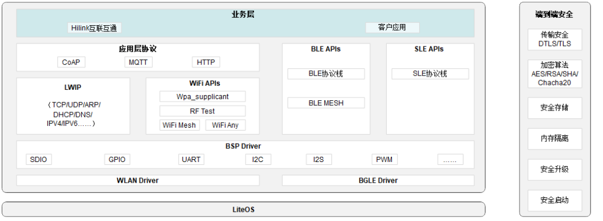

各功能模块说明如下：

-   业务层：用户基于API接口的二次开发。
-   应用层协议：应用层网络协议。
-   LWIP协议栈：TCP/IP协议栈。
-   WiFi APIs：提供基于SDK的WiFi通用接口。
-   BLE APIs：提供基于SDK的BLE通用接口。
-   SLE APIs：提供基于SDK的SLE通用接口。
-   感知 APIs: 提供基于SDK的感知通用接口。
-   BSP Driver：芯片和外围设备驱动。
-   WLAN Driver：802.11协议实现模块。
-   BLE&SLE Driver：BLE及星闪协议实现模块。

> **说明：** 
>该文档描述各个模块功能的开发流程。

# Wi-Fi 软件开发<a name="ZH-CN_TOPIC_0000001712592682"></a>


## 驱动加载与卸载<a name="ZH-CN_TOPIC_0000001712327304"></a>


### 概述<a name="ZH-CN_TOPIC_0000001712327312"></a>

在完成芯片上电后，驱动加载实现对芯片寄存器的初始配置、校准参数读取与写入、软件资源的申请和配置；驱动卸载实现软件资源的释放。

### 开发流程<a name="ZH-CN_TOPIC_0000001760286253"></a>

**使用场景<a name="section2062815751519"></a>**

Wi-Fi驱动初始化为Wi-Fi功能提供基本资源配置和芯片初始化，是Wi-Fi功能实现的第一步。当需要配置Wi-Fi功能时，必须先完成驱动的初始化，Wi-Fi功能使用完成后，可以使用去初始化完成资源释放也可以使用软复位来完成资源释放。

**功能<a name="section179410249279"></a>**

Wi-Fi驱动加载与卸载提供的接口如[表1](#table213321716161)所示。

**表 1**  Wi-Fi驱动加载与卸载接口描述

<a name="table213321716161"></a>
<table><thead align="left"><tr id="row1513313173162"><th class="cellrowborder" valign="top" width="25.22%" id="mcps1.2.3.1.1"><p id="p12986192321615"><a name="p12986192321615"></a><a name="p12986192321615"></a>接口名称</p>
</th>
<th class="cellrowborder" valign="top" width="74.78%" id="mcps1.2.3.1.2"><p id="p298617239162"><a name="p298617239162"></a><a name="p298617239162"></a>描述</p>
</th>
</tr>
</thead>
<tbody><tr id="row9133101751617"><td class="cellrowborder" valign="top" width="25.22%" headers="mcps1.2.3.1.1 "><p id="p12986112319166"><a name="p12986112319166"></a><a name="p12986112319166"></a>wifi_init</p>
</td>
<td class="cellrowborder" valign="top" width="74.78%" headers="mcps1.2.3.1.2 "><p id="p0986102331610"><a name="p0986102331610"></a><a name="p0986102331610"></a>Wi-Fi驱动初始化。</p>
</td>
</tr>
<tr id="row5133171721610"><td class="cellrowborder" valign="top" width="25.22%" headers="mcps1.2.3.1.1 "><p id="p8986162311615"><a name="p8986162311615"></a><a name="p8986162311615"></a>wifi_deinit</p>
</td>
<td class="cellrowborder" valign="top" width="74.78%" headers="mcps1.2.3.1.2 "><p id="p298652331619"><a name="p298652331619"></a><a name="p298652331619"></a>Wi-Fi驱动去初始化。</p>
</td>
</tr>
</tbody>
</table>

**开发流程<a name="section46551152112817"></a>**

使用驱动加载与卸载的典型流程：

1.  调用wifi\_init，完成Wi-Fi驱动初始化。
2.  参考“[STA功能](STA功能.md)”或“[SoftAp功能](SoftAp功能.md)”配置Wi-Fi功能。
3.  调用wifi\_deinit，完成Wi-Fi驱动去初始化。

**返回值<a name="section2021173615319"></a>**

Wi-Fi驱动加载与卸载的返回值如[表2](#table326819447226)所示。

**表 2**  Wi-Fi驱动加载与卸载返回值说明

<a name="table326819447226"></a>
<table><thead align="left"><tr id="row20268744122212"><th class="cellrowborder" valign="top" width="12.16%" id="mcps1.2.5.1.1"><p id="p1096717507222"><a name="p1096717507222"></a><a name="p1096717507222"></a>序号</p>
</th>
<th class="cellrowborder" valign="top" width="17.06%" id="mcps1.2.5.1.2"><p id="p1896715017226"><a name="p1896715017226"></a><a name="p1896715017226"></a>定义</p>
</th>
<th class="cellrowborder" valign="top" width="20.65%" id="mcps1.2.5.1.3"><p id="p18967145072216"><a name="p18967145072216"></a><a name="p18967145072216"></a>实际数值</p>
</th>
<th class="cellrowborder" valign="top" width="50.129999999999995%" id="mcps1.2.5.1.4"><p id="p196716506221"><a name="p196716506221"></a><a name="p196716506221"></a>描述</p>
</th>
</tr>
</thead>
<tbody><tr id="row92680447221"><td class="cellrowborder" valign="top" width="12.16%" headers="mcps1.2.5.1.1 "><p id="p1667982562316"><a name="p1667982562316"></a><a name="p1667982562316"></a>1</p>
</td>
<td class="cellrowborder" valign="top" width="17.06%" headers="mcps1.2.5.1.2 "><p id="p021739320"><a name="p021739320"></a><a name="p021739320"></a>ERRCODE_SUCC</p>
</td>
<td class="cellrowborder" valign="top" width="20.65%" headers="mcps1.2.5.1.3 "><p id="p727291125811"><a name="p727291125811"></a><a name="p727291125811"></a>0x0</p>
</td>
<td class="cellrowborder" valign="top" width="50.129999999999995%" headers="mcps1.2.5.1.4 "><p id="p627212175818"><a name="p627212175818"></a><a name="p627212175818"></a>执行成功。</p>
</td>
</tr>
<tr id="row72682441229"><td class="cellrowborder" valign="top" width="12.16%" headers="mcps1.2.5.1.1 "><p id="p9679025132314"><a name="p9679025132314"></a><a name="p9679025132314"></a>2</p>
</td>
<td class="cellrowborder" valign="top" width="17.06%" headers="mcps1.2.5.1.2 "><p id="p1467418156214"><a name="p1467418156214"></a><a name="p1467418156214"></a>ERRCODE_FAIL</p>
</td>
<td class="cellrowborder" valign="top" width="20.65%" headers="mcps1.2.5.1.3 "><p id="p1338817111386"><a name="p1338817111386"></a><a name="p1338817111386"></a>0xFFFFFFFF</p>
</td>
<td class="cellrowborder" valign="top" width="50.129999999999995%" headers="mcps1.2.5.1.4 "><p id="p227212117581"><a name="p227212117581"></a><a name="p227212117581"></a>执行失败。</p>
</td>
</tr>
</tbody>
</table>

### 编程实例<a name="ZH-CN_TOPIC_0000001712486828"></a>

示例1：基于LiteOS的app\_main函数，在系统初始化时已自动完成Wi-Fi驱动的加载，此加载方式无须执行，系统reboot时自动完成驱动卸载和加载。

**代码示例**

```
td_void app_main(td_void)
{
    td_u32 ret;

    ret = wifi_init();
    if (ret != 0) {
        printf("fail to init wifi\n");
    } else {
        printf("wifi init success\n");
    }

    //此处添加测试代码

    ret = wifi_deinit();
    if (ret != 0) {
        printf("fail to deinit wifi\n");
    } else {
        printf("wifi deinit success\n");
    }

    return;
}
```

**结果验证**

```
wifi init success
wifi deinit success

```

## STA功能<a name="ZH-CN_TOPIC_0000001712327324"></a>


### 概述<a name="ZH-CN_TOPIC_0000001760166377"></a>

STA功能即Station功能，实现驱动STA设备的创建、扫描、关联以及DHCP，完成通信链路的建立。开发STA功能前，须完成驱动加载。

### 开发流程<a name="ZH-CN_TOPIC_0000001760286261"></a>

**使用场景<a name="section2062815751519"></a>**

当需要接入某个网络并与该网络通信时，需要启动STA功能。

**功能<a name="section179410249279"></a>**

驱动STA功能提供的接口如[表1](#table143637195303)所示。

**表 1**  驱动STA功能接口描述

<a name="table143637195303"></a>
<table><thead align="left"><tr id="row8363101983015"><th class="cellrowborder" valign="top" width="37.49%" id="mcps1.2.3.1.1"><p id="p18428154019309"><a name="p18428154019309"></a><a name="p18428154019309"></a>接口名称</p>
</th>
<th class="cellrowborder" valign="top" width="62.51%" id="mcps1.2.3.1.2"><p id="p542816408305"><a name="p542816408305"></a><a name="p542816408305"></a>描述</p>
</th>
</tr>
</thead>
<tbody><tr id="row436301917301"><td class="cellrowborder" valign="top" width="37.49%" headers="mcps1.2.3.1.1 "><p id="p6428104043019"><a name="p6428104043019"></a><a name="p6428104043019"></a>wifi_sta_enable</p>
</td>
<td class="cellrowborder" valign="top" width="62.51%" headers="mcps1.2.3.1.2 "><p id="p12428184011308"><a name="p12428184011308"></a><a name="p12428184011308"></a>启动STA接口。</p>
</td>
</tr>
<tr id="row14562125710212"><td class="cellrowborder" valign="top" width="37.49%" headers="mcps1.2.3.1.1 "><p id="p556215571724"><a name="p556215571724"></a><a name="p556215571724"></a>wifi_sta_set_reconnect_policy</p>
</td>
<td class="cellrowborder" valign="top" width="62.51%" headers="mcps1.2.3.1.2 "><p id="p25623571623"><a name="p25623571623"></a><a name="p25623571623"></a>设置STA接口自动重连配置。</p>
</td>
</tr>
<tr id="row39941337517"><td class="cellrowborder" valign="top" width="37.49%" headers="mcps1.2.3.1.1 "><p id="p1158142319914"><a name="p1158142319914"></a><a name="p1158142319914"></a>wifi_register_event_cb</p>
</td>
<td class="cellrowborder" valign="top" width="62.51%" headers="mcps1.2.3.1.2 "><p id="p1099473715117"><a name="p1099473715117"></a><a name="p1099473715117"></a>注册事件的回调函数。</p>
</td>
</tr>
<tr id="row33632191304"><td class="cellrowborder" valign="top" width="37.49%" headers="mcps1.2.3.1.1 "><p id="p12429540163013"><a name="p12429540163013"></a><a name="p12429540163013"></a>wifi_sta_scan</p>
</td>
<td class="cellrowborder" valign="top" width="62.51%" headers="mcps1.2.3.1.2 "><p id="p6429740183011"><a name="p6429740183011"></a><a name="p6429740183011"></a>触发STA扫描。</p>
</td>
</tr>
<tr id="row191629361541"><td class="cellrowborder" valign="top" width="37.49%" headers="mcps1.2.3.1.1 "><p id="p1216220362410"><a name="p1216220362410"></a><a name="p1216220362410"></a>wifi_sta_scan_advance</p>
</td>
<td class="cellrowborder" valign="top" width="62.51%" headers="mcps1.2.3.1.2 "><p id="p316215365413"><a name="p316215365413"></a><a name="p316215365413"></a>执行带特定参数的扫描。</p>
</td>
</tr>
<tr id="row133631219103015"><td class="cellrowborder" valign="top" width="37.49%" headers="mcps1.2.3.1.1 "><p id="p10429134043020"><a name="p10429134043020"></a><a name="p10429134043020"></a>wifi_sta_get_scan_info</p>
</td>
<td class="cellrowborder" valign="top" width="62.51%" headers="mcps1.2.3.1.2 "><p id="p0429104063018"><a name="p0429104063018"></a><a name="p0429104063018"></a>获取STA扫描结果。</p>
</td>
</tr>
<tr id="row236351916307"><td class="cellrowborder" valign="top" width="37.49%" headers="mcps1.2.3.1.1 "><p id="p242912406305"><a name="p242912406305"></a><a name="p242912406305"></a>wifi_sta_connect</p>
</td>
<td class="cellrowborder" valign="top" width="62.51%" headers="mcps1.2.3.1.2 "><p id="p9429164014309"><a name="p9429164014309"></a><a name="p9429164014309"></a>触发STA连接Wi-Fi网络。</p>
</td>
</tr>
<tr id="row236341973014"><td class="cellrowborder" valign="top" width="37.49%" headers="mcps1.2.3.1.1 "><p id="p2042916401306"><a name="p2042916401306"></a><a name="p2042916401306"></a>wifi_sta_get_ap_info</p>
</td>
<td class="cellrowborder" valign="top" width="62.51%" headers="mcps1.2.3.1.2 "><p id="p842916408304"><a name="p842916408304"></a><a name="p842916408304"></a>获取STA连接的网络状态。</p>
</td>
</tr>
<tr id="row936321913306"><td class="cellrowborder" valign="top" width="37.49%" headers="mcps1.2.3.1.1 "><p id="p3429840123012"><a name="p3429840123012"></a><a name="p3429840123012"></a>netifapi_dhcp_start</p>
</td>
<td class="cellrowborder" valign="top" width="62.51%" headers="mcps1.2.3.1.2 "><p id="p9429154053010"><a name="p9429154053010"></a><a name="p9429154053010"></a>启动DHCP客户端，获取IP地址。</p>
</td>
</tr>
<tr id="row2121115013610"><td class="cellrowborder" valign="top" width="37.49%" headers="mcps1.2.3.1.1 "><p id="p712125003610"><a name="p712125003610"></a><a name="p712125003610"></a>netifapi_dhcp_stop</p>
</td>
<td class="cellrowborder" valign="top" width="62.51%" headers="mcps1.2.3.1.2 "><p id="p9121350193613"><a name="p9121350193613"></a><a name="p9121350193613"></a>停止DHCP客户端。</p>
</td>
</tr>
<tr id="row636411933017"><td class="cellrowborder" valign="top" width="37.49%" headers="mcps1.2.3.1.1 "><p id="p18429154013019"><a name="p18429154013019"></a><a name="p18429154013019"></a>wifi_sta_disconnect</p>
</td>
<td class="cellrowborder" valign="top" width="62.51%" headers="mcps1.2.3.1.2 "><p id="p74294406301"><a name="p74294406301"></a><a name="p74294406301"></a>触发STA离开当前网络。</p>
</td>
</tr>
<tr id="row2851194533010"><td class="cellrowborder" valign="top" width="37.49%" headers="mcps1.2.3.1.1 "><p id="p16644175533010"><a name="p16644175533010"></a><a name="p16644175533010"></a>wifi_sta_disable</p>
</td>
<td class="cellrowborder" valign="top" width="62.51%" headers="mcps1.2.3.1.2 "><p id="p12644255183014"><a name="p12644255183014"></a><a name="p12644255183014"></a>关闭STA接口。</p>
</td>
</tr>
<tr id="row192341815115219"><td class="cellrowborder" valign="top" width="37.49%" headers="mcps1.2.3.1.1 "><p id="p1234115195210"><a name="p1234115195210"></a><a name="p1234115195210"></a>wifi_sta_fast_connect</p>
</td>
<td class="cellrowborder" valign="top" width="62.51%" headers="mcps1.2.3.1.2 "><p id="p18234415165212"><a name="p18234415165212"></a><a name="p18234415165212"></a>STA快速连接接口，连接加密路由器时，不支持WPA3的加密方式。</p>
</td>
</tr>
<tr id="row106014185104"><td class="cellrowborder" valign="top" width="37.49%" headers="mcps1.2.3.1.1 "><p id="p860116188107"><a name="p860116188107"></a><a name="p860116188107"></a>wifi_raw_scan</p>
</td>
<td class="cellrowborder" valign="top" width="62.51%" headers="mcps1.2.3.1.2 "><p id="p136016189107"><a name="p136016189107"></a><a name="p136016189107"></a>WiFi驱动直接发起的扫描。</p>
</td>
</tr>
<tr id="row1314875210488"><td class="cellrowborder" valign="top" width="37.49%" headers="mcps1.2.3.1.1 "><p id="p4148452174812"><a name="p4148452174812"></a><a name="p4148452174812"></a>wifi_set_intrf_mode</p>
</td>
<td class="cellrowborder" valign="top" width="62.51%" headers="mcps1.2.3.1.2 "><p id="p174412055175110"><a name="p174412055175110"></a><a name="p174412055175110"></a>是否使能抗干扰模式。</p>
</td>
</tr>
</tbody>
</table>

**开发流程<a name="section46551152112817"></a>**

STA功能开发的典型流程：

1.  调用wifi\_sta\_enable，启动STA。
2.  （可选，根据需要配置）调用wifi\_sta\_set\_reconnect\_policy，设置自动重连。
3.  调用wifi\_sta\_scan（或调用aich\_wifi\_sta\_advance\_scan，执行带参数扫描），触发STA扫描。
4.  调用wifi\_sta\_get\_scan\_info，获取扫描结果。
5.  根据接入网络需求，自定义筛选扫描结果，调用wifi\_sta\_connect，进行连接。
6.  调用wifi\_sta\_get\_ap\_info，查询Wi-Fi连接状态。
7.  连接成功后，调用netifapi\_dhcp\_start，启动DHCP客户端，获取IP地址。
8.  调用wifi\_sta\_disconnect，离开当前连接的网络。
9.  （可选）调用netifapi\_dhcps\_stop，停止DHCP客户端。
10. 调用wifi\_sta\_disable，关闭STA（会自动关闭DHCP客户端）。

**返回值<a name="section2021173615319"></a>**

STA功能的返回值如[表2](#table2038664116377)所示。

**表 2**  STA功能返回值说明

<a name="table2038664116377"></a>
<table><thead align="left"><tr id="row73873419379"><th class="cellrowborder" valign="top" width="12%" id="mcps1.2.5.1.1"><p id="p1438713112386"><a name="p1438713112386"></a><a name="p1438713112386"></a>序号</p>
</th>
<th class="cellrowborder" valign="top" width="27.68%" id="mcps1.2.5.1.2"><p id="p113881613387"><a name="p113881613387"></a><a name="p113881613387"></a>定义</p>
</th>
<th class="cellrowborder" valign="top" width="19.18%" id="mcps1.2.5.1.3"><p id="p53887117387"><a name="p53887117387"></a><a name="p53887117387"></a>实际数值</p>
</th>
<th class="cellrowborder" valign="top" width="41.14%" id="mcps1.2.5.1.4"><p id="p113888173815"><a name="p113888173815"></a><a name="p113888173815"></a>描述</p>
</th>
</tr>
</thead>
<tbody><tr id="row193875413373"><td class="cellrowborder" valign="top" width="12%" headers="mcps1.2.5.1.1 "><p id="p33881819389"><a name="p33881819389"></a><a name="p33881819389"></a>1</p>
</td>
<td class="cellrowborder" valign="top" width="27.68%" headers="mcps1.2.5.1.2 "><p id="p1616013731710"><a name="p1616013731710"></a><a name="p1616013731710"></a>ERRCODE_SUCC</p>
</td>
<td class="cellrowborder" valign="top" width="19.18%" headers="mcps1.2.5.1.3 "><p id="p63881515387"><a name="p63881515387"></a><a name="p63881515387"></a>0x0</p>
</td>
<td class="cellrowborder" valign="top" width="41.14%" headers="mcps1.2.5.1.4 "><p id="p138816183814"><a name="p138816183814"></a><a name="p138816183814"></a>执行成功。</p>
</td>
</tr>
<tr id="row83878416374"><td class="cellrowborder" valign="top" width="12%" headers="mcps1.2.5.1.1 "><p id="p103881614385"><a name="p103881614385"></a><a name="p103881614385"></a>2</p>
</td>
<td class="cellrowborder" valign="top" width="27.68%" headers="mcps1.2.5.1.2 "><p id="p12568244201710"><a name="p12568244201710"></a><a name="p12568244201710"></a>ERRCODE_FAIL</p>
</td>
<td class="cellrowborder" valign="top" width="19.18%" headers="mcps1.2.5.1.3 "><p id="p1338817111386"><a name="p1338817111386"></a><a name="p1338817111386"></a>0xFFFFFFFF</p>
</td>
<td class="cellrowborder" valign="top" width="41.14%" headers="mcps1.2.5.1.4 "><p id="p10388713386"><a name="p10388713386"></a><a name="p10388713386"></a>执行失败。</p>
</td>
</tr>
</tbody>
</table>

### 注意事项<a name="ZH-CN_TOPIC_0000001760286257"></a>

-   扫描为非阻塞式接口，扫描命令下发成功后需要延迟一段时间后再获取扫描结果，全信道扫描延迟时间建议设置为1s。
-   可通过指定SSID、BSSID、信道等带指定参数的扫描，实现更精准地扫描，缩短扫描时间。
-   已知待连接网络的参数时，可省去扫描过程，直接发起连接。
-   连接为非阻塞式接口，连接命令下发成功后，需要通过命令获取连接状态。
-   注册事件回调函数后，Wi-Fi相关的事件会通过该回调上报用户，用户可根据事件执行后续动作。
-   不支持重复启动STA，再次启动STA时须先执行关闭STA。
-   关闭STA步骤为可选，设备所处的网络地位不变，不需要执行关闭STA。
-   STA默认支持发送和接收AMPDU聚合帧。

### Sample用例<a name="ZH-CN_TOPIC_0000001712327320"></a>

> **说明：** 
>1.  STA Sample文件位于application\\samples\\wifi\\sta\_sample目录。
>2.  实现当STA Sample软件版本成功烧录后，单板启动时会自启动STA，并不停的扫描，直到发现存在SSID为“my\_softAP”的目标AP，然后会通过密码“my\_password”进行连接，若连接失败，则重复扫描动作，若连接成功，则进一步获取动态IP地址，获取IP成功后，串口会打印“STA connect success.”。

1.  在SDK包的根目录下，执行命令“python3 build.py ws63-liteos-app menuconfig”进入menuconfig。
2.  依次选择Application -\> Enable Sample -\> Enable the Sample of WIFI -\> Sample -\> Support WIFI STA Sample，并按S键保存，然后通过Esc键退出menuconfig。
3.  在SDK包的根目录下，执行命令“python3 build.py ws63-liteos-app”，即可编译STA Sample软件版本。

## SoftAp功能<a name="ZH-CN_TOPIC_0000001760166381"></a>


### 概述<a name="ZH-CN_TOPIC_0000001712486840"></a>

SoftAp功能提供网络接入点供其他STA接入，并对接入的STA提供DHCP Server服务。

### 开发流程<a name="ZH-CN_TOPIC_0000001712327316"></a>

**使用场景<a name="section2062815751519"></a>**

当需要创建一个网络接入点，供其他设备接入并共享网络内的数据时，需要使用SoftAp功能。

**功能<a name="section179410249279"></a>**

驱动SoftAp功能提供的接口如[表1](#table77291141131814)所示。

**表 1**  驱动SoftAp功能接口描述

<a name="table77291141131814"></a>
<table><thead align="left"><tr id="row137309418184"><th class="cellrowborder" valign="top" width="36.059999999999995%" id="mcps1.2.3.1.1"><p id="p631973310191"><a name="p631973310191"></a><a name="p631973310191"></a>接口名称</p>
</th>
<th class="cellrowborder" valign="top" width="63.94%" id="mcps1.2.3.1.2"><p id="p1431953319191"><a name="p1431953319191"></a><a name="p1431953319191"></a>描述</p>
</th>
</tr>
</thead>
<tbody><tr id="row573094116188"><td class="cellrowborder" valign="top" width="36.059999999999995%" headers="mcps1.2.3.1.1 "><p id="p1319533141916"><a name="p1319533141916"></a><a name="p1319533141916"></a>wifi_softap_enable</p>
</td>
<td class="cellrowborder" valign="top" width="63.94%" headers="mcps1.2.3.1.2 "><p id="p1031943317193"><a name="p1031943317193"></a><a name="p1031943317193"></a>启动SoftAp接口。</p>
</td>
</tr>
<tr id="row1473084114184"><td class="cellrowborder" valign="top" width="36.059999999999995%" headers="mcps1.2.3.1.1 "><p id="p331963371918"><a name="p331963371918"></a><a name="p331963371918"></a>wifi_set_softap_config_advance</p>
</td>
<td class="cellrowborder" valign="top" width="63.94%" headers="mcps1.2.3.1.2 "><p id="p6319033191910"><a name="p6319033191910"></a><a name="p6319033191910"></a>设置SoftAp协议模式、beacon周期、dtim周期、秘钥更新时间、是否隐藏SSID、GI参数。</p>
</td>
</tr>
<tr id="row134254321440"><td class="cellrowborder" valign="top" width="36.059999999999995%" headers="mcps1.2.3.1.1 "><p id="p1642573218444"><a name="p1642573218444"></a><a name="p1642573218444"></a>wifi_get_softap_config_advance</p>
</td>
<td class="cellrowborder" valign="top" width="63.94%" headers="mcps1.2.3.1.2 "><p id="p9425133284413"><a name="p9425133284413"></a><a name="p9425133284413"></a>获取SoftAp协议模式、beacon周期、dtim周期、秘钥更新时间、是否隐藏SSID、GI参数。</p>
</td>
</tr>
<tr id="row108942512579"><td class="cellrowborder" valign="top" width="36.059999999999995%" headers="mcps1.2.3.1.1 "><p id="p089612555718"><a name="p089612555718"></a><a name="p089612555718"></a>netifapi_netif_set_addr</p>
</td>
<td class="cellrowborder" valign="top" width="63.94%" headers="mcps1.2.3.1.2 "><p id="p38962055578"><a name="p38962055578"></a><a name="p38962055578"></a>设置SoftAp的DHCP 服务器的IP地址、子网掩码和网关参数。</p>
</td>
</tr>
<tr id="row114859117578"><td class="cellrowborder" valign="top" width="36.059999999999995%" headers="mcps1.2.3.1.1 "><p id="p204861711145711"><a name="p204861711145711"></a><a name="p204861711145711"></a>netifapi_dhcps_start</p>
</td>
<td class="cellrowborder" valign="top" width="63.94%" headers="mcps1.2.3.1.2 "><p id="p2486161155719"><a name="p2486161155719"></a><a name="p2486161155719"></a>启动SoftAp的DHCP服务器。</p>
</td>
</tr>
<tr id="row1555893917503"><td class="cellrowborder" valign="top" width="36.059999999999995%" headers="mcps1.2.3.1.1 "><p id="p18559153915014"><a name="p18559153915014"></a><a name="p18559153915014"></a>netifapi_dhcps_stop</p>
</td>
<td class="cellrowborder" valign="top" width="63.94%" headers="mcps1.2.3.1.2 "><p id="p855923915015"><a name="p855923915015"></a><a name="p855923915015"></a>停止SoftAp的DHCP服务器。</p>
</td>
</tr>
<tr id="row6646145417195"><td class="cellrowborder" valign="top" width="36.059999999999995%" headers="mcps1.2.3.1.1 "><p id="p18406159209"><a name="p18406159209"></a><a name="p18406159209"></a>wifi_softap_get_sta_list</p>
</td>
<td class="cellrowborder" valign="top" width="63.94%" headers="mcps1.2.3.1.2 "><p id="p178401915112011"><a name="p178401915112011"></a><a name="p178401915112011"></a>获取当前接入的STA信息。</p>
</td>
</tr>
<tr id="row27741326205"><td class="cellrowborder" valign="top" width="36.059999999999995%" headers="mcps1.2.3.1.1 "><p id="p1884011520204"><a name="p1884011520204"></a><a name="p1884011520204"></a>wifi_softap_deauth_sta</p>
</td>
<td class="cellrowborder" valign="top" width="63.94%" headers="mcps1.2.3.1.2 "><p id="p584061510203"><a name="p584061510203"></a><a name="p584061510203"></a>断开指定STA的连接。</p>
</td>
</tr>
<tr id="row1196155817195"><td class="cellrowborder" valign="top" width="36.059999999999995%" headers="mcps1.2.3.1.1 "><p id="p10840121582010"><a name="p10840121582010"></a><a name="p10840121582010"></a>wifi_softap_disable</p>
</td>
<td class="cellrowborder" valign="top" width="63.94%" headers="mcps1.2.3.1.2 "><p id="p1284091518209"><a name="p1284091518209"></a><a name="p1284091518209"></a>关闭SoftAp接口。</p>
</td>
</tr>
</tbody>
</table>

**开发流程<a name="section46551152112817"></a>**

SoftAp功能开发的典型流程：

1.  （可选）调用wifi\_set\_softap\_config\_advance，设置SoftAp协议模式、beacon周期、dtim周期、秘钥更新时间、是否隐藏SSID、GI参数。
2.  调用wifi\_softap\_start，启动SoftAp。
3.  调用netifapi\_netif\_set\_addr，配置DHCP服务器。
4.  调用netifapi\_dhcps\_start，启动DHCP服务器。
5.  （可选）调用netifapi\_dhcps\_stop，停止DHCP服务器。
6.  调用aich\_wifi\_softap\_stop，关闭SoftAp（会自动关闭DHCP服务器）。

**返回值<a name="section2021173615319"></a>**

SoftAp功能的返回值如[表2](#table1250291942313)所示。

**表 2**  SoftAp功能返回值说明

<a name="table1250291942313"></a>
<table><thead align="left"><tr id="row75031219112319"><th class="cellrowborder" valign="top" width="12.41%" id="mcps1.2.5.1.1"><p id="p2679825192311"><a name="p2679825192311"></a><a name="p2679825192311"></a>序号</p>
</th>
<th class="cellrowborder" valign="top" width="24.67%" id="mcps1.2.5.1.2"><p id="p06791025172315"><a name="p06791025172315"></a><a name="p06791025172315"></a>定义</p>
</th>
<th class="cellrowborder" valign="top" width="14.93%" id="mcps1.2.5.1.3"><p id="p12679192562315"><a name="p12679192562315"></a><a name="p12679192562315"></a>实际数值</p>
</th>
<th class="cellrowborder" valign="top" width="47.99%" id="mcps1.2.5.1.4"><p id="p146791125112310"><a name="p146791125112310"></a><a name="p146791125112310"></a>描述</p>
</th>
</tr>
</thead>
<tbody><tr id="row6503519172314"><td class="cellrowborder" valign="top" width="12.41%" headers="mcps1.2.5.1.1 "><p id="p1667982562316"><a name="p1667982562316"></a><a name="p1667982562316"></a>1</p>
</td>
<td class="cellrowborder" valign="top" width="24.67%" headers="mcps1.2.5.1.2 "><p id="p1616013731710"><a name="p1616013731710"></a><a name="p1616013731710"></a>ERRCODE_SUCC</p>
</td>
<td class="cellrowborder" valign="top" width="14.93%" headers="mcps1.2.5.1.3 "><p id="p63881515387"><a name="p63881515387"></a><a name="p63881515387"></a>0x0</p>
</td>
<td class="cellrowborder" valign="top" width="47.99%" headers="mcps1.2.5.1.4 "><p id="p1567952552319"><a name="p1567952552319"></a><a name="p1567952552319"></a>执行成功。</p>
</td>
</tr>
<tr id="row14503719152316"><td class="cellrowborder" valign="top" width="12.41%" headers="mcps1.2.5.1.1 "><p id="p9679025132314"><a name="p9679025132314"></a><a name="p9679025132314"></a>2</p>
</td>
<td class="cellrowborder" valign="top" width="24.67%" headers="mcps1.2.5.1.2 "><p id="p12568244201710"><a name="p12568244201710"></a><a name="p12568244201710"></a>ERRCODE_FAIL</p>
</td>
<td class="cellrowborder" valign="top" width="14.93%" headers="mcps1.2.5.1.3 "><p id="p1338817111386"><a name="p1338817111386"></a><a name="p1338817111386"></a>0xFFFFFFFF</p>
</td>
<td class="cellrowborder" valign="top" width="47.99%" headers="mcps1.2.5.1.4 "><p id="p12679152562312"><a name="p12679152562312"></a><a name="p12679152562312"></a>执行失败。</p>
</td>
</tr>
</tbody>
</table>

### 注意事项<a name="ZH-CN_TOPIC_0000001712486820"></a>

-   SoftAp的网络参数为可选配置，无特殊要求均可使用初始默认值。
-   SoftAp默认启动20M带宽SoftAp。
-   SoftAp的网络参数在关闭SoftAp时不会重置，会继续沿用上一次配置，重启单板可恢复至初始默认值。
-   SoftAp模式下最大关联用户数限制：
    -   最大关联用户不超过6个。

### Sample用例<a name="ZH-CN_TOPIC_0000001712486836"></a>

> **说明：** 
>1.  “SoftAp Sample”文件位于“application\\samples\\wifi\\softap\_sample目录”。
>2.  实现当SoftAP Sample软件版本成功烧录后，单板启动时会自启动SoftAp，其加密方式为wpa/wpa2，SSID为“my\_softAP”，密码为“my\_password”，IP地址默认设置为192.168.43.1，网关地址默认设置为192.168.43.2。

1.  在SDK包的根目录下，执行命令“python3 build.py ws63-liteos-app menuconfig”进入menuconfig。
2.  依次选择Application -\> Enable Sample -\> Enable the Sample of WIFI -\> Sample -\> Support WIFI SoftAP Sample，并按S键保存，然后通过Esc键退出menuconfig。
3.  在SDK包的根目录下，下发命令“python3 build.py ws63-liteos-app”，即可编译SoftAP Sample软件版本。

## STA&SoftAp共存<a name="ZH-CN_TOPIC_0000001760166349"></a>


### 概述<a name="ZH-CN_TOPIC_0000001760166337"></a>

STA&SoftAp共存即STA功能和SoftAp功能同时工作，仅支持同信道共存。

### 开发流程<a name="ZH-CN_TOPIC_0000001760166341"></a>

**使用场景<a name="section2062815751519"></a>**

配网时，产品先启动SoftAp，手机关联SoftAp后发送家居网络的SSID和密码给产品，产品获取到家居网络的连接参数后启动STA关联家居网络，完成产品联网，产品联网成功后，关闭SoftAp，只保留STA作为端侧长期保持连接。共存场景可视产品形态和需求自行使用。

**功能<a name="section179410249279"></a>**

共存功能分别使用STA功能和SoftAp功能的API接口，无额外新增API接口。

**开发流程<a name="section810939162311"></a>**

配网模式下共存功能开发的典型流程：

1.  创建SoftAp网络接口（详细内容请参见“[SoftAp功能](SoftAp功能.md)”）。
2.  手机关联SoftAp，并通过手机APP发送家居网络SSID和密码。
3.  创建STA网络接口，并根据SSID和密码完成关联（详细内容请参见“[STA功能](STA功能.md)”）。
4.  关闭SoftAp（详细内容请参见“[SoftAp功能](SoftAp功能.md)”）。

**返回值<a name="section8109793233"></a>**

返回值请参见对应模块功能的返回值说明。

### 编程实例<a name="ZH-CN_TOPIC_0000001760286229"></a>

请参考STA和SoftAp功能的编程实例（详细内容请参见“[STA功能](STA功能.md)”或“[SoftAp功能](SoftAp功能.md)”）。

## Wi-Fi&蓝牙共存<a name="ZH-CN_TOPIC_0000001760286213"></a>


### 概述<a name="ZH-CN_TOPIC_0000001760166357"></a>

蓝牙（BT，Bluetooth）和Wi-Fi均可能工作在2.4G ISM，因此可能互相干扰。分时是利用蓝牙和Wi-Fi间的握手信号，使蓝牙和Wi-Fi分时在2.4G工作，这样可以避免噪音干扰和阻塞干扰。

802.15.2规定仲裁方式和信号（PTA，Packet Traffic Arbitration）的框架，在蓝牙或Wi-Fi有收发业务时，提交申请给PTA controller（集成在Wi-Fi中），由PTA controller进行许可。

蓝牙和Wi-Fi间的握手信号定义如下：

-   Wi-Fi给PTA信号wl\_tx\_status：Wi-Fi有发包业务。
-   Wi-Fi给PTA信号wl\_rx\_status：Wi-Fi有收包业务。
-   Wi-Fi给PTA信号wl\_priority：Wi-Fi业务状态，Wi-Fi高优先级。
-   Wi-Fi给PTA信号wl\_occupied：Wi-Fi业务状态，Wi-Fi最高优先级。
-   蓝牙给PTA信号bt\_status：蓝牙有收发业务。
-   蓝牙给PTA信号bt\_priority：蓝牙业务状态，指示蓝牙优先级。

### 开发流程<a name="ZH-CN_TOPIC_0000001712327288"></a>

**使用场景<a name="section566012218586"></a>**

需要同时使用Wi-Fi和蓝牙时，开启Wi-Fi&BT共存功能。

**开发流程<a name="section1824214411117"></a>**

Wi-Fi&BT共存功能开发的典型流程：

1.  加载蓝牙后，执行蓝牙共存初始化函数
2.  创建STA网络接口（详细内容请参见“[STA功能](STA功能.md)”）。
3.  创建蓝牙业务（详情内容请参见“[BLE&SLE 软件开发](BLE-SLE-软件开发.md)”）

### 注意事项<a name="ZH-CN_TOPIC_0000001760286217"></a>

-   Wi-Fi与BT共存支持STA模式、支持SoftAp模式。
-   模组或产品内同时集成了Wi-Fi芯片和蓝牙芯片，常开Wi-Fi&BT共存功能。
-   不支持外部共存

## 国家码功能配置<a name="ZH-CN_TOPIC_0000001760286221"></a>


### 使用背景<a name="ZH-CN_TOPIC_0000001712486800"></a>

对于发货给不同国家的用户，希望使用同一套固件，可以通过修改NV中的管制域信息（包括国家码，信道， 发射功率等）实现。

### 使用指南<a name="ZH-CN_TOPIC_0000001712486816"></a>

1.  <a name="li797318515116"></a>在NV配置文件middleware/chips/ws63/nv/nv\_config/cfg/acore/app.json中，NV ID ="0x2003" 的表项用于确定国家码，value的含义是国家码对应ASIC码，例如：十进制67，78分别对应ASIC码中的 'C', 'N'

    ```
    "country":{
        "key_id": "0x2003",
        "key_status": "alive",
        "structure_type": "country_type_t",
        "attributions": 2,
        "value": [[67,78]]
    },
    ```

    国家码与四个区域管制域的对应关系如下。

    <a name="table499365102515"></a>
    <table><thead align="left"><tr id="row139931258255"><th class="cellrowborder" valign="top" width="20.442044204420444%" id="mcps1.1.4.1.1"><p id="p199315112511"><a name="p199315112511"></a><a name="p199315112511"></a>key_id</p>
    </th>
    <th class="cellrowborder" valign="top" width="22.69226922692269%" id="mcps1.1.4.1.2"><p id="p11993755258"><a name="p11993755258"></a><a name="p11993755258"></a>区域</p>
    </th>
    <th class="cellrowborder" valign="top" width="56.86568656865686%" id="mcps1.1.4.1.3"><p id="p499305162511"><a name="p499305162511"></a><a name="p499305162511"></a>国家码</p>
    </th>
    </tr>
    </thead>
    <tbody><tr id="row1499320582511"><td class="cellrowborder" valign="top" width="20.442044204420444%" headers="mcps1.1.4.1.1 "><p id="p699313517253"><a name="p699313517253"></a><a name="p699313517253"></a>0x2053</p>
    </td>
    <td class="cellrowborder" valign="top" width="22.69226922692269%" headers="mcps1.1.4.1.2 "><p id="p1199312592518"><a name="p1199312592518"></a><a name="p1199312592518"></a>北美</p>
    </td>
    <td class="cellrowborder" valign="top" width="56.86568656865686%" headers="mcps1.1.4.1.3 "><p id="p09935516253"><a name="p09935516253"></a><a name="p09935516253"></a>US,CA,KH</p>
    </td>
    </tr>
    <tr id="row1999318542514"><td class="cellrowborder" valign="top" width="20.442044204420444%" headers="mcps1.1.4.1.1 "><p id="p599314512256"><a name="p599314512256"></a><a name="p599314512256"></a>0x2054</p>
    </td>
    <td class="cellrowborder" valign="top" width="22.69226922692269%" headers="mcps1.1.4.1.2 "><p id="p899313562519"><a name="p899313562519"></a><a name="p899313562519"></a>欧洲</p>
    </td>
    <td class="cellrowborder" valign="top" width="56.86568656865686%" headers="mcps1.1.4.1.3 "><p id="p199319512254"><a name="p199319512254"></a><a name="p199319512254"></a>RU,AU,MY,ID,TR,PL,FR,PT,IT,DE,ES,AR,ZA,MA,PH,TH,GB,CO,MX,EC,PE,CL,SA,EG,AE</p>
    </td>
    </tr>
    <tr id="row1699345162513"><td class="cellrowborder" valign="top" width="20.442044204420444%" headers="mcps1.1.4.1.1 "><p id="p16993135152519"><a name="p16993135152519"></a><a name="p16993135152519"></a>0x2055</p>
    </td>
    <td class="cellrowborder" valign="top" width="22.69226922692269%" headers="mcps1.1.4.1.2 "><p id="p1999319582516"><a name="p1999319582516"></a><a name="p1999319582516"></a>日本</p>
    </td>
    <td class="cellrowborder" valign="top" width="56.86568656865686%" headers="mcps1.1.4.1.3 "><p id="p1499315511252"><a name="p1499315511252"></a><a name="p1499315511252"></a>JP</p>
    </td>
    </tr>
    <tr id="row499311592519"><td class="cellrowborder" valign="top" width="20.442044204420444%" headers="mcps1.1.4.1.1 "><p id="p5993175102511"><a name="p5993175102511"></a><a name="p5993175102511"></a>0x2056</p>
    </td>
    <td class="cellrowborder" valign="top" width="22.69226922692269%" headers="mcps1.1.4.1.2 "><p id="p4993259252"><a name="p4993259252"></a><a name="p4993259252"></a>亚太</p>
    </td>
    <td class="cellrowborder" valign="top" width="56.86568656865686%" headers="mcps1.1.4.1.3 "><p id="p1099365152514"><a name="p1099365152514"></a><a name="p1099365152514"></a>CN</p>
    </td>
    </tr>
    </tbody>
    </table>

2.  基于[1](#li797318515116)确定的对应关系，刷新对应的发射功率表项，支持调整不同速率的目标功率，以及调整在不同工作信道下的最大功率。

    刷新0x2053，0x2054，0x2055，0x2056表项：

    ```
    "fe_tx_power_fcc":{
        "key_id": "0x2053",
        "key_status": "alive",
        "structure_type": "fe_tx_power_type_t",
        "attributions": 2,
        "value": [
            [230],
            [46, 46, 46, 43, 42, 42, 42, 42, 42, 42, 40, 38, 40, 40, 40, 37, 37, 37, 37, 36, 33, 30, 40, 40, 40, 37, 37, 37, 37, 36, 33, 30, 22],
            [60, 60, 60, 60, 60, 60, 60, 60, 60, 60, 60, 60, 60, 60, 60, 60, 60, 60, 60, 60, 60, 60, 60, 60, 60, 60, 60, 60, 60, 60, 60, 60, 60, 60, 60, 60, 60, 60, 60, 60, 60, 60, 60, 60, 60, 60, 60, 60, 60, 60, 60, 60, 60, 60, 60, 60],
            [60, 60, 60]
        ]
    },
    ```

    ```
    "fe_tx_power_etsi":{
        "key_id": "0x2054",
        "key_status": "alive",
        "structure_type": "fe_tx_power_type_t",
        "attributions": 2,
        "value": [
            [230],
            [46, 46, 46, 43, 42, 42, 42, 42, 42, 42, 40, 38, 40, 40, 40, 37, 37, 37, 37, 36, 33, 30, 40, 40, 40, 37, 37, 37, 37, 36, 33, 30, 22],
            [60, 60, 60, 60, 60, 60, 60, 60, 60, 60, 60, 60, 60, 60, 60, 60, 60, 60, 60, 60, 60, 60, 60, 60, 60, 60, 60, 60, 60, 60, 60, 60, 60, 60, 60, 60, 60, 60, 60, 60, 60, 60, 60, 60, 60, 60, 60, 60, 60, 60, 60, 60, 60, 60, 60, 60],
            [60, 60, 60]
        ]
    },
    ```

    ```
    "fe_tx_power_japan":{
        "key_id": "0x2055",
        "key_status": "alive",
        "structure_type": "fe_tx_power_type_t",
        "attributions": 2,
        "value": [
            [230],
            [46, 46, 46, 43, 42, 42, 42, 42, 42, 42, 40, 38, 40, 40, 40, 37, 37, 37, 37, 36, 33, 30, 40, 40, 40, 37, 37, 37, 37, 36, 33, 30, 22],
            [60, 60, 60, 60, 60, 60, 60, 60, 60, 60, 60, 60, 60, 60, 60, 60, 60, 60, 60, 60, 60, 60, 60, 60, 60, 60, 60, 60, 60, 60, 60, 60, 60, 60, 60, 60, 60, 60, 60, 60, 60, 60, 60, 60, 60, 60, 60, 60, 60, 60, 60, 60, 60, 60, 60, 60],
            [60, 60, 60]
        ]
    },
    ```

    ```
    "fe_tx_power_common":{
        "key_id": "0x2056",
        "key_status": "alive",
        "structure_type": "fe_tx_power_type_t",
        "attributions": 2,
        "value": [
            [230],
            [46, 46, 46, 43, 42, 42, 42, 42, 42, 42, 40, 38, 40, 40, 40, 37, 37, 37, 37, 36, 33, 30, 40, 40, 40, 37, 37, 37, 37, 36, 33, 30, 22],
            [60, 60, 60, 60, 60, 60, 60, 60, 60, 60, 60, 60, 60, 60, 60, 60, 60, 60, 60, 60, 60, 60, 60, 60, 60, 60, 60, 60, 60, 60, 60, 60, 60, 60, 60, 60, 60, 60, 60, 60, 60, 60, 60, 60, 60, 60, 60, 60, 60, 60, 60, 60, 60, 60, 60, 60],
            [60, 60, 60]
        ]
    },
    ```

    对于上述发射功率的每个表项中的参数值结构参见 fe\_tx\_power\_type\_t：

    ```
    #define WLAN_RF_FE_MAX_POWER_NUM 1
    #define WLAN_RF_FE_TARGET_POWER_NUM 33
    #define WLAN_RF_FE_LIMIT_POWER_NUM 56
    #define WLAN_RF_FE_SAR_POWER_NUM 3
    typedef struct {
        uint8_t chip_max_power[WLAN_RF_FE_MAX_POWER_NUM];
        uint8_t target_power[WLAN_RF_FE_TARGET_POWER_NUM];
        uint8_t limit_power[WLAN_RF_FE_LIMIT_POWER_NUM];
        uint8_t sar_power[WLAN_RF_FE_SAR_POWER_NUM];
    } fe_tx_power_type_t;
    ```

    其中：

    chip\_max\_power 是最大发射功率，当前已更新为芯片实际能力。单位0.1dB。

    target\_power 是不同协议速率下的目标功率，依次分别是11b协议\(1M，2M，5.5M，11M\)，11g协议\(6M，9M，12M，18M，24M，36M，48M，54M\)，11n/11ax协议20M\(mcs0\~mcs9\)，11n/11ax协议40M\(mcs0\~mcs9以及mcs32\)。单位0.5dB。

    limit\_power 是按信道划分的限制功率，总共14个信道，每个信道4个限制功率值，分别对应11b协议、11g协议、11n/11ax协议20M、11n/11ax协议40M。单位0.5dB。

    sar\_power 是比吸收率功率限制值，共三个值用于选择。单位0.5dB。

3.  刷新NV配置文件后重新编译NV固件并加载。NV支持配置四个区域的发射功率。用户可以调用 AT命令AT+CC=$\{COUNTRY\} 实现国家码变更，从而按照国家码所处的区域更新功率表。

    其中$\{COUNTRY\} 从步骤[1](#li1161155882315)  中的region\_country\_map中取。

> **说明：** 
>-   最大发射功率不支持修改，已按照芯片能力配置，修改可能导致发射功率异常。
>-   用户自定义发射功率表项时， 不得超过最大的射频发射功率。
>-   11n支持20M和40M，最大支持速率mcs7，不支持mcs32；11ax 不支持40M。
>-   AT+CC命令需要在上电之后，并且关联上用户之前进行调用。

## 频偏温度补偿功能<a name="ZH-CN_TOPIC_0000001803088174"></a>


### 使用背景<a name="ZH-CN_TOPIC_0000001849807137"></a>

由于射频频偏在不同工作温度下会发生变化，为了满足发射信号的频偏在规格范围内，可开启频偏温度补偿功能来针对特定温度出现频偏过大的情况进行补偿，使得频偏能够继续保持在规格范围内。

### 使用指南<a name="ZH-CN_TOPIC_0000001849727189"></a>

1.  参见《WS63V100 产线工装 用户指南》完成软件版本加载，并参考“STA模式冒烟测试”章节中测试步骤4完成WiFi初始化，再参考步骤5第1节完成常发。
2.  获取常温下频偏调节的能力F<sub>avg</sub>。参考WS63V100 产线工装 用户指南的章节2.2.2的步骤5第4节配置细调频偏值，分别配置value为0和127，记录下value为0时的频偏值F<sub>0</sub>，value为127时的频偏值F<sub>127</sub>。计算得到频偏补偿能力F<sub>avg</sub>=\(F<sub>127</sub>  - F<sub>0</sub>\) / 127。
3.  记录工作温度下的频偏值。重新启动单板，并按步骤1完成常发。再调节温箱温度，从低温遍历到高温，可按实际使用场景确认温度范围，在不同温箱温度下，观察信号频偏随温度变化，记录芯片温度T<sub>i</sub>（参考《WS63V100 产线工装 用户指南》的“产测测试流程”章节）以及频偏值F<sub>i</sub>。Ti值推荐T<sub>0</sub>=-30，T<sub>1</sub>=-10，T<sub>2</sub>=10，T<sub>3</sub>=30，T<sub>4</sub>=50，T<sub>5</sub>=70，T<sub>6</sub>=90，T<sub>7</sub>=110。
4.  计算频偏温度补偿值并使用补偿。根据步骤3中得到的频偏值F<sub>i</sub>，确认需要补偿的温度Ti，计算补偿值FC<sub>i</sub>=F<sub>i</sub>  / F<sub>avg</sub>（对于不需要补偿的温度点，FC<sub>i</sub>=0），结果四舍五入取整，并保证在取值范围内\[-127,127\]，超过范围的按范围边界值配置。将计算得到的FC<sub>i</sub>填写至NV表项key\_id为0x7对应结构中，并使能key\_id为0x6的补偿开关。

    ```
    "xo_trim_temp_param":{
    "key_id": "0x7",
    "key_status": "alive",
    "structure_type": "xo_trim_temp_type_t",
    "attributions": 1,
    "value": [[FC0,FC1,FC2,FC3,FC4,FC5,FC6,FC7]]
    },
    "xo_trim_temp_sw":{
    "key_id": "0x6",
    "key_status": "alive",
    "structure_type": "uint8_t",
    "attributions": 1,
    "value": 1
    },
    ```

> **说明：** 
>-   频偏温度补偿功能是基于产线频偏校准的，是作为优化功能，请保证已完成产线频偏校准，具体流程可参考《WS63V100 产线工装 用户指南》的“产测测试流程”章节。
>-   获取频偏温度补偿值时请使用温箱并保持温度稳定。
>-   频偏补偿值可基于同一批次单板的平均数据获取。

## FAQ<a name="ZH-CN_TOPIC_0000001772454789"></a>


### 频偏修正<a name="ZH-CN_TOPIC_0000001772574109"></a>

若遇到信号频偏较大，在没有频偏产测校准的情况下，可以考虑通过修改默认的频偏补偿值来修正频偏。请参考以下流程：

1.  在频偏补偿配置所在文件application/ws63/ws63\_liteos\_application/clock\_init.c中找到频偏补偿宏。

    “RG\_CMU\_XO\_TRIM\_COARSE”。

2.  根据当前频偏的情况，如果频偏为正，则将频偏补偿宏的低8位调大；反之则调小。
3.  修改后确认信号频偏，满足要求则可以按新的配置值更新频偏补偿宏。

# BLE&SLE 软件开发<a name="ZH-CN_TOPIC_0000001760431777"></a>


## BLE开发流程<a name="ZH-CN_TOPIC_0000001765309181"></a>


### 概述<a name="ZH-CN_TOPIC_0000001717501848"></a>

WS63V100通过API（Application Programming Interface）面向开发者提供BLE功能的开发和应用接口，包括GAP、GATT server和GATT client接口。

各组件功能说明如下：

-   GAP：通用访问协议（Generic Access Profile），包含蓝牙本地设置和低功耗蓝牙的发现和连接接口。
-   GATT：通用属性协议（Generic Attribute Profile），包含服务注册、服务发现等功能相关接口。

    > **说明：** 
    >该文档描述各个模块功能的基本流程和API接口描述。

### GAP接口<a name="ZH-CN_TOPIC_0000001765461149"></a>


#### 概述<a name="ZH-CN_TOPIC_0000001717661284"></a>

GAP实现蓝牙设备开关控制、设备信息管理、广播管理、主动连接和断开连接等功能。

#### 开发流程<a name="ZH-CN_TOPIC_0000001765301893"></a>

**使用场景<a name="section181891331817"></a>**

打开蓝牙设备开关是使用蓝牙功能的首要条件，蓝牙启动后可进行设备信息管理，包括获取与设置本地设备名称、获取本地设备地址、获取配对信息、获取远端设备名称/设备类型/接收信号强度等。

当蓝牙设备需要被动与对端设备建立连接时，可设置广播参数并启动广播等待对端连接；当蓝牙设备需要主动与对端设备建立连接时，可向对端发起主动连接；当对端地址已知时，用户可直接向对端发起主动连接；当对端地址未知时，可打开蓝牙设备的扫描功能，获取正在广播的设备信息，并向对端发起主动连接；当蓝牙设备处于连接状态时，可获取设备连接信息；当蓝牙设备不需要与对端设备保持连接时，可主动断开连接。

**功能<a name="section390615121814"></a>**

GAP提供的接口如下表所示。

<a name="table430162981915"></a>
<table><thead align="left"><tr id="row1010118295199"><th class="cellrowborder" valign="top" width="22.447755224477554%" id="mcps1.1.5.1.1"><p id="p1710152911197"><a name="p1710152911197"></a><a name="p1710152911197"></a>接口名称</p>
</th>
<th class="cellrowborder" valign="top" width="17.348265173482652%" id="mcps1.1.5.1.2"><p id="p310114297193"><a name="p310114297193"></a><a name="p310114297193"></a>描述</p>
</th>
<th class="cellrowborder" valign="top" width="25.72742725727427%" id="mcps1.1.5.1.3"><p id="p610119295199"><a name="p610119295199"></a><a name="p610119295199"></a>入参说明</p>
</th>
<th class="cellrowborder" valign="top" width="34.47655234476552%" id="mcps1.1.5.1.4"><p id="p71014296199"><a name="p71014296199"></a><a name="p71014296199"></a>返回信息说明</p>
</th>
</tr>
</thead>
<tbody><tr id="row710142971912"><td class="cellrowborder" valign="top" width="22.447755224477554%" headers="mcps1.1.5.1.1 "><p id="p1101162911199"><a name="p1101162911199"></a><a name="p1101162911199"></a>enable_ble</p>
</td>
<td class="cellrowborder" valign="top" width="17.348265173482652%" headers="mcps1.1.5.1.2 "><p id="p13101122911191"><a name="p13101122911191"></a><a name="p13101122911191"></a>使能BLE。</p>
</td>
<td class="cellrowborder" valign="top" width="25.72742725727427%" headers="mcps1.1.5.1.3 "><p id="p91016291194"><a name="p91016291194"></a><a name="p91016291194"></a>-</p>
</td>
<td class="cellrowborder" valign="top" width="34.47655234476552%" headers="mcps1.1.5.1.4 "><p id="p101018295199"><a name="p101018295199"></a><a name="p101018295199"></a>接口返回值：错误码。</p>
</td>
</tr>
<tr id="row19101129101913"><td class="cellrowborder" valign="top" width="22.447755224477554%" headers="mcps1.1.5.1.1 "><p id="p11101202911199"><a name="p11101202911199"></a><a name="p11101202911199"></a>disable_ble</p>
</td>
<td class="cellrowborder" valign="top" width="17.348265173482652%" headers="mcps1.1.5.1.2 "><p id="p14101132918195"><a name="p14101132918195"></a><a name="p14101132918195"></a>去使能BLE。</p>
</td>
<td class="cellrowborder" valign="top" width="25.72742725727427%" headers="mcps1.1.5.1.3 "><p id="p13101172991914"><a name="p13101172991914"></a><a name="p13101172991914"></a>-</p>
</td>
<td class="cellrowborder" valign="top" width="34.47655234476552%" headers="mcps1.1.5.1.4 "><p id="p31011129181910"><a name="p31011129181910"></a><a name="p31011129181910"></a>接口返回值：错误码。</p>
</td>
</tr>
<tr id="row1689462695210"><td class="cellrowborder" valign="top" width="22.447755224477554%" headers="mcps1.1.5.1.1 "><p id="p189542611523"><a name="p189542611523"></a><a name="p189542611523"></a>get_dev_addr</p>
</td>
<td class="cellrowborder" valign="top" width="17.348265173482652%" headers="mcps1.1.5.1.2 "><p id="p1589532665211"><a name="p1589532665211"></a><a name="p1589532665211"></a>从eFuse或者NV中获取BLE mac地址</p>
</td>
<td class="cellrowborder" valign="top" width="25.72742725727427%" headers="mcps1.1.5.1.3 "><p id="p689516265522"><a name="p689516265522"></a><a name="p689516265522"></a>pc_addr：获取的mac地址指针；</p>
<p id="p0966121010540"><a name="p0966121010540"></a><a name="p0966121010540"></a>addr_len：mac长度；</p>
<p id="p8486152225410"><a name="p8486152225410"></a><a name="p8486152225410"></a>type：BLE传入IFTYPE_BLE 0xF1。</p>
</td>
<td class="cellrowborder" valign="top" width="34.47655234476552%" headers="mcps1.1.5.1.4 "><p id="p3792165918558"><a name="p3792165918558"></a><a name="p3792165918558"></a>接口返回值：</p>
<p id="p14818200155616"><a name="p14818200155616"></a><a name="p14818200155616"></a>ERROCODE_SUCC 0</p>
<p id="p08954265521"><a name="p08954265521"></a><a name="p08954265521"></a>ERROCODE_FAIL 0xFFFFFFFF</p>
</td>
</tr>
<tr id="row201015299190"><td class="cellrowborder" valign="top" width="22.447755224477554%" headers="mcps1.1.5.1.1 "><p id="p1010172915197"><a name="p1010172915197"></a><a name="p1010172915197"></a>gap_ble_set_local_addr</p>
</td>
<td class="cellrowborder" valign="top" width="17.348265173482652%" headers="mcps1.1.5.1.2 "><p id="p2101629201911"><a name="p2101629201911"></a><a name="p2101629201911"></a>设置本地设备地址。</p>
</td>
<td class="cellrowborder" valign="top" width="25.72742725727427%" headers="mcps1.1.5.1.3 "><p id="p610162915195"><a name="p610162915195"></a><a name="p610162915195"></a>mac：本地设备地址指针；</p>
<p id="p1010110293195"><a name="p1010110293195"></a><a name="p1010110293195"></a>len：本地设备地址长度；</p>
<p id="p133318524910"><a name="p133318524910"></a><a name="p133318524910"></a>注: 若需使用NV或eFuse里的地址, 调用'get_dev_addr'接口获取当前已存储的地址, 然后调用本接口将地址设置到BTH与BTC。</p>
</td>
<td class="cellrowborder" valign="top" width="34.47655234476552%" headers="mcps1.1.5.1.4 "><p id="p2101162919199"><a name="p2101162919199"></a><a name="p2101162919199"></a>接口返回值：错误码。</p>
</td>
</tr>
<tr id="row14101229121917"><td class="cellrowborder" valign="top" width="22.447755224477554%" headers="mcps1.1.5.1.1 "><p id="p1010114299196"><a name="p1010114299196"></a><a name="p1010114299196"></a>gap_ble_get_local_addr</p>
</td>
<td class="cellrowborder" valign="top" width="17.348265173482652%" headers="mcps1.1.5.1.2 "><p id="p191011429151917"><a name="p191011429151917"></a><a name="p191011429151917"></a>获取本地设备地址。</p>
</td>
<td class="cellrowborder" valign="top" width="25.72742725727427%" headers="mcps1.1.5.1.3 "><p id="p410112971917"><a name="p410112971917"></a><a name="p410112971917"></a>mac：本地设备地址指针；</p>
<p id="p171016293199"><a name="p171016293199"></a><a name="p171016293199"></a>len：本地设备地址长度。</p>
</td>
<td class="cellrowborder" valign="top" width="34.47655234476552%" headers="mcps1.1.5.1.4 "><p id="p12101162911195"><a name="p12101162911195"></a><a name="p12101162911195"></a>本地设备地址存储在入参mac中；</p>
<p id="p141013294198"><a name="p141013294198"></a><a name="p141013294198"></a>接口返回值：错误码。</p>
</td>
</tr>
<tr id="row1910172931915"><td class="cellrowborder" valign="top" width="22.447755224477554%" headers="mcps1.1.5.1.1 "><p id="p10101529101917"><a name="p10101529101917"></a><a name="p10101529101917"></a>gap_ble_set_local_name</p>
</td>
<td class="cellrowborder" valign="top" width="17.348265173482652%" headers="mcps1.1.5.1.2 "><p id="p1710112915198"><a name="p1710112915198"></a><a name="p1710112915198"></a>设置本地设备名称。</p>
</td>
<td class="cellrowborder" valign="top" width="25.72742725727427%" headers="mcps1.1.5.1.3 "><p id="p12101152918199"><a name="p12101152918199"></a><a name="p12101152918199"></a>local_name：本地设备名称指针；</p>
<p id="p17101162931919"><a name="p17101162931919"></a><a name="p17101162931919"></a>length：本地设备名称长度。</p>
</td>
<td class="cellrowborder" valign="top" width="34.47655234476552%" headers="mcps1.1.5.1.4 "><p id="p1310113296194"><a name="p1310113296194"></a><a name="p1310113296194"></a>接口返回值：错误码。</p>
</td>
</tr>
<tr id="row3101172911199"><td class="cellrowborder" valign="top" width="22.447755224477554%" headers="mcps1.1.5.1.1 "><p id="p3101152931912"><a name="p3101152931912"></a><a name="p3101152931912"></a>gap_ble_set_local_appearance</p>
</td>
<td class="cellrowborder" valign="top" width="17.348265173482652%" headers="mcps1.1.5.1.2 "><p id="p181012029141914"><a name="p181012029141914"></a><a name="p181012029141914"></a>设置本地设备appearance。</p>
</td>
<td class="cellrowborder" valign="top" width="25.72742725727427%" headers="mcps1.1.5.1.3 "><p id="p12101192912192"><a name="p12101192912192"></a><a name="p12101192912192"></a>appearance：本地设备外貌。</p>
</td>
<td class="cellrowborder" valign="top" width="34.47655234476552%" headers="mcps1.1.5.1.4 "><p id="p1310162918194"><a name="p1310162918194"></a><a name="p1310162918194"></a>接口返回值：错误码。</p>
</td>
</tr>
<tr id="row1410192911196"><td class="cellrowborder" valign="top" width="22.447755224477554%" headers="mcps1.1.5.1.1 "><p id="p13101172951915"><a name="p13101172951915"></a><a name="p13101172951915"></a>gap_ble_get_local_name</p>
</td>
<td class="cellrowborder" valign="top" width="17.348265173482652%" headers="mcps1.1.5.1.2 "><p id="p11101192931915"><a name="p11101192931915"></a><a name="p11101192931915"></a>获取本地设备名称。</p>
</td>
<td class="cellrowborder" valign="top" width="25.72742725727427%" headers="mcps1.1.5.1.3 "><p id="p131012291191"><a name="p131012291191"></a><a name="p131012291191"></a>local_name：本地设备名称指针；</p>
<p id="p111011729121917"><a name="p111011729121917"></a><a name="p111011729121917"></a>length：本地设备名称长度。</p>
</td>
<td class="cellrowborder" valign="top" width="34.47655234476552%" headers="mcps1.1.5.1.4 "><p id="p1510162961917"><a name="p1510162961917"></a><a name="p1510162961917"></a>本地设备名称存储在入参local_name中；</p>
<p id="p4101122917198"><a name="p4101122917198"></a><a name="p4101122917198"></a>接口返回值：错误码。</p>
</td>
</tr>
<tr id="row1210132931910"><td class="cellrowborder" valign="top" width="22.447755224477554%" headers="mcps1.1.5.1.1 "><p id="p21011729101912"><a name="p21011729101912"></a><a name="p21011729101912"></a>gap_ble_get_paired_devices_num</p>
</td>
<td class="cellrowborder" valign="top" width="17.348265173482652%" headers="mcps1.1.5.1.2 "><p id="p110116297197"><a name="p110116297197"></a><a name="p110116297197"></a>获取BLE配对设备数量。</p>
</td>
<td class="cellrowborder" valign="top" width="25.72742725727427%" headers="mcps1.1.5.1.3 "><p id="p13101142912195"><a name="p13101142912195"></a><a name="p13101142912195"></a>number：配对设备数量指针。</p>
</td>
<td class="cellrowborder" valign="top" width="34.47655234476552%" headers="mcps1.1.5.1.4 "><p id="p21011929191911"><a name="p21011929191911"></a><a name="p21011929191911"></a>配对设备数量存储在入参number中；</p>
<p id="p121011729101911"><a name="p121011729101911"></a><a name="p121011729101911"></a>接口返回值：错误码。</p>
</td>
</tr>
<tr id="row910182971918"><td class="cellrowborder" valign="top" width="22.447755224477554%" headers="mcps1.1.5.1.1 "><p id="p41011429191919"><a name="p41011429191919"></a><a name="p41011429191919"></a>gap_ble_get_paired_devices</p>
</td>
<td class="cellrowborder" valign="top" width="17.348265173482652%" headers="mcps1.1.5.1.2 "><p id="p141014292194"><a name="p141014292194"></a><a name="p141014292194"></a>获取BLE配对设备。</p>
</td>
<td class="cellrowborder" valign="top" width="25.72742725727427%" headers="mcps1.1.5.1.3 "><p id="p610112918195"><a name="p610112918195"></a><a name="p610112918195"></a>number：配对设备数量指针；</p>
<p id="p1101729121917"><a name="p1101729121917"></a><a name="p1101729121917"></a>addr：配对设备地址指针。</p>
</td>
<td class="cellrowborder" valign="top" width="34.47655234476552%" headers="mcps1.1.5.1.4 "><p id="p19101162911195"><a name="p19101162911195"></a><a name="p19101162911195"></a>配对设备数量存储在入参number中；</p>
<p id="p13101629171916"><a name="p13101629171916"></a><a name="p13101629171916"></a>配对设备地址存储在入参addr中；</p>
<p id="p15101329101912"><a name="p15101329101912"></a><a name="p15101329101912"></a>接口返回值：错误码。</p>
</td>
</tr>
<tr id="row4101122941915"><td class="cellrowborder" valign="top" width="22.447755224477554%" headers="mcps1.1.5.1.1 "><p id="p171012296193"><a name="p171012296193"></a><a name="p171012296193"></a>gap_ble_get_pair_state</p>
</td>
<td class="cellrowborder" valign="top" width="17.348265173482652%" headers="mcps1.1.5.1.2 "><p id="p510152918197"><a name="p510152918197"></a><a name="p510152918197"></a>获取BLE设备的配对状态。</p>
</td>
<td class="cellrowborder" valign="top" width="25.72742725727427%" headers="mcps1.1.5.1.3 "><p id="p15101112914197"><a name="p15101112914197"></a><a name="p15101112914197"></a>addr：对端设备地址。</p>
</td>
<td class="cellrowborder" valign="top" width="34.47655234476552%" headers="mcps1.1.5.1.4 "><p id="p1710172915199"><a name="p1710172915199"></a><a name="p1710172915199"></a>接口返回值：配对状态（GAP_PAIR_NONE、GAP_PAIR_PAIRING、GAP_PAIR_PAIRED）。</p>
</td>
</tr>
<tr id="row810152911914"><td class="cellrowborder" valign="top" width="22.447755224477554%" headers="mcps1.1.5.1.1 "><p id="p111011529181912"><a name="p111011529181912"></a><a name="p111011529181912"></a>gap_ble_remove_all_pairs</p>
</td>
<td class="cellrowborder" valign="top" width="17.348265173482652%" headers="mcps1.1.5.1.2 "><p id="p1110116297199"><a name="p1110116297199"></a><a name="p1110116297199"></a>删除所有配对设备。</p>
</td>
<td class="cellrowborder" valign="top" width="25.72742725727427%" headers="mcps1.1.5.1.3 "><p id="p110116299199"><a name="p110116299199"></a><a name="p110116299199"></a>-</p>
</td>
<td class="cellrowborder" valign="top" width="34.47655234476552%" headers="mcps1.1.5.1.4 "><p id="p18101182951918"><a name="p18101182951918"></a><a name="p18101182951918"></a>接口返回值：错误码。</p>
</td>
</tr>
<tr id="row31011329161910"><td class="cellrowborder" valign="top" width="22.447755224477554%" headers="mcps1.1.5.1.1 "><p id="p510112981916"><a name="p510112981916"></a><a name="p510112981916"></a>gap_ble_remove_pair</p>
</td>
<td class="cellrowborder" valign="top" width="17.348265173482652%" headers="mcps1.1.5.1.2 "><p id="p110114295194"><a name="p110114295194"></a><a name="p110114295194"></a>删除配对设备</p>
</td>
<td class="cellrowborder" valign="top" width="25.72742725727427%" headers="mcps1.1.5.1.3 "><p id="p7101829191913"><a name="p7101829191913"></a><a name="p7101829191913"></a>addr：配对设备地址。</p>
</td>
<td class="cellrowborder" valign="top" width="34.47655234476552%" headers="mcps1.1.5.1.4 "><p id="p1101182971912"><a name="p1101182971912"></a><a name="p1101182971912"></a>接口返回值：错误码。</p>
</td>
</tr>
<tr id="row11101429111912"><td class="cellrowborder" valign="top" width="22.447755224477554%" headers="mcps1.1.5.1.1 "><p id="p17101829131920"><a name="p17101829131920"></a><a name="p17101829131920"></a>gap_ble_disconnect_remote_device</p>
</td>
<td class="cellrowborder" valign="top" width="17.348265173482652%" headers="mcps1.1.5.1.2 "><p id="p810142911199"><a name="p810142911199"></a><a name="p810142911199"></a>断开BLE设备连接。</p>
</td>
<td class="cellrowborder" valign="top" width="25.72742725727427%" headers="mcps1.1.5.1.3 "><p id="p15101629181911"><a name="p15101629181911"></a><a name="p15101629181911"></a>addr：对端设备地址。</p>
</td>
<td class="cellrowborder" valign="top" width="34.47655234476552%" headers="mcps1.1.5.1.4 "><p id="p610152911198"><a name="p610152911198"></a><a name="p610152911198"></a>接口返回值：错误码。</p>
</td>
</tr>
<tr id="row10101192913196"><td class="cellrowborder" valign="top" width="22.447755224477554%" headers="mcps1.1.5.1.1 "><p id="p1102132961913"><a name="p1102132961913"></a><a name="p1102132961913"></a>gap_ble_connect_remote_device</p>
</td>
<td class="cellrowborder" valign="top" width="17.348265173482652%" headers="mcps1.1.5.1.2 "><p id="p110372920192"><a name="p110372920192"></a><a name="p110372920192"></a>与设备建立ACL连接。</p>
</td>
<td class="cellrowborder" valign="top" width="25.72742725727427%" headers="mcps1.1.5.1.3 "><p id="p13103152910197"><a name="p13103152910197"></a><a name="p13103152910197"></a>addr：对端设备地址。</p>
</td>
<td class="cellrowborder" valign="top" width="34.47655234476552%" headers="mcps1.1.5.1.4 "><p id="p610302910198"><a name="p610302910198"></a><a name="p610302910198"></a>接口返回值：错误码。</p>
</td>
</tr>
<tr id="row11103329121919"><td class="cellrowborder" valign="top" width="22.447755224477554%" headers="mcps1.1.5.1.1 "><p id="p510362991913"><a name="p510362991913"></a><a name="p510362991913"></a>gap_ble_pair_remote_device</p>
</td>
<td class="cellrowborder" valign="top" width="17.348265173482652%" headers="mcps1.1.5.1.2 "><p id="p1103192991916"><a name="p1103192991916"></a><a name="p1103192991916"></a>与已连接设备进行配对。</p>
</td>
<td class="cellrowborder" valign="top" width="25.72742725727427%" headers="mcps1.1.5.1.3 "><p id="p810318298197"><a name="p810318298197"></a><a name="p810318298197"></a>addr：对端设备地址。</p>
</td>
<td class="cellrowborder" valign="top" width="34.47655234476552%" headers="mcps1.1.5.1.4 "><p id="p2010342981911"><a name="p2010342981911"></a><a name="p2010342981911"></a>接口返回值：错误码。</p>
</td>
</tr>
<tr id="row151031529161912"><td class="cellrowborder" valign="top" width="22.447755224477554%" headers="mcps1.1.5.1.1 "><p id="p18103182911910"><a name="p18103182911910"></a><a name="p18103182911910"></a>gap_ble_connect_param_update</p>
</td>
<td class="cellrowborder" valign="top" width="17.348265173482652%" headers="mcps1.1.5.1.2 "><p id="p810312912192"><a name="p810312912192"></a><a name="p810312912192"></a>连接参数更新。</p>
</td>
<td class="cellrowborder" valign="top" width="25.72742725727427%" headers="mcps1.1.5.1.3 "><p id="p5103122951914"><a name="p5103122951914"></a><a name="p5103122951914"></a>params：待更新连接参数。</p>
</td>
<td class="cellrowborder" valign="top" width="34.47655234476552%" headers="mcps1.1.5.1.4 "><p id="p1710312292195"><a name="p1710312292195"></a><a name="p1710312292195"></a>接口返回值：错误码。</p>
</td>
</tr>
<tr id="row1610322991912"><td class="cellrowborder" valign="top" width="22.447755224477554%" headers="mcps1.1.5.1.1 "><p id="p210342911913"><a name="p210342911913"></a><a name="p210342911913"></a>gap_ble_set_adv_data</p>
</td>
<td class="cellrowborder" valign="top" width="17.348265173482652%" headers="mcps1.1.5.1.2 "><p id="p1210319299198"><a name="p1210319299198"></a><a name="p1210319299198"></a>设置BLE广播数据。</p>
</td>
<td class="cellrowborder" valign="top" width="25.72742725727427%" headers="mcps1.1.5.1.3 "><p id="p1103172911198"><a name="p1103172911198"></a><a name="p1103172911198"></a>adv_id：广播id；</p>
<p id="p161031329171912"><a name="p161031329171912"></a><a name="p161031329171912"></a>data：设置的广播数据。</p>
</td>
<td class="cellrowborder" valign="top" width="34.47655234476552%" headers="mcps1.1.5.1.4 "><p id="p7103122991918"><a name="p7103122991918"></a><a name="p7103122991918"></a>接口返回值：错误码。</p>
</td>
</tr>
<tr id="row1310312941911"><td class="cellrowborder" valign="top" width="22.447755224477554%" headers="mcps1.1.5.1.1 "><p id="p410372913196"><a name="p410372913196"></a><a name="p410372913196"></a>gap_ble_set_adv_param</p>
</td>
<td class="cellrowborder" valign="top" width="17.348265173482652%" headers="mcps1.1.5.1.2 "><p id="p161033291198"><a name="p161033291198"></a><a name="p161033291198"></a>设置广播参数。</p>
</td>
<td class="cellrowborder" valign="top" width="25.72742725727427%" headers="mcps1.1.5.1.3 "><p id="p12103202981916"><a name="p12103202981916"></a><a name="p12103202981916"></a>adv_id：广播id；</p>
<p id="p610312991915"><a name="p610312991915"></a><a name="p610312991915"></a>param：设置的广播数据。</p>
<p id="p95052413415"><a name="p95052413415"></a><a name="p95052413415"></a>tx_power: 传入数值范围[-127, 20], 如传入127使用BTC默认的最大功率值</p>
<p id="p710372901912"><a name="p710372901912"></a><a name="p710372901912"></a><strong id="b11031929131912"><a name="b11031929131912"></a><a name="b11031929131912"></a>注：使用板端地址发送广播时，own_addr应设置成全0。</strong></p>
</td>
<td class="cellrowborder" valign="top" width="34.47655234476552%" headers="mcps1.1.5.1.4 "><p id="p111031029191916"><a name="p111031029191916"></a><a name="p111031029191916"></a>接口返回值：错误码。</p>
</td>
</tr>
<tr id="row210332916197"><td class="cellrowborder" valign="top" width="22.447755224477554%" headers="mcps1.1.5.1.1 "><p id="p1210362918194"><a name="p1210362918194"></a><a name="p1210362918194"></a>gap_ble_start_adv</p>
</td>
<td class="cellrowborder" valign="top" width="17.348265173482652%" headers="mcps1.1.5.1.2 "><p id="p13103192981912"><a name="p13103192981912"></a><a name="p13103192981912"></a>启动BLE广播。</p>
</td>
<td class="cellrowborder" valign="top" width="25.72742725727427%" headers="mcps1.1.5.1.3 "><p id="p1610392931916"><a name="p1610392931916"></a><a name="p1610392931916"></a>adv_id：广播id。</p>
</td>
<td class="cellrowborder" valign="top" width="34.47655234476552%" headers="mcps1.1.5.1.4 "><p id="p9103152981916"><a name="p9103152981916"></a><a name="p9103152981916"></a>接口返回值：错误码。</p>
</td>
</tr>
<tr id="row5103529101914"><td class="cellrowborder" valign="top" width="22.447755224477554%" headers="mcps1.1.5.1.1 "><p id="p1510318291193"><a name="p1510318291193"></a><a name="p1510318291193"></a>gap_ble_stop_adv</p>
</td>
<td class="cellrowborder" valign="top" width="17.348265173482652%" headers="mcps1.1.5.1.2 "><p id="p15103182911197"><a name="p15103182911197"></a><a name="p15103182911197"></a>停止BLE广播。</p>
</td>
<td class="cellrowborder" valign="top" width="25.72742725727427%" headers="mcps1.1.5.1.3 "><p id="p810362917192"><a name="p810362917192"></a><a name="p810362917192"></a>adv_id：广播id。</p>
</td>
<td class="cellrowborder" valign="top" width="34.47655234476552%" headers="mcps1.1.5.1.4 "><p id="p1710332913195"><a name="p1710332913195"></a><a name="p1710332913195"></a>接口返回值：错误码。</p>
</td>
</tr>
<tr id="row14103132931918"><td class="cellrowborder" valign="top" width="22.447755224477554%" headers="mcps1.1.5.1.1 "><p id="p111039299195"><a name="p111039299195"></a><a name="p111039299195"></a>gap_ble_set_scan_parameters</p>
</td>
<td class="cellrowborder" valign="top" width="17.348265173482652%" headers="mcps1.1.5.1.2 "><p id="p16103112961919"><a name="p16103112961919"></a><a name="p16103112961919"></a>设置扫描参数。</p>
</td>
<td class="cellrowborder" valign="top" width="25.72742725727427%" headers="mcps1.1.5.1.3 "><p id="p610382911915"><a name="p610382911915"></a><a name="p610382911915"></a>param：设置的扫描参数。</p>
</td>
<td class="cellrowborder" valign="top" width="34.47655234476552%" headers="mcps1.1.5.1.4 "><p id="p3103112918199"><a name="p3103112918199"></a><a name="p3103112918199"></a>接口返回值：错误码。</p>
</td>
</tr>
<tr id="row510372918199"><td class="cellrowborder" valign="top" width="22.447755224477554%" headers="mcps1.1.5.1.1 "><p id="p111031629151912"><a name="p111031629151912"></a><a name="p111031629151912"></a>gap_ble_start_scan</p>
</td>
<td class="cellrowborder" valign="top" width="17.348265173482652%" headers="mcps1.1.5.1.2 "><p id="p21031429101914"><a name="p21031429101914"></a><a name="p21031429101914"></a>启动扫描。</p>
</td>
<td class="cellrowborder" valign="top" width="25.72742725727427%" headers="mcps1.1.5.1.3 "><p id="p7103729131919"><a name="p7103729131919"></a><a name="p7103729131919"></a>-</p>
</td>
<td class="cellrowborder" valign="top" width="34.47655234476552%" headers="mcps1.1.5.1.4 "><p id="p11103429151915"><a name="p11103429151915"></a><a name="p11103429151915"></a>接口返回值：错误码。</p>
</td>
</tr>
<tr id="row9103329121915"><td class="cellrowborder" valign="top" width="22.447755224477554%" headers="mcps1.1.5.1.1 "><p id="p1710312971913"><a name="p1710312971913"></a><a name="p1710312971913"></a>gap_ble_stop_scan</p>
</td>
<td class="cellrowborder" valign="top" width="17.348265173482652%" headers="mcps1.1.5.1.2 "><p id="p910392920191"><a name="p910392920191"></a><a name="p910392920191"></a>停止扫描。</p>
</td>
<td class="cellrowborder" valign="top" width="25.72742725727427%" headers="mcps1.1.5.1.3 "><p id="p151031299195"><a name="p151031299195"></a><a name="p151031299195"></a>-</p>
</td>
<td class="cellrowborder" valign="top" width="34.47655234476552%" headers="mcps1.1.5.1.4 "><p id="p9103102961914"><a name="p9103102961914"></a><a name="p9103102961914"></a>接口返回值：错误码。</p>
</td>
</tr>
<tr id="row14103162911194"><td class="cellrowborder" valign="top" width="22.447755224477554%" headers="mcps1.1.5.1.1 "><p id="p110317297197"><a name="p110317297197"></a><a name="p110317297197"></a>gap_ble_register_callbacks</p>
</td>
<td class="cellrowborder" valign="top" width="17.348265173482652%" headers="mcps1.1.5.1.2 "><p id="p1510362911199"><a name="p1510362911199"></a><a name="p1510362911199"></a>注册BLE GAP回调。</p>
</td>
<td class="cellrowborder" valign="top" width="25.72742725727427%" headers="mcps1.1.5.1.3 "><p id="p1510316292199"><a name="p1510316292199"></a><a name="p1510316292199"></a>func：用户回调函数。</p>
</td>
<td class="cellrowborder" valign="top" width="34.47655234476552%" headers="mcps1.1.5.1.4 "><p id="p8103629131913"><a name="p8103629131913"></a><a name="p8103629131913"></a>接口返回值：错误码。</p>
</td>
</tr>
<tr id="row210310291196"><td class="cellrowborder" valign="top" width="22.447755224477554%" headers="mcps1.1.5.1.1 "><p id="p310422914196"><a name="p310422914196"></a><a name="p310422914196"></a>bth_ota_init</p>
</td>
<td class="cellrowborder" valign="top" width="17.348265173482652%" headers="mcps1.1.5.1.2 "><p id="p6104229131916"><a name="p6104229131916"></a><a name="p6104229131916"></a>初始化BTH OTA通道。</p>
<p id="p8104182991917"><a name="p8104182991917"></a><a name="p8104182991917"></a><strong id="b310422916191"><a name="b310422916191"></a><a name="b310422916191"></a>注：在收到BLE使能成功的回调之后调用。</strong></p>
</td>
<td class="cellrowborder" valign="top" width="25.72742725727427%" headers="mcps1.1.5.1.3 "><p id="p51043295195"><a name="p51043295195"></a><a name="p51043295195"></a>-</p>
</td>
<td class="cellrowborder" valign="top" width="34.47655234476552%" headers="mcps1.1.5.1.4 "><p id="p1910442910193"><a name="p1910442910193"></a><a name="p1910442910193"></a>接口返回值：错误码。</p>
</td>
</tr>
</tbody>
</table>

具体操作流程:

GAP开发的具体编程实例可参考application/samples/bt。

GAP开发的典型流程\(指令中的数据可根据按照AT命令使用指南自行修改\)：

Slave：

1.  调用gap\_ble\_register\_callbacks注册用户回调函数。
2.  调用enable\_ble，打开蓝牙开关。
3.  调用gap\_ble\_set\_local\_addr，设置本地蓝牙地址。
4.  调用gap\_ble\_set\_local\_name，设置本地设备名称。
5.  调用gap\_ble\_set\_adv\_param，设置广播参数。
6.  调用gap\_ble\_set\_adv\_data，设置广播数据。
7.  调用gap\_ble\_start\_adv，启动广播。

Master：

1.  调用gap\_ble\_register\_callbacks注册用户回调函数。
2.  调用enable\_ble，打开蓝牙开关。
3.  调用gap\_ble\_set\_local\_addr，设置本地蓝牙地址。
4.  调用gap\_ble\_set\_local\_name，设置本地设备名称。
5.  调用gap\_ble\_set\_scan\_parameters，设置扫描参数。
6.  调用gap\_ble\_start\_scan，启动扫描。
7.  调用gap\_connect\_remote\_device，连接到目标设备。
8.  调用gap\_ble\_pair\_remote\_device，与目标设备配对

返回值

获取配对状态返回值如下所示。

<a name="table1968654791612"></a>
<table><thead align="left"><tr id="row11709047161618"><th class="cellrowborder" valign="top" width="10.879999999999999%" id="mcps1.1.5.1.1"><p id="p1970915472167"><a name="p1970915472167"></a><a name="p1970915472167"></a>序号</p>
</th>
<th class="cellrowborder" valign="top" width="45.24%" id="mcps1.1.5.1.2"><p id="p8709847101616"><a name="p8709847101616"></a><a name="p8709847101616"></a>定义</p>
</th>
<th class="cellrowborder" valign="top" width="18.37%" id="mcps1.1.5.1.3"><p id="p17092474163"><a name="p17092474163"></a><a name="p17092474163"></a>实际数值</p>
</th>
<th class="cellrowborder" valign="top" width="25.509999999999998%" id="mcps1.1.5.1.4"><p id="p16709194719166"><a name="p16709194719166"></a><a name="p16709194719166"></a>描述</p>
</th>
</tr>
</thead>
<tbody><tr id="row10709154731613"><td class="cellrowborder" valign="top" width="10.879999999999999%" headers="mcps1.1.5.1.1 "><p id="p12709154715166"><a name="p12709154715166"></a><a name="p12709154715166"></a>1</p>
</td>
<td class="cellrowborder" valign="top" width="45.24%" headers="mcps1.1.5.1.2 "><p id="p1970917471169"><a name="p1970917471169"></a><a name="p1970917471169"></a>GAP_PAIR_NONE</p>
</td>
<td class="cellrowborder" valign="top" width="18.37%" headers="mcps1.1.5.1.3 "><p id="p18709114713169"><a name="p18709114713169"></a><a name="p18709114713169"></a>1</p>
</td>
<td class="cellrowborder" valign="top" width="25.509999999999998%" headers="mcps1.1.5.1.4 "><p id="p15709154712166"><a name="p15709154712166"></a><a name="p15709154712166"></a>未配对。</p>
</td>
</tr>
<tr id="row770924771616"><td class="cellrowborder" valign="top" width="10.879999999999999%" headers="mcps1.1.5.1.1 "><p id="p470924713169"><a name="p470924713169"></a><a name="p470924713169"></a>2</p>
</td>
<td class="cellrowborder" valign="top" width="45.24%" headers="mcps1.1.5.1.2 "><p id="p17709154710166"><a name="p17709154710166"></a><a name="p17709154710166"></a>GAP_PAIR_PAIRING</p>
</td>
<td class="cellrowborder" valign="top" width="18.37%" headers="mcps1.1.5.1.3 "><p id="p6709147101618"><a name="p6709147101618"></a><a name="p6709147101618"></a>2</p>
</td>
<td class="cellrowborder" valign="top" width="25.509999999999998%" headers="mcps1.1.5.1.4 "><p id="p5709847131616"><a name="p5709847131616"></a><a name="p5709847131616"></a>配对中。</p>
</td>
</tr>
<tr id="row18709547131614"><td class="cellrowborder" valign="top" width="10.879999999999999%" headers="mcps1.1.5.1.1 "><p id="p87099478162"><a name="p87099478162"></a><a name="p87099478162"></a>3</p>
</td>
<td class="cellrowborder" valign="top" width="45.24%" headers="mcps1.1.5.1.2 "><p id="p3709114715167"><a name="p3709114715167"></a><a name="p3709114715167"></a>GAP_PAIR_PAIRED</p>
</td>
<td class="cellrowborder" valign="top" width="18.37%" headers="mcps1.1.5.1.3 "><p id="p07109478165"><a name="p07109478165"></a><a name="p07109478165"></a>3</p>
</td>
<td class="cellrowborder" valign="top" width="25.509999999999998%" headers="mcps1.1.5.1.4 "><p id="p10710947101612"><a name="p10710947101612"></a><a name="p10710947101612"></a>已配对。</p>
</td>
</tr>
</tbody>
</table>

#### 注意事项<a name="ZH-CN_TOPIC_0000001717501852"></a>

-   WS63V100产品可支持8路蓝牙连接。
-   若扫描不到设备，请先检查设备是否已在配对设备列表中，或者设备是否已与其他设备配对（此情况下需要先清除设备端配对信息）。

### GATT server接口<a name="ZH-CN_TOPIC_0000001765563429"></a>


#### 概述<a name="ZH-CN_TOPIC_0000001717923592"></a>

GATT是一个基于蓝牙GAP连接的发送和接收数据的通用规范，支持在两个蓝牙设备间进行数据传输。

#### 开发流程<a name="ZH-CN_TOPIC_0000001717764144"></a>

**使用场景<a name="section152948715305"></a>**

GATT server主要接收对端设备的命令和请求，给对端设备发送响应、指示或者通知。

**功能<a name="section4284211183014"></a>**

GATT server提供的接口如下表所示。

<a name="table3381134233016"></a>
<table><thead align="left"><tr id="row20449124210305"><th class="cellrowborder" valign="top" width="15.310000000000002%" id="mcps1.1.5.1.1"><p id="p24491342133013"><a name="p24491342133013"></a><a name="p24491342133013"></a>接口名称</p>
</th>
<th class="cellrowborder" valign="top" width="33.67%" id="mcps1.1.5.1.2"><p id="p20449194293020"><a name="p20449194293020"></a><a name="p20449194293020"></a>描述</p>
</th>
<th class="cellrowborder" valign="top" width="27.55%" id="mcps1.1.5.1.3"><p id="p13449114213017"><a name="p13449114213017"></a><a name="p13449114213017"></a>入参说明</p>
</th>
<th class="cellrowborder" valign="top" width="23.47%" id="mcps1.1.5.1.4"><p id="p6449342193014"><a name="p6449342193014"></a><a name="p6449342193014"></a>返回信息说明</p>
</th>
</tr>
</thead>
<tbody><tr id="row1144914423304"><td class="cellrowborder" valign="top" width="15.310000000000002%" headers="mcps1.1.5.1.1 "><p id="p54497427305"><a name="p54497427305"></a><a name="p54497427305"></a>gatts_register_server</p>
</td>
<td class="cellrowborder" valign="top" width="33.67%" headers="mcps1.1.5.1.2 "><p id="p444944220303"><a name="p444944220303"></a><a name="p444944220303"></a>Gatt server注册。根据传入的UUID注册server，回调函数返回server接口ID。</p>
<p id="p5449124223018"><a name="p5449124223018"></a><a name="p5449124223018"></a><strong id="b34491142133012"><a name="b34491142133012"></a><a name="b34491142133012"></a>注：目前只支持注册一个GATT server。</strong></p>
</td>
<td class="cellrowborder" valign="top" width="27.55%" headers="mcps1.1.5.1.3 "><p id="p5449542153015"><a name="p5449542153015"></a><a name="p5449542153015"></a>app_uuid：应用UUID指针；</p>
<p id="p3449242193013"><a name="p3449242193013"></a><a name="p3449242193013"></a>server_id：服务端ID指针。</p>
</td>
<td class="cellrowborder" valign="top" width="23.47%" headers="mcps1.1.5.1.4 "><p id="p18449134211308"><a name="p18449134211308"></a><a name="p18449134211308"></a>服务端ID存储在server_id中；</p>
<p id="p84491242113011"><a name="p84491242113011"></a><a name="p84491242113011"></a>接口返回值：错误码。</p>
</td>
</tr>
<tr id="row15449104263010"><td class="cellrowborder" valign="top" width="15.310000000000002%" headers="mcps1.1.5.1.1 "><p id="p3450184220306"><a name="p3450184220306"></a><a name="p3450184220306"></a>gatts_unregister_server</p>
</td>
<td class="cellrowborder" valign="top" width="33.67%" headers="mcps1.1.5.1.2 "><p id="p1845054203013"><a name="p1845054203013"></a><a name="p1845054203013"></a>注销gatt服务端。</p>
</td>
<td class="cellrowborder" valign="top" width="27.55%" headers="mcps1.1.5.1.3 "><p id="p6450114283012"><a name="p6450114283012"></a><a name="p6450114283012"></a>server_id：服务器ID。</p>
</td>
<td class="cellrowborder" valign="top" width="23.47%" headers="mcps1.1.5.1.4 "><p id="p164501742113012"><a name="p164501742113012"></a><a name="p164501742113012"></a>接口返回值：错误码。</p>
</td>
</tr>
<tr id="row64509428308"><td class="cellrowborder" valign="top" width="15.310000000000002%" headers="mcps1.1.5.1.1 "><p id="p17450742123012"><a name="p17450742123012"></a><a name="p17450742123012"></a>gatts_add_service</p>
</td>
<td class="cellrowborder" valign="top" width="33.67%" headers="mcps1.1.5.1.2 "><p id="p1445044210301"><a name="p1445044210301"></a><a name="p1445044210301"></a>添加service。</p>
</td>
<td class="cellrowborder" valign="top" width="27.55%" headers="mcps1.1.5.1.3 "><p id="p345034203020"><a name="p345034203020"></a><a name="p345034203020"></a>server_id：服务器ID；</p>
<p id="p345044273019"><a name="p345044273019"></a><a name="p345044273019"></a>service_uuid：服务UUID；</p>
<p id="p1445019422303"><a name="p1445019422303"></a><a name="p1445019422303"></a>is_primary：是否是首要服务。</p>
</td>
<td class="cellrowborder" valign="top" width="23.47%" headers="mcps1.1.5.1.4 "><p id="p13450204263015"><a name="p13450204263015"></a><a name="p13450204263015"></a>接口返回值：错误码。</p>
</td>
</tr>
<tr id="row2045084223013"><td class="cellrowborder" valign="top" width="15.310000000000002%" headers="mcps1.1.5.1.1 "><p id="p1045011428300"><a name="p1045011428300"></a><a name="p1045011428300"></a>gatts_add_characteristic</p>
</td>
<td class="cellrowborder" valign="top" width="33.67%" headers="mcps1.1.5.1.2 "><p id="p1845004243017"><a name="p1845004243017"></a><a name="p1845004243017"></a>添加characteristic到指定的service。</p>
</td>
<td class="cellrowborder" valign="top" width="27.55%" headers="mcps1.1.5.1.3 "><p id="p5450154212302"><a name="p5450154212302"></a><a name="p5450154212302"></a>server_id：服务器ID；</p>
<p id="p94501842133016"><a name="p94501842133016"></a><a name="p94501842133016"></a>service_handle：服务句柄；</p>
<p id="p045064223011"><a name="p045064223011"></a><a name="p045064223011"></a>character：特征信息。</p>
</td>
<td class="cellrowborder" valign="top" width="23.47%" headers="mcps1.1.5.1.4 "><p id="p13450164253010"><a name="p13450164253010"></a><a name="p13450164253010"></a>接口返回值：错误码。</p>
</td>
</tr>
<tr id="row2450154210305"><td class="cellrowborder" valign="top" width="15.310000000000002%" headers="mcps1.1.5.1.1 "><p id="p17450174283010"><a name="p17450174283010"></a><a name="p17450174283010"></a>gatts_add_descriptor</p>
</td>
<td class="cellrowborder" valign="top" width="33.67%" headers="mcps1.1.5.1.2 "><p id="p94504429303"><a name="p94504429303"></a><a name="p94504429303"></a>添加descriptor到对应的characteristic。</p>
<p id="p10450742193015"><a name="p10450742193015"></a><a name="p10450742193015"></a>包含当前Characteristic的描述信息、配置信息、表示格式信息等。</p>
</td>
<td class="cellrowborder" valign="top" width="27.55%" headers="mcps1.1.5.1.3 "><p id="p5450342113015"><a name="p5450342113015"></a><a name="p5450342113015"></a>server_id：服务器ID；</p>
<p id="p045034210305"><a name="p045034210305"></a><a name="p045034210305"></a>service_handle：服务句柄；</p>
<p id="p445024283010"><a name="p445024283010"></a><a name="p445024283010"></a>descriptor：描述符信息。</p>
</td>
<td class="cellrowborder" valign="top" width="23.47%" headers="mcps1.1.5.1.4 "><p id="p34501420309"><a name="p34501420309"></a><a name="p34501420309"></a>接口返回值：错误码。</p>
</td>
</tr>
<tr id="row9450184220305"><td class="cellrowborder" valign="top" width="15.310000000000002%" headers="mcps1.1.5.1.1 "><p id="p154505426309"><a name="p154505426309"></a><a name="p154505426309"></a>gatts_add_service_sync</p>
</td>
<td class="cellrowborder" valign="top" width="33.67%" headers="mcps1.1.5.1.2 "><p id="p9450942143013"><a name="p9450942143013"></a><a name="p9450942143013"></a>添加一个gatt服务同步接口，服务句柄同步返回。</p>
</td>
<td class="cellrowborder" valign="top" width="27.55%" headers="mcps1.1.5.1.3 "><p id="p1745014217302"><a name="p1745014217302"></a><a name="p1745014217302"></a>server_id：服务器ID；</p>
<p id="p13450174210307"><a name="p13450174210307"></a><a name="p13450174210307"></a>service_uuid：服务UUID；</p>
<p id="p54501042153012"><a name="p54501042153012"></a><a name="p54501042153012"></a>is_primary：是否是首要服务；</p>
<p id="p14450104213303"><a name="p14450104213303"></a><a name="p14450104213303"></a>handle：服务句柄指针。</p>
</td>
<td class="cellrowborder" valign="top" width="23.47%" headers="mcps1.1.5.1.4 "><p id="p445015424309"><a name="p445015424309"></a><a name="p445015424309"></a>服务句柄存储在handle中；</p>
<p id="p645094213016"><a name="p645094213016"></a><a name="p645094213016"></a>接口返回值：错误码。</p>
</td>
</tr>
<tr id="row1145017429307"><td class="cellrowborder" valign="top" width="15.310000000000002%" headers="mcps1.1.5.1.1 "><p id="p13450194273011"><a name="p13450194273011"></a><a name="p13450194273011"></a>gatts_add_characteristic_sync</p>
</td>
<td class="cellrowborder" valign="top" width="33.67%" headers="mcps1.1.5.1.2 "><p id="p3450942173012"><a name="p3450942173012"></a><a name="p3450942173012"></a>添加一个gatt特征同步接口，特征句柄同步返回。</p>
</td>
<td class="cellrowborder" valign="top" width="27.55%" headers="mcps1.1.5.1.3 "><p id="p1545024212309"><a name="p1545024212309"></a><a name="p1545024212309"></a>server_id：服务器ID；</p>
<p id="p15450184293012"><a name="p15450184293012"></a><a name="p15450184293012"></a>service_handle：服务UUID；</p>
<p id="p3450542183014"><a name="p3450542183014"></a><a name="p3450542183014"></a>character：GATT特征；</p>
<p id="p194501442163019"><a name="p194501442163019"></a><a name="p194501442163019"></a>handle：特征句柄指针。</p>
</td>
<td class="cellrowborder" valign="top" width="23.47%" headers="mcps1.1.5.1.4 "><p id="p11450104219306"><a name="p11450104219306"></a><a name="p11450104219306"></a>特征句柄存储在handle中；</p>
<p id="p34505422303"><a name="p34505422303"></a><a name="p34505422303"></a>接口返回值：错误码。</p>
</td>
</tr>
<tr id="row1745004273019"><td class="cellrowborder" valign="top" width="15.310000000000002%" headers="mcps1.1.5.1.1 "><p id="p8450242173018"><a name="p8450242173018"></a><a name="p8450242173018"></a>gatts_add_descriptor_sync</p>
</td>
<td class="cellrowborder" valign="top" width="33.67%" headers="mcps1.1.5.1.2 "><p id="p164507422304"><a name="p164507422304"></a><a name="p164507422304"></a>添加一个gatt特征描述符同步接口，特征描述符句柄同步返回。</p>
</td>
<td class="cellrowborder" valign="top" width="27.55%" headers="mcps1.1.5.1.3 "><p id="p14450842103010"><a name="p14450842103010"></a><a name="p14450842103010"></a>server_id：服务器ID；</p>
<p id="p19450342153019"><a name="p19450342153019"></a><a name="p19450342153019"></a>service_handle：服务UUID；</p>
<p id="p13450124253016"><a name="p13450124253016"></a><a name="p13450124253016"></a>character：特征描述符；</p>
<p id="p12450042103015"><a name="p12450042103015"></a><a name="p12450042103015"></a>handle：特征描述符句柄指针。</p>
</td>
<td class="cellrowborder" valign="top" width="23.47%" headers="mcps1.1.5.1.4 "><p id="p345034243013"><a name="p345034243013"></a><a name="p345034243013"></a>特征描述符句柄存储在handle中；</p>
<p id="p3450184243012"><a name="p3450184243012"></a><a name="p3450184243012"></a>接口返回值：错误码。</p>
</td>
</tr>
<tr id="row17450164214300"><td class="cellrowborder" valign="top" width="15.310000000000002%" headers="mcps1.1.5.1.1 "><p id="p1450742173016"><a name="p1450742173016"></a><a name="p1450742173016"></a>gatts_start_service</p>
</td>
<td class="cellrowborder" valign="top" width="33.67%" headers="mcps1.1.5.1.2 "><p id="p20450184253013"><a name="p20450184253013"></a><a name="p20450184253013"></a>启动service。</p>
</td>
<td class="cellrowborder" valign="top" width="27.55%" headers="mcps1.1.5.1.3 "><p id="p9450144212303"><a name="p9450144212303"></a><a name="p9450144212303"></a>server_id：服务器ID；</p>
<p id="p145144211306"><a name="p145144211306"></a><a name="p145144211306"></a>service_handle：服务句柄。</p>
</td>
<td class="cellrowborder" valign="top" width="23.47%" headers="mcps1.1.5.1.4 "><p id="p1451174213309"><a name="p1451174213309"></a><a name="p1451174213309"></a>接口返回值：错误码。</p>
</td>
</tr>
<tr id="row174511642203014"><td class="cellrowborder" valign="top" width="15.310000000000002%" headers="mcps1.1.5.1.1 "><p id="p10451174219303"><a name="p10451174219303"></a><a name="p10451174219303"></a>gatts_delete_all_services</p>
</td>
<td class="cellrowborder" valign="top" width="33.67%" headers="mcps1.1.5.1.2 "><p id="p445194211303"><a name="p445194211303"></a><a name="p445194211303"></a>删除所有GATT服务。</p>
</td>
<td class="cellrowborder" valign="top" width="27.55%" headers="mcps1.1.5.1.3 "><p id="p12451942153013"><a name="p12451942153013"></a><a name="p12451942153013"></a>server_id：服务器ID；</p>
</td>
<td class="cellrowborder" valign="top" width="23.47%" headers="mcps1.1.5.1.4 "><p id="p14451104216309"><a name="p14451104216309"></a><a name="p14451104216309"></a>接口返回值：错误码。</p>
</td>
</tr>
<tr id="row14511942113010"><td class="cellrowborder" valign="top" width="15.310000000000002%" headers="mcps1.1.5.1.1 "><p id="p104511742183019"><a name="p104511742183019"></a><a name="p104511742183019"></a>gatts_send_response</p>
</td>
<td class="cellrowborder" valign="top" width="33.67%" headers="mcps1.1.5.1.2 "><p id="p4451742203012"><a name="p4451742203012"></a><a name="p4451742203012"></a>用户发送响应。</p>
</td>
<td class="cellrowborder" valign="top" width="27.55%" headers="mcps1.1.5.1.3 "><p id="p64513423306"><a name="p64513423306"></a><a name="p64513423306"></a>server_id：服务器ID；</p>
<p id="p9451184273013"><a name="p9451184273013"></a><a name="p9451184273013"></a>conn_id：连接ID；</p>
<p id="p1245184223017"><a name="p1245184223017"></a><a name="p1245184223017"></a>param：响应参数。</p>
</td>
<td class="cellrowborder" valign="top" width="23.47%" headers="mcps1.1.5.1.4 "><p id="p24511342193010"><a name="p24511342193010"></a><a name="p24511342193010"></a>接口返回值：错误码。</p>
</td>
</tr>
<tr id="row7451142113012"><td class="cellrowborder" valign="top" width="15.310000000000002%" headers="mcps1.1.5.1.1 "><p id="p12451184223014"><a name="p12451184223014"></a><a name="p12451184223014"></a>gatts_notify_indicate</p>
</td>
<td class="cellrowborder" valign="top" width="33.67%" headers="mcps1.1.5.1.2 "><p id="p14511042143018"><a name="p14511042143018"></a><a name="p14511042143018"></a>给远端client发送indication/notification。</p>
</td>
<td class="cellrowborder" valign="top" width="27.55%" headers="mcps1.1.5.1.3 "><p id="p1451642143014"><a name="p1451642143014"></a><a name="p1451642143014"></a>server_id：服务器ID；</p>
<p id="p845164203018"><a name="p845164203018"></a><a name="p845164203018"></a>conn_id：连接ID；</p>
<p id="p2045164223014"><a name="p2045164223014"></a><a name="p2045164223014"></a>param：通知或指示参数。</p>
</td>
<td class="cellrowborder" valign="top" width="23.47%" headers="mcps1.1.5.1.4 "><p id="p345194211305"><a name="p345194211305"></a><a name="p345194211305"></a>接口返回值：错误码。</p>
</td>
</tr>
<tr id="row2451144218307"><td class="cellrowborder" valign="top" width="15.310000000000002%" headers="mcps1.1.5.1.1 "><p id="p545144253014"><a name="p545144253014"></a><a name="p545144253014"></a>gatts_notify_indicate_by_uuid</p>
</td>
<td class="cellrowborder" valign="top" width="33.67%" headers="mcps1.1.5.1.2 "><p id="p845118424302"><a name="p845118424302"></a><a name="p845118424302"></a>按照UUID给远端client发送indication/notification。</p>
</td>
<td class="cellrowborder" valign="top" width="27.55%" headers="mcps1.1.5.1.3 "><p id="p14511442153016"><a name="p14511442153016"></a><a name="p14511442153016"></a>server_id：服务器ID；</p>
<p id="p1345118428308"><a name="p1345118428308"></a><a name="p1345118428308"></a>conn_id：连接ID；</p>
<p id="p184514428303"><a name="p184514428303"></a><a name="p184514428303"></a>param：通知或指示参数。</p>
</td>
<td class="cellrowborder" valign="top" width="23.47%" headers="mcps1.1.5.1.4 "><p id="p4451144211303"><a name="p4451144211303"></a><a name="p4451144211303"></a>接口返回值：错误码。</p>
</td>
</tr>
<tr id="row845134211303"><td class="cellrowborder" valign="top" width="15.310000000000002%" headers="mcps1.1.5.1.1 "><p id="p174511742133014"><a name="p174511742133014"></a><a name="p174511742133014"></a>gatts_set_mtu_size</p>
</td>
<td class="cellrowborder" valign="top" width="33.67%" headers="mcps1.1.5.1.2 "><p id="p045184273010"><a name="p045184273010"></a><a name="p045184273010"></a>在连接之前设置服务端接收mtu。</p>
</td>
<td class="cellrowborder" valign="top" width="27.55%" headers="mcps1.1.5.1.3 "><p id="p34515425308"><a name="p34515425308"></a><a name="p34515425308"></a>server_id：服务器ID；</p>
<p id="p1145114423301"><a name="p1145114423301"></a><a name="p1145114423301"></a>mtu_size：服务端接收mtu值。</p>
</td>
<td class="cellrowborder" valign="top" width="23.47%" headers="mcps1.1.5.1.4 "><p id="p9451194283019"><a name="p9451194283019"></a><a name="p9451194283019"></a>接口返回值：错误码。</p>
</td>
</tr>
<tr id="row8451442163013"><td class="cellrowborder" valign="top" width="15.310000000000002%" headers="mcps1.1.5.1.1 "><p id="p1445116420306"><a name="p1445116420306"></a><a name="p1445116420306"></a>gatts_register_callbacks</p>
</td>
<td class="cellrowborder" valign="top" width="33.67%" headers="mcps1.1.5.1.2 "><p id="p745114425303"><a name="p745114425303"></a><a name="p745114425303"></a>注册GATT server回调函数。</p>
</td>
<td class="cellrowborder" valign="top" width="27.55%" headers="mcps1.1.5.1.3 "><p id="p94511242183012"><a name="p94511242183012"></a><a name="p94511242183012"></a>func：用户回调函数。</p>
</td>
<td class="cellrowborder" valign="top" width="23.47%" headers="mcps1.1.5.1.4 "><p id="p14511042163010"><a name="p14511042163010"></a><a name="p14511042163010"></a>接口返回值：错误码。</p>
</td>
</tr>
</tbody>
</table>

**开发流程<a name="section14610145118308"></a>**

GATT server开发具体编程实例可参考application/samples/bt。

GATT server开发的典型流程：添加服务和特征及描述信息并启动服务。

1.  调用gatts\_register\_callbacks，注册GATT server用户回调函数。
2.  调用enable\_ble，打开蓝牙开关。
3.  调用gatts\_register\_server，创建一个server。
4.  调用gatts\_add\_service，根据UUID创建service。
5.  调用gatts\_add\_characteristic，对创建的服务添加特征值。
6.  调用gatts\_add\_descriptor，对服务中的特征添加描述信息。
7.  调用gatts\_start\_service，启动service。
8.  启动广播，等待对端连接。
9.  被对端使能为“可通知”后，调用gatts\_notify\_indicate或gatts\_notify\_indicate\_by\_uuid向对端发起特征值通知。

### GATT client接口<a name="ZH-CN_TOPIC_0000001765404173"></a>


#### 概述<a name="ZH-CN_TOPIC_0000001765563433"></a>

GATT是一个基于蓝牙GAP连接的发送和接收数据的通用规范，支持在两个蓝牙设备间进行数据传输。

#### 开发流程<a name="ZH-CN_TOPIC_0000001717923596"></a>

**使用场景<a name="section721912236316"></a>**

GATT client主要给对端发送命令和请求，接收对端回复的响应、指示和通知。

**功能<a name="section12817726103113"></a>**

GATT client提供的接口如下表所示。

<a name="table14513950183115"></a>
<table><thead align="left"><tr id="row55651650193115"><th class="cellrowborder" valign="top" width="17.349999999999998%" id="mcps1.1.5.1.1"><p id="p195651650163114"><a name="p195651650163114"></a><a name="p195651650163114"></a>接口名称</p>
</th>
<th class="cellrowborder" valign="top" width="22.45%" id="mcps1.1.5.1.2"><p id="p756511504312"><a name="p756511504312"></a><a name="p756511504312"></a>描述</p>
</th>
<th class="cellrowborder" valign="top" width="29.59%" id="mcps1.1.5.1.3"><p id="p45651550183112"><a name="p45651550183112"></a><a name="p45651550183112"></a>入参说明</p>
</th>
<th class="cellrowborder" valign="top" width="30.61%" id="mcps1.1.5.1.4"><p id="p10565115014318"><a name="p10565115014318"></a><a name="p10565115014318"></a>返回信息说明</p>
</th>
</tr>
</thead>
<tbody><tr id="row2056515093111"><td class="cellrowborder" valign="top" width="17.349999999999998%" headers="mcps1.1.5.1.1 "><p id="p1556575018313"><a name="p1556575018313"></a><a name="p1556575018313"></a>gattc_register_client</p>
</td>
<td class="cellrowborder" valign="top" width="22.45%" headers="mcps1.1.5.1.2 "><p id="p256575013117"><a name="p256575013117"></a><a name="p256575013117"></a>注册GATT client。</p>
</td>
<td class="cellrowborder" valign="top" width="29.59%" headers="mcps1.1.5.1.3 "><p id="p75652508316"><a name="p75652508316"></a><a name="p75652508316"></a>app_uuid：应用UUID；</p>
<p id="p656555017310"><a name="p656555017310"></a><a name="p656555017310"></a>client_id：客户端ID指针。</p>
</td>
<td class="cellrowborder" valign="top" width="30.61%" headers="mcps1.1.5.1.4 "><p id="p18565550163118"><a name="p18565550163118"></a><a name="p18565550163118"></a>客户端id存储在client_id中；</p>
<p id="p556525083111"><a name="p556525083111"></a><a name="p556525083111"></a>接口返回值：错误码。</p>
</td>
</tr>
<tr id="row7565115043120"><td class="cellrowborder" valign="top" width="17.349999999999998%" headers="mcps1.1.5.1.1 "><p id="p1456515053112"><a name="p1456515053112"></a><a name="p1456515053112"></a>gattc_unregister_client</p>
</td>
<td class="cellrowborder" valign="top" width="22.45%" headers="mcps1.1.5.1.2 "><p id="p18565185023111"><a name="p18565185023111"></a><a name="p18565185023111"></a>取消注册GATT client。</p>
</td>
<td class="cellrowborder" valign="top" width="29.59%" headers="mcps1.1.5.1.3 "><p id="p756515504313"><a name="p756515504313"></a><a name="p756515504313"></a>client_id：客户端ID。</p>
</td>
<td class="cellrowborder" valign="top" width="30.61%" headers="mcps1.1.5.1.4 "><p id="p7565185016318"><a name="p7565185016318"></a><a name="p7565185016318"></a>接口返回值：错误码。</p>
</td>
</tr>
<tr id="row155651850173118"><td class="cellrowborder" valign="top" width="17.349999999999998%" headers="mcps1.1.5.1.1 "><p id="p19565115019318"><a name="p19565115019318"></a><a name="p19565115019318"></a>gattc_discovery_service</p>
</td>
<td class="cellrowborder" valign="top" width="22.45%" headers="mcps1.1.5.1.2 "><p id="p8565125017316"><a name="p8565125017316"></a><a name="p8565125017316"></a>发现服务。</p>
</td>
<td class="cellrowborder" valign="top" width="29.59%" headers="mcps1.1.5.1.3 "><p id="p14565185011314"><a name="p14565185011314"></a><a name="p14565185011314"></a>client_id：客户端ID；</p>
<p id="p1656595010312"><a name="p1656595010312"></a><a name="p1656595010312"></a>conn_id：连接ID；</p>
<p id="p9565165033111"><a name="p9565165033111"></a><a name="p9565165033111"></a>uuid：服务UUID。</p>
</td>
<td class="cellrowborder" valign="top" width="30.61%" headers="mcps1.1.5.1.4 "><p id="p15565155011311"><a name="p15565155011311"></a><a name="p15565155011311"></a>接口返回值：错误码。</p>
</td>
</tr>
<tr id="row056515018314"><td class="cellrowborder" valign="top" width="17.349999999999998%" headers="mcps1.1.5.1.1 "><p id="p1956518509316"><a name="p1956518509316"></a><a name="p1956518509316"></a>gattc_discovery_character</p>
</td>
<td class="cellrowborder" valign="top" width="22.45%" headers="mcps1.1.5.1.2 "><p id="p12565135033120"><a name="p12565135033120"></a><a name="p12565135033120"></a>发现特征。</p>
</td>
<td class="cellrowborder" valign="top" width="29.59%" headers="mcps1.1.5.1.3 "><p id="p4565115015316"><a name="p4565115015316"></a><a name="p4565115015316"></a>client_id：客户端ID；</p>
<p id="p12565150193120"><a name="p12565150193120"></a><a name="p12565150193120"></a>conn_id：连接ID；</p>
<p id="p105659509311"><a name="p105659509311"></a><a name="p105659509311"></a>param：发现的特征参数。</p>
</td>
<td class="cellrowborder" valign="top" width="30.61%" headers="mcps1.1.5.1.4 "><p id="p1656515063112"><a name="p1656515063112"></a><a name="p1656515063112"></a>接口返回值：错误码。</p>
</td>
</tr>
<tr id="row135651450183110"><td class="cellrowborder" valign="top" width="17.349999999999998%" headers="mcps1.1.5.1.1 "><p id="p85655500312"><a name="p85655500312"></a><a name="p85655500312"></a>gattc_discovery_descriptor</p>
</td>
<td class="cellrowborder" valign="top" width="22.45%" headers="mcps1.1.5.1.2 "><p id="p18565205017313"><a name="p18565205017313"></a><a name="p18565205017313"></a>发现特征描述符。</p>
</td>
<td class="cellrowborder" valign="top" width="29.59%" headers="mcps1.1.5.1.3 "><p id="p115658505312"><a name="p115658505312"></a><a name="p115658505312"></a>client_id：客户端ID；</p>
<p id="p856517508319"><a name="p856517508319"></a><a name="p856517508319"></a>conn_id：连接ID；</p>
<p id="p17565205023114"><a name="p17565205023114"></a><a name="p17565205023114"></a>character_handle：特征声明句柄。</p>
</td>
<td class="cellrowborder" valign="top" width="30.61%" headers="mcps1.1.5.1.4 "><p id="p185651650113115"><a name="p185651650113115"></a><a name="p185651650113115"></a>接口返回值：错误码。</p>
</td>
</tr>
<tr id="row125651550113116"><td class="cellrowborder" valign="top" width="17.349999999999998%" headers="mcps1.1.5.1.1 "><p id="p85651350133110"><a name="p85651350133110"></a><a name="p85651350133110"></a>gattc_read_req_by_handle</p>
</td>
<td class="cellrowborder" valign="top" width="22.45%" headers="mcps1.1.5.1.2 "><p id="p10565105011314"><a name="p10565105011314"></a><a name="p10565105011314"></a>发起按照句柄读取请求。</p>
</td>
<td class="cellrowborder" valign="top" width="29.59%" headers="mcps1.1.5.1.3 "><p id="p85651750163112"><a name="p85651750163112"></a><a name="p85651750163112"></a>client_id：客户端ID；</p>
<p id="p135652503316"><a name="p135652503316"></a><a name="p135652503316"></a>conn_id：连接ID；</p>
<p id="p5565650193116"><a name="p5565650193116"></a><a name="p5565650193116"></a>handle：句柄。</p>
</td>
<td class="cellrowborder" valign="top" width="30.61%" headers="mcps1.1.5.1.4 "><p id="p16565175020317"><a name="p16565175020317"></a><a name="p16565175020317"></a>接口返回值：错误码。</p>
</td>
</tr>
<tr id="row16565250143110"><td class="cellrowborder" valign="top" width="17.349999999999998%" headers="mcps1.1.5.1.1 "><p id="p556575018315"><a name="p556575018315"></a><a name="p556575018315"></a>gattc_read_req_by_uuid</p>
</td>
<td class="cellrowborder" valign="top" width="22.45%" headers="mcps1.1.5.1.2 "><p id="p6565125019317"><a name="p6565125019317"></a><a name="p6565125019317"></a>发起按照UUID读取请求。</p>
</td>
<td class="cellrowborder" valign="top" width="29.59%" headers="mcps1.1.5.1.3 "><p id="p25651350173115"><a name="p25651350173115"></a><a name="p25651350173115"></a>client_id：客户端ID；</p>
<p id="p456535043119"><a name="p456535043119"></a><a name="p456535043119"></a>conn_id：连接ID；</p>
<p id="p956515504316"><a name="p956515504316"></a><a name="p956515504316"></a>param：按照UUID读取请求参数。</p>
</td>
<td class="cellrowborder" valign="top" width="30.61%" headers="mcps1.1.5.1.4 "><p id="p19565145003117"><a name="p19565145003117"></a><a name="p19565145003117"></a>接口返回值：错误码。</p>
</td>
</tr>
<tr id="row7565105073117"><td class="cellrowborder" valign="top" width="17.349999999999998%" headers="mcps1.1.5.1.1 "><p id="p756615505310"><a name="p756615505310"></a><a name="p756615505310"></a>gattc_write_req</p>
</td>
<td class="cellrowborder" valign="top" width="22.45%" headers="mcps1.1.5.1.2 "><p id="p16566850143118"><a name="p16566850143118"></a><a name="p16566850143118"></a>发起写请求。</p>
</td>
<td class="cellrowborder" valign="top" width="29.59%" headers="mcps1.1.5.1.3 "><p id="p856610502318"><a name="p856610502318"></a><a name="p856610502318"></a>client_id：客户端ID；</p>
<p id="p105661507316"><a name="p105661507316"></a><a name="p105661507316"></a>conn_id：连接ID；</p>
<p id="p125661550183117"><a name="p125661550183117"></a><a name="p125661550183117"></a>param：写请求参数。</p>
</td>
<td class="cellrowborder" valign="top" width="30.61%" headers="mcps1.1.5.1.4 "><p id="p12566550153111"><a name="p12566550153111"></a><a name="p12566550153111"></a>接口返回值：错误码。</p>
</td>
</tr>
<tr id="row25661550103117"><td class="cellrowborder" valign="top" width="17.349999999999998%" headers="mcps1.1.5.1.1 "><p id="p11566195017311"><a name="p11566195017311"></a><a name="p11566195017311"></a>gattc_write_cmd</p>
</td>
<td class="cellrowborder" valign="top" width="22.45%" headers="mcps1.1.5.1.2 "><p id="p55660505312"><a name="p55660505312"></a><a name="p55660505312"></a>发起写命令。</p>
</td>
<td class="cellrowborder" valign="top" width="29.59%" headers="mcps1.1.5.1.3 "><p id="p15566135011311"><a name="p15566135011311"></a><a name="p15566135011311"></a>client_id：客户端ID；</p>
<p id="p6566115016314"><a name="p6566115016314"></a><a name="p6566115016314"></a>conn_id：连接ID；</p>
<p id="p1456625023113"><a name="p1456625023113"></a><a name="p1456625023113"></a>param：写命令参数。</p>
</td>
<td class="cellrowborder" valign="top" width="30.61%" headers="mcps1.1.5.1.4 "><p id="p35661050123116"><a name="p35661050123116"></a><a name="p35661050123116"></a>接口返回值：错误码。</p>
</td>
</tr>
<tr id="row55661950173115"><td class="cellrowborder" valign="top" width="17.349999999999998%" headers="mcps1.1.5.1.1 "><p id="p13566145019313"><a name="p13566145019313"></a><a name="p13566145019313"></a>gattc_exchange_mtu_req</p>
</td>
<td class="cellrowborder" valign="top" width="22.45%" headers="mcps1.1.5.1.2 "><p id="p15667506310"><a name="p15667506310"></a><a name="p15667506310"></a>发送交换mtu请求。</p>
</td>
<td class="cellrowborder" valign="top" width="29.59%" headers="mcps1.1.5.1.3 "><p id="p3566650153110"><a name="p3566650153110"></a><a name="p3566650153110"></a>client_id：客户端ID；</p>
<p id="p185661350163120"><a name="p185661350163120"></a><a name="p185661350163120"></a>conn_id：连接ID；</p>
<p id="p1566175018313"><a name="p1566175018313"></a><a name="p1566175018313"></a>mtu_size：客户端接收mtu。</p>
</td>
<td class="cellrowborder" valign="top" width="30.61%" headers="mcps1.1.5.1.4 "><p id="p12566145053118"><a name="p12566145053118"></a><a name="p12566145053118"></a>接口返回值：错误码。</p>
</td>
</tr>
<tr id="row10566750153117"><td class="cellrowborder" valign="top" width="17.349999999999998%" headers="mcps1.1.5.1.1 "><p id="p4566150133119"><a name="p4566150133119"></a><a name="p4566150133119"></a>gattc_register_callbacks</p>
</td>
<td class="cellrowborder" valign="top" width="22.45%" headers="mcps1.1.5.1.2 "><p id="p1656615508313"><a name="p1656615508313"></a><a name="p1656615508313"></a>注册GATT client回调函数。</p>
</td>
<td class="cellrowborder" valign="top" width="29.59%" headers="mcps1.1.5.1.3 "><p id="p13566185015312"><a name="p13566185015312"></a><a name="p13566185015312"></a>func：用户回调函数。</p>
</td>
<td class="cellrowborder" valign="top" width="30.61%" headers="mcps1.1.5.1.4 "><p id="p1656615015313"><a name="p1656615015313"></a><a name="p1656615015313"></a>接口返回值：错误码。</p>
</td>
</tr>
</tbody>
</table>

**开发流程<a name="section3263150133311"></a>**

GATT client开发的具体编程实例可参考application/samples/bt。

GATT client开发的典型流程：连接对端设备，发现对端设备的服务，读写对端特征值，订阅对端的通知或者指示。

1.  调用gattc\_register\_callbacks，注册GATT client用户回调函数。
2.  调用enable\_ble，打开蓝牙开关。
3.  调用gattc\_register\_client，创建一个client。
4.  递归调用gattc\_discovery\_service，gattc\_discovery\_character和gattc\_discovery\_descriptor，获取对端的属性数据库。
5.  调用gattc\_write\_req或gattc\_write\_cmd将关注的对端特征的客户端特征配置写为0x0001或0x0002，设置为前者时可收到关注特征的特征通知，设置为后者时可收到关注特征的特征指示。
6.  调用相应读写接口操作GATT server的特征和描述符。

### 错误码<a name="ZH-CN_TOPIC_0000001720791076"></a>

BLE错误码返回值如下表所示。

<a name="table75094121717"></a>
<table><thead align="left"><tr id="row585941171719"><th class="cellrowborder" valign="top" width="9.09090909090909%" id="mcps1.1.5.1.1"><p id="p17852041181717"><a name="p17852041181717"></a><a name="p17852041181717"></a>序号</p>
</th>
<th class="cellrowborder" valign="top" width="40.40404040404041%" id="mcps1.1.5.1.2"><p id="p185841121712"><a name="p185841121712"></a><a name="p185841121712"></a>定义</p>
</th>
<th class="cellrowborder" valign="top" width="14.14141414141414%" id="mcps1.1.5.1.3"><p id="p88694181712"><a name="p88694181712"></a><a name="p88694181712"></a>实际数值</p>
</th>
<th class="cellrowborder" valign="top" width="36.36363636363636%" id="mcps1.1.5.1.4"><p id="p1386041171717"><a name="p1386041171717"></a><a name="p1386041171717"></a>描述</p>
</th>
</tr>
</thead>
<tbody><tr id="row198684171714"><td class="cellrowborder" valign="top" width="9.09090909090909%" headers="mcps1.1.5.1.1 "><p id="p3861741111714"><a name="p3861741111714"></a><a name="p3861741111714"></a>1</p>
</td>
<td class="cellrowborder" valign="top" width="40.40404040404041%" headers="mcps1.1.5.1.2 "><p id="p158634111179"><a name="p158634111179"></a><a name="p158634111179"></a>ERRCODE_BT_SUCCESS</p>
</td>
<td class="cellrowborder" valign="top" width="14.14141414141414%" headers="mcps1.1.5.1.3 "><p id="p386104118176"><a name="p386104118176"></a><a name="p386104118176"></a>0x0</p>
</td>
<td class="cellrowborder" valign="top" width="36.36363636363636%" headers="mcps1.1.5.1.4 "><p id="p2861641141714"><a name="p2861641141714"></a><a name="p2861641141714"></a>执行成功错误码。</p>
</td>
</tr>
<tr id="row1286941151715"><td class="cellrowborder" valign="top" width="9.09090909090909%" headers="mcps1.1.5.1.1 "><p id="p78664112170"><a name="p78664112170"></a><a name="p78664112170"></a>2</p>
</td>
<td class="cellrowborder" valign="top" width="40.40404040404041%" headers="mcps1.1.5.1.2 "><p id="p68614110174"><a name="p68614110174"></a><a name="p68614110174"></a>ERRCODE_BT_FAIL</p>
</td>
<td class="cellrowborder" valign="top" width="14.14141414141414%" headers="mcps1.1.5.1.3 "><p id="p786194117175"><a name="p786194117175"></a><a name="p786194117175"></a>0x80006000</p>
</td>
<td class="cellrowborder" valign="top" width="36.36363636363636%" headers="mcps1.1.5.1.4 "><p id="p08634141717"><a name="p08634141717"></a><a name="p08634141717"></a>执行失败错误码。</p>
</td>
</tr>
<tr id="row386941101716"><td class="cellrowborder" valign="top" width="9.09090909090909%" headers="mcps1.1.5.1.1 "><p id="p986174114177"><a name="p986174114177"></a><a name="p986174114177"></a>3</p>
</td>
<td class="cellrowborder" valign="top" width="40.40404040404041%" headers="mcps1.1.5.1.2 "><p id="p17862411172"><a name="p17862411172"></a><a name="p17862411172"></a>ERRCODE_BT_NOT_READY</p>
</td>
<td class="cellrowborder" valign="top" width="14.14141414141414%" headers="mcps1.1.5.1.3 "><p id="p586541141711"><a name="p586541141711"></a><a name="p586541141711"></a>0x80006001</p>
</td>
<td class="cellrowborder" valign="top" width="36.36363636363636%" headers="mcps1.1.5.1.4 "><p id="p58634118176"><a name="p58634118176"></a><a name="p58634118176"></a>执行状态未就绪错误码。</p>
</td>
</tr>
<tr id="row178624151710"><td class="cellrowborder" valign="top" width="9.09090909090909%" headers="mcps1.1.5.1.1 "><p id="p108617413177"><a name="p108617413177"></a><a name="p108617413177"></a>4</p>
</td>
<td class="cellrowborder" valign="top" width="40.40404040404041%" headers="mcps1.1.5.1.2 "><p id="p168619413175"><a name="p168619413175"></a><a name="p168619413175"></a>ERRCODE_BT_MALLOC_FAIL</p>
</td>
<td class="cellrowborder" valign="top" width="14.14141414141414%" headers="mcps1.1.5.1.3 "><p id="p10861041131710"><a name="p10861041131710"></a><a name="p10861041131710"></a>0x80006002</p>
</td>
<td class="cellrowborder" valign="top" width="36.36363636363636%" headers="mcps1.1.5.1.4 "><p id="p78612412172"><a name="p78612412172"></a><a name="p78612412172"></a>内存不足错误码。</p>
</td>
</tr>
<tr id="row98618417176"><td class="cellrowborder" valign="top" width="9.09090909090909%" headers="mcps1.1.5.1.1 "><p id="p68654171713"><a name="p68654171713"></a><a name="p68654171713"></a>5</p>
</td>
<td class="cellrowborder" valign="top" width="40.40404040404041%" headers="mcps1.1.5.1.2 "><p id="p108684110173"><a name="p108684110173"></a><a name="p108684110173"></a>ERRCODE_BT_MEMCPY_FAIL</p>
</td>
<td class="cellrowborder" valign="top" width="14.14141414141414%" headers="mcps1.1.5.1.3 "><p id="p1886104191715"><a name="p1886104191715"></a><a name="p1886104191715"></a>0x80006003</p>
</td>
<td class="cellrowborder" valign="top" width="36.36363636363636%" headers="mcps1.1.5.1.4 "><p id="p78624116176"><a name="p78624116176"></a><a name="p78624116176"></a>内存拷贝错误错误码。</p>
</td>
</tr>
<tr id="row08614112172"><td class="cellrowborder" valign="top" width="9.09090909090909%" headers="mcps1.1.5.1.1 "><p id="p15869414179"><a name="p15869414179"></a><a name="p15869414179"></a>6</p>
</td>
<td class="cellrowborder" valign="top" width="40.40404040404041%" headers="mcps1.1.5.1.2 "><p id="p1286164117174"><a name="p1286164117174"></a><a name="p1286164117174"></a>ERRCODE_BT_BUSY</p>
</td>
<td class="cellrowborder" valign="top" width="14.14141414141414%" headers="mcps1.1.5.1.3 "><p id="p12861141111710"><a name="p12861141111710"></a><a name="p12861141111710"></a>0x80006004</p>
</td>
<td class="cellrowborder" valign="top" width="36.36363636363636%" headers="mcps1.1.5.1.4 "><p id="p7860411170"><a name="p7860411170"></a><a name="p7860411170"></a>繁忙无法响应错误码。</p>
</td>
</tr>
<tr id="row586541141719"><td class="cellrowborder" valign="top" width="9.09090909090909%" headers="mcps1.1.5.1.1 "><p id="p986441151716"><a name="p986441151716"></a><a name="p986441151716"></a>7</p>
</td>
<td class="cellrowborder" valign="top" width="40.40404040404041%" headers="mcps1.1.5.1.2 "><p id="p286241141713"><a name="p286241141713"></a><a name="p286241141713"></a>ERRCODE_BT_DONE</p>
</td>
<td class="cellrowborder" valign="top" width="14.14141414141414%" headers="mcps1.1.5.1.3 "><p id="p48618410179"><a name="p48618410179"></a><a name="p48618410179"></a>0x80006005</p>
</td>
<td class="cellrowborder" valign="top" width="36.36363636363636%" headers="mcps1.1.5.1.4 "><p id="p19861141121719"><a name="p19861141121719"></a><a name="p19861141121719"></a>执行完成错误码。</p>
</td>
</tr>
<tr id="row12861241201710"><td class="cellrowborder" valign="top" width="9.09090909090909%" headers="mcps1.1.5.1.1 "><p id="p1586941121715"><a name="p1586941121715"></a><a name="p1586941121715"></a>8</p>
</td>
<td class="cellrowborder" valign="top" width="40.40404040404041%" headers="mcps1.1.5.1.2 "><p id="p5864415176"><a name="p5864415176"></a><a name="p5864415176"></a>ERRCODE_BT_UNSUPPORTED</p>
</td>
<td class="cellrowborder" valign="top" width="14.14141414141414%" headers="mcps1.1.5.1.3 "><p id="p38674113174"><a name="p38674113174"></a><a name="p38674113174"></a>0x80006006</p>
</td>
<td class="cellrowborder" valign="top" width="36.36363636363636%" headers="mcps1.1.5.1.4 "><p id="p986184117174"><a name="p986184117174"></a><a name="p986184117174"></a>不支持错误码。</p>
</td>
</tr>
<tr id="row386341161715"><td class="cellrowborder" valign="top" width="9.09090909090909%" headers="mcps1.1.5.1.1 "><p id="p1286104114174"><a name="p1286104114174"></a><a name="p1286104114174"></a>9</p>
</td>
<td class="cellrowborder" valign="top" width="40.40404040404041%" headers="mcps1.1.5.1.2 "><p id="p28684119173"><a name="p28684119173"></a><a name="p28684119173"></a>ERRCODE_BT_PARAM_ERR</p>
</td>
<td class="cellrowborder" valign="top" width="14.14141414141414%" headers="mcps1.1.5.1.3 "><p id="p586104114175"><a name="p586104114175"></a><a name="p586104114175"></a>0x80006007</p>
</td>
<td class="cellrowborder" valign="top" width="36.36363636363636%" headers="mcps1.1.5.1.4 "><p id="p16861741141717"><a name="p16861741141717"></a><a name="p16861741141717"></a>无效参数错误码。</p>
</td>
</tr>
<tr id="row178654151718"><td class="cellrowborder" valign="top" width="9.09090909090909%" headers="mcps1.1.5.1.1 "><p id="p786641141713"><a name="p786641141713"></a><a name="p786641141713"></a>10</p>
</td>
<td class="cellrowborder" valign="top" width="40.40404040404041%" headers="mcps1.1.5.1.2 "><p id="p18860415172"><a name="p18860415172"></a><a name="p18860415172"></a>ERRCODE_BT_STATE_ERR</p>
</td>
<td class="cellrowborder" valign="top" width="14.14141414141414%" headers="mcps1.1.5.1.3 "><p id="p1186241191710"><a name="p1186241191710"></a><a name="p1186241191710"></a>0x80006008</p>
</td>
<td class="cellrowborder" valign="top" width="36.36363636363636%" headers="mcps1.1.5.1.4 "><p id="p386541171716"><a name="p386541171716"></a><a name="p386541171716"></a>状态错误。</p>
</td>
</tr>
<tr id="row178684111718"><td class="cellrowborder" valign="top" width="9.09090909090909%" headers="mcps1.1.5.1.1 "><p id="p0867411172"><a name="p0867411172"></a><a name="p0867411172"></a>11</p>
</td>
<td class="cellrowborder" valign="top" width="40.40404040404041%" headers="mcps1.1.5.1.2 "><p id="p178644110178"><a name="p178644110178"></a><a name="p178644110178"></a>ERRCODE_BT_UNHANDLED</p>
</td>
<td class="cellrowborder" valign="top" width="14.14141414141414%" headers="mcps1.1.5.1.3 "><p id="p086204115170"><a name="p086204115170"></a><a name="p086204115170"></a>0x80006009</p>
</td>
<td class="cellrowborder" valign="top" width="36.36363636363636%" headers="mcps1.1.5.1.4 "><p id="p1686841101716"><a name="p1686841101716"></a><a name="p1686841101716"></a>未处理错误码。</p>
</td>
</tr>
<tr id="row1186941191712"><td class="cellrowborder" valign="top" width="9.09090909090909%" headers="mcps1.1.5.1.1 "><p id="p1868419171"><a name="p1868419171"></a><a name="p1868419171"></a>12</p>
</td>
<td class="cellrowborder" valign="top" width="40.40404040404041%" headers="mcps1.1.5.1.2 "><p id="p128634117177"><a name="p128634117177"></a><a name="p128634117177"></a>ERRCODE_BT_AUTH_FAIL</p>
</td>
<td class="cellrowborder" valign="top" width="14.14141414141414%" headers="mcps1.1.5.1.3 "><p id="p586144113177"><a name="p586144113177"></a><a name="p586144113177"></a>0x8000600A</p>
</td>
<td class="cellrowborder" valign="top" width="36.36363636363636%" headers="mcps1.1.5.1.4 "><p id="p108613419173"><a name="p108613419173"></a><a name="p108613419173"></a>鉴权失败错误码。</p>
</td>
</tr>
<tr id="row286341141713"><td class="cellrowborder" valign="top" width="9.09090909090909%" headers="mcps1.1.5.1.1 "><p id="p4861419175"><a name="p4861419175"></a><a name="p4861419175"></a>13</p>
</td>
<td class="cellrowborder" valign="top" width="40.40404040404041%" headers="mcps1.1.5.1.2 "><p id="p118654111718"><a name="p118654111718"></a><a name="p118654111718"></a>ERRCODE_BT_RMT_DEV_DOWN</p>
</td>
<td class="cellrowborder" valign="top" width="14.14141414141414%" headers="mcps1.1.5.1.3 "><p id="p118619411173"><a name="p118619411173"></a><a name="p118619411173"></a>0x8000600B</p>
</td>
<td class="cellrowborder" valign="top" width="36.36363636363636%" headers="mcps1.1.5.1.4 "><p id="p98674171719"><a name="p98674171719"></a><a name="p98674171719"></a>远端设备关闭错误码。</p>
</td>
</tr>
<tr id="row386124110174"><td class="cellrowborder" valign="top" width="9.09090909090909%" headers="mcps1.1.5.1.1 "><p id="p1686441151719"><a name="p1686441151719"></a><a name="p1686441151719"></a>14</p>
</td>
<td class="cellrowborder" valign="top" width="40.40404040404041%" headers="mcps1.1.5.1.2 "><p id="p38614413179"><a name="p38614413179"></a><a name="p38614413179"></a>ERRCODE_BT_AUTH_REJECTED</p>
</td>
<td class="cellrowborder" valign="top" width="14.14141414141414%" headers="mcps1.1.5.1.3 "><p id="p148604115170"><a name="p148604115170"></a><a name="p148604115170"></a>0x8000600C</p>
</td>
<td class="cellrowborder" valign="top" width="36.36363636363636%" headers="mcps1.1.5.1.4 "><p id="p586184116178"><a name="p586184116178"></a><a name="p586184116178"></a>鉴权被拒错误码。</p>
</td>
</tr>
</tbody>
</table>

### sample示例<a name="ZH-CN_TOPIC_0000002199592185"></a>


#### ble\_speed\_client使用指导<a name="ZH-CN_TOPIC_0000002199680893"></a>

**sample编译<a name="section3263150133311"></a>**

1.  在SDK根目录下执行命令“python3 build.py  ws63-liteos-app menuconfig”，并按下图配置对应编译选项进行配置。

    

    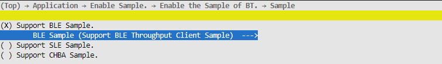

    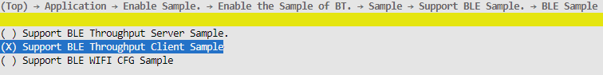

2.  完成配置后执行命令python3 build.py  ws63-liteos-app，将生成的镜像通过BurnTool烧录进单板中。

**sample使用<a name="section193796588269"></a>**

1.  扫描：sample会在首次运行、断连时自动启动扫描，在连接后停止扫描。用户可在ble\_gatt\_client\_scan\_result\_cbk接口中处理扫描到的蓝牙设备，每扫描到一个BLE设备都会回调一次ble\_gatt\_client\_scan\_result\_cbk接口。
2.  连接：可在扫描到蓝牙设备时，使用gap\_ble\_connect\_remote\_device接口连接对端设备，**不要求必须在ble\_gatt\_client\_scan\_result\_cbk接口中连接对端蓝牙设备，但需要保证对端蓝牙设备正在发广播**。连接状态的改变会在ble\_gatt\_client\_conn\_state\_change\_cbk回调中上报，当前sample会在连接后停止扫描、配对、服务发现等操作。
3.  数据发送：可以调用gattc\_write\_req或者gattc\_write\_cmd接口发送数据给server。
4.  数据接收：在ble\_gatt\_client\_notification\_cbk回调或者ble\_gatt\_client\_indication\_cbk回调中处理接收到的server数据。

> **说明：** 
>对于回调中的入参，不需要主动释放内存，回调结束后，协议栈自身会进行释放。

#### ble\_speed\_server使用指导<a name="ZH-CN_TOPIC_0000002164274546"></a>

**sample编译<a name="section143574111"></a>**

1.  在SDK根目录下执行命令“python3 build.py  ws63-liteos-app menuconfig”，并按下图配置对应编译选项进行配置。

    

    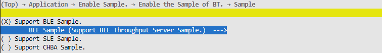

    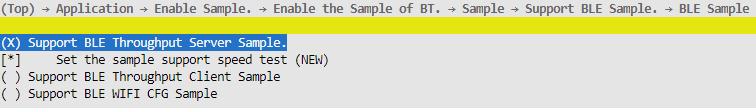

2.  完成配置后执行命令python3 build.py  ws63-liteos-app，将生成的镜像通过BurnTool烧录进单板中。

**sample使用<a name="section19522154454414"></a>**

默认编译选项时，ble\_speed\_server sample会自动打流测速。用户也可在配置编译选项时，**取消选择Set the sample support speed test**，使sample将收到的数据自动发回给client以验证**数据互通**。

具体使用nRF Connect工具进行连接测试，下载连接为"https://github.com/NordicSemiconductor/Android-nRF-Connect"。

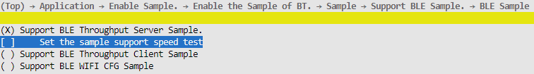

1.  启动广播：调用ble\_start\_adv接口启动广播。当前sample会在首次运行、server非主动断连时自动启动广播。
2.  停止广播：连接后会自动停止广播，并在ble\_uuid\_server\_adv\_terminate\_cbk中上报。
3.  接收数据：在ble\_uuid\_server\_receive\_write\_req\_cbk接口中处理client发送的数据。
4.  发送数据：调用ble\_uuid\_server\_send\_report\_by\_handle或者ble\_uuid\_server\_send\_report\_by\_uuid接口发送数据。并**不要求server向client发送数据必须在ble\_uuid\_server\_receive\_write\_req\_cbk中进行**。
5.  自定义服务、特征设置：自定义服务、特征、描述符的UUID定义在"ble\_speed\_server/inc/ble\_speed\_server.h"中。当前sample定义了一个私有服务BLE\_UUID\_UUID\_SERVER\_SERVICE，该服务下面存在一个特征BLE\_UUID\_UUID\_SERVER\_REPORT。UUID需要根据客户自身需求更改。UUID的详细介绍如下所示。

**表 1**  server UUID介绍

<a name="table27521825165016"></a>
<table><thead align="left"><tr id="row575282545013"><th class="cellrowborder" valign="top" width="44.91%" id="mcps1.2.4.1.1"><p id="p063916414519"><a name="p063916414519"></a><a name="p063916414519"></a>名称</p>
</th>
<th class="cellrowborder" valign="top" width="26.06%" id="mcps1.2.4.1.2"><p id="p675292565013"><a name="p675292565013"></a><a name="p675292565013"></a>介绍</p>
</th>
<th class="cellrowborder" valign="top" width="29.03%" id="mcps1.2.4.1.3"><p id="p1851311872920"><a name="p1851311872920"></a><a name="p1851311872920"></a>sample默认值</p>
</th>
</tr>
</thead>
<tbody><tr id="row675217253508"><td class="cellrowborder" valign="top" width="44.91%" headers="mcps1.2.4.1.1 "><p id="p12691334135016"><a name="p12691334135016"></a><a name="p12691334135016"></a>BLE_UUID_UUID_SERVER_SERVICE</p>
</td>
<td class="cellrowborder" valign="top" width="26.06%" headers="mcps1.2.4.1.2 "><p id="p3752172517502"><a name="p3752172517502"></a><a name="p3752172517502"></a>服务UUID</p>
</td>
<td class="cellrowborder" valign="top" width="29.03%" headers="mcps1.2.4.1.3 "><p id="p19513111816298"><a name="p19513111816298"></a><a name="p19513111816298"></a>0xABCD</p>
</td>
</tr>
<tr id="row147520251505"><td class="cellrowborder" valign="top" width="44.91%" headers="mcps1.2.4.1.1 "><p id="p318094285017"><a name="p318094285017"></a><a name="p318094285017"></a>BLE_UUID_UUID_SERVER_REPORT</p>
</td>
<td class="cellrowborder" valign="top" width="26.06%" headers="mcps1.2.4.1.2 "><p id="p67521625115017"><a name="p67521625115017"></a><a name="p67521625115017"></a>特征UUID</p>
</td>
<td class="cellrowborder" valign="top" width="29.03%" headers="mcps1.2.4.1.3 "><p id="p349724552911"><a name="p349724552911"></a><a name="p349724552911"></a>0xCDEF</p>
</td>
</tr>
</tbody>
</table>

若UUID的**16**字节全为自定义的（比如为ABCDEFGH-IJKL-MNOP-QRST-UVWXYZ012345），需要在UUID注册时，参考下面代码将字节数组转换为bt\_uuid\_t。

```
void stream_data_to_uuid(bt_uuid_t *out_uuid)
{   
    char uuids[] = {0x45, 0x23, 0x01, 0xYZ, 0xWX, 0xUV, 0xST, 0xQR, 0xOP, 0xMN, 0xKL, 0xIJ, 0xGH, 0xEF, 0xCD, 0xAB}; 
    out_uuid->uuid_len = 16; 
    if (memcpy_s(out_uuid->uuid, out_uuid->uuid_len, uuids, 16) != EOK) {       
        return;   
    }
}
```

用户可根据自身需求更改特征的properties，具体枚举定义在"bts\_gatt\_stru.h"的gatt\_characteristic\_property\_t中。

此外，**默认的MTU大小为23字节，若数传的数据长度超过20字节（其中3字节为GATT包头），需要客户端主动发起MTU协商**。

> **说明：** 
>对于回调中的入参，不需要主动释放内存，回调结束后，协议栈自身会进行释放。

#### 注意事项<a name="ZH-CN_TOPIC_0000002199595301"></a>

异常断连时，需要重启广播以及重启扫描，以保证业务在干扰场景下能够尽可能自愈（建议在**断连原因为非本端断链、**以及**配对失败**时需要自愈）。

## 星闪开发流程<a name="ZH-CN_TOPIC_0000001717509128"></a>


### 概述<a name="ZH-CN_TOPIC_0000001717668580"></a>

WS63V100通过API（Application Programming Interface）面向开发者提供SLE功能的开发和应用接口，包括Device Discovery, Connection Manager, SSAP等。

各组件功能说明如下：

-   Device Discovery：星闪设备发现协议，包括设备管理、设备公开和设备发现接口。
-   Connection Manager：星闪连接管理协议，包括设备连接、配对相关接口。
-   SSAP：星闪服务交互协议（SparkLink Service Access Protocol），包含服务注册、服务发现、属性数据读写等功能相关接口。
-   Low Latency：低时延初始化和低时延数据收发接口。

    > **说明：** 
    >该文档描述各个模块功能的基本流程和API接口描述。

### Device Discovery接口<a name="ZH-CN_TOPIC_0000001765309185"></a>


#### 概述<a name="ZH-CN_TOPIC_0000001717509132"></a>

Device Discovery接口是星闪设备发现协议的软件实现，主要功能有SLE设备开关、设备管理、设备公开和设备发现。

#### 开发流程<a name="ZH-CN_TOPIC_0000001717668584"></a>

**使用场景<a name="section9238112152618"></a>**

打开SLE设备开关是使用SLE功能的首要条件，SLE启动后可进行设备信息管理，包括获取与设置本地设备名称、获取与设置本地设备地址和设置本地设备外观。

-   当SLE设备需要进行设备公开时，可先设置设备公开参数、设备公开数据，然后使能设备公开。
-   当SLE设备需要进行设备发现时，可先设置设备发现参数，然后使能设备发现，并通过回调函数观察发现到的设备公开数据包。

**功能<a name="section37062510263"></a>**

Device Discovery提供的接口如下表所示。

<a name="table2053885392615"></a>
<table><thead align="left"><tr id="row15571105319268"><th class="cellrowborder" valign="top" width="22.447755224477554%" id="mcps1.1.5.1.1"><p id="p155715537261"><a name="p155715537261"></a><a name="p155715537261"></a>接口名称</p>
</th>
<th class="cellrowborder" valign="top" width="17.348265173482652%" id="mcps1.1.5.1.2"><p id="p16571953172612"><a name="p16571953172612"></a><a name="p16571953172612"></a>描述</p>
</th>
<th class="cellrowborder" valign="top" width="29.967003299670036%" id="mcps1.1.5.1.3"><p id="p195711753122611"><a name="p195711753122611"></a><a name="p195711753122611"></a>参数说明</p>
</th>
<th class="cellrowborder" valign="top" width="30.23697630236976%" id="mcps1.1.5.1.4"><p id="p5571185352620"><a name="p5571185352620"></a><a name="p5571185352620"></a>返回信息说明</p>
</th>
</tr>
</thead>
<tbody><tr id="row105711253182613"><td class="cellrowborder" valign="top" width="22.447755224477554%" headers="mcps1.1.5.1.1 "><p id="p1457145311261"><a name="p1457145311261"></a><a name="p1457145311261"></a>enable_sle</p>
</td>
<td class="cellrowborder" valign="top" width="17.348265173482652%" headers="mcps1.1.5.1.2 "><p id="p145712534266"><a name="p145712534266"></a><a name="p145712534266"></a>使能SLE。</p>
</td>
<td class="cellrowborder" valign="top" width="29.967003299670036%" headers="mcps1.1.5.1.3 "><p id="p457135310267"><a name="p457135310267"></a><a name="p457135310267"></a>-</p>
</td>
<td class="cellrowborder" valign="top" width="30.23697630236976%" headers="mcps1.1.5.1.4 "><p id="p125717539263"><a name="p125717539263"></a><a name="p125717539263"></a>接口返回值：错误码。</p>
</td>
</tr>
<tr id="row105711153172611"><td class="cellrowborder" valign="top" width="22.447755224477554%" headers="mcps1.1.5.1.1 "><p id="p85713534262"><a name="p85713534262"></a><a name="p85713534262"></a>disable_sle</p>
</td>
<td class="cellrowborder" valign="top" width="17.348265173482652%" headers="mcps1.1.5.1.2 "><p id="p1457195317264"><a name="p1457195317264"></a><a name="p1457195317264"></a>去使能SLE。</p>
</td>
<td class="cellrowborder" valign="top" width="29.967003299670036%" headers="mcps1.1.5.1.3 "><p id="p1557165318261"><a name="p1557165318261"></a><a name="p1557165318261"></a>-</p>
</td>
<td class="cellrowborder" valign="top" width="30.23697630236976%" headers="mcps1.1.5.1.4 "><p id="p75711753162616"><a name="p75711753162616"></a><a name="p75711753162616"></a>接口返回值：错误码。</p>
</td>
</tr>
<tr id="row978163515568"><td class="cellrowborder" valign="top" width="22.447755224477554%" headers="mcps1.1.5.1.1 "><p id="p178153575615"><a name="p178153575615"></a><a name="p178153575615"></a>get_dev_addr</p>
</td>
<td class="cellrowborder" valign="top" width="17.348265173482652%" headers="mcps1.1.5.1.2 "><p id="p1078153515561"><a name="p1078153515561"></a><a name="p1078153515561"></a>从eFuse或者NV中获取SLE mac地址</p>
</td>
<td class="cellrowborder" valign="top" width="29.967003299670036%" headers="mcps1.1.5.1.3 "><p id="p7220933164219"><a name="p7220933164219"></a><a name="p7220933164219"></a>pc_addr:获取mac地址存放的指针；</p>
<p id="p127819357566"><a name="p127819357566"></a><a name="p127819357566"></a>addr_len：mac 长度；</p>
<p id="p82617134012"><a name="p82617134012"></a><a name="p82617134012"></a>type：sle传入IFTYPE_SLE 0xF2。</p>
</td>
<td class="cellrowborder" valign="top" width="30.23697630236976%" headers="mcps1.1.5.1.4 "><p id="p778219356560"><a name="p778219356560"></a><a name="p778219356560"></a>接口返回值：</p>
<p id="p6427174816016"><a name="p6427174816016"></a><a name="p6427174816016"></a>ERROCODE_SUCC 0</p>
<p id="p7427164816013"><a name="p7427164816013"></a><a name="p7427164816013"></a>ERROCODE_FAIL 0xFFFFFFFF</p>
</td>
</tr>
<tr id="row1557155322618"><td class="cellrowborder" valign="top" width="22.447755224477554%" headers="mcps1.1.5.1.1 "><p id="p195716536263"><a name="p195716536263"></a><a name="p195716536263"></a>sle_set_local_addr</p>
</td>
<td class="cellrowborder" valign="top" width="17.348265173482652%" headers="mcps1.1.5.1.2 "><p id="p135711553102611"><a name="p135711553102611"></a><a name="p135711553102611"></a>设置本地设备地址。</p>
</td>
<td class="cellrowborder" valign="top" width="29.967003299670036%" headers="mcps1.1.5.1.3 "><p id="p15711253142612"><a name="p15711253142612"></a><a name="p15711253142612"></a>addr：本地设备地址；</p>
<p id="p133318524910"><a name="p133318524910"></a><a name="p133318524910"></a>注: 若需使用NV或eFuse里的地址, 调用'get_dev_addr'接口获取当前已存储的地址, 然后调用本接口将地址设置到BTH与BTC。</p>
</td>
<td class="cellrowborder" valign="top" width="30.23697630236976%" headers="mcps1.1.5.1.4 "><p id="p2571145316266"><a name="p2571145316266"></a><a name="p2571145316266"></a>接口返回值：错误码。</p>
</td>
</tr>
<tr id="row185711353192615"><td class="cellrowborder" valign="top" width="22.447755224477554%" headers="mcps1.1.5.1.1 "><p id="p4571135313261"><a name="p4571135313261"></a><a name="p4571135313261"></a>sle_get_local_addr</p>
</td>
<td class="cellrowborder" valign="top" width="17.348265173482652%" headers="mcps1.1.5.1.2 "><p id="p757195313265"><a name="p757195313265"></a><a name="p757195313265"></a>获取本地设备地址。</p>
</td>
<td class="cellrowborder" valign="top" width="29.967003299670036%" headers="mcps1.1.5.1.3 "><p id="p205711153102612"><a name="p205711153102612"></a><a name="p205711153102612"></a>addr：[out]本地设备地址。</p>
</td>
<td class="cellrowborder" valign="top" width="30.23697630236976%" headers="mcps1.1.5.1.4 "><p id="p85711353142610"><a name="p85711353142610"></a><a name="p85711353142610"></a>接口返回值：错误码。</p>
</td>
</tr>
<tr id="row17571175320266"><td class="cellrowborder" valign="top" width="22.447755224477554%" headers="mcps1.1.5.1.1 "><p id="p15711253182617"><a name="p15711253182617"></a><a name="p15711253182617"></a>sle_set_local_name</p>
</td>
<td class="cellrowborder" valign="top" width="17.348265173482652%" headers="mcps1.1.5.1.2 "><p id="p17571175310262"><a name="p17571175310262"></a><a name="p17571175310262"></a>设置本地设备名称。</p>
</td>
<td class="cellrowborder" valign="top" width="29.967003299670036%" headers="mcps1.1.5.1.3 "><p id="p195711353152618"><a name="p195711353152618"></a><a name="p195711353152618"></a>name：本地设备名称；</p>
<p id="p8571105311265"><a name="p8571105311265"></a><a name="p8571105311265"></a>len：本地设备名称长度。</p>
</td>
<td class="cellrowborder" valign="top" width="30.23697630236976%" headers="mcps1.1.5.1.4 "><p id="p15711353112615"><a name="p15711353112615"></a><a name="p15711353112615"></a>接口返回值：错误码。</p>
</td>
</tr>
<tr id="row17571155342615"><td class="cellrowborder" valign="top" width="22.447755224477554%" headers="mcps1.1.5.1.1 "><p id="p0571185392616"><a name="p0571185392616"></a><a name="p0571185392616"></a>sle_get_local_name</p>
</td>
<td class="cellrowborder" valign="top" width="17.348265173482652%" headers="mcps1.1.5.1.2 "><p id="p65714538262"><a name="p65714538262"></a><a name="p65714538262"></a>获取本地设备名称。</p>
</td>
<td class="cellrowborder" valign="top" width="29.967003299670036%" headers="mcps1.1.5.1.3 "><p id="p17571175318269"><a name="p17571175318269"></a><a name="p17571175318269"></a>name：[out]本地设备名称；</p>
<p id="p1757110534263"><a name="p1757110534263"></a><a name="p1757110534263"></a>len：[inout]入参时为用户预留内存大小，出参时为本地设备名称长度。</p>
</td>
<td class="cellrowborder" valign="top" width="30.23697630236976%" headers="mcps1.1.5.1.4 "><p id="p35717539266"><a name="p35717539266"></a><a name="p35717539266"></a>接口返回值：错误码。</p>
</td>
</tr>
<tr id="row957155342614"><td class="cellrowborder" valign="top" width="22.447755224477554%" headers="mcps1.1.5.1.1 "><p id="p185714535263"><a name="p185714535263"></a><a name="p185714535263"></a>sle_set_announce_data</p>
</td>
<td class="cellrowborder" valign="top" width="17.348265173482652%" headers="mcps1.1.5.1.2 "><p id="p13571145372613"><a name="p13571145372613"></a><a name="p13571145372613"></a>设置设备公开数据。</p>
</td>
<td class="cellrowborder" valign="top" width="29.967003299670036%" headers="mcps1.1.5.1.3 "><p id="p1357105352615"><a name="p1357105352615"></a><a name="p1357105352615"></a>announce_id：设备公开ID；</p>
<p id="p45728530263"><a name="p45728530263"></a><a name="p45728530263"></a>data：设备公开数据。</p>
</td>
<td class="cellrowborder" valign="top" width="30.23697630236976%" headers="mcps1.1.5.1.4 "><p id="p2572165342613"><a name="p2572165342613"></a><a name="p2572165342613"></a>接口返回值：错误码。</p>
</td>
</tr>
<tr id="row157235310260"><td class="cellrowborder" valign="top" width="22.447755224477554%" headers="mcps1.1.5.1.1 "><p id="p155721753112614"><a name="p155721753112614"></a><a name="p155721753112614"></a>sle_set_announce_param</p>
</td>
<td class="cellrowborder" valign="top" width="17.348265173482652%" headers="mcps1.1.5.1.2 "><p id="p857215332610"><a name="p857215332610"></a><a name="p857215332610"></a>设置设备公开参数。</p>
</td>
<td class="cellrowborder" valign="top" width="29.967003299670036%" headers="mcps1.1.5.1.3 "><p id="p2572125372617"><a name="p2572125372617"></a><a name="p2572125372617"></a>announce_id：设备公开ID；</p>
<p id="p1572165316268"><a name="p1572165316268"></a><a name="p1572165316268"></a>data：设备公开参数；</p>
<p id="p95052413415"><a name="p95052413415"></a><a name="p95052413415"></a>tx_power: 传入数值范围[-127, 20], 如传入127使用BTC默认的最大功率值。</p>
</td>
<td class="cellrowborder" valign="top" width="30.23697630236976%" headers="mcps1.1.5.1.4 "><p id="p19572105382619"><a name="p19572105382619"></a><a name="p19572105382619"></a>接口返回值：错误码。</p>
</td>
</tr>
<tr id="row45721553112618"><td class="cellrowborder" valign="top" width="22.447755224477554%" headers="mcps1.1.5.1.1 "><p id="p657255362611"><a name="p657255362611"></a><a name="p657255362611"></a>sle_start_announce</p>
</td>
<td class="cellrowborder" valign="top" width="17.348265173482652%" headers="mcps1.1.5.1.2 "><p id="p557235318262"><a name="p557235318262"></a><a name="p557235318262"></a>开始设备公开。</p>
</td>
<td class="cellrowborder" valign="top" width="29.967003299670036%" headers="mcps1.1.5.1.3 "><p id="p10572953142618"><a name="p10572953142618"></a><a name="p10572953142618"></a>announce_id：设备公开ID。</p>
</td>
<td class="cellrowborder" valign="top" width="30.23697630236976%" headers="mcps1.1.5.1.4 "><p id="p175721153122611"><a name="p175721153122611"></a><a name="p175721153122611"></a>接口返回值：错误码。</p>
</td>
</tr>
<tr id="row18572253182619"><td class="cellrowborder" valign="top" width="22.447755224477554%" headers="mcps1.1.5.1.1 "><p id="p257255302615"><a name="p257255302615"></a><a name="p257255302615"></a>sle_stop_announce</p>
</td>
<td class="cellrowborder" valign="top" width="17.348265173482652%" headers="mcps1.1.5.1.2 "><p id="p3572145312619"><a name="p3572145312619"></a><a name="p3572145312619"></a>停止设备公开。</p>
</td>
<td class="cellrowborder" valign="top" width="29.967003299670036%" headers="mcps1.1.5.1.3 "><p id="p2572953132612"><a name="p2572953132612"></a><a name="p2572953132612"></a>announce_id：设备公开ID。</p>
</td>
<td class="cellrowborder" valign="top" width="30.23697630236976%" headers="mcps1.1.5.1.4 "><p id="p7572353172612"><a name="p7572353172612"></a><a name="p7572353172612"></a>接口返回值：错误码。</p>
</td>
</tr>
<tr id="row25721653112615"><td class="cellrowborder" valign="top" width="22.447755224477554%" headers="mcps1.1.5.1.1 "><p id="p25721453182616"><a name="p25721453182616"></a><a name="p25721453182616"></a>sle_set_seek_param</p>
</td>
<td class="cellrowborder" valign="top" width="17.348265173482652%" headers="mcps1.1.5.1.2 "><p id="p0572853182616"><a name="p0572853182616"></a><a name="p0572853182616"></a>设置设备发现参数。</p>
</td>
<td class="cellrowborder" valign="top" width="29.967003299670036%" headers="mcps1.1.5.1.3 "><p id="p05721953102620"><a name="p05721953102620"></a><a name="p05721953102620"></a>param：设备发现参数。</p>
</td>
<td class="cellrowborder" valign="top" width="30.23697630236976%" headers="mcps1.1.5.1.4 "><p id="p7572553182613"><a name="p7572553182613"></a><a name="p7572553182613"></a>接口返回值：错误码。</p>
</td>
</tr>
<tr id="row757275392618"><td class="cellrowborder" valign="top" width="22.447755224477554%" headers="mcps1.1.5.1.1 "><p id="p15572553112618"><a name="p15572553112618"></a><a name="p15572553112618"></a>sle_start_seek</p>
</td>
<td class="cellrowborder" valign="top" width="17.348265173482652%" headers="mcps1.1.5.1.2 "><p id="p9572135316262"><a name="p9572135316262"></a><a name="p9572135316262"></a>开始设备发现。</p>
</td>
<td class="cellrowborder" valign="top" width="29.967003299670036%" headers="mcps1.1.5.1.3 "><p id="p165728534267"><a name="p165728534267"></a><a name="p165728534267"></a>-</p>
</td>
<td class="cellrowborder" valign="top" width="30.23697630236976%" headers="mcps1.1.5.1.4 "><p id="p13572155314260"><a name="p13572155314260"></a><a name="p13572155314260"></a>接口返回值：错误码。</p>
</td>
</tr>
<tr id="row1657225352613"><td class="cellrowborder" valign="top" width="22.447755224477554%" headers="mcps1.1.5.1.1 "><p id="p1157285310264"><a name="p1157285310264"></a><a name="p1157285310264"></a>sle_stop_seek</p>
</td>
<td class="cellrowborder" valign="top" width="17.348265173482652%" headers="mcps1.1.5.1.2 "><p id="p4572353202610"><a name="p4572353202610"></a><a name="p4572353202610"></a>停止设备发现。</p>
</td>
<td class="cellrowborder" valign="top" width="29.967003299670036%" headers="mcps1.1.5.1.3 "><p id="p155722536269"><a name="p155722536269"></a><a name="p155722536269"></a>-</p>
</td>
<td class="cellrowborder" valign="top" width="30.23697630236976%" headers="mcps1.1.5.1.4 "><p id="p1357235313266"><a name="p1357235313266"></a><a name="p1357235313266"></a>接口返回值：错误码。</p>
</td>
</tr>
<tr id="row1557245318268"><td class="cellrowborder" valign="top" width="22.447755224477554%" headers="mcps1.1.5.1.1 "><p id="p1457213533263"><a name="p1457213533263"></a><a name="p1457213533263"></a>sle_announce_seek_register_callbacks</p>
</td>
<td class="cellrowborder" valign="top" width="17.348265173482652%" headers="mcps1.1.5.1.2 "><p id="p5572553162619"><a name="p5572553162619"></a><a name="p5572553162619"></a>注册设备公开和设备发现回调函数。</p>
</td>
<td class="cellrowborder" valign="top" width="29.967003299670036%" headers="mcps1.1.5.1.3 "><p id="p457295319268"><a name="p457295319268"></a><a name="p457295319268"></a>func：用户回调函数。</p>
</td>
<td class="cellrowborder" valign="top" width="30.23697630236976%" headers="mcps1.1.5.1.4 "><p id="p1057225313268"><a name="p1057225313268"></a><a name="p1057225313268"></a>接口返回值：错误码。</p>
</td>
</tr>
</tbody>
</table>

**开发流程<a name="section1145313792718"></a>**

Device Discovery开发的典型流程如下，具体编程实例可参考application/samples/bt。

**Terminal Node：**

1.  调用enable\_sle，打开SLE开关。
2.  调用sle\_announce\_seek\_register\_callbacks，注册设备公开和设备发现回调函数。
3.  调用sle\_set\_local\_addr，设置本地设备地址。
4.  调用sle\_set\_local\_name，设置本地设备名称。
5.  调用sle\_set\_announce\_param，设置设备公开参数
6.  调用sle\_set\_announce\_data，设置设备公开数据
7.  调用sle\_start\_announce，启动设备公开。

**Grant Node：**

1.  调用enable\_sle，打开SLE开关。
2.  调用sle\_announce\_seek\_register\_callbacks，注册设备公开和设备发现回调函数。
3.  调用sle\_set\_local\_addr，设置本地设备地址。
4.  调用sle\_set\_local\_name，设置本地设备名称。
5.  调用sle\_set\_seek\_param，设置设备发现参数。
6.  调用sle\_start\_seek，启动设备发现，并在回调函数中获得正在进行设备公开的设备信息。

#### 注意事项<a name="ZH-CN_TOPIC_0000001765468433"></a>

-   WS63V100支持8路星闪连接，可同时作为BLE和星闪设备工作。
-   若扫描不到设备，请先检查设备是否已在配对设备列表中，或者设备是否已与其他设备配对（此情况下需要先清除设备端配对信息）。

### Connection Manager接口<a name="ZH-CN_TOPIC_0000001765309189"></a>


#### 概述<a name="ZH-CN_TOPIC_0000001717509136"></a>

Connection Manager接口是星闪连接管理协议的软件实现，主要功能有连接、配对和读远端设备RSSI值。

#### 开发流程<a name="ZH-CN_TOPIC_0000001717668588"></a>

**使用场景<a name="section644715301351"></a>**

当设备需要与对端设备建立连接时，可向对端设备发起连接请求。在连接过程中，设备可读取远端设备RSSI值，当设备需要更新连接参数时，可向对端设备发起连接参数更新请求，当设备需要与对端设备配对时，可向对端设备发起配对请求。在配对过程中，可获取当前本端设备与指定对端设备的配对状态。设备可获取当前配对设备数量以及当前配对设备信息链表。

**功能<a name="section185719350352"></a>**

Connection Manager提供的接口如下表所示。

<a name="table7681195573511"></a>
<table><thead align="left"><tr id="row1871635553517"><th class="cellrowborder" valign="top" width="15.310000000000002%" id="mcps1.1.5.1.1"><p id="p1771617557353"><a name="p1771617557353"></a><a name="p1771617557353"></a>接口名称</p>
</th>
<th class="cellrowborder" valign="top" width="33.67%" id="mcps1.1.5.1.2"><p id="p1171635514357"><a name="p1171635514357"></a><a name="p1171635514357"></a>描述</p>
</th>
<th class="cellrowborder" valign="top" width="27.55%" id="mcps1.1.5.1.3"><p id="p5716455173520"><a name="p5716455173520"></a><a name="p5716455173520"></a>参数说明</p>
</th>
<th class="cellrowborder" valign="top" width="23.47%" id="mcps1.1.5.1.4"><p id="p117161555203519"><a name="p117161555203519"></a><a name="p117161555203519"></a>返回信息说明</p>
</th>
</tr>
</thead>
<tbody><tr id="row11716195518357"><td class="cellrowborder" valign="top" width="15.310000000000002%" headers="mcps1.1.5.1.1 "><p id="p3716355113511"><a name="p3716355113511"></a><a name="p3716355113511"></a>sle_connect_remote_device</p>
</td>
<td class="cellrowborder" valign="top" width="33.67%" headers="mcps1.1.5.1.2 "><p id="p471617557359"><a name="p471617557359"></a><a name="p471617557359"></a>向对端设备发起连接请求。</p>
</td>
<td class="cellrowborder" valign="top" width="27.55%" headers="mcps1.1.5.1.3 "><p id="p871645514354"><a name="p871645514354"></a><a name="p871645514354"></a>addr：对端设备地址。</p>
</td>
<td class="cellrowborder" valign="top" width="23.47%" headers="mcps1.1.5.1.4 "><p id="p1671645573516"><a name="p1671645573516"></a><a name="p1671645573516"></a>接口返回值：错误码。</p>
</td>
</tr>
<tr id="row17716135516355"><td class="cellrowborder" valign="top" width="15.310000000000002%" headers="mcps1.1.5.1.1 "><p id="p167167557352"><a name="p167167557352"></a><a name="p167167557352"></a>sle_disconnect_remote_device</p>
</td>
<td class="cellrowborder" valign="top" width="33.67%" headers="mcps1.1.5.1.2 "><p id="p9716115519351"><a name="p9716115519351"></a><a name="p9716115519351"></a>向对端设备发起断连请求。</p>
</td>
<td class="cellrowborder" valign="top" width="27.55%" headers="mcps1.1.5.1.3 "><p id="p16716185510358"><a name="p16716185510358"></a><a name="p16716185510358"></a>addr：对端设备地址。</p>
</td>
<td class="cellrowborder" valign="top" width="23.47%" headers="mcps1.1.5.1.4 "><p id="p771695593515"><a name="p771695593515"></a><a name="p771695593515"></a>接口返回值：错误码。</p>
</td>
</tr>
<tr id="row13716145511358"><td class="cellrowborder" valign="top" width="15.310000000000002%" headers="mcps1.1.5.1.1 "><p id="p16716155523518"><a name="p16716155523518"></a><a name="p16716155523518"></a>sle_update_connect_param</p>
</td>
<td class="cellrowborder" valign="top" width="33.67%" headers="mcps1.1.5.1.2 "><p id="p2716115512352"><a name="p2716115512352"></a><a name="p2716115512352"></a>连接参数更新。</p>
</td>
<td class="cellrowborder" valign="top" width="27.55%" headers="mcps1.1.5.1.3 "><p id="p171635533511"><a name="p171635533511"></a><a name="p171635533511"></a>params：连接参数</p>
</td>
<td class="cellrowborder" valign="top" width="23.47%" headers="mcps1.1.5.1.4 "><p id="p197161455133518"><a name="p197161455133518"></a><a name="p197161455133518"></a>接口返回值：错误码。</p>
</td>
</tr>
<tr id="row107164556359"><td class="cellrowborder" valign="top" width="15.310000000000002%" headers="mcps1.1.5.1.1 "><p id="p2716155510354"><a name="p2716155510354"></a><a name="p2716155510354"></a>sle_pair_remote_device</p>
</td>
<td class="cellrowborder" valign="top" width="33.67%" headers="mcps1.1.5.1.2 "><p id="p1171616557350"><a name="p1171616557350"></a><a name="p1171616557350"></a>向对端设备发起配对请求。（目前星闪鉴权流程仅支持免输入模式）</p>
</td>
<td class="cellrowborder" valign="top" width="27.55%" headers="mcps1.1.5.1.3 "><p id="p14716145512356"><a name="p14716145512356"></a><a name="p14716145512356"></a>addr：对端设备地址。</p>
</td>
<td class="cellrowborder" valign="top" width="23.47%" headers="mcps1.1.5.1.4 "><p id="p1871645533513"><a name="p1871645533513"></a><a name="p1871645533513"></a>接口返回值：错误码。</p>
</td>
</tr>
<tr id="row471645517356"><td class="cellrowborder" valign="top" width="15.310000000000002%" headers="mcps1.1.5.1.1 "><p id="p5716205513519"><a name="p5716205513519"></a><a name="p5716205513519"></a>sle_remove_paired_remote_device</p>
</td>
<td class="cellrowborder" valign="top" width="33.67%" headers="mcps1.1.5.1.2 "><p id="p6716655153516"><a name="p6716655153516"></a><a name="p6716655153516"></a>与对端设备取消配对。</p>
</td>
<td class="cellrowborder" valign="top" width="27.55%" headers="mcps1.1.5.1.3 "><p id="p971665593515"><a name="p971665593515"></a><a name="p971665593515"></a>addr：对端设备地址。</p>
</td>
<td class="cellrowborder" valign="top" width="23.47%" headers="mcps1.1.5.1.4 "><p id="p571612554355"><a name="p571612554355"></a><a name="p571612554355"></a>接口返回值：错误码。</p>
</td>
</tr>
<tr id="row12716165519351"><td class="cellrowborder" valign="top" width="15.310000000000002%" headers="mcps1.1.5.1.1 "><p id="p13717195563520"><a name="p13717195563520"></a><a name="p13717195563520"></a>sle_remove_all_pairs</p>
</td>
<td class="cellrowborder" valign="top" width="33.67%" headers="mcps1.1.5.1.2 "><p id="p18717135518356"><a name="p18717135518356"></a><a name="p18717135518356"></a>取消与所有对端设备的配对。</p>
</td>
<td class="cellrowborder" valign="top" width="27.55%" headers="mcps1.1.5.1.3 "><p id="p571719551356"><a name="p571719551356"></a><a name="p571719551356"></a>-</p>
</td>
<td class="cellrowborder" valign="top" width="23.47%" headers="mcps1.1.5.1.4 "><p id="p13717105520351"><a name="p13717105520351"></a><a name="p13717105520351"></a>接口返回值：错误码。</p>
</td>
</tr>
<tr id="row1571712551357"><td class="cellrowborder" valign="top" width="15.310000000000002%" headers="mcps1.1.5.1.1 "><p id="p1971715516355"><a name="p1971715516355"></a><a name="p1971715516355"></a>sle_get_paired_devices_num</p>
</td>
<td class="cellrowborder" valign="top" width="33.67%" headers="mcps1.1.5.1.2 "><p id="p14717355143518"><a name="p14717355143518"></a><a name="p14717355143518"></a>获取配对设备数量。</p>
</td>
<td class="cellrowborder" valign="top" width="27.55%" headers="mcps1.1.5.1.3 "><p id="p8717855123510"><a name="p8717855123510"></a><a name="p8717855123510"></a>number：[out]配对设备数量。</p>
</td>
<td class="cellrowborder" valign="top" width="23.47%" headers="mcps1.1.5.1.4 "><p id="p197171855173511"><a name="p197171855173511"></a><a name="p197171855173511"></a>接口返回值：错误码。</p>
</td>
</tr>
<tr id="row1771735513358"><td class="cellrowborder" valign="top" width="15.310000000000002%" headers="mcps1.1.5.1.1 "><p id="p8717175533512"><a name="p8717175533512"></a><a name="p8717175533512"></a>sle_get_paired_devices</p>
</td>
<td class="cellrowborder" valign="top" width="33.67%" headers="mcps1.1.5.1.2 "><p id="p971795583520"><a name="p971795583520"></a><a name="p971795583520"></a>获取配对设备信息。</p>
</td>
<td class="cellrowborder" valign="top" width="27.55%" headers="mcps1.1.5.1.3 "><p id="p171735553510"><a name="p171735553510"></a><a name="p171735553510"></a>addr：[out]设备地址链表；</p>
<p id="p1871710553354"><a name="p1871710553354"></a><a name="p1871710553354"></a>number：[inout]入参时为用户预留内存大小，出参时为设备数量。</p>
</td>
<td class="cellrowborder" valign="top" width="23.47%" headers="mcps1.1.5.1.4 "><p id="p1171765517352"><a name="p1171765517352"></a><a name="p1171765517352"></a>接口返回值：错误码。</p>
</td>
</tr>
<tr id="row7717555123516"><td class="cellrowborder" valign="top" width="15.310000000000002%" headers="mcps1.1.5.1.1 "><p id="p11717175510352"><a name="p11717175510352"></a><a name="p11717175510352"></a>sle_get_pair_state</p>
</td>
<td class="cellrowborder" valign="top" width="33.67%" headers="mcps1.1.5.1.2 "><p id="p9717555133514"><a name="p9717555133514"></a><a name="p9717555133514"></a>获取配对状态。</p>
</td>
<td class="cellrowborder" valign="top" width="27.55%" headers="mcps1.1.5.1.3 "><p id="p771785553520"><a name="p771785553520"></a><a name="p771785553520"></a>addr：设备地址；</p>
<p id="p97173556357"><a name="p97173556357"></a><a name="p97173556357"></a>state：[out]配对状态。</p>
</td>
<td class="cellrowborder" valign="top" width="23.47%" headers="mcps1.1.5.1.4 "><p id="p10717355123511"><a name="p10717355123511"></a><a name="p10717355123511"></a>接口返回值：错误码。</p>
</td>
</tr>
<tr id="row47171557354"><td class="cellrowborder" valign="top" width="15.310000000000002%" headers="mcps1.1.5.1.1 "><p id="p97171355123510"><a name="p97171355123510"></a><a name="p97171355123510"></a>sle_read_remote_device_rssi</p>
</td>
<td class="cellrowborder" valign="top" width="33.67%" headers="mcps1.1.5.1.2 "><p id="p1571785514358"><a name="p1571785514358"></a><a name="p1571785514358"></a>读对端设备RSSI值。</p>
</td>
<td class="cellrowborder" valign="top" width="27.55%" headers="mcps1.1.5.1.3 "><p id="p0717115513510"><a name="p0717115513510"></a><a name="p0717115513510"></a>conn_id：连接id</p>
</td>
<td class="cellrowborder" valign="top" width="23.47%" headers="mcps1.1.5.1.4 "><p id="p9717125510354"><a name="p9717125510354"></a><a name="p9717125510354"></a>接口返回值：错误码。</p>
</td>
</tr>
<tr id="row271745543510"><td class="cellrowborder" valign="top" width="15.310000000000002%" headers="mcps1.1.5.1.1 "><p id="p19717175513357"><a name="p19717175513357"></a><a name="p19717175513357"></a>sle_connection_register_callbacks</p>
</td>
<td class="cellrowborder" valign="top" width="33.67%" headers="mcps1.1.5.1.2 "><p id="p17177554357"><a name="p17177554357"></a><a name="p17177554357"></a>注册连接管理回调函数。</p>
</td>
<td class="cellrowborder" valign="top" width="27.55%" headers="mcps1.1.5.1.3 "><p id="p197175556351"><a name="p197175556351"></a><a name="p197175556351"></a>func：用户回调函数。</p>
</td>
<td class="cellrowborder" valign="top" width="23.47%" headers="mcps1.1.5.1.4 "><p id="p6717105533512"><a name="p6717105533512"></a><a name="p6717105533512"></a>接口返回值：错误码。</p>
</td>
</tr>
</tbody>
</table>

**开发流程<a name="section957718620361"></a>**

Connection Manager开发的典型流程如下，具体编程实例可参考application/samples/bt。

**Terminal Node：**

1.  调用enable\_sle，打开SLE开关。
2.  调用sle\_announce\_seek\_register\_callbacks，注册设备公开和设备发现回调函数。
3.  调用sle\_connection\_register\_callbacks，注册连接管理回调函数。
4.  调用sle\_set\_local\_addr，设置本地设备地址。
5.  调用sle\_set\_local\_name，设置本地设备名称。
6.  调用sle\_set\_announce\_param，设置设备公开参数
7.  调用sle\_set\_announce\_data，设置设备公开数据
8.  调用sle\_start\_announce，启动设备公开。

**Grant Node：**

1.  调用enable\_sle，打开SLE开关。
2.  调用sle\_announce\_seek\_register\_callbacks，注册设备公开和设备发现回调函数。
3.  调用sle\_connection\_register\_callbacks，注册连接管理回调函数。
4.  调用sle\_set\_local\_addr，设置本地设备地址。
5.  调用sle\_set\_local\_name，设置本地设备名称。
6.  调用sle\_set\_seek\_param，设置设备发现参数。
7.  调用sle\_start\_seek，启动设备发现，并在回调函数中获得正在进行设备公开的设备信息。
8.  调用sle\_connect\_remote\_device，向对端设备发起连接请求。
9.  调用sle\_pair\_remote\_device，向对端设备发起配对请求。
10. 调用sle\_get\_paired\_devices\_num，获取当前配对设备数量。
11. 调用sle\_get\_paired\_devices，获取当前配对设备信息。
12. 调用sle\_get\_pair\_state，获取配对状态。

### SSAP server接口<a name="ZH-CN_TOPIC_0000001765468437"></a>


#### 概述<a name="ZH-CN_TOPIC_0000001765309193"></a>

SSAP是SLE发送和接收数据的通用规范，支持在两个SLE设备间进行数据传输。

#### 开发流程<a name="ZH-CN_TOPIC_0000001717509140"></a>

**使用场景<a name="section367314279371"></a>**

SSAP Server主要接收对端的请求和命令，向对端发送响应、通知和指示。

**功能<a name="section3464143253714"></a>**

SSAP Server提供的接口如下表所示。

<a name="table13626135163813"></a>
<table><thead align="left"><tr id="row18685135153815"><th class="cellrowborder" valign="top" width="15.310000000000002%" id="mcps1.1.5.1.1"><p id="p10685658385"><a name="p10685658385"></a><a name="p10685658385"></a>接口名称</p>
</th>
<th class="cellrowborder" valign="top" width="33.67%" id="mcps1.1.5.1.2"><p id="p186851510383"><a name="p186851510383"></a><a name="p186851510383"></a>描述</p>
</th>
<th class="cellrowborder" valign="top" width="27.55%" id="mcps1.1.5.1.3"><p id="p136853553819"><a name="p136853553819"></a><a name="p136853553819"></a>参数说明</p>
</th>
<th class="cellrowborder" valign="top" width="23.47%" id="mcps1.1.5.1.4"><p id="p2685058389"><a name="p2685058389"></a><a name="p2685058389"></a>返回信息说明</p>
</th>
</tr>
</thead>
<tbody><tr id="row8685959385"><td class="cellrowborder" valign="top" width="15.310000000000002%" headers="mcps1.1.5.1.1 "><p id="p368575153814"><a name="p368575153814"></a><a name="p368575153814"></a>ssaps_register_server</p>
</td>
<td class="cellrowborder" valign="top" width="33.67%" headers="mcps1.1.5.1.2 "><p id="p1568519543810"><a name="p1568519543810"></a><a name="p1568519543810"></a>注册SSAP server。</p>
<p id="p1768513513812"><a name="p1768513513812"></a><a name="p1768513513812"></a><strong id="b19685857387"><a name="b19685857387"></a><a name="b19685857387"></a>注：目前只支持注册一个SSAP  server。</strong></p>
</td>
<td class="cellrowborder" valign="top" width="27.55%" headers="mcps1.1.5.1.3 "><p id="p76852523815"><a name="p76852523815"></a><a name="p76852523815"></a>app_uuid：应用UUID指针；</p>
<p id="p10685145133816"><a name="p10685145133816"></a><a name="p10685145133816"></a>server_id：[out] server id指针。</p>
</td>
<td class="cellrowborder" valign="top" width="23.47%" headers="mcps1.1.5.1.4 "><p id="p068519533812"><a name="p068519533812"></a><a name="p068519533812"></a>接口返回值：错误码。</p>
</td>
</tr>
<tr id="row5685955388"><td class="cellrowborder" valign="top" width="15.310000000000002%" headers="mcps1.1.5.1.1 "><p id="p19685752387"><a name="p19685752387"></a><a name="p19685752387"></a>ssaps_unregister_server</p>
</td>
<td class="cellrowborder" valign="top" width="33.67%" headers="mcps1.1.5.1.2 "><p id="p1668510553819"><a name="p1668510553819"></a><a name="p1668510553819"></a>注销SSAP server。</p>
</td>
<td class="cellrowborder" valign="top" width="27.55%" headers="mcps1.1.5.1.3 "><p id="p76859516389"><a name="p76859516389"></a><a name="p76859516389"></a>server_id：server id。</p>
</td>
<td class="cellrowborder" valign="top" width="23.47%" headers="mcps1.1.5.1.4 "><p id="p5685145163818"><a name="p5685145163818"></a><a name="p5685145163818"></a>接口返回值：错误码。</p>
</td>
</tr>
<tr id="row1768520573818"><td class="cellrowborder" valign="top" width="15.310000000000002%" headers="mcps1.1.5.1.1 "><p id="p1068515573815"><a name="p1068515573815"></a><a name="p1068515573815"></a>ssaps_add_service</p>
</td>
<td class="cellrowborder" valign="top" width="33.67%" headers="mcps1.1.5.1.2 "><p id="p12685185183817"><a name="p12685185183817"></a><a name="p12685185183817"></a>添加服务。</p>
</td>
<td class="cellrowborder" valign="top" width="27.55%" headers="mcps1.1.5.1.3 "><p id="p06854511388"><a name="p06854511388"></a><a name="p06854511388"></a>server_id：server id</p>
<p id="p668555123817"><a name="p668555123817"></a><a name="p668555123817"></a>service_uuid：服务UUID；</p>
<p id="p96852057388"><a name="p96852057388"></a><a name="p96852057388"></a>is_primary：是否是首要服务。</p>
</td>
<td class="cellrowborder" valign="top" width="23.47%" headers="mcps1.1.5.1.4 "><p id="p26850514384"><a name="p26850514384"></a><a name="p26850514384"></a>接口返回值：错误码。</p>
</td>
</tr>
<tr id="row10685135133813"><td class="cellrowborder" valign="top" width="15.310000000000002%" headers="mcps1.1.5.1.1 "><p id="p206858563818"><a name="p206858563818"></a><a name="p206858563818"></a>ssaps_add_property</p>
</td>
<td class="cellrowborder" valign="top" width="33.67%" headers="mcps1.1.5.1.2 "><p id="p26859517382"><a name="p26859517382"></a><a name="p26859517382"></a>添加特征。</p>
</td>
<td class="cellrowborder" valign="top" width="27.55%" headers="mcps1.1.5.1.3 "><p id="p468525193817"><a name="p468525193817"></a><a name="p468525193817"></a>server_id：server id；</p>
<p id="p268516523818"><a name="p268516523818"></a><a name="p268516523818"></a>service_handle：服务句柄；</p>
<p id="p186851756389"><a name="p186851756389"></a><a name="p186851756389"></a>property：特征信息。</p>
</td>
<td class="cellrowborder" valign="top" width="23.47%" headers="mcps1.1.5.1.4 "><p id="p106852573813"><a name="p106852573813"></a><a name="p106852573813"></a>接口返回值：错误码。</p>
</td>
</tr>
<tr id="row1268525113812"><td class="cellrowborder" valign="top" width="15.310000000000002%" headers="mcps1.1.5.1.1 "><p id="p7686651388"><a name="p7686651388"></a><a name="p7686651388"></a>ssaps_add_descriptor</p>
</td>
<td class="cellrowborder" valign="top" width="33.67%" headers="mcps1.1.5.1.2 "><p id="p4686858387"><a name="p4686858387"></a><a name="p4686858387"></a>添加特征描述符。</p>
</td>
<td class="cellrowborder" valign="top" width="27.55%" headers="mcps1.1.5.1.3 "><p id="p468618515385"><a name="p468618515385"></a><a name="p468618515385"></a>server_id：server id；</p>
<p id="p668619513817"><a name="p668619513817"></a><a name="p668619513817"></a>service_handle：服务句柄；</p>
<p id="p2686955381"><a name="p2686955381"></a><a name="p2686955381"></a>property_handle：特征句柄；</p>
<p id="p2686353383"><a name="p2686353383"></a><a name="p2686353383"></a>descriptor：描述符信息。</p>
</td>
<td class="cellrowborder" valign="top" width="23.47%" headers="mcps1.1.5.1.4 "><p id="p168616553814"><a name="p168616553814"></a><a name="p168616553814"></a>接口返回值：错误码。</p>
</td>
</tr>
<tr id="row13686555386"><td class="cellrowborder" valign="top" width="15.310000000000002%" headers="mcps1.1.5.1.1 "><p id="p46862563816"><a name="p46862563816"></a><a name="p46862563816"></a>ssaps_add_service_sync</p>
</td>
<td class="cellrowborder" valign="top" width="33.67%" headers="mcps1.1.5.1.2 "><p id="p46869512388"><a name="p46869512388"></a><a name="p46869512388"></a>添加服务同步接口，服务句柄同步返回。</p>
</td>
<td class="cellrowborder" valign="top" width="27.55%" headers="mcps1.1.5.1.3 "><p id="p1368616520388"><a name="p1368616520388"></a><a name="p1368616520388"></a>server_id：server id。</p>
<p id="p176861523814"><a name="p176861523814"></a><a name="p176861523814"></a>service_uuid：服务UUID；</p>
<p id="p1568611553814"><a name="p1568611553814"></a><a name="p1568611553814"></a>is_primary：是否是首要服务；</p>
<p id="p46861250384"><a name="p46861250384"></a><a name="p46861250384"></a>handle：[out]服务句柄指针。</p>
</td>
<td class="cellrowborder" valign="top" width="23.47%" headers="mcps1.1.5.1.4 "><p id="p4686355389"><a name="p4686355389"></a><a name="p4686355389"></a>接口返回值：错误码。</p>
</td>
</tr>
<tr id="row19686756381"><td class="cellrowborder" valign="top" width="15.310000000000002%" headers="mcps1.1.5.1.1 "><p id="p1168620533817"><a name="p1168620533817"></a><a name="p1168620533817"></a>ssaps_add_property_sync</p>
</td>
<td class="cellrowborder" valign="top" width="33.67%" headers="mcps1.1.5.1.2 "><p id="p768612511389"><a name="p768612511389"></a><a name="p768612511389"></a>添加特征同步接口，特征句柄同步返回。</p>
</td>
<td class="cellrowborder" valign="top" width="27.55%" headers="mcps1.1.5.1.3 "><p id="p468610519386"><a name="p468610519386"></a><a name="p468610519386"></a>server_id：server id。</p>
<p id="p76862583817"><a name="p76862583817"></a><a name="p76862583817"></a>service_handle：服务句柄；</p>
<p id="p18686165163812"><a name="p18686165163812"></a><a name="p18686165163812"></a>property：特征；</p>
<p id="p96869519387"><a name="p96869519387"></a><a name="p96869519387"></a>handle：[out]特征句柄指针。</p>
</td>
<td class="cellrowborder" valign="top" width="23.47%" headers="mcps1.1.5.1.4 "><p id="p156863515387"><a name="p156863515387"></a><a name="p156863515387"></a>接口返回值：错误码。</p>
</td>
</tr>
<tr id="row66861552387"><td class="cellrowborder" valign="top" width="15.310000000000002%" headers="mcps1.1.5.1.1 "><p id="p36866510388"><a name="p36866510388"></a><a name="p36866510388"></a>ssaps_add_descriptor_sync</p>
</td>
<td class="cellrowborder" valign="top" width="33.67%" headers="mcps1.1.5.1.2 "><p id="p1686155143812"><a name="p1686155143812"></a><a name="p1686155143812"></a>添加特征描述符同步接口，特征描述符句柄同步返回。</p>
</td>
<td class="cellrowborder" valign="top" width="27.55%" headers="mcps1.1.5.1.3 "><p id="p2068685203812"><a name="p2068685203812"></a><a name="p2068685203812"></a>server_id：server id。</p>
<p id="p46862050387"><a name="p46862050387"></a><a name="p46862050387"></a>service_handle：服务句柄；</p>
<p id="p268665163813"><a name="p268665163813"></a><a name="p268665163813"></a>property_handle：特征句柄</p>
<p id="p668675173818"><a name="p668675173818"></a><a name="p668675173818"></a>descriptor：特征描述符；</p>
<p id="p66864518386"><a name="p66864518386"></a><a name="p66864518386"></a>handle：[out]特征描述符句柄指针。</p>
</td>
<td class="cellrowborder" valign="top" width="23.47%" headers="mcps1.1.5.1.4 "><p id="p2686165163820"><a name="p2686165163820"></a><a name="p2686165163820"></a>接口返回值：错误码。</p>
</td>
</tr>
<tr id="row1686135103814"><td class="cellrowborder" valign="top" width="15.310000000000002%" headers="mcps1.1.5.1.1 "><p id="p106867519382"><a name="p106867519382"></a><a name="p106867519382"></a>ssaps_start_service</p>
</td>
<td class="cellrowborder" valign="top" width="33.67%" headers="mcps1.1.5.1.2 "><p id="p166861456382"><a name="p166861456382"></a><a name="p166861456382"></a>启动服务。</p>
</td>
<td class="cellrowborder" valign="top" width="27.55%" headers="mcps1.1.5.1.3 "><p id="p126868512384"><a name="p126868512384"></a><a name="p126868512384"></a>server_id：server id；</p>
<p id="p06867513381"><a name="p06867513381"></a><a name="p06867513381"></a>service_handle：服务句柄。</p>
</td>
<td class="cellrowborder" valign="top" width="23.47%" headers="mcps1.1.5.1.4 "><p id="p76869519384"><a name="p76869519384"></a><a name="p76869519384"></a>接口返回值：错误码。</p>
</td>
</tr>
<tr id="row26861754388"><td class="cellrowborder" valign="top" width="15.310000000000002%" headers="mcps1.1.5.1.1 "><p id="p2686752384"><a name="p2686752384"></a><a name="p2686752384"></a>ssaps_delete_all_services</p>
</td>
<td class="cellrowborder" valign="top" width="33.67%" headers="mcps1.1.5.1.2 "><p id="p15686105103819"><a name="p15686105103819"></a><a name="p15686105103819"></a>删除所有服务。</p>
</td>
<td class="cellrowborder" valign="top" width="27.55%" headers="mcps1.1.5.1.3 "><p id="p1068610517388"><a name="p1068610517388"></a><a name="p1068610517388"></a>server_id：server id。</p>
</td>
<td class="cellrowborder" valign="top" width="23.47%" headers="mcps1.1.5.1.4 "><p id="p16686756388"><a name="p16686756388"></a><a name="p16686756388"></a>接口返回值：错误码。</p>
</td>
</tr>
<tr id="row6686165193815"><td class="cellrowborder" valign="top" width="15.310000000000002%" headers="mcps1.1.5.1.1 "><p id="p268619515381"><a name="p268619515381"></a><a name="p268619515381"></a>ssaps_send_response</p>
</td>
<td class="cellrowborder" valign="top" width="33.67%" headers="mcps1.1.5.1.2 "><p id="p19686659386"><a name="p19686659386"></a><a name="p19686659386"></a>发送响应。</p>
</td>
<td class="cellrowborder" valign="top" width="27.55%" headers="mcps1.1.5.1.3 "><p id="p126864511389"><a name="p126864511389"></a><a name="p126864511389"></a>server_id：server id；</p>
<p id="p19686105173815"><a name="p19686105173815"></a><a name="p19686105173815"></a>conn_id：连接ID；</p>
<p id="p1268613517386"><a name="p1268613517386"></a><a name="p1268613517386"></a>param：响应参数。</p>
</td>
<td class="cellrowborder" valign="top" width="23.47%" headers="mcps1.1.5.1.4 "><p id="p1268655173819"><a name="p1268655173819"></a><a name="p1268655173819"></a>接口返回值：错误码。</p>
</td>
</tr>
<tr id="row166866533819"><td class="cellrowborder" valign="top" width="15.310000000000002%" headers="mcps1.1.5.1.1 "><p id="p7686185153819"><a name="p7686185153819"></a><a name="p7686185153819"></a>ssaps_notify_indicate</p>
</td>
<td class="cellrowborder" valign="top" width="33.67%" headers="mcps1.1.5.1.2 "><p id="p15686452381"><a name="p15686452381"></a><a name="p15686452381"></a>给对端发送通知或指示。明确下发数据的速率要大于连接间隔30%。</p>
</td>
<td class="cellrowborder" valign="top" width="27.55%" headers="mcps1.1.5.1.3 "><p id="p19686353381"><a name="p19686353381"></a><a name="p19686353381"></a>server_id：server id；</p>
<p id="p11686125163813"><a name="p11686125163813"></a><a name="p11686125163813"></a>conn_id：连接ID；</p>
<p id="p15686051382"><a name="p15686051382"></a><a name="p15686051382"></a>param：通知或指示参数。</p>
</td>
<td class="cellrowborder" valign="top" width="23.47%" headers="mcps1.1.5.1.4 "><p id="p268614593816"><a name="p268614593816"></a><a name="p268614593816"></a>接口返回值：错误码。</p>
</td>
</tr>
<tr id="row668619583814"><td class="cellrowborder" valign="top" width="15.310000000000002%" headers="mcps1.1.5.1.1 "><p id="p4686175183810"><a name="p4686175183810"></a><a name="p4686175183810"></a>ssaps_notify_indicate_by_uuid</p>
</td>
<td class="cellrowborder" valign="top" width="33.67%" headers="mcps1.1.5.1.2 "><p id="p7686195103812"><a name="p7686195103812"></a><a name="p7686195103812"></a>按照uuid给对端发送通知或指示。明确下发数据的速率要大于连接间隔30%。</p>
</td>
<td class="cellrowborder" valign="top" width="27.55%" headers="mcps1.1.5.1.3 "><p id="p20686195123811"><a name="p20686195123811"></a><a name="p20686195123811"></a>server_id：server id；</p>
<p id="p36861355388"><a name="p36861355388"></a><a name="p36861355388"></a>conn_id：连接ID；</p>
<p id="p11686185153817"><a name="p11686185153817"></a><a name="p11686185153817"></a>param：通知或指示参数。</p>
</td>
<td class="cellrowborder" valign="top" width="23.47%" headers="mcps1.1.5.1.4 "><p id="p5686195123817"><a name="p5686195123817"></a><a name="p5686195123817"></a>接口返回值：错误码。</p>
</td>
</tr>
<tr id="row166868503811"><td class="cellrowborder" valign="top" width="15.310000000000002%" headers="mcps1.1.5.1.1 "><p id="p1868655113816"><a name="p1868655113816"></a><a name="p1868655113816"></a>ssaps_set_info</p>
</td>
<td class="cellrowborder" valign="top" width="33.67%" headers="mcps1.1.5.1.2 "><p id="p968611514389"><a name="p968611514389"></a><a name="p968611514389"></a>在连接之前设置 server信息。</p>
</td>
<td class="cellrowborder" valign="top" width="27.55%" headers="mcps1.1.5.1.3 "><p id="p1968613563810"><a name="p1968613563810"></a><a name="p1968613563810"></a>server_id：server id；</p>
<p id="p86861657381"><a name="p86861657381"></a><a name="p86861657381"></a>info： server信息。</p>
</td>
<td class="cellrowborder" valign="top" width="23.47%" headers="mcps1.1.5.1.4 "><p id="p168665143819"><a name="p168665143819"></a><a name="p168665143819"></a>接口返回值：错误码。</p>
</td>
</tr>
<tr id="row66866593814"><td class="cellrowborder" valign="top" width="15.310000000000002%" headers="mcps1.1.5.1.1 "><p id="p5686456387"><a name="p5686456387"></a><a name="p5686456387"></a>ssaps_register_callbacks</p>
</td>
<td class="cellrowborder" valign="top" width="33.67%" headers="mcps1.1.5.1.2 "><p id="p12686135193812"><a name="p12686135193812"></a><a name="p12686135193812"></a>注册SSAP server回调函数。</p>
</td>
<td class="cellrowborder" valign="top" width="27.55%" headers="mcps1.1.5.1.3 "><p id="p156862054382"><a name="p156862054382"></a><a name="p156862054382"></a>func：用户回调函数。</p>
</td>
<td class="cellrowborder" valign="top" width="23.47%" headers="mcps1.1.5.1.4 "><p id="p86861956381"><a name="p86861956381"></a><a name="p86861956381"></a>接口返回值：错误码。</p>
</td>
</tr>
</tbody>
</table>

**开发流程<a name="section1655119383"></a>**

SSAP server开发的典型流程：注册SSAP server，注册本端属性数据库，接收对端的请求和命令，向对端发送通知和指示，具体编程实例可参考application/samples/bt。

1.  调用enable\_sle，打开SLE开关。
2.  调用ssaps\_register\_callbacks，注册SSAP server回调。
3.  调用sle\_announce\_seek\_register\_callbacks，注册设备公开和设备发现回调函数。
4.  调用ssaps\_register\_server，创建一个server实体。
5.  调用ssaps\_add\_service\_sync、ssaps\_add\_property\_sync、ssaps\_add\_descriptor\_sync和ssaps\_start\_service注册本端属性数据库，每一个服务及其内容添加完成后调用ssaps\_start\_service启动服务。
6.  调用sle\_set\_local\_addr，设置本地设备地址。
7.  调用sle\_set\_local\_name，设置本地设备名称。
8.  调用sle\_set\_announce\_param，设置设备公开参数。
9.  调用sle\_set\_announce\_data，设置设备公开数据。
10. 调用sle\_start\_announce，启动设备公开。
11. 连接建立。
12. 接收对端设备的读写请求，当对端设备读写需要授权的特征或描述符时，调用ssaps\_send\_response向对端发送响应并修改本端特征值。
13. 当某个特征的客户端特征配置描述符为0x0001时，在特征值变化时向对端设备发送通知，当某个特征的客户端特征配置描述符为0x0002时，在特征值变化时向对端设备发送指示。

### SSAP client接口<a name="ZH-CN_TOPIC_0000001717668592"></a>


#### 概述<a name="ZH-CN_TOPIC_0000001765468441"></a>

SSAP是SLE发送和接收数据的通用规范，支持在两个SLE设备间进行数据传输。

#### 开发流程<a name="ZH-CN_TOPIC_0000001765309205"></a>

**使用场景<a name="section20327173414395"></a>**

SSAP Client主要向对端发送请求和命令，接收对端的响应、通知和指示。

**功能<a name="section2044993903910"></a>**

SSAP Client提供的接口如下表所示。

<a name="table22371515403"></a>
<table><thead align="left"><tr id="row227219117405"><th class="cellrowborder" valign="top" width="17.419999999999998%" id="mcps1.1.5.1.1"><p id="p1927281174018"><a name="p1927281174018"></a><a name="p1927281174018"></a>接口名称</p>
</th>
<th class="cellrowborder" valign="top" width="31.56%" id="mcps1.1.5.1.2"><p id="p2272171144016"><a name="p2272171144016"></a><a name="p2272171144016"></a>描述</p>
</th>
<th class="cellrowborder" valign="top" width="27.55%" id="mcps1.1.5.1.3"><p id="p82723111408"><a name="p82723111408"></a><a name="p82723111408"></a>参数说明</p>
</th>
<th class="cellrowborder" valign="top" width="23.47%" id="mcps1.1.5.1.4"><p id="p14272181144015"><a name="p14272181144015"></a><a name="p14272181144015"></a>返回信息说明</p>
</th>
</tr>
</thead>
<tbody><tr id="row027210119403"><td class="cellrowborder" valign="top" width="17.419999999999998%" headers="mcps1.1.5.1.1 "><p id="p62721613402"><a name="p62721613402"></a><a name="p62721613402"></a>ssapc_register_client</p>
</td>
<td class="cellrowborder" valign="top" width="31.56%" headers="mcps1.1.5.1.2 "><p id="p142721016401"><a name="p142721016401"></a><a name="p142721016401"></a>注册SSAP client。</p>
<p id="p72721116405"><a name="p72721116405"></a><a name="p72721116405"></a><strong id="b927281114016"><a name="b927281114016"></a><a name="b927281114016"></a>注：目前只支持注册一个SSAP  client。</strong></p>
</td>
<td class="cellrowborder" valign="top" width="27.55%" headers="mcps1.1.5.1.3 "><p id="p1127291184014"><a name="p1127291184014"></a><a name="p1127291184014"></a>app_uuid：应用UUID指针；</p>
<p id="p122728116408"><a name="p122728116408"></a><a name="p122728116408"></a>client_id：[out] client id指针。</p>
</td>
<td class="cellrowborder" valign="top" width="23.47%" headers="mcps1.1.5.1.4 "><p id="p02728115407"><a name="p02728115407"></a><a name="p02728115407"></a>接口返回值：错误码。</p>
</td>
</tr>
<tr id="row1827211119401"><td class="cellrowborder" valign="top" width="17.419999999999998%" headers="mcps1.1.5.1.1 "><p id="p12723116403"><a name="p12723116403"></a><a name="p12723116403"></a>ssapc_unregister_client</p>
</td>
<td class="cellrowborder" valign="top" width="31.56%" headers="mcps1.1.5.1.2 "><p id="p1827211134010"><a name="p1827211134010"></a><a name="p1827211134010"></a>注销SSAP client。</p>
</td>
<td class="cellrowborder" valign="top" width="27.55%" headers="mcps1.1.5.1.3 "><p id="p1927219118401"><a name="p1927219118401"></a><a name="p1927219118401"></a>client_id：client id。</p>
</td>
<td class="cellrowborder" valign="top" width="23.47%" headers="mcps1.1.5.1.4 "><p id="p17272191194015"><a name="p17272191194015"></a><a name="p17272191194015"></a>接口返回值：错误码。</p>
</td>
</tr>
<tr id="row72724124018"><td class="cellrowborder" valign="top" width="17.419999999999998%" headers="mcps1.1.5.1.1 "><p id="p2027220184012"><a name="p2027220184012"></a><a name="p2027220184012"></a>ssapc_find_structure</p>
</td>
<td class="cellrowborder" valign="top" width="31.56%" headers="mcps1.1.5.1.2 "><p id="p327271134015"><a name="p327271134015"></a><a name="p327271134015"></a>查找对端服务、特征和描述符。</p>
</td>
<td class="cellrowborder" valign="top" width="27.55%" headers="mcps1.1.5.1.3 "><p id="p1727221144014"><a name="p1727221144014"></a><a name="p1727221144014"></a>client_id：client id；</p>
<p id="p32721917407"><a name="p32721917407"></a><a name="p32721917407"></a>conn_id：连接ID；</p>
<p id="p1027215154014"><a name="p1027215154014"></a><a name="p1027215154014"></a>param：查找参数。</p>
</td>
<td class="cellrowborder" valign="top" width="23.47%" headers="mcps1.1.5.1.4 "><p id="p172721419404"><a name="p172721419404"></a><a name="p172721419404"></a>接口返回值：错误码。</p>
</td>
</tr>
<tr id="row102721213406"><td class="cellrowborder" valign="top" width="17.419999999999998%" headers="mcps1.1.5.1.1 "><p id="p1927291114014"><a name="p1927291114014"></a><a name="p1927291114014"></a>ssapc_read_req_by_uuid</p>
</td>
<td class="cellrowborder" valign="top" width="31.56%" headers="mcps1.1.5.1.2 "><p id="p12272181204016"><a name="p12272181204016"></a><a name="p12272181204016"></a>向对端发送按照uuid读取请求。</p>
</td>
<td class="cellrowborder" valign="top" width="27.55%" headers="mcps1.1.5.1.3 "><p id="p1827211110403"><a name="p1827211110403"></a><a name="p1827211110403"></a>client_id：client id；</p>
<p id="p12272151144011"><a name="p12272151144011"></a><a name="p12272151144011"></a>conn_id：连接ID；</p>
<p id="p1027212112400"><a name="p1027212112400"></a><a name="p1027212112400"></a>param：读取参数。</p>
</td>
<td class="cellrowborder" valign="top" width="23.47%" headers="mcps1.1.5.1.4 "><p id="p3272619401"><a name="p3272619401"></a><a name="p3272619401"></a>接口返回值：错误码。</p>
</td>
</tr>
<tr id="row3272111154019"><td class="cellrowborder" valign="top" width="17.419999999999998%" headers="mcps1.1.5.1.1 "><p id="p162729194014"><a name="p162729194014"></a><a name="p162729194014"></a>ssapc_read_req</p>
</td>
<td class="cellrowborder" valign="top" width="31.56%" headers="mcps1.1.5.1.2 "><p id="p112721717401"><a name="p112721717401"></a><a name="p112721717401"></a>向对端发送读取请求。</p>
</td>
<td class="cellrowborder" valign="top" width="27.55%" headers="mcps1.1.5.1.3 "><p id="p62724194012"><a name="p62724194012"></a><a name="p62724194012"></a>client_id：client id；</p>
<p id="p1127251194013"><a name="p1127251194013"></a><a name="p1127251194013"></a>conn_id：连接ID；</p>
<p id="p227271104012"><a name="p227271104012"></a><a name="p227271104012"></a>handle：句柄；</p>
<p id="p527201134010"><a name="p527201134010"></a><a name="p527201134010"></a>type：类型。</p>
</td>
<td class="cellrowborder" valign="top" width="23.47%" headers="mcps1.1.5.1.4 "><p id="p62726154020"><a name="p62726154020"></a><a name="p62726154020"></a>接口返回值：错误码。</p>
</td>
</tr>
<tr id="row027213104019"><td class="cellrowborder" valign="top" width="17.419999999999998%" headers="mcps1.1.5.1.1 "><p id="p327212134015"><a name="p327212134015"></a><a name="p327212134015"></a>ssapc_write_req</p>
</td>
<td class="cellrowborder" valign="top" width="31.56%" headers="mcps1.1.5.1.2 "><p id="p142721615407"><a name="p142721615407"></a><a name="p142721615407"></a>向对端发送写请求。明确下发数据的速率要大于连接间隔30%。</p>
</td>
<td class="cellrowborder" valign="top" width="27.55%" headers="mcps1.1.5.1.3 "><p id="p12272210409"><a name="p12272210409"></a><a name="p12272210409"></a>client_id：client id；</p>
<p id="p1227220124015"><a name="p1227220124015"></a><a name="p1227220124015"></a>conn_id：连接ID；</p>
<p id="p827213119404"><a name="p827213119404"></a><a name="p827213119404"></a>param：写参数。</p>
</td>
<td class="cellrowborder" valign="top" width="23.47%" headers="mcps1.1.5.1.4 "><p id="p7272712404"><a name="p7272712404"></a><a name="p7272712404"></a>接口返回值：错误码。</p>
</td>
</tr>
<tr id="row227212184013"><td class="cellrowborder" valign="top" width="17.419999999999998%" headers="mcps1.1.5.1.1 "><p id="p227261174016"><a name="p227261174016"></a><a name="p227261174016"></a>ssapc_write_cmd</p>
</td>
<td class="cellrowborder" valign="top" width="31.56%" headers="mcps1.1.5.1.2 "><p id="p027215111406"><a name="p027215111406"></a><a name="p027215111406"></a>向对端发送写命令。明确下发数据的速率要大于连接间隔30%。</p>
</td>
<td class="cellrowborder" valign="top" width="27.55%" headers="mcps1.1.5.1.3 "><p id="p1027221154015"><a name="p1027221154015"></a><a name="p1027221154015"></a>client_id：client id；</p>
<p id="p152721614408"><a name="p152721614408"></a><a name="p152721614408"></a>conn_id：连接ID；</p>
<p id="p4272416403"><a name="p4272416403"></a><a name="p4272416403"></a>param：写参数。</p>
</td>
<td class="cellrowborder" valign="top" width="23.47%" headers="mcps1.1.5.1.4 "><p id="p52728113401"><a name="p52728113401"></a><a name="p52728113401"></a>接口返回值：错误码。</p>
</td>
</tr>
<tr id="row17272141174018"><td class="cellrowborder" valign="top" width="17.419999999999998%" headers="mcps1.1.5.1.1 "><p id="p4272181104013"><a name="p4272181104013"></a><a name="p4272181104013"></a>ssapc_exchange_info_req</p>
</td>
<td class="cellrowborder" valign="top" width="31.56%" headers="mcps1.1.5.1.2 "><p id="p327216114013"><a name="p327216114013"></a><a name="p327216114013"></a>向对端发送交换信息请求。</p>
</td>
<td class="cellrowborder" valign="top" width="27.55%" headers="mcps1.1.5.1.3 "><p id="p1327214113407"><a name="p1327214113407"></a><a name="p1327214113407"></a>client_id：client id；</p>
<p id="p327211117401"><a name="p327211117401"></a><a name="p327211117401"></a>conn_id：连接ID；</p>
<p id="p8272016405"><a name="p8272016405"></a><a name="p8272016405"></a>param：交换信息参数。</p>
</td>
<td class="cellrowborder" valign="top" width="23.47%" headers="mcps1.1.5.1.4 "><p id="p82721412402"><a name="p82721412402"></a><a name="p82721412402"></a>接口返回值：错误码。</p>
</td>
</tr>
<tr id="row122721210408"><td class="cellrowborder" valign="top" width="17.419999999999998%" headers="mcps1.1.5.1.1 "><p id="p2272121164019"><a name="p2272121164019"></a><a name="p2272121164019"></a>ssapc_register_callbacks</p>
</td>
<td class="cellrowborder" valign="top" width="31.56%" headers="mcps1.1.5.1.2 "><p id="p32721174020"><a name="p32721174020"></a><a name="p32721174020"></a>注册SSAP client回调函数。</p>
</td>
<td class="cellrowborder" valign="top" width="27.55%" headers="mcps1.1.5.1.3 "><p id="p2273113408"><a name="p2273113408"></a><a name="p2273113408"></a>func：用户回调函数。</p>
</td>
<td class="cellrowborder" valign="top" width="23.47%" headers="mcps1.1.5.1.4 "><p id="p827314117403"><a name="p827314117403"></a><a name="p827314117403"></a>接口返回值：错误码。</p>
</td>
</tr>
</tbody>
</table>

**开发流程<a name="section2564171034018"></a>**

SSAP Client开发的典型流程：注册SSAP Client，查找对端属性数据库，向对端发送请求和命令，接收对端的通知和指示，具体编程实例可参考application/samples/bt。

**SSAP Server：**

1.  调用enable\_sle，打开SLE开关。
2.  调用ssaps\_register\_callbacks，注册SSAP server回调。
3.  调用sle\_announce\_seek\_register\_callbacks，注册设备公开和设备发现回调函数。
4.  调用ssaps\_register\_server，创建一个server实体。
5.  调用ssaps\_add\_service\_sync、ssaps\_add\_property\_sync、ssaps\_add\_descriptor\_sync和ssaps\_start\_service注册本端属性数据库，每一个服务及其内容添加完成后调用ssaps\_start\_service启动服务。
6.  调用sle\_set\_local\_addr，设置本地设备地址。
7.  调用sle\_set\_local\_name，设置本地设备名称。
8.  调用sle\_set\_announce\_param，设置设备公开参数。
9.  调用sle\_set\_announce\_data，设置设备公开数据。
10. 调用sle\_start\_announce，启动设备公开。
11. 连接建立。
12. 接收对端设备的读写请求，当对端设备读写需要授权的特征或描述符时，调用ssaps\_send\_response向对端发送响应并修改本端特征值。
13. 当某个特征的客户端特征配置描述符为0x0001时，在特征值变化时向对端设备发送通知，当某个特征的客户端特征配置描述符为0x0002时，在特征值变化时向对端设备发送指示。

**SSAP Client：**

1.  调用enable\_sle，打开SLE开关。
2.  调用ssapc\_register\_callbacks，注册SSAP client回调。
3.  调用sle\_announce\_seek\_register\_callbacks，注册设备公开和设备发现回调函数。
4.  调用ssapc\_register\_client，创建一个client实体。
5.  递归调用ssapc\_find\_structure查找对端属性数据库。
6.  如果关注对端某个特征，可调用ssapc\_write\_req或ssapc\_write\_cmd将该特征的客户端特征配置描述符写为0x0001或0x0002，前者可使能对端特征通知，后者可使能对端特征指示。
7.  调用读写接口操作对端属性数据库。

### 错误码<a name="ZH-CN_TOPIC_0000001768511653"></a>

SLE sdk使用错误码指示用户当前任务执行结果，如下表所示。

<a name="table54639314269"></a>
<table><thead align="left"><tr id="row1950714310264"><th class="cellrowborder" valign="top" width="8.18081808180818%" id="mcps1.1.5.1.1"><p id="p1550810310267"><a name="p1550810310267"></a><a name="p1550810310267"></a>序号</p>
</th>
<th class="cellrowborder" valign="top" width="41.31413141314131%" id="mcps1.1.5.1.2"><p id="p9508237262"><a name="p9508237262"></a><a name="p9508237262"></a>定义</p>
</th>
<th class="cellrowborder" valign="top" width="14.14141414141414%" id="mcps1.1.5.1.3"><p id="p2508239265"><a name="p2508239265"></a><a name="p2508239265"></a>实际数值</p>
</th>
<th class="cellrowborder" valign="top" width="36.36363636363636%" id="mcps1.1.5.1.4"><p id="p11508138268"><a name="p11508138268"></a><a name="p11508138268"></a>描述</p>
</th>
</tr>
</thead>
<tbody><tr id="row15081315264"><td class="cellrowborder" valign="top" width="8.18081808180818%" headers="mcps1.1.5.1.1 "><p id="p19508193202616"><a name="p19508193202616"></a><a name="p19508193202616"></a>1</p>
</td>
<td class="cellrowborder" valign="top" width="41.31413141314131%" headers="mcps1.1.5.1.2 "><p id="p45082316263"><a name="p45082316263"></a><a name="p45082316263"></a>ERRCODE_SLE_SUCCESS</p>
</td>
<td class="cellrowborder" valign="top" width="14.14141414141414%" headers="mcps1.1.5.1.3 "><p id="p35083342610"><a name="p35083342610"></a><a name="p35083342610"></a>0</p>
</td>
<td class="cellrowborder" valign="top" width="36.36363636363636%" headers="mcps1.1.5.1.4 "><p id="p95081731266"><a name="p95081731266"></a><a name="p95081731266"></a>执行成功错误码。</p>
</td>
</tr>
<tr id="row35081335265"><td class="cellrowborder" valign="top" width="8.18081808180818%" headers="mcps1.1.5.1.1 "><p id="p25086318265"><a name="p25086318265"></a><a name="p25086318265"></a>2</p>
</td>
<td class="cellrowborder" valign="top" width="41.31413141314131%" headers="mcps1.1.5.1.2 "><p id="p950814382615"><a name="p950814382615"></a><a name="p950814382615"></a>ERRCODE_SLE_CONTINUE</p>
</td>
<td class="cellrowborder" valign="top" width="14.14141414141414%" headers="mcps1.1.5.1.3 "><p id="p145081312618"><a name="p145081312618"></a><a name="p145081312618"></a>0x80006000</p>
</td>
<td class="cellrowborder" valign="top" width="36.36363636363636%" headers="mcps1.1.5.1.4 "><p id="p9508183172616"><a name="p9508183172616"></a><a name="p9508183172616"></a>继续执行错误码。</p>
</td>
</tr>
<tr id="row115080362618"><td class="cellrowborder" valign="top" width="8.18081808180818%" headers="mcps1.1.5.1.1 "><p id="p1950883152618"><a name="p1950883152618"></a><a name="p1950883152618"></a>3</p>
</td>
<td class="cellrowborder" valign="top" width="41.31413141314131%" headers="mcps1.1.5.1.2 "><p id="p350819322613"><a name="p350819322613"></a><a name="p350819322613"></a>ERRCODE_SLE_DIRECT_RETURN</p>
</td>
<td class="cellrowborder" valign="top" width="14.14141414141414%" headers="mcps1.1.5.1.3 "><p id="p2508163152613"><a name="p2508163152613"></a><a name="p2508163152613"></a>0x80006001</p>
</td>
<td class="cellrowborder" valign="top" width="36.36363636363636%" headers="mcps1.1.5.1.4 "><p id="p05082362611"><a name="p05082362611"></a><a name="p05082362611"></a>直接返回错误码。</p>
</td>
</tr>
<tr id="row18508183152612"><td class="cellrowborder" valign="top" width="8.18081808180818%" headers="mcps1.1.5.1.1 "><p id="p0508538261"><a name="p0508538261"></a><a name="p0508538261"></a>5</p>
</td>
<td class="cellrowborder" valign="top" width="41.31413141314131%" headers="mcps1.1.5.1.2 "><p id="p14508143112611"><a name="p14508143112611"></a><a name="p14508143112611"></a>ERRCODE_SLE_PARAM_ERR</p>
</td>
<td class="cellrowborder" valign="top" width="14.14141414141414%" headers="mcps1.1.5.1.3 "><p id="p195089314264"><a name="p195089314264"></a><a name="p195089314264"></a>0x80006002</p>
</td>
<td class="cellrowborder" valign="top" width="36.36363636363636%" headers="mcps1.1.5.1.4 "><p id="p165081434262"><a name="p165081434262"></a><a name="p165081434262"></a>参数错误错误码。</p>
</td>
</tr>
<tr id="row14508173122614"><td class="cellrowborder" valign="top" width="8.18081808180818%" headers="mcps1.1.5.1.1 "><p id="p450812332620"><a name="p450812332620"></a><a name="p450812332620"></a>6</p>
</td>
<td class="cellrowborder" valign="top" width="41.31413141314131%" headers="mcps1.1.5.1.2 "><p id="p195081335263"><a name="p195081335263"></a><a name="p195081335263"></a>ERRCODE_SLE_FAIL</p>
</td>
<td class="cellrowborder" valign="top" width="14.14141414141414%" headers="mcps1.1.5.1.3 "><p id="p15082031264"><a name="p15082031264"></a><a name="p15082031264"></a>0x80006003</p>
</td>
<td class="cellrowborder" valign="top" width="36.36363636363636%" headers="mcps1.1.5.1.4 "><p id="p1250911372611"><a name="p1250911372611"></a><a name="p1250911372611"></a>执行失败错误码。</p>
</td>
</tr>
<tr id="row3509193152616"><td class="cellrowborder" valign="top" width="8.18081808180818%" headers="mcps1.1.5.1.1 "><p id="p1450953152610"><a name="p1450953152610"></a><a name="p1450953152610"></a>7</p>
</td>
<td class="cellrowborder" valign="top" width="41.31413141314131%" headers="mcps1.1.5.1.2 "><p id="p95091438260"><a name="p95091438260"></a><a name="p95091438260"></a>ERRCODE_SLE_TIMEOUT</p>
</td>
<td class="cellrowborder" valign="top" width="14.14141414141414%" headers="mcps1.1.5.1.3 "><p id="p1250912312260"><a name="p1250912312260"></a><a name="p1250912312260"></a>0x80006004</p>
</td>
<td class="cellrowborder" valign="top" width="36.36363636363636%" headers="mcps1.1.5.1.4 "><p id="p175093317266"><a name="p175093317266"></a><a name="p175093317266"></a>执行超时错误码。</p>
</td>
</tr>
<tr id="row1950983152617"><td class="cellrowborder" valign="top" width="8.18081808180818%" headers="mcps1.1.5.1.1 "><p id="p65095314262"><a name="p65095314262"></a><a name="p65095314262"></a>8</p>
</td>
<td class="cellrowborder" valign="top" width="41.31413141314131%" headers="mcps1.1.5.1.2 "><p id="p950913182615"><a name="p950913182615"></a><a name="p950913182615"></a>ERRCODE_SLE_UNSUPPORTED</p>
</td>
<td class="cellrowborder" valign="top" width="14.14141414141414%" headers="mcps1.1.5.1.3 "><p id="p1750918342610"><a name="p1750918342610"></a><a name="p1750918342610"></a>0x80006005</p>
</td>
<td class="cellrowborder" valign="top" width="36.36363636363636%" headers="mcps1.1.5.1.4 "><p id="p1750963182615"><a name="p1750963182615"></a><a name="p1750963182615"></a>参数不支持错误码。</p>
</td>
</tr>
<tr id="row7509153142612"><td class="cellrowborder" valign="top" width="8.18081808180818%" headers="mcps1.1.5.1.1 "><p id="p1450910382618"><a name="p1450910382618"></a><a name="p1450910382618"></a>9</p>
</td>
<td class="cellrowborder" valign="top" width="41.31413141314131%" headers="mcps1.1.5.1.2 "><p id="p950983132610"><a name="p950983132610"></a><a name="p950983132610"></a>ERRCODE_SLE_GETRECORD_FAIL</p>
</td>
<td class="cellrowborder" valign="top" width="14.14141414141414%" headers="mcps1.1.5.1.3 "><p id="p115095312619"><a name="p115095312619"></a><a name="p115095312619"></a>0x80006006</p>
</td>
<td class="cellrowborder" valign="top" width="36.36363636363636%" headers="mcps1.1.5.1.4 "><p id="p115098312617"><a name="p115098312617"></a><a name="p115098312617"></a>获取当前记录失败错误码。</p>
</td>
</tr>
<tr id="row5509193182613"><td class="cellrowborder" valign="top" width="8.18081808180818%" headers="mcps1.1.5.1.1 "><p id="p950914332615"><a name="p950914332615"></a><a name="p950914332615"></a>10</p>
</td>
<td class="cellrowborder" valign="top" width="41.31413141314131%" headers="mcps1.1.5.1.2 "><p id="p185097320269"><a name="p185097320269"></a><a name="p185097320269"></a>ERRCODE_SLE_POINTER_NULL</p>
</td>
<td class="cellrowborder" valign="top" width="14.14141414141414%" headers="mcps1.1.5.1.3 "><p id="p175091631265"><a name="p175091631265"></a><a name="p175091631265"></a>0x80006007</p>
</td>
<td class="cellrowborder" valign="top" width="36.36363636363636%" headers="mcps1.1.5.1.4 "><p id="p1050963122613"><a name="p1050963122613"></a><a name="p1050963122613"></a>指针为空错误码。</p>
</td>
</tr>
<tr id="row1509535264"><td class="cellrowborder" valign="top" width="8.18081808180818%" headers="mcps1.1.5.1.1 "><p id="p5509737264"><a name="p5509737264"></a><a name="p5509737264"></a>11</p>
</td>
<td class="cellrowborder" valign="top" width="41.31413141314131%" headers="mcps1.1.5.1.2 "><p id="p1050913322618"><a name="p1050913322618"></a><a name="p1050913322618"></a>ERRCODE_SLE_NO_RECORD</p>
</td>
<td class="cellrowborder" valign="top" width="14.14141414141414%" headers="mcps1.1.5.1.3 "><p id="p175096342616"><a name="p175096342616"></a><a name="p175096342616"></a>0x80006008</p>
</td>
<td class="cellrowborder" valign="top" width="36.36363636363636%" headers="mcps1.1.5.1.4 "><p id="p25099311269"><a name="p25099311269"></a><a name="p25099311269"></a>无记录返回错误码。</p>
</td>
</tr>
<tr id="row550919317261"><td class="cellrowborder" valign="top" width="8.18081808180818%" headers="mcps1.1.5.1.1 "><p id="p75097372618"><a name="p75097372618"></a><a name="p75097372618"></a>12</p>
</td>
<td class="cellrowborder" valign="top" width="41.31413141314131%" headers="mcps1.1.5.1.2 "><p id="p250917319267"><a name="p250917319267"></a><a name="p250917319267"></a>ERRCODE_SLE_STATUS_ERR</p>
</td>
<td class="cellrowborder" valign="top" width="14.14141414141414%" headers="mcps1.1.5.1.3 "><p id="p17509153152610"><a name="p17509153152610"></a><a name="p17509153152610"></a>0x80006009</p>
</td>
<td class="cellrowborder" valign="top" width="36.36363636363636%" headers="mcps1.1.5.1.4 "><p id="p135091437266"><a name="p135091437266"></a><a name="p135091437266"></a>状态错误错误码。</p>
</td>
</tr>
<tr id="row5509237263"><td class="cellrowborder" valign="top" width="8.18081808180818%" headers="mcps1.1.5.1.1 "><p id="p165091633262"><a name="p165091633262"></a><a name="p165091633262"></a>13</p>
</td>
<td class="cellrowborder" valign="top" width="41.31413141314131%" headers="mcps1.1.5.1.2 "><p id="p115092322619"><a name="p115092322619"></a><a name="p115092322619"></a>ERRCODE_SLE_NOMEM</p>
</td>
<td class="cellrowborder" valign="top" width="14.14141414141414%" headers="mcps1.1.5.1.3 "><p id="p135091933264"><a name="p135091933264"></a><a name="p135091933264"></a>0x8000600a</p>
</td>
<td class="cellrowborder" valign="top" width="36.36363636363636%" headers="mcps1.1.5.1.4 "><p id="p7509183192619"><a name="p7509183192619"></a><a name="p7509183192619"></a>内存不足错误码。</p>
</td>
</tr>
<tr id="row1850973132619"><td class="cellrowborder" valign="top" width="8.18081808180818%" headers="mcps1.1.5.1.1 "><p id="p2509838268"><a name="p2509838268"></a><a name="p2509838268"></a>14</p>
</td>
<td class="cellrowborder" valign="top" width="41.31413141314131%" headers="mcps1.1.5.1.2 "><p id="p6509163192617"><a name="p6509163192617"></a><a name="p6509163192617"></a>ERRCODE_SLE_AUTH_FAIL</p>
</td>
<td class="cellrowborder" valign="top" width="14.14141414141414%" headers="mcps1.1.5.1.3 "><p id="p85094322610"><a name="p85094322610"></a><a name="p85094322610"></a>0x8000600b</p>
</td>
<td class="cellrowborder" valign="top" width="36.36363636363636%" headers="mcps1.1.5.1.4 "><p id="p15509143112618"><a name="p15509143112618"></a><a name="p15509143112618"></a>认证失败错误码。</p>
</td>
</tr>
<tr id="row195091382615"><td class="cellrowborder" valign="top" width="8.18081808180818%" headers="mcps1.1.5.1.1 "><p id="p250915313262"><a name="p250915313262"></a><a name="p250915313262"></a>15</p>
</td>
<td class="cellrowborder" valign="top" width="41.31413141314131%" headers="mcps1.1.5.1.2 "><p id="p15509103192618"><a name="p15509103192618"></a><a name="p15509103192618"></a>ERRCODE_SLE_AUTH_PKEY_MISS</p>
</td>
<td class="cellrowborder" valign="top" width="14.14141414141414%" headers="mcps1.1.5.1.3 "><p id="p125091332268"><a name="p125091332268"></a><a name="p125091332268"></a>0x8000600c</p>
</td>
<td class="cellrowborder" valign="top" width="36.36363636363636%" headers="mcps1.1.5.1.4 "><p id="p1050915342615"><a name="p1050915342615"></a><a name="p1050915342615"></a>PIN码或密钥丢失致认证失败错误码。</p>
</td>
</tr>
<tr id="row1750943102616"><td class="cellrowborder" valign="top" width="8.18081808180818%" headers="mcps1.1.5.1.1 "><p id="p1650912382615"><a name="p1650912382615"></a><a name="p1650912382615"></a>16</p>
</td>
<td class="cellrowborder" valign="top" width="41.31413141314131%" headers="mcps1.1.5.1.2 "><p id="p1350923112612"><a name="p1350923112612"></a><a name="p1350923112612"></a>ERRCODE_SLE_RMT_DEV_DOWN</p>
</td>
<td class="cellrowborder" valign="top" width="14.14141414141414%" headers="mcps1.1.5.1.3 "><p id="p15099313268"><a name="p15099313268"></a><a name="p15099313268"></a>0x8000600d</p>
</td>
<td class="cellrowborder" valign="top" width="36.36363636363636%" headers="mcps1.1.5.1.4 "><p id="p1650993172614"><a name="p1650993172614"></a><a name="p1650993172614"></a>对端设备关闭错误码。</p>
</td>
</tr>
<tr id="row65091035269"><td class="cellrowborder" valign="top" width="8.18081808180818%" headers="mcps1.1.5.1.1 "><p id="p3509163182616"><a name="p3509163182616"></a><a name="p3509163182616"></a>17</p>
</td>
<td class="cellrowborder" valign="top" width="41.31413141314131%" headers="mcps1.1.5.1.2 "><p id="p550919382612"><a name="p550919382612"></a><a name="p550919382612"></a>ERRCODE_SLE_PAIRING_REJECT</p>
</td>
<td class="cellrowborder" valign="top" width="14.14141414141414%" headers="mcps1.1.5.1.3 "><p id="p18509135263"><a name="p18509135263"></a><a name="p18509135263"></a>0x8000600e</p>
</td>
<td class="cellrowborder" valign="top" width="36.36363636363636%" headers="mcps1.1.5.1.4 "><p id="p2509163102615"><a name="p2509163102615"></a><a name="p2509163102615"></a>配对拒绝错误码。</p>
</td>
</tr>
<tr id="row35091734264"><td class="cellrowborder" valign="top" width="8.18081808180818%" headers="mcps1.1.5.1.1 "><p id="p11509193162617"><a name="p11509193162617"></a><a name="p11509193162617"></a>18</p>
</td>
<td class="cellrowborder" valign="top" width="41.31413141314131%" headers="mcps1.1.5.1.2 "><p id="p4509939267"><a name="p4509939267"></a><a name="p4509939267"></a>ERRCODE_SLE_BUSY</p>
</td>
<td class="cellrowborder" valign="top" width="14.14141414141414%" headers="mcps1.1.5.1.3 "><p id="p150915362617"><a name="p150915362617"></a><a name="p150915362617"></a>0x8000600f</p>
</td>
<td class="cellrowborder" valign="top" width="36.36363636363636%" headers="mcps1.1.5.1.4 "><p id="p125093342612"><a name="p125093342612"></a><a name="p125093342612"></a>系统繁忙错误码。</p>
</td>
</tr>
<tr id="row10509635265"><td class="cellrowborder" valign="top" width="8.18081808180818%" headers="mcps1.1.5.1.1 "><p id="p051011312264"><a name="p051011312264"></a><a name="p051011312264"></a>19</p>
</td>
<td class="cellrowborder" valign="top" width="41.31413141314131%" headers="mcps1.1.5.1.2 "><p id="p251017312264"><a name="p251017312264"></a><a name="p251017312264"></a>ERRCODE_SLE_NOT_READY</p>
</td>
<td class="cellrowborder" valign="top" width="14.14141414141414%" headers="mcps1.1.5.1.3 "><p id="p851014312611"><a name="p851014312611"></a><a name="p851014312611"></a>0x80006010</p>
</td>
<td class="cellrowborder" valign="top" width="36.36363636363636%" headers="mcps1.1.5.1.4 "><p id="p351013152611"><a name="p351013152611"></a><a name="p351013152611"></a>系统未准备好错误码。</p>
</td>
</tr>
<tr id="row7510734267"><td class="cellrowborder" valign="top" width="8.18081808180818%" headers="mcps1.1.5.1.1 "><p id="p851073152613"><a name="p851073152613"></a><a name="p851073152613"></a>20</p>
</td>
<td class="cellrowborder" valign="top" width="41.31413141314131%" headers="mcps1.1.5.1.2 "><p id="p1051023142610"><a name="p1051023142610"></a><a name="p1051023142610"></a>ERRCODE_SLE_CONN_FAIL</p>
</td>
<td class="cellrowborder" valign="top" width="14.14141414141414%" headers="mcps1.1.5.1.3 "><p id="p751013392618"><a name="p751013392618"></a><a name="p751013392618"></a>0x80006011</p>
</td>
<td class="cellrowborder" valign="top" width="36.36363636363636%" headers="mcps1.1.5.1.4 "><p id="p451083192616"><a name="p451083192616"></a><a name="p451083192616"></a>连接失败错误码。</p>
</td>
</tr>
<tr id="row6510193162619"><td class="cellrowborder" valign="top" width="8.18081808180818%" headers="mcps1.1.5.1.1 "><p id="p55107310267"><a name="p55107310267"></a><a name="p55107310267"></a>21</p>
</td>
<td class="cellrowborder" valign="top" width="41.31413141314131%" headers="mcps1.1.5.1.2 "><p id="p2510036266"><a name="p2510036266"></a><a name="p2510036266"></a>ERRCODE_SLE_OUT_OF_RANGE</p>
</td>
<td class="cellrowborder" valign="top" width="14.14141414141414%" headers="mcps1.1.5.1.3 "><p id="p145106372614"><a name="p145106372614"></a><a name="p145106372614"></a>0x80006012</p>
</td>
<td class="cellrowborder" valign="top" width="36.36363636363636%" headers="mcps1.1.5.1.4 "><p id="p151013312265"><a name="p151013312265"></a><a name="p151013312265"></a>越界错误码。</p>
</td>
</tr>
<tr id="row1751023162615"><td class="cellrowborder" valign="top" width="8.18081808180818%" headers="mcps1.1.5.1.1 "><p id="p185101732265"><a name="p185101732265"></a><a name="p185101732265"></a>22</p>
</td>
<td class="cellrowborder" valign="top" width="41.31413141314131%" headers="mcps1.1.5.1.2 "><p id="p1951014372610"><a name="p1951014372610"></a><a name="p1951014372610"></a>ERRCODE_SLE_MEMCPY_FAIL</p>
</td>
<td class="cellrowborder" valign="top" width="14.14141414141414%" headers="mcps1.1.5.1.3 "><p id="p351093172618"><a name="p351093172618"></a><a name="p351093172618"></a>0x80006013</p>
</td>
<td class="cellrowborder" valign="top" width="36.36363636363636%" headers="mcps1.1.5.1.4 "><p id="p85105318264"><a name="p85105318264"></a><a name="p85105318264"></a>拷贝失败错误码。</p>
</td>
</tr>
<tr id="row195102318263"><td class="cellrowborder" valign="top" width="8.18081808180818%" headers="mcps1.1.5.1.1 "><p id="p0510123122615"><a name="p0510123122615"></a><a name="p0510123122615"></a>23</p>
</td>
<td class="cellrowborder" valign="top" width="41.31413141314131%" headers="mcps1.1.5.1.2 "><p id="p45108310264"><a name="p45108310264"></a><a name="p45108310264"></a>ERRCODE_SLE_MALLOC_FAIL</p>
</td>
<td class="cellrowborder" valign="top" width="14.14141414141414%" headers="mcps1.1.5.1.3 "><p id="p185101233266"><a name="p185101233266"></a><a name="p185101233266"></a>0x80006014</p>
</td>
<td class="cellrowborder" valign="top" width="36.36363636363636%" headers="mcps1.1.5.1.4 "><p id="p1051016302616"><a name="p1051016302616"></a><a name="p1051016302616"></a>内存申请失败错误码。</p>
</td>
</tr>
</tbody>
</table>

### sample示例<a name="ZH-CN_TOPIC_0000002199677761"></a>


#### sle\_speed\_client使用指导<a name="ZH-CN_TOPIC_0000002164434290"></a>

**sample编译<a name="section3263150133311"></a>**

1.  在SDK根目录下执行命令“python3 build.py  ws63-liteos-app menuconfig”，并按下图配置对应编译选项进行配置。

    

    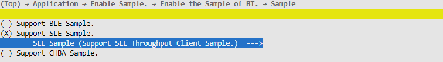

    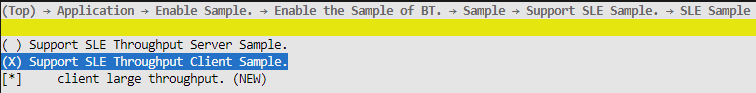

2.  完成配置后执行命令python3 build.py  ws63-liteos-app，将生成的镜像通过BurnTool烧录进单板中。

**sample使用<a name="section193796588269"></a>**

1.  扫描：sample会在首次运行、断连时自动启动扫描，在连接后停止扫描。用户可在sle\_sample\_seek\_result\_info\_cbk接口中处理扫描到的星闪设备，每扫描到一个星闪设备都会回调一次sle\_sample\_seek\_result\_info\_cbk接口。
2.  连接：可在扫描到蓝牙设备时，使用sle\_connect\_remote\_device接口连接对端设备，**不要求必须在sle\_sample\_seek\_result\_info\_cbk接口中连接对端星闪设备，但需要保证对端星闪设备正在发广播**。连接状态的改变会在sle\_sample\_connect\_state\_changed\_cbk回调中上报，当前sample会在连接后停止扫描、配对、服务发现等操作。
3.  数据发送：可以调用ssapc\_write\_req或者ssapc\_write\_cmd接口发送数据给server。
4.  数据接收：在sle\_speed\_notification\_cb回调或者sle\_speed\_indication\_cb回调中处理接收到的server数据。

> **说明：** 
>对于回调中的入参，不需要主动释放内存，回调结束后，协议栈自身会进行释放。

#### sle\_speed\_server使用指导<a name="ZH-CN_TOPIC_0000002199680897"></a>

**sample编译<a name="section3263150133311"></a>**

1.  在SDK根目录下执行命令“python3 build.py  ws63-liteos-app menuconfig”，并按下图配置对应编译选项进行配置。

    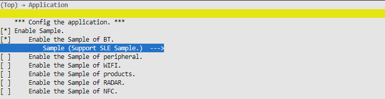

    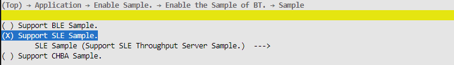

    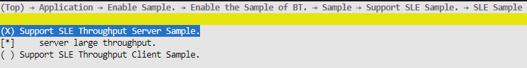

2.  完成配置后执行命令python3 build.py  ws63-liteos-app，将生成的镜像通过BurnTool烧录进单板中。

**sample使用<a name="section193796588269"></a>**

1.  启动广播：调用sle\_start\_announce接口启动广播。当前sample会在首次运行、server非主动断连时自动启动广播。
2.  停止广播：连接后会自动停止广播，并在sle\_announce\_terminal\_cbk中上报。
3.  接收数据：在ssaps\_write\_request\_cbk接口中处理client发送的数据。
4.  发送数据：调用sle\_uuid\_server\_send\_report\_by\_handle\_id接口发送数据。
5.  自定义服务、特征设置：自定义服务、特征、描述符的UUID定义在"sle\_speed\_server/inc/sle\_speed\_server.h"中。当前sample定义了一个私有服务SLE\_UUID\_SERVER\_SERVICE，该服务下面存在一个特征SLE\_UUID\_SERVER\_NTF\_REPORT。UUID需要根据客户自身需求更改。UUID的详细介绍如下所示。

**表 1**  server UUID介绍

<a name="table27521825165016"></a>
<table><thead align="left"><tr id="row575282545013"><th class="cellrowborder" valign="top" width="44.91%" id="mcps1.2.4.1.1"><p id="p063916414519"><a name="p063916414519"></a><a name="p063916414519"></a>名称</p>
</th>
<th class="cellrowborder" valign="top" width="26.06%" id="mcps1.2.4.1.2"><p id="p675292565013"><a name="p675292565013"></a><a name="p675292565013"></a>介绍</p>
</th>
<th class="cellrowborder" valign="top" width="29.03%" id="mcps1.2.4.1.3"><p id="p1851311872920"><a name="p1851311872920"></a><a name="p1851311872920"></a>sample默认值</p>
</th>
</tr>
</thead>
<tbody><tr id="row675217253508"><td class="cellrowborder" valign="top" width="44.91%" headers="mcps1.2.4.1.1 "><p id="p151677504129"><a name="p151677504129"></a><a name="p151677504129"></a>SLE_UUID_SERVER_SERVICE</p>
</td>
<td class="cellrowborder" valign="top" width="26.06%" headers="mcps1.2.4.1.2 "><p id="p3752172517502"><a name="p3752172517502"></a><a name="p3752172517502"></a>服务UUID</p>
</td>
<td class="cellrowborder" valign="top" width="29.03%" headers="mcps1.2.4.1.3 "><p id="p19513111816298"><a name="p19513111816298"></a><a name="p19513111816298"></a>0xABCD</p>
</td>
</tr>
<tr id="row147520251505"><td class="cellrowborder" valign="top" width="44.91%" headers="mcps1.2.4.1.1 "><p id="p19838436151216"><a name="p19838436151216"></a><a name="p19838436151216"></a>SLE_UUID_SERVER_NTF_REPORT</p>
</td>
<td class="cellrowborder" valign="top" width="26.06%" headers="mcps1.2.4.1.2 "><p id="p67521625115017"><a name="p67521625115017"></a><a name="p67521625115017"></a>特征UUID</p>
</td>
<td class="cellrowborder" valign="top" width="29.03%" headers="mcps1.2.4.1.3 "><p id="p349724552911"><a name="p349724552911"></a><a name="p349724552911"></a>0x1122</p>
</td>
</tr>
</tbody>
</table>

> **说明：** 
>对于回调中的入参，不需要主动释放内存，回调结束后，协议栈自身会进行释放。

#### 注意事项<a name="ZH-CN_TOPIC_0000002164274550"></a>

异常断连时，需要重启广播以及重启扫描，以保证业务在干扰场景下能够尽可能自愈（建议在**断连原因为非本端断链、**以及**配对失败**时需要自愈）。

## BLE&SLE功率档位定制<a name="ZH-CN_TOPIC_0000001813678500"></a>

1.  在NV配置文件middleware/chips/ws63/nv/nv\_config/cfg/acore/app.json中，NV ID ="0x20A0" 的表项用于设置BLE&SLE的最大功率档位，value的含义是BLE&SLE的最大功率档位。当前各个档位的发射功率为-6, -2, 2, 6, 10, 14, 16, 20。

    如果设置为7，那么可以使用的档位是0\~7，每档对应-6, -2, 2, 6, 10, 14, 16, 20；

    如果设置为5，那么可以使用的档位是0\~5，每档对应-6, -2, 2, 6, 10, 14。

    ```
    "bt_txpower":{
        "key_id": "0x20A0",
        "key_status": "alive",
        "structure_type": "btc_power_type_t",
        "attributions": 1,
        "value": [7]
    },
    ```

# 感知软件开发<a name="ZH-CN_TOPIC_0000001820274885"></a>


## 概述<a name="ZH-CN_TOPIC_0000001773477878"></a>

感知特性为周期性地收发感知信号以检测运动目标的功能特性，用户可以调用感知APIs接口使用该特性。

## 开发流程<a name="ZH-CN_TOPIC_0000001820277561"></a>


### 数据结构<a name="ZH-CN_TOPIC_0000001773888862"></a>

感知状态设置枚举定义：

```
typedef enum {
    RADAR_STATUS_STOP = 0,  /* 感知状态配置停止 */
    RADAR_STATUS_START,     /* 感知状态配置启动 */
    RADAR_STATUS_RESET,     /* 感知状态配置复位 */
    RADAR_STATUS_RESUME,    /* 感知状态配置状态恢复 */
} radar_set_sts_t;
```

感知软件状态查询枚举定义：

```
typedef enum {
    RADAR_STATUS_IDLE = 0,  /* 感知软件状态未工作 */
    RADAR_STATUS_RUNNING,   /* 感知软件状态工作 */
} radar_get_sts_t;
```

感知硬件状态查询枚举定义：

```
ypedef enum {
    RADAR_STATUS_HW_FAULT = 0,  /* 感知硬件状态故障 */
    RADAR_STATUS_HW_NORMAL,   /* 感知硬件状态正常 */
} radar_get_hardware_sts_t;
```

感知结果上报结构体定义：

```
typedef struct {
    uint32_t lower_boundary;    /* 感知结果靠近检测下边界 */
    uint32_t upper_boundary;    /* 感知结果靠近检测上边界 */
    uint8_t is_human_presence;  /* 感知结果有无人体存在 */
    uint8_t reserved_0;
    uint8_t reserved_1;
    uint8_t reserved_2;
} radar_result_t;
```

雷达单帧结果结构体定义：

```
typedef struct {
    uint8_t gear_one_flag;    /* 感知当前帧结果，1档位置(默认距感知模组水平距离1米处)是否有人运动 */
    uint8_t gear_two_flag;    /* 感知当前帧结果，2档位置(默认距感知模组水平距离2米处)是否有人运动 */
    uint8_t gear_three_flag;  /* 感知当前帧结果，3档位置(默认距感知模组水平距离6米处)是否有人运动 */
    uint8_t ai_flag;          /* 感知当前帧AI结果，是否为人体运动 */
} radar_current_frame_result_t;
```

感知结果回调函数数据结构定义：

```
typedef void (*radar_result_cb_t)(radar_result_t *result);
```

感知维测信息回调函数数据结构定义：

```
typedef void (*radar_debug_info_cb_t)(int16_t *arr, uint8_t len);
```

每一个感知帧计算完成后的回调函数数据结构定义：

```
typedef void (*radar_current_frame_result_cb_t)(radar_current_frame_result_t *result);
```

感知维测参数结构体定义:

```
typedef struct {
    uint8_t times;    // 子帧发送次数, 默认值0, 一直发送, 范围0~20
    uint8_t loop;     // 单个子帧感知波形循环发送次数, 默认值为8
    uint8_t ant;      // 接收通路选择, 默认值为0
    uint8_t wave;     // 感知发射波形类型选择, 默认值为2
    uint8_t dbg_type; // 维测信息输出选择, 默认值为0, 只打印基础流程日志, 范围0~4
    uint16_t period;  // 感知子帧间隔，单位us，默认值为5000, 范围3000~100000
} radar_dbg_para_t;
```

感知算法参数套选择参数结构体定义：

```
typedef struct {
    uint8_t height;       // 模组安装架高信息: 1/2/3米
    uint8_t scenario;     // 场景: 家居/空旷
    uint8_t material;     // 模组视距方向遮挡材料: 塑料/金属
    uint8_t fusion_track; // 是否融合距离跟踪结果
    uint8_t fusion_ai;    // 是否融合AI结果
} radar_sel_para_t;
```

感知算法参数结构体定义：

```
typedef struct {
    uint8_t d_th_1m;    // 靠近1米档门限
    uint8_t d_th_2m;    // 靠近2米档门限
    uint8_t p_th;       // 存在6米档门限
    uint8_t t_th_1m;    // 距离跟踪1米档门限
    uint8_t t_th_2m;    // 距离跟踪2米档门限
    uint8_t b_th_ratio; // 抗频谱对称干扰比例门限
    uint8_t b_th_cnt;   // 抗频谱对称干扰数量门限
    uint8_t a_th;       // AI人体识别相似度门限
} radar_alg_para_t;
```

### APIs<a name="ZH-CN_TOPIC_0000001820408829"></a>

感知 APIs接口如下表所示。

<a name="table22371515403"></a>
<table><thead align="left"><tr id="row227219117405"><th class="cellrowborder" valign="top" width="20.84%" id="mcps1.1.5.1.1"><p id="p1927281174018"><a name="p1927281174018"></a><a name="p1927281174018"></a>接口名称</p>
</th>
<th class="cellrowborder" valign="top" width="23.79%" id="mcps1.1.5.1.2"><p id="p2272171144016"><a name="p2272171144016"></a><a name="p2272171144016"></a>描述</p>
</th>
<th class="cellrowborder" valign="top" width="28.02%" id="mcps1.1.5.1.3"><p id="p82723111408"><a name="p82723111408"></a><a name="p82723111408"></a>参数说明</p>
</th>
<th class="cellrowborder" valign="top" width="27.35%" id="mcps1.1.5.1.4"><p id="p14272181144015"><a name="p14272181144015"></a><a name="p14272181144015"></a>返回信息说明</p>
</th>
</tr>
</thead>
<tbody><tr id="row027210119403"><td class="cellrowborder" valign="top" width="20.84%" headers="mcps1.1.5.1.1 "><p id="p12764860585"><a name="p12764860585"></a><a name="p12764860585"></a>uapi_radar_set_status</p>
</td>
<td class="cellrowborder" valign="top" width="23.79%" headers="mcps1.1.5.1.2 "><p id="p169217338583"><a name="p169217338583"></a><a name="p169217338583"></a>设置感知状态。</p>
</td>
<td class="cellrowborder" valign="top" width="28.02%" headers="mcps1.1.5.1.3 "><p id="p1891165755816"><a name="p1891165755816"></a><a name="p1891165755816"></a>sts：感知状态。</p>
</td>
<td class="cellrowborder" valign="top" width="27.35%" headers="mcps1.1.5.1.4 "><p id="p02728115407"><a name="p02728115407"></a><a name="p02728115407"></a>接口返回值：错误码。</p>
</td>
</tr>
<tr id="row1616011618525"><td class="cellrowborder" valign="top" width="20.84%" headers="mcps1.1.5.1.1 "><p id="p759656646"><a name="p759656646"></a><a name="p759656646"></a>uapi_radar_get_status</p>
</td>
<td class="cellrowborder" valign="top" width="23.79%" headers="mcps1.1.5.1.2 "><p id="p946181118512"><a name="p946181118512"></a><a name="p946181118512"></a>获取感知软件状态。</p>
</td>
<td class="cellrowborder" valign="top" width="28.02%" headers="mcps1.1.5.1.3 "><p id="p4839131192411"><a name="p4839131192411"></a><a name="p4839131192411"></a>*sts：感知软件状态。</p>
</td>
<td class="cellrowborder" valign="top" width="27.35%" headers="mcps1.1.5.1.4 "><p id="p416013619525"><a name="p416013619525"></a><a name="p416013619525"></a>接口返回值：错误码。</p>
</td>
</tr>
<tr id="row433461213529"><td class="cellrowborder" valign="top" width="20.84%" headers="mcps1.1.5.1.1 "><p id="p1521913368248"><a name="p1521913368248"></a><a name="p1521913368248"></a>uapi_radar_register_result_cb</p>
</td>
<td class="cellrowborder" valign="top" width="23.79%" headers="mcps1.1.5.1.2 "><p id="p2040044952415"><a name="p2040044952415"></a><a name="p2040044952415"></a>感知结果回调注册函数。</p>
</td>
<td class="cellrowborder" valign="top" width="28.02%" headers="mcps1.1.5.1.3 "><p id="p111717605817"><a name="p111717605817"></a><a name="p111717605817"></a>cb：回调函数。</p>
</td>
<td class="cellrowborder" valign="top" width="27.35%" headers="mcps1.1.5.1.4 "><p id="p93341612145216"><a name="p93341612145216"></a><a name="p93341612145216"></a>接口返回值：错误码。</p>
</td>
</tr>
<tr id="row198641157519"><td class="cellrowborder" valign="top" width="20.84%" headers="mcps1.1.5.1.1 "><p id="p14865915185112"><a name="p14865915185112"></a><a name="p14865915185112"></a>uapi_radar_get_result</p>
</td>
<td class="cellrowborder" valign="top" width="23.79%" headers="mcps1.1.5.1.2 "><p id="p68656152510"><a name="p68656152510"></a><a name="p68656152510"></a>获取感知上报结果</p>
</td>
<td class="cellrowborder" valign="top" width="28.02%" headers="mcps1.1.5.1.3 "><p id="p186511153515"><a name="p186511153515"></a><a name="p186511153515"></a>*res：感知上报结果</p>
</td>
<td class="cellrowborder" valign="top" width="27.35%" headers="mcps1.1.5.1.4 "><p id="p19865315175119"><a name="p19865315175119"></a><a name="p19865315175119"></a>接口返回值：错误码。</p>
</td>
</tr>
<tr id="row7455151520524"><td class="cellrowborder" valign="top" width="20.84%" headers="mcps1.1.5.1.1 "><p id="p237215226548"><a name="p237215226548"></a><a name="p237215226548"></a>uapi_radar_set_delay_time</p>
</td>
<td class="cellrowborder" valign="top" width="23.79%" headers="mcps1.1.5.1.2 "><p id="p20438555155717"><a name="p20438555155717"></a><a name="p20438555155717"></a>设置退出延迟时间。</p>
</td>
<td class="cellrowborder" valign="top" width="28.02%" headers="mcps1.1.5.1.3 "><p id="p11781611508"><a name="p11781611508"></a><a name="p11781611508"></a>time：退出延迟时间。</p>
</td>
<td class="cellrowborder" valign="top" width="27.35%" headers="mcps1.1.5.1.4 "><p id="p945561535210"><a name="p945561535210"></a><a name="p945561535210"></a>接口返回值：错误码。</p>
</td>
</tr>
<tr id="row075421825219"><td class="cellrowborder" valign="top" width="20.84%" headers="mcps1.1.5.1.1 "><p id="p1095042819543"><a name="p1095042819543"></a><a name="p1095042819543"></a>uapi_radar_get_delay_time</p>
</td>
<td class="cellrowborder" valign="top" width="23.79%" headers="mcps1.1.5.1.2 "><p id="p380774614577"><a name="p380774614577"></a><a name="p380774614577"></a>获取退出延迟时间。</p>
</td>
<td class="cellrowborder" valign="top" width="28.02%" headers="mcps1.1.5.1.3 "><p id="p186220181402"><a name="p186220181402"></a><a name="p186220181402"></a>*time：退出延迟时间。</p>
</td>
<td class="cellrowborder" valign="top" width="27.35%" headers="mcps1.1.5.1.4 "><p id="p13755111835210"><a name="p13755111835210"></a><a name="p13755111835210"></a>接口返回值：错误码。</p>
</td>
</tr>
<tr id="row3308174117548"><td class="cellrowborder" valign="top" width="20.84%" headers="mcps1.1.5.1.1 "><p id="p5203752105411"><a name="p5203752105411"></a><a name="p5203752105411"></a>uapi_radar_get_isolation</p>
</td>
<td class="cellrowborder" valign="top" width="23.79%" headers="mcps1.1.5.1.2 "><p id="p1153716360574"><a name="p1153716360574"></a><a name="p1153716360574"></a>获取天线隔离度信息。</p>
</td>
<td class="cellrowborder" valign="top" width="28.02%" headers="mcps1.1.5.1.3 "><p id="p156716278014"><a name="p156716278014"></a><a name="p156716278014"></a>*iso：天线隔离度信息。</p>
</td>
<td class="cellrowborder" valign="top" width="27.35%" headers="mcps1.1.5.1.4 "><p id="p8308134112547"><a name="p8308134112547"></a><a name="p8308134112547"></a>接口返回值：错误码。</p>
</td>
</tr>
<tr id="row12899234181811"><td class="cellrowborder" valign="top" width="20.84%" headers="mcps1.1.5.1.1 "><p id="p10276336556"><a name="p10276336556"></a><a name="p10276336556"></a>uapi_radar_set_debug_para</p>
</td>
<td class="cellrowborder" valign="top" width="23.79%" headers="mcps1.1.5.1.2 "><p id="p142773317553"><a name="p142773317553"></a><a name="p142773317553"></a>设置维测参数</p>
</td>
<td class="cellrowborder" valign="top" width="28.02%" headers="mcps1.1.5.1.3 "><p id="p1027153314553"><a name="p1027153314553"></a><a name="p1027153314553"></a>*para：维测参数, 参考结构体radar_dbg_para_t定义</p>
</td>
<td class="cellrowborder" valign="top" width="27.35%" headers="mcps1.1.5.1.4 "><p id="p16273330555"><a name="p16273330555"></a><a name="p16273330555"></a>接口返回值：错误码。</p>
</td>
</tr>
<tr id="row9481239161815"><td class="cellrowborder" valign="top" width="20.84%" headers="mcps1.1.5.1.1 "><p id="p1436425516581"><a name="p1436425516581"></a><a name="p1436425516581"></a>uapi_radar_select_alg_para</p>
</td>
<td class="cellrowborder" valign="top" width="23.79%" headers="mcps1.1.5.1.2 "><p id="p3364195535818"><a name="p3364195535818"></a><a name="p3364195535818"></a>设置算法参数套选择参数</p>
</td>
<td class="cellrowborder" valign="top" width="28.02%" headers="mcps1.1.5.1.3 "><p id="p1736415510584"><a name="p1736415510584"></a><a name="p1736415510584"></a>*para：算法参数套选择参数, 参考结构体radar_sel_para_t定义</p>
</td>
<td class="cellrowborder" valign="top" width="27.35%" headers="mcps1.1.5.1.4 "><p id="p12364165525812"><a name="p12364165525812"></a><a name="p12364165525812"></a>接口返回值：错误码。</p>
</td>
</tr>
<tr id="row420715436188"><td class="cellrowborder" valign="top" width="20.84%" headers="mcps1.1.5.1.1 "><p id="p53575524581"><a name="p53575524581"></a><a name="p53575524581"></a>uapi_radar_set_alg_para</p>
</td>
<td class="cellrowborder" valign="top" width="23.79%" headers="mcps1.1.5.1.2 "><p id="p1335712523587"><a name="p1335712523587"></a><a name="p1335712523587"></a>设置算法参数</p>
</td>
<td class="cellrowborder" valign="top" width="28.02%" headers="mcps1.1.5.1.3 "><p id="p53571052115819"><a name="p53571052115819"></a><a name="p53571052115819"></a>*para：算法参数, 参考结构体radar_alg_para_t定义</p>
<p id="p128242035151610"><a name="p128242035151610"></a><a name="p128242035151610"></a>write_to_flash：选择是否写入flash, 0为不写入, 1为写入</p>
</td>
<td class="cellrowborder" valign="top" width="27.35%" headers="mcps1.1.5.1.4 "><p id="p1335718528581"><a name="p1335718528581"></a><a name="p1335718528581"></a>接口返回值：错误码。</p>
</td>
</tr>
<tr id="row11246164510389"><td class="cellrowborder" valign="top" width="20.84%" headers="mcps1.1.5.1.1 "><p id="p1680313316266"><a name="p1680313316266"></a><a name="p1680313316266"></a>uapi_radar_get_hardware_status</p>
</td>
<td class="cellrowborder" valign="top" width="23.79%" headers="mcps1.1.5.1.2 "><p id="p28038311263"><a name="p28038311263"></a><a name="p28038311263"></a>获取感知硬件状态(打开雷达后查询，关闭雷达后该接口查询值无效)</p>
</td>
<td class="cellrowborder" valign="top" width="28.02%" headers="mcps1.1.5.1.3 "><p id="p108031332616"><a name="p108031332616"></a><a name="p108031332616"></a>*sts：感知硬件状态</p>
</td>
<td class="cellrowborder" valign="top" width="27.35%" headers="mcps1.1.5.1.4 "><p id="p080353182613"><a name="p080353182613"></a><a name="p080353182613"></a>接口返回值：错误码。</p>
</td>
</tr>
<tr id="row171591157123813"><td class="cellrowborder" valign="top" width="20.84%" headers="mcps1.1.5.1.1 "><p id="p1421711119287"><a name="p1421711119287"></a><a name="p1421711119287"></a>uapi_radar_get_debug_info</p>
</td>
<td class="cellrowborder" valign="top" width="23.79%" headers="mcps1.1.5.1.2 "><p id="p621711113285"><a name="p621711113285"></a><a name="p621711113285"></a>获取感知维测数据</p>
</td>
<td class="cellrowborder" valign="top" width="28.02%" headers="mcps1.1.5.1.3 "><p id="p152171811122813"><a name="p152171811122813"></a><a name="p152171811122813"></a>*arr：感知维测数据存储数组首地址</p>
<p id="p416919211295"><a name="p416919211295"></a><a name="p416919211295"></a>len：感知维测数据存储数组长度, 大于0且不超过16</p>
</td>
<td class="cellrowborder" valign="top" width="27.35%" headers="mcps1.1.5.1.4 "><p id="p1621751114281"><a name="p1621751114281"></a><a name="p1621751114281"></a>接口返回值：错误码。</p>
</td>
</tr>
<tr id="row147811353153817"><td class="cellrowborder" valign="top" width="20.84%" headers="mcps1.1.5.1.1 "><p id="p128719278293"><a name="p128719278293"></a><a name="p128719278293"></a>uapi_radar_register_debug_info_cb</p>
</td>
<td class="cellrowborder" valign="top" width="23.79%" headers="mcps1.1.5.1.2 "><p id="p1428792762920"><a name="p1428792762920"></a><a name="p1428792762920"></a>感知维测数据回调注册函数</p>
</td>
<td class="cellrowborder" valign="top" width="28.02%" headers="mcps1.1.5.1.3 "><p id="p1428710276299"><a name="p1428710276299"></a><a name="p1428710276299"></a>cb：回调函数</p>
<p id="p271813415306"><a name="p271813415306"></a><a name="p271813415306"></a>period：感知维测数据统计周期(帧数), 大于0且小于32768</p>
</td>
<td class="cellrowborder" valign="top" width="27.35%" headers="mcps1.1.5.1.4 "><p id="p20287142716298"><a name="p20287142716298"></a><a name="p20287142716298"></a>接口返回值：错误码。</p>
</td>
</tr>
<tr id="row4442519122612"><td class="cellrowborder" valign="top" width="20.84%" headers="mcps1.1.5.1.1 "><p id="p94748811133"><a name="p94748811133"></a><a name="p94748811133"></a>uapi_radar_get_current_frame_result</p>
</td>
<td class="cellrowborder" valign="top" width="23.79%" headers="mcps1.1.5.1.2 "><p id="p11836213101315"><a name="p11836213101315"></a><a name="p11836213101315"></a>获取感知当前帧上报结果</p>
</td>
<td class="cellrowborder" valign="top" width="28.02%" headers="mcps1.1.5.1.3 "><p id="p1799119141319"><a name="p1799119141319"></a><a name="p1799119141319"></a>*res：感知当前帧上报结果</p>
</td>
<td class="cellrowborder" valign="top" width="27.35%" headers="mcps1.1.5.1.4 "><p id="p1753053113121"><a name="p1753053113121"></a><a name="p1753053113121"></a>接口返回值：错误码。</p>
</td>
</tr>
<tr id="row14692122313262"><td class="cellrowborder" valign="top" width="20.84%" headers="mcps1.1.5.1.1 "><p id="p1420885215135"><a name="p1420885215135"></a><a name="p1420885215135"></a>uapi_radar_register_current_frame_result_cb</p>
</td>
<td class="cellrowborder" valign="top" width="23.79%" headers="mcps1.1.5.1.2 "><p id="p61620013143"><a name="p61620013143"></a><a name="p61620013143"></a>感知当前帧结果回调注册函数</p>
</td>
<td class="cellrowborder" valign="top" width="28.02%" headers="mcps1.1.5.1.3 "><p id="p1660617891414"><a name="p1660617891414"></a><a name="p1660617891414"></a>cb：回调函数</p>
</td>
<td class="cellrowborder" valign="top" width="27.35%" headers="mcps1.1.5.1.4 "><p id="p1242614713131"><a name="p1242614713131"></a><a name="p1242614713131"></a>接口返回值：错误码。</p>
</td>
</tr>
</tbody>
</table>

### 错误码<a name="ZH-CN_TOPIC_0000001773729186"></a>

<a name="table54639314269"></a>
<table><thead align="left"><tr id="row1950714310264"><th class="cellrowborder" valign="top" width="9.09090909090909%" id="mcps1.1.5.1.1"><p id="p1550810310267"><a name="p1550810310267"></a><a name="p1550810310267"></a>序号</p>
</th>
<th class="cellrowborder" valign="top" width="40.40404040404041%" id="mcps1.1.5.1.2"><p id="p9508237262"><a name="p9508237262"></a><a name="p9508237262"></a>定义</p>
</th>
<th class="cellrowborder" valign="top" width="14.14141414141414%" id="mcps1.1.5.1.3"><p id="p2508239265"><a name="p2508239265"></a><a name="p2508239265"></a>实际数值</p>
</th>
<th class="cellrowborder" valign="top" width="36.36363636363636%" id="mcps1.1.5.1.4"><p id="p11508138268"><a name="p11508138268"></a><a name="p11508138268"></a>描述</p>
</th>
</tr>
</thead>
<tbody><tr id="row15081315264"><td class="cellrowborder" valign="top" width="9.09090909090909%" headers="mcps1.1.5.1.1 "><p id="p19508193202616"><a name="p19508193202616"></a><a name="p19508193202616"></a>1</p>
</td>
<td class="cellrowborder" valign="top" width="40.40404040404041%" headers="mcps1.1.5.1.2 "><p id="p551413454113"><a name="p551413454113"></a><a name="p551413454113"></a>ERRCODE_SUCC</p>
</td>
<td class="cellrowborder" valign="top" width="14.14141414141414%" headers="mcps1.1.5.1.3 "><p id="p35083342610"><a name="p35083342610"></a><a name="p35083342610"></a>0</p>
</td>
<td class="cellrowborder" valign="top" width="36.36363636363636%" headers="mcps1.1.5.1.4 "><p id="p95081731266"><a name="p95081731266"></a><a name="p95081731266"></a>执行成功错误码。</p>
</td>
</tr>
<tr id="row35081335265"><td class="cellrowborder" valign="top" width="9.09090909090909%" headers="mcps1.1.5.1.1 "><p id="p25086318265"><a name="p25086318265"></a><a name="p25086318265"></a>2</p>
</td>
<td class="cellrowborder" valign="top" width="40.40404040404041%" headers="mcps1.1.5.1.2 "><p id="p151481351921"><a name="p151481351921"></a><a name="p151481351921"></a>ERRCODE_FAIL</p>
</td>
<td class="cellrowborder" valign="top" width="14.14141414141414%" headers="mcps1.1.5.1.3 "><p id="p118571415928"><a name="p118571415928"></a><a name="p118571415928"></a>0xFFFFFFFF</p>
</td>
<td class="cellrowborder" valign="top" width="36.36363636363636%" headers="mcps1.1.5.1.4 "><p id="p9508183172616"><a name="p9508183172616"></a><a name="p9508183172616"></a>执行失败错误码。</p>
</td>
</tr>
</tbody>
</table>

## 注意事项<a name="ZH-CN_TOPIC_0000001820404977"></a>

感知特性需要在WiFi信道上进行工作，所以需注意打开雷达前，需要确保WiFi信道有配置，WiFi进入softAP或STA模式即可。

## 编程实例<a name="ZH-CN_TOPIC_0000001820317513"></a>

```
typedef void (*radar_result_cb_t)(radar_result_t *result);


#define WIFI_IFNAME_MAX_SIZE             16
#define WIFI_MAX_SSID_LEN                33
#define WIFI_SCAN_AP_LIMIT               64
#define WIFI_MAC_LEN                     6
#define WIFI_INIT_WAIT_TIME              500 // 5s
#define WIFI_START_STA_DELAY             100 // 1s

#define RADAR_STATUS_START               1
#define RADAR_STATUS_QUERY_DELAY         1000 // 10s
#define RADAR_QUIT_DELAY_TIME            12 // 12s

#define RADAR_DEFAULT_TIMES 0
#define RADAR_DEFAULT_LOOP 8
#define RADAR_DEFAULT_ANT 0
#define RADAR_DEFAULT_PERIOD 5000
#define RADAR_DEFAULT_DBG_TYPE 3
#define RADAR_DEFAULT_WAVE 2

#define RADAR_API_NO_HUMAN 0
#define RADAR_API_RANGE_CLOSE 50
#define RADAR_API_RANGE_NEAR 100
#define RADAR_API_RANGE_MEDIUM 200
#define RADAR_API_RANGE_FAR 600

#define RADAR_DBG_INFO_RPT_COEF 100
#define RADAR_DBG_INFO_LEN 16

// WiFi启动STA模式实现样例
td_s32 radar_start_sta(td_void)
{
    (void)osDelay(WIFI_INIT_WAIT_TIME); /* 500: 延时0.5s, 等待wifi初始化完毕 */
    PRINT("STA try enabl旨e.\r\n");
    /* 创建STA接口 */
    if (wifi_sta_enable() != 0) {
        PRINT("sta enbale fail !\r\n");
        return -1;
    }

    /* 连接成功 */
    PRINT("STA connect success.\r\n");
    return 0;
}

// 感知结果回调函数实现样例
static void radar_print_res(radar_result_t *res)
{
    PRINT("[RADAR_SAMPLE] lb:%u, ub:%u, hm:%u\r\n", res->lower_boundary, res->upper_boundary, res->is_human_presence);
}

static void radar_print_cur_frame_res(radar_current_frame_result_t *res)
{
    PRINT("[RADAR_SAMPLE] gear1:%u, gear2:%u, gear3:%u, ai:%u\r\n",
        res->gear_one_flag, res->gear_two_flag, res->gear_three_flag, res->ai_flag);
}

// 维测信息依次为:
// 1.告知上层是否需要写入flash
// 2.LNA * 10 + VGA
// 3.原始回波峰值
// 4.过去period帧的平均MO1底噪
// 5.过去period帧的平均MO2底噪
// 6.过去period帧的平均DP底噪
// 7.过去period帧的平均帧间隔
// 8.过去period帧中帧间隔超过Xms的帧数
// 9.过去period帧中bitmap数量超过X门限的帧数
// 10.过去period帧中bitmap比例超过X门限的帧数
// 11.过去period帧中是在参与统计的帧数
// 12.过去period帧中帧间隔最大值
// 13.过去period帧中帧间隔最大值下标
// 14.当前所使用的算法参数MO1门限
// 15.当前所使用的算法参数MO2门限
// 16.当前所使用的算法参数DP门限
static void radar_print_dbg_info(int16_t *arr, uint8_t len)
{
    if (len > RADAR_DBG_INFO_LEN || len == 0) {
        return;
    }

    PRINT("dbg_info: %d,%d,%d,%d,%d,%d,%d,%d,%d,%d,%d,%d,%d,%d,%d,%d\r\n",
        arr[0], arr[1], arr[2], arr[3], arr[4], arr[5], arr[6], arr[7], arr[8], arr[9], arr[10],
        arr[11], arr[12], arr[13], arr[14], arr[15]);
}

static void radar_init_para(void)
{
    radar_dbg_para_t dbg_para;
    dbg_para.times = RADAR_DEFAULT_TIMES;
    dbg_para.loop = RADAR_DEFAULT_LOOP;
    dbg_para.ant = RADAR_DEFAULT_ANT;
    dbg_para.wave = RADAR_DEFAULT_WAVE;
    dbg_para.dbg_type = RADAR_DEFAULT_DBG_TYPE;
    dbg_para.period = RADAR_DEFAULT_PERIOD;
    uapi_radar_set_debug_para(&dbg_para);

    int16_t dly_time = RADAR_QUIT_DELAY_TIME;
    uapi_radar_set_delay_time(dly_time);

    radar_sel_para_t sel_para;
    sel_para.height = RADAR_HEIGHT_2M;
    sel_para.scenario = RADAR_SCENARIO_TYPE_HOME;
    sel_para.material = RADAR_MATERIAL_SINGLE;
    sel_para.fusion_track = true;
    sel_para.fusion_ai = true;
    uapi_radar_select_alg_para(&sel_para);

    // 算法门限, 前三个使用tools/bin/radar_tool/radar_para_gen_tool工具标定, 后面五个使用本sample给出的默认值即可
    radar_alg_para_t alg_para;
    alg_para.d_th_1m = 32;
    alg_para.d_th_2m = 25;
    alg_para.p_th = 25;
    alg_para.t_th_1m = 13;
    alg_para.t_th_2m = 26;
    alg_para.b_th_ratio = 20;
    alg_para.b_th_cnt = 4;
    alg_para.a_th = 70;
    uapi_radar_set_alg_para(&alg_para, 0);
}

int radar_demo_init(void *param)
{
    PRINT("[RADAR_SAMPLE] radar_demo_init sta!\r\n");

    param = param;
    // WiFi启动STA模式
    radar_start_sta();

    // 注册感知结果回调函数
    uapi_radar_register_result_cb(radar_print_res);
    uapi_radar_register_current_frame_result_cb(radar_print_cur_frame_res);
    uapi_radar_register_debug_info_cb(radar_print_dbg_info, RADAR_DBG_INFO_RPT_COEF);

    // 启动感知
    (void)osDelay(WIFI_START_STA_DELAY);
    uapi_radar_set_status(RADAR_STATUS_SET_START);
    radar_init_para();

    // 感知查询接口示例
    while(1) {
        (void)osDelay(RADAR_STATUS_QUERY_DELAY);
        uint8_t sts;
        uapi_radar_get_status(&sts);
        uint16_t time;
        uapi_radar_get_delay_time(&time);
        uint16_t iso;
        uapi_radar_get_isolation(&iso);
        radar_result_t res = {0};
        uapi_radar_get_result(&res);
        radar_current_frame_result_t cur_frame_res = {0};
        uapi_radar_get_current_frame_result(&cur_frame_res);
        int16_t arr[RADAR_DBG_INFO_LEN] = {0};
        uapi_radar_get_debug_info(arr, RADAR_DBG_INFO_LEN);
        radar_print_dbg_info(arr, RADAR_DBG_INFO_LEN);
    }

    return 0;
}
```

# 注意事项<a name="ZH-CN_TOPIC_0000001793895849"></a>


## 看门狗<a name="ZH-CN_TOPIC_0000001747016212"></a>

**概述<a name="section19528141716147"></a>**

WS63V100默认提供看门狗功能，看门狗功能是一个指定时间（可编程）的定时器，用于系统异常恢复，如果未得到更新则当定时器到期时会产生一个系统复位信号，当看门狗在到期之前关闭或进行踢狗动作（即刷新定时器），则不会产生复位信号。

**功能描述<a name="section1873826121416"></a>**

看门狗提供接口如下表所示。

<a name="table213321716161"></a>
<table><thead align="left"><tr id="row1513313173162"><th class="cellrowborder" valign="top" width="36.36%" id="mcps1.1.3.1.1"><p id="p12986192321615"><a name="p12986192321615"></a><a name="p12986192321615"></a>接口名称</p>
</th>
<th class="cellrowborder" valign="top" width="63.63999999999999%" id="mcps1.1.3.1.2"><p id="p298617239162"><a name="p298617239162"></a><a name="p298617239162"></a>描述</p>
</th>
</tr>
</thead>
<tbody><tr id="row248652620584"><td class="cellrowborder" valign="top" width="36.36%" headers="mcps1.1.3.1.1 "><p id="p148662655817"><a name="p148662655817"></a><a name="p148662655817"></a>uapi_watchdog_enable(mode)</p>
</td>
<td class="cellrowborder" valign="top" width="63.63999999999999%" headers="mcps1.1.3.1.2 "><p id="p1032518301105"><a name="p1032518301105"></a><a name="p1032518301105"></a>使能看门狗；</p>
<p id="p148672618583"><a name="p148672618583"></a><a name="p148672618583"></a>参数mode为工作类型：（当前默认使用mode0）</p>
<p id="p1435414229019"><a name="p1435414229019"></a><a name="p1435414229019"></a>0：当看门狗触发时，将重启系统；</p>
<p id="p17156753904"><a name="p17156753904"></a><a name="p17156753904"></a>1：当看门狗触发时，将进入中断，如果在中断中没有喂狗，系统将重启。</p>
</td>
</tr>
<tr id="row14761122495813"><td class="cellrowborder" valign="top" width="36.36%" headers="mcps1.1.3.1.1 "><p id="p076182415585"><a name="p076182415585"></a><a name="p076182415585"></a>uapi_watchdog_disable()</p>
</td>
<td class="cellrowborder" valign="top" width="63.63999999999999%" headers="mcps1.1.3.1.2 "><p id="p57611524185820"><a name="p57611524185820"></a><a name="p57611524185820"></a>去使能看门狗；</p>
</td>
</tr>
<tr id="row362019550416"><td class="cellrowborder" valign="top" width="36.36%" headers="mcps1.1.3.1.1 "><p id="p862035517414"><a name="p862035517414"></a><a name="p862035517414"></a>uapi_watchdog_set_time(timeout)</p>
</td>
<td class="cellrowborder" valign="top" width="63.63999999999999%" headers="mcps1.1.3.1.2 "><p id="p362012555415"><a name="p362012555415"></a><a name="p362012555415"></a>设置看门狗定时时间，单位为s。</p>
</td>
</tr>
<tr id="row9133101751617"><td class="cellrowborder" valign="top" width="36.36%" headers="mcps1.1.3.1.1 "><p id="p12986112319166"><a name="p12986112319166"></a><a name="p12986112319166"></a>uapi_watchdog_kick()</p>
</td>
<td class="cellrowborder" valign="top" width="63.63999999999999%" headers="mcps1.1.3.1.2 "><p id="p0986102331610"><a name="p0986102331610"></a><a name="p0986102331610"></a>踢狗，重置看门狗定时器时间。</p>
</td>
</tr>
</tbody>
</table>

**开发指引<a name="section1981435614131"></a>**

看门狗功能的作用是为了暴露业务中出现卡死或无意义死循环的问题，正常业务流程中应当周期性进行踢狗操作，而当业务异常卡死或进入死循环时，踢狗操作得不到调度，便会在看门狗时间到期后触发复位信号。

修改看门狗定时时间步骤如下：

1.  调用uapi\_watchdog\_disable，去使能看门狗。（初始化时已默认使能）。
2.  调用uapi\_watchdog\_set\_time，设置定时时间。
3.  调用uapi\_watchdog\_enable，重新使能看门狗。

踢狗步骤如下：

1.  调用uapi\_watchdog\_kick，刷新看门狗定时器时间为设置的定时时间。

**注意事项<a name="section16414171431314"></a>**

当前看门狗功能默认开启，定时时间为15s，仅在liteOS的IDLE线程中保留踢狗动作，因此在进行WiFi打流等较占用CPU和系统资源的上层应用场景下，IDLE线程可能无法得到调度，需要应用主动调用踢狗接口进行踢狗操作。

若不希望底层踢狗，存在上层业务喂狗需求，则可通过watchdog\_port\_idle\_kick\_register接口注册IDLE线程中踢狗动作函数，接管喂狗动作。watchdog\_port\_idle\_kick\_register函数需要包含drivers\\chips\\ws63\\porting\\liteos\\riscv31\\idle\_config.h头文件。

IPERF打流业务功能（kernel/liteos/liteos\_v207.0.0/Huawei\_LiteOS/net/los\_iperf/src/los\_iperf.c）进行踢狗动作示例代码：

```
static void IperfFeedWdg(void)
{
    UINT32 ret = LOS_HistoryTaskCpuUsage(OsGetIdleTaskId(), CPUP_LAST_ONE_SECONDS);
    if (ret < IPERF_MIN_IDEL_RATE) {
        uapi_watchdog_kick();
    }
}
void IperfServerPhase2(IperfContext *context)
{
    int32_t recvLen;
    struct sockaddr peer;
    struct sockaddr *from = &peer;
    socklen_t slen = sizeof(struct sockaddr);
    socklen_t *fromLen = &slen;
    BOOL firstData = FALSE;
    IperfUdpHdr *udpHdr = (IperfUdpHdr *)context->param.buffer;
#ifdef LOSCFG_NET_IPERF_JITTER
    if (IPERF_IS_UDP(context->param.mask)) {
        context->udpStat->lastID = -1;
    }
#endif
    while ((context->isFinish == FALSE) && (context->isKilled == FALSE)) {
        recvLen = recvfrom(context->trafficSock, context->param.buffer,
                           context->param.bufLen, 0, from, fromLen);
        if (recvLen < 0) {
            if ((firstData == FALSE) && (errno == EAGAIN)) {
                continue;
            }
            IPERF_PRINT("recv failed %d\r\n", errno);
            break;
        } else if (recvLen == 0) { /* tcp connection closed by peer side */
            context->isFinish = TRUE;
            break;
        } else {
            if (firstData == FALSE) {
                firstData = TRUE;
                IperfServerFirstDataProcess(context, from, *fromLen);
                from = NULL;
                fromLen = NULL;
            }
            context->param.total += (uint32_t)recvLen;
            if (IperfServerDataProcess(context, (uint32_t)recvLen) && ((int32_t)ntohl(udpHdr->id) < 0)) {
                context->isFinish = TRUE;
                break;
            }
            UNUSED(udpHdr);
#ifdef IPERF_FEED_WDG
            IperfFeedWdg();
#endif /* IPERF_FEED_WDG */
        }
    }
    gettimeofday(&context->end, NULL);
}
```

