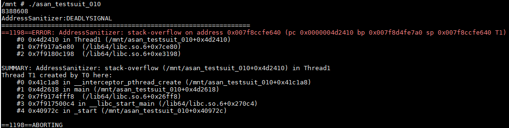
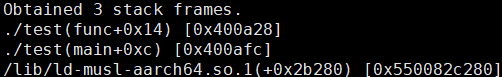
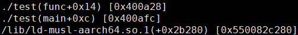

# 前  言<a name="ZH-CN_TOPIC_0000001419716361"></a>

**概述<a name="section18333135135019"></a>**

本文档主要介绍ARM GCC工具链的使用。主要包括使用环境、工具链的组成介绍、使用方法以及注意事项。本文档主要指导客户更快地掌握ARM GCC工具链的使用。

**读者对象<a name="section18341185175013"></a>**

本文档（本指南）主要适用于以下工程师：

-   技术支持工程师
-   软件开发工程师

**符号约定<a name="section133020216410"></a>**

在本文中可能出现下列标志，它们所代表的含义如下。

<a name="table2622507016410"></a>
<table><thead align="left"><tr id="row1530720816410"><th class="cellrowborder" valign="top" width="20.580000000000002%" id="mcps1.1.3.1.1"><p id="p6450074116410"><a name="p6450074116410"></a><a name="p6450074116410"></a><strong id="b2136615816410"><a name="b2136615816410"></a><a name="b2136615816410"></a>符号</strong></p>
</th>
<th class="cellrowborder" valign="top" width="79.42%" id="mcps1.1.3.1.2"><p id="p5435366816410"><a name="p5435366816410"></a><a name="p5435366816410"></a><strong id="b5941558116410"><a name="b5941558116410"></a><a name="b5941558116410"></a>说明</strong></p>
</th>
</tr>
</thead>
<tbody><tr id="row1372280416410"><td class="cellrowborder" valign="top" width="20.580000000000002%" headers="mcps1.1.3.1.1 "><p id="p3734547016410"><a name="p3734547016410"></a><a name="p3734547016410"></a><a name="image2670064316410"></a><a name="image2670064316410"></a><span></span></p>
</td>
<td class="cellrowborder" valign="top" width="79.42%" headers="mcps1.1.3.1.2 "><p id="p1757432116410"><a name="p1757432116410"></a><a name="p1757432116410"></a>表示如不避免则将会导致死亡或严重伤害的具有高等级风险的危害。</p>
</td>
</tr>
<tr id="row466863216410"><td class="cellrowborder" valign="top" width="20.580000000000002%" headers="mcps1.1.3.1.1 "><p id="p1432579516410"><a name="p1432579516410"></a><a name="p1432579516410"></a><a name="image4895582316410"></a><a name="image4895582316410"></a><span></span></p>
</td>
<td class="cellrowborder" valign="top" width="79.42%" headers="mcps1.1.3.1.2 "><p id="p959197916410"><a name="p959197916410"></a><a name="p959197916410"></a>表示如不避免则可能导致死亡或严重伤害的具有中等级风险的危害。</p>
</td>
</tr>
<tr id="row123863216410"><td class="cellrowborder" valign="top" width="20.580000000000002%" headers="mcps1.1.3.1.1 "><p id="p1232579516410"><a name="p1232579516410"></a><a name="p1232579516410"></a><a name="image1235582316410"></a><a name="image1235582316410"></a><span></span></p>
</td>
<td class="cellrowborder" valign="top" width="79.42%" headers="mcps1.1.3.1.2 "><p id="p123197916410"><a name="p123197916410"></a><a name="p123197916410"></a>表示如不避免则可能导致轻微或中度伤害的具有低等级风险的危害。</p>
</td>
</tr>
<tr id="row5786682116410"><td class="cellrowborder" valign="top" width="20.580000000000002%" headers="mcps1.1.3.1.1 "><p id="p2204984716410"><a name="p2204984716410"></a><a name="p2204984716410"></a><a name="image4504446716410"></a><a name="image4504446716410"></a><span></span></p>
</td>
<td class="cellrowborder" valign="top" width="79.42%" headers="mcps1.1.3.1.2 "><p id="p4388861916410"><a name="p4388861916410"></a><a name="p4388861916410"></a>用于传递设备或环境安全警示信息。如不避免则可能会导致设备损坏、数据丢失、设备性能降低或其它不可预知的结果。</p>
<p id="p1238861916410"><a name="p1238861916410"></a><a name="p1238861916410"></a>“须知”不涉及人身伤害。</p>
</td>
</tr>
<tr id="row2856923116410"><td class="cellrowborder" valign="top" width="20.580000000000002%" headers="mcps1.1.3.1.1 "><p id="p5555360116410"><a name="p5555360116410"></a><a name="p5555360116410"></a><a name="image799324016410"></a><a name="image799324016410"></a><span></span></p>
</td>
<td class="cellrowborder" valign="top" width="79.42%" headers="mcps1.1.3.1.2 "><p id="p4612588116410"><a name="p4612588116410"></a><a name="p4612588116410"></a>对正文中重点信息的补充说明。</p>
<p id="p1232588116410"><a name="p1232588116410"></a><a name="p1232588116410"></a>“说明”不是安全警示信息，不涉及人身、设备及环境伤害信息。</p>
</td>
</tr>
</tbody>
</table>

**修订记录<a name="section634219515012"></a>**

<a name="table143491059504"></a>
<table><thead align="left"><tr id="row13760519502"><th class="cellrowborder" valign="top" width="17.95%" id="mcps1.1.4.1.1"><p id="p637616510500"><a name="p637616510500"></a><a name="p637616510500"></a>修订日期</p>
</th>
<th class="cellrowborder" valign="top" width="12.43%" id="mcps1.1.4.1.2"><p id="p17377105195014"><a name="p17377105195014"></a><a name="p17377105195014"></a>版本</p>
</th>
<th class="cellrowborder" valign="top" width="69.62%" id="mcps1.1.4.1.3"><p id="p737715514508"><a name="p737715514508"></a><a name="p737715514508"></a>修订说明</p>
</th>
</tr>
</thead>
<tbody><tr id="row1624824102816"><td class="cellrowborder" valign="top" width="17.95%" headers="mcps1.1.4.1.1 "><p id="p1132451712436"><a name="p1132451712436"></a><a name="p1132451712436"></a>2022-05-10</p>
</td>
<td class="cellrowborder" valign="top" width="12.43%" headers="mcps1.1.4.1.2 "><p id="p832417177432"><a name="p832417177432"></a><a name="p832417177432"></a>00B01</p>
</td>
<td class="cellrowborder" valign="top" width="69.62%" headers="mcps1.1.4.1.3 "><p id="p18324217164314"><a name="p18324217164314"></a><a name="p18324217164314"></a>第1次临时版本发布。</p>
</td>
</tr>
<tr id="row20673152913012"><td class="cellrowborder" valign="top" width="17.95%" headers="mcps1.1.4.1.1 "><p id="p43247126444"><a name="p43247126444"></a><a name="p43247126444"></a>2024-01-30</p>
</td>
<td class="cellrowborder" valign="top" width="12.43%" headers="mcps1.1.4.1.2 "><p id="p1632416123442"><a name="p1632416123442"></a><a name="p1632416123442"></a>01</p>
</td>
<td class="cellrowborder" valign="top" width="69.62%" headers="mcps1.1.4.1.3 "><p id="p193241012174415"><a name="p193241012174415"></a><a name="p193241012174415"></a>第1次正式版本发布。</p>
<p id="p19324612104415"><a name="p19324612104415"></a><a name="p19324612104415"></a>新增3.4小节。</p>
<p id="p143241212124417"><a name="p143241212124417"></a><a name="p143241212124417"></a>3.5小节涉及更新。</p>
</td>
</tr>
<tr id="row19573330171317"><td class="cellrowborder" valign="top" width="17.95%" headers="mcps1.1.4.1.1 "><p id="p757343071311"><a name="p757343071311"></a><a name="p757343071311"></a>2024-03-31</p>
</td>
<td class="cellrowborder" valign="top" width="12.43%" headers="mcps1.1.4.1.2 "><p id="p1757443012133"><a name="p1757443012133"></a><a name="p1757443012133"></a>02</p>
</td>
<td class="cellrowborder" valign="top" width="69.62%" headers="mcps1.1.4.1.3 "><p id="p119634391317"><a name="p119634391317"></a><a name="p119634391317"></a>第2次正式版本发布。</p>
<p id="p114566438131"><a name="p114566438131"></a><a name="p114566438131"></a>新增“3.7 gperftools使用说明”小节。</p>
</td>
</tr>
<tr id="row1114710136519"><td class="cellrowborder" valign="top" width="17.95%" headers="mcps1.1.4.1.1 "><p id="p167164084318"><a name="p167164084318"></a><a name="p167164084318"></a>2024-06-20</p>
</td>
<td class="cellrowborder" valign="top" width="12.43%" headers="mcps1.1.4.1.2 "><p id="p167114064317"><a name="p167114064317"></a><a name="p167114064317"></a>03</p>
</td>
<td class="cellrowborder" valign="top" width="69.62%" headers="mcps1.1.4.1.3 "><p id="p867440164311"><a name="p867440164311"></a><a name="p867440164311"></a>第3次正式版本发布。</p>
<p id="p1467204017437"><a name="p1467204017437"></a><a name="p1467204017437"></a>3.1小节涉及修改。</p>
</td>
</tr>
<tr id="row849832719424"><td class="cellrowborder" valign="top" width="17.95%" headers="mcps1.1.4.1.1 "><p id="p13923548164217"><a name="p13923548164217"></a><a name="p13923548164217"></a>2024-07-03</p>
</td>
<td class="cellrowborder" valign="top" width="12.43%" headers="mcps1.1.4.1.2 "><p id="p19231548104211"><a name="p19231548104211"></a><a name="p19231548104211"></a>04</p>
</td>
<td class="cellrowborder" valign="top" width="69.62%" headers="mcps1.1.4.1.3 "><p id="p9923164818423"><a name="p9923164818423"></a><a name="p9923164818423"></a>第4次正式版本发布。</p>
<p id="p68661120143820"><a name="p68661120143820"></a><a name="p68661120143820"></a>2.3小节涉及更新</p>
<p id="p992304824219"><a name="p992304824219"></a><a name="p992304824219"></a>新增“<a href="ARMv9.md">ARMv9</a>”小节。</p>
<p id="p189231748104219"><a name="p189231748104219"></a><a name="p189231748104219"></a>新增“<a href="增强优化选项使用说明.md">增强优化选项使用说明</a>”小节。</p>
<p id="p159236487429"><a name="p159236487429"></a><a name="p159236487429"></a>刷新“<a href="运行报错.md">运行报错</a>”小节的问题案例。</p>
<p id="p2923174894213"><a name="p2923174894213"></a><a name="p2923174894213"></a>新增“<a href="性能问题.md">性能问题</a>”小节的问题案例。</p>
<p id="p12923124815424"><a name="p12923124815424"></a><a name="p12923124815424"></a>新增“<a href="预编译使用说明.md">预编译使用说明</a>”小节。</p>
<p id="p1425315435229"><a name="p1425315435229"></a><a name="p1425315435229"></a>3.3小节增加步骤</p>
<p id="p1025464362214"><a name="p1025464362214"></a><a name="p1025464362214"></a>3.4小节和3.5小节涉及更新。</p>
<p id="p152544437227"><a name="p152544437227"></a><a name="p152544437227"></a>3.7小节增加须知</p>
<p id="p29561717155015"><a name="p29561717155015"></a><a name="p29561717155015"></a>5.1.2小节涉及更新。</p>
</td>
</tr>
<tr id="row1919820425113"><td class="cellrowborder" valign="top" width="17.95%" headers="mcps1.1.4.1.1 "><p id="p1019911423119"><a name="p1019911423119"></a><a name="p1019911423119"></a>2025-03-07</p>
</td>
<td class="cellrowborder" valign="top" width="12.43%" headers="mcps1.1.4.1.2 "><p id="p6199042131114"><a name="p6199042131114"></a><a name="p6199042131114"></a>0<span id="ph345915332492"><a name="ph345915332492"></a><a name="ph345915332492"></a>5</span></p>
</td>
<td class="cellrowborder" valign="top" width="69.62%" headers="mcps1.1.4.1.3 "><p id="p51999425110"><a name="p51999425110"></a><a name="p51999425110"></a>新增“<a href="GDB使用问题.md">GDB使用问题</a>”小节。</p>
</td>
</tr>
</tbody>
</table>

# 概述<a name="ZH-CN_TOPIC_0000001419716357"></a>


## ARM GCC概述<a name="ZH-CN_TOPIC_0000001369036212"></a>

ARM GCC是一种用于X86架构平台上进行ARM架构可执行文件交叉编译的工具链。

# ARM GCC介绍与安装<a name="ZH-CN_TOPIC_0000001518872896"></a>


## 工具链运行环境<a name="ZH-CN_TOPIC_0000001569713165"></a>

建议使用环境：Ubuntu 16.04或更高版本，以及glibc2.22或以上版本。

## 工具链类型<a name="ZH-CN_TOPIC_0000001569632821"></a>

ARM GCC分为以下6种类型，如[表1](#table389mcpsimp)所示。

**表 1**  ARM GCC工具链类型

<a name="table389mcpsimp"></a>
<table><thead align="left"><tr id="row395mcpsimp"><th class="cellrowborder" valign="top" width="45.56%" id="mcps1.2.3.1.1"><p id="p398mcpsimp"><a name="p398mcpsimp"></a><a name="p398mcpsimp"></a>名称</p>
</th>
<th class="cellrowborder" valign="top" width="54.44%" id="mcps1.2.3.1.2"><p id="p400mcpsimp"><a name="p400mcpsimp"></a><a name="p400mcpsimp"></a>描述</p>
</th>
</tr>
</thead>
<tbody><tr id="row401mcpsimp"><td class="cellrowborder" valign="top" width="45.56%" headers="mcps1.2.3.1.1 "><p id="p405mcpsimp"><a name="p405mcpsimp"></a><a name="p405mcpsimp"></a>gcc-20230315-aarch64-v01c01-linux-gnu.tar.gz</p>
</td>
<td class="cellrowborder" valign="top" width="54.44%" headers="mcps1.2.3.1.2 "><p id="p16554102365815"><a name="p16554102365815"></a><a name="p16554102365815"></a>目标平台为arm64，使用glibc库。</p>
</td>
</tr>
<tr id="row408mcpsimp"><td class="cellrowborder" valign="top" width="45.56%" headers="mcps1.2.3.1.1 "><p id="p412mcpsimp"><a name="p412mcpsimp"></a><a name="p412mcpsimp"></a>gcc-20230315-aarch64-v01c01-linux-musl.tgz</p>
</td>
<td class="cellrowborder" valign="top" width="54.44%" headers="mcps1.2.3.1.2 "><p id="p1585234819581"><a name="p1585234819581"></a><a name="p1585234819581"></a>目标平台为arm64，使用musl库。</p>
</td>
</tr>
<tr id="row415mcpsimp"><td class="cellrowborder" valign="top" width="45.56%" headers="mcps1.2.3.1.1 "><p id="p419mcpsimp"><a name="p419mcpsimp"></a><a name="p419mcpsimp"></a>gcc-20230315-aarch64-v01c01-liteos-musl.tar.gz</p>
</td>
<td class="cellrowborder" valign="top" width="54.44%" headers="mcps1.2.3.1.2 "><p id="p23231447155910"><a name="p23231447155910"></a><a name="p23231447155910"></a>目标平台为arm64，使用liteos定制musl库。</p>
</td>
</tr>
<tr id="row422mcpsimp"><td class="cellrowborder" valign="top" width="45.56%" headers="mcps1.2.3.1.1 "><p id="p16139183512401"><a name="p16139183512401"></a><a name="p16139183512401"></a>gcc-20230315-arm-v01c01-linux-gnu.tar.gz</p>
</td>
<td class="cellrowborder" valign="top" width="54.44%" headers="mcps1.2.3.1.2 "><p id="p213993534019"><a name="p213993534019"></a><a name="p213993534019"></a>目标平台为arm，使用glibc库。</p>
</td>
</tr>
<tr id="row429mcpsimp"><td class="cellrowborder" valign="top" width="45.56%" headers="mcps1.2.3.1.1 "><p id="p20258114145610"><a name="p20258114145610"></a><a name="p20258114145610"></a>gcc-20230315-arm-v01c01-linux-musl.tar.gz</p>
</td>
<td class="cellrowborder" valign="top" width="54.44%" headers="mcps1.2.3.1.2 "><p id="p2618431114014"><a name="p2618431114014"></a><a name="p2618431114014"></a>目标平台为arm，使用musl库。</p>
</td>
</tr>
<tr id="row747635910393"><td class="cellrowborder" valign="top" width="45.56%" headers="mcps1.2.3.1.1 "><p id="p121781223164014"><a name="p121781223164014"></a><a name="p121781223164014"></a>gcc-20230315-arm-v01c01-liteos-musl.tar.gz</p>
</td>
<td class="cellrowborder" valign="top" width="54.44%" headers="mcps1.2.3.1.2 "><p id="p152161449116"><a name="p152161449116"></a><a name="p152161449116"></a>目标平台为arm，使用liteos定制musl库。</p>
</td>
</tr>
<tr id="row161031523478"><td class="cellrowborder" valign="top" width="45.56%" headers="mcps1.2.3.1.1 "><p id="p2104126474"><a name="p2104126474"></a><a name="p2104126474"></a>gcc-20240612-arm-v01c02-linux-gnueabi.tgz</p>
</td>
<td class="cellrowborder" valign="top" width="54.44%" headers="mcps1.2.3.1.2 "><p id="p2010432194719"><a name="p2010432194719"></a><a name="p2010432194719"></a>目标平台为arm，使用glibc库，定制codesize优化版本。</p>
</td>
</tr>
<tr id="row442312239514"><td class="cellrowborder" valign="top" width="45.56%" headers="mcps1.2.3.1.1 "><p id="p174239238515"><a name="p174239238515"></a><a name="p174239238515"></a>gcc-20240612-arm-v01c02-linux-musleabi.tgz<span id="ph138932122013"><a name="ph138932122013"></a><a name="ph138932122013"></a></span></p>
</td>
<td class="cellrowborder" valign="top" width="54.44%" headers="mcps1.2.3.1.2 "><p id="p742310233517"><a name="p742310233517"></a><a name="p742310233517"></a>目标平台为arm，使用musl库，定制codesize优化版本。</p>
</td>
</tr>
</tbody>
</table>

> **说明：** 
>20230315：工具链发布时间。
>v01c01：工具链发布版本。

## 工具链目录结构<a name="ZH-CN_TOPIC_0000001518553364"></a>

工具链压缩包使用tar工具解压。

示例

```
使用tar工具解压：tar -xzf gcc-20230315-aarch64-v01c01-linux-gnu.tar.gz
解压后目录如下所示
gcc-20230315-aarch64-v01c01-linux-gnu
├── aarch64-v01c01-linux-gnu-gcc
│   ├── aarch64-linux-gnu                       Compiler-dependent tool
│   ├── bin
│   │   ├── aarch64-linux-gnu-addr2line        Translator between instruction and address
│   │   ├── aarch64-linux-gnu-ar               Static packaging tools
│   │   ├── aarch64-linux-gnu-as               Assembler
│   │   ├── aarch64-linux-gnu-c++              C++ compiler
│   │   ├── aarch64-linux-gnu-c++filt          C++ symbol parser
│   │   ├── aarch64-linux-gnu-cpp              C/C++ preprocessor
│   │   ├── aarch64-linux-gnu-elfedit          Tool to update header of ELF file
│   │   ├── aarch64-linux-gnu-g++              Same as aarch64-linux-gnu-c++
│   │   ├── aarch64-linux-gnu-gcc              C compiler
│   │   ├── aarch64-linux-gnu-gcc-10.3.0       Same as aarch64-linux-gnu-gcc
│   │   ├── aarch64-linux-gnu-gcc-ar           Packaging tool
│   │   ├── aarch64-linux-gnu-gcc-nm           Symbol parser
│   │   ├── aarch64-linux-gnu-gcc-ranlib       Ranlib tool
│   │   ├── aarch64-linux-gnu-gcov
│   │   ├── aarch64-linux-gnu-gcov-dump
│   │   ├── aarch64-linux-gnu-gcov-tool
│   │   ├── aarch64-linux-gnu-gprof
│   │   ├── aarch64-linux-gnu-ld
│   │   ├── aarch64-linux-gnu-ld.bfd
│   │   ├── aarch64-linux-gnu-lto-dump
│   │   ├── aarch64-linux-gnu-nm
│   │   ├── aarch64-linux-gnu-objcopy
│   │   ├── aarch64-linux-gnu-objdump
│   │   ├── aarch64-linux-gnu-ranlib
│   │   ├── aarch64-linux-gnu-readelf          Tool to read ELF file
│   │   ├── aarch64-linux-gnu-size             Tool to get ELF size
│   │   ├── aarch64-linux-gnu-strings          String parser
│   │   ├── aarch64-linux-gnu-strip            Compression tool
│   │   ├── aarch64-v01c01-linux-gnu-addr2line -> ./aarch64-linux-gnu-addr2line
│   │   ├── aarch64-v01c01-linux-gnu-ar -> ./aarch64-linux-gnu-ar
│   │   ├── aarch64-v01c01-linux-gnu-as -> ./aarch64-linux-gnu-as
│   │   ├── aarch64-v01c01-linux-gnu-c++ -> ./aarch64-linux-gnu-c++
│   │   ├── aarch64-v01c01-linux-gnu-c++filt -> ./aarch64-linux-gnu-c++filt
│   │   ├── aarch64-v01c01-linux-gnu-cpp -> ./aarch64-linux-gnu-cpp
│   │   ├── aarch64-v01c01-linux-gnu-elfedit -> ./aarch64-linux-gnu-elfedit
│   │   ├── aarch64-v01c01-linux-gnu-g++ -> ./aarch64-linux-gnu-g++
│   │   ├── aarch64-v01c01-linux-gnu-gcc -> ./aarch64-linux-gnu-gcc
│   │   ├── aarch64-v01c01-linux-gnu-gcc-10.3.0 -> ./aarch64-linux-gnu-gcc-10.3.0
│   │   ├── aarch64-v01c01-linux-gnu-gcc-ar -> ./aarch64-linux-gnu-gcc-ar
│   │   ├── aarch64-v01c01-linux-gnu-gcc-nm -> ./aarch64-linux-gnu-gcc-nm
│   │   ├── aarch64-v01c01-linux-gnu-gcc-ranlib -> ./aarch64-linux-gnu-gcc-ranlib
│   │   ├── aarch64-v01c01-linux-gnu-gcov -> ./aarch64-linux-gnu-gcov
│   │   ├── aarch64-v01c01-linux-gnu-gcov-dump -> ./aarch64-linux-gnu-gcov-dump
│   │   ├── aarch64-v01c01-linux-gnu-gcov-tool -> ./aarch64-linux-gnu-gcov-tool
│   │   ├── aarch64-v01c01-linux-gnu-gprof -> ./aarch64-linux-gnu-gprof
│   │   ├── aarch64-v01c01-linux-gnu-ld -> ./aarch64-linux-gnu-ld
│   │   ├── aarch64-v01c01-linux-gnu-ld.bfd -> ./aarch64-linux-gnu-ld.bfd
│   │   ├── aarch64-v01c01-linux-gnu-lto-dump -> ./aarch64-linux-gnu-lto-dump
│   │   ├── aarch64-v01c01-linux-gnu-nm -> ./aarch64-linux-gnu-nm
│   │   ├── aarch64-v01c01-linux-gnu-objcopy -> ./aarch64-linux-gnu-objcopy
│   │   ├── aarch64-v01c01-linux-gnu-objdump -> ./aarch64-linux-gnu-objdump
│   │   ├── aarch64-v01c01-linux-gnu-ranlib -> ./aarch64-linux-gnu-ranlib
│   │   ├── aarch64-v01c01-linux-gnu-readelf -> ./aarch64-linux-gnu-readelf
│   │   ├── aarch64-v01c01-linux-gnu-size -> ./aarch64-linux-gnu-size
│   │   ├── aarch64-v01c01-linux-gnu-strings -> ./aarch64-linux-gnu-strings
│   │   └── aarch64-v01c01-linux-gnu-strip -> ./aarch64-linux-gnu-strip
│   ├── lib
│   ├── lib64
│   ├── libexec
│   ├── target
│   └── tools
│       ├── install_dynamic_basic_library.sh    
│       ├── install_gcc_toolchain.sh
│       └── rename_toolchain.sh
├── install_gcc_toolchain.sh
├── readme.txt
└── runtime_lib.tar.gz
```

## 工具链安装<a name="ZH-CN_TOPIC_0000001569833077"></a>

工具链解压完成后将工具链路径添加到环境变量即可使用，安装完成后运行编译器，在命令行输入--version，可以看到详细的版本信息。

例如：aarch64-linux-gnu-gcc --version

工具链同时也提供以下便利性脚本。

-   root用户一键安装脚本：

    sudo ./install\_gcc\_toolchain.sh \[path\]

    将工具链安装到指定目录，不指定路径则默认安装在/opt/linux/x86-arm路径下。

-   工具链重命名脚本：

    ./rename\_toolchain.sh \[toolchain\_path\] \[prefix\_name\]

    运行脚本将创建前缀为\[prefix\_name\]的工具软链接。

    例如:  ./rename\_toolchain.sh /xxx/arm-v01c01-linux-gnu-gcc/bin arm-v100-linux 将在"/xxx/arm-v01c01-linux-gnu-gcc/bin"目录下创建前缀为"arm-v100-linux-"的工具软链接，例如：arm-v100-linux-gcc。

-   运行时库安装脚本：

    ./install\_dynamic\_basic\_library.sh \[toolchain\_path\] \[install\_path\] \[mcpu\_abi\_mfpu\]

    toolchain\_path：必选参数，工具链的根目录，并非工具链的可执行文件路径，如：/xxx/arm-v01c01-linux-gnu-gcc

    install\_path ：必选参数，指定动态库安装路径为：install\_path/lib或install\_path/lib64，此路径是制作文件系统打包动态库前的存放路径，烧写镜像后动态库会存放到运行时搜索到的路径。

    mcpu\_abi\_mfpu：mcpu、软硬浮点运算以及mfpu的组合标识，可选参数，默认为空，配置后此标识指定安装不同处理器、浮点运算类型及fpu下的不同动态库。如果mcpu为cortex-a17，mfloat\_abi是硬浮点，mfpu是neon-vfpv4，则组合后的标识为：a17\_hard\_neon-vfpv4

    例如：./install\_dynamic\_basic\_library.sh /xxx/arm-v01c01-linux-gnu-gcc arm-glibc a53\_hard\_neon-vfpv4 将"/xxx/arm-v01c01-linux-gnu-gcc"路径下的工具链中mcpu为cortex-a53、硬浮点、fpu为neon-vfpv4的动态库安装到"arm-glibc/lib"目录。

# ARM GCC功能简述<a name="ZH-CN_TOPIC_0000001518393764"></a>


## ARM GCC multilib和芯片编译链接选项<a name="ZH-CN_TOPIC_0000001569472913"></a>

ARM GCC32位下支持以下芯片，以及各芯片的软硬浮点还有部分FPU。

**表 1**  ARM GCC 32位multilib和芯片编译链接选项

<a name="table526mcpsimp"></a>
<table><thead align="left"><tr id="row533mcpsimp"><th class="cellrowborder" valign="top" width="17.4%" id="mcps1.2.6.1.1"><p id="p535mcpsimp"><a name="p535mcpsimp"></a><a name="p535mcpsimp"></a>CPU</p>
</th>
<th class="cellrowborder" valign="top" width="16.53%" id="mcps1.2.6.1.2"><p id="p537mcpsimp"><a name="p537mcpsimp"></a><a name="p537mcpsimp"></a>float-abi</p>
</th>
<th class="cellrowborder" valign="top" width="12.49%" id="mcps1.2.6.1.3"><p id="p539mcpsimp"><a name="p539mcpsimp"></a><a name="p539mcpsimp"></a>Fpu</p>
</th>
<th class="cellrowborder" valign="top" width="23.380000000000003%" id="mcps1.2.6.1.4"><p id="p541mcpsimp"><a name="p541mcpsimp"></a><a name="p541mcpsimp"></a>multilib</p>
</th>
<th class="cellrowborder" valign="top" width="30.2%" id="mcps1.2.6.1.5"><p id="p789810203526"><a name="p789810203526"></a><a name="p789810203526"></a>编译和链接选项(推荐)</p>
</th>
</tr>
</thead>
<tbody><tr id="row542mcpsimp"><td class="cellrowborder" valign="top" width="17.4%" headers="mcps1.2.6.1.1 "><p id="p544mcpsimp"><a name="p544mcpsimp"></a><a name="p544mcpsimp"></a>cortex-a7</p>
</td>
<td class="cellrowborder" valign="top" width="16.53%" headers="mcps1.2.6.1.2 "><p id="p546mcpsimp"><a name="p546mcpsimp"></a><a name="p546mcpsimp"></a>Soft</p>
<p id="p547mcpsimp"><a name="p547mcpsimp"></a><a name="p547mcpsimp"></a>softfp</p>
<p id="p548mcpsimp"><a name="p548mcpsimp"></a><a name="p548mcpsimp"></a>hard</p>
</td>
<td class="cellrowborder" valign="top" width="12.49%" headers="mcps1.2.6.1.3 "><p id="p550mcpsimp"><a name="p550mcpsimp"></a><a name="p550mcpsimp"></a>Neon-vfpv4</p>
<p id="p551mcpsimp"><a name="p551mcpsimp"></a><a name="p551mcpsimp"></a>Vfpv4-d16<span id="ph187251868214"><a name="ph187251868214"></a><a name="ph187251868214"></a></span></p>
</td>
<td class="cellrowborder" valign="top" width="23.380000000000003%" headers="mcps1.2.6.1.4 "><p id="p553mcpsimp"><a name="p553mcpsimp"></a><a name="p553mcpsimp"></a>a7_soft</p>
<p id="p554mcpsimp"><a name="p554mcpsimp"></a><a name="p554mcpsimp"></a>a7_softfp_neon-vfpv4</p>
<p id="p555mcpsimp"><a name="p555mcpsimp"></a><a name="p555mcpsimp"></a>a7_hard_vfpv4-d16</p>
<p id="p556mcpsimp"><a name="p556mcpsimp"></a><a name="p556mcpsimp"></a>a7_hard_neon-vfpv4</p>
</td>
<td class="cellrowborder" valign="top" width="30.2%" headers="mcps1.2.6.1.5 "><p id="p1889819200520"><a name="p1889819200520"></a><a name="p1889819200520"></a>-mcpu=cortex-a7 -mfloat-abi=softfp -mfpu=neon-vfpv4</p>
</td>
</tr>
<tr id="row557mcpsimp"><td class="cellrowborder" valign="top" width="17.4%" headers="mcps1.2.6.1.1 "><p id="p559mcpsimp"><a name="p559mcpsimp"></a><a name="p559mcpsimp"></a>cortex-a9</p>
</td>
<td class="cellrowborder" valign="top" width="16.53%" headers="mcps1.2.6.1.2 "><p id="p561mcpsimp"><a name="p561mcpsimp"></a><a name="p561mcpsimp"></a>Soft</p>
<p id="p562mcpsimp"><a name="p562mcpsimp"></a><a name="p562mcpsimp"></a>softfp</p>
<p id="p563mcpsimp"><a name="p563mcpsimp"></a><a name="p563mcpsimp"></a>hard</p>
</td>
<td class="cellrowborder" valign="top" width="12.49%" headers="mcps1.2.6.1.3 "><p id="p565mcpsimp"><a name="p565mcpsimp"></a><a name="p565mcpsimp"></a>Vfp</p>
<p id="p566mcpsimp"><a name="p566mcpsimp"></a><a name="p566mcpsimp"></a>vfpv3-d16</p>
<p id="p567mcpsimp"><a name="p567mcpsimp"></a><a name="p567mcpsimp"></a>vfpv3</p>
<p id="p568mcpsimp"><a name="p568mcpsimp"></a><a name="p568mcpsimp"></a>Neon</p>
<p id="p569mcpsimp"><a name="p569mcpsimp"></a><a name="p569mcpsimp"></a>Neon-vfpv4</p>
</td>
<td class="cellrowborder" valign="top" width="23.380000000000003%" headers="mcps1.2.6.1.4 "><p id="p571mcpsimp"><a name="p571mcpsimp"></a><a name="p571mcpsimp"></a>a9_soft</p>
<p id="p572mcpsimp"><a name="p572mcpsimp"></a><a name="p572mcpsimp"></a>a9_softfp_neon</p>
<p id="p573mcpsimp"><a name="p573mcpsimp"></a><a name="p573mcpsimp"></a>a9_softfp_vfp</p>
<p id="p574mcpsimp"><a name="p574mcpsimp"></a><a name="p574mcpsimp"></a>a9_softfp_vfpv3-d16</p>
<p id="p575mcpsimp"><a name="p575mcpsimp"></a><a name="p575mcpsimp"></a>a9_softfp_vfpv3</p>
<p id="p576mcpsimp"><a name="p576mcpsimp"></a><a name="p576mcpsimp"></a>a9_hard_vfpv3-d16</p>
<p id="p577mcpsimp"><a name="p577mcpsimp"></a><a name="p577mcpsimp"></a>a9_hard_neon</p>
<p id="p578mcpsimp"><a name="p578mcpsimp"></a><a name="p578mcpsimp"></a>a9_hard_neon-vfpv4</p>
</td>
<td class="cellrowborder" valign="top" width="30.2%" headers="mcps1.2.6.1.5 "><p id="p1189852085211"><a name="p1189852085211"></a><a name="p1189852085211"></a>-mcpu=cortex-a9 -mfloat-abi=softfp -mfpu=neon-vfpv4</p>
</td>
</tr>
<tr id="row579mcpsimp"><td class="cellrowborder" valign="top" width="17.4%" headers="mcps1.2.6.1.1 "><p id="p581mcpsimp"><a name="p581mcpsimp"></a><a name="p581mcpsimp"></a>cortex-a17</p>
</td>
<td class="cellrowborder" valign="top" width="16.53%" headers="mcps1.2.6.1.2 "><p id="p583mcpsimp"><a name="p583mcpsimp"></a><a name="p583mcpsimp"></a>Soft</p>
<p id="p584mcpsimp"><a name="p584mcpsimp"></a><a name="p584mcpsimp"></a>Softfp</p>
<p id="p585mcpsimp"><a name="p585mcpsimp"></a><a name="p585mcpsimp"></a>Hard</p>
</td>
<td class="cellrowborder" valign="top" width="12.49%" headers="mcps1.2.6.1.3 "><p id="p587mcpsimp"><a name="p587mcpsimp"></a><a name="p587mcpsimp"></a>Neon-vfpv4</p>
</td>
<td class="cellrowborder" valign="top" width="23.380000000000003%" headers="mcps1.2.6.1.4 "><p id="p589mcpsimp"><a name="p589mcpsimp"></a><a name="p589mcpsimp"></a>a17_soft</p>
<p id="p590mcpsimp"><a name="p590mcpsimp"></a><a name="p590mcpsimp"></a>a17_softfp_neon-vfpv4</p>
<p id="p591mcpsimp"><a name="p591mcpsimp"></a><a name="p591mcpsimp"></a>a17_hard_neon-vfpv4</p>
</td>
<td class="cellrowborder" valign="top" width="30.2%" headers="mcps1.2.6.1.5 "><p id="p3898162025217"><a name="p3898162025217"></a><a name="p3898162025217"></a>-mcpu=cortex-a17 -mfloat-abi=softfp -mfpu=neon-vfpv4</p>
</td>
</tr>
<tr id="row592mcpsimp"><td class="cellrowborder" valign="top" width="17.4%" headers="mcps1.2.6.1.1 "><p id="p594mcpsimp"><a name="p594mcpsimp"></a><a name="p594mcpsimp"></a>cortex-a17. cortex-a7</p>
</td>
<td class="cellrowborder" valign="top" width="16.53%" headers="mcps1.2.6.1.2 "><p id="p596mcpsimp"><a name="p596mcpsimp"></a><a name="p596mcpsimp"></a>Soft</p>
<p id="p597mcpsimp"><a name="p597mcpsimp"></a><a name="p597mcpsimp"></a>Softfp</p>
<p id="p598mcpsimp"><a name="p598mcpsimp"></a><a name="p598mcpsimp"></a>Hard</p>
</td>
<td class="cellrowborder" valign="top" width="12.49%" headers="mcps1.2.6.1.3 "><p id="p600mcpsimp"><a name="p600mcpsimp"></a><a name="p600mcpsimp"></a>Neon-vfpv4</p>
</td>
<td class="cellrowborder" valign="top" width="23.380000000000003%" headers="mcps1.2.6.1.4 "><p id="p602mcpsimp"><a name="p602mcpsimp"></a><a name="p602mcpsimp"></a>a17_a7_soft</p>
<p id="p603mcpsimp"><a name="p603mcpsimp"></a><a name="p603mcpsimp"></a>a17_a7_softfp_neon-vfpv4</p>
<p id="p604mcpsimp"><a name="p604mcpsimp"></a><a name="p604mcpsimp"></a>a17_a7_hard_neon-vfpv4</p>
</td>
<td class="cellrowborder" valign="top" width="30.2%" headers="mcps1.2.6.1.5 "><p id="p58982020125216"><a name="p58982020125216"></a><a name="p58982020125216"></a>-mcpu=cortex-a7 -mfloat-abi=softfp -mfpu=neon-vfpv4</p>
</td>
</tr>
<tr id="row605mcpsimp"><td class="cellrowborder" valign="top" width="17.4%" headers="mcps1.2.6.1.1 "><p id="p607mcpsimp"><a name="p607mcpsimp"></a><a name="p607mcpsimp"></a>cortex-a53</p>
</td>
<td class="cellrowborder" valign="top" width="16.53%" headers="mcps1.2.6.1.2 "><p id="p609mcpsimp"><a name="p609mcpsimp"></a><a name="p609mcpsimp"></a>Soft</p>
<p id="p610mcpsimp"><a name="p610mcpsimp"></a><a name="p610mcpsimp"></a>softfp</p>
<p id="p611mcpsimp"><a name="p611mcpsimp"></a><a name="p611mcpsimp"></a>hard</p>
</td>
<td class="cellrowborder" valign="top" width="12.49%" headers="mcps1.2.6.1.3 "><p id="p613mcpsimp"><a name="p613mcpsimp"></a><a name="p613mcpsimp"></a>Neon-vfpv4</p>
</td>
<td class="cellrowborder" valign="top" width="23.380000000000003%" headers="mcps1.2.6.1.4 "><p id="p615mcpsimp"><a name="p615mcpsimp"></a><a name="p615mcpsimp"></a>a53_soft</p>
<p id="p616mcpsimp"><a name="p616mcpsimp"></a><a name="p616mcpsimp"></a>a53_softfp_neon-vfpv4</p>
<p id="p617mcpsimp"><a name="p617mcpsimp"></a><a name="p617mcpsimp"></a>a53_hard_neon-vfpv4</p>
</td>
<td class="cellrowborder" valign="top" width="30.2%" headers="mcps1.2.6.1.5 "><p id="p1489802016527"><a name="p1489802016527"></a><a name="p1489802016527"></a>-mcpu=cortex-a53 -mfloat-abi=softfp -mfpu=neon-vfpv4</p>
</td>
</tr>
<tr id="row618mcpsimp"><td class="cellrowborder" valign="top" width="17.4%" headers="mcps1.2.6.1.1 "><p id="p620mcpsimp"><a name="p620mcpsimp"></a><a name="p620mcpsimp"></a>cortex-a73</p>
</td>
<td class="cellrowborder" valign="top" width="16.53%" headers="mcps1.2.6.1.2 "><p id="p622mcpsimp"><a name="p622mcpsimp"></a><a name="p622mcpsimp"></a>Soft</p>
<p id="p623mcpsimp"><a name="p623mcpsimp"></a><a name="p623mcpsimp"></a>Softfp</p>
<p id="p624mcpsimp"><a name="p624mcpsimp"></a><a name="p624mcpsimp"></a>Hard</p>
</td>
<td class="cellrowborder" valign="top" width="12.49%" headers="mcps1.2.6.1.3 "><p id="p626mcpsimp"><a name="p626mcpsimp"></a><a name="p626mcpsimp"></a>Neon-vfpv4</p>
</td>
<td class="cellrowborder" valign="top" width="23.380000000000003%" headers="mcps1.2.6.1.4 "><p id="p628mcpsimp"><a name="p628mcpsimp"></a><a name="p628mcpsimp"></a>a73_soft</p>
<p id="p629mcpsimp"><a name="p629mcpsimp"></a><a name="p629mcpsimp"></a>a73_softfp_neon-vfpv4</p>
<p id="p630mcpsimp"><a name="p630mcpsimp"></a><a name="p630mcpsimp"></a>a73_hard_neon-vfpv4</p>
</td>
<td class="cellrowborder" valign="top" width="30.2%" headers="mcps1.2.6.1.5 "><p id="p68981320185211"><a name="p68981320185211"></a><a name="p68981320185211"></a>-mcpu=cortex-a73 -mfloat-abi=softfp -mfpu=neon-vfpv4</p>
</td>
</tr>
<tr id="row631mcpsimp"><td class="cellrowborder" valign="top" width="17.4%" headers="mcps1.2.6.1.1 "><p id="p633mcpsimp"><a name="p633mcpsimp"></a><a name="p633mcpsimp"></a>cortex-a73.cortex-a53</p>
</td>
<td class="cellrowborder" valign="top" width="16.53%" headers="mcps1.2.6.1.2 "><p id="p635mcpsimp"><a name="p635mcpsimp"></a><a name="p635mcpsimp"></a>Soft</p>
<p id="p636mcpsimp"><a name="p636mcpsimp"></a><a name="p636mcpsimp"></a>Softfp</p>
<p id="p637mcpsimp"><a name="p637mcpsimp"></a><a name="p637mcpsimp"></a>Hard</p>
</td>
<td class="cellrowborder" valign="top" width="12.49%" headers="mcps1.2.6.1.3 "><p id="p639mcpsimp"><a name="p639mcpsimp"></a><a name="p639mcpsimp"></a>Neon-vfpv4</p>
</td>
<td class="cellrowborder" valign="top" width="23.380000000000003%" headers="mcps1.2.6.1.4 "><p id="p641mcpsimp"><a name="p641mcpsimp"></a><a name="p641mcpsimp"></a>a73_a53_soft</p>
<p id="p642mcpsimp"><a name="p642mcpsimp"></a><a name="p642mcpsimp"></a>a73_a53_softfp_neon-vfpv4</p>
<p id="p643mcpsimp"><a name="p643mcpsimp"></a><a name="p643mcpsimp"></a>a73_a53_hard_neon-vfpv4</p>
</td>
<td class="cellrowborder" valign="top" width="30.2%" headers="mcps1.2.6.1.5 "><p id="p5898202019522"><a name="p5898202019522"></a><a name="p5898202019522"></a>-mcpu=cortex-a73.cortex-a53 -mfloat-abi=softfp -mfpu=neon-vfpv4</p>
</td>
</tr>
<tr id="row644mcpsimp"><td class="cellrowborder" valign="top" width="17.4%" headers="mcps1.2.6.1.1 "><p id="p646mcpsimp"><a name="p646mcpsimp"></a><a name="p646mcpsimp"></a>arm926ej-s</p>
</td>
<td class="cellrowborder" valign="top" width="16.53%" headers="mcps1.2.6.1.2 "><p id="p648mcpsimp"><a name="p648mcpsimp"></a><a name="p648mcpsimp"></a>soft</p>
</td>
<td class="cellrowborder" valign="top" width="12.49%" headers="mcps1.2.6.1.3 "><p id="p650mcpsimp"><a name="p650mcpsimp"></a><a name="p650mcpsimp"></a>NA</p>
</td>
<td class="cellrowborder" valign="top" width="23.380000000000003%" headers="mcps1.2.6.1.4 "><p id="p652mcpsimp"><a name="p652mcpsimp"></a><a name="p652mcpsimp"></a>armv5te_arm9_soft</p>
</td>
<td class="cellrowborder" valign="top" width="30.2%" headers="mcps1.2.6.1.5 "><p id="p389814204521"><a name="p389814204521"></a><a name="p389814204521"></a>-mcpu=arm926ej-s -mfloat-abi=soft</p>
</td>
</tr>
<tr id="row653mcpsimp"><td class="cellrowborder" valign="top" width="17.4%" headers="mcps1.2.6.1.1 "><p id="p655mcpsimp"><a name="p655mcpsimp"></a><a name="p655mcpsimp"></a>Cortex-a55</p>
</td>
<td class="cellrowborder" valign="top" width="16.53%" headers="mcps1.2.6.1.2 "><p id="p657mcpsimp"><a name="p657mcpsimp"></a><a name="p657mcpsimp"></a>Soft</p>
<p id="p658mcpsimp"><a name="p658mcpsimp"></a><a name="p658mcpsimp"></a>Softfp</p>
<p id="p659mcpsimp"><a name="p659mcpsimp"></a><a name="p659mcpsimp"></a>Hard</p>
</td>
<td class="cellrowborder" valign="top" width="12.49%" headers="mcps1.2.6.1.3 "><p id="p661mcpsimp"><a name="p661mcpsimp"></a><a name="p661mcpsimp"></a>NA</p>
</td>
<td class="cellrowborder" valign="top" width="23.380000000000003%" headers="mcps1.2.6.1.4 "><p id="p663mcpsimp"><a name="p663mcpsimp"></a><a name="p663mcpsimp"></a>a55_soft</p>
<p id="p1418492763819"><a name="p1418492763819"></a><a name="p1418492763819"></a>a55_softfp_neon-fp-armv8</p>
<p id="p19559183733814"><a name="p19559183733814"></a><a name="p19559183733814"></a>a55_hard_neon-fp-armv8</p>
</td>
<td class="cellrowborder" valign="top" width="30.2%" headers="mcps1.2.6.1.5 "><p id="p389812035215"><a name="p389812035215"></a><a name="p389812035215"></a>-mcpu=cortex-a55 -mfloat-abi=softfp -mfpu=neon-fp-armv8</p>
</td>
</tr>
<tr id="row164511245123114"><td class="cellrowborder" valign="top" width="17.4%" headers="mcps1.2.6.1.1 "><p id="p16451154512316"><a name="p16451154512316"></a><a name="p16451154512316"></a>cortex-r8</p>
</td>
<td class="cellrowborder" valign="top" width="16.53%" headers="mcps1.2.6.1.2 "><p id="p8451445153120"><a name="p8451445153120"></a><a name="p8451445153120"></a>soft</p>
</td>
<td class="cellrowborder" valign="top" width="12.49%" headers="mcps1.2.6.1.3 "><p id="p1245117456310"><a name="p1245117456310"></a><a name="p1245117456310"></a>NA</p>
</td>
<td class="cellrowborder" valign="top" width="23.380000000000003%" headers="mcps1.2.6.1.4 "><p id="p15451194515316"><a name="p15451194515316"></a><a name="p15451194515316"></a>r8_soft</p>
</td>
<td class="cellrowborder" valign="top" width="30.2%" headers="mcps1.2.6.1.5 "><p id="p118981120105213"><a name="p118981120105213"></a><a name="p118981120105213"></a>-mcpu=cortex-r8 -mfloat-abi=soft</p>
</td>
</tr>
</tbody>
</table>

当前工具链使用的默认架构为armv5t，请使用上表中cpu选项进行合适的配置。

## ARM GCC FAQ<a name="ZH-CN_TOPIC_0000001518712932"></a>

ARM GCC变更说明  [https://gcc.gnu.org/gcc-10/changes.html](https://gcc.gnu.org/gcc-10/changes.html)

ARM GCC使用手册   [https://gcc.gnu.org/onlinedocs/gcc-10.3.0/gcc/](https://gcc.gnu.org/onlinedocs/gcc-10.3.0/gcc/)

ARM GCC帮助信息查询：

-   aarch64-linux-gnu-gcc  -Q  --help=W 查看告警选项情况。
-   aarch64-linux-gnu-gcc -O3 -Q --help=optimizer  查看优化选项情况。

## 代码覆盖率测试<a name="ZH-CN_TOPIC_0000001518872900"></a>

工具链支持gcov代码覆盖率测试，gcov随工具链发布，不需要独立安装。编译任意源码test.c为例，通过gcov生成代码覆盖率报告有以下步骤：

1.  编译原代码，需添加-ftest-coverage -fprofile-arcs选项，生成覆盖率信息文件test.gcno和可执行程序，如：arm-linux-gnueabi-gcc -ftest-coverage -fprofile-arcs test.c -o test
2.  运行可执行程序test，生成test.gcda文件。
3.  使用gcov工具再次编译test.c，如：arm-linux-gnueabi-gcov test.c 。至此生成了代码覆盖率报告test.c.gcov文件。

如用户需要生成更直观、全面的代码覆盖率报告，可借助第三方工具lcov，依赖前面步骤生成的相关数据文件，生成test.info。特别注意的是：

-   当前工具链gcc版本为10.3.0，lcov版本若低于1.15，则可能出现版本不兼容问题，lcov需升级到1.15或以上版本。
-   lcov可能使用系统默认gcov工具，需要使用--gcov-tool选项指定工具链的gcov。如：lcov -d ./ -c -o test.info --gcov-tool arm-linux-gnueabi-gcov

生成test.info文件后，即可通过genhtml生成HTML版的代码覆盖率报告。如：genhtml test.info -o test.html

**图 1**  生成HTML版的代码覆盖率报告<a name="fig5925124823619"></a>  


## 地址消毒<a name="ZH-CN_TOPIC_0000001681197773"></a>

工具链支持地址消毒ASAN，用于检测溢出、内存泄露、使用非法内存等内存问题。在编译命令中添加选项-fsanitize=address启用。

使用方法：

1.  静态编译地址消毒库，统一添加选项：-fsanitize=address -static-libasan

    示例：

    ```
    编译：aarch64-linux-gnu-gcc  asan_testsuit_010.c -o asan_testsuit_010 -fsanitize=address -static-libasan -lstdc++
    asan_testsuit_010.c 代码如下：
    #include <pthread.h>
    #include <stdio.h>
    void *Thread1() {
      char str[8388609];
      printf("hello!\n");
    }
    int main() {
      pthread_attr_t attr;
      pthread_t t;
      size_t size=0;
      pthread_attr_init(&attr);
      pthread_attr_getstacksize(&attr, &size);
      printf("%d\n", size);
      pthread_create(&t,&attr , Thread1, NULL);
      pthread_join(t, NULL);
      return 0;
    }
    ```

    测试用执行结果如[图1](#fig94494943111)所示。

    **图 1**  测试用执行结果<a name="fig94494943111"></a>  
    

    > **须知：** 
    >glibc版本链接时需要添加选项-lstdc++，musl 32位版本增加-latomic选项。

2.  动态链接地址消毒库，添加选项：-fsanitize=address
3.  asan运行选项环境变量：ASAN\_OPTIONS，根据需求export到环境变量中，如：export ASAN\_OPTIONS=halt\_on\_error=0

    常用的有：

    1.  halt\_on\_error=0：检测内存错误后继续运行。
    2.  detect\_leaks=1：使能内存泄露检测。
    3.  malloc\_context\_size=10：内存错误发生时，显示的调用栈层数为10。
    4.  log\_path=/xxx/asan.log：内存检查问题日志存放文件路径。
    5.  detect\_stack\_use\_after\_return=1：检查访问指向已被释放的栈空间。

4.  定制codesize版本使能了Thumb指令模式，基于栈指针展开的场景不生效。如：检测malloc内存泄漏问题。

## Backtrace使用<a name="ZH-CN_TOPIC_0000001570738645"></a>

arm-linux-musleabi工具链支持backtrace，可以列出当前函数调用关系。该功能使用C库的接口，需要包含execinfo.h头文件。

-   接口简介：
    -   获取当前线程的调用堆栈。

        int backtrace\(void \*\*buffer, int size\)

        该函数用于获取当前线程的调用堆栈，获取的信息将会被存放在指针列表buffer中，参数size用来指定buffer中最多保存void\*元素个数，函数返回实际buffer中元素个数。

    -   获取信息转化。

        char \*\*backtrace\_symbols\(void \*const \*buffer, int size\)

        该函数将从backtrace函数获取的信息转化为一个字符串数组，参数array为backtrace函数获取的指针数组，参数size是该数组中的元素个数（backtrace 的返回值）。

    -   获取信息转化写入到文件。

        void backtrace\_symbols\_fd\(void \*const \*buffer, int size, int fd\)

        该函数与backtrace\_symbols函数具有相同的功能，不同的是它不会给调用者返回字符串数组,而是将结果写入文件描述符为fd的文件中, 每个函数对应一行。

-   开启backtrace功能：
    -   32bit工具链：添加编译选项-funwind-tables。
    -   64bit工具链：无需添加选项，工具链默认开启了-funwind-tables。
    -   如果需要显示函数名，均需要添加编译选项-rdynamic。

-   关闭backtrace功能：
    -   32bit工具链不添加额外的编译选项，默认不会打开backtrace功能。
    -   64bit工具链需要添加编译选项：-fno-unwind-tables -fno-asynchronous-unwind-tables。

-   编译选项说明：
    -   -funwind-tables：编译时保留eh\_frame段信息。
    -   -rdynamic：生成动态符号表，用于最后生成字符串形式的调用栈信息。

示例

```
编译：arm-linux-musleabi-gcc testcase.c -fno-omit-frame-pointer -funwind-tables -rdynamic -o test
testcase.c 代码如下

#include <execinfo.h>
#include <stdio.h>
#include <stdlib.h>
#include <sys/types.h>
#include <sys/stat.h>
#include <fcntl.h>

void func (void)
{
  void *array[10];
  char **strings;
  int size, i;

  // 获取栈回溯信息
  size = backtrace (array, 10);

  // 将回溯信息转换成字符串打印出来
  strings = backtrace_symbols (array, size);
  if (strings != NULL)
  {

    printf ("Obtained %d stack frames.\n", size);
    for (i = 0; i < size; i++)
      printf ("%s\n", strings[i]);
  }

  // 将回溯信息写入文件
  int fd = creat("backtrace.txt", O_RDWR);
  if (fd < 0) {
    printf("create file failed failed\n");
  } else {
    backtrace_symbols_fd(array, size, fd);
    close(fd);
  }

  free (strings);
}

int main (void)
{
  func ();
  return 0;
}
```

测试用例执行结果：



查看backtrace.txt文件中的内容：



## libtirpc使用说明<a name="ZH-CN_TOPIC_0000001519671612"></a>

glibc 2.32版本，已经移除sun rpc， GNU官网推荐使用TI-RPC，TI-RPC支持IPv6协议。

musl和glibc的arm linux版本工具链已经集成了第三方库libtirpc，使用方式如下：

添加-ltirpc链接选项，头文件在编译器默认搜寻路径中。

## gperftools使用说明<a name="ZH-CN_TOPIC_0000001860209685"></a>

gperftools工具运行时需要perl以及binutils等工具才能使用完整的功能，在运行环境中的系统C库以及相关依赖的库文件需要带有符号表以及调试信息。

-   下载perl源码：https://github.com/Perl/perl5/releases/tag/v5.38.2
-   下载交叉编译perl工具：[https://github.com/arsv/perl-cross/raw/releases/perl-cross-1.5.2.tar.gz](https://github.com/arsv/perl-cross/raw/releases/perl-cross-1.5.2.tar.gz)
-   将以上两个包解压之后，复制perl-cross-1.5.2中的所有内容覆盖perl源码。设置好工具链路径之后进入perl源码路径执行：

    ./configure --prefix=$INSTALL --target=$TARGET

    其中$INSTALL为二进制生成路径。$TARGET为需要运行的平台。

    make -j

    make install

    当系统c库为musl时需要在编译时添加-D\_GNU\_SOURCE。

    -   下载binutils源码：[https://ftp.gnu.org/gnu/binutils/binutils-2.38.tar.gz](https://ftp.gnu.org/gnu/binutils/binutils-2.38.tar.gz)
    -   将包解压之后，进入到binutils源码路径。执行：

        ./configure --prefix=$INSTALL --target=$TARGET

        其中$INSTALL为二进制生成路径。$TARGET为需要运行的平台。

        make -j

        make install

    -   将生成的install下的bin文件拷贝至板端或者挂载路径。
    -   运行环境需要设置

        export PERL5LIB=$PERL5\_LIBS\_PATH

        export PPROF\_PATH=$PPROF\_PATH

        其中PERL5\_LIBS\_PATH为perl5库的路径需要指定到lib下的perl5。PPROF\_PATH为gperftools中的pprof的绝对路径。

        注意：gperftools、perl以及binutils生成的bin文件需要在环境变量中能找到。如果有找不到的情况需要使用export PATH=XXXX:$PATH加入环境变量中或者其他方式让其被找到。

    -   gperftools堆栈检查器运行：编译时链接libtcmalloc库或者不做链接处理直接在板端添加环境变量LD\_PRELOAD="$\{PATH\}/libtcmalloc.so"

        在板端使用HEAPCHECK=normal  bin运行a.out即可开启堆栈检查器。其中HEAPCEHCK的值有以下4个：

        normal、strict、minimal、draconian。

    -   gperftools堆栈分析器运行：编译时链接libtcmalloc库或者不做链接处理直接在板端添加环境变量LD\_PRELOAD="$\{PATH\}/libtcmalloc.so"

        在板端使用HEAPPROFILE=mybin.prof bin将会生成反馈文件mybin.prof。

        之后可将被测程序bin和反馈文件mybin.prof放至工作环境（x86\_64）下或者板端执行：pprof --text   bin mybin.prof

    -   gperftoolsCPU分析器运行：需要链接libprofiler或者不做链接处理直接在板端添加环境变量LD\_PRELOAD="$\{PATH\}/libprofiler.so"

        在代码中需要分析的片段使用ProfilerStart\(const char\* fname\)和ProfilerStop\(\)函数括起来

        在板端使用CPUPROFILE=text.prof bin将会生成反馈文件test.prof

        之后可将被测程序bin和反馈文件test.prof放至工作环境（x86\_64）下或者板端执行：pprof –text bin text.prof

    -   详细介绍参考官网https://gperftools.github.io/gperftools

    > **须知：** 
    >**在arm32平台使用gperftools工具时被测程序需要使用编译选项-funwind-tables -rdynamic 进行编译。**

## ARMv9<a name="ZH-CN_TOPIC_0000001941905940"></a>

aarch64平台支持armv9架构，支持SVE/SVE2硬件加速、编译生成ARMv9芯片的程序。

使用方法：选择对应的aarch64平台ARMV9工具链编译即可。

# ARM GCC使用与注意事项<a name="ZH-CN_TOPIC_0000001569632825"></a>


## 编译选项使用方式<a name="ZH-CN_TOPIC_0000001518553372"></a>

如果要启用函数内联优化，则添加-finline-functions使能该优化：

aarch64-linux-gnu-gcc -finline-functions testcase.c

如果要禁用一个优化，则可以在编译时删除对应的优化选项，或者在命令行末尾添加-fno-XXX以禁用该优化。

在如上所述启用函数内联优化后，要禁用该优化：

aarch64-linux-gnu-gcc -finline-functions testcase.c -fno-inline-functions

## 使用\#pragma控制函数优化<a name="ZH-CN_TOPIC_0000001569833081"></a>

ARM GCC在-O0以上的优化级别通常会消除冗余代码，以获得更好的性能。在此版本的编译器中，提供了 \#pragma GCC optimize \("-O0"\) 这个标签，供用户禁用特定函数的更高级别的优化。如果开发人员在函数的开头添加此标签，当编译器编译此程序时，优化级别超过-O0（-O1、-O2、-Os等），此函数仍将使用-O0级别优化编译。

示例

```
void Func1(int *a)
{
    *a = 1;
}
#pragma GCC optimize ("O0")
void Func2(int *a)
{
    *a = 1;
}

int main()
{
    int a = 0;
    Func1(&a);
    Func2(&a);
}
```

在此示例中，函数“Func2\(\)”仍将以-O0级别的编译，尽管编译器指示了其他的优化级别选项。如果指示-O3编译此程序，则最终汇编文件如下所示：

```
0000000000000000 <Func2>:
   0:   d10043ff        sub     sp, sp, #0x10
   4:   f90007e0        str     x0, [sp, #8]
   8:   f94007e0        ldr     x0, [sp, #8]
   c:   52800021        mov     w1, #0x1                        // #1
  10:   b9000001        str     w1, [x0]
  14:   d503201f        nop
  18:   910043ff        add     sp, sp, #0x10
  1c:   d65f03c0        ret

0000000000000020 <main>:
  20:   a9be7bfd        stp     x29, x30, [sp, #-32]!
  24:   910003fd        mov     x29, sp
  28:   b9001fff        str     wzr, [sp, #28]
  2c:   910073e0        add     x0, sp, #0x1c
  30:   94000000        bl      50 <Func1>
  34:   910073e0        add     x0, sp, #0x1c
  38:   94000000        bl      0 <Func2>
  3c:   52800000        mov     w0, #0x0                        // #0
  40:   a8c27bfd        ldp     x29, x30, [sp], #32
  44:   d65f03c0        ret
  48:   d503201f        nop
  4c:   d503201f        nop

0000000000000050 <Func1>:
  50:   52800021        mov     w1, #0x1                        // #1
  54:   b9000001        str     w1, [x0]
  58:   d65f03c0        ret
```

可以观察到，Func1通过消除一些冗余代码进行了优化。但Func2保留了所有这些冗余代码，并保持了-O0优化级别。

## 工具链常用硬件编译选项<a name="ZH-CN_TOPIC_0000001518393776"></a>

对于32位arm需要指定-mcpu、-mfloat-abi和-mfpu。

对于64位aarch64需要使用-mcpu 。

当-mfloat-abi=hard时需要确定的fpu，并且有耦合的模块需要使用相同的选项进行编译链接。

## -nostartfiles选项说明<a name="ZH-CN_TOPIC_0000001569472917"></a>

-nostartfiles选项是编译器命令行选项，而不是链接器命令行选项。-nostartfiles意思是链接时不要包含标准启动文件（例如 crt1.o、crtbegin.o、crtend.o 等）。

例如：aarch64-linux-gnu-ld testcase.o -nostartfiles ...

早期版本链接器未做参数检查所以不会报错，此版本上做了严格的参数检查，链接器直接使用-nostartfiles选项会因无法识别该选项而报错。

## 增强优化选项使用说明<a name="ZH-CN_TOPIC_0000001967448099"></a>

除GCC-10.3版本社区通用功能和优化外，aarch64工具链增加了新的功能支持，如加权预取距离优化、四精度浮点等；中后端性能优化相对社区版本也进行了增强，包括循环向量化、SLP向量化、浮点优化、内存优化、指令优化等。用户可根据需求开启选项，使高性能计算领域能获得更优的性能收益。


### 选项 -fprefetch-loop-arrays<a name="ZH-CN_TOPIC_0000001940694324"></a>

该选项对预取距离的计算算法进行改进，增加了分支加权的预取距离算法，根据循环中的分支概率进行加权的计算执行时间并计算更准确的预取距离。可结合PGO/AutoFDO的反馈优化对CFG的分支概率进行修正，来提高预取计算的准确性，同时也支持传入cache misses的profile进行解析并用于场景和访存对象的筛选。

【使用方法】

-   -fprefetch-loop-arrays=0：原始预取算法（无赋值，默认为0）；
-   -fprefetch-loop-arrays=1：简化分支的预取距离算法；
-   -fprefetch-loop-arrays=2：分支加权的预取距离算法；
-   -fprefetch-loop-arrays=\[value\] -fauto-profile=xxx.gcov -fcache-misses-profile=xxx.gcov：反馈式软件预取；

可配置参数：

-   --param param-prefetch-func-topn=n：筛选前n个热点函数，默认值：3
-   --param param-prefetch-ref-topn=n：筛选前n个热点访存对象，默认值：5
-   --param param-high-loop-execution-rate=n：筛选执行率高于n%的循环，默认值：95%

### 选项 -fipa-struct-reorg<a name="ZH-CN_TOPIC_0000001967733281"></a>

该选项针对结构体内的成员冷热差异的场景，结构体成员在内存中的排布进行新的排列组合，来提高cache的命中率。

【使用方法】

在选项中加入-O3 -flto -flto-partition=one -fipa-struct-reorg即可。注意选项需要在-O3 -flto -flto-partition=one全局同时开启的基础上才使能。

### 选项 -ftree-vect-analyze-slp-group<a name="ZH-CN_TOPIC_0000001967813529"></a>

该选项在SLP矢量化阶段，仅进行reduction chains group的分析以及矢量化。在某些无法自动分析最优方案的情况打开该选项进行矢量化控制。

【使用方法】

在打开矢量化控制开关-ftree-vectorize的基础上，在选项中加入-ftree-vect-analyze-slp-group

### 选项 -fp-model<a name="ZH-CN_TOPIC_0000001940535012"></a>

该选项在gcc的基础上开发，控制浮点数计算精度，损耗交换结合律、强度折减等部分精度达到提高性能。

-   -fp-model=normal：默认值，等同于不开任何fp-model选项，对其他选项无任何影响。
-   -fp-model=fast：等同于打开-ffast-math，会开启各种损精度的优化，如交换结合律、强度折减等。
-   -fp-model=precise：关闭所有损害精度的优化，保证浮点结果的正确性。包括关闭交换结合律、强度折减、向零舍入、fma指令生成等优化。
-   -fp-model=except：开启浮点计算异常机制，编译器在此做的主要工作是考虑浮点异常的存在，阻碍不考虑浮点异常的优化。
-   -fp-model=strict：等同于打开以上-fp-model=precise -fp-model=except

【使用方法】

根据需求加入对应选项即可。

### 选项 -fftz<a name="ZH-CN_TOPIC_0000001976712025"></a>

该选项是用来控制浮点数行为从而提升性能的选项，选项描述如下：-fftz/-fno-ftz打开/关闭向零舍入（flush to zero）特性。

【使用方法】

根据浮点行为的需求加入选项-fftz即可。

### 选项 -fipa-reorder-fields<a name="ZH-CN_TOPIC_0000001940694328"></a>

该选项可根据结构体中成员的占用空间大小，将成员从大到小排列，以减少边界对齐引入的padding，来减少结构体整体占用的内存大小，以提高cache的命中率。

【使用方法】

在选项中加入-O3 -flto -flto-partition=one -fipa-reorder-fields即可。

### 选项 -fipa-struct-reorg=n<a name="ZH-CN_TOPIC_0000001967733285"></a>

使用该选项控制内存空间布局优化系列优化。

-   -fipa-struct-reorg=0 不启用任何优化。
-   -fipa-struct-reorg=1 启用结构体拆分和结构体数组优化，等同使用-fipa-struct-reorg。
-   -fipa-struct-reorg=2 在 -fipa-struct-reorg=1 的基础上，新增结构体成员重排-fipa-reorder-fields。
-   -fipa-struct-reorg=3 在-fipa-struct-reorg=2的基础上，新增结构体冗余成员消除优化。可消除结构体冗余成员，删除冗余的写语句。
-   -fipa-struct-reorg=4 在-fipa-struct-reorg=3的基础上，新增安全结构体指针压缩优化。可缩小结构体占用内存大小，降低从内存中读写数据时的带宽压力，从而提升性能。仅支持结构体数组大小在编译期间已知的场景。
-   -fipa-struct-reorg=5 在-fipa-struct-reorg=4的基础上，放宽了结构体指针压缩优化的应用场景。
-   -fipa-struct-reorg=6 在-fipa-struct-reorg=5的基础上，新增结构体数组semi-relayout优化。semi-relayout在一定范围内，将结构体数组中各结构体的成员打包后重排，提高数据空间局部性，从而提升性能。

【使用方法】

在选项中加入-O3 -flto -flto-partition=one -fipa-struct-reorg=n即可，n取值范围为\[0,6\]。注意-fipa-struct-reorg=n选项，需要在-O3 -flto -flto-partition=one全局同时开启的基础上才使能。

### 选项 -ftree-slp-transpose-vectorize<a name="ZH-CN_TOPIC_0000001967813537"></a>

该选项在循环拆分阶段，增强对存在连续访存读的循环的数据流分析能力，通过插入临时数组拆分循环；在SLP矢量化阶段，新增对grouped\_stores进行转置的SLP分析。

【使用方法】

在选项中加入-O3 -ftree-slp-transpose-vectorize即可。注意-ftree-slp-transpose-vectorize选项，需要在-O3开启的基础上才使能。

### 选项 -farray-widen-compare<a name="ZH-CN_TOPIC_0000001940535024"></a>

该选项在数组比较场景下，提供数组元素并行比较，以提高执行效率。

【使用方法】

在选项中加入-O3 -farray-widen-compare即可。注意-farray-widen-compare选项，需要在-O3开启的基础上才使能。

### 选项 -fccmp2<a name="ZH-CN_TOPIC_0000001940694368"></a>

该选项在gcc社区版本基础上，增强ccmp指令适用场景，简化指令流水。

【使用方法】

选项控制开关-fccmp2，默认关闭。

## 预编译使用说明<a name="ZH-CN_TOPIC_0000001975613689"></a>

当前版本工具链开启了安全编译选项PIE，PCH功能无法使用。

# ARM GCC 常见问题<a name="ZH-CN_TOPIC_0000001518712940"></a>


## 编译报错<a name="ZH-CN_TOPIC_0000001518872904"></a>


### 编译警告增强导致的编译错误<a name="ZH-CN_TOPIC_0000001569713173"></a>

问题描述：由于编译警告被增强，导致出现了编译错误，错误信息如下。

```
error: implicit conversion from 'ext_jpeg_fmt' to 'eapi_jpgd_fmt' [-Werror=enum-conversion]
29 |     image_info->fmt = uapi_image_info->fmt;
```

原因分析：此类编译错误是因为在编译选项中添加了-Werror导致的。

修改建议：对于这些警告，应先理解其含义，并通过修改代码来消除警告。非代码问题的警告可以使用-Wno-XXXX来屏蔽，或使用-Wno-error=XXXX将error降级为warning。警告选项含义可通过aarch64-linux-gnu-gcc --help=warning查看，而默认启用的警告选项则可以通过arm-v100-linux-gcc -Q --help=warning查看。

### 未使用-mcpu或-march选项指定指令集架构导致高版本指令不识别<a name="ZH-CN_TOPIC_0000001569632829"></a>

问题描述：由于没有通过-mcpu或-march选项指定具体的指令集架构，编译器未能识别较高版本的指令。

```
/tmp/ccprUPs8.s:402: selected processor not support ‘qadd r4,r4,lr’ in ARM mode
```

原因分析：arm-linux-gnueabi工具链架构默认为armv5t，示例中qadd指令属于v5T-E、v6 等更高版本指令集架构。

修改建议：根据实际硬件指定-mcpu、-march、-mfloat-abi、-mfpu等硬件编译选项，充分利用硬件能力。

-   可以通过以下命令来了解这些编译选项的具体含义：

    ```
    arm-linux-gnueabi-gcc --help=target 
    ```

-   要查看当前工具链默认启用的硬件编译选项，可以执行：

    ```
    arm-linux-gnueabi-gcc -Q --help=target 
    ```

-   若想查看特定CPU的默认硬件编译选项状态，可使用：

    ```
    arm-linux-gnueabi-gcc -Q -mcpu=XXX --help=target 
    ```

-   对于特定架构的默认硬件编译选项状态，可查询：

    ```
    arm-linux-gnueabi-gcc -Q -march=XXX --help=target 
    ```

### 函数式宏名称与函数名相同，入参不同导致编译报错<a name="ZH-CN_TOPIC_0000001569833089"></a>

问题描述：当函数式宏的名称与某个函数的名称相同时，即使它们的入参不同，也会导致编译错误。

```
error: macro "atomic_load" passed 2 arguments, but takes just 1
```

原因分析：由于函数式宏名称和函数名相同，入参个数不同，函数式宏定义在函数前，工具链预处理时将函数名当做宏展开。

修改建议：为了避免这种混淆，建议不要使用与现有函数名称相同的函数式宏名称，以确保工具链能够正确地区分宏和函数。

### C++函数同时在声明和定义时指定了默认参数导致编译错误<a name="ZH-CN_TOPIC_0000001519256576"></a>

问题描述：在C++中，如果函数的声明和定义都指定了相同的默认参数，会导致编译错误，错误信息如下。

```
test.cpp:7:6: error: default argument given for parameter 1 of ‘void Test::fun(int, bool)’
    7 | void Test::fun(int a=1000, const bool b=false)
In file included from test.cpp:1:
test.h:10:7: note: previous specification in ‘virtual void Test::fun(int, bool)’ here
   10 |  void fun(int a=1000, const bool b=false);
```

原因分析：C++函数默认参数只允许在声明时指定，不需要在定义时指定。

修改建议：将定义处的默认参数删除。C++代码不建议使用-fpermissive选项将语法错误降级为警告。

### C++标准库基本类型不识别<a name="ZH-CN_TOPIC_0000001519096992"></a>

问题描述：在当前环境中，C++ 标准库中的基本类型未被正确识别。

```
test.cpp:6:10: error: ‘string’ is not a member of ‘std’
    6 |     std::string str = "hello world";
```

原因分析：此版本工具链去除冗余包含，优化了头文件包含链，将使用C++标准库基本类型却未显式包含对应的头文件的问题暴露出来。

修改建议：代码应显式包含C++标准库基本类型对应的的头文件，增强代码兼容性。运行 arm-linux-gnueabi-gcc -M test.c 可查看头文件包含链。

### GLIBC 2.34 部分宏不再定义为常量<a name="ZH-CN_TOPIC_0000001518393780"></a>

问题描述：在 GLIBC 2.34 中，部分宏不再被定义为常量。

```
./exsample.c:45:57: error: missing binary operator before token “(”
45 | #if defined(PTHREAD_STACK_MIN) && THREAD_MINSTACKSIZE < PTHREAD_STACK_MIN
```

原因分析：GLIBC 2.34 中 PTHREAD\_STACK\_MIN、MINSIGSTKSZ和SIGSTKSZ 不再定义为常量，重新定义为sysconf\(XXXX\)函数调用，工具链预处理时宏无法展开为常量导致编译错误。

修改建议：请勿在预处理器指令中将这三个宏当做常量进行比较，请在代码中实现相应比较逻辑。

### GLIBC 2.34 删除了某些头文件导致头文件找不到<a name="ZH-CN_TOPIC_0000001569472925"></a>

问题描述：由于 GLIBC 2.34 版本删除了一些头文件，导致编译时出现头文件缺失的问题。具体编译报错信息如下。

```
../exsample.c:41:10: fatal error: sys/sysctl.h: No such file or directory 
41 | #include <sys/sysctl.h>
```

原因分析：由于GLIBC 2.34 版本删除了<sys/sysctl.h\>头文件和sysctl函数，导致编译时出现头文件缺失的问题。

修改建议：为了确保代码具有最小的依赖性，建议删除冗余的头文件引用。

### 工具链默认架构为armv5t，导致部分测试用例执行失败<a name="ZH-CN_TOPIC_0000002328005229"></a>

问题描述：由于工具链修改了默认cpu选项导致dejagnu中依赖neon的相关用例执行失败。具体编译报错信息如下。

```
Excess errors:
cc1: warning: switch '-mcpu=cortex-a15' conflicts with switch '-march=armv7-a+simd'
FAIL: gcc.target/arm/memcpy-aligned-1.c scan-assembler-times str\t 1
FAIL: gcc.target/arm/memcpy-aligned-1.c scan-assembler-not ldr\t
```

原因分析：需要开启CPU选项之后才能支持neon的使用，默认的v5t版本太老导致有些特性不支持所以出现生成的指令与预期不符合。

修改建议：添加选项-mcpu=cortex-a9

### 5.19 GLIBC 2.31 不支持静态编译librpc库<a name="ZH-CN_TOPIC_0000002372243764"></a>

问题描述：由于 GLIBC 2.31 版本不再向后兼容，导致librpc库无法进行静态编译，导致下列报错

```
inetd.c:(.text.reread_config_file+0x270): undefined reference to `getrpcbyname'
```

原因分析：由于GLIBC 2.32 版本进行了结构性的变化，导致之前版本与glibc \>= 2.32的版本无法进行兼容，无法使用--enable-static-nss来使得nss模块支持静态链接，但是目前来看Emei版本就算能启用该编译选项依旧无法实现，因为在Emei版本中nss模块启用了compat，db，dns，files，hesiod，如果启用该编译选项会导致compat，db，hesiod这些依赖于外部库的模块在静态编译时无法被正确链接。

修改建议：仅使用默认的动态编译即可。

## 链接报错<a name="ZH-CN_TOPIC_0000001518712944"></a>


### 硬件编译选项与第三方库的不一致或编译时的硬件编译选项与链接时的不一致<a name="ZH-CN_TOPIC_0000001518872908"></a>

问题描述：硬件编译选项与第三方库之间存在不匹配，或者在编译阶段和链接阶段使用的硬件编译选项不一致。错误信息如下：

```
error: ./libtest.a(test.o) uses VFP register arguments, a.out does not failed to merge target specific data of file ./libtest.a(test.o)
```

原因分析：硬浮点（Hard Float）和软件浮点（Soft Float）ABI不兼容。

修改建议：库架构相关信息可通过命令arm-linux-gnueabi-readelf -A 查看。如果编译和链接是分开进行的，则必须在CFLAGS和LDFLAGS加上相同的硬件编译选项，否则链接时会使用工具链默认配置导致链接错误。

### 编译ko找不到符号<a name="ZH-CN_TOPIC_0000001569713177"></a>

问题描述：在编译名为exsample.ko的模块时遇到了错误，具体表现如下。

```
ERROR：modpost: “_mcount” [exsample.ko] undefined!
ERROR：modpost: “__stack_chk_guard” [exsample.ko] undefined!
```

原因分析：从GCC 9.1版本开始，支持了-mstack-protector-guard=global或sysreg选项，编译内核生成vmlinux时，内核会判断编译器是否支持该选项从而使用-mstack-protector-guard=sysreg，故生成的vmlinux中不会携带\_\_stack\_chk\_guard，而是使用寄存器来做作为guard，所以会报找不到这个定义的错误，mcount的原因也是类似。

修改建议：为了解决上述问题，可采取以下措施之一。

1.  修改内核编译脚本，禁用-mstack-protector-guard=sysreg选项，以确保生成的vmlinux包含\_\_stack\_chk\_guard。
2.  使用高版本GCC，并且采用相同的编译选项来重新编译驱动程序，这样可以避免对\_\_stack\_chk\_guard和\_mcount的依赖。

通过以上方法，可以有效地解决编译过程遇到的未定义符号错误。

### 共享库名不满足libnamespec.so格式，无法通过-lnamespec链接<a name="ZH-CN_TOPIC_0000001569632833"></a>

问题描述：当共享库名称不符合 libnamespec.so格式时，链接器将无法通过 -lnamespec选项正确地找到并链接该库。

原因分析：在支持共享库的系统上，使用-lnamespec指定链接库时，链接器会优先搜索名为libnamespec.so的共享库，若未找到该共享库，则会继续搜索名为libnamespec.a的静态库。因此，当共享库名带有版本号（如 libnamespec.so.xxx）时，链接将无法通过-lnamespec正确链接。

修改建议：对于带有版本号的共享库libnamespec.so.xxx创建名为libnamespec.so的软链接或者使用-l:libnamespec.so.xxx指定具体库名进行链接。

例如，对于名为libc.so.1的共享库可使用 -l:libc.so.1 来进行链接。

## 运行报错<a name="ZH-CN_TOPIC_0000001518553380"></a>


### 设备U-Boot启动异常<a name="ZH-CN_TOPIC_0000001569833093"></a>

问题描述：设备的U-Boot启动过程中出现异常。

原因分析：由于编译工具链默认使能-munaligned-access选项，该选项允许内存非对齐访问。但ARM Device或Strong-ordered内存区域禁止内存非对齐访问。

修改建议：为了确保兼容性和稳定性，建议在编译时添加-mno-unaligned-access选项以禁用内存非对齐访问。

### 符号找不到<a name="ZH-CN_TOPIC_0000001519264848"></a>


#### glibc版本符号找不到<a name="ZH-CN_TOPIC_0000002115189089"></a>

问题描述：运行程序时遇到以下错误信息，表明当前运行环境中的glibc版本过低，无法满足程序运行所需的最低glibc版本要求。

```
./a.out: /lib/x86_64-linux-gnu/libc.so.6: version `GLIBC_2.34' not found (required by ./a.out)
```

原因分析：编译链接时使用了高版本glibc，而运行环境使用的低版本的glibc，这导致可执行文件或共享库中包含了一些仅在高版本的glibc中才有的符号，运行时在低版本的glibc上找不到这些符号，从而引发错误。

修改建议：glibc符号具有向后兼容性因此请确保在编译链接时使用的glibc版本与运行环境中的glibc版本相匹配。请勿将使用高版本glibc编译链接的可执行文件或共享库在低版本glibc环境中运行。

#### 缺少符号pmap\_unset 和 pmap\_set<a name="ZH-CN_TOPIC_0000002115264025"></a>

问题描述：在使用glibc 2.34版本的工具链时，遇到缺少符号\`pmap\_unset\`和\`pmap\_set\`的问题。这导致BusyBox中的RPC功能无法正常使用。

原因分析：BusyBox的RPC功能开启后需要依赖RPC库。而glibc2.34版本中，低版本自带的rpc库已经被移除，并且官方推荐使用开源第三方tirpc库。由于BusyBox默认并未集成tirpc库，因此在使用glibc2.34版本时，会出现缺少pmap\_unset 和 pmap\_set符号的错误。

修改建议：arm工具链已集成了tirpc库，用户可通过在busybox的.config中CONFIG\_EXTRA\_LDLIBS处赋值-ltirpc即可解决该问题。

#### 缺少符号stime<a name="ZH-CN_TOPIC_0000002079550014"></a>

问题描述：在使用glibc 2.34版本的工具链编译程序时，遇到了与\`stime\`符号相关的错误。

原因分析：由于使用glibc2.34版本的工具链，而stime符号在glibc2.31及以上的版本已废弃，因此，如果低版本的BusyBox中的date模块依赖于函数，则会出现相关错误。

修改建议：

1.  升级到busybox1.3或者更高版本，因为高版本的BusyBox已经修复了这个问题 ；
2.  在BusyBox配置中禁用date功能。

### 默认版本的基础库无法显示行号和文件名<a name="ZH-CN_TOPIC_0000001941535826"></a>

问题描述：默认版本的基础库无法显示行号和文件名。

原因分析：默认版本的基础库中未包含debug信息，因此无法显示行号和文件名。

修改建议：以调试补丁的形式提供携带debug信息的基础库。

### 使用musl工具链编译第三方工具dropbear运行时失败，对比使用glibc工具链无异常<a name="ZH-CN_TOPIC_0000001968574777"></a>

问题描述：使用musl工具链编译第三方工具dropbear时，运行时出现失败，而使用glibc工具链无异常。

原因分析：dropbear开源软件使用musl版本工具链动态链接时，默认配置选项"-Wl,-pie"。PIE需要在编译和链接阶段都正确配置。只使用-Wl,-pie，没有在编译阶段设置-fPIE，导致生成的代码不是位置无关的，从而在链接时出现警告，会导致运行时出现了Segmentation fault错误。

修改建议：在动态链接时，应额外添加编译选项"-pie"，以替代dropbear自身的"-Wl,-pie"选项。

### 串口回显功能异常<a name="ZH-CN_TOPIC_0000001968489557"></a>

问题描述：串口回显功能异常

原因分析：当前通过getchar刷新stdout缓存的方式不符合POSOX标准，因此在使用musl库时，该方法无法确保数据能够实时输出。

修改建议：

-   每次调用printf之后，应调用fflush\(stdout\)以强制刷新stdout缓存。
-   进程启动后，在printf前调用setbuf\(stdout, NULL\)关闭整个进程的stdout的默认行缓存策略。

## 性能问题<a name="ZH-CN_TOPIC_0000001941376518"></a>


### musl基础库性能比glibc差<a name="ZH-CN_TOPIC_0000002197151526"></a>

问题描述：在使用musl基础库时，相较于glibc，其性能表现可能略逊一筹。

原因分析：这主要是由于原生musl基础库在某些特定场景下的实现方式与glibc有所不同，导致执行一些关键操作时时效率较低。

修改建议：

-   优化数学函数和字符串处理：可以考虑引入optimized-routines库，该库专门针对常用数学运算函数及字符串处理进行了优化，能够显著提高相关操作的速度，并且已经被集成到了当前使用的工具链中；
-   改善内存管理：对于内存分配和释放等操作，推荐采用mimalloc库来替代默认的内存管理机制。mimalloc库在多线程环境下尤其表现出色，能有效减少内存碎片并加快内存分配速度，注意需要使用mimalloc前需要先自行完成编译和集成工作。

## GDB使用问题<a name="ZH-CN_TOPIC_0000002008829534"></a>


### 加载共享库失败<a name="ZH-CN_TOPIC_0000002232441181"></a>

问题描述：未能成功加载共享库。在尝试加载共享库时遇到以下错误。

```
error while loading shared libraries: libncursesw.so.6: cannot open shared object file: No such file or directory!
error while loading shared libraries: libtinfo.so.6: cannot open shared object file: No such file or directory!
```

原因分析：

出现上述错误的原因是缺少相应的共享库libncursesw.so.6和 libtinfo.so.6。

修改建议：

-   在Ubuntu 20.04.5 LTS及以上版本系统运行gdb。
-   通过以下命令安装缺失的库：

    ```
    apt-get install libncursesw6
    ```

    ```
    apt-get install libtinfo6
    ```

