# 前言

**概述**

本文档主要描述HiSpark Studio for VS Code插件的安装及使用，该工具主要用于代码的编辑、编译、镜像烧写、调试等。

**读者对象**

本文档主要适用于基于海思芯片进行嵌入式开发的相关人员：

-   软件开发工程师
-   技术支持工程师
-   硬件开发工程师
-   嵌入式爱好者

**符号约定**

在本文中可能出现下列标志，它们所代表的含义如下。

<table><thead align="left"><tr id="row1530720816410"><th class="cellrowborder" valign="top" width="20.580000000000002%" id="mcps1.1.3.1.1">
<strong id="b2136615816410">符号</strong>

</th>
<th class="cellrowborder" valign="top" width="79.42%" id="mcps1.1.3.1.2">
<strong id="b5941558116410">说明</strong>

</th>
</tr>
</thead>
<tbody><tr id="row1372280416410"><td class="cellrowborder" valign="top" width="20.580000000000002%" headers="mcps1.1.3.1.1 ">

</td>
<td class="cellrowborder" valign="top" width="79.42%" headers="mcps1.1.3.1.2 ">
表示如不避免则将会导致死亡或严重伤害的具有高等级风险的危害。

</td>
</tr>
<tr id="row466863216410"><td class="cellrowborder" valign="top" width="20.580000000000002%" headers="mcps1.1.3.1.1 ">

</td>
<td class="cellrowborder" valign="top" width="79.42%" headers="mcps1.1.3.1.2 ">
表示如不避免则可能导致死亡或严重伤害的具有中等级风险的危害。

</td>
</tr>
<tr id="row123863216410"><td class="cellrowborder" valign="top" width="20.580000000000002%" headers="mcps1.1.3.1.1 ">

</td>
<td class="cellrowborder" valign="top" width="79.42%" headers="mcps1.1.3.1.2 ">
表示如不避免则可能导致轻微或中度伤害的具有低等级风险的危害。

</td>
</tr>
<tr id="row5786682116410"><td class="cellrowborder" valign="top" width="20.580000000000002%" headers="mcps1.1.3.1.1 ">

</td>
<td class="cellrowborder" valign="top" width="79.42%" headers="mcps1.1.3.1.2 ">
用于传递设备或环境安全警示信息。如不避免则可能会导致设备损坏、数据丢失、设备性能降低或其它不可预知的结果。

“须知”不涉及人身伤害。

</td>
</tr>
<tr id="row2856923116410"><td class="cellrowborder" valign="top" width="20.580000000000002%" headers="mcps1.1.3.1.1 ">

</td>
<td class="cellrowborder" valign="top" width="79.42%" headers="mcps1.1.3.1.2 ">
对正文中重点信息的补充说明。

“说明”不是安全警示信息，不涉及人身、设备及环境伤害信息。

</td>
</tr>
</tbody>
</table>

**修改记录**

<table><thead align="left"><tr id="row2942532716410"><th class="cellrowborder" valign="top" width="20.72%" id="mcps1.1.4.1.1">
<strong id="b5687322716410">文档版本</strong>

</th>
<th class="cellrowborder" valign="top" width="26.119999999999997%" id="mcps1.1.4.1.2">
<strong id="b5800814916410">发布日期</strong>

</th>
<th class="cellrowborder" valign="top" width="53.16%" id="mcps1.1.4.1.3">
<strong id="b3316380216410">修改说明</strong>

</th>
</tr>
</thead>
<tbody><tr id="row73311351133220"><td class="cellrowborder" valign="top" width="20.72%" headers="mcps1.1.4.1.1 ">
03

</td>
<td class="cellrowborder" valign="top" width="26.119999999999997%" headers="mcps1.1.4.1.2 ">
2025-09-15

</td>
<td class="cellrowborder" valign="top" width="53.16%" headers="mcps1.1.4.1.3 "><ul id="ul15515131853714"><li>更新“<a href="工具简介.md">工具简介</a>”。</li><li>更新“<a href="安装要求.md">安装要求</a>、<a href="工具链toolchain配置.md">工具链toolchain配置</a>”。</li><li>更新“<a href="基本信息配置.md">基本信息配置</a>、<a href="烧录器配置.md">烧录器配置</a>”。</li><li>更新“<a href="编译按钮介绍.md">编译按钮介绍</a>”。</li><li>在“<a href="编译生成静态库.md">编译生成静态库</a>”中更新<a href="编译生成静态库.md#li10792105016514">5</a>。</li><li>更新“<a href="烧录配置.md">烧录配置</a>”。</li><li>更新“<a href="打开监视器.md">打开监视器</a>”。</li><li>新增“<a href="命令行编译工具.md">命令行编译工具</a>、<a href="ParticleView组件.md">ParticleView组件</a>、<a href="CPU-Trace-二进制文件解析功能.md">CPU Trace 二进制文件解析功能</a>”3个小节。</li><li>更新“<a href="GUI工程创建与使用.md">GUI工程创建与使用</a>、<a href="GUI拖拽界面介绍.md">GUI拖拽界面介绍</a>、<a href="图形工具介绍.md">图形工具介绍</a>、<a href="环境配置.md">环境配置</a>、<a href="使用方法.md">使用方法</a>、<a href="使用方法-0.md">使用方法</a>、<a href="控制参数.md">控制参数</a>”。</li><li>更新“<a href="功能.md">功能</a>”。</li><li>更新“<a href="工程编译慢的问题.md">工程编译慢的问题</a>”。</li></ul>
</td>
</tr>
<tr id="row0931937105717"><td class="cellrowborder" valign="top" width="20.72%" headers="mcps1.1.4.1.1 ">
02

</td>
<td class="cellrowborder" valign="top" width="26.119999999999997%" headers="mcps1.1.4.1.2 ">
2025-07-02

</td>
<td class="cellrowborder" valign="top" width="53.16%" headers="mcps1.1.4.1.3 "><ul id="ul11244165219815"><li>更新“<a href="工具简介.md">工具简介</a>、<a href="工程配置.md">工程配置</a>”</li><li>更新“<a href="概述.md">概述</a>、<a href="SDK下载.md">SDK下载</a>、<a href="bash环境准备.md">bash环境准备</a>”。</li><li>在“<a href="新建工程.md">新建工程</a>”中更新<a href="新建工程.md#li4852172114422">2</a>。</li><li>更新“<a href="编译按钮介绍.md">编译按钮介绍</a>、<a href="编译结果.md">编译结果</a>”。</li><li>更新“<a href="烧录配置.md">烧录配置</a>”。</li><li>更新“<a href="调试控制台.md">调试控制台</a>”。</li><li>更新“<a href="扩展工具使用.md">扩展工具使用</a>”。</li><li>更新“<a href="内存统计功能.md">内存统计功能</a>、<a href="堆内存占用情况统计（BS2X和BS25系列芯片适用）.md">堆内存占用情况统计（BS2X和BS25系列芯片适用）</a>”。</li><li>更新“<a href="SDK根目录路径过长.md">SDK根目录路径过长</a>、<a href="编译或者执行系统配置功能过程中提示python或者其他依赖出错.md">编译或者执行系统配置功能过程中提示python或者其他依赖出错</a>”。</li></ul>
</td>
</tr>
<tr id="row5281780716410"><td class="cellrowborder" valign="top" width="20.72%" headers="mcps1.1.4.1.1 ">
01

</td>
<td class="cellrowborder" valign="top" width="26.119999999999997%" headers="mcps1.1.4.1.2 ">
2025-05-28

</td>
<td class="cellrowborder" valign="top" width="53.16%" headers="mcps1.1.4.1.3 ">
第一次正式版本发布。

</td>
</tr>
</tbody>
</table>

# 工具简介

HiSpark Studio for VS Code插件面向智能设备开发者提供一站式集成开发环境。它提供给开发者代码编辑、编译、烧录和调试等功能，并支持C/C++语言，和64位Windows10或Windows11操作系统，该插件具有以下特点：

-   支持代码查找、代码高亮、代码自动补齐、代码输入提示、代码检查等，开发者可以轻松、高效编码。
-   支持单步调试和查看内存、变量、调用栈等调试信息。
-   支持自动检测各芯片/开发板依赖的工具链是否完备，并提供一键下载和安装缺失工具链。

HiSpark Studio for VS Code插件主要分为以下6个功能区域，如[图1](#fig19904573445)所示。

① WELCOME：提供欢迎页、使用指南、创建导入项目等选项。

② PROJECT EXPLORER：工程区文件展示区

③ COMMANDS：提供新建工程、打开工程、清除、编译、烧录等功能按钮及控制状态栏中的按钮显隐

④ 代码编辑区：提供代码的查看、编写、跳转、高亮等功能。

⑤ 输出控制台：提供操作日志的打印、调试命令的输入及命令行工具等功能。

⑥状态栏：提供常用功能按钮，包括新建工程、导入工程、工程配置、清除、编译、烧录等功能并显示当前文件的编码格式、行数、列数等信息。

**图 1**  功能分区图  
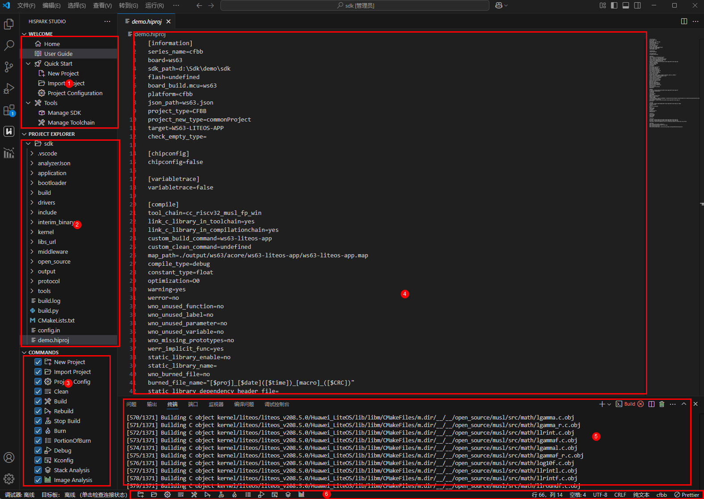

HiSpark Studio for VS Code插件当前支持的芯片和对应特性如[表1](#table82241939151116)所示。

**表 1**  HiSpark Studio for VS Code插件支持的芯片及其特性

<table><thead align="left"><tr id="row1022415396111"><th class="cellrowborder" align="center" valign="top" width="14.190000000000003%" id="mcps1.2.8.1.1">
芯片系列

</th>
<th class="cellrowborder" align="center" valign="top" width="13.040000000000001%" id="mcps1.2.8.1.2">
芯片名称

</th>
<th class="cellrowborder" align="center" valign="top" width="13.200000000000003%" id="mcps1.2.8.1.3">
工程管理

</th>
<th class="cellrowborder" align="center" valign="top" width="13.250000000000004%" id="mcps1.2.8.1.4">
编译运行

</th>
<th class="cellrowborder" align="center" valign="top" width="13.040000000000001%" id="mcps1.2.8.1.5">
一键烧录

</th>
<th class="cellrowborder" align="center" valign="top" width="15.050000000000002%" id="mcps1.2.8.1.6">
烧录配置

</th>
<th class="cellrowborder" align="center" valign="top" width="18.23%" id="mcps1.2.8.1.7">
栈分析和镜像分析

</th>
</tr>
</thead>
<tbody><tr id="row8752133319518"><td class="cellrowborder" rowspan="10" align="center" valign="top" width="14.190000000000003%" headers="mcps1.2.8.1.1 ">
短距物联

</td>
<td class="cellrowborder" align="center" valign="top" width="13.040000000000001%" headers="mcps1.2.8.1.2 ">
BS20

</td>
<td class="cellrowborder" align="center" valign="top" width="13.200000000000003%" headers="mcps1.2.8.1.3 ">
√

</td>
<td class="cellrowborder" align="center" valign="top" width="13.250000000000004%" headers="mcps1.2.8.1.4 ">
√

</td>
<td class="cellrowborder" align="center" valign="top" width="13.040000000000001%" headers="mcps1.2.8.1.5 ">
√

</td>
<td class="cellrowborder" align="center" valign="top" width="15.050000000000002%" headers="mcps1.2.8.1.6 ">
√

</td>
<td class="cellrowborder" align="center" valign="top" width="18.23%" headers="mcps1.2.8.1.7 ">
√

</td>
</tr>
<tr id="row856371715552"><td class="cellrowborder" align="center" valign="top" headers="mcps1.2.8.1.1 ">
BS20C

</td>
<td class="cellrowborder" align="center" valign="top" headers="mcps1.2.8.1.2 ">
√

</td>
<td class="cellrowborder" align="center" valign="top" headers="mcps1.2.8.1.3 ">
√

</td>
<td class="cellrowborder" align="center" valign="top" headers="mcps1.2.8.1.4 ">
√

</td>
<td class="cellrowborder" align="center" valign="top" headers="mcps1.2.8.1.5 ">
√

</td>
<td class="cellrowborder" align="center" valign="top" headers="mcps1.2.8.1.6 ">
√

</td>
</tr>
<tr id="row222433913117"><td class="cellrowborder" align="center" valign="top" headers="mcps1.2.8.1.1 ">
BS21

</td>
<td class="cellrowborder" align="center" valign="top" headers="mcps1.2.8.1.2 ">
√

</td>
<td class="cellrowborder" align="center" valign="top" headers="mcps1.2.8.1.3 ">
√

</td>
<td class="cellrowborder" align="center" valign="top" headers="mcps1.2.8.1.4 ">
√

</td>
<td class="cellrowborder" align="center" valign="top" headers="mcps1.2.8.1.5 ">
√

</td>
<td class="cellrowborder" align="center" valign="top" headers="mcps1.2.8.1.6 ">
√

</td>
</tr>
<tr id="row1151735116505"><td class="cellrowborder" align="center" valign="top" headers="mcps1.2.8.1.1 ">
BS21E

</td>
<td class="cellrowborder" align="center" valign="top" headers="mcps1.2.8.1.2 ">
√

</td>
<td class="cellrowborder" align="center" valign="top" headers="mcps1.2.8.1.3 ">
√

</td>
<td class="cellrowborder" align="center" valign="top" headers="mcps1.2.8.1.4 ">
√

</td>
<td class="cellrowborder" align="center" valign="top" headers="mcps1.2.8.1.5 ">
√

</td>
<td class="cellrowborder" align="center" valign="top" headers="mcps1.2.8.1.6 ">
√

</td>
</tr>
<tr id="row113809589516"><td class="cellrowborder" align="center" valign="top" headers="mcps1.2.8.1.1 ">
BS22

</td>
<td class="cellrowborder" align="center" valign="top" headers="mcps1.2.8.1.2 ">
√

</td>
<td class="cellrowborder" align="center" valign="top" headers="mcps1.2.8.1.3 ">
√

</td>
<td class="cellrowborder" align="center" valign="top" headers="mcps1.2.8.1.4 ">
√

</td>
<td class="cellrowborder" align="center" valign="top" headers="mcps1.2.8.1.5 ">
√

</td>
<td class="cellrowborder" align="center" valign="top" headers="mcps1.2.8.1.6 ">
√

</td>
</tr>
<tr id="row1099920117520"><td class="cellrowborder" align="center" valign="top" headers="mcps1.2.8.1.1 ">
BS26

</td>
<td class="cellrowborder" align="center" valign="top" headers="mcps1.2.8.1.2 ">
√

</td>
<td class="cellrowborder" align="center" valign="top" headers="mcps1.2.8.1.3 ">
√

</td>
<td class="cellrowborder" align="center" valign="top" headers="mcps1.2.8.1.4 ">
√

</td>
<td class="cellrowborder" align="center" valign="top" headers="mcps1.2.8.1.5 ">
√

</td>
<td class="cellrowborder" align="center" valign="top" headers="mcps1.2.8.1.6 ">
√

</td>
</tr>
<tr id="row432645295215"><td class="cellrowborder" align="center" valign="top" headers="mcps1.2.8.1.1 ">
BS21A

</td>
<td class="cellrowborder" align="center" valign="top" headers="mcps1.2.8.1.2 ">
√

</td>
<td class="cellrowborder" align="center" valign="top" headers="mcps1.2.8.1.3 ">
√

</td>
<td class="cellrowborder" align="center" valign="top" headers="mcps1.2.8.1.4 ">
√

</td>
<td class="cellrowborder" align="center" valign="top" headers="mcps1.2.8.1.5 ">
√

</td>
<td class="cellrowborder" align="center" valign="top" headers="mcps1.2.8.1.6 ">
√

</td>
</tr>
<tr id="row13345165719131"><td class="cellrowborder" align="center" valign="top" headers="mcps1.2.8.1.1 ">
BS25

</td>
<td class="cellrowborder" align="center" valign="top" headers="mcps1.2.8.1.2 ">
√

</td>
<td class="cellrowborder" align="center" valign="top" headers="mcps1.2.8.1.3 ">
√

</td>
<td class="cellrowborder" align="center" valign="top" headers="mcps1.2.8.1.4 ">
√

</td>
<td class="cellrowborder" align="center" valign="top" headers="mcps1.2.8.1.5 ">
√

</td>
<td class="cellrowborder" align="center" valign="top" headers="mcps1.2.8.1.6 ">
√

</td>
</tr>
<tr id="row579411241563"><td class="cellrowborder" align="center" valign="top" headers="mcps1.2.8.1.1 ">
WS53

</td>
<td class="cellrowborder" align="center" valign="top" headers="mcps1.2.8.1.2 ">
√

</td>
<td class="cellrowborder" align="center" valign="top" headers="mcps1.2.8.1.3 ">
√

</td>
<td class="cellrowborder" align="center" valign="top" headers="mcps1.2.8.1.4 ">
×

</td>
<td class="cellrowborder" align="center" valign="top" headers="mcps1.2.8.1.5 ">
×

</td>
<td class="cellrowborder" align="center" valign="top" headers="mcps1.2.8.1.6 ">
×

</td>
</tr>
<tr id="row176314319149"><td class="cellrowborder" align="center" valign="top" headers="mcps1.2.8.1.1 ">
WS63

</td>
<td class="cellrowborder" align="center" valign="top" headers="mcps1.2.8.1.2 ">
√

</td>
<td class="cellrowborder" align="center" valign="top" headers="mcps1.2.8.1.3 ">
√

</td>
<td class="cellrowborder" align="center" valign="top" headers="mcps1.2.8.1.4 ">
√

</td>
<td class="cellrowborder" align="center" valign="top" headers="mcps1.2.8.1.5 ">
√

</td>
<td class="cellrowborder" align="center" valign="top" headers="mcps1.2.8.1.6 ">
√

</td>
</tr>
<tr id="row1613915128"><td class="cellrowborder" rowspan="3" align="center" valign="top" width="14.190000000000003%" headers="mcps1.2.8.1.1 ">
手机穿戴

</td>
<td class="cellrowborder" align="center" valign="top" width="13.040000000000001%" headers="mcps1.2.8.1.2 ">
BRANDY

</td>
<td class="cellrowborder" align="center" valign="top" width="13.200000000000003%" headers="mcps1.2.8.1.3 ">
√

</td>
<td class="cellrowborder" align="center" valign="top" width="13.250000000000004%" headers="mcps1.2.8.1.4 ">
√

</td>
<td class="cellrowborder" align="center" valign="top" width="13.040000000000001%" headers="mcps1.2.8.1.5 ">
√

</td>
<td class="cellrowborder" align="center" valign="top" width="15.050000000000002%" headers="mcps1.2.8.1.6 ">
√

</td>
<td class="cellrowborder" align="center" valign="top" width="18.23%" headers="mcps1.2.8.1.7 ">
√

</td>
</tr>
<tr id="row1514014131196"><td class="cellrowborder" align="center" valign="top" headers="mcps1.2.8.1.1 ">
SOCMN2

</td>
<td class="cellrowborder" align="center" valign="top" headers="mcps1.2.8.1.2 ">
√

</td>
<td class="cellrowborder" align="center" valign="top" headers="mcps1.2.8.1.3 ">
√

</td>
<td class="cellrowborder" align="center" valign="top" headers="mcps1.2.8.1.4 ">
√

</td>
<td class="cellrowborder" align="center" valign="top" headers="mcps1.2.8.1.5 ">
√

</td>
<td class="cellrowborder" align="center" valign="top" headers="mcps1.2.8.1.6 ">
√

</td>
</tr>
<tr id="row034352451918"><td class="cellrowborder" align="center" valign="top" headers="mcps1.2.8.1.1 ">
3322

</td>
<td class="cellrowborder" align="center" valign="top" headers="mcps1.2.8.1.2 ">
√

</td>
<td class="cellrowborder" align="center" valign="top" headers="mcps1.2.8.1.3 ">
√

</td>
<td class="cellrowborder" align="center" valign="top" headers="mcps1.2.8.1.4 ">
√

</td>
<td class="cellrowborder" align="center" valign="top" headers="mcps1.2.8.1.5 ">
√

</td>
<td class="cellrowborder" align="center" valign="top" headers="mcps1.2.8.1.6 ">
√

</td>
</tr>
<tr id="row67644412126"><td class="cellrowborder" rowspan="5" align="center" valign="top" width="14.190000000000003%" headers="mcps1.2.8.1.1 ">
广域物联

</td>
<td class="cellrowborder" align="center" valign="top" width="13.040000000000001%" headers="mcps1.2.8.1.2 ">
NB17

</td>
<td class="cellrowborder" align="center" valign="top" width="13.200000000000003%" headers="mcps1.2.8.1.3 ">
√

</td>
<td class="cellrowborder" align="center" valign="top" width="13.250000000000004%" headers="mcps1.2.8.1.4 ">
√

</td>
<td class="cellrowborder" align="center" valign="top" width="13.040000000000001%" headers="mcps1.2.8.1.5 ">
√

</td>
<td class="cellrowborder" align="center" valign="top" width="15.050000000000002%" headers="mcps1.2.8.1.6 ">
√

</td>
<td class="cellrowborder" align="center" valign="top" width="18.23%" headers="mcps1.2.8.1.7 ">
√

</td>
</tr>
<tr id="row2177728131414"><td class="cellrowborder" align="center" valign="top" headers="mcps1.2.8.1.1 ">
NB17E

</td>
<td class="cellrowborder" align="center" valign="top" headers="mcps1.2.8.1.2 ">
√

</td>
<td class="cellrowborder" align="center" valign="top" headers="mcps1.2.8.1.3 ">
√

</td>
<td class="cellrowborder" align="center" valign="top" headers="mcps1.2.8.1.4 ">
√

</td>
<td class="cellrowborder" align="center" valign="top" headers="mcps1.2.8.1.5 ">
√

</td>
<td class="cellrowborder" align="center" valign="top" headers="mcps1.2.8.1.6 ">
√

</td>
</tr>
<tr id="row175351302145"><td class="cellrowborder" align="center" valign="top" headers="mcps1.2.8.1.1 ">
NB18

</td>
<td class="cellrowborder" align="center" valign="top" headers="mcps1.2.8.1.2 ">
√

</td>
<td class="cellrowborder" align="center" valign="top" headers="mcps1.2.8.1.3 ">
√

</td>
<td class="cellrowborder" align="center" valign="top" headers="mcps1.2.8.1.4 ">
√

</td>
<td class="cellrowborder" align="center" valign="top" headers="mcps1.2.8.1.5 ">
√

</td>
<td class="cellrowborder" align="center" valign="top" headers="mcps1.2.8.1.6 ">
√

</td>
</tr>
<tr id="row1942754735817"><td class="cellrowborder" align="center" valign="top" headers="mcps1.2.8.1.1 ">
Hi2131

</td>
<td class="cellrowborder" align="center" valign="top" headers="mcps1.2.8.1.2 ">
√

</td>
<td class="cellrowborder" align="center" valign="top" headers="mcps1.2.8.1.3 ">
√

</td>
<td class="cellrowborder" align="center" valign="top" headers="mcps1.2.8.1.4 ">
√

</td>
<td class="cellrowborder" align="center" valign="top" headers="mcps1.2.8.1.5 ">
√

</td>
<td class="cellrowborder" align="center" valign="top" headers="mcps1.2.8.1.6 ">
√

</td>
</tr>
<tr id="row22191153205817"><td class="cellrowborder" align="center" valign="top" headers="mcps1.2.8.1.1 ">
Hi2131C

</td>
<td class="cellrowborder" align="center" valign="top" headers="mcps1.2.8.1.2 ">
√

</td>
<td class="cellrowborder" align="center" valign="top" headers="mcps1.2.8.1.3 ">
√

</td>
<td class="cellrowborder" align="center" valign="top" headers="mcps1.2.8.1.4 ">
√

</td>
<td class="cellrowborder" align="center" valign="top" headers="mcps1.2.8.1.5 ">
√

</td>
<td class="cellrowborder" align="center" valign="top" headers="mcps1.2.8.1.6 ">
√

</td>
</tr>
</tbody>
</table>

<table><thead align="left"><tr id="row2657720174815"><th class="cellrowborder" align="center" valign="top" width="16.13%" id="mcps1.1.7.1.1">
芯片系列

</th>
<th class="cellrowborder" align="center" valign="top" width="16.79%" id="mcps1.1.7.1.2">
芯片名称

</th>
<th class="cellrowborder" align="center" valign="top" width="14.82%" id="mcps1.1.7.1.3">
工程调试

</th>
<th class="cellrowborder" align="center" valign="top" width="17.560000000000002%" id="mcps1.1.7.1.4">
串口控制台

</th>
<th class="cellrowborder" align="center" valign="top" width="18.33%" id="mcps1.1.7.1.5">
Kconfig

</th>
<th class="cellrowborder" align="center" valign="top" width="16.37%" id="mcps1.1.7.1.6">
CodeSize

</th>
</tr>
</thead>
<tbody><tr id="row1275813324531"><td class="cellrowborder" rowspan="10" align="center" valign="top" width="16.13%" headers="mcps1.1.7.1.1 ">
短距物联

</td>
<td class="cellrowborder" align="center" valign="top" width="16.79%" headers="mcps1.1.7.1.2 ">
BS20

</td>
<td class="cellrowborder" align="center" valign="top" width="14.82%" headers="mcps1.1.7.1.3 ">
√

</td>
<td class="cellrowborder" align="center" valign="top" width="17.560000000000002%" headers="mcps1.1.7.1.4 ">
√

</td>
<td class="cellrowborder" align="center" valign="top" width="18.33%" headers="mcps1.1.7.1.5 ">
√

</td>
<td class="cellrowborder" align="center" valign="top" width="16.37%" headers="mcps1.1.7.1.6 ">
√

</td>
</tr>
<tr id="row156021450145517"><td class="cellrowborder" align="center" valign="top" headers="mcps1.1.7.1.1 ">
BS20C

</td>
<td class="cellrowborder" align="center" valign="top" headers="mcps1.1.7.1.2 ">
√

</td>
<td class="cellrowborder" align="center" valign="top" headers="mcps1.1.7.1.3 ">
√

</td>
<td class="cellrowborder" align="center" valign="top" headers="mcps1.1.7.1.4 ">
√

</td>
<td class="cellrowborder" align="center" valign="top" headers="mcps1.1.7.1.5 ">
√

</td>
</tr>
<tr id="row166617208485"><td class="cellrowborder" align="center" valign="top" headers="mcps1.1.7.1.1 ">
BS21

</td>
<td class="cellrowborder" align="center" valign="top" headers="mcps1.1.7.1.2 ">
√

</td>
<td class="cellrowborder" align="center" valign="top" headers="mcps1.1.7.1.3 ">
√

</td>
<td class="cellrowborder" align="center" valign="top" headers="mcps1.1.7.1.4 ">
√

</td>
<td class="cellrowborder" align="center" valign="top" headers="mcps1.1.7.1.5 ">
√

</td>
</tr>
<tr id="row208491395553"><td class="cellrowborder" align="center" valign="top" headers="mcps1.1.7.1.1 ">
BS21E

</td>
<td class="cellrowborder" align="center" valign="top" headers="mcps1.1.7.1.2 ">
√

</td>
<td class="cellrowborder" align="center" valign="top" headers="mcps1.1.7.1.3 ">
√

</td>
<td class="cellrowborder" align="center" valign="top" headers="mcps1.1.7.1.4 ">
√

</td>
<td class="cellrowborder" align="center" valign="top" headers="mcps1.1.7.1.5 ">
√

</td>
</tr>
<tr id="row102766536552"><td class="cellrowborder" align="center" valign="top" headers="mcps1.1.7.1.1 ">
BS22

</td>
<td class="cellrowborder" align="center" valign="top" headers="mcps1.1.7.1.2 ">
√

</td>
<td class="cellrowborder" align="center" valign="top" headers="mcps1.1.7.1.3 ">
√

</td>
<td class="cellrowborder" align="center" valign="top" headers="mcps1.1.7.1.4 ">
√

</td>
<td class="cellrowborder" align="center" valign="top" headers="mcps1.1.7.1.5 ">
√

</td>
</tr>
<tr id="row1327712530556"><td class="cellrowborder" align="center" valign="top" headers="mcps1.1.7.1.1 ">
BS26

</td>
<td class="cellrowborder" align="center" valign="top" headers="mcps1.1.7.1.2 ">
√

</td>
<td class="cellrowborder" align="center" valign="top" headers="mcps1.1.7.1.3 ">
√

</td>
<td class="cellrowborder" align="center" valign="top" headers="mcps1.1.7.1.4 ">
√

</td>
<td class="cellrowborder" align="center" valign="top" headers="mcps1.1.7.1.5 ">
√

</td>
</tr>
<tr id="row156985158569"><td class="cellrowborder" align="center" valign="top" headers="mcps1.1.7.1.1 ">
BS21A

</td>
<td class="cellrowborder" align="center" valign="top" headers="mcps1.1.7.1.2 ">
√

</td>
<td class="cellrowborder" align="center" valign="top" headers="mcps1.1.7.1.3 ">
√

</td>
<td class="cellrowborder" align="center" valign="top" headers="mcps1.1.7.1.4 ">
√

</td>
<td class="cellrowborder" align="center" valign="top" headers="mcps1.1.7.1.5 ">
√

</td>
</tr>
<tr id="row17661182054815"><td class="cellrowborder" align="center" valign="top" headers="mcps1.1.7.1.1 ">
BS25

</td>
<td class="cellrowborder" align="center" valign="top" headers="mcps1.1.7.1.2 ">
√

</td>
<td class="cellrowborder" align="center" valign="top" headers="mcps1.1.7.1.3 ">
√

</td>
<td class="cellrowborder" align="center" valign="top" headers="mcps1.1.7.1.4 ">
√

</td>
<td class="cellrowborder" align="center" valign="top" headers="mcps1.1.7.1.5 ">
√

</td>
</tr>
<tr id="row3662152014814"><td class="cellrowborder" align="center" valign="top" headers="mcps1.1.7.1.1 ">
WS53

</td>
<td class="cellrowborder" align="center" valign="top" headers="mcps1.1.7.1.2 ">
×

</td>
<td class="cellrowborder" align="center" valign="top" headers="mcps1.1.7.1.3 ">
×

</td>
<td class="cellrowborder" align="center" valign="top" headers="mcps1.1.7.1.4 ">
×

</td>
<td class="cellrowborder" align="center" valign="top" headers="mcps1.1.7.1.5 ">
√

</td>
</tr>
<tr id="row15662020134810"><td class="cellrowborder" align="center" valign="top" headers="mcps1.1.7.1.1 ">
WS63

</td>
<td class="cellrowborder" align="center" valign="top" headers="mcps1.1.7.1.2 ">
√

</td>
<td class="cellrowborder" align="center" valign="top" headers="mcps1.1.7.1.3 ">
√

</td>
<td class="cellrowborder" align="center" valign="top" headers="mcps1.1.7.1.4 ">
√

</td>
<td class="cellrowborder" align="center" valign="top" headers="mcps1.1.7.1.5 ">
√

</td>
</tr>
<tr id="row066322014487"><td class="cellrowborder" rowspan="3" align="center" valign="top" width="16.13%" headers="mcps1.1.7.1.1 ">
手机穿戴

</td>
<td class="cellrowborder" align="center" valign="top" width="16.79%" headers="mcps1.1.7.1.2 ">
BRANDY

</td>
<td class="cellrowborder" align="center" valign="top" width="14.82%" headers="mcps1.1.7.1.3 ">
√

</td>
<td class="cellrowborder" align="center" valign="top" width="17.560000000000002%" headers="mcps1.1.7.1.4 ">
√

</td>
<td class="cellrowborder" align="center" valign="top" width="18.33%" headers="mcps1.1.7.1.5 ">
×

</td>
<td class="cellrowborder" align="center" valign="top" width="16.37%" headers="mcps1.1.7.1.6 ">
√

</td>
</tr>
<tr id="row258119818219"><td class="cellrowborder" align="center" valign="top" headers="mcps1.1.7.1.1 ">
SOCMN2

</td>
<td class="cellrowborder" align="center" valign="top" headers="mcps1.1.7.1.2 ">
√

</td>
<td class="cellrowborder" align="center" valign="top" headers="mcps1.1.7.1.3 ">
√

</td>
<td class="cellrowborder" align="center" valign="top" headers="mcps1.1.7.1.4 ">
×

</td>
<td class="cellrowborder" align="center" valign="top" headers="mcps1.1.7.1.5 ">
√

</td>
</tr>
<tr id="row09611137214"><td class="cellrowborder" align="center" valign="top" headers="mcps1.1.7.1.1 ">
3322

</td>
<td class="cellrowborder" align="center" valign="top" headers="mcps1.1.7.1.2 ">
√

</td>
<td class="cellrowborder" align="center" valign="top" headers="mcps1.1.7.1.3 ">
√

</td>
<td class="cellrowborder" align="center" valign="top" headers="mcps1.1.7.1.4 ">
×

</td>
<td class="cellrowborder" align="center" valign="top" headers="mcps1.1.7.1.5 ">
√

</td>
</tr>
<tr id="row136637202484"><td class="cellrowborder" rowspan="5" align="center" valign="top" width="16.13%" headers="mcps1.1.7.1.1 ">
广域物联

</td>
<td class="cellrowborder" align="center" valign="top" width="16.79%" headers="mcps1.1.7.1.2 ">
NB17

</td>
<td class="cellrowborder" align="center" valign="top" width="14.82%" headers="mcps1.1.7.1.3 ">
√

</td>
<td class="cellrowborder" align="center" valign="top" width="17.560000000000002%" headers="mcps1.1.7.1.4 ">
√

</td>
<td class="cellrowborder" align="center" valign="top" width="18.33%" headers="mcps1.1.7.1.5 ">
×

</td>
<td class="cellrowborder" align="center" valign="top" width="16.37%" headers="mcps1.1.7.1.6 ">
×

</td>
</tr>
<tr id="row1266442019481"><td class="cellrowborder" align="center" valign="top" headers="mcps1.1.7.1.1 ">
NB17E

</td>
<td class="cellrowborder" align="center" valign="top" headers="mcps1.1.7.1.2 ">
√

</td>
<td class="cellrowborder" align="center" valign="top" headers="mcps1.1.7.1.3 ">
√

</td>
<td class="cellrowborder" align="center" valign="top" headers="mcps1.1.7.1.4 ">
×

</td>
<td class="cellrowborder" align="center" valign="top" headers="mcps1.1.7.1.5 ">
×

</td>
</tr>
<tr id="row116641220134820"><td class="cellrowborder" align="center" valign="top" headers="mcps1.1.7.1.1 ">
NB18

</td>
<td class="cellrowborder" align="center" valign="top" headers="mcps1.1.7.1.2 ">
√

</td>
<td class="cellrowborder" align="center" valign="top" headers="mcps1.1.7.1.3 ">
√

</td>
<td class="cellrowborder" align="center" valign="top" headers="mcps1.1.7.1.4 ">
×

</td>
<td class="cellrowborder" align="center" valign="top" headers="mcps1.1.7.1.5 ">
×

</td>
</tr>
<tr id="row254113313534"><td class="cellrowborder" align="center" valign="top" headers="mcps1.1.7.1.1 ">
Hi2131

</td>
<td class="cellrowborder" align="center" valign="top" headers="mcps1.1.7.1.2 ">
√

</td>
<td class="cellrowborder" align="center" valign="top" headers="mcps1.1.7.1.3 ">
√

</td>
<td class="cellrowborder" align="center" valign="top" headers="mcps1.1.7.1.4 ">
√

</td>
<td class="cellrowborder" align="center" valign="top" headers="mcps1.1.7.1.5 ">
√

</td>
</tr>
<tr id="row3715149145317"><td class="cellrowborder" align="center" valign="top" headers="mcps1.1.7.1.1 ">
Hi2131C

</td>
<td class="cellrowborder" align="center" valign="top" headers="mcps1.1.7.1.2 ">
√

</td>
<td class="cellrowborder" align="center" valign="top" headers="mcps1.1.7.1.3 ">
√

</td>
<td class="cellrowborder" align="center" valign="top" headers="mcps1.1.7.1.4 ">
√

</td>
<td class="cellrowborder" align="center" valign="top" headers="mcps1.1.7.1.5 ">
√

</td>
</tr>
</tbody>
</table>

> **说明：** 
>芯片系列中，“短距物联”、“手机穿戴”、“广域物联”统一属于FBB系列，文档中FBB系列芯片指代这三个芯片系列。

# 开发环境搭建

## 概述

当前版本仅支持Windows10和Windows11系统，本章节主要介绍Windows10和Windows11系统上的开发环境搭建。

## 安装要求

-   操作系统要求：支持64位Windows10或64位Windows11。
-   VS Code版本要求：1.80.2及以上。
-   硬盘要求：至少有900MB的硬盘空间来安装HiSpark Studio for VS Code插件。
-   内存要求：HiSpark Studio for VS Code插件最低要求为1GB RAM，建议至少有4GB RAM来安装运行HiSpark Studio for VS Code插件。
-   CPU：HiSpark Studio for VS Code插件最低要求为1.6GHz或者更高的处理器。
-   C盘空间要求：建议至少有1GB的C盘剩余空间。

## 安装HiSpark Studio for VS Code插件

1.  打开VS Code插件市场在搜索框中搜索HiSpark Studio。

    **图 1**  VS Code插件市场搜索框  
    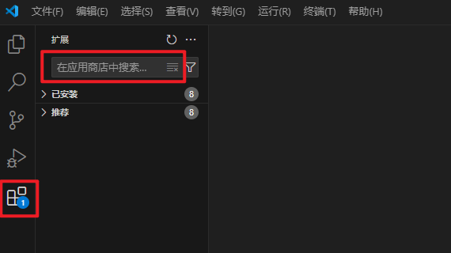

2.  搜索结果中选择HiSpark Studio for VS Code，点击安装即可。

## 工具链toolchain配置

HiSpark Studio for VS Code插件在对工程进行编译等操作需要依赖工具链、python以及pip依赖的环境。可以使用插件中的Download Toolchain功能进行工具链等的自动下载和安装。

**图 1**  Download Toolchain功能  
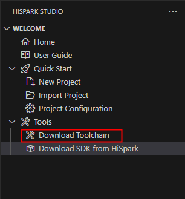

点击Download Toolchain功能后，会依次下载python3.11.4、pip、pip的依赖（tkinter-embed、cmake、kconfiglib、pycparser、pillow、numpy、opencv\_python、以及windows\_curses）以及编译所需的tools工具。下载过程VS Code右下角通知栏会有对应的工具下载提示以及进度展示。compiler由于文件比较大，下载时间较长，请耐心等待。

**图 2**  Toolchain下载进度展示（部分）  
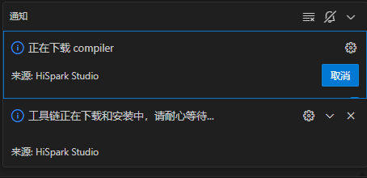

下载结束后，具体的下载内容位于VS Code的安装目录下的“..Microsoft VS Code\\resources\\app\\downloads”目录下。

**图 3**  Toolchain下载目录  
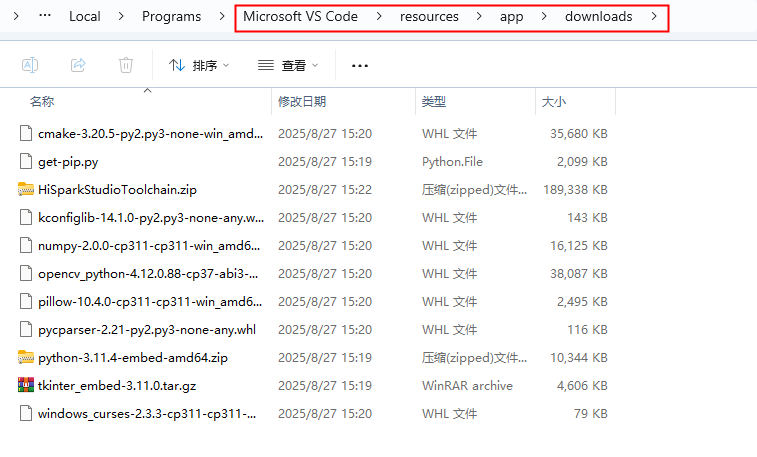

python3.11.4安装好后，会对pip的依赖进行安装，以及编译工具链的解压，右下角会有对应的通知弹框提示，全部安装完成会提示环境准备完成。

**图 4**  python3.11.4安装完成后的pip依赖及工具链的解压提示  
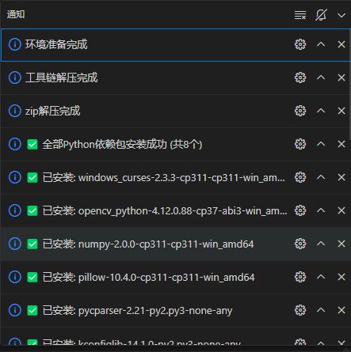

在环境准备中，会将下载在VS Code安装目录下“..Microsoft VS Code\\resources\\app\\downloads\\HiSparkStudioToolchain.zip”的这个zip压缩包解压到安装目录下的“..Microsoft VS Code\\tools”中。

**图 5**  编译工具链解压结果  
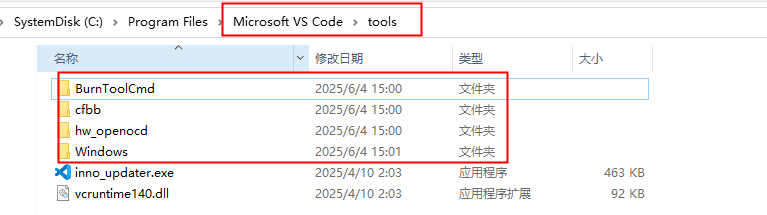

python环境可以通过在安装目录下的“..Microsoft VS Code\\tools\\python”路径下打开cmd（命令提示符）窗口中进行验证。执行“python.exe --version”输出结果为‘Python 3.11.4’，以及执行“python.exe  -m pip list”命令输出结果显示有tkinter-embed、cmake、kconfiglib、pycparser、pillow、numpy、opencv\_python、以及windows\_curses这些pip的依赖及其对应版本，则验证python环境已没有问题。

**图 6**  python环境验证  
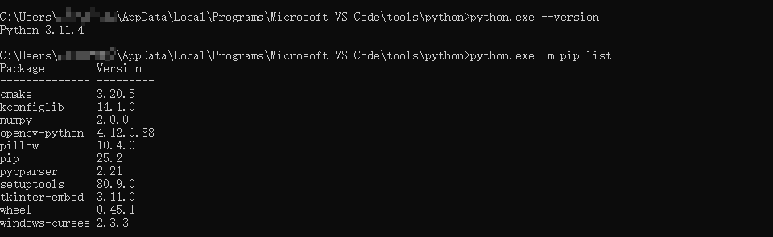

> **说明：** 
>如果由于环境或其他原因导致自动配置toolchain环境失败，用户也可以手动进行配置：
>-   python手动下载链接：[https://www.python.org/ftp/python/3.11.4/python-3.11.4-embed-amd64.zip](https://www.python.org/ftp/python/3.11.4/python-3.11.4-embed-amd64.zip)，将该文件解压到“..Microsoft VS Code\\tools”目录下（Microsoft VS Code根目录可通过右键VS Code快捷方式选中打开文件位置找到），并将解压后文件命名为python。
>    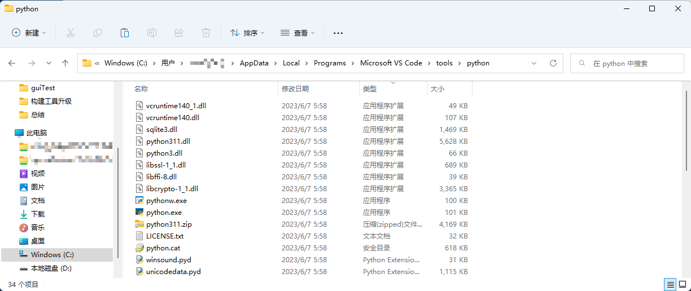
>-   下载“get-pip.py”文件至“..Microsoft VS Code\\tools\\python”目录下，在该目录下代开cmd执行“python.exe get-pip.py”命令，安装pip。
>    get-pip.py：[https://bootstrap.pypa.io/get-pip.py](https://bootstrap.pypa.io/get-pip.py)
>-   修改“..Microsoft VS Code\\tools\\python\\python311.\_pth”文件，删除“\#import site”前的\#号。
>    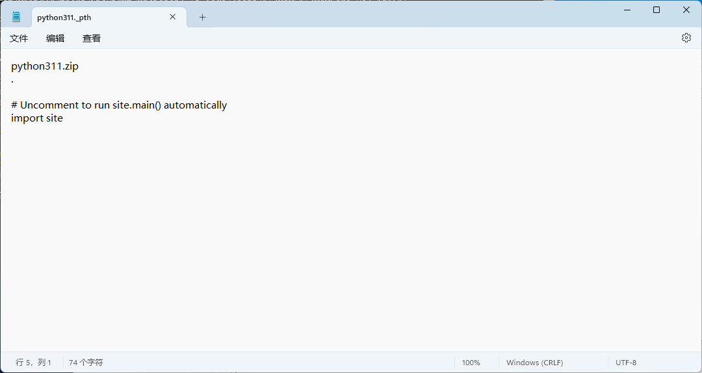
>-   pip依赖准备需要下载对应依赖的whl文件至“..Microsoft VS Code\\tools\\python”目录下，并在该目录下打开cmd执行“python.exe -m pip install xx.whl”命令，如下载cmake的whl文件为“cmake-3.20.5-py2.py3-none-win\_amd64.whl”，则在下载文件目录下打开cmd执行“python.exe -m pip install make-3.20.5-py2.py3-none-win\_amd64.whl”即可。各依赖的whl文件下载链接如下：
>    cmake：
>    [https://mirrors.cloud.tencent.com/pypi/packages/65/7f/80cf681cd376834b442af8af48e6f17b4197d20b7255aa2f76d8d93a9e44/cmake-3.20.5-py2.py3-none-win\_amd64.whl](https://mirrors.cloud.tencent.com/pypi/packages/65/7f/80cf681cd376834b442af8af48e6f17b4197d20b7255aa2f76d8d93a9e44/cmake-3.20.5-py2.py3-none-win_amd64.whl)
>    kconfiglib：
>    [https://mirrors.cloud.tencent.com/pypi/packages/8a/f1/d98a89231e779b079b977590efcc31249d959c8f1d4b5858cad69695ff9c/kconfiglib-14.1.0-py2.py3-none-any.whl](https://mirrors.cloud.tencent.com/pypi/packages/8a/f1/d98a89231e779b079b977590efcc31249d959c8f1d4b5858cad69695ff9c/kconfiglib-14.1.0-py2.py3-none-any.whl)
>    pycparser：
>    [https://mirrors.cloud.tencent.com/pypi/packages/62/d5/5f610ebe421e85889f2e55e33b7f9a6795bd982198517d912eb1c76e1a53/pycparser-2.21-py2.py3-none-any.whl](https://mirrors.cloud.tencent.com/pypi/packages/62/d5/5f610ebe421e85889f2e55e33b7f9a6795bd982198517d912eb1c76e1a53/pycparser-2.21-py2.py3-none-any.whl)
>    pillow：
>    [https://mirrors.cloud.tencent.com/pypi/packages/c1/d0/5866318eec2b801cdb8c82abf190c8343d8a1cd8bf5a0c17444a6f268291/pillow-10.4.0-cp311-cp311-win\_amd64.whl](https://mirrors.cloud.tencent.com/pypi/packages/c1/d0/5866318eec2b801cdb8c82abf190c8343d8a1cd8bf5a0c17444a6f268291/pillow-10.4.0-cp311-cp311-win_amd64.whl)
>    numpy：
>    [https://mirrors.cloud.tencent.com/pypi/packages/9b/0f/022ca4783b6e6239a53b988a4d315d67f9ae7126227fb2255054a558bd72/numpy-2.0.0-cp311-cp311-win\_amd64.whl](https://mirrors.cloud.tencent.com/pypi/packages/9b/0f/022ca4783b6e6239a53b988a4d315d67f9ae7126227fb2255054a558bd72/numpy-2.0.0-cp311-cp311-win_amd64.whl)
>    opencv\_python：
>    [https://mirrors.cloud.tencent.com/pypi/packages/fa/80/eb88edc2e2b11cd2dd2e56f1c80b5784d11d6e6b7f04a1145df64df40065/opencv\_python-4.12.0.88-cp37-abi3-win\_amd64.whl](https://mirrors.cloud.tencent.com/pypi/packages/fa/80/eb88edc2e2b11cd2dd2e56f1c80b5784d11d6e6b7f04a1145df64df40065/opencv_python-4.12.0.88-cp37-abi3-win_amd64.whl)
>    windows\_curses：
>    [https://mirrors.cloud.tencent.com/pypi/packages/18/1b/e06eb41dad1c74f0d3124218084f258f73a5e76c67112da0ba174162670f/windows\_curses-2.3.3-cp311-cp311-win\_amd64.whl](https://mirrors.cloud.tencent.com/pypi/packages/18/1b/e06eb41dad1c74f0d3124218084f258f73a5e76c67112da0ba174162670f/windows_curses-2.3.3-cp311-cp311-win_amd64.whl)
>-   下载tkinter压缩包至“..Microsoft VS Code\\tools\\python”目录下，并在该目录下打开cmd执行“python.exe -m pip install --target .\\ tkinter\_embed-3.11.0.tar.gz”命令
>    tkinter压缩包：
>    [https://mirrors.cloud.tencent.com/pypi/packages/a2/b5/01fa4f6b1b78b01c1602d8e6e28879dcbef2d399d934f28d3324c1114552/tkinter\_embed-3.11.0.tar.gz](https://mirrors.cloud.tencent.com/pypi/packages/a2/b5/01fa4f6b1b78b01c1602d8e6e28879dcbef2d399d934f28d3324c1114552/tkinter_embed-3.11.0.tar.gz)
>-   添加“toolChain.json”至“..Microsoft VS Code\\tools\\python”目录下，并添加python路径内容至“toolChain.json”中。
>    \{
>    "pythonDir": "..Microsoft VS Code\\\\tools\\\\python"
>    \}
>    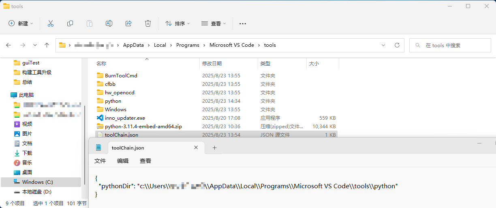
>-   工具链可以手动通过[https://hispark-obs.obs.cn-east-3.myhuaweicloud.com/HiSparkStudioToolchain.zip](https://hispark-obs.obs.cn-east-3.myhuaweicloud.com/HiSparkStudioToolchain.zip)链接下载，然后解压至“..Microsoft VS Code\\tools”目录下。
>-   工具链的环境和python环境的验证可以参考[图5 编译工具链解压结果](#fig136041725175413)和[图6 python环境验证](#fig96129314195)。

## SDK下载

HiSpark Studio for VS Code插件中创建工程需要依赖SDK软件包，插件当前提供WS63和BS2X系列的SDK下载。

**图 1**  Download SDK from HiSpark功能  
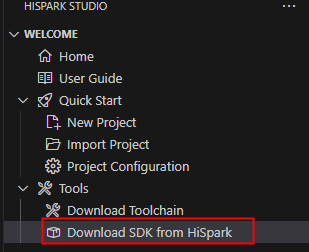

点击“Download SDK from HiSpark”后，弹出SDK下载列表。

**图 2**  SDK下载列表  
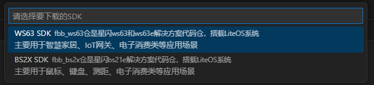

选中任意SDK，会弹出“选择SDK保存位置”选项。

**图 3**  SDK保存位置选择  
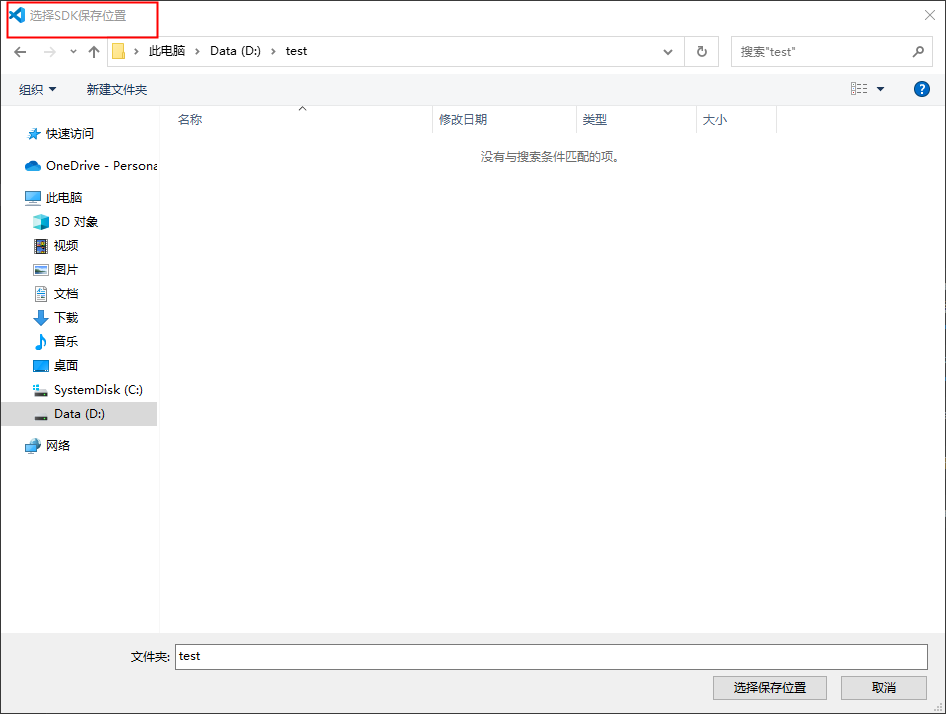

选中保存文件夹后，右下角弹窗提示，当前正在下载SDK，如果等待时间过长，可能由于环境原因或者当前没有下载gitee的权限，需要用户自行检查。

**图 4**  下载SDK提示框  
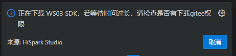

SDK下载完成后，用户可根据SDK来进行工程创建。

> **须知：** 
>-   为避免SDK下载后与其他文件夹相互影响，建议选择SDK保存位置时选择一个空文件夹。
>-   WS63 SDK在线下载是从通过git clone  [https://gitee.com/HiSpark/fbb\_ws63.git](https://gitee.com/HiSpark/fbb_ws63.git)下载，如果没有下载gitee代码的权限，会导致下载时间过长最终失败。
>-   BS2X SDK在线下载是从通过git clone  [https://gitee.com/HiSpark/fbb\_bs2x.git](https://gitee.com/HiSpark/fbb_bs2x.git)下载，如果没有下载gitee代码的权限，会导致下载时间过长最终失败。

## bash环境准备

该小节仅针对于需要依赖bash环境才可以编译的Hi2131、Hi2131C工程。

如果需要编译Hi2131、Hi2131C的工程，用户需手动下载Git并将bash路径添加到环境变量中。

下载链接：[https://github.com/git-for-windows/git/releases/download/v2.48.1.windows.1/Git-2.48.1-64-bit.exe](https://github.com/git-for-windows/git/releases/download/v2.48.1.windows.1/Git-2.48.1-64-bit.exe)

如果Windows系统System32下默认有“bash.exe”，需要删除其系统下的“bash.exe”，使用安装的git下内置的“bash.exe”。

完成后，重启VS Code使新环境变量生效，即可正常编译工程。

**图 1**  删除Windows系统库的bash  
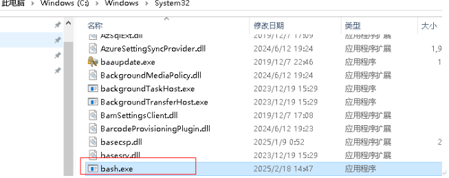

**图 2**  Git下的bash路径  
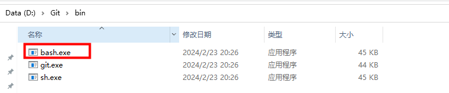

**图 3**  添加到环境变量中  
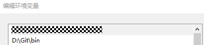

**图 4**  保证Git下的bash被调用  
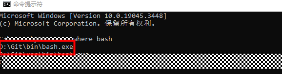

# 工程管理

## 新建工程

1.  打开HiSpark Studio for VS Code插件，进入欢迎页面，单击“新建工程”，进入新建工程页面。

    **图 1**  HiSpark Studio for VS Code插件欢迎页面  
    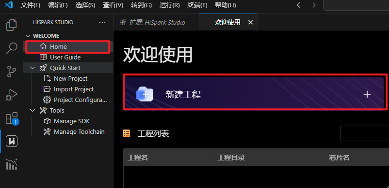

2.  在[图2](#fig2784311111318)界面配置工程参数，单击“完成”。

    **图 2**  新建工程窗口  
    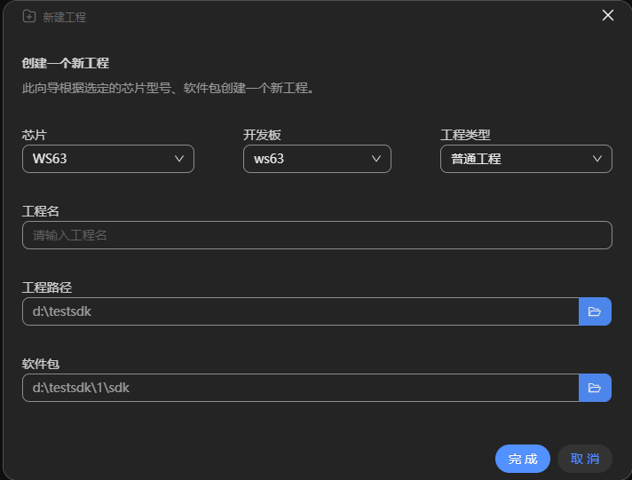

    -   芯片：选择工程使用的芯片名称。
    -   开发板：选择工程使用的开发板名称。当用户不需要自定义开发板时，默认芯片名作为开发板名。
    -   工程类型：选择创建的工程类型。普通工程和sample工程，sample工程当前只支持WS63芯片。
    -   工程名：输入工程名称。
    -   工程路径：选择用于存放工程文件的目录。
    -   软件包：选择工程使用的软件开发驱动包（SDK）文件夹根目录。

    当芯片选择WS63，且工程类型选择“sample工程后”，工程界面会新增“sample”路径和“sample选择”选项，如[图3](#fig16606922141519)所示。

    **图 3**  sample工程创建页面  
    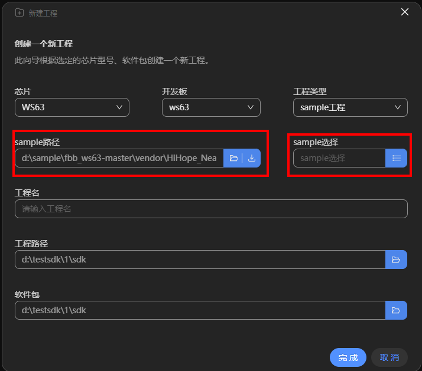

    sample路径可以从本地导入（路径目录下应该包含“build\_config.json文件”），或者直接选择一个空文件夹目录，单击下载的图标按钮，会自动将sample文件下载到选择的空文件夹目录中，然后单击sample选择，弹出如[图4](#fig111743454160)所示界面。

    **图 4**  sample选择页面  
    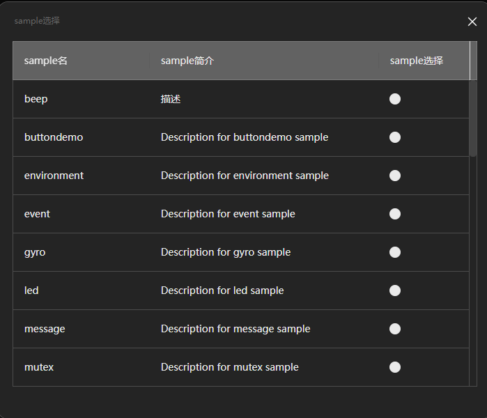

    选择需要的sample后，关闭sample选择页面，选择的sample选项名会填充到新建工程页面中的“sample选择”中，如[图5](#fig9923152471712)所示。

    > **注意：** 
    >sample在线下载是从通过git clone  [https://gitee.com/HiSpark/fbb\_ws63.git](https://gitee.com/HiSpark/fbb_ws63.git)下载，如果没有下载gitee代码的权限，会导致下载时间过长最终失败。

    **图 5**  sample选择完成后页面  
    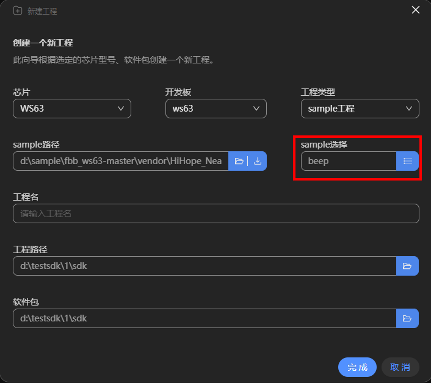

    后续选择合适的工程名、工程路径和WS63的软件包，单击“完成”即可创建工程。

3.  查看工程创建结果。

    HiSpark Studio for VS Code插件会自动打开新创建的工程，并在欢迎界面工程列表中显示创建的工程，如[图6](#fig551738161718)所示。

    **图 6**  工程创建结果页面  
    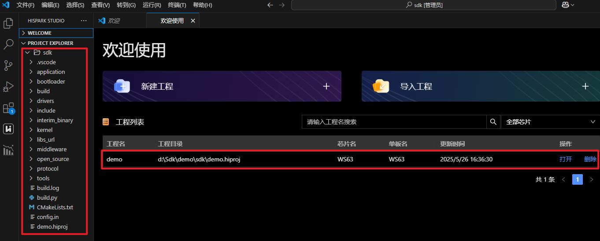

## 导入工程

1.  打开HiSpark Studio for VS Code插件，进入到欢迎页面，单击“导入工程”，进入导入工程页面。

    **图 1**  HiSpark Studio for VS Code插件导入工程页面  
    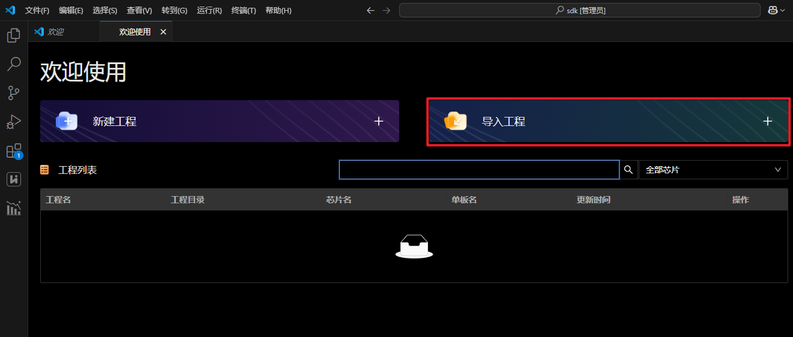

2.  选择导入的路径，即可查找该路径下所有的工程，勾选需要导入的工程，单击“完成”。

    **图 2**  导入工程配置页面  
    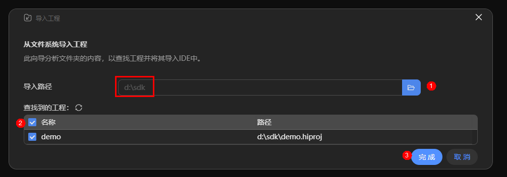

3.  导入工程完成后，会在工程区展示出工程的文件夹，并在欢迎界面的工程列表中展示已导入的工程。

    **图 3**  导入工程完成  
    

# 工程配置

工程配置主要用于配置工程的基本信息、编译、调试、烧录等工程配置项，单击“”按钮可以打开工程配置界面，如[图1](#fig672755464817)所示。

**图 1**  单击工程配置按钮  
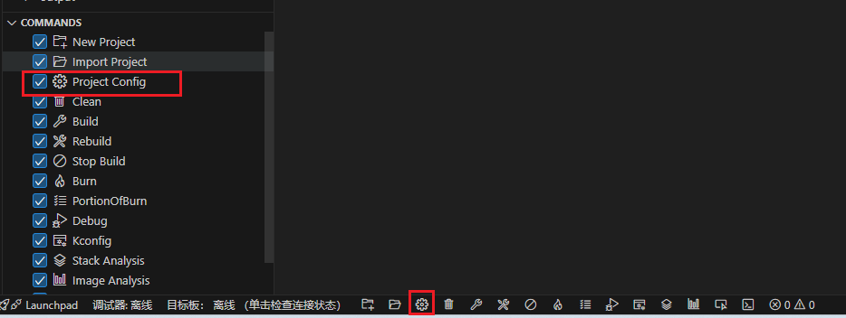

## 基本信息配置

单击工程配置界面左侧“基本信息”页签进入基本信息配置界面，如[图1](#fig18947542448)所示。该界面包含工程芯片系列、开发板型号、软件包路径，可以修改工程所对应的软件包路径。

**图 1**  基本信息配置界面  
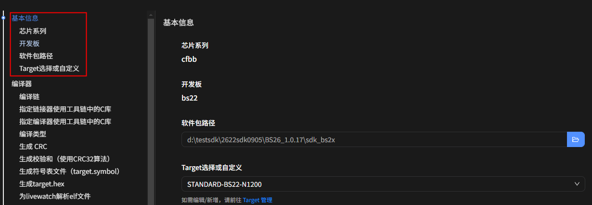

-   基本系列配置界面里，Target选择框以及关联的Target管理功能仅在部分FBB芯片中可生效：
    1.  仅支持Target选择的芯片包含BS20、BS20C、BS21、BS21E、BS21A、BS22、BS26、WS63、BRANDY。
    2.  既支持Target选择又支持Target管理的芯片包含BS20、BS20C、BS21、BS21E、BS21A、BS22、BS26。

-   以下指南仅针对上述涉及到Target功能的芯片：
    1.  如[图2](#fig1942333014511)所示，通过选取不同的Target，可配合编译生成不同的编译产物。

        **图 2**  Target选择界面  
        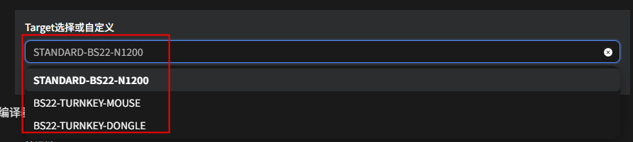

    2.  单击Target选项框下方的 "Target 管理"，可进入Target管理界面，如[图3](#fig1648301431310)所示。

        **图 3**  Target管理界面  
        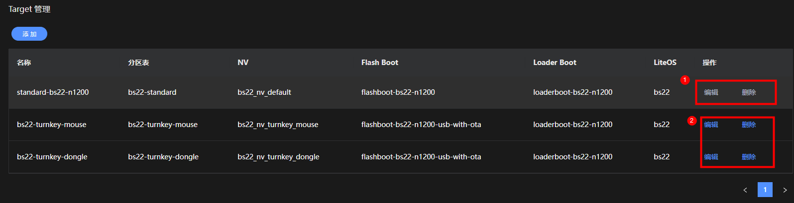

        ① 不支持编辑和删除的SDK默认Target。

        ② 支持编译和删除的Target。

    3.  单击Target管理界面的“添加”，可进入添加Target界面，如[图4](#fig13409104010130)所示。

        **图 4**  添加Target界面  
        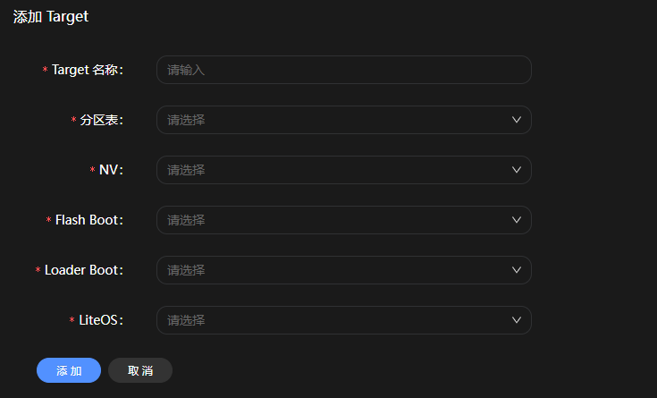

    4.  当用户添加或者删除时，切换回工程配置界面的Target选项中，也会同步生效。以添加Target为例，当新增一个demo的Target后，如[图5](#fig899411161410)，工程配置界面Target下拉框也会同步更新DEMO选项，如[图6](#fig38170493913)。

        **图 5**  添加名称为demo的Target  
        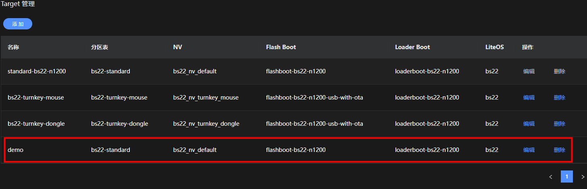

        **图 6**  Target下拉框同步更新DEMO  
        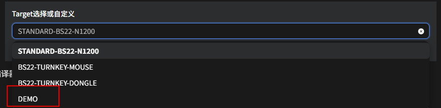

        如[图7](#fig8566412205415)所示，配置之后的Target参数宏信息会生成在如图target\_config目录下的“.config”文件中。

        **图 7**  Target配置文件  
        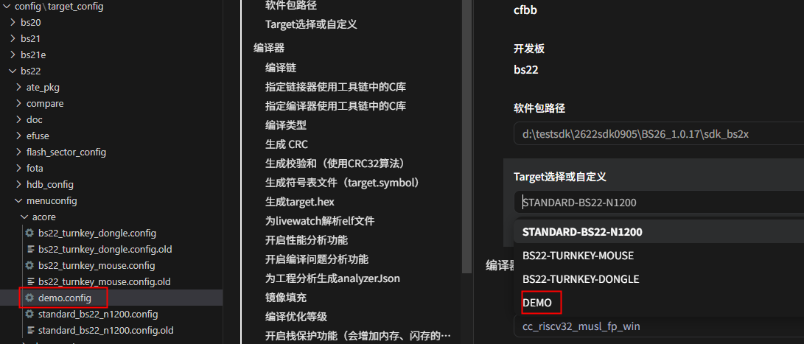

        Target支持选择和自定义，单击Target选项框可以从Target列表中选择需要的Target，也可以自定义Target和编译的指令。

        **图 8**  Target自定义  
        

        > **须知：** 
        >-   Target支持选择和自定义，每次自定义时均需要手动输入完整的自定义Target及命令，不支持在选择或自定义的Target基础上二次编辑，也就是每次自定义Target时均从第一个字符开始输入编辑；
        >-   Target自定义时，如果输入的Target为列表中已有的Target，在此基础上新增其他编译命令，如果编译能正常通过，调试和烧录均能正常执行
        >-   Target自定义时，如果输入的Target为列表中没有的Target，在此基础上进行编译，如果编译能正常通过，由于没有绑定elf和map文件，调试和栈分析镜像分析功能会受到影响，并且，自定义列表中没有的Target后重新打开工程配置，会提示launch.json缺失影响调试功能，此为正常现象。

## 编译器配置

单击工程配置界面左侧“编译器”页签进入编译器配置界面，如[图1](#fig177671416389)、[图2](#fig892832183814)、[图3](#fig1020319297387)、[图4](#fig1514082619416)所示，该界面可配置工程使用的编译工具链、编译类型、编译选项、编译指令、编译结果文件路径以及静态库等配置。

**图 1**  编译器配置界面-1  

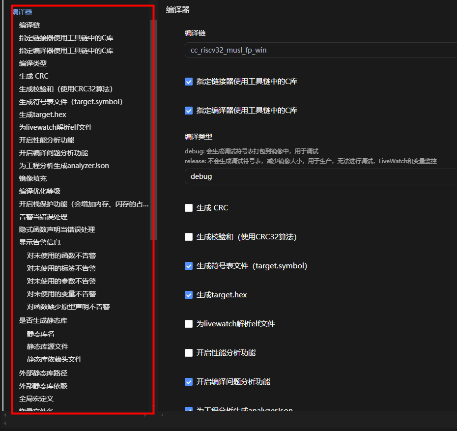

**图 2**  编译器配置界面-2  

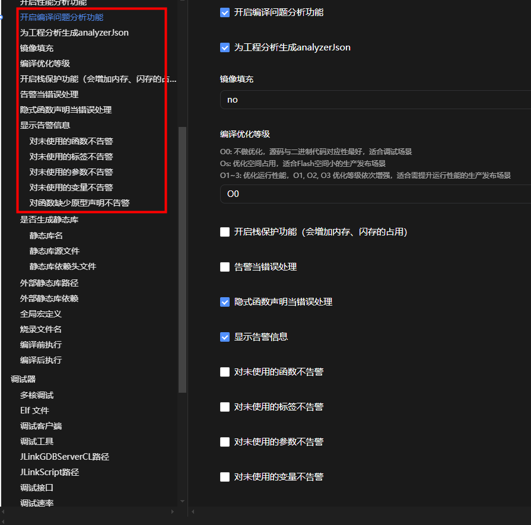

**图 3**  编译器配置界面-3  

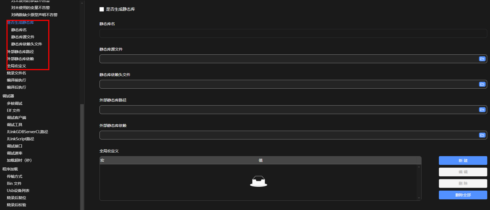

**图 4**  编译器配置界面-4  

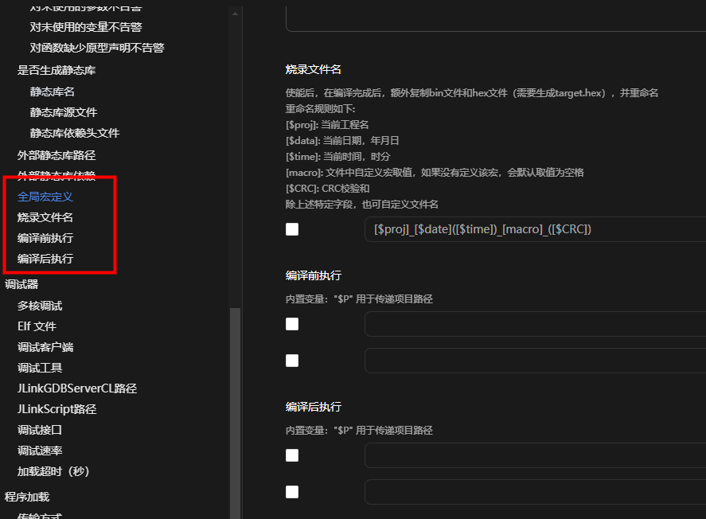

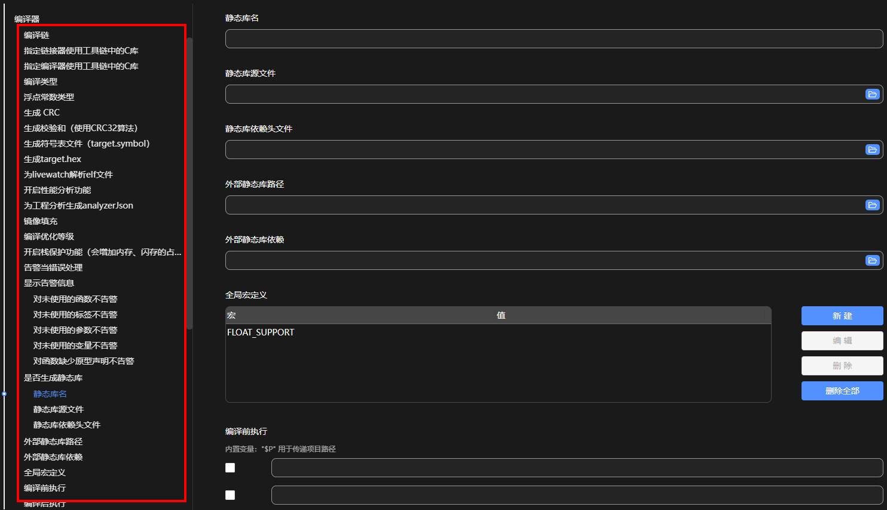

-   编译链：编译所使用的工具链。
-   指定链接器使用工具链中的C库：指定链接器使用工具链中的C库。
-   指定编译器使用工具链中的C库：指定编译器使用工具链中的C库。
-   编译类型：分debug和release。
    -   debug会生成调试符号表打包到镜像中，方便调试。
    -   release不会生成调试符号表，减少镜像大小，用于生产。

-   浮点常数类型：分float和double。
    -   float可以提高程序的运行速度，但是可能会导致精度损失，因为单精度浮点数只能表示有限的数字范围和精度。
    -   double可以提升浮点运算的计算精度，但是会占用更大的内存空间，也会增加耗时。

-   生成CRC：用于控制编译时是否会在“target.bin”和“target.hex”末尾插入CRC算法计算的结果。
-   生成校验和（使用CRC32算法）：在可执行文件中不插入CRC算法计算结果，但是将结果保存在同级目录下的“checksum\_list.txt”中，并在编译过程中打印出来。
-   生成符号表文件（target.symbol）：可在编译后通过“out/bin”目录下的“target.elf”文件生成“target.symbol”符号表文件，文件位于“out/bin”目录下。
-   生成target.hex：用于控制编译时是否会生成“target.hex”。
-   为Live Watch解析elf文件：用于控制编译时是否会解析elf中的全局变量，解析的结果会在调试功能的Live Watch中使用。
-   为工程分析生成analyzerJson：用于控制编译时是否会静态的分析工程，分析的结果会用于栈分析和镜像分析。
-   镜像填充。
    -   no：无填充。
    -   0：多余空间填0。
    -   1：多余空间填1。

-   编译优化等级：编译优化选项。
    -   O0：不做优化，源码与二进制代码对应性最好，适合调试场景。
    -   Os：优化空间占用，适合Flash空间小的生产发布场景。
    -   O1\~3：优化运行性能，O1、O2、O3优化等级依次增强，适合需提升运行性能的生产发布场景。

-   开启栈保护功能（会增加内存、闪存的占用）。
-   告警当错误处理。
-   显示告警信息。
    -   对未使用的函数不告警：忽略声明但未使用的静态函数发出的警告。
    -   对未使用的标签不告警：忽略给声明但未使用的标签发出的警告。
    -   对未使用的参数不告警：忽略给声明但未使用的参数发出的警告。
    -   对未使用的变量不告警：忽略给声明但未使用的变量发出的警告。
    -   对函数缺少原型声明不告警：忽略在使用函数前没有声明而发出的警告。

-   是否生成静态库：若选中，选中的文件编译生成静态库文件；若不选中，则不会在编译时生成静态库文件。
    -   静态库名

        输入静态库的名字，如“demo”，编译之后会生成在“out\\libs”目录下生成“libdemo.a”。

    -   静态库源文件

        选择想要编译成静态库的文件或者文件夹。

    -   静态库依赖头文件

        选择编译静态库需要依赖的头文件，支持文件和文件夹。

-   外部静态库路径。

    配置不在本工程目录下面的静态库文件参与编译。

-   外部静态库依赖。

    配置不在本工程目录下面的静态库依赖头参与编译。

-   全局宏定义。

    配置在整个工程中都有效的宏定义。

-   编译前执行。

    自定义1～2条指令，被勾选的指令将在编译前执行。命令中可以使用内置变量：$P（当前工程路径）。

-   编译后执行。

    自定义1～2条指令，被勾选的指令将在编译后执行。命令中可以使用内置变量：$P（当前工程路径）。

    > **说明：** 
    >修改配置之后会自动保存并生效。文本输入框中的修改会在失焦时自动保存并生效。

## 烧录器配置

单击工程配置界面左侧“程序加载”页签进入程序加载配置界面，如[图1](#fig1851473982716)所示，该界面支持配置烧录传输方式以及传输方式对应的参数。

**图 1**  程序加载配置界面  
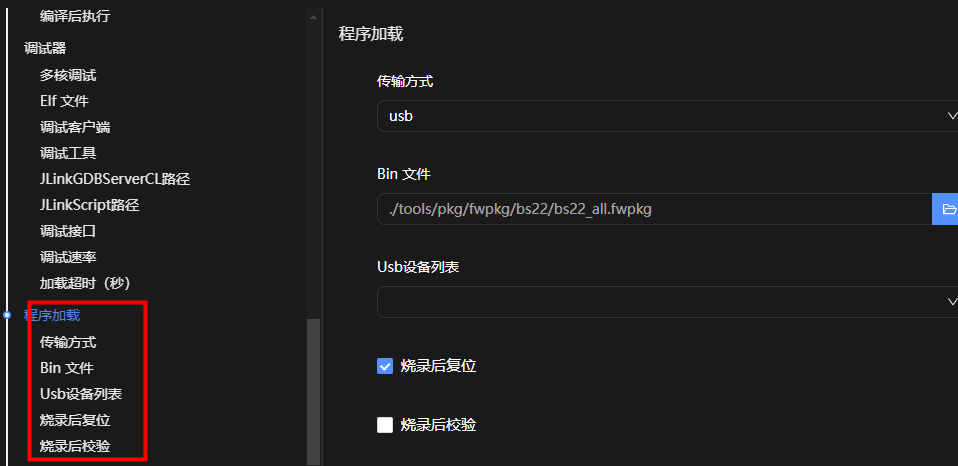

-   传输方式：选择数据传输方式。选择不同的传输方式会出现不同的参数配置项。
    -   serial：选择通过串口传输。如[图2](#fig58771855184310)所示。

        -   端口
        -   波特率

        **图 2**  选择serial配置界面  
        
        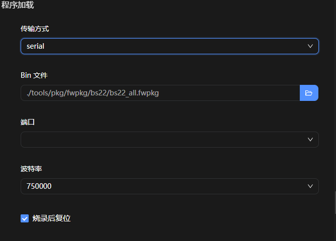

    -   usb：选择通过USB设备完成烧写升级。如[图3](#fig10468263017)所示。（当前usb模式支持BS20、BS20C、BS21、BS21A、BS21E、BS22、BS25、BS26系列芯片。）
        -   usb设备列表

            **图 3**  选择usb配置界面  
            
            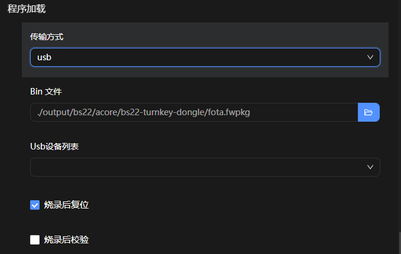

        -   如图所示，切换usb模式时，会修改默认Bin文件，且仅支持程序加载，不支持烧录配置。

            **图 4**  传输方式改为usb模式  
            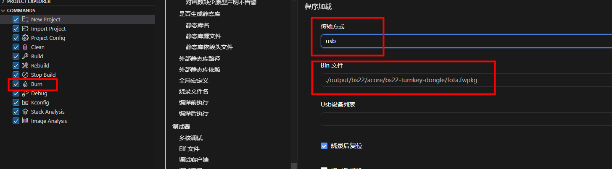

-   Bin文件：指定需要烧录的文件。
-   烧录后复位：烧录完成后，会进行单板软复位。
-   烧录后校验：烧录后，会将烧录文件进行回读对比，校验文件的完整性。

> **说明：** 
>-   修改配置之后会自动保存并生效。

## 调试器配置

单击工程配置界面左侧“调试器”页签，在JlinkGDBServerCL路径里面选择Jlink的执行软件，如[图1](#fig205561635163111)所示。

**图 1**  工程配置界面中JlinkGDBServerCL路径选择  
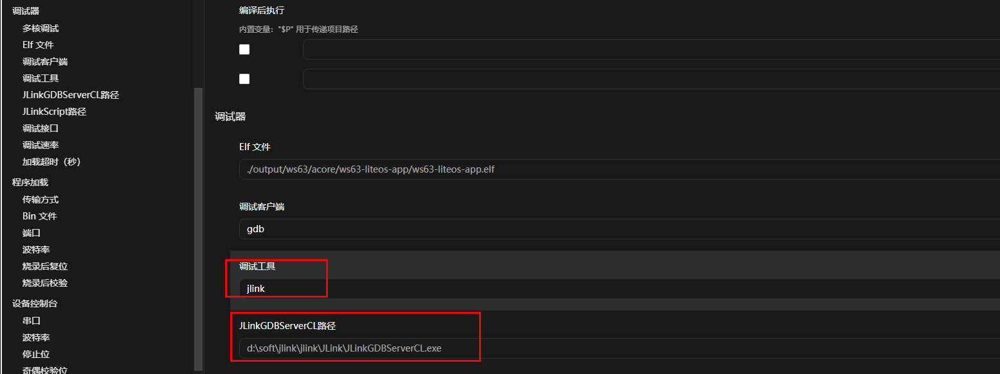

# 编译运行

## 编译按钮介绍

**图 1**  编译按钮  
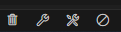

[图1](#fig7871826336)按钮依次是：清除、编译、重编译和停止编译按钮。

-   ：单击触发工程清理，删除编译中间生成的文件。
-   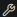：单击触发工程编译。
-   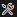：单击触发先清理target再编译。
-   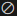：单击触发停止编译。

> **说明：** 
>-   重编译功能会先清除output目录下当前target的内容，如acore目录和fwpkg目录下的名为target的文件夹，如果存在该文件夹则会删除，如果没有，则不会清除任何文件或文件夹，清除完毕后会再执行编译功能。
>-   如果想删除output文件夹，执行“清除”功能即可。

## 编译结果

单击“”按钮开始编译，编译成功后终端窗口输出如[图1](#fig9925105200)所示，且工程目录中生成output目录如[图2](#fig114873277206)所示。

**图 1**  编译成功  
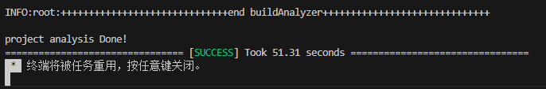

**图 2**  编译生成output目录  

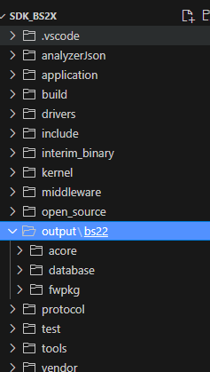

单击按钮开始清除编程生成的文件，成功后终端窗口输出如[图3](#fig1710335292011)所示。工程清理会清除工程目录下的output文件夹。

**图 3**  清除工程编译成功  

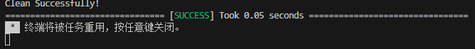

## 编译生成静态库

适用场景：希望将工程中的部分原文件打包生成静态库文件。

1.  进入工程配置页面，到“是否生成静态库”的配置项。

    **图 1**  静态库配置  
    

    使能是否生成静态库。如果不想生成静态库，可以通过这个选项再次关闭。

2.  输入希望生成的静态库名，例如输入“demo”，最后生成静态库时会添加“lib”头和“.a”尾，生成“libdemo.a”。

    **图 2**  输入静态库名字  
    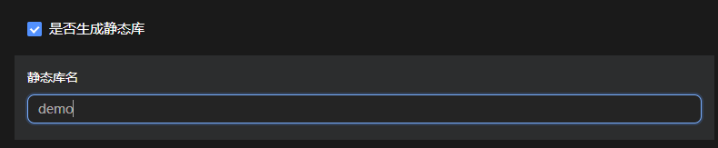

3.  从当前工程文件中选择静态库的源文件所在的文件夹或文件，支持多选，工具会自动筛选出.c文件，选择完毕后单击完成。

    **图 3**  选择要生成静态库的源文件  
    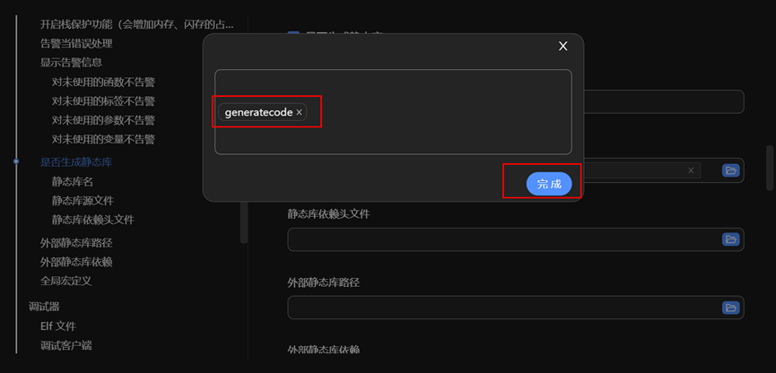

4.  从当前工程文件中选择编译静态依赖所需的头文件路径。支持选择文件夹或者文件， 支持多选，工具会自动筛选出.h文件，选择完毕后单击完成。

    **图 4**  选择要生成静态库的头文件路径  
    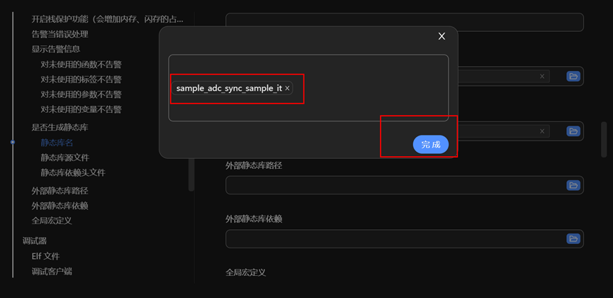

5.  点击编译“”，编译成功之后在 “out\\libs”中生成静态库文件。

    **图 5**  静态库的生成路径  
    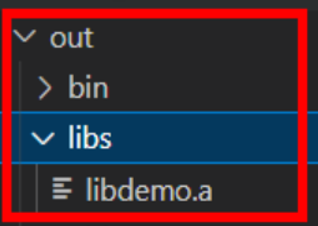

## 使用静态库参与编译

**使用工程中的静态库文件**

1.  将“out\\libs”路径下生成的自定义静态库对应的.a文件移至“thirdparty\\sysroot\\lib”路径下。

    > **说明：** 
    >不要在“out\\libs”目录下面放入.a ，否则会在clean的时候被清除。

2.  将静态库对应的.h文件移至“thirdparty\\sysroot\\include”路径下。
3.  在工程中包含对应的头文件，即可调用自定义静态库中的接口。

**使用工程之外的静态库文件**

1.  在外部静态库路径处选择所引用的外部静态库.a文件的路径，在外部静态库依赖处选择对应静态库所依赖头文件的目录。

    **图 1**  外部静态库配置项  
    

2.  选择完毕后单击编译Rebuild，并在工程中包含所引用的静态库所依赖的头文件即可。

## 命令行编译工具

点击COMMANDS里面的Command Line功能或者状态栏中的Command Line图标可执行命令行工具功能。

**图 1**  Command Line功能入口  
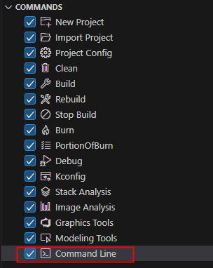

执行命令行工具功能后，会自动配置临时环境变量，并且会在起一个CommandLine终端，如果缺少编译所必须的工具链或者其他依赖，会提示需先执行DownLoad Toolchain功能配置环境。以Python环境配置失败为例，当Python环境未配置时点击Command Line会有信息提示先执行Download ToolChain配置环境。

**图 2**  环境配置失败提示信息  

环境配置完成后，会起一个CommandLine终端，默认在C盘根目录下，输入“d:”会切换至D盘根目录，然后cd到SDK目录，执行“python build.py -c”命令运行编译脚本，选择编译选项（“-c”为清除编译命令，可视情况选择是否在编译命令中带上“-c”）。

**图 3**  命令行编译  
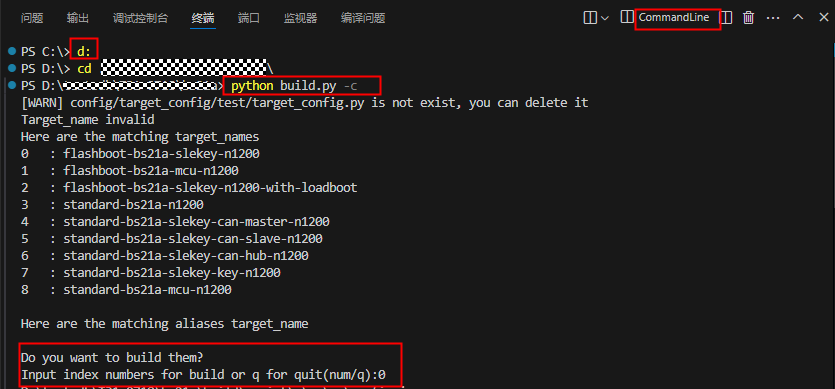

# 软件包烧录

烧录功能只支持串口烧录。

## 连接烧录串口线

软件镜像烧录，使用串口通信协议，需要将运行HiSpark Studio for VS Code插件的电脑和目标板用串口线连接，常见的串口线有标准的串口线和USB转串口线两种。如果使用USB转串口线，需提前安装USB转串口驱动。

**图 1**  烧录串口连接示意图  
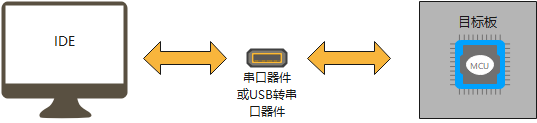

## 配置工程的烧录选项

1.  配置好硬件环境。

    开发板设置好拨码开关后，请用串口线连接好电脑和待烧录开发板。

2.  确定所连接的串口号。

    打开电脑的设备管理器，查看并记录串口线对应的串口号。

    **图 1**  串口选择  
    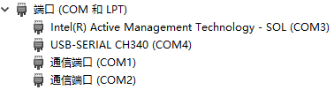

    > **须知：** 
    >如果使用USB转串口方式烧录，请安装USB转串口的驱动程序。

3.  进入工程配置界面。

    打开要烧录的工程后，单击工程配置的“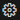”按钮，进入工程配置界面。

    **图 2**  工程配置入口  
    

4.  单击“程序加载”中的“传输方式”，默认选择“serial”串口传输，“Bin 文件”中，会默认选择烧录的Bin文件，按[步骤2](#li207851059104511)选择端口号，波特率默认115200。

    **图 3**  串口烧录配置  
    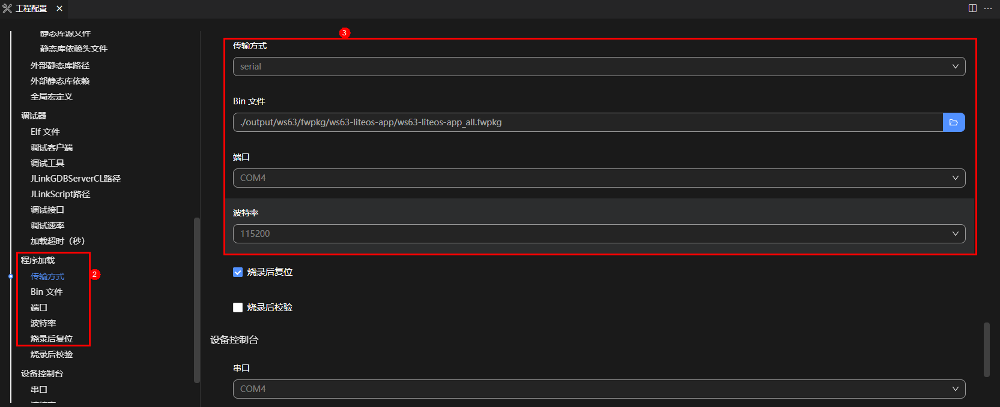

    > **须知：** 
    >FBB系列芯片选择“serial”烧写模式时，由于是USB转串口的方式，硬件设备的差异可能会对芯片支持的烧写波特率有限制，如果想支持更高的波特率，需要改板。其中，BRANDY系列芯片烧写波特率限制为不超过500000，BS2X系列芯片的烧写波特率限制为小于2000000。

5.  单击工具栏中的烧录按钮  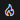，开始执行烧写。

    **图 4**  烧录按钮入口  
    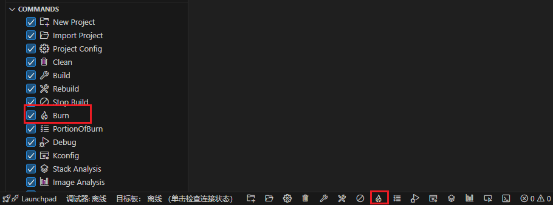

6.  按提示复位设备，烧录成功后终端窗口输出如[图5](#fig9672125742319)所示。

    **图 5**  烧录成功  
    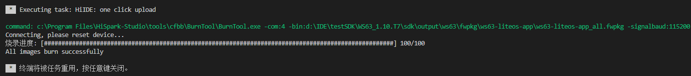

## 烧录配置

本章节主要介绍支持选择性烧录bin文件的方法。使用此功能前如果编译成功则直接从本章节[1](#p913mcpsimp)开始，如果未编译，请参见“[编译结果](编译结果.md)”章节进行编译，然后再根据本章节步骤进行操作。

1.  单击工具栏中的“烧录配置”  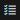  按钮，进入烧录配置界面。

    **图 1**  烧录配置按钮及界面  
    
    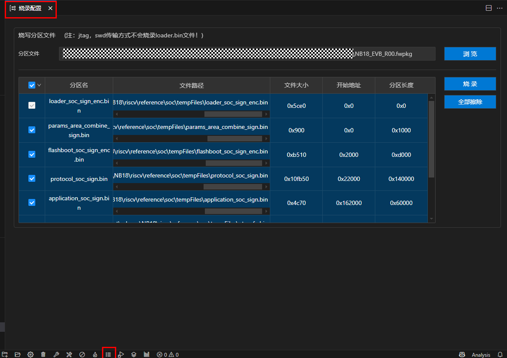

2.  FBB分区文件默认为打包好的.fwpkg文件，或者单击“浏览”按钮从本地文件中选择打包好的.fwpkg文件。选择完成后，烧录工具会自动的将.fwpkg文件中包含的bin内容列出。

    **图 2**  FBB烧录配置分区文件路径  
    
    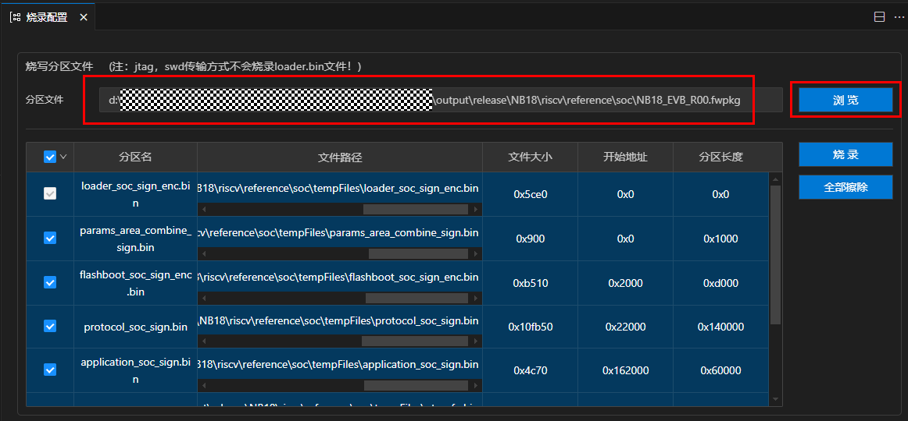

3.  勾选需要烧录的.bin文件。默认会勾选全部.bin文件，且不支持修改表格中包含loader.bin或ssb.bin的分区名属性所在行的编辑状态。而其它.bin文件可以根据烧写的需求勾选或者取消勾选。
4.  烧录之前需要配置传输方式及其他参数信息，具体操作请参见“[烧录器配置](烧录器配置.md)”章节。
5.  单击“烧录”按钮，根据提示重启开发板，即可开始烧录。

    **图 3**  烧录  
    
    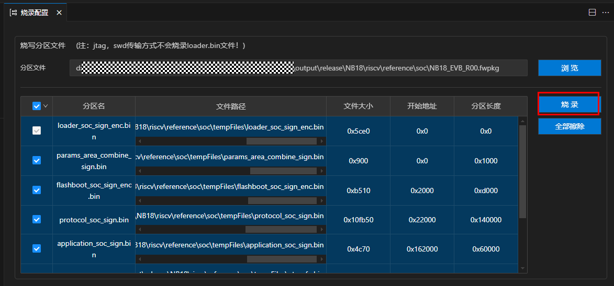

6.  开始烧录后，在分区文件下方会显示出烧录进度条，方便查看烧录进度。烧录开始后会在终端打印相关指令信息，最后烧录成功后会在界面显示“successfully”字样。

    **图 4**  烧录进度  
    
    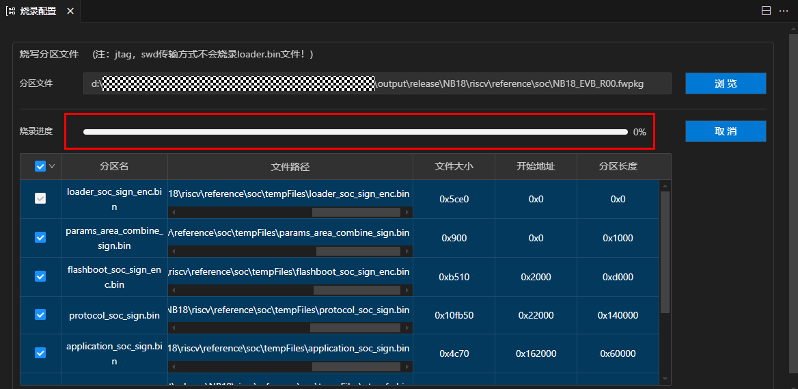

    **图 5**  烧写开始打印  
    
    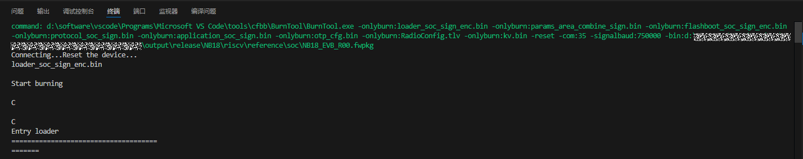

    **图 6**  烧写开始打印  
    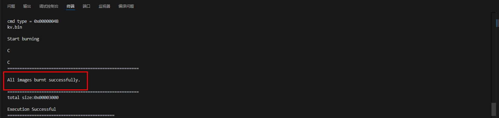

# 栈分析和镜像分析

HiSpark Studio for VS Code插件集成了Stack Analysis栈分析工具和Image Analysis镜像分析工具，用于分析开发过程中的内存不足、内存溢出等问题，帮助开发者更加精准的分析定位问题。

-   Stack Analysis栈分析工具是基于静态二进制分析手段，提供任务栈开销估算值和函数调用关系图示，为栈内存使用、分析、优化、问题定位等开发场景提供较为准确的静态内存分析数据参考。
-   Image Analysis镜像分析工具对工程构建出的.elf文件进行内存占用分析，支持开发者快速评估内存段、符号表使用情况。

## 栈分析

**功能介绍**

栈分析工具基于静态二进制分析手段，提供任务栈开销估算值和函数调用关系图示，为栈内存使用、分析、优化和问题定位等开发场景提供较为准确的静态内存分析数据参考。

**功能入口**

创建工程并成功编译后，单击工具栏中“”按钮进行栈分析。

**栈分析功能页面**

栈分析结果按照函数列表和调用关系进行展示。如[图1](#fig4596122219257)所示，功能列表页面展示每个函数的名称、内部栈开销和位置信息，其中内部栈开销单位为Byte，支持关键字搜索和排序功能。

**图 1**  功能列表页面  
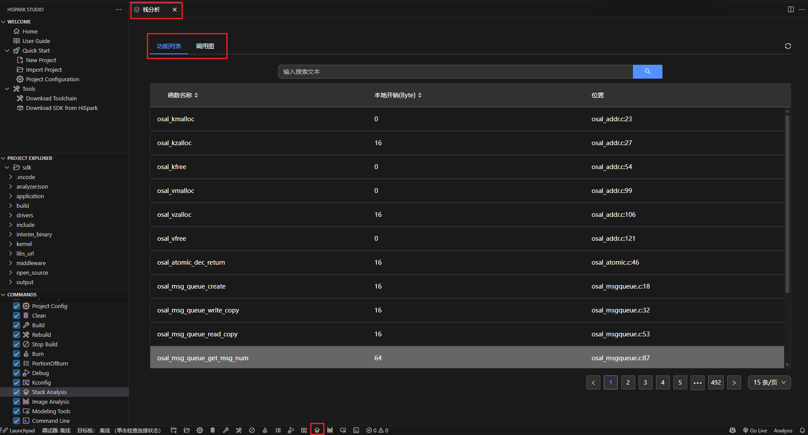

调用关系界面如[图2](#fig1384164712519)所示，显示每个函数的调用关系，包括函数名称、调用深度、函数最大栈开销和内部栈开销，支持关键字搜索和排序功能。

**图 2**  调用图页面  
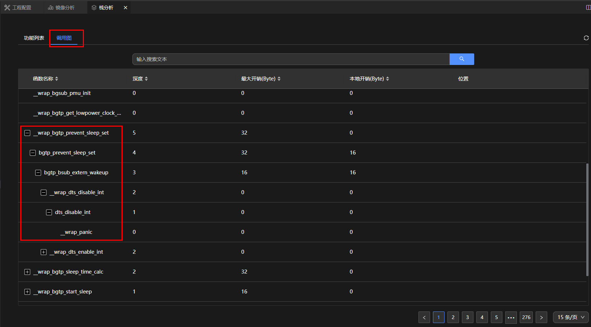

**统计项说明**

-   最大开销：为当前函数所有子函数中最大的栈开销与循环调用的次数的乘积再加上自身的开销。

    计算公式： max（子函数1的自身栈开销， 子函数2的自身栈开销，子函数3的自身栈开销，…） × 循环次数＋函数的自身栈开销

-   本地开销：当前函数的自身栈开销。
-   深度：当前函数每增加一层子函数，深度增加一层。

## 镜像分析

**功能介绍**

镜像分析工具通过分析.elf文件，图形化展示RAM和ROM的使用情况。

**功能入口**

创建工程并成功编译后，单击工具栏中的“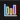”按钮。

**功能界面**

内存区域页面（如[图1](#fig1787391122717)所示）评估分析工程对内存的细分使用情况。例如WS63，显示的内存区域region包含RAM、SRAM、ITCM等，展示的信息包含每个内存区域的名称、起始内存地址、结束内存地址、总大小、空闲大小、已用大小以及使用比例，支持关键字搜索和排序功能，如[图1](#fig1787391122717)所示。

**图 1**  内存区域页面  
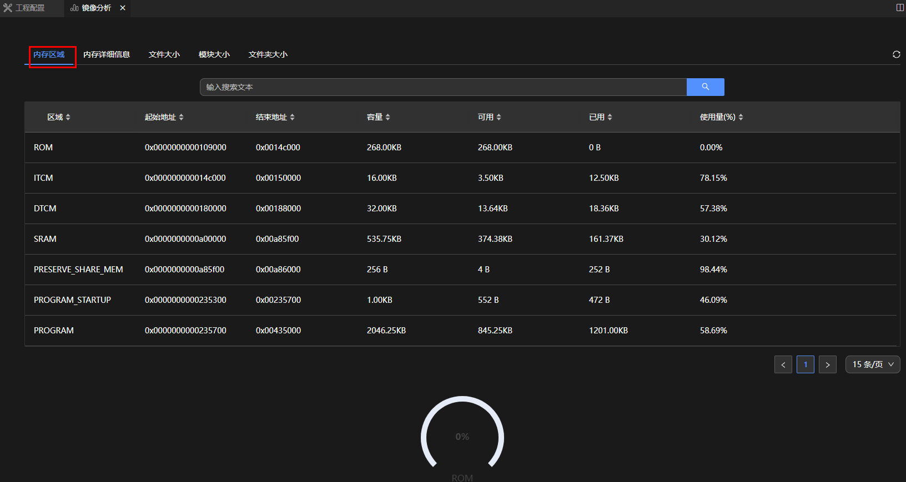

内存详细信息页面（如[图2](#fig15591937172713)所示）展示每个内存区域包含的内存段section和内存段包含的symbol的详细信息。比如FLASH下面包含.text、.entry、.data等内存段，内存段又包含分配在该段的程序符号，支持关键字搜索和排序功能。

每一行展示的信息包含运行地址VMA（Virtual Memory Address，表示程序装载的内存地址）、装载地址LMA（Load Memory Address，表示程序运行时的内存地址）、内存段/符号的大小。

**图 2**  内存详细信息页面  
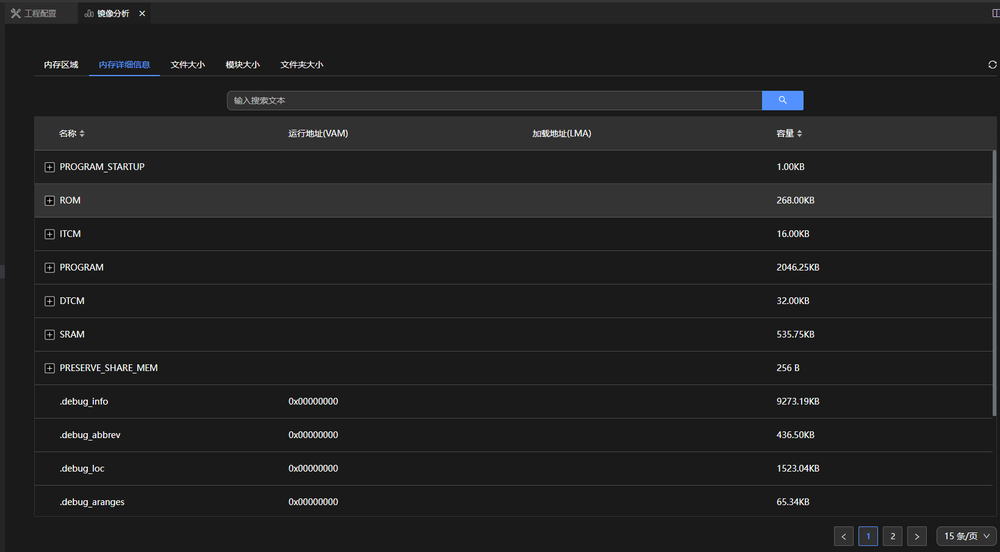

文件大小页面（如[图3](#fig9261641289)所示）展示每个链接进来的.o文件占用了哪块内存的空间以及占用空间的大小，支持关键字搜索和排序功能。

**图 3**  文件大小页面  
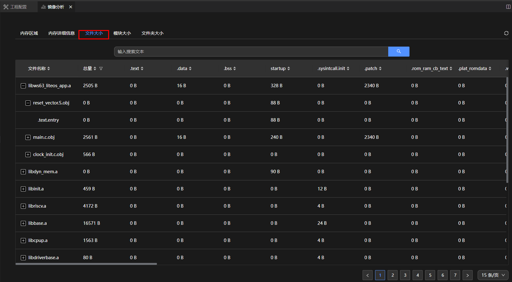

模块大小页面（如[图4](#fig1367222122813)所示）展示了模块和组件的层级关系以及不同模块的内存占用，支持关键字搜索和排序功能。

**图 4**  模块大小页面  
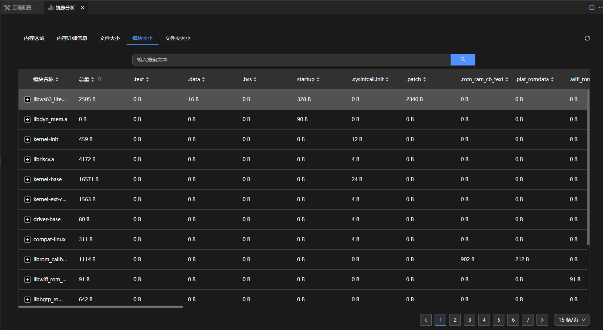

文件夹大小页面（如[图5](#fig1075993892817)所示）展示了不同文件夹下面模块的内存占用，支持关键字搜索和排序功能，支持导出excel。

**图 5**  文件夹大小  
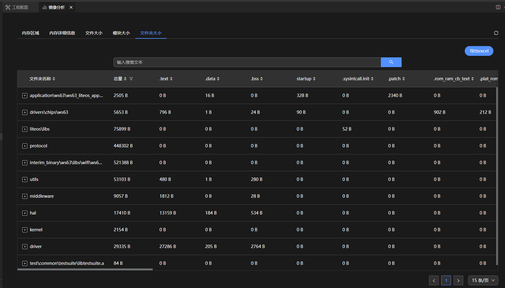

# 工程调试

## 调试配置选项

> **说明：** 
>使用调试功能时，编译.elf需要使用O0编译选项，并且需要明确工程中可供用户调试的文件路径。

1.  选择要调试的工程：在HiSpark Studio for VS Code插件主界面中，选择要调试的工程，打开“工程配置”。
2.  修改调试选项，选择对应的调试器。

    **图 1**  调试选项修改  
    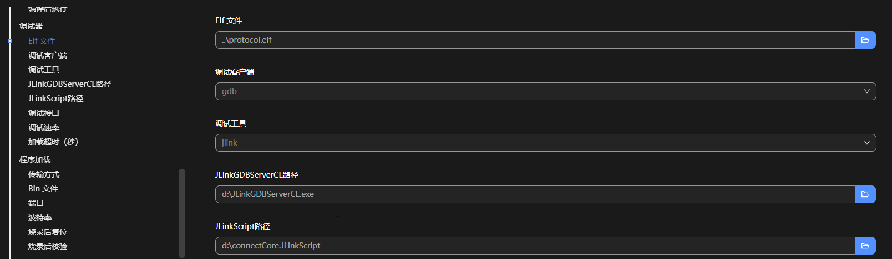

## 启动调试

1.  单击IDE工具栏调试按钮“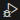”顶部弹框中选择需要的调试模式。

    **图 1**  调试模式选择  
    

    -   GDB Launch（Acore）：A核重启，暂停CPU，设置PC指针从头开始运行程序（A核开头设置了一个虚拟断点）。
    -   GDB Attach（Acore）：A核正在运行中，暂停CPU，程序直接停在CPU Halt处。
    -   GDB Launch（Pcore）：P核重启，暂停CPU，设置PC指针从头开始运行程序（P核开头设置了一个虚拟断点）。
    -   GDB Attach（Pcore）：P核正在运行中，暂停CPU，程序直接停在CPU Halt处。

2.  启动调试成功。调试成功示例如下图，若出现下面提示信息与工具栏调试图标，则说明已经成功启动调试。

    **图 2**  调试成功后提示信息、调试图标及调试界面  
    

    

    

## 常用调试功能

### 调试页面

调试工作界面如[图1](#fig132922116210)所示，主要由以下3个部分组成：

① 调试侧边栏

② 调试功能区

③ 调试控制台

**图 1**  调试工作界面  
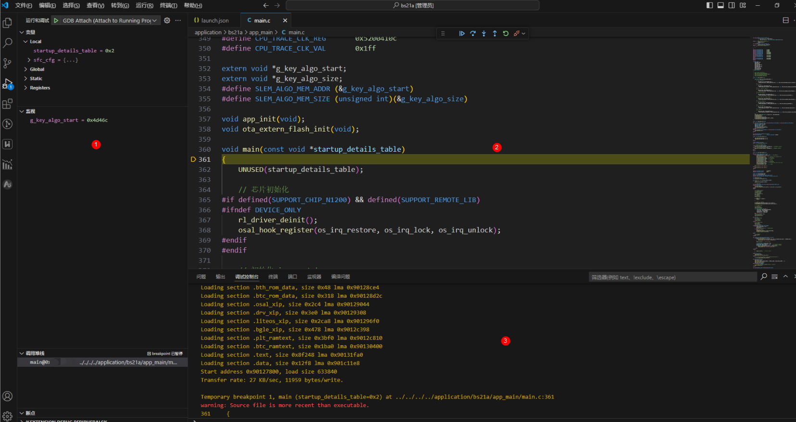

#### 调试侧边栏

调试侧边栏集合了调试常用功能，包括变量、监视、调用堆栈、断点等。

#### 调试功能区

启动调试功能后，当代码执行到设置的断点时，程序会暂停，可以根据调试功能区的按钮进行代码的调试。

**图 1**  调试图标  

-   ：继续运行（“F5”），当程序执行到断点时停止执行，单击此按钮程序继续执行。
-   ：单步跳过（“F10”），在单步调试时，直接前进到下一行（如果在函数中存在子函数时，不会进入子函数内单步执行，而是将整个子函数当作一步执行）。
-   ：单步执行（“F11”），在单步调试时，遇到子函数后，进入子函数并继续单步执行。
-   ：单步跳出（“Shift+F11”），在单步调试执行到子函数内时，单击单步跳出会执行完子函数剩余部分，并跳出返回到上一层函数。
-   ：重启调试（“Ctrl+Shift+F5”），重新启动调试。
-   ：停止调试（“Shift+F5”），停止调试任务，断开连接。

#### 调试控制台

调试控制台用来输出调试时的打印信息，也可以输入命令与调试器交互。

-   变量查看

    当运行到断点处暂停时，可以在变量界面查看变量的当前值。

    **图 1**  查看变量当前值  
    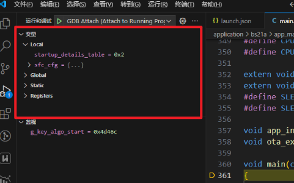

    支持如下4种变量类型：

    -   局部变量
    -   全局变量（可能会被编译器优化，可以使用关键字volatile来规避这个问题 。）
    -   静态变量（可能会被编译器优化，可以使用关键字volatile来规避这个问题。 ）
    -   寄存器

-   监视功能

    在调试过程中，可以通过“监视”查看变量（包括局部变量、全局变量以及静态变量）和特定地址的取值来判断程序的运行结果是否有误。

    **图 2**  监视功能  
    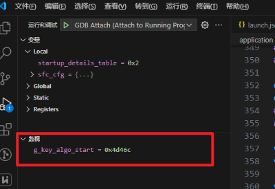

-   查看调用栈

    在调试过程中，可以通过查看调用栈来分析主程序调用的各子程序的调用关系，如下图所示。

    **图 3**  调用堆栈功能  
    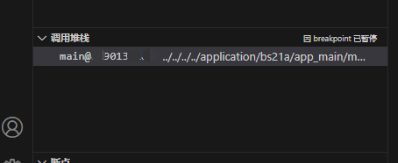

    **----结束**

# 串口控制台工具

本章节主要介绍HiSpark Studio for VS Code插件中关于串口操作的工具监视器（Monitor）。主要功能包括显示串口列表、连接串口、断开串口连接、接收串口消息、给串口发送消息、清空串口输出区、开启\\关闭屏幕自动滚动等。

> **说明：** 
>串口工具以“\\r\\n“作为每行的分隔符，所以要求被打印的每行字符串都要以“\\r\\n“结尾，否则可能会出现程序结尾打印丢失的情况。

## 打开监视器

运行HiSpark Studio for VS Code插件后打开VS Code终端，找到终端区域、切换到“监视器”选项卡，如[图1](#fig17771812125220)所示。

**图 1**  切换到“监视器”选项卡  
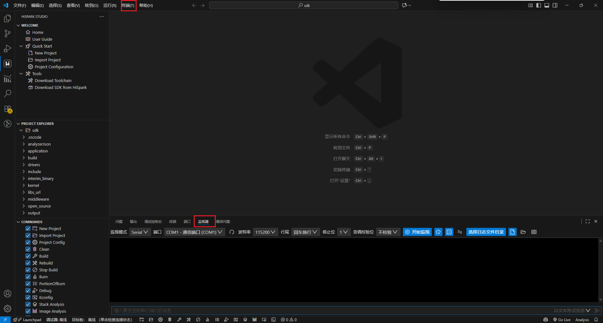

**图 2**  监视器界面介绍  

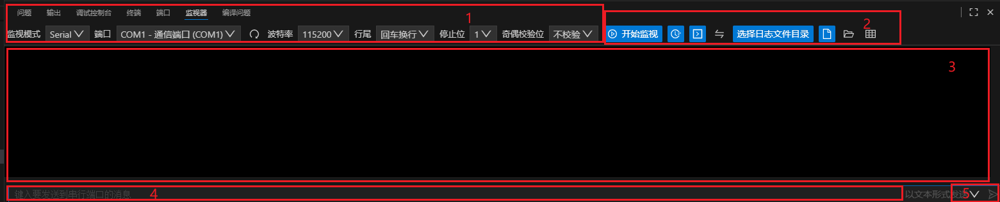

-   ①：串口配置区

    端口：显示当前电脑所连接的串口设备，单击“”按钮刷新串口列表。

    波特率：选择串口波特率，范围：300～250000。

    行尾：当给串口发送消息时，工具会根据此选项自动添加字符。

    -   CRLF代表“\\r\\n”。
    -   CR代表“\\r”。
    -   LF代表“\\n”。

-   ②：功能按钮区

    ：连接串口按钮。当连接串口后，按钮状态会变成，单击此按钮会断开串口连接。

    ：时间戳按钮。开启时会在每行输出前加上时间戳显示，如果按钮处于关闭状态则不显示时间戳，如[图3](#fig1040102615572)所示。

    **图 3**  时间戳设置效果示例  
    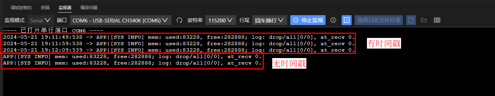

    ：隐藏输入框，隐藏/显示输入框界面如[图4](#fig209583373583)、[图5](#fig17214483580)所示。

    **图 4**  显示输入框  
    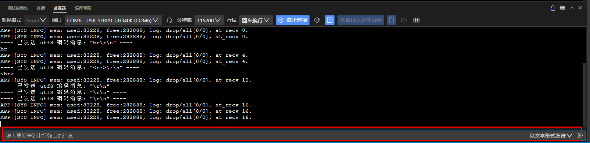

    **图 5**  隐藏输入框  
    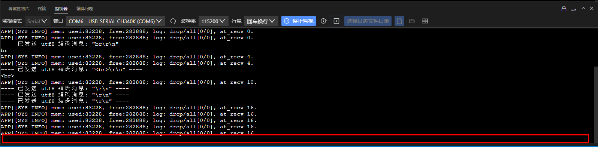

    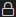：开启/关闭屏幕自动滚动。

    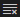：清空输出区。

    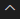：最大化面板。

    ：关闭面板

-   ③：输出区。
-   ④：输入区。
-   ⑤：发送消息按钮，单击按钮或者敲击回车发送输入区信息给串口，默认编码为UTF-8。

## 连接串口

单击“”即可连接串口。连接串口前，输入区默认处于未激活状态（不可输入、不可点击）；连接串口后，输入区变为激活状态，串口配置区的监视模式选项变为未激活状态。

**图 1**  开始监视功能  
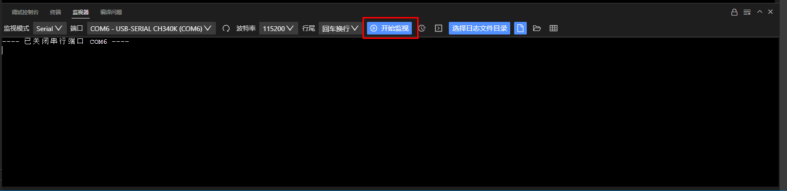

## 查看消息

在输出区可以查看串口发送的消息。

**图 1**  查看串口消息  
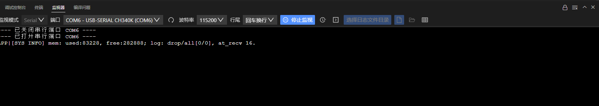

## 发送消息

在下方输入区输入消息后单击发送按钮或者单击键盘回车按钮发送消息。

**图 1**  发送消息  
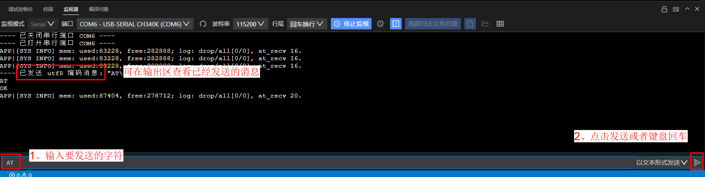

## 断开连接

单击“”按钮断开串口连接。

**图 1**  停止监视  
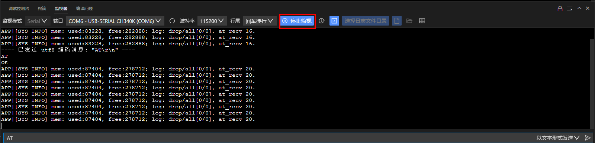

## 扩展工具使用

扩展工具主要用于添加一些用户常用的命令，添加后可以做到点击名称发送命令。扩展工具在出厂时添加了一些常用命令，如果用户用不到这些命令，可以选择清空表格，然后手动添加所需命令，或通过excel表格导入方式进行添加。除此之外，扩展工具还有循环发送功能，在后面章节中会详细介绍。

-   打开扩展工具。单击扩展按钮，会在右侧展开扩展页面。

    **图 1**  扩展工具  
    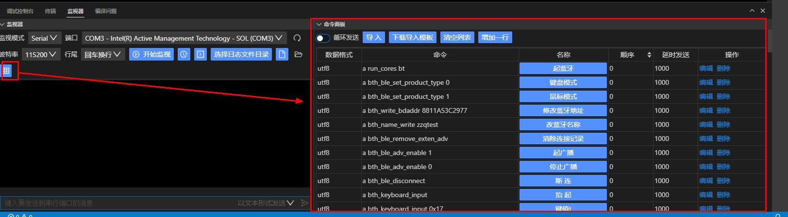

    单击此按钮可最大化面板。

    **图 2**  监视器面板最大化按钮  
    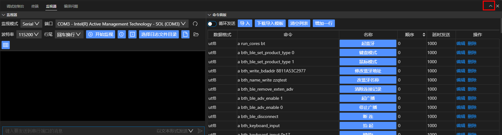

-   单击清空列表按钮可清空列表。

    **图 3**  清空列表功能  
    

    如果清空出厂表格后需要恢复，可导入安装目录下“C:\\Users\\用户xxx\\.vscode\\extensions\\hispark.hisparkstudio-x.x.x\\resources\\terminal\\resources\\excelFile“下的“rwaData.xlsx”表格。

-   手动新增命令行。单击“增加一行”按钮。

    **图 4**  新增一行功能  
    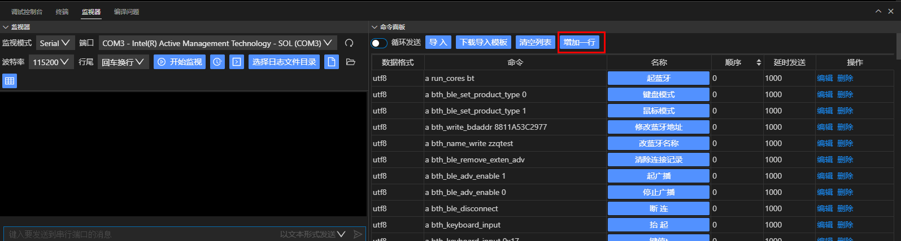

    添加数据规则：

    数据格式：下拉框模式，下拉选项有utf8、bin、hex。

    命令：发送给串口的命令字符串。

    名称：识别命令功能的字符串。单击此按钮可立即发送命令给串口（前提是工具处于监听状态）。

    顺序：在使用循环发送功能时，顺序大于0，才会进行循环发送。如果有多个命令的顺序大于0，并且数值一样，则按照由上到下的顺序发送。

    延时发送：先发送一次，再进行延时，单位：ms。

    操作：有编辑和删除两个选项，单击编辑可对命令行进行修改，单击删除可删除命令行。

-   批量添加命令。
    1.  下载导入模板。导入模板会自动保存到“C:\\Users\\用户xxx\\.vscode\\extensions\\hispark.hisparkstudio-x.x.x\\resources\\terminal\\resources\\excelFile\\template.xlsx”。

        **图 5**  下载导入模板功能  
        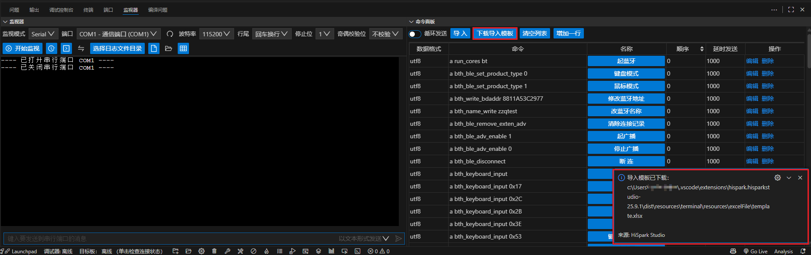

        导入模板中会显示需要导入的列，以及每个列的规则。

        **图 6**  导入模板  
        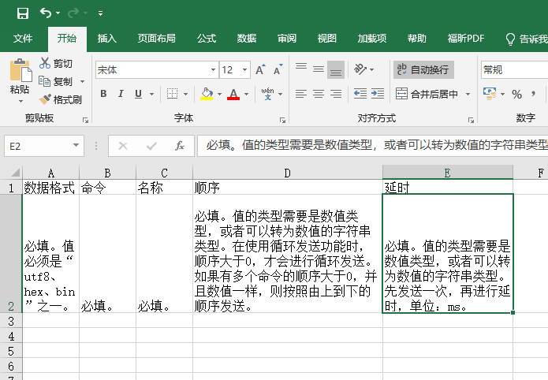

    2.  填写导入模板。

        **图 7**  导入模板数据填写  
        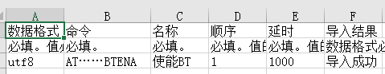

    3.  导入“导入模板“文件。

        **图 8**  导入模板数据  
        

        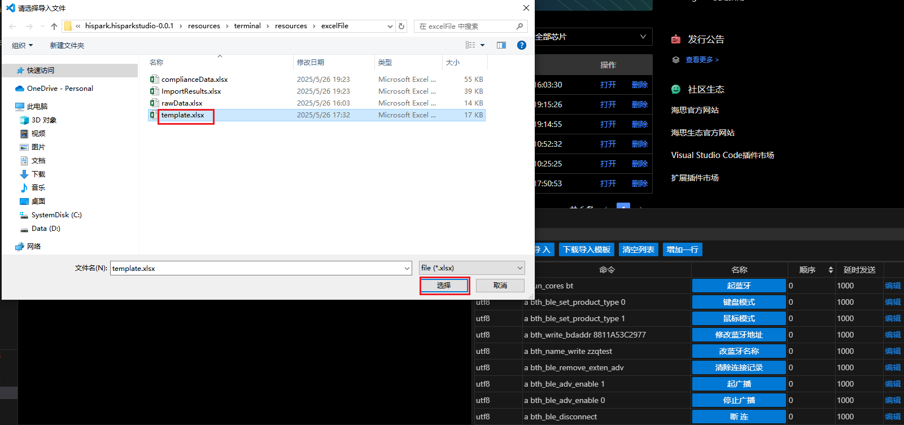

    4.  查看导入数据。

        **图 9**  查看导入数据  
        

        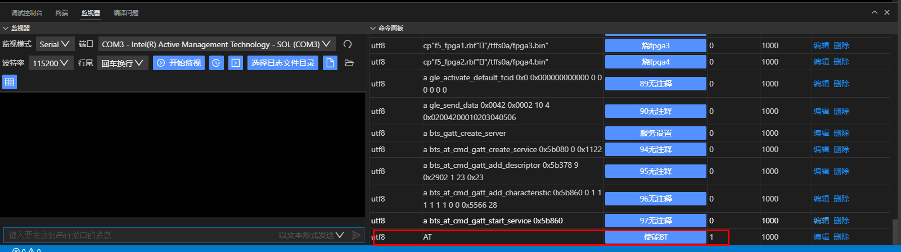

    5.  查看导入结果表格。导入结果列会显示导入不成功的原因。

        **图 10**  查看导入结果  
        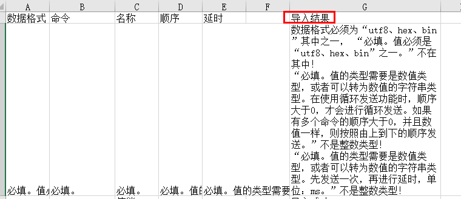

-   循环发送。
    1.  设置顺序和延时。

        **图 11**  设置顺序和延时功能  
        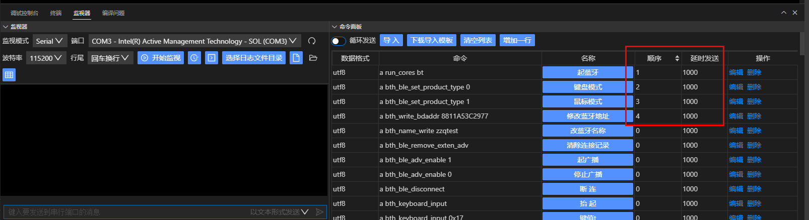

        上图表格执行命令的顺序：

        首先，发送“起蓝牙“命令，延时1000ms；然后，发送“键盘模式“命令，延时1000ms；最后，发送“鼠标模式“命令，延时1000ms；结束。这是一个循环发送的周期，循环发送会不断的循环这个周期。

        “修改蓝牙地址”命令并不会发送，因为它的顺序不大于0。

    2.  打开串口监听。

        **图 12**  串口监听功能  
        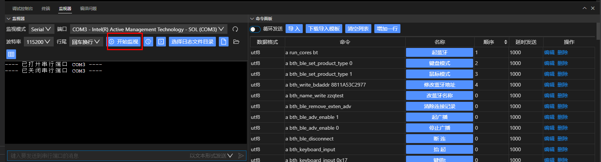

    3.  打开循环发送开关（发送的命令自带“回车换行”）。打开后，会在左侧输出栏看到发送的命令。

        **图 13**  循环发送功能  
        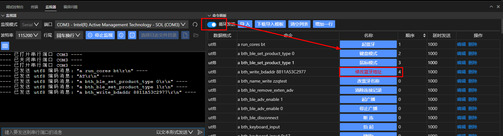

        红色字体表明正在发送此条命令或者正在延时

# Kconfig配置

本功能主要用于控制工程的编译构建， 支持通过图形化界面管理编译配置。

打开工程后，单击工具栏中的系统配置“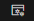”按钮，如[图1](#fig1334674314438)所示。

**图 1**  系统配置入口  
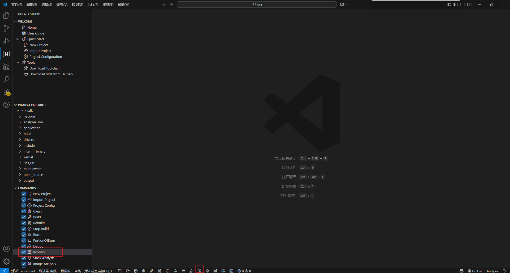

系统配置界面如[图2](#fig11641828725)所示。

**图 2**  系统配置界面  

## 按钮功能介绍

系统配置界面按钮功能如下：

① save：配置文件默认保存至\`$\{menu\_config\_build\_target\}\`下。

② save as：自定义保存路径，默认配置文件名 \`$\{menu\_config\_build\_target\}\`.config。

③ save\(minimal\)：自定义保存路径和配置文件名称，且只保存修改过的配置项。

④ open：自定义加载配置文件。

⑤ jump to：配置项搜索。

⑥ show name：显示列名（Option-Name）。

⑦ show all：显示隐藏配置项。

⑧ Single-menu mode：单个菜单模式。

# GUI工程创建与使用

HiSpark Studio支持创建GUI工程和GUI模拟器的使用。按照“[3.1新建工程](新建工程.md)”指导新建Brandy工程后，单击工具栏菜单下的“创建GUI应用”图标可在Brandy的工程中创建GUI工程。

**图 1**  创建GUI工程  
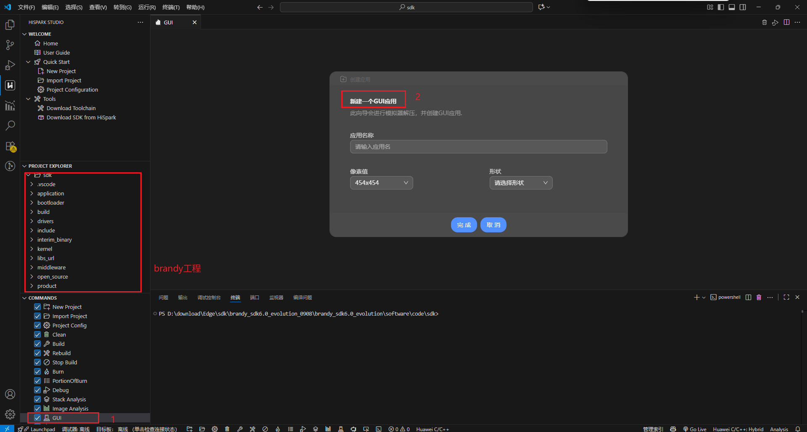

-   像素值：默认454×454对应生成的画布大小，在形状为circle（圆形）时，分辨率为直径×直径，在形状为reatangle（方形）时，分辨率为长×宽。像素值可以自定义，取值范围为1～600。
-   形状：分为circle（圆形）和reatangle（方形），如果不主动选择，默认为圆形。

## GUI界面介绍

### GUI拖拽界面介绍

GUI工程创建后，会在工程目录的“application/wearable/nativeapp/应用名”这一目录下创建一个以工程名命名的GUI文件，打开后会呈现表盘形状，可自定义表盘内容。

当前支持的组件包括Button、Image、Progress、List、Label、ToggleButton、CheckBox、RadioButton、LabelButton、ScrollView、CircleProgress、ArcLabel、SwipeView、TextureMapper、Slider、Picker、TimePicker、Chart、EditText、ImageAnimator、DigitalClock、Qrcode、AnalogClock、SweepClock、Coverflow、Barcode、CardPage、CrossView、MapView、RollerView、HexagonsList、IcosahedronView、CanvasExt、TransformList、SlipflowView、TransformGroup、Coverflow2、ParticleView组件和Root组件。

**图 1**  GUI拖拽界面  

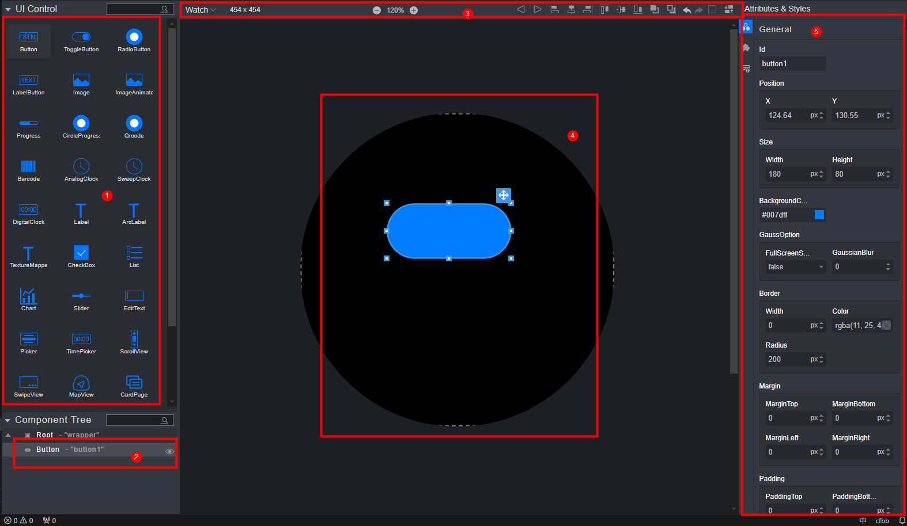

-   UI Control：UI组件栏，可以将相应的组件选中并拖动到画布（Canvas）中，实现组件的添加。
-   Component Tree：组件树，在低代码开发界面中，开发者可以直观地看到组件的层级结构和摘要信息。开发者可以通过选中组件树中的组件（画布中对应的组件被同步选中），实现画布内组件的快速定位；单击组件后的“”，可以隐藏/显示相应的组件。
-   Panel：功能面板，包括CrossView、Coverflow2组件用到的子组件切换，以及常用的画布缩小放大、组件左对齐、垂直居中对齐、右对齐、顶对齐、水平居中对齐、底对齐、图层切换、撤销、显示/隐藏组件虚拟边框、一键生成C++代码等。
-   Canvas：画布，开发者可在此区域对组件进行拖拽、拉伸等可视化操作，构建UI界面布局效果。
-   Attributes & Styles：属性样式栏，选中画布中的相应组件后，在右侧属性样式栏可以对该组件的属性样式进行配置。
    -   General：对应图标，用于设置Width、Height、Background、Position、Display等常规样式。
    -   Feature：对应图标，用于设置组件的特有样式，如描述Text组件文字大小的FontSize样式等。
    -   Events：对应图标，为组件绑定相关事件，并设置绑定事件的回调函数。

### 组件介绍

#### 组件的复制粘贴删除

以Button组件为例，在画布内已经拖入Button组件的前提下进行操作：

-   组件删除

    组件可以通过两种方式删除：

    -   右键点击画布中的Button组件显示操作栏，在弹出的操作栏点击Delete。
    -   选中Button组件，通过键盘Del键删除。

    **图 1**  组件删除  
    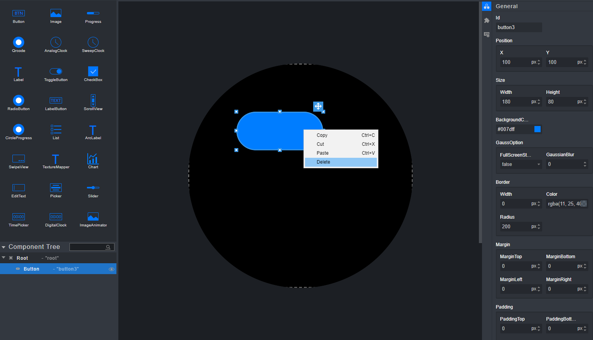

-   组件复制

    组件可以通过两种方式复制：

    -   右键点击画布中的Button组件显示操作栏，在弹出的操作栏点击Copy再次右键后点选Paste实现复制粘贴。
    -   选中Button组件，通过键盘Ctrl+C和Ctrl+V实现复制粘贴。

    **图 2**  组件复制  
    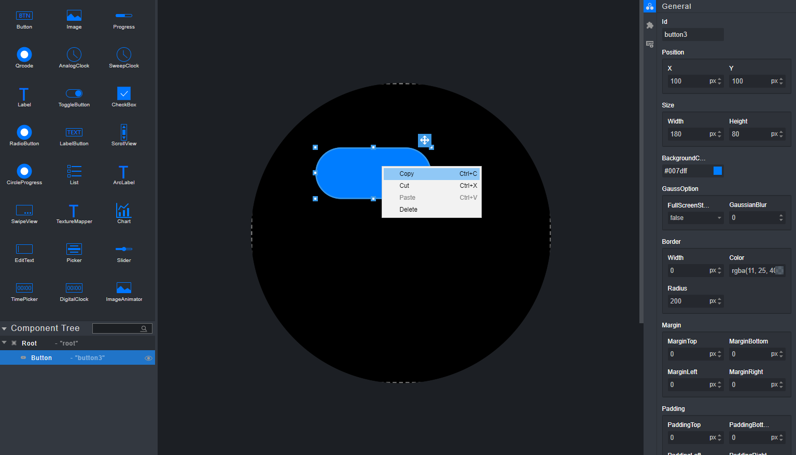

    **图 3**  组件粘贴  
    

#### 组件的共有属性

以Button组件为例，选中组件栏中的Button组件，将其拖拽至中央画布区域，松开鼠标，实现一个Button组件的添加。（组件会生成在画布上坐标（100，100）的位置）。

**图 1**  拖拽组件  
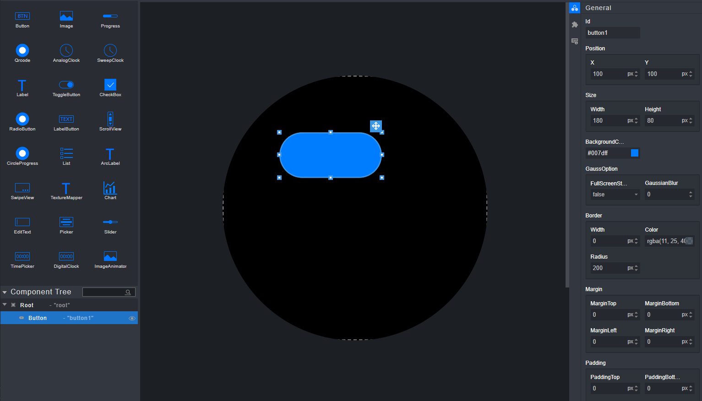

以下操作需在画布内已经拖入Button组件的前提下进行操作。

-   选中画布内的Button组件，通过右侧属性样式栏中的样式图标（General），在展开的General栏中修改Button组件的ID。ID并非生成代码时的变量名，因此多个组件可以设置同一个ID。

    **图 2**  通用属性配置：Id  
    

-   选中画布内的Button组件，通过右侧属性样式栏中的样式图标（General），在展开的General栏中修改Button组件的宽高、位置；另外还可以通过拖拽的方式放大缩小Button组件以及改变组件的位置。

    **图 3**  通用属性的配置  
    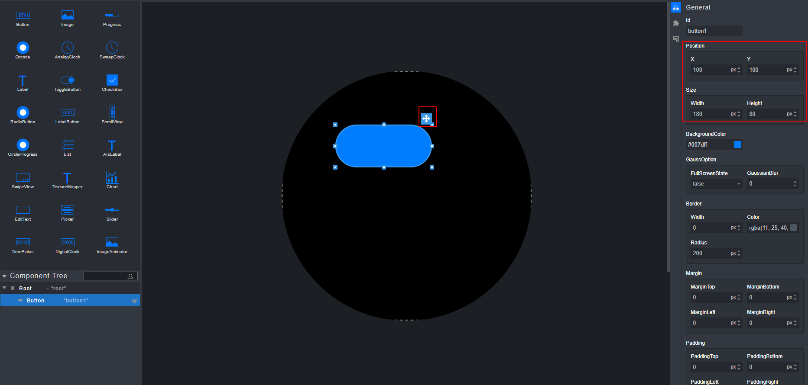

-   选中Button组件，单击右侧属性样式栏中的样式图标（General），在展开的General栏中修改Button组件的BackgroundColor属性改变背景颜色。

    **图 4**  修改背景颜色  
    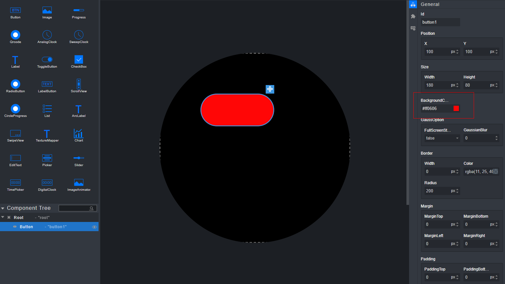

-   选中画布内的Button组件，通过右侧属性样式栏中的样式图标（General），在展开的General栏中修改Button组件GaussOption框中的FullScreenState、GaussianBlur属性改组件的高斯模糊。在同时拖拽两个组件的前提下进行。FullScreenState为false高斯模糊设置不生效，FullScreenState为true高斯模糊设置生效。GaussianBlur属性控制高斯模糊的模糊程度。详情请参见“[高斯模糊属性](高斯模糊属性.md)”。

    **图 5**  高斯模糊  
    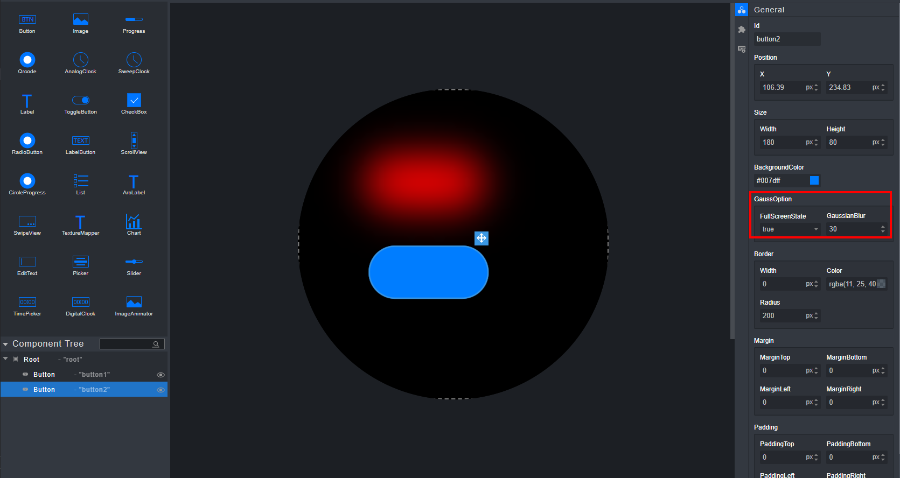

-   选中画布内的Button组件，通过右侧属性样式栏中的样式图标（General），在展开的General栏中修改Button组件Border框中的Width、Color、Radius属性改变边框的样式。

    **图 6**  修改组件边框样式  
    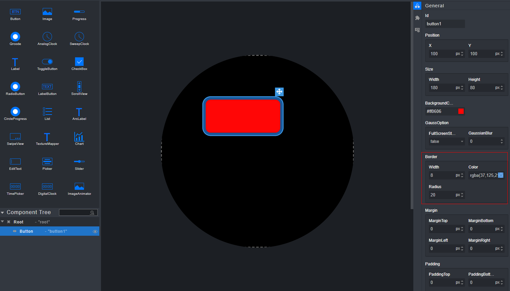

-   选中Button组件，单击右侧属性样式栏中的样式图标（General），在展开的General栏中修改Button组件Margin框中的MarginTop和MarginLeft属性调整组件相对表盘的位置。

    **图 7**  修改组件相对窗口位置  
    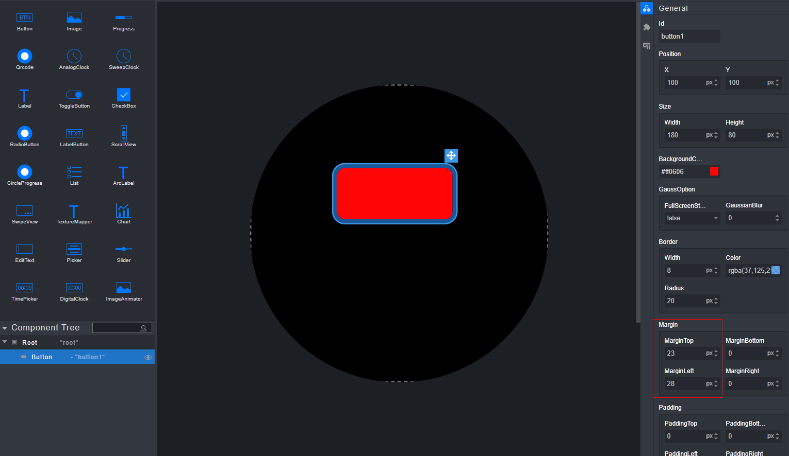

-   选中Button组件，单击右侧属性样式栏中的样式图标（General），在展开的General栏中修改Padding改变组件padding部分四个方向的宽度。

    **图 8**  组件相对边框位置  
    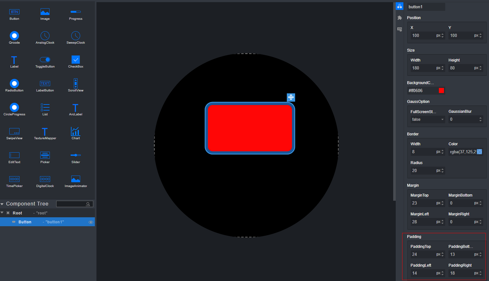

#### Button组件

共有属性使用方法请参见“[组件的共有属性](组件的共有属性.md)”章节内容。

-   选中画布内的Button组件，通过右侧属性样式栏中的样式图标（Feature），在展开的Feature栏中修改Button组件的DefaultImgSrc属性加载图片。

    **图 1**  DefaultImgSrc属性配置  
    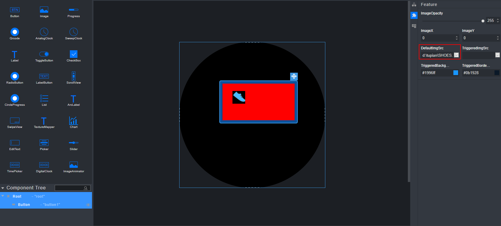

-   选中画布内的Button组件，通过右侧属性样式栏中的样式图标（Feature），在展开的Feature栏中修改Button组件的ImageX和ImageY属性调整图片位置（修改前需要设置DefaultImgSrc属性）。

    **图 2**  ImageX/ImageY属性配置  
    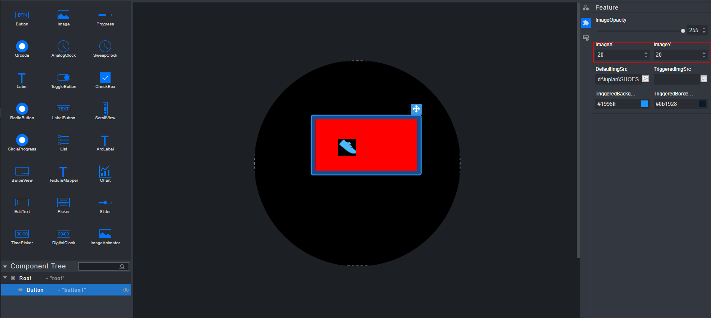

-   选中画布内的Button组件，通过右侧属性样式栏中的样式图标（Feature），在展开的Feature栏中修改Button组件的ImageOpacity属性调整图片透明度（需要设置DefaultImgSrc）。

    **图 3**  ImageOpacity属性配置  
    

-   选中画布内的Button组件，通过右侧属性样式栏中的样式图标（Events），在展开的Events栏中配置回调事件。

    Button组件支持的事件有：OnClick、OnLongPress、OnPress、OnCancel和OnRelease。

    **图 4**  回调事件配置  
    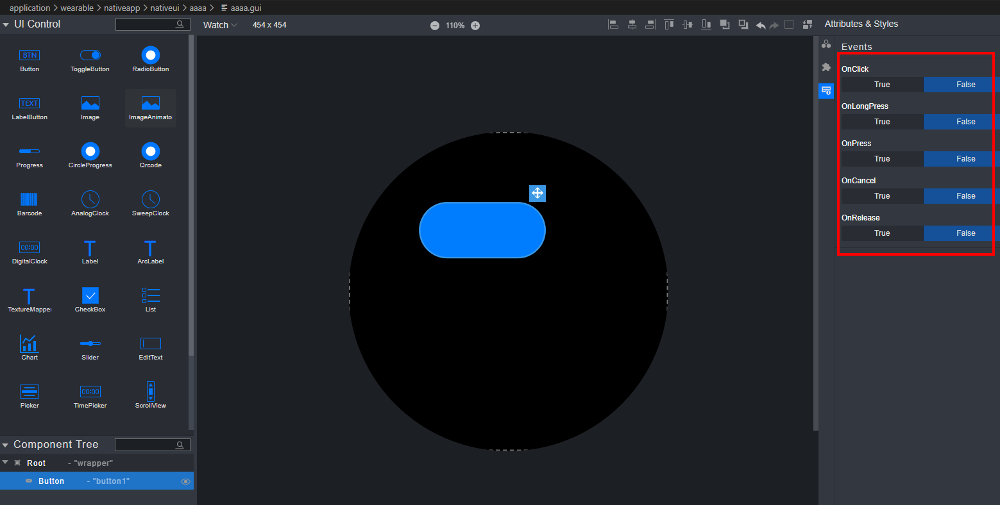

> **说明：** 
>-   General页面下的MarginBottom属性和MarginRight属性无界面渲染效果。
>-   Feature页面下的TriggeredImgSrc属性、TriggeredBackgroundColor属性、TriggeredBorderColor属性无界面渲染效果，可以在模拟器上查看渲染效果。
>-   DefaultImgSrc和TriggeredImgSrc不支持中文路径。

#### Image组件

共有属性使用方法请参见“[组件的共有属性](组件的共有属性.md)”章节内容。

-   选中画布内的Image组件，通过右侧属性样式栏中的样式图标（Feature），在展开的Feature栏中修改Image组件的ImagePath属性加载图片。

    在已有选中图片情况下再次选择相同图片，或者在浏览文件时关闭窗口或点击取消时，界面渲染效果将不会改变。需要清空图片可以删除输入框中的文本。

    **图 1**  特有属性配置：ImagePath  
    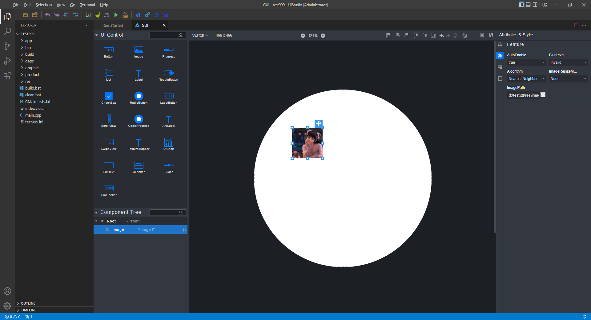

    > **说明：** 
    >ImagePath不支持中文路径。
    >导入的Bin文件必须是图片转的Bin，否则模拟器会异常。

-   选中画布内的Image组件，通过右侧属性样式栏中的样式图标（Feature），在展开的Feature栏中修改Image组件的ImageOpacity属性调整图片透明度。

    **图 2**  特有属性配置：ImageOpacity  
    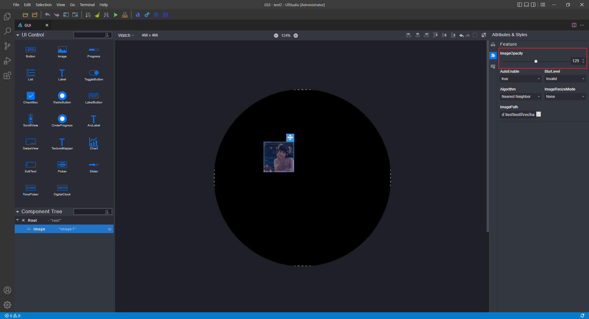

-   选中画布内的Image组件，通过右侧属性样式栏中的样式图标（Feature），在展开的Feature栏中修改Image组件的AutoEnable属性。

    -   AutoEnable属性设置为true时，组件会被限制为图片本身的大小，无法通过拖拽组件或直接修改Width/Height值来修改组件的显示效果。
    -   AutoEnable属性设置为false时，会按照组件大小展示图片，设置不同的ImageResizeMode属性值可以呈现不同的显示效果。

    **图 3**  特有属性配置：AutoEnable  
    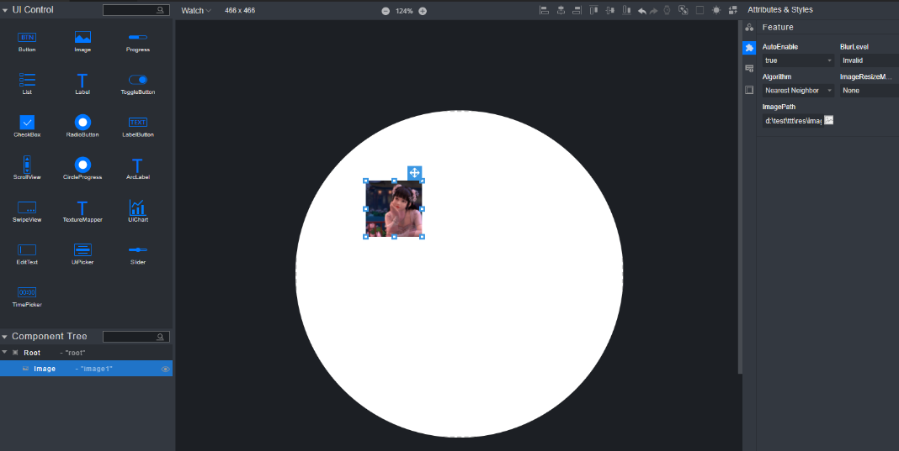

-   选中画布内的Image组件，通过右侧属性样式栏中的样式图标（Feature），在展开的Feature栏中修改Image组件的ImageResizeMode属性。

    -   AutoEnable属性设置为true时，ImageResizeMode属性不生效。
    -   AutoEnable属性设置为false时，ImageResizeMode生效，对应不同的显示效果。

    当前共有6种模式对应的效果示例如下（图片原始尺寸为80×80）：

    -   ImageResizeMode - None

        **图 4**  图片平铺（图中组件大小为200×200）  
        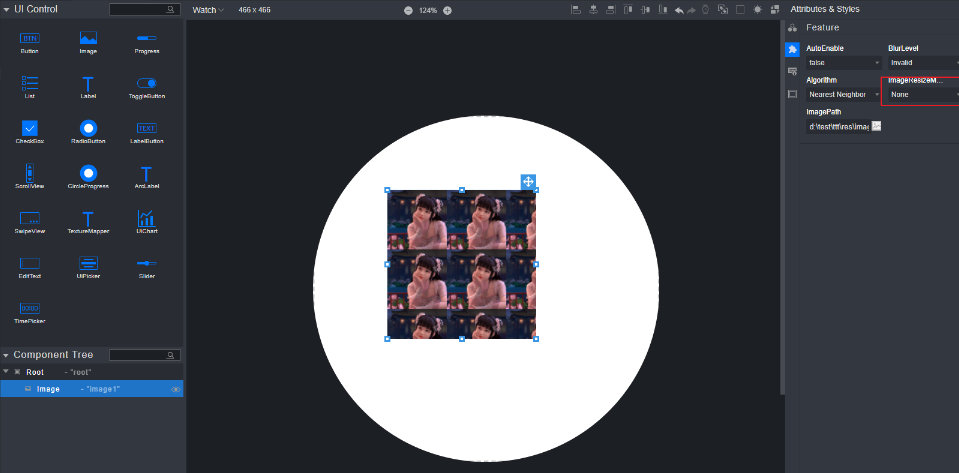

    -   ImageResizeMode - Cover

        **图 5**  图片覆盖组件1（图中组件大小为100×200）  
        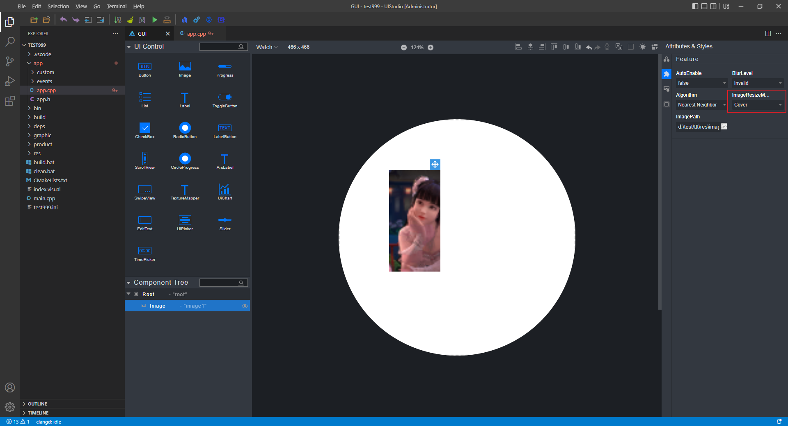

        **图 6**  图片覆盖组件2（图中组件大小为200×100）  
        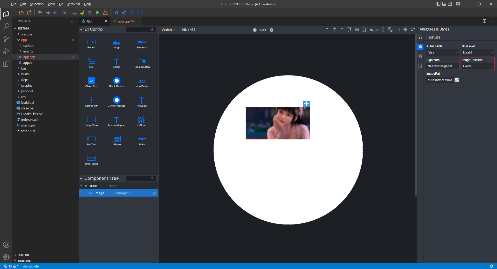

    -   ImageResizeMode - Contain

        **图 7**  图片被组件包含在内（图中组件大小为100×200）  
        

        **图 8**  图片被组件包含在内（图中组件大小为200×100）  
        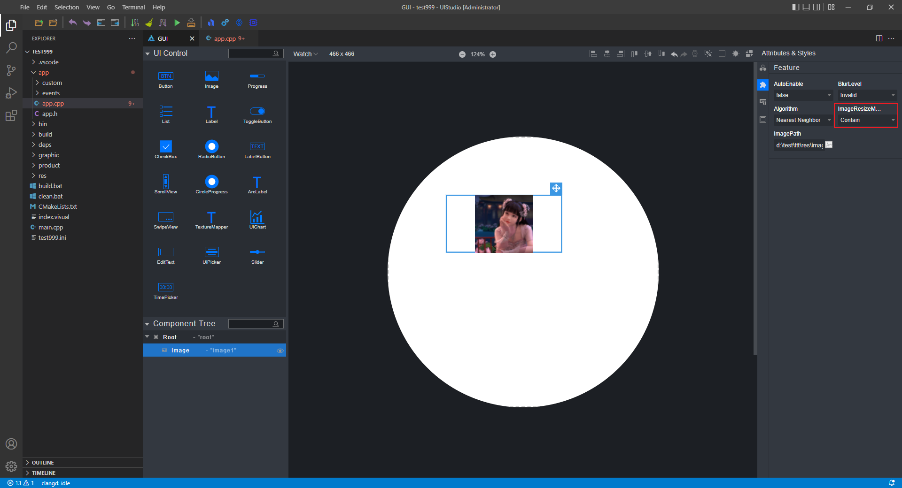

    -   ImageResizeMode - Fill

        **图 9**  图片填满组件（图中组件大小为200×100）  
        

    -   ImageResizeMode - Center

        **图 10**  图片处在组件中心（图中组件大小为100×100）  
        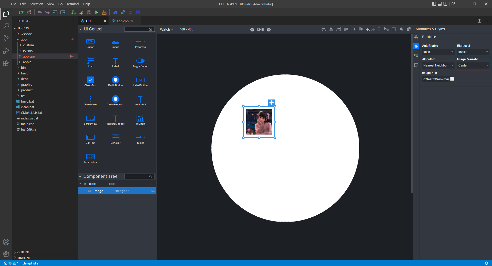

        > **说明：** 
        >组件宽高任一为0时，图片隐藏。

    -   ImageResizeMode - Scale Down

        **图 11**  组件宽高较大时，图片按原有尺寸显示  
        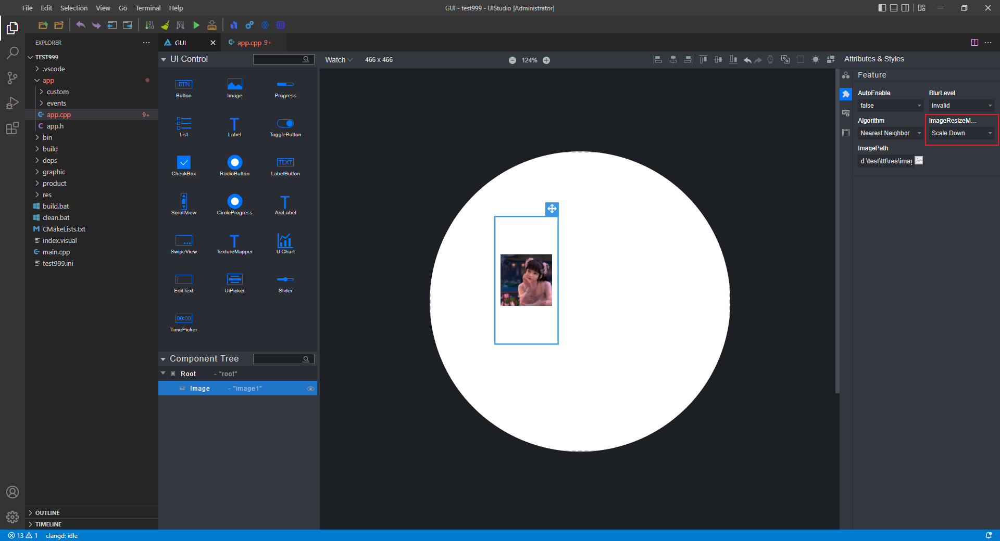

        **图 12**  组件宽高较小时，图片会缩小并被组件包含在内  
        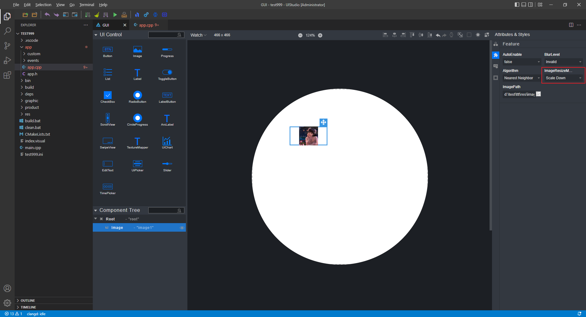

> **说明：** 
>-   组件的特有属性ImagePath未设置时，模拟器中不会显示组件。
>-   General页面下的MarginBottom属性和MarginRight属性没有任何界面渲染效果，可在模拟器上查看效果。
>-   Feature页面下的BlurLevel属性和Algorithm属性没有任何界面渲染效果，可在模拟器上查看效果。
>-   Image组件不支持配置回调事件。

#### Progress组件

共有属性使用方法请参见“[组件的共有属性](组件的共有属性.md)”章节内容。

-   选中Progress组件，单击右侧属性样式栏中的样式图标（Feature），在展开的Feature栏中ForegroundStyle窗口中修改Progress组件的前景色。

    **图 1**  修改前景色  
    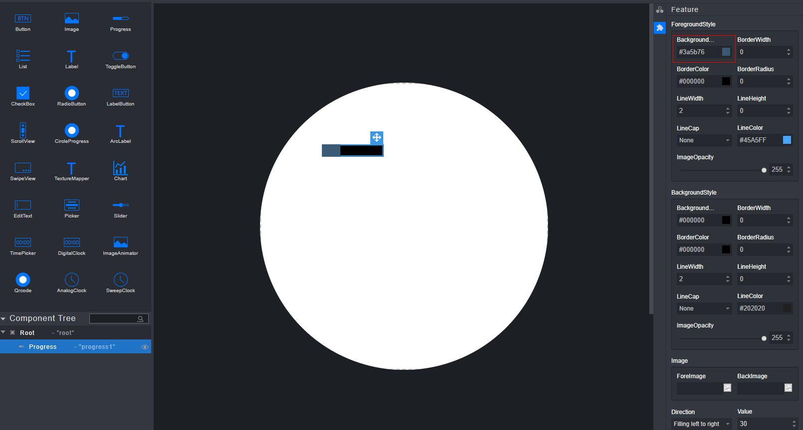

-   选中Progress组件，单击右侧属性样式栏中的样式图标（Feature），在展开的Feature栏中BackgroundStyle窗口中修改Progress组件的背景色。

    **图 2**  修改背景色  
    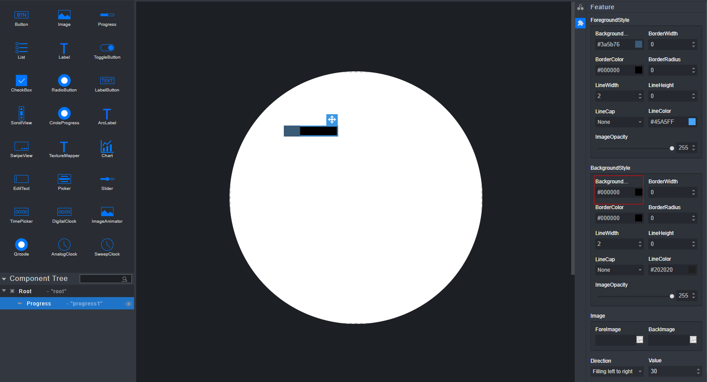

-   选中Progress组件，单击右侧属性样式栏中的样式图标（Feature），在展开的Feature栏中修改Progress组件的ProgressWidth和ProgressHeight属性改变组件的宽度和高度。

    **图 3**  修改组件宽高  
    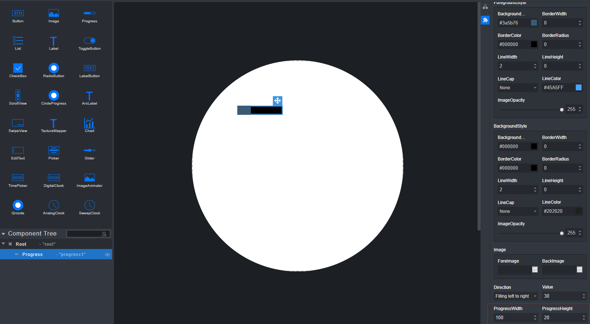

-   选中Progress组件，单击右侧属性样式栏中的样式图标（Feature），在展开的Feature栏中修改Progress组件的Direction属性修改进度条方向。

    **图 4**  修改进度条方向  
    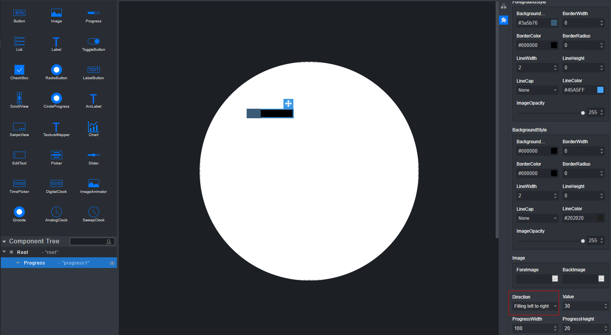

-   选中Progress组件，单击右侧属性样式栏中的样式图标（Feature），在展开的Feature栏中修改Progress组件的Value属性修改进度。

    **图 5**  修改进度  
    

-   选中Progress组件，单击右侧属性样式栏中的样式图标（Feature），在展开的Feature栏中修改Progress组件的ForeImage属性添加已走过进度的图片和BackImage属性添加进度条整体的图片。路径不能为空，不支持中文路径。

    **图 6**  添加图片  
    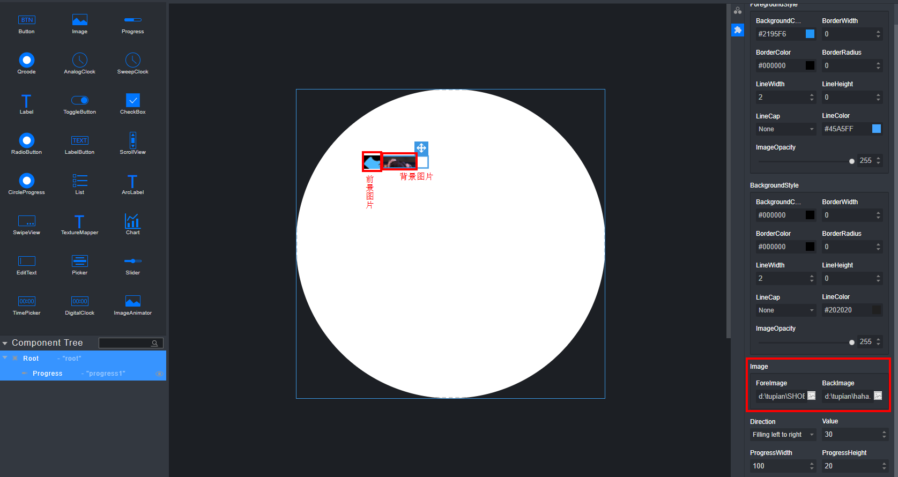

> **说明：** 
>-   General页面下的BackgroungColor属性，MarginBottom属性和MarginRight属性暂无渲染效果。
>-   Feature页面下的ForegroundStyle和BackgroundStyle的子属性BorderWidth、BorderColor、BorderRadius、LineWidth、LineHeight、LineColor、ImageOpacity属性暂无渲染效果。
>-   Progress组件不支持配置回调事件。

#### List组件

共有属性使用方法请参见“[组件的共有属性](组件的共有属性.md)”章节内容。

-   选中List组件，单击右侧属性样式栏中的样式图标（Feature），在展开的Feature栏中修改itemHeight属性设置所有子项的高度；修改itemWidth属性设置所有子项的宽度；修改imageWidth属性设置所有子项图片的宽度；修改imageHeight属性设置所有子项图片的高度；修改FontSize属性设置所有子项的字体大小；点击Item栏右侧的加号添加子项，修改子项中的Text属性和ImagePath属性添加文本和图片。

    **图 1**  添加子项  
    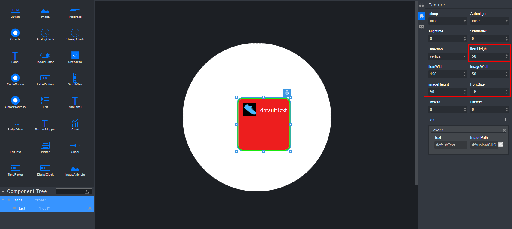

-   选中List组件，单击右侧属性样式栏中的样式图标（Feature），在展开的Feature栏中修改List组件的OffsetX属性设置所有子项的横向偏移，修改OffsetY属性设置所有子项的纵向偏移。

    **图 2**  修改子项的偏移  
    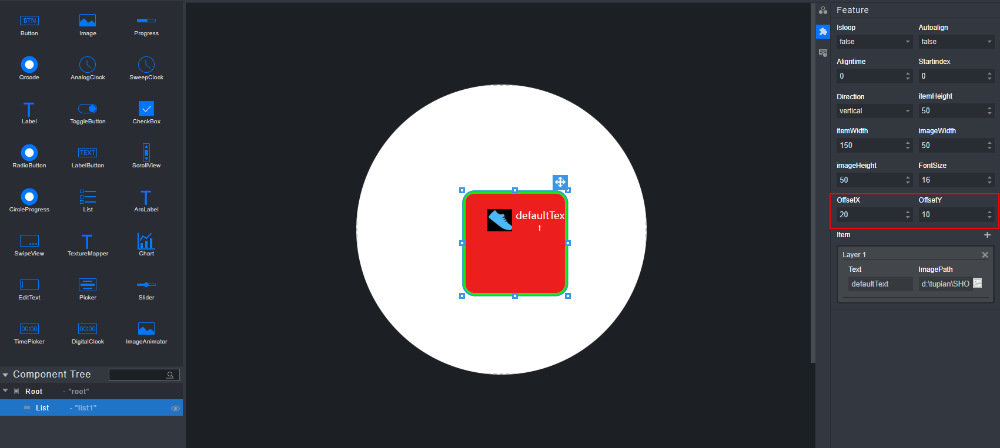

-   选中List组件，单击右侧属性样式栏中的样式图标（Feature），在展开的Feature栏中修改List组件的Direction属性设置列表的排列方向。

    **图 3**  修改列表的排列方向  
    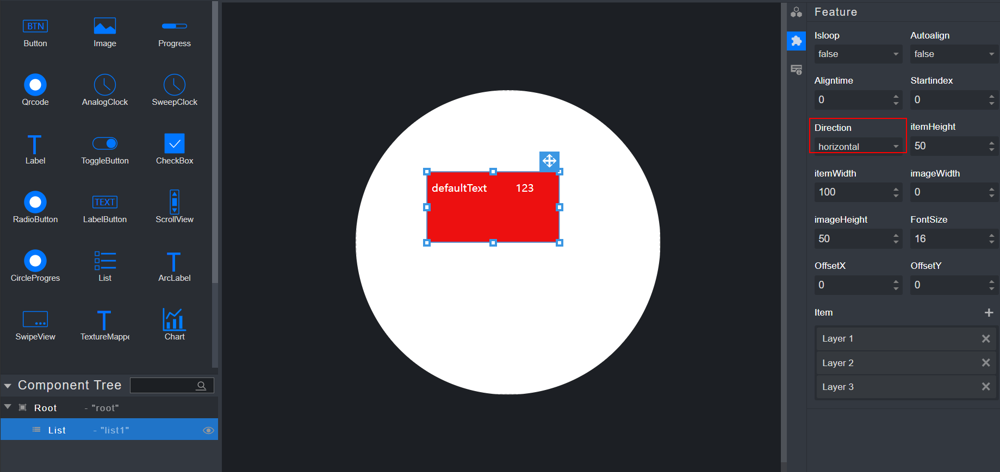

-   选中画布内的List组件，通过右侧属性样式栏中的样式图标（Events），在展开的Events栏中配置回调事件。

    List组件支持的事件有：OnClick、OnLongPress、OnDrag、OnDragStart、OnDragEnd、OnPress、OnCancel、OnRelease、OnFocus和OnBlur。

    **图 4**  回调事件配置  
    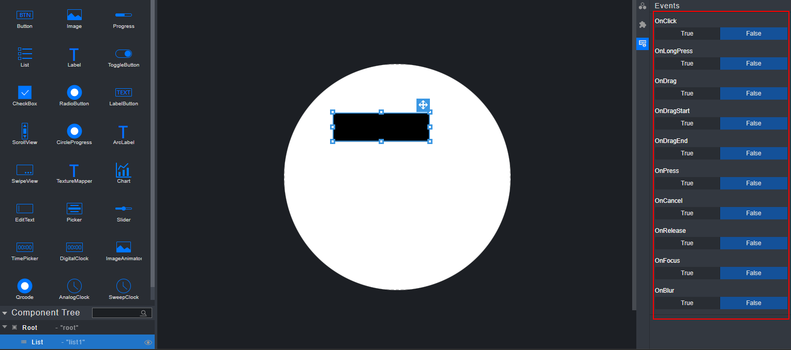

> **说明：** 
>-   General页面下的MarginBottom属性和MarginRight属性无渲染效果。
>-   Feature页面下的Isloop属性、Autoalign属性、Aligntime属性、Startindex属性均没有界面渲染效果，在添加子元素后可在模拟器查看效果。
>-   目前删除子项的最后一个元素会出现无法删除的问题，如需删除，可以在关闭界面的状态下在index.visual中将属性listItemText和listItemPath删除。

#### Label组件

共有属性使用方法请参见“[组件的共有属性](组件的共有属性.md)”章节内容。

-   选中画布内的Label组件，通过右侧属性样式栏中的样式图标（Feature），在展开的Feature栏中修改Label组件的Text属性来编辑文本内容（新添加组件默认文本内容为“default”）。

    **图 1**  特有属性配置：Text文本内容  
    

-   选中画布内的Label组件，通过右侧属性样式栏中的样式图标（Feature），在展开的Feature栏中设置Label组件的Font属性：

    -   Color：字体颜色
    -   Size：字体大小
    -   LetterSpace：字母间距
    -   LineSpace：行间距
    -   LineHeight：行高（行高小于字体大小时将以字体大小为准，最终行高＝行高＋行间距）
    -   TextDirection：文本方向

    **图 2**  通用属性配置：文本相关属性  
    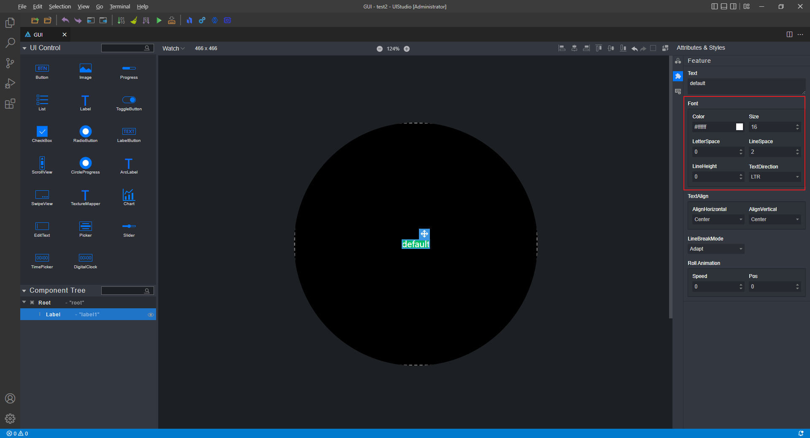

-   选中画布内的Label组件，通过右侧属性样式栏中的样式图标（Feature），在展开的Feature栏中修改Label组件的TextAlign属性改变文字的横向与纵向排布。

    **图 3**  改变文字排布  
    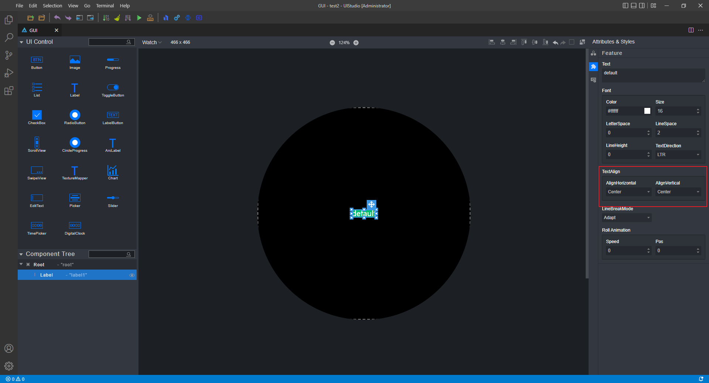

-   选中画布内的Label组件，通过右侧属性样式栏中的样式图标（Feature），在展开的Feature栏中修改Label组件的LineBreakMode属性。LineBreakMode对应6种换行模式，详细介绍如下：
    -   Adapt：组件大小自适应文本，且不会对文本做自动换行。

        > **说明：** 
        >组件宽高不受通用属性Width/Height值影响，因此不可通过拖拽组件或直接修改Width/Height值的方式改变组件宽高。

        **图 4**  LineBreakMode - Adapt  
        

    -   Stretch：组件高度按照设置的Height值显示，宽度由文本中最长的行决定，文本不会自动换行。

        > **说明：** 
        >组件宽度不受通用属性Width值影响，因此不可通过拖拽组件或直接修改Width值的方式改变组件宽度。

        **图 5**  LineBreakMode - Stretch  
        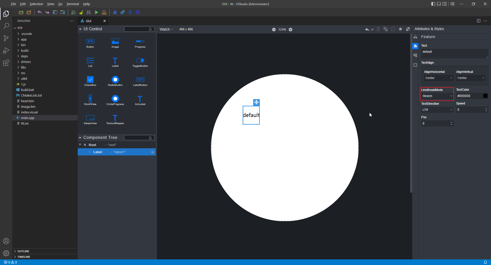

    -   Wrap：组件宽度按照设置的Width值显示，文本自动换行，组件高度由文本行数决定。

        > **说明：** 
        >组件高度不受通用属性Height值影响，因此不可通过拖拽组件或直接修改Height值的方式改变组件高度。

        **图 6**  LineBreakMode - Wrap  
        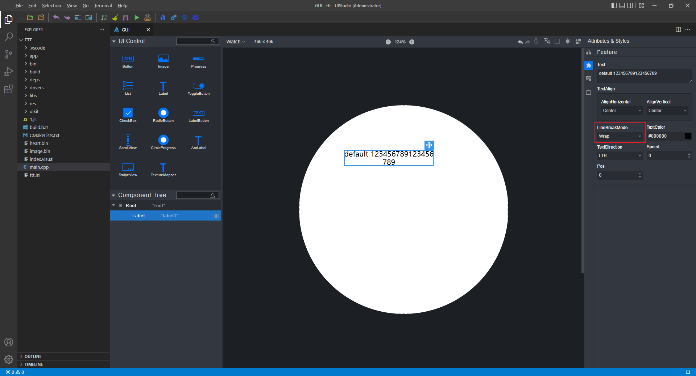

    -   Ellipsis：组件大小按照设置的Height和Width值显示，文本自动换行，超出组件的文本将在末尾以省略号的形式显示。

        **图 7**  LineBreakMode - Ellipsis  
        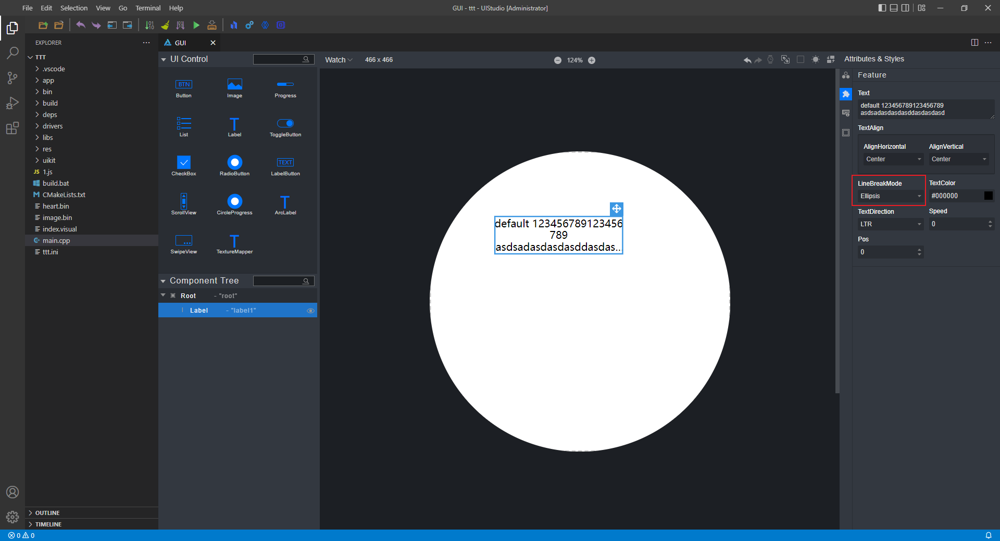

    -   Clip：组件大小按照设置的Height和Width值显示，文本自动换行，超出组件的文本将在末尾自动隐藏。

        **图 8**  LineBreakMode - Clip  
        

    -   Marquee：组件大小按照设置的Height和Width值显示，文本不自动换行，超出组件的文本将自动隐藏。

        > **说明：** 
        >此模式下如果单行文本长度不超出组件时，文本按照设置的TextAlign进行对齐。
        >文本长度超出组件时，文本会自动向左循环滚动播放。

        **图 9**  LineBreakMode - Marquee  
        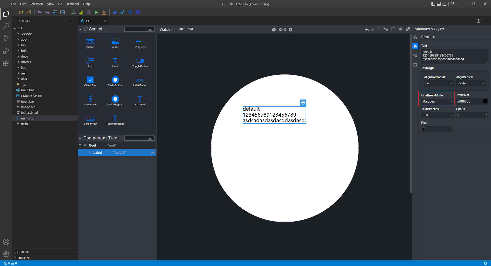

-   选中画布内的Label组件，通过右侧属性样式栏中的样式图标（Feature），在展开的Feature栏中修改Label组件的RollAnimation属性。

    RollAnimation属性只在LineBreakMode为Marquee且文本长度超出时生效。RollAnimation包含滚动速度（Speed）和滚动起始位置（Pos）。

    **图 10**  特有属性配置：RollAnimation  
    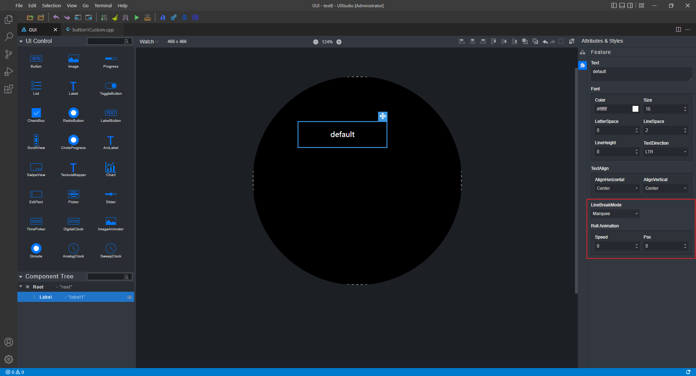

> **说明：** 
>-   General页面下的MarginBottom属性和MarginRight属性没有任何界面渲染效果，可在模拟器上查看效果。
>-   Label组件不支持配置回调事件。

#### ToggleButton组件

共有属性使用方法请参见“[组件的共有属性](组件的共有属性.md)”章节内容。

-   选中画布内的ToggleButton组件，单击右侧属性样式栏中的样式图标（Feature），在展开的Feature栏中修改ToggleButton组件的ImageOpacity属性修改图片透明度。

    **图 1**  修改图片透明度  
    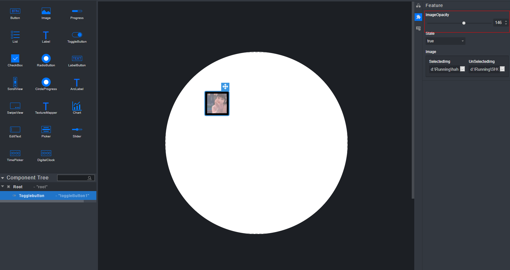

-   选中ToggleButton组件，单击右侧属性样式栏中的样式图标（Feature），在展开的Feature栏中修改ToggleButton组件的State属性改变组件的状态，当属性值为true时为选中状态，反之为未选中状态。

    **图 2**  修改组件状态  
    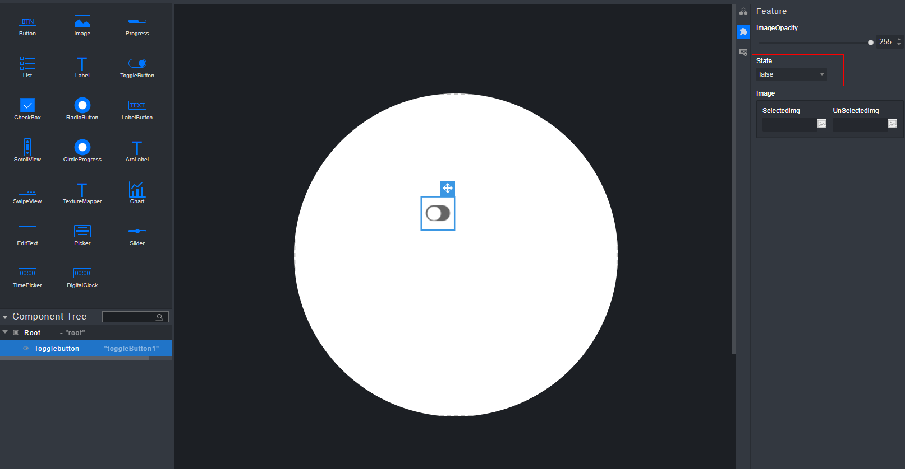

-   选中ToggleButton组件，单击右侧属性样式栏中的样式图标（Feature），在展开的Feature栏中修改ToggleButton组件的UnSelectedImg属性添加未选中时的图片和SelectedImg属性添加选中时的图片，两张图片必须同时存在时才会产生渲染效果，通过将属性UnSelectedImg和SelectedImg恢复成空（手动删除），可以实现图片的删除。

    > **说明：** 
    >图片路径不支持中文路径并且路径不能输入空格。

    **图 3**  添加图片  
    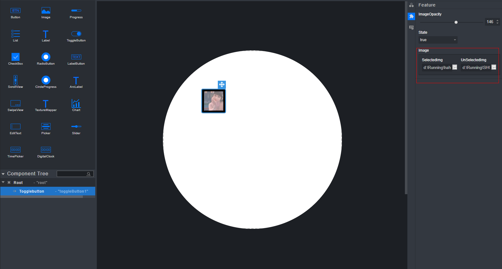

-   选中画布内的ToggleButton组件，通过右侧属性样式栏中的样式图标（Events），在展开的Events栏中配置回调事件。

    ToggleButton组件支持的事件有OnClick、OnLongPress、OnPress、OnCancel、OnRelease和OnChange。

    **图 4**  回调事件配置  
    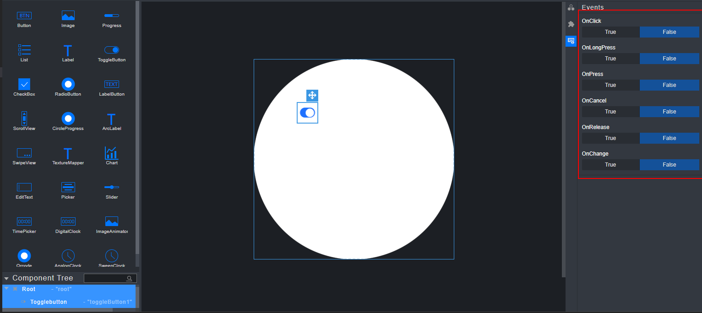

> **说明：** 
>General页面下的，MarginBottom属性、MarginRight属性暂无渲染效果。

#### CheckBox组件

共有属性使用方法请参见“[组件的共有属性](组件的共有属性.md)”章节内容。

-   选中画布内的CheckBox组件，在已经添加图片的前提下，单击右侧属性样式栏中的样式图标（Feature），在展开的Feature栏中修改CheckBox组件的ImageOpacity属性修改图片透明度。

    **图 1**  修改图片透明度  
    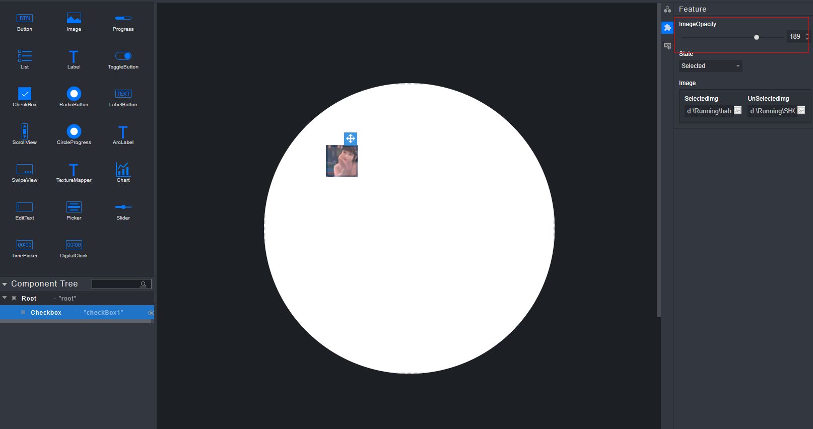

-   选中CheckBox组件，单击右侧属性样式栏中的样式图标（Feature），在展开的Feature栏中修改CheckBox组件的State属性改变组件的状态，当属性值为Selected时为选中状态，反之为未选中状态。

    **图 2**  修改组件状态  
    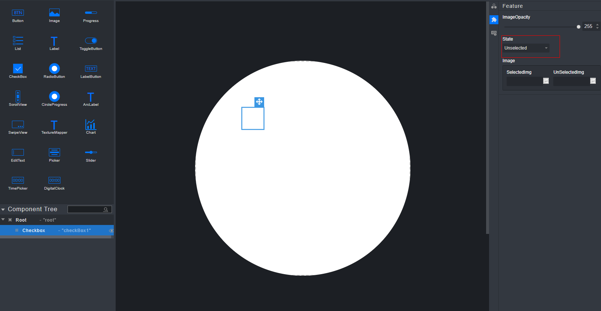

-   选中CheckBox组件，单击右侧属性样式栏中的样式图标（Feature），在展开的Feature栏中修改CheckBox组件的UnSelectedImg属性添加未选中时的图片和SelectedImg属性添加选中时的图片，两张图片必选同时存在才会产生渲染效果，通过将属性UnSelectedImg和SelectedImg恢复成空（手动删除），可以实现图片的删除。。

    > **说明：** 
    >图片路径不支持中文路径并且路径不能输入空格。

    **图 3**  添加图片  
    

-   选中画布内的CheckBox组件，通过右侧属性样式栏中的样式图标（Events），在展开的Events栏中配置回调事件。

    CheckBox组件支持的事件有OnClick、OnLongPress、OnPress、OnCancel、OnRelease和OnChange。

    **图 4**  回调事件配置  
    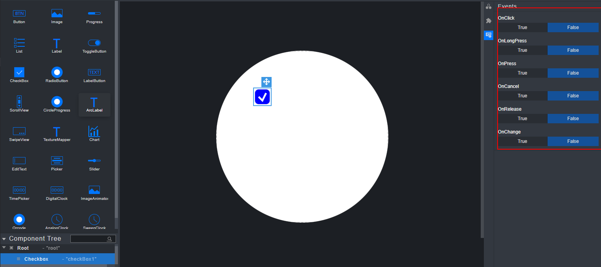

> **说明：** 
>General页面下的，MarginTop属性、MarginRight属性无渲染效果。

#### RadioButton组件

共有属性使用方法详见[组件的共有属性](组件的共有属性.md)。

-   选中画布内的RadioButton组件，在已经添加图片的前提下，单击右侧属性样式栏中的样式图标（Feature），在展开的Feature栏中修改RadioButton组件的ImageOpacity属性修改图片透明度。

    **图 1**  修改图片透明度  
    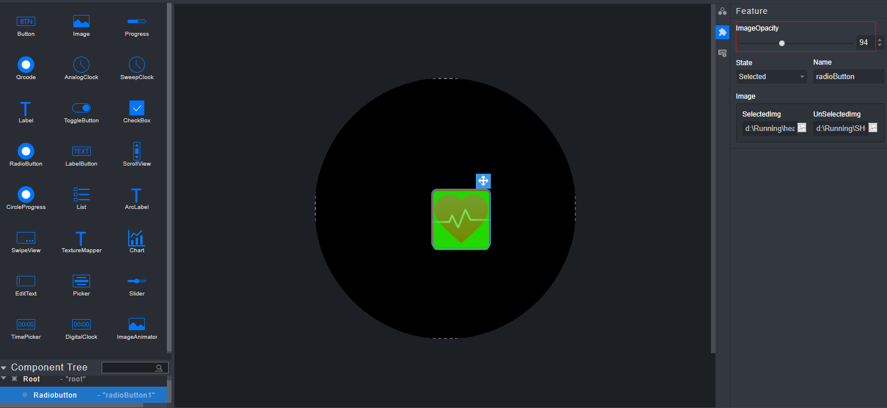

-   选中RadioButton组件，单击右侧属性样式栏中的样式图标（Feature），在展开的Feature栏中修改RadioButton组件的State改变组件的状态，当属性值为Selected时为选中状态，反之为未选中状态。

    **图 2**  修改组件状态  
    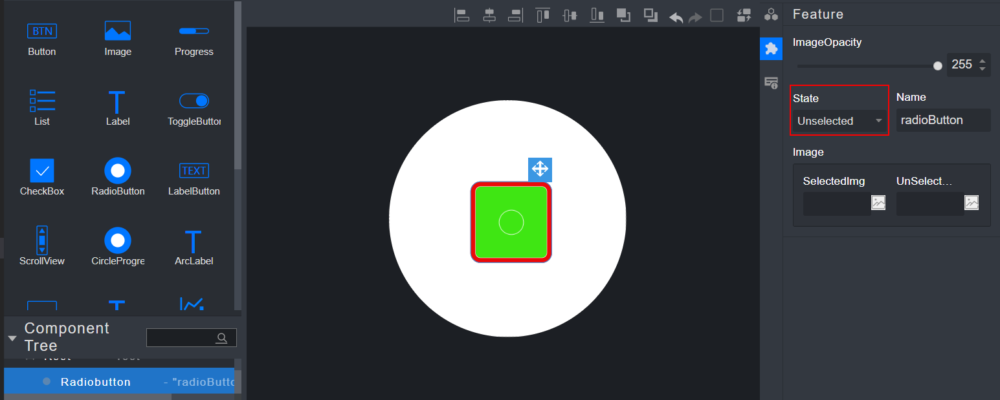

-   选中RadioButton组件，单击右侧属性样式栏中的样式图标（Feature），在展开的Feature栏中修改RadioButton组件的SelectedImg属性添加选中时的图片和UnSelectedImg属性添加未选中时的图片，两张图片必须同时存在才会产生渲染效果，通过将SelectedImg和UnSelectedImg属性恢复成空（手动删除），可以实现图片的删除。

    **图 3**  添加图片效果展示  
    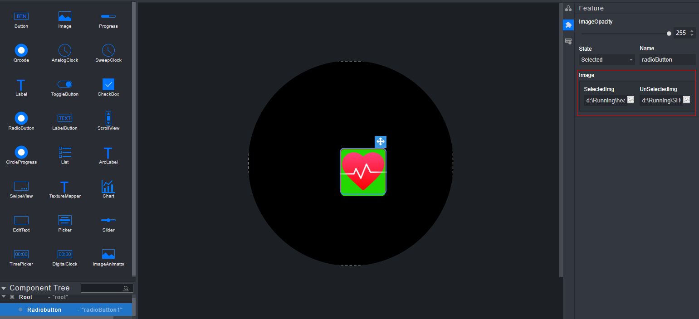

    > **说明：** 
    >SelectedImg属性和UnSelectedImg属性不支持中文路径。

-   选中画布内的RadioButton组件，通过右侧属性样式栏中的样式图标（Events），在展开的Events栏中配置回调事件。

    RadioButton组件支持的事件有OnClick、OnLongPress、OnPress、OnCancel、OnRelease和OnChange。

    **图 4**  回调事件配置  
    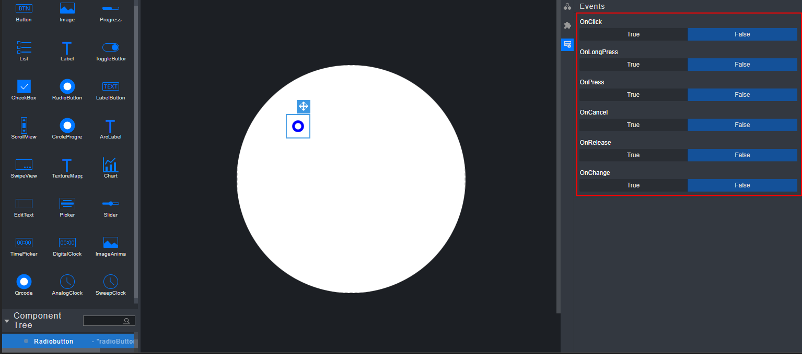

> **说明：** 
>-   General页面下的MarginBottom属性和MarginRight属性无渲染效果。
>-   Feature页面下的Name属性没有任何界面渲染效果。当界面上有2个组件，并且Name属性一样时，模拟器才可以实现状态的切换。

#### LabelButton组件

共有属性使用方法请参见“[组件的共有属性](组件的共有属性.md)”章节内容。

-   选中LabelButton组件，单击右侧属性样式栏中的样式图标（Feature），在展开的Feature栏中修改LabelButton组件的ImageOpacity属性可以修改图片的透明度。

    **图 1**  修改图片透明度  
    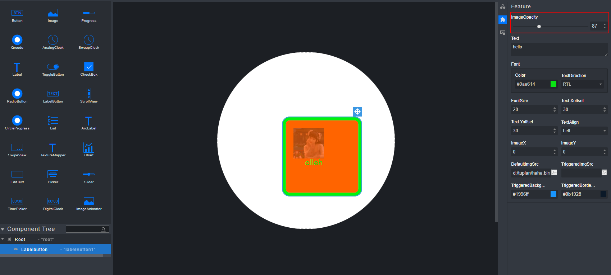

-   选中LabelButton组件，单击右侧属性样式栏中的样式图标（Feature），在展开的Feature栏中修改LabelButton组件的ImageX属性和ImageY属性可以对图片的位置进行调整。

    **图 2**  修改ImageX属性和ImageY属性的效果  
    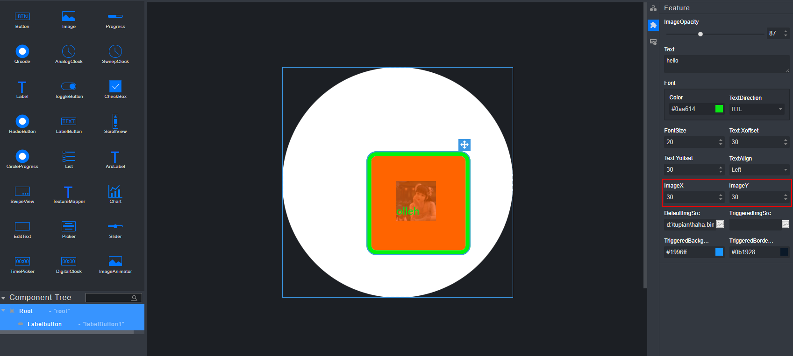

-   选中LabelButton组件，单击右侧属性样式栏中的样式图标（Feature），在展开的Feature栏中修改LabelButton组件的Text属性添加文本。

    **图 3**  添加文本  
    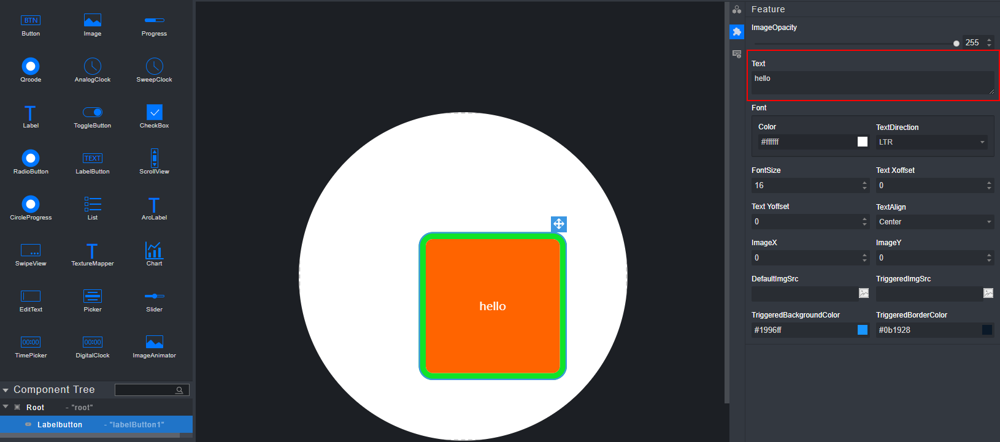

-   选中LabelButton组件，单击右侧属性样式栏中的样式图标（Feature），在展开的Feature栏中设置LabelButton组件的Font属性：

    -   Color：字体颜色
    -   FontSize：字体大小
    -   TextDirection：文本方向

    **图 4**  文本相关属性  
    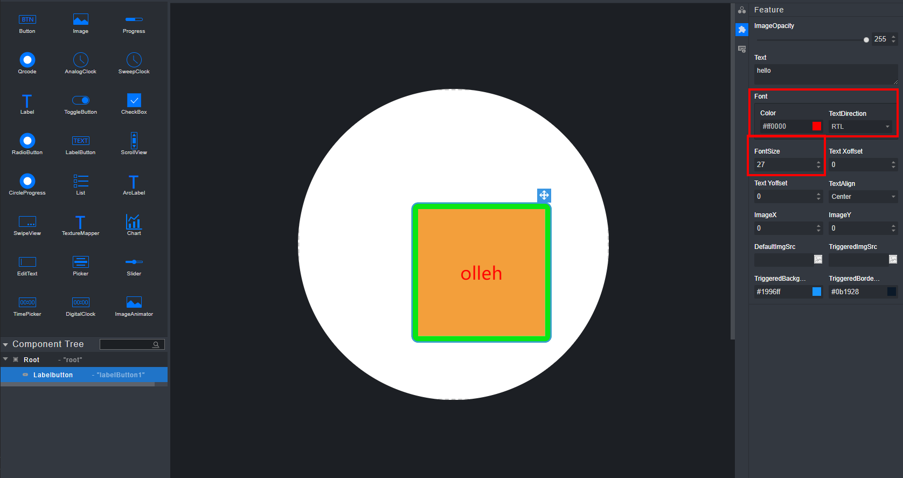

-   选中LabelButton组件，单击右侧属性样式栏中的样式图标（Feature），在展开的Feature栏中修改LabelButton组件的Text Xoffset属性和Text Yoffset属性对文字的位置进行调整。

    **图 5**  对文字位置进行调整  
    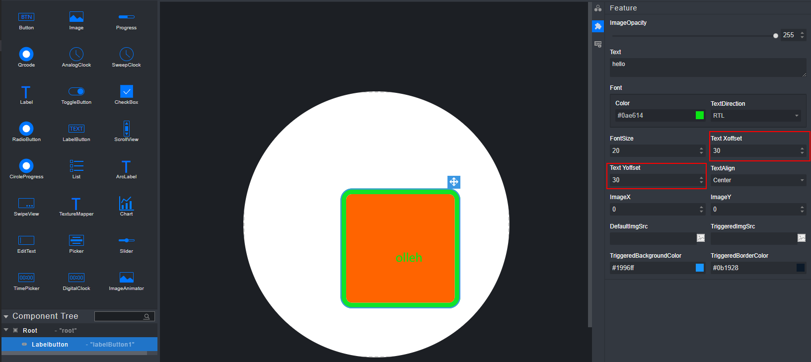

-   选中LabelButton组件，单击右侧属性样式栏中的样式图标（Feature），在展开的Feature栏中修改LabelButton组件的TextAlign属性对文字的水平的对齐方式进行调整。

    **图 6**  修改文字的对齐方式  
    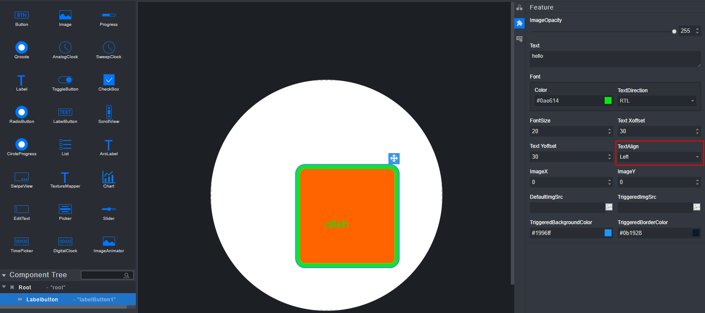

-   选中LabelButton组件，单击右侧属性样式栏中的样式图标（Feature），在展开的Feature栏中修改LabelButton组件的DefaultImgSrc属性可以添加图片，通过将属性DefaultImgSrc恢复成空（手动删除），可以实现图片的删除。

    **图 7**  添加图片  
    

    > **说明：** 
    >DefaultImgSrc属性不支持中文路径。

-   选中画布内的LabelButton组件，通过右侧属性样式栏中的样式图标（Events），在展开的Events栏中配置回调事件。

    LabelButton组件支持的事件有OnClick、OnLongPress、OnPress、OnCancel和OnRelease。

    **图 8**  回调事件配置  
    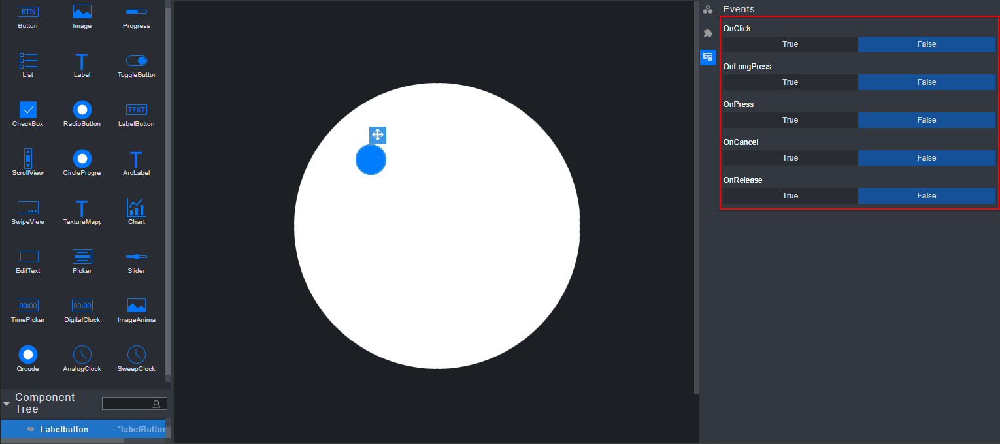

> **说明：** 
>-   General页面下的MarginBottom属性和MarginRight属性没有任何的渲染效果。
>-   Feature页面下的TriggeredImgSrc属性、TriggeredBackgroundColor属性、TriggeredborderColor属性没有任何界面渲染效果，可在模拟器上查看效果。

#### ScrollView组件

共有属性使用方法请参见“[组件的共有属性](组件的共有属性.md)”章节内容。

-   选中组件栏中的其他组件，可以将其拖入ScrollView组件中，并且对其他组件进行样式调整。子组件的位置是相对于父容器的左上角，当组件已经存在于界面上时，点击组件中心位置可以将组件拖入容器中。

    **图 1**  将其他组件拖入ScrollView组件中  
    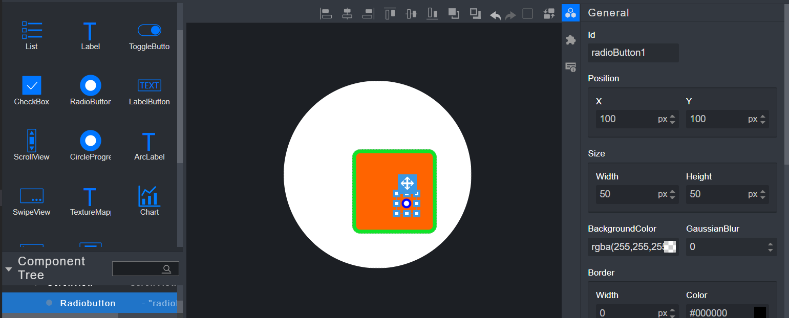

-   选中ScrollView组件，单击右侧属性样式栏中的样式图标（Feature），在展开的Feature栏中修改ScrollView组件的Direction属性可以控制组件哪个方向可以滚动。

    **图 2**  修改组件状态  
    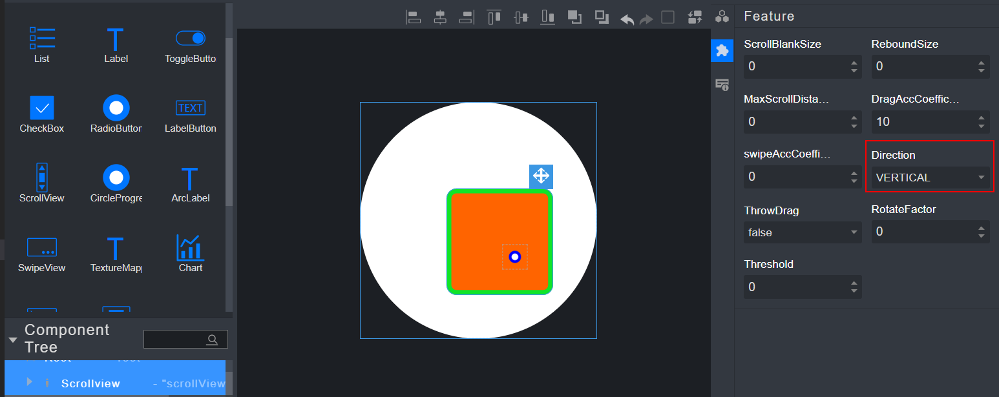

-   选中画布内的ScrollView组件，通过右侧属性样式栏中的样式图标（Events），在展开的Events栏中配置回调事件。

    ScrollView组件支持的事件有OnDrag、OnDragStart、OnDragEnd、OnFocus、OnBlur和OnScroll。

    **图 3**  回调事件配置  
    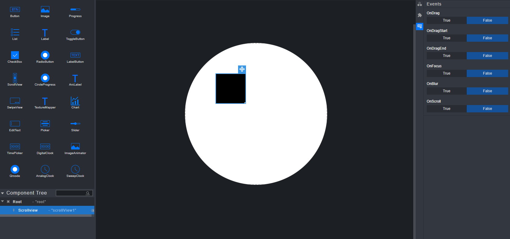

> **说明：** 
>-   当其他组件不是直接从左侧UI Control栏拖入时可能会发生其他组件出现在ScrollView组件外面且无法看到的情况，并且当多次从左侧UI Control栏拖入组件时，他们会重复出现在组件（100，100）位置。
>-   General页面下的MarginBottom属性和MarginRight属性没有任何的渲染效果。
>-   Feature页面下的除Direction属性外其他属性均没有界面渲染效果，可在模拟器上查看效果。
>-   ScrollView的滚动条一直处于隐藏状态仍保持正常的拖拽方式。

#### CircleProgress组件

共有属性使用方法请参见“[组件的共有属性](组件的共有属性.md)”章节内容。

-   选中画布内的CircleProgress组件，通过右侧属性样式栏中的样式图标（Feature），在展开的Feature栏中修改CircleProgress组件的ForegroundStyle和BackgroundStyle窗口中LineWidth属性改变进度条宽度；修改LineColor属性改变进度条颜色。

    **图 1**  修改进度条宽度  
    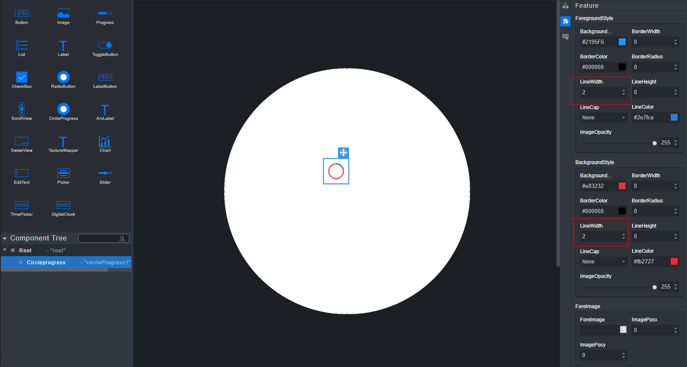

    **图 2**  修改进度条颜色  
    

-   选中画布内的CircleProgress组件，通过右侧属性样式栏中的样式图标（Feature），在展开的Feature栏中修改CircleProgress组件的RangeMax和RangeMin用来限制进度条的value，修改value来改变进度值。

    **图 3**  修改进度值  
    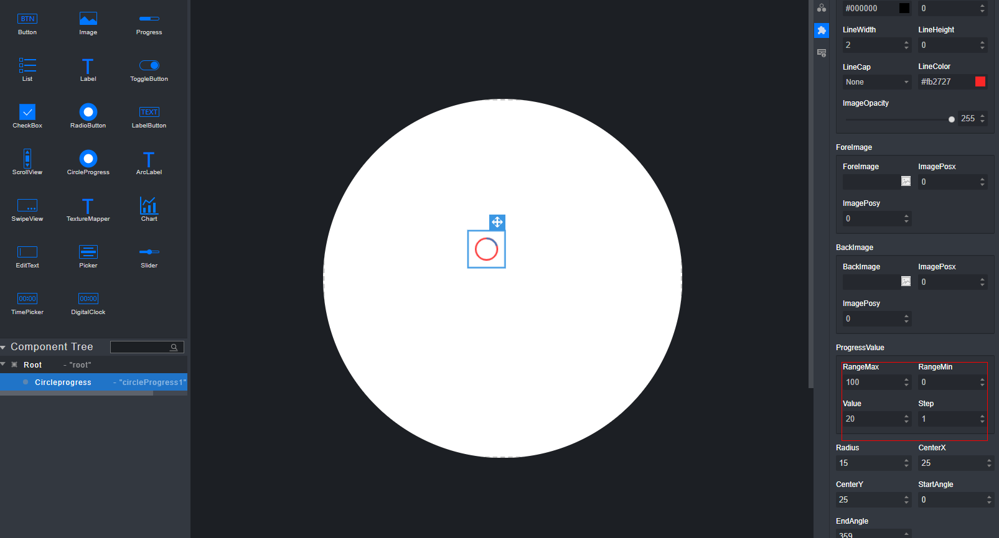

-   选中画布内的CircleProgress组件，通过右侧属性样式栏中的样式图标（Feature），在展开的Feature栏中修改CircleProgress组件的Radius和CenterX属性和CenterY用来限定圆环。

    **图 4**  修改圆环大小  
    

-   选中画布内的CircleProgress组件，通过右侧属性样式栏中的样式图标（Feature），在展开的Feature栏中修改CircleProgress组件的StartAngel和EndAngel属性用来限制绘制角度。

    **图 5**  修改角度  
    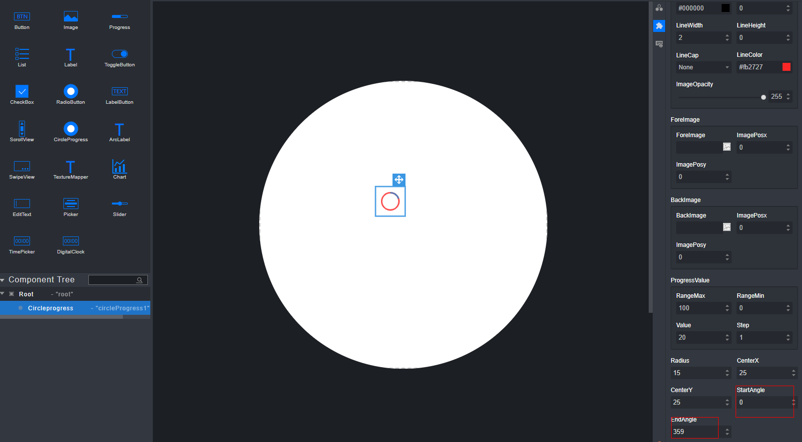

-   选中画布内的CircleProgress组件，通过右侧属性样式栏中的样式图标（Feature），在展开的Feature栏中修改CircleProgress组件的ForeImage或者BackImage的子属性来添加前景或者背景图片并且修改图片位置。

    > **说明：** 
    >图片路径不支持中文路径并且路径不能输入空格。

    **图 6**  添加图片  
    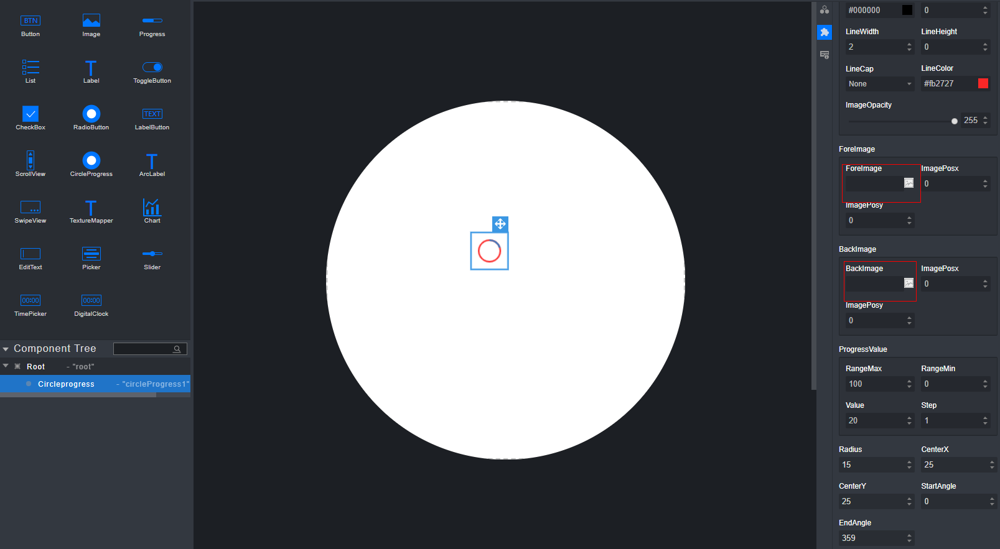

> **说明：** 
>-   General页面下的MarginBottom属性、MarginRight属性无渲染效果。
>-   Feature页面下的ForegroundStyle和BackgroundStyle的子属性BackgroundColor、BorderWidth、BorderColor、BorderRadius、LineHeight、ImageOpacity无渲染效果。
>-   CircleProgress组件不支持回调事件配置。

#### ArcLabel组件

本组件的共有属性不包含Position属性与Size属性，其他共有属性使用方法请参见“[组件的共有属性](组件的共有属性.md)”章节内容。

-   选中画布内的ArcLabel组件，单击右侧属性样式栏中的样式图标（Feature），在展开的Feature栏中修改ArcLabel组件的LetterSpace属性来修改文本之间的间隔。

    **图 1**  修改文字颜色  
    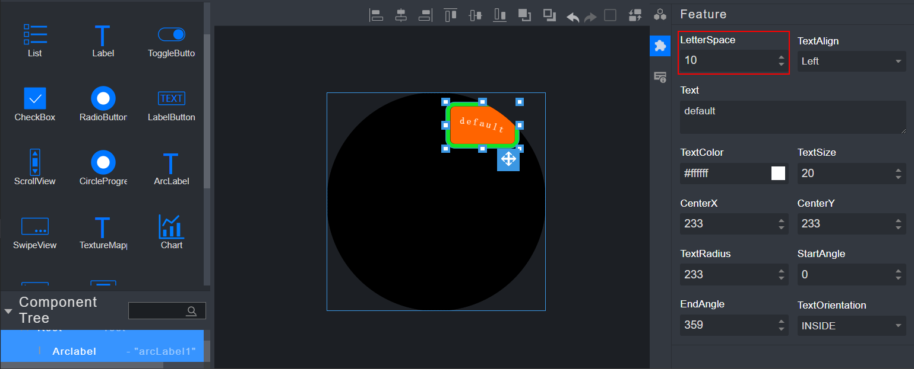

-   选中画布内的ArcLabel组件，通过右侧属性样式栏中的样式图标（Feature），在展开的Feature栏中修改ArcLabel组件的TextAlign属性改变文本在圆环上的对齐方式。

    **图 2**  文本对齐方式修改  
    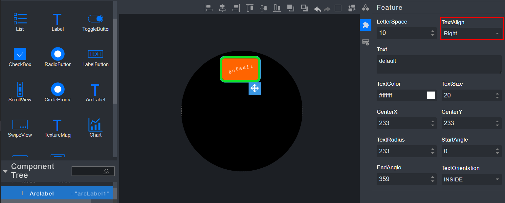

-   选中画布内的ArcLabel组件，通过右侧属性样式栏中的样式图标（Feature），在展开的Feature栏中修改ArcLabel组件的Text属性来改变显示的文本。

    **图 3**  显示文本的修改  
    

-   选中画布内的ArcLabel组件，单击右侧属性样式栏中的样式图标（Feature），在展开的Feature栏中修改ArcLabel组件的TextColor属性来修改文字的颜色。

    **图 4**  修改文字颜色  
    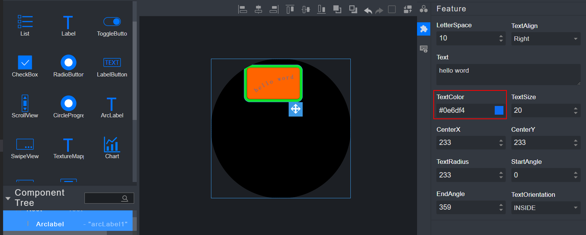

-   选中画布内的ArcLabel组件，通过右侧属性样式栏中的样式图标（Feature），在展开的Feature栏中修改ArcLabel组件的TextSize改变文本中文字的大小。

    **图 5**  文本中文字大小修改  
    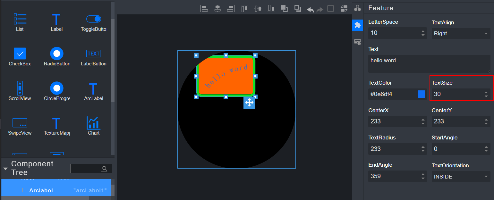

-   选中画布内的ArcLabel组件，通过右侧属性样式栏中的样式图标（Feature），在展开的Feature栏中修改ArcLabel组件的CenterX、CenterY属性改变文字所在圆的圆心位置。

    **图 6**  文本所在圆圆心修改  
    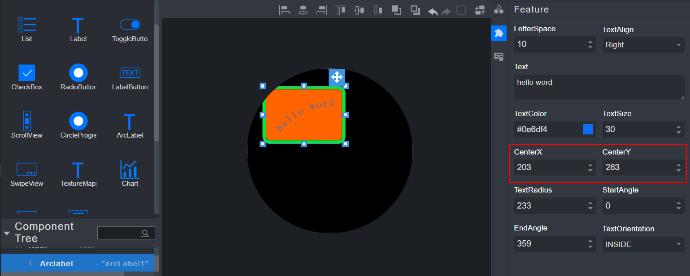

-   选中画布内的ArcLabel组件，通过右侧属性样式栏中的样式图标（Feature），在展开的Feature栏中修改ArcLabel组件的TextRadius改变文字所在圆的半径。

    **图 7**  文本所在圆半径修改  
    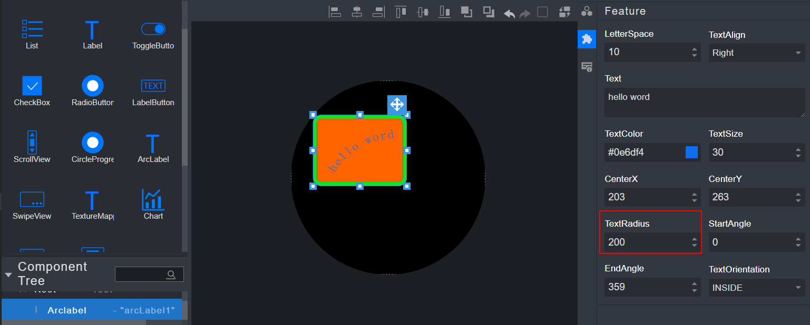

-   选中画布内的ArcLabel组件，通过右侧属性样式栏中的样式图标（Feature），在展开的Feature栏中修改ArcLabel组件的StartAngle、EndAngle属性改变文本在圆中出现的范围。

    **图 8**  文本出现在圆上的范围修改  
    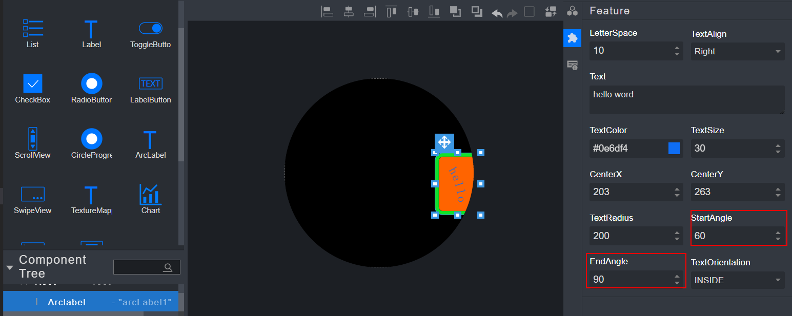

-   选中画布内的ArcLabel组件，通过右侧属性样式栏中的样式图标（Feature），在展开的Feature栏中修改ArcLabel组件的TextOrientation改变文本的朝向。

    **图 9**  文本朝向修改  
    

> **说明：** 
>-   General页面下的MarginBottom属性和MarginRight属性无任何渲染效果。
>-   ArcLabel组件不支持回调事件配置。

#### SwipeView组件

本组件的共有属性不包含Border属性、Margin属性与Padding属性，其他共有属性使用方法请参见“[组件的共有属性](组件的共有属性.md)”章节内容。

-   选中SwipeView组件，单击右侧属性样式栏中的样式图标（Feature），在展开的Feature栏中修改SwipeView组件的Direction属性改变组件的滚动方向。子组件的位置是相对于父容器的左上角，当组件已经存在于界面上时，点击组件中心位置可以将组件拖入容器中。

    **图 1**  修改滚动条位置  
    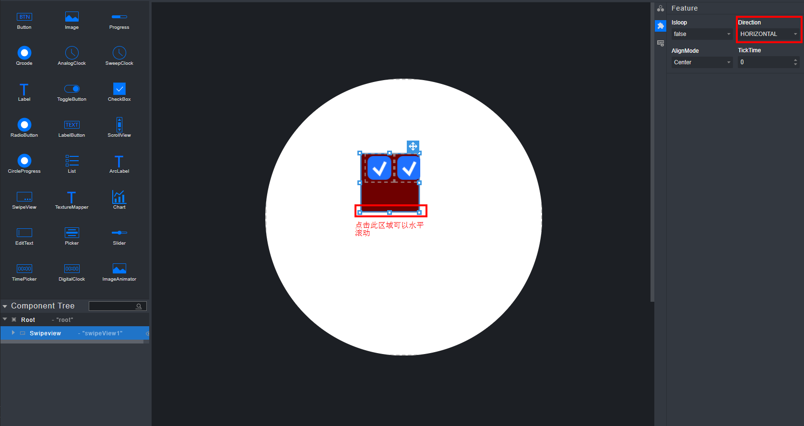

    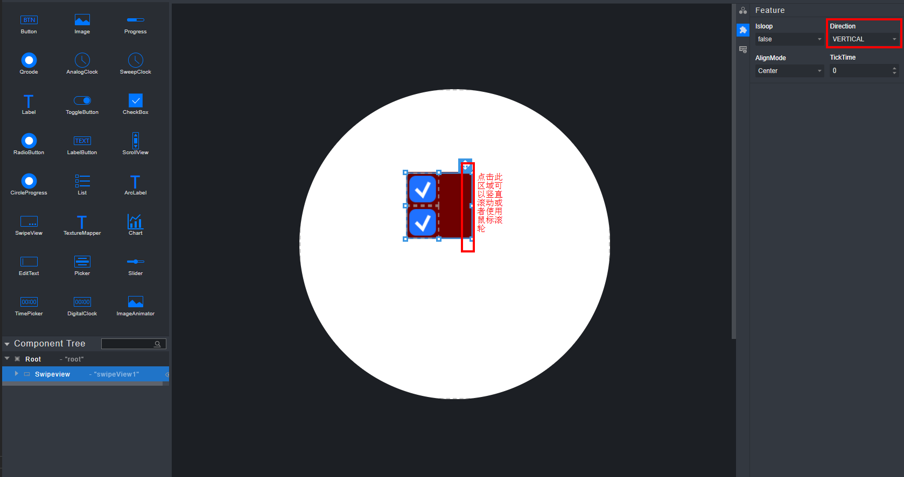

    > **说明：** 
    >滚动条已被隐藏，当空间内的子组件超出范围时可拖动，HORIZONTAL是水平滚动，VERTICAL是垂直滚动。

-   选中画布内的SwipeView组件，通过右侧属性样式栏中的样式图标（Events），在展开的Events栏中配置回调事件。

    SwipeView组件支持的事件有：OnDrag、OnDragStart、OnDragEnd、OnSwipe。

    **图 2**  回调事件配置  
    

> **说明：** 
>-   Feature页面下的Isloop属性、AlignMode属性、TickTime属性暂无渲染效果。
>-   在水平模式下上方工具栏的顶部对齐、底部对齐、上下居中对齐不可用。
>-   在垂直模式下上方工具栏的左对齐、右对齐、左右居中对齐不可用。
>-   SwipeView的滚动条一直处于隐藏状态仍保持正常的拖拽方式。

#### TextureMapper组件

共有属性使用方法请参见“[组件的共有属性](组件的共有属性.md)”章节内容。

-   选中TextureMapper组件，单击右侧属性样式栏中的样式图标（Feature），在展开的Feature栏通过修改TextureMapper组件的ImagePath属性添加图片，通过将ImagePath属性恢复成空（手动删除），可以实现图片的删除。

    **图 1**  添加图片  
    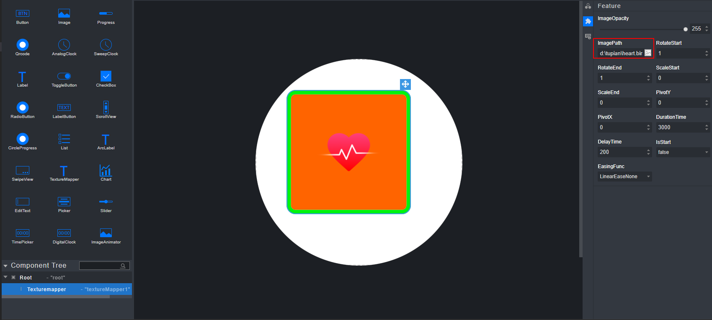

    > **说明：** 
    >ImagePath属性不支持中文路径。

-   选中TextureMapper组件，单击右侧属性样式栏中的样式图标（Feature），在展开的Feature栏通过修改TextureMapper组件的ImageOpacity属性修改图片的透明度。

    **图 2**  修改图片透明度  
    

-   选中画布内的TextureMapper组件，通过右侧属性样式栏中的样式图标（Events），在展开的Events栏中配置回调事件。

    TextureMapper组件支持的事件有OnMapper。

    **图 3**  回调事件配置  
    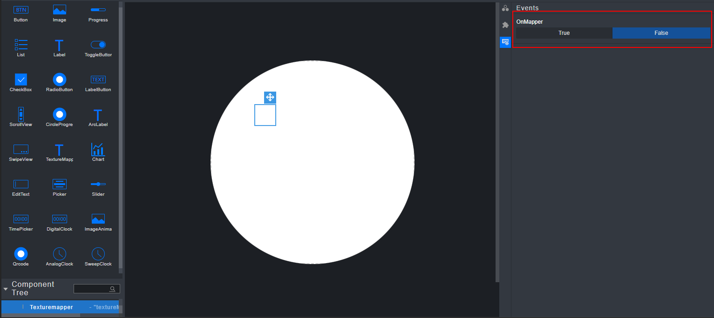

> **说明：** 
>-   General页面下的MarginBottom属性和MarginRight属性均无渲染效果。
>-   Feature页面下除ImagePath属性外其他属性均没有界面渲染效果，可在模拟器上查看效果。请在展示动画效果前先添加图片并且Feature页面的IsStart属性为true。
>-   组件的大小在添加图片后固定为图片的大小，且修改组件宽高不生效。

#### Slider组件

共有属性使用方法请参见“[组件的共有属性](组件的共有属性.md)”章节内容。

-   选中Slider组件，单击右侧属性样式栏中的样式图标（Feature），在展开的Feature栏中修改Slider组件的SliderValue属性改变滑块的位置。

    **图 1**  修改滑块位置  
    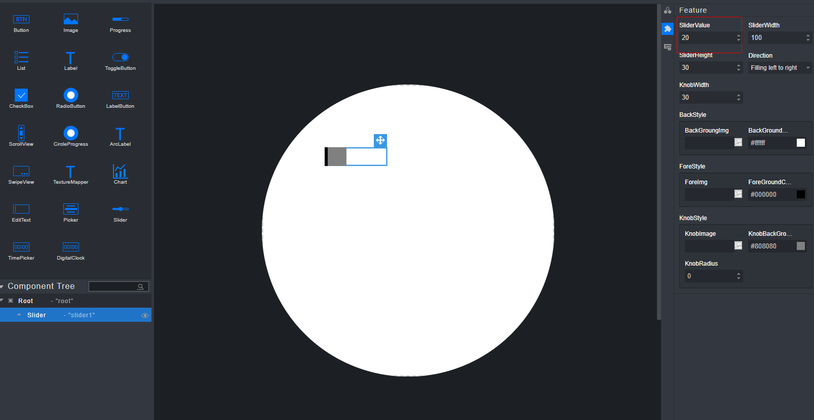

-   选中Slider组件，单击右侧属性样式栏中的样式图标（Feature），在展开的Feature栏中修改Slider组件的SliderWidth属性改变滑槽的宽度。

    **图 2**  修改滑槽宽度  
    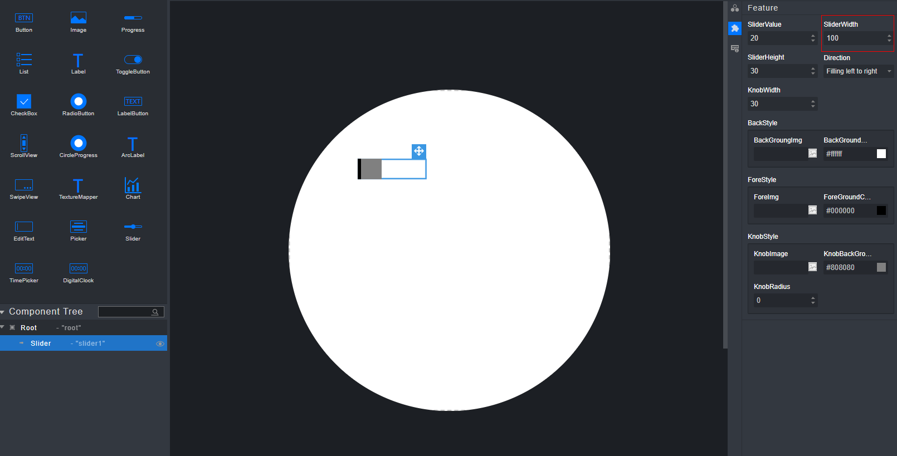

-   选中Slider组件，单击右侧属性样式栏中的样式图标（Feature），在展开的Feature栏中修改Slider组件的SliderHeight属性改变滑槽的高度。SliderHeight不能超出边框的高度。

    **图 3**  修改滑槽高度  
    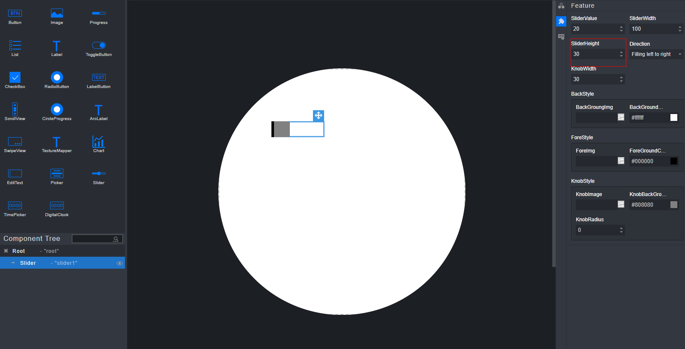

-   选中Slider组件，单击右侧属性样式栏中的样式图标（Feature），在展开的Feature栏中修改Slider组件的Direction属性改变滑槽的方向。

    **图 4**  修改滑方向  
    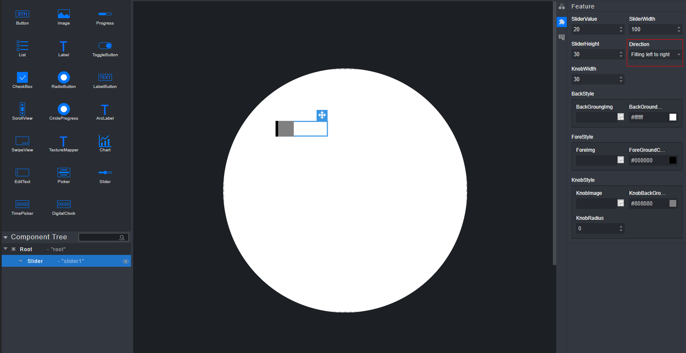

-   选中Slider组件，单击右侧属性样式栏中的样式图标（Feature），在展开的Feature栏中修改Slider组件的KnobWidth属性改变滑块的宽度。

    **图 5**  修改滑块大小  
    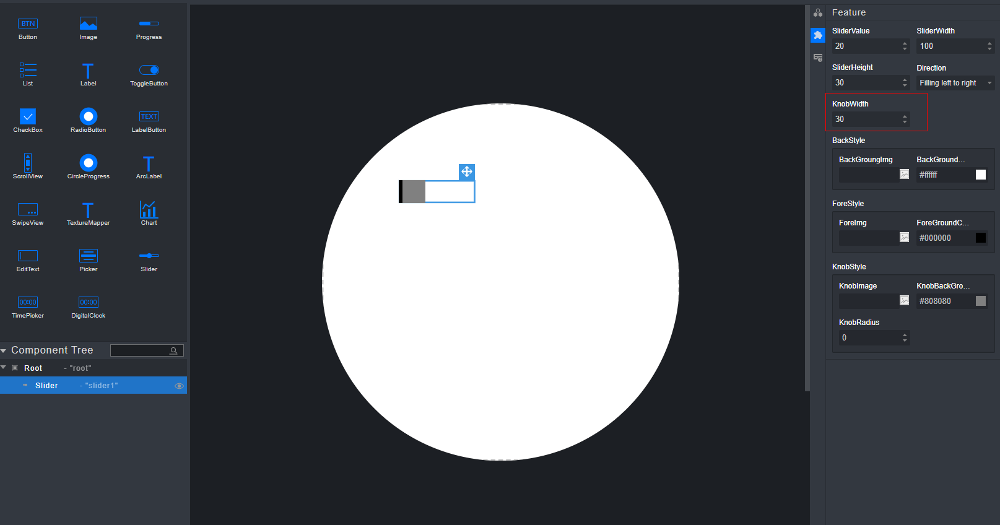

-   选中Slider组件，单击右侧属性样式栏中的样式图标（Feature），在展开的Feature栏中修改Slider组件的BackGroundImage属性改变滑槽的背景图片；修改Slider组件的BackGroundColor属性改变滑槽的背景色。

    > **说明：** 
    >图片路径不支持中文路径并且路径不能输入空格。

    **图 6**  添加图片  
    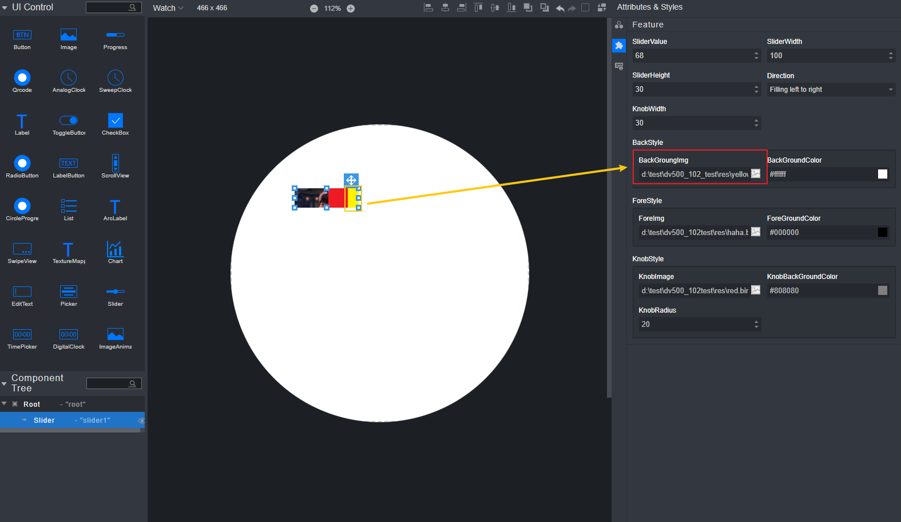

    **图 7**  设置颜色  
    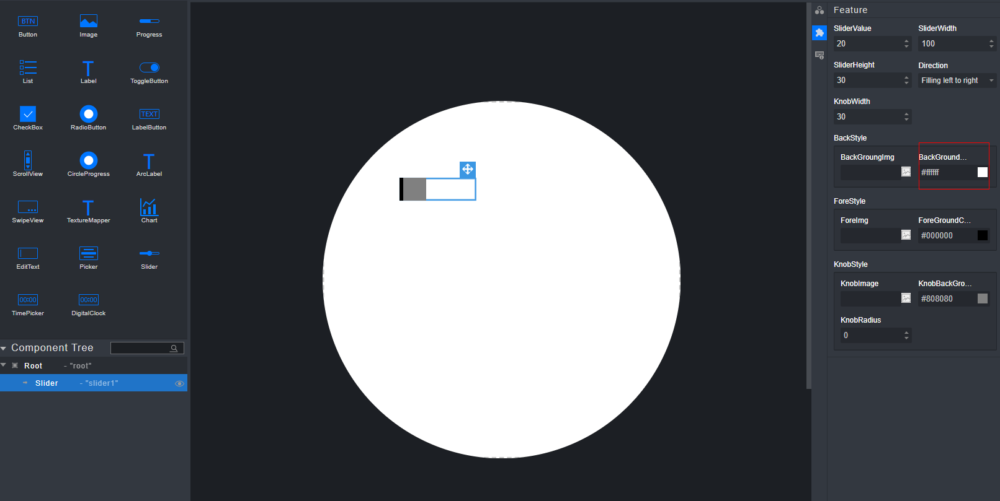

-   选中Slider组件，单击右侧属性样式栏中的样式图标（Feature），在展开的Feature栏的ForeStyle窗口中修改Slider组件的ForeImg属性改变滑槽的前景图片；修改ForeGroundColor改变滑槽的前景颜色。

    > **说明：** 
    >图片路径不支持中文路径并且路径不能输入空格。

    **图 8**  添加图片  
    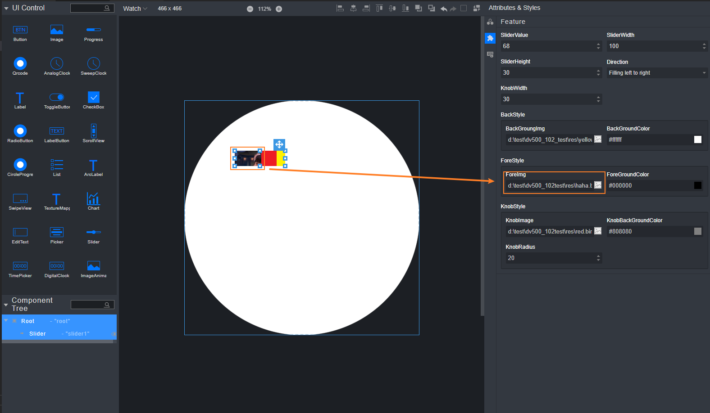

    **图 9**  修改背景颜色  
    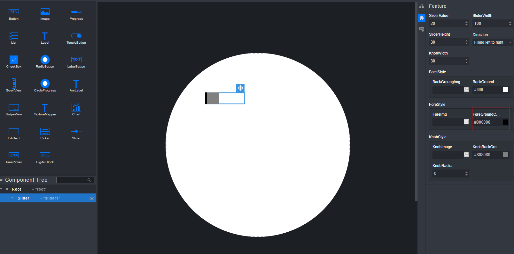

-   选中Slider组件，单击右侧属性样式栏中的样式图标（Feature），在展开的Feature栏KnobStyle窗口中修改Slider组件的KnobImage属性添加图片；修改KnobBackGroundColor属性改变滑块的颜色；修改KnobRadius属性改变滑块的边框弧度。

    **图 10**  添加图片  
    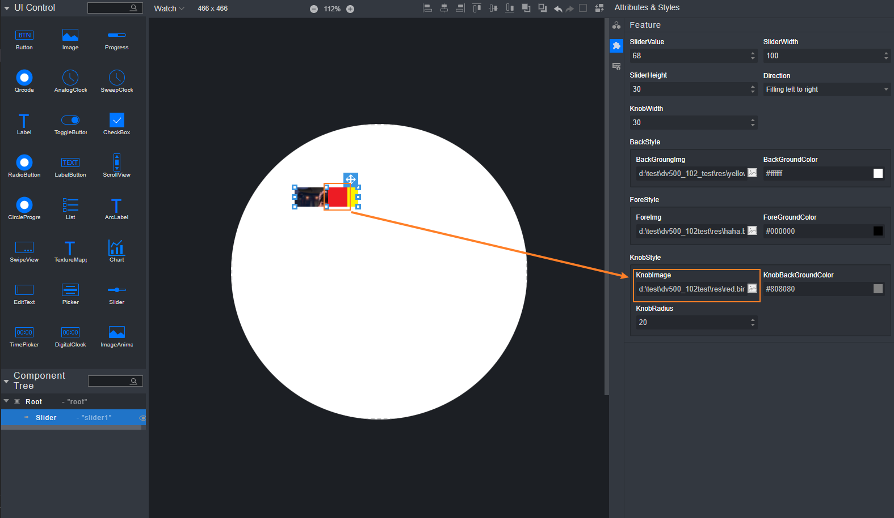

    > **说明：** 
    >图片路径不支持中文路径并且路径不能输入空格。

    **图 11**  修改背景颜色  
    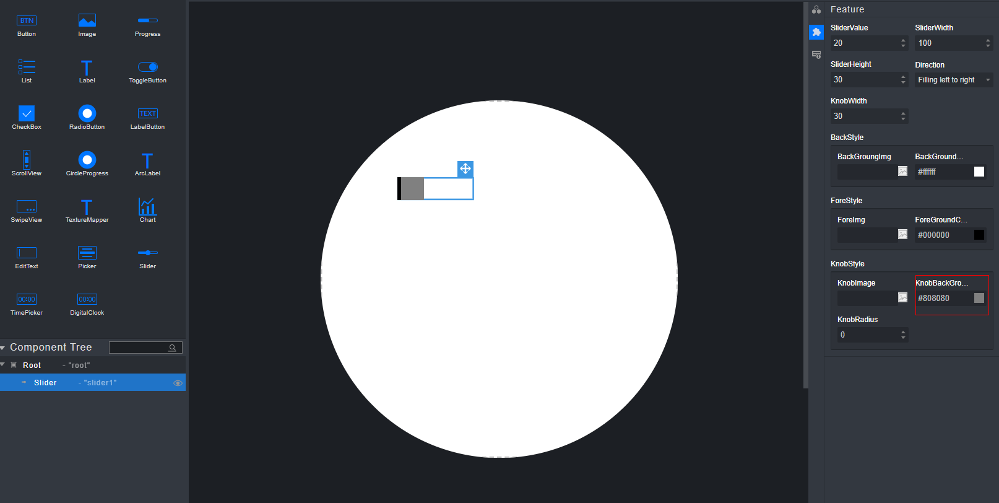

    **图 12**  修改弧度  
    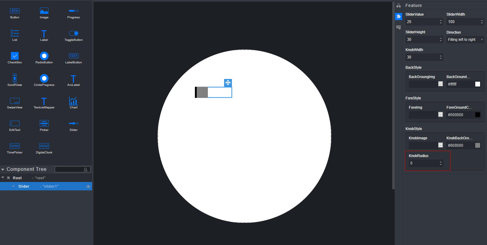

-   选中画布内的Slider组件，通过右侧属性样式栏中的样式图标（Events），在展开的Events栏中配置回调事件。

    Slider组件支持的事件有OnClick、OnLongPress、OnDrag、OnDragStart、OnDragEnd、OnPress、OnCancel、OnRelease、OnFocus、OnBlur。

    **图 13**  回调事件配置  
    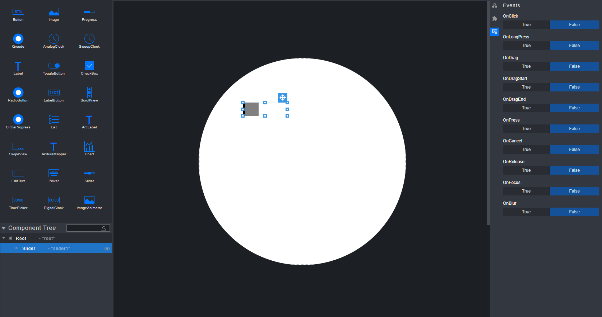

> **说明：** 
>-   General页面下的GaussianBlur属性、MarginBottom属性和MarginRight属性均无渲染效果。
>-   组件的大小在添加图片后固定为图片的大小，且修改组件宽高不生效。

#### Picker组件

共有属性使用方法请参见“[组件的共有属性](组件的共有属性.md)”章节内容。

-   选中Picker组件，单击右侧属性样式栏中的样式图标（Feature），在展开的Feature栏中修改Picker组件的Normal属性改变组件未选中字体颜色。

    **图 1**  修改未选中字体颜色  
    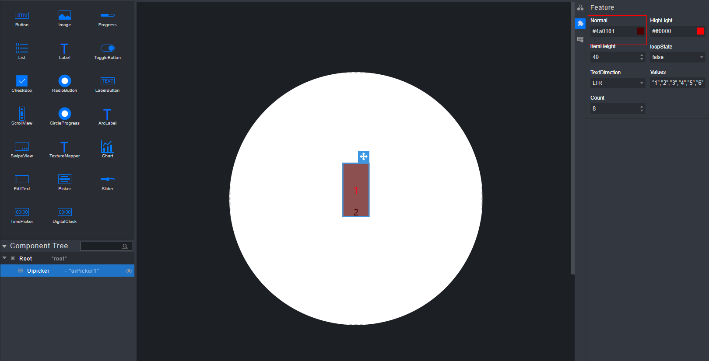

-   选中Picker组件，单击右侧属性样式栏中的样式图标（Feature），在展开的Feature栏中修改Picker组件的HighLight属性改变组件选中字体颜色。

    **图 2**  修改选中字体颜色  
    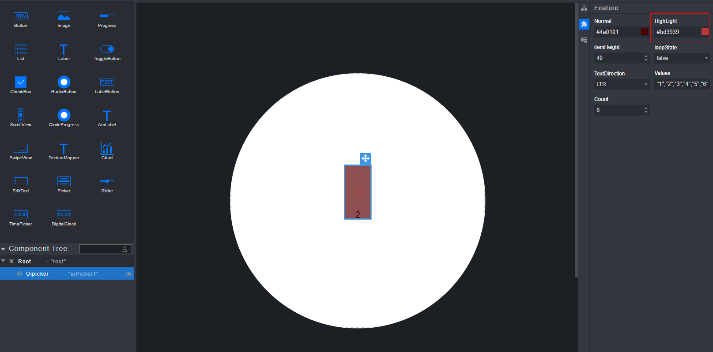

-   选中Picker组件，单击右侧属性样式栏中的样式图标（Feature），在展开的Feature栏中修改Picker组件的ItemHeight属性改变组件条目高度。

    **图 3**  修改条目高度  
    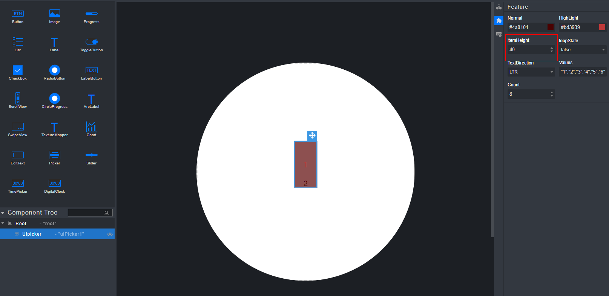

-   选中Picker组件，单击右侧属性样式栏中的样式图标（Feature），在展开的Feature栏中修改Picker组件的LoopState属性使组件内容循环。

    **图 4**  设置循环  
    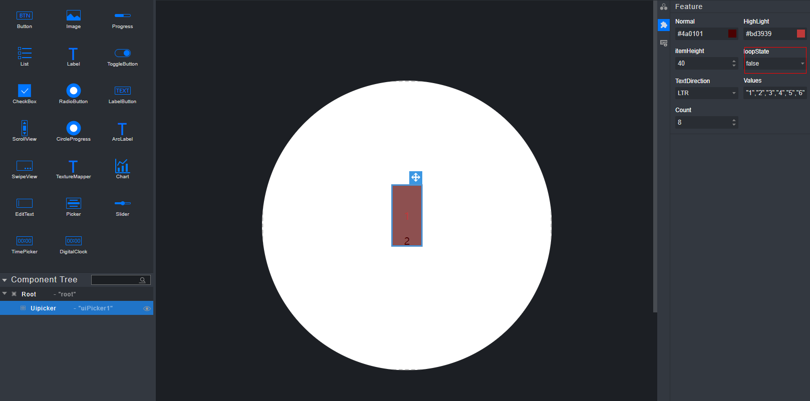

-   选中Picker组件，单击右侧属性样式栏中的样式图标（Feature），在展开的Feature栏中修改Picker组件的Values属性改变组件显示文本，数据格式为："x1", "x2", "x3"...（必须带""）

    **图 5**  修改文本  
    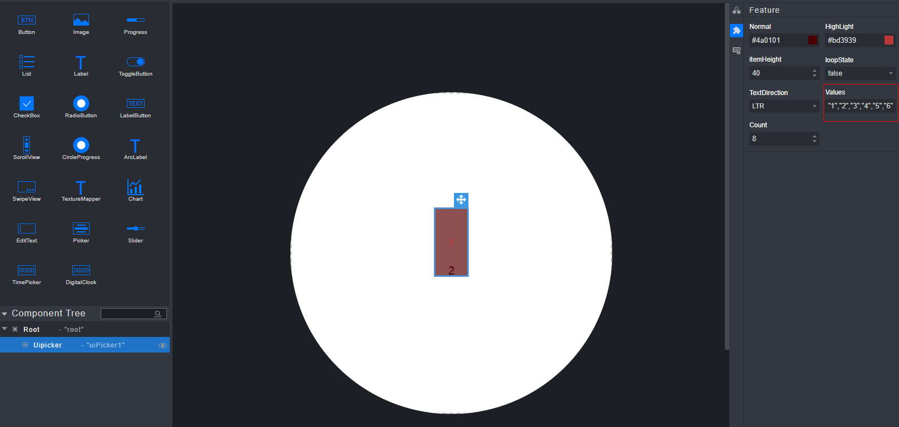

-   选中Picker组件，单击右侧属性样式栏中的样式图标（Feature），在展开的Feature栏中同步Count属性值（必须与输入数组子元素个数相等）。

    **图 6**  添加元素个数值  
    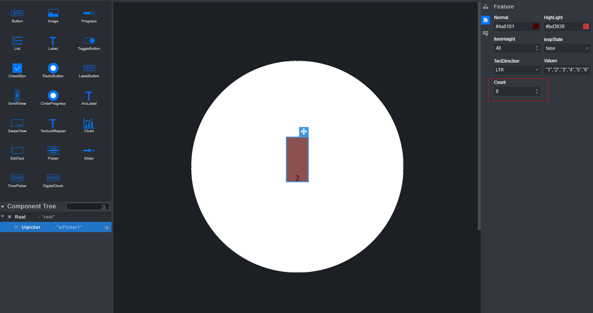

-   选中Picker组件，单击右侧属性样式栏中的样式图标（Feature），在展开的Feature栏中修改Picker组件的TextDirection属性值改变文本的书写方向。LTR表示文字方向为从左至右，RTL为从右至左。如[图7](#fig0726183665610)所示，第一个值为“12345”，通过设置TextDirection属性值为RTL后，画布中显示的文字为“54321”。

    **图 7**  修改文本方向  
    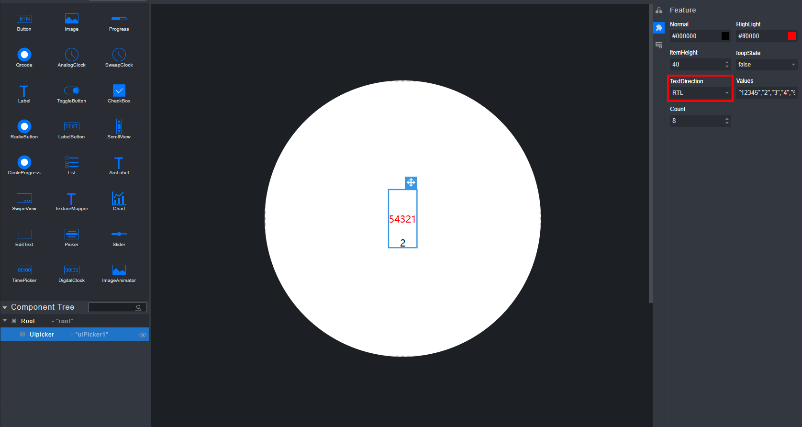

-   选中画布内的Picker组件，通过右侧属性样式栏中的样式图标（Events），在展开的Events栏中配置回调事件。

    Picker组件支持的事件有OnFocus和OnBlur。

    **图 8**  回调事件配置  
    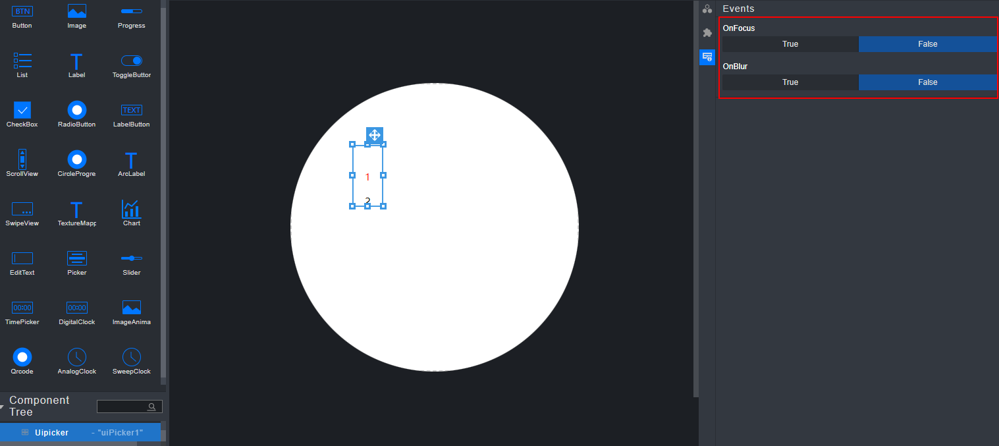

> **说明：** 
>-   General页面下的、MarginBottom属性和MarginRight属性均无渲染效果 。
>-   Count属性值与数组元素个数保持一致。

#### TimePicker组件

共有属性使用方法请参见“[组件的共有属性](组件的共有属性.md)”章节内容。

-   选中TimePicker组件，单击右侧属性样式栏中的样式图标（Feature），在展开的Feature栏中修改TimePicker组件的ItemHeight属性改变组件条目高度。

    **图 1**  修改条目高度  
    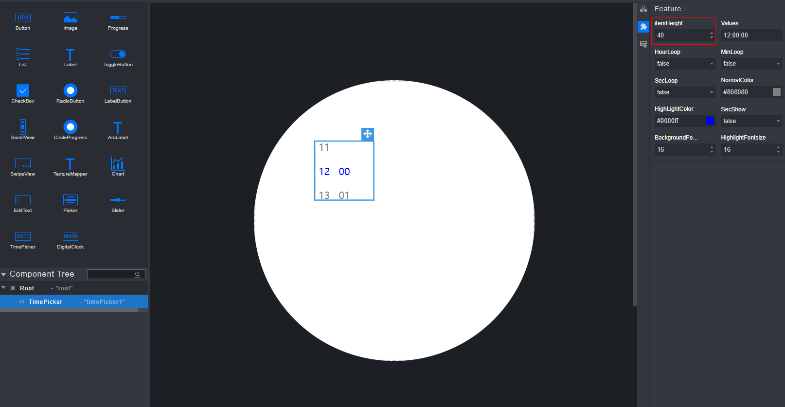

-   选中TimePicker组件，单击右侧属性样式栏中的样式图标（Feature），在展开的Feature栏中修改TimePicker组件的Values属性改变组件显示文本。

    **图 2**  修改文本  
    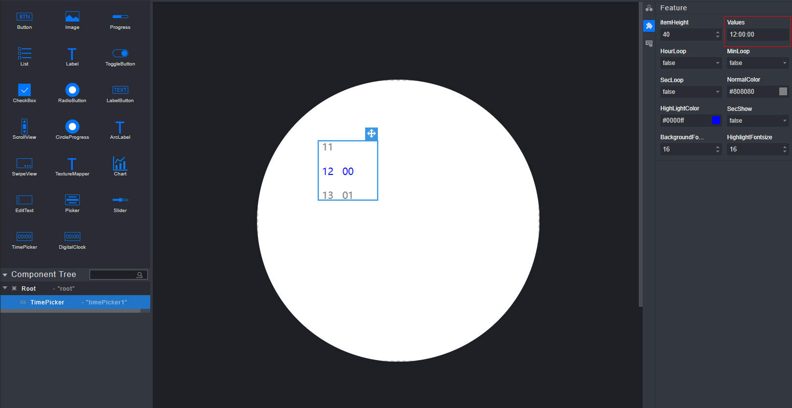

-   选中TimePicker组件，单击右侧属性样式栏中的样式图标（Feature），在展开的Feature栏中修改TimePicker组件的HourLoop属性改变组件小时窗口是否循环。

    **图 3**  设置循环  
    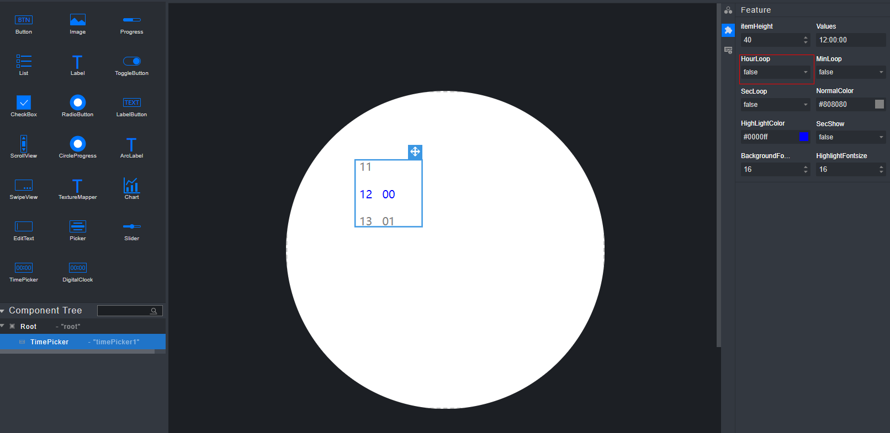

-   选中TimePicker组件，单击右侧属性样式栏中的样式图标（Feature），在展开的Feature栏中修改TimePicker组件的MinLoop属性改变组件分钟窗口是否循环。

    **图 4**  设置循环  
    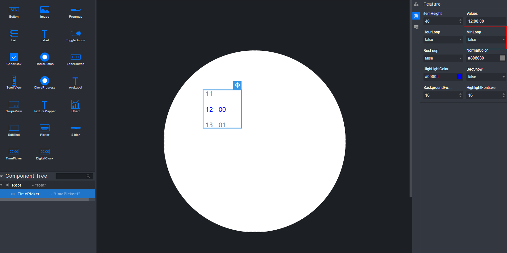

-   选中TimePicker组件，单击右侧属性样式栏中的样式图标（Feature），在展开的Feature栏中修改TimePicker组件的SecLoop属性改变组件秒窗口是否循环。（在SecShows属性为true情况下）

    **图 5**  设置循环  
    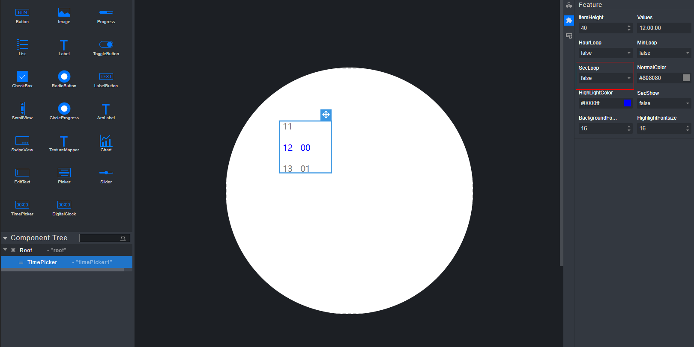

-   选中TimePicker组件，单击右侧属性样式栏中的样式图标（Feature），在展开的Feature栏中修改TimePicker组件的NormalColor属性改变组件未选中字体颜色。

    **图 6**  修改字体颜色  
    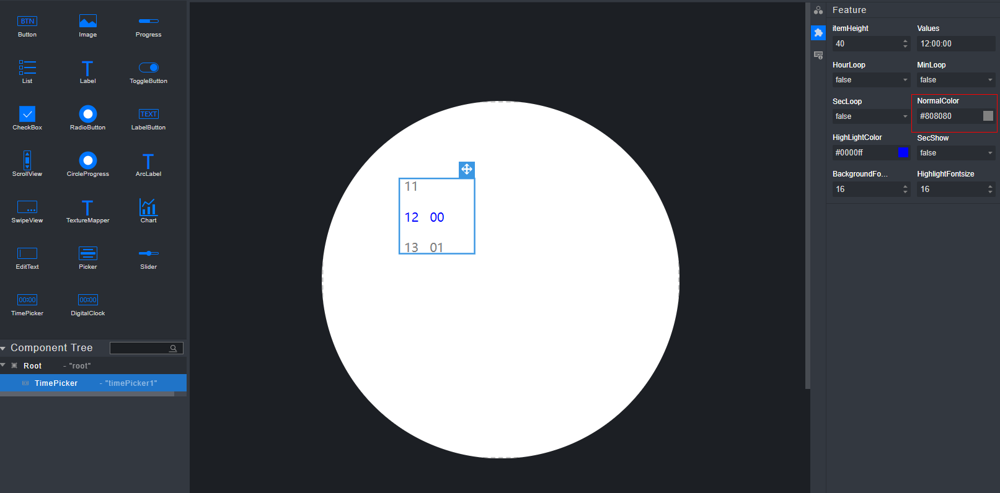

-   选中TimePicker组件，单击右侧属性样式栏中的样式图标（Feature），在展开的Feature栏中修改TimePicker组件的HighLightColor属性改变组件选中字体颜色。

    **图 7**  修改字体颜色  
    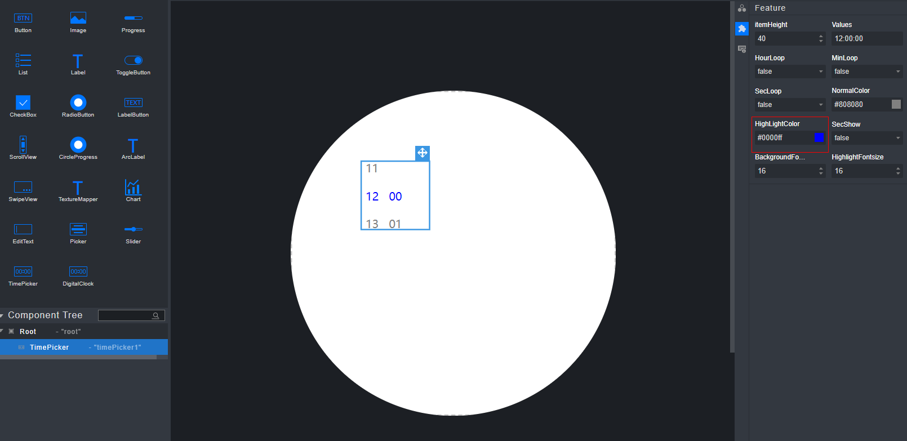

-   选中TimePicker组件，单击右侧属性样式栏中的样式图标（Feature），在展开的Feature栏中修改TimePicker组件的SecShow属性设置秒窗口是否显示。

    **图 8**  设置秒窗口显示  
    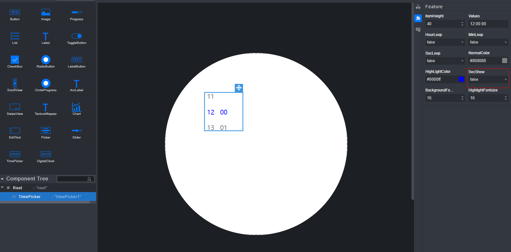

-   选中TimePicker组件，单击右侧属性样式栏中的样式图标（Feature），在展开的Feature栏中修改TimePicker组件的BackgroundFontsize属性改变组件未选中字体大小。

    **图 9**  设置字体大小  
    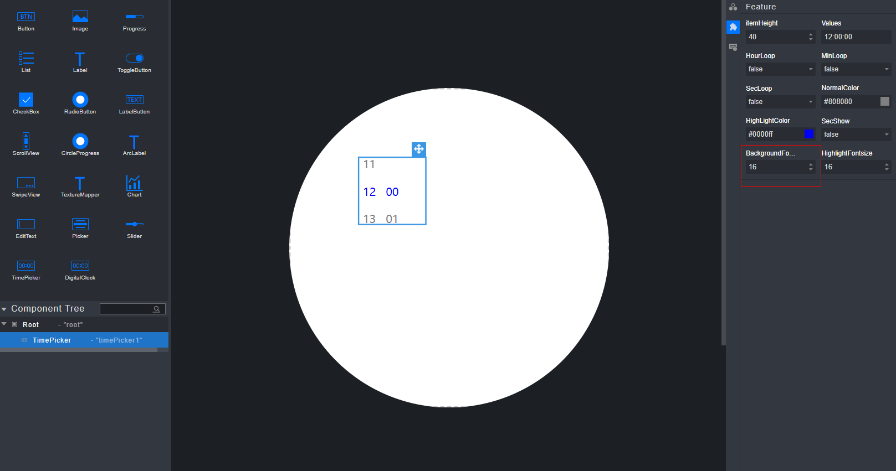

-   选中TimePicker组件，单击右侧属性样式栏中的样式图标（Feature），在展开的Feature栏中修改TimePicker组件的HighlightFontsize属性改变组件选中字体大小。

    **图 10**  设置字体大小  
    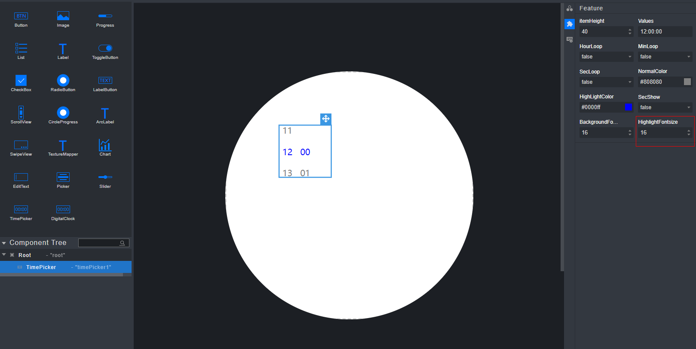

-   选中画布内的TimePicker组件，通过右侧属性样式栏中的样式图标（Events），在展开的Events栏中配置回调事件。

    TimePicker组件支持的事件有OnFocus和OnBlur。

    **图 11**  回调事件配置  
    

> **说明：** 
>General页面下的 MarginBottom属性和MarginRight属性均无渲染效果。

#### Chart组件

共有属性使用方法请参见“[组件的共有属性](组件的共有属性.md)”章节内容。

-   选中Chart组件，单击右侧属性样式栏中的样式图标（Feature），在展开的Feature栏中修改XAxis栏中的属性改变横坐标的样式。

    -   MarkNum属性：改变坐标轴上点的数量
    -   RangMin和RangMax：改变坐标轴的取值范围
    -   Color：改变坐标轴的颜色
    -   Visible：控制坐标轴的可见与否

    **图 1**  修改横坐标属性  
    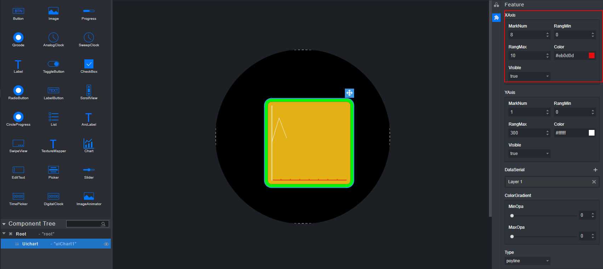

-   选中Chart组件，单击右侧属性样式栏中的样式图标（Feature），在展开的Feature栏中修改YAxis栏中的属性改变纵坐标样式，具体的与横坐标相同，请参考[图2](#fig16661839194210)。

    **图 2**  修改纵坐标样式  
    

-   选中Chart组件，单击右侧属性样式栏中的样式图标（Feature），在展开的Feature栏中点击DataSerial属性右侧的加号添加数据，可以添加多组数据。

    **图 3**  添加数据  
    

-   选中Chart组件，单击右侧属性样式栏中的样式图标（Feature），在展开的Feature栏中添加数据然后改变数据的样式，其中Data属性是要填入的数据，DataCount属性是数据的个数，FillColor是填充渐变色的颜色，LineColor是线的颜色，EnableGradient属性控制是否填充渐变色。

    **图 4**  添加数据效果展示  
    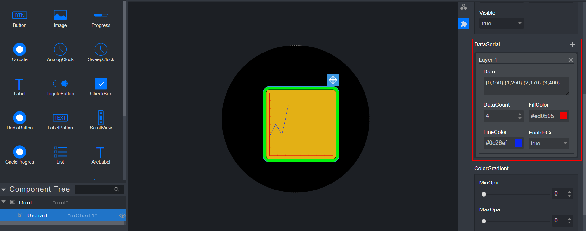

-   选中Chart组件，单击右侧属性样式栏中的样式图标（Feature），在展开的Feature栏中ColorGradient窗口中MinOpa和MaxOpa属性改变渐变色的范围，MaxOpa控制上面的渐变色透明度，MinOpa控制下面的渐变色透明度。

    **图 5**  修改透明度渐变色  
    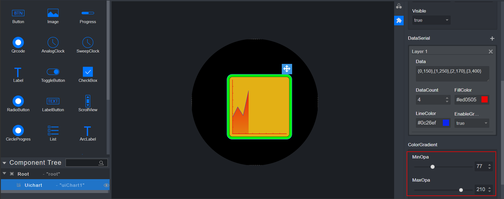

-   选中Chart组件，单击右侧属性样式栏中的样式图标（Feature），在展开的Feature栏中修改Chart组件的Type属性改变图的类型。

    **图 6**  修改图的类型  
    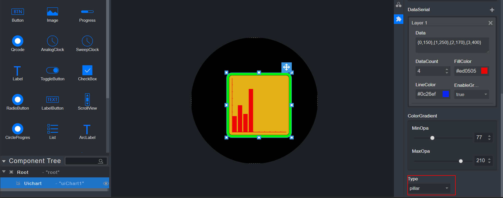

> **说明：** 
>-   General页面下的MarginBottom属性和MarginRight属性均无渲染效果。
>-   添加数据时的数据的格式为： \{x1,y1\},\{x2,y2\};
>    数据中不能有空格，横坐标应该为从0开始的依次递增的。并且DataCount属性中的数字不能比数据个数小。并且当DataCount属性中的数字比数据个数大时，会自动回连\{0,0\}，柱状图时横坐标的MarkNum也不能比数据个数小。
>-   ColorGradient属性只有在折线图时有用。
>-   目前Chart会有第一次修改DataSerial属性里的属性界面无法发生变化的问题，通过再次修改DataSerial属性中的其他属性的方式可以使界面发生变化。
>-   Chart组件不支持回调事件的配置。

#### EditText组件

共有属性使用方法请参见“[组件的共有属性](组件的共有属性.md)”章节内容。

-   选中EditText组件，单击右侧属性样式栏中的样式图标（Feature），在展开的Feature栏中修改EditText组件的Placeholder属性修改背景提示文字。

    **图 1**  修改背景提示文字  
    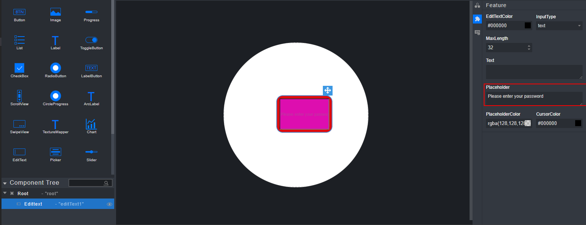

-   选中EditText组件，单击右侧属性样式栏中的样式图标（Feature），在展开的Feature栏中修改EditText组件的Text属性修改前景文字的内容，并且当前景文字存在时无法显示背景文字。

    **图 2**  修改前景文字  
    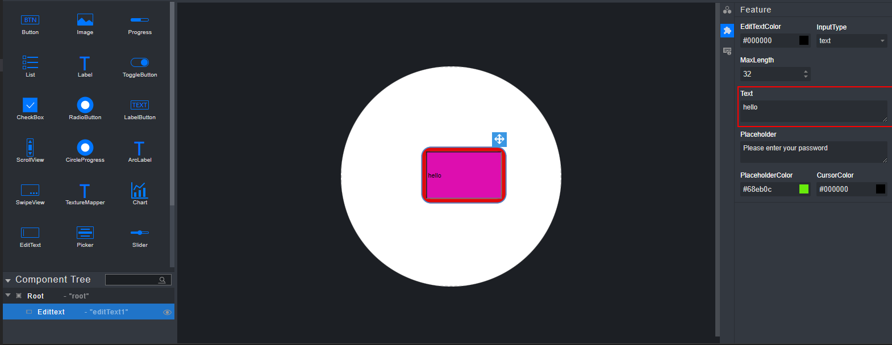

-   选中EditText组件，单击右侧属性样式栏中的样式图标（Feature），在展开的Feature栏中修改EditText组件的EditTextColor属性修改前景文字的颜色。

    **图 3**  修改前景文字颜色  
    

-   选中EditText组件，单击右侧属性样式栏中的样式图标（Feature），在展开的Feature栏中修改EditText组件的MaxLength属性来限制前景文字输入长度。

    **图 4**  限制前景文字长度  
    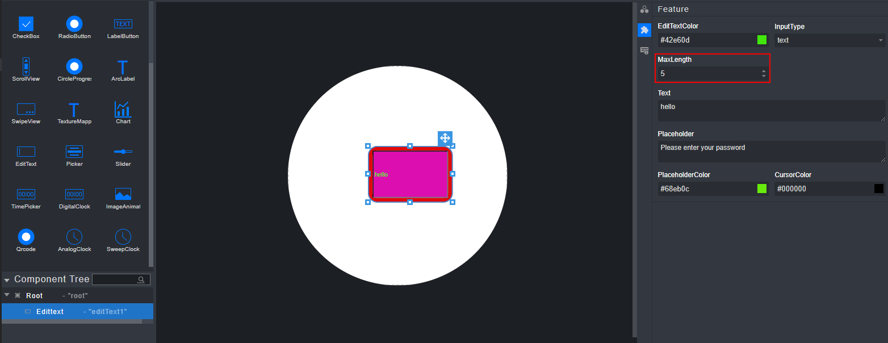

-   选中EditText组件，单击右侧属性样式栏中的样式图标（Feature），在展开的Feature栏中修改EditText组件的InputType属性来改变输入模式。

    -   text模式：输入的文本正常显示
    -   password模式：输入的文本以密码模式显示（被“·”代替）

    **图 5**  改变输入模式  
    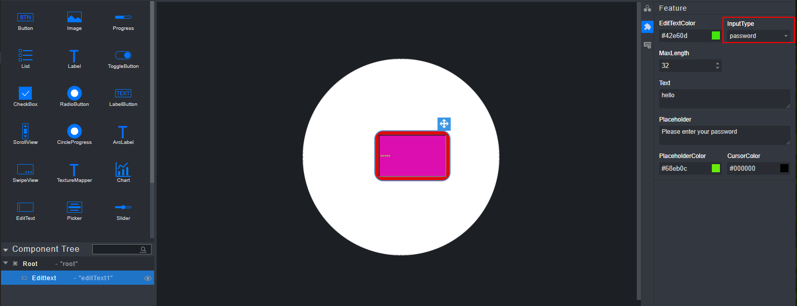

-   选中EditText组件，单击右侧属性样式栏中的样式图标（Feature），在展开的Feature栏中修改EditText组件的PlaceholderColor属性修改背景提示文字的颜色。

    **图 6**  修改背景提示文字颜色  
    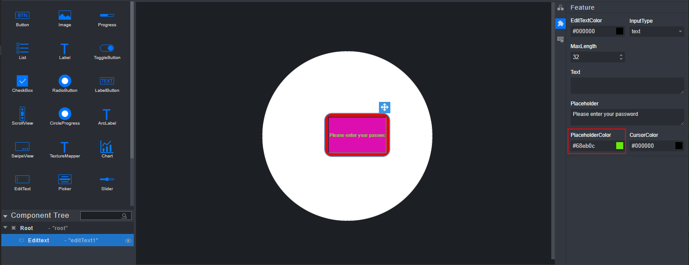

-   选中EditText组件，单击右侧属性样式栏中的样式图标（Feature），在展开的Feature栏中修改EditText组件的CursorColor属性来光标的颜色。

    **图 7**  光标颜色  
    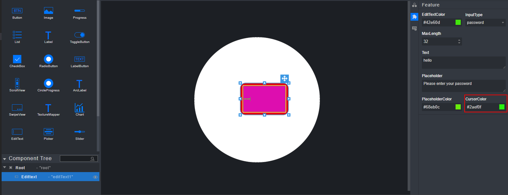

-   选中画布内的EditText组件，通过右侧属性样式栏中的样式图标（Events），在展开的Events栏中配置回调事件。

    EditText组件支持的事件有OnClick、OnLongPress、OnPress、OnCancel、OnRelease。

    **图 8**  回调事件配置  
    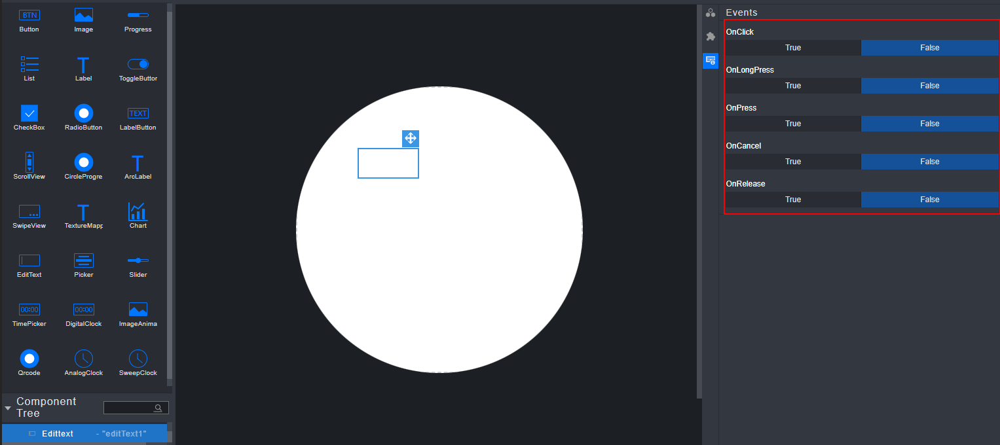

> **说明：** 
>-   General页面下的MarginBottom属性和MarginRight属性均无渲染效果。
>-   文字修改只能通过右侧的特有属性进行，在界面上通过键盘删除文字时会出现将组件删除的问题，修改前景文本请通过右侧的Text文本进行。

#### DigitalClock组件

共有属性使用方法请参见“[组件的共有属性](组件的共有属性.md)”章节内容。

-   选中DigitalClock组件，单击右侧属性样式栏中的样式图标（Feature），在展开的Feature栏中修改DigitalClock组件的Color属性改变字体颜色。

    **图 1**  修改字体颜色  
    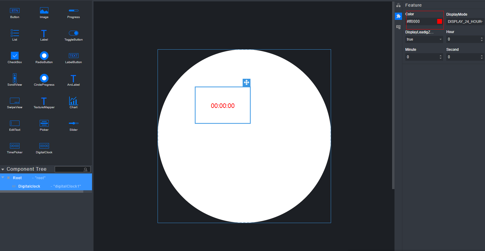

-   选中DigitalClock组件，单击右侧属性样式栏中的样式图标（Feature），在展开的Feature栏中修改DigitalClock组件的DisplayMode属性改变组件显示状态。

    **图 2**  组件显示状态  
    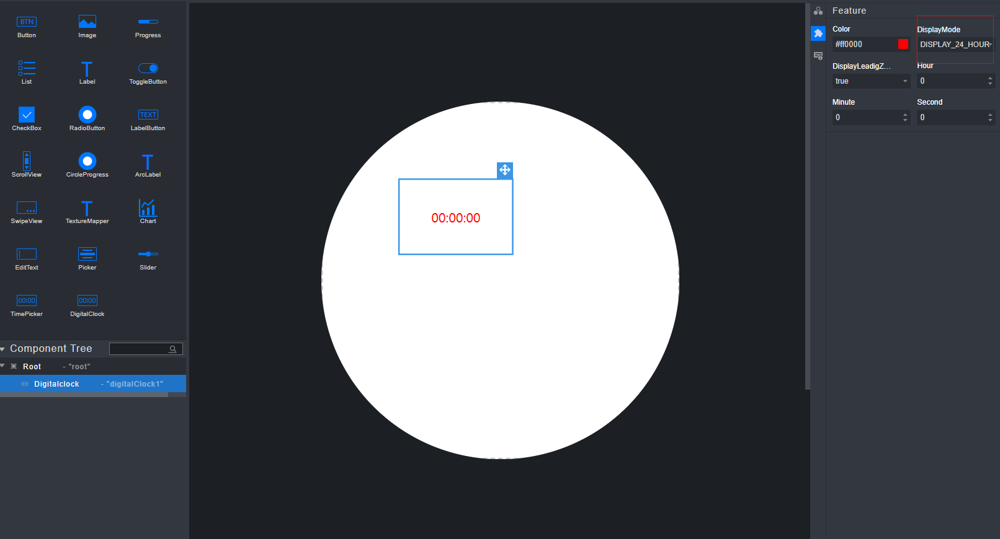

-   选中DigitalClock组件，单击右侧属性样式栏中的样式图标（Feature），在展开的Feature栏中修改DigitalClock组件的DisplayLeadigZero属性设置是否在小时前面加0。

    **图 3**  是否添加0  
    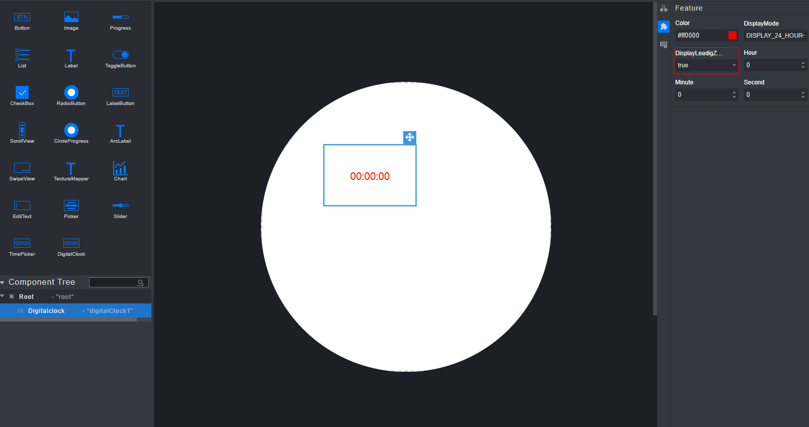

-   选中DigitalClock组件，单击右侧属性样式栏中的样式图标（Feature），在展开的Feature栏中修改DigitalClock组件的Hour属性设置小时。

    **图 4**  设置小时  
    

-   选中DigitalClock组件，单击右侧属性样式栏中的样式图标（Feature），在展开的Feature栏中修改DigitalClock组件的Minute属性设置分钟。

    **图 5**  设置分钟  
    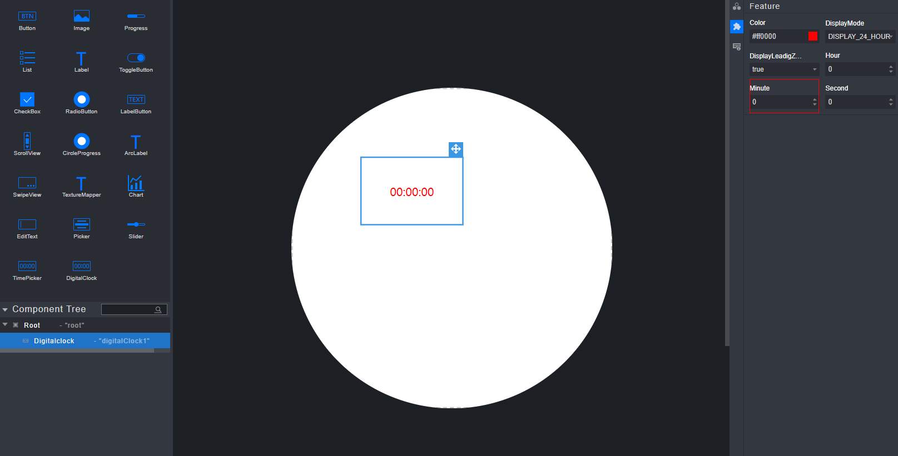

-   选中DigitalClock组件，单击右侧属性样式栏中的样式图标（Feature），在展开的Feature栏中修改DigitalClock组件的Second属性设置秒。

    **图 6**  设置秒  
    

> **说明：** 
>-   General页面下的MarginBottom属性和MarginRight属性均无渲染效果。
>-   DigitalClock不支持回调事件的配置。

#### ImageAnimator组件

共有属性使用方法请参见“[组件的共有属性](组件的共有属性.md)”章节内容。

-   选中ImageAnimator组件，单击右侧属性样式栏中的样式图标（Feature），在展开的Feature栏中添加图片路径。

    **图 1**  图片路径  
    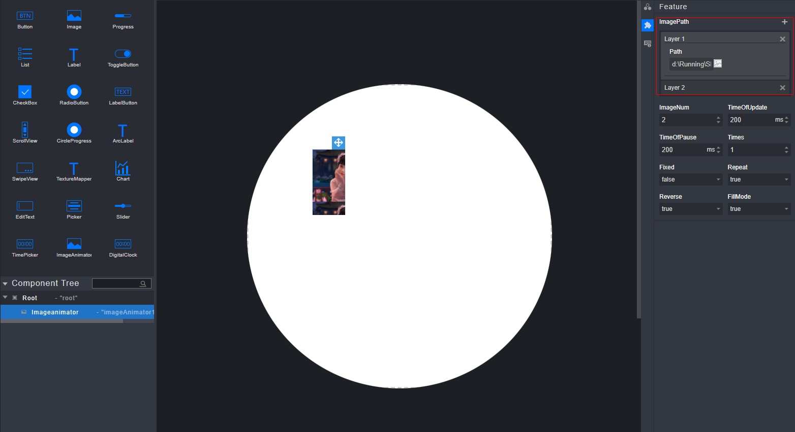

-   选中ImageAnimator组件，单击右侧属性样式栏中的样式图标（Feature），在展开的Feature栏中修改ImageAnimator组件的ImageNum属性保证显示图片的个数与输入图片路径的个数相等。

    **图 2**  图片的个数  
    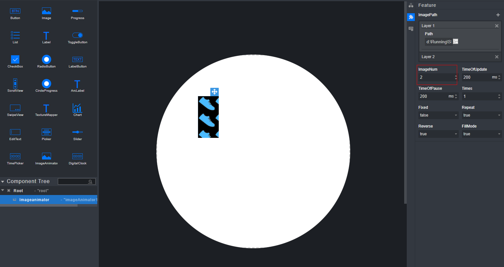

-   选中ImageAnimator组件，单击右侧属性样式栏中的样式图标（Feature），在展开的Feature栏中修改ImageAnimator组件的Times属性控制循环次数。该属性只有在Repeat为false情况下生效。

    **图 3**  循环次数  
    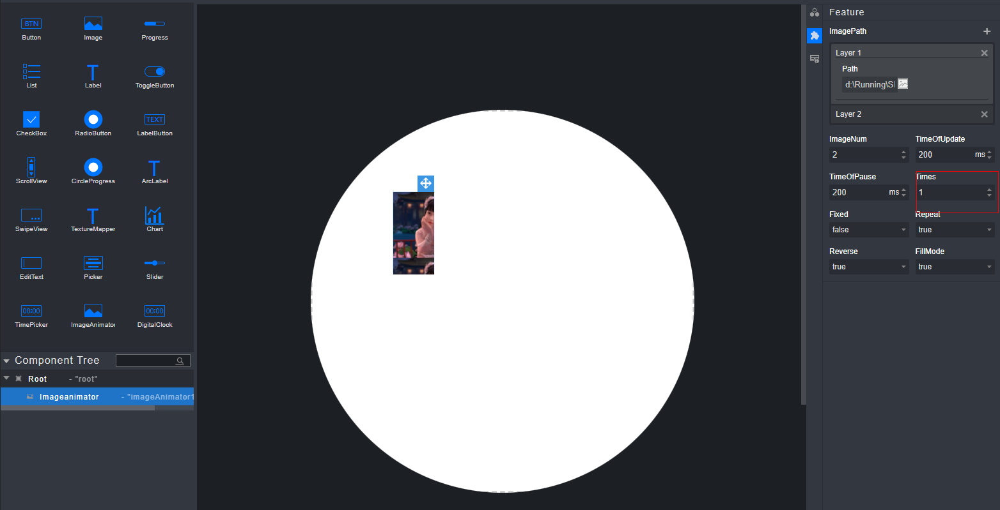

-   选中ImageAnimator组件，单击右侧属性样式栏中的样式图标（Feature），在展开的Feature栏中修改ImageAnimator组件的Fixed属性用来适应图片大小。

    **图 4**  是否适应图片大小  
    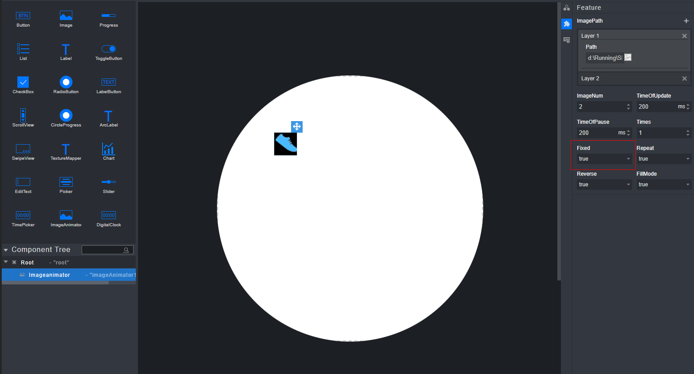

-   选中ImageAnimator组件，单击右侧属性样式栏中的样式图标（Feature），在展开的Feature栏中修改ImageAnimator组件的Repeat属性控制图片是否循环。

    **图 5**  设置图片是否循环  
    

-   选中ImageAnimator组件，单击右侧属性样式栏中的样式图标（Feature），在展开的Feature栏中修改ImageAnimator组件的Reverse属性设置图片循环方向。

    **图 6**  设置图片循环方向  
    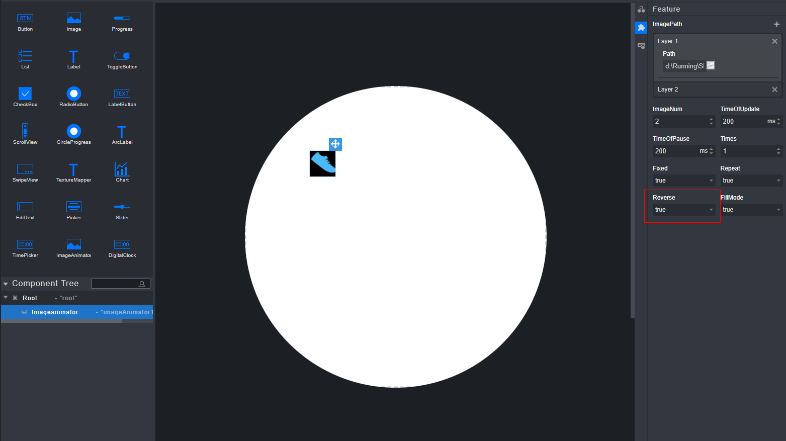

-   选中ImageAnimator组件，单击右侧属性样式栏中的样式图标（Feature），在展开的Feature栏中修改ImageAnimator组件的FillMode属性设置动画最后一帧显示的图片，true为当前循环模式下动画的第一张图片，false为最后一张。其中，Reverse属性值影响循环动画的图片先后顺序。

    **图 7**  设置最后一帧  
    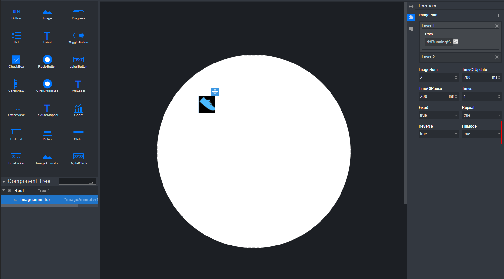

> **说明：** 
>-   General页面下的MarginBottom属性和MarginRight属性均无渲染效果。
>-   Feature页面下的TimeOfUpdate属性和TimeOfPause属性无渲染效果。
>-   ImageAnimator组件不支持回调事件的配置。

#### Qrcode组件

共有属性使用方法请参见“[组件的共有属性](组件的共有属性.md)”章节内容。

-   选中画布内的Qrcode组件，单击右侧属性样式栏中的样式图标（Feature），在展开的Feature栏中修改Qrcode组件的ImageOpacity属性来修改二维码的透明度。

    **图 1**  修改二维码透明度  
    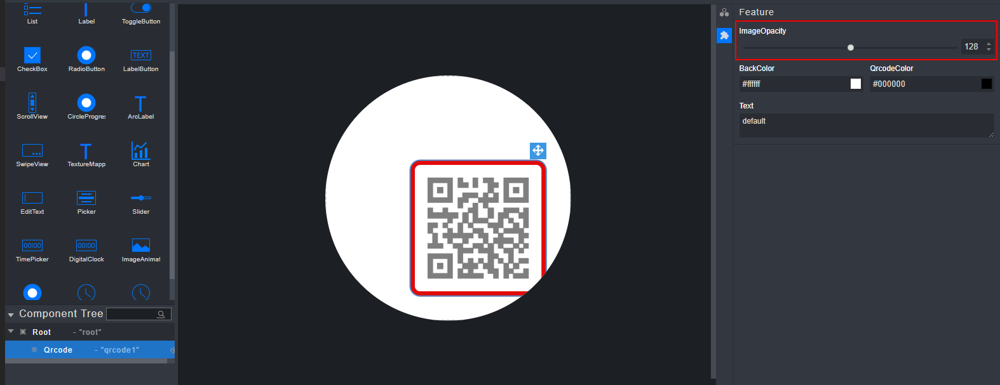

-   选中画布内的Qrcode组件，通过右侧属性样式栏中的样式图标（Feature），在展开的Feature栏中修改Qrcode组件的BackColor属性修改二维码的背景颜色。

    **图 2**  修改背景色  
    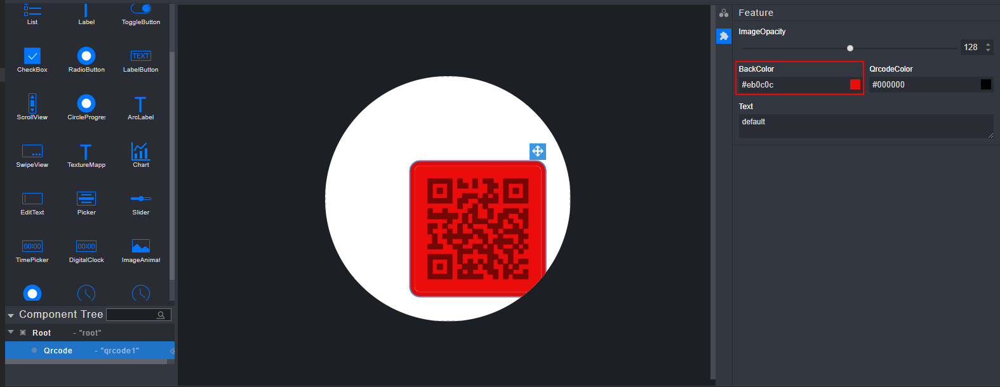

-   选中画布内的Qrcode组件，通过右侧属性样式栏中的样式图标（Feature），在展开的Feature栏中修改Qrcode组件的QrcodeColor属性修改二维码的颜色。

    **图 3**  修改二维码颜色  
    

> **说明：** 
>-   General页面下的BackgroungColor属性、MarginBottom属性和MarginRight属性均无渲染效果。
>-   Feature页面下的Text属性无界面渲染效果，具体效果可在模拟器查看。
>-   Qrcode组件不支持回调事件的配置。

#### AnalogClock组件

共有属性使用方法请参见“[组件的共有属性](组件的共有属性.md)”章节内容。

-   选中AnalogClock组件，单击右侧属性样式栏中的样式图标（Feature），在展开的Feature栏中修改Hour窗口中的PositionX属性和PositionY属性来修改时针的位置，同时对于Minute窗口和Second窗口中的PositionX属性和PositionY属性是可以分别修改分针和秒针的位置。

    **图 1**  修改指针的位置  
    

-   选中AnalogClock组件，单击右侧属性样式栏中的样式图标（Feature），在展开的Feature栏中修改Hour窗口中的CenterX属性和CenterY属性来修改时针的旋转中心（这个坐标是以PositionX和PositionY所在点为原点的坐标系下的坐标），这个坐标是相对于表针的位置而非组件的左上角，同时对于Minute窗口和Second窗口中的CenterX属性和CenterY属性是可以分别修改分针和秒针的的旋转中心。

    **图 2**  修改指针的旋转中心  
    

-   选中AnalogClock组件，单击右侧属性样式栏中的样式图标（Feature），在展开的Feature栏中修改Hour窗口中的Color属性来修改时针的颜色，同时对于Minute窗口和Second窗口中的Color属性是可以分别修改分针和秒针的颜色。

    **图 3**  修改指针的颜色  
    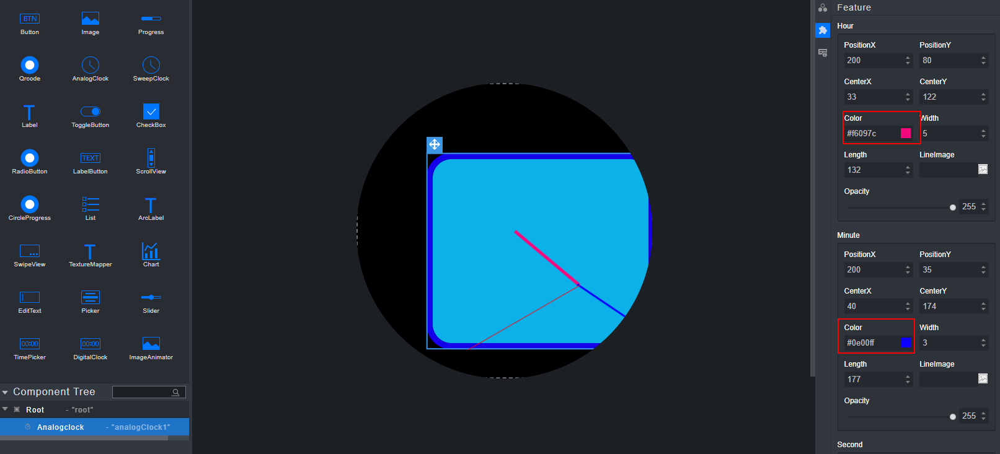

-   选中AnalogClock组件，单击右侧属性样式栏中的样式图标（Feature），在展开的Feature栏中修改Hour窗口中的Width属性来修改时针的宽度，同时对于Minute窗口和Second窗口中的Width属性是可以分别修改分针和秒针的宽度。

    **图 4**  修改指针的宽度  
    

-   选中AnalogClock组件，单击右侧属性样式栏中的样式图标（Feature），在展开的Feature栏中修改Hour窗口中的Length属性来修改时针的长度，同时对于Minute窗口和Second窗口中的Length属性是可以分别修改分针和秒针的的长度。

    **图 5**  修改指针的长度  
    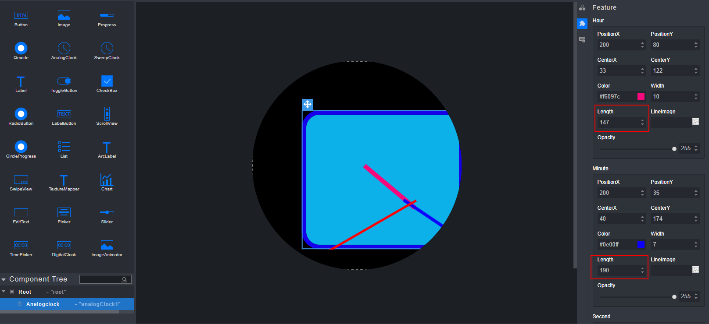

-   选中AnalogClock组件，单击右侧属性样式栏中的样式图标（Feature），在展开的Feature栏中修改Hour窗口中的Opacity属性来修改时针的颜色透明度，同时对于Minute窗口和Second窗口中的Opacity属性是可以分别修改分针和秒针的的颜色透明度。

    **图 6**  修改指针的颜色透明度  
    

-   选中AnalogClock组件，单击右侧属性样式栏中的样式图标（Feature），在展开的Feature栏中修改Hour窗口中的LineImage属性来为时针添加图片，同时对于Minute窗口和Second窗口中的LineImage属性是可以分别为分针和秒针添加图片。

    **图 7**  为指针添加图片  
    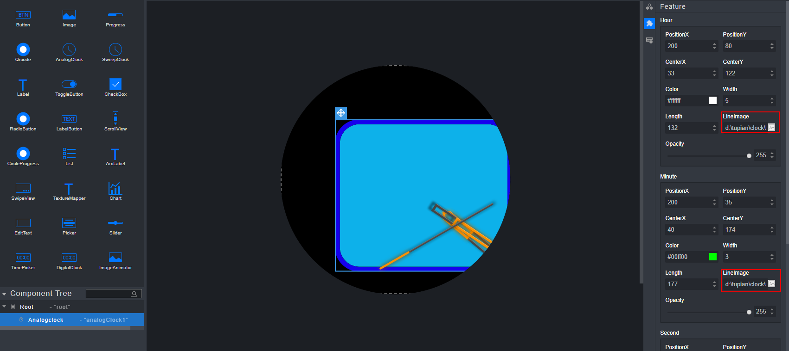

    > **说明：** 
    >LineImage属性不支持中文路径。

-   选中AnalogClock组件，单击右侧属性样式栏中的样式图标（Feature），在展开的Feature栏中修改AnalogClock组件的NewMode属性来控制秒针的显示。

    **图 8**  控制秒针的显示  
    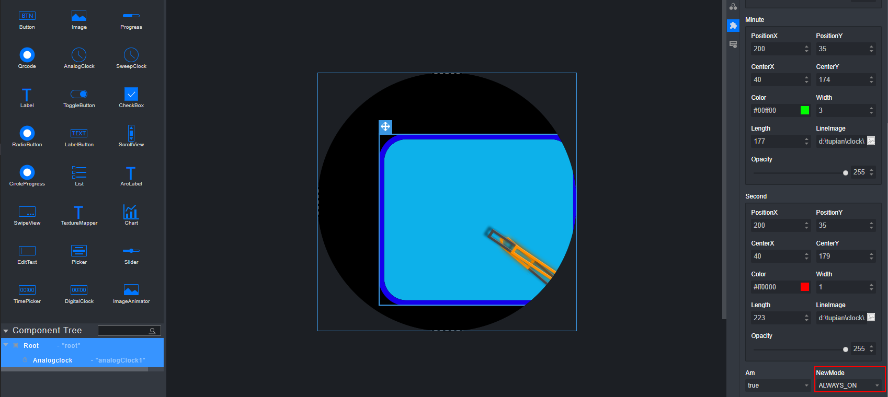

-   选中画布内的AnalogClock组件，通过右侧属性样式栏中的样式图标（Events），在展开的Events栏中配置回调事件。

    AnalogClock组件支持的事件有OnClick、OnLongPress、OnPress、OnCancel和OnRelease。

    **图 9**  回调事件配置  
    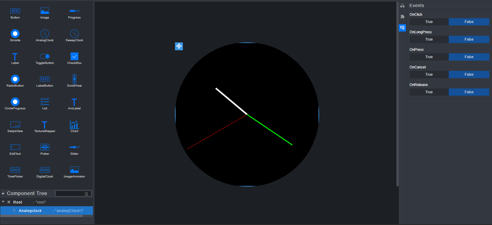

-   选中组件栏中的其他组件，可以将其拖入AnalogClock组件中，并且对其他组件进行样式调整。子组件的位置是相对于父容器的左上角，当组件已经存在于界面上时，点击组件中心位置可以将组件拖入容器中。

    **图 10**  将其他组件拖入AnalogClock组件中  
    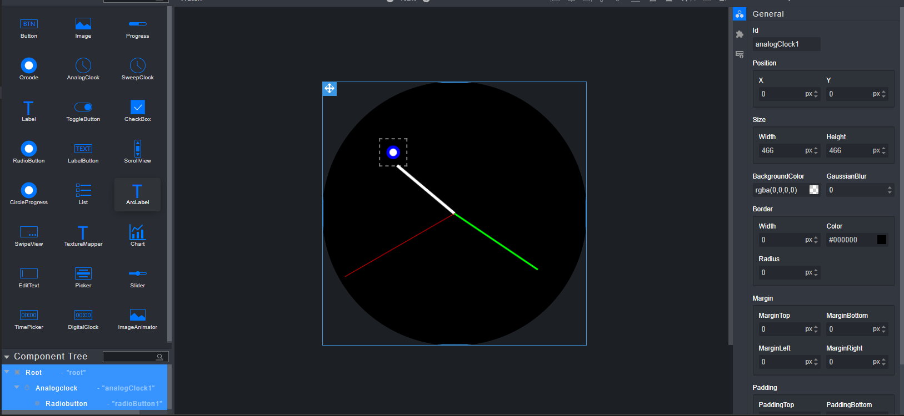

> **说明：** 
>-   General页面下的MarginBottom属性和MarginRight属性均无渲染效果。
>-   Feature页面下的Am属性无界面渲染效果。

#### SweepClock组件

本组件包含了AnalogClock组件的所有属性，与其类似；因此相同的属性就不在此介绍，请参见“[AnalogClock组件](AnalogClock组件.md)”描述。

-   选中SweepClock组件，单击右侧属性样式栏中的样式图标（Feature），在展开的Feature栏中修改Hour窗口中的CenterImage属性，为时针中心点添加图片，同时对于Minute窗口和Second窗口中的CenterImage属性是可以分别修改分针和秒针的中心点添加图片。

    **图 1**  为中心圆圈添加图片  
    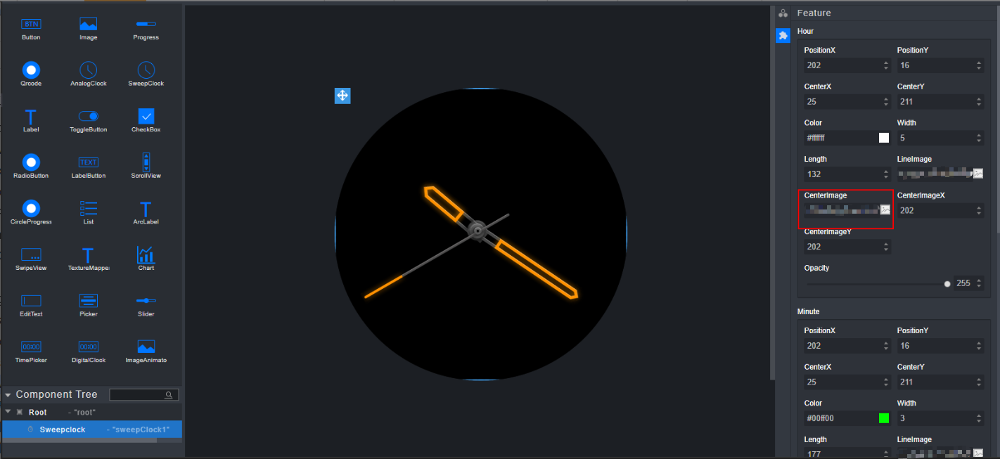

    > **说明：** 
    >CenterImage属性不支持中文路径。

-   选中SweepClock组件，单击右侧属性样式栏中的样式图标（Feature），在展开的Feature栏中修改Hour窗口中的CenterImageX属性和CenterImageY属性，修改时针中心图片的位置，同时对于Minute窗口和Second窗口中的CenterImage属性是可以分别修改分针和秒针的中心图片的位置。

    **图 2**  控制秒针的显示  
    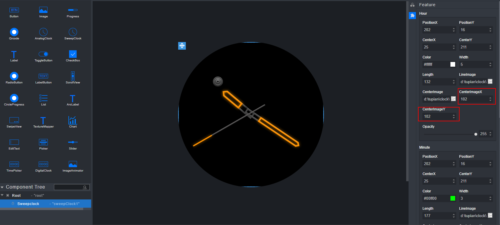

-   选中组件栏中的其他组件，可以将其拖入SweepClock组件中，并且对其他组件进行样式调整。子组件的位置是相对于父容器的左上角，当组件已经存在于界面上时，点击组件中心位置可以将组件拖入容器中。

    **图 3**  将其他组件拖入SweepClock组件中  
    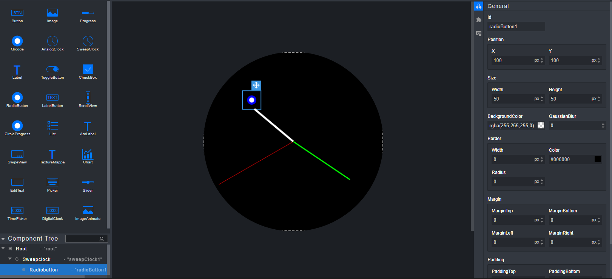

> **说明：** 
>-   General页面下的MarginBottom属性和MarginRight属性均无渲染效果。
>-   Feature页面下的Am属性无界面渲染效果。
>-   SweepClock不支持不支持回调事件的配置。

#### Coverflow组件

本组件的共有属性不包含Border属性、Margin属性与Padding属性，其他共有属性使用方法请参见“[组件的共有属性](组件的共有属性.md)”章节内容。

-   选中Coverflow组件，单击右侧属性样式栏中的样式图标（Feature），在展开的Feature栏导入一张或者多张图片（可以调整画布大小，使图片显示效果更好），第一张图片默认位于画布正中间。

    **图 1**  特有属性配置：ImagePath  
    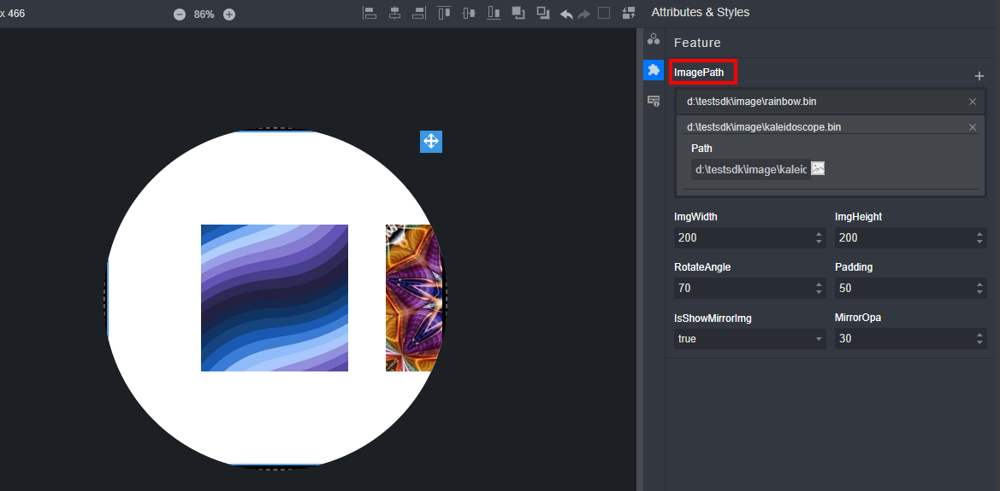

    > **说明：** 
    >ImagePath不支持中文路径。
    >导入的Bin文件必须是图片转的Bin，否则模拟器会异常。

-   选中画布内的Coverflow组件，通过右侧属性样式中的样式图标（Feature），在展开的Feature栏中修改Coverflow组件中的ImgWidth和ImgHeight可以调整图片宽高。

    更改图片宽高后，所有导入Coverflow组件的图片宽高随之改变，且第一张图片始终位于组件的正中间。

    **图 2**  特有属性配置：ImgWidth和ImgHeight  
    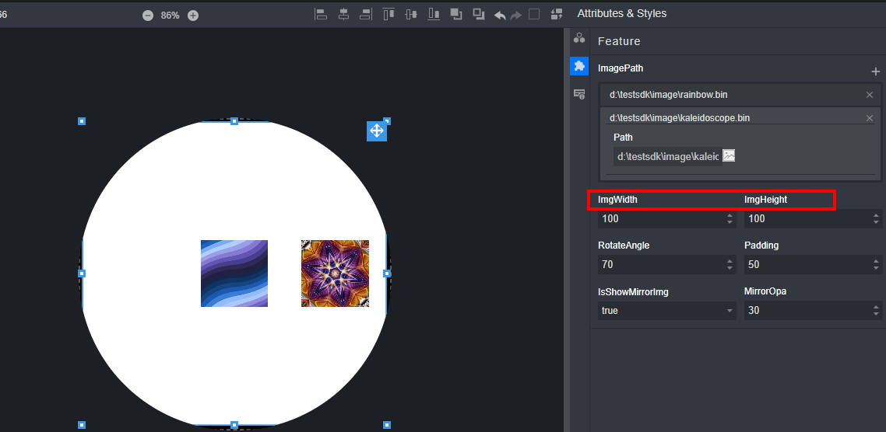

-   选中画布内的Coverflow组件，通过右侧属性样式中的样式图标（Feature），在展开的Feature栏中修改Coverflow组件中的RotateAngle调整旋转角度。

    **图 3**  特有属性配置：RotateAngle  
    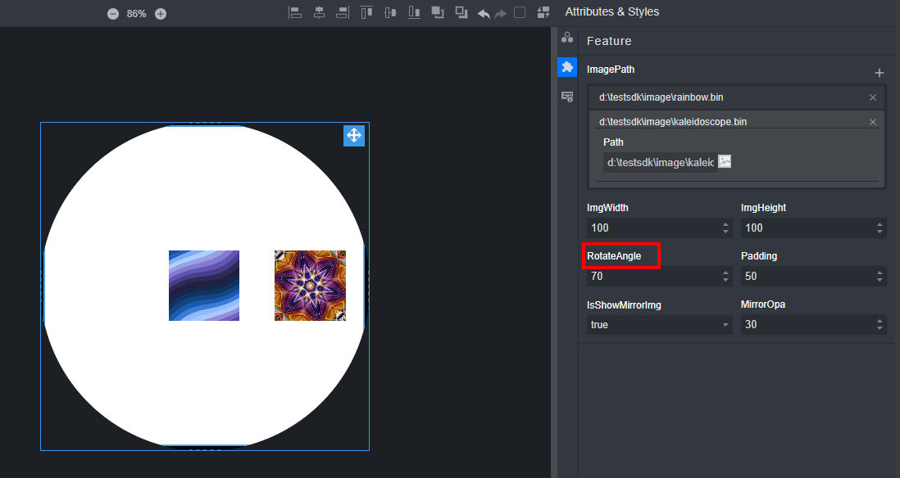

-   选中画布内的Coverflow组件，通过右侧属性样式中的样式图标（Feature），在展开的Feature栏中修改Coverflow组件中的Padding调整图片之间的间距。

    **图 4**  特有属性配置：Padding  
    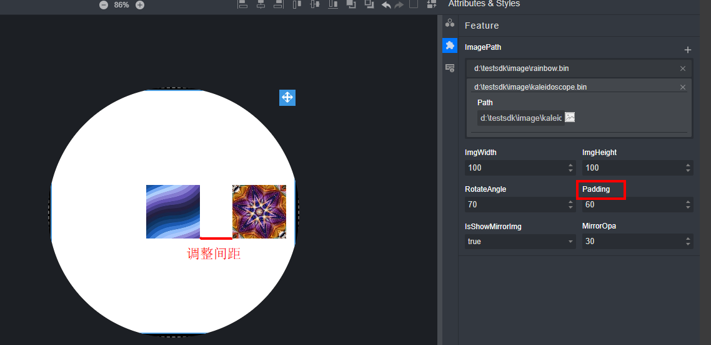

-   选中画布内的Coverflow组件，通过右侧属性样式中的样式图标（Feature），在展开的Feature栏中修改Coverflow组件中的IsShowMirrorImg设置是否显示图片镜像。

    **图 5**  特有属性配置：IsShowMirrorImg  
    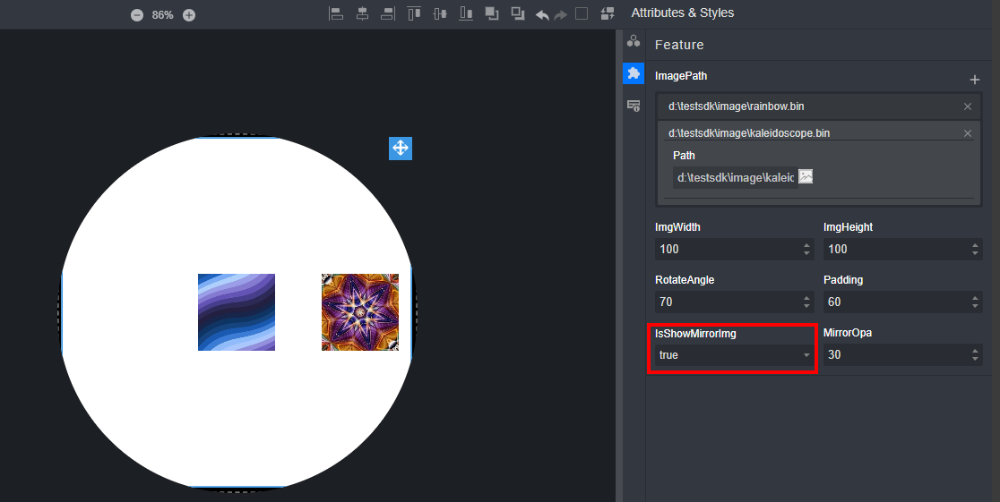

-   选中画布内的Coverflow组件，通过右侧属性样式中的样式图标（Feature），在展开的Feature栏中修改Coverflow组件中的MirrorOpa设置图片镜像的透明度。

    **图 6**  特有属性配置：MirrorOpa  
    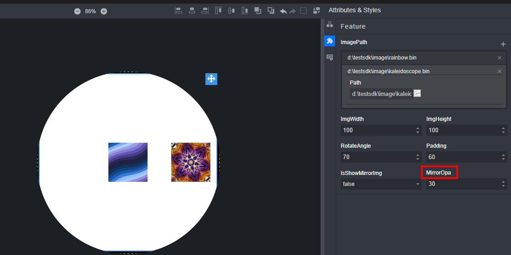

-   选中画布内的Coverflow组件，通过右侧属性样式栏中的样式图标（Events），在展开的Events栏中配置回调事件。

    Coverflow组件支持的事件有：OnDrag、OnDragStart、OnDragEnd、和OnCoverflow。

    **图 7**  回调事件配置  
    

> **说明：** 
>-   Feature页面下的RotateAngle、IsShowMirrorImg和MirrorOpa暂无渲染效果，具体效果可以在模拟器查看。
>-   Coverflow的回调事件在生成的XXXPresenter.cpp文件中的回调函数名称为“OnScroll（）”。

#### Barcode组件

共有属性使用方法请参见“[11.1.2.2 组件的共有属性](组件的共有属性.md)”章节内容。

选中画布内的Barcode组件，单击右侧属性样式栏中的样式图标（Feature），在展开的Feature栏中有一个BarcodeInfo属性，提供Barcode的信息，且不能设置为空，如果设置为空，生成代码后，在模拟器中会显示条形码失败。

**图 1**  特有属性配置：BarcodeInfo  
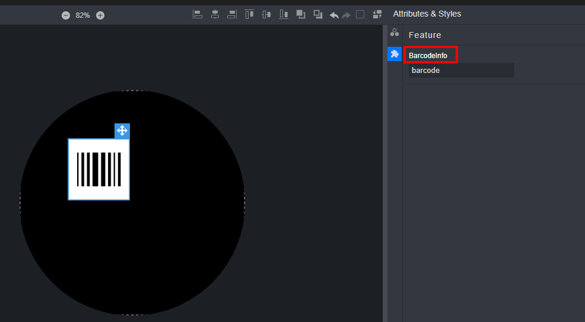

> **说明：** 
>-   Feature页面下的BarcodeInfo属性无页面渲染效果。
>-   Barcode组件不支持回调事件的配置。
>-   BarcodeInfo不能设置为空，且不支持中文，如果设置为空或者为中文，模拟器中显示条形码失败。
>-   BarcodeInfo设置完成后请点击其他位置后，再生成代码。

#### CardPage组件

本组件的General属性请参见“[11.1.2.2 组件的共有属性](组件的共有属性.md)”描述。

-   选中画布内的CardPage组件，单击右侧属性样式栏中的  样式图标（Feature），在展开的Feature栏中有一个IsCoverable属性，默认为false，它的作用是在如果拖动其它CardPage组件展示时是否会覆盖上一个。

    **图 1**  特有属性配置：IsCoverable  
    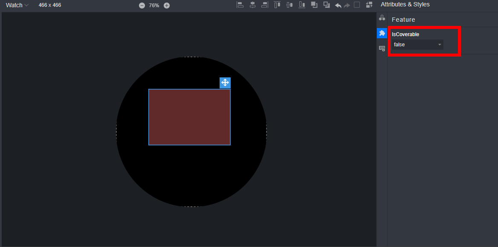

-   选中画布内的CardPage组件，通过右侧属性样式栏中的样式图标（Events），在展开的Events栏中配置回调事件。

    CardPage组件支持的事件类型有：OnClick、OnLongPress、OnDrag、OnDragStart、OnDragEnd、OnPress、OnCancel、OnRelease、OnFocus、OnBlur、OnRotate、OnRotateStart、OnRotateEnd。

    **图 2**  回调事件配置  
    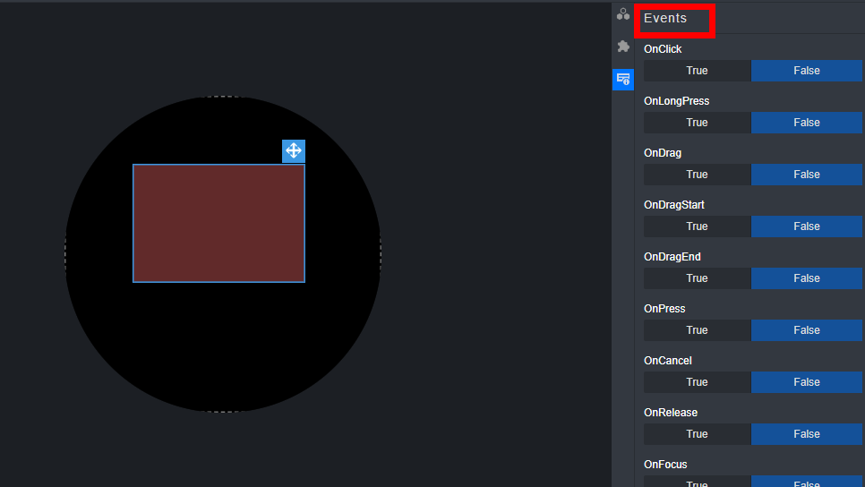

> **说明：** 
>-   Feature页面下的属性无界面渲染效果。
>-   CardPage是个容器组件，主要作为CrossView的子组件使用。

#### CrossView组件

本组件的General属性请参见“[11.1.2.2 组件的共有属性](组件的共有属性.md)”描述。

-   选中CrossView组件，单击右侧属性样式栏中的样式图标（Feature），在展开的Feature栏中可以看到EnableScreenCap属性，会弹出一个设定bool变量值的下拉框，它决定设置切换卡片时，是否使能截图模式。

    **图 1**  特有属性配置：EnableScreenCap  
    
    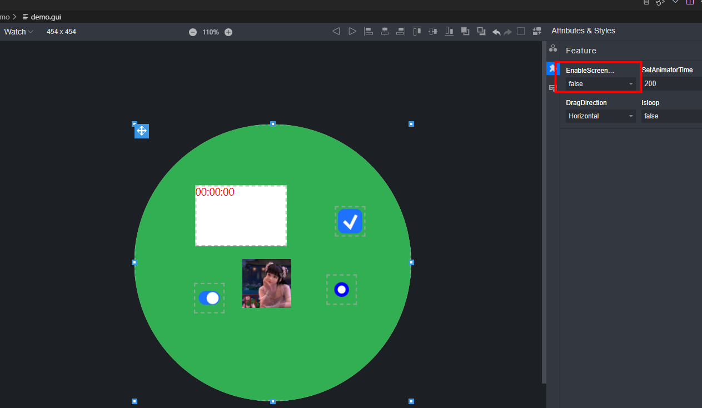

-   选中CrossView组件，单击右侧属性样式栏中的样式图标（Feature），在展开的Feature栏中可以看到SetAnimatorTime属性，它决定模拟器中松手动画时间，其单位为毫秒（ms）。

    **图 2**  特有属性配置：SetAnimatorTime  
    
    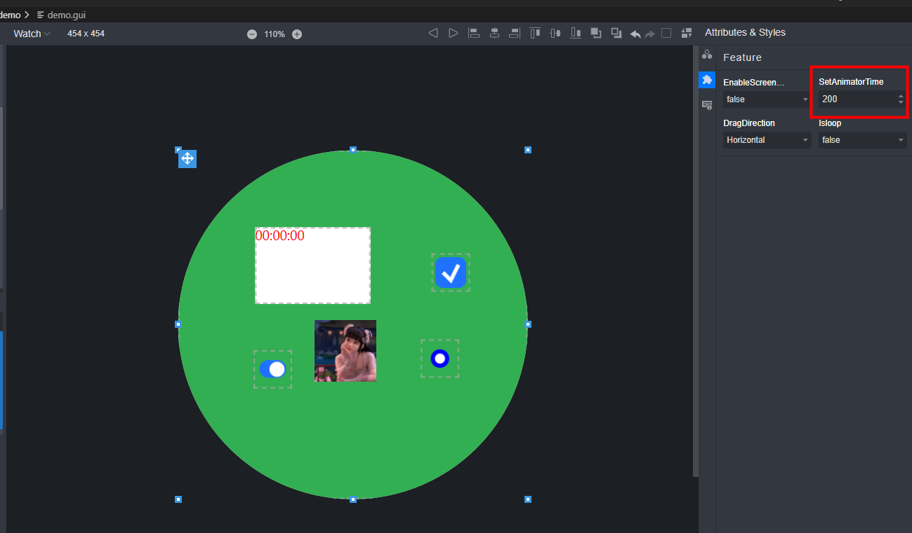

-   选中CrossView组件，单击右侧属性样式栏中的样式图标（Feature），在展开的Feature栏中可以看到DragDirection属性，它决定子组件拖拽来的方向。

    **图 3**  特有属性配置：DragDirection  
    
    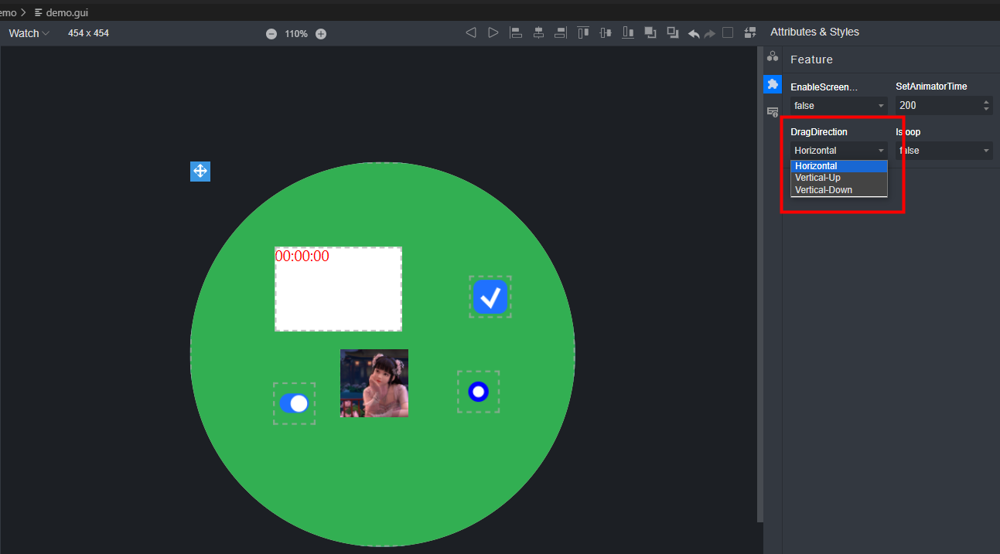

    当拖拽来的组件不是CardPage类型时，右下角会有“Only supports cardpage component”或“仅支持拖拽CardPage组件”提示，并且拖入的子组件不会在画布上展示。

    **图 4**  特有属性配置：DragDirection（仅支持拖拽CardPage类型的子组件）  
    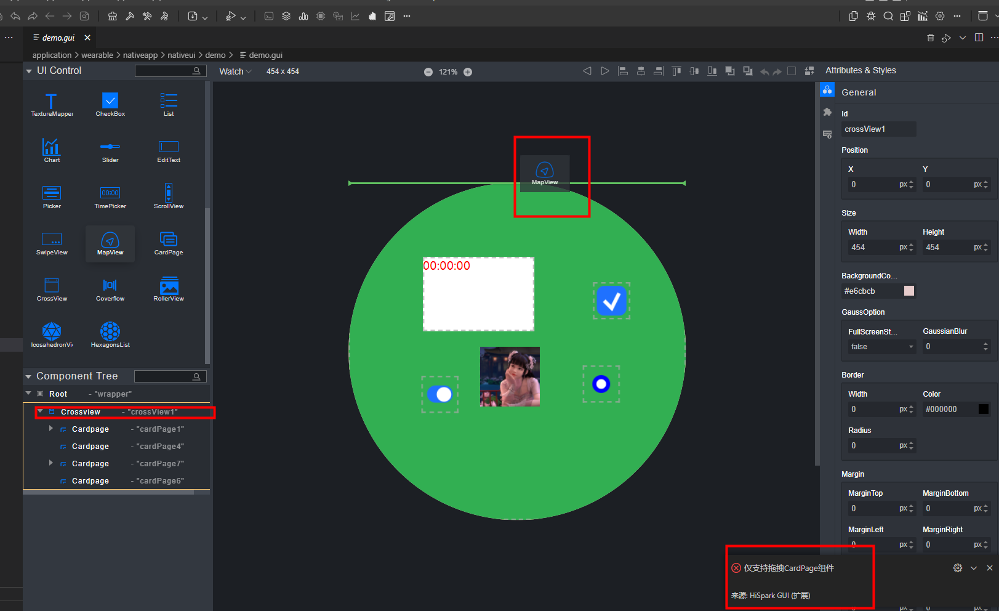

    CrossView组件前端渲染界面仅会展示其某一个CardPage子组件：

    -   当新增CardPage组件时，默认会展示最新拖拽进来的CardPage组件，隐藏掉之前的；
    -   当删除CardPage组件时，默认会展示上个被拖入的CardPage组件，并隐藏掉其它的。

    如果想实现切换，可以点击“[GUI拖拽界面介绍](GUI拖拽界面介绍.md)”中所介绍的Panel面板的按钮，该按钮使用说明如下：

    1.  左右切换会分别显示拖拽来的上一个和下一个CardPage子组件。
    2.  是否支持组件间的循环切换和模拟器的设定规则保持一致，可以在Feature栏的Isloop中选择True&False。当置为False时，第一个组件点击左按钮和最后一个组件点击右按钮时不会有切换效果；当置为True时，第一个组件点击左按钮和最后一个组件点击右按钮时会实现彼此切换。
    3.  切换按钮仅在选中父组件为CrossView的CardPage子组件时生效，选中的操作可以通过点击左侧的组件树中的CardPage或者在渲染界面的CardPage后，点击左右按钮，从而展示被选中组件的前一个和后一个，如[图5](#fig10608162418201)所示。
    4.  切换按钮如果选的不是父组件为CrossView的CardPage子组件时，会弹窗提示，如[图6](#fig560918241207)所示。

    **图 5**  特有属性配置：DragDirection（CardPage切换展示逻辑）  
    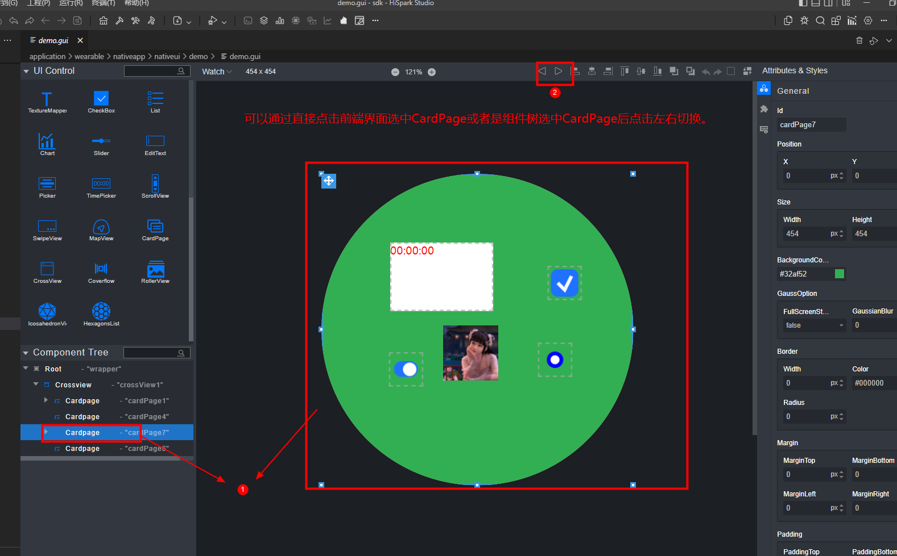

    **图 6**  特有属性配置：DragDirection（非CrossView子组件切换的弹窗提醒）  
    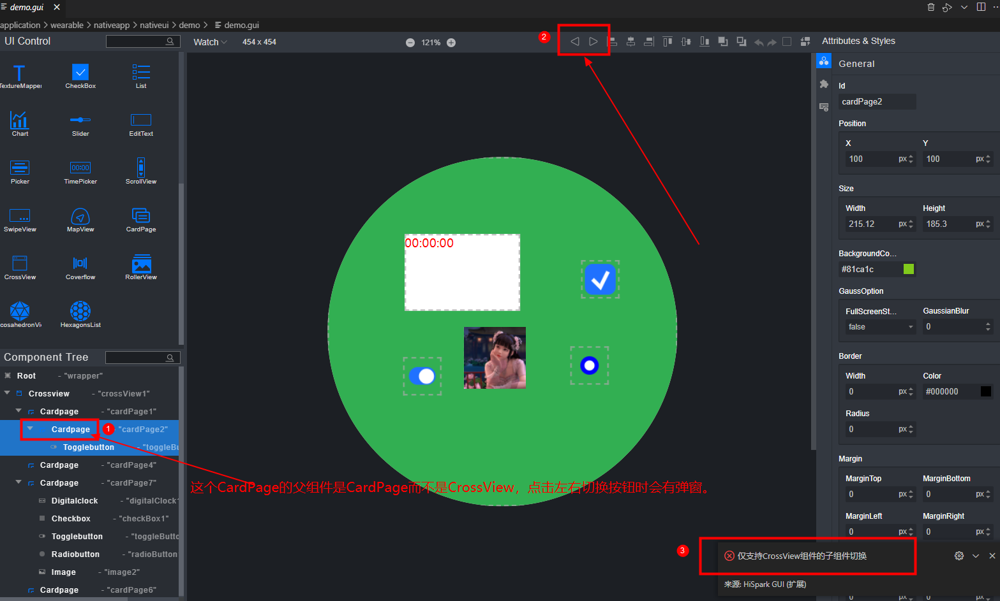

    当选择DragDirection为Horizontal方向时，拖拽CardPage组件，CardPage个数不做限制，每次拖拽入新的都会隐藏掉其它的CardPage子组件。

    **图 7**  特有属性配置：DragDirection（水平方向拖拽来的CardPage类型子组件）  
    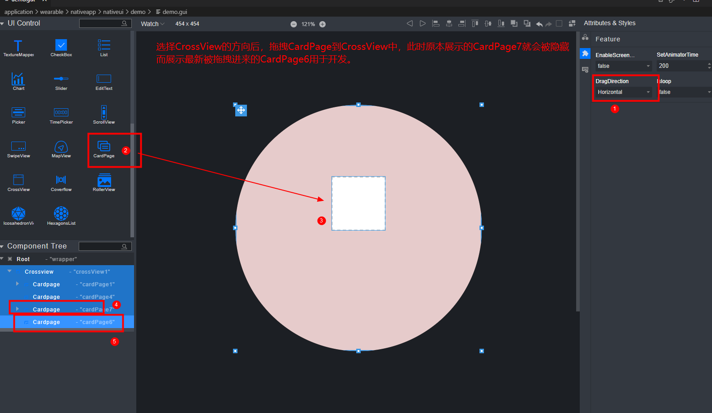

    当选择DragDirection为Vertical-Up方向时，拖拽CardPage组件，拖拽新的组件时也会隐藏掉其它的CardPage子组件，但是仅支持拖拽的个数为一个，当再次拖拽该方向的CardPage子组件时右下角会有“UpPage direction only supports one component”或“竖直上方向的CardPage组件仅支持拖拽一个”提示。

    **图 8**  特有属性配置：DragDirectio（竖直上方向仅支持拖拽一个子组件）  
    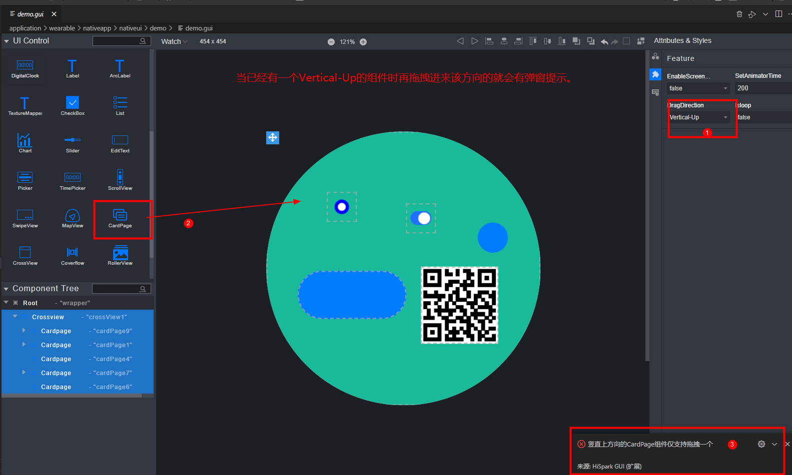

    当选择DragDirection为Vertical-Down方向时，拖拽CardPage组件，拖拽新的组件时也会隐藏掉其它的CardPage子组件，且仅支持拖拽的个数为一个，当再次拖拽该方向的CardPage子组件时右下角会有“DownPage direction only supports one component”或“竖直下方向的CardPage组件仅支持拖拽一个”提示。

    **图 9**  特有属性配置：DragDirection（竖直下方向仅支持拖拽一个子组件）  
    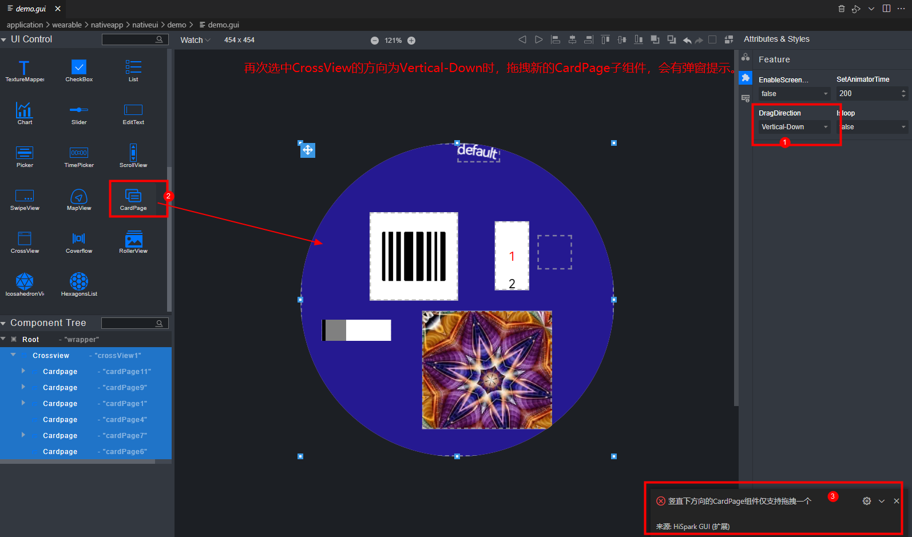

-   选中CrossView组件，单击右侧属性样式栏中的样式图标（Feature），在展开的Feature栏中点击Isloop属性，会弹出一个设定bool变量值的下拉框，它决定水平卡片循环模式。

    **图 10**  特有属性配置：Isloop  
    
    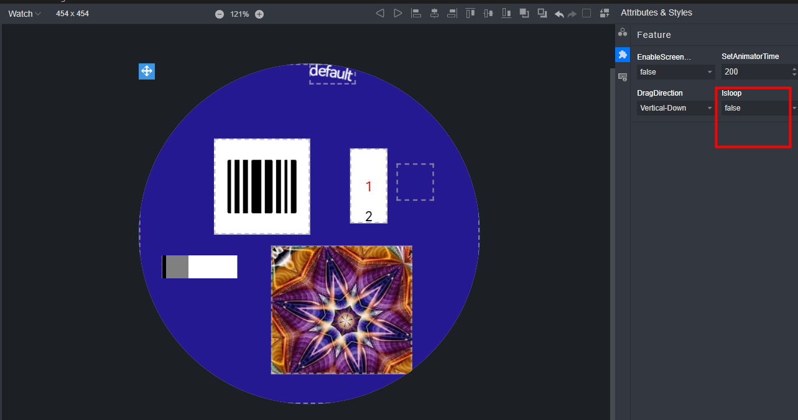

-   选中CrossView组件，通过右侧属性样式栏中的样式图标（Events），在展开的Events栏中配置回调事件。

    CrossView组件支持的事件有：OnClick、OnLongPress、OnDrag、OnDragStart、OnDragEnd、OnPress、OnCancel、OnRelease、OnFocus、OnBlur、OnRotate、OnRotateStart、OnRotateEnd，OnSwipe。其中OnSwipe默认为True。

    **图 11**  回调事件配置  
    
    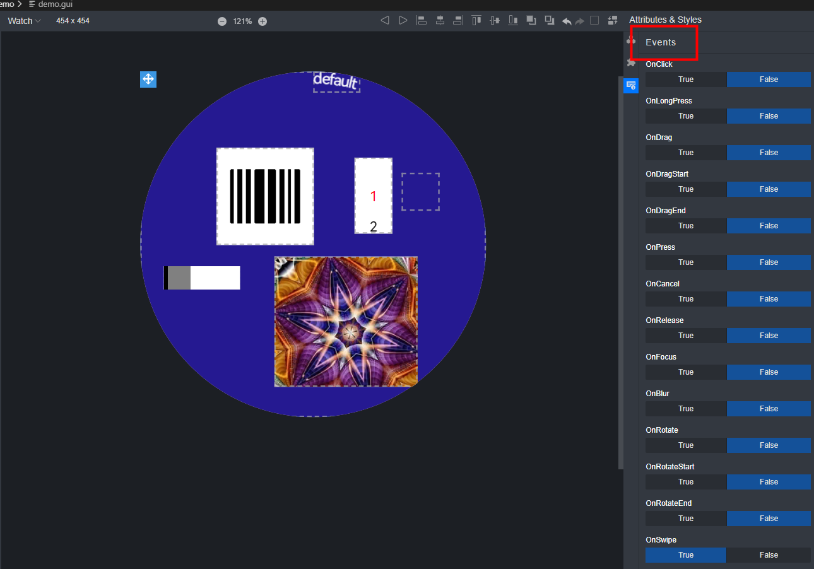

> **说明：** 
>-   Feature界面除DragDirection的特性和Isloop与GUI界面前端渲染关联外，其它属性无界面渲染效果，可在模拟器中查看。
>-   CrossView组件仅支持CardPage类型的子组件拖拽。
>-   CrossView组件的所有弹窗均支持中英文适配。

#### MapView组件

本组件的General属性请参见“[11.1.2.2 组件的共有属性](组件的共有属性.md)”描述。

-   选中MapView组件，单击右侧属性样式栏中的样式图标（Feature），在展开的Feature栏中点击SvgPath右侧的图标，会弹出一个选择Svg文件的界面，解压地图对应的Svg文件到任意目录，点击选择后，再次打开该目录，刷新，可以看到会生成一个与Svg文件同名的bin文件，该文件用于被模拟器读取并展示。同时该地图文件会完成绘制在画布中。

    **图 1**  特有属性配置：SvgPath-选择Svg文件  
    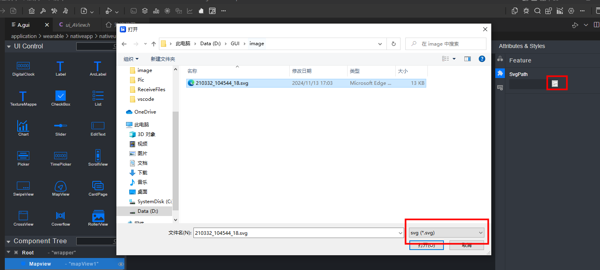

    **图 2**  特有属性配置：SvgPath-绘制Svg图片  
    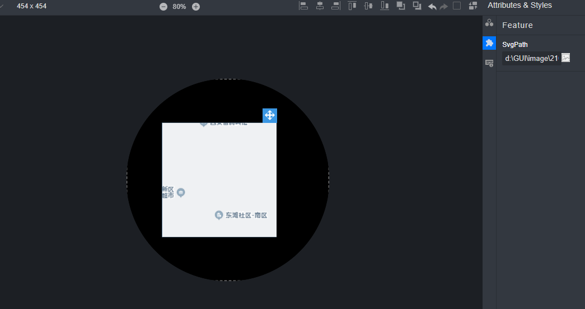

-   选中MapView组件，通过右侧属性样式栏中的样式图标（Events），在展开的Events栏中配置回调事件。

    MapView组件支持的事件有：OnClick、OnLongPress、OnDrag、OnDragStart、OnDragEnd、OnPress、OnCancel、OnRelease、OnFocus、OnBlur、OnRotate、OnRotateStart、OnRotateEnd和OnPOIClick。

    **图 3**  回调事件配置  
    

> **说明：** 
>-   MapView是地图组件，应将地图文件展示到画布中和模拟器中。
>-   MapView的General属性仅包含ID、Position两个选项可供用户设置，工具和模拟器会默认展示该Svg图片的原始大小，用户可以根据模拟器实际效果调整Position参数。

#### RollerView组件

本组件的共有属性不包含Border属性、Margin属性与Padding属性，其他共有属性使用方法请参见“[组件的共有属性](组件的共有属性.md)”章节内容。

-   选中RollerView组件，单击右侧属性样式栏中的样式图标（Feature），在展开的Feature栏导入一张或者多张图片（可以调整画布大小，使图片显示效果更好），第一张图片默认位于画布正中间。

    **图 1**  特有属性配置：ImagePath  
    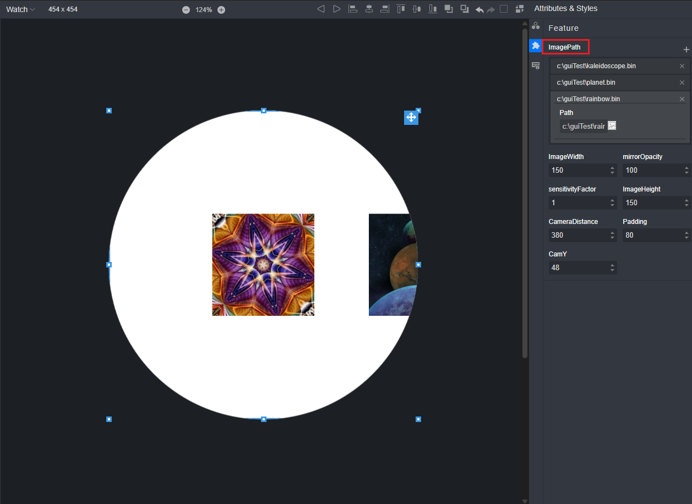

    > **说明：** 
    >ImagePath不支持中文路径。
    >导入的Bin文件必须是图片转的Bin，否则模拟器会异常。

-   选中画布内的RollerView组件，通过右侧属性样式中的样式图标（Feature），在展开的Feature栏中修改RollerView组件中的ImageWidth和ImageHeight可以调整图片宽高。

    更改图片宽高后，所有导入RollerView组件的图片宽高随之改变，且第一张图片始终位于组件的正中间。

    **图 2**  特有属性配置：ImageWidth和ImageHeight  
    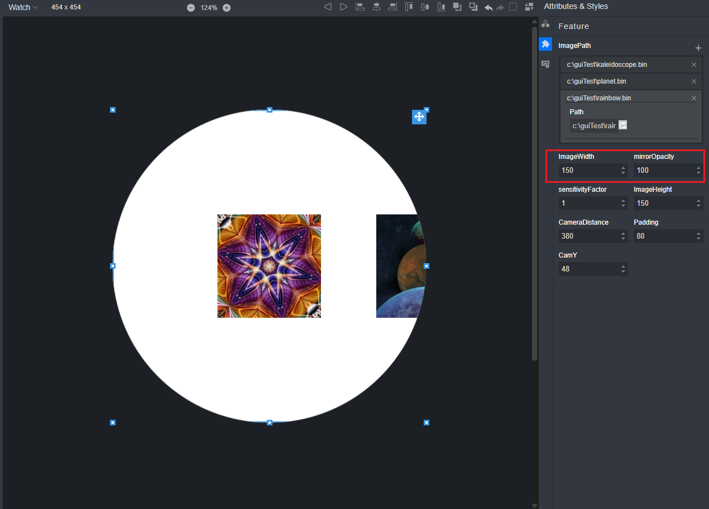

-   选中画布内的RollerView组件，通过右侧属性样式中的样式图标（Feature），在展开的Feature栏中修改RollerView组件中的MirrorOpacity调整滚筒元素镜像图的透明度。

    **图 3**  特有属性配置：MirrorOpacity  
    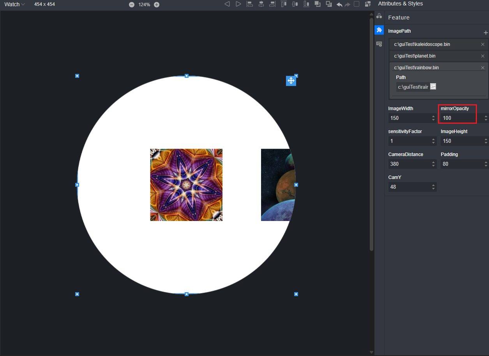

-   选中画布内的RollerView组件，通过右侧属性样式中的样式图标（Feature），在展开的Feature栏中修改RollerView组件中的SensitivityFactor调整滚筒灵敏度。

    **图 4**  特有属性配置：SensitivityFactor  
    

-   选中画布内的RollerView组件，通过右侧属性样式中的样式图标（Feature），在展开的Feature栏中修改RollerView组件中的Padding调整图片之间的间距。

    **图 5**  特有属性配置：Padding  
    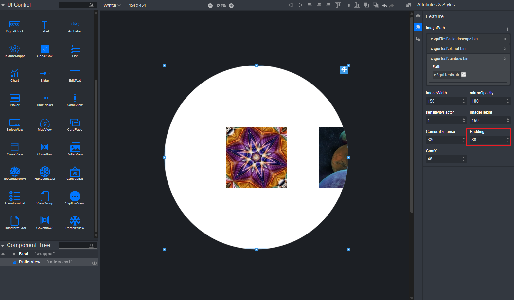

-   选中画布内的RollerView组件，通过右侧属性样式中的样式图标（Feature），在展开的Feature栏中修改RollerView组件中的CameraDistance设置模拟器中相机的距离。

    **图 6**  特有属性配置：CameraDistance  
    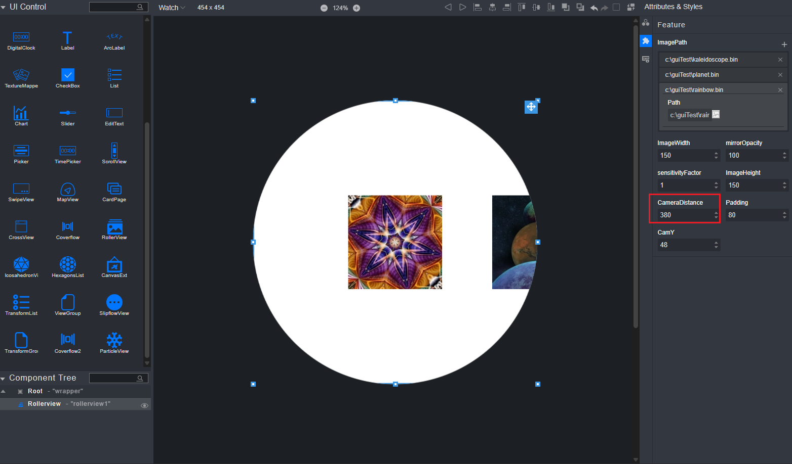

-   选中画布内的RollerView组件，通过右侧属性样式中的样式图标（Feature），在展开的Feature栏中修改RollerView组件中的CamY设置模拟器中相机的Y坐标。

    **图 7**  特有属性配置：CamY  
    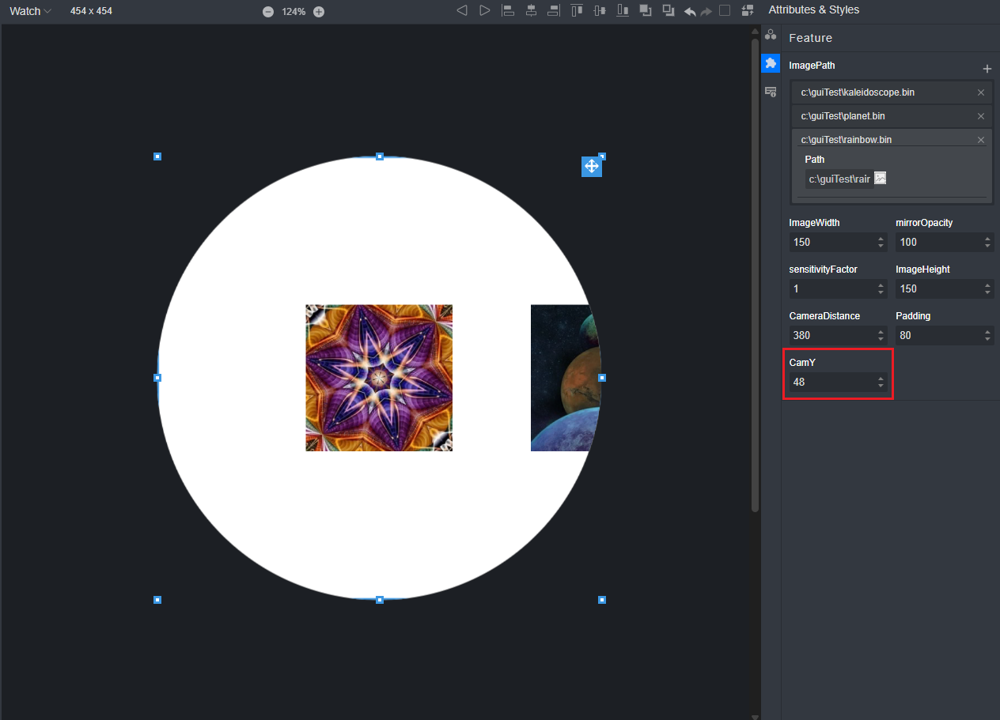

-   选中画布内的RollerView组件，通过右侧属性样式栏中的样式图标（Events），在展开的Events栏中配置回调事件。

    RollerView组件支持的事件有：OnClick、OnLongPress、OnDrag、OnDragStart、OnDragEnd、OnPress、OnCancel、OnRelease、OnFocus、OnBlur、OnScroll、OnModeChange。

    **图 8**  回调事件配置  
    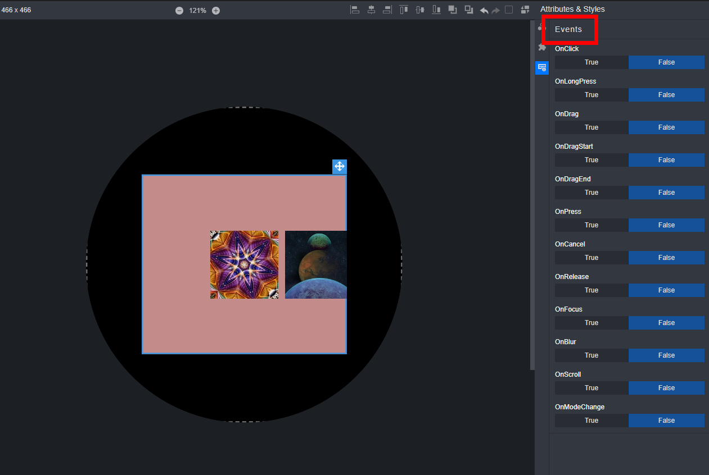

> **说明：** 
>Feature页面下的CameraDistance和CamY暂无渲染效果，具体效果可以在模拟器查看。
>RollerView组件在模拟器中可以实现水平方向上将图片按照滚筒的形式排布并支持滚动交互。

#### HexagonsList组件

本组件的共有属性不包含Border属性、Margin属性与Padding属性，其他共有属性使用方法请参见“[组件的共有属性](组件的共有属性.md)”章节内容。

-   选中HexagonsList组件，单击右侧属性样式栏中的样式图标（Feature），在展开的Feature栏导入一张或者多张图片（可以调整画布大小，使图片显示效果更好），第一张图片默认位于画布正中间。

    **图 1**  特有属性配置：ImagePath  
    

    > **说明：** 
    >ImagePath不支持中文路径。
    >导入的Bin文件必须是图片转的Bin，否则模拟器会异常。

-   选中画布内的HexagonsList组件，通过右侧属性样式中的样式图标（Feature），在展开的Feature栏中修改HexagonsList组件中的ImageWidth和ImageHeight可以调整图片宽高。

    更改图片宽高后，所有导入HexagonsList组件的图片宽高随之改变，且第一张图片始终位于组件的正中间。

    **图 2**  特有属性配置：ImageWidth和ImageHeight  
    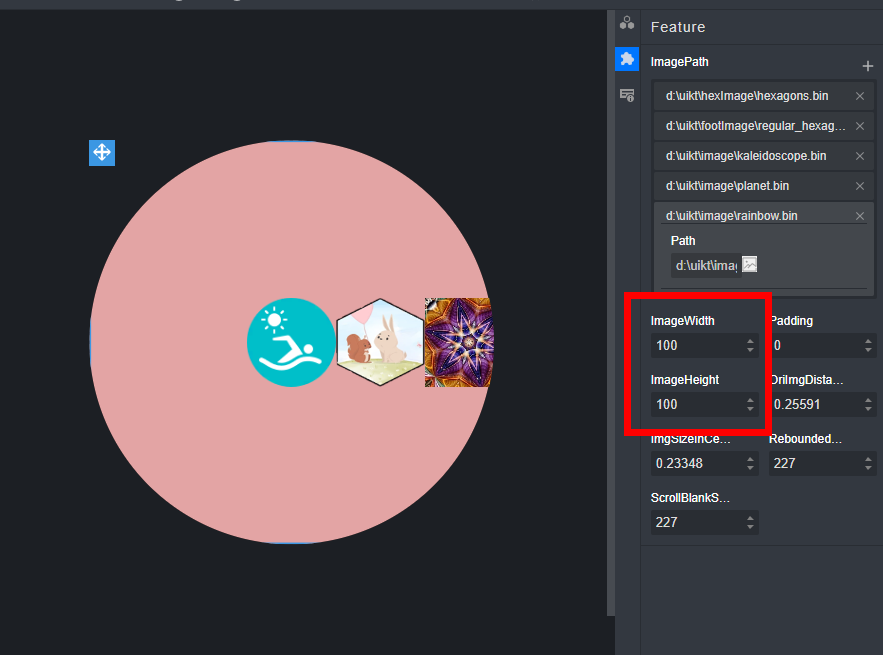

-   选中画布内的HexagonsList组件，通过右侧属性样式中的样式图标（Feature），在展开的Feature栏中修改HexagonsList组件中的Padding调整图片之间的间距。

    **图 3**  特有属性配置：Padding  
    

-   选中画布内的HexagonsList组件，通过右侧属性样式中的样式图标（Feature），在展开的Feature栏中修改HexagonsList组件中的OriImgDistance属性来设置模拟器中两个相邻图像中心之间的原始图像距离。

    **图 4**  特有属性配置：OriImgDistance  
    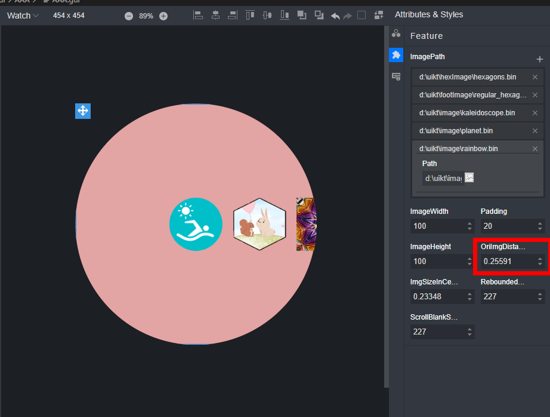

-   选中画布内的HexagonsList组件，通过右侧属性样式中的样式图标（Feature），在展开的Feature栏中修改HexagonsList组件中的ImgSizeInCenter属性来设置模拟器中图像位于中心位置的大小。

    **图 5**  特有属性配置：ImgSizeInCenter  
    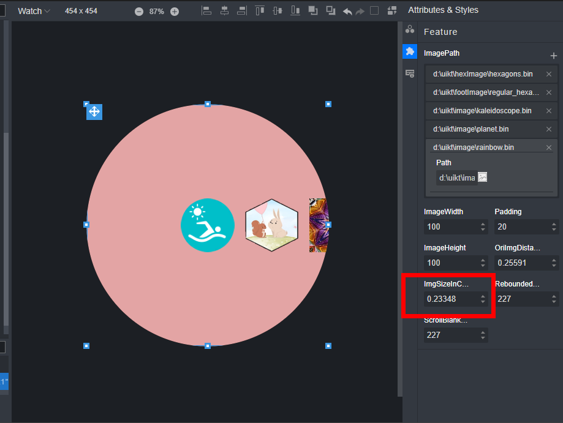

-   选中画布内的HexagonsList组件，通过右侧属性样式中的样式图标（Feature），在展开的Feature栏中修改HexagonsList组件中的ReboundedSize属性来设置回弹大小，即拖拽到列表边缘之外再释放后回弹至列表边缘移动的距离。

    **图 6**  特有属性配置：ReboundedSize  
    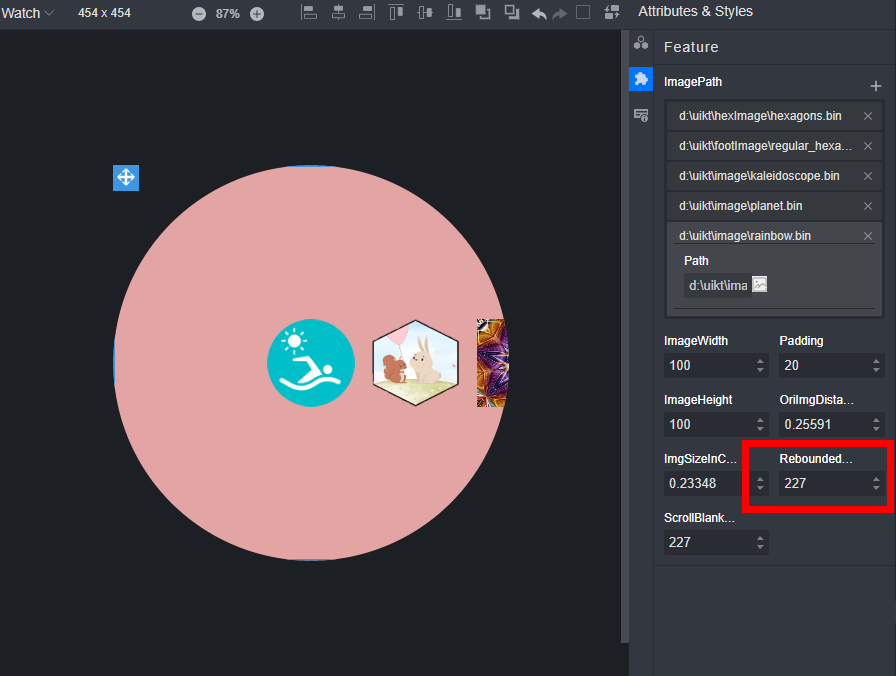

-   选中画布内的HexagonsList组件，通过右侧属性样式中的样式图标（Feature），在展开的Feature栏中修改HexagonsList组件中的ScrollBlankSize属性来设置模拟器中组件滚动视图时的空白大小。

    **图 7**  特有属性配置：ScrollBlankSizec  
    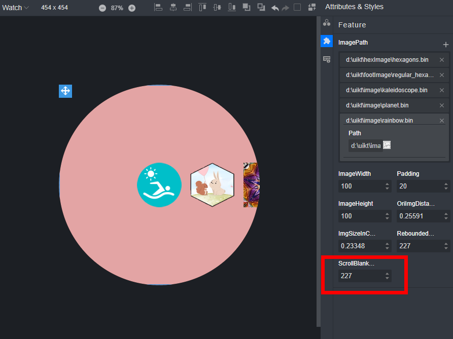

-   选中画布内的HexagonsList组件，通过右侧属性样式栏中的样式图标（Events），在展开的Events栏中配置回调事件。

    HexagonsList组件支持的事件有：OnClick、OnLongPress、OnDrag、OnDragStart、OnDragEnd、OnPress、OnCancel、OnRelease、OnFocus、OnBlur、OnRotate、OnRotateStart、OnRotateEnd。

    **图 8**  回调事件配置  
    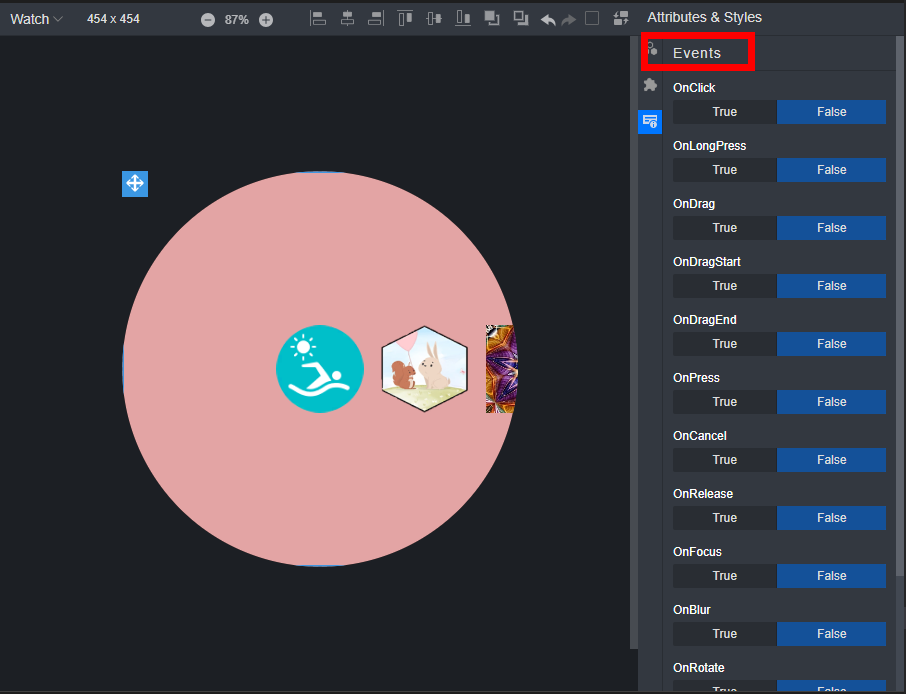

> **说明：** 
>Feature页面下的OriImgDistance、ImgSizeInCenter、ReboundedSize和ScrollBlankSize暂无渲染效果，具体效果可以在模拟器查看。
>ImageWidth、Padding，ImageHeight可以用于用户在界面展示多个组件时设置图片大小。
>Rebounded和ScrollBlankSize的初始值为227，是默认组件的Position为\(0, 0, 454, 454\)，即整个表盘。具体的取值大小可以根据实际模拟器展示效果进行调整，通常这个取值为组件宽度的一半。
>OriImgDistance和ImgSizeInCenter属性与组件宽度的乘积，决定了模拟器中图片的摆放位置关系。

#### IcosahedronView组件

本组件的共有属性不包含Position属性、Border属性、Margin属性与Padding属性，其他共有属性使用方法请参见“[组件的共有属性](组件的共有属性.md)”章节内容。

-   选中IcosahedronView组件，单击右侧属性样式栏中的样式图标（Feature），在展开的Feature栏导入一张图片（可以调整画布大小，使图片显示效果更好），图片会默认填满整个画布。

    **图 1**  特有属性配置：DefaultSrc  
    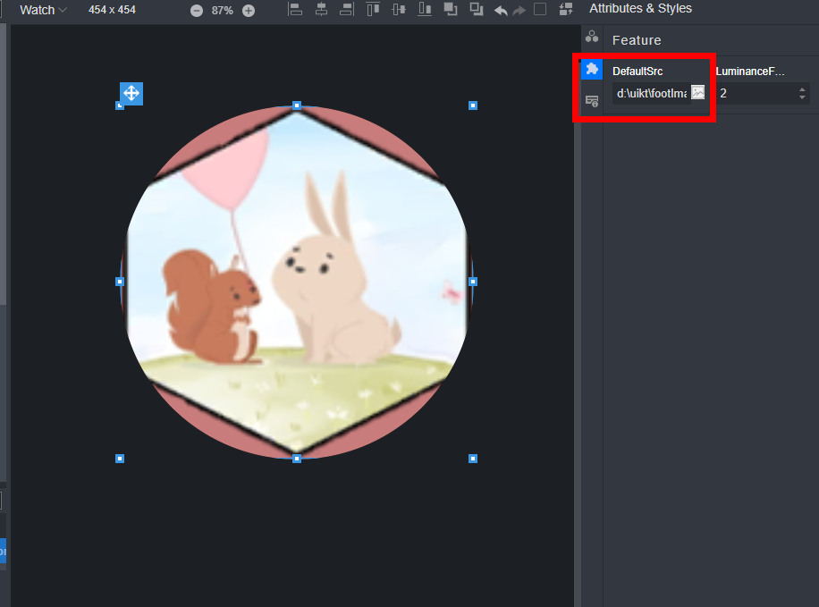

-   选中IcosahedronView组件，单击右侧属性样式栏中的样式图标（Feature），在展开的Feature栏中修改IcosahedronView组件中的LuminanceFactor属性来设置模拟器中亮度补偿因子，调整亮度。

    **图 2**  特有属性配置：LuminanceFactor  
    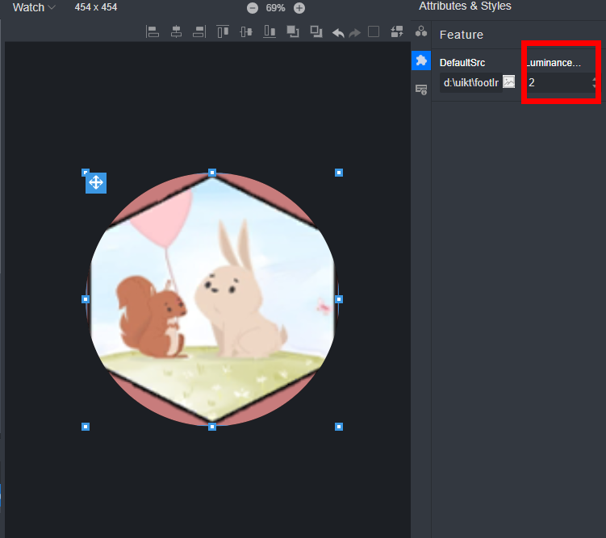

-   IcosahedronView组件仅支持Image组件导入。IcosahedronView组件的DefaultSrc属性设置了默认图片，如果导入的Image组件的图片个数少于20张，则使用该默认图片填充，达到类似足球样式的模拟器效果图。

    **图 3**  仅支持导入Image组件  
    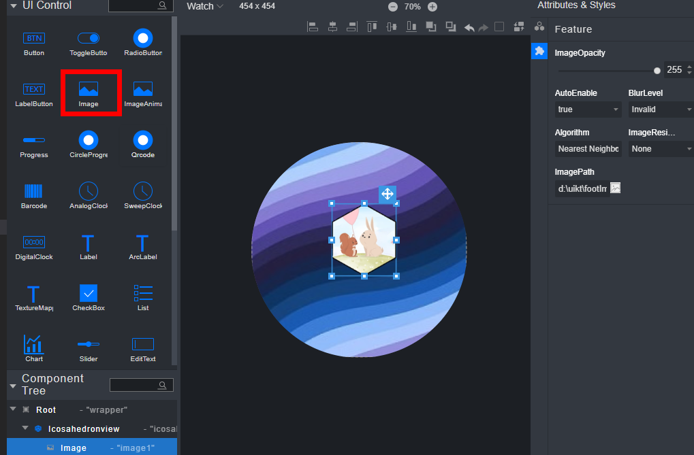

-   选中画布内的IcosahedronView组件，通过右侧属性样式栏中的样式图标（Events），在展开的Events栏中配置回调事件。

    RollerView组件支持的事件有：OnClick、OnLongPress、OnDrag、OnDragStart、OnDragEnd、OnPress、OnCancel、OnRelease、OnFocus、OnBlur、OnRotate、OnRotateStart、OnRotateEnd。

    **图 4**  回调事件配置  
    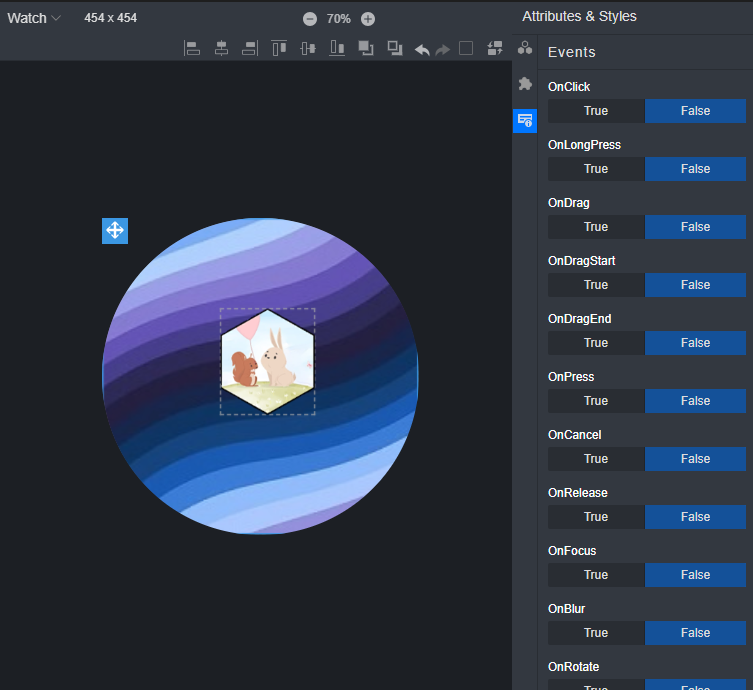

> **说明：** 
>IcosahedronView组件仅支持width和height调节，其坐标位置固定。

#### CanvasExt组件

共有属性使用方法请参见“[组件的共有属性](组件的共有属性.md)”章节内容。

-   选中画布内的CanvasExt组件，通过右侧属性样式栏中的样式图标（Events），在展开的Events栏中配置回调事件。CanvasExt组件支持的事件有：OnClick、OnLongPress、OnPress、OnCancel和OnRelease。

    **图 1**  回调事件配置  
    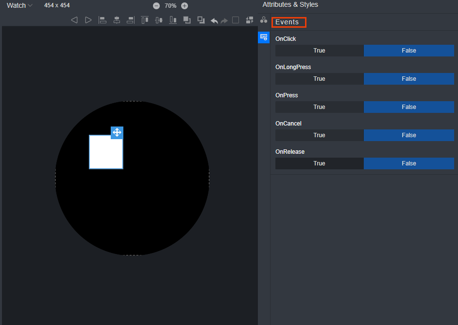

#### TransformList组件

共有属性使用方法请参见“[组件的共有属性](组件的共有属性.md)”章节内容。

-   选中TransformList组件，单击右侧属性样式栏中的样式图标（Feature），在展开的Feature栏中修改itemHeight属性设置所有子项的高度；修改itemWidth属性设置所有子项的宽度；修改itemSpace属性设置子项之间的间隙；修改imageHeight属性设置所有子项图片的高度；修改FontSize属性设置所有子项的字体大小；点击Item栏右侧的加号添加子项，修改子项中的Text属性和ImagePath属性添加文本和图片。

    **图 1**  添加子项  
    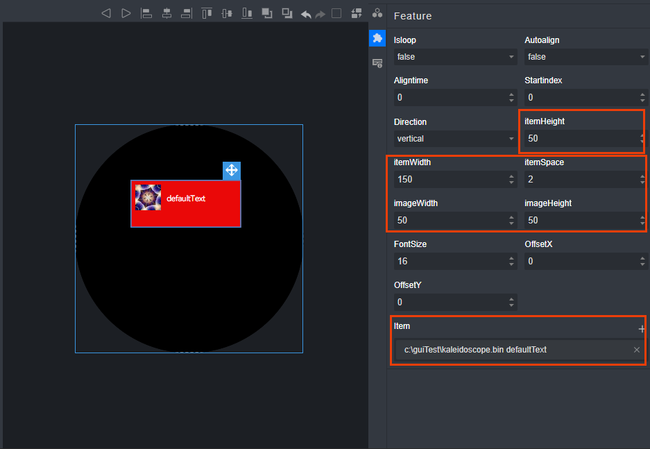

-   选中TransformList组件，单击右侧属性样式栏中的样式图标（Feature），在展开的Feature栏中修改List组件的OffsetX属性设置所有子项的横向偏移，修改OffsetY属性设置所有子项的纵向偏移。

    **图 2**  修改子项的偏移  
    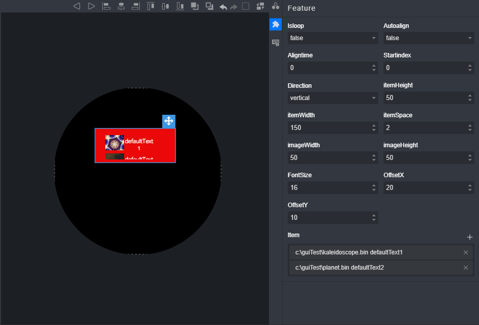

-   选中TransformList组件，单击右侧属性样式栏中的样式图标（Feature），在展开的Feature栏中修改TransformList组件的Direction属性设置列表的排列方向。

    **图 3**  修改列表的排列方向  
    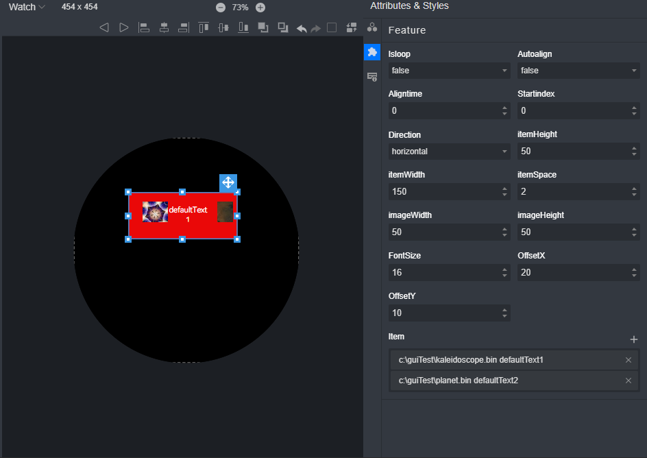

-   选中画布内的TransformList组件，通过右侧属性样式栏中的样式图标（Events），在展开的Events栏中配置回调事件。

    List组件支持的事件有：OnClick、OnLongPress、OnDrag、OnDragStart、OnDragEnd、OnPress、OnCancel、OnRelease、OnFocus和OnBlur。

    **图 4**  回调事件配置  
    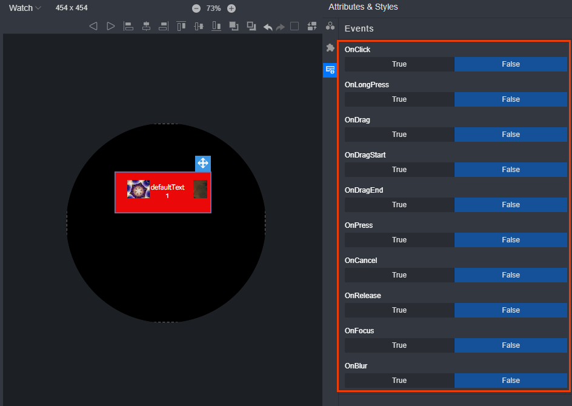

#### SlipflowView组件

本组件的共有属性不包含Position属性、Size属性、GaussOption属性、Border属性、Margin属性与Padding属性，其他共有属性使用方法请参见“[11.1.2.2 组件的共有属性](组件的共有属性.md)”描述。

-   选中画布内的SlipflowView组件，通过右侧属性样式中的样式图标（Feature），在展开的Feature栏中修改SlipflowView组件中的ImgWidth和ImgHeight可以调整图片宽高。

    更改图片宽高后，所有导入SlipflowView组件的图片宽高随之改变，且第一张图片始终位于组件的正中间。

    **图 1**  特有属性配置：ImgWidth和ImgHeight  
    

-   选中画布内的SlipflowView组件，通过右侧属性样式中的样式图标（Feature），在展开的Feature栏中修改SlipflowView组件中的isEnableBackImage可以控制是否使能背景图片。

    **图 2**  特有属性配置：isEnableBackImage  
    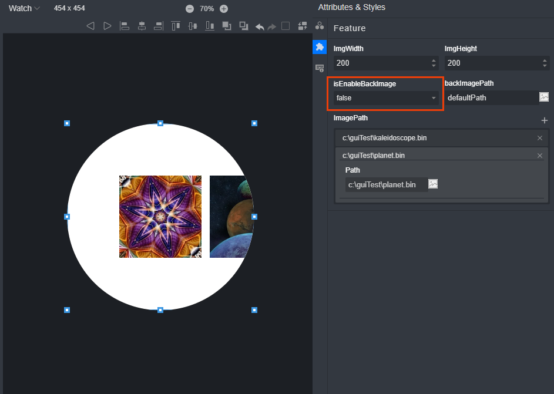

-   选中SlipflowView组件，单击右侧属性样式栏中的样式图标（Feature），在展开的Feature栏中修改SlipflowView组件中的backImagePath可以设置背景图片资源路径。

    **图 3**  特有属性配置：backImagePath  
    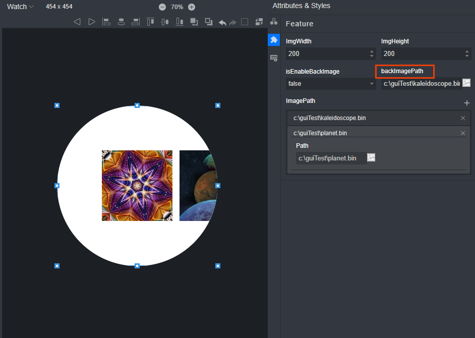

-   选中SlipflowView组件，单击右侧属性样式栏中的样式图标（Feature），在展开的Feature栏导入一张或者多张图片（可以调整画布大小，使图片显示效果更好），第一张图片默认位于画布正中间。

    **图 4**  特有属性配置：ImagePath  
    
    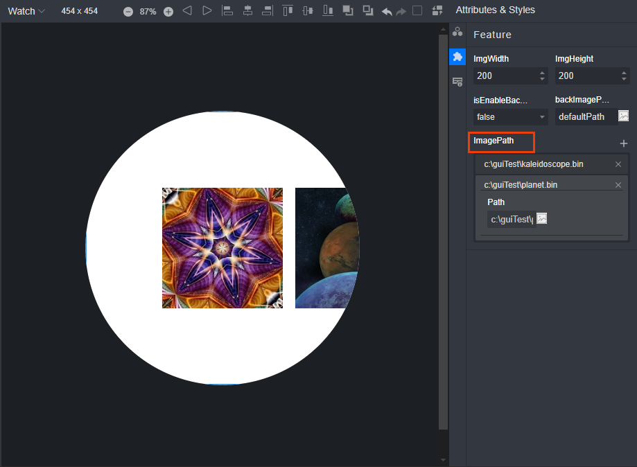

    > **说明：** 
    >ImagePath不支持中文路径。
    >导入的Bin文件必须是图片转的Bin，否则模拟器会异常.

-   选中画布内的SlipflowView组件，通过右侧属性样式栏中的样式图标（Events），在展开的Events栏中配置回调事件。

    SlipflowView组件支持的事件有：OnClick、OnLongPress、OnPress、OnCancel、OnRelease、OnScroll、OnScrollUpStart、OnScrollUpEnd、OnRemove和OnRefreshPageOpaScale。

    **图 5**  回调事件配置  
    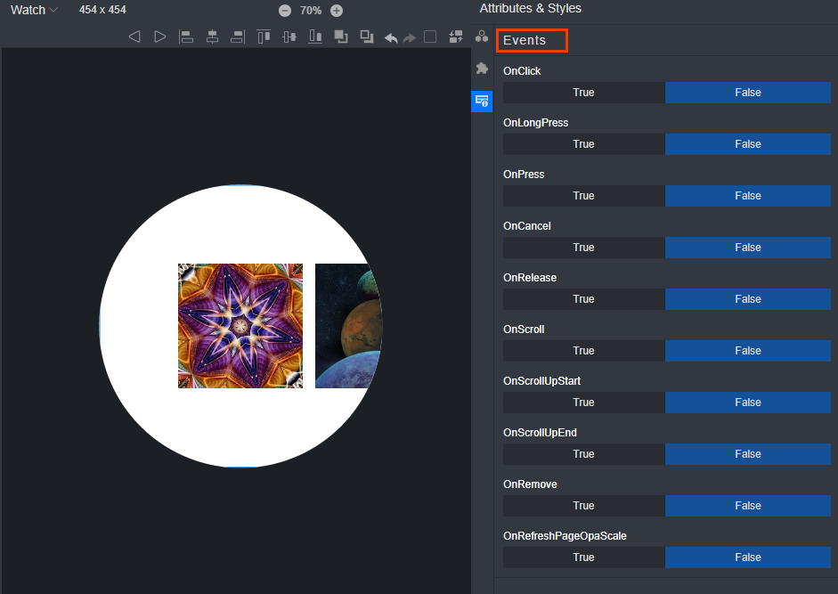

> **说明：** 
>-   SlipflowView组件其坐标位置固定，大小固定。
>-   Feature页面下的isEnableBackImage和backImagePath暂无渲染效果，具体效果可以在模拟器查看。

#### TransformGroup组件

共有属性使用方法请参见“[组件的共有属性](组件的共有属性.md)”章节内容。

-   选中画布内的TransformGroup组件，通过右侧属性样式栏中的样式图标（Events），在展开的Events栏中配置回调事件。

    TransformGroup组件支持的事件类型有：OnClick、OnLongPress、OnPress、OnCancel、OnRelease。

    **图 1**  回调事件配置  
    

> **说明：** 
>TransformGroup是个容器组件，主要作为Coverflow2的子组件使用。

#### Coverflow2组件

共有属性使用方法请参见“[组件的共有属性](组件的共有属性.md)”章节内容。

-   选中画布内的Coverflow2组件，通过右侧属性样式中的样式图标（Feature），在展开的Feature栏中修改Coverflow2组件中的RotateAngle调整旋转角度。

    **图 1**  特有属性配置：RotateAngle  
    
    

-   选中画布内的Coverflow2组件，通过右侧属性样式中的样式图标（Feature），在展开的Feature栏中修改Coverflow2组件中的Padding调整图片之间的间距。

    **图 2**  特有属性配置：Padding  
    
    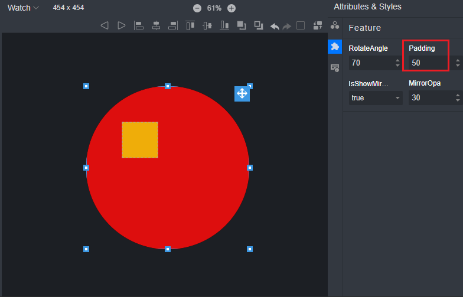

-   选中画布内的Coverflow2组件，通过右侧属性样式中的样式图标（Feature），在展开的Feature栏中修改Coverflow2组件中的IsShowMirrorImg设置是否显示图片镜像。

    **图 3**  特有属性配置：IsShowMirrorImg  
    
    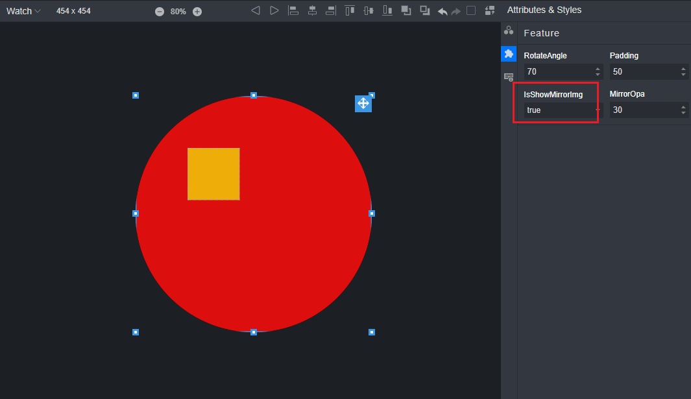

-   选中画布内的Coverflow2组件，通过右侧属性样式中的样式图标（Feature），在展开的Feature栏中修改Coverflow2组件中的MirrorOpa设置图片镜像的透明度。

    **图 4**  特有属性配置：MirrorOpa  
    
    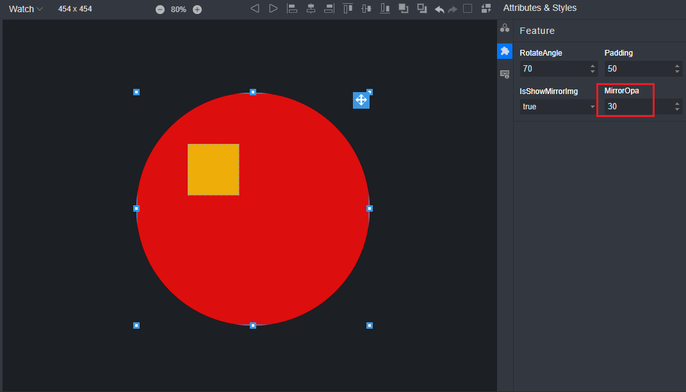

    当拖拽来的组件不是TransformGroup类型时，右下角会有“Only supports transformgroup component”或“仅支持拖拽TransformGroup组件”提示，并且拖入的子组件不会在画布上展示。

    **图 5**  组件拖入Coverflow2组件中  
    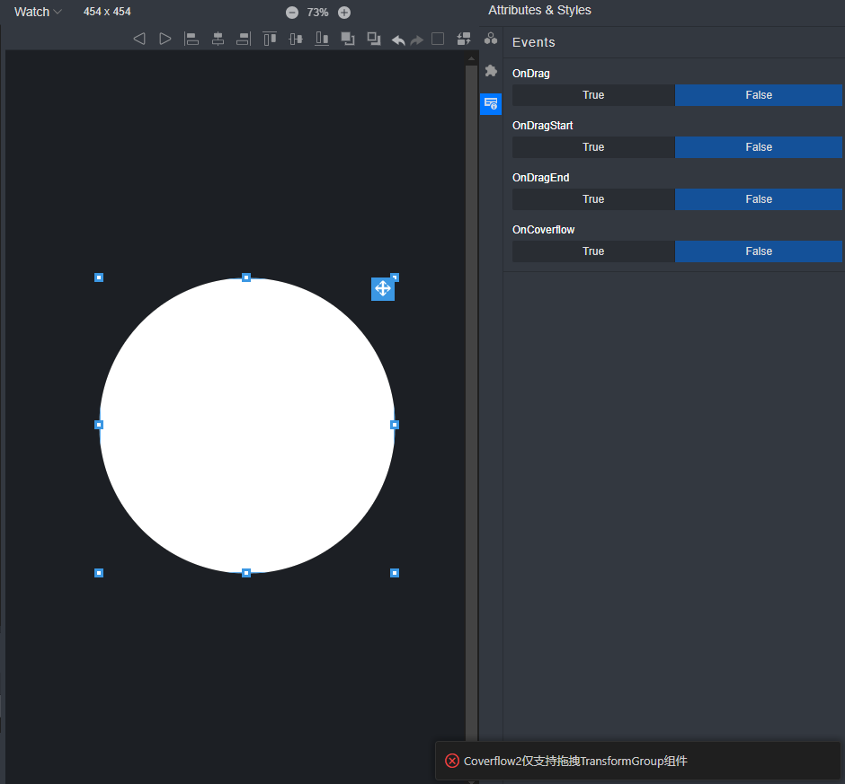

Coverflow2组件前端渲染界面仅会展示其某一个TransformGroup子组件：

-   当新增TransformGroup组件时，默认会展示最新拖拽进来的TransformGroup组件，隐藏掉之前的；
-   当删除TransformGroup组件时，默认会展示上个被拖入的TransformGroup组件，并隐藏掉其它的。

如果想实现切换，可以点击“[GUI拖拽界面介绍](GUI拖拽界面介绍.md)”中所介绍的Panel面板的按钮，该按钮使用说明如下：

1.  左右切换会分别显示拖拽来的上一个和下一个TransformGroup子组件。
2.  切换按钮在选中父组件为Coverflow2的TransformGroup子组件时生效，选中的操作可以通过点击左侧的组件树中的TransformGroup或者在渲染界面的TransformGroup后，点击左右按钮，从而展示被选中组件的前一个和后一个，如[图6](#fig14330923143518)所示。
3.  切换按钮如果选的不是父组件为Coverflow2的TransformGroup子组件时，会弹窗提示，如[图7](#fig1459413716407)所示。

**图 6**  TransformGroup切换展示逻辑  
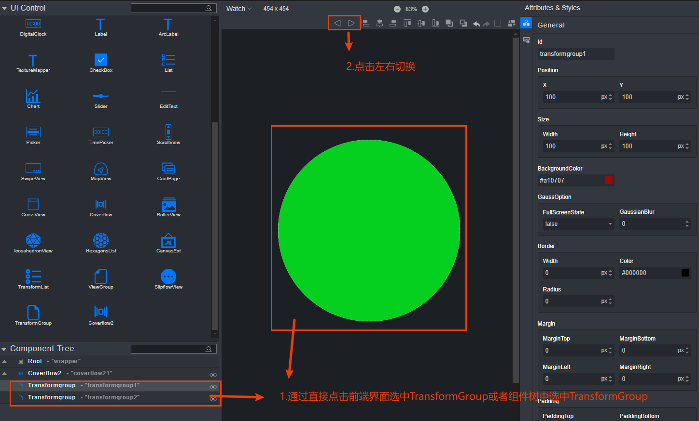

**图 7**  非Coverflow2子组件切换的弹窗提醒  
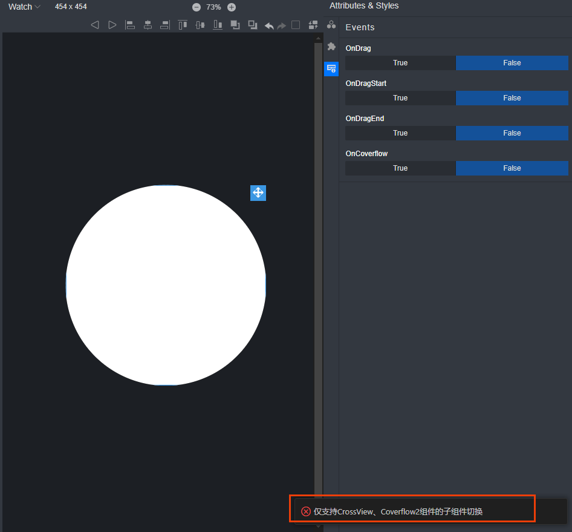

#### ParticleView组件

共有属性使用方法请参见“[组件的共有属性](组件的共有属性.md)”章节内容。

-   选中画布内的ParticleView组件，通过右侧属性样式中的样式图标（Feature），在展开的Feature栏中修改ParticleView组件中的birthRateRatio调整粒子生产率系数，该系数将与ParticleCell定义的粒子生产率相乘。

    **图 1**  特有属性配置：birthRateRatio  
    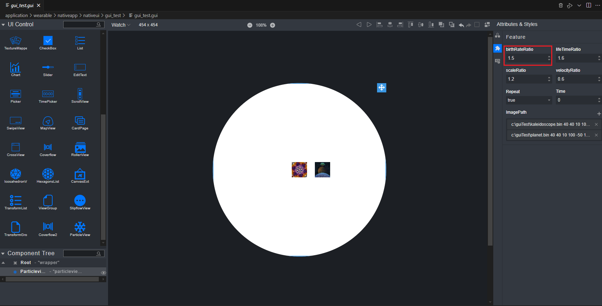

-   选中画布内的ParticleView组件，通过右侧属性样式中的样式图标（Feature），在展开的Feature栏中修改ParticleView组件中的lifeTimeRatio调整粒子生命周期系数，该系数将与ParticleCell定义的粒子生命周期相乘。

    **图 2**  特有属性配置：lifeTimeRatio  
    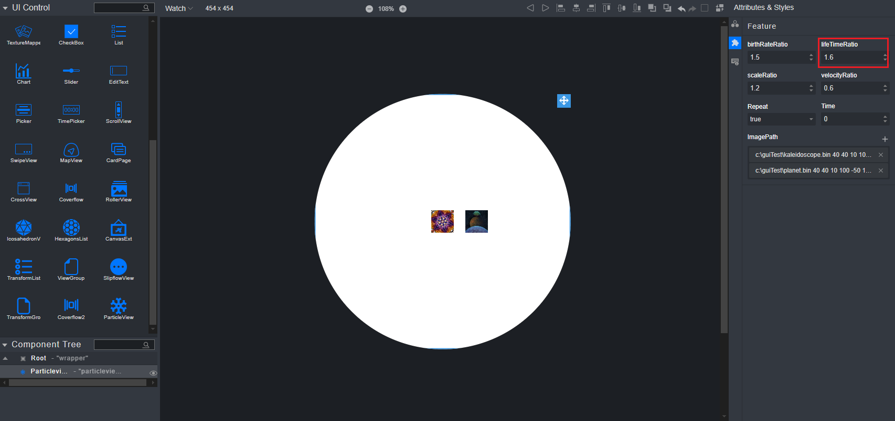

-   选中画布内的ParticleView组件，通过右侧属性样式中的样式图标（Feature），在展开的Feature栏中修改ParticleView组件中的scaleRatio调整粒子缩放系数，该系数将与ParticleCell定义的粒子缩放倍数相乘。

    **图 3**  特有属性配置：scaleRatio  
    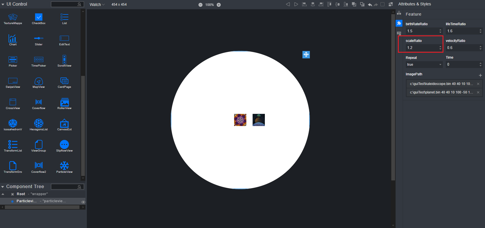

-   选中画布内的ParticleView组件，通过右侧属性样式中的样式图标（Feature），在展开的Feature栏中修改ParticleView组件中的velocityRatio调整粒子速度系数，该系数将与ParticleCell定义的粒子速度相乘。

    **图 4**  特有属性配置：velocityRatio  
    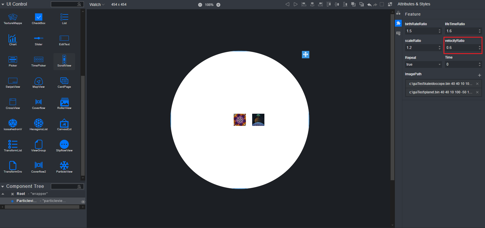

-   选中画布内的ParticleView组件，通过右侧属性样式中的样式图标（Feature），在展开的Feature栏中修改ParticleView组件中的Repeat调整粒子动画是否重复运行。

    **图 5**  特有属性配置：Repeat  
    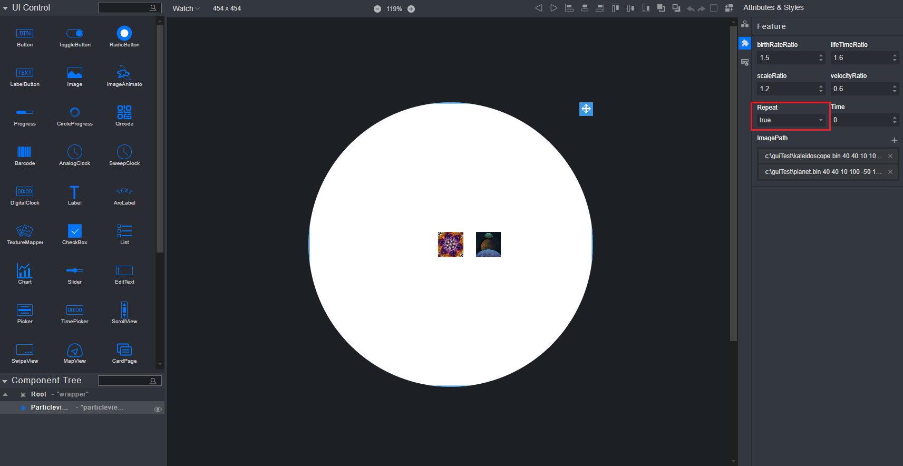

-   选中画布内的ParticleView组件，通过右侧属性样式中的样式图标（Feature），在展开的Feature栏中修改ParticleView组件中的Time调整粒子动画运行周期。

    **图 6**  特有属性配置：Time  
    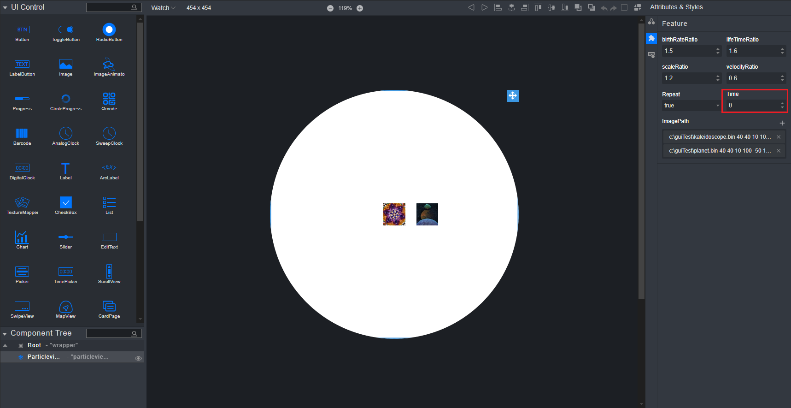

-   选中画布内的ParticleView组件，通过右侧属性样式中的样式图标（Feature），在展开的Feature栏中点击ImagePath右侧的加号，导入一张或多张图片，并设置各项参数。

    **图 7**  特有属性配置：ImagePath  
    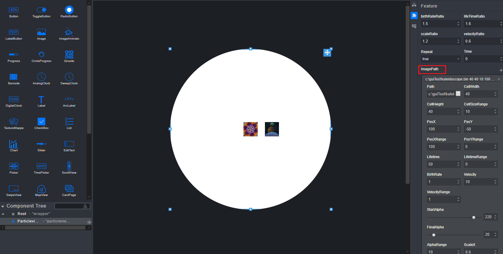

    **表 1**  特有属性配置：ImagePath参数说明

    
    <table><thead align="left"><tr id="row22041537192514"><th class="cellrowborder" valign="top" width="37.230000000000004%" id="mcps1.2.3.1.1">
属性

    </th>
    <th class="cellrowborder" valign="top" width="62.77%" id="mcps1.2.3.1.2">
介绍

    </th>
    </tr>
    </thead>
    <tbody><tr id="row3204143710258"><td class="cellrowborder" valign="top" width="37.230000000000004%" headers="mcps1.2.3.1.1 ">
Path

    </td>
    <td class="cellrowborder" valign="top" width="62.77%" headers="mcps1.2.3.1.2 ">
设置粒子图源。

    </td>
    </tr>
    <tr id="row1020573782513"><td class="cellrowborder" valign="top" width="37.230000000000004%" headers="mcps1.2.3.1.1 ">
CellWidth

    </td>
    <td class="cellrowborder" valign="top" width="62.77%" headers="mcps1.2.3.1.2 ">
设置粒子初始宽度。

    </td>
    </tr>
    <tr id="row8205203717253"><td class="cellrowborder" valign="top" width="37.230000000000004%" headers="mcps1.2.3.1.1 ">
CellHeight

    </td>
    <td class="cellrowborder" valign="top" width="62.77%" headers="mcps1.2.3.1.2 ">
设置例子初始高度。

    </td>
    </tr>
    <tr id="row4521651152719"><td class="cellrowborder" valign="top" width="37.230000000000004%" headers="mcps1.2.3.1.1 ">
CellSizeRange

    </td>
    <td class="cellrowborder" valign="top" width="62.77%" headers="mcps1.2.3.1.2 ">
设置粒子初始宽高上下浮动范围。

    </td>
    </tr>
    <tr id="row779724562716"><td class="cellrowborder" valign="top" width="37.230000000000004%" headers="mcps1.2.3.1.1 ">
PosX

    </td>
    <td class="cellrowborder" valign="top" width="62.77%" headers="mcps1.2.3.1.2 ">
设置粒子横向初始位置。

    </td>
    </tr>
    <tr id="row420516372256"><td class="cellrowborder" valign="top" width="37.230000000000004%" headers="mcps1.2.3.1.1 ">
PosY

    </td>
    <td class="cellrowborder" valign="top" width="62.77%" headers="mcps1.2.3.1.2 ">
设置粒子纵向初始位置。

    </td>
    </tr>
    <tr id="row122051037172511"><td class="cellrowborder" valign="top" width="37.230000000000004%" headers="mcps1.2.3.1.1 ">
PosXRange

    </td>
    <td class="cellrowborder" valign="top" width="62.77%" headers="mcps1.2.3.1.2 ">
设置粒子横向初始位置上下浮动范围。

    </td>
    </tr>
    <tr id="row720520373257"><td class="cellrowborder" valign="top" width="37.230000000000004%" headers="mcps1.2.3.1.1 ">
PosYRange

    </td>
    <td class="cellrowborder" valign="top" width="62.77%" headers="mcps1.2.3.1.2 ">
设置粒子纵向初始位置上下浮动范围。

    </td>
    </tr>
    <tr id="row19675194919321"><td class="cellrowborder" valign="top" width="37.230000000000004%" headers="mcps1.2.3.1.1 ">
Lifetime

    </td>
    <td class="cellrowborder" valign="top" width="62.77%" headers="mcps1.2.3.1.2 ">
设置粒子生命周期。

    </td>
    </tr>
    <tr id="row155488567324"><td class="cellrowborder" valign="top" width="37.230000000000004%" headers="mcps1.2.3.1.1 ">
LifetimeRange

    </td>
    <td class="cellrowborder" valign="top" width="62.77%" headers="mcps1.2.3.1.2 ">
设置粒子生命周期上下浮动范围。

    </td>
    </tr>
    <tr id="row396681173310"><td class="cellrowborder" valign="top" width="37.230000000000004%" headers="mcps1.2.3.1.1 ">
BirthRate

    </td>
    <td class="cellrowborder" valign="top" width="62.77%" headers="mcps1.2.3.1.2 ">
设置粒子生产率：每个动画周期生产多少粒子。

    </td>
    </tr>
    <tr id="row173016612331"><td class="cellrowborder" valign="top" width="37.230000000000004%" headers="mcps1.2.3.1.1 ">
Velocity

    </td>
    <td class="cellrowborder" valign="top" width="62.77%" headers="mcps1.2.3.1.2 ">
设置粒子速度。

    </td>
    </tr>
    <tr id="row371125313218"><td class="cellrowborder" valign="top" width="37.230000000000004%" headers="mcps1.2.3.1.1 ">
VelocityRange

    </td>
    <td class="cellrowborder" valign="top" width="62.77%" headers="mcps1.2.3.1.2 ">
设置粒子速度上下浮动范围。

    </td>
    </tr>
    <tr id="row1855533544119"><td class="cellrowborder" valign="top" width="37.230000000000004%" headers="mcps1.2.3.1.1 ">
StartAlpha

    </td>
    <td class="cellrowborder" valign="top" width="62.77%" headers="mcps1.2.3.1.2 ">
设置粒子起始透明度。

    </td>
    </tr>
    <tr id="row58065391415"><td class="cellrowborder" valign="top" width="37.230000000000004%" headers="mcps1.2.3.1.1 ">
FinalAlpha

    </td>
    <td class="cellrowborder" valign="top" width="62.77%" headers="mcps1.2.3.1.2 ">
设置粒子最终透明度。

    </td>
    </tr>
    <tr id="row812554594114"><td class="cellrowborder" valign="top" width="37.230000000000004%" headers="mcps1.2.3.1.1 ">
AlphaRange

    </td>
    <td class="cellrowborder" valign="top" width="62.77%" headers="mcps1.2.3.1.2 ">
设置粒子起始和最终透明度上下浮动范围。

    </td>
    </tr>
    <tr id="row1168020714411"><td class="cellrowborder" valign="top" width="37.230000000000004%" headers="mcps1.2.3.1.1 ">
ScaleX

    </td>
    <td class="cellrowborder" valign="top" width="62.77%" headers="mcps1.2.3.1.2 ">
设置粒子横向最终缩放倍数。

    </td>
    </tr>
    <tr id="row17731911194415"><td class="cellrowborder" valign="top" width="37.230000000000004%" headers="mcps1.2.3.1.1 ">
ScaleY

    </td>
    <td class="cellrowborder" valign="top" width="62.77%" headers="mcps1.2.3.1.2 ">
设置粒子纵向最终缩放倍数。

    </td>
    </tr>
    <tr id="row175261522134418"><td class="cellrowborder" valign="top" width="37.230000000000004%" headers="mcps1.2.3.1.1 ">
ScaleRange

    </td>
    <td class="cellrowborder" valign="top" width="62.77%" headers="mcps1.2.3.1.2 ">
设置粒子最终缩放倍数上下浮动范围。

    </td>
    </tr>
    <tr id="row98292018114415"><td class="cellrowborder" valign="top" width="37.230000000000004%" headers="mcps1.2.3.1.1 ">
AccelerationX

    </td>
    <td class="cellrowborder" valign="top" width="62.77%" headers="mcps1.2.3.1.2 ">
设置粒子横向加速度。

    </td>
    </tr>
    <tr id="row13179101524415"><td class="cellrowborder" valign="top" width="37.230000000000004%" headers="mcps1.2.3.1.1 ">
AccelerationY

    </td>
    <td class="cellrowborder" valign="top" width="62.77%" headers="mcps1.2.3.1.2 ">
设置粒子纵向加速度。

    </td>
    </tr>
    <tr id="row1330413394413"><td class="cellrowborder" valign="top" width="37.230000000000004%" headers="mcps1.2.3.1.1 ">
EmissionAngle

    </td>
    <td class="cellrowborder" valign="top" width="62.77%" headers="mcps1.2.3.1.2 ">
设置粒子发射角度。

    </td>
    </tr>
    <tr id="row1052213317498"><td class="cellrowborder" valign="top" width="37.230000000000004%" headers="mcps1.2.3.1.1 ">
EmissionRange

    </td>
    <td class="cellrowborder" valign="top" width="62.77%" headers="mcps1.2.3.1.2 ">
设置粒子发射角度上下浮动范围。

    </td>
    </tr>
    <tr id="row17855163519497"><td class="cellrowborder" valign="top" width="37.230000000000004%" headers="mcps1.2.3.1.1 ">
TotalPeriod

    </td>
    <td class="cellrowborder" valign="top" width="62.77%" headers="mcps1.2.3.1.2 ">
设置ParticleCell活跃周期。仅在活跃周期内的ParticleCell可以生产粒子。

    </td>
    </tr>
    <tr id="row1667124013494"><td class="cellrowborder" valign="top" width="37.230000000000004%" headers="mcps1.2.3.1.1 ">
Spin

    </td>
    <td class="cellrowborder" valign="top" width="62.77%" headers="mcps1.2.3.1.2 ">
设置粒子周期性旋转度数。

    </td>
    </tr>
    <tr id="row6951194210499"><td class="cellrowborder" valign="top" width="37.230000000000004%" headers="mcps1.2.3.1.1 ">
SpinMode

    </td>
    <td class="cellrowborder" valign="top" width="62.77%" headers="mcps1.2.3.1.2 ">
设置粒子周期性旋转模式。

    </td>
    </tr>
    <tr id="row15625194512496"><td class="cellrowborder" valign="top" width="37.230000000000004%" headers="mcps1.2.3.1.1 ">
SpinRange

    </td>
    <td class="cellrowborder" valign="top" width="62.77%" headers="mcps1.2.3.1.2 ">
设置粒子周期性旋转度数上下浮动范围。

    </td>
    </tr>
    </tbody>
    </table>

#### Root组件

本组件为中央区域的背景画布。

**图 1**  Root组件  
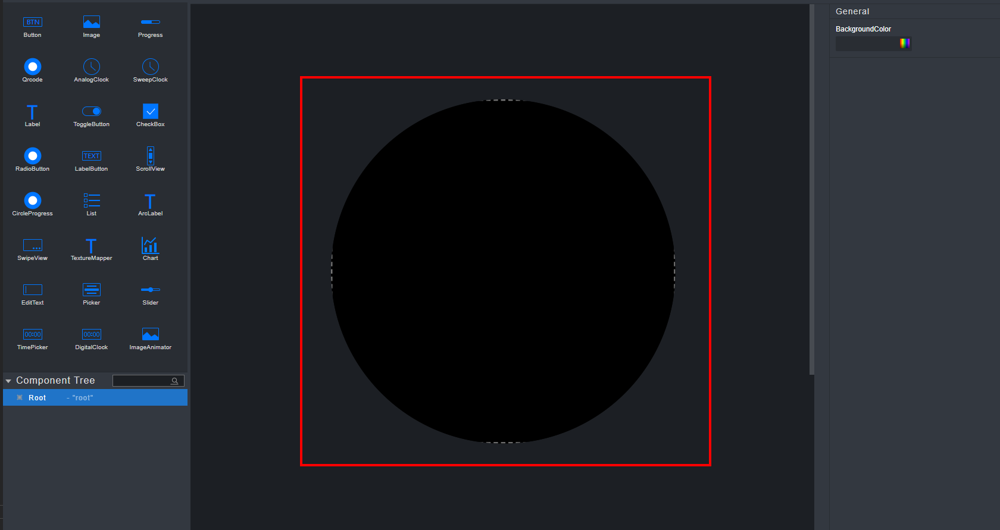

选中Root组件，在右侧展开的General栏中修改BackgroundColor属性，可以修改Root组件的颜色。

**图 2**  修改背景色  
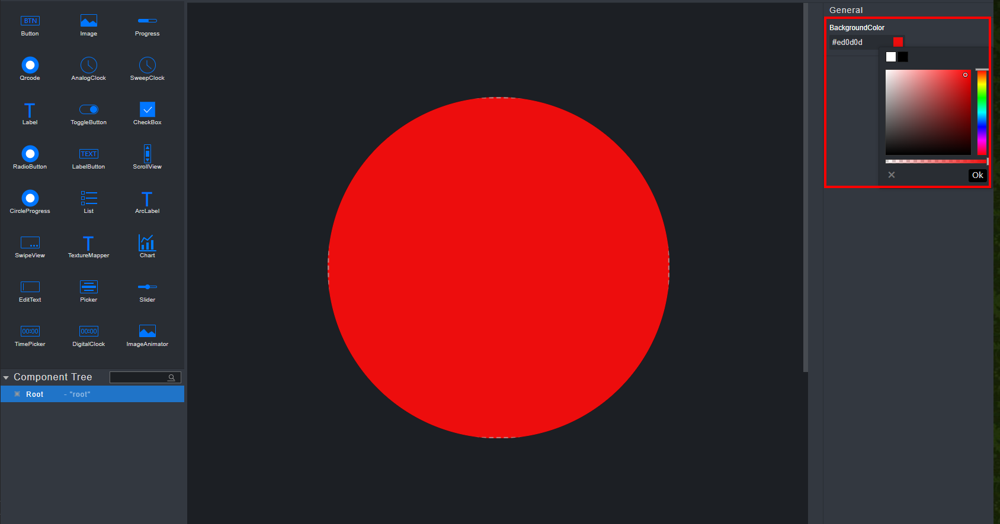

> **说明：** 
>-   Root组件是所有组件的父组件。
>-   Root组件是唯一的，自动创建的，不可进行除改变颜色外的其他操作的。

#### 用户代码编辑

用户点击画布右上角“Convert to C++ files”，会在工程文件生成界面样式对应的代码。

**图 1**  生成代码按钮  
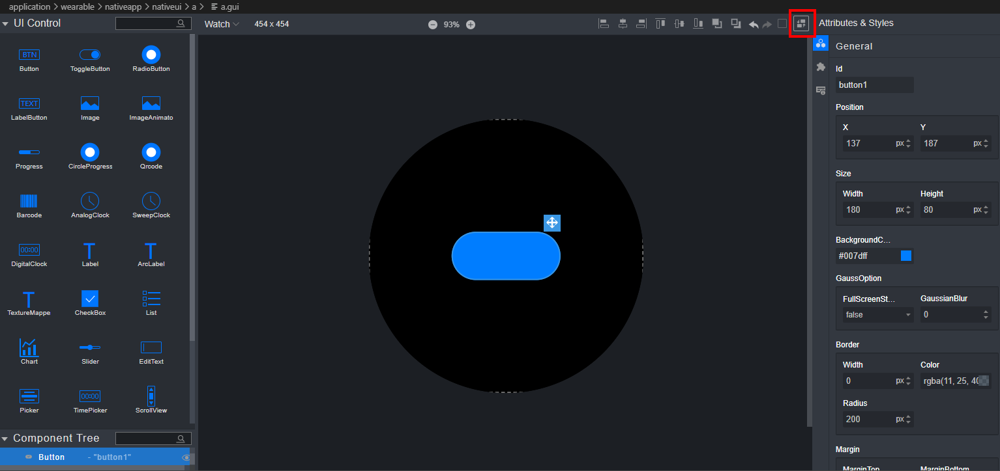

以工程名为aaaa的aaaa.gui工程和Button组件为例，生成的代码目录位于工程目录下“application/wearable/nativeapp/gui工程名”，具体结构如[图2](#fig084021814113)所示。用户可自行在xxxPresenter.cpp文件中按照模板添加自己的回调事件，模板代码如[图3](#fig113311395104)所示，其余部分都是自动生成的，每次点击生成代码按钮都会刷新。

**图 2**  生成代码目录结构  
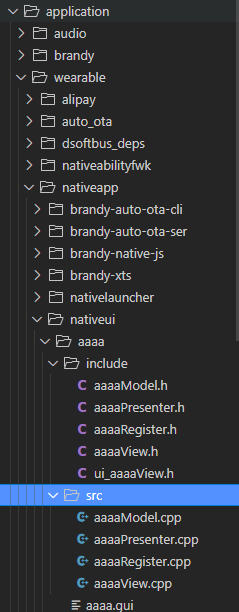

> **说明：** 
>-   从其他组件切成CrossView组件，或者从CrossView组件切成其它组件，而后去生成代码时，由于CrossView组件添加子组件的特殊性，需要先手动删除当前已有的“/src/$\{AppName\}View.cpp”后，再点击转换生成代码。
>-   其余“ui\_xxView.h”格式的文件不可修改，GUI每次点击生成代码都会覆盖生成。

**图 3**  回调事件模板代码  
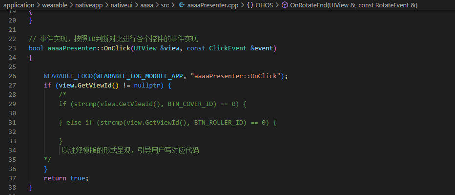

以click的回调事件为例，如果当前画布中只有一个组件的的click回调被置为true，用户可直接在OnClick的回调函数中添加回调事件，如果当前画布中有多个组件的click回调被置为true，则用户需要按照提示来区分组件实现各自的回调，如[图4](#fig171118207109)所示。

**图 4**  多个组件同一回调事件代码实现  

#### 组件对齐

组件对齐通过选中组件再点击界面上方工具栏中的对齐按钮实现。

对齐效果分别为左对齐，左右居中对齐，右对齐，顶部对齐，上下居中对齐和底部对齐六种。

根据选中的组件个数不同，对齐操作分为两种：

-   选中一个组件

    只选中一个组件时，会将被选中的组件作为需要对齐的组件，以其父组件作为参照物进行对齐。可以通过组件树（Component Tree）查看组件的父子关系。

    > **说明：** 
    >只选中Root组件时无效。

-   选中多个组件（通过按住Ctrl键点击多个组件）

    当被选中的组件不止一个时，将会以最后一个被选中的组件作为参照物，其他被选中的组件作为需要对齐的组件进行对齐。

    > **说明：** 
    >被选中的组件只能为Root组件或其直接子组件。

#### 组件层级移动

组件层级移动通过选中组件再点击界面上方工具栏中的层级移动按钮实现。

**图 1**  组件层级移动  

为前进一层，为后退一层

> **说明：** 
>-   每次点击操作只能使组件向前/向后一层。
>-   同时选中多个组件时层级移动操作只对最后一个选中的组件生效。
>-   层级移动无法调整当前组件的父组件（如当前组件是ScrollView/SwipeView的子组件，层级移动操作无法使组件跳出）。
>-   组件树中越靠近顶端的组件层级越低，越靠近底部的组件层级越高。

#### 高斯模糊属性

组件的高斯模糊属性通过单击右侧属性样式栏中的样式图标（General），在展开的General栏中修改组件的GaussianBlur属性设置高斯模糊。如[图1](#fig12812852164217)所示。

**图 1**  高斯模糊  

组件设置高斯模糊之后，会将层级低于该组件的其他组件模糊处理。如[图2](#fig17715201710478)所示。

**图 2**  高斯模糊效果范例  
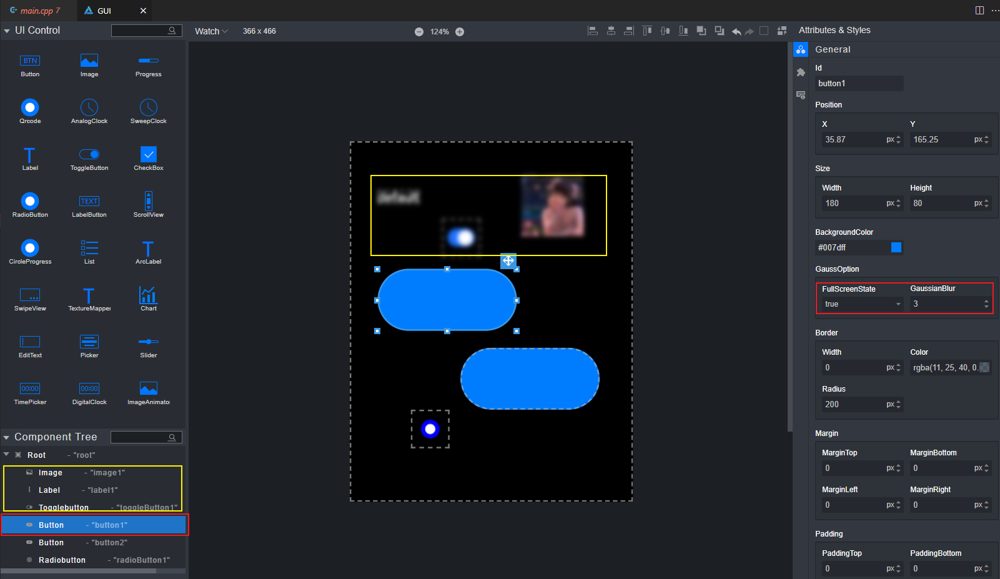

> **说明：** 
>-   只有同时满足FullScreenState为true且GaussianBlur不为0时，高斯模糊才会生效。
>-   因渲染方式差异，GUI界面中组件渲染效果会与模拟器中实际效果有一定差异。
>-   多个组件均设置高斯模糊效果时，仅最下层组件的高斯模糊生效。
>-   组件层级可通过组件树查看，层级移动方式和详细说明参考“[组件层级移动](组件层级移动.md)”。
>-   GaussianBlur属性决定不同程度的高斯模糊效果，合理的范围是\[0, 32\]。
>-   事件添加：当前版本在控件的Events属性中使能事件不会生成事件代码，需用户手动添加事件代码，具体添加方法是在应用代码（以应用名未gui6为例，在sdk根目录/application/wearable/nativeapp/nativeui/gui6/include/ui\_gui6View.h）的setupUi方法中，对指定控件添加预期添加的事件，如需要给id名称为“button1”的控件添加OnLongPress事件，则在setupUi方法末尾增加“button1-\>SetOnLongPressListener\(gui6presenter\_\);”，其中“button1\_”为控件在代码中的变量名，“gui6presenter\_”为与应用名关联的在代码中自动生成的指针。

## 模拟器效果展示方法

### Demo运行

点击图示中的“App Debug”，会起编译调试并展示模拟器，运行默认的demo效果如[图2](#fig771416101317)所示。

运行过程中的日志信息记录在当前打开的工程根目录下的“simulator\_build/error.txt”文件中。

**图 1**  App Debug按钮  
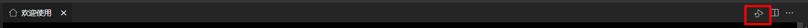

**图 2**  模拟器效果展示  
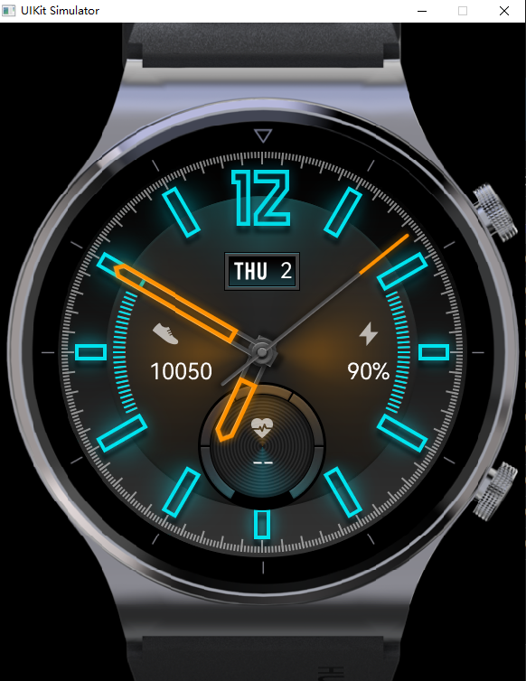

### 调试运行

点击“App Debug”按钮后，会自动起编译和调试功能，用户可自行添加断点并进行调试。调试功能请参见“[8 工程调试](工程调试.md)”章节。

**图 1**  调试功能展示  

### 经过GUI界面拖拽生成代码运行

用户在画布中添加组件、更改属性或者回调使能后，并且启动模拟器后，可按照[图1](#fig18197143416124)操作看到画布中添加的功能列表。

**图 1**  从模拟器查看添加的组件功能  
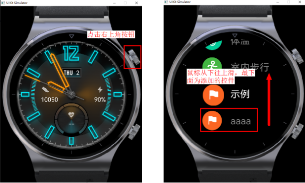

> **说明：** 
>当模拟器显示主界面时，点击右上角按钮，会自动跳到功能列表页面，列表最先面即为添加组件列表；当模拟器显示非主界面时，点击右上角按钮，会自动跳到主界面。

从图中可以看出，当前添加的功能名称默认为创建的GUI工程名称，图标默认为“示例”图标。如果想要修改模拟器中GUI工程的图标和名称，可以在对应GUI工程的生成代码目录下的“Register.cpp”文件中进行修改。

**图 2**  修改默认GUI工程名称和列表前的图标  
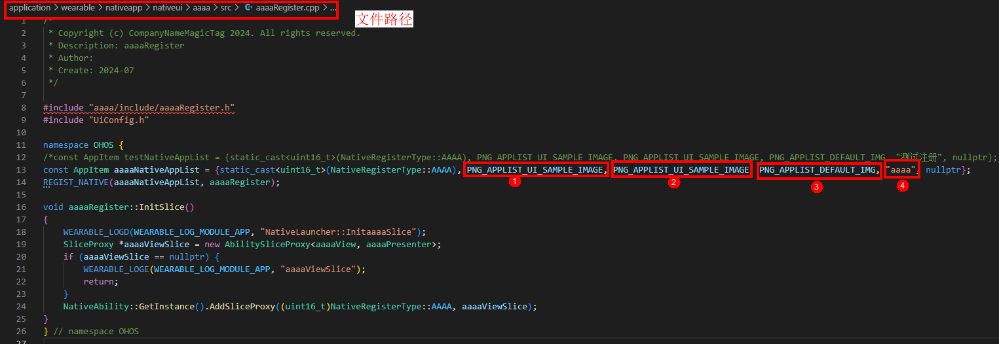

在对应的cpp文件中，修改这四个参数可以修改模拟器中对应组件的图标或者名称。

①：桌面中选择图标模式（默认模式）对应的图标显示，格式为.bin的格式文件。

②：桌面中选择蜂窝模式对应的图标显示，格式为.bin的格式文件。

③：桌面中对应足球模式对应的图标显示，格式为.bin的格式文件。

④：组件对应的名称。

对于默认选择的图标模式，只需要更改①和④中的参数，即可修改模拟器中组件对应的图标和组件名。

### 模拟器尺寸与形状设置

用户创建GUI工程后，又想重新改变画布或者模拟器的尺寸与形状，可以在工程中搜索“graphic\_config.h”文件，位于工程目录下的“application/brandy/simulator/libui”目录下，更改HORIZONTAL\_RESOLUTION、VERTICAL\_RESOLUTION以及DEVICE\_SHAPE这三个参数，分别对应模拟器的直径（长宽）以及模拟器的形状。

**图 1**  更改模拟器的尺寸与形状  
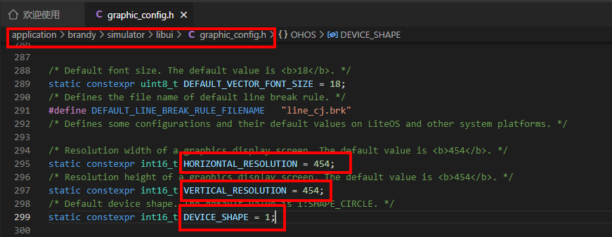

## 图形工具介绍

点击插件页面或者状态栏中的“Graphics Tools”图标。

**图 1**  插件页面或者状态栏中的“Graphics Tools”图标  

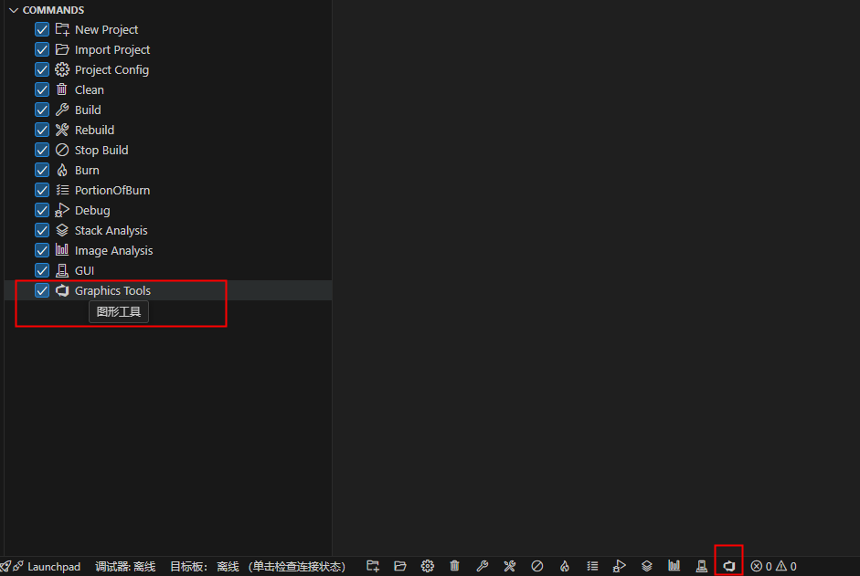

弹出功能页签，当前包含“图片解压缩”和“视频首帧提取”两个功能。

**图 2**  “GUI图形工具”页签  

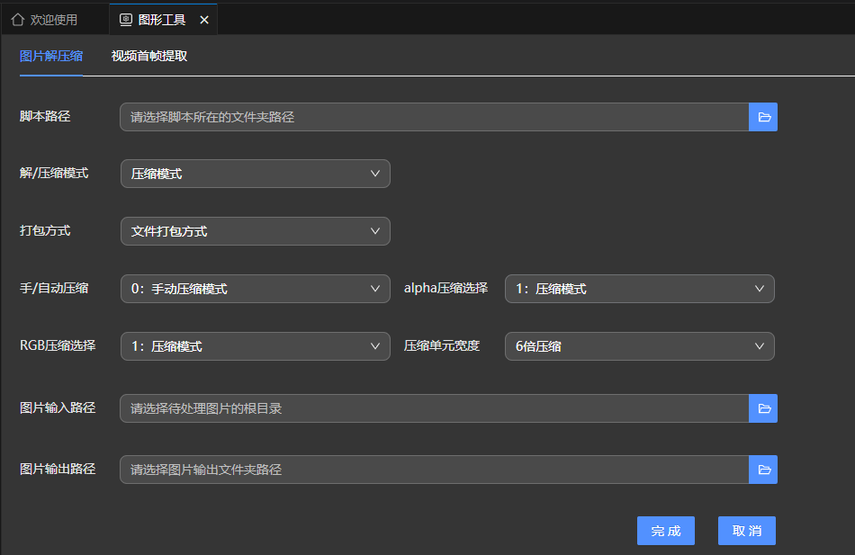

### 环境配置

在使用“Graphics Tools”图形工具功能之前，需要配置python环境，请参考“[工具链toolchain配置](工具链toolchain配置.md)”。

python安装成功后需要安装pip的依赖模块。

-   opencv模块
-   numpy模块
-   Pillow模块
-   matplotlib模块

安装完成后可以在VS Code的安装目录下的“tools/python/Scripts”目录下打开cmd中执行“pip.exe list”，查看各依赖是否安装成功。

**图 1**  pip依赖安装校验  

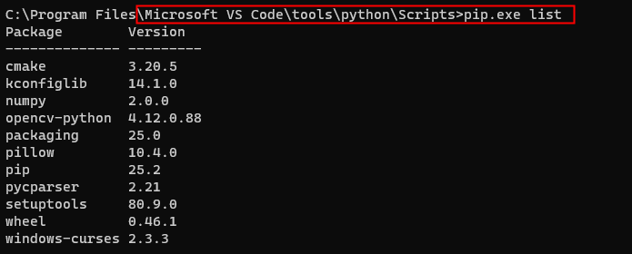

### 图片解压缩工具

图片解压缩工具的功能：依据xml文件配置的压缩算法以及像素格式信息，将指定目录下的每一个子目录都打包成一个资源文件并且生成资源索引文件“ImageResources.cpp”；或者将指定目录下的每一个图片文件都打包成一个资源文件。解压模式下会将.bin文件的图片解压为.png格式的图片；压缩模式下会将.png、.jpg或者.bmp文件格式的图片压缩为.bin文件格式。

**图 1**  图片解压缩页面  
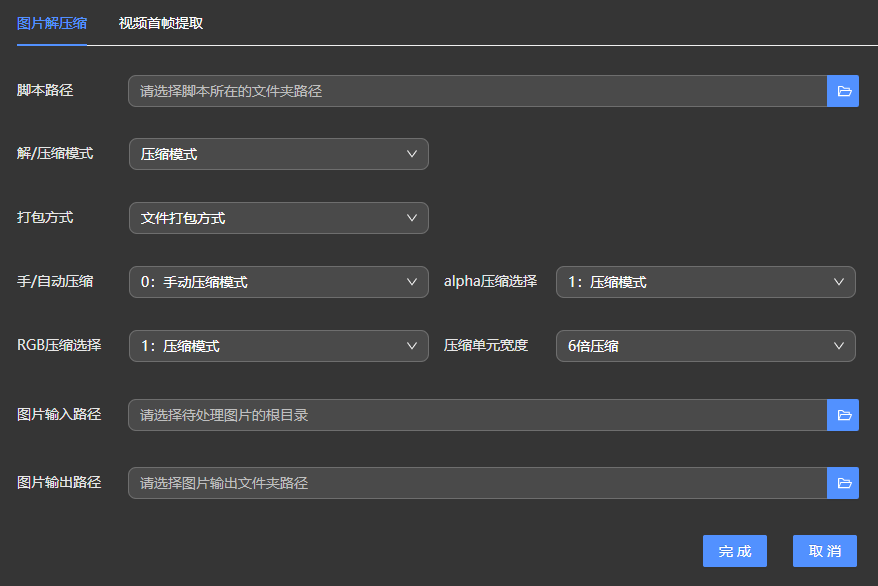

-   脚本路径：需选择“images\_convert.py”脚本所在的文件夹路径，一般为“tools\\DebugKits\\graphic\_tools\\image\_converter\_tool”。
-   解/压缩模式：指定解压、压缩模式，默认选择压缩模式。
-   打包方式：分为文件打包方式和文件夹打包方式，默认选择文件打包方式
    -   文件打包方式：以每个图片为单位进行打包。
    -   文件夹打包方式：将图片进行打包后，再以子文件夹为单位将其包含的已打包过的图片在一起打包。

-   手/自动压缩：默认为手动压缩模式。
    -   1：自动压缩模式，对压缩文件进行4倍、6倍、8倍、16倍压缩。
    -   0：手动压缩模式，按照配置文件的配置参数进行压缩。

-   alpha压缩模式：0：非压缩；1：压缩。默认为1：压缩模式。
-   rgb压缩模式。0：非压缩；1：压缩。默认为1：压缩模式。
-   压缩单元宽度。4--4x4；6--6x4；8--8x4；16--16x4，也叫压缩倍率在ARGB8888格式时分别对应4倍压缩，6倍压缩，8倍压缩，16倍压缩；在RGB888时分别对应3倍压缩，4.5倍压缩，6倍压缩，12倍压缩；在RGB565时分别对应2倍压缩，3倍压缩，4倍压缩，8倍压缩。默认为6倍压缩。
-   图片输入路径：指定待处理图片的根目录，图片目录下的图片可以为“.jpg、.png、.bmp”等格式。
-   图片输出路径：指定输出的文件夹。

> **须知：** 
>-   图片压缩仅支持.png、.bmp、.jpg（文件后缀不能为大写）文件的压缩，且图片分辨率大小不能超过1280\*800（宽\*高）。
>-   子文件夹名以及文件名必须为数字以及字母的组合。
>-   解/压缩模式选择为解压模式时，手/自动压缩、alpha压缩模式、rgb压缩模式和压缩单元宽度选项隐藏。
>-   alpha和rgb同时为0是非压缩模式请注意适配。
>-   当rgb压缩模式为0时，alpha的压缩模式不能设置为1。
>-   压缩倍率是与裸数据大小进行对比，而非与源文件大小对比，例如466×466的RGBA图片，无压缩大小为848KB，6倍压缩时为142KB，16倍压缩时大约为54KB。
>-   压缩操作为有损压缩，压缩倍率越大，图损越大。

**压缩模式样例**

**图 2**  图片压缩具体选择样例  
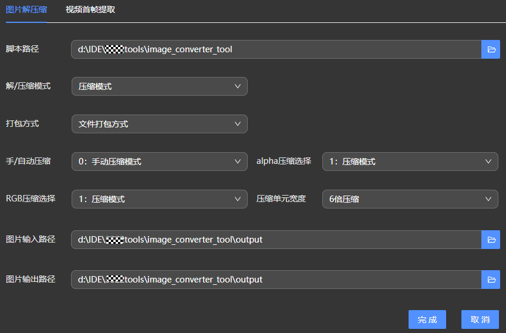

各选项均选择后，点击完成，执行压缩功能，终端界面输显示内容如下：

**图 3**  图片压缩执行时终端界面输出  
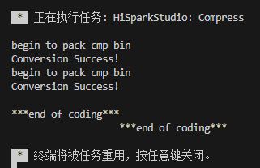

“Conversion Success!”说明压缩成功。图片所在文件夹前后对比如下，成功将两张png格式图片转换成bin文件格式：

**图 4**  图片压缩前后效果展示  
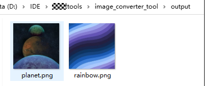

**解压模式样例**

将解/压缩模式选择为解压模式，手/自动压缩、alpha压缩模式、rgb压缩模式和压缩单元宽度选项隐藏。

**图 5**  图片解压具体选择样例  

各选项均选择后，点击完成，执行解压功能，终端界面输显示内容如下：

**图 6**  图片解压执行时终端界面输出  
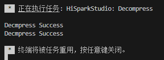

“Decmpress Success”说明解压成功。图片所在文件夹前后对比如下，成功将两张bin格式图片解压为png文件格式：

**图 7**  图片解压前后对比  

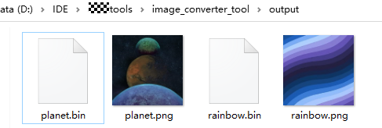

### 视频首帧提取工具

视频在未加载前，首帧为黑帧，需要用户手动设置一张起始预览图，该功能提供提取视频首帧并将其转换为BMP格式图片的能力。

**图 1**  视频首帧提取工具页面  
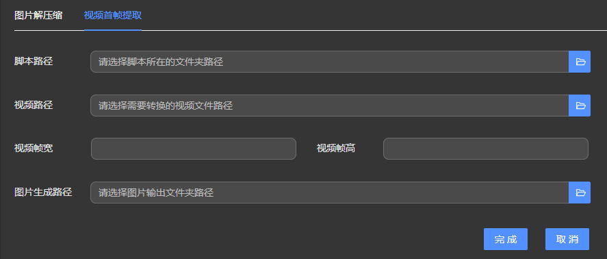

-   脚本路径：需选择“convert\_2\_bmp.py”脚本所在的文件夹路径，一般为“tools\\DebugKits\\graphic\_tools\\convert\_2\_bmp”。
-   视频路径：需要提取的视频文件路径。
-   视频帧宽/视频帧高：指定视频帧的宽高，需要与视频资源一致，且需要用户手动输入。
-   图片生成路径：图片生成路径。

> **注意：** 
>-   视频格式当前仅支持YUV444和YUV420这两种
>-   视频仅支持MJPEG编码及.mp4封装，调整视频格式及大小可借助ffmpeg工具， 例："ffmpeg -i video.mp4 -vf crop=454:454 -b:v 4228k -vcodec mjpeg out.mp4"。
>-   视频帧宽/高可以在视频的属性--\>详细信息中查看。如果视频帧宽高与实际不一致，生成的图片会产生花屏。

视频首帧提取样例：

**图 2**  视频首帧提取具体选项样例  
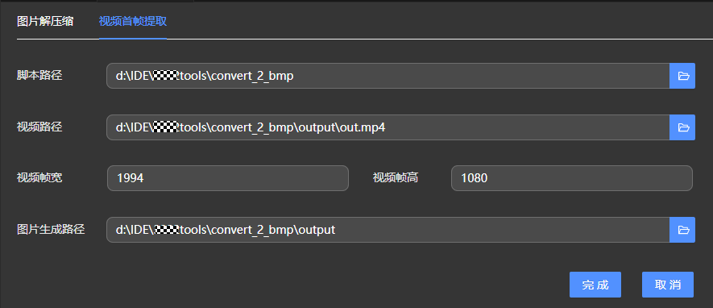

各选项均选择后，点击完成，执行视频首帧提取功能，终端界面输显示内容如下：

**图 3**  视频首帧提取执行时终端界面输出  
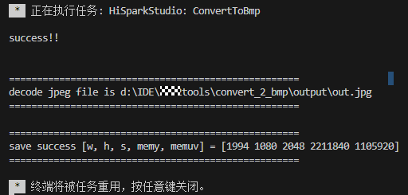

“success”说明提取成功。视频所在文件夹前后对比如下，成功将mp4格式的适配的首帧提取出来并且保存为bmp格式的图片：

**图 4**  适配转换前后对比  
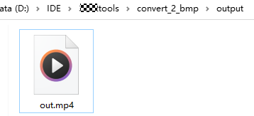

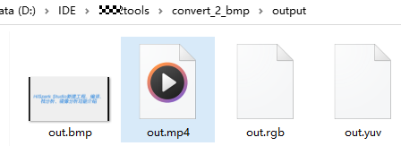

### 3D建模工具

#### 使用方法

**运行**

点击COMMANDS里面的Modeling Tools，在上方选择“3D Modeling Tool”。

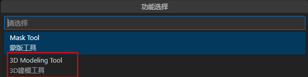

**界面介绍**

-   **工具启动主界面**

    启动后工具主界面如图所示：

    **图 1**  3D建模工具启动主界面  
    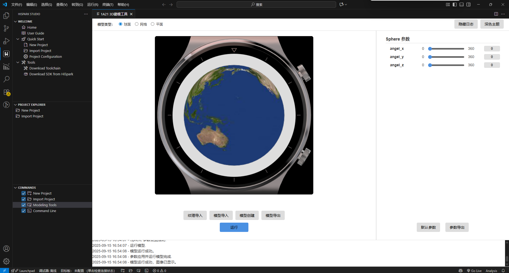

    按钮功能介绍如下：

    -   模型类型：选择当前要使用的模型（球面：sphere；网格：mesh；平面：cylinder），会自动加载默认参数并运行。
    -   纹理导入：选择纹理素材文件。
    -   模型导入：选择模型文件。
    -   模型创建：打开子界面，进行模型参数配置并生成模型。
    -   模型导出：将工具中对应模式下生成的模型文件导出到本地。
    -   运行：运行对应模式下的用例并显示运行效果。
    -   默认参数：一键恢复所有参数到其默认值。
    -   参数导出：根据当前界面配置的模式，调整参数，获得理想效果后，可将该模式下的该组参数保存到一个文件中。
    -   显示日志/隐藏日志：打开/关闭下方的日志框。

-   **模型创建界面**

    ①mesh界面：模型选择选中网格后点击模型创建后弹出如图所示界面：

    **图 2**  mesh界面  
    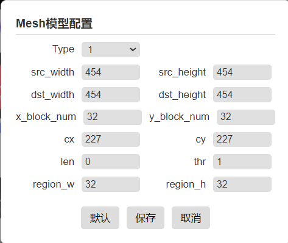

    ②cylinder界面，模型选择选中平面后点击模型创建后弹出如图所示界面：

    **图 3**  cylinder界面  
    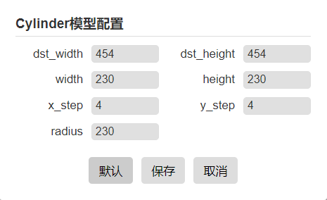

    ③sphere界面，模型选择选中球面后点击模型创建后弹出如图所示界面：

    **图 4**  sphere界面  
    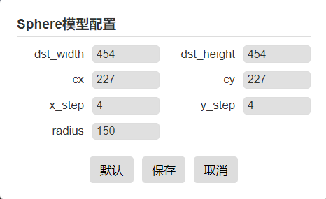

    点击保存按钮保存配置值，当点击完保存后，子窗体自动关闭。

**操作步骤**

-   **mesh模式：**

    mesh分为7种子模式，其中type0和type6属于强交互模式，模型在线生成，无需离线生成和载入；type1～type5属于弱交互模式，运行用例之前需要离线生成模型或者载入模型，二者选一即可。

    1.  点击主界面网格单选按钮，选中网格模式。
    2.  点击主界面模型创建按钮，进行模型参数设置。
    3.  点击type输入框进行子模式选择，并进行相关参数配置：

        type0：thr建议配置为1.0，len建议配置为5，cx、cy建议配置在非中心点位置，其它参数建议保持默认值

        type1：len建议配置为0.0，cx、cy只支持配置在中心点，其他参数建议保持默认值

        type2：len建议配置为4.52，cx、cy只支持配置在中心点，其他参数建议保持默认值

        type3：len建议配置为1，cx、cy只支持配置在中心点，其他参数建议保持默认值

        type4：len建议配置为3，cx、cy只支持配置在中心点，其他参数建议保持默认值

        type5：len建议配置为9.33，cx、cy只支持配置在中心点，其他参数建议保持默认值

        type6：thr建议配置为0.1，其他参数建议保持默认值

    4.  点击保存按钮保存，并返回主界面。
    5.  点击主界面纹理导入按钮选择纹理素材。
    6.  点击运行按钮。
    7.  拖动右侧mesh\_ctrl滑块，观察效果。

-   **cylinder模式：**
    1.  点击主界面平面单选按钮，选中cylinder模式。
    2.  点击主界面模型创建按钮，进行模型参数设置，建议使用默认值。
    3.  点击保存按钮保存，并返回主界面。
    4.  点击纹理导入按钮选择纹理素材。
    5.  点击运行按钮。
    6.  拖动右侧cylinder\_ctrl滑块（主要滑动的是cylinder\_ctl），观察效果。

-   **sphere模式：**
    1.  点击主界面球面单选按钮，选中sphere模式
    2.  点击主界面模型创建按钮，进行模型参数设置，建议使用默认值
    3.  点击保存按钮保存，并返回主界面
    4.  点击纹理导入按钮选择纹理素材
    5.  点击运行按钮
    6.  拖动右侧angel\_x、angel\_y、angel\_z三个滑块，观察效果。

**素材默认路径**

> **须知：** 
>以下路径不能删除，否则会导致程序运行错误。

-   默认纹理素材路径：C:/Users/$\{用户名\}/.vscode/extensions/hispark.hisparkstudio-$\{版本号\}/dist/source\_file/texture/

-   默认模型素材路径：C:/Users/$\{用户名\}/.vscode/extensions/hispark.hisparkstudio-$\{版本号\}/dist/source\_file/model/，即模型创建完成之后的默认保存路径
-   默认蒙版素材路径：C:/Users/$\{用户名\}/.vscode/extensions/hispark.hisparkstudio-$\{版本号\}/dist/source\_file/mask/，此路径仅供sphere模式使用，目的是使纹理与模型叠加时在连接处能够保持平滑过渡；生成的球蒙版宽高要和dst\_width/dst\_height 一致，且球蒙版为ARGB8888。
-   其中$\{用户名\}为当前Windows登录账号用户名，$\{版本号\}为本插件版本号。

#### 参数表

**滚筒日历**

**表 1**  滚筒日历模型参数

<table><thead align="left"><tr id="row2587354183315"><th class="cellrowborder" valign="top" width="12.98%" id="mcps1.2.5.1.1">
序号

</th>
<th class="cellrowborder" valign="top" width="24.2%" id="mcps1.2.5.1.2">
参数名

</th>
<th class="cellrowborder" valign="top" width="26.3%" id="mcps1.2.5.1.3">
参数含义

</th>
<th class="cellrowborder" valign="top" width="36.52%" id="mcps1.2.5.1.4">
范围&amp;demo参数

</th>
</tr>
</thead>
<tbody><tr id="row12587205417331"><td class="cellrowborder" valign="top" width="12.98%" headers="mcps1.2.5.1.1 ">
1

</td>
<td class="cellrowborder" valign="top" width="24.2%" headers="mcps1.2.5.1.2 ">
dst_width

</td>
<td class="cellrowborder" valign="top" width="26.3%" headers="mcps1.2.5.1.3 ">
屏幕的宽

</td>
<td class="cellrowborder" valign="top" width="36.52%" headers="mcps1.2.5.1.4 ">
-

</td>
</tr>
<tr id="row1758785413339"><td class="cellrowborder" valign="top" width="12.98%" headers="mcps1.2.5.1.1 ">
2

</td>
<td class="cellrowborder" valign="top" width="24.2%" headers="mcps1.2.5.1.2 ">
dst_height

</td>
<td class="cellrowborder" valign="top" width="26.3%" headers="mcps1.2.5.1.3 ">
屏幕的高

</td>
<td class="cellrowborder" valign="top" width="36.52%" headers="mcps1.2.5.1.4 ">
-

</td>
</tr>
<tr id="row3587105412330"><td class="cellrowborder" valign="top" width="12.98%" headers="mcps1.2.5.1.1 ">
3

</td>
<td class="cellrowborder" valign="top" width="24.2%" headers="mcps1.2.5.1.2 ">
cylinder_radius

</td>
<td class="cellrowborder" valign="top" width="26.3%" headers="mcps1.2.5.1.3 ">
圆柱体半径

</td>
<td class="cellrowborder" valign="top" width="36.52%" headers="mcps1.2.5.1.4 ">
(0,cylinder_dst_width]; 230

</td>
</tr>
<tr id="row1858865413338"><td class="cellrowborder" valign="top" width="12.98%" headers="mcps1.2.5.1.1 ">
4

</td>
<td class="cellrowborder" valign="top" width="24.2%" headers="mcps1.2.5.1.2 ">
cylinder_width

</td>
<td class="cellrowborder" valign="top" width="26.3%" headers="mcps1.2.5.1.3 ">
圆柱体宽

</td>
<td class="cellrowborder" valign="top" width="36.52%" headers="mcps1.2.5.1.4 ">
(0,cylinder_dst_height]; 230

</td>
</tr>
<tr id="row8588654143319"><td class="cellrowborder" valign="top" width="12.98%" headers="mcps1.2.5.1.1 ">
5

</td>
<td class="cellrowborder" valign="top" width="24.2%" headers="mcps1.2.5.1.2 ">
cylinder_height

</td>
<td class="cellrowborder" valign="top" width="26.3%" headers="mcps1.2.5.1.3 ">
圆柱体高

</td>
<td class="cellrowborder" valign="top" width="36.52%" headers="mcps1.2.5.1.4 ">
(0,cylinder_dst_height]; 230

</td>
</tr>
<tr id="row65881054173318"><td class="cellrowborder" valign="top" width="12.98%" headers="mcps1.2.5.1.1 ">
6

</td>
<td class="cellrowborder" valign="top" width="24.2%" headers="mcps1.2.5.1.2 ">
cylinder_x_step

</td>
<td class="cellrowborder" valign="top" width="26.3%" headers="mcps1.2.5.1.3 ">
模型x方向采样步长

</td>
<td class="cellrowborder" valign="top" width="36.52%" headers="mcps1.2.5.1.4 ">
[4 ,8];4

</td>
</tr>
<tr id="row8588135415332"><td class="cellrowborder" valign="top" width="12.98%" headers="mcps1.2.5.1.1 ">
7

</td>
<td class="cellrowborder" valign="top" width="24.2%" headers="mcps1.2.5.1.2 ">
cylinder_y_step

</td>
<td class="cellrowborder" valign="top" width="26.3%" headers="mcps1.2.5.1.3 ">
模型y方向采样步长

</td>
<td class="cellrowborder" valign="top" width="36.52%" headers="mcps1.2.5.1.4 ">
[4 , 8];4

</td>
</tr>
</tbody>
</table>

> **说明：** 
>-   cylinder\_x\_step：逻辑约束cylinder\_dst\_width / cylinder\_x\_step
>-   cylinder\_y\_step：逻辑约束cylinder\_dst\_height /cylinder\_y\_step
>注意：对于cylinder模式的素材，建议宽为屏幕的1/2，高至少为2048。

**表 2**  滚筒日历demo参数

<table><thead align="left"><tr id="row185881054183311"><th class="cellrowborder" valign="top" width="14.41%" id="mcps1.2.5.1.1">
序号

</th>
<th class="cellrowborder" valign="top" width="23.16%" id="mcps1.2.5.1.2">
参数名

</th>
<th class="cellrowborder" valign="top" width="26.040000000000003%" id="mcps1.2.5.1.3">
参数含义

</th>
<th class="cellrowborder" valign="top" width="36.39%" id="mcps1.2.5.1.4">
范围&amp;demo参数

</th>
</tr>
</thead>
<tbody><tr id="row16588205417333"><td class="cellrowborder" valign="top" width="14.41%" headers="mcps1.2.5.1.1 ">
1

</td>
<td class="cellrowborder" valign="top" width="23.16%" headers="mcps1.2.5.1.2 ">
angle

</td>
<td class="cellrowborder" valign="top" width="26.040000000000003%" headers="mcps1.2.5.1.3 ">
旋转角度

</td>
<td class="cellrowborder" valign="top" width="36.39%" headers="mcps1.2.5.1.4 ">
[0,360]； 0

</td>
</tr>
<tr id="row8588654173319"><td class="cellrowborder" valign="top" width="14.41%" headers="mcps1.2.5.1.1 ">
2

</td>
<td class="cellrowborder" valign="top" width="23.16%" headers="mcps1.2.5.1.2 ">
v_fov

</td>
<td class="cellrowborder" valign="top" width="26.040000000000003%" headers="mcps1.2.5.1.3 ">
视口

</td>
<td class="cellrowborder" valign="top" width="36.39%" headers="mcps1.2.5.1.4 ">
[0,180]； 0

</td>
</tr>
<tr id="row15588125419334"><td class="cellrowborder" valign="top" width="14.41%" headers="mcps1.2.5.1.1 ">
3

</td>
<td class="cellrowborder" valign="top" width="23.16%" headers="mcps1.2.5.1.2 ">
aspect_ratio

</td>
<td class="cellrowborder" valign="top" width="26.040000000000003%" headers="mcps1.2.5.1.3 ">
屏幕长宽比

</td>
<td class="cellrowborder" valign="top" width="36.39%" headers="mcps1.2.5.1.4 ">
aspect_ratio (0,1]； 1

</td>
</tr>
<tr id="row12589854183313"><td class="cellrowborder" valign="top" width="14.41%" headers="mcps1.2.5.1.1 ">
4

</td>
<td class="cellrowborder" valign="top" width="23.16%" headers="mcps1.2.5.1.2 ">
z_near

</td>
<td class="cellrowborder" valign="top" width="26.040000000000003%" headers="mcps1.2.5.1.3 ">
近平面

</td>
<td class="cellrowborder" valign="top" width="36.39%" headers="mcps1.2.5.1.4 ">
z_near [0,10]； 0

</td>
</tr>
<tr id="row75891854203313"><td class="cellrowborder" valign="top" width="14.41%" headers="mcps1.2.5.1.1 ">
5

</td>
<td class="cellrowborder" valign="top" width="23.16%" headers="mcps1.2.5.1.2 ">
z_far

</td>
<td class="cellrowborder" valign="top" width="26.040000000000003%" headers="mcps1.2.5.1.3 ">
远平面

</td>
<td class="cellrowborder" valign="top" width="36.39%" headers="mcps1.2.5.1.4 ">
z_far [0,10]； 0

</td>
</tr>
<tr id="row14589205453312"><td class="cellrowborder" valign="top" width="14.41%" headers="mcps1.2.5.1.1 ">
6

</td>
<td class="cellrowborder" valign="top" width="23.16%" headers="mcps1.2.5.1.2 ">
axis_x

</td>
<td class="cellrowborder" valign="top" width="26.040000000000003%" headers="mcps1.2.5.1.3 ">
三维空间的旋转轴x

</td>
<td class="cellrowborder" valign="top" width="36.39%" headers="mcps1.2.5.1.4 ">
[-180,180]； 0

</td>
</tr>
<tr id="row2589135433312"><td class="cellrowborder" valign="top" width="14.41%" headers="mcps1.2.5.1.1 ">
7

</td>
<td class="cellrowborder" valign="top" width="23.16%" headers="mcps1.2.5.1.2 ">
axis_y

</td>
<td class="cellrowborder" valign="top" width="26.040000000000003%" headers="mcps1.2.5.1.3 ">
三维空间的旋转轴y

</td>
<td class="cellrowborder" valign="top" width="36.39%" headers="mcps1.2.5.1.4 ">
[-180,180]； 0

</td>
</tr>
<tr id="row1158985493315"><td class="cellrowborder" valign="top" width="14.41%" headers="mcps1.2.5.1.1 ">
8

</td>
<td class="cellrowborder" valign="top" width="23.16%" headers="mcps1.2.5.1.2 ">
axis_z

</td>
<td class="cellrowborder" valign="top" width="26.040000000000003%" headers="mcps1.2.5.1.3 ">
三维空间的旋转轴z

</td>
<td class="cellrowborder" valign="top" width="36.39%" headers="mcps1.2.5.1.4 ">
[-180,180]； 0

</td>
</tr>
<tr id="row165892544337"><td class="cellrowborder" valign="top" width="14.41%" headers="mcps1.2.5.1.1 ">
9

</td>
<td class="cellrowborder" valign="top" width="23.16%" headers="mcps1.2.5.1.2 ">
scale_x

</td>
<td class="cellrowborder" valign="top" width="26.040000000000003%" headers="mcps1.2.5.1.3 ">
沿x轴缩放系数

</td>
<td class="cellrowborder" valign="top" width="36.39%" headers="mcps1.2.5.1.4 ">
(0,10]；1

</td>
</tr>
<tr id="row1358917549338"><td class="cellrowborder" valign="top" width="14.41%" headers="mcps1.2.5.1.1 ">
10

</td>
<td class="cellrowborder" valign="top" width="23.16%" headers="mcps1.2.5.1.2 ">
scale_y

</td>
<td class="cellrowborder" valign="top" width="26.040000000000003%" headers="mcps1.2.5.1.3 ">
沿y轴缩放系数

</td>
<td class="cellrowborder" valign="top" width="36.39%" headers="mcps1.2.5.1.4 ">
(0,10]；1

</td>
</tr>
<tr id="row558995412336"><td class="cellrowborder" valign="top" width="14.41%" headers="mcps1.2.5.1.1 ">
11

</td>
<td class="cellrowborder" valign="top" width="23.16%" headers="mcps1.2.5.1.2 ">
scale_z

</td>
<td class="cellrowborder" valign="top" width="26.040000000000003%" headers="mcps1.2.5.1.3 ">
沿z轴缩放系数

</td>
<td class="cellrowborder" valign="top" width="36.39%" headers="mcps1.2.5.1.4 ">
(0,10]；1

</td>
</tr>
<tr id="row0590054193316"><td class="cellrowborder" valign="top" width="14.41%" headers="mcps1.2.5.1.1 ">
12

</td>
<td class="cellrowborder" valign="top" width="23.16%" headers="mcps1.2.5.1.2 ">
translation_x

</td>
<td class="cellrowborder" valign="top" width="26.040000000000003%" headers="mcps1.2.5.1.3 ">
沿x轴平移系数

</td>
<td class="cellrowborder" valign="top" width="36.39%" headers="mcps1.2.5.1.4 ">
[-cylinder_width, cylinder_width ];-230

</td>
</tr>
<tr id="row19590115412339"><td class="cellrowborder" valign="top" width="14.41%" headers="mcps1.2.5.1.1 ">
13

</td>
<td class="cellrowborder" valign="top" width="23.16%" headers="mcps1.2.5.1.2 ">
translation_y

</td>
<td class="cellrowborder" valign="top" width="26.040000000000003%" headers="mcps1.2.5.1.3 ">
沿y轴平移系数

</td>
<td class="cellrowborder" valign="top" width="36.39%" headers="mcps1.2.5.1.4 ">
[-cylinder_width, cylinder_width ];230

</td>
</tr>
<tr id="row0590135493314"><td class="cellrowborder" valign="top" width="14.41%" headers="mcps1.2.5.1.1 ">
14

</td>
<td class="cellrowborder" valign="top" width="23.16%" headers="mcps1.2.5.1.2 ">
translation_z

</td>
<td class="cellrowborder" valign="top" width="26.040000000000003%" headers="mcps1.2.5.1.3 ">
沿z轴平移系数

</td>
<td class="cellrowborder" valign="top" width="36.39%" headers="mcps1.2.5.1.4 ">
[-cylinder_radius,cylinder_radius]，500

</td>
</tr>
<tr id="row20590185463311"><td class="cellrowborder" valign="top" width="14.41%" headers="mcps1.2.5.1.1 ">
15

</td>
<td class="cellrowborder" valign="top" width="23.16%" headers="mcps1.2.5.1.2 ">
look_from_x

</td>
<td class="cellrowborder" valign="top" width="26.040000000000003%" headers="mcps1.2.5.1.3 ">
camera位置x轴的坐标

</td>
<td class="cellrowborder" valign="top" width="36.39%" headers="mcps1.2.5.1.4 ">
[-cylinder_radius, cylinder_radius]，-500

</td>
</tr>
<tr id="row12590115473311"><td class="cellrowborder" valign="top" width="14.41%" headers="mcps1.2.5.1.1 ">
16

</td>
<td class="cellrowborder" valign="top" width="23.16%" headers="mcps1.2.5.1.2 ">
look_from_y

</td>
<td class="cellrowborder" valign="top" width="26.040000000000003%" headers="mcps1.2.5.1.3 ">
camera位置y轴的坐标

</td>
<td class="cellrowborder" valign="top" width="36.39%" headers="mcps1.2.5.1.4 ">
(-1000,1000)，-400

</td>
</tr>
<tr id="row115901954113311"><td class="cellrowborder" valign="top" width="14.41%" headers="mcps1.2.5.1.1 ">
17

</td>
<td class="cellrowborder" valign="top" width="23.16%" headers="mcps1.2.5.1.2 ">
look_from_z

</td>
<td class="cellrowborder" valign="top" width="26.040000000000003%" headers="mcps1.2.5.1.3 ">
camera位置z轴坐标

</td>
<td class="cellrowborder" valign="top" width="36.39%" headers="mcps1.2.5.1.4 ">
(-1000, 1000)，200

</td>
</tr>
</tbody>
</table>

**月相星球表盘**

**表 3**  月相星球表盘模型参数

<table><thead align="left"><tr id="row115901354193313"><th class="cellrowborder" valign="top" width="14.149999999999999%" id="mcps1.2.5.1.1">
序号

</th>
<th class="cellrowborder" valign="top" width="22.64%" id="mcps1.2.5.1.2">
参数名

</th>
<th class="cellrowborder" valign="top" width="26.56%" id="mcps1.2.5.1.3">
参数含义

</th>
<th class="cellrowborder" valign="top" width="36.65%" id="mcps1.2.5.1.4">
范围&amp; demo参数

</th>
</tr>
</thead>
<tbody><tr id="row559015413316"><td class="cellrowborder" valign="top" width="14.149999999999999%" headers="mcps1.2.5.1.1 ">
1

</td>
<td class="cellrowborder" valign="top" width="22.64%" headers="mcps1.2.5.1.2 ">
dst_width

</td>
<td class="cellrowborder" valign="top" width="26.56%" headers="mcps1.2.5.1.3 ">
屏幕的宽

</td>
<td class="cellrowborder" valign="top" width="36.65%" headers="mcps1.2.5.1.4 ">
-

</td>
</tr>
<tr id="row1759114541331"><td class="cellrowborder" valign="top" width="14.149999999999999%" headers="mcps1.2.5.1.1 ">
2

</td>
<td class="cellrowborder" valign="top" width="22.64%" headers="mcps1.2.5.1.2 ">
dst_height

</td>
<td class="cellrowborder" valign="top" width="26.56%" headers="mcps1.2.5.1.3 ">
屏幕的高

</td>
<td class="cellrowborder" valign="top" width="36.65%" headers="mcps1.2.5.1.4 ">
-

</td>
</tr>
<tr id="row759115413320"><td class="cellrowborder" valign="top" width="14.149999999999999%" headers="mcps1.2.5.1.1 ">
3

</td>
<td class="cellrowborder" valign="top" width="22.64%" headers="mcps1.2.5.1.2 ">
sphere_radius

</td>
<td class="cellrowborder" valign="top" width="26.56%" headers="mcps1.2.5.1.3 ">
球半径

</td>
<td class="cellrowborder" valign="top" width="36.65%" headers="mcps1.2.5.1.4 ">
(0, +∞) ；150

</td>
</tr>
<tr id="row1591254163317"><td class="cellrowborder" valign="top" width="14.149999999999999%" headers="mcps1.2.5.1.1 ">
4

</td>
<td class="cellrowborder" valign="top" width="22.64%" headers="mcps1.2.5.1.2 ">
sphere_cx

</td>
<td class="cellrowborder" valign="top" width="26.56%" headers="mcps1.2.5.1.3 ">
球心x坐标

</td>
<td class="cellrowborder" valign="top" width="36.65%" headers="mcps1.2.5.1.4 ">
(0, +∞) ；dst_surface中心

</td>
</tr>
<tr id="row155914542335"><td class="cellrowborder" valign="top" width="14.149999999999999%" headers="mcps1.2.5.1.1 ">
5

</td>
<td class="cellrowborder" valign="top" width="22.64%" headers="mcps1.2.5.1.2 ">
sphere_cy

</td>
<td class="cellrowborder" valign="top" width="26.56%" headers="mcps1.2.5.1.3 ">
球心y坐标

</td>
<td class="cellrowborder" valign="top" width="36.65%" headers="mcps1.2.5.1.4 ">
(0, +∞) ；dst_surface中心

</td>
</tr>
<tr id="row1259113549337"><td class="cellrowborder" valign="top" width="14.149999999999999%" headers="mcps1.2.5.1.1 ">
6

</td>
<td class="cellrowborder" valign="top" width="22.64%" headers="mcps1.2.5.1.2 ">
sphere_step_x

</td>
<td class="cellrowborder" valign="top" width="26.56%" headers="mcps1.2.5.1.3 ">
模型x方向采样步长

</td>
<td class="cellrowborder" valign="top" width="36.65%" headers="mcps1.2.5.1.4 ">
[4, 8];4；

</td>
</tr>
<tr id="row19591354173315"><td class="cellrowborder" valign="top" width="14.149999999999999%" headers="mcps1.2.5.1.1 ">
7

</td>
<td class="cellrowborder" valign="top" width="22.64%" headers="mcps1.2.5.1.2 ">
sphrere_step_y

</td>
<td class="cellrowborder" valign="top" width="26.56%" headers="mcps1.2.5.1.3 ">
模型y方向采样步长

</td>
<td class="cellrowborder" valign="top" width="36.65%" headers="mcps1.2.5.1.4 ">
[4, 8];4；

</td>
</tr>
</tbody>
</table>

> **说明：** 
>-   sphere\_step\_x：逻辑约束dst\_height / sphere\_step\_x< 128
>-   sphere\_step\_y：逻辑约束dst\_width / sphere\_step\_y < 128

**表 4**  月相星球表盘demo参数

<table><thead align="left"><tr id="row4591454193316"><th class="cellrowborder" valign="top" width="14.799999999999999%" id="mcps1.2.5.1.1">
序号

</th>
<th class="cellrowborder" valign="top" width="24.34%" id="mcps1.2.5.1.2">
参数名

</th>
<th class="cellrowborder" valign="top" width="26.169999999999998%" id="mcps1.2.5.1.3">
参数含义

</th>
<th class="cellrowborder" valign="top" width="34.69%" id="mcps1.2.5.1.4">
范围&amp;demo值

</th>
</tr>
</thead>
<tbody><tr id="row11591554153319"><td class="cellrowborder" valign="top" width="14.799999999999999%" headers="mcps1.2.5.1.1 ">
1

</td>
<td class="cellrowborder" valign="top" width="24.34%" headers="mcps1.2.5.1.2 ">
sphere_angle_x

</td>
<td class="cellrowborder" valign="top" width="26.169999999999998%" headers="mcps1.2.5.1.3 ">
沿x旋转角度

</td>
<td class="cellrowborder" valign="top" width="34.69%" headers="mcps1.2.5.1.4 ">
[0,360];0

</td>
</tr>
<tr id="row15592854163311"><td class="cellrowborder" valign="top" width="14.799999999999999%" headers="mcps1.2.5.1.1 ">
2

</td>
<td class="cellrowborder" valign="top" width="24.34%" headers="mcps1.2.5.1.2 ">
sphere_angle_y

</td>
<td class="cellrowborder" valign="top" width="26.169999999999998%" headers="mcps1.2.5.1.3 ">
沿y轴旋转角度

</td>
<td class="cellrowborder" valign="top" width="34.69%" headers="mcps1.2.5.1.4 ">
[0,360];0

</td>
</tr>
<tr id="row1659245411332"><td class="cellrowborder" valign="top" width="14.799999999999999%" headers="mcps1.2.5.1.1 ">
3

</td>
<td class="cellrowborder" valign="top" width="24.34%" headers="mcps1.2.5.1.2 ">
sphere_angle_z

</td>
<td class="cellrowborder" valign="top" width="26.169999999999998%" headers="mcps1.2.5.1.3 ">
沿z轴旋转角度

</td>
<td class="cellrowborder" valign="top" width="34.69%" headers="mcps1.2.5.1.4 ">
[0,360];0

</td>
</tr>
</tbody>
</table>

**MESH表盘互动**

**表 5**  MESH表盘互动模型参数

<table><thead align="left"><tr id="row105922547330"><th class="cellrowborder" valign="top" width="15.45%" id="mcps1.2.5.1.1">
序号

</th>
<th class="cellrowborder" valign="top" width="24.6%" id="mcps1.2.5.1.2">
参数名

</th>
<th class="cellrowborder" valign="top" width="25.650000000000002%" id="mcps1.2.5.1.3">
参数含义

</th>
<th class="cellrowborder" valign="top" width="34.300000000000004%" id="mcps1.2.5.1.4">
范围&amp;demo值

</th>
</tr>
</thead>
<tbody><tr id="row1459285463317"><td class="cellrowborder" valign="top" width="15.45%" headers="mcps1.2.5.1.1 ">
1

</td>
<td class="cellrowborder" valign="top" width="24.6%" headers="mcps1.2.5.1.2 ">
src_width

</td>
<td class="cellrowborder" valign="top" width="25.650000000000002%" headers="mcps1.2.5.1.3 ">
素材的宽

</td>
<td class="cellrowborder" valign="top" width="34.300000000000004%" headers="mcps1.2.5.1.4 ">
建议与屏幕的宽保持一致

</td>
</tr>
<tr id="row95923541336"><td class="cellrowborder" valign="top" width="15.45%" headers="mcps1.2.5.1.1 ">
2

</td>
<td class="cellrowborder" valign="top" width="24.6%" headers="mcps1.2.5.1.2 ">
src_height

</td>
<td class="cellrowborder" valign="top" width="25.650000000000002%" headers="mcps1.2.5.1.3 ">
素材的高

</td>
<td class="cellrowborder" valign="top" width="34.300000000000004%" headers="mcps1.2.5.1.4 ">
建议与屏幕的高保持一致

</td>
</tr>
<tr id="row16592115411335"><td class="cellrowborder" valign="top" width="15.45%" headers="mcps1.2.5.1.1 ">
3

</td>
<td class="cellrowborder" valign="top" width="24.6%" headers="mcps1.2.5.1.2 ">
dst_width

</td>
<td class="cellrowborder" valign="top" width="25.650000000000002%" headers="mcps1.2.5.1.3 ">
屏幕的宽

</td>
<td class="cellrowborder" valign="top" width="34.300000000000004%" headers="mcps1.2.5.1.4 ">
-

</td>
</tr>
<tr id="row6593954203313"><td class="cellrowborder" valign="top" width="15.45%" headers="mcps1.2.5.1.1 ">
4

</td>
<td class="cellrowborder" valign="top" width="24.6%" headers="mcps1.2.5.1.2 ">
dst_heigth

</td>
<td class="cellrowborder" valign="top" width="25.650000000000002%" headers="mcps1.2.5.1.3 ">
屏幕的高

</td>
<td class="cellrowborder" valign="top" width="34.300000000000004%" headers="mcps1.2.5.1.4 ">
-

</td>
</tr>
<tr id="row159355410334"><td class="cellrowborder" valign="top" width="15.45%" headers="mcps1.2.5.1.1 ">
5

</td>
<td class="cellrowborder" valign="top" width="24.6%" headers="mcps1.2.5.1.2 ">
mesh_x_block_num

</td>
<td class="cellrowborder" valign="top" width="25.650000000000002%" headers="mcps1.2.5.1.3 ">
水平方向划分块数量

</td>
<td class="cellrowborder" valign="top" width="34.300000000000004%" headers="mcps1.2.5.1.4 ">
(0,32];32

</td>
</tr>
<tr id="row19593115453312"><td class="cellrowborder" valign="top" width="15.45%" headers="mcps1.2.5.1.1 ">
6

</td>
<td class="cellrowborder" valign="top" width="24.6%" headers="mcps1.2.5.1.2 ">
mesh_y_block_num

</td>
<td class="cellrowborder" valign="top" width="25.650000000000002%" headers="mcps1.2.5.1.3 ">
垂直方向划分块数量

</td>
<td class="cellrowborder" valign="top" width="34.300000000000004%" headers="mcps1.2.5.1.4 ">
(0,32];32

</td>
</tr>
<tr id="row1259314540335"><td class="cellrowborder" valign="top" width="15.45%" headers="mcps1.2.5.1.1 ">
7

</td>
<td class="cellrowborder" valign="top" width="24.6%" headers="mcps1.2.5.1.2 ">
mesh_cx

</td>
<td class="cellrowborder" valign="top" width="25.650000000000002%" headers="mcps1.2.5.1.3 ">
形变中心点x坐标

</td>
<td class="cellrowborder" valign="top" width="34.300000000000004%" headers="mcps1.2.5.1.4 ">
弱互动：mesh_dst_width / 2

强互动建议在[0,mesh_dst_width)

</td>
</tr>
<tr id="row1259335414335"><td class="cellrowborder" valign="top" width="15.45%" headers="mcps1.2.5.1.1 ">
8

</td>
<td class="cellrowborder" valign="top" width="24.6%" headers="mcps1.2.5.1.2 ">
mesh_cy

</td>
<td class="cellrowborder" valign="top" width="25.650000000000002%" headers="mcps1.2.5.1.3 ">
形变中心点y坐标

</td>
<td class="cellrowborder" valign="top" width="34.300000000000004%" headers="mcps1.2.5.1.4 ">
弱互动：mesh_dst_height / 2

强互动建议在[0,mesh_dst_height)

</td>
</tr>
<tr id="row15593454133310"><td class="cellrowborder" valign="top" width="15.45%" headers="mcps1.2.5.1.1 ">
9

</td>
<td class="cellrowborder" valign="top" width="24.6%" headers="mcps1.2.5.1.2 ">
mesh_len

</td>
<td class="cellrowborder" valign="top" width="25.650000000000002%" headers="mcps1.2.5.1.3 ">
形变程度

</td>
<td class="cellrowborder" valign="top" width="34.300000000000004%" headers="mcps1.2.5.1.4 ">
[0,10]；

</td>
</tr>
<tr id="row359315547335"><td class="cellrowborder" valign="top" width="15.45%" headers="mcps1.2.5.1.1 ">
10

</td>
<td class="cellrowborder" valign="top" width="24.6%" headers="mcps1.2.5.1.2 ">
mesh_thr

</td>
<td class="cellrowborder" valign="top" width="25.650000000000002%" headers="mcps1.2.5.1.3 ">
形变阈值

</td>
<td class="cellrowborder" valign="top" width="34.300000000000004%" headers="mcps1.2.5.1.4 ">
[0,10]；

</td>
</tr>
<tr id="row12593175413336"><td class="cellrowborder" valign="top" width="15.45%" headers="mcps1.2.5.1.1 ">
11

</td>
<td class="cellrowborder" valign="top" width="24.6%" headers="mcps1.2.5.1.2 ">
mesh_type

</td>
<td class="cellrowborder" valign="top" width="25.650000000000002%" headers="mcps1.2.5.1.3 ">
mesh模型类别

</td>
<td class="cellrowborder" valign="top" width="34.300000000000004%" headers="mcps1.2.5.1.4 ">
支持[0,6]共7种模型，其中type=0/6为强互动模型

</td>
</tr>
<tr id="row2594165413312"><td class="cellrowborder" valign="top" width="15.45%" headers="mcps1.2.5.1.1 ">
12

</td>
<td class="cellrowborder" valign="top" width="24.6%" headers="mcps1.2.5.1.2 ">
region_w

</td>
<td class="cellrowborder" valign="top" width="25.650000000000002%" headers="mcps1.2.5.1.3 ">
动画显示区域宽度

</td>
<td class="cellrowborder" valign="top" width="34.300000000000004%" headers="mcps1.2.5.1.4 ">
[0,32]

</td>
</tr>
<tr id="row9594105453317"><td class="cellrowborder" valign="top" width="15.45%" headers="mcps1.2.5.1.1 ">
13

</td>
<td class="cellrowborder" valign="top" width="24.6%" headers="mcps1.2.5.1.2 ">
region_h

</td>
<td class="cellrowborder" valign="top" width="25.650000000000002%" headers="mcps1.2.5.1.3 ">
动画显示区域高度

</td>
<td class="cellrowborder" valign="top" width="34.300000000000004%" headers="mcps1.2.5.1.4 ">
[0,32]

</td>
</tr>
</tbody>
</table>

> **说明：** 
>-   mesh\_x\_block\_num：逻辑约束mesh\_dst\_width / x\_step < 128， 软算法性能约束不超过32。
>-   mesh\_y\_block\_num：逻辑约束mesh\_dst\_height / y\_step < 128， 软算法性能约束不超过32。
>弱互动：只转动表冠；需要载入模型。
>强互动：支持触屏；不需要载入模型。

**表 6**  MESH表盘互动demo参数

<table><thead align="left"><tr id="row659465413334"><th class="cellrowborder" valign="top" width="18.45%" id="mcps1.2.5.1.1">
序号

</th>
<th class="cellrowborder" valign="top" width="25.119999999999997%" id="mcps1.2.5.1.2">
参数

</th>
<th class="cellrowborder" valign="top" width="31.430000000000003%" id="mcps1.2.5.1.3">
解释

</th>
<th class="cellrowborder" valign="top" width="25%" id="mcps1.2.5.1.4">
范围&amp;demo值

</th>
</tr>
</thead>
<tbody><tr id="row759412543330"><td class="cellrowborder" valign="top" width="18.45%" headers="mcps1.2.5.1.1 ">
1

</td>
<td class="cellrowborder" valign="top" width="25.119999999999997%" headers="mcps1.2.5.1.2 ">
mesh_ctl

</td>
<td class="cellrowborder" valign="top" width="31.430000000000003%" headers="mcps1.2.5.1.3 ">
连续帧控制

</td>
<td class="cellrowborder" valign="top" width="25%" headers="mcps1.2.5.1.4 ">
[0,10];

</td>
</tr>
</tbody>
</table>

### 蒙版工具

蒙版制作工具支持展示/生成圆形、高斯模糊、HSV三种蒙版文件。

#### 使用方法

**运行**

点击COMMANDS里面的Modeling Tools，在上方选择“Mask Tool”。

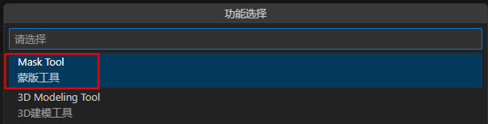

**界面介绍**

启动后工具主界面如图所示：

**图 1**  蒙版工具启动界面  
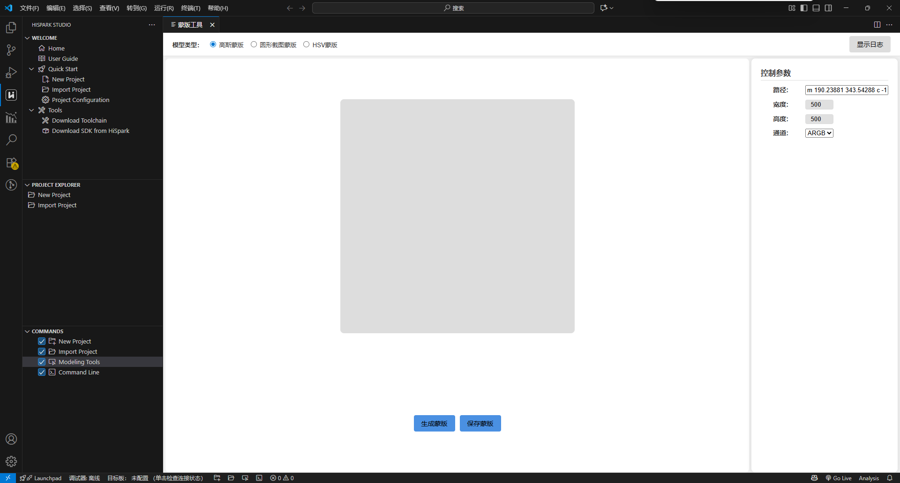

其中按钮功能介绍如下：

-   模型类型：选择当前要使用的模型（高斯蒙版、圆形截图蒙版、HSV蒙版）
-   生成蒙版：在界面左侧区域生成蒙版图片
-   保存蒙版：保存蒙版文件。
-   显示日志/隐藏日志：打开/关闭下方的日志框

**操作步骤**

1.  选择模型类型
2.  修改右侧控制参数（可选）
3.  点击“生成蒙版” 查看效果
4.  点击“保存蒙版”保存蒙版文件

**素材默认路径**

HSV蒙版生成需要依赖素材文件。工具已提供默认素材文件，用户可自行替换。素材文件路径和文件名如下：

C:/Users/$\{用户名\}/.vscode/extensions/hispark.hisparkstudio-$\{版本号\}/dist/resources/mask/mask\_test/res/input/hsv\_img\_w454\_h454.data

其中$\{用户名\}为当前Windows登录账号用户名，$\{版本号\}为本插件版本号。

> **须知：** 
>**注意：该文件不能删除或修改文件名，否则会导致程序运行错误**。

**高斯蒙版路径参数生成方法**

1.  打开网址：[https://www.jyshare.com/more/svgeditor/](https://www.jyshare.com/more/svgeditor/)
2.  绘制图形：目前只支持以path开头的图形。
3.  注意：绘制图形时，需要在未选中图形的时候，在最右侧设置分辨率。
4.  点击菜单栏-\>视图-\>源代码。
5.  复制path中的“d=”之后的字符串到路径。

#### 控制参数

路径：字符串（仅高斯蒙版模式需要）

宽度：素材width（最大640）

高度：素材height（最大600）

通道：素材channel（只支持3：RGB， 4：ARGB）

#### 注意事项

-   只有高斯蒙版需要路径，其他两个模式下路径默认为空。
-   圆形截图蒙版只支持正圆。
-   HSV蒙版工具目前不支持RGB格式。

## GUI工程使用常见问题

### 起模拟器日志记录位置

在起模拟器运行过程中的日志信息记录在当前打开的工程根目录下的“simulator\_build/error.txt”文件中。可参考“[11.2.1章节](Demo运行.md)”。

# 高阶分析功能使用

## 功能

FBB系列工程支持高阶分析功能，具体如下：

-   支持内存统计功能，可显示每个目录每个文件的具体内存信息，且支持按内存区域以及符号类型筛选。
-   支持将当前内存统计保存为基线版本，支持将当前内存统计与基线版本做比较。
-   支持将内存统计导出为JSON/HTML文件，可在设置里配置“导出格式”以及“导出路径”。
-   支持解析cpu trace日志。
-   支持解析cpu trace 二进制文件。
-   支持解析malloc trace日志（支持BS20、BS20C、BS21、BS21A、BS21E、BS22、BS25和BS26系列芯片）。
-   支持解析irq trace日志。

## 功能演示

### 内存统计功能

FBB系列工程经过编译生成output目录后，单击右下角Analysis按钮，在弹出的菜单栏中选择内存统计（有时此窗口弹出较慢，请耐心等待），如[内存统计功能](内存统计功能.md)所示。

**图 1**  打开内存统计功能  
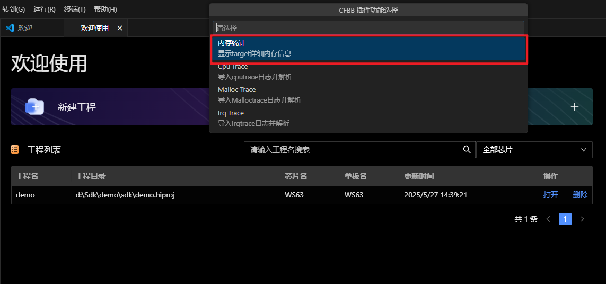

选择对应的target即可统计内存，内存统计界面如[图2](#fig642651812595)所示。

**图 2**  内存统计功能展示  
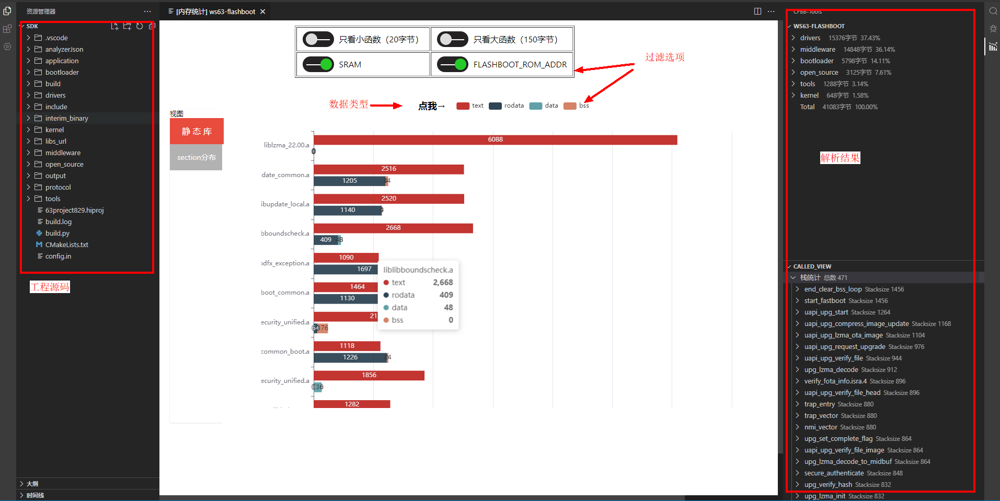

### 基线对比功能

可快速对比更改代码前后的内存占用情况：

1.  单击保存为基线按钮，将当前内存保存为基线。
2.  修改代码或者切换target。
3.  刷新统计。
4.  单击对比按钮，如[图1](#fig948185817020)所示，对比结果示例如[图2](#fig68321937318)所示。

    **图 1**  保存基线版本和与基线版本对比按钮  
    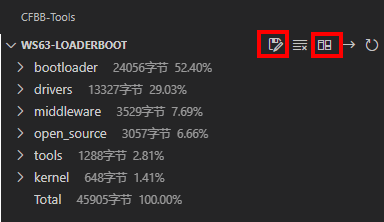

    **图 2**  与基线版本对比结果示例  
    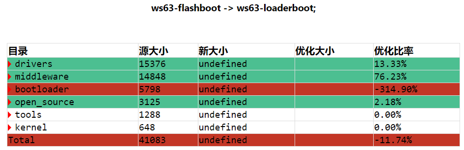

### CPU Trace 日志解析功能

芯片死机时通常会通过串口打印出死机日志，其中包含cpu\_trace信息（即死机前一段时间的函数调用链）。

按照“[内存统计功能](内存统计功能.md)”步骤，单击右下角cfbb按钮，在弹出的菜单栏中选择Cpu Trace，选择对应的target，将死机时打印的cpu\_trace日志复制到文本框，再点击Trace按钮即可，如[图1](#fig2078817371822)所示。

**图 1**  Cpu Trace功能  
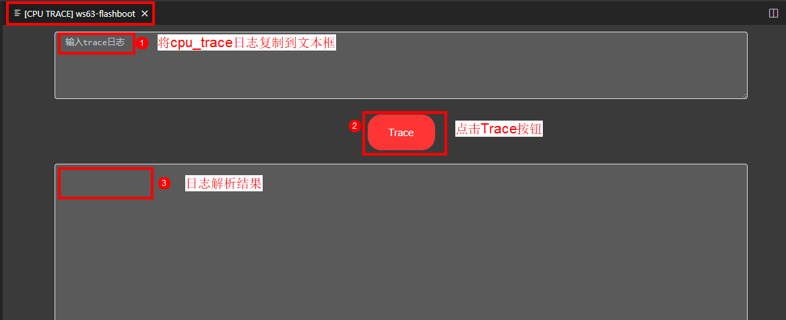

### CPU Trace 二进制文件解析功能

此功能可以解析保存在芯片Flash中的CPU Trace二进制文件，主要用于定位芯片死机问题。

1.  点击右下角Analysis按钮。
2.  在弹出的菜单栏中选择CPU Trace bin，如图所示。

    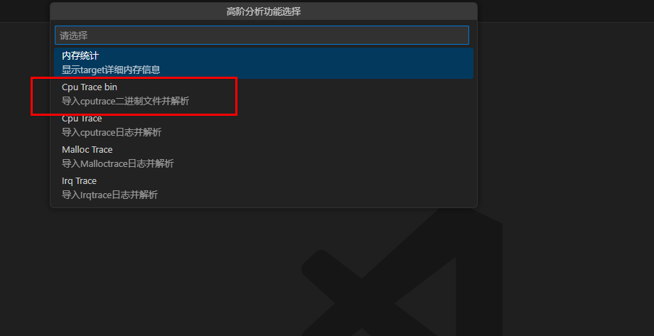

3.  在弹出的界面中按照提示选择需要解析的CPU Trace bin文件、编译工具链中的nm文件、编译生成的elf文件以及芯片的CPU频率，如图所示。

    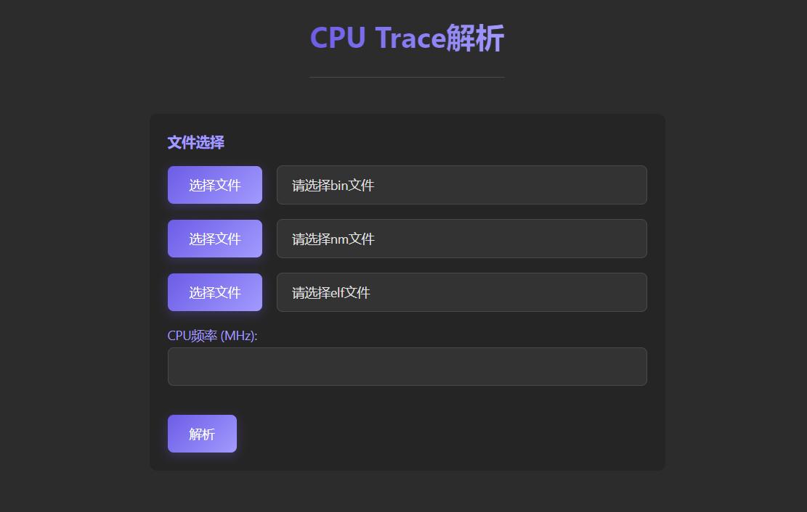

4.  设置完成后点击解析按钮进行二进制解析，解析完成后会在IDE界面显示解析的结果，并且会自动把解析结果以txt文件的格式保存至跟CPU Trace二进制文件相同的目录中，如下图示。

    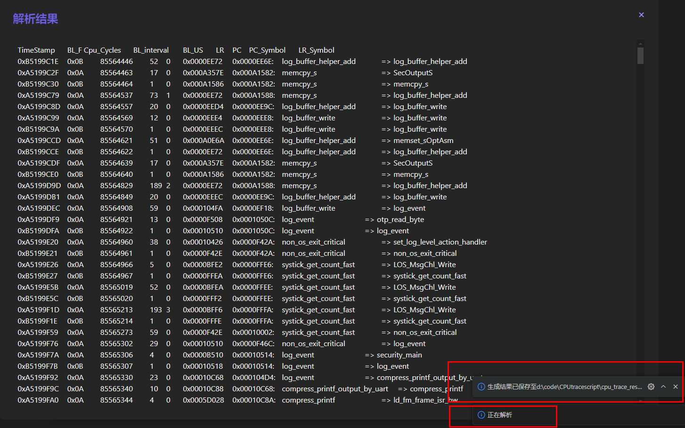

### 堆内存占用情况统计（BS2X和BS25系列芯片适用）

此功能可以解析堆内存维测日志，快速分析出堆内存的占用情况。

1.  单击右下角Analysis按钮。
2.  在弹出的菜单栏中选择Malloc Trace，选择对应的target，要打开堆内存维测，只需点击图示中的按钮即可，需要rebuild，使能后串口发送AT指令 AT+TASKMALLOC= \(指令后跟的参数是taskid\)或者调用print\_os\_all\_sys\_task\_heap即可打印出堆内存维测日志。

    **图 1**  Malloc Trace功能  
    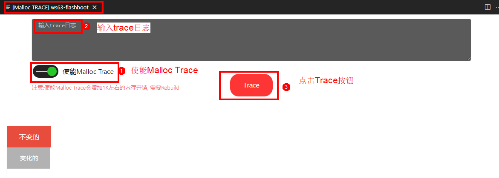

3.  将堆内存维测日志复制到文本框中。
4.  单击Trace按钮即可显示出统计图，如[图2](#fig1836521310443)所示。

    **图 2**  与基线版本对比结果示例  
    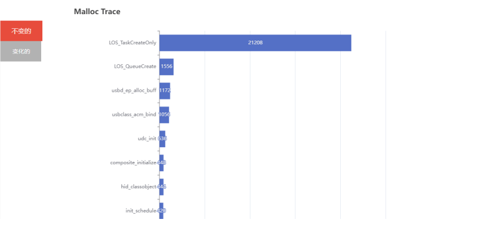

### 锁中断时间统计以及中断函数执行时间统计维测

**打开锁中断维测**

要打开锁中断维测，需要在sdk根目录的“kernel/osal\_adapter/CMakeLists.txt”文件的图示位置添加“set\(PUBLIC\_DEFINESOSAL\_IRQ\_RECORD\_INTTER OSAL\_IRQ\_RECORD\_DEBUG\) ”， 注意：需要rebuild。

**图 1**  CMakeLists.txt修改  
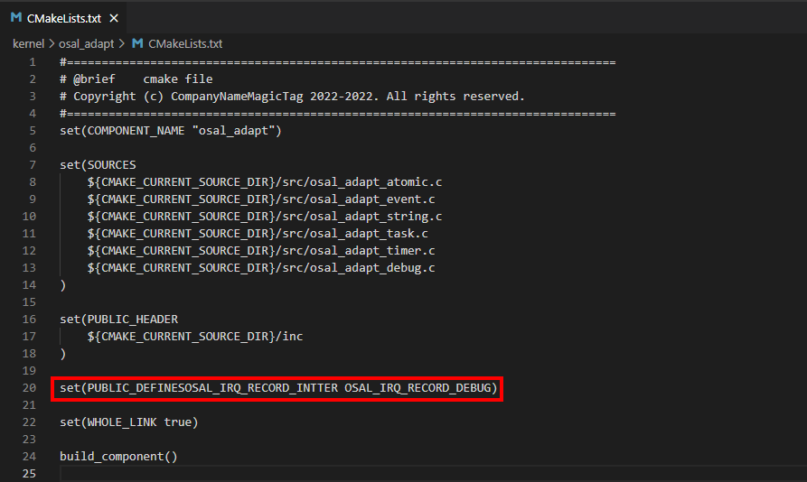

**使用锁中断维测**

-   调用“osal\_irq\_record\_flag\_set\(\)”接口即可使能/失能锁中断维测，其参数为0～3，参数说明如下：

    0：失能中断维测；

    1：使能锁中断时间统计维测；

    2：使能中断函数执行时间统计维测；

    3：使能锁中断和中断函数执行时间统计维测。

-   调用“osal\_print\_irq\_record\(\)”接口即可打印出记录的维测信息，其参数为空。

**解析维测信息**

1.  单击右下角cfbb按钮。
2.  在弹出的菜单栏中选择Irq Trace。
3.  选择对应的target。
4.  将维测日志复制到文本框，单击“Trace”按钮即可。

**图 2**  Irq Trace功能  
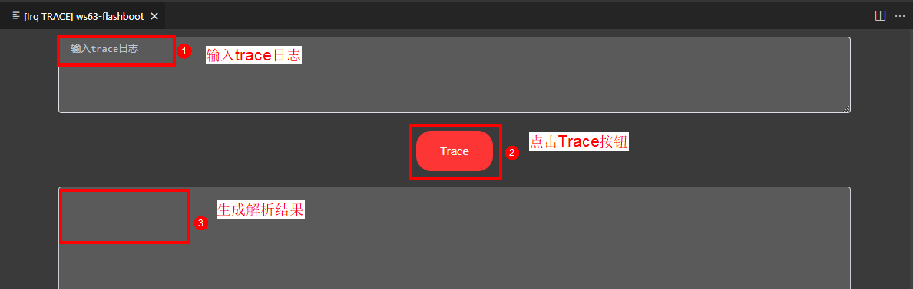

# 常见错误

## SDK根目录路径过长

SDK根目录路径过长：

Windows10和Windows11下路径有260Byte的长度限制，过长的路径会导致编译时相关文件无法找到或者编译的时候一直循环某些打印信息，而不执行具体的编译内容,建议SDK代码放到盘符的根目录或缩短SDK存放路径。

**图 1**  SDK根目录路径过长  
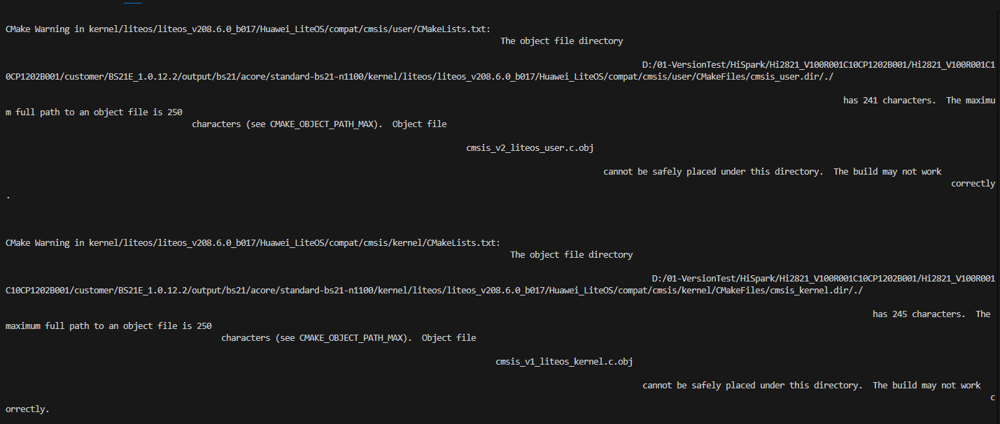

## 路径失效

导入工程路径问题导致的调试、栈分析、镜像分析等默认路径失效。

-   调试：修改默认的debug\_elf路径。

    **图 1**  修改默认debug\_elf路径  
    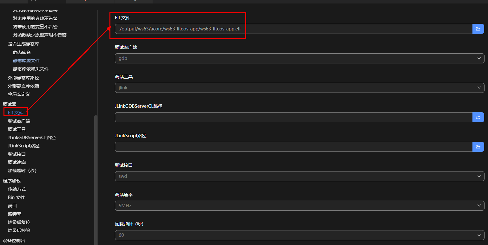

## 编译或者执行系统配置功能过程中提示python或者其他依赖出错

编译或者执行系统配置功能过程中提示python环境出错：

**图 1**  python环境出错弹窗  
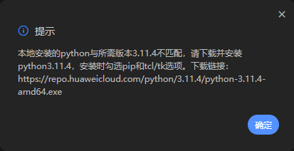

或者提示内容为“本地没有安装python”或者“本地安装的python不可用”这种错误，原因为本地没有安装python或者安装的python版本不为3.11.4，为不影响编译或者系统配置功能的正常使用，建议参考2.4章中的配置python环境下载python3.11.4的安装包并手动安装，安装过程中勾选“pip”和“tcl/tk选项”。

编译或者执行系统配置功能过程中提示XX组件下载失败：

**图 2**  pip组件下载失败弹窗  

或者cmake、pycparser、kconfiglib或者pillow下载失败。原因为执行编译或者系统配置功能时需要通过安装的python的pip组件进行下载所需依赖失败，可能是本地环境原因导致pip install失败或者当前没有网络连接导致下载失败。

解决方法：根据对应提示的组件下载失败，下载对应组件的whl文件，组件与下载链接对应关系如下：

cmake：[https://files.pythonhosted.org/packages/65/7f/80cf681cd376834b442af8af48e6f17b4197d20b7255aa2f76d8d93a9e44/cmake-3.20.5-py2.py3-none-win\_amd64.whl](https://files.pythonhosted.org/packages/65/7f/80cf681cd376834b442af8af48e6f17b4197d20b7255aa2f76d8d93a9e44/cmake-3.20.5-py2.py3-none-win_amd64.whl)

pycparser：[https://files.pythonhosted.org/packages/62/d5/5f610ebe421e85889f2e55e33b7f9a6795bd982198517d912eb1c76e1a53/pycparser-2.21-py2.py3-none-any.whl](https://files.pythonhosted.org/packages/62/d5/5f610ebe421e85889f2e55e33b7f9a6795bd982198517d912eb1c76e1a53/pycparser-2.21-py2.py3-none-any.whl)

kconfiglib：[https://files.pythonhosted.org/packages/8a/f1/d98a89231e779b079b977590efcc31249d959c8f1d4b5858cad69695ff9c/kconfiglib-14.1.0-py2.py3-none-any.whl](https://files.pythonhosted.org/packages/8a/f1/d98a89231e779b079b977590efcc31249d959c8f1d4b5858cad69695ff9c/kconfiglib-14.1.0-py2.py3-none-any.whl)

windows\_curses：[https://files.pythonhosted.org/packages/18/1b/e06eb41dad1c74f0d3124218084f258f73a5e76c67112da0ba174162670f/windows\_curses-2.3.3-cp311-cp311-win\_amd64.whl](https://files.pythonhosted.org/packages/18/1b/e06eb41dad1c74f0d3124218084f258f73a5e76c67112da0ba174162670f/windows_curses-2.3.3-cp311-cp311-win_amd64.whl)

pillow：

[https://files.pythonhosted.org/packages/c1/d0/5866318eec2b801cdb8c82abf190c8343d8a1cd8bf5a0c17444a6f268291/pillow-10.4.0-cp311-cp311-win\_amd64.whl](https://files.pythonhosted.org/packages/c1/d0/5866318eec2b801cdb8c82abf190c8343d8a1cd8bf5a0c17444a6f268291/pillow-10.4.0-cp311-cp311-win_amd64.whl)

下载完成后，在文件所在目录（建议存放在python3.11.4的安装目录）打开命令提示符（cmd），执行命令“pip install  对应的whl文件”，以cmake和windows\_curses举例：

**图 3**  下载whl文件举例  
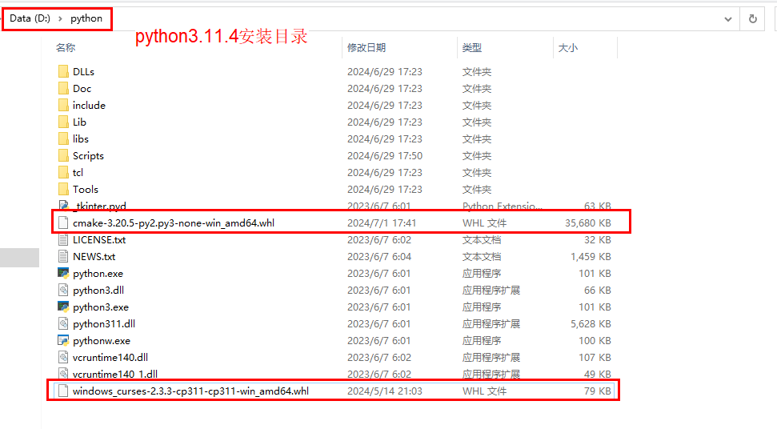

执行的命令：

**图 4**  执行pip install命令  
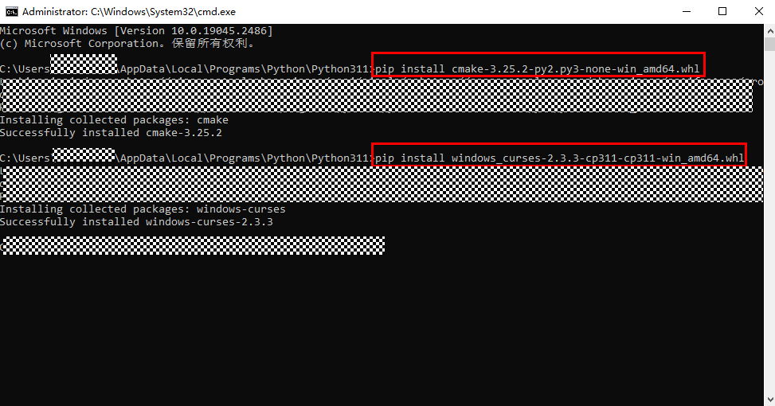

检验是否执行成功，cmake可以打开命令提示符，执行“cmake --version”，如果有对应版本号出现，则说明cmake下载成功，其余组件可以通过执行“pip show 组件名”，如果有对应组件的信息出现，则说明各依赖下载成功：

**图 5**  依赖下载成功检测  
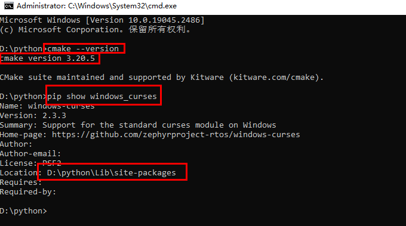

如果环境均配置成功但是编译失败，并且提示“is the command line too long”的错误，则说明cmake版本与所需版本不符合，需要在python3.11.4的安装目录下下载cmake-3.20.5-py2.py3-none-win\_amd64.whl并在该目录下执行“pip install  下载的cmake的whl文件”即可。

下载链接：

[https://files.pythonhosted.org/packages/65/7f/80cf681cd376834b442af8af48e6f17b4197d20b7255aa2f76d8d93a9e44/cmake-3.20.5-py2.py3-none-win\_amd64.whl](https://files.pythonhosted.org/packages/65/7f/80cf681cd376834b442af8af48e6f17b4197d20b7255aa2f76d8d93a9e44/cmake-3.20.5-py2.py3-none-win_amd64.whl)

**图 6**  提示is the command line too long  
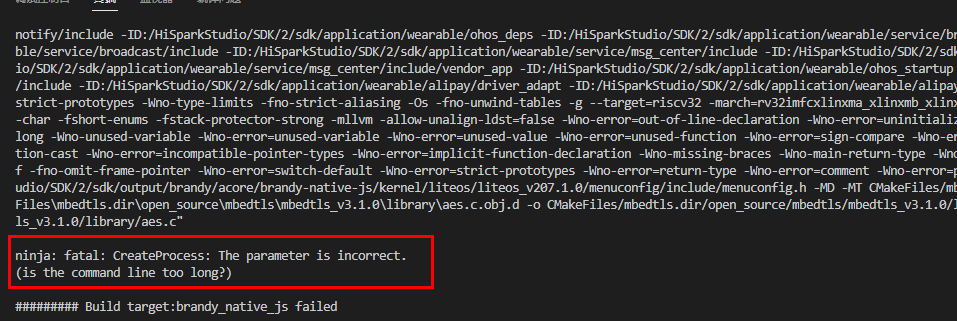

如果Python环境正常，但是执行pip install 组件的时候失败：

**图 7**  执行pip install失败  
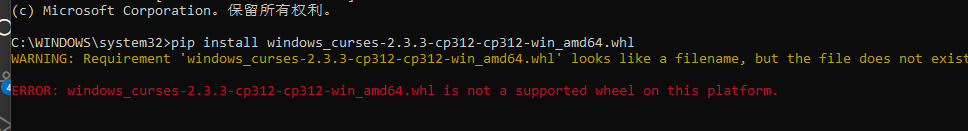

原因为pip的版本与Python版本不一致，即Python 3.11.4或者其他合规版本的python环境变量添加至环境变量，对应的Python安装目录下的Python311\\Scripts的环境变量没有添加。可手动将Python\\Scripts的环境变量也添加到环境变量头部，下载pip的依赖成功后，再关闭所有VS Code窗口再打开。

**图 8**  添加python311的环境变量  
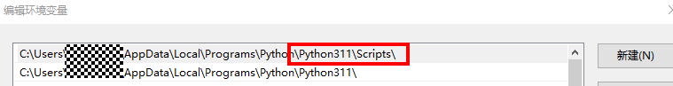

## Kconfig Jump to弹框中搜索报错"NameError: name 're' is not defined"

1.  打开Kconfig后，单击“Jump to...”按钮，在弹框中搜索相关内容。

    **图 1**  从Jump to打开搜索框  
    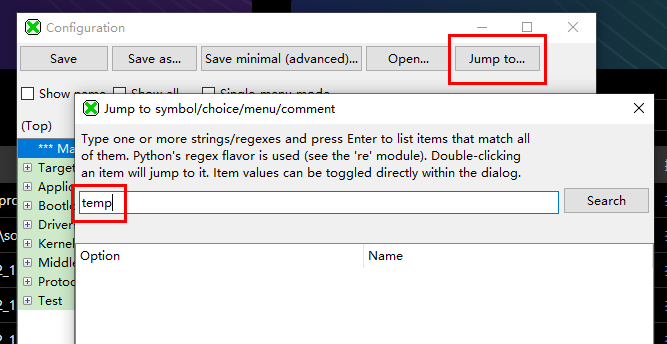

2.  若出现如下异常打印：

    **图 2**  Kconfig异常打印  
    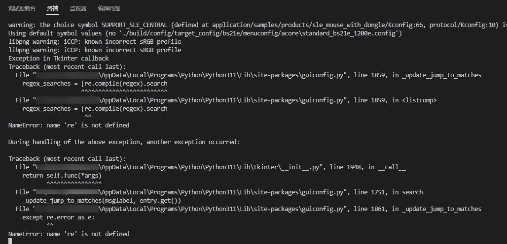

    需要修改“guiconfig.py”文件：在调用re模块前，添加import re，如[图3](#fig23065516141)所示。

    **图 3**  添加import re  
    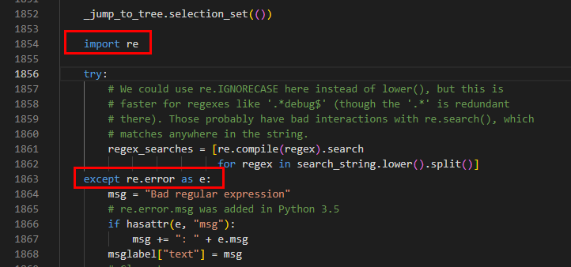

3.  添加代码之后可正常搜索，如[图4](#fig1265846121315)所示。

    **图 4**  正常搜索示意图  
    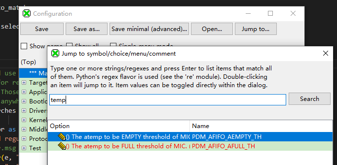

## 编译报错“Invalid argument”

编译过程中如果报错“Invalid argument”。

**图 1**  ws63编译报错“Invalid argument”  
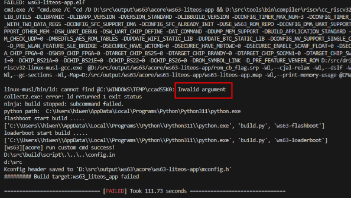

报错原因：解析elf时由于没有管理员权限；解决方法：用管理员权限打开VS Code再次进行编译。

## Python环境检查报错

**图 1**  Python环境检查报错  

如果在安装Python的时候报错，如上图所示，可以在cmd中执行“Python --version”以及查看环境变量，查看Python是否被正确安装，如果问题还是没解决，可以查看VS Code中是否安装其余插件与之冲突，可以将其余插件禁用排查。

## 工程编译慢的问题

可能原因一：Microsoft PC Manager Service的CPU占用率过高导致的，可以结束或者禁用这个进程，加快工程编译速度。

**图 1**  禁用Microsoft PC Manager Service服务  
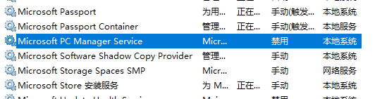

可能原因二：进程Antimalware Service Executable的CPU占用率较高，而且无法关闭。Antimalware Service Executable是一个Windows安全进程，它执行针对恶意软件的实时保护。其在后台运行，因此会不时地检测文件和程序。当它检测到病毒或其他恶意攻击时，它会删除或隔离它们。在工程编译时，其也会扫描整个工程目录，导致CPU占用率过高。因此，只要我们不让其扫描我们的工程目录就可以降低其CPU占用率，加快编译速度。解决方法如下：

1.  打开Windows安全中心，点击“威胁和病毒防护”**。**

    **图 2**  打开Windows安全中心  
    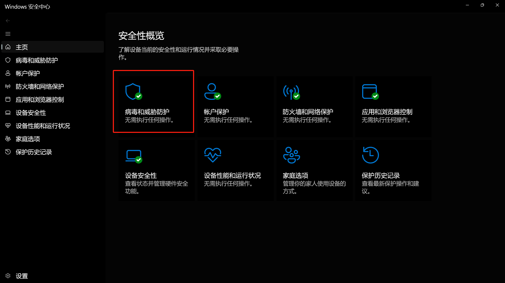

2.  打开“病毒威胁和防护设置”的“管理设置”，下滑找到“排除项”，点击“添加或删除排除项”。

    **图 3**  打开“病毒威胁和防护设置”的“管理设置”  
    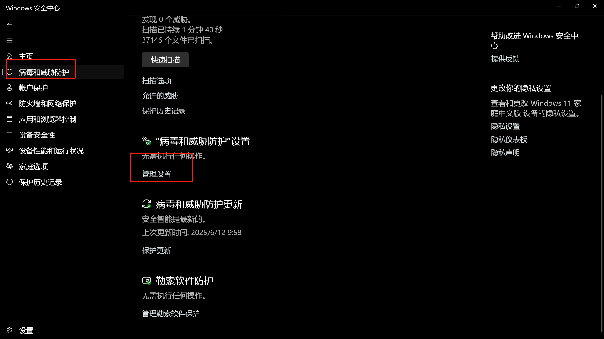

    **图 4**  “排除项”， 点击 “添加或删除排除项**”**  
    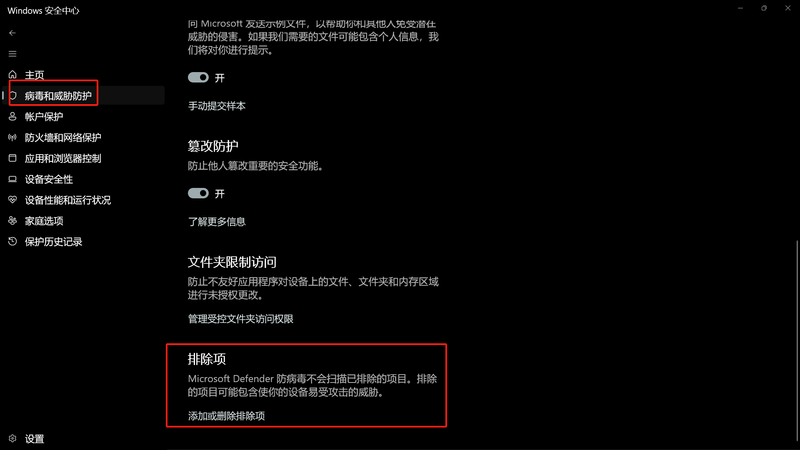

3.  在“排除项”中添加要编译的工程目录。

    **图 5**  在“排除项” 中添加要编译的工程目录  
    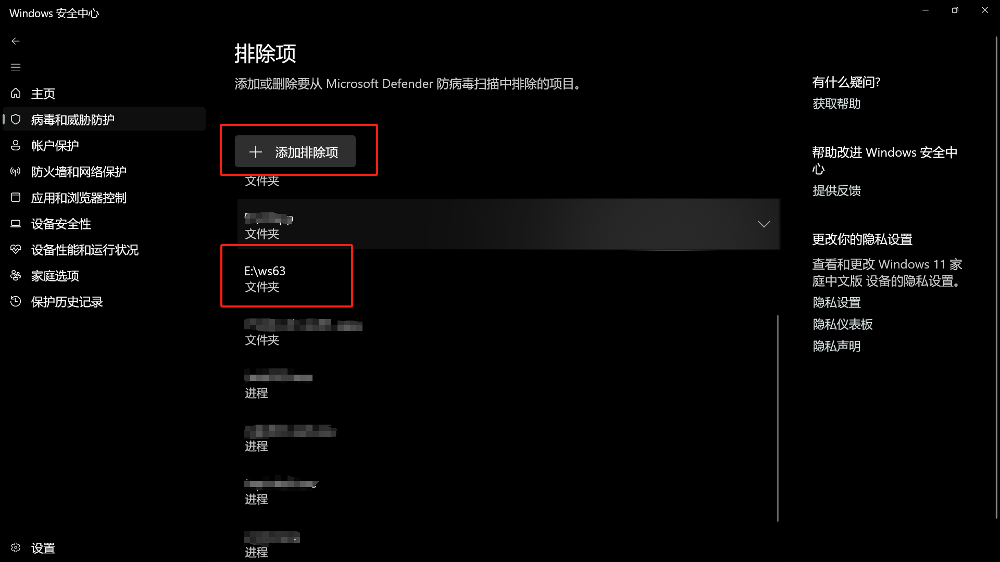

可能原因三：VS Code在效率模式下，可以关闭效率模式，提升编译速度。

1.  查看是否处于效率模式

    **图 6**  资源管理器中状态有“叶子”标志说明处于效率模式下  
    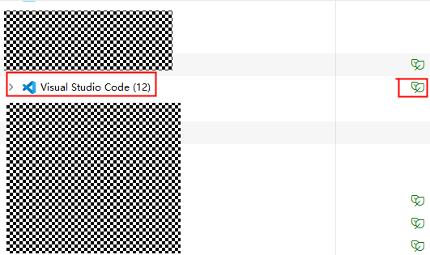

2.  找到VS Code的快捷方式，右键进入属性，在“目标”栏后面加上一个英文空格，再添加“--disable-features=UseEcoQoSForBackgroundProcess”字段即可。

    **图 7**  添加字段解除效率模式  
    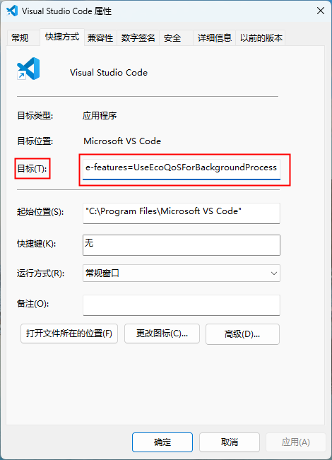

3.  再次打开资源管理器，效率模式解除。

    **图 8**  效率模式解除  
    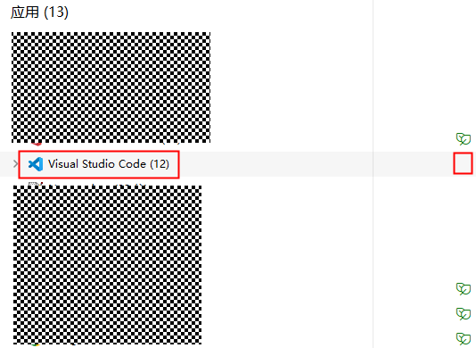

