# WSL子系统开发环境搭建

## 系统要求

| 系统要求                                                     | 下载链接                                                     |
| ------------------------------------------------------------ | ------------------------------------------------------------ |
| Windows 10 版本 2004 及更高版本（内部版本 19041 及更高版本）或 Windows 11 |                                                              |
| 对于 x64 系统：Linux内核更新包                               | [wsl_update_x64.msi](https://wslstorestorage.blob.core.windows.net/wslblob/wsl_update_x64.msi  ) |

## WSL子系统下载及导入

- 启用适用于 Linux 的 Windows 子系统，需要先启用“适用于 Linux 的 Windows 子系统”可选功能，然后才能在 Windows 上安装 Linux 分发。

  以**管理员身份**打开 PowerShell（“开始”菜单 >“PowerShell” >单击右键 >“以管理员身份运行”），然后输入以下命令：

  ```
  dism.exe /online /enable-feature /featurename:Microsoft-Windows-Subsystem-Linux /all /norestart
  ```

  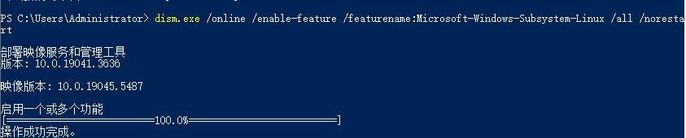

- Windows 10 版本 2004 及更高版本（内部版本 19041 及更高版本）或 Windows 11 才能使用，检查 Windows 版本及内部版本号，选择 Windows 徽标键 + R，然后键入“winver”，选择“确定”。

  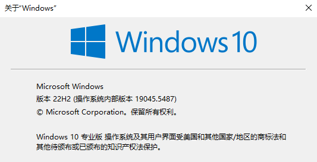

- 启用虚拟机功能，安装 WSL 2 之前，必须启用“虚拟机平台”可选功能。 计算机需要[虚拟化功能](https://learn.microsoft.com/zh-cn/windows/wsl/troubleshooting#error-0x80370102-the-virtual-machine-could-not-be-started-because-a-required-feature-is-not-installed)才能使用此功能。

  以**管理员身份**打开 PowerShell 并运行：

  ```
  dism.exe /online /enable-feature /featurename:VirtualMachinePlatform /all /norestart
  ```

  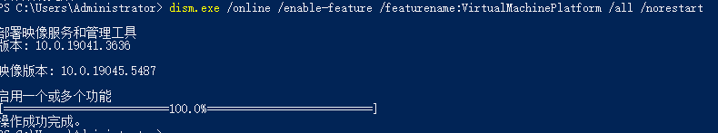

- 需要安装Linux 内核更新包 ，以便在 Windows 操作系统映像中运行 WSL。

  | 系统架构 | 下载链接                                                     |
  | -------- | ------------------------------------------------------------ |
  | x64      | [wsl_update_x64.msi](https://wslstorestorage.blob.core.windows.net/wslblob/wsl_update_x64.msi) |

- 重启电脑，一定要重启，不然后面会报错。

- 下载fbb_ws63_wsl发行包，下载链接：https://hispark-obs.obs.cn-east-3.myhuaweicloud.com/fbb_ws63_wsl.tar

  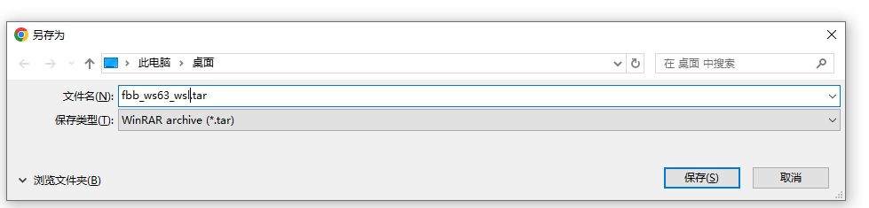

- 下载完成后，将压缩包放在桌面或者其他目录，这里以桌面为例（路径：C:/Users/Administrator/Desktop/fbb_ws63_wsl.tar），同时在非系统盘目录新建一个文件夹，这里在F盘新建一个ubuntu文件夹（路径：F:/ubuntu/）。

  以**管理员身份**打开 PowerShell 并运行：

  ```
  wsl --import fbb_ws63 F:/ubuntu/ C:/Users/Administrator/Desktop/fbb_ws63_wsl.tar
  ```

- 运行后，等待导入完成，成功之后会在F:/ubuntu/目录下有如下文件。

  

  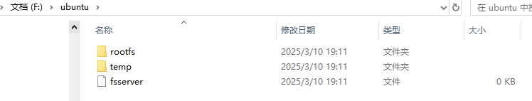

- 重启电脑，一定要重启，不然后面会很卡顿。

- 重启完成后，查看wsl子系统是否安装成功。

  打开powershell并运行：

  ```
  wsl --list
  ```

  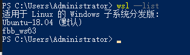

- 安装[vscode](https://vscode.download.prss.microsoft.com/dbazure/download/stable/6609ac3d66f4eade5cf376d1cb76f13985724bcb/VSCodeUserSetup-x64-1.98.0.exe)，  安装步骤不做描述，自定义安装即可,安装成功如下图，下载链接：https://vscode.download.prss.microsoft.com/dbazure/download/stable/6609ac3d66f4eade5cf376d1cb76f13985724bcb/VSCodeUserSetup-x64-1.98.0.exe

  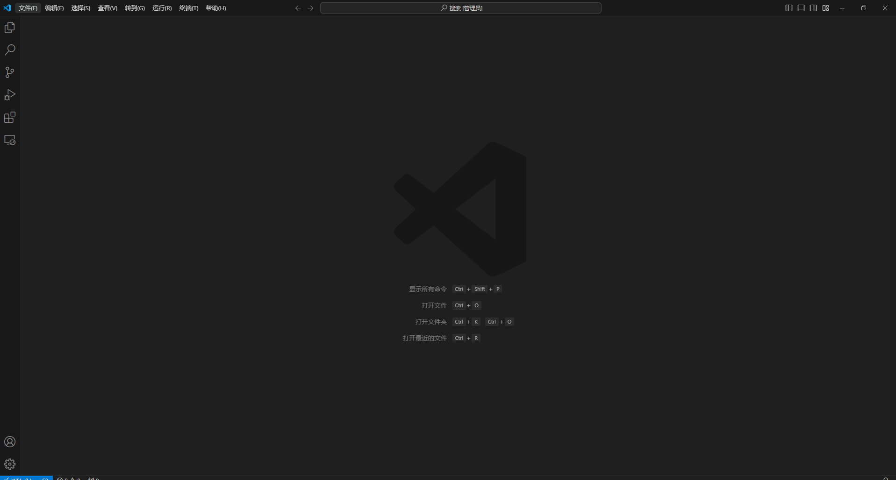

- 打开Vscode，在扩展搜索“remote”，选择“Remote Development”，等待下载成功。

  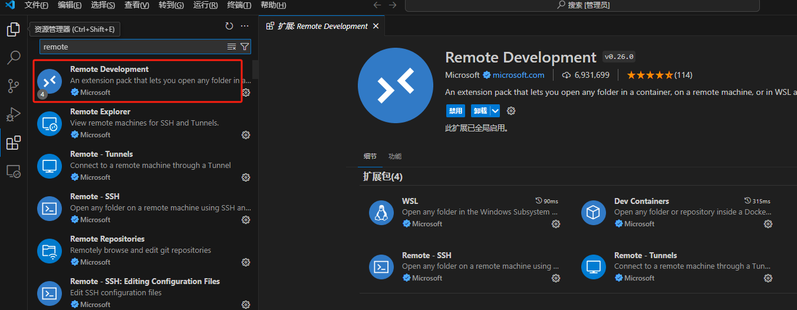

- 如果需要中文显示，在扩展搜索“chinese”，选择“chinese（Simplified）”，等待安装完成，右下角会弹出“change Language and Restart”，点击确认即可

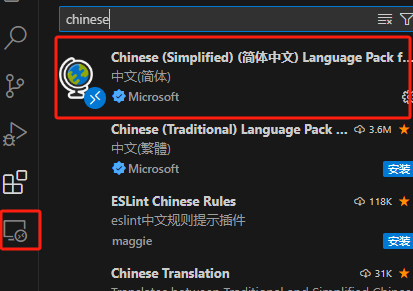

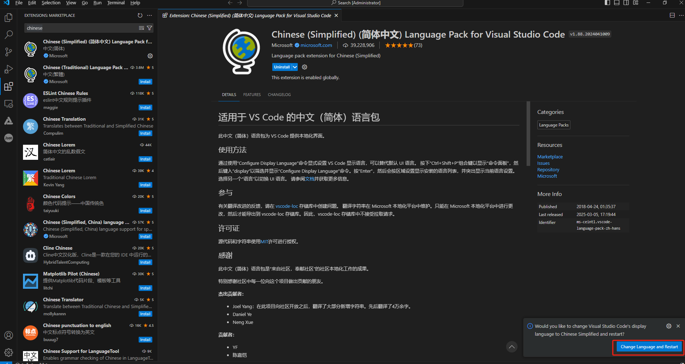

- 在vscode中，选择“远程资源管理器”，选择"fbb_ws63",选择“在当前窗口中连接”

  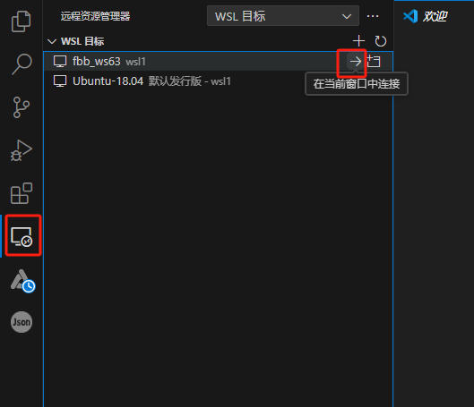

- 在vscode界面新建一个“终端”

  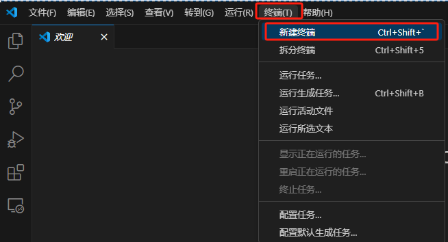

- 在VScode界面下面“终端：会弹出一个终端界面
  
  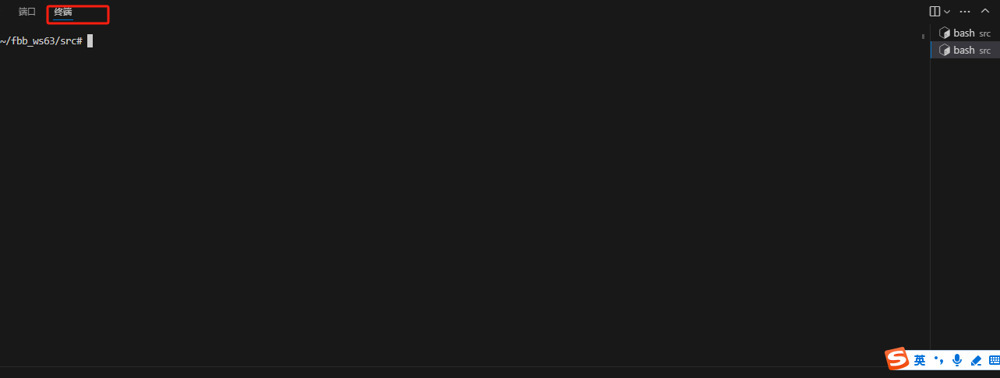
  
  
