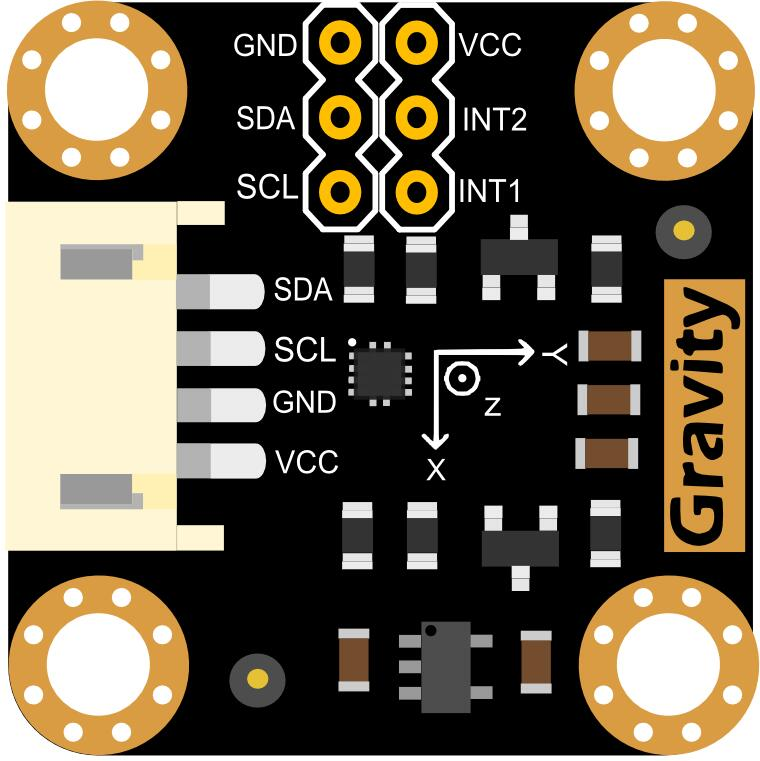

# dfrobot_lis2dh12

LIS2DH12是一款超低功率高性能三轴线性
加速度计属于“femto”家族，利用了强大的和
成熟的制造工艺已用于生产微加工
加速度计。
LIS2DH12有用户可选择的±2g/±4g/±8g/±16g的全刻度


## 产品链接(https://www.dfrobot.com.cn/goods-1372.html)
    SKU:SEN0224

## 目录

  * [概述](#概述)
  * [API](#API)
  * [历史](#历史)

## 概述

提供一个WS63库，通过读取LIS2DH12数据获得三轴加速度。

## API
```C++
  /**
   * @fn dfrobot_lis2dh12_init
   * @brief 初始化函数
   * @param addr 从机I2C地址
   * @param iic_scl_master_pin SCL引脚
   * @param iic_sda_master_pin SDA引脚
   * @param iic_bus_id I2C总线标识符
   * @return true(成功)/false(失败)
   */
  bool dfrobot_lis2dh12_init(uint8_t addr, uint8_t iic_scl_master_pin, uint8_t iic_sda_master_pin, uint8_t iic_bus_id);

  /**
   * @fn set_range
   * @brief 设置测量范围
   * @param range 范围(g)
   * @n           e_lis2dh12_2g, //±2g
   * @n           e_lis2dh12_4g, //4g
   * @n           e_lis2dh12_8g, //8g
   * @n           e_lis2dh12_16g, //16g
   */
  void set_range(e_range_t range);

  /**
   * @fn set_acquire_rate
   * @brief 设置数据测量速率
   * @param rate 速度(HZ)
   * @n          e_power_down_0hz 
   * @n          e_low_power_1hz 
   * @n          e_low_power_10hz 
   * @n          e_low_power_25hz 
   * @n          e_low_power_50hz 
   * @n          e_low_power_100hz
   * @n          e_low_power_200hz
   * @n          e_low_power_400hz
   */
  void set_acquire_rate(e_power_mode_t rate);

  /**
   * @fn set_acquire_rate
   * @brief 获取芯片ID
   * @return 8连续数据
   */
  uint8_t get_id();

  /**
   * @fn read_acc_x
   * @brief 获取x方向上的加速度
   * @return 加速度为x(单位:g)，测量范围为±100g或±200g，由set_range()函数设定。
   */
  int32_t read_acc_x();

  /**
   * @fn read_acc_y
   * @brief 获取y方向的加速度
   * @return 加速度为y(单位:g)，测量范围为±100g或±200g，由set_range()函数设定。
   */
  int32_t read_acc_y();

  /**
   * @fn read_acc_z
   * @brief 获取z方向的加速度
   * @return 加速度从z开始(单位:g)，测量范围为±100g或±200g，由set_range()函数设定。
   */
  int32_t read_acc_z();
  
  /**
   * @fn set_int1_th
   * @brief 设置中断源1中断的阈值
   * @param threshold 告警阈值在测量范围内，单位:g
   */
  void set_int1_th(uint8_t threshold);

  /**
   * @fn set_int2_th
   * @brief 设置“中断源2”的中断产生阈值
   * @param threshold 告警阈值在测量范围内，单位:g
   */
  void set_int2_th(uint8_t threshold);

  /**
   * @fn enable_interrupt_event
   * @brief 启用中断
   * @param source 中断引脚选择
   * @n           e_int1 = 0,/<int1 >/
   * @n           e_int2,/<int2>/
   * @param event 中断事件选择
   * @n            e_x_lower_than_th ,/<x方向上的加速度小于阈值>/
   * @n            e_x_higher_than_th ,/<x方向上的加速度大于阈值>/
   * @n            e_y_lower_than_th,/<y方向上的加速度小于阈值>/
   * @n            e_y_higher_than_th,/<y方向上的加速度大于阈值>/
   * @n            e_z_lower_than_th,/<z方向的加速度小于阈值>/
   * @n            e_z_higher_than_th,/<z方向的加速度大于阈值>/
   */
  void enable_interrupt_event(e_interrupt_source_t source, e_interrupt_event_t event);

  /**
   * @fn get_int1_event
   * @brief 检查中断1中是否产生中断事件'event'  
   * @param event Interrupt event
   * @n            e_x_lower_than_th ,/<x方向上的加速度小于阈值>/
   * @n            e_x_higher_than_th ,/<x方向上的加速度大于阈值>/
   * @n            e_y_lower_than_th,/<y方向上的加速度小于阈值>/
   * @n            e_y_higher_than_th,/<y方向上的加速度大于阈值>/
   * @n            e_z_lower_than_th,/<z方向的加速度小于阈值>/
   * @n            e_z_higher_than_th,/<z方向的加速度大于阈值>/
   * @return true 产生/false 没有产生
   */
  bool get_int1_event(e_interrupt_event_t event);

  /**
   * @fn get_int2_event
   * @brief 检查中断2中是否产生中断事件'event'  
   * @param event Interrupt event
   * @n            e_x_lower_than_th ,/<x方向上的加速度小于阈值>/
   * @n            e_x_higher_than_th ,/<x方向上的加速度大于阈值>/
   * @n            e_y_lower_than_th,/<y方向上的加速度小于阈值>/
   * @n            e_y_higher_than_th,/<y方向上的加速度大于阈值>/
   * @n            e_z_lower_than_th,/<z方向的加速度小于阈值>/
   * @n            e_z_higher_than_th,/<z方向的加速度大于阈值>/
   * @return true 产生/false 没有产生
   */
  bool get_int2_event(e_interrupt_event_t event);
```
## 历史

- 2025/9/29 - WS63版本 V1.0.0 - Written by(Martin@dfrobot.com), 2025.
- 2021/2/1 - Arduino版本 V1.0.0 - Written by(li.feng@dfrobot.com,jie.tang@dfrobot.com), 2021.
