# DFRobot_Beetle_WS63 demo部署教程

## 一、安装工具和SDK：

安装vscode HiSpark Studio插件


在快速入门界面点击下载工具链

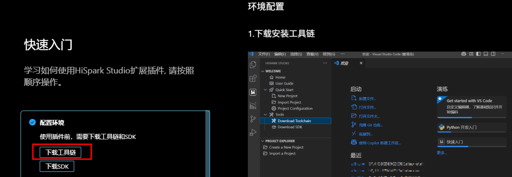

工具链安装完成后，在gitee上拉取WS63的SDK：

```Plain
git clone https://gitee.com/HiSpark/fbb_ws63.git
```

用vscode打开下载好的sdk，点击左侧边栏hispark图标，看到如下界面：

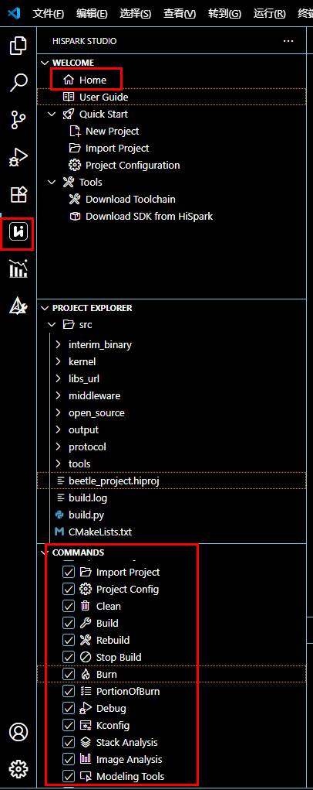

其中COMMANDS部分为用户开发时常用命令，其中：**Kconfig**为选择编译示例和示例参数配置、**clean**为清理项目编译资源、**Build**构建项目、**Burn**烧录固件。

## 二、新建一个工程并编译SDK中的例程：

在上图中我们点击Home按钮进入hispark图形化管理界面：

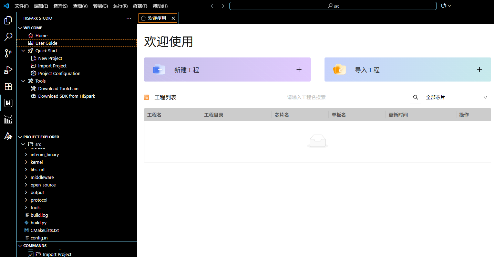

在新建工程对话框中我们选择**芯片**为WS63，**工程类型**为普通工程，起一个**工程名**（图中为Beetle_project），**工程路径和软件包**需要选择fbb_ws63目录下的src目录：

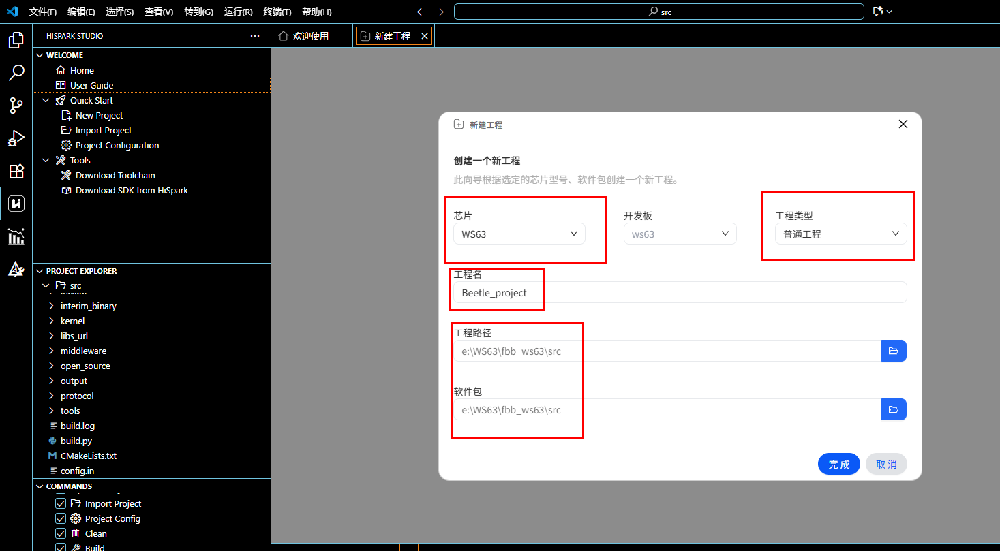

点击完成后，再次点击Home按钮就会发现工程列表中我们刚刚创建的工程了。（注意以后每第一次打开vscode都要来到Home这里打开工程才算进入项目）

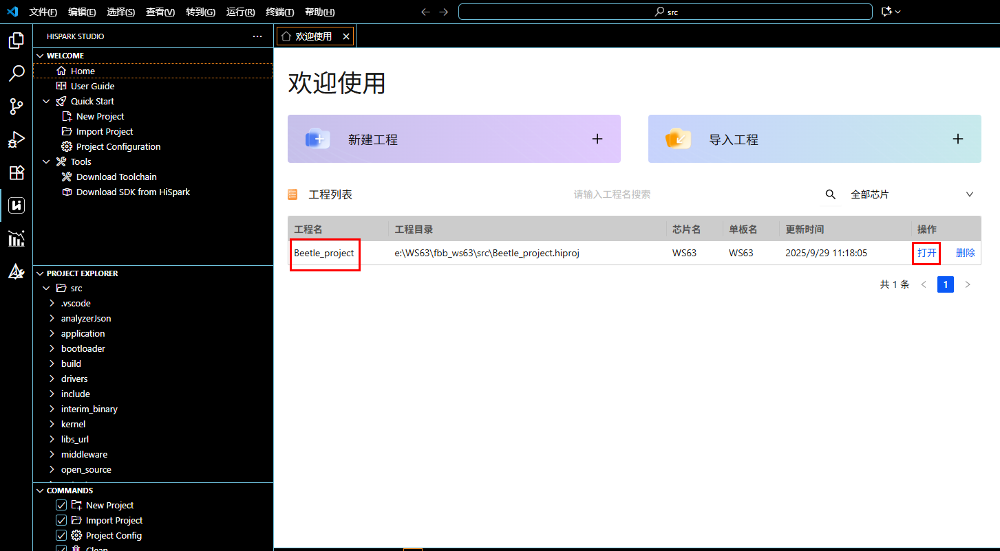

点击左侧command栏中的Kconfig按钮，弹出界面:

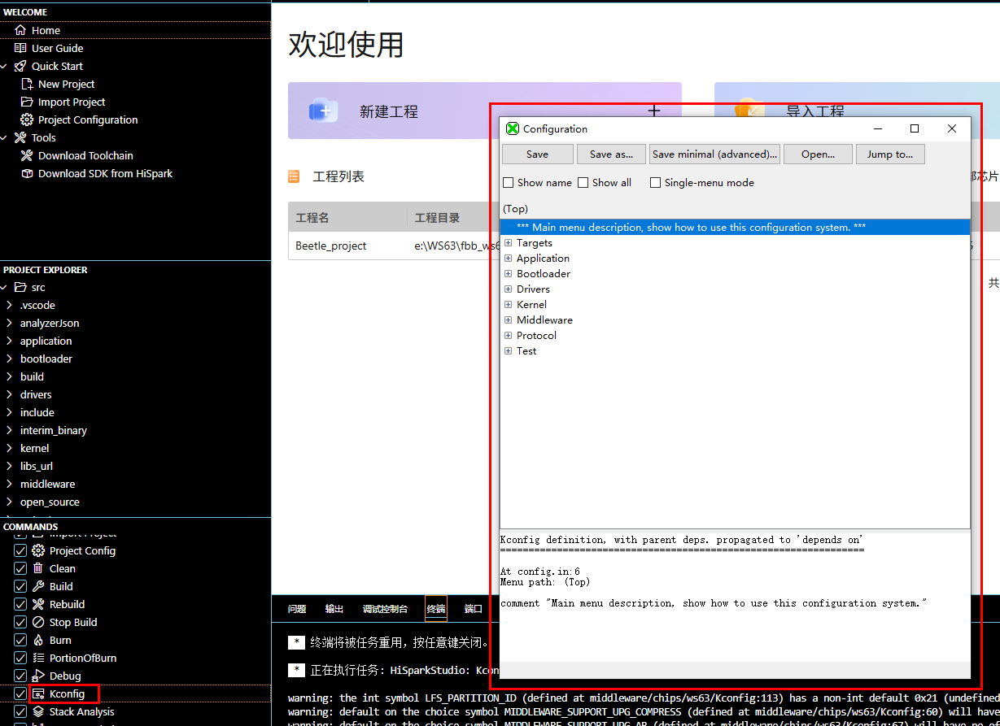

像下图依次展开，选择hello world示例然后点击save保存，关闭对话框:

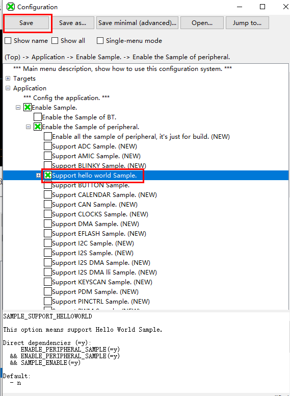

点击Build编译构建程序，等待构建完成：

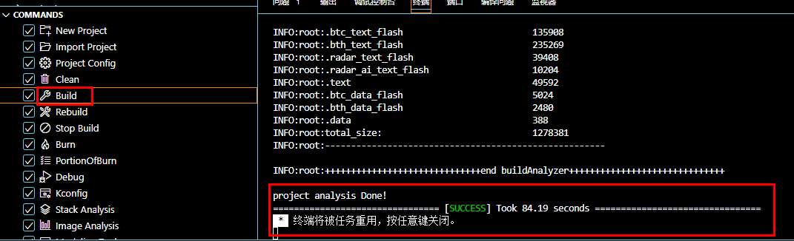

在项目浏览框里找到工程配置文件Beetle_project.hiproj，修改port为我们开发板连接的端口（图例为com15），然后ctrl+s保存修改：

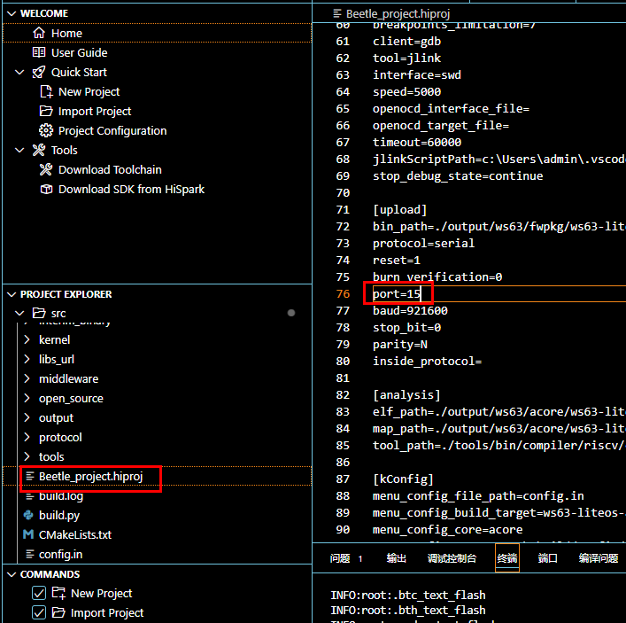

点击Burn烧录固件，会提示点击复位：

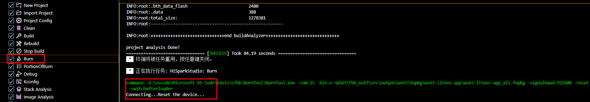

点击开发板上的复位按钮，进入烧录阶段，下方会提示烧录进度：

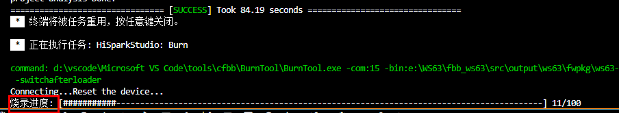

烧录完成后，打开串口调试助手，观察打印：

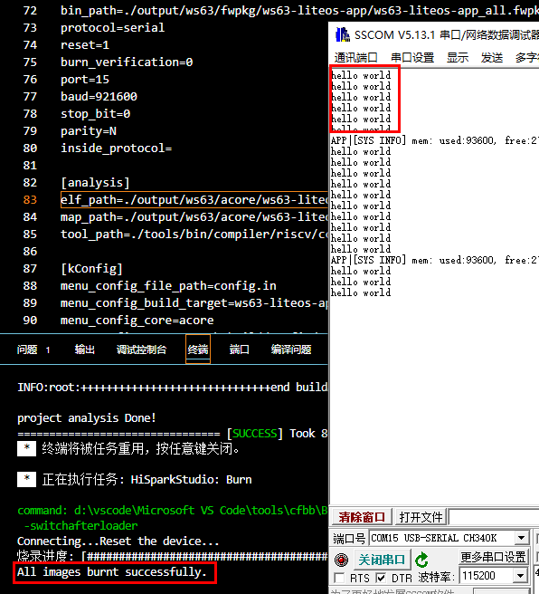

## 三、添加我们的beetle_demo示例到SDK中：

将demo文件夹复制到sdk的samples目录下，并修改文件名为**beetle_demo**：

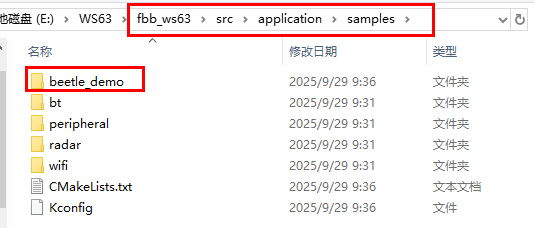

在同级目录下Kconfig中添加：

```Plain
config ENABLE_BEETLE_DEMO
    bool
    prompt "Enable the beetle_demo."
    default n
    depends on SAMPLE_ENABLE
    help
        This option means enable the beetle_demo.

if ENABLE_BEETLE_DEMO
osource "application/samples/beetle_demo/Kconfig"
endif
```

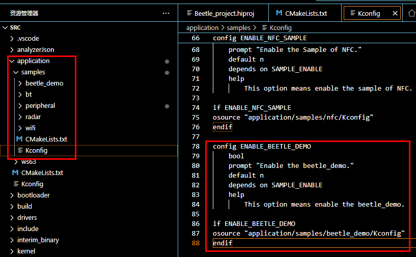

同级CmakeLists中添加：

```Plain
if(DEFINED CONFIG_ENABLE_BEETLE_DEMO)
    add_subdirectory_if_exist(beetle_demo)
endif()
```

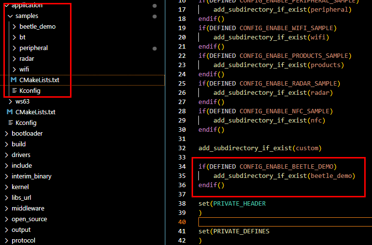

保存文件后，点击Kconfig命令，界面如下则beetle_demo添加成功：

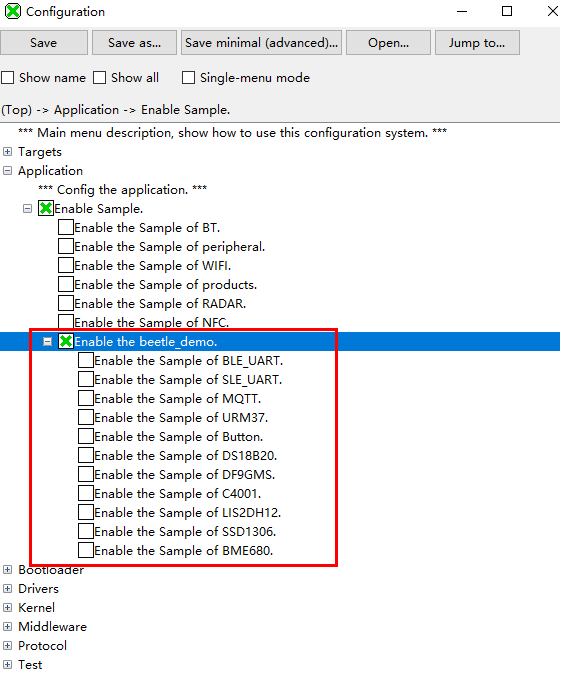

## 四、注意事项：

- WS63的1、3、6、9gpio引脚连接传感器模块时会拉高boot，所以若传感器使用了这些引脚，在烧录固件时先拔线，再复位烧录，进入烧录进度后再插线。
- WS63外设功能都是用GPIO复用的，当发现复用的功能不生效时请查表，IO复用关系表路径：

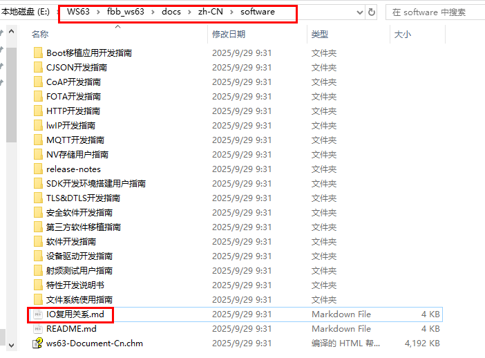

