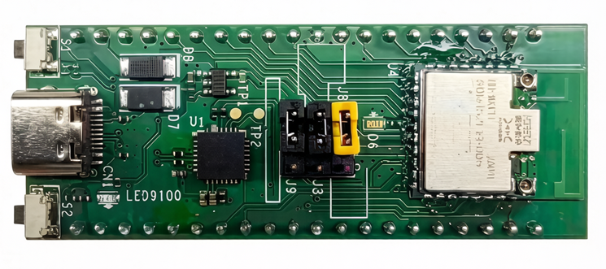
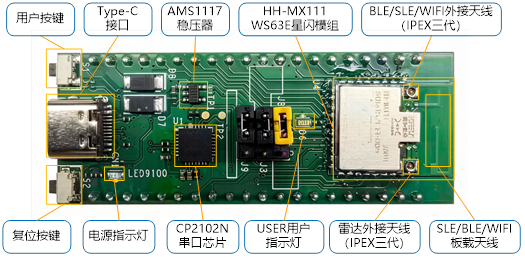
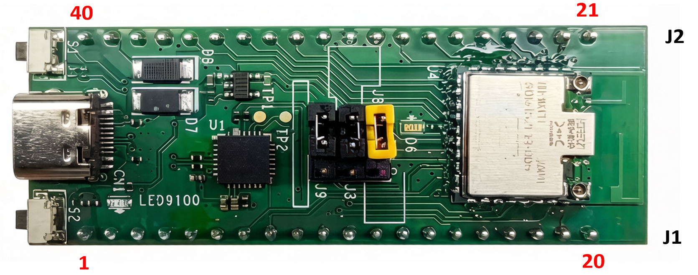
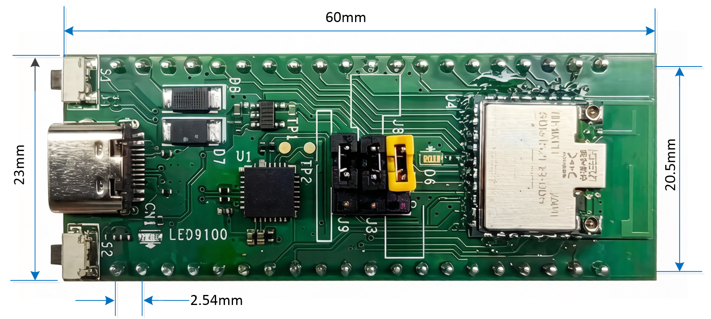

# HH-D111星闪开发板规格说明书

HH-D111 是基于 HH-M111 星闪模组的开发板形态，采用上海海思星闪 WS63E 的解决方案，支持BLE5.2&SLE1.0，支持1M/2M/4M带宽，物理层最大支持 12 Mbps 速率，集成高性能 32bit RISC-V 微处理器（MCU），内置大容量 SRAM 和 Flash，支持硬件安全引擎，支持 UART、ADC、SPI、I2C、DMA 等丰富外设接口。支持 Lite OS 操作系统，可广泛适应于 PC 配件，IoT 等物联网智能终端领域。

## 主要规格

| **模块**     | **规格描述**                                                 |
| ------------ | ------------------------------------------------------------ |
| **处理器**   | 高性能 RISC-V 32bit MCU 工作频率最高可达 240MHz 内置 606KB SRAM、300KB ROM 内置 4MB Flash |
| **外围接口** | 支持 2*I2C，支持 master 和 slave 模式 支持 1 路 2  通道 I2S/PCM 支持 1 * SPI，支持 master 和 slave 模式可配 支持 3 * UART，最大速率4Mbit/s；其中 2 个 4 线 UART支持流控  支持 8 * PWM 支持 6 路  13bit ADC，最大采样率 1.6M 支持 19 * GPIO（全引脚复用） 支持Tsensor，-40 ℃～ +125 ℃温度检测范围，10bit SARADC 量化温度，分辨率 0.208℃ /LSB |
| **Wi-Fi**    | 1×1 2.4GHz 频段（ ch1～ch14） PHY 支持 IEEE  802.11b/g/n/ax   MAC支持 IEEE  802.11d/e/i/k/v/r/w 支持 802.11 20MHz/40MHz 频宽，支持  802.11ax 20MHz 频宽 支持最大速率：150Mbit/s@HT40 MCS7 MCS7，114.7Mbit/s@HE20  MCS9 内置 PA 和 LNA，集成 TX/RX Switch 、Balun 等 支持 STA 和 SoftAP 形态，作为 SoftAP 时最大支持 6个 STA 接入 支持 A-MPDU 、A-MSDU 支持 Block-ACK 支持 QoS ，满足不同业务服务质量需求 支持 WPA/WPA2/WPA3 personal 、WPS2.0  、WAPI 支持 RF 自校准方案 支持 STBC 和 LDPC 支持雷达感知功能 |
| **BLE**      | 低功耗蓝牙 Bluetooth Low Energy（BLE） 支持 BLE4.0/4.1/4.2/5.0/5.1/5.2 支持数据速率 ：1Mbps，2Mbps，500kbps 和 125kbps |
| **SLE**      | 星闪低功耗接入技术 Sparklink Low Energy（SLE） 星闪SLE1.0 支持SLE 1MHz/2MHz/4MHz 最大空口速率12Mbps 支持Polar信道编码 支持 SLE 网关。 |
| **其他信息** | 电源电压输入：典型值 5V 工作温度：-40℃～+85℃            |

## 硬件说明

### 功能布局

* **用户按键**

S1 为用户自定义按键，通过 GPIO0 引脚上报“按下/释放”事件，按键功能由用户软件定制。

* **Type-C 接口**

可对主板供电，或连接至电脑进行串口调试、系统烧录。开发板的 DBG_UART 通过串口转 USB口，从Type-C引出。

* **复位按键**

S2 为RST 复位按键，可以对主板进行复位。

* **电源指示灯（绿色）**

用于指示电源状态，正常上电后电源指示灯常亮。

* **USER 指示灯（红色）**

用于指示相关的状态使用，用户通过 GPIO12 进行控制，功能由用户软件定制。

* **稳压器**

用于串口 5V 供电转换为芯片的 3.3V供电。

* **USB 转串口**

采用 CH340 转换芯片，使用串口功能时，需要在 PC 上安装该芯片的驱动程序。

* **HH-M111 模组**

基于 WS63E 方案自研的星闪模组，集成 BLE、SLE 和 Wi-Fi，具有高速传输、低延迟、高性能、低功耗的特点，支持丰富的接口功能。

* **板载天线**

将天线直接集成到模组 PCB 中，用于增强 BLE/SLE/Wi-Fi 的信号。

* **外接天线（可选）**

用于增强 BLE/SLE/Wi-Fi 的信号，使用 3 代 IPEX 接口，特殊场景下需要很强的信号可以使用，通过更换焊接电阻实现。

### 管脚定义

| 功能2                                  | 功能1 | GPIO/电源/地 | 物理引脚 | 物理引脚 | GPIO/电源/地 | 功能1     | 功能2    |
| -------------------------------------- | ----- | ------------ | -------- | -------- | ------------ | --------- | -------- |
|                                        |       | GND          | 21       | 20       | GND          |           |          |
| SPI1_CSN                               | PWM0  | GPIO_00      | 22       | 19       | -            |           |          |
| SPI1_OUT                               | PWM1  | GPIO_01      | 23       | 18       | -            |           |          |
| SPI1_IO3                               | PWM2  | GPIO_02      | 24       | 17       | -            |           |          |
| SPI1_IN  / FLASH_BOOT                  | PWM3  | GPIO_03      | 25       | 16       | -            |           |          |
| SPI1_IN  / JTAG_ENABLE                 | PWM4  | GPIO_04      | 26       | 15       | -            |           |          |
| UART2_CTS  / SPI1_IO2                  | PWM5  | GPIO_05      | 27       | 14       | -            |           |          |
| UART2_RTS  / SPI1_SCK                  | PWM6  | GPIO_06      | 28       | 13       | -            |           |          |
|                                        |       | -            | 29       | 12       | -            |           |          |
|                                        |       | GND          | 30       | 11       | GND          |           |          |
| UART2_RXD / SPI0_SCK / I2S_MCLK / ADC0 | PWM7  | GPIO_07      | 31       | 10       | GPIO_16      | UART1_RX  | I2C1_SCL |
| UART2_TXD / SPI0_CS1_N / ADC1          | PWM0  | GPIO_08      | 32       | 9        | GPIO_15      | UART1_TX  | I2C1_SDA |
| SPI0_OUT / I2S_DO / ADC2               | PWM1  | GPIO_09      | 33       | 8        | GPIO_14      | UART1_RTS | SWCLK    |
| I2S_SCLK / ADC3                        | PWM2  | GPIO_10      | 34       | 7        | GPIO_13      | UART1_CTS | SWDIO    |
| I2S_LRCLK / ADC4                       | PWM3  | GPIO_11      | 35       | 6        | PWR_ON       |           |          |
| I2S_DI / ADC5                          | PWM4  | GPIO_12      | 36       | 5        | -            |           |          |
|                                        |       | -            | 37       | 4        | -            |           |          |
|                                        |       | GND          | 38       | 3        | -            |           |          |
|                                        |       | 5V           | 39       | 2        | GND          |           |          |
|                                        |       | USB_5V       | 40       | 1        | VDD_3V3      | 输出      |          |

### 尺寸

