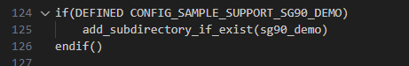
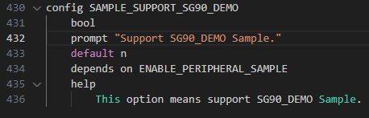
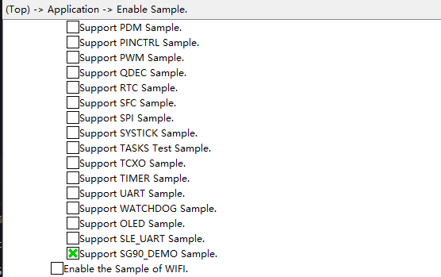
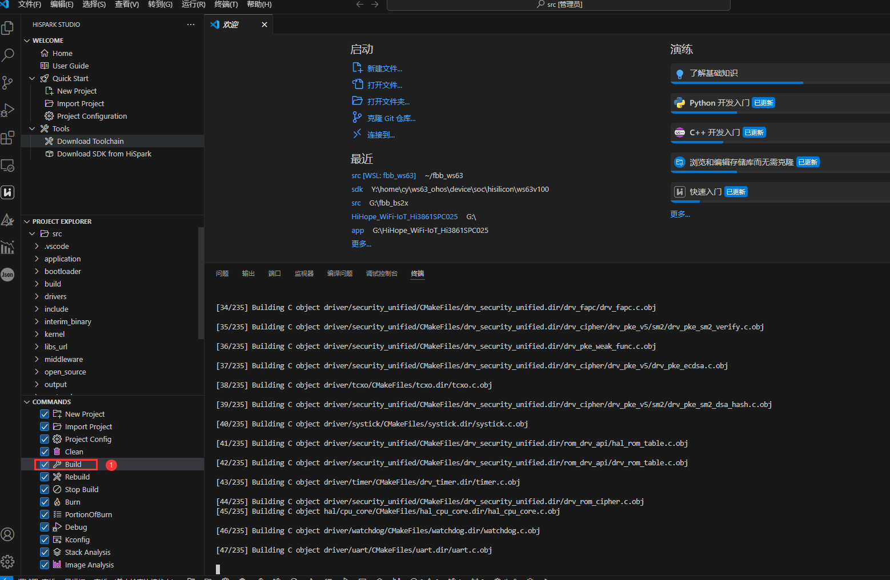
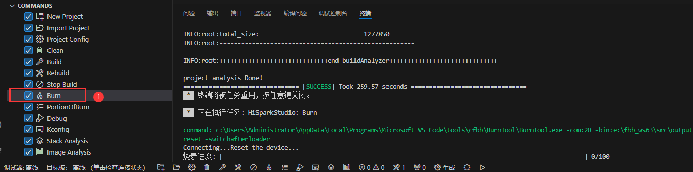

# servo

## 1.1 介绍

**功能介绍：** 通过GPIO2控制舵机转动90°、45°、0°、-45°、-90°。。

**软件概述：** GPIO复用PWM功能。

**硬件概述：** 核心板、交通灯板、SG92R舵机。SG92R频率为50HZ，SG92R舵机转动要求如下图。硬件搭建要求如图所示：

参考[核心板原理图](../../doc/hardware/HIHOPE_NEARLINK_DK_3863E_V03.pdf)、[底板原理图](../../doc/hardware/HiSpark_WiFi_IoT_EXB_VER.A.pdf)

  

## 1.2 约束与限制

### 1.2.1 支持应用运行的芯片和开发板

本示例支持开发板：HiHope_NearLink_DK3863E_V03

### 1.2.2 支持API版本、SDK版本

本示例支持版本号：1.10.101及以上

### 1.2.3 支持IDE插件版本

本示例支持IDE插件版本号：1.0.1及以上；

## 1.3 效果预览

舵机转动90°、45°、0°、-45°、-90°。

## 1.5 实验流程

- 步骤一：在xxx\src\application\samples\peripheral文件夹新建一个sample文件夹，在peripheral上右键选择“新建文件夹”，创建Sample文件夹，例如名称”sg90_demo“。

  
  
- 步骤二：将xxx\vendor\HiHope_NearLink_DK_WS63E_V03\sg90_demo文件里面内容拷贝到**步骤一创建的Sample文件夹中”sg90_demo“**。

  
  
- 步骤三：在xxx\src\application\samples\peripheral\CMakeLists.txt文件中新增编译案例，具体如下图所示（如果不知道在哪个地方加的，可以在“set(SOURCES "${SOURCES}" PARENT_SCOPE)”上面一行添加）。

  
  
- 步骤四：在xxx\src\application\samples\peripheral\Kconfig文件中新增编译案例，具体如下图所示（如果不知道在哪个地方加，可以在最后一行添加）。

  
  
- 步骤五：点击如下图标，选择KConfig，具体选择路径“Application/Enable the Sample of peripheral”，在弹出框中选择“support SERVO Sample”，点击Save，关闭弹窗。

  
  
- 步骤六：点击“build”或者“rebuild”编译

  
  
- 步骤七：编译完成如下图所示。

  
  
- 步骤八：在HiSpark Studio工具中点击“工程配置”按钮，选择“程序加载”，传输方式选择“serial”，端口选择“comxxx”，com口在设备管理器中查看（如果找不到com口，请参考windows环境搭建）。

  
  
- 步骤九：配置完成后，点击工具“程序加载”按钮烧录。

  
  
- 步骤十：出现“Connecting, please reset device...”字样时，复位开发板，等待烧录结束。

  
  
- 步骤十一：“软件烧录成功后，按一下开发板的RESET按键复位开发板，可以发现舵机转动90°、45°、0°、-45°、-90°。

- 

  ## 备注

  如果需要使用其他IO口复用为PWM输出50hz波形，目前案例使用GPIO02,其他7路PWM可以参考:

  #define CLDO_SUB_CRG_CKEN_CTL0   0x44004400
  #define CLDO_CRG_DIV_CTL3        0x44001114
  #define CLDO_CRG_DIV_CTL4        0x44001118
  #define CLDO_CRG_DIV_CTL5        0x4400111C
  
  #define BIT_WIDTH_LIMIT     0xFFFF
  
  #define CLDO_CRG_CLK_SEL     0x44001134
  
  #define PWM_CKSEL_BIT      7
  
  #define PWM_BUS_CKEN             2
  #define PWM_CHANNEL_CKEN_LEN     9

  #define PWM0_LOAD_DIV_EN         20
  #define PWM0_DIV1_CFG            16
  #define PWM0_DIV1_CFG_LEN        4
  #define PWM1_LOAD_DIV_EN         30
  #define PWM1_DIV1_CFG            26
  #define PWM1_DIV1_CFG_LEN        4
  #define PWM2_LOAD_DIV_EN         8
  #define PWM2_DIV1_CFG            4
  #define PWM2_DIV1_CFG_LEN        4
  #define PWM3_LOAD_DIV_EN         18
  #define PWM3_DIV1_CFG            14
  #define PWM3_DIV1_CFG_LEN        4
  #define PWM4_LOAD_DIV_EN         28
  #define PWM4_DIV1_CFG            24
  #define PWM4_DIV1_CFG_LEN        4
  #define PWM5_LOAD_DIV_EN         8
  #define PWM5_DIV1_CFG            4
  #define PWM5_DIV1_CFG_LEN        4
  #define PWM6_LOAD_DIV_EN         18
  #define PWM6_DIV1_CFG            14
  #define PWM6_DIV1_CFG_LEN        4
  #define PWM7_LOAD_DIV_EN         28
  #define PWM7_DIV1_CFG            24
  #define PWM7_DIV1_CFG_LEN        4
  
  PWM0:
  
  ​    uapi_reg_clrbit(CLDO_CRG_CLK_SEL, PWM_CKSEL_BIT);
  
  ​    reg32_setbits(CLDO_SUB_CRG_CKEN_CTL0, PWM_BUS_CKEN, PWM_CHANNEL_CKEN_LEN, 0x1FF);
  
  ​    reg32_clrbit(CLDO_CRG_DIV_CTL3, PWM0_LOAD_DIV_EN);
  
  ​    reg32_setbits(CLDO_CRG_DIV_CTL3, PWM0_DIV1_CFG, PWM0_DIV1_CFG_LEN, 0xF);
  
  ​    reg32_setbit(CLDO_CRG_DIV_CTL3, PWM0_LOAD_DIV_EN);
  
  PWM1:
  
  ​    uapi_reg_clrbit(CLDO_CRG_CLK_SEL, PWM_CKSEL_BIT);
  
  ​    reg32_setbits(CLDO_SUB_CRG_CKEN_CTL0, PWM_BUS_CKEN, PWM_CHANNEL_CKEN_LEN, 0x1FF);
  
  ​    reg32_clrbit(CLDO_CRG_DIV_CTL3, PWM1_LOAD_DIV_EN);
  
  ​    reg32_setbits(CLDO_CRG_DIV_CTL3, PWM1_DIV1_CFG, PWM1_DIV1_CFG_LEN, 0xF);
  
  ​    reg32_setbit(CLDO_CRG_DIV_CTL3, PWM1_LOAD_DIV_EN);
  
  PWM2;
  
  ​    uapi_reg_clrbit(CLDO_CRG_CLK_SEL, PWM_CKSEL_BIT);
  
  ​    reg32_setbits(CLDO_SUB_CRG_CKEN_CTL0, PWM_BUS_CKEN, PWM_CHANNEL_CKEN_LEN, 0x1FF);    
  
  ​    reg32_clrbit(CLDO_CRG_DIV_CTL4, PWM2_LOAD_DIV_EN);
  
  ​    reg32_setbits(CLDO_CRG_DIV_CTL4, PWM2_DIV1_CFG, PWM2_DIV1_CFG_LEN, 0xF);
  
  ​    reg32_setbit(CLDO_CRG_DIV_CTL4, PWM2_LOAD_DIV_EN);
  
  PWM3:
  
  ​	uapi_reg_clrbit(CLDO_CRG_CLK_SEL, PWM_CKSEL_BIT);
  
  ​    reg32_setbits(CLDO_SUB_CRG_CKEN_CTL0, PWM_BUS_CKEN, PWM_CHANNEL_CKEN_LEN, 0x1FF);    
  
  ​    reg32_clrbit(CLDO_CRG_DIV_CTL4, PWM3_LOAD_DIV_EN);
  
  ​    reg32_setbits(CLDO_CRG_DIV_CTL4, PWM3_DIV1_CFG, PWM3_DIV1_CFG_LEN, 0xF);
  
  ​    reg32_setbit(CLDO_CRG_DIV_CTL4, PWM3_LOAD_DIV_EN);
  
  PWM4:
  
  ​	uapi_reg_clrbit(CLDO_CRG_CLK_SEL, PWM_CKSEL_BIT);
  
  ​    reg32_setbits(CLDO_SUB_CRG_CKEN_CTL0, PWM_BUS_CKEN, PWM_CHANNEL_CKEN_LEN, 0x1FF);    
  
  ​    reg32_clrbit(CLDO_CRG_DIV_CTL4, PWM4_LOAD_DIV_EN);
  
  ​    reg32_setbits(CLDO_CRG_DIV_CTL4, PWM4_DIV1_CFG, PWM4_DIV1_CFG_LEN, 0xF);
  
  ​    reg32_setbit(CLDO_CRG_DIV_CTL4, PWM4_LOAD_DIV_EN);
  
  PWM5:
  
  ​	uapi_reg_clrbit(CLDO_CRG_CLK_SEL, PWM_CKSEL_BIT);
  
  ​    reg32_setbits(CLDO_SUB_CRG_CKEN_CTL0, PWM_BUS_CKEN, PWM_CHANNEL_CKEN_LEN, 0x1FF);    
  
  ​    reg32_clrbit(CLDO_CRG_DIV_CTL5, PWM5_LOAD_DIV_EN);
  
  ​    reg32_setbits(CLDO_CRG_DIV_CTL5, PWM5_DIV1_CFG, PWM5_DIV1_CFG_LEN, 0xF);
  
  ​    reg32_setbit(CLDO_CRG_DIV_CTL5, PWM5_LOAD_DIV_EN);
  
  PWM6:
  
  ​	uapi_reg_clrbit(CLDO_CRG_CLK_SEL, PWM_CKSEL_BIT);
  
  ​    reg32_setbits(CLDO_SUB_CRG_CKEN_CTL0, PWM_BUS_CKEN, PWM_CHANNEL_CKEN_LEN, 0x1FF);    
  
  ​    reg32_clrbit(CLDO_CRG_DIV_CTL5, PWM6_LOAD_DIV_EN);
  
  ​    reg32_setbits(CLDO_CRG_DIV_CTL5, PWM6_DIV1_CFG, PWM6_DIV1_CFG_LEN, 0xF);
  
  ​    reg32_setbit(CLDO_CRG_DIV_CTL5, PWM6_LOAD_DIV_EN);
  
  PWM7:
  
  ​	uapi_reg_clrbit(CLDO_CRG_CLK_SEL, PWM_CKSEL_BIT);
  
  ​    reg32_setbits(CLDO_SUB_CRG_CKEN_CTL0, PWM_BUS_CKEN, PWM_CHANNEL_CKEN_LEN, 0x1FF);    
  
  ​    reg32_clrbit(CLDO_CRG_DIV_CTL5, PWM7_LOAD_DIV_EN);
  
  ​    reg32_setbits(CLDO_CRG_DIV_CTL5, PWM7_DIV1_CFG, PWM7_DIV1_CFG_LEN, 0xF);
  
  ​    reg32_setbit(CLDO_CRG_DIV_CTL5, PWM7_LOAD_DIV_E
