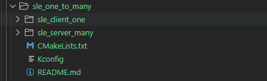
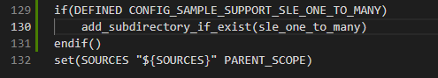
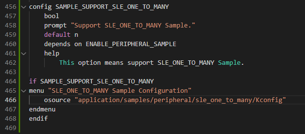
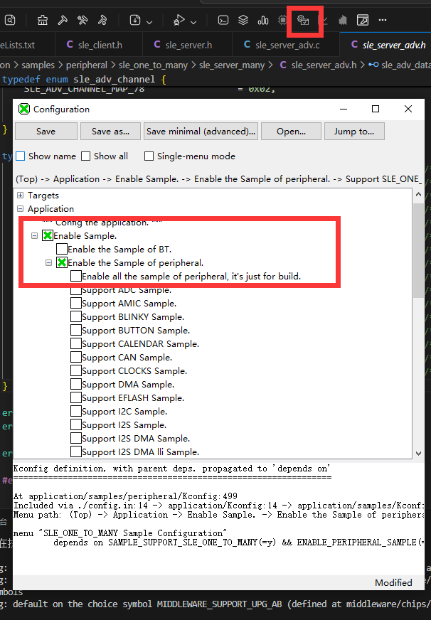
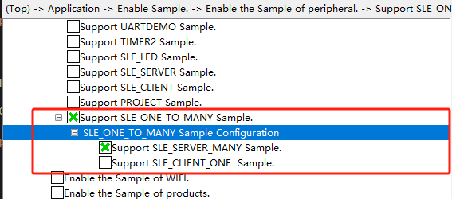
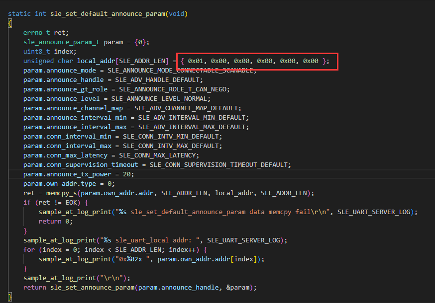
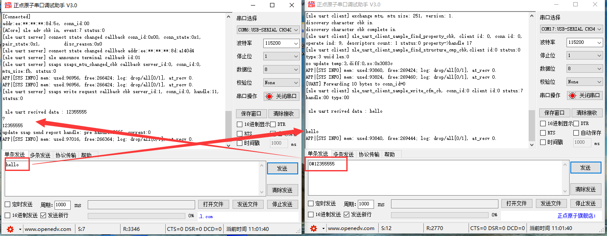

# SLE 1对多

## 1.1 介绍

**功能介绍：**1块Client端星闪开发板同时连接8块Server端星闪开发板。

**硬件概述：** 核心板。硬件搭建要求如图所示：

参考[核心板原理图](../../../../docs/hardware/HiHope_NearLink_DK_WS63E_V03/HIHOPE_NEARLINK_DK_3863E_V03.pdf)

## 1.2 约束与限制

### 1.2.1 支持应用运行的芯片和开发板

本示例支持开发板：HiHope_NearLink_DK3863E_V03

### 1.2.2 支持API版本、SDK版本

本示例支持版本号：1.10.101

### 1.2.3 支持IDE版本

本示例支持IDE版本号：1.0.0.6

## 1.3 效果预览

## 1.4 接口介绍

#### 1.4.1 enable_sle()

| **定义：**   | errcode_t enable_sle(void);                                |
| ------------ | ---------------------------------------------------------- |
| **功能：**   | 使能SLE协议栈                                              |
| **参数：**   |                                                            |
| **返回值：** | ERROCODE_SUCC：成功    Other：失败                         |
| **依赖：**   | include\middleware\services\bts\sle\sle_device_discovery.h |

#### 1.4.2 sle_connect_remote_device()

| 定义：       | errcode_t sle_connect_remote_device(const sle_addr_t *addr); |
| ------------ | ------------------------------------------------------------ |
| **功能：**   | 发送连接请求                                                 |
| **参数：**   | addr：地址                                                   |
| **返回值：** | ERROCODE_SUCC：成功    Other：失败                           |
| **依赖：**   | include\middleware\services\bts\sle\sle_connection_manager.h |

#### 1.4.3 sle_update_connect_param()

| **定义：**   | errcode_t sle_update_connect_param(sle_connection_param_update_t *params); |
| ------------ | -------------------------------------------------------------------------- |
| **功能：**   | 发送更新连接参数请求                                                       |
| **参数：**   | params：连接参数                                                           |
| **返回值：** | ERROCODE_SUCC：成功    Other：失败                                         |
| **依赖：**   | include\middleware\services\bts\sle\sle_connection_manager.h               |

#### 1.4.4 sle_pair_remote_device()

| **定义：**   | errcode_t sle_pair_remote_device(const sle_addr_t *addr);    |
| ------------ | ------------------------------------------------------------ |
| **功能：**   | 发送配对请求                                                 |
| **参数：**   | addr：地址                                                   |
| **返回值：** | ERROCODE_SUCC：成功    Other：失败                           |
| **依赖：**   | include\middleware\services\bts\sle\sle_connection_manager.h |

## 开发流程

Terminal Node：

步骤 1 调用 enable_sle，打开 SLE 开关。

步骤 2 调用 sle_announce_seek_register_callbacks，注册设备公开和设备发现回调函数。

步骤 3 调用 sle_set_local_addr，设置本地设备地址。

步骤 4 调用 sle_set_local_name，设置本地设备名称。

步骤 5 调用 sle_set_announce_param，设置设备公开参数

步骤 6 调用 sle_set_announce_data，设置设备公开数据

步骤 7 调用 sle_start_announce，启动设备公开。

Grant Node： 步骤 1 调用 enable_sle，打开 SLE 开关。

步骤 2 调用 sle_announce_seek_register_callbacks，注册设备公开和设备发现回调函数。

步骤 3 调用 sle_set_local_addr，设置本地设备地址。

步骤 4 调用 sle_set_local_name，设置本地设备名称。

步骤 5 调用 sle_set_seek_param，设置设备发现参数。

步骤 6 调用 sle_start_seek，启动设备发现，并在回调函数中获得正在进行设备公开的设备信 息。

# 1. 使用介绍

* 步骤一：在xxx\src\application\samples\peripheral文件夹新建一个sample文件夹，在peripheral上右键选择“新建文件夹”，创建Sample文件夹，例如名称”sle_one_to_many“。

  
* 步骤二：将xxx\vendor\HiHope_NearLink_DK_WS63E_V03\sle_one_to_many文件里面内容拷贝到**步骤一创建的Sample文件夹中”sle_one_to_many“**下。

  
* 步骤三：在xxx\src\application\samples\peripheral\CMakeLists.txt文件中新增编译案例，具体如下图所示（如果不知道在哪个地方加的，可以在“set(SOURCES "${SOURCES}" PARENT_SCOPE)”上面一行添加）。

  
* 步骤四：在xxx\src\application\samples\peripheral\Kconfig文件中新增编译案例，具体如下图所示（如果不知道在哪个地方加，可以在最后一行添加）。

  
* 步骤五：点击如下图标，选择KConfig，具体选择路径“Application/Enable Sample ”，如果选择编译sle_server_many，在弹出框中选择“support  SLE_SERVER_MANY Sample”，点击Save，关闭弹窗；如果选择编译sle_client_one，在弹出框中选择“support SLE_CLIENT_ONE Sample”，点击Save，，关闭弹窗。（需要准备两块开发板，选择不同的编译选项，烧录不同的镜像）
* 

  

- 步骤六：点击“build”或者“rebuild”编译

  
- 步骤七：编译完成如下图所示。

  
- 步骤八：在HiSpark Studio工具中点击“工程配置”按钮，选择“程序加载”，传输方式选择“serial”，端口选择“comxxx”，com口在设备管理器中查看（如果找不到com口，请参考windows环境搭建）。

  
- 步骤九：配置完成后，点击工具“程序加载”按钮烧录。

  
- 步骤十：出现“Connecting, please reset device...”字样时，复位开发板，等待烧录结束。

  

* 步骤十一：client端只需要编译一次烧录到一块板子即可，server端由于是多块板子，需要修改MAC地址供，需在文件sle_server_adv.c

  修改函数为“sle_set_default_announce_param”，根据需要将“uint8_t mac[SLE_ADDR_LEN] ={0xXX,0xXX,0xXX,0xXX,0xXX,0xXX}”进行修改即可，每个server端的mac地址都要不相同。

  

  

* 步骤十二：重复步骤六进行编译、烧录，此时只需要多次编译“sle_server_many”，“sle_client_one”编译一次即可。

* 步骤十三：先复位8个 server设备,再复位client设备，打开串口工具，client端可以通过 （con_id#内容）的形式发送给指定con_id的server设备，这里的con_id，是根据server连接上client端的先后顺序自动生成的，编号从0开始

