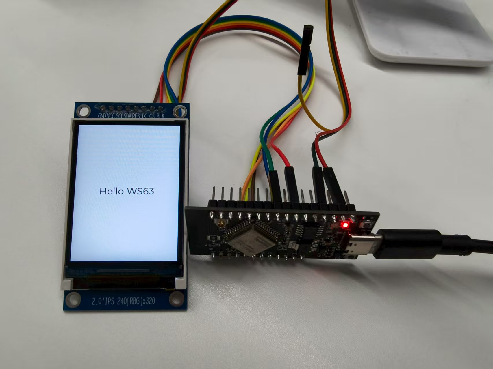
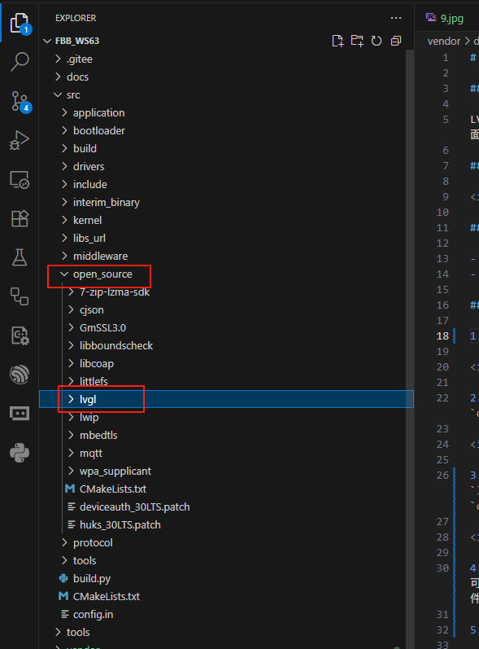
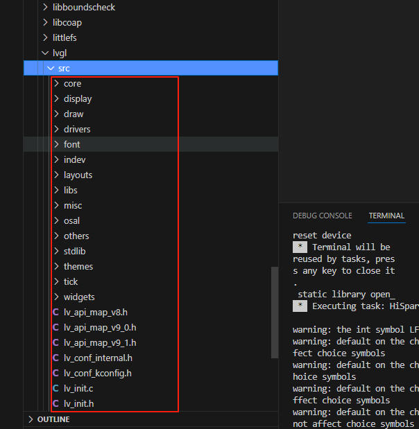
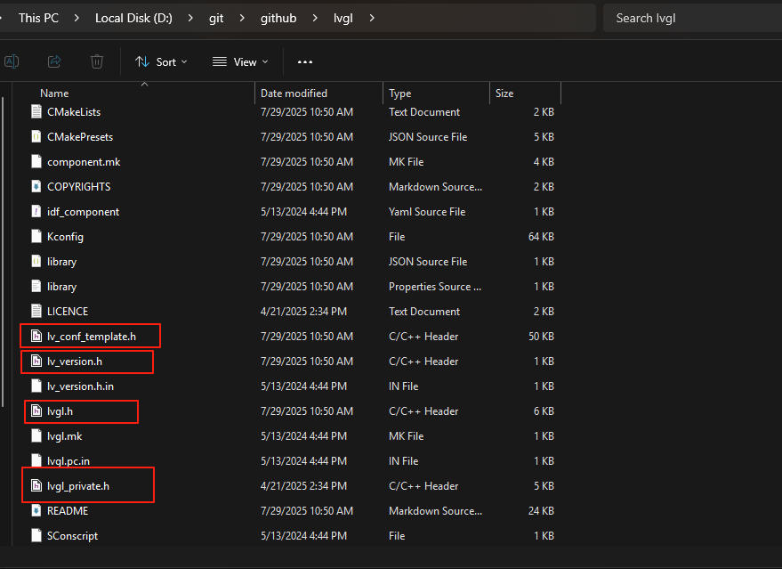
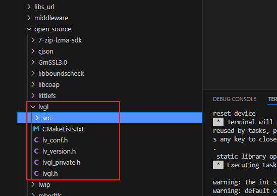
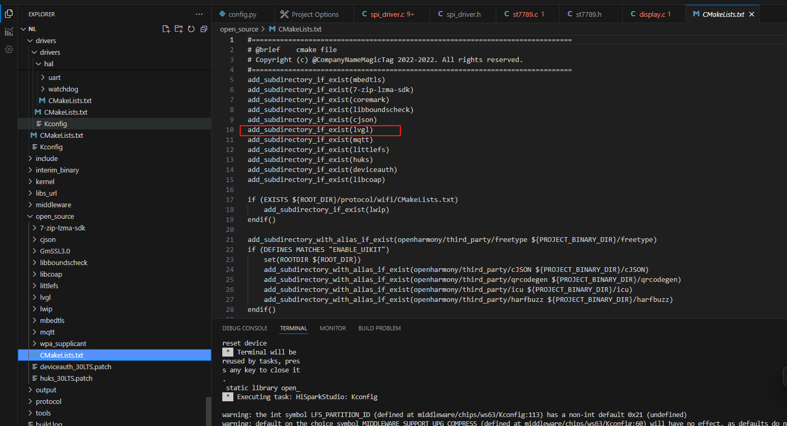
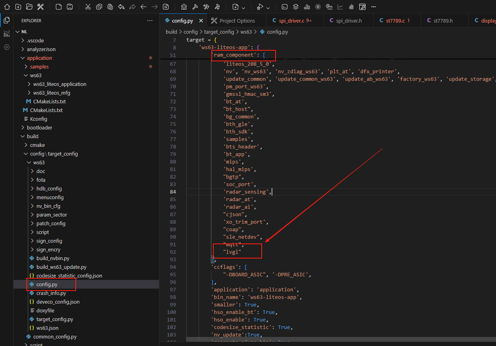
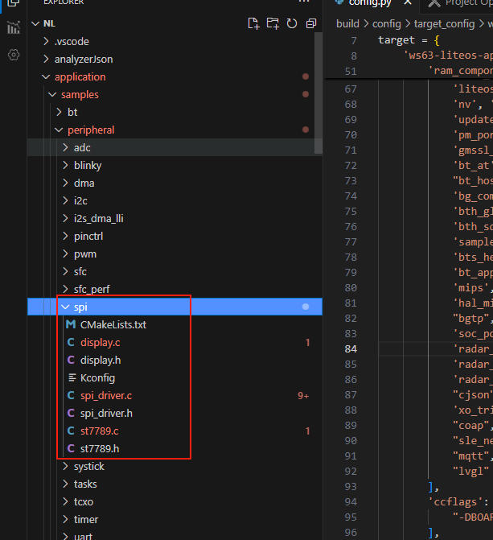
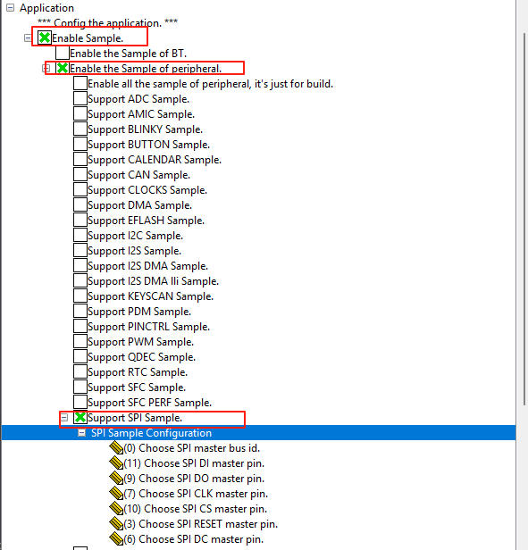
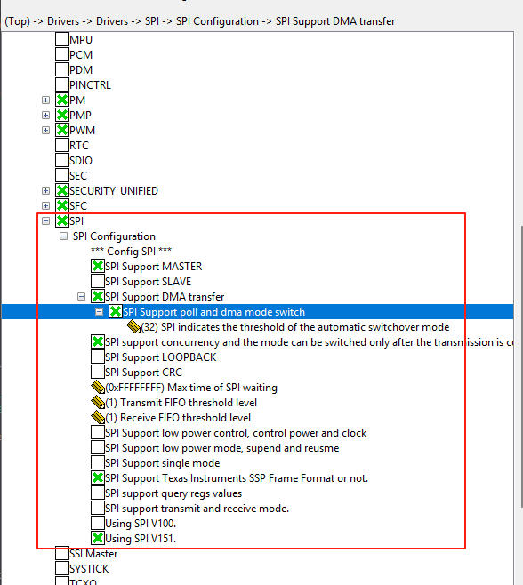

# LVGL 9.3 移植适配

## 案例目的

LVGL作为一个流行的图形库，提供了丰富的UI组件和功能，适用于嵌入式系统的图形界面开发。本案例旨在帮助开发者了解如何在ws63开发板上移植LVGL 9.3版本。

## 效果展示

## 硬件资料

- WS63E开发板
- 2.0英寸 IPS 液晶屏，分辨率240*320，IC为ST7789V2

## 移植步骤

1. 在SDK的`open_source`新建文件夹`lvgl`。

2. 下载LVGL源码，切换到9.3.0 release分支，把`src`文件夹复制到SDK的`open_source`的`lvgl`目录下。

3. 在LVGL源码根目录找到四个头文件`lvgl.h`，`lv_version.h`，`lvgl_private.h`，`lv_conf_template.h`，把这四个文件复制到`open_source\lvgl`目录下。

4. 上一步的`lv_conf_template.h`是配置文件，正确操作是改名为`lv_conf.h`后可以打开后根据LVGL官方手册进行配置，本例程已经提供一个配置好的`lv_conf.h`文件，所以直接复制到SDK的`open_source`的`lvgl`目录下即可，同时把本例程的编译文件`CMakeList.txt`也复制到该目录下，最终效果如图。

5. 在`open_source`目录下找到`CMakeList.txt`文件，把lvgl文件夹加进去。

6. 根据官方的三方库移植手册，在`build/config/target_config/ws63/config.py`文件中，找到`ram_component`,添加`lvgl`名称，以便构建脚本进行搜索。

7. 将`src\application\samples\peripheral\spi`文件夹删除，本例程下的`spi`文件夹整个复制过去替换原有位置。

8. 启动Menuconfig，启用samples、外设、spi三个选项，具体配置看图。

9. 启动Menuconfig，启用drivers、spi选项，具体配置看图。

10. 编译烧录即可运行，接线可以参考Kconfig里面的定义。

