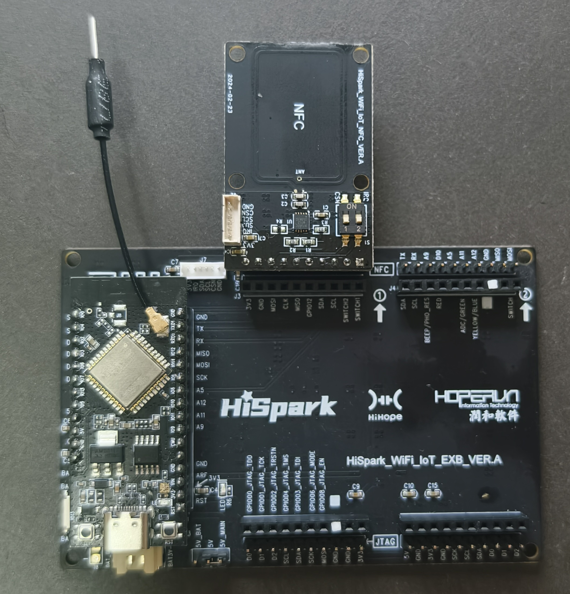
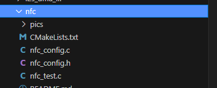
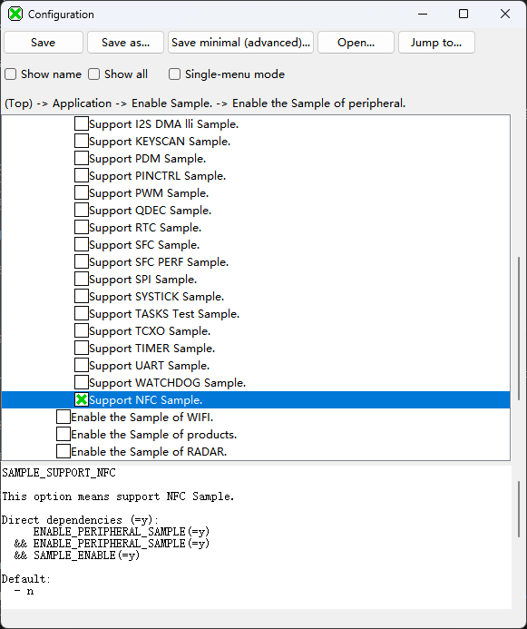
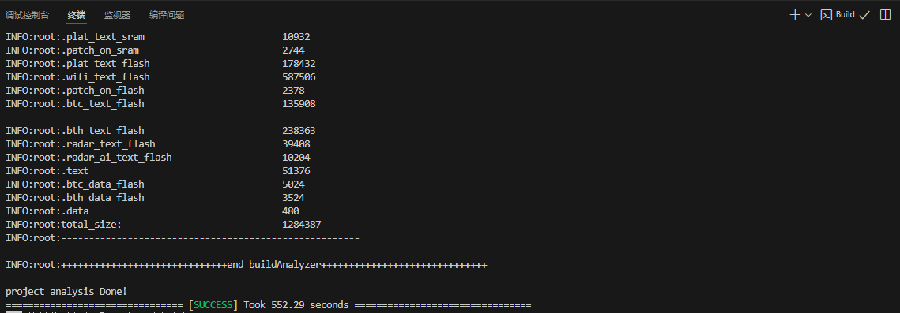
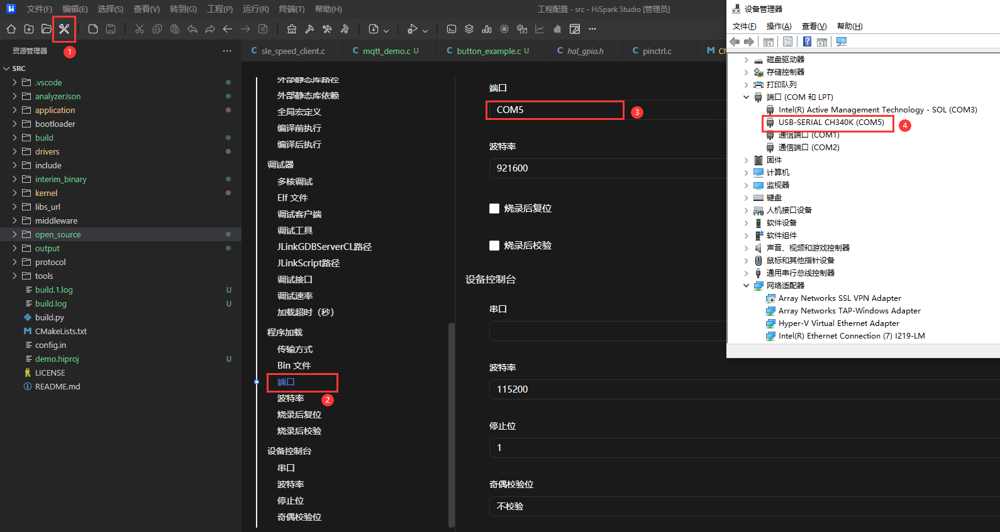
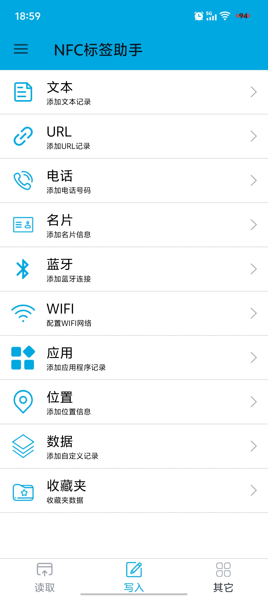

# NFC

## 1.1 介绍

**功能介绍：** 读写NFC板实现NFC Type 4 Tag 的相关信息功能。本程序移植自[梁开祝的hi3861版本](https://gitee.com/liangkzgitee/Hi3861/tree/master/src/vendor/hihope/hispark_pegasus/demo/29_nfc_demo/nfc_nt082c)。

**软件概述：** NFC 是 Near Field Communication 的缩写，中文译为近场通信，也被称作近距离无线通信。它是一种短距离的高频无线通信技术，允许电子设备之间在相距几厘米的范围内进行非接触式点对点数据传输与交换。

**硬件概述：** 核心板、NFC板。通过板端丝印可以看出NFC的I2C的两个管脚对应的是UART1_RX和UART1_TX，而CSN对应的是GPIO09，而IRQ对应的是GPIO07。硬件搭建要求如图所示：

  参考资料：
  * [核心板原理图](../../doc/hardware/HIHOPE_NEARLINK_DK_3863E_V03.pdf)、[NFC板原理图](https://gitee.com/HiSpark/hi3861_hdu_iot_application/blob/master/src/vendor/hihope/hispark_pegasus/docs/HiSpark_WiFi_IoT%E6%99%BA%E8%83%BD%E5%BC%80%E5%8F%91%E5%A5%97%E4%BB%B6_%E5%8E%9F%E7%90%86%E5%9B%BE%E7%A1%AC%E4%BB%B6%E8%B5%84%E6%96%99.rar)、[底板原理图](../../doc/hardware/HiSpark_WiFi_IoT_EXB_VER.A.pdf)

  * [星闪WS63开发板IO管脚查找指南](https://blog.csdn.net/bit_mike/article/details/149500820?spm=1011.2415.3001.5331)

  

## 1.2 约束与限制

### 1.2.1 支持应用运行的芯片和开发板

  本示例支持开发板：HiHope_NearLink_DK3863E_V03。NFC板必须是星闪派套件或者开源大师兄开发板中包括的NFC板，不支持hi3861智能家居套件中的NFC板，两者外观相同，但是所使用的复旦微的NFC芯片不同。

  
### 1.2.2 支持API版本、SDK版本

  本示例支持版本号：1.10.101及以上

### 1.2.3 支持IDE版本

  本示例支持IDE版本号：1.0.0.6及以上；

## 1.3 效果预览

  * 程序启动后会向NFC芯片中写入NDEF数据，使用支持NFC功能的安卓手机靠近NFC芯片会自动启动相关的应用程序。
  * 在支持NFC功能的手机上运行NFC测试程序（如“NFC标签助手”）写入数据到NFC芯片，程序会接收到相应的数据并打印在串口。

## 1.4 接口介绍

### 1.4.1 uapi_i2c_master_read()


| **定义：**   | errcode_t uapi_i2c_master_read(i2c_bus_t bus, uint16_t dev_addr, i2c_data_t *data);                                                                                      |
| ------------ | ------------------------------------------------------------------------------------------------------------------------------------------------------------------------ |
| **功能：**   | 主机接收来自目标I2C从机的数据，有两种方式，一种是手动切换方式，另外一种是自动切换模式，两种方式静态配置，手动切换方式一共有以下三种传输模式，但是不能在同一bus中同时使用 |
| **参数：**   | bus:I2C总线<br/>dev_addr：主机接收数据的目标从机地址  <br/>data:接收数据的数据指针                                                                                       |
| **返回值：** | ERRCODE_SUCC：成功    Other：失败                                                                                                                                        |
| **依赖：**   | include\driver\i2c.h                                                                                                                                                     |

### 1.4.2 uapi_i2c_master_write()


| 定义：       | errcode_t uapi_i2c_master_write(i2c_bus_t bus, uint16_t dev_addr, i2c_data_t *data);                                                                              |
| ------------ | ----------------------------------------------------------------------------------------------------------------------------------------------------------------- |
| **功能：**   | 将数据从主机写入到从机，有两种方式，一种是手动切换方式，另外一种是自动切换模式，两种方式静态配置，手动切换方式一共有以下三种传输模式，但是不能在同一bus中同时使用 |
| **参数：**   | bus:I2C总线<br/>dev_addr：主机接收数据的目标从机地址  <br/>data:发送数据的数据指针                                                                                |
| **返回值：** | ERRCODE_SUCC：成功    Other：失败                                                                                                                                 |
| **依赖：**   | include\driver\i2c.h                                                                                                                                              |

### 1.4.3 uapi_i2c_master_init()


| **定义：**   | errcode_t uapi_i2c_master_init(i2c_bus_t bus, uint32_t baudrate, uint8_t hscode);                                                         |
| ------------ | ----------------------------------------------------------------------------------------------------------------------------------------- |
| **功能：**   | 根据指定的参数初始化该i2c为主机                                                                                                           |
| **参数：**   | bus：I2C总线<br/>baudrate：i2c波特率  <br/>hscode：i2c高速模式主机码，每个主机有自己唯一的主机码，有效取值范围0~7，仅在高速模式下需要配置 |
| **返回值：** | ERRCODE_SUCC：成功    Other：失败                                                                                                         |
| **依赖：**   | include\driver\i2c.h                                                                                                                      |

### 1.4.4 uapi_pin_set_mode()


| **定义：**   | errcode_t uapi_pin_set_mode(pin_t pin, pin_mode_t mode); |
| ------------ | -------------------------------------------------------- |
| **功能：**   | 设置引脚复用模式                                         |
| **参数：**   | pin：io<br/>mode：复用模式                               |
| **返回值：** | ERRCODE_SUCC：成功    Other：失败                        |
| **依赖：**   | include\driver\pinctrl.h                                 |

##  1.5 具体实现

  步骤一：初始化NFC芯片，配置NDEF数据;

  步骤二：持续读取 NFC 设备的 RF（射频）数据，直到检测到 NFC 标签的写入操作。

  步骤三：当检测到 NFC 标签的写入操作时，读取 NFC 标签中的数据。

## 1.6 实验流程

- 步骤一：在xxx\src\application\samples\peripheral文件夹新建一个Sample文件夹，在peripheral上右键选择“新建文件夹”，创建Sample文件夹，例如名称”NFC“。

  

- 步骤二：将xxx\developers\demo\nfc文件里面内容拷贝到**步骤一创建的Sample文件夹中”NFC“**。

  

* 步骤三：在xxx\src\application\samples\peripheral\CMakeLists.txt文件中新增编译案例，具体如下图所示（如果不知道在哪个地方加的，可以在“set(SOURCES "${SOURCES}" PARENT_SCOPE)”上面一行添加）。

```
if(DEFINED CONFIG_SAMPLE_SUPPORT_NFC)
    add_subdirectory_if_exist(nfc)
endif()
```

* 步骤四：在xxx\src\application\samples\peripheral\Kconfig文件中新增编译案例，具体如下图所示（如果不知道在哪个地方加，可以在最后一行添加）。

```
config SAMPLE_SUPPORT_NFC
    bool
    prompt "Support NFC Sample."
    default n
    depends on ENABLE_PERIPHERAL_SAMPLE
    help
        This option means support NFC Sample.
```

- 步骤五：点击如下图标，选择”**系统配置**“，具体选择路径“Application/Enable the Sample of peripheral”，在弹出框中选择“support NFC Sample”，点击Save，关闭弹窗。

  <br>
  <br>
  <br>

- 步骤六：点击“build”或者“rebuild”编译

  

- 步骤七：编译完成如下图所示。
  
  

- 步骤八：在HiSpark Studio工具中点击“工程配置”按钮，选择“程序加载”，传输方式选择“serial”，端口选择“comxxx”，com口在设备管理器中查看（如果找不到com口，请参考Windows环境搭建）。

  
  
- 步骤九：配置完成后，点击工具“程序加载”按钮烧录。

  

- 步骤十：出现“Connecting, please reset device...”字样时，复位开发板，等待烧录结束。

  

* 步骤十一：烧录完成后，使用支持NFC功能的安卓手机靠近NFC芯片会自动启动相关的应用程序。当前程序默认启动的是微信。如果想启动其他应用程序，可以修改nfc_config.c文件中的ndef_file数组。本示例中还提供了华为主页和淘宝的相关数据作为示例。

* 步骤十二：在支持NFC功能的手机上运行NFC测试程序（如“NFC标签助手”）写入数据到NFC芯片，程序会接收到相应的数据并打印在串口。
  
    
  